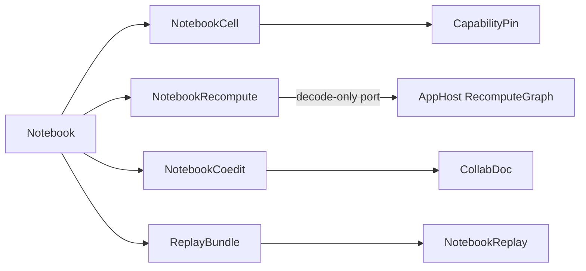

# [APPUI_NOTEBOOK_DOCUMENT]

The notebook rail is the reproducible computational-document model: `NotebookCell` is the closed cell-kind union (code, markdown, chart, render, viewpoint, parameter) each carrying a pinned capability fingerprint, recompute COMPOSES the AppHost `RecomputeGraph` through the declared port — the notebook keeps only the document-local projection (cell-id to node-id map, UI dirty overlay) and owns NO topo/dirty/recompute engine of its own, `NotebookCoedit` projects the cell sequence onto the one `Collab/sync.md` `CollabDoc` merge authority for live co-editing with durable truth on the `[V2]` edit-intent stream, and `ReplayBundle` exports the notebook plus its pinned capabilities and inputs as a portable replay artifact. The page owns the cell union with its pinned-capability fingerprint, the recompute projection, the co-edit projection over the shared CRDT document, and the export-to-replay bundle; the substrate is the Compute capability registry and receipt determinism for pinned cells, AvaloniaEdit for code cells, the chart and render owners for output cells, the `Collab/sync.md` `CollabDoc` for co-editing, the `Collab/sync.md` edit-intent stream over the Persistence `Version/ledger` for durability, and the AppHost clock and HLC for ordering. Replay reproduces a notebook bit-identically because every cell pins the capability and inputs it ran against.

## [01]-[INDEX]

- [02]-[CELL_MODEL]: Closed cell-kind union; pinned capability fingerprint per cell.
- [03]-[RECOMPUTE_PROJECTION]: The AppHost `RecomputeGraph` composed per-cell; the document-local map and dirty overlay.
- [04]-[CRDT_COEDIT]: Cell-sequence projection over the one `CollabDoc` merge authority.
- [05]-[REPLAY_BUNDLE]: Export-to-replay artifact with pinned capabilities and inputs.

## [02]-[CELL_MODEL]

- Owner: `CapabilityPin` the pinned-capability fingerprint; `NotebookCell` `[Union]` the cell-kind family; `CellOutput` `[Union]` the materialized output; `Notebook` the cell sequence.
- Cases: `NotebookCell` = Code | Markdown | Chart | Render | Viewpoint | Parameter | Evidence under the locked kind literals; `CellOutput` = Receipt | Rows | Image | Timeline | Empty under the locked kind literals — every output case has a producing cell arm, and the `Timeline` producer is the `Evidence` cell querying the diagnostics evidence join over the correlation the notebook already carries.
- Entry: `public Fin<CellOutput> Evaluate(NotebookRuntime runtime, HashMap<string, CellOutput> upstream)` — `Fin` aborts on an unpinned capability or a missing upstream output; a code cell runs through the Compute dispatch under its pin; an evidence cell runs the runtime `Timeline` delegate against the `Diagnostics/evidence.md#EVIDENCE_JOIN` correlation surface.
- Auto: every code and chart cell carries a `CapabilityPin` composing the AppHost `DeterminismContext`/`EnvFingerprint` as its environment identity plus the Compute capability key and the model-or-kernel checksum — so a cell records exactly the determinism context (seed, float mode, host fingerprint) and the capability version it ran against, and a re-run under a drifted environment or capability is a detectable mismatch through `DeterminismKernel.Reproduces`, never a notebook-local checksum tuple and never a silent re-result; the notebook reproducibility-proof is one owner with the runtime determinism kernel — the pin's environment identity is the `EnvFingerprint.Digest` and a notebook-local environment hash is the deleted form; markdown cells project through the typography `MarkdownProjection` so a documentation cell rides the one markdown vocabulary; chart and render cells bind their output to the chart and visual owners so a notebook output cell mints no second chart; parameter cells expose a typed binding the downstream cells read so a notebook is a live parameterized document; evidence cells bind the runtime `Timeline` delegate to the diagnostics evidence-join correlation query, so the `CellOutput.Timeline` case has exactly one producer and the notebook documents its own diagnostic story without a second evidence surface.
- Packages: Thinktecture.Runtime.Extensions, LanguageExt.Core, NodaTime, Rasm.Compute (project), Rasm.AppHost (project)
- Growth: a new cell kind is one `NotebookCell` case; a new output kind is one `CellOutput` case; a new pin field is one `CapabilityPin` member; zero new surface.
- Boundary: the capability pin is the reproducibility law — a code or chart cell with no pin faults at evaluate so an unpinned cell can never enter the document, and the pin composes the `Rasm.AppHost/Runtime/determinism.md#DETERMINISM_KERNEL` `DeterminismContext`/`EnvFingerprint` as its environment identity plus the Compute model-or-kernel checksum, so the notebook reproducibility rides the settled runtime determinism kernel rather than a notebook-local hash — the `CapabilityPin.Matches` composes `DeterminismKernel.Reproduces` so a re-run under a divergent environment is detected before it produces a wrong result, and a parallel notebook-local checksum tuple is the rejected form; markdown cells route to the typography projection and chart/render cells to the chart and visual owners so the notebook composes existing output owners and a notebook-local renderer is the deleted form; code cells edit through the AvaloniaEdit `CodePane` so the notebook mints no second editor; the cell output is the typed `CellOutput` union and a stringly-typed output blob is the rejected form.

```csharp signature
public readonly record struct CapabilityPin(
    string Capability,
    string Checksum,
    string Substrate,
    Rasm.AppHost.Determinism.DeterminismContext Context) {
    public long Seed => unchecked((long)Context.Seed);

    // Emptiness law: a default-constructed pin on a pin-bearing cell IS the unpinned state the export gate rejects.
    public bool IsPinned => Capability is { Length: > 0 } && Checksum is { Length: > 0 };

    public bool Matches(CapabilityPin other) =>
        Capability == other.Capability
        && Checksum == other.Checksum
        && Substrate == other.Substrate
        && Rasm.AppHost.Determinism.DeterminismKernel.Reproduces(Context, other.Context);
}

[Union(ConversionFromValue = ConversionOperatorsGeneration.None)]
public abstract partial record CellOutput {
    private CellOutput() { }
    public sealed record Receipt(ComputeReceipt Value) : CellOutput;
    public sealed record Rows(Seq<JsonElement> Values) : CellOutput;
    public sealed record Image(RenderReceipt Render) : CellOutput;
    public sealed record Timeline(EvidenceTimeline Value) : CellOutput;
    public sealed record Empty : CellOutput;
}

[Union(ConversionFromValue = ConversionOperatorsGeneration.None)]
public abstract partial record NotebookCell {
    private NotebookCell() { }
    public sealed record Code(string Id, string Source, CapabilityPin Pin, Seq<string> Inputs, Func<NotebookRuntime, HashMap<string, CellOutput>, IO<CellOutput>> Run) : NotebookCell;
    public sealed record Markdown(string Id, string Source) : NotebookCell;
    public sealed record Chart(string Id, ChartSeriesSpec Spec, ChartPolicy Policy, CapabilityPin Pin, Seq<string> Inputs) : NotebookCell;
    public sealed record Render(string Id, CustomVisual Kind, CapabilityPin Pin, Seq<string> Inputs) : NotebookCell;
    public sealed record Viewpoint(string Id, AppUi.Viewport.Viewpoint View) : NotebookCell;
    public sealed record Parameter(string Id, string Key, JsonElement Value) : NotebookCell;
    public sealed record Evidence(string Id, string Query, Seq<string> Inputs) : NotebookCell;

    public string Id => Switch(
        code: static c => c.Id, markdown: static m => m.Id, chart: static c => c.Id, render: static r => r.Id,
        viewpoint: static v => v.Id, parameter: static p => p.Id, evidence: static e => e.Id);

    public string Kind => Switch(
        code: static _ => "code", markdown: static _ => "markdown", chart: static _ => "chart", render: static _ => "render",
        viewpoint: static _ => "viewpoint", parameter: static _ => "parameter", evidence: static _ => "evidence");

    public Option<string> Source => Switch(
        code: static c => Some(c.Source), markdown: static m => Some(m.Source), chart: static _ => Option<string>.None,
        render: static _ => Option<string>.None, viewpoint: static _ => Option<string>.None,
        parameter: static _ => Option<string>.None, evidence: static _ => Option<string>.None);

    public Seq<string> Inputs => Switch(
        code: static c => c.Inputs, markdown: static _ => Seq<string>(), chart: static c => c.Inputs, render: static r => r.Inputs,
        viewpoint: static _ => Seq<string>(), parameter: static _ => Seq<string>(), evidence: static e => e.Inputs);

    public Option<CapabilityPin> Pin => Switch(
        code: static c => Some(c.Pin), markdown: static _ => Option<CapabilityPin>.None, chart: static c => Some(c.Pin),
        render: static r => Some(r.Pin), viewpoint: static _ => Option<CapabilityPin>.None,
        parameter: static _ => Option<CapabilityPin>.None, evidence: static _ => Option<CapabilityPin>.None);

    public IO<CellOutput> Evaluate(NotebookRuntime runtime, HashMap<string, CellOutput> upstream) => Switch(
        state: (Runtime: runtime, Upstream: upstream),
        code: static (ctx, c) => ctx.Runtime.Verify(c.Pin) ? c.Run(ctx.Runtime, ctx.Upstream) : IO.fail<CellOutput>(new NotebookFault.CapabilityDrift(c.Id)),
        markdown: static (_, _) => IO.pure<CellOutput>(new CellOutput.Empty()),
        chart: static (ctx, c) => ctx.Runtime.Verify(c.Pin) ? ctx.Runtime.Chart(c.Spec, c.Policy, ctx.Upstream) : IO.fail<CellOutput>(new NotebookFault.CapabilityDrift(c.Id)),
        render: static (ctx, r) => ctx.Runtime.Verify(r.Pin) ? ctx.Runtime.Render(r.Kind, ctx.Upstream) : IO.fail<CellOutput>(new NotebookFault.CapabilityDrift(r.Id)),
        viewpoint: static (_, _) => IO.pure<CellOutput>(new CellOutput.Empty()),
        parameter: static (_, p) => IO.pure<CellOutput>(new CellOutput.Rows(Seq(p.Value))),
        evidence: static (ctx, e) => ctx.Runtime.Timeline(e.Query, ctx.Upstream));
}

public sealed record NotebookRuntime(
    Func<CapabilityPin, bool> VerifyPin,
    Func<ChartSeriesSpec, ChartPolicy, HashMap<string, CellOutput>, IO<CellOutput>> Chart,
    Func<CustomVisual, HashMap<string, CellOutput>, IO<CellOutput>> Render,
    Func<string, HashMap<string, CellOutput>, IO<CellOutput>> Timeline,
    ClockPolicy Clocks,
    CorrelationId Correlation) {
    public bool Verify(CapabilityPin pin) => VerifyPin(pin);
}

public sealed record Notebook(string Key, int Version, Seq<NotebookCell> Cells);

[Union]
public abstract partial record NotebookFault : Expected, IValidationError<NotebookFault> {
    private NotebookFault(string detail, int code) : base(detail, code, None) { }

    public static NotebookFault Create(string message) => new Text(message);

    public sealed record Text : NotebookFault { public Text(string detail) : base(detail, AppUiFaultBand.Notebook.Code(0)) { } }
    public sealed record CapabilityDrift : NotebookFault { public CapabilityDrift(string detail) : base(detail, AppUiFaultBand.Notebook.Code(1)) { } }
    public sealed record MissingUpstream : NotebookFault { public MissingUpstream(string detail) : base(detail, AppUiFaultBand.Notebook.Code(2)) { } }
    public sealed record CycleDetected : NotebookFault { public CycleDetected(string detail) : base(detail, AppUiFaultBand.Notebook.Code(3)) { } }
}
```

## [03]-[RECOMPUTE_PROJECTION]

- Owner: `CellNodeMap` — the document-local cell-id to node-identity map; `DirtyOverlay` — the UI dirty-state overlay; `NotebookRecompute` — the per-cell composition of the AppHost `RecomputeGraph`.
- Entry: `public IO<Fin<HashMap<string, CellOutput>>> Recompute(Notebook notebook, NotebookRuntime runtime, string changed, HashMap<string, CellOutput> cache)` — supplies per-cell descriptors and inputs to the AppHost `RecomputeGraph` port (caller-keyed, granularity-neutral; its `determinism.md` clause names the AppUi notebook's per-cell composition), receives the affected order and dirty closure back as decoded vocabulary, and evaluates exactly the affected cells through `NotebookCell.Evaluate`.
- Auto: the local topo/dirty/recompute ENGINE IS DELETED with no survival branch — `RecomputeGraph` is caller-keyed and granularity-neutral, the consumer supplies its own descriptor and inputs, so per-cell recompute demands nothing the vocabulary lacks; the notebook keeps ONLY the document-local projection: `CellNodeMap` maps cell-id to the content-address node identity (a cell's node is its command plus its upstream node hashes, exactly as the runtime graph keys it), and `DirtyOverlay` renders the dirty closure the graph reports as the UI cell-state badges; dependency edges remain declared cell `Inputs` — document data, never inferred from source parsing; a cycle faults through the graph's own admission as `NotebookFault.CycleDetected`.
- Packages: Rasm.AppHost (project), Thinktecture.Runtime.Extensions, LanguageExt.Core
- Growth: a new propagation concern is a `RecomputeGraph` vocabulary row consumed here; zero new surface, zero local engine.
- Boundary: the AppHost `RecomputeGraph` is the ONE incremental-recompute owner — a second topo sort, dirty walk, or recompute scheduler here is the deleted form; the port is decode-only: the notebook supplies descriptors and reads the affected order, never re-implementing the algebra; the `Editing/graph.md` dependency read projection consumes the SAME vocabulary, one owner across the runtime and both documents.

```csharp signature
public sealed record CellNodeMap(HashMap<string, Rasm.AppHost.Determinism.ChainHash> Nodes) {
    public static CellNodeMap Of(Notebook notebook, Func<NotebookCell, Seq<Rasm.AppHost.Determinism.ChainHash>, Rasm.AppHost.Determinism.ChainHash> nodeId) =>
        notebook.Cells.Fold(new CellNodeMap(HashMap<string, Rasm.AppHost.Determinism.ChainHash>()), (map, cell) =>
            map with { Nodes = map.Nodes.AddOrUpdate(cell.Id, nodeId(cell, cell.Inputs.Bind(input => map.Nodes.Find(input).ToSeq()))) });
}

public readonly record struct DirtyOverlay(LanguageExt.HashSet<string> DirtyCells) {
    public bool IsDirty(string cellId) => DirtyCells.Contains(cellId);
}

public sealed record NotebookRecompute(
    Func<Notebook, string, IO<Fin<Seq<string>>>> AffectedOrder) { // composition-bound: the AppHost RecomputeGraph port, decode-only

    public IO<Fin<HashMap<string, CellOutput>>> Recompute(Notebook notebook, NotebookRuntime runtime, string changed, HashMap<string, CellOutput> cache) =>
        AffectedOrder(notebook, changed).Bind(order => order.Match(
            Succ: affected => Evaluate(notebook, runtime, affected, cache),
            Fail: error => IO.pure(Fin.Fail<HashMap<string, CellOutput>>(error))));

    static IO<Fin<HashMap<string, CellOutput>>> Evaluate(Notebook notebook, NotebookRuntime runtime, Seq<string> order, HashMap<string, CellOutput> cache) =>
        IO.lift(() => order.Fold(
            Fin.Succ(cache),
            (rail, id) => rail.Bind(state => notebook.Cells.Find(cell => cell.Id == id)
                .Map(cell => Gather(cell, state).Bind(upstream => cell.Evaluate(runtime, upstream).Run().Map(output => state.AddOrUpdate(id, output))))
                .IfNone(() => Fin.Fail<HashMap<string, CellOutput>>(new NotebookFault.MissingUpstream(id))))));

    static Fin<HashMap<string, CellOutput>> Gather(NotebookCell cell, HashMap<string, CellOutput> state) =>
        cell.Inputs.Fold(
            Fin.Succ(HashMap<string, CellOutput>()),
            (rail, input) => rail.Bind(acc => state.Find(input).Match(
                Some: output => Fin.Succ(acc.Add(input, output)),
                None: () => Fin.Fail<HashMap<string, CellOutput>>(new NotebookFault.MissingUpstream($"{cell.Id}<-{input}")))));
}
```

## [04]-[CRDT_COEDIT]

- Owner: `NotebookCoedit` the notebook projection over the one `Collab/sync.md#DOCUMENT_OWNER` `CollabDoc` merge authority.
- Entry: `public Fin<NotebookCoedit> Open(CollabDoc document)` — attaches the notebook's `movable-list` cell-sequence container and per-cell `map` containers on the one document; `public Fin<LoroMap> Insert(int index, NotebookCell cell)` — materializes the cell's `Id`, `Kind`, and columns on the per-cell map and attaches the per-cell `text` container for source-bearing kinds; `Move(int from, int to)` — `LoroMovableList.Mov` identity-preserving reorder; `Delete(string cellId)` — resolves the stable cell id to its live position before the list `Delete`, so a concurrently moved cell deletes correctly; `Retext(string cellId, string source)` — `LoroText.Update` whole-source diff onto the cell's `text` container, character-granular under concurrent edits.
- Auto: the notebook holds NO replicated-op vocabulary, no last-writer-wins register, no fractional-index math, and no tombstone set — the `CollabDoc` IS the merge authority: the cell sequence is a `movable-list` container whose `Mov(from, to)` reorders by stable id without delete+insert losing identity (the textbook collaborative cell-reorder), a cell insert is `Insert*Container` at the index, a cell delete is the list `Delete` (the engine's tombstone is internal), and a code/markdown cell's `Source` is a `text` container per cell whose concurrent edits the engine's eg-walker text CRDT resolves character-granular rather than whole-cell last-writer-wins; convergence is the `CollabDoc` law so two replicas that have imported the same op-log deltas hold the same notebook; the materialized `Notebook` reads the live container state through `GetDeepValue` projected onto the typed cell union.
- Packages: LoroCs, Thinktecture.Runtime.Extensions, LanguageExt.Core, NodaTime, Rasm.Persistence (project)
- Growth: a new co-edited notebook concern is one container attach on the existing document, never a new replicated-op case; zero new surface.
- Boundary: co-editing rides the one `Collab/sync.md` `CollabDoc` owner — the bespoke `NotebookCrdt`/`NotebookOp` last-writer-wins-plus-fractional-index-plus-tombstone algebra is DROPPED root-up, so the notebook composes the document's `LiveWire` (local-delta broadcast / remote-delta import, session-ephemeral) and holds no merge logic; DURABLE truth is the `Collab/sync.md#DURABLE_INTENT` typed edit-intent stream — a committed cell insert/edit/move/delete projects its `EditIntent` row onto the Persistence `Version/ledger`, character-granular text runs ride the gated `TextRun` arm, and a Loro byte crossing durable truth is the deleted form; the cell reorder is `LoroMovableList.Mov` so a reorder preserves cell identity and a delete+reinsert that loses identity is the rejected form; a code cell's `Source` is a per-cell `text` container so concurrent same-cell edits resolve character-granular through the engine in the LIVE session rather than a whole-cell last-writer-wins that drops one author's keystrokes; the presence carets ride the document's `Collab/sync.md#PRESENCE` ephemeral channel, never durable truth; the determinism-replay reproducibility (`[05]-[REPLAY_BUNDLE]`) is a distinct concern composing the AppHost determinism kernel and is never folded into the document time-travel.

```csharp signature
public sealed record NotebookCoedit(CollabDoc Document, LoroMovableList Cells) {
    public const string CellsContainer = "notebook.cells";
    const string SourceContainer = "source";

    public static Fin<NotebookCoedit> Open(CollabDoc document) =>
        document.Attach(CollabContainer.MovableList, CellsContainer)
            .Bind(handle => handle.Container is LoroMovableList cells
                ? Fin.Succ(new NotebookCoedit(document, cells))
                : Fin.Fail<NotebookCoedit>(new CollabFault.Detached(CellsContainer)));

    // Typed insert: the stable id and kind literal land as map columns, and source-bearing kinds attach the
    // per-cell text container seeded through the whole-source diff Update so history starts converged.
    public Fin<LoroMap> Insert(int index, NotebookCell cell) =>
        CollabDoc.Lift(() => Cells.InsertMapContainer((uint)index, new LoroMap()))
            .Map(map => {
                map.Insert("id", LoroVal.Of(cell.Id));
                map.Insert("kind", LoroVal.Of(cell.Kind));
                cell.Source.Iter(source => map.GetOrCreateTextContainer(SourceContainer, new LoroText()).Update(source, new UpdateOptions()));
                return map;
            });

    public Fin<Unit> Move(int from, int to) =>
        CollabDoc.Lift(() => { Cells.Mov((uint)from, (uint)to); return unit; });

    // Identity-addressed delete: the stable id resolves to its LIVE position first, so a cell a peer moved
    // concurrently deletes at its current index — an index-only delete contract is the rejected form.
    public Fin<Unit> Delete(string cellId) =>
        Locate(cellId).ToFin(new CollabFault.Detached(cellId))
            .Bind(found => CollabDoc.Lift(() => { Cells.Delete(found.Index, 1); return unit; }));

    // Character-granular retext: Update diffs the whole source against the cell's text container so a remote
    // caret and concurrent keystrokes survive; delete-and-reinsert whole-cell LWW is the rejected form.
    public Fin<Unit> Retext(string cellId, string source) =>
        Locate(cellId).ToFin(new CollabFault.Detached(cellId))
            .Bind(found => CollabDoc.Lift(() => {
                found.Map.GetOrCreateTextContainer(SourceContainer, new LoroText()).Update(source, new UpdateOptions());
                return unit;
            }));

    // Id-to-position resolution reads the live container state — never a local index mirror that drifts
    // under remote inserts; the per-index Get hands back the live per-cell map handle.
    Option<(uint Index, LoroMap Map)> Locate(string cellId) =>
        toSeq(Enumerable.Range(0, Cells.ToVec().Length))
            .Choose(index => Optional(Cells.Get((uint)index)?.AsContainer() as LoroMap)
                .Filter(map => map.Get("id")?.AsValue() is LoroValue.String id && id.Value == cellId)
                .Map(map => ((uint)index, map)))
            .HeadOrNone();
}
```

## [05]-[REPLAY_BUNDLE]

- Owner: `ReplayManifest` the pinned-input-and-capability manifest; `ReplayBundle` the export-to-replay artifact; `NotebookReplay` the bit-identity check.
- Entry: `public static Fin<ReplayBundle> Export(Notebook notebook, DeterminismContext context, HashMap<string, CellOutput> outputs, HashMap<string, ReadOnlyMemory<byte>> blobs, Func<CellOutput, ChainHash> hash, ClockPolicy clocks)` — `Fin` aborts when any pin-bearing cell kind (code, chart, render) carries an unset pin, input count never proxies the gate; the bundle packs the cells, the pinned capabilities, the input blobs, and the recorded output hashes; `public static IO<Fin<Seq<string>>> Verify(ReplayBundle bundle, NotebookRecompute recompute, NotebookRuntime runtime, DeterminismContext live, Func<CellOutput, ChainHash> hash)` — re-runs the notebook under the manifest pins and returns the mismatched cell ids, empty on bit-identity.
- Auto: the manifest records every cell's `CapabilityPin` (carrying the AppHost `DeterminismContext`/`EnvFingerprint` environment identity) and the content hash of every input blob through the kernel `Rasm.Domain` `ContentHash.Of` one-hasher entry (hex encoding stays the boundary projection) so the bundle is self-contained — a replay resolves its capabilities and determinism context from the manifest and its inputs from the packed blobs, never the live environment; `Verify` composes the AppHost `EventLog`/`ChainHash`/`ReplayVerify` content-hash identity rather than a notebook-local `hash(output)` fold — it re-runs the recompute projection under the manifest's pins through the one `Diagnostics/proof.md#HEADLESS_DERIVATION` `ProofEngine.Replay` route and proves each cell's output content hash matches the recorded hash so a reproducibility regression surfaces as a named cell mismatch, the notebook reproducibility receipt riding the existing `ReceiptEnvelopeWire`/`LogEntryWire` rather than a notebook-only wire shape; the bundle is a versioned Persistence artifact so it crosses the blob lane as an opaque payload.
- Receipt: `Verify` seals a render or evidence receipt per re-run cell; a mismatch folds the cell id into the replay-mismatch instrument.
- Packages: Thinktecture.Runtime.Extensions, LanguageExt.Core, Rasm (project), NodaTime, Rasm.Persistence (project), Rasm.AppHost (project)
- Growth: a new manifest field is one `ReplayManifest` member; zero new surface.
- Boundary: the bundle is self-contained — replay resolves capabilities, the determinism context, and inputs from the manifest and packed blobs so a notebook reproduces independent of the live environment, and a replay that reaches the live store is the rejected form; the output identity is the content hash through the kernel `ContentHash.Of` one-hasher entry composed as the AppHost `EventLog`/`ChainHash` content-addressed chain so bit-identity is the verification law and a fuzzy float compare is the deleted form; the bundle crosses the Persistence blob lane as a versioned opaque artifact so the notebook mints no second store; the notebook is a UI projection over the runtime determinism owner — the `Verify` composes `Rasm.AppHost/Runtime/determinism.md#REPLAY_VERIFY` `ReplayVerify.Replay` content-hash identity and the journal-replay determinism rides the diagnostics `ProofEngine.Replay` under virtual time so the replay reproducibility shares the settled deterministic-replay law, and a parallel reproducibility-hash fold or a notebook-local replay engine here is the rejected form; the cell node identity aligns to the `Rasm.AppHost/Runtime/determinism.md#RECOMPUTE_GRAPH` `RecomputeGraph` content-address node identity so the incremental-recompute law is one owner across the runtime and the document — a cell's content-address node identity is its command plus its upstream node hashes exactly as the runtime recompute graph keys it, and a second incremental-recompute owner is the deleted form.

```csharp signature
public readonly record struct ReplayInput(string Key, string ContentHash, long Bytes);

public sealed record ReplayManifest(
    string NotebookKey,
    int Version,
    Rasm.AppHost.Determinism.DeterminismContext Context,
    Seq<CapabilityPin> Pins,
    Seq<ReplayInput> Inputs,
    Seq<(string CellId, Rasm.AppHost.Determinism.ChainHash OutputHash, Seq<string> Inputs)> Outputs,
    Instant At) {
    public Rasm.AppHost.Determinism.RecomputeNode NodeOf(string cellId) =>
        Outputs.Find(row => row.CellId == cellId).Match(
            Some: row => new Rasm.AppHost.Determinism.RecomputeNode(row.OutputHash, cellId, row.Inputs.Bind(input => Outputs.Find(r => r.CellId == input).Map(static r => r.OutputHash).ToSeq())),
            None: () => new Rasm.AppHost.Determinism.RecomputeNode(Rasm.AppHost.Determinism.ChainHash.Genesis, cellId, Seq<Rasm.AppHost.Determinism.ChainHash>()));
}

public sealed record ReplayBundle(ReplayManifest Manifest, Notebook Notebook, HashMap<string, ReadOnlyMemory<byte>> Blobs) {
    public static Fin<ReplayBundle> Export(
        Notebook notebook,
        Rasm.AppHost.Determinism.DeterminismContext context,
        HashMap<string, CellOutput> outputs,
        HashMap<string, ReadOnlyMemory<byte>> blobs,
        Func<CellOutput, Rasm.AppHost.Determinism.ChainHash> hash,
        ClockPolicy clocks) =>
        notebook.Cells.Find(static cell => cell.Pin.Exists(static pin => !pin.IsPinned)) is { IsSome: true, Case: NotebookCell unpinned }
            ? Fin.Fail<ReplayBundle>(new NotebookFault.CapabilityDrift($"{unpinned.Id}: pin-bearing cell kind carries no capability pin"))
            : Fin.Succ(new ReplayBundle(
                new ReplayManifest(
                    notebook.Key, notebook.Version, context,
                    notebook.Cells.Bind(cell => cell.Pin.ToSeq()),
                    toSeq(blobs).Map(entry => new ReplayInput(entry.Key, $"{ContentHash.Of(entry.Value.Span):x32}", entry.Value.Length)),
                    notebook.Cells.Filter(cell => outputs.ContainsKey(cell.Id)).Map(cell => (cell.Id, hash(outputs[cell.Id]), cell.Inputs)),
                    clocks.Now),
                notebook, blobs));
}

public static class NotebookReplay {
    public const string MismatchInstrument = "rasm.appui.notebook.replay-mismatch";

    public static TelemetryContributorPort TelemetryRow(string version) =>
        AppUiTelemetry.Contribute(version, MismatchInstrument);

    public static IO<Fin<Seq<string>>> Verify(
        ReplayBundle bundle,
        NotebookRecompute recompute,
        NotebookRuntime runtime,
        Rasm.AppHost.Determinism.DeterminismContext live,
        Func<CellOutput, Rasm.AppHost.Determinism.ChainHash> hash) =>
        Rasm.AppHost.Determinism.DeterminismKernel.Reproduces(bundle.Manifest.Context, live)
            ? Rerun(bundle, recompute, runtime)
                .Map(result => result.Map(outputs => bundle.Manifest.Outputs
                    .Filter(recorded => toSeq(outputs).Find(actual => actual.Key == recorded.CellId).Map(actual => hash(actual.Value) != recorded.OutputHash).IfNone(true))
                    .Map(static mismatch => mismatch.CellId)))
            : IO.pure(Fin.Fail<Seq<string>>(new NotebookFault.CapabilityDrift(
                $"replay/environment-mismatch:{bundle.Manifest.Context.Fingerprint.Digest}!={live.Fingerprint.Digest}")));

    // Verification seeds from EVERY root cell (no declared inputs), threading the growing output cache
    // through each recompute so the full notebook re-runs regardless of dependency structure — a
    // disconnected branch is covered and an empty notebook verifies vacuously, never throws.
    static IO<Fin<HashMap<string, CellOutput>>> Rerun(ReplayBundle bundle, NotebookRecompute recompute, NotebookRuntime runtime) =>
        bundle.Notebook.Cells.Filter(static cell => cell.Inputs.IsEmpty).Map(static cell => cell.Id)
            .Fold(
                IO.pure(Fin.Succ(HashMap<string, CellOutput>())),
                (rail, root) => rail.Bind(state => state.Match(
                    Succ: cache => recompute.Recompute(bundle.Notebook, runtime, root, cache),
                    Fail: error => IO.pure(Fin.Fail<HashMap<string, CellOutput>>(error)))));
}
```



## [06]-[RESEARCH]

- [COEDIT_HANDLE_ACCESSORS]: the `LoroCs` `ValueOrContainer` extraction spellings the `Locate` fold composes — `AsValue()` is the catalogued leaf accessor (`.api/api-loro.md` result union; the graph co-edit bridge composes it), and the symmetric live-container accessor spelled `AsContainer()` here re-verifies against the UniFFI-generated binding at implementation; the `InsertMapContainer`/`GetOrCreateTextContainer`/`Update(UpdateOptions)`/`Mov`/`Delete`/`ToVec`/`Get` members are catalogued and settled.
- [NOTEBOOK_CAPABILITY]: the Compute capability-registry key and checksum surface the `CapabilityPin` records — the capability identity (kernel/model checksum, substrate, opset) the pin matches against, resolved at implementation against the settled Compute model-lane and intent-selection vocabulary; the cell union, the dependency-graph dirty fold, the CRDT merge, and the replay bundle are settled, the exact capability-registry member shape the `VerifyPin` delegate reads is the unverified surface.
- [NOTEBOOK_DETERMINISM]: the `CapabilityPin` composes the `Rasm.AppHost/Runtime/determinism.md#DETERMINISM_KERNEL` `DeterminismContext`/`EnvFingerprint` and `DeterminismKernel.Reproduces` as its environment identity, the `ReplayManifest`/`NotebookReplay.Verify` composes the `#EVENT_LOG` `ChainHash` content-addressed identity and the `#REPLAY_VERIFY` `ReplayVerify.Replay` per-step proof through the diagnostics `ProofEngine.Replay` route, and the cell node identity aligns to the `#RECOMPUTE_GRAPH` `RecomputeNode` content-address node identity — these AppHost determinism members arrive as settled finalized vocabulary consumed at the package edge, so the notebook reproducibility-proof is one owner with the runtime determinism kernel and the `Rasm.AppHost.Determinism` namespace and exact member spellings resolve against the finalized determinism surface, never re-minted.
