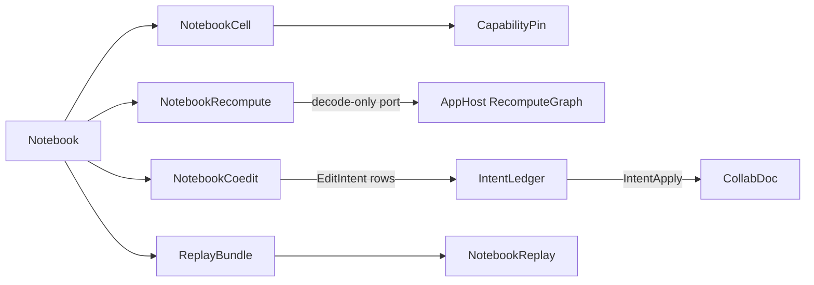

# [APPUI_NOTEBOOK_DOCUMENT]

The notebook rail is the reproducible computational-document model: `NotebookCell` is the closed cell-kind union (code, markdown, chart, render, viewpoint, parameter, evidence) each pin-bearing kind carrying a pinned capability fingerprint and a code cell carrying DATA only — execution resolves from the pin through the runtime `Execute` delegate, never a captured closure — recompute COMPOSES the AppHost `RecomputeGraph` through the declared port — the notebook keeps only the document-local projection (cell-id to node-id map, the derived cell-state overlay) and owns NO topo/dirty/recompute engine of its own, `NotebookCoedit` is the intent LENS whose every verb commits an `EditIntent` row through the one `Collab/sync.md` `IntentLedger.Commit` rail onto the one `IntentApply` register, and `ReplayBundle` exports the notebook plus its pinned capabilities and inputs as a portable replay artifact. The page owns the cell union with its pinned-capability fingerprint, the recompute projection, the co-edit projection over the shared CRDT document, and the export-to-replay bundle; the substrate is the Compute capability registry and receipt determinism for pinned cells, AvaloniaEdit for code cells, the chart and render owners for output cells, the `Collab/sync.md` `CollabDoc` for co-editing, the `Collab/sync.md` edit-intent stream over the Persistence `Version/ledger` for durability, and the AppHost clock and HLC for ordering. Replay reproduces a notebook bit-identically because every cell pins the capability and inputs it ran against.

## [01]-[INDEX]

- [02]-[CELL_MODEL]: Closed cell-kind union; pinned capability fingerprint per cell; error and log outputs materialized in place.
- [03]-[RECOMPUTE_PROJECTION]: The AppHost `RecomputeGraph` composed per-cell; the node map and the derived cell-state overlay.
- [04]-[CRDT_COEDIT]: The intent lens over the one `IntentApply` register through the one commit rail.
- [05]-[REPLAY_BUNDLE]: Export-to-replay artifact with pinned capabilities and inputs.

## [02]-[CELL_MODEL]

- Owner: `CapabilityPin` the pinned-capability fingerprint; `NotebookCell` `[Union]` the cell-kind family; `CellOutput` `[Union]` the materialized output; `Notebook` the cell sequence.
- Cases: `NotebookCell` = Code | Markdown | Chart | Render | Viewpoint | Parameter | Evidence under the locked kind literals; `CellOutput` = Receipt | Rows | Image | Timeline | Log | Error | Empty under the locked kind literals — every output case has a producing cell arm: the `Timeline` producer is the `Evidence` cell querying the diagnostics evidence join over the correlation the notebook already carries, the `Log` producer is a code cell's captured line stream, and the `Error` producer is a failed evaluation materialized AS OUTPUT so a failed cell renders its failure in place instead of vanishing from the document.
- Entry: `public IO<CellOutput> Evaluate(NotebookRuntime runtime, HashMap<string, CellOutput> upstream)` — a code cell is DATA (source, pin, inputs) executed through the runtime `Execute` delegate keyed by its capability pin, so a process-local closure never rides a cell and a persisted notebook reconstructs execution from the pin alone; the rail aborts on an unpinned capability, and an evidence cell runs the runtime `Timeline` delegate against the `Diagnostics/evidence.md#CORRELATION_JOIN` correlation surface.
- Auto: every code and chart cell carries a `CapabilityPin` composing the AppHost `DeterminismContext`/`EnvFingerprint` as its environment identity plus the Compute capability key and the model-or-kernel checksum — so a cell records exactly the determinism context (seed, float mode, host fingerprint) and the capability version it ran against, and a re-run under a drifted environment or capability is a detectable mismatch through `DeterminismKernel.Reproduces`, never a notebook-local checksum tuple and never a silent re-result; the notebook reproducibility-proof is one owner with the runtime determinism kernel — the pin's environment identity is the `EnvFingerprint.Digest` and a notebook-local environment hash is the deleted form; markdown cells project through the typography `MarkdownProjection` so a documentation cell rides the one markdown vocabulary; chart and render cells bind their output to the chart and visual owners so a notebook output cell mints no second chart; parameter cells expose a typed binding the downstream cells read so a notebook is a live parameterized document; evidence cells bind the runtime `Timeline` delegate to the diagnostics evidence-join correlation query, so the `CellOutput.Timeline` case has exactly one producer and the notebook documents its own diagnostic story without a second evidence surface.
- Packages: Thinktecture.Runtime.Extensions, LanguageExt.Core, NodaTime, Rasm.Compute (project), Rasm.AppHost (project)
- Growth: a new cell kind is one `NotebookCell` case; a new output kind is one `CellOutput` case; a new pin field is one `CapabilityPin` member; zero new surface.
- Boundary: the capability pin is the reproducibility law — a code or chart cell with no pin faults at evaluate so an unpinned cell can never enter the document, and the pin composes the `Rasm.AppHost/Runtime/determinism.md#DETERMINISM_KERNEL` `DeterminismContext`/`EnvFingerprint` as its environment identity plus the Compute model-or-kernel checksum, so the notebook reproducibility rides the settled runtime determinism kernel rather than a notebook-local hash — the `CapabilityPin.Matches` composes `DeterminismKernel.Reproduces` so a re-run under a divergent environment is detected before it produces a wrong result, and a parallel notebook-local checksum tuple is the rejected form; markdown cells route to the typography projection and chart/render cells to the chart and visual owners so the notebook composes existing output owners and a notebook-local renderer is the deleted form; code cells edit through the AvaloniaEdit `CodePane` so the notebook mints no second editor; a code cell is DATA — a captured execution delegate riding a cell is the rejected form, because a persisted or exported notebook must reconstruct execution from the pin and source alone; the cell output is the typed `CellOutput` union and a stringly-typed output blob is the rejected form.

```csharp signature
public readonly record struct CapabilityPin(
    string Capability,
    string Checksum,
    string Substrate,
    Rasm.AppHost.Runtime.DeterminismContext Context) {
    public long Seed => unchecked((long)Context.Seed);

    // Emptiness law: a default-constructed pin on a pin-bearing cell IS the unpinned state the export gate rejects.
    public bool IsPinned => Capability is { Length: > 0 } && Checksum is { Length: > 0 } && Substrate is { Length: > 0 };

    public bool Matches(CapabilityPin other) =>
        Capability == other.Capability
        && Checksum == other.Checksum
        && Substrate == other.Substrate
        && Rasm.AppHost.Runtime.DeterminismKernel.Reproduces(Context, other.Context);
}

[Union(ConversionFromValue = ConversionOperatorsGeneration.None)]
public abstract partial record CellOutput {
    private CellOutput() { }
    public sealed record Receipt(ComputeReceipt Value) : CellOutput;
    public sealed record Rows(Seq<JsonElement> Values) : CellOutput;
    public sealed record Image(RenderReceipt Render) : CellOutput;
    public sealed record Timeline(EvidenceTimeline Value) : CellOutput;
    public sealed record Log(Seq<string> Lines) : CellOutput;
    public sealed record Error(NotebookFault Fault) : CellOutput;
    public sealed record Empty : CellOutput;
}

// Universal columns are BASE positional data threaded through the case constructors — a computed base
// projection sharing a case parameter name suppresses positional-property synthesis (CS8907 silently
// discards the argument, a matching-type arm recurses, a mismatched type is CS8866), so Id/Inputs ride
// the base row and the optional pin rides the distinctly named Pinned column.
[Union(ConversionFromValue = ConversionOperatorsGeneration.None)]
public abstract partial record NotebookCell(string Id, Seq<string> Inputs, Option<CapabilityPin> Pinned) {
    public sealed record Code(string Id, string Source, CapabilityPin Pin, Seq<string> Inputs) : NotebookCell(Id, Inputs, Some(Pin));
    public sealed record Markdown(string Id, string Source) : NotebookCell(Id, [], None);
    public sealed record Chart(string Id, ChartSeriesSpec Spec, ChartPolicy Policy, CapabilityPin Pin, Seq<string> Inputs) : NotebookCell(Id, Inputs, Some(Pin));
    public sealed record Render(string Id, CustomVisual Visual, CapabilityPin Pin, Seq<string> Inputs) : NotebookCell(Id, Inputs, Some(Pin));
    public sealed record Viewpoint(string Id, AppUi.Viewport.Viewpoint View) : NotebookCell(Id, [], None);
    public sealed record Parameter(string Id, string Key, JsonElement Value) : NotebookCell(Id, [], None);
    public sealed record Evidence(string Id, string Query, Seq<string> Inputs) : NotebookCell(Id, Inputs, None);

    public string Kind => Switch(
        code: static _ => "code", markdown: static _ => "markdown", chart: static _ => "chart", render: static _ => "render",
        viewpoint: static _ => "viewpoint", parameter: static _ => "parameter", evidence: static _ => "evidence");

    public IO<CellOutput> Evaluate(NotebookRuntime runtime, HashMap<string, CellOutput> upstream) => Switch(
        state: (Runtime: runtime, Upstream: upstream),
        code: static (ctx, c) => ctx.Runtime.VerifyPin(c.Pin) ? ctx.Runtime.Execute(c.Pin, c.Source, ctx.Upstream) : IO.fail<CellOutput>(new NotebookFault.CapabilityDrift(c.Id)),
        markdown: static (_, _) => IO.pure<CellOutput>(new CellOutput.Empty()),
        chart: static (ctx, c) => ctx.Runtime.VerifyPin(c.Pin) ? ctx.Runtime.Chart(c.Spec, c.Policy, ctx.Upstream) : IO.fail<CellOutput>(new NotebookFault.CapabilityDrift(c.Id)),
        render: static (ctx, r) => ctx.Runtime.VerifyPin(r.Pin) ? ctx.Runtime.Render(r.Visual, ctx.Upstream) : IO.fail<CellOutput>(new NotebookFault.CapabilityDrift(r.Id)),
        viewpoint: static (_, _) => IO.pure<CellOutput>(new CellOutput.Empty()),
        parameter: static (_, p) => IO.pure<CellOutput>(new CellOutput.Rows(Seq(p.Value))),
        evidence: static (ctx, e) => ctx.Runtime.Timeline(e.Query, ctx.Upstream));
}

// Execute is the ONE code-cell dispatch: the Compute capability the pin names runs the source — the
// cell carries data only, so a persisted or replayed notebook resolves execution from the pin registry.
public sealed record NotebookRuntime(
    Func<CapabilityPin, bool> VerifyPin,
    Func<CapabilityPin, string, HashMap<string, CellOutput>, IO<CellOutput>> Execute,
    Func<ChartSeriesSpec, ChartPolicy, HashMap<string, CellOutput>, IO<CellOutput>> Chart,
    Func<CustomVisual, HashMap<string, CellOutput>, IO<CellOutput>> Render,
    Func<string, HashMap<string, CellOutput>, IO<CellOutput>> Timeline,
    Func<Error, NotebookFault> Materialize,
    ClockPolicy Clocks,
    CorrelationId Correlation);

[ComplexValueObject]
public sealed partial class CellMetadata {
    public Seq<string> Tags { get; }
    public bool Collapsed { get; }
    public Option<double> ScrollOffset { get; }

    static partial void ValidateFactoryArguments(
        ref ValidationError? validationError,
        ref Seq<string> tags,
        ref bool collapsed,
        ref Option<double> scrollOffset) =>
        validationError = tags.Exists(static tag => string.IsNullOrWhiteSpace(tag))
            || scrollOffset.Exists(static offset => !double.IsFinite(offset) || offset < 0d)
                ? new ValidationError("cell metadata contains a blank tag or invalid scroll offset")
                : validationError;
}

public sealed record Notebook(string Key, int Version, Seq<NotebookCell> Cells, HashMap<string, CellMetadata> Metadata);

[Union]
public abstract partial record NotebookFault : Expected, IValidationError<NotebookFault> {
    private NotebookFault(string detail, int code) : base(detail, code, None) { }

    public static NotebookFault Create(string message) => new Text(message);

    public sealed record Text : NotebookFault { public Text(string detail) : base(detail, AppUiFaultBand.Notebook.Code(0)) { } }
    public sealed record CapabilityDrift : NotebookFault { public CapabilityDrift(string detail) : base(detail, AppUiFaultBand.Notebook.Code(1)) { } }
    public sealed record MissingUpstream : NotebookFault { public MissingUpstream(string detail) : base(detail, AppUiFaultBand.Notebook.Code(2)) { } }
    public sealed record CycleDetected : NotebookFault { public CycleDetected(string detail) : base(detail, AppUiFaultBand.Notebook.Code(3)) { } }
}
```

## [03]-[RECOMPUTE_PROJECTION]

- Owner: `CellNodeMap` — the document-local cell-id to node-identity map; `CellState` `[SmartEnum<string>]` — the per-cell execution-state vocabulary (idle | queued | running | stale | failed); `CellStateOverlay` — the UI state overlay derived from the affected order and the output cache; `NotebookRecompute` — the per-cell composition of the AppHost `RecomputeGraph`.
- Entry: `public IO<Fin<HashMap<string, CellOutput>>> Recompute(Notebook notebook, NotebookRuntime runtime, string changed, HashMap<string, CellOutput> cache)` — supplies per-cell descriptors and inputs to the AppHost `RecomputeGraph` port (caller-keyed, granularity-neutral; its `determinism.md` clause names the AppUi notebook's per-cell composition), receives the affected order and dirty closure back as decoded vocabulary, and evaluates exactly the affected cells through `NotebookCell.Evaluate`.
- Auto: `RecomputeGraph` owns topology and dirty propagation; the notebook retains only `CellNodeMap` and `CellStateOverlay`. Runtime delegates materialize cell-domain failures as `CellOutput.Error`, so recompute caches the error value and leaves downstream cells stale; structural absence and effect-boundary failures abort the rail. The fold remains on `IO<Fin<HashMap<string, CellOutput>>>` and never collapses a cell effect with `Run`.
- Packages: Rasm.AppHost (project), Thinktecture.Runtime.Extensions, LanguageExt.Core
- Growth: a new propagation concern is a `RecomputeGraph` vocabulary row consumed here; zero new surface, zero local engine.
- Boundary: the AppHost `RecomputeGraph` is the ONE incremental-recompute owner — a second topo sort, dirty walk, or recompute scheduler here is the deleted form; the port is decode-only: the notebook supplies descriptors and reads the affected order, never re-implementing the algebra; the `Editing/graph.md` dependency read projection consumes the SAME vocabulary, one owner across the runtime and both documents.

```csharp signature
public sealed record CellNodeMap(HashMap<string, Rasm.AppHost.Runtime.ChainHash> Nodes) {
    public static Fin<CellNodeMap> Of(
        Notebook notebook,
        Func<Notebook, Fin<HashMap<string, Rasm.AppHost.Runtime.ChainHash>>> index) =>
        index(notebook).Bind(nodes =>
            notebook.Cells.TraverseM(cell => nodes.Find(cell.Id)
                .ToFin(new NotebookFault.MissingUpstream($"recompute node identity absent: {cell.Id}")))
            .As()
            .Map(static _ => new CellNodeMap(nodes)));
}

[SmartEnum<string>]
public sealed partial class CellState {
    public static readonly CellState Idle = new("idle");
    public static readonly CellState Queued = new("queued");
    public static readonly CellState Running = new("running");
    public static readonly CellState Stale = new("stale");
    public static readonly CellState Failed = new("failed");
}

public readonly record struct CellStateOverlay(HashMap<string, CellState> States) {
    // Derived, never stored: failed reads the Error output, stale reads affected-but-unevaluated, and
    // everything else is idle — the overlay is a pure fold over the graph report and the cache.
    public static CellStateOverlay Of(Seq<string> affected, HashMap<string, CellOutput> outputs) =>
        new(toHashMap(affected.Map(id => (id, outputs.Find(id).Match(
            Some: output => output is CellOutput.Error ? CellState.Failed : CellState.Idle,
            None: () => CellState.Stale)))));

    public CellState StateOf(string cellId) => States.Find(cellId).IfNone(CellState.Idle);
}

public sealed record NotebookRecompute(
    Func<Notebook, string, IO<Fin<Seq<string>>>> AffectedOrder) { // composition-bound: the AppHost RecomputeGraph port, decode-only

    public IO<Fin<HashMap<string, CellOutput>>> Recompute(Notebook notebook, NotebookRuntime runtime, string changed, HashMap<string, CellOutput> cache) =>
        AffectedOrder(notebook, changed).Bind(order => order.Match(
            Succ: affected => Evaluate(notebook, runtime, affected, cache),
            Fail: error => IO.pure(Fin.Fail<HashMap<string, CellOutput>>(error))));

    // A failed evaluation lands as CellOutput.Error and the fold CONTINUES — the failure renders in
    // place; a cell with a poisoned (Error) input is skipped and stays stale on the overlay; only a
    // structural fault (absent cell, missing upstream) aborts the rail.
    static IO<Fin<HashMap<string, CellOutput>>> Evaluate(Notebook notebook, NotebookRuntime runtime, Seq<string> order, HashMap<string, CellOutput> cache) =>
        order.Fold(
            IO.pure(Fin.Succ(cache)),
            (rail, id) => rail.Bind(current => current.Match(
                Succ: state => notebook.Cells.Find(cell => cell.Id == id).Match(
                    Some: cell => Gather(cell, state).Match(
                        Succ: upstream => upstream.Values.Exists(static output => output is CellOutput.Error)
                            ? IO.pure(Fin.Succ(state))
                            : (cell.Evaluate(runtime, upstream)
                                | @catch<IO, CellOutput>(
                                    static _ => true,
                                    error => IO.pure<CellOutput>(new CellOutput.Error(runtime.Materialize(error)))))
                                .Map(output => Fin.Succ(state.AddOrUpdate(id, output))),
                        Fail: static error => IO.pure(Fin.Fail<HashMap<string, CellOutput>>(error))),
                    None: () => IO.pure(Fin.Fail<HashMap<string, CellOutput>>(new NotebookFault.MissingUpstream(id)))),
                Fail: static error => IO.pure(Fin.Fail<HashMap<string, CellOutput>>(error))));

    static Fin<HashMap<string, CellOutput>> Gather(NotebookCell cell, HashMap<string, CellOutput> state) =>
        cell.Inputs.Fold(
            Fin.Succ(HashMap<string, CellOutput>()),
            (rail, input) => rail.Bind(acc => state.Find(input).Match(
                Some: output => Fin.Succ(acc.Add(input, output)),
                None: () => Fin.Fail<HashMap<string, CellOutput>>(new NotebookFault.MissingUpstream($"{cell.Id}<-{input}")))));
}
```

## [04]-[CRDT_COEDIT]

- Owner: `NotebookCoedit` the notebook LENS over the one `Collab/sync.md#DOCUMENT_OWNER` `CollabDoc` merge authority and the one `Collab/sync.md#DURABLE_INTENT` commit rail — it owns NO container write of its own.
- Entry: co-edit verbs commit `CellInsert`/`CellMove`/`CellDelete`/`CellEdit`/`TextRun` through the shared intent rail; `Materialize` decodes each canonical row into its typed cell plus `CellMetadata`, then derives both the ordered cell sequence and metadata index from that one pass.
- Auto: the notebook holds NO replicated-op vocabulary, no last-writer-wins register, no fractional-index math, no tombstone set, and — the load-bearing collapse — NO SECOND CONTAINER MAP: the register is exactly the one `IntentApply` writes (`cells` movable-list of stable cell-id strings, `cells/meta` per-cell mergeable maps whose `source` key is the per-cell mergeable text container), so the live co-edit path and the durable replay path are ONE dispatch and one register shape by construction, and two replicas that imported the same deltas or replayed the same ledger window hold the same notebook; the cell reorder is the movable-list `Mov` through the `CellMove` arm so identity survives concurrent moves; concurrent same-cell source edits resolve character-granular through the engine's text CRDT via the `TextRun` arm rather than whole-cell last-writer-wins.
- Packages: LoroCs, Thinktecture.Runtime.Extensions, LanguageExt.Core, NodaTime, Rasm.Persistence (project)
- Growth: a new co-edited notebook concern is one `EditIntent` case with its `IntentApply` arm, never a lens-local container write; zero new surface.
- Boundary: co-editing rides the one `Collab/sync.md` `CollabDoc` owner and the one commit rail — the bespoke `NotebookCrdt`/`NotebookOp` algebra AND the parallel `notebook.cells` embedded-container register are DROPPED root-up, because a second register shape beside `IntentApply`'s is the split-brain the one-dispatch law forecloses; DURABLE truth is the typed edit-intent stream — a committed cell insert/edit/move/delete IS its `EditIntent` row on the Persistence `Version/ledger`, character-granular text runs ride the gated `TextRun` arm, and a Loro byte crossing durable truth is the deleted form; a lens verb that mutates a container without traversing `IntentLedger.Commit` is the rejected form — durable refusal must return before any live mutation; the presence carets ride the document's `Collab/sync.md#PRESENCE` ephemeral channel, never durable truth; the determinism-replay reproducibility (`[05]-[REPLAY_BUNDLE]`) is a distinct concern composing the AppHost determinism kernel and is never folded into the document time-travel.

```csharp signature
public sealed record NotebookCoedit(CollabDoc Document, IntentLedger Ledger) {
    public const string CoeditOrigin = "notebook";

    public static Fin<NotebookCoedit> Open(CollabDoc document, IntentLedger ledger) =>
        Fin.Succ(new NotebookCoedit(document, ledger));

    // Every verb is one EditIntent row through the ONE commit rail — durable-first, live apply through
    // the same IntentApply dispatch replay uses, so lens and replay share one register by construction.
    public IO<Fin<Unit>> Insert(string cellId, string afterId, string kind) =>
        Ledger.Commit(Document, new EditIntent.CellInsert(Document.Key, cellId, afterId, kind), CoeditOrigin);

    public IO<Fin<Unit>> Move(string cellId, string afterId) =>
        Ledger.Commit(Document, new EditIntent.CellMove(Document.Key, cellId, afterId), CoeditOrigin);

    public IO<Fin<Unit>> Delete(string cellId) =>
        Ledger.Commit(Document, new EditIntent.CellDelete(Document.Key, cellId), CoeditOrigin);

    public IO<Fin<Unit>> Patch(string cellId, JsonElement patch) =>
        Ledger.Commit(Document, new EditIntent.CellEdit(Document.Key, cellId, patch), CoeditOrigin);

    // Character-granular source edit: the gated TextRun arm writes the per-cell mergeable text container,
    // so concurrent keystrokes converge through the engine, never whole-cell LWW.
    public IO<Fin<Unit>> Retext(string cellId, TextRunOp op) =>
        Ledger.Commit(Document, new EditIntent.TextRun(Document.Key, cellId, op), CoeditOrigin);

    // Read-side projection over the canonical register IntentApply writes: the `cells` id list orders,
    // each `cells/meta` row decodes to its typed cell — the decode delegate owns kind-to-case admission.
    public Fin<Notebook> Materialize(Func<string, Fin<(NotebookCell Cell, CellMetadata Metadata)>> decode) =>
        Document.Use<LoroMovableList, Seq<string>>(CollabContainer.MovableList, "cells", cells =>
                CollabDoc.Lift(() => toSeq(cells.ToVec()).Choose(static item => item is LoroValue.String id ? Some(id.Value) : None)))
            .Bind(ids => ids
                .TraverseM(decode)
                .As()
                .Map(rows => new Notebook(
                    Document.Key,
                    Version: 0,
                    rows.Map(static row => row.Cell).ToSeq(),
                    toHashMap(rows.Map(static row => (row.Cell.Id, row.Metadata))))));
}
```

## [05]-[REPLAY_BUNDLE]

- Owner: `ReplayManifest` the pinned-input-and-capability manifest; `ReplayBundle` the export-to-replay artifact; `NotebookReplay` the bit-identity check.
- Entry: `public static Fin<ReplayBundle> Export(Notebook notebook, DeterminismContext context, HashMap<string, CellOutput> outputs, HashMap<string, ReadOnlyMemory<byte>> blobs, Func<CellOutput, ChainHash> hash, ClockPolicy clocks)` — `Fin` aborts when any pin-bearing cell kind (code, chart, render) carries an unset pin, input count never proxies the gate; the bundle packs the cells, the pinned capabilities, the input blobs, and the recorded output hashes; `public static IO<Fin<Seq<string>>> Verify(ReplayBundle bundle, NotebookRecompute recompute, NotebookRuntime runtime, DeterminismContext live, Func<CellOutput, ChainHash> hash)` — re-runs the notebook under the manifest pins and returns the mismatched cell ids, empty on bit-identity.
- Auto: the manifest records every cell's `CapabilityPin`, every input blob's kernel content hash and byte length, and every output's `ChainHash`; verification first admits the environment and exact blob census, then drives every root through the one recompute projection and compares each materialized cell hash with the recorded output identity. Notebook recompute verification and command-journal replay remain distinct consumers of the same determinism primitives, so neither routes through the other's execution surface.
- Receipt: `Verify` seals a render or evidence receipt per re-run cell; a mismatch folds the cell id into the replay-mismatch instrument.
- Packages: Thinktecture.Runtime.Extensions, LanguageExt.Core, Rasm (project), NodaTime, Rasm.Persistence (project), Rasm.AppHost (project)
- Growth: a new manifest field is one `ReplayManifest` member; zero new surface.
- Boundary: the bundle is self-contained — verification reads only its manifest and packed blobs, rejects an environment or input-census mismatch before evaluation, and compares output `ChainHash` values exactly; the bundle crosses the Persistence blob lane as a versioned opaque artifact, while cell-node identity remains the AppHost recompute graph's content-addressed command-plus-upstream identity. Command-journal replay stays on `ProofEngine.Replay`; notebook replay stays on `NotebookRecompute`, and both consume the same determinism context without sharing an execution engine.

```csharp signature
public readonly record struct ReplayInput(string Key, string ContentHash, long Bytes);

public sealed record ReplayManifest(
    string NotebookKey,
    int Version,
    Rasm.AppHost.Runtime.DeterminismContext Context,
    Seq<CapabilityPin> Pins,
    Seq<ReplayInput> Inputs,
    Seq<(string CellId, Rasm.AppHost.Runtime.ChainHash OutputHash, Seq<string> Inputs)> Outputs,
    Instant At) {
    public Fin<Rasm.AppHost.Runtime.RecomputeNode> NodeOf(string cellId) =>
        Outputs.Find(row => row.CellId == cellId).Match(
            Some: row => row.Inputs.TraverseM(input => Outputs.Find(candidate => candidate.CellId == input)
                .Map(static candidate => candidate.OutputHash)
                .ToFin(new NotebookFault.MissingUpstream($"replay/dependency-output-absent:{cellId}<-{input}")))
                .As()
                .Map(hashes => new Rasm.AppHost.Runtime.RecomputeNode(row.OutputHash, cellId, hashes.ToSeq())),
            None: () => Fin.Fail<Rasm.AppHost.Runtime.RecomputeNode>(new NotebookFault.MissingUpstream($"replay/output-absent:{cellId}")));
}

public sealed record ReplayBundle(ReplayManifest Manifest, Notebook Notebook, HashMap<string, ReadOnlyMemory<byte>> Blobs) {
    public static Fin<ReplayBundle> Export(
        Notebook notebook,
        Rasm.AppHost.Runtime.DeterminismContext context,
        HashMap<string, CellOutput> outputs,
        HashMap<string, ReadOnlyMemory<byte>> blobs,
        Func<CellOutput, Rasm.AppHost.Runtime.ChainHash> hash,
        ClockPolicy clocks) =>
        from _pins in notebook.Cells.Find(static cell => cell.Pinned.Exists(static pin => !pin.IsPinned)) is { IsSome: true, Case: NotebookCell unpinned }
            ? Fin.Fail<Unit>(new NotebookFault.CapabilityDrift($"{unpinned.Id}: pin-bearing cell kind carries no capability pin"))
            : Fin.Succ(unit)
        from recorded in notebook.Cells.TraverseM(cell => outputs.Find(cell.Id)
            .Map(output => (cell.Id, hash(output), cell.Inputs))
            .ToFin(new NotebookFault.MissingUpstream($"replay/output-absent:{cell.Id}"))).As()
        select new ReplayBundle(
            new ReplayManifest(
                notebook.Key, notebook.Version, context,
                notebook.Cells.Bind(cell => cell.Pinned.ToSeq()),
                toSeq(blobs).Map(entry => new ReplayInput(entry.Key, $"{ContentHash.Of(entry.Value.Span):x32}", entry.Value.Length)),
                recorded.ToSeq(),
                clocks.Now),
            notebook, blobs);
}

public static class NotebookReplay {
    public const string MismatchInstrument = "rasm.appui.notebook.replay.mismatch";

    public static TelemetryContributorPort TelemetryRow(string version) =>
        AppUiTelemetry.Contribute(version,
            new(MismatchInstrument, InstrumentKind.Count, "{mismatch}", "replay digest mismatches by cell"));

    public static IO<Fin<Seq<string>>> Verify(
        ReplayBundle bundle,
        NotebookRecompute recompute,
        NotebookRuntime runtime,
        Rasm.AppHost.Runtime.DeterminismContext live,
        Func<CellOutput, Rasm.AppHost.Runtime.ChainHash> hash) =>
        Rasm.AppHost.Runtime.DeterminismKernel.Reproduces(bundle.Manifest.Context, live)
            ? VerifyInputs(bundle).Match(
                Succ: _ => Rerun(bundle, recompute, runtime),
                Fail: static error => IO.pure(Fin.Fail<HashMap<string, CellOutput>>(error)))
                .Map(result => result.Map(outputs => bundle.Manifest.Outputs
                    .Filter(recorded => outputs.Find(recorded.CellId).Map(actual => hash(actual) != recorded.OutputHash).IfNone(true))
                    .Map(static mismatch => mismatch.CellId)))
            : IO.pure(Fin.Fail<Seq<string>>(new NotebookFault.CapabilityDrift(
                $"replay/environment-mismatch:{bundle.Manifest.Context.Fingerprint.Digest}!={live.Fingerprint.Digest}")));

    static Fin<Unit> VerifyInputs(ReplayBundle bundle) =>
        bundle.Manifest.Inputs.TraverseM(input => bundle.Blobs.Find(input.Key).Match(
            Some: blob => $"{ContentHash.Of(blob.Span):x32}" == input.ContentHash && blob.Length == input.Bytes
                ? Fin.Succ(unit)
                : Fin.Fail<Unit>(new NotebookFault.CapabilityDrift($"replay/input-diverged:{input.Key}")),
            None: () => Fin.Fail<Unit>(new NotebookFault.MissingUpstream($"replay/input-absent:{input.Key}"))))
        .As()
        .Bind(_ => bundle.Blobs.Count == bundle.Manifest.Inputs.Count
            ? Fin.Succ(unit)
            : Fin.Fail<Unit>(new NotebookFault.CapabilityDrift("replay/input-census-diverged")));

    // Verification seeds from EVERY root cell (no declared inputs), threading the growing output cache
    // through each recompute so the full notebook re-runs regardless of dependency structure — a
    // disconnected branch is covered and an empty notebook verifies vacuously, never throws.
    static IO<Fin<HashMap<string, CellOutput>>> Rerun(ReplayBundle bundle, NotebookRecompute recompute, NotebookRuntime runtime) =>
        bundle.Notebook.Cells.Filter(static cell => cell.Inputs.IsEmpty).Map(static cell => cell.Id)
            .Fold(
                IO.pure(Fin.Succ(HashMap<string, CellOutput>())),
                (rail, root) => rail.Bind(state => state.Match(
                    Succ: cache => recompute.Recompute(bundle.Notebook, runtime, root, cache),
                    Fail: error => IO.pure(Fin.Fail<HashMap<string, CellOutput>>(error)))));
}
```



## [06]-[RESEARCH]

(none)
