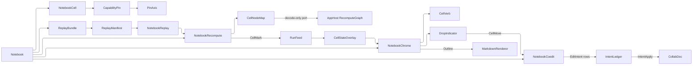

# [APPUI_NOTEBOOK_DOCUMENT]

Reproducible computational documents ride the notebook rail. `NotebookCell` is the closed cell-kind union — code, markdown, chart, render, viewpoint, parameter, evidence — whose pin-bearing kinds carry a `CapabilityPin` admitted at construction and whose code cells carry DATA only, so execution resolves from the pin through the runtime `Execute` delegate and never from a captured closure. Recompute COMPOSES the AppHost `RecomputeGraph` through one decode-only port; the notebook keeps only the document-local projection — the cell-id to node-identity map and the derived state overlay — and owns no topology, dirty walk, or scheduler of its own. `NotebookCoedit` is the intent LENS whose one `Commit` entry lands every verb as an `EditIntent` row on the `Collab/sync.md` `IntentLedger` rail over the one `IntentApply` register. `ReplayBundle` exports the notebook with its pinned capabilities and inputs as a portable replay artifact, and verification re-runs it under the recorded environment. The substrate is the Compute capability registry, the AppHost determinism kernel, `Editing/codepane.md` for code cells, the chart and visual owners for output cells, `Collab/sync.md` for co-editing and durability, and the kernel `MonotonicTimeline` for every measured span.

## [01]-[INDEX]

- [02]-[CELL_MODEL]: Closed cell-kind union; capability pin admitted at construction; error and log outputs materialized in place.
- [03]-[RECOMPUTE_PROJECTION]: `RecomputeGraph` composed per-cell against the AppHost port; the node map, the progress channel, and the derived state overlay.
- [04]-[CRDT_COEDIT]: Intent lens over the one `IntentApply` register through the one commit rail.
- [05]-[REPLAY_BUNDLE]: Export-to-replay artifact with pinned capabilities and inputs.
- [06]-[CELL_CHROME]: Per-cell toolbar and execution state, drag-reorder with drop indicators, output collapse, insertion affordances, and the document outline.

## [02]-[CELL_MODEL]

- Owner: `NotebookFault` the direct generated `[Union]` with one `[FaultCase]` leaf per notebook failure; `PinAxis` the four-row drift vocabulary; `CapabilityPin` the admitted reproducibility fingerprint; `CellKind` `[SmartEnum<string>]` the kind vocabulary the union projects into, carrying the run capability every kind-keyed surface reads; `NotebookCell` `[Union]` the cell-kind family; `CellOutput` `[Union]` the materialized output; `Notebook` the ordered-and-indexed cell roster.
- Cases: `NotebookCell` = Code | Markdown | Chart | Render | Viewpoint | Parameter | Evidence under the locked `CellKind` rows; `CellOutput` = Receipt | Rows | Image | Timeline | Log | Error | Empty — every output case has a producing cell arm, the `Timeline` producer being the evidence cell's query against the diagnostics correlation join, the `Log` producer a code cell's captured line stream, and the `Error` producer a failed evaluation materialized AS OUTPUT so a failed cell renders its failure in place instead of vanishing.
- Entry: `public IO<CellOutput> Evaluate(NotebookRuntime runtime, HashMap<string, CellOutput> upstream)` — the pin gate runs ONCE on `Pinned` ahead of the dispatch, so a new pin-bearing kind cannot forget it; `public Fin<Unit> Matches(CapabilityPin live, string subject)` on the pin — the four-axis drift read; `public static Fin<Notebook> Of(string key, Seq<NotebookCell> cells, HashMap<string, CellMetadata> metadata)` — the roster mint that indexes and refuses a duplicate cell id.
- Auto: every code, chart, and render cell carries a `CapabilityPin` composing the AppHost `DeterminismContext`/`EnvFingerprint` as its environment identity beside the Compute capability key and the model-or-kernel checksum, so a re-run under a drifted environment is a detectable mismatch through `DeterminismKernel.Reproduces` and never a notebook-local checksum tuple. Markdown cells project through the typography `MarkdownProjection`; chart and render cells bind their output to the chart and visual owners; parameter cells expose a typed binding the downstream cells read; evidence cells bind the runtime `Timeline` delegate to the `Diagnostics/evidence#CORRELATION_JOIN` correlation query, so `CellOutput.Timeline` has exactly one producer.
- Packages: Thinktecture.Runtime.Extensions, LanguageExt.Core, NodaTime, Rasm (project), Rasm.Compute (project), Rasm.AppHost (project)
- Growth: a new cell kind is one `NotebookCell` case beside its `CellKind` row, which reaches the insertion menu, the co-edit insert arm, and the chrome verb column with no edit at any of them; a new output kind is one `CellOutput` case; a new drift axis is one `PinAxis` row; a new fault case is one `[FaultCase]` leaf.
- Boundary: the capability pin is the reproducibility law and it is admitted at CONSTRUCTION — a blank capability, checksum, or substrate refuses at the factory, so `Option<CapabilityPin>` means exactly "this kind carries no pin" and the three-state space an emptiness probe used to guard at every use is gone; the pin composes the `Rasm.AppHost/Runtime/determinism#DETERMINISM_KERNEL` `DeterminismContext`/`EnvFingerprint` rather than a parallel notebook-local hash. Markdown cells route to the typography projection and chart/render cells to the chart and visual owners, so a notebook-local renderer is the deleted form; code cells edit through the `Editing/codepane#CODE_PANE` capsule, so the notebook mints no second editor. A code cell is DATA — a captured execution delegate riding a cell is the rejected form, because a persisted or exported notebook must reconstruct execution from the pin and source alone. `NotebookFault` keeps each refusal distinct through its direct generated union case.

```csharp signature
// --- [TYPES] ----------------------------------------------------------------------------

[SmartEnum<string>]
[KeyMemberEqualityComparer<ComparerAccessors.StringOrdinal, string>]
public sealed partial class PinAxis {
    public static readonly PinAxis Capability = new("capability",
        static (recorded, live) => string.Equals(recorded.Capability, live.Capability, StringComparison.Ordinal));
    public static readonly PinAxis Checksum = new("checksum",
        static (recorded, live) => string.Equals(recorded.Checksum, live.Checksum, StringComparison.Ordinal));
    public static readonly PinAxis Substrate = new("substrate",
        static (recorded, live) => string.Equals(recorded.Substrate, live.Substrate, StringComparison.Ordinal));
    // `Reproduces` answers `Fin<Unit>` carrying both fingerprint texts on refusal, so the environment row reads
    // the kernel's own verdict rather than comparing digests this page would have to keep in step.
    public static readonly PinAxis Environment = new("environment",
        static (recorded, live) => Rasm.AppHost.Runtime.DeterminismKernel.Reproduces(recorded.Context, live.Context).IsSucc);

    [UseDelegateFromConstructor]
    public partial bool Holds(CapabilityPin recorded, CapabilityPin live);
}

// Admission at CONSTRUCTION: the unpinned state is unrepresentable, so `Option<CapabilityPin>` carries the one
// legal absence and no consumer re-checks emptiness.
[ComplexValueObject]
public sealed partial class CapabilityPin {
    public string Capability { get; }
    public string Checksum { get; }
    public string Substrate { get; }
    public Rasm.AppHost.Runtime.DeterminismContext Context { get; }

    public long Seed => unchecked((long)Context.Seed);

    // ONE filter over the axis roster: the refusal names EVERY axis that moved, and `subject` is the caller's
    // own name for what drifted — a cell id at evaluation, a lane at verification — so the fault reads as
    // evidence without this owner knowing who asked.
    public Fin<Unit> Matches(CapabilityPin live, string subject) =>
        toSeq(PinAxis.Items).Filter(axis => !axis.Holds(this, live)) switch {
            { IsEmpty: true } => Fin.Succ(unit),
            var drifted => Fin.Fail<Unit>(NotebookFault.Drifted(subject, drifted.Strict())),
        };

    // Three independent columns refuse together through the applicative, so a pin authored with two blanks
    // reports two rather than costing two round trips.
    static partial void ValidateFactoryArguments(
        ref ValidationError? validationError,
        ref string capability,
        ref string checksum,
        ref string substrate,
        ref Rasm.AppHost.Runtime.DeterminismContext context) =>
        validationError = (Filled(nameof(Capability), capability), Filled(nameof(Checksum), checksum), Filled(nameof(Substrate), substrate))
            .Apply(static (_, _, _) => unit)
            .Match(
                Succ: static _ => (ValidationError?)null,
                Fail: static errors => new ValidationError(string.Join("; ", errors.Map(static error => error.Message))));

    static Validation<Error, Unit> Filled(string column, string value) =>
        string.IsNullOrWhiteSpace(value)
            ? Validation<Error, Unit>.Fail(new KernelFault.InvalidValue(column, "a non-blank capability pin column"))
            : Validation<Error, Unit>.Success(unit);
}

[ComplexValueObject]
public sealed partial class CellMetadata {
    public Seq<string> Tags { get; }
    public CollapsePosture Collapse { get; }
    public Option<double> ScrollOffset { get; }

    static partial void ValidateFactoryArguments(
        ref ValidationError? validationError,
        ref Seq<string> tags,
        ref CollapsePosture collapse,
        ref Option<double> scrollOffset) =>
        validationError = (Rows(tags), Offset(scrollOffset))
            .Apply(static (_, _) => unit)
            .Match(
                Succ: static _ => (ValidationError?)null,
                Fail: static errors => new ValidationError(string.Join("; ", errors.Map(static error => error.Message))));

    static Validation<Error, Unit> Rows(Seq<string> tags) =>
        tags.Exists(static tag => string.IsNullOrWhiteSpace(tag))
            ? Validation<Error, Unit>.Fail(new KernelFault.InvalidValue(nameof(Tags), "non-blank cell metadata tags"))
            : Validation<Error, Unit>.Success(unit);

    static Validation<Error, Unit> Offset(Option<double> scrollOffset) =>
        scrollOffset.Exists(static offset => !double.IsFinite(offset) || offset < 0d)
            ? Validation<Error, Unit>.Fail(new KernelFault.InvalidValue(nameof(ScrollOffset), "a finite non-negative scroll offset"))
            : Validation<Error, Unit>.Success(unit);
}

// The kind vocabulary the union projects into. `Evaluates` is the run capability the chrome's verb narrowing
// reads, so the locked kind strings the co-edit register writes, the insertion roster, and the verb column are
// ONE declaration read three ways — a type-test ladder at the toolbar was a second enumeration of this family
// that a new case could not break, which is exactly what the Growth claim below promises against.
[SmartEnum<string>]
[KeyMemberEqualityComparer<ComparerAccessors.StringOrdinal, string>]
[KeyMemberComparer<ComparerAccessors.StringOrdinal, string>]
public sealed partial class CellKind {
    public static readonly CellKind Code = new("code", evaluates: true);
    public static readonly CellKind Markdown = new("markdown", evaluates: false);
    public static readonly CellKind Chart = new("chart", evaluates: true);
    public static readonly CellKind Render = new("render", evaluates: true);
    public static readonly CellKind Viewpoint = new("viewpoint", evaluates: false);
    public static readonly CellKind Parameter = new("parameter", evaluates: false);
    public static readonly CellKind Evidence = new("evidence", evaluates: true);

    public bool Evaluates { get; }
}

[Union(ConversionFromValue = ConversionOperatorsGeneration.None)]
public abstract partial record CellOutput {
    private CellOutput() { }
    public sealed record Receipt(ComputeReceipt Value) : CellOutput;
    public sealed record Rows(Seq<JsonElement> Values) : CellOutput;
    public sealed record Image(RenderReceipt Render) : CellOutput;
    public sealed record Timeline(EvidenceTimeline Value) : CellOutput;
    public sealed record Log(Seq<string> Lines) : CellOutput;
    public sealed record Error(LanguageExt.Common.Error Fault) : CellOutput;
    public sealed record Empty : CellOutput;

    // The fault peek lives on the OWNER through the generated total dispatch, so the recompute's poison check
    // and the chrome's failure reading ask one question and a new output case must decide whether it carries a
    // fault at compile time.
    public Option<LanguageExt.Common.Error> Fault => Switch(
        receipt: static _ => Option<LanguageExt.Common.Error>.None,
        rows: static _ => Option<LanguageExt.Common.Error>.None,
        image: static _ => Option<LanguageExt.Common.Error>.None,
        timeline: static _ => Option<LanguageExt.Common.Error>.None,
        log: static _ => Option<LanguageExt.Common.Error>.None,
        error: static failed => Some(failed.Fault),
        empty: static _ => Option<LanguageExt.Common.Error>.None);
}

// Universal columns are BASE positional data threaded through the case constructors — a computed base
// projection sharing a case parameter name suppresses positional-property synthesis (CS8907 silently discards
// the argument, a matching-type arm recurses, a mismatched type is CS8866), so Id/Inputs ride the base row and
// the optional pin rides the distinctly named Pinned column.
[Union(ConversionFromValue = ConversionOperatorsGeneration.None)]
public abstract partial record NotebookCell(string Id, Seq<string> Inputs, Option<CapabilityPin> Pinned) {
    public sealed record Code(string Id, string Source, CapabilityPin Pin, Seq<string> Inputs) : NotebookCell(Id, Inputs, Some(Pin));
    public sealed record Markdown(string Id, string Source) : NotebookCell(Id, [], None);
    public sealed record Chart(string Id, ChartSeriesKind Series, ChartPolicy Policy, CapabilityPin Pin, Seq<string> Inputs) : NotebookCell(Id, Inputs, Some(Pin));
    public sealed record Render(string Id, CustomVisual Visual, CapabilityPin Pin, Seq<string> Inputs) : NotebookCell(Id, Inputs, Some(Pin));
    public sealed record Viewpoint(string Id, AppUi.Viewport.Viewpoint View) : NotebookCell(Id, [], None);
    public sealed record Parameter(string Id, string Key, JsonElement Value) : NotebookCell(Id, [], None);
    public sealed record Evidence(string Id, string Query, Seq<string> Inputs) : NotebookCell(Id, Inputs, None);

    public CellKind Kind => Switch(
        code: static _ => CellKind.Code, markdown: static _ => CellKind.Markdown, chart: static _ => CellKind.Chart,
        render: static _ => CellKind.Render, viewpoint: static _ => CellKind.Viewpoint,
        parameter: static _ => CellKind.Parameter, evidence: static _ => CellKind.Evidence);

    // The pin gate runs ONCE, on the carrier that decides whether a pin exists at all — the per-arm ternary it
    // replaces had to be repeated at every pinned kind, so a new pinned case could silently skip verification.
    public IO<CellOutput> Evaluate(NotebookRuntime runtime, HashMap<string, CellOutput> upstream) =>
        Pinned.Match(
            Some: pin => Verified(runtime, pin).Match(
                Succ: _ => Ran(runtime, upstream),
                Fail: error => IO.fail<CellOutput>(error)),
            None: () => Ran(runtime, upstream));

    // The live pin is the RUNTIME's read (the capability registry answers what is installed now); the drift
    // comparison is the pin's own, so neither side re-derives the other's fact.
    Fin<Unit> Verified(NotebookRuntime runtime, CapabilityPin pin) =>
        runtime.LivePin(pin).Bind(live => pin.Matches(live, Id));

    IO<CellOutput> Ran(NotebookRuntime runtime, HashMap<string, CellOutput> upstream) => Switch(
        state: (Runtime: runtime, Upstream: upstream),
        code: static (ctx, c) => ctx.Runtime.Execute(c.Pin, c.Source, ctx.Upstream),
        markdown: static (_, _) => IO.pure<CellOutput>(new CellOutput.Empty()),
        chart: static (ctx, c) => ctx.Runtime.Chart(c.Series, c.Policy, ctx.Upstream),
        render: static (ctx, r) => ctx.Runtime.Render(r.Visual, ctx.Upstream),
        viewpoint: static (_, _) => IO.pure<CellOutput>(new CellOutput.Empty()),
        parameter: static (_, p) => IO.pure<CellOutput>(new CellOutput.Rows(Seq(p.Value))),
        evidence: static (ctx, e) => ctx.Runtime.Timeline(e.Query, ctx.Upstream));
}

// --- [MODELS] ---------------------------------------------------------------------------

// The cell roster and its index move as ONE value: `Cells` is document order, `At` the id-and-ordinal index
// every fold reads. Both are get-only so no `with` can re-seat the order behind a stale index, and `Of`
// REFUSES a duplicate id — the defect three independent `Find` scans answered by first hit, at O(n) each.
// A document-level ordinal column reached no reader while the co-edit projection had no value to source it
// from and stamped a literal zero into a reproducibility manifest; the ordinal is the roster's, not a column.
public sealed record Notebook {
    private Notebook(string key, Seq<NotebookCell> cells, HashMap<string, (NotebookCell Cell, int Ordinal)> at, HashMap<string, CellMetadata> metadata) {
        Key = key;
        Cells = cells;
        At = at;
        Metadata = metadata;
    }

    public string Key { get; }
    public Seq<NotebookCell> Cells { get; }
    public HashMap<string, (NotebookCell Cell, int Ordinal)> At { get; }
    public HashMap<string, CellMetadata> Metadata { get; }

    public static Fin<Notebook> Of(string key, Seq<NotebookCell> cells, HashMap<string, CellMetadata> metadata) =>
        toHashMap(cells.Map(static (cell, ordinal) => (cell.Id, (cell, ordinal)))) switch {
            var at when at.Count == cells.Count => Fin.Succ(new Notebook(key, cells, at, metadata)),
            _ => Fin.Fail<Notebook>(new KernelFault.InvalidValue("notebook cells", $"{key} contains duplicate cell identities")),
        };

    public Fin<(NotebookCell Cell, int Ordinal)> Cell(string id) =>
        At.Find(id).ToFin(new NotebookFault.MissingUpstream($"notebook/cell-absent:{id}"));
}

// --- [ERRORS] ---------------------------------------------------------------------------

[Union(ConversionFromValue = ConversionOperatorsGeneration.None)]
public abstract partial record NotebookFault : Fault {
    private static readonly FaultBand FamilyBand = FaultBand.Notebook;
    private NotebookFault(string detail) { Detail = detail; }

    public string Detail { get; }
    public override string Message => Detail;

    // ONE drift mint, so the rendered axes and the typed column can never disagree.
    public static CapabilityDrift Drifted(string subject, Seq<PinAxis> axes) =>
        new($"{subject}: capability pin drifted on {string.Join(", ", axes.Map(static axis => axis.Key))}", axes);

    [FaultCase(0)]
    public sealed partial record CapabilityDrift(string Detail, Seq<PinAxis> Axes) : NotebookFault(Detail);
    [FaultCase(1)]
    public sealed partial record MissingUpstream(string Detail) : NotebookFault(Detail);
    [FaultCase(2)]
    public sealed partial record CycleDetected(string Detail) : NotebookFault(Detail);
}

// --- [SERVICES] -------------------------------------------------------------------------

// Execute is the ONE code-cell dispatch: the Compute capability the pin names runs the source, so a persisted
// or replayed notebook resolves execution from the pin registry. `Redrive` is the runtime's policy and not the
// notebook's — the transient half rides the raised fault's own `Retriability`, so no case here classifies.
public sealed record NotebookRuntime(
    Func<CapabilityPin, Fin<CapabilityPin>> LivePin,
    Func<CapabilityPin, string, HashMap<string, CellOutput>, IO<CellOutput>> Execute,
    Func<ChartSeriesKind, ChartPolicy, HashMap<string, CellOutput>, IO<CellOutput>> Chart,
    Func<CustomVisual, HashMap<string, CellOutput>, IO<CellOutput>> Render,
    Func<string, HashMap<string, CellOutput>, IO<CellOutput>> Timeline,
    RedrivePolicy Redrive,
    CorrelationId Correlation);
```

## [03]-[RECOMPUTE_PROJECTION]

- Owner: `CellNodeMap` — the document-local cell-id to node-identity map; `RunState` `[SmartEnum<string>]` — the per-cell execution-state vocabulary (idle | queued | running | stale | failed); `CellMark` `[Union]` — the per-cell progress element the fold publishes; `RunFeed` — the fold over that stream carrying the in-flight cell and every measured span; `CellStateOverlay` — the UI state overlay derived from the affected order, the feed, and the output cache, total over the vocabulary; `NotebookRecompute` — the per-cell composition of the AppHost `RecomputeGraph`.
- Entry: `public IO<Fin<Seq<string>>> Order(CellNodeMap nodes, Seq<string> changed)` — translates changed cell ids to node identities and reads the affected order back from the port; `public IO<Fin<HashMap<string, CellOutput>>> Recompute(Notebook notebook, CellNodeMap nodes, NotebookRuntime runtime, Seq<string> changed, HashMap<string, CellOutput> cache)` — the one entry composing that order with the evaluation fold; `public static async IAsyncEnumerable<RunFeed> Feed(ChannelReader<CellMark> marks, CancellationToken token)` — the progress drain every live surface binds.
- Auto: `RecomputeGraph` owns topology and dirty propagation; the notebook retains only `CellNodeMap` and the derived overlay. Runtime delegates materialize cell-domain failures as `CellOutput.Error`, so recompute caches the error value and leaves downstream cells stale; structural absence and effect-boundary failures leave the rail. `FinT<IO, _>` stacks the rail over the effect so each step is one query line and no cell effect collapses through `Run`. The port takes a changed SET rather than one id, because verification drives every root at once and the port's own topological rank merges the cones — an N-root notebook that re-entered the port N times re-folded every shared closure N times.
- Packages: Rasm (project), Rasm.AppHost (project), Thinktecture.Runtime.Extensions, LanguageExt.Core, BCL inbox
- Growth: a new propagation concern is a `RecomputeGraph` vocabulary row consumed here; a new progress fact is one `CellMark` case its `RunFeed` arm folds; zero new engine.
- Boundary: the AppHost `RecomputeGraph` is the ONE incremental-recompute owner — a second topo sort, dirty walk, or recompute scheduler here is the deleted form, and the port is decode-only: the notebook supplies node identities and reads the affected order, never re-implementing the algebra; `Editing/graph.md`'s dependency read projection consumes the SAME vocabulary. Progress is the fold's own publication and not a poll — the overlay's `Running` and `Queued` rows had no producer while the port answered an order and nothing published which cell was in flight, so both rows were unreachable and the frontier argument was a value no caller could supply. Timing rides the kernel `MonotonicTimeline`: a `ClockPolicy` on an app-platform signature is the `Rasm.AppHost/Runtime/time` named inversion, and `MonotonicTimeline.Gauged` is REFUSED at the per-cell crossing because it brackets a `Func<Fin<T>>` while this body is an `IO`, so the capture pair rides inside the effect instead. Re-drive admits the TRANSIENT half alone through the kernel `Redrive.Run`, so a Compute capability that refused transiently retries on the policy's own curve and a drifted pin, an absent upstream, and a declared-input cycle stay terminal without any case here classifying.

```csharp signature
// --- [TYPES] ----------------------------------------------------------------------------

[SmartEnum<string>]
[KeyMemberEqualityComparer<ComparerAccessors.StringOrdinal, string>]
public sealed partial class RunState {
    public static readonly RunState Idle = new("idle");
    public static readonly RunState Queued = new("queued");
    public static readonly RunState Running = new("running");
    public static readonly RunState Stale = new("stale");
    public static readonly RunState Failed = new("failed");
}

// The progress element the fold publishes per affected cell. `Started` carries the capture a live reading ticks
// against and `Settled` the span the timeline derived, so the frontier and the elapsed reading have exactly one
// producer and neither is a chrome-side subtraction against a wall clock.
[Union(ConversionFromValue = ConversionOperatorsGeneration.None)]
public abstract partial record CellMark(string CellId, int Rank) {
    public sealed record Started(string CellId, int Rank, MonotonicStamp At) : CellMark(CellId, Rank);
    public sealed record Settled(string CellId, int Rank, TimeSpan Elapsed) : CellMark(CellId, Rank);
}

// --- [MODELS] ---------------------------------------------------------------------------

// The document-local projection the notebook DOES retain: cell id to the graph's own content-addressed node.
// Two producers, one consumer — a live document indexes through the composition-bound arrow, a replay indexes
// off the manifest the export already recorded, so a verification and a live recompute address one graph.
public sealed record CellNodeMap(HashMap<string, Rasm.AppHost.Runtime.ChainHash> Nodes) {
    public static Fin<CellNodeMap> Of(
        Notebook notebook,
        Func<Notebook, Fin<HashMap<string, Rasm.AppHost.Runtime.ChainHash>>> index) =>
        index(notebook).Bind(nodes => notebook.Cells
            .TraverseM(cell => nodes.Find(cell.Id)
                .ToFin(new NotebookFault.MissingUpstream($"recompute/node-absent:{cell.Id}")))
            .As()
            .Map(_ => new CellNodeMap(nodes)));

    public Fin<Rasm.AppHost.Runtime.ChainHash> Node(string cellId) =>
        Nodes.Find(cellId).ToFin(new NotebookFault.MissingUpstream($"recompute/node-absent:{cellId}"));
}

// The progress fold: the in-flight cell with its capture, and the span every settled cell measured. A running
// cell has no span yet and a settled one is never ticking, so the two columns can never both answer for one id.
public readonly record struct RunFeed(Option<CellMark.Started> Running, HashMap<string, TimeSpan> Settled) {
    public static readonly RunFeed Idle = new(None, HashMap<string, TimeSpan>());

    public RunFeed Advanced(CellMark mark) => mark.Switch(
        state: this,
        started: static (held, opened) => held with { Running = Some(opened) },
        settled: static (held, closed) => new RunFeed(
            held.Running.Filter(open => !string.Equals(open.CellId, closed.CellId, StringComparison.Ordinal)),
            held.Settled.AddOrUpdate(closed.CellId, closed.Elapsed)));

    public static async IAsyncEnumerable<RunFeed> Feed(
        ChannelReader<CellMark> marks, [EnumeratorCancellation] CancellationToken token) {
        RunFeed held = Idle;
        await foreach (CellMark mark in marks.ReadAllAsync(token).ConfigureAwait(false)) {
            held = held.Advanced(mark);
            yield return held;
        }
    }
}

public readonly record struct CellStateOverlay(HashMap<string, RunState> States) {
    // Derived, never stored, and TOTAL over the vocabulary: the affected ORDER plus the in-flight cell decide
    // every row. The three live arms are one ORDINAL comparison against the frontier rather than a nested
    // ternary, so a reader cannot mis-read which side of the frontier a rank falls on; a settled pass carries
    // no frontier and reads the same three terminal rows, so paused, running, and completed share one fold.
    public static CellStateOverlay Of(Seq<string> affected, HashMap<string, CellOutput> outputs, RunFeed feed) =>
        Frontier(affected, feed.Running.Map(static open => open.CellId)) switch {
            var frontier => new CellStateOverlay(toHashMap(affected.Map((id, rank) => (id, frontier.Match(
                Some: at => rank.CompareTo(at) switch {
                    0 => RunState.Running,
                    > 0 => RunState.Queued,
                    _ => Settled(outputs.Find(id)),
                },
                None: () => Settled(outputs.Find(id))))))),
        };

    public RunState StateOf(string cellId) => States.Find(cellId).IfNone(RunState.Idle);

    static RunState Settled(Option<CellOutput> output) => output.Match(
        Some: static value => value.Fault.IsSome ? RunState.Failed : RunState.Idle,
        None: static () => RunState.Stale);

    // The in-flight cell's rank in the affected order; a running id the order never names has no frontier, so
    // the overlay reads terminal rather than marking the whole tail queued behind a phantom cell.
    static Option<int> Frontier(Seq<string> affected, Option<string> running) =>
        running.Bind(id => affected.Map(static (candidate, rank) => (Candidate: candidate, Rank: rank))
            .Find(row => string.Equals(row.Candidate, id, StringComparison.Ordinal))
            .Map(static row => row.Rank));
}

// --- [OPERATIONS] -----------------------------------------------------------------------

public sealed record NotebookRecompute(
    Func<CellNodeMap, Seq<Rasm.AppHost.Runtime.ChainHash>, IO<Fin<Seq<string>>>> AffectedOrder,
    MonotonicTimeline Line,
    ChannelWriter<CellMark> Marks) {
    static readonly Op Advance = Op.Of(name: "appui.notebook.recompute");

    public IO<Fin<Seq<string>>> Order(CellNodeMap nodes, Seq<string> changed) =>
        changed.TraverseM(nodes.Node).As().Match(
            Succ: heads => AffectedOrder(nodes, heads.ToSeq()),
            Fail: error => IO.pure(Fin<Seq<string>>.Fail(error)));

    // Lift shape follows the source carrier: a port already returning `IO<Fin<A>>` IS the transformer's own
    // carrier and enters through the constructor `runFin` inverts — the one ingress spelling this corpus uses
    // for that shape, so a reader never adjudicates the `liftIO` overload pair per site.
    public IO<Fin<HashMap<string, CellOutput>>> Recompute(
        Notebook notebook, CellNodeMap nodes, NotebookRuntime runtime, Seq<string> changed, HashMap<string, CellOutput> cache) =>
        (from affected in new FinT<IO, Seq<string>>(Order(nodes, changed))
         from outputs in Fold(notebook, runtime, affected, cache)
         select outputs).runFin.As();

    public FinT<IO, HashMap<string, CellOutput>> Fold(
        Notebook notebook, NotebookRuntime runtime, Seq<string> affected, HashMap<string, CellOutput> cache) =>
        affected.Map(static (id, rank) => (Id: id, Rank: rank)).Fold(
            FinT.Succ<IO, HashMap<string, CellOutput>>(cache),
            (rail, step) => rail.Bind(state => Advanced(notebook, runtime, state, step.Id, step.Rank)));

    // One state-threaded step per affected cell, so the fold carries no Match ladder: a failed evaluation lands
    // as CellOutput.Error and the thread CONTINUES — the failure renders in place; a cell with a poisoned input
    // is skipped and stays stale on the overlay; only a structural fault leaves the rail. The cell resolves
    // through the roster's index, so the fold costs one lookup per affected cell rather than a full scan.
    FinT<IO, HashMap<string, CellOutput>> Advanced(
        Notebook notebook, NotebookRuntime runtime, HashMap<string, CellOutput> state, string id, int rank) =>
        from row in FinT.lift<IO, (NotebookCell Cell, int Ordinal)>(notebook.Cell(id))
        from upstream in FinT.lift<IO, HashMap<string, CellOutput>>(Gather(row.Cell, state))
        from advanced in upstream.Values.Exists(static output => output.Fault.IsSome)
            ? FinT.Succ<IO, HashMap<string, CellOutput>>(state)
            : FinT.liftIO<IO, HashMap<string, CellOutput>>(Marked(row.Cell, rank, runtime, upstream)
                .Map(output => state.AddOrUpdate(id, output)))
        select advanced;

    // The measured crossing, published as the Started/Settled pair the overlay and the chrome read.
    IO<CellOutput> Marked(NotebookCell cell, int rank, NotebookRuntime runtime, HashMap<string, CellOutput> upstream) =>
        from start in IO.lift(() => Line.Capture(Advance))
        from _opened in Publish(start.Map(at => (CellMark)new CellMark.Started(cell.Id, rank, at)))
        from output in Recovered(cell, runtime, upstream)
        from _closed in Publish(
            from at in start
            from end in Line.Capture(Advance)
            from span in Line.Elapsed(at, end, Advance)
            select (CellMark)new CellMark.Settled(cell.Id, rank, span))
        select output;

    // A gauge that cannot capture publishes NOTHING: progress is evidence, so a missing mark leaves the row on
    // its settled reading instead of inventing a duration, and a full progress channel drops the mark rather
    // than blocking the fold that produced it.
    IO<Unit> Publish(Fin<CellMark> mark) => IO.lift(() => ignore(mark.Map(Marks.TryWrite)));

    // Domain failure materializes AS the cell's own output, so a runtime refusal never leaves the rail and a
    // downstream skip reads the Error value. The predicate is the DOMAIN half exactly: a cancellation caught
    // here would render as a failed cell a user reads as broken work, and an exceptional error is a defect the
    // rail must carry outward rather than cache as a result.
    static IO<CellOutput> Recovered(NotebookCell cell, NotebookRuntime runtime, HashMap<string, CellOutput> upstream) =>
        (Redrive.Run(runtime.Redrive, cell.Evaluate(runtime, upstream))
         | @catch<IO, CellOutput>(
             static error => error.IsExpected && error is not KernelFault.Cancelled,
             error => IO.pure<CellOutput>(new CellOutput.Error(error)))).As();

    static Fin<HashMap<string, CellOutput>> Gather(NotebookCell cell, HashMap<string, CellOutput> state) =>
        cell.Inputs
            .TraverseM(input => state.Find(input)
                .ToFin(new NotebookFault.MissingUpstream($"{cell.Id}<-{input}"))
                .Map(output => (Input: input, Output: output)))
            .As()
            .Map(static bound => toHashMap(bound));
}
```

## [04]-[CRDT_COEDIT]

- Owner: `NotebookCoedit` the notebook LENS over the one `Collab/sync#DOCUMENT_OWNER` `CollabDoc` merge authority and the one `Collab/sync#DURABLE_INTENT` commit rail — it owns NO container write of its own.
- Entry: `public IO<Fin<Unit>> Commit(Func<string, EditIntent> intent)` — the ONE verb entry, binding the document key and landing any `EditIntent` case on the durable rail; `public Fin<Notebook> Materialize(Func<string, Fin<(NotebookCell Cell, CellMetadata Metadata)>> decode)` — the read projection over the canonical register, minting the indexed roster from that one pass.
- Auto: the notebook holds NO replicated-op vocabulary, no last-writer-wins register, no fractional-index math, no tombstone set, and — the load-bearing collapse — NO SECOND CONTAINER MAP: the register is exactly the one `IntentApply` writes, addressed through the one `CollabAddress`/`CollabPath` owner — the `CollabRoot.Cells` movable-list of stable cell-id strings beside the `CollabRoot.Meta` map whose per-cell `Key(cellId)` hop is a mergeable map whose `CollabColumn.Source` column is that cell's mergeable text container. The live co-edit path and the durable replay path are ONE dispatch and one register shape by construction, so two replicas that imported the same deltas or replayed the same ledger window hold the same notebook; reorder is the movable-list `Mov` through the `CellMove` case so identity survives concurrent moves, and concurrent same-cell source edits resolve character-granular through the engine's text CRDT via the `TextRun` case.
- Packages: LoroCs, Thinktecture.Runtime.Extensions, LanguageExt.Core, NodaTime, Rasm.Persistence (project)
- Growth: a new co-edited notebook concern is one `EditIntent` case with its `IntentApply` arm, reached through the same `Commit` entry with no lens edit; zero new surface.
- Boundary: co-editing rides the one `CollabDoc` owner and the one commit rail — the bespoke `NotebookCrdt`/`NotebookOp` algebra AND the parallel `notebook.cells` embedded-container register are DROPPED root-up, because a second register shape beside `IntentApply`'s is the split-brain the one-dispatch law forecloses. DURABLE truth is the typed edit-intent stream: a committed cell insert, edit, move, or delete IS its `EditIntent` row on the Persistence `Version/ledger`, character-granular text runs ride the gated `TextRun` case, and a Loro byte crossing durable truth is the deleted form. A lens verb that mutates a container without traversing `IntentLedger.Commit` is the rejected form — durable refusal must return before any live mutation. Verb-shaped lens methods are gone: five one-line forwarders differing only by the case they minted carried no decision the case name does not, and the entry now takes the case itself so a new intent needs no lens row. The register DECODE stays a composition-bound arrow rather than a `CellKind` column, because admitting a chart, render, or viewpoint cell needs the register's typed payload columns — `Viewpoint` crosses durably as `ViewpointWire` and not as itself — so a roster-side mint would need either a wide optional bag or a second wire the estate does not declare. Presence carets ride the document's ephemeral channel, never durable truth; determinism replay (`[05]-[REPLAY_BUNDLE]`) composes the AppHost determinism kernel and is never folded into document time-travel.

```csharp signature
// --- [OPERATIONS] -----------------------------------------------------------------------

public sealed record NotebookCoedit(CollabDoc Document, IntentLedger Ledger) {
    public const string CoeditOrigin = "notebook";

    // The lens holds the two composition-bound owners and admits nothing of its own, so the record's own
    // constructor IS the mint — a `Fin` factory that cannot fail advertises a refusal no caller can hit.

    // ONE verb entry: the intent arrives as a function of the document key, so the key is bound HERE and can
    // never be spelled at a call site, while the case the caller mints is the verb. Durable-first, live apply
    // through the same IntentApply dispatch replay uses, so lens and replay share one register.
    public IO<Fin<Unit>> Commit(Func<string, EditIntent> intent) =>
        Ledger.Commit(Document, intent(Document.Key), CoeditOrigin);

    // Read-side projection over the canonical register IntentApply writes: the `CollabRoot.Cells` id list
    // orders, each `CollabRoot.Meta` row decodes to its typed cell, and the roster mint indexes the result —
    // so a register holding two rows under one id refuses here rather than shadowing one silently.
    public Fin<Notebook> Materialize(Func<string, Fin<(NotebookCell Cell, CellMetadata Metadata)>> decode) =>
        Document.Use<LoroMovableList, Seq<string>>(CollabAddress.Of(CollabRoot.Cells), cells =>
                CollabDoc.Lift(() => toSeq(cells.ToVec()).Choose(static item => item is LoroValue.String id ? Some(id.Value) : None)))
            .Bind(ids => ids.TraverseM(decode).As())
            .Bind(rows => Notebook.Of(
                Document.Key,
                rows.Map(static row => row.Cell).ToSeq(),
                toHashMap(rows.Map(static row => (row.Cell.Id, row.Metadata)))));
}
```

## [05]-[REPLAY_BUNDLE]

- Owner: `ReplayInput` the packed-blob identity row; `ReplayOutput` the recorded per-cell output identity; `ReplayManifest` the pinned-input-and-capability manifest with its own output index; `ReplayBundle` the export-to-replay artifact; `NotebookReplay` the bit-identity check and its mismatch instrument.
- Entry: `public static Fin<ReplayBundle> Export(Notebook notebook, DeterminismContext context, HashMap<string, CellOutput> outputs, HashMap<string, ReadOnlyMemory<byte>> blobs, Func<CellOutput, ChainHash> hash, IClock clock)` — packs the cells, the pinned capabilities, the input blobs, and the recorded output hashes; `public static IO<Fin<Seq<string>>> Verify(ReplayBundle bundle, NotebookRecompute recompute, NotebookRuntime runtime, DeterminismContext live, Func<CellOutput, ChainHash> hash, InstrumentSet set)` — re-runs under the manifest pins, writes the mismatch count, and returns the mismatched cell ids, empty on bit-identity.
- Auto: the manifest records every cell's `CapabilityPin`, every input blob's kernel content key and byte length, and every output's `ChainHash`; verification admits the environment and the exact blob census, then drives every root through ONE recompute pass and compares each materialized cell hash against the recorded identity. Notebook recompute verification and command-journal replay remain distinct consumers of the same determinism primitives, so neither routes through the other's execution surface.
- Receipt: the mismatch count is the verification's evidence — `NotebookReplay.Observe` writes the declared `InstrumentSpec` row partitioned on the notebook key, and `Verify` fires it on both arms so a clean run writes its zero on the same series a divergent one increments.
- Packages: Rasm (project), Rasm.AppHost (project), Rasm.Persistence (project), Thinktecture.Runtime.Extensions, LanguageExt.Core, NodaTime
- Growth: a new manifest field is one `ReplayManifest` member; a new packed-artifact identity is one `ReplayInput` column.
- Boundary: the bundle is self-contained — verification reads only its manifest and packed blobs, rejects an environment or input-census mismatch before evaluation, and compares output `ChainHash` values exactly. Content identity is the kernel `UInt128` carried as a VALUE: the recorded key and the re-derived key compare as numbers, so two format specifiers cannot drift apart while both read correct in isolation, and `ContentHash.Hex` renders only where a human or a log reads it. The pin gate the export used to run is GONE because the union already holds it — a pin-bearing case takes a non-optional `CapabilityPin` and the pin refuses blank columns at construction, so an unpinned pin-bearing cell is unrepresentable rather than rejected. The bundle crosses the Persistence blob lane as an opaque artifact whose encoding is the `Document/export` plane's; cell-node identity remains the AppHost recompute graph's content-addressed command-plus-upstream identity. Command-journal replay stays on `ProofEngine.Replay` and notebook replay on `NotebookRecompute`, both consuming one determinism context without sharing an execution engine. A cell no root's cone reaches is a DECLARED-INPUT CYCLE — the port's content-addressed node identity cannot represent one, so this set difference against the affected order is the only place the notebook's own input declaration can raise `CycleDetected`, and the check reads the ORDER rather than the outputs because a cell skipped for a poisoned input is stale, not unreachable.

```csharp signature
// --- [MODELS] ---------------------------------------------------------------------------

public readonly record struct ReplayInput(string Key, UInt128 ContentKey, long Bytes);

public readonly record struct ReplayOutput(string CellId, Rasm.AppHost.Runtime.ChainHash OutputHash, Seq<string> Inputs);

// `Outputs` is record order and `At` the cell index both `NodeOf` and the mismatch filter read, minted together
// by `Of` — the paired scan they replace was O(n^2) over the manifest for every dependency edge.
public sealed record ReplayManifest {
    private ReplayManifest(
        string notebookKey,
        Rasm.AppHost.Runtime.DeterminismContext context,
        Seq<CapabilityPin> pins,
        Seq<ReplayInput> inputs,
        Seq<ReplayOutput> outputs,
        HashMap<string, ReplayOutput> at,
        Instant recordedAt) {
        NotebookKey = notebookKey;
        Context = context;
        Pins = pins;
        Inputs = inputs;
        Outputs = outputs;
        At = at;
        RecordedAt = recordedAt;
    }

    public string NotebookKey { get; }
    public Rasm.AppHost.Runtime.DeterminismContext Context { get; }
    public Seq<CapabilityPin> Pins { get; }
    public Seq<ReplayInput> Inputs { get; }
    public Seq<ReplayOutput> Outputs { get; }
    public HashMap<string, ReplayOutput> At { get; }
    public Instant RecordedAt { get; }

    public static Fin<ReplayManifest> Of(
        string notebookKey,
        Rasm.AppHost.Runtime.DeterminismContext context,
        Seq<CapabilityPin> pins,
        Seq<ReplayInput> inputs,
        Seq<ReplayOutput> outputs,
        Instant recordedAt) =>
        toHashMap(outputs.Map(static row => (row.CellId, row))) switch {
            var at when at.Count == outputs.Count =>
                Fin.Succ(new ReplayManifest(notebookKey, context, pins, inputs, outputs, at, recordedAt)),
            _ => Fin.Fail<ReplayManifest>(new KernelFault.InvalidValue("replay outputs", $"{notebookKey} contains duplicate output identities")),
        };

    // The replay's node map is the manifest's own index, so a verification and a live recompute address the
    // SAME graph nodes and no second identity source exists to drift.
    public CellNodeMap Nodes => new(toHashMap(Outputs.Map(static row => (row.CellId, row.OutputHash))));

    public Fin<Rasm.AppHost.Runtime.RecomputeNode> NodeOf(string cellId) =>
        At.Find(cellId)
            .ToFin(new NotebookFault.MissingUpstream($"replay/output-absent:{cellId}"))
            .Bind(row => row.Inputs
                .TraverseM(input => At.Find(input)
                    .Map(static candidate => candidate.OutputHash)
                    .ToFin(new NotebookFault.MissingUpstream($"replay/dependency-output-absent:{cellId}<-{input}")))
                .As()
                .Map(hashes => new Rasm.AppHost.Runtime.RecomputeNode(row.OutputHash, cellId, hashes.ToSeq())));
}

public sealed record ReplayBundle(ReplayManifest Manifest, Notebook Notebook, HashMap<string, ReadOnlyMemory<byte>> Blobs) {
    public static Fin<ReplayBundle> Export(
        Notebook notebook,
        Rasm.AppHost.Runtime.DeterminismContext context,
        HashMap<string, CellOutput> outputs,
        HashMap<string, ReadOnlyMemory<byte>> blobs,
        Func<CellOutput, Rasm.AppHost.Runtime.ChainHash> hash,
        IClock clock) =>
        from recorded in notebook.Cells.TraverseM(cell => outputs.Find(cell.Id)
            .Map(output => new ReplayOutput(cell.Id, hash(output), cell.Inputs))
            .ToFin(new NotebookFault.MissingUpstream($"replay/output-absent:{cell.Id}"))).As()
        from manifest in ReplayManifest.Of(
            notebook.Key, context,
            notebook.Cells.Bind(static cell => cell.Pinned.ToSeq()),
            toSeq(blobs).Map(static entry => new ReplayInput(entry.Key, ContentHash.Of(entry.Value.Span), entry.Value.Length)),
            recorded.ToSeq(),
            clock.GetCurrentInstant())
        select new ReplayBundle(manifest, notebook, blobs);
}

// --- [OPERATIONS] -----------------------------------------------------------------------

public static class NotebookReplay {
    static readonly Op Check = Op.Of(name: "appui.notebook.replay");

    public static readonly InstrumentSpec Mismatch = InstrumentSpec.Create(
        "rasm.appui.notebook.replay.mismatch", InstrumentKind.Count, MeasureForm.Whole, "{mismatch}",
        "Replay digest mismatches by notebook.", Seq(AppUiTelemetry.DocSlot), None, None, None);

    public static TelemetryContributorPort TelemetryRow(string version) => AppUiTelemetry.Contribute(version, Mismatch);

    public static Fin<Unit> Observe(InstrumentSet set, string notebookKey, Seq<string> mismatched) =>
        set.Write(Mismatch, mismatched.Count, InstrumentSet.Tags((AppUiTelemetry.DocSlot, notebookKey)));

    // Three gates in declaration order on one rail: the environment reproduces, the blob census matches exactly,
    // then every root re-runs and each materialized hash compares against the recorded identity. The
    // environment refusal is the kernel's own — `Reproduces` carries both fingerprint texts — so this page
    // neither re-derives a digest nor re-renders the comparison.
    public static IO<Fin<Seq<string>>> Verify(
        ReplayBundle bundle,
        NotebookRecompute recompute,
        NotebookRuntime runtime,
        Rasm.AppHost.Runtime.DeterminismContext live,
        Func<CellOutput, Rasm.AppHost.Runtime.ChainHash> hash,
        InstrumentSet set) =>
        (from _environment in FinT.lift<IO, Unit>(Rasm.AppHost.Runtime.DeterminismKernel
             .Reproduces(bundle.Manifest.Context, live)
             )
         from _census in FinT.lift<IO, Unit>(VerifyInputs(bundle))
         from outputs in Rerun(bundle, recompute, runtime)
         let mismatched = bundle.Manifest.Outputs
             .Filter(recorded => outputs.Find(recorded.CellId).Map(actual => hash(actual) != recorded.OutputHash).IfNone(true))
             .Map(static row => row.CellId)
         from _observed in FinT.lift<IO, Unit>(Observe(set, bundle.Manifest.NotebookKey, mismatched))
         select mismatched).runFin.As();

    // Census equality is BOTH directions: every manifest input resolves to a byte-identical blob AND the blob
    // count matches, so an extra packed blob is a divergence rather than silent surplus. The identity compare
    // is a value compare on the kernel key, so no format specifier stands between the two readings.
    static Fin<Unit> VerifyInputs(ReplayBundle bundle) =>
        bundle.Manifest.Inputs.TraverseM(input => bundle.Blobs.Find(input.Key)
                .ToFin(new NotebookFault.MissingUpstream($"replay/input-absent:{input.Key}"))
                .Bind(blob => guard(
                    ContentHash.Of(blob.Span) == input.ContentKey && blob.Length == input.Bytes,
                    NotebookFault.Drifted($"replay/input:{input.Key}", Seq(PinAxis.Checksum))).ToFin()))
            .As()
            .Bind(_ => guard(
                bundle.Blobs.Count == bundle.Manifest.Inputs.Count,
                NotebookFault.Drifted("replay/input-census", Seq(PinAxis.Checksum))).ToFin());

    // ONE port call over the whole root SET, so a shared closure re-runs once rather than once per root. The
    // reachability check then names the cells no root's cone covers, which is the notebook's own declared-input
    // cycle — the graph's content-addressed identity cannot carry one, so it can be raised nowhere else.
    static FinT<IO, HashMap<string, CellOutput>> Rerun(
        ReplayBundle bundle, NotebookRecompute recompute, NotebookRuntime runtime) =>
        from order in new FinT<IO, Seq<string>>(recompute.Order(
            bundle.Manifest.Nodes,
            bundle.Notebook.Cells.Filter(static cell => cell.Inputs.IsEmpty).Map(static cell => cell.Id)))
        from _covered in FinT.lift<IO, Unit>(Covered(bundle.Notebook, order))
        from outputs in recompute.Fold(bundle.Notebook, runtime, order, HashMap<string, CellOutput>())
        select outputs;

    static Fin<Unit> Covered(Notebook notebook, Seq<string> order) =>
        toHashMap(order.Map(static id => (id, unit))) switch {
            var reached => notebook.Cells.Map(static cell => cell.Id).Filter(id => !reached.ContainsKey(id)) switch {
                { IsEmpty: true } => Fin.Succ(unit),
                var orphaned => Fin.Fail<Unit>(new NotebookFault.CycleDetected(
                    $"replay/unreachable-from-any-root:{string.Join(",", orphaned)}")),
            },
        };
}
```

## [06]-[CELL_CHROME]

- Owner: `CellVerb` `[SmartEnum<string>]` the per-cell action roster carrying its command key, its affected-cell projection, and its emphasis; `CollapsePosture` the output-collapse vocabulary carrying its own shown-height fold; `CellRun` the live execution reading; `CellChrome` the per-cell presentation row; `DropIndicator` the reorder feedback carrying the move intent it produces; `OutputCeiling` the collapse policy; `NotebookOutline` the heading-anchor tree; `NotebookChrome` the fold producing every row.
- Cases: `CellVerb` = run · run-above · run-below · duplicate · delete · insert-above · insert-below; `CollapsePosture` = auto · open · closed.
- Entry: `public static Seq<CellChrome> Rows(Notebook notebook, CellStateOverlay overlay, RunFeed feed, HashMap<string, CellOutput> outputs, HashMap<string, double> measured, OutputCeiling ceiling, MonotonicTimeline line)` — the one chrome projection; `public static Fin<Seq<string>> Affected(CellVerb verb, Notebook notebook, string cellId)` — the cells a verb touches, resolved through the roster's ordinal index; `public static Option<DropIndicator> Indicate(Seq<(string CellId, double Top, double Height)> extents, double pointerY)` — the drop feedback off the measured extents alone; `public static NotebookOutline Outline(Notebook notebook)` — the heading tree through the markdown owner's anchor-only projection; `public static Seq<CellVerb> Verbs(NotebookCell cell)` — the per-kind verb narrowing; `public static Seq<ControlIntent> Insertions(string anchorCellId)` and `public static Seq<ControlIntent> Toolbar(CellChrome row)` — the insertion menu and the per-cell toolbar as intent rows the one control factory materializes.
- Auto: the toolbar is a VERB ROSTER, so every action is a row carrying its own command key and its own affected-cell projection — a run-above whose cell set was computed at the button is exactly how a toolbar and a keyboard shortcut come to disagree about what "above" means. Execution state is the settled `[03]` overlay, so a cell's queued, running, sealed, and failed presentation is the same fold the recompute produces and no second state machine exists; the elapsed reading comes off the recompute's own marks — a running cell ticks against the capture the fold published and a settled cell reads the span the fold measured, both monotonic, neither a chrome-side subtraction against a wall clock. Reordering commits an `EditIntent.CellMove` on the durable rail, so a dropped cell converges with every peer through the movable-list `Mov` the co-edit register already owns. Insertion affordances render between rows carrying the kinds the union admits, so a new cell kind reaches the menu with no chrome edit. The outline is the `Document/media#MARKDOWN_BLOCKS` ANCHOR-ONLY projection over every markdown cell, so a notebook's headings and a prose document's headings produce one outline shape, navigation rides the settled `SearchOpen.ProsePane` request, and recomputing the tree materializes no control and opens no editor session the caller could never release.
- Packages: Avalonia, NodaTime, Rasm (project), Thinktecture.Runtime.Extensions, LanguageExt.Core
- Growth: a new cell action is one `CellVerb` row carrying its key and its affected projection; a new execution reading is one `CellRun` column off the settled overlay; a new cell kind reaches both the insertion menu and the chrome fold through its own `CellKind` row with zero rows here.
- Boundary: the chrome is PRESENTATION over the settled cell graph, replay, and co-editing machinery — a chrome-local execution state, reorder, run scheduler, and outline model are the four deleted forms. Verbs are COMMAND KEYS the `Shell/commands` deck raises, so a toolbar button, a context menu, and a keyboard shortcut invoke one intent; the verb's boot-frozen intent is the command and the CELL is the payload, because the deck freezes before any cell exists and a per-cell command key is a row nothing can have registered, while the per-cell string survives as the control's own identity, which is what keeps two cells' toolbars from colliding at the factory. The affected-cell projection reads the notebook's ORDER, not the recompute graph's dependency closure: run-above means the cells above in document order, which is what a user pointing at a cell means, while the closure is what `RecomputeGraph` decides once the run starts — conflating them would make a run-above skip an independent cell the user can see sitting above. Drop indication is a POSITION between rows rather than a highlighted target row, because a drag that lands "on" a cell has no defined meaning in an ordered sequence, and the head-position encoding lives on the indicator that produces it rather than at every drag caller. Collapse is ONE posture row whose own fold decides the shown height — the stored bool beside a live ceiling could contradict the measurement, and the pinned-open and pinned-closed intents a bool cannot spell are now rows. The cell list windows through the ONE `Shell/virtualization#WINDOW_OWNER` fabric, so a thousand-cell notebook realizes exactly its viewport and a notebook-local virtualizer is that owner's explicitly rejected form.

```csharp signature
// --- [TYPES] ----------------------------------------------------------------------------

// The per-cell action roster. Each row carries its command key and its affected-cell projection, so a toolbar
// press, a context menu, and a shortcut compute the same cell set. Four rows share the SELF projection through
// one named member rather than four verbatim delegate literals.
[SmartEnum<string>]
[KeyMemberEqualityComparer<ComparerAccessors.StringOrdinal, string>]
[KeyMemberComparer<ComparerAccessors.StringOrdinal, string>]
public sealed partial class CellVerb {
    public static readonly CellVerb Run = new("run", "notebook.cell.run", ControlEmphasis.Primary, Self);
    public static readonly CellVerb RunAbove = new("run-above", "notebook.cell.run.above", ControlEmphasis.Secondary,
        static (cells, at) => cells.Take(at).Map(static cell => cell.Id));
    public static readonly CellVerb RunBelow = new("run-below", "notebook.cell.run.below", ControlEmphasis.Secondary,
        static (cells, at) => cells.Skip(at).Map(static cell => cell.Id));
    public static readonly CellVerb Duplicate = new("duplicate", "notebook.cell.duplicate", ControlEmphasis.Quiet, Self);
    public static readonly CellVerb Delete = new("delete", "notebook.cell.delete", ControlEmphasis.Danger, Self);
    public static readonly CellVerb InsertAbove = new("insert-above", "notebook.cell.insert.above", ControlEmphasis.Quiet, Self);
    public static readonly CellVerb InsertBelow = new("insert-below", "notebook.cell.insert.below", ControlEmphasis.Quiet, Self);

    public string Intent { get; }

    public ControlEmphasis Emphasis { get; }

    // The projection reads DOCUMENT ORDER rather than the dependency closure: "above" is what the user can see
    // above, and what the recompute then decides to re-run is the graph's own answer once the run starts.
    [UseDelegateFromConstructor]
    public partial Seq<string> Touches(Seq<NotebookCell> cells, int ordinal);

    static Seq<string> Self(Seq<NotebookCell> cells, int at) => Seq(cells[at].Id);
}

// Collapse is a POSTURE whose own row decides the shown height against the ceiling, so a pinned-open output
// shows whole whatever it measures, a pinned-closed one shows its band, and only the auto row consults the
// ceiling — a stored bool beside a live measurement could disagree with the height actually painted.
[SmartEnum<string>]
[KeyMemberEqualityComparer<ComparerAccessors.StringOrdinal, string>]
public sealed partial class CollapsePosture {
    public static readonly CollapsePosture Auto = new("auto", static (ceiling, measured) => Math.Min(measured, ceiling.MaxHeight));
    public static readonly CollapsePosture Open = new("open", static (_, measured) => measured);
    public static readonly CollapsePosture Closed = new("closed", static (ceiling, _) => ceiling.CollapsedBand);

    [UseDelegateFromConstructor]
    public partial double Shown(OutputCeiling ceiling, double measured);
}

// --- [MODELS] ---------------------------------------------------------------------------

// The live execution reading. Elapsed is a MONOTONIC span off the recompute's own marks — ticking while the
// cell runs, the measured span once it settles — and the fault is present only on a failure, so a state row
// beside two nullable columns that can contradict it has no spelling here.
public readonly record struct CellRun(RunState State, Option<TimeSpan> Elapsed, Option<LanguageExt.Common.Error> Fault) {
    public static CellRun Of(
        RunState state, string cellId, RunFeed feed, Option<CellOutput> output,
        MonotonicTimeline line, Fin<MonotonicStamp> now) =>
        new(state,
            feed.Running.Filter(open => string.Equals(open.CellId, cellId, StringComparison.Ordinal))
                .Bind(open => (from end in now from span in line.Elapsed(open.At, end, NotebookChrome.Paint) select span).ToOption())
                | feed.Settled.Find(cellId),
            output.Bind(static value => value.Fault));
}

// One cell's presentation. `Shown` is the height the row paints and `Overflow` the excess it hides; neither
// reconstructs the other without the measurement, and a fitting output carries a zero overflow and no
// affordance at all.
public readonly record struct CellChrome(
    string CellId, CellKind Kind, int Ordinal, CellRun Run, Seq<CellVerb> Verbs,
    CollapsePosture Collapse, double Shown, double Overflow);

// The reorder feedback: a position BETWEEN rows, because dropping "on" a cell has no meaning in an ordered
// sequence and the ambiguity lands as cells one slot off. `After` is None at the head, which is the one
// insertion point no cell id can name — and the intent carries that absence WHOLE: `CellMove.After` is
// `Option<ContainerKey>`, so the retired empty-string head sentinel has no spelling at any caller.
public readonly record struct DropIndicator(Option<string> After, double Y) {
    public EditIntent Move(DocumentKey docKey, string cellId) =>
        new EditIntent.CellMove(docKey, ContainerKey.Create(cellId), After.Map(ContainerKey.Create));
}

public readonly record struct OutputCeiling(double MaxHeight, double CollapsedBand) {
    public static OutputCeiling Default { get; } = new(MaxHeight: 480d, CollapsedBand: 160d);
}

// The heading tree over every markdown cell, carrying the cell each anchor lives in so a click both scrolls the
// list and reveals inside the cell.
public readonly record struct OutlineNode(string CellId, MarkdownAnchor Anchor);

public readonly record struct NotebookOutline(Seq<OutlineNode> Nodes) {
    // Navigation rides the SETTLED prose request, so a notebook heading and a document heading reach their
    // surfaces through one navigator and this page mints no second anchor grammar.
    public Option<SearchOpen> Open(string notebookKey, string cellId) =>
        Nodes.Find(node => node.CellId == cellId).Bind(node => node.Anchor.Open(notebookKey));
}

// --- [OPERATIONS] -----------------------------------------------------------------------

public static class NotebookChrome {
    internal static readonly Op Paint = Op.Of(name: "appui.notebook.chrome");

    // One row per cell, every reading derived: state from the settled overlay, elapsed from the recompute's own
    // marks, the fault from the output the evaluation already materialized, and the verb roster narrowed by the
    // kind's own run capability. The capture is taken ONCE per fold, so every running reading on one pass ticks
    // against the same instant rather than drifting row by row.
    public static Seq<CellChrome> Rows(
        Notebook notebook,
        CellStateOverlay overlay,
        RunFeed feed,
        HashMap<string, CellOutput> outputs,
        HashMap<string, double> measured,
        OutputCeiling ceiling,
        MonotonicTimeline line) =>
        line.Capture(Paint) switch {
            var now => notebook.Cells.Map((cell, ordinal) => Row(
                cell, ordinal, overlay, feed,
                outputs.Find(cell.Id),
                notebook.Metadata.Find(cell.Id).Map(static row => row.Collapse).IfNone(CollapsePosture.Auto),
                measured.Find(cell.Id).IfNone(0d),
                ceiling, line, now)),
        };

    // The shown height is read ONCE and the overflow derives from it, so the painted band and the hidden
    // remainder cannot be computed under two different postures.
    static CellChrome Row(
        NotebookCell cell, int ordinal, CellStateOverlay overlay, RunFeed feed, Option<CellOutput> output,
        CollapsePosture posture, double measured, OutputCeiling ceiling,
        MonotonicTimeline line, Fin<MonotonicStamp> now) =>
        posture.Shown(ceiling, measured) switch {
            var shown => new CellChrome(
                cell.Id, cell.Kind, ordinal,
                CellRun.Of(overlay.StateOf(cell.Id), cell.Id, feed, output, line, now),
                Verbs(cell),
                posture, shown, measured - shown),
        };

    // A cell offers the verbs it can honour: only an EVALUATING kind runs, which the kind row itself declares,
    // and every kind can be duplicated, deleted, or have a neighbour inserted — so a disabled run button never
    // renders on a markdown cell and a new evaluating kind reaches this roster with no edit here.
    public static Seq<CellVerb> Verbs(NotebookCell cell) =>
        (cell.Kind.Evaluates ? Seq(CellVerb.Run, CellVerb.RunAbove, CellVerb.RunBelow) : Seq<CellVerb>())
        + Seq(CellVerb.Duplicate, CellVerb.Delete, CellVerb.InsertAbove, CellVerb.InsertBelow);

    // The affected set resolves through the ROW's own projection against the ordinal the roster already indexed,
    // so the toolbar, the menu, and the shortcut all ask the same question of the same authority at one lookup.
    public static Fin<Seq<string>> Affected(CellVerb verb, Notebook notebook, string cellId) =>
        notebook.Cell(cellId).Map(row => verb.Touches(notebook.Cells, row.Ordinal));

    // The indicator is the GAP the pointer is nearest: each row contributes its own trailing edge, the head gap
    // carries no predecessor, and the bounded selection keeps the single best — a full sort answered one
    // minimum. The MEASURED extents are the whole input, because a gap is a geometry fact and the chrome rows
    // carry no geometry, so a chrome roster beside them answered nothing this fold reads.
    public static Option<DropIndicator> Indicate(Seq<(string CellId, double Top, double Height)> extents, double pointerY) =>
        Ranked.Top(
            Seq(new DropIndicator(None, extents.Head.Map(static row => row.Top).IfNone(0d)))
                + extents.Map(static row => new DropIndicator(Some(row.CellId), row.Top + row.Height)),
            keep: 1,
            key: gap => Math.Abs(gap.Y - pointerY),
            direction: ExtremumDirection.Minimum)
            .Head;

    // The outline over every markdown cell, in document order, through the markdown owner's ANCHOR-ONLY
    // projection — so a notebook heading and a prose heading are the same anchor value, one navigator serves
    // both, and an outline costs no controls and no lifetimes. Reading it off a full render instead
    // materialized a control tree and opened one live `CodeSession` per fence, per markdown cell, on a plane
    // that recomputes its outline whenever a cell's source changes and has nowhere to release what it opened.
    // The narrowing is a CHOOSE on the one prose-authoring case rather than a kind capability, because the
    // anchor grammar reads markdown SOURCE and no other case carries any.
    public static NotebookOutline Outline(Notebook notebook) =>
        new(notebook.Cells
            .Choose(static cell => Optional(cell as NotebookCell.Markdown))
            .Bind(static markdown => MarkdownRenderer
                .Anchors(MarkdownProjection.Project(markdown.Source))
                .Map(anchor => new OutlineNode(markdown.Id, anchor))));

    // The insertion menu IS the kind vocabulary's own roster, so a new cell kind reaches the affordance with no
    // edit here and an insertion can never offer a kind the union cannot construct — a caller-supplied kind
    // list was that same roster enumerated a second time, and the second enumeration is what a new case misses.
    public static Seq<ControlIntent> Insertions(string anchorCellId) =>
        Seq<ControlIntent>(new ControlIntent.Segmented(
            $"notebook.insert.{anchorCellId}", SegmentPosture.Command,
            toSeq(CellKind.Items).Map(static kind =>
                new OptionRow(kind.Key, LocaleStrings.Key(nameof(CellKind), kind.Key), None, None)),
            IntentBinding.Of(PaintRole.Panel)));

    // The toolbar as intent rows the one control factory materializes, so the chrome constructs no control and
    // every verb reaches the deck through its own key. The control key is per-CELL because two cells render two
    // toolbars and the factory keys on identity, while the COMMAND is the verb's own boot-frozen intent with
    // the cell riding the payload — a chip that bound no command at all rendered a toolbar whose every button
    // resolved nothing. The emphasis the row declares carries through to the binding.
    public static Seq<ControlIntent> Toolbar(CellChrome row) =>
        row.Verbs.Map(verb => (ControlIntent)new ControlIntent.Button(
            $"{verb.Intent}.{row.CellId}",
            LocaleStrings.Key(nameof(CellVerb), verb.Key),
            IntentBinding.Of(
                verb.Emphasis == ControlEmphasis.Danger ? PaintRole.Error : PaintRole.Panel,
                verb.Emphasis) with { Command = Some(verb.Intent) }));
}
```


```mermaid
---
config:
  layout: elk
  flowchart:
    curve: linear
    padding: 25
---
flowchart LR
    accTitle: Notebook cell, recompute, co-edit, replay, and chrome planes
    accDescr: A notebook owning capability-pinned cells, a recompute plane reading the host graph decode-only through a node map and publishing per-cell progress marks, a co-edit plane lowering edit intents through the ledger onto the collaboration document, a replay bundle driving deterministic verification, and a chrome fold projecting the settled state overlay into per-cell verb rows, drop indicators, and the markdown outline.
    Notebook --> NotebookCell
    NotebookCell --> CapabilityPin
    CapabilityPin --> PinAxis
    Notebook --> NotebookRecompute
    NotebookRecompute --> CellNodeMap
    CellNodeMap -->|decode-only port| RecomputeGraph["AppHost RecomputeGraph"]
    NotebookRecompute -->|CellMark| RunFeed
    RunFeed --> CellStateOverlay
    Notebook --> NotebookCoedit
    NotebookCoedit -->|EditIntent rows| IntentLedger
    IntentLedger -->|IntentApply| CollabDoc
    Notebook --> ReplayBundle
    ReplayBundle --> ReplayManifest
    ReplayManifest --> NotebookReplay
    NotebookReplay --> NotebookRecompute
    Notebook --> NotebookChrome
    NotebookChrome --> CellVerb
    CellStateOverlay --> NotebookChrome
    NotebookChrome --> DropIndicator
    DropIndicator -->|CellMove| NotebookCoedit
    NotebookChrome -->|Outline| MarkdownRenderer
```

## [07]-[RESEARCH]

(none)
