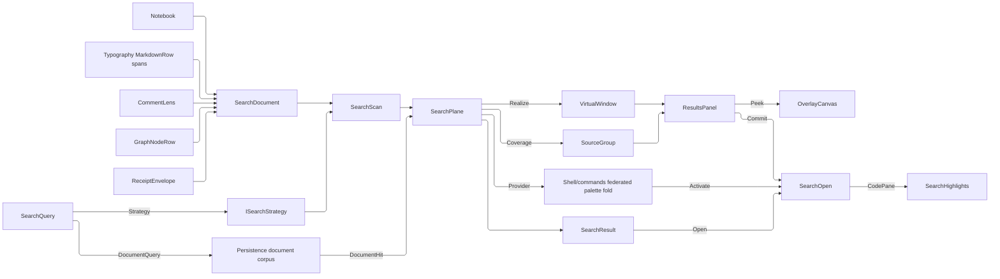

# [APPUI_DOCUMENT_SEARCH]

One typed search plane answers every "where is this" the document estate can be asked: `SearchQuery` is the closed request shape carrying its terms, its matching grammar, its source scope, and its result ceiling; `SearchSource` is the closed coverage vocabulary whose rows project the landed owners — notebook cells, markdown prose, issue titles and comments, graph node titles, sealed evidence payloads — into one `SearchDocument` candidate; `SearchResult` is the ranked, source-attributed union whose total dispatch becomes the `SearchOpen` navigation request each surface takes; `SearchPlane` folds the local scan and the store's resident index into ONE keyed cache whose realized rows come off the `Shell/virtualization` fabric; and `ResultsPanel` is the presentation over that ranked window — hits grouped by source with count badges, per-hit previews, keyboard walking with peek-on-focus, and recent-query rows. The page owns the query shape, the coverage rows, the ranked-result union, the results presentation, the highlight binding on the code pane, and the consumed store query/result wire. It owns NO index: durability, the corpus table, its analyzer, and the rank engine are the Persistence retrieval lane's, and AppUi consumes that lane as VALUES. It stands NO second federated surface either: `Shell/commands#PALETTE_FEDERATION` is the estate's one federated query face and consumes this plane as its document provider, so the ENGINE lives here and the merged rank fold lives there.

Coverage rows are projections, never re-derivations: cells project the `Document/notebook#CELL_MODEL` `NotebookCell` union, prose projects the raw markdown source the `Theme/typography#MARKDOWN_PROJECTION` rows already span, issues project the `Collab/issues#COMMENT_LENS` entries the board holds, nodes project the `Editing/graph#GRAPH_MODEL` `GraphNodeRow` titles the canvas already carries, and evidence projects the `Diagnostics/evidence#CORRELATION_JOIN` `ReceiptEnvelope` payload text. One match engine serves both faces — `SearchStrategyFactory.Create` mints the `ISearchStrategy` the corpus scan runs and the code pane's own `SearchPanel` resolves — so a hit found headlessly and a hit found in the editor are the same span. Results stream through `DynamicData` `FilterOnObservable` into `VirtualWindow<SearchResult,string>.Realize` over an `OrderedChangeSet` carrying the ONE comparer that orders it as the stream that seam takes — the window sorts by that comparer to produce the `ISortedChangeSet` `Virtualise` requires and the extent ledger reads its ordinal projection off that very sorted value, so rank order is one authority rather than a comparer beside a snapshot that can disagree, and a plane whose order never moves publishes its single comparer rather than a re-subscription the fabric would answer by discarding its cache. Fault codes derive through the `AppUiFaultBand.Search` registry row (6430); highlight spans ride the `SourceSpan` idiom `Document/media` uses for its link hits.

## [01]-[INDEX]

- [02]-[QUERY_SHAPE]: The closed request shape, the grammar vocabulary both faces read, and the typed fault family.
- [03]-[SOURCE_COVERAGE]: The coverage rows and the one candidate shape each landed owner projects into.
- [04]-[RANKED_WINDOW]: The ranked source-attributed result union and its realization through the virtualization fabric.
- [05]-[HIGHLIGHT_NAV]: The navigation request each result becomes and the code pane's segment-tracked highlight binding.
- [06]-[INDEX_WIRE]: The consumed store query and hit wire; index custody stays with the Persistence retrieval lane.
- [07]-[RESULTS_PANEL]: Source-grouped hits with count badges, per-hit previews, keyboard walking with peek-on-focus, scoped panels, and recent queries.

## [02]-[QUERY_SHAPE]

- Owner: `SearchGrammar` `[SmartEnum<string>]` — the matching-grammar vocabulary carrying the editor mode and the wire predicate token in one row; `SearchLimit` `[ValueObject<int>]` — the admitted result ceiling; `SearchQuery` `[ComplexValueObject]` — the one closed request; `SearchFault` — the typed fault family whose codes derive through the `AppUiFaultBand.Search` registry row (6430).
- Cases: `SearchGrammar` = literal · phrase · wildcard · pattern; `SearchFault` = Text | PatternInvalid | SourceUnreachable | WireMismatched | AnchorAbsent.
- Entry: `public Fin<ISearchStrategy> Strategy()` — the ONE match-engine mint the corpus scan and the code pane both take, folding the query's own columns onto `SearchStrategyFactory.Create(pattern, ignoreCase, matchWholeWords, mode)`.
- Auto: the grammar row carries all THREE projections of one decision — `Editor` is the `SearchMode` the strategy mint consumes, `Predicate` is the frozen wire token the store lowers to its own predicate case, and `Panel` is the knob push the code pane's overlay takes — so literal, phrase, wildcard, and pattern matching are decided once for every face. Case sensitivity and word boundary are policy COLUMNS of the same build, not a second body either face selects between; the mint takes `!CaseSensitive` because the factory's own parameter is `ignoreCase`. An invalid pattern throws inside the factory rather than at the scan, so the trap sits at the mint and the refusal leaves typed as `SearchFault.PatternInvalid`.
- Packages: Avalonia.AvaloniaEdit, Rasm.Persistence (project), Thinktecture.Runtime.Extensions, LanguageExt.Core
- Growth: a new matching grammar is one `SearchGrammar` row carrying all three projections; a new refusal is one `SearchFault` case under the registry row; zero new surface.
- Boundary: scope is a NON-EMPTY row set and "everything" is `SearchSource.Items`, so no empty-means-all sentinel exists and an unscoped query refuses at admission; the ceiling is the SEAM's own constant — `Rasm.Persistence/Query/retrieval#DOCUMENT_CORPUS` declares `LimitCeiling` and this admission reads that symbol, so neither end accepts what the other refuses and a per-end literal is the deleted form; the strategy is minted from the query and never from a second knob set — the panel's own knob set carries no mode column, so the grammar row owns the lowering onto it and a code pane whose panel knobs drifted from the query is unrepresentable; the pattern grammar is named `Pattern` rather than `Regex` because a member spelled for the BCL type captures that name inside its declaring type and every static access on it would need qualifying.

```csharp signature
// The matching grammar is ONE vocabulary every face reads: `Editor` is the mode the editor strategy mint
// takes, `Predicate` is the frozen wire token the store lowers to its own predicate case, and `Panel` is
// the knob push the code pane's overlay takes — so a grammar decision cannot land on one face and miss
// another. `Normal` regex-escapes its pattern and `Wildcard` lowers `?`/`*`, so literal and phrase share an
// editor mode while differing on the durable side.
[SmartEnum<string>]
[KeyMemberEqualityComparer<ComparerAccessors.StringOrdinal, string>]
[KeyMemberComparer<ComparerAccessors.StringOrdinal, string>]
public sealed partial class SearchGrammar {
    public static readonly SearchGrammar Literal = new("literal", SearchMode.Normal, predicate: "match",
        panel: static (panel, query) => Knobs(panel, query, query.Terms, regex: false));
    public static readonly SearchGrammar Phrase = new("phrase", SearchMode.Normal, predicate: "phrase",
        panel: static (panel, query) => Knobs(panel, query, query.Terms, regex: false));
    public static readonly SearchGrammar Wildcard = new("wildcard", SearchMode.Wildcard, predicate: "phrase-prefix",
        panel: static (panel, query) => Knobs(panel, query, Lowered(query.Terms), regex: true));
    public static readonly SearchGrammar Pattern = new("pattern", SearchMode.RegEx, predicate: "regex",
        panel: static (panel, query) => Knobs(panel, query, query.Terms, regex: true));

    public SearchMode Editor { get; }

    public string Predicate { get; }

    // The THIRD projection of one decision. The panel carries no mode column — it mints
    // `Create(SearchPattern, !MatchCase, WholeWords, UseRegex ? RegEx : Normal)` from four knobs — so the
    // wildcard row lowers itself into the regex form that mint would have produced while the other three
    // push their columns verbatim. A grammar the panel cannot spell is therefore unrepresentable rather
    // than silently resolving a different match set than the plane ranked.
    [UseDelegateFromConstructor]
    public partial Unit Panel(SearchPanel panel, SearchQuery query);

    // The pattern column writes LAST: each knob raises the panel's own re-search, so the final write is the
    // one that runs against the settled knob set.
    static Unit Knobs(SearchPanel panel, SearchQuery query, string pattern, bool regex) {
        panel.MatchCase = query.CaseSensitive;
        panel.WholeWords = query.WholeWords;
        panel.UseRegex = regex;
        panel.SearchPattern = pattern;
        return unit;
    }

    // The editor package's wildcard lowering is private to its strategy mint, so the one row that needs it
    // on the panel face states it exactly: `?` matches one character, `*` matches a run, and every other
    // character escapes — character for character the pattern `SearchMode.Wildcard` would have built, so
    // the overlay's regex strategy and the plane's wildcard strategy admit one match set.
    static string Lowered(string terms) =>
        string.Concat(terms.Select(static character => character switch {
            '?' => ".",
            '*' => ".*",
            var literal => Regex.Escape(literal.ToString()),
        }));
}

// The ceiling is the SEAM's own constant: the Persistence retrieval lane declares `LimitCeiling` and both
// admissions read that one symbol, so neither end accepts what the other refuses and a bound spelled twice
// cannot fork on the first edit.
[ValueObject<int>]
public readonly partial struct SearchLimit {
    static partial void ValidateFactoryArguments(ref ValidationError? validationError, ref int value) =>
        validationError = value > 0 && value <= DocumentCorpus.LimitCeiling
            ? validationError
            : new ValidationError($"search limit is a positive result ceiling at or below {DocumentCorpus.LimitCeiling}");
}

[Union]
public abstract partial record SearchFault : Expected, IValidationError<SearchFault> {
    private SearchFault(string detail, int code) : base(detail, code, None) { }

    public static SearchFault Create(string message) => new Text(message);

    public sealed record Text : SearchFault { public Text(string detail) : base(detail, AppUiFaultBand.Search.Code(0)) { } }
    public sealed record PatternInvalid : SearchFault { public PatternInvalid(string detail) : base(detail, AppUiFaultBand.Search.Code(1)) { } }
    public sealed record SourceUnreachable : SearchFault { public SourceUnreachable(string detail) : base(detail, AppUiFaultBand.Search.Code(2)) { } }
    public sealed record WireMismatched : SearchFault { public WireMismatched(string detail) : base(detail, AppUiFaultBand.Search.Code(3)) { } }
    public sealed record AnchorAbsent : SearchFault { public AnchorAbsent(string detail) : base(detail, AppUiFaultBand.Search.Code(4)) { } }
}

// ONE request shape both legs read. Scope is a non-empty row set — "everything" is `SearchSource.Items`,
// so no empty-means-all sentinel exists — and `Subject` narrows to one document when the caller already
// knows which, so a document-local find and an estate-wide find are one value rather than two entries.
[ComplexValueObject]
public sealed partial class SearchQuery {
    public string Terms { get; }

    public SearchGrammar Grammar { get; }

    public FrozenSet<SearchSource> Scope { get; }

    public Option<string> Subject { get; }

    public SearchLimit Limit { get; }

    public bool CaseSensitive { get; }

    public bool WholeWords { get; }

    static partial void ValidateFactoryArguments(
        ref ValidationError? validationError,
        ref string terms,
        ref SearchGrammar grammar,
        ref FrozenSet<SearchSource> scope,
        ref Option<string> subject,
        ref SearchLimit limit,
        ref bool caseSensitive,
        ref bool wholeWords) =>
        validationError = string.IsNullOrWhiteSpace(terms) || scope.Count == 0
            ? new ValidationError("search query carries terms and at least one source row")
            : validationError;

    // The ONE match engine both faces mint from: the concrete regex strategy is internal to the editor
    // package, so this factory is the only reachable mint and the code pane's own panel resolves the
    // identical value from the identical columns. The factory's flag is `ignoreCase`, the inverse of the
    // query's own column, and a malformed pattern throws HERE rather than at the scan.
    public Fin<ISearchStrategy> Strategy() =>
        Try.lift(() => SearchStrategyFactory.Create(Terms, !CaseSensitive, WholeWords, Grammar.Editor)).Run()
            .MapFail(error => (Error)new SearchFault.PatternInvalid($"{Grammar.Key}: {error.Message}"));
}
```

## [03]-[SOURCE_COVERAGE]

- Owner: `SearchSource` `[SmartEnum<string>]` — the closed coverage vocabulary, each row carrying its own projection column; `SearchDocument` — the one candidate shape every row projects into; `SearchCorpus` — the composition-bound live rosters every row projects from; `SearchProjections` — the row column bodies beside the one total corpus mint; `SearchScan` — the corpus fold that turns candidates into ranked results.
- Cases: `SearchSource` = cell · prose · issue · node · evidence — each row a projection of a landed owner, never a second model of it.
- Entry: `public static Seq<SearchDocument> Of(SearchCorpus corpus)` — the corpus mint as one fold over the coverage roster, so a declared source cannot contribute nothing; `public static Fin<Seq<SearchResult>> Local(ISearchStrategy strategy, SearchQuery query, Seq<SearchDocument> corpus)` — the one in-memory fold: every scoped candidate runs the query's own strategy, and each hit constructs through the SAME `DocumentHit` shape the store answers with and decodes through the same gate, so both legs share one result-construction path.
- Auto: a cell projects the text it AUTHORS — a code cell its source, a markdown cell its prose, a parameter its key, an evidence cell its query — while the pin-bearing chart and render cells and the viewpoint carry structured payloads with no authored text and project nothing, so a hit can never point inside a payload it could not locate a span in. Prose projects the RAW markdown source rather than a second inline-to-text fold, and a hit rebases onto the run spans `Theme/typography` already carries, exactly as `Document/media` resolves its link hits. Issues project the topic title beside every `CommentLens` entry the board already holds, so search reads the board's own projection and opens no second comment read. Nodes project the ONE authored string a `GraphNodeRow` carries — its title — because a node's pins, extent, containment, and rotation are structure rather than text, so a node hit points at a word the author typed and a titleless node projects nothing. Evidence projects the sealed envelope's payload text, which stays opaque to the join by design, so attribution is correlation-and-kind rather than a re-validated typed owner. Local rank is the hit density a candidate answers with, normalized against its own text length so a long document cannot outrank a precise short one on volume alone.
- Packages: Avalonia.AvaloniaEdit, Thinktecture.Runtime.Extensions, LanguageExt.Core
- Growth: a new covered source is one `SearchSource` row carrying its projection column, one `SearchCorpus` roster member it reads, its `SearchResult` case, and its `SearchOpen` case — the three case additions break their dispatches at compile time and the projection cannot be omitted, because the row's constructor demands it; zero new surface, and no source gains a search entrypoint of its own.
- Boundary: every row PROJECTS its landed owner and models nothing — the cell union, the markdown rows, the comment lens, and the envelope stream stay the sole owners of their content, so a search-local copy of any of them is the deleted form; the projection is a COLUMN on the coverage row rather than a sibling static, so the corpus is one fold over `Items` and a row that contributes nothing is unrepresentable — five statics of five different arities made the corpus a call-site assembly whose omissions no type could see, and the rosters they read travel as one `SearchCorpus` value for the same reason; text is the ONLY searched channel, so a structured payload flattens at the projection and its structure stays behind; scans run the query's own `ISearchStrategy` over `StringTextSource`, the editor package's own plain-text source, so the corpus scan and the code pane share one match engine and a hand-rolled `IndexOf` loop or a second `Regex` beside it are the two rejected forms; local hits construct through the `[06]` wire shape and decode through its gate, so `SearchResult` has exactly ONE construction site and a locally built result cannot carry an anchor the decode would have refused.

```csharp signature
// The closed coverage vocabulary: the key is the frozen wire token both ends spell, so a scope value, a
// result attribution, and a store filter are the same row read three times — and the row carries its OWN
// projection, so the corpus is a fold over `Items` and a source cannot exist without one. Left as five
// sibling statics the projections were a second enumeration of this family that no case could break: a
// sixth row compiled, scoped, attributed, and decoded while contributing zero candidates, and the only
// symptom was a source that always answered empty.
[SmartEnum<string>]
[KeyMemberEqualityComparer<ComparerAccessors.StringOrdinal, string>]
[KeyMemberComparer<ComparerAccessors.StringOrdinal, string>]
public sealed partial class SearchSource {
    public static readonly SearchSource Cell = new("cell", SearchProjections.Cells);
    public static readonly SearchSource Prose = new("prose", SearchProjections.Prose);
    public static readonly SearchSource Issue = new("issue", SearchProjections.Issues);
    public static readonly SearchSource Node = new("node", SearchProjections.Nodes);
    public static readonly SearchSource Evidence = new("evidence", SearchProjections.Evidence);

    // Every row answers a candidate SEQ off the ONE live roster record, so the corpus mint is one fold and a
    // caller never sequences five calls whose shapes it has to remember.
    [UseDelegateFromConstructor]
    public partial Seq<SearchDocument> Project(SearchCorpus corpus);
}

// One candidate shape every source projects into. `Text` is the ONLY searched channel, so a structured
// source flattens here and its structure stays with its owner; `Subject` and `Member` are the identity
// pair a result attributes through, and `Title` is what a result row reads as.
public readonly record struct SearchDocument(
    SearchSource Source, string Subject, Option<string> Member, string Title, string Text);

// The composition-bound live rosters every coverage row projects from, as ONE value: a plane that took five
// arguments made the corpus a call-site assembly, so a new source was an edit at every composition root and
// a forgotten one was a silently narrower answer.
public sealed record SearchCorpus(
    Seq<Notebook> Notebooks,
    Seq<(string DocumentKey, string Title, string Source)> Prose,
    Seq<IssueBoard> Boards,
    Seq<(string CanvasKey, Seq<GraphNodeRow> Nodes)> Canvases,
    Seq<ReceiptEnvelope> Envelopes);

public static class SearchProjections {
    // The whole corpus as one fold over the coverage vocabulary, so every declared source contributes by
    // construction and the concatenation order is the roster's own.
    public static Seq<SearchDocument> Of(SearchCorpus corpus) =>
        toSeq(SearchSource.Items).Bind(row => row.Project(corpus));

    // Cells project the text a cell AUTHORS. The pin-bearing chart and render cells and the viewpoint hold
    // structured payloads with no authored text, so they project nothing — a fabricated title over them
    // would surface a row whose hit span points at no character the user ever typed.
    public static Seq<SearchDocument> Cells(SearchCorpus corpus) =>
        corpus.Notebooks.Bind(static notebook => notebook.Cells.Choose(cell => cell.Switch<string, Option<SearchDocument>>(
            state: notebook.Key,
            code:      static (key, c) => Some(Cell(key, c.Id, c.Source)),
            markdown:  static (key, m) => Some(Cell(key, m.Id, m.Source)),
            chart:     static (_, _) => Option<SearchDocument>.None,
            render:    static (_, _) => Option<SearchDocument>.None,
            viewpoint: static (_, _) => Option<SearchDocument>.None,
            parameter: static (key, p) => Some(Cell(key, p.Id, p.Key)),
            evidence:  static (key, e) => Some(Cell(key, e.Id, e.Query)))));

    // Prose searches the RAW markdown source; the retained runs already carry their `SourceSpan`, so a hit
    // offset resolves to its owning run through the projection typography owns and no second
    // inline-to-text fold lives beside the retained materialization.
    public static Seq<SearchDocument> Prose(SearchCorpus corpus) =>
        corpus.Prose.Map(static row => new SearchDocument(SearchSource.Prose, row.DocumentKey, None, row.Title, row.Source));

    // The topic title is itself searchable, so a board answers on both its heading and its conversation.
    public static Seq<SearchDocument> Issues(SearchCorpus corpus) =>
        corpus.Boards.Bind(static board => board.Issues.Bind(static issue =>
            Seq(new SearchDocument(SearchSource.Issue, issue.Guid, None, issue.Title, issue.Title))
            + issue.Comments.Map(comment => new SearchDocument(
                SearchSource.Issue, issue.Guid, Some(comment.CommentId), issue.Title, comment.Text))));

    // A node projects the TITLE the canvas already carries — the one authored string on a graph node — so a
    // parametric canvas answers "where is this node" without a second graph model and without flattening a
    // node's pins, extent, or containment into text nobody typed.
    public static Seq<SearchDocument> Nodes(SearchCorpus corpus) =>
        corpus.Canvases.Bind(static canvas => canvas.Nodes
            .Filter(static node => !string.IsNullOrWhiteSpace(node.Title))
            .Map(node => new SearchDocument(SearchSource.Node, canvas.CanvasKey, Some(node.Key), node.Title, node.Title)));

    // The envelope payload stays an opaque JsonElement its owning wire contract decodes at the view edge,
    // so search reads its raw text and attributes by correlation and kind rather than re-validating what a
    // typed owner already admitted.
    public static Seq<SearchDocument> Evidence(SearchCorpus corpus) =>
        corpus.Envelopes.Map(static envelope => new SearchDocument(
            SearchSource.Evidence, envelope.Correlation.ToString(), Some(envelope.Kind),
            envelope.Kind, envelope.Payload.GetRawText()));

    static SearchDocument Cell(string notebookKey, string cellId, string text) =>
        new(SearchSource.Cell, notebookKey, Some(cellId), cellId, text);
}

public static class SearchScan {
    // The one in-memory fold: scope filters the candidates and the query's own strategy matches each text
    // through the editor package's plain-text source. Each hit is built as the SAME wire shape the store
    // answers with and decoded through the same gate, so `SearchResult` has exactly one construction site
    // and a locally built result cannot carry an anchor the decode would have refused.
    public static Fin<Seq<SearchResult>> Local(ISearchStrategy strategy, SearchQuery query, Seq<SearchDocument> corpus) =>
        corpus
            .Filter(candidate => query.Scope.Contains(candidate.Source)
                && query.Subject.ForAll(subject => string.Equals(subject, candidate.Subject, StringComparison.Ordinal)))
            .Bind(Hits(strategy))
            .TraverseM(static wire => wire.Decode())
            .As();

    // `FindAll` yields `ISearchResult : ISegment`, so offset and length come off the segment itself and the
    // whole match set is measured once before any hit is shaped.
    static Func<SearchDocument, Seq<DocumentHit>> Hits(ISearchStrategy strategy) =>
        candidate => toSeq(strategy.FindAll(new StringTextSource(candidate.Text), 0, candidate.Text.Length)) switch {
            var found => found.Map(hit => Wire(candidate, hit, Density(found.Count, candidate.Text.Length))),
        };

    static DocumentHit Wire(SearchDocument candidate, ISearchResult hit, double rank) =>
        new(candidate.Source.Key, candidate.Subject, candidate.Member, candidate.Title,
            hit.StartOffset, hit.Length, Snippet(candidate, hit), rank);

    // A local score is hit DENSITY, not hit count: a long document would otherwise outrank a precise short
    // one on volume alone, and the store's own score arrives on the same scale for the same reason.
    static double Density(int hits, int length) => length > 0 ? hits / (double)length : 0d;

    // The snippet is a clamped window around the hit, so a match at either edge of a short text yields a
    // real excerpt rather than an out-of-range slice the store would never have produced.
    static string Snippet(SearchDocument candidate, ISearchResult hit) {
        const int Margin = 48;
        int start = int.Max(hit.StartOffset - Margin, 0);
        int end = int.Min(hit.StartOffset + hit.Length + Margin, candidate.Text.Length);
        return end > start ? candidate.Text[start..end] : string.Empty;
    }
}
```

## [04]-[RANKED_WINDOW]

- Owner: `SearchResult` `[Union]` — the ranked, source-attributed result family; `SearchScope` — the filter-algebra roster over the result attributes a scoped panel narrows on; `SearchPlane` — the keyed hit cache, its virtualization window, and the one run that fills both; `DocumentSearch` — the instrument declarations and their write sites.
- Cases: `SearchResult` = Cell | Prose | Issue | Node | Evidence — one case per covered source, each carrying exactly the anchor arity its surface opens on.
- Law: rank descends and the result key breaks the tie, so two hits at one score order deterministically and the ordinal projection the extent ledger rebuilds from cannot disagree between two reads.
- Entry: `public IO<Fin<Unit>> Run(SearchQuery query, Seq<SearchDocument> corpus, Option<Func<DocumentQuery, IO<Fin<Seq<DocumentHit>>>>> resident)` — one run per query folding both legs onto one cache; `public IObservable<IChangeSet<RealizedItem<SearchResult>, string>> Realize(IObservable<ViewportRange> viewport)` — the realized window every result surface binds; `public PaletteProvider Provider(Func<PaletteQuery, IO<Fin<Unit>>> run)` and `public Fin<SearchOpen> Activate(string key)` — the `Shell/commands#PALETTE_FEDERATION` seam: the provider row streams source-badged `PaletteHit` rows into the one merged palette fold and resolves a hit key back to its typed navigation request, and the leg drives its own bound `Run` off the query it was opened with, so coverage and progress arrive on one emission.
- Auto: the local scan answers from the in-memory corpus and the resident leg answers from the store's index, and BOTH publish into the same cache under the same keys — a hit both legs found collapses to one row because the key is anchor-plus-offset, and the merge keeps the higher score of the pair rather than whichever leg wrote last. The resident leg is a DECLARED arm rather than a required call, so a profile that provisioned no store binds `None` and the run publishes the local scan alone on the same rail. Results stream through `DynamicData` `FilterOnObservable`, whose per-item `IObservable<bool>` re-admits each row as its own late fact settles, and the ordered snapshot feeds `VirtualWindow.Realize` so a hundred-thousand-hit result set realizes exactly the viewport.
- Receipt: hits and latency contribute inward through `DocumentSearch.TelemetryRow`; both rows partition on the source slot alone, and the tag keys each writer spells are the same slots the declarations carry and the descriptions name.
- Packages: DynamicData, System.Reactive, Markdig, NodaTime, Thinktecture.Runtime.Extensions, LanguageExt.Core
- Growth: a new covered source is one `SearchResult` case breaking the open dispatch at compile time; a new addressable result attribute is one `SearchScope.Schema` field; a new admission condition is one `FilterOnObservable` predicate on the existing stream; zero new surface.
- Boundary: results ride the ONE `Shell/virtualization#WINDOW_OWNER` fabric — a search-local result list, a second sort beside the extent ledger, and a `Virtualise` call at this site are the three deleted forms, because the ledger owns ordinal projection and the window owns realization; ordering is ONE projection both the truncation and the ordering snapshot take, so a ceiling can never drop an arbitrary member of a score tie and two reads of one corpus cannot disagree; the cache key is anchor plus hit offset, so one subject carrying many hits yields many rows rather than one the window under-counts; `Member` is a DERIVED base projection and no case parameter shares its name, because a computed base projection colliding with a case parameter suppresses positional-property synthesis and silently discards the constructor argument; the palette is the estate's one FEDERATED query surface and this plane is its document ENGINE — the provider row contributes into that merged fold and a second federated surface beside it is the deleted form, so no result vocabulary crosses to the palette except as `PaletteHit` rows and no query engine stands beside the plane; the provider row carries its coverage source as the hit BADGE, because the palette's merged list is the one place a cell hit, a prose hit, an issue hit, and an evidence hit sit beside each other and a projection that kept only key, text, and ordinal made the four indistinguishable; a store the profile has not provisioned is `None` at the resident parameter and the run degrades to local coverage with no second code path, while a BOUND store's refusal leaves as `SearchFault.SourceUnreachable` and fails the run rather than publishing a set that silently lost a leg. SCOPE is two distinct questions and each keeps its owner: `SearchQuery.Scope` is COVERAGE — which corpora the query asks at all, a wire column the resident leg reads — while `SearchScope` refines the ANSWERED set on result attributes, so narrowing a panel to one notebook costs no re-query while widening coverage does re-run; folding them into one value would make every scope chip a store round-trip. The refinement composes the plane's own `Admits` delegate rather than adding a stage, and a compile failure holds the last good predicate on the rail rather than silently widening the panel.

```csharp signature
// Source, Subject, Span, Rank, and Snippet are BASE positional columns threaded through the case
// constructors; `Member` is a DERIVED projection whose name no case parameter shares, because a computed
// base projection sharing a case parameter name suppresses positional-property synthesis, silently
// discards the constructor argument (CS8907), and recurses at first read.
[Union(ConversionFromValue = ConversionOperatorsGeneration.None)]
public abstract partial record SearchResult(
    SearchSource Source, string Subject, SourceSpan Span, double Rank, string Snippet) {
    public sealed record Cell(string Subject, string CellId, SourceSpan Span, double Rank, string Snippet)
        : SearchResult(SearchSource.Cell, Subject, Span, Rank, Snippet);
    public sealed record Prose(string Subject, SourceSpan Span, double Rank, string Snippet)
        : SearchResult(SearchSource.Prose, Subject, Span, Rank, Snippet);
    public sealed record Issue(string Subject, Option<string> CommentId, SourceSpan Span, double Rank, string Snippet)
        : SearchResult(SearchSource.Issue, Subject, Span, Rank, Snippet);
    public sealed record Node(string Subject, string NodeKey, SourceSpan Span, double Rank, string Snippet)
        : SearchResult(SearchSource.Node, Subject, Span, Rank, Snippet);
    public sealed record Evidence(string Subject, string Kind, SourceSpan Span, double Rank, string Snippet)
        : SearchResult(SearchSource.Evidence, Subject, Span, Rank, Snippet);

    public Option<string> Member => Switch<Option<string>>(
        cell:     static c => Some(c.CellId),
        prose:    static _ => Option<string>.None,
        issue:    static i => i.CommentId,
        node:     static n => Some(n.NodeKey),
        evidence: static e => Some(e.Kind));

    // The key is the ANCHOR plus the hit offset, because one subject carries many hits and a key stopping
    // at the anchor collapses them into one row the window then under-counts.
    public string Key => $"{Source.Key}:{Subject}:{Member.IfNone(string.Empty)}@{Span.Start}";

    // The navigation request the result becomes: each surface takes a different anchor arity, so the open
    // dispatch is total over the family and a stringly surface key beside an id is the deleted form.
    public SearchOpen Open() => Switch<SearchOpen>(
        cell:     static c => new SearchOpen.CodePane(c.Subject, c.CellId, c.Span),
        prose:    static p => new SearchOpen.ProsePane(p.Subject, p.Span),
        issue:    static i => new SearchOpen.IssueBoard(i.Subject, i.CommentId),
        node:     static n => new SearchOpen.GraphCanvas(n.Subject, n.NodeKey),
        evidence: static e => new SearchOpen.EvidenceTimeline(e.Subject, e.Kind));
}

// Scoped search is the `Editing/livedata#FILTER_ALGEBRA` grammar over the RESULT's own attributes, so a
// "within this notebook" panel, a table filter, and a board chip are one value the user learns once. This
// owner mints no operator and no scope vocabulary — it declares which result attributes are addressable.
public static class SearchScope {
    public static readonly FilterSchema<SearchResult> Schema = new(Seq(
        new FilterField<SearchResult>(
            new FilterProperty("source", "search.property.source", FilterKind.Member,
                SearchSource.Items.Map(static row => (FilterValue)new FilterValue.Member(row.Key)).ToSeq()),
            static hit => Seq<FilterValue>(new FilterValue.Member(hit.Source.Key))),
        new FilterField<SearchResult>(
            new FilterProperty("subject", "search.property.subject", FilterKind.Text, Seq<FilterValue>()),
            static hit => Seq<FilterValue>(new FilterValue.Text(hit.Subject))),
        new FilterField<SearchResult>(
            new FilterProperty("member", "search.property.member", FilterKind.Text, Seq<FilterValue>()),
            static hit => hit.Member.Map(static text => (FilterValue)new FilterValue.Text(text)).ToSeq()),
        new FilterField<SearchResult>(
            new FilterProperty("rank", "search.property.rank", FilterKind.Number, Seq<FilterValue>()),
            static hit => Seq<FilterValue>(new FilterValue.Number(hit.Rank)))));

    // The refinement folds into the plane's OWN per-hit admission rather than standing beside it:
    // `FilterOnObservable` already re-admits each row as its own late fact settles, so a scope edit is one
    // more fact on that stream and never a second filtering stage the extent ledger would have to re-order
    // behind. The compiled stream is SHARED — `Replay(1).RefCount()` — because a per-hit subscription would
    // re-run the pace and the compile once per result in the answered set.
    public static Func<SearchResult, IObservable<bool>> Refine(
        Func<SearchResult, IObservable<bool>> admits,
        IObservable<FilterExpr> scopes,
        FilterPace pace,
        IScheduler scheduler,
        Action<Error> fault) =>
        pace.Pace(scopes, scheduler)
            .Select(Schema.Compile)
            .Scan(fun((SearchResult _) => true), (held, next) => next.Match(
                Succ: predicate => predicate,
                Fail: error => fun(() => { fault(error); return held; })()))
            .Replay(1)
            .RefCount() switch {
            var predicates => hit => Observable.CombineLatest(
                admits(hit), predicates, (admitted, scoped) => admitted && scoped(hit)),
        };
}

public sealed record SearchPlane(
    SourceCache<SearchResult, string> Hits,
    VirtualWindow<SearchResult, string> Window,
    Func<SearchResult, IObservable<bool>> Admits) {
    // The palette's provider-row kind is the FEDERATION's own row rather than a local literal: the merged
    // fold partitions on it, the activation route reads it back, and the badge a hit wears comes off the
    // same vocabulary, so a document row is attributable in one merged list without a second spelling.
    public static PaletteKind ProviderKind => PaletteKind.Document;

    // Ranked results ride the ONE virtualization fabric: the cache fans a keyed change-set, the per-hit
    // observable re-admits each row as its own late fact settles, and the ordering snapshot IS rank order,
    // so the realized set is exactly the rows the viewport shows. The comparer crosses as a STREAM because
    // the window re-sorts in place on every comparer it carries; a search result set has ONE order by law,
    // so this surface publishes that single comparer and pays nothing for the shape.
    public IObservable<IChangeSet<RealizedItem<SearchResult>, string>> Realize(IObservable<ViewportRange> viewport) =>
        Window.Realize(
            new OrderedChangeSet<SearchResult, string>(
                Hits.Connect().FilterOnObservable((hit, _) => Admits(hit)),
                Observable.Return(RankOrder)),
            viewport);

    // ONE run per query, both legs on one rail: the local scan answers from the in-memory corpus while the
    // resident leg answers from the store's index, and both publish into the SAME cache under the same
    // keys — so a hit both legs found collapses instead of doubling, and the store's row lands second and
    // wins on score. The resident leg is an OPTION, so an unprovisioned profile publishes the local scan
    // through this same expression rather than through a second code path, while a bound store's refusal
    // maps onto this page's own band — a foreign retrieval fault reaching a consumer keyed on 6430 would
    // carry a code no AppUi arm can route — and fails the run instead of publishing a half-answered set.
    public IO<Fin<Unit>> Run(
        SearchQuery query,
        Seq<SearchDocument> corpus,
        Option<Func<DocumentQuery, IO<Fin<Seq<DocumentHit>>>>> resident) =>
        (from strategy in FinT.lift<IO, ISearchStrategy>(query.Strategy())
         from local in FinT.lift<IO, Seq<SearchResult>>(SearchScan.Local(strategy, query, corpus))
         from decoded in resident.Match(
             Some: store => new FinT<IO, Seq<SearchResult>>(store(SearchWire.Of(query)).Map(answered => answered
                 .MapFail(static error => (Error)new SearchFault.SourceUnreachable($"search/resident: {error.Message}"))
                 .Bind(static wired => wired.TraverseM(static hit => hit.Decode()).As()))),
             None: static () => FinT.lift<IO, Seq<SearchResult>>(Fin.Succ(Seq<SearchResult>())))
         from published in FinT.liftIO<IO, Unit>(IO.lift(() => Publish(local + decoded, query.Limit)))
         select published).runFin.As();

    // One edit swaps the whole result set, because a query supersedes its predecessor rather than adding to
    // it. A key both legs produced appears twice, so the merge keeps the HIGHER score per key BEFORE
    // ranking and the ceiling applies after — a last-write-wins pass over an already rank-sorted sequence
    // would keep precisely the weaker twin of every collision.
    Unit Publish(Seq<SearchResult> results, SearchLimit limit) {
        Seq<SearchResult> merged = Ordered(results.Fold(
            HashMap<string, SearchResult>(),
            static (best, hit) => best.AddOrUpdate(hit.Key, existing => existing.Rank >= hit.Rank ? existing : hit, hit))
            .Values);
        Hits.Edit(updater => {
            updater.Clear();
            merged.Take((int)limit).Iter(updater.AddOrUpdate);
        });
        return unit;
    }

    // The palette's document provider: the federated surface owns the merged rank fold and this plane owns
    // the engine, so the row projects the PUBLISHED cache onto the palette's own hit shape and no second
    // query engine stands beside the palette. The leg DRIVES its own run, so the ordering obligation that
    // once sat on the app root — resolve the plane, then federate — no longer exists to be forgotten and an
    // undriven plane can no longer answer a stale window; progress rides the slice, so a dispatched query
    // with nothing back reads as loading while a settled empty set reads as an honest empty. Each row
    // carries its SOURCE as the palette badge, because the ordinal-rank projection alone dropped the one
    // fact that distinguishes a cell hit from a prose, issue, or evidence hit in a merged list. Rank crosses
    // as the ORDINAL, because a palette rank ascends while a search score descends and passing the score
    // would invert every merged row.
    public PaletteProvider Provider(Func<PaletteQuery, IO<Fin<Unit>>> run) =>
        new(ProviderKind, query => Observable.CombineLatest(
            Observable.FromAsync(token => run(query).RunAsync(EnvIO.New(token: token)).AsTask())
                .Select(static outcome => outcome.Match(
                    Succ: static _ => (PaletteStatus)new PaletteStatus.Settled(),
                    Fail: static error => new PaletteStatus.Refused(error)))
                .StartWith(new PaletteStatus.Pending()),
            Hits.Connect().ToCollection().StartWith(Array.Empty<SearchResult>()),
            static (status, hits) => new PaletteSlice(ProviderKind, status, Rows(hits))));

    // The hit projection the palette renders from: title-grade identity on the label, the store's own
    // snippet as the secondary line, and the coverage row as the badge the result list groups by.
    static Seq<PaletteHit> Rows(IEnumerable<SearchResult> hits) =>
        Ordered(hits).Map(static (hit, ordinal) => new PaletteHit(
            Kind: ProviderKind,
            Key: hit.Key,
            Label: hit.Subject,
            Rank: ordinal,
            Secondary: Some(hit.Snippet),
            Badge: Some(hit.Source.Key),
            Icon: Some(AssetKey.Create(hit.Source.Key)),
            Gestures: Seq<KeyGesture>()));

    // The per-source totals a results badge reads. Counting the CACHE rather than the realized window is the
    // whole point: a badge must name how many hits the answer holds, and one derived from the viewport would
    // shrink as the user scrolled, which reads as results disappearing.
    public HashMap<SearchSource, int> Coverage() =>
        toSeq(Hits.Items).Fold(
            HashMap<SearchSource, int>(),
            static (counts, hit) => counts.AddOrUpdate(hit.Source, static held => held + 1, 1));

    // The ONE activation: a hit key resolves back to its cached result and becomes the typed navigation
    // request the palette's `Kind` fold raises, so the prose, issue, and evidence cases reach their surfaces
    // through the federated surface rather than standing beside the code pane's local reveal.
    public Fin<SearchOpen> Activate(string key) =>
        toSeq(Hits.Items).Find(hit => hit.Key == key)
            .ToFin(new SearchFault.AnchorAbsent($"search/activate: {key}"))
            .Map(static hit => hit.Open());

    // The ONE ordering authority. The window's `Sort` consumes this comparer to produce the sorted change-set
    // `Virtualise` requires, and the extent ledger reads its ordinal projection off that same sorted value —
    // so a second order snapshot supplied beside it could only ever be a way for the realized rows and the
    // measured ordinals to disagree. Rank descends and the key breaks the tie, so two hits at one score order
    // deterministically across every read.
    public static IComparer<SearchResult> RankOrder { get; } =
        Comparer<SearchResult>.Create(static (left, right) =>
            right.Rank.CompareTo(left.Rank) switch {
                0 => StringComparer.Ordinal.Compare(left.Key, right.Key),
                var rank => rank,
            });

    // The same authority as a sequence, for the two sites that need an ordered VALUE rather than a comparer:
    // the ceiling truncation and the palette's ordinal projection, so a ceiling cannot drop an arbitrary
    // member of a score tie and a palette rank cannot disagree with a realized row's position.
    static Seq<SearchResult> Ordered(IEnumerable<SearchResult> hits) => toSeq(hits.Order(RankOrder));
}

public static class DocumentSearch {
    public const string HitInstrument = "rasm.appui.search.hits";
    public const string LatencyInstrument = "rasm.appui.search.latency";

    // Both rows partition on the SOURCE slot alone: one query runs across every scoped row, so per-source
    // counts and per-source duration answer coverage and cost on one dimension. The tag keys the writer
    // spells, the Dimensions each row declares, and the slot each description names are one vocabulary.
    public static TelemetryContributorPort TelemetryRow(string version) =>
        AppUiTelemetry.Contribute(version,
            InstrumentSpec.Count(HitInstrument, "{hit}", "search hits by source", MeasureForm.Whole, AppUiTelemetry.SourceSlot),
            InstrumentSpec.Advised(LatencyInstrument, "s", "search fold duration by source", MeasureForm.Real,
                Buckets.InteractionSeconds, AppUiTelemetry.SourceSlot));

    // The composition-bound Observe modality: the run holds the typed result set in hand, so the fact
    // enters here rather than through a receipt-fan arm minted to carry it. A scoped source that matched
    // nothing writes its ZERO on the same series, so absence of hits reads as coverage rather than as a
    // source that never ran.
    public static Fin<Unit> Observe(InstrumentSet set, SearchQuery query, Seq<SearchResult> results, Duration elapsed) =>
        toSeq(query.Scope).TraverseM(source =>
                set.Write(HitInstrument, (long)results.Filter(hit => hit.Source == source).Count,
                        InstrumentSet.Tags((AppUiTelemetry.SourceSlot, source.Key)))
                    .Bind(_ => set.Write(LatencyInstrument, elapsed.TotalSeconds,
                        InstrumentSet.Tags((AppUiTelemetry.SourceSlot, source.Key)))))
            .As()
            .Map(static _ => unit);
}
```

## [05]-[HIGHLIGHT_NAV]

- Owner: `SearchOpen` `[Union]` — the navigation request each result becomes; `SearchHighlight` — the edit-tracked segment one hit occupies in a code pane; `CodePaneSearch` — the one binding between the search plane and the `Document/notebook` code pane.
- Cases: `SearchOpen` = CodePane | ProsePane | IssueBoard | GraphCanvas | EvidenceTimeline — one case per surface, each carrying exactly the anchor arity that surface opens on.
- Entry: `public static SearchHighlights Bind(TextEditor editor, SearchQuery query, Seq<SearchResult> results)` — installs the pane's own search panel, folds the grammar row's `Panel` projection onto its knobs so both faces resolve one strategy, and registers each result's span in an edit-tracked segment tree; `public static Fin<Unit> Reveal(TextEditor editor, SearchHighlights highlights, SearchOpen.CodePane target)` — moves the caret and selection onto one hit through the segment's live offsets.
- Auto: hit spans ride a `TextSegmentCollection<SearchHighlight>` constructed over the pane's `TextDocument`, so `UpdateOffsets` moves every held span as the user types and a highlight cannot drift onto the wrong characters after one edit; `SearchPanel.Install` mounts the pane's own overlay and the grammar row pushes its knobs, so `FindNext`/`FindPrevious` walk the identical match set the plane ranked; `SearchCommands.FindNext`, `FindPrevious`, and `CloseSearchPanel` carry the default gestures the `Shell/commands` deck binds, so no keystroke policy lives here. Revealing a hit writes `CaretOffset` and one `Select(start, length)`, and the segment tree's own live offsets supply both, so a reveal after an edit lands on the moved span.
- Packages: Avalonia.AvaloniaEdit, Avalonia, Markdig, LanguageExt.Core
- Growth: a new opened surface is one `SearchOpen` case breaking the result's open dispatch at compile time; zero new surface.
- Boundary: only the `CodePane` case reaches an editor, because it is the only surface backed by a `TextEditor`; the other four reach their surfaces through `SearchPlane.Activate` — the palette's activation fold raises the typed request and `Shell/navigation`'s verb routes it, so prose highlights ride the retained run spans `Document/media` materializes, the issue board scrolls its own comment row, the graph canvas frames and selects its node through the settled canvas verbs, and the evidence timeline anchors on correlation, while a text-editor binding minted for any of the four is the rejected form. Spans convert once at the seam: `SourceSpan` is inclusive-ended while a segment is offset-plus-length, so the conversion lives in `SearchHighlight` alone and every consumer reads segment offsets thereafter. The segment collection binds to the pane's document and DISCONNECTS at teardown, because a collection left attached keeps updating offsets for a document the pane no longer shows; the panel uninstalls on the same teardown so a re-opened pane mounts exactly one overlay.

```csharp signature
// The navigation request a result becomes: each surface takes a different anchor arity, so a stringly
// surface key beside an id is the deleted form and a new surface breaks the open dispatch loudly.
[Union(ConversionFromValue = ConversionOperatorsGeneration.None)]
public abstract partial record SearchOpen {
    private SearchOpen() { }
    public sealed record CodePane(string NotebookKey, string CellId, SourceSpan Span) : SearchOpen;
    public sealed record ProsePane(string DocumentKey, SourceSpan Span) : SearchOpen;
    public sealed record IssueBoard(string TopicGuid, Option<string> CommentId) : SearchOpen;
    public sealed record GraphCanvas(string CanvasKey, string NodeKey) : SearchOpen;
    public sealed record EvidenceTimeline(string Correlation, string Kind) : SearchOpen;
}

// The ONE span conversion seam: `SourceSpan` carries an inclusive end while a text segment carries offset
// and length, so the arithmetic lives here and every consumer downstream reads live segment offsets that
// the collection itself moves as the document changes.
public sealed class SearchHighlight : TextSegment {
    public SearchHighlight(SearchResult result) {
        Result = result;
        StartOffset = result.Span.Start;
        Length = result.Span.Length;
    }

    public SearchResult Result { get; }
}

// The collection is edit-tracked and therefore OWNED: it disconnects with the pane, because a collection
// left bound keeps moving offsets for a document nothing shows, and the panel uninstalls beside it so a
// re-opened pane mounts exactly one overlay.
public sealed record SearchHighlights(
    SearchPanel Panel, TextSegmentCollection<SearchHighlight> Segments, TextDocument Document) : IDisposable {
    public void Dispose() {
        Segments.Disconnect(Document);
        Panel.Uninstall();
    }
}

public static class CodePaneSearch {
    // One binding, one strategy: the grammar row pushes ITSELF onto the panel, so the overlay's FindNext
    // walk and the plane's ranked set are the same match set rather than two engines agreeing by accident —
    // a per-knob assignment here re-derived the mode from the grammar and lost the one grammar the panel
    // cannot spell. The segments bind to the live document, so every held span moves with the user's edits.
    public static SearchHighlights Bind(TextEditor editor, SearchQuery query, Seq<SearchResult> results) {
        SearchPanel panel = SearchPanel.Install(editor);
        ignore(query.Grammar.Panel(panel, query));
        TextSegmentCollection<SearchHighlight> segments = new(editor.Document);
        results.Iter(result => segments.Add(new SearchHighlight(result)));
        return new SearchHighlights(panel, segments, editor.Document);
    }

    // Reveal reads the segment's LIVE offsets rather than the result's original span, so a hit revealed
    // after an edit lands on the moved text instead of the offsets the search recorded.
    public static Fin<Unit> Reveal(TextEditor editor, SearchHighlights highlights, SearchOpen.CodePane target) =>
        toSeq(highlights.Segments.FindSegmentsContaining(target.Span.Start)).Head
            .ToFin(new SearchFault.AnchorAbsent($"search/code-pane: {target.CellId}@{target.Span.Start}"))
            .Map(segment => {
                editor.CaretOffset = segment.StartOffset;
                editor.Select(segment.StartOffset, segment.Length);
                return unit;
            });
}
```

## [06]-[INDEX_WIRE]

- Owner: `SearchWire` — the one encode/decode seam over the store-declared `DocumentQuery`/`DocumentHit` records this plane composes directly through its package reference; the store lane declares the wire shape once and this owner projects onto and off it.
- Entry: `public static DocumentQuery Of(SearchQuery query)` — the one encode, projecting the admitted query's own columns; `public static Fin<SearchResult> Decode(this DocumentHit hit)` — the one decode, admitting the source row before it dispatches.
- Auto: the query wire carries terms, the grammar's predicate token, the scoped source keys, the optional subject narrowing, the ceiling, and the two matching-policy columns — exactly the admitted query and nothing derived from it. The hit wire carries the source key, the subject-and-member identity pair, the display title, the span as offset and length, the snippet the store extracted, and the score its rank engine produced. Decoding admits the source key FIRST and dispatches on the admitted row, so an unknown key refuses as `SearchFault.WireMismatched` before any case constructs, and a case whose anchor arity the wire cannot satisfy refuses as `SearchFault.AnchorAbsent`.
- Packages: Markdig, Thinktecture.Runtime.Extensions, LanguageExt.Core
- Growth: a new covered source is one `SearchSource` row whose key matches the store's `CorpusKind` row; a new hit column is one member on the store's declaration this decode reads; zero new surface.
- Boundary: index custody is the store's — the corpus table, its analyzer, its index method, and its rank engine all live at `csharp:Rasm.Persistence/Query/retrieval#DOCUMENT_CORPUS`, so nothing here names a table, an index, or a rank function and an AppUi-local index is the deleted form. The store's `DocumentQuery`/`DocumentHit` declarations ARE the contract and this plane composes them directly — a member-for-member re-spelled record here is the deleted twin; the grammar crosses as the `SearchGrammar` row's own predicate token rather than a second vocabulary, and the source keys cross as `SearchSource` keys so a scope value and a store filter are one spelling. The store's rank ARM — which lexical branch produced a score, and whether it degraded — is that lane's own branch lineage and rides its receipt; a copy of it here would be a column no AppUi arm reads. The span crosses as offset and length because `SourceSpan`'s end is inclusive and a raw end field would let the two ends disagree by one character; the store returns identities and snippets alone, so a payload it already holds never re-crosses to be re-materialized here.

```csharp signature
// The store's `DocumentQuery`/`DocumentHit` records compose directly off the package reference; this seam
// owns only the projection onto them and the decode off them, so nothing here names a table, an index
// method, a rank function, or a re-spelled wire record.
public static class SearchWire {
    // The encode is a pure projection of the ADMITTED query, so the wire cannot carry a value the query
    // shape refused — the grammar crosses as its own predicate token and the scope as source keys.
    public static DocumentQuery Of(SearchQuery query) =>
        new(query.Terms, query.Grammar.Predicate, toSeq(query.Scope).Map(static source => source.Key),
            query.Subject, (int)query.Limit, query.CaseSensitive, query.WholeWords);

    // The span reprojects as `SourceSpan`'s inclusive end off the wire's offset-and-length pair.
    public static SourceSpan Span(this DocumentHit hit) => new(hit.SpanStart, hit.SpanStart + hit.SpanLength - 1);

    // Admission first, dispatch second: the source key resolves to its row before any case constructs, so
    // an unknown key refuses whole rather than defaulting into a case whose anchors it cannot fill.
    public static Fin<SearchResult> Decode(this DocumentHit hit) =>
        (SearchSource.TryGet(hit.Source, out SearchSource? row) ? Optional(row) : Option<SearchSource>.None)
            .ToFin(new SearchFault.WireMismatched($"search/source: {hit.Source}"))
            .Bind(source => source.Switch<DocumentHit, Fin<SearchResult>>(
                state: hit,
                cell: static (w, _) => w.Member
                    .ToFin(new SearchFault.AnchorAbsent($"search/cell: {w.Subject} carries no cell id"))
                    .Map(id => (SearchResult)new SearchResult.Cell(w.Subject, id, w.Span(), w.Score, w.Snippet)),
                prose: static (w, _) => Fin.Succ<SearchResult>(
                    new SearchResult.Prose(w.Subject, w.Span(), w.Score, w.Snippet)),
                issue: static (w, _) => Fin.Succ<SearchResult>(
                    new SearchResult.Issue(w.Subject, w.Member, w.Span(), w.Score, w.Snippet)),
                node: static (w, _) => w.Member
                    .ToFin(new SearchFault.AnchorAbsent($"search/node: {w.Subject} carries no node key"))
                    .Map(key => (SearchResult)new SearchResult.Node(w.Subject, key, w.Span(), w.Score, w.Snippet)),
                evidence: static (w, _) => w.Member
                    .ToFin(new SearchFault.AnchorAbsent($"search/evidence: {w.Subject} carries no receipt kind"))
                    .Map(kind => (SearchResult)new SearchResult.Evidence(w.Subject, kind, w.Span(), w.Score, w.Snippet))));
}
```

## [07]-[RESULTS_PANEL]

- Owner: `HitPreview` `[Union]` the per-hit preview shape; `PreviewEmphasis` the match-span emphasis fold; `SourceGroup` the per-source band with its count badge; `ResultsPanel` the panel state and its keyboard walk; `RecentQuery` the recalled query row; `PanelScope` the scoped-panel mint over the refinement owner.
- Cases: `HitPreview` = Snippet | Thumbnail — a text hit shows its excerpt with the match emphasized, and a hit whose owner sealed a visual shows that visual.
- Entry: `public static Seq<SourceGroup> Group(Seq<RealizedItem<SearchResult>> realized, Func<SearchSource, int> totals, SearchQuery query)` — the source bands with their badge counts; `public static HitPreview Preview(SearchResult hit, SearchQuery query, Func<SearchResult, Option<(string Key, string Caption)>> thumbnails)` — the one preview projection; `public ResultsPanel Walk(int delta)` and `public Option<DialogIntent> Peek(Func<SearchResult, Option<(string RouteKey, IReactiveObject Content)>> preview)` — the keyboard walk and its peek-on-focus; `public Fin<SearchOpen> Commit()` — the settled navigation request a focused hit raises; `public static Func<SearchResult, IObservable<bool>> Scoped(SearchPlane plane, IObservable<FilterExpr> scopes, FilterPace pace, IScheduler scheduler, Action<Error> fault)` — the scoped-panel mint; `public static Seq<RecentQuery> Remember(Seq<RecentQuery> held, SearchQuery query, int hits, Instant at)` — the recent-query fold; `public HashMap<SearchSource, int> Coverage()` on `SearchPlane` — the per-source totals the badges read.
- Auto: grouping partitions the REALIZED window rather than the whole cache, so a panel showing a hundred-thousand-hit answer bands exactly the rows it renders and the badge counts read off the plane's own per-source totals rather than off the visible slice — a badge counting only the realized slice shrinks as the user scrolls. The preview emphasis re-runs the query's OWN strategy over the snippet, so the emphasized characters are the same match the ranking found and no second matcher decides what to bold. Peek-on-focus raises a `DialogIntent.Peek` carrying the focused hit's route key, so a walked hit previews on the canvas stack beside the panel without displacing it and without entering the navigation stack — arrowing through results therefore mints no back entries. Committing a focused hit raises the settled `SearchOpen` request, so the panel's activation and the palette's activation reach one navigator. A scoped panel composes the plane's OWN `Admits` delegate through `SearchScope.Refine`, so narrowing to one notebook costs no re-query while widening COVERAGE re-runs, exactly as the scope split states. Recent queries are the admitted `SearchQuery` values themselves, so recalling one re-runs a query the shape already validated and a recalled row cannot carry terms the admission would refuse.
- Packages: DynamicData, System.Reactive, Avalonia, Avalonia.AvaloniaEdit, NodaTime, Thinktecture.Runtime.Extensions, LanguageExt.Core
- Growth: a new preview modality is one `HitPreview` case; a new panel affordance is one `ControlIntent` row on the existing fold; a new recall column is one `RecentQuery` member; zero new surface.
- Boundary: the panel is PRESENTATION over the ranked window and mints no query path — a panel-local scan, a panel-local sort, and a panel-local result list are the three deleted forms, so the rows it renders are the realized items the one fabric produced and their order is the one comparer's. Grouping never re-sorts: bands present in rank order of their best hit and rows within a band keep the window's order, so a grouped view and a flat view show one ranking. Peek seats on the CANVAS stack and the opened surface enters through the settled navigation verb, so a preview and a commit are two different stacks and a walked-past hit leaves nothing behind. Highlight navigation into an opened code pane rides the settled `[05]` `CodePaneSearch.Reveal` mint, so the panel raises a request and never touches an editor. Scope chips render the `Editing/livedata#FILTER_ALGEBRA` vocabulary — a panel-local scope grammar is the deleted form — and a compile failure holds the last good predicate rather than silently widening the panel.

```csharp signature
// --- [TYPES] ----------------------------------------------------------------------------

// A hit previews as the excerpt it matched or as the visual its owner sealed. Two cases rather than a
// nullable thumbnail beside a snippet, because a row that carried both would leave the template deciding
// which to show and two rows of one source could then render differently.
[Union(ConversionFromValue = ConversionOperatorsGeneration.None)]
public abstract partial record HitPreview {
    private HitPreview() { }
    public sealed record Snippet(string Text, Seq<(int Start, int Length)> Matches) : HitPreview;
    public sealed record Thumbnail(string ArtifactKey, string Caption) : HitPreview;
}

// --- [MODELS] ---------------------------------------------------------------------------

// One source band. `Total` is the plane's own count for the source and `Realized` the rows this window
// actually holds, so a badge reads the answer's size while the list reads the viewport's — collapsing them
// into one number makes the badge shrink as the user scrolls, which reads as results disappearing.
public readonly record struct SourceGroup(SearchSource Source, int Total, Seq<RealizedItem<SearchResult>> Realized) {
    public string Badge => Total.ToString(CultureInfo.InvariantCulture);

    // A band ranks by its BEST hit, so the band order and the flat order agree about which source answered
    // most strongly and a grouped view is a re-presentation rather than a re-ranking.
    public double Best => Realized.Map(static row => row.Item.Rank).Fold(0d, static (max, rank) => Math.Max(max, rank));
}

// A recalled query is the ADMITTED value, so recalling one cannot resurrect terms the shape refused and a
// recall re-runs rather than replaying a stored answer that may no longer be true.
public readonly record struct RecentQuery(SearchQuery Query, Instant At, int Hits);

// The panel's own state: the ordered rows it renders, the focused ordinal the keyboard walks, and the
// recent roster. Nothing here holds a result the plane does not, so the panel cannot show a row the window
// retired.
public sealed record ResultsPanel(Seq<RealizedItem<SearchResult>> Rows, int Focused, Seq<RecentQuery> Recent) {
    public const int RecentDepth = 12;

    public Option<SearchResult> Current => Rows.Skip(Focused).Head.Map(static row => row.Item);

    // Walking CLAMPS rather than wrapping: a wrap at either end moves the user's eye across the whole panel
    // for a keypress that felt like one step, and a clamp makes the boundary legible.
    public ResultsPanel Walk(int delta) =>
        Rows.IsEmpty ? this : this with { Focused = Math.Clamp(Focused + delta, 0, Rows.Count - 1) };

    // Peek-on-focus is a CANVAS-stack preview of the hit's route, so arrowing through results previews each
    // one beside the panel and mints no navigation history — committing is the separate act that navigates.
    public Option<DialogIntent> Peek(Func<SearchResult, Option<(string RouteKey, IReactiveObject Content)>> preview) =>
        Current.Bind(preview).Map(static row => (DialogIntent)new DialogIntent.Peek(row.RouteKey, row.RouteKey, row.Content));

    // Committing raises the SETTLED navigation request, so the panel and the palette activate through one
    // vocabulary and the code pane's reveal stays the `[05]` mint's.
    public Fin<SearchOpen> Commit() =>
        Current.ToFin(new SearchFault.AnchorAbsent("search/panel: no focused hit")).Map(static hit => hit.Open());
}

// --- [OPERATIONS] -----------------------------------------------------------------------

public static class ResultsPresentation {
    // The band-expansion verb is a DECLARED constant on the surface that owns the control, because the tree
    // intent's expansion command resolves against the boot-frozen deck: a spelling reconstructed at the
    // construction site is a control the deck aborts on, and the abort names the control rather than the key.
    public const string ExpandIntent = "search.band.expand";

    // Bands present in rank order of their best hit and rows keep the window's order, so grouping is a
    // partition of one ranking rather than a second one. Totals come from the PLANE, so a badge names the
    // answer's size while the band lists the viewport's rows.
    public static Seq<SourceGroup> Group(
        Seq<RealizedItem<SearchResult>> realized, Func<SearchSource, int> totals, SearchQuery query) =>
        toSeq(toSeq(query.Scope)
            .Map(source => new SourceGroup(source, totals(source), realized.Filter(row => row.Item.Source == source)))
            .Filter(static band => band.Total > 0)
            .OrderByDescending(static band => band.Best));

    // Emphasis re-runs the QUERY's own strategy over the snippet, so the characters a panel bolds are the
    // characters the ranking matched — a second matcher here would emphasize a different set than the one
    // that produced the score, and the discrepancy would be invisible.
    public static HitPreview Preview(
        SearchResult hit, SearchQuery query, Func<SearchResult, Option<(string Key, string Caption)>> thumbnails) =>
        thumbnails(hit).Match(
            Some: sealed_ => (HitPreview)new HitPreview.Thumbnail(sealed_.Key, sealed_.Caption),
            None: () => new HitPreview.Snippet(hit.Snippet, Emphasis(hit.Snippet, query)));

    // `FindAll` yields `ISearchResult : ISegment`, so the emphasis spans are offsets and lengths off the same
    // segment shape the corpus scan reads; a strategy the query refuses emphasizes nothing rather than
    // falling back to a substring search the ranking never ran.
    public static Seq<(int Start, int Length)> Emphasis(string snippet, SearchQuery query) =>
        query.Strategy().Match(
            Succ: strategy => toSeq(strategy.FindAll(new StringTextSource(snippet), 0, snippet.Length))
                .Map(static found => (found.StartOffset, found.Length)),
            Fail: static _ => Seq<(int, int)>());

    // Scoped panels compose the plane's OWN per-hit admission rather than adding a stage, so a "within this
    // notebook" chip costs no store round-trip while a coverage change re-runs the query — the exact split
    // the two scope owners state.
    public static Func<SearchResult, IObservable<bool>> Scoped(
        SearchPlane plane, IObservable<FilterExpr> scopes, FilterPace pace, IScheduler scheduler, Action<Error> fault) =>
        SearchScope.Refine(plane.Admits, scopes, pace, scheduler, fault);

    // Recall is most-recent-first, deduplicated on the query VALUE — a complex value object compares by its
    // columns, so re-running the same search moves its row to the head instead of stacking duplicates — and
    // bounded, because an unbounded recall roster is a panel that eventually renders history instead of
    // results.
    public static Seq<RecentQuery> Remember(Seq<RecentQuery> held, SearchQuery query, int hits, Instant at) =>
        (Seq(new RecentQuery(query, at, hits)) + held.Filter(row => row.Query != query))
            .Take(ResultsPanel.RecentDepth);

    // The panel as intent rows the one control factory materializes: the scope chips carry the filter
    // vocabulary, the recent rows carry admitted queries, and the band list windows through the one fabric —
    // so the panel constructs no control and inherits every theme and accessibility decision.
    public static Seq<ControlIntent> Chrome(ResultsPanel panel, Seq<SourceGroup> bands, VirtualWindowSpec window) =>
        bands.Map(band => (ControlIntent)new ControlIntent.Chip(
            $"search.band.{band.Source.Key}", $"{band.Source.Key} {band.Badge}", ChipPosture.Toggle,
            IntentBinding.Of(PaintRole.Panel)))
        + Seq<ControlIntent>(
            new ControlIntent.Tree("search.results", new ControlIntent.Chip(
                    "search.hit", string.Empty, ChipPosture.Static, IntentBinding.Of(PaintRole.Surface)),
                ExpansionCommand: ExpandIntent, window, IntentBinding.Of(PaintRole.Panel)),
            new ControlIntent.Select("search.recent", SelectPosture.Editable,
                OptionSource.Fixed(panel.Recent.Map(static row =>
                    new OptionRow(row.Query.Terms, row.Query.Terms, Some(row.Query.Grammar.Key), None))),
                window, IntentBinding.Of(PaintRole.Well)));
}
```



## [08]-[RESEARCH]

(none)
