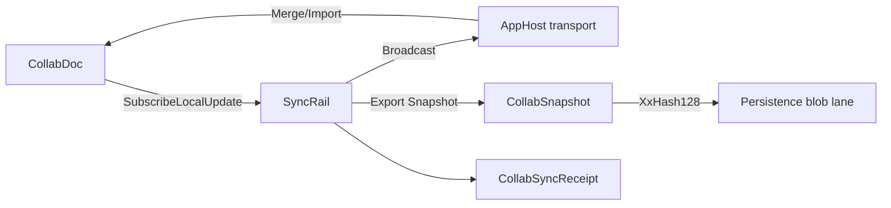
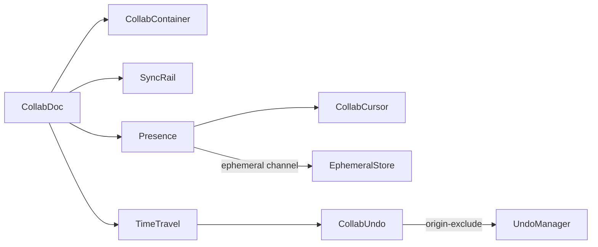

# [APPUI_COLLABORATION_DOCUMENT]

One CRDT document is the merge authority for every co-edited AppUi surface: `CollabDoc` wraps one `LoroDoc` whose nested container forest holds the notebook cells, the issue comment threads, the table rows, and the live-data annotations, `CollabContainer` is the attach-or-create vocabulary over the six container kinds, `SyncRail` carries the only sync path (each local op-log delta broadcasts and a remote delta imports), `Presence` publishes carets and selections through the TTL-expiring ephemeral channel beside the durable op-log, and `TimeTravel` checks out, forks, and history-preservingly reverts to any `Frontiers` cut. The document IS the convergence law, so every collaborative page composes this one owner and holds no merge, last-writer-wins, or fractional-index algebra of its own — the bespoke per-page CRDTs are DROPPED root-up. The spine is the `LoroCs` UniFFI binding over the Rust eg-walker/Fugue engine (`loro.dylib`, companion-only), the Persistence op-log changefeed, the AppHost transport and HLC, `System.IO.Hashing` content keys, Thinktecture.Runtime.Extensions, and LanguageExt rails.

## [01]-[INDEX]

- [01]-[DOCUMENT_OWNER]: One `LoroDoc`-backed merge authority; the container-attach vocabulary; the disposal law.
- [02]-[SYNC_RAIL]: Local-delta broadcast and remote-delta import as the only sync path; content-keyed snapshot durability.
- [03]-[PRESENCE]: Caret and awareness over the ephemeral channel; the position that survives concurrent edits.
- [04]-[TIME_TRAVEL]: Undo respecting remote ops; checkout, fork, and history-preserving revert over `Frontiers`.

## [02]-[DOCUMENT_OWNER]

- Owner: `CollabDoc` the one `LoroDoc`-backed merge authority; `CollabContainer` `[SmartEnum<string>]` the container-kind axis; `CollabFault` the fault family in the 4B00 code band.
- Cases: `CollabContainer` = text | map | list | movable-list | tree | counter under the locked kind literals — the six `LoroDoc` container kinds; `CollabFault` = Text | Detached | TimeTraveled | DecodeCorrupt | ImportIncompatible | Detach in the 4B00 code band.
- Entry: `public static CollabDoc Open(string key)` — a fresh auto-committing document; `public Fin<CollabHandle> Attach(CollabContainer kind, string name)` — attaches-or-creates a named root container of that kind, lifting the `LoroDoc.Get<Kind>` outcome onto the `Fin` rail and folding a `LoroException` to the typed `CollabFault` at this one boundary.
- Auto: the document is the convergence authority — `Apply` of any local edit and `Merge` of any remote replica's op-log both flow through the one `LoroDoc`, so a collaborative page holds NO custom last-writer-wins register, fractional-index insertion order, or tombstone set: the notebook cell sequence is a `movable-list` container whose `Mov` reorders by stable id, an issue comment thread is a `map` container keyed by comment GUID, a table is a `movable-list` whose `Mov` is the identity-preserving row reorder, and a rich-text cell is a `text` container whose `Mark` carries inline style spans; every container handle wraps a Rust pointer freed on detach, so `Attach` registers the handle into the activation scope and the disposal receipt frees it; the document key prefixes the Persistence content-key namespace so two replicas of one document converge under one identity.
- Packages: LoroCs, Thinktecture.Runtime.Extensions, LanguageExt.Core, NodaTime
- Growth: a co-edited surface is one `CollabContainer` attach, never a new CRDT; a new fault is one `CollabFault` case; a new container kind the binding adds is one `CollabContainer` row; zero new surface.
- Boundary: `CollabDoc` is the one merge authority in the package — a hand-rolled LWW/merge algebra beside it is the deleted form (the `[05]-[PROHIBITIONS]` CRDT clause), so the notebook, the issue board, the table, and the live-data annotation rails compose THIS owner and the bespoke `NotebookCrdt`/`NotebookOp` LWW algebra and the `CommentThread`/`CommentOp` register are DROPPED root-up; the `LoroValue`/`Diff`/`ExportMode` unions are pattern-matched at their leaf at the boundary and never re-modeled as a parallel enum; every `Loro*`/`Cursor`/`Frontiers`/`VersionVector` handle is an `IDisposable` Rust-pointer wrapper registered into the activation scope, never treated as managed-GC'd — a leaked handle is the deleted form; the engine is companion-only — `loro.dylib` firebreaks `CollabDoc` out of any in-Rhino plugin ALC, so an in-Rhino plugin assembly referencing this owner is the rejected form and the in-Rhino surface receives the materialized document state through the Persistence changefeed rather than the live `LoroDoc`; an edit while time-traveled (`EditWhenDetached`) and a container used after detach (`MisuseDetachedContainer`) fold to `CollabFault.TimeTraveled`/`Detached` at the attach boundary, never an interior throw.

```csharp signature
[SmartEnum<string>]
[KeyMemberEqualityComparer<CollabKeyPolicy, string>]
[KeyMemberComparer<CollabKeyPolicy, string>]
public sealed partial class CollabContainer {
    public static readonly CollabContainer Text = new("text", ContainerType.Text);
    public static readonly CollabContainer Map = new("map", ContainerType.Map);
    public static readonly CollabContainer List = new("list", ContainerType.List);
    public static readonly CollabContainer MovableList = new("movable-list", ContainerType.MovableList);
    public static readonly CollabContainer Tree = new("tree", ContainerType.Tree);
    public static readonly CollabContainer Counter = new("counter", ContainerType.Counter);

    public ContainerType Type { get; }
}

[Union]
public abstract partial record CollabFault : Expected, IValidationError<CollabFault> {
    private CollabFault(string detail, int code) : base(detail, code, None) { }

    public static CollabFault Create(string message) => new Text(message);

    public sealed record Text : CollabFault { public Text(string detail) : base(detail, 0x4B00) { } }
    public sealed record Detached : CollabFault { public Detached(string detail) : base(detail, 0x4B01) { } }
    public sealed record TimeTraveled : CollabFault { public TimeTraveled(string detail) : base(detail, 0x4B02) { } }
    public sealed record DecodeCorrupt : CollabFault { public DecodeCorrupt(string detail) : base(detail, 0x4B03) { } }
    public sealed record ImportIncompatible : CollabFault { public ImportIncompatible(string detail) : base(detail, 0x4B04) { } }
    public sealed record Detach : CollabFault { public Detach(string detail) : base(detail, 0x4B05) { } }
}

public sealed record CollabHandle(CollabContainer Kind, string Name, IDisposable Container);

public sealed record CollabDoc(LoroDoc Doc, string Key) : IDisposable {
    public static CollabDoc Open(string key) {
        LoroDoc doc = new();
        doc.SetRecordTimestamp(true);
        return new CollabDoc(doc, key);
    }

    public Fin<CollabHandle> Attach(CollabContainer kind, string name) =>
        Lift(() => kind.Switch<IDisposable>(
            text: _ => Doc.GetText(name),
            map: _ => Doc.GetMap(name),
            list: _ => Doc.GetList(name),
            movableList: _ => Doc.GetMovableList(name),
            tree: _ => Doc.GetTree(name),
            counter: _ => Doc.GetCounter(name)))
        .Map(container => new CollabHandle(kind, name, container));

    public Fin<Unit> Commit(string origin) =>
        Lift(() => { Doc.CommitWith(new CommitOptions { Origin = origin }); return unit; });

    internal static Fin<T> Lift<T>(Func<T> act) {
        try { return Fin<T>.Succ(act()); }
        catch (DecodeException ex) { return Fin<T>.Fail(new CollabFault.DecodeCorrupt(ex.Message)); }
        catch (IncompatibleFutureEncodingException ex) { return Fin<T>.Fail(new CollabFault.ImportIncompatible(ex.Message)); }
        catch (EditWhenDetached ex) { return Fin<T>.Fail(new CollabFault.TimeTraveled(ex.Message)); }
        catch (MisuseDetachedContainer ex) { return Fin<T>.Fail(new CollabFault.Detached(ex.Message)); }
        catch (LoroException ex) { return Fin<T>.Fail(new CollabFault.Text(ex.Message)); }
    }

    public void Dispose() => Doc.Dispose();
}

public sealed class CollabKeyPolicy : IEqualityComparerAccessor<string>, IComparerAccessor<string> {
    public static IEqualityComparer<string> EqualityComparer => StringComparer.Ordinal;

    public static IComparer<string> Comparer => StringComparer.Ordinal;
}

public sealed record LoroVal(LoroValue Value) : LoroValueLike {
    public LoroValue AsLoroValue() => Value;

    public static LoroVal Of(string value) => new(new LoroValue.String(value));
    public static LoroVal Of(long value) => new(new LoroValue.I64(value));
    public static LoroVal Of(double value) => new(new LoroValue.Double(value));
    public static LoroVal Of(bool value) => new(new LoroValue.Bool(value));
    public static LoroVal Of(ReadOnlyMemory<byte> value) => new(new LoroValue.Binary(value.ToArray()));
}
```

## [03]-[SYNC_RAIL]

- Owner: `SyncRail` the only sync path; `SyncMode` `[SmartEnum<string>]` the cold-load-versus-catch-up axis; `CollabSnapshot` the content-keyed persisted blob.
- Cases: `SyncMode` = snapshot | updates | shallow under the locked kind literals — `snapshot` is the cold full document load, `updates` is the version-vector catch-up delta a reconnecting client requests, `shallow` is the gc-trimmed bounded-history snapshot.
- Entry: `public IDisposable Broadcast(Func<ReadOnlyMemory<byte>, IO<Unit>> sink)` — subscribes to each local op-log delta and pushes the bytes to the composition-bound transport sink, returning the subscription handle; `public Fin<Unit> Merge(ReadOnlyMemory<byte> delta)` — imports a remote replica's op-log delta into the document, the document converging without conflict.
- Auto: `SubscribeLocalUpdate` yields each local delta `byte[]` so the only outbound path is the transport broadcast and the only inbound path is `Import`, and the document is the merge authority so the rail holds NO custom merge logic; a reconnecting client requests `ExportMode.Updates(VersionVector)` as its catch-up delta against its last-seen frontier and a cold client requests `ExportMode.Snapshot`; `CollabSnapshot` content-addresses the persisted blob by its `System.IO.Hashing` `XxHash128` exactly as the Persistence object-store keys its blobs, so the durable document state rides the one content-key discipline; the `ImportStatus` carries the success plus the pending spans so a delta whose dependency is missing surfaces its pending range rather than silently dropping.
- Receipt: a `CollabSyncReceipt` per merge carrying the delta byte length, the resulting op-log frontier, and the import success — sealed through the `ReceiptSinkPort` envelope; `TelemetryRow` contributes the merge-applied and merge-rejected instruments inward through the AppHost `TelemetryContributorPort`.
- Packages: LoroCs, System.IO.Hashing, Thinktecture.Runtime.Extensions, LanguageExt.Core, NodaTime, Rasm.Persistence (project)
- Growth: a new sync posture is one `SyncMode` row; one sync instrument is one `InstrumentRow` on `SyncRail.TelemetryRow`; zero new surface.
- Boundary: the op-log delta is the only sync path — `SubscribeLocalUpdate` -> broadcast and `Import` -> merge, so a central merge server is the deleted form and two offline replicas reconcile on reconnect; the rail rides the Persistence op-log changefeed already owned so the collaboration mints no second sync — the local delta projects onto the Persistence `OpLogEntry` at the seam exactly as the prior bespoke ops did, and Persistence replays the opaque delta blob without re-modeling the CRDT; the cold-load is `ExportMode.Snapshot` and the catch-up is `ExportMode.Updates(VersionVector)` against the client's last frontier, so a full re-send on every reconnect is the deleted form; `CollabSnapshot` content-addresses by `XxHash128` so the durable blob crosses the Persistence blob lane as a versioned opaque payload keyed by content, and `ExportShallowSnapshot(Frontiers)` is the gc-trimmed variant for bounded history; a `DecodeChecksumMismatchException`/`DecodeDataCorruptionException` on a corrupt imported stream folds to `CollabFault.DecodeCorrupt` at the merge boundary, never an interior throw.

```csharp signature
[SmartEnum<string>]
[KeyMemberEqualityComparer<CollabKeyPolicy, string>]
[KeyMemberComparer<CollabKeyPolicy, string>]
public sealed partial class SyncMode {
    public static readonly SyncMode Snapshot = new("snapshot");
    public static readonly SyncMode Updates = new("updates");
    public static readonly SyncMode Shallow = new("shallow");
}

public readonly record struct CollabSnapshot(string Key, string ContentHash, long Bytes, ReadOnlyMemory<byte> Blob) {
    public static CollabSnapshot Of(string key, ReadOnlyMemory<byte> blob) =>
        new(key, Convert.ToHexStringLower(XxHash128.Hash(blob.Span)), blob.Length, blob);
}

public readonly record struct CollabSyncReceipt(string Key, long Bytes, int Pending, bool Applied, Instant At, CorrelationId Correlation);

public sealed record SyncRail(CollabDoc Document, ClockPolicy Clocks, CorrelationId Correlation, Func<CollabSyncReceipt, IO<Unit>> Sink) {
    public const string AppliedInstrument = "rasm.appui.collab.merge-applied";
    public const string RejectedInstrument = "rasm.appui.collab.merge-rejected";

    public static TelemetryContributorPort TelemetryRow(string version) =>
        AppUiTelemetry.Contribute(version, AppliedInstrument, RejectedInstrument);

    public IDisposable Broadcast(Func<ReadOnlyMemory<byte>, IO<Unit>> sink) =>
        Document.Doc.SubscribeLocalUpdate(new LocalSink(sink));

    private sealed record LocalSink(Func<ReadOnlyMemory<byte>, IO<Unit>> Sink) : LocalUpdateCallback {
        public void OnLocalUpdate(byte[] update) => ignore(Sink(update).Run());
    }

    public IO<Fin<CollabSyncReceipt>> Merge(ReadOnlyMemory<byte> delta) =>
        IO.lift(() => CollabDoc.Lift(() => Document.Doc.Import(delta.ToArray()))
            .Map(status => new CollabSyncReceipt(Document.Key, delta.Length, status.Pending?.Count ?? 0, true, Clocks.Now, Correlation)))
            .Bind(result => result.Match(
                Succ: receipt => Sink(receipt).Map(_ => Fin.Succ(receipt)),
                Fail: error => IO.pure(Fin.Fail<CollabSyncReceipt>(error))));

    public CollabSnapshot Export(SyncMode mode, Option<VersionVector> since = default) =>
        CollabSnapshot.Of(Document.Key, mode.Switch(
            state: (Doc: Document.Doc, Since: since),
            snapshot: static s => s.Doc.Export(new ExportMode.Snapshot()),
            updates: static s => s.Doc.Export(new ExportMode.Updates(s.Since.IfNone(() => s.Doc.OplogVv()))),
            shallow: static s => s.Doc.ExportShallowSnapshot(s.Doc.OplogFrontiers())));
}
```



## [04]-[PRESENCE]

- Owner: `Presence` the caret-and-awareness owner; `PresenceKind` `[SmartEnum<string>]` the ephemeral-versus-awareness axis; `CollabCursor` the position that survives concurrent edits.
- Cases: `PresenceKind` = cursor | awareness under the locked kind literals — `cursor` is the TTL-expiring caret/selection channel through `EphemeralStore`, `awareness` is the per-peer user/color identity through `Awareness`.
- Entry: `public Fin<CollabCursor> Anchor(CollabHandle handle, uint position, Side side)` — anchors a stable cursor at a text/list position through `GetCursor`, the cursor surviving concurrent edits; `public IDisposable Publish(EphemeralStore store, Func<ReadOnlyMemory<byte>, IO<Unit>> sink)` — broadcasts each local presence change to peers and TTL-evicts outdated entries.
- Auto: a remote caret/selection publishes through `EphemeralStore` (TTL-expiring) and never enters the durable op-log, so a stale caret evicts on timeout rather than persisting; the cursor anchors through `GetCursor(pos, Side)` so it survives concurrent edits and a remote insert before it shifts it correctly, the rendered caret reading from `GetCursorPos(cursor)`; `Awareness` carries the per-peer user/color identity on its own channel through `Awareness(peer, timeoutMs).SetLocalState`/`Encode(peers)`/`Apply`; both channels encode to `byte[]` riding the same AppHost transport as the data updates but on a separate ephemeral topic, so presence and data never mix.
- Packages: LoroCs, Thinktecture.Runtime.Extensions, LanguageExt.Core
- Growth: a new presence channel is one `PresenceKind` row; a new presence field is one ephemeral key; zero new surface.
- Boundary: presence rides the ephemeral channel beside the data, never the durable op-log — a caret stored in the durable op-log is the deleted form, so `EphemeralStore`/`Awareness` are the presence owners and the durable document carries only edits; the cursor is the position that survives concurrent edits through `GetCursor`/`GetCursorPos` — a raw integer offset published as presence is the rejected form because a concurrent remote insert invalidates it; the `PosType` tri-encoding (`Bytes`/`Unicode`/`Utf16`) maps the editor's UTF-16 offsets onto loro's unicode indices through `ConvertPos` so an Avalonia caret position crosses correctly; `RemoveOutdated` is the TTL eviction so a disconnected peer's caret disappears; a `CannotFindRelativePosition` on a cursor whose anchor was gc'd folds to an absent cursor rather than a throw.

```csharp signature
[SmartEnum<string>]
[KeyMemberEqualityComparer<CollabKeyPolicy, string>]
[KeyMemberComparer<CollabKeyPolicy, string>]
public sealed partial class PresenceKind {
    public static readonly PresenceKind Cursor = new("cursor");
    public static readonly PresenceKind Awareness = new("awareness");
}

public sealed record CollabCursor(Cursor Anchor, PosType Encoding) : IDisposable {
    public void Dispose() => Anchor.Dispose();
}

public sealed record Presence(CollabDoc Document, ulong Peer, long TimeoutMs) {
    public Fin<CollabCursor> Anchor(CollabHandle handle, uint position, Side side) =>
        handle.Container switch {
            LoroText text => Optional(text.GetCursor(position, side)).Match(
                Some: cursor => Fin.Succ(new CollabCursor(cursor, PosType.Unicode)),
                None: () => Fin.Fail<CollabCursor>(new CollabFault.Detached(handle.Name))),
            LoroList list => Optional(list.GetCursor(position, side)).Match(
                Some: cursor => Fin.Succ(new CollabCursor(cursor, PosType.Unicode)),
                None: () => Fin.Fail<CollabCursor>(new CollabFault.Detached(handle.Name))),
            _ => Fin.Fail<CollabCursor>(new CollabFault.Detached(handle.Name)),
        };

    public IDisposable Publish(EphemeralStore store, Func<ReadOnlyMemory<byte>, IO<Unit>> sink) =>
        store.SubscribeLocalUpdate(new EphemeralSink(store, sink));

    private sealed record EphemeralSink(EphemeralStore Store, Func<ReadOnlyMemory<byte>, IO<Unit>> Sink) : LocalEphemeralListener {
        public void OnEphemeralUpdate(byte[] update) { Store.RemoveOutdated(); ignore(Sink(update).Run()); }
    }
}
```

## [05]-[TIME_TRAVEL]

- Owner: `TimeTravel` the checkout-fork-revert owner; `CollabUndo` the local-only undo respecting remote ops.
- Entry: `public Fin<Unit> Revert(Frontiers cut)` — appends inverse ops returning the document state to a historical cut while preserving history; `public CollabDoc Fork(Frontiers cut)` — branches a new independent document from a historical cut; `public Fin<Unit> Undo()` / `Redo()` — drives the local-only `UndoManager` that skips remote ops.
- Auto: `UndoManager(doc)` is the local-only undo — `AddExcludeOriginPrefix` excludes the programmatic origins (set via `CommitWith(CommitOptions{Origin})`) so a user's Ctrl-Z never reverts a peer's concurrent edit, and `GroupStart`/`GroupEnd` coalesce a multi-edit transaction into one undo unit; `RevertTo(Frontiers)` is the alternative history-preserving revert that appends inverse ops (rather than discarding history) so an audited timeline never rewrites; `Checkout(Frontiers)` time-travels the read state to a historical cut for inspection and `CheckoutToLatest` returns, while an edit during checkout faults `EditWhenDetached` so a detached edit is structurally rejected; `Fork(Frontiers)` branches an independent document so a what-if exploration never touches the shared timeline; the cut is a `Frontiers` DAG cut (a set of op-ids) read from `OplogFrontiers`, so time-travel keys on the op-log identity the sync rail already broadcasts.
- Receipt: a `CollabRevertReceipt` per revert carrying the target frontier digest and the appended inverse-op count — sealed through the `ReceiptSinkPort` envelope; the undo/redo verbs surface as `CommandIntent` table rows whose availability gates on `UndoManager.CanUndo`/`CanRedo`.
- Packages: LoroCs, Thinktecture.Runtime.Extensions, LanguageExt.Core, NodaTime
- Growth: a new time-travel verb is one operation on this owner; one undo verb is one `CommandIntent` row; zero new surface.
- Boundary: the local undo is `UndoManager` respecting remote-op origins — a hand-rolled undo stack that ignores remote ops is the deleted form, so `AddExcludeOriginPrefix` excludes programmatic origins and a user's Ctrl-Z reverts only the user's own edits; the audited revert is `RevertTo(Frontiers)` (history-preserving inverse ops) not a `Checkout` that discards history, so an audit timeline never loses an intermediate state; `Checkout` is read-only time-travel and an edit during checkout faults `EditWhenDetached` at the boundary, never a silent divergent write; `Fork` branches an independent document so a what-if never mutates the shared one; the undo/redo verbs are `CommandIntent` rows gating on `UndoManager.CanUndo`/`CanRedo` so the toolbar buttons derive from the manager state, never a manual enable flag; this is the one time-travel owner for the document — the notebook replay-determinism kernel (`Editing/notebook#REPLAY_BUNDLE`) composes the AppHost determinism kernel for bit-identity proof and is a distinct concern from this document-history time-travel, the two never folded into one revert vocabulary.

```csharp signature
public sealed record CollabRevertReceipt(string Key, string FrontierDigest, int InverseOps, Instant At, CorrelationId Correlation);

public sealed record CollabUndo(UndoManager Manager) : IDisposable {
    public static CollabUndo Of(CollabDoc document, Seq<string> excludeOrigins) {
        UndoManager manager = new(document.Doc);
        excludeOrigins.Iter(manager.AddExcludeOriginPrefix);
        return new CollabUndo(manager);
    }

    public const string UndoIntent = "collab.undo";
    public const string RedoIntent = "collab.redo";

    public Fin<Unit> Undo() => Manager.CanUndo() ? CollabDoc.Lift(() => ignore(Manager.Undo())) : Fin<Unit>.Fail(new CollabFault.Text("nothing-to-undo"));
    public Fin<Unit> Redo() => Manager.CanRedo() ? CollabDoc.Lift(() => ignore(Manager.Redo())) : Fin<Unit>.Fail(new CollabFault.Text("nothing-to-redo"));

    public void Dispose() => Manager.Dispose();
}

public sealed record TimeTravel(CollabDoc Document, ClockPolicy Clocks, CorrelationId Correlation) {
    public Fin<Unit> Revert(Frontiers cut) => CollabDoc.Lift(() => { Document.Doc.RevertTo(cut); return unit; });

    public Fin<Unit> Inspect(Frontiers cut) => CollabDoc.Lift(() => { Document.Doc.Checkout(cut); return unit; });

    public Fin<Unit> Resume() => CollabDoc.Lift(() => { Document.Doc.CheckoutToLatest(); return unit; });

    public Fin<CollabDoc> Fork(Frontiers cut) =>
        CollabDoc.Lift(() => Document.Doc.ForkAt(cut)).Map(forked => new CollabDoc(forked, $"{Document.Key}/fork"));
}
```



## [06]-[RESEARCH]

- [TRANSPORT_TOPIC]: the AppHost transport topic split the data delta and the ephemeral presence ride — the durable op-log delta on the document topic and the `EphemeralStore`/`Awareness` encode on the separate presence topic, resolved at implementation against the settled AppHost transport surface; the broadcast-and-import sync path, the content-keyed snapshot, and the ephemeral-beside-durable presence law are settled, the exact transport topic-name and subscription member spellings are the package-edge surface bound at composition.
