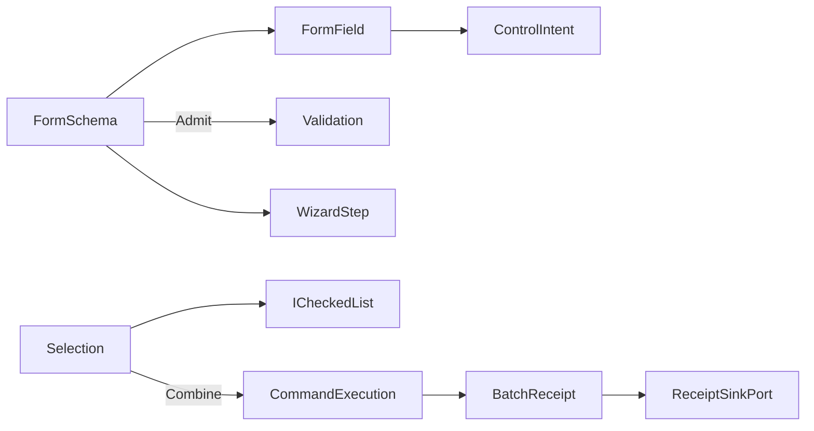

# [APPUI_FORMS_SELECTION]

A declarative forms-and-selection owner family delivers schema-driven forms with validation and wizard flows plus multi-selection batch editing over the admitted `PropertyModels` infrastructure with zero new package. `FormSchema` is a sequence of typed field rows, validation rules, and wizard steps materialized through the one `ControlFactory` (`Shell/controls`) and validated through the screens `Validation<Error,T>` lift; conditional visibility is schema data — each field declares its `DependsOn` key edges and its `Visible` predicate over `FormState`, so the schema itself owns re-evaluation and no attribute machinery is claimed for it; `Selection` is a model over the admitted `ICheckedList` driving batch-edit intents that fold to one combined `CommandReceipt` through `CommandExecution.Combine`. The page owns the form schema and wizard fold, the validation lift, and the selection-and-batch-edit fold; it mints no settings-dialog framework, no form-control framework, and no per-macro registry — forms ride the one control vocabulary, validation rides the one typed rail, and batch verbs ride the one command-combine algebra. The PropertyModels `[ConditionTarget]`/`[PropertyVisibilityCondition]`/`[DependsOnProperty]` annotations stay the inspector's law over `ReactiveObject` model properties and never govern this schema. The spine is `bodong.PropertyModels` (`ICheckedList`, `CheckedListEdit`), `ReactiveUI.Validation`, the `ControlIntent`/`ControlFactory` owner, the `CommandIntent`/`CommandExecution` rail, Thinktecture.Runtime.Extensions, and LanguageExt rails.

## [01]-[INDEX]

- [01]-[FORM_SCHEMA]: Typed field rows materialized through `ControlFactory`; validation as the one typed rail.
- [02]-[WIZARD_FLOW]: Multi-step wizard over the one schema; step gates ride the same validation rail.
- [03]-[SELECTION_MODEL]: Checked-list selection over the one admitted collection backing.
- [04]-[BATCH_EDIT]: N-item batch edit folding to one combined `CommandReceipt` through `CommandExecution.Combine`.

## [02]-[FORM_SCHEMA]

- Owner: `FormField` the typed field row; `FormSchema` the field-row sequence; `FormFault` the typed fault family on the `AppUiFaultBand.Form` registry row (6310); `FormSurface` the schema-to-control-intent fold.
- Cases: `FormFault` = Text | FieldInvalid | StepIncomplete | SubmitRejected — codes derive through the `Diagnostics/evidence.md#FAULT_TABLES` registry.
- Entry: `public ControlIntent Intent(FormField field)` — projects one typed field row onto its `ControlIntent` (`Shell/controls`) materialized through `ControlFactory`; `public IObservable<Validation<Error, FormState>> Admit(FormSchema schema, FormState state)` — the form-level admission folding every field's typed rail through the applicative `Validation` accumulate.
- Auto: a `FormField` carries its key, its label key, its typed shape (the same `EditorFactory`-shaped value vocabulary the inspector cells resolve — text/number/date/path/select/toggle/quantity/value-object), its declared `DependsOn` key edges, its `Visible` predicate over `FormState`, and its `Validation<Error,Unit>` rule, so a form is a field-row schema rather than a hand-laid-out settings dialog; `FormSurface.Intent` projects each field onto its `ControlIntent` so the form materializes through the one `ControlFactory` fold — a form-control framework is the deleted form; validation is the screens `Validation<Error,T>` lift (`Shell/screens#VALIDATION_UX`) so a field error feeds the same `Gate` context-validity stream the command table reads, and the form submit gates on the all-valid fold; conditional visibility is schema-owned propagation — a `FormState.With` write returns the changed key, `FormSchema.Affected` selects exactly the fields whose `DependsOn` edges touch it, and only those fields re-evaluate `Visible` and re-materialize, so a dependent field shows or hides with zero code-behind and zero unverified attribute machinery.
- Packages: bodong.PropertyModels, ReactiveUI.Validation, Thinktecture.Runtime.Extensions, LanguageExt.Core
- Growth: a new field type is one `FormField` shape reusing the `ControlIntent` vocabulary; a new validation rule is one `Validation<Error,T>` on the field; zero new surface — a settings-dialog or form framework is deleted by this schema over the one control vocabulary.
- Boundary: a form is a `FormSchema` materialized through `ControlFactory` — a settings-dialog framework, a form-builder, and a per-form control class are the deleted forms, so a form field is a `ControlIntent` and validation is the one `Validation<Error,T>` rail (a second validation scheme is the rejected form); the field's typed shape reuses the inspector `EditorFactory` value vocabulary so a quantity field, a value-object field, and an optional field all resolve through the one shape match, never a per-field editor; conditional visibility is the schema's own `DependsOn`-edge propagation — the PropertyModels visibility annotations bind `ReactiveObject` model properties at the inspector and never this schema, so a hand-wired show/hide handler and a claimed attribute propagation the schema cannot host are both rejected forms; the form-level admission accumulates every field error applicatively (independent fields accumulate, not short-circuit) so a user sees every invalid field at once; the form submit is a `CommandIntent` execution so availability gating, re-entrancy suppression, and the `CommandReceipt` arrive with zero local receipt code; the form state crosses no host type — it is a typed record the inspector and the wizard share.

```csharp signature
[Union]
public abstract partial record FormFault : Expected, IValidationError<FormFault> {
    private FormFault(string detail, int code) : base(detail, code, None) { }

    public static FormFault Create(string message) => new Text(message);

    public sealed record Text : FormFault { public Text(string detail) : base(detail, AppUiFaultBand.Form.Code(0)) { } }
    public sealed record FieldInvalid : FormFault { public FieldInvalid(string target, string detail) : base($"{target}: {detail}", AppUiFaultBand.Form.Code(1)) => Target = target; public string Target { get; } }
    public sealed record StepIncomplete : FormFault { public StepIncomplete(string detail) : base(detail, AppUiFaultBand.Form.Code(2)) { } }
    public sealed record SubmitRejected : FormFault { public SubmitRejected(string detail) : base(detail, AppUiFaultBand.Form.Code(3)) { } }
    public sealed record SchemaInvalid : FormFault { public SchemaInvalid(string detail) : base(detail, AppUiFaultBand.Form.Code(4)) { } }
}

public sealed record FormField(
    string Key,
    string LabelKey,
    ControlIntent Control,
    Seq<string> DependsOn,
    Func<FormState, bool> Visible,
    Func<FormState, Validation<Error, Unit>> Rule) {
    public static FormField Unconditional(string key, string labelKey, ControlIntent control, Func<FormState, Validation<Error, Unit>> rule) =>
        new(key, labelKey, control, Seq<string>(), static _ => true, rule);
}

public sealed record FormState(HashMap<string, JsonElement> Values) {
    public static readonly FormState Empty = new(HashMap<string, JsonElement>());
    public (FormState Next, string Changed) With(string key, JsonElement value) =>
        (this with { Values = Values.AddOrUpdate(key, value) }, key);
}

public sealed record FormSchema {
    private FormSchema(string key, string submitIntent, Seq<FormField> fields, Seq<WizardStep> steps) =>
        (Key, SubmitIntent, Fields, Steps) = (key, submitIntent, fields, steps);

    public string Key { get; }
    public string SubmitIntent { get; }
    public Seq<FormField> Fields { get; }
    public Seq<WizardStep> Steps { get; }

    public static Validation<Error, FormSchema> Create(string key, string submitIntent, Seq<FormField> fields, Seq<WizardStep> steps) {
        Set<string> fieldKeys = fields.Map(static field => field.Key).ToSet();
        Set<string> stepKeys = steps.Map(static step => step.Key).ToSet();
        return (
            guard(!string.IsNullOrWhiteSpace(key), (Error)new FormFault.SchemaInvalid("form key is empty")).ToValidation(),
            guard(fieldKeys.Count == fields.Count, (Error)new FormFault.SchemaInvalid($"{key}: duplicate field key")).ToValidation(),
            guard(fields.ForAll(field => field.DependsOn.ForAll(fieldKeys.Contains)), (Error)new FormFault.SchemaInvalid($"{key}: unknown dependency key")).ToValidation(),
            guard(stepKeys.Count == steps.Count, (Error)new FormFault.SchemaInvalid($"{key}: duplicate step key")).ToValidation(),
            guard(steps.ForAll(step => step.FieldKeys.ForAll(fieldKeys.Contains)), (Error)new FormFault.SchemaInvalid($"{key}: unknown step field")).ToValidation(),
            guard(Acyclic(fields), (Error)new FormFault.SchemaInvalid($"{key}: dependency cycle")).ToValidation())
            .Apply((_, _, _, _, _, _) => new FormSchema(key, submitIntent, fields, steps))
            .As();
    }

    public Validation<Error, FormState> Admit(FormState state) =>
        Fields.Filter(field => field.Visible(state))
            .Traverse(field => field.Rule(state).Map(static _ => unit)).As()
            .Map(_ => state);

    // Schema-owned visibility propagation: a changed key re-evaluates ONLY the fields declaring it as an
    // edge; a field with no DependsOn row never re-materializes on foreign writes.
    public Seq<FormField> Affected(string changedKey) =>
        Fields.Filter(field => field.DependsOn.Contains(changedKey));

    private static bool Acyclic(Seq<FormField> fields) {
        AdjacencyGraph<string, SEdge<string>> graph = new();
        fields.Iter(field => graph.AddVertex(field.Key));
        fields.Iter(field => field.DependsOn.Iter(dependency => graph.AddEdge(new SEdge<string>(dependency, field.Key))));
        return graph.IsDirectedAcyclicGraph();
    }
}

public static class FormSurface {
    extension(FormSchema schema) {
        public ControlIntent Layout(string panelKey, FormState state) =>
            new ControlIntent.Panel(
                panelKey,
                schema.Fields.Filter(field => field.Visible(state)).Map(static field => field.Control),
                ConstraintProgram: $"form-stack:{schema.Key}",
                new IntentBinding(schema.Key, "surface", None, None));
    }
}
```

## [03]-[WIZARD_FLOW]

- Owner: `WizardStep` the wizard-step row; `WizardState` the step-cursor state; `WizardFold` the step-transition fold.
- Entry: `public Fin<WizardState> Advance(WizardState cursor, FormState state)` — advances only when the current step's field rules validate through `AdmitStep`, sealing the accumulated failures as one `StepIncomplete` fault otherwise; `public WizardState Retreat(WizardState cursor)` — steps back with no validation gate.
- Auto: a `WizardStep` carries its field-key set and its `Skip` predicate, so a wizard is a sequence of field groups over the one `FormSchema` rather than a parallel multi-page model; `Advance` gates the forward transition on `AdmitStep` — the form validation rail narrowed to the current step's visible field keys, traversed applicatively so EVERY invalid step field reports at once — and `FieldKeys` is therefore behaviorally consumed by the transition, never a UI-only grouping; the visible field set narrows to the current step's keys so the wizard materializes only the current step's controls through `ControlFactory`; cross-step dependencies ride the same `DependsOn` edges — an earlier step's write re-evaluates exactly the later-step fields declaring it through `FormSchema.Affected`, no second propagation scheme.
- Packages: bodong.PropertyModels, Thinktecture.Runtime.Extensions, LanguageExt.Core
- Growth: a new wizard step is one `WizardStep` row on the schema; zero new surface.
- Boundary: a wizard is steps over the one `FormSchema` — a parallel wizard framework is the rejected form, so a step is a field-key group and the wizard materializes through the same `ControlFactory` fold; the forward gate IS the one `Validation<Error,T>` rail narrowed to the step's keys — a boolean completion predicate standing in for validation is the deleted form, and `Skip` marks only the conditional step the flow bypasses, never a validation substitute; the step cursor is a typed value the `ControlIntent.Tab`/`Accordion` wizard chrome reads so the wizard chrome is itself a materialized control.

```csharp signature
public sealed record WizardStep(string Key, string TitleKey, Seq<string> FieldKeys, Func<FormState, bool> Skip);

public sealed record WizardState(int Index, Seq<string> Visited) {
    public static WizardState Start => new(0, Seq<string>());
}

public static class WizardFold {
    extension(FormSchema schema) {
        // The forward gate is the form rail narrowed to the step: every visible step-field rule runs
        // applicatively, so the user sees every invalid field at once; Skip bypasses a conditional step.
        public Fin<WizardState> Advance(WizardState cursor, FormState state) =>
            schema.Steps.At(cursor.Index).Match(
                Some: step => step.Skip(state)
                    ? Fin.Succ(Advanced(schema, cursor, step, state))
                    : schema.AdmitStep(step, state).Match(
                        Succ: _ => Fin.Succ(Advanced(schema, cursor, step, state)),
                        Fail: error => Fin.Fail<WizardState>(new FormFault.StepIncomplete($"{step.Key}: {error.Message}"))),
                None: () => Fin.Succ(cursor));

        public Validation<Error, FormState> AdmitStep(WizardStep step, FormState state) =>
            schema.Fields.Filter(field => step.FieldKeys.Contains(field.Key) && field.Visible(state))
                .Traverse(field => field.Rule(state).Map(static _ => unit)).As()
                .Map(_ => state);

        public WizardState Retreat(WizardState cursor) => cursor with { Index = int.Clamp(cursor.Index - 1, 0, int.Max(0, schema.Steps.Count - 1)) };

        public Seq<FormField> StepFields(WizardState cursor) =>
            schema.Steps.At(cursor.Index).Match(
                Some: step => schema.Fields.Filter(field => step.FieldKeys.Contains(field.Key)),
                None: () => Seq<FormField>());
    }

    static WizardState Advanced(FormSchema schema, WizardState cursor, WizardStep step, FormState state) =>
        cursor with {
            Index = toSeq(Enumerable.Range(cursor.Index + 1, int.Max(0, schema.Steps.Count - cursor.Index - 1)))
                .Find(index => !schema.Steps[index].Skip(state))
                .IfNone(schema.Steps.Count),
            Visited = cursor.Visited.Add(step.Key),
        };
}
```

## [04]-[SELECTION_MODEL]

- Owner: `Selection<TItem>` the selection model over the admitted `ICheckedList` — the ONE selection backing, whose own `Select` verbs carry the exclusive modality; `SelectionMode` the single/multi axis carrying its own apply behavior.
- Entry: `public Selection<TItem> Apply(TItem item)` — one entrypoint per gesture: single mode selects exclusively through the admitted `Select`, multi mode toggles through `SetChecked`; `public Selection<TItem> Range(Seq<TItem> items, bool checkedState)` — a contiguous run through `SetRangeChecked`/`SelectRange`; `public Seq<TItem> Selected()` — projects the checked set through `ICheckedList.Items`.
- Auto: `Selection` wraps the admitted `ICheckedList` so the selection state rides the package collection, never a parallel selection list — the exclusive single-select modality is the SAME backing's `Select(object)` verb, so no second collection contract exists to bind; the mode row carries the apply delegate, so a click gesture is one `Apply` call and the exclusive-versus-toggle split is a policy value, never a caller branch; the checked set drives the batch-edit intent set and the selection-count availability input (`Commands#AVAILABILITY_ALGEBRA` `Availability.Selected`); the selection projects into the screen-state snapshot `Selection` field so a restored screen re-applies its selection.
- Packages: bodong.PropertyModels, Thinktecture.Runtime.Extensions, LanguageExt.Core
- Growth: a new selection mode is one `SelectionMode` row with its apply delegate; zero new surface — the admitted `ICheckedList` is the selection collection.
- Boundary: selection rides the admitted `ICheckedList` (`.api/api-propertygrid.md` collection entrypoints) — a parallel selection list is the deleted form, and a second backing contract bound for the exclusive modality is equally deleted because `Select(object)`/`SelectRange` already live on the checked list; the selection count feeds the command availability algebra so a batch verb gates on selection count structurally, never a manual count flag; selection persists on the screen-state `Selection` snapshot field so restore re-applies it; the selection model carries no UI control — the checked-list editor (`CheckedListEdit`) materializes through the inspector/control rail, so selection mints no second control.

```csharp signature
[SmartEnum]
public sealed partial class SelectionMode {
    public static readonly SelectionMode Single = new(
        static (backing, item) => backing.Select(item),
        static (backing, items, _) => backing.SelectRange(items));
    public static readonly SelectionMode Multi = new(
        static (backing, item) => backing.SetChecked(item, !backing.IsChecked(item)),
        static (backing, items, selected) => backing.SetRangeChecked(items, selected));

    [UseDelegateFromConstructor]
    public partial void Apply(ICheckedList backing, object item);

    [UseDelegateFromConstructor]
    public partial void ApplyRange(ICheckedList backing, IEnumerable<object> items, bool selected);
}

public sealed record Selection<TItem>(
    ICheckedList Backing,
    SelectionMode Mode,
    Func<object, Option<TItem>> Admit,
    Func<TItem, string> Identity) where TItem : notnull {
    public Selection<TItem> Apply(TItem item) =>
        (fun(() => Mode.Apply(Backing, item))(), this).Item2;

    public Selection<TItem> Range(Seq<TItem> items, bool checkedState) =>
        (fun(() => Mode.ApplyRange(Backing, items.Cast<object>(), checkedState))(), this).Item2;

    public Fin<Seq<TItem>> Selected() => toSeq(Backing.Items)
        .Traverse(item => Admit(item).ToFin(new FormFault.FieldInvalid("selection", item.GetType().Name)))
        .As();

    public int Count => Backing.Items.Length;
}
```

## [05]-[BATCH_EDIT]

- Owner: `BatchEdit<TItem>` the batch-edit fold; `BatchReceipt` the combined-edit evidence projecting the one `CommandReceipt`.
- Entry: `public Fin<CombinedReactiveCommand<CommandPayload, CommandReceipt>> Combine(Selection<TItem> selection, string verbIntent, CommandDeck deck)` — folds the N selected items' edit verbs into one combined command through `CommandExecution.Combine`, so a batch edit is one transaction over the one command-combine algebra.
- Auto: a batch verb over N selected items materializes through `CommandExecution.Combine` (`Commands#EXECUTION_RECEIPTS`) so the N child edits fold into one `CombinedReactiveCommand` whose availability is the all-true fold over the child `CanExecute` streams — a per-macro registry is the deleted form; each child edit still seals one `CommandReceipt` through the same `ReceiptSinkPort` so batch evidence never collapses into one opaque receipt; the batch availability gates on the selection count so a batch verb is unavailable on an empty selection structurally; an unknown verb key aborts the batch on the `Fin` rail rather than dropping silently.
- Receipt: each child edit seals its `CommandReceipt`; the batch correlates them under one `CorrelationId` so the batch is one traceable transaction with N receipts; `TelemetryRow` contributes the batch-applied and batch-rejected instruments inward through the AppHost `TelemetryContributorPort`.
- Packages: ReactiveUI, Thinktecture.Runtime.Extensions, LanguageExt.Core
- Growth: a new batch verb is one `CommandIntent` row the selection folds over; one batch instrument is one `InstrumentRow` on `BatchEdit.TelemetryRow`; zero new surface.
- Boundary: batch editing folds through the one `CommandExecution.Combine` algebra — a per-macro registry, a batch payload case beside the closed four-case `CommandPayload` union, and a batch-local receipt are the rejected forms (`Commands#EXECUTION_RECEIPTS` boundary), so N selected items edit in one transaction and each child seals its own `CommandReceipt`; the batch availability is the all-true fold `CreateCombined` computes over child `CanExecute`, so a hand-written aggregate gate is the rejected form; an unknown verb key aborts the macro on the `Fin` rail through the same `TryGetValue` probe `Combine` uses, never a `ContainsKey` filter drop; the batch correlates under one `CorrelationId` so a multi-item edit is one traceable transaction; host-mutating batch edits route through the abstract `DocumentTransaction` surface-host port so the undo scope batches the N edits as one host transaction, and the revertible op-log records the batch as one `RevertScope` (`Editing/history`); the batch verbs derive from the command table so a coordination/inspector batch action is an intent key, never a batch-local command.

```csharp signature
public sealed record BatchReceipt(string Verb, int Items, CorrelationId Correlation, Seq<CommandReceipt> Children) {
    public const string Kind = "batch";
}

public static class BatchEdit {
    public const string AppliedInstrument = "rasm.appui.batch.applied";
    public const string RejectedInstrument = "rasm.appui.batch.rejected";

    public static TelemetryContributorPort TelemetryRow(string version) =>
        AppUiTelemetry.Contribute(version, AppliedInstrument, RejectedInstrument);

    extension<TItem>(Selection<TItem> selection) where TItem : notnull {
        public Fin<CombinedReactiveCommand<CommandPayload, CommandReceipt>> Combine(string verbIntent, CommandDeck deck) =>
            selection.Count > 0
                ? deck.Combine(Enumerable.Repeat(verbIntent, selection.Count).ToArray())
                : Fin.Fail<CombinedReactiveCommand<CommandPayload, CommandReceipt>>(new FormFault.SubmitRejected($"{verbIntent}: empty selection"));

        public Fin<CommandPayload> Payload() => selection.Selected()
            .Map(items => (CommandPayload)new CommandPayload.Many(items.Map(selection.Identity)));

        public Fin<BatchReceipt> Seal(string verb, CorrelationId correlation, Seq<CommandReceipt> children) =>
            children.Count == selection.Count
                ? Fin.Succ(new BatchReceipt(verb, selection.Count, correlation, children))
                : Fin.Fail<BatchReceipt>(new FormFault.SubmitRejected($"{verb}: expected {selection.Count} child receipts, received {children.Count}"));
    }
}
```



## [06]-[RESEARCH]

- [CHECKED_LIST_BACKING]: the admitted `PropertyModels.Collections.ICheckedList` member surface the `Selection` model binds is settled — `IsChecked(object)` returns `bool`, `SetChecked(object, bool)`, `Select(object)`, `SelectRange(...)`, and `SetRangeChecked(IEnumerable<object>, bool)` return `void` (so `Selection.Apply`/`Range` sequence the void write through the `(fun(() => write)(), this).Item2` idiom), `Items`/`SourceItems` are `object[]` (length read through `.Length`), and `SelectionChanged` is the change event (`.api/api-propertygrid.md` collection entrypoints); the `CheckedListEdit`/`RadioButtonListEdit` editor the checked set materializes through, the `FormSchema`/`WizardStep` fold, the `DependsOn`-edge visibility propagation, the `Validation<Error,T>` lift, and the `CommandExecution.Combine` batch fold are settled with no unverified member at the package edge.
