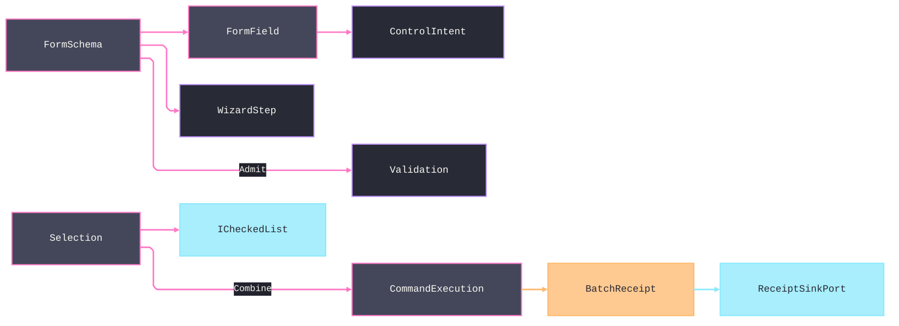

# [APPUI_FORMS_SELECTION]

A declarative forms-and-selection owner family delivers schema-driven forms with validation and wizard flows plus multi-selection batch editing over the admitted `PropertyModels` infrastructure with zero new package. `FormSchema` is a sequence of typed field rows, validation rules, and wizard steps materialized through the one `ControlFactory` (`Shell/controls`) and validated through the screens `Validation<Error,T>` lift; conditional visibility is schema data — each field declares its `DependsOn` key edges and its `Visible` predicate over `FormState`, so the schema itself owns re-evaluation and no attribute machinery is claimed for it; `Selection` is a model over the admitted `ICheckedList` driving batch-edit intents that fold to one combined `CommandReceipt` through `CommandExecution.Combine`, and `SelectionSet` is the durable named element set the selection captures, composes through `SelectionAlgebra` rows, and re-applies. The page owns the form schema and wizard fold, the validation lift, and the selection-and-batch-edit fold; it mints no settings-dialog framework, no form-control framework, and no per-macro registry — forms ride the one control vocabulary, validation rides the one typed rail, and batch verbs ride the one command-combine algebra. The PropertyModels `[ConditionTarget]`/`[PropertyVisibilityCondition]`/`[DependsOnProperty]` annotations stay the inspector's law over `ReactiveObject` model properties and never govern this schema. The spine is `bodong.PropertyModels` (`ICheckedList`, `CheckedListEdit`), `ReactiveUI.Validation`, the `ControlIntent`/`ControlFactory` owner, the `CommandIntent`/`CommandExecution` rail, Thinktecture.Runtime.Extensions, and LanguageExt rails.

## [01]-[INDEX]

- [01]-[FORM_SCHEMA]: Typed field rows materialized through `ControlFactory`; validation as the one typed rail.
- [02]-[WIZARD_FLOW]: Multi-step wizard over the one schema; step gates ride the same validation rail.
- [03]-[SELECTION_MODEL]: Checked-list selection over the one admitted collection backing; durable named selection sets.
- [04]-[BATCH_EDIT]: N-item batch edit folding to one combined `CommandReceipt` through `CommandExecution.Combine`.

## [02]-[FORM_SCHEMA]

- Owner: `FormField` the typed field row; `FormSchema` the field-row sequence; `FormFault` the typed fault family on the `AppUiFaultBand.Form` registry row (6310); `FormSurface` the schema-to-control-intent fold.
- Cases: `FormFault` = Text | FieldInvalid | StepIncomplete | SubmitRejected — codes derive through the `AppUiFaultBand.Form` registry row.
- Entry: `FormSchema.Create` accumulates schema-identity, dependency, step-membership, and DAG faults; `FormSchema.With` admits one erased `JsonElement` through the addressed field's `AdmitValue` rail before state mutation; `FormSchema.Admit` accumulates every visible field rule; `FormSurface.Layout` projects admitted field rows onto `ControlIntent` values materialized through `ControlFactory`.
- Auto: a `FormField` carries its key, label key, `ControlIntent`, dependency edges, visibility predicate, erased-boundary `AdmitValue` validator, and state-level rule. `FormSchema.Create` rejects duplicate identities, unknown dependency or step references, and cyclic dependency graphs before a form exists. `FormSchema.With` resolves the field and validates the serialized value before the internal state write, so heterogeneous storage never becomes untyped admission. `FormSchema.Affected` selects exactly the fields whose `DependsOn` edges touch the changed key, and `FormSchema.Admit` traverses visible rules applicatively so independent failures accumulate.
- Packages: bodong.PropertyModels, ReactiveUI.Validation, QuikGraph (shared tier), Thinktecture.Runtime.Extensions, LanguageExt.Core
- Growth: a new field type is one `FormField` shape reusing the `ControlIntent` vocabulary; a new validation rule is one `Validation<Error,T>` on the field; zero new surface — a settings-dialog or form framework is deleted by this schema over the one control vocabulary.
- Boundary: a form is a validated `FormSchema` materialized through `ControlFactory`; a settings-dialog framework, form-builder, per-form control class, and second validation scheme are rejected. The heterogeneous `FormState` stores serialized values, but only `FormSchema.With` can mutate it and each field's `AdmitValue` restores its shape invariant at that boundary. Dependency propagation remains schema-owned, form validation accumulates independent failures, and submit rides the one `CommandIntent` rail.

```csharp signature
[Union]
public abstract partial record FormFault : Expected, IValidationError<FormFault> {
    private FormFault(string detail, int code) : base(detail, code, None) { }

    public static FormFault Create(string message) => new Text(message);

    public sealed record Text : FormFault { public Text(string detail) : base(detail, AppUiFaultBand.Form.Code(0)) { } }
    public sealed record FieldInvalid : FormFault { public FieldInvalid(string target, string detail) : base($"{target}: {detail}", AppUiFaultBand.Form.Code(1)) => Target = target; public string Target { get; } }
    public sealed record StepIncomplete : FormFault { public StepIncomplete(string detail) : base(detail, AppUiFaultBand.Form.Code(2)) { } }
    public sealed record SubmitRejected : FormFault { public SubmitRejected(string detail) : base(detail, AppUiFaultBand.Form.Code(3)) { } }
    public sealed record SchemaInvalid : FormFault { public SchemaInvalid(string detail) : base(detail, AppUiFaultBand.Form.Code(4)) { } }
}

public sealed record FormField(
    string Key,
    string LabelKey,
    ControlIntent Control,
    Seq<string> DependsOn,
    Func<FormState, bool> Visible,
    Func<JsonElement, Validation<Error, JsonElement>> AdmitValue,
    Func<FormState, Validation<Error, Unit>> Rule) {
    public static FormField Unconditional(
        string key,
        string labelKey,
        ControlIntent control,
        Func<JsonElement, Validation<Error, JsonElement>> admitValue,
        Func<FormState, Validation<Error, Unit>> rule) =>
        new(key, labelKey, control, Seq<string>(), static _ => true, admitValue, rule);
}

public sealed record FormState(HashMap<string, JsonElement> Values) {
    public static readonly FormState Empty = new(HashMap<string, JsonElement>());
    internal (FormState Next, string Changed) With(string key, JsonElement value) =>
        (this with { Values = Values.AddOrUpdate(key, value) }, key);
}

public sealed record FormSchema {
    private FormSchema(string key, string submitIntent, Seq<FormField> fields, Seq<WizardStep> steps) =>
        (Key, SubmitIntent, Fields, Steps) = (key, submitIntent, fields, steps);

    public string Key { get; }
    public string SubmitIntent { get; }
    public Seq<FormField> Fields { get; }
    public Seq<WizardStep> Steps { get; }

    public static Validation<Error, FormSchema> Create(string key, string submitIntent, Seq<FormField> fields, Seq<WizardStep> steps) {
        Set<string> fieldKeys = toSet(fields.Map(static field => field.Key));
        Set<string> stepKeys = toSet(steps.Map(static step => step.Key));
        return (
            guard(!string.IsNullOrWhiteSpace(key), (Error)new FormFault.SchemaInvalid("form key is empty")).ToValidation(),
            guard(!string.IsNullOrWhiteSpace(submitIntent), (Error)new FormFault.SchemaInvalid($"{key}: submit intent is empty")).ToValidation(),
            guard(fieldKeys.Count == fields.Count, (Error)new FormFault.SchemaInvalid($"{key}: duplicate field key")).ToValidation(),
            guard(fields.ForAll(static field => !string.IsNullOrWhiteSpace(field.Key) && !string.IsNullOrWhiteSpace(field.LabelKey)),
                (Error)new FormFault.SchemaInvalid($"{key}: field identity is empty")).ToValidation(),
            guard(fields.ForAll(field => field.DependsOn.ForAll(fieldKeys.Contains)), (Error)new FormFault.SchemaInvalid($"{key}: unknown dependency key")).ToValidation(),
            guard(stepKeys.Count == steps.Count, (Error)new FormFault.SchemaInvalid($"{key}: duplicate step key")).ToValidation(),
            guard(steps.ForAll(static step => !string.IsNullOrWhiteSpace(step.Key)
                    && !string.IsNullOrWhiteSpace(step.TitleKey)
                    && step.FieldKeys.Distinct().Count == step.FieldKeys.Count),
                (Error)new FormFault.SchemaInvalid($"{key}: step identity or field roster is invalid")).ToValidation(),
            guard(steps.ForAll(step => step.FieldKeys.ForAll(fieldKeys.Contains)), (Error)new FormFault.SchemaInvalid($"{key}: unknown step field")).ToValidation(),
            guard(Acyclic(fields), (Error)new FormFault.SchemaInvalid($"{key}: dependency cycle")).ToValidation())
            .Apply((_, _, _, _, _, _, _, _, _) => new FormSchema(key, submitIntent, fields, steps))
            .As();
    }

    public Validation<Error, FormState> Admit(FormState state) =>
        Fields.Filter(field => field.Visible(state))
            .Traverse(field => field.Rule(state).Map(static _ => unit)).As()
            .Map(_ => state);

    public Validation<Error, (FormState Next, string Changed)> With(FormState state, string key, JsonElement value) =>
        Fields.Find(field => StringComparer.Ordinal.Equals(field.Key, key))
            .ToValidation((Error)new FormFault.FieldInvalid(key, "unknown field"))
            .Bind(field => field.AdmitValue(value))
            .Map(admitted => state.With(key, admitted));

    // Schema-owned visibility propagation: a changed key re-evaluates ONLY the fields declaring it as an
    // edge; a field with no DependsOn row never re-materializes on foreign writes.
    public Seq<FormField> Affected(string changedKey) =>
        Fields.Filter(field => field.DependsOn.Contains(changedKey));

    private static bool Acyclic(Seq<FormField> fields) {
        AdjacencyGraph<string, SEdge<string>> graph = new();
        fields.Iter(field => graph.AddVertex(field.Key));
        fields.Iter(field => field.DependsOn.Iter(dependency => graph.AddEdge(new SEdge<string>(dependency, field.Key))));
        return graph.IsDirectedAcyclicGraph();
    }
}

public static class FormSurface {
    extension(FormSchema schema) {
        public ControlIntent Layout(string panelKey, FormState state) =>
            new ControlIntent.Panel(
                panelKey,
                schema.Fields.Filter(field => field.Visible(state)).Map(static field => field.Control),
                ConstraintProgram: $"form-stack:{schema.Key}",
                new IntentBinding(schema.Key, "surface", None, None));
    }
}
```

## [03]-[WIZARD_FLOW]

- Owner: `WizardStep` the wizard-step row; `WizardState` the step-cursor state; `WizardFold` the step-transition fold.
- Entry: `public Fin<WizardState> Advance(WizardState cursor, FormState state)` — advances only when the current step's field rules validate through `AdmitStep`, sealing the accumulated failures as one `StepIncomplete` fault otherwise; `public WizardState Retreat(WizardState cursor, FormState state)` — steps back to the nearest earlier non-skipped step with no validation gate; a flow whose every earlier step is bypassed holds its position.
- Auto: a `WizardStep` carries its field-key set and its `Skip` predicate, so a wizard is a sequence of field groups over the one `FormSchema` rather than a parallel multi-page model; `Advance` gates the forward transition on `AdmitStep` — the form validation rail narrowed to the current step's visible field keys, traversed applicatively so EVERY invalid step field reports at once — and `FieldKeys` is therefore behaviorally consumed by the transition, never a UI-only grouping; the visible field set narrows to the current step's keys so the wizard materializes only the current step's controls through `ControlFactory`; cross-step dependencies ride the same `DependsOn` edges — an earlier step's write re-evaluates exactly the later-step fields declaring it through `FormSchema.Affected`, no second propagation scheme.
- Packages: bodong.PropertyModels, Thinktecture.Runtime.Extensions, LanguageExt.Core
- Growth: a new wizard step is one `WizardStep` row on the schema; zero new surface.
- Boundary: a wizard is steps over the one `FormSchema` — a parallel wizard framework is the rejected form, so a step is a field-key group and the wizard materializes through the same `ControlFactory` fold; the forward gate IS the one `Validation<Error,T>` rail narrowed to the step's keys — a boolean completion predicate standing in for validation is the deleted form, and `Skip` marks only the conditional step the flow bypasses, never a validation substitute; the step cursor is a typed value the `ControlIntent.Tab`/`Accordion` wizard chrome reads so the wizard chrome is itself a materialized control.

```csharp signature
public sealed record WizardStep(string Key, string TitleKey, Seq<string> FieldKeys, Func<FormState, bool> Skip);

public sealed record WizardState(int Index, Seq<string> Visited) {
    public static WizardState Start => new(0, Seq<string>());
}

public static class WizardFold {
    extension(FormSchema schema) {
        // The forward gate is the form rail narrowed to the step: every visible step-field rule runs
        // applicatively, so the user sees every invalid field at once; Skip bypasses a conditional step.
        public Fin<WizardState> Advance(WizardState cursor, FormState state) =>
            schema.Steps.At(cursor.Index).Match(
                Some: step => step.Skip(state)
                    ? Fin.Succ(Advanced(schema, cursor, step, state))
                    : schema.AdmitStep(step, state).Match(
                        Succ: _ => Fin.Succ(Advanced(schema, cursor, step, state)),
                        Fail: error => Fin.Fail<WizardState>(new FormFault.StepIncomplete($"{step.Key}: {error.Message}"))),
                None: () => Fin.Succ(cursor));

        public Validation<Error, FormState> AdmitStep(WizardStep step, FormState state) =>
            schema.Fields.Filter(field => step.FieldKeys.Contains(field.Key) && field.Visible(state))
                .Traverse(field => field.Rule(state).Map(static _ => unit)).As()
                .Map(_ => state);

        // Retreat mirrors Advanced: the cursor lands on the nearest EARLIER non-skipped step, so a
        // bypassed conditional step is never re-presented walking backwards.
        public WizardState Retreat(WizardState cursor, FormState state) => cursor with {
            Index = toSeq(Enumerable.Range(0, int.Min(cursor.Index, schema.Steps.Count)))
                .Reverse()
                .Find(index => !schema.Steps[index].Skip(state))
                .IfNone(cursor.Index),
        };

        public Seq<FormField> StepFields(WizardState cursor) =>
            schema.Steps.At(cursor.Index).Match(
                Some: step => schema.Fields.Filter(field => step.FieldKeys.Contains(field.Key)),
                None: () => Seq<FormField>());
    }

    static WizardState Advanced(FormSchema schema, WizardState cursor, WizardStep step, FormState state) =>
        cursor with {
            Index = toSeq(Enumerable.Range(cursor.Index + 1, int.Max(0, schema.Steps.Count - cursor.Index - 1)))
                .Find(index => !schema.Steps[index].Skip(state))
                .IfNone(schema.Steps.Count),
            Visited = cursor.Visited.Add(step.Key),
        };
}
```

## [04]-[SELECTION_MODEL]

- Owner: `Selection<TItem>` the selection model over the admitted `ICheckedList` — the ONE selection backing, whose own `Select` verbs carry the exclusive modality; `SelectionMode` the single/multi axis carrying its own apply behavior; `SelectionSet` the durable named element set with its `SelectionAlgebra` composition rows.
- Entry: `Apply` and `Range` return `Fin<Selection<TItem>>`, reject values outside `Backing.Items`, and then route admitted gestures through the `SelectionMode` delegate columns; `Selected` traverses every checked value through `Admit`; `Payload` rejects empty or duplicate stable identities before constructing `CommandPayload.Many`; `Capture` seals the checked projection as a named `SelectionSet` and `ApplySet` re-applies a set's members over the live item roster.
- Auto: `Selection` wraps the admitted `ICheckedList` so the selection state rides the package collection, never a parallel selection list — the exclusive single-select modality is the SAME backing's `Select(object)` verb, so no second collection contract exists to bind; the mode row carries the apply delegate, so a click gesture is one `Apply` call and the exclusive-versus-toggle split is a policy value, never a caller branch; the checked set drives the batch-edit intent set and the selection-count availability input (`Commands#AVAILABILITY_ALGEBRA` `Availability.Selected`); the selection projects into the screen-state snapshot `Selection` field so a restored screen re-applies its selection.
- Packages: bodong.PropertyModels, Thinktecture.Runtime.Extensions, LanguageExt.Core
- Growth: a new selection mode is one `SelectionMode` row with its apply delegate; a new set operation is one `SelectionAlgebra` row; zero new surface — the admitted `ICheckedList` is the selection collection.
- Boundary: selection rides the admitted `ICheckedList`; single mode applies only the first range item through `Select`, multi mode applies the whole range through `SetRangeChecked`, and `Count` counts checked items rather than source items. The selection count feeds command availability, selection persists on the screen-state snapshot, and the checked-list editor materializes through the inspector/control rail without a second control or backing collection. A `SelectionSet` persists as one policy row through the Persistence store port, and its `Members` projection is the one scope vocabulary batch edit, issue component selection, visibility isolation, and dashboard cross-filter consume; element-set queries stay Bim-owned receipts, so a saved query set stores the receipt's member identities and AppUi runs no query engine.

```csharp signature
[SmartEnum]
public sealed partial class SelectionMode {
    public static readonly SelectionMode Single = new(
        static (backing, item) => backing.Select(item),
        static (backing, items, _) => items.HeadOrNone.Iter(backing.Select));
    public static readonly SelectionMode Multi = new(
        static (backing, item) => backing.SetChecked(item, !backing.IsChecked(item)),
        static (backing, items, selected) => backing.SetRangeChecked(items, selected));

    [UseDelegateFromConstructor]
    public partial void Apply(ICheckedList backing, object item);

    [UseDelegateFromConstructor]
    public partial void ApplyRange(ICheckedList backing, Seq<object> items, bool selected);
}

public sealed record Selection<TItem>(
    ICheckedList Backing,
    SelectionMode Mode,
    Func<object, Option<TItem>> Admit,
    Func<TItem, string> Identity) where TItem : notnull {
    public Fin<Selection<TItem>> Apply(TItem item) =>
        Backing.Items.Contains(item)
            ? Fin.Succ((fun(() => Mode.Apply(Backing, item))(), this).Item2)
            : Fin.Fail<Selection<TItem>>(new FormFault.FieldInvalid("selection", "item is outside the backing"));

    public Fin<Selection<TItem>> Range(Seq<TItem> items, bool checkedState) =>
        items.ForAll(item => Backing.Items.Contains(item))
            ? Fin.Succ((fun(() => Mode.ApplyRange(Backing, items.Cast<object>().ToSeq(), checkedState))(), this).Item2)
            : Fin.Fail<Selection<TItem>>(new FormFault.FieldInvalid("selection", "range contains an item outside the backing"));

    public Fin<Seq<TItem>> Selected() => toSeq(Backing.Items).Filter(Backing.IsChecked)
        .Traverse(item => Admit(item).ToFin(new FormFault.FieldInvalid("selection", item.GetType().Name)))
        .As();

    public int Count => Backing.Items.Count(Backing.IsChecked);

    public Fin<SelectionSet> Capture(string key, string name) =>
        !string.IsNullOrWhiteSpace(key) && !string.IsNullOrWhiteSpace(name)
            ? Selected().Map(items => new SelectionSet(key, name, toSet(items.Map(Identity))))
            : Fin.Fail<SelectionSet>(new FormFault.FieldInvalid("selection-set", "key and name are required"));

    // Set application is an EXACT projection: members check true and every other live item checks false
    // in one pass, so restoration can never union with stale pre-existing selection.
    public Fin<Selection<TItem>> ApplySet(SelectionSet set, Seq<TItem> items) =>
        Range(items.Filter(item => !set.Members.Contains(Identity(item))), checkedState: false)
            .Bind(_ => Range(items.Filter(item => set.Members.Contains(Identity(item))), checkedState: true));
}

// The durable selection noun: manual picks and Bim-owned query receipts seal to the same named member
// set, so every apply-to-these-elements workflow scopes on one stable vocabulary.
[SmartEnum<string>(SwitchMethods = SwitchMapMethodsGeneration.None, MapMethods = SwitchMapMethodsGeneration.None)]
[KeyMemberEqualityComparer<ComparerAccessors.StringOrdinal, string>]
[KeyMemberComparer<ComparerAccessors.StringOrdinal, string>]
public sealed partial class SelectionAlgebra {
    public static readonly SelectionAlgebra Union = new("union", static (left, right) => left + right);
    public static readonly SelectionAlgebra Intersect = new("intersect", static (left, right) => left.Intersect(right));
    public static readonly SelectionAlgebra Subtract = new("subtract", static (left, right) => left.Except(right));

    [UseDelegateFromConstructor]
    public partial Set<string> Fold(Set<string> left, Set<string> right);
}

public sealed record SelectionSet(string Key, string Name, Set<string> Members) {
    public SelectionSet Combine(SelectionAlgebra op, SelectionSet other) => this with { Members = op.Fold(Members, other.Members) };
}
```

## [05]-[BATCH_EDIT]

- Owner: `BatchEdit<TItem>` the batch-edit fold; `BatchReceipt` the combined-edit evidence projecting the one `CommandReceipt`.
- Entry: `public IO<Fin<BatchReceipt>> Execute(string verbIntent, CommandDeck deck, CorrelationId correlation)` — the one composed batch transaction: `Payload` snapshots the immutable identity set, `Combine` resolves the one admitted command row, the command executes once with `CommandPayload.Many`, and `Seal` derives the receipt from the same snapshot; repeated identical children multiplying the same many-item mutation are rejected.
- Auto: a batch verb over N selected items materializes one child through `CommandExecution.Combine` so its existing availability, execution, and receipt law remain authoritative; the batch availability additionally gates on non-empty selection, and an unknown verb key aborts on `Fin` rather than dropping silently. The many-item payload is the batch discriminant, so a second macro registry and N duplicated command children are deleted forms.
- Receipt: the one command execution seals one `CommandReceipt`, and `BatchReceipt` derives item count from the executed `CommandPayload.Many` snapshot rather than mutable selection state, then adds correlation without inventing N synthetic child receipts; `TelemetryRow` contributes the batch-applied and batch-rejected instruments inward through the AppHost `TelemetryContributorPort`.
- Packages: ReactiveUI, Thinktecture.Runtime.Extensions, LanguageExt.Core
- Growth: a new batch verb is one `CommandIntent` row the selection folds over; one batch instrument is one `InstrumentRow` on `BatchEdit.TelemetryRow`; zero new surface.
- Boundary: batch editing folds through the one `CommandExecution.Combine` algebra with one intent key and one `CommandPayload.Many`; a per-macro registry, a batch payload case beside the closed four-case `CommandPayload` union, and repeated identical command children are rejected. An unknown verb key aborts the macro on the `Fin` rail through the same `TryGetValue` probe `Combine` uses; the batch correlates under one `CorrelationId` so a multi-item edit is one traceable transaction. Host-mutating batch edits route through the abstract `DocumentTransaction` surface-host port so the undo scope batches the N edits as one host transaction, and the revertible op-log records the batch as one `RevertScope` (`Editing/history`); the batch verbs derive from the command table so a coordination/inspector batch action is an intent key, never a batch-local command.

```csharp signature
public sealed record BatchReceipt(string Verb, int Items, CorrelationId Correlation, CommandReceipt Command) {
    public const string Kind = "batch";
}

public static class BatchEdit {
    public const string AppliedInstrument = "rasm.appui.batch.applied";
    public const string RejectedInstrument = "rasm.appui.batch.rejected";

    public static TelemetryContributorPort TelemetryRow(string version) =>
        AppUiTelemetry.Contribute(version,
            new(AppliedInstrument, InstrumentKind.Count, "{batch}", "batch edits applied"),
            new(RejectedInstrument, InstrumentKind.Count, "{batch}", "batch edits rejected"));

    extension<TItem>(Selection<TItem> selection) where TItem : notnull {
        public Fin<CombinedReactiveCommand<CommandPayload, CommandReceipt>> Combine(string verbIntent, CommandDeck deck) =>
            selection.Count > 0
                ? deck.Combine(verbIntent)
                : Fin.Fail<CombinedReactiveCommand<CommandPayload, CommandReceipt>>(new FormFault.SubmitRejected($"{verbIntent}: empty selection"));

        public Fin<CommandPayload.Many> Payload() => selection.Selected().Bind(items => {
            Seq<string> identities = items.Map(selection.Identity);
            return identities.ForAll(static identity => !string.IsNullOrWhiteSpace(identity))
                && identities.Distinct().Count == identities.Count
                ? Fin.Succ(new CommandPayload.Many(identities))
                : Fin.Fail<CommandPayload.Many>(new FormFault.SubmitRejected("batch identity is empty or duplicated"));
        });

        public BatchReceipt Seal(string verb, CorrelationId correlation, CommandPayload.Many payload, CommandReceipt command) =>
            new(verb, payload.Ids.Count, correlation, command);

        // The composed batch transaction: snapshot the payload FIRST (the immutable identity set), gate
        // the selection, resolve the one combined command, execute it once with Many, and seal off the
        // SAME snapshot — receipt truth never reads mutable selection after execution.
        public IO<Fin<BatchReceipt>> Execute(string verbIntent, CommandDeck deck, CorrelationId correlation) =>
            selection.Payload()
                .Bind(payload => selection.Combine(verbIntent, deck).Map(command => (Payload: payload, Command: command)))
                .Match(
                    Succ: staged => IO.liftAsync(async () => {
                        System.Collections.Generic.IList<CommandReceipt> receipts =
                            await staged.Command.Execute(staged.Payload).ToTask().ConfigureAwait(false);
                        return toSeq(receipts).HeadOrNone().Match(
                            Some: receipt => Fin.Succ(selection.Seal(verbIntent, correlation, staged.Payload, receipt)),
                            None: () => Fin.Fail<BatchReceipt>(new FormFault.SubmitRejected($"{verbIntent}: combined execution returned no receipt")));
                    }),
                    Fail: fault => IO.pure(Fin.Fail<BatchReceipt>(fault)));
    }
}
```



## [06]-[RESEARCH]

- [CHECKED_LIST_BACKING]: `ICheckedList.IsChecked` returns `bool`; `SetChecked`, `Select`, `SelectRange`, and `SetRangeChecked` return `void`; `Items` and `SourceItems` are `object[]`; and `SelectionChanged` is the change event. `CheckedListEdit`/`RadioButtonListEdit`, schema and wizard folds, dependency visibility, `Validation<Error,T>`, and `CommandExecution.Combine` are settled.
