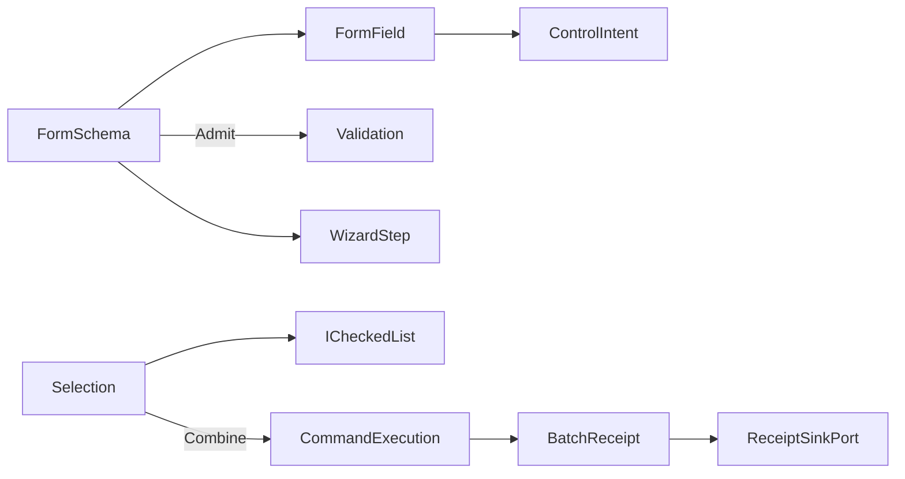

# [APPUI_FORMS_SELECTION]

A declarative forms-and-selection owner family delivers schema-driven forms with validation and wizard flows plus multi-selection batch editing over the admitted `PropertyModels` infrastructure with zero new package. `FormSchema` is a sequence of typed field rows, validation rules, and wizard steps materialized through the one `ControlFactory` (`Shell/controls`) and validated through the screens `Validation<Error,T>` lift; `Selection` is a model over the admitted `ICheckedList`/`ISelectableList` driving batch-edit intents that fold to one combined `CommandReceipt` through `CommandExecution.Combine`. The page owns the form schema and wizard fold, the validation lift, and the selection-and-batch-edit fold; it mints no settings-dialog framework, no form-control framework, and no per-macro registry — forms ride the one control vocabulary, validation rides the one typed rail, and batch verbs ride the one command-combine algebra. The spine is `bodong.PropertyModels` (`[ConditionTarget]`/`[PropertyVisibilityCondition]`/`[DependsOnProperty]`, `ICheckedList`/`ISelectableList`), `ReactiveUI.Validation`, the `ControlIntent`/`ControlFactory` owner, the `CommandIntent`/`CommandExecution` rail, Thinktecture.Runtime.Extensions, and LanguageExt rails.

## [01]-[INDEX]

- [01]-[FORM_SCHEMA]: Typed field rows materialized through `ControlFactory`; validation as the one typed rail.
- [02]-[WIZARD_FLOW]: Multi-step wizard over PropertyModels condition/visibility annotations.
- [03]-[SELECTION_MODEL]: Checked/selectable list selection over the admitted collections.
- [04]-[BATCH_EDIT]: N-item batch edit folding to one combined `CommandReceipt` through `CommandExecution.Combine`.

## [02]-[FORM_SCHEMA]

- Owner: `FormField` the typed field row; `FormSchema` the field-row sequence; `FormFault` the fault family in the 4900 code band; `FormSurface` the schema-to-control-intent fold.
- Cases: `FormFault` = Text | FieldInvalid | StepIncomplete | SubmitRejected in the 4900 code band.
- Entry: `public ControlIntent Intent(FormField field)` — projects one typed field row onto its `ControlIntent` (`Shell/controls`) materialized through `ControlFactory`; `public IObservable<Validation<Error, FormState>> Admit(FormSchema schema, FormState state)` — the form-level admission folding every field's typed rail through the applicative `Validation` accumulate.
- Auto: a `FormField` carries its key, its label key, its typed shape (the same `EditorFactory`-shaped value vocabulary the inspector cells resolve — text/number/date/path/select/toggle/quantity/value-object), its `[PropertyVisibilityCondition]` predicate, and its `Validation<Error,T>` rule, so a form is a field-row schema rather than a hand-laid-out settings dialog; `FormSurface.Intent` projects each field onto its `ControlIntent` so the form materializes through the one `ControlFactory` fold — a form-control framework is the deleted form; validation is the screens `Validation<Error,T>` lift (`Shell/screens#VALIDATION_UX`) so a field error feeds the same `Gate` context-validity stream the command table reads, and the form submit gates on the all-valid fold; conditional fields ride the admitted `[ConditionTarget]`/`[PropertyVisibilityCondition]`/`[DependsOnProperty]` annotations so a dependent field shows or hides without code-behind.
- Packages: bodong.PropertyModels, ReactiveUI.Validation, Thinktecture.Runtime.Extensions, LanguageExt.Core
- Growth: a new field type is one `FormField` shape reusing the `ControlIntent` vocabulary; a new validation rule is one `Validation<Error,T>` on the field; zero new surface — a settings-dialog or form framework is deleted by this schema over the one control vocabulary.
- Boundary: a form is a `FormSchema` materialized through `ControlFactory` — a settings-dialog framework, a form-builder, and a per-form control class are the deleted forms, so a form field is a `ControlIntent` and validation is the one `Validation<Error,T>` rail (a second validation scheme is the rejected form); the field's typed shape reuses the inspector `EditorFactory` value vocabulary so a quantity field, a value-object field, and an optional field all resolve through the one shape match, never a per-field editor; conditional visibility rides the admitted `PropertyModels.ComponentModel.DataAnnotations` attributes (`.api/api-propertygrid.md` annotation law) so the `[PropertyVisibilityCondition]`/`[DependsOnProperty]` propagation is automatic and a hand-wired show/hide handler is the deleted form; the form-level admission accumulates every field error applicatively (independent fields accumulate, not short-circuit) so a user sees every invalid field at once; the form submit is a `CommandIntent` execution so availability gating, re-entrancy suppression, and the `CommandReceipt` arrive with zero local receipt code; the form state crosses no host type — it is a typed record the inspector and the wizard share.

```csharp signature
[Union]
public abstract partial record FormFault : Expected, IValidationError<FormFault> {
    private FormFault(string detail, int code) : base(detail, code, None) { }

    public static FormFault Create(string message) => new Text(message);

    public sealed record Text : FormFault { public Text(string detail) : base(detail, 4900) { } }
    public sealed record FieldInvalid : FormFault { public FieldInvalid(string target, string detail) : base($"{target}: {detail}", 4901) => Target = target; public string Target { get; } }
    public sealed record StepIncomplete : FormFault { public StepIncomplete(string detail) : base(detail, 4902) { } }
    public sealed record SubmitRejected : FormFault { public SubmitRejected(string detail) : base(detail, 4903) { } }
}

public sealed record FormField(
    string Key,
    string LabelKey,
    ControlIntent Control,
    Func<FormState, bool> Visible,
    Func<FormState, Validation<Error, Unit>> Rule);

public sealed record FormState(HashMap<string, JsonElement> Values) {
    public static readonly FormState Empty = new(HashMap<string, JsonElement>());
    public FormState With(string key, JsonElement value) => this with { Values = Values.AddOrUpdate(key, value) };
}

public sealed record FormSchema(string Key, string SubmitIntent, Seq<FormField> Fields, Seq<WizardStep> Steps) {
    public Validation<Error, FormState> Admit(FormState state) =>
        Fields.Filter(field => field.Visible(state))
            .Traverse(field => field.Rule(state).Map(static _ => unit)).As()
            .Map(_ => state);
}

public static class FormSurface {
    extension(FormSchema schema) {
        public ControlIntent Layout(string panelKey, FormState state) =>
            new ControlIntent.Panel(
                panelKey,
                schema.Fields.Filter(field => field.Visible(state)).Map(static field => field.Control),
                ConstraintProgram: $"form-stack:{schema.Key}",
                new IntentBinding(schema.Key, "surface", None, None));
    }
}
```

## [03]-[WIZARD_FLOW]

- Owner: `WizardStep` the wizard-step row; `WizardState` the step-cursor state; `WizardFold` the step-transition fold.
- Entry: `public Fin<WizardState> Advance(WizardState cursor, FormState state)` — advances to the next step only when the current step's fields validate, sealing a `StepIncomplete` fault otherwise; `public WizardState Retreat(WizardState cursor)` — steps back with no validation gate.
- Auto: a `WizardStep` carries its field-key set and its step-completion predicate, so a wizard is a sequence of field groups over the one `FormSchema` rather than a parallel multi-page model; `Advance` gates the forward transition on the current step's field validation through the same `Validation<Error,T>` rail the form uses so a step never advances incomplete; the visible field set narrows to the current step's keys so the wizard materializes only the current step's controls through `ControlFactory`; the `[DependsOnProperty]` propagation drives cross-step dependencies so a later step's fields react to an earlier step's values.
- Packages: bodong.PropertyModels, Thinktecture.Runtime.Extensions, LanguageExt.Core
- Growth: a new wizard step is one `WizardStep` row on the schema; zero new surface.
- Boundary: a wizard is steps over the one `FormSchema` — a parallel wizard framework is the rejected form, so a step is a field-key group and the wizard materializes through the same `ControlFactory` fold; the forward gate rides the one `Validation<Error,T>` rail so a step-completion check is the form validation narrowed to the step's keys, never a second validation scheme; the step cursor is a typed value the `ControlIntent.Tab`/`Accordion` wizard chrome reads so the wizard chrome is itself a materialized control; conditional steps ride the admitted condition/visibility annotations so a skipped step is a predicate, not a hand-wired jump.

```csharp signature
public sealed record WizardStep(string Key, string TitleKey, Seq<string> FieldKeys, Func<FormState, bool> Complete);

public sealed record WizardState(int Index, Seq<string> Visited) {
    public static WizardState Start => new(0, Seq<string>());
}

public static class WizardFold {
    extension(FormSchema schema) {
        public Fin<WizardState> Advance(WizardState cursor, FormState state) =>
            schema.Steps.At(cursor.Index).Match(
                Some: step => step.Complete(state)
                    ? Fin.Succ(cursor with { Index = Math.Min(cursor.Index + 1, schema.Steps.Count - 1), Visited = cursor.Visited.Add(step.Key) })
                    : Fin.Fail<WizardState>(new FormFault.StepIncomplete(step.Key)),
                None: () => Fin.Succ(cursor));

        public WizardState Retreat(WizardState cursor) => cursor with { Index = Math.Max(0, cursor.Index - 1) };

        public Seq<FormField> StepFields(WizardState cursor) =>
            schema.Steps.At(cursor.Index).Match(
                Some: step => schema.Fields.Filter(field => step.FieldKeys.Contains(field.Key)),
                None: () => schema.Fields);
    }
}
```

## [04]-[SELECTION_MODEL]

- Owner: `Selection<TItem>` the multi-selection model over the admitted `ICheckedList`/`ISelectableList`; `SelectionMode` the single/multi axis.
- Entry: `public Selection<TItem> Toggle(TItem item)` — toggles one item's selection through the admitted collection's `SetChecked`; `public Seq<TItem> Selected()` — projects the checked set through `ICheckedList.Items`.
- Auto: `Selection` wraps the admitted `ICheckedList` (multi-select) or `ISelectableList` (single/multi) so the selection state rides the package collection, never a parallel selection list; the checked set drives the batch-edit intent set and the selection-count availability input (`Commands#AVAILABILITY_ALGEBRA` `Availability.Selected`); range selection composes `SetRangeChecked`/`SelectRange` so a shift-click selects a contiguous run; the selection projects into the screen-state snapshot `Selection` field so a restored screen re-applies its selection.
- Packages: bodong.PropertyModels, Thinktecture.Runtime.Extensions, LanguageExt.Core
- Growth: a new selection mode is one `SelectionMode` value; zero new surface — the admitted `ICheckedList`/`ISelectableList` is the selection collection.
- Boundary: selection rides the admitted `ICheckedList`/`ISelectableList` (`.api/api-propertygrid.md` collection types) — a parallel selection list is the deleted form, so the checked set is the one selection vocabulary; the selection count feeds the command availability algebra so a batch verb gates on selection count structurally, never a manual count flag; range selection composes the admitted `SetRangeChecked`/`SelectRange` so a contiguous selection is one batch call; selection persists on the screen-state `Selection` snapshot field so restore re-applies it; the selection model carries no UI control — the checked-list editor (`CheckedListEdit`) materializes through the inspector/control rail, so selection mints no second control.

```csharp signature
public enum SelectionMode { Single, Multi }

public sealed record Selection<TItem>(ICheckedList Backing, SelectionMode Mode) where TItem : notnull {
    public Selection<TItem> Toggle(TItem item) =>
        (fun(() => Backing.SetChecked(item!, !Backing.IsChecked(item!)))(), this).Item2;

    public Selection<TItem> Range(Seq<TItem> items, bool checkedState) =>
        (fun(() => Backing.SetRangeChecked(items.Cast<object>(), checkedState))(), this).Item2;

    public Seq<TItem> Selected() => toSeq(Backing.Items).OfType<TItem>();

    public int Count => Backing.Items.Length;
}
```

## [05]-[BATCH_EDIT]

- Owner: `BatchEdit<TItem>` the batch-edit fold; `BatchReceipt` the combined-edit evidence projecting the one `CommandReceipt`.
- Entry: `public Fin<CombinedReactiveCommand<CommandPayload, CommandReceipt>> Combine(Selection<TItem> selection, string verbIntent, CommandDeck deck)` — folds the N selected items' edit verbs into one combined command through `CommandExecution.Combine`, so a batch edit is one transaction over the one command-combine algebra.
- Auto: a batch verb over N selected items materializes through `CommandExecution.Combine` (`Commands#EXECUTION_RECEIPTS`) so the N child edits fold into one `CombinedReactiveCommand` whose availability is the all-true fold over the child `CanExecute` streams — a per-macro registry is the deleted form; each child edit still seals one `CommandReceipt` through the same `ReceiptSinkPort` so batch evidence never collapses into one opaque receipt; the batch availability gates on the selection count so a batch verb is unavailable on an empty selection structurally; an unknown verb key aborts the batch on the `Fin` rail rather than dropping silently.
- Receipt: each child edit seals its `CommandReceipt`; the batch correlates them under one `CorrelationId` so the batch is one traceable transaction with N receipts; `TelemetryRow` contributes the batch-applied and batch-rejected instruments inward through the AppHost `TelemetryContributorPort`.
- Packages: ReactiveUI, Thinktecture.Runtime.Extensions, LanguageExt.Core
- Growth: a new batch verb is one `CommandIntent` row the selection folds over; one batch instrument is one `InstrumentRow` on `BatchEdit.TelemetryRow`; zero new surface.
- Boundary: batch editing folds through the one `CommandExecution.Combine` algebra — a per-macro registry, a batch payload case beside the closed four-case `CommandPayload` union, and a batch-local receipt are the rejected forms (`Commands#EXECUTION_RECEIPTS` boundary), so N selected items edit in one transaction and each child seals its own `CommandReceipt`; the batch availability is the all-true fold `CreateCombined` computes over child `CanExecute`, so a hand-written aggregate gate is the rejected form; an unknown verb key aborts the macro on the `Fin` rail through the same `TryGetValue` probe `Combine` uses, never a `ContainsKey` filter drop; the batch correlates under one `CorrelationId` so a multi-item edit is one traceable transaction; host-mutating batch edits route through the abstract `DocumentTransaction` surface-host port so the undo scope batches the N edits as one host transaction, and the revertible op-log records the batch as one `RevertScope` (`Editing/history`); the batch verbs derive from the command table so a coordination/inspector batch action is an intent key, never a batch-local command.

```csharp signature
public sealed record BatchReceipt(string Verb, int Items, CorrelationId Correlation, Seq<CommandReceipt> Children) {
    public const string Kind = "batch";
}

public static class BatchEdit {
    public const string AppliedInstrument = "rasm.appui.batch.applied";
    public const string RejectedInstrument = "rasm.appui.batch.rejected";

    public static TelemetryContributorPort TelemetryRow(string version) =>
        AppUiTelemetry.Contribute(version, AppliedInstrument, RejectedInstrument);

    extension<TItem>(Selection<TItem> selection) where TItem : notnull {
        public Fin<CombinedReactiveCommand<CommandPayload, CommandReceipt>> Combine(string verbIntent, CommandDeck deck) =>
            selection.Count > 0
                ? deck.Combine(Enumerable.Repeat(verbIntent, selection.Count).ToArray())
                : Fin.Fail<CombinedReactiveCommand<CommandPayload, CommandReceipt>>(new FormFault.SubmitRejected($"{verbIntent}: empty selection"));

        public CommandPayload Payload() => new CommandPayload.Many(selection.Selected().Map(static item => item.ToString() ?? string.Empty));
    }
}
```



## [06]-[RESEARCH]

- [CHECKED_LIST_BACKING]: the admitted `PropertyModels.Collections.ICheckedList` member surface the `Selection` model binds is settled — `IsChecked(object)` returns `bool`, `SetChecked(object, bool)` and `SetRangeChecked(IEnumerable<object>, bool)` return `void` (so a `Selection.Toggle`/`Range` sequences the void write through the `(fun(() => write)(), this).Item2` idiom), `Items`/`SourceItems` are `object[]` (length read through `.Length`), and `SelectionChanged` is the change event (`.api/api-propertygrid.md` collection entrypoints); the `CheckedListEdit`/`RadioButtonListEdit` editor the checked set materializes through, the `FormSchema`/`WizardStep` fold, the `Validation<Error,T>` lift, and the `CommandExecution.Combine` batch fold are settled. The remaining unverified surface is the `[ConditionTarget]`/`[PropertyVisibilityCondition]`/`[DependsOnProperty]` propagation behavior — whether `ReactiveObject` re-evaluates a `[PropertyVisibilityCondition]` predicate on a `[DependsOnProperty]` edge — composed at the package edge at implementation.
