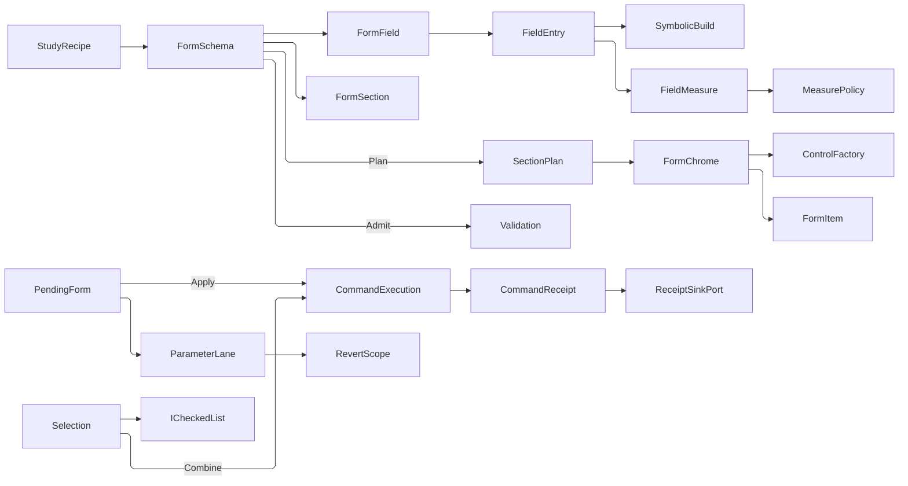

# [APPUI_FORMS_SELECTION]

A declarative forms-and-selection owner family delivers schema-driven forms with sectioned professional layout, dimensioned and expression-bearing entry, pending-commit posture, and multi-selection batch editing over the admitted `PropertyModels` infrastructure with zero new package. `FormSchema` is a sequence of typed field rows partitioned by section rows, materialized through the one `ControlFactory` for every field control and seated by `FormChrome` into the admitted `Form`/`FormGroup`/`FormItem` mechanism whose label geometry, required marks, and label-for association are the mechanism's own; validation rides the one LanguageExt `Validation<Error,T>` applicative; conditional visibility is schema data — each field declares its `DependsOn` key edges and its `Visible` predicate over `FormState`, so the schema itself owns re-evaluation and no attribute machinery is claimed for it; dimensioned entry resolves through the `Theme/locale#MEASUREMENT_FORMAT` policy and expression entry rides the `Rasm.Compute` symbolic owner, so neither a unit table nor an arithmetic grammar is minted here; `PendingForm` holds the deferred-commit posture that batches every marked write into one re-solve under one correlation; `Selection` is a model over the admitted `ICheckedList` whose one `Raise` fold carries the anchor, range, and toggle grammar every windowed plane resolves, whose `SelectionBand` consumes the marquee the pointer rows deliver, whose `SelectionFacet` rows drive select-similar as a signature match, and which drives batch-edit intents that fold to one combined `CommandReceipt` through `CommandExecution.Combine`; `SelectionSet` is the durable named element set the selection captures per document, composes through `SelectionAlgebra` rows, and re-applies, and `SelectionChannel` is the one snapshot stream command availability, the status footer, and screen-state persistence all read. The page owns the form schema, its section grammar and chrome capsule, the wizard fold, the field-state and provenance vocabulary, the pending-commit posture with its parameter revert lane and value sets, the study-recipe schema compilation, and the selection-and-batch-edit fold; it mints no settings-dialog framework, no form-control framework, no unit vocabulary, no expression parser, and no per-macro registry. The PropertyModels `[ConditionTarget]`/`[PropertyVisibilityCondition]`/`[DependsOnProperty]` annotations stay the inspector's law over `ReactiveObject` model properties and never govern this schema. The spine is `Irihi.Ursa` (`Form`, `FormGroup`, `FormItem`, `Descriptions`, `Divider`, `UrsaGroupBox`, `Anchor`), `bodong.PropertyModels` (`ICheckedList`, `CheckedListEdit`), the `ControlIntent`/`ControlFactory` owner, the `CommandIntent`/`CommandExecution` rail, UnitsNet, `Rasm.Compute` symbolic admission, Thinktecture.Runtime.Extensions, and LanguageExt rails.

## [01]-[INDEX]

- [02]-[FORM_SCHEMA]: Typed field rows under section rows; unit, expression, state, and provenance columns; the plan projection.
- [03]-[FORM_CHROME]: The form-mechanism capsule seating every plan row, its section furniture, rail, and operation column.
- [04]-[WIZARD_FLOW]: Multi-step wizard over the one section roster; step gates ride the same validation rail.
- [05]-[SELECTION_MODEL]: Checked-list selection over the one admitted collection backing; the gesture, marquee, and similarity producers; durable named selection sets and the one snapshot stream.
- [06]-[BATCH_EDIT]: Pending-commit posture, the parameter revert lane and value sets, and the N-item batch fold to one `CommandReceipt`.
- [07]-[STUDY_FORM]: Versioned study recipes compiled into the one schema grammar and submitted under one correlation.

## [02]-[FORM_SCHEMA]

- Owner: `FormField` the typed field row; `FormSection` the section row partitioning the field set; `FormSchema` the field-and-section owner; `FieldEntry` the admission-row family; `FieldMeasure` the dimensioned column; `FieldState` the ranked ink axis; `ValueOrigin` the provenance axis; `FieldValue` the stored value carrying its origin, its authored source, and its multi-target agreement; `FormFilter` the in-panel parameter search; `SectionPlan`/`FieldPlan` the pure projection the chrome capsule seats; `FormFault` the typed fault family on the `AppUiFaultBand.Form` registry row (6310).
- Cases: `FormFault` = Text | FieldInvalid | StepIncomplete | SubmitRejected | SchemaInvalid | ExpressionRejected | MeasureRejected | CommitRejected | RecipeRejected — codes derive through the `AppUiFaultBand.Form` registry row and detail 9 is the band's one free slot, so a tenth form fault widens that row's span rather than appending past it; `FieldEntry` = words | scalar | formula | choice | set | flag | moment | path | colour; `FieldState` = declared | overridden | pending | mixed | invalid; `ValueOrigin` = declared | authored | derived | linked | inherited; `SectionChrome` = grouped | divided | boxed | described; `FilterFacet` = all | modified | invalid | pending | derived.
- Law: the section rosters PARTITION the field set — every field is seated in exactly one section — so a field that renders nowhere is a construction-time `SchemaInvalid` rather than a row silently absent from every panel.
- Law: the field's declared `Entry` row is checked against its `Control` intent at construction, so an admission that could never match its editor refuses before a form exists; a field never infers its admission from its control shape, because a text entry carrying an expression and a text entry carrying a name are the same intent under two admissions.
- Law: mixed state reads AGREEMENT, never a sentinel — `FieldValue.Uniform` is `Some` only when every target agrees, exactly as the merged-cell law at `Editing/inspector#INSPECTOR_SURFACE` requires, so a uniformly null value and a divergent one stay distinguishable.
- Entry: `FormSchema.Create` accumulates schema-identity, dependency, partition, entry-admission, and DAG faults; `FormSchema.With` admits one erased `JsonElement` through the addressed field's `FieldEntry` row before state mutation; `FormSchema.Admit` accumulates every visible field rule; `FormSurface.Plan(FormState state, HashMap<string, FieldValue> pending, FormFilter filter, ResolvedLocale locale, Option<WizardState> cursor = default)` projects the admitted schema onto section plans — one signature serving the flat form and the wizard, the cursor narrowing the roster to the current section before the skip, visibility, and filter cuts; `FormSurface.Panel` folds the same plan into one nested `ControlIntent.Panel` for a head carrying no form mechanism.
- Auto: a `FormField` carries its key, label key, `ControlIntent`, entry row, dependency edges, visibility and requiredness predicates, declared fallback, help key, optional measure, commit posture, and state-level rule. `FormSchema.Create` rejects duplicate identities, unknown dependency references, a roster that is not a partition, an entry row its control refuses, and cyclic dependency graphs before a form exists. `FormSchema.With` resolves the field and admits the serialized value through the entry row before the internal state write, so heterogeneous storage never becomes untyped admission. `FormSchema.Affected` selects exactly the fields whose `DependsOn` edges touch the changed key, and `FormSchema.Admit` traverses visible rules applicatively so independent failures accumulate. A formula field derives its dependency edges from its own expression's free symbols, so the graph oracle sees every real edge and an expression can never resolve against a cycle the schema admitted.
- Packages: Irihi.Ursa, UnitsNet, QuikGraph (shared tier), Thinktecture.Runtime.Extensions, LanguageExt.Core, Rasm.Compute (project)
- Growth: a new field type is one `FormField` row reusing the `ControlIntent` vocabulary; a new admission is one `FieldEntry` row with its predicate and fold; a new section furniture is one `SectionChrome` row with its row and host columns; a new search facet is one `FilterFacet` row; a new ink state is one `FieldState` row with its rank and mark; zero new surface — a settings-dialog or form framework is deleted by this schema over the one control vocabulary.
- Boundary: a form is a validated `FormSchema` whose field controls materialize through `ControlFactory` and whose rows seat into the admitted form mechanism; a settings-dialog framework, form-builder, per-form control class, and second validation scheme are rejected. The heterogeneous `FormState` stores serialized values, but only `FormSchema.With` can mutate it and each field's entry row restores its shape invariant at that boundary. Dimensioned admission parses against the FAMILY type `QuantityInfo.ValueType` carries and clamps on the scalar in the elected display unit — `UnitMath.Clamp` constrains its parameter to `IComparable, IQuantity`, the closed family type an erased schema field never carries, so the boxed face reaches it not at all and the elected-unit projection gives exactly what it would have given; the `[BASEUNITS_PARTIALITY]` walk is never entered, because the display unit arrives from the `MeasureRole` row rather than from a unit system. Expression admission is the `Rasm.Compute` symbolic owner — `SymbolicBuild.Build` over the engine's non-throwing parse, free-symbol binding from sibling field values, and `SymbolicExpr.Evaluate` to one real — so a local arithmetic parser, a string `eval`, and a second dimension proof are all deleted; a typed spinner carries no expression because its text seam narrows through the package's own per-closed-generic parse and its `TextConverter` hook hands back a boxed value the base unboxes to the spinner's exact closed generic, so an expression seat there would re-spell the eleven-row numeric table to land one real. Form validation accumulates independent failures, and submit rides the one `CommandIntent` rail.

```csharp signature
// --- [ERRORS] ---------------------------------------------------------------------------

[Union]
public abstract partial record FormFault : Expected, IValidationError<FormFault> {
    private FormFault(string detail, int code) : base(detail, code, None) { }

    public static FormFault Create(string message) => new Text(message);

    public sealed record Text : FormFault { public Text(string detail) : base(detail, AppUiFaultBand.Form.Code(0)) { } }
    public sealed record FieldInvalid : FormFault { public FieldInvalid(string target, string detail) : base($"{target}: {detail}", AppUiFaultBand.Form.Code(1)) => Target = target; public string Target { get; } }
    public sealed record StepIncomplete : FormFault { public StepIncomplete(string detail) : base(detail, AppUiFaultBand.Form.Code(2)) { } }
    public sealed record SubmitRejected : FormFault { public SubmitRejected(string detail) : base(detail, AppUiFaultBand.Form.Code(3)) { } }
    public sealed record SchemaInvalid : FormFault { public SchemaInvalid(string detail) : base(detail, AppUiFaultBand.Form.Code(4)) { } }
    public sealed record ExpressionRejected : FormFault { public ExpressionRejected(string target, string detail) : base($"{target}: {detail}", AppUiFaultBand.Form.Code(5)) => Target = target; public string Target { get; } }
    public sealed record MeasureRejected : FormFault { public MeasureRejected(string target, string detail) : base($"{target}: {detail}", AppUiFaultBand.Form.Code(6)) => Target = target; public string Target { get; } }
    public sealed record CommitRejected : FormFault { public CommitRejected(string detail) : base(detail, AppUiFaultBand.Form.Code(7)) { } }
    public sealed record RecipeRejected : FormFault { public RecipeRejected(string detail) : base(detail, AppUiFaultBand.Form.Code(8)) { } }
}

// --- [TYPES] ----------------------------------------------------------------------------

// Provenance answers WHO set the value, which is the fact a reset verb and a badge each need and neither can
// derive from the value itself: a derived value and an authored one can be byte-identical while only one of
// them survives a re-solve. `Resettable` is the row's own column because a linked value has no local default
// to fall back to — its driver owns it — so offering a reset there would offer a write the next propagation
// erases.
[SmartEnum<string>]
[KeyMemberEqualityComparer<ComparerAccessors.StringOrdinal, string>]
[KeyMemberComparer<ComparerAccessors.StringOrdinal, string>]
public sealed partial class ValueOrigin {
    public static readonly ValueOrigin Declared = new("declared", resettable: false);
    public static readonly ValueOrigin Authored = new("authored", resettable: true);
    public static readonly ValueOrigin Derived = new("derived", resettable: true);
    public static readonly ValueOrigin Linked = new("linked", resettable: false);
    public static readonly ValueOrigin Inherited = new("inherited", resettable: true);

    public bool Resettable { get; }

    public string Badge => LocaleStrings.Key(nameof(ValueOrigin), Key);
}

// The ink axis is RANKED and a row's predicate reads one facts value, so the strongest state wins by table
// order rather than by a ladder of nested conditionals at the projection site. `Declared` holds unconditionally
// at rank zero, which is what makes the fold total without an `IfNone` that could disagree with the table.
public readonly record struct FieldFacts(bool Invalid, bool Mixed, bool Pending, bool Overridden);

[SmartEnum<string>]
[KeyMemberEqualityComparer<ComparerAccessors.StringOrdinal, string>]
[KeyMemberComparer<ComparerAccessors.StringOrdinal, string>]
public sealed partial class FieldState {
    public static readonly FieldState Declared = new("declared", ":declared", rank: 0, badged: false, static _ => true);
    public static readonly FieldState Overridden = new("overridden", ":overridden", rank: 1, badged: true, static facts => facts.Overridden);
    public static readonly FieldState Pending = new("pending", ":pending", rank: 2, badged: true, static facts => facts.Pending);
    public static readonly FieldState Mixed = new("mixed", ":mixed", rank: 3, badged: true, static facts => facts.Mixed);
    public static readonly FieldState Invalid = new("invalid", ":invalid", rank: 4, badged: true, static facts => facts.Invalid);

    public string Mark { get; }

    public int Rank { get; }

    public bool Badged { get; }

    [UseDelegateFromConstructor]
    public partial bool Holds(FieldFacts facts);

    public string Badge => LocaleStrings.Key(nameof(FieldState), Key);

    // The ordered run re-enters the carrier through `toSeq` before `Find` reads it, because `OrderByDescending`
    // answers an `IOrderedEnumerable` — a shape carrying no carrier witness and publishing no `ToSeq` of its own.
    public static FieldState Of(FieldFacts facts) =>
        toSeq(Items.OrderByDescending(static row => row.Rank)).Find(row => row.Holds(facts)).IfNone(Declared);

    // Overriddenness compares RAW TEXT because `JsonElement` carries no value equality and a numeric compare
    // would have to guess the field's own numeric family; the schema wrote both sides through one serializer,
    // so their canonical spellings agree exactly when their values do.
    public static FieldState Read(FormField field, FormState state, Option<FieldValue> pending) =>
        state.Values.Find(field.Key) switch {
            var current => Of(new FieldFacts(
                Invalid: field.Rule(state).IsFail,
                Mixed: current.Map(static value => value.Divergent).IfNone(false),
                Pending: pending.IsSome,
                Overridden: current.Bind(static value => value.Uniform).Match(
                    Some: value => field.Fallback.Match(
                        Some: fallback => !StringComparer.Ordinal.Equals(value.GetRawText(), fallback.GetRawText()),
                        None: () => true),
                    None: () => false))),
        };

    // One write per state change sets this row's mark and clears every sibling, mirroring the inspector cell
    // axis exactly, so a form row and a grid cell wear one ink vocabulary and a stale mark cannot survive the
    // write that settled the field.
    public Unit Apply(Control row) =>
        fun(() => Items.Iter(state => row.Classes.Set(state.Mark, ReferenceEquals(state, this))))();
}

// The search facet narrows on STATE and PROVENANCE, the two axes a query string cannot express; the query
// itself matches text. Splitting them keeps "everything I changed" reachable without a reserved query token.
[SmartEnum<string>]
[KeyMemberEqualityComparer<ComparerAccessors.StringOrdinal, string>]
[KeyMemberComparer<ComparerAccessors.StringOrdinal, string>]
public sealed partial class FilterFacet {
    public static readonly FilterFacet All = new("all", static (_, _) => true);
    public static readonly FilterFacet Modified = new("modified", static (state, _) => state != FieldState.Declared);
    public static readonly FilterFacet Invalid = new("invalid", static (state, _) => state == FieldState.Invalid);
    public static readonly FilterFacet Pending = new("pending", static (state, _) => state == FieldState.Pending);
    public static readonly FilterFacet Derived = new("derived", static (_, origin) => origin == ValueOrigin.Derived || origin == ValueOrigin.Linked);

    [UseDelegateFromConstructor]
    public partial bool Holds(FieldState state, ValueOrigin origin);
}

public readonly record struct FormFilter(string Query, FilterFacet Facet) {
    public static readonly FormFilter Open = new(string.Empty, FilterFacet.All);

    // The query matches the RESOLVED label and the raw key, so an operator finds a row by what the panel reads
    // and a scripted caller finds it by what it addresses. Comparison runs through the resolved culture's own
    // `CompareInfo` under ignore-case and ignore-diacritic options — ambient culture has no reader on any AppUi
    // surface, so a `CurrentCulture` substring search is unspellable here.
    public bool Match(FormField field, FieldState state, ValueOrigin origin, ResolvedLocale locale) =>
        Facet.Holds(state, origin)
        && (string.IsNullOrWhiteSpace(Query)
            || locale.Formats.CompareInfo.IndexOf(locale.Label(field.LabelKey), Query, CompareOptions.IgnoreCase | CompareOptions.IgnoreNonSpace) >= 0
            || locale.Formats.CompareInfo.IndexOf(field.Key, Query, CompareOptions.IgnoreCase | CompareOptions.IgnoreNonSpace) >= 0);
}
```

```csharp signature
// --- [MODELS] ---------------------------------------------------------------------------

// The stored value carries three facts the raw payload cannot: whether the targets agree, how many there are,
// and what the operator actually typed. `Source` retains the authored expression so a formula field re-presents
// its algebra rather than the number it collapsed to, which is the whole reason an expression field exists.
public sealed record FieldValue(Option<JsonElement> Uniform, int Targets, Option<string> Source, ValueOrigin Origin) {
    public static FieldValue Of(JsonElement value, ValueOrigin origin) => new(Some(value), 1, None, origin);

    public static FieldValue Authored(JsonElement value, string source, ValueOrigin origin) => new(Some(value), 1, Some(source), origin);

    // Divergence is N targets with no agreed value; one target can never diverge and a uniformly absent value
    // across N targets is agreement about absence, not disagreement.
    public bool Divergent => Targets > 1 && Uniform.IsNone;
}

public sealed record FormState(HashMap<string, FieldValue> Values) {
    public static readonly FormState Empty = new(HashMap<string, FieldValue>());

    internal FormState Seat(string key, FieldValue value) => this with { Values = Values.AddOrUpdate(key, value) };

    // The erased projection every payload crossing takes: provenance, authored source, and target arity are
    // panel facts a wire payload has no seat for, and a DIVERGENT field has no single spelling at all — so the
    // lowering refuses here rather than handing a command a field whose targets never agreed. This is the one
    // read `Shell/commands#INTENT_TABLE` `Compose` lowers onto `CommandPayload.Fields`.
    public Fin<HashMap<string, JsonElement>> Payload() =>
        toSeq(Values)
            .Traverse(static pair => pair.Value.Uniform
                .ToFin(new FormFault.FieldInvalid(pair.Key, "value diverges across targets"))
                .Map(value => (pair.Key, Value: value)))
            .As()
            .Map(toHashMap);
}

// The dimensioned column. The role names the display unit per posture, the family fixes the quantity concern,
// and the two bounds are quantities of that family rather than bare scalars, so a bound authored in inches and
// a value typed in millimetres compare in the elected unit instead of by accident.
public sealed record FieldMeasure(MeasureRole Role, QuantityInfo Family, Option<IQuantity> Floor, Option<IQuantity> Ceiling) {
    // Parsing addresses the FAMILY type, never a unit system: `Quantity.TryParse` takes the quantity struct
    // type `QuantityInfo.ValueType` carries, and the abbreviation the operator typed elects the unit — so
    // `12mm` and `1/2"` admit into one family while the seven-axis base-unit walk, undeclared for most of the
    // registry, is never entered.
    public Fin<IQuantity> Admit(string text, ResolvedLocale locale) =>
        Quantity.TryParse(locale.Formats, Family.ValueType, text, out IQuantity? parsed) && parsed is not null
            ? Bound(parsed, locale)
            : Fin.Fail<IQuantity>(new FormFault.MeasureRejected(Role.Key, text));

    // A bare scalar takes the ELECTED display unit, so a field whose posture reads feet admits `6` as six feet
    // rather than six of the family base unit — the operator typed what the label showed.
    public Fin<IQuantity> Admit(double value, ResolvedLocale locale) =>
        Quantity.TryFrom(value, locale.Measures.Unit(Role), out IQuantity? built) && built is not null
            ? Bound(built, locale)
            : Fin.Fail<IQuantity>(new FormFault.MeasureRejected(Role.Key, value.ToString(locale.Formats)));

    public Fin<string> Render(IQuantity value, ResolvedLocale locale) => locale.Quantity(value, Role);

    // Family agreement first, then clamping on the SCALAR in the elected unit. `UnitMath.Clamp` constrains its
    // parameter to `IComparable, IQuantity` — the closed family type an erased schema field never carries — so
    // the boxed face cannot reach it and the elected-unit projection yields exactly what it would have yielded.
    Fin<IQuantity> Bound(IQuantity value, ResolvedLocale locale) =>
        !StringComparer.Ordinal.Equals(Family.Name, value.QuantityInfo.Name)
            ? Fin.Fail<IQuantity>(new FormFault.MeasureRejected(Role.Key, value.QuantityInfo.Name))
            : locale.Measures.Unit(Role) switch {
                var unit => Try.lift(() => Quantity.From(
                        double.Clamp(
                            value.As(unit),
                            Floor.Map(edge => edge.As(unit)).IfNone(double.NegativeInfinity),
                            Ceiling.Map(edge => edge.As(unit)).IfNone(double.PositiveInfinity)),
                        unit))
                    .Run()
                    .MapFail(error => (Error)new FormFault.MeasureRejected(Role.Key, error.Message)),
            };
}

// One admission row per value concern, each declaring which control intents it may sit behind and owning the
// whole erased-boundary fold for its concern. A per-field admission closure is the deleted form: it put nine
// nearly identical parsers on nine call sites and left the control-versus-admission agreement unchecked.
[SmartEnum<string>]
[KeyMemberEqualityComparer<ComparerAccessors.StringOrdinal, string>]
[KeyMemberComparer<ComparerAccessors.StringOrdinal, string>]
public sealed partial class FieldEntry {
    public static readonly FieldEntry Words = new("words",
        static intent => intent is ControlIntent.TextInput,
        static (field, _, value, _) => FieldAdmission.Words(field, value));
    public static readonly FieldEntry Scalar = new("scalar",
        static intent => intent is ControlIntent.NumberInput or ControlIntent.Slider or ControlIntent.Range,
        static (field, _, value, locale) => FieldAdmission.Scalar(field, value, locale));
    public static readonly FieldEntry Formula = new("formula",
        static intent => intent is ControlIntent.TextInput,
        static (field, state, value, locale) => FieldAdmission.Formula(field, state, value, locale));
    public static readonly FieldEntry Choice = new("choice",
        static intent => intent is ControlIntent.Select or ControlIntent.Radio or ControlIntent.Segmented,
        static (field, _, value, _) => FieldAdmission.Choice(field, value));
    public static readonly FieldEntry Set = new("set",
        static intent => intent is ControlIntent.MultiSelect,
        static (field, _, value, _) => FieldAdmission.Set(field, value));
    public static readonly FieldEntry Flag = new("flag",
        static intent => intent is ControlIntent.Toggle,
        static (field, _, value, _) => FieldAdmission.Flag(field, value));
    public static readonly FieldEntry Moment = new("moment",
        static intent => intent is ControlIntent.DateInput,
        static (field, _, value, _) => FieldAdmission.Moment(field, value));
    public static readonly FieldEntry Path = new("path",
        static intent => intent is ControlIntent.PathInput,
        static (field, _, value, _) => FieldAdmission.Path(field, value));
    public static readonly FieldEntry Colour = new("colour",
        static intent => intent is ControlIntent.ColorInput,
        static (field, _, value, _) => FieldAdmission.Colour(field, value));

    [UseDelegateFromConstructor]
    public partial bool Admits(ControlIntent intent);

    [UseDelegateFromConstructor]
    public partial Validation<Error, FieldValue> Admit(FormField field, FormState state, JsonElement value, ResolvedLocale locale);
}

public sealed record FormField(
    string Key,
    string LabelKey,
    ControlIntent Control,
    FieldEntry Entry,
    Seq<string> DependsOn,
    Func<FormState, bool> Visible,
    Func<FormState, bool> Required,
    Option<JsonElement> Fallback,
    Option<string> HelpKey,
    Option<FieldMeasure> Measure,
    CommitPosture Posture,
    Func<FormState, Validation<Error, Unit>> Rule) {
    public static FormField Of(
        string key,
        string labelKey,
        ControlIntent control,
        FieldEntry entry,
        Func<FormState, Validation<Error, Unit>> rule,
        Option<JsonElement> fallback = default,
        Option<string> helpKey = default,
        Option<FieldMeasure> measure = default,
        CommitPosture? posture = null) =>
        new(key, labelKey, control, entry, Seq<string>(), static _ => true, static _ => false,
            fallback, helpKey, measure, posture ?? CommitPosture.Deferred, rule);

    // A formula field's dependency edges DERIVE from its own source, so the roster the graph oracle checks and
    // the symbols the expression names are one set — an authored roster could contradict the algebra it claims
    // to describe, and the cycle check would then pass over an edge that exists.
    public static Validation<Error, FormField> Formula(
        string key,
        string labelKey,
        string source,
        ControlIntent control,
        Func<FormState, Validation<Error, Unit>> rule,
        Option<string> helpKey = default,
        Option<FieldMeasure> measure = default,
        CommitPosture? posture = null) =>
        SymbolicBuild.Build(new BuildSpec.Infix(source))
            .MapFail(error => (Error)new FormFault.ExpressionRejected(key, error.Message))
            .ToValidation()
            .Map(expression => new FormField(
                key, labelKey, control, FieldEntry.Formula, expression.FreeSymbols,
                static _ => true, static _ => false,
                Some(JsonSerializer.SerializeToElement(source)), helpKey, measure,
                posture ?? CommitPosture.Deferred, rule));
}

// The section row is the wizard-step shape carrying its own gate: a flat form renders every unskipped section
// and a wizard walks the same roster one index at a time, so a second step vocabulary beside this one would be
// the same three columns under another name.
public sealed record FormSection(string Key, string TitleKey, Seq<string> FieldKeys, SectionChrome Chrome, Func<FormState, bool> Skip) {
    public static FormSection Of(string key, string titleKey, Seq<string> fieldKeys, SectionChrome? chrome = null) =>
        new(key, titleKey, fieldKeys, chrome ?? SectionChrome.Grouped, static _ => false);
}

public sealed record FormSchema {
    private FormSchema(string key, string submitIntent, string commitIntent, FormGeometry geometry, Seq<FormField> fields, Seq<FormSection> sections) =>
        (Key, SubmitIntent, CommitIntent, Geometry, Fields, Sections) = (key, submitIntent, commitIntent, geometry, fields, sections);

    public string Key { get; }
    public string SubmitIntent { get; }
    public string CommitIntent { get; }
    public FormGeometry Geometry { get; }
    public Seq<FormField> Fields { get; }
    public Seq<FormSection> Sections { get; }

    public static Validation<Error, FormSchema> Create(
        string key,
        string submitIntent,
        string commitIntent,
        FormGeometry geometry,
        Seq<FormField> fields,
        Seq<FormSection> sections) {
        Set<string> fieldKeys = toSet(fields.Map(static field => field.Key));
        Set<string> sectionKeys = toSet(sections.Map(static section => section.Key));
        Seq<string> seated = sections.Bind(static section => section.FieldKeys);
        return (
            guard(!string.IsNullOrWhiteSpace(key) && !string.IsNullOrWhiteSpace(submitIntent) && !string.IsNullOrWhiteSpace(commitIntent),
                (Error)new FormFault.SchemaInvalid("form key, submit intent, or commit intent is empty")).ToValidation(),
            guard(fieldKeys.Count == fields.Count, (Error)new FormFault.SchemaInvalid($"{key}: duplicate field key")).ToValidation(),
            guard(fields.ForAll(static field => !string.IsNullOrWhiteSpace(field.Key) && !string.IsNullOrWhiteSpace(field.LabelKey)),
                (Error)new FormFault.SchemaInvalid($"{key}: field identity is empty")).ToValidation(),
            guard(fields.ForAll(field => field.DependsOn.ForAll(fieldKeys.Contains)),
                (Error)new FormFault.SchemaInvalid($"{key}: unknown dependency key")).ToValidation(),
            guard(fields.ForAll(static field => field.Entry.Admits(field.Control)),
                (Error)new FormFault.SchemaInvalid($"{key}: entry row refuses its control")).ToValidation(),
            guard(sectionKeys.Count == sections.Count && sections.ForAll(static section => section.FieldKeys.Distinct().Count == section.FieldKeys.Count),
                (Error)new FormFault.SchemaInvalid($"{key}: duplicate section key or repeated section field")).ToValidation(),
            guard(sections.ForAll(static section => !string.IsNullOrWhiteSpace(section.Key) && !string.IsNullOrWhiteSpace(section.TitleKey)),
                (Error)new FormFault.SchemaInvalid($"{key}: section identity is empty")).ToValidation(),
            // The partition test in one guard: the seated roster is the field set with no repeat across
            // sections and no field left unseated, so a field that would render nowhere refuses here.
            guard(seated.Count == fields.Count && toSet(seated) == fieldKeys,
                (Error)new FormFault.SchemaInvalid($"{key}: sections do not partition the field set")).ToValidation(),
            guard(Acyclic(fields), (Error)new FormFault.SchemaInvalid($"{key}: dependency cycle")).ToValidation())
            .Apply((_, _, _, _, _, _, _, _, _) => new FormSchema(key, submitIntent, commitIntent, geometry, fields, sections))
            .As();
    }

    public Validation<Error, FormState> Admit(FormState state) =>
        Fields.Filter(field => field.Visible(state))
            .Traverse(field => Demanded(field, state)).As()
            .Map(_ => state);

    public Validation<Error, (FieldValue Value, string Changed)> With(FormState state, string key, JsonElement value, ResolvedLocale locale) =>
        Fields.Find(field => StringComparer.Ordinal.Equals(field.Key, key))
            .ToValidation((Error)new FormFault.FieldInvalid(key, "unknown field"))
            .Bind(field => field.Entry.Admit(field, state, value, locale).Map(admitted => (admitted, key)));

    public Validation<Error, FormState> Seat(FormState state, string key, JsonElement value, ResolvedLocale locale) =>
        With(state, key, value, locale).Map(seated => state.Seat(seated.Changed, seated.Value));

    // Schema-owned visibility propagation: a changed key re-evaluates ONLY the fields declaring it as an
    // edge; a field with no DependsOn row never re-materializes on foreign writes.
    public Seq<FormField> Affected(string changedKey) =>
        Fields.Filter(field => field.DependsOn.Contains(changedKey));

    public Option<FormField> Field(string key) => Fields.Find(field => StringComparer.Ordinal.Equals(field.Key, key));

    // Requiredness is a RULE, not a chrome flag: a conditionally required field with no value fails admission
    // here, so the asterisk the mechanism paints and the refusal the rail seals read one predicate.
    static Validation<Error, Unit> Demanded(FormField field, FormState state) =>
        field.Required(state) && state.Values.Find(field.Key).Bind(static value => value.Uniform).IsNone
            ? Validation<Error, Unit>.Fail(new FormFault.FieldInvalid(field.Key, "required value is absent"))
            : field.Rule(state).Map(static _ => unit);

    static bool Acyclic(Seq<FormField> fields) {
        AdjacencyGraph<string, SEdge<string>> graph = new();
        fields.Iter(field => graph.AddVertex(field.Key));
        fields.Iter(field => field.DependsOn.Iter(dependency => graph.AddEdge(new SEdge<string>(dependency, field.Key))));
        return graph.IsDirectedAcyclicGraph();
    }
}
```

```csharp signature
// --- [OPERATIONS] -----------------------------------------------------------------------

// The erased-boundary folds every entry row dispatches to. Each returns the STORED shape, so a formula lands
// its evaluated real beside its authored source and a measured field lands the scalar in its own elected unit
// — one place converts, and the panel never re-derives what the admission already settled.
public static class FieldAdmission {
    public static Validation<Error, FieldValue> Words(FormField field, JsonElement value) =>
        value.ValueKind is JsonValueKind.String
            ? Validation<Error, FieldValue>.Success(FieldValue.Of(value, ValueOrigin.Authored))
            : Validation<Error, FieldValue>.Fail(new FormFault.FieldInvalid(field.Key, $"expected text, saw {value.ValueKind}"));

    // A dimensioned scalar rides the measure column: the number admits in the elected display unit, clamps to
    // the declared bounds, and lands as the clamped scalar — so a bound and a readout can never disagree
    // about which unit they were spoken in.
    public static Validation<Error, FieldValue> Scalar(FormField field, JsonElement value, ResolvedLocale locale) =>
        value.ValueKind is JsonValueKind.Number && value.TryGetDouble(out double real)
            ? field.Measure.Match(
                Some: measure => measure.Admit(real, locale)
                    .Map(quantity => FieldValue.Of(JsonSerializer.SerializeToElement(quantity.As(locale.Measures.Unit(measure.Role))), ValueOrigin.Authored))
                    .ToValidation(),
                None: () => Validation<Error, FieldValue>.Success(FieldValue.Of(value, ValueOrigin.Authored)))
            : Validation<Error, FieldValue>.Fail(new FormFault.FieldInvalid(field.Key, $"expected a number, saw {value.ValueKind}"));

    // The expression rail is the Compute symbolic owner end to end: the source admits through the engine's
    // non-throwing parse, every free symbol binds from the sibling field the schema's own dependency edge
    // already declared, and the evaluated real crosses the measure column when the field carries one — so
    // `wall / 2 + 150` is a field value, an unbound symbol is a typed refusal, and no arithmetic grammar,
    // no `eval`, and no second dimension proof is minted here.
    public static Validation<Error, FieldValue> Formula(FormField field, FormState state, JsonElement value, ResolvedLocale locale) =>
        value.ValueKind is JsonValueKind.String
            ? (value.GetString() ?? string.Empty) switch {
                var source => SymbolicBuild.Build(new BuildSpec.Infix(source))
                    .Bind(expression => expression.Evaluate(Bindings(state)))
                    .MapFail(error => (Error)new FormFault.ExpressionRejected(field.Key, error.Message))
                    .Bind(real => field.Measure.Match(
                        Some: measure => measure.Admit(real, locale)
                            .Map(quantity => FieldValue.Authored(
                                JsonSerializer.SerializeToElement(quantity.As(locale.Measures.Unit(measure.Role))), source, ValueOrigin.Derived)),
                        None: () => Fin.Succ(FieldValue.Authored(JsonSerializer.SerializeToElement(real), source, ValueOrigin.Derived))))
                    .ToValidation(),
            }
            : Validation<Error, FieldValue>.Fail(new FormFault.FieldInvalid(field.Key, $"expected an expression, saw {value.ValueKind}"));

    public static Validation<Error, FieldValue> Choice(FormField field, JsonElement value) =>
        (value.ValueKind, Options(field.Control)) switch {
            (JsonValueKind.String, { IsSome: true, Case: Seq<OptionRow> rows }) when !rows.Exists(row => StringComparer.Ordinal.Equals(row.Value, value.GetString())) =>
                Validation<Error, FieldValue>.Fail(new FormFault.FieldInvalid(field.Key, $"value outside the option roster: {value.GetString()}")),
            (JsonValueKind.String, _) => Validation<Error, FieldValue>.Success(FieldValue.Of(value, ValueOrigin.Authored)),
            var (kind, _) => Validation<Error, FieldValue>.Fail(new FormFault.FieldInvalid(field.Key, $"expected a choice value, saw {kind}")),
        };

    public static Validation<Error, FieldValue> Set(FormField field, JsonElement value) =>
        value.ValueKind is JsonValueKind.Array
            ? toSeq(value.EnumerateArray())
                .Traverse(member => Choice(field, member).Map(static _ => unit)).As()
                .Map(_ => FieldValue.Of(value, ValueOrigin.Authored))
            : Validation<Error, FieldValue>.Fail(new FormFault.FieldInvalid(field.Key, $"expected a value set, saw {value.ValueKind}"));

    public static Validation<Error, FieldValue> Flag(FormField field, JsonElement value) =>
        value.ValueKind is JsonValueKind.True or JsonValueKind.False
            ? Validation<Error, FieldValue>.Success(FieldValue.Of(value, ValueOrigin.Authored))
            : Validation<Error, FieldValue>.Fail(new FormFault.FieldInvalid(field.Key, $"expected a flag, saw {value.ValueKind}"));

    // A moment crosses as ISO-8601 text and admits through the NodaTime pattern the field's own picker kind
    // implies, so the wire spelling and the picker's typed slot agree without a second date grammar.
    public static Validation<Error, FieldValue> Moment(FormField field, JsonElement value) =>
        value.ValueKind is JsonValueKind.String && LocalDatePattern.Iso.Parse(value.GetString() ?? string.Empty).Success
            ? Validation<Error, FieldValue>.Success(FieldValue.Of(value, ValueOrigin.Authored))
            : Validation<Error, FieldValue>.Fail(new FormFault.FieldInvalid(field.Key, "expected an ISO-8601 date"));

    public static Validation<Error, FieldValue> Path(FormField field, JsonElement value) =>
        value.ValueKind is JsonValueKind.String && !string.IsNullOrWhiteSpace(value.GetString())
            ? Validation<Error, FieldValue>.Success(FieldValue.Of(value, ValueOrigin.Authored))
            : Validation<Error, FieldValue>.Fail(new FormFault.FieldInvalid(field.Key, "expected a path"));

    public static Validation<Error, FieldValue> Colour(FormField field, JsonElement value) =>
        value.ValueKind is JsonValueKind.String && Color.TryParse(value.GetString(), out Color _)
            ? Validation<Error, FieldValue>.Success(FieldValue.Of(value, ValueOrigin.Authored))
            : Validation<Error, FieldValue>.Fail(new FormFault.FieldInvalid(field.Key, "expected a parsable colour"));

    // Only NUMERIC sibling values bind, because a symbol is a real in the engine's evaluation and a text field
    // reaching the binding map would make an unbound symbol indistinguishable from a misspelled one.
    static Map<string, double> Bindings(FormState state) =>
        toSeq(state.Values).Fold(Map<string, double>(), static (map, pair) =>
            pair.Value.Uniform
                .Bind(static value => value.ValueKind is JsonValueKind.Number && value.TryGetDouble(out double real) ? Some(real) : None)
                .Match(Some: real => map.AddOrUpdate(pair.Key, real), None: () => map));

    static Option<Seq<OptionRow>> Options(ControlIntent intent) => intent switch {
        ControlIntent.Select { Options: OptionSource.Inline inline } => Some(inline.Rows),
        ControlIntent.MultiSelect { Options: OptionSource.Inline inline } => Some(inline.Rows),
        ControlIntent.Radio radio => Some(radio.Options),
        ControlIntent.Segmented segmented => Some(segmented.Options),
        _ => None,
    };
}

// The pure projection the chrome capsule seats: a plan carries no control, so a wizard step, a flat panel, a
// remote head, and a proof reading can each fold the same sections without materializing anything. `Display`
// is the resolved read-only spelling, computed once here so a description grid never re-derives a format the
// measurement policy already owns.
public sealed record FieldPlan(FormField Field, FieldState State, ValueOrigin Origin, bool Required, Option<string> Display);

public sealed record SectionPlan(FormSection Section, Seq<FieldPlan> Fields);

public static class FormSurface {
    extension(FormSchema schema) {
        // ONE projection for both shapes: the flat form plans every unskipped section and the wizard plans the
        // cursor's section alone, so the step narrowing is one argument rather than a second fold. A section
        // whose every field is filtered out drops whole, which is what makes in-panel search read as a shorter
        // form rather than as a page of empty headings.
        public Seq<SectionPlan> Plan(
            FormState state,
            HashMap<string, FieldValue> pending,
            FormFilter filter,
            ResolvedLocale locale,
            Option<WizardState> cursor = default) =>
            cursor.Match(Some: step => schema.Sections.Skip(step.Index).Head.ToSeq(), None: () => schema.Sections)
                .Filter(section => !section.Skip(state))
                .Map(section => new SectionPlan(section, section.FieldKeys
                    .Choose(schema.Field)
                    .Filter(field => field.Visible(state))
                    .Map(field => new FieldPlan(
                        field,
                        FieldState.Read(field, state, pending.Find(field.Key)),
                        state.Values.Find(field.Key).Map(static value => value.Origin).IfNone(ValueOrigin.Declared),
                        field.Required(state),
                        Display(field, state, locale)))
                    .Filter(plan => filter.Match(plan.Field, plan.State, plan.Origin, locale))))
                .Filter(static plan => !plan.Fields.IsEmpty);

        // The head carrying no form mechanism still receives the whole tree: each section folds into a nested
        // panel whose constraint program names its chrome row, so the plan crosses `ControlIntentWire`
        // unchanged and the desktop capsule adds geometry rather than capability.
        public ControlIntent Panel(string panelKey, Seq<SectionPlan> plan) =>
            new ControlIntent.Panel(
                panelKey,
                plan.Map(section => (ControlIntent)new ControlIntent.Panel(
                    $"{panelKey}.{section.Section.Key}",
                    section.Fields.Map(static field => field.Field.Control),
                    ConstraintProgram: $"form-section:{section.Section.Chrome.Key}",
                    IntentBinding.Of(PaintRole.Panel))),
                ConstraintProgram: $"form-stack:{schema.Key}",
                IntentBinding.Of(PaintRole.Surface));
    }

    // A measured field renders through the ONE quantity render, so its unit and precision are the surface's
    // elected ones; a plain field renders its raw JSON text, so a read-only run states what the state holds
    // rather than a second formatting of it.
    static Option<string> Display(FormField field, FormState state, ResolvedLocale locale) =>
        state.Values.Find(field.Key).Bind(static value => value.Uniform).Map(value =>
            (field.Measure, value.ValueKind is JsonValueKind.Number && value.TryGetDouble(out double real) ? Some(real) : None) switch {
                ({ IsSome: true, Case: FieldMeasure measure }, { IsSome: true, Case: double scalar }) =>
                    measure.Admit(scalar, locale).Bind(quantity => measure.Render(quantity, locale)).IfFail(static error => error.Message),
                _ => value.ToString(),
            });
}
```

## [03]-[FORM_CHROME]

- Owner: `FormGeometry` the label-geometry value the mechanism's own properties take; `SectionChrome` the section-furniture row family carrying its own row and host columns; `FormOperations` the per-form verb arrows; `FormChrome` the materialization capsule seating every plan row.
- Law: label geometry is set ONCE on the `Form` host and every row inherits it — the mechanism republishes `LabelWidth` onto each row as an absolute width or `NaN`, drives the row's horizontal state off `LabelPosition`, and republishes `LabelAlignment` whole — so a per-row geometry write is the deleted form and the label column stays one value.
- Law: label-for association is the mechanism's own — the row hooks its label part's target to its content, falling back to the first focusable logical child — so an authored association column would be a second answer to a question the control already answers on every content change.
- Law: the required mark is the mechanism's own asterisk, themed by its shipped foreground key; the control declares its horizontal and no-label states alone, so a `:required` selector matches nothing and requiredness reaches appearance through the row's own template rather than through a state the product invented.
- Entry: `FormChrome.Mount(FormSchema schema, Seq<SectionPlan> plan, FormOperations operations, MaterializeContext context, ResolvedLocale locale)` — the one capsule, returning the scroll region and its section rail as one control; `FormChrome.Editor` is the per-field row seat every editing chrome row shares; `FormChrome.Rail` is the anchor scroll-spy over the section hosts; `FormChrome.Foot` is the apply-and-cancel pair the pending posture raises.
- Auto: every field control materializes through `ControlFactory.Materialize`, so the one control vocabulary, the one command bridge, the one skin resolution, and the one automation derivation all hold inside the form exactly as they hold on a screen body; the capsule then stamps the mechanism's attached label, required, and no-label properties, writes the field's ink mark, seats the provenance badge and reset verb in the row's trailing operation cluster, and attaches the field's help key as the row hint. Section hosts enter the form as label-less rows, so a divider, a group box, and a description grid each span the full row width without an empty label column. The rail marks each section host with the anchor id the rail item addresses and re-measures after the plan changes, so a long form scrolls under a live section index.
- Packages: Irihi.Ursa, Avalonia, Xaml.Behaviors.Avalonia, LanguageExt.Core
- Growth: a new section furniture is one `SectionChrome` row carrying its row and host columns; a new row affordance is one construction inside `Editor`; zero new surface.
- Boundary: `FormChrome` is the page's boundary capsule for form-mechanism construction, exactly as the inspector's mount capsule is for the property grid — the mechanism owns geometry and the capsule owns seating, while every CONTROL still comes from `ControlFactory`, so no second control vocabulary exists. The operation cluster's verbs bind through `BehaviorRail.Intent` over the `MaterializeContext.Activate` column, and their commands are the form's own arrows rather than deck rows, because the deck freezes at boot and a runtime-compiled schema's fields cannot mint rows in it — a per-field deck row is therefore unrepresentable for exactly the schemas that need reset most. The read-only description grid carries resolved TEXT and no editor, so a description row can never enter edit with nothing to edit in. The form host is the mechanism's items control and never the constraint-solver panel: the solver carries no label-column algebra, so routing a form through it would re-spell the geometry the mechanism already owns.

```csharp signature
// --- [TYPES] ----------------------------------------------------------------------------

// The mechanism's own geometry axis, in the mechanism's own types — a local placement or width vocabulary
// beside `Position`, `GridLength`, and `HorizontalAlignment` would be a rename shell. An ABSOLUTE width is
// what pins the label column: the mechanism republishes an absolute width to each row verbatim and any other
// width as `NaN`, so a star or auto width means "measure per row" rather than "align every row".
public readonly record struct FormGeometry(Position LabelPosition, GridLength LabelWidth, HorizontalAlignment LabelAlignment) {
    public static readonly FormGeometry Stacked = new(Position.Top, GridLength.Auto, HorizontalAlignment.Left);
    public static readonly FormGeometry Inline = new(Position.Left, new GridLength(168d), HorizontalAlignment.Right);
}

// The per-form verb arrows. Reset is keyed by field because it is the one verb whose subject is a row, and it
// arrives as an arrow rather than a command key because the deck is boot-frozen and a study schema compiled at
// run time has no rows in it.
public sealed record FormOperations(
    Func<string, ICommand> Reset,
    Option<ICommand> Apply,
    Option<ICommand> Cancel);

// Section furniture as rows: each carries how a field seats and how the section hosts, so a description grid
// and a grouped field run differ in two delegates rather than in a branch at the capsule.
[SmartEnum<string>]
[KeyMemberEqualityComparer<ComparerAccessors.StringOrdinal, string>]
[KeyMemberComparer<ComparerAccessors.StringOrdinal, string>]
public sealed partial class SectionChrome {
    public static readonly SectionChrome Grouped = new("grouped", FormChrome.Editor, FormChrome.Group);
    public static readonly SectionChrome Divided = new("divided", FormChrome.Editor, FormChrome.Band);
    public static readonly SectionChrome Boxed = new("boxed", FormChrome.Editor, FormChrome.Box);
    public static readonly SectionChrome Described = new("described", FormChrome.Description, FormChrome.Table);

    [UseDelegateFromConstructor]
    public partial Fin<Control> Row(FieldPlan plan, FormOperations operations, MaterializeContext context, ResolvedLocale locale);

    [UseDelegateFromConstructor]
    public partial Control Host(string title, Seq<Control> rows, FormGeometry geometry);
}
```

```csharp signature
// --- [OPERATIONS] -----------------------------------------------------------------------

public static class FormChrome {
    // The whole form is ONE mechanism host inside one scroll region beside its rail: geometry lands on the
    // host, every section enters as a label-less row, and the rail addresses each section by the anchor id the
    // host carries — so the label column, the scroll-spy, and the section order all read one plan.
    public static Fin<Control> Mount(
        FormSchema schema,
        Seq<SectionPlan> plan,
        FormOperations operations,
        MaterializeContext context,
        ResolvedLocale locale) =>
        plan.Traverse(section => Section(section, operations, schema.Geometry, context, locale)).As()
            .Map(hosts => {
                Form host = new() {
                    LabelPosition = schema.Geometry.LabelPosition,
                    LabelWidth = schema.Geometry.LabelWidth,
                    LabelAlignment = schema.Geometry.LabelAlignment,
                    ItemsSource = hosts.ToArray(),
                };
                ScrollViewer region = new() { Content = host };
                Control rail = Rail(plan, region, locale);
                DockPanel frame = new();
                Foot(operations, locale).Iter(foot => {
                    DockPanel.SetDock(foot, Avalonia.Controls.Dock.Bottom);
                    frame.Children.Add(foot);
                });
                DockPanel.SetDock(rail, Avalonia.Controls.Dock.Left);
                frame.Children.Add(rail);
                frame.Children.Add(region);
                return (Control)frame;
            });

    static Fin<Control> Section(
        SectionPlan plan,
        FormOperations operations,
        FormGeometry geometry,
        MaterializeContext context,
        ResolvedLocale locale) =>
        plan.Fields.Traverse(field => plan.Section.Chrome.Row(field, operations, context, locale)).As()
            .Map(rows => Anchored(plan.Section, plan.Section.Chrome.Host(locale.Label(plan.Section.TitleKey), rows, geometry)));

    // --- [ROW_SEATS]

    // The editing row: the control comes from the one factory, the label, requiredness, and help ride the
    // mechanism's own attached properties, the ink mark lands on the row so a theme arm selects it, and the
    // trailing cluster carries the provenance badge and the reset verb — the two affordances the property
    // grid seats in its operation column, so a form row and a grid cell offer one vocabulary.
    public static Fin<Control> Editor(FieldPlan plan, FormOperations operations, MaterializeContext context, ResolvedLocale locale) =>
        ControlFactory.Materialize(plan.Field.Control, context)
            .Bind(control => Cluster(plan, operations, context, locale).Map(cluster => (Control: control, Cluster: cluster)))
            .Map(parts => {
                DockPanel body = new();
                DockPanel.SetDock(parts.Cluster, Avalonia.Controls.Dock.Right);
                body.Children.Add(parts.Cluster);
                body.Children.Add(parts.Control);
                FormItem row = new() { Content = body };
                FormItem.SetLabel(row, locale.Label(plan.Field.LabelKey));
                FormItem.SetIsRequired(row, plan.Required);
                plan.Field.HelpKey.Iter(key => ToolTip.SetTip(row, locale.Label(key)));
                plan.State.Apply(row);
                return (Control)row;
            });

    // The read-only row: a description entry carries the plan's already-resolved display text, so a measured
    // value reads in the surface's elected unit through the one quantity render and a run of read-only facts
    // costs no editors at all.
    public static Fin<Control> Description(FieldPlan plan, FormOperations operations, MaterializeContext context, ResolvedLocale locale) =>
        Fin<Control>.Succ(new DescriptionsItem {
            Label = locale.Label(plan.Field.LabelKey),
            Content = new TextBlock { Text = plan.Display.IfNone(string.Empty), TextWrapping = TextWrapping.Wrap },
        });

    // --- [SECTION_HOSTS]

    // A headed field group: the header ink and the required asterisk ride the mechanism's own shipped keys, so
    // this fold paints neither.
    public static Control Group(string title, Seq<Control> rows, FormGeometry geometry) =>
        Seated(new FormGroup { Header = title, ItemsSource = rows.ToArray() });

    // A titled rule above ungrouped rows. Each row is already a form item, so it keeps the host's geometry
    // subscription through the intervening panel — the mechanism resolves geometry off the nearest form
    // ancestor rather than off its direct parent.
    public static Control Band(string title, Seq<Control> rows, FormGeometry geometry) {
        StackPanel band = new();
        band.Children.Add(new Divider { Content = title });
        rows.Iter(row => band.Children.Add(row));
        return Seated(band);
    }

    // A notched group box around a nested mechanism host, for a section that must read as its own enclosure
    // rather than as a band of the parent form.
    public static Control Box(string title, Seq<Control> rows, FormGeometry geometry) =>
        Seated(new UrsaGroupBox {
            Header = title,
            Content = new Form {
                LabelPosition = geometry.LabelPosition,
                LabelWidth = geometry.LabelWidth,
                LabelAlignment = geometry.LabelAlignment,
                ItemsSource = rows.ToArray(),
            },
        });

    // The key-value grid for read-only runs: its own label geometry mirrors the form's, so a description block
    // and an editing block align on one column.
    public static Control Table(string title, Seq<Control> rows, FormGeometry geometry) {
        StackPanel band = new();
        band.Children.Add(new Divider { Content = title });
        band.Children.Add(new Descriptions {
            LabelPosition = geometry.LabelPosition,
            LabelWidth = geometry.LabelWidth,
            ItemsSource = rows.ToArray(),
        });
        return Seated(band);
    }

    // --- [RAIL_AND_FOOT]

    // The section rail is the shipped scroll-spy over the same scroll region the form scrolls in: each item
    // addresses one section by anchor id, the host carries that id as the attached mark, and the rail
    // re-measures after the plan changes because a plan edit moves every offset it cached.
    public static Control Rail(Seq<SectionPlan> plan, ScrollViewer region, ResolvedLocale locale) {
        Anchor rail = new() {
            TargetContainer = region,
            ItemsSource = plan
                .Map(section => new AnchorItem { AnchorId = section.Section.Key, Header = locale.Label(section.Section.TitleKey) })
                .ToArray(),
        };
        rail.InvalidatePositions();
        return rail;
    }

    // The provenance badge and the reset verb. The badge is a static chip under the status skin so its ink is
    // a theme row, and the reset verb materializes only where the origin admits one — a linked value has no
    // local default, so offering reset there would offer a write the next propagation erases.
    static Fin<Control> Cluster(FieldPlan plan, FormOperations operations, MaterializeContext context, ResolvedLocale locale) =>
        Badges(plan, context).Map(badges => {
            StackPanel cluster = new() { Orientation = Orientation.Horizontal };
            badges.Iter(badge => cluster.Children.Add(badge));
            if (plan.Origin.Resettable && plan.State != FieldState.Declared) {
                Button reset = new() { Content = locale.Label(LocaleStrings.Key(nameof(FormOperations), "reset")) };
                context.Activate(ControlTrigger.Activate, reset, operations.Reset(plan.Field.Key))
                    .Iter(lifetime => context.Own(reset, lifetime));
                cluster.Children.Add(reset);
            }
            return (Control)cluster;
        });

    static Fin<Seq<Control>> Badges(FieldPlan plan, MaterializeContext context) =>
        Seq(plan.Origin.Badge, plan.State.Badged ? plan.State.Badge : string.Empty)
            .Filter(static key => !string.IsNullOrWhiteSpace(key))
            .Traverse(key => ControlFactory.Materialize(
                new ControlIntent.Chip($"{plan.Field.Key}.{key}", key, ChipPosture.Static, IntentBinding.Of(PaintRole.TextMuted)),
                context))
            .As();

    // The apply-and-cancel pair exists only under the deferred posture, so an immediate form grows no foot at
    // all and the pair's presence IS the pending statement.
    static Option<Control> Foot(FormOperations operations, ResolvedLocale locale) =>
        (operations.Apply, operations.Cancel) switch {
            ({ IsSome: true, Case: ICommand apply }, { IsSome: true, Case: ICommand cancel }) => Some(Verbs(apply, cancel, locale)),
            _ => None,
        };

    static Control Verbs(ICommand apply, ICommand cancel, ResolvedLocale locale) {
        StackPanel foot = new() { Orientation = Orientation.Horizontal };
        foot.Children.Add(new Button { Content = locale.Label(LocaleStrings.Key(nameof(FormOperations), "cancel")), Command = cancel });
        foot.Children.Add(new Button { Content = locale.Label(LocaleStrings.Key(nameof(FormOperations), "apply")), Command = apply });
        return foot;
    }

    // A section host enters the mechanism as a LABEL-LESS row: the host wraps any non-row child in a row of
    // its own and copies the attached label, required, and no-label marks across, so declining the label here
    // is what makes furniture span the full width instead of sitting in the value column.
    static Control Seated(Control host) {
        FormItem.SetNoLabel(host, true);
        return host;
    }

    static Control Anchored(FormSection section, Control host) {
        Anchor.SetId(host, section.Key);
        return host;
    }
}
```

## [04]-[WIZARD_FLOW]

- Owner: `WizardState` the step-cursor state; `WizardFold` the step-transition fold over the one section roster.
- Entry: `public Fin<WizardState> Advance(WizardState cursor, FormState state)` — advances only when the current section's field rules validate through `AdmitStep`, sealing the accumulated failures as one `StepIncomplete` fault otherwise; `public WizardState Retreat(WizardState cursor, FormState state)` — steps back to the nearest earlier non-skipped section with no validation gate; a flow whose every earlier section is bypassed holds its position.
- Auto: a wizard is the schema's own section roster walked one index at a time, so a step is a section and the wizard mints no parallel page model; `Advance` gates the forward transition on `AdmitStep` — the form validation rail narrowed to the current section's visible field keys, traversed applicatively so EVERY invalid field reports at once — and the section's `FieldKeys` is therefore behaviorally consumed by the transition, never a chrome-only grouping; the visible field set narrows through the cursor `FormSurface.Plan` already takes, so the wizard materializes only the current section's rows through the same chrome capsule and the flat form takes the same signature with no cursor; cross-section dependencies ride the same `DependsOn` edges — an earlier section's write re-evaluates exactly the later-section fields declaring it through `FormSchema.Affected`, no second propagation scheme.
- Packages: Thinktecture.Runtime.Extensions, LanguageExt.Core
- Growth: a new wizard step is one `FormSection` row on the schema; zero new surface.
- Boundary: a wizard is sections over the one `FormSchema` — a parallel wizard framework and a second step roster are both rejected, so the flat form and the wizard partition the same fields identically; the forward gate IS the one `Validation<Error,T>` rail narrowed to the section's keys — a boolean completion predicate standing in for validation is the deleted form, and `Skip` marks only the conditional section the flow bypasses, never a validation substitute; the step cursor is a typed value the `ControlIntent.Tab`/`Accordion` wizard chrome reads, so the wizard chrome is itself a materialized control.

```csharp signature
public sealed record WizardState(int Index, Seq<string> Visited) {
    public static WizardState Start => new(0, Seq<string>());
}

public static class WizardFold {
    extension(FormSchema schema) {
        // The forward gate is the form rail narrowed to the section: every visible field rule runs
        // applicatively, so the operator sees every invalid field at once; Skip bypasses a conditional section.
        public Fin<WizardState> Advance(WizardState cursor, FormState state) =>
            schema.Sections.Skip(cursor.Index).Head.Match(
                Some: section => section.Skip(state)
                    ? Fin.Succ(Advanced(schema, cursor, section, state))
                    : schema.AdmitStep(section, state).Match(
                        Succ: _ => Fin.Succ(Advanced(schema, cursor, section, state)),
                        Fail: error => Fin.Fail<WizardState>(new FormFault.StepIncomplete($"{section.Key}: {error.Message}"))),
                None: () => Fin.Succ(cursor));

        public Validation<Error, FormState> AdmitStep(FormSection section, FormState state) =>
            schema.Fields.Filter(field => section.FieldKeys.Contains(field.Key) && field.Visible(state))
                .Traverse(field => field.Rule(state).Map(static _ => unit)).As()
                .Map(_ => state);

        // Retreat mirrors Advanced: the cursor lands on the nearest EARLIER non-skipped section, so a
        // bypassed conditional section is never re-presented walking backwards.
        public WizardState Retreat(WizardState cursor, FormState state) => cursor with {
            Index = toSeq(Enumerable.Range(0, int.Min(cursor.Index, schema.Sections.Count)))
                .Rev()
                .Find(index => !schema.Sections[index].Skip(state))
                .IfNone(cursor.Index),
        };
    }

    static WizardState Advanced(FormSchema schema, WizardState cursor, FormSection section, FormState state) =>
        cursor with {
            Index = toSeq(Enumerable.Range(cursor.Index + 1, int.Max(0, schema.Sections.Count - cursor.Index - 1)))
                .Find(index => !schema.Sections[index].Skip(state))
                .IfNone(schema.Sections.Count),
            Visited = cursor.Visited.Add(section.Key),
        };
}
```

## [05]-[SELECTION_MODEL]

- Owner: `Selection<TItem>` the selection model over the admitted `ICheckedList` — the ONE selection backing, whose own `Select` verbs carry the exclusive modality; `SelectionMode` the single/multi axis carrying its own apply behavior; `SelectionGesture` the anchor, range, and toggle grammar every windowed plane resolves; `SelectionBand` the marquee producer; `SelectionFacet` the similarity axis rows; `SelectionSet` the durable named element set with its `SelectionAlgebra` composition rows and `SelectionSetStore` durable columns; `SelectionChannel` the one snapshot producer.
- Cases: `SelectionMode` = single | multi; `SelectionGesture` = replace | add | remove | toggle | extend under the locked key literals; `SelectionFacet` = kind | type | layer | material | level | phase; `SelectionAlgebra` = union | intersect | subtract.
- Entry: `public Fin<Selection<TItem>> Raise(SelectionGesture gesture, Seq<TItem> hits)` — the ONE gesture fold: hits admit against `Backing.SourceItems` — the candidate roster, never `Items`, which is the already-selected projection — then route through the gesture row's own fold and its anchor custody; `public Fin<Seq<TItem>> Span(Seq<TItem> ordered, TItem target)` — the anchor-to-target slice a range gesture raises; `public Validation<Error, Seq<TItem>> Similar(Seq<TItem> seeds, Seq<TItem> plane, Seq<SelectionFacet> facets)` — the select-similar signature match; `public SelectionSnapshot Snapshot()` — the one producer availability, the footer, and screen state read; `Selected` traverses `Backing.Items` through `Admit`; `Payload` rejects empty or duplicate stable identities before constructing `CommandPayload.Many`; `Capture` seals the checked projection as a document-scoped named `SelectionSet` and `ApplySet` re-applies a set's members as the replace gesture over the live plane.
- Auto: `Selection` wraps the admitted `ICheckedList` so the selection state rides the package collection, never a parallel selection list — the exclusive single-select modality is the SAME backing's `Select(object)` verb, so no second collection contract exists to bind; the mode row carries the apply delegate and the gesture row carries the fold, so a click, a modifier-click, a shift-click, and a marquee release are one `Raise` call whose difference is a row; the marquee arrives from the settled `Shell/input#POINTER_GESTURES` routing rows, which mint the band and deliver its hits, so this owner subscribes to no pointer; `SelectionChannel.Snapshots` is the one stream and the backing's own `SelectionChanged` its one edge, so the selection-count availability input (`Shell/commands#AVAILABILITY_ALGEBRA` `CommandGate.Observe`'s `selected` argument, folded into `CommandIntent.Availability.Selection`), the `Shell/navigation#SHELL_CHROME` status-footer `ChromeContent.Pane` readout on fact key `selection.count`, and the `Shell/screens#SCREEN_STATE` `ScreenState.Selection` checkpoint all read one algebra; a captured set persists per document through the `SelectionSetStore` columns and recalls through command-table verbs.
- Packages: bodong.PropertyModels, Avalonia, System.Reactive, Thinktecture.Runtime.Extensions, LanguageExt.Core
- Growth: a new selection mode is one `SelectionMode` row with its apply delegate; a new gesture is one `SelectionGesture` row with its fold and anchor column; a new similarity axis is one `SelectionFacet` row; a new set operation is one `SelectionAlgebra` row; zero new surface — the admitted `ICheckedList` is the selection collection.
- Boundary: selection rides the admitted `ICheckedList`; single mode applies only the first range item — `Select` for the exclusive check and `SetChecked(item, false)` for the clear, so the range delegate is TOTAL over its flag — multi mode applies the whole range through `SetRangeChecked`, and `Count` reads `Items`, the selected projection, because membership IS the selection. Gesture grammar states once and every windowed plane — table, tree, graph canvas, viewport, board — routes through it: the modifier fold reads the platform primary from the one `Shell/input#HOTKEY_DERIVATION` `GesturePolicy.Primary` value rather than testing for the meta key, so selection and shortcuts agree about what the primary modifier is on every desktop; the anchor is a COLUMN on the model rather than per-plane state, and the range gesture alone preserves it, because an anchor a plane keeps for itself makes shift-click mean one thing in a table and another in a tree. Set application, marquee replace, and a bare click are ONE exact projection — clear the roster, check the hits — so restoring a saved set can never union with stale selection and two folds spelling the same projection are the deleted form. Marquee DIRECTION is the selector, not a policy value: left-to-right takes what the band fully contains and right-to-left takes what it touches, the grammar every desktop modeler shares, which is why the band retains its origin instead of a normalized rectangle alone. SELECT-SIMILAR is a signature match over the chosen facets, never a predicate chain — a facet a seed does not carry refuses the query, because treating an absent layer as a wildcard selects the whole model the first time an element has none; the facet VALUES are Bim-owned element facts read through one composition-bound projection, so this page models no element schema. Every `SelectionSet` persists per document through the `SelectionSetStore` delegate columns bound at composition to the Persistence snapshot vocabulary — no store type enters the fences — its composition refuses operands spanning two documents because member identities are document-local, and its `Members` projection is the one scope vocabulary batch edit, issue component selection, visibility isolation, and dashboard cross-filter consume; the recall verbs are command-table intents gated by the same availability algebra every verb takes, so a set list, apply, rename, and drop mint no local command surface. Element-set queries stay Bim-owned receipts, so a saved query set stores the receipt's member identities and AppUi runs no query engine; the checked-list editor materializes through the inspector/control rail without a second control or backing collection.

```csharp signature
// Both rows keep the range delegate TOTAL over its flag: a single-mode row that discarded `selected` made
// the clear half of an exact projection SELECT its first non-member, so restoring an empty set left an item
// checked. `Select` is the exclusive check verb and `SetChecked(item, false)` its inverse.
[SmartEnum]
public sealed partial class SelectionMode {
    public static readonly SelectionMode Single = new(
        static (backing, item) => backing.Select(item),
        static (backing, items, selected) => items.Head.Iter(item => {
            if (selected) { backing.Select(item); } else { backing.SetChecked(item, false); }
        }));
    public static readonly SelectionMode Multi = new(
        static (backing, item) => backing.SetChecked(item, !backing.IsChecked(item)),
        static (backing, items, selected) => backing.SetRangeChecked(items, selected));

    [UseDelegateFromConstructor]
    public partial void Apply(ICheckedList backing, object item);

    [UseDelegateFromConstructor]
    public partial void ApplyRange(ICheckedList backing, Seq<object> items, bool selected);
}

// Every windowed plane resolves its gesture grammar HERE, once. Each row folds over the non-generic backing
// exactly as the mode rows do, so the two compose without either becoming generic, and each carries its own
// anchor custody — the range row alone preserves the anchor, because a range that moved its own anchor makes
// every successive shift-click select a different span than the one the user is looking at.
[SmartEnum<string>]
[KeyMemberEqualityComparer<ComparerAccessors.StringOrdinal, string>]
[KeyMemberComparer<ComparerAccessors.StringOrdinal, string>]
public sealed partial class SelectionGesture {
    public static readonly SelectionGesture Replace = new("replace",
        static (backing, mode, hits) => {
            backing.SetRangeChecked(backing.SourceItems, false);
            mode.ApplyRange(backing, hits, true);
        },
        static (_, hit) => hit);
    public static readonly SelectionGesture Add = new("add",
        static (backing, mode, hits) => mode.ApplyRange(backing, hits, true),
        static (_, hit) => hit);
    public static readonly SelectionGesture Remove = new("remove",
        static (backing, mode, hits) => mode.ApplyRange(backing, hits, false),
        static (current, _) => current);
    public static readonly SelectionGesture Toggle = new("toggle",
        static (backing, mode, hits) => hits.Iter(item => mode.Apply(backing, item)),
        static (_, hit) => hit);
    public static readonly SelectionGesture Extend = new("extend",
        static (backing, mode, hits) => mode.ApplyRange(backing, hits, true),
        static (current, hit) => current.IsSome ? current : hit);

    // Modifier resolution reads the platform primary off the ONE hotkey policy rather than testing for a
    // modifier-click and the command deck's chords agree about the platform on every desktop; shift outranks
    // it because a range gesture that also toggled would have no way to express a plain contiguous span.
    public static SelectionGesture Of(KeyModifiers modifiers, KeyModifiers primary) =>
        (modifiers & KeyModifiers.Shift) != 0 ? Extend
        : (modifiers & primary) != 0 ? Toggle
        : (modifiers & KeyModifiers.Alt) != 0 ? Add
        : Replace;

    [UseDelegateFromConstructor]
    public partial void Fold(ICheckedList backing, SelectionMode mode, Seq<object> hits);

    [UseDelegateFromConstructor]
    public partial Option<string> Reanchor(Option<string> current, Option<string> hit);
}

// Similarity axes as rows: each names its element property and the label key its chooser renders, so a new
// axis is a row and the probe body never grows an arm. The VALUES are Bim-owned facts reaching this page
// through one composition-bound projection, so no element schema is modelled here.
[SmartEnum<string>]
[KeyMemberEqualityComparer<ComparerAccessors.StringOrdinal, string>]
[KeyMemberComparer<ComparerAccessors.StringOrdinal, string>]
public sealed partial class SelectionFacet {
    public static readonly SelectionFacet Kind = new("kind", "selection.facet.kind");
    public static readonly SelectionFacet Type = new("type", "selection.facet.type");
    public static readonly SelectionFacet Layer = new("layer", "selection.facet.layer");
    public static readonly SelectionFacet Material = new("material", "selection.facet.material");
    public static readonly SelectionFacet Level = new("level", "selection.facet.level");
    public static readonly SelectionFacet Phase = new("phase", "selection.facet.phase");

    public string LabelKey { get; }
}

// --- [MODELS] ---------------------------------------------------------------------------

// Marquee production keeps its ORIGIN rather than a normalized rectangle, because the drag
// direction is the selector: left-to-right takes what the band fully contains and right-to-left takes
// everything it touches, the window-versus-crossing grammar every desktop modeler shares.
public readonly record struct SelectionBand(Point Anchor, Point Live, SelectionGesture Gesture) {
    public static SelectionBand Begin(Point at, KeyModifiers modifiers, KeyModifiers primary) =>
        new(at, at, SelectionGesture.Of(modifiers, primary));

    public SelectionBand Extend(Point to) => this with { Live = to };

    // Corners arrive in gesture order, and a negative-extent rectangle contains and intersects
    // nothing at all, so the extent normalizes before any hit test reads it.
    public Rect Extent => new Rect(Anchor, Live).Normalize();

    public bool Windowed => Live.X >= Anchor.X;

    // Extent resolves ONCE for the whole plane rather than per candidate: a sweep across a dense table
    // tests thousands of bounds against one band, and re-deriving the rectangle inside the filter makes the
    // gesture's cost scale with the plane twice over.
    public Seq<TItem> Hit<TItem>(Seq<(TItem Item, Rect Bounds)> plane) =>
        Extent switch {
            var extent => plane
                .Filter(row => Windowed ? extent.Contains(row.Bounds) : extent.Intersects(row.Bounds))
                .Map(static row => row.Item),
        };
}

public sealed record Selection<TItem>(
    ICheckedList Backing,
    SelectionMode Mode,
    Func<object, Option<TItem>> Admit,
    Func<TItem, string> Identity,
    Func<TItem, string> Kind,
    Func<TItem, SelectionFacet, Option<string>> Facet,
    Option<string> Anchor) where TItem : notnull {
    // Every plane routes its gestures through this ONE entry — a click, a modifier-click, a shift-range,
    // and a marquee release differ only in the row they name. Admission reads `SourceItems` — the CANDIDATE
    // roster — never `Items`, which is the already-selected set: guarding a check against the selected set
    // makes selecting an unselected item refuse by construction and makes deselecting the only reachable
    // operation. Anchor custody rides the row, so no plane keeps range state of its own.
    public Fin<Selection<TItem>> Raise(SelectionGesture gesture, Seq<TItem> hits) =>
        hits.ForAll(item => Backing.SourceItems.Contains(item))
            // `Cast` and the LINQ reverse both answer `IEnumerable`, which carries no carrier read at all, so
            // the erased roster re-enters through `toSeq` and the anchor takes the carrier's own `Rev`.
            ? Fin.Succ((
                fun(() => gesture.Fold(Backing, Mode, toSeq(hits.Cast<object>())))(),
                this with { Anchor = gesture.Reanchor(Anchor, hits.Rev().Head.Map(Identity)) }).Item2)
            : Fin.Fail<Selection<TItem>>(new FormFault.FieldInvalid("selection", "a hit is outside the backing"));

    // Range resolution lives here alone: a plane supplies its own ORDER and this derives the anchor-to-target
    // slice, so no plane re-decides what a contiguous range means. An absent anchor makes the target its own
    // range, which is exactly what a first shift-click must do, and a target the plane does not carry refuses
    // rather than silently selecting from the top.
    public Fin<Seq<TItem>> Span(Seq<TItem> ordered, TItem target) =>
        Index(ordered, Identity(target)).Match(
            Some: end => Anchor.Bind(anchor => Index(ordered, anchor)).Match(
                Some: start => Fin.Succ(ordered.Skip(int.Min(start, end)).Take(int.Abs(end - start) + 1)),
                None: () => Fin.Succ(Seq(target))),
            None: () => Fin.Fail<Seq<TItem>>(new FormFault.FieldInvalid("selection", "range target is outside the plane")));

    Option<int> Index(Seq<TItem> ordered, string identity) =>
        ordered
            .Map((item, index) => (Id: Identity(item), Index: index))
            .Find(row => string.Equals(row.Id, identity, StringComparison.Ordinal))
            .Map(static row => row.Index);

    // Select-similar is a SIGNATURE match, never a per-facet predicate chain: the chosen facets compose one
    // ordinal signature per seed and the plane admits every member whose signature is in that set, so a
    // multi-seed query is one pass. A facet a seed does not carry REFUSES the query rather than matching
    // everything, because an absent layer treated as a wildcard selects the entire model the first time an
    // element has none — and the refusal accumulates per seed, so a mixed pick reports every gap at once.
    public Validation<Error, Seq<TItem>> Similar(Seq<TItem> seeds, Seq<TItem> plane, Seq<SelectionFacet> facets) =>
        facets.IsEmpty || seeds.IsEmpty
            ? (Validation<Error, Seq<TItem>>)new FormFault.FieldInvalid("selection-similar", "seeds and facets are required")
            : seeds.Traverse(seed => Signature(seed, facets)).As()
                .Map(signatures => toSet(signatures) switch {
                    var wanted => plane.Filter(candidate => Signature(candidate, facets)
                        .Match(Succ: signature => wanted.Contains(signature), Fail: static _ => false)),
                });

    // Facet values join on the unit separator because it cannot occur inside one: joining on a printable
    // character makes a layer named `A|B` collide with the pair `A` and `B`, which reads as a correct match.
    Validation<Error, string> Signature(TItem item, Seq<SelectionFacet> facets) =>
        facets
            .Traverse(facet => Facet(item, facet)
                .ToFin(new FormFault.FieldInvalid("selection-similar", $"{Identity(item)}: {facet.Key} absent"))
                .ToValidation())
            .As()
            .Map(static values => string.Join('\u001f', values));

    public Fin<Seq<TItem>> Selected() => toSeq(Backing.Items)
        .Traverse(item => Admit(item).ToFin(new FormFault.FieldInvalid("selection", item.GetType().Name)))
        .As();

    // `Items` and `SourceItems` are `object[]`, so the count is `Length` — `ICollection.Count` is an explicit
    // implementation on `System.Array` and unreachable off the array reference.
    public int Count => Backing.Items.Length;

    // Availability, the footer readout, and the persisted screen state all read this ONE snapshot, and a
    // refused admission answers the EMPTY snapshot rather than propagating: a selection the model cannot type
    // is not a selection any verb should be enabled against, and a gate carries no failure rail.
    public SelectionSnapshot Snapshot() =>
        Selected().Match(
            Succ: items => SelectionSnapshot.Create(items.Count, items.Map(Kind).ToFrozenSet(StringComparer.Ordinal)),
            Fail: static _ => SelectionSnapshot.Create(0, FrozenSet<string>.Empty));

    public Fin<SelectionSet> Capture(string documentKey, string key, string name) =>
        !string.IsNullOrWhiteSpace(documentKey) && !string.IsNullOrWhiteSpace(key) && !string.IsNullOrWhiteSpace(name)
            ? Selected().Map(items => new SelectionSet(documentKey, key, name, toSet(items.Map(Identity))))
            : Fin.Fail<SelectionSet>(new FormFault.FieldInvalid("selection-set", "document, key, and name are required"));

    // Set application IS the replace gesture over the set's live members — one exact projection, one law — so
    // recalling a set and sweeping an unmodified marquee cannot diverge on what "these and only these" means,
    // and an empty member set clears the roster whole. A second partition fold here was the deleted form.
    public Fin<Selection<TItem>> ApplySet(SelectionSet set, Seq<TItem> plane) =>
        Raise(SelectionGesture.Replace, plane.Filter(item => set.Members.Contains(Identity(item))));
}

// Manual picks and Bim-owned query receipts seal to ONE durable noun — the same named member set — so
// every apply-to-these-elements workflow scopes on one stable vocabulary.
[SmartEnum<string>(SwitchMethods = SwitchMapMethodsGeneration.None, MapMethods = SwitchMapMethodsGeneration.None)]
[KeyMemberEqualityComparer<ComparerAccessors.StringOrdinal, string>]
[KeyMemberComparer<ComparerAccessors.StringOrdinal, string>]
public sealed partial class SelectionAlgebra {
    public static readonly SelectionAlgebra Union = new("union", static (left, right) => left + right);
    public static readonly SelectionAlgebra Intersect = new("intersect", static (left, right) => left.Intersect(right));
    public static readonly SelectionAlgebra Subtract = new("subtract", static (left, right) => left.Except(right));

    [UseDelegateFromConstructor]
    public partial Set<string> Fold(Set<string> left, Set<string> right);
}

public sealed record SelectionSet(string DocumentKey, string Key, string Name, Set<string> Members) {
    // The recall VERBS are command-table intents, so their keys declare here — one declaration the deck's
    // `DeckRows.SelectionSets` projection binds and the palette, a chord, and a replayed journal entry all
    // reach. `SimilarIntent` rides the same roster because select-similar is the seed-driven sibling of
    // applying a saved set: both replace the live selection through one exact projection.
    public const string ListIntent = "selection.set.list";
    public const string ApplyIntent = "selection.set.apply";
    public const string RenameIntent = "selection.set.rename";
    public const string DropIntent = "selection.set.drop";
    public const string SimilarIntent = "selection.similar";

    // Composition is DOCUMENT-SCOPED: member identities are document-local, so a union across two documents
    // yields a set whose members resolve in neither, and the refusal has to live here because two operands
    // from two documents are structurally identical to two from one.
    public Fin<SelectionSet> Combine(SelectionAlgebra op, SelectionSet other) =>
        string.Equals(DocumentKey, other.DocumentKey, StringComparison.Ordinal)
            ? Fin.Succ(this with { Members = op.Fold(Members, other.Members) })
            : Fin.Fail<SelectionSet>(new FormFault.FieldInvalid("selection-set", "operands span two documents"));
}

// --- [SERVICES] -------------------------------------------------------------------------

// Composition binds the durable seam as delegate columns, shaped exactly as the screen-state policy is:
// no store type enters this page and the partition is the document key. The recall VERBS are command-table
// intents rather than members here, so listing, applying, renaming, and dropping a set ride the availability
// algebra every other verb takes and mint no local command surface.
public sealed record SelectionSetStore(
    Func<string, IO<Seq<SelectionSet>>> List,
    Func<SelectionSet, Validation<Error, SelectionSet>> Admit,
    Func<SelectionSet, IO<Unit>> Persist,
    Func<string, string, IO<Unit>> Drop);

// --- [OPERATIONS] -----------------------------------------------------------------------

public static class SelectionChannel {
    // The status-footer fact key. The chrome row names it, this owner declares it, and the snapshot fills
    // it — so the footer readout, the availability input, and the screen-state checkpoint are one fact.
    public const string CountFact = "selection.count";

    // Snapshots leave ONE edge — the backing's own `SelectionChanged` — because a pulse subject beside it is
    // a second source of one fact, and two sources drift. Command availability, the status-footer count
    // readout, and the screen-state checkpoint therefore read one stream and never render three different
    // counts of one selection.
    public static IObservable<SelectionSnapshot> Snapshots<TItem>(Selection<TItem> selection) where TItem : notnull =>
        Observable.FromEventPattern(
                handler => selection.Backing.SelectionChanged += handler,
                handler => selection.Backing.SelectionChanged -= handler)
            .Select(static _ => unit)
            .StartWith(unit)
            .Select(_ => selection.Snapshot())
            // Kind sets are `FrozenSet<string>`, which equates by REFERENCE, so the value's own equality
            // calls every emission distinct and the gate re-evaluates on each pointer move across a table.
            // Counting beside the ordered kinds is the distinct key that reads structurally.
            .DistinctUntilChanged(static snapshot =>
                (snapshot.Count, string.Join('\u001f', snapshot.Kinds.Order(StringComparer.Ordinal))))
            .Replay(1)
            .RefCount();
}
```

## [06]-[BATCH_EDIT]

- Owner: `CommitPosture` the per-field write axis; `PendingForm` the deferred-commit cell; `CommitReceipt` the batched-write evidence; `ParameterLane` the parameter-scoped revert lane; `ParameterSet` the exportable value set; `BatchEdit<TItem>` the multi-item batch fold; `BatchReceipt` the combined-edit evidence projecting the one `CommandReceipt`.
- Cases: `CommitPosture` = deferred | immediate, each row carrying the seat fold its half runs.
- Law: an apply is ONE command execution under ONE correlation, and the marked keys cross ordinally sorted, so the payload digest is stable across two runs that marked the same fields in different orders.
- Law: a sealed receipt is not a landing — `BatchEdit.Landed` admits on the execution's own `CommandOutcome`, so a rejected, cancelled, or faulted run refuses on the typed rail instead of clearing the marks, recording a revert step for a write nothing applied, and counting itself under the applied instrument.
- Entry: `PendingForm.Mark` admits one write through the schema and seats it by the field's posture; `PendingForm.Cancel` drops every mark and restores the committed value of each marked field; `PendingForm.Apply(CommandDeck deck, ParameterLane lane, CorrelationId correlation, CancellationToken cancel = default)` — validates the projected state, runs the schema's commit intent once with the marked key set, records the whole batch as one composite revertible op on the parameter lane, and seals one `CommitReceipt`; `ParameterLane.Turn(RevertDirection direction)` walks parameter history; `ParameterSet.Export`/`Import` move a value set between forms; `BatchEdit.Execute(string verbIntent, CommandDeck deck, CorrelationId correlation)` is the N-item batch transaction.
- Auto: a deferred field marks and renders under the pending ink row while an immediate field writes through, so a live slider and a costly parameter share one write entry and the expensive-solve gate is a field column rather than a caller branch two call sites could spell differently; `Projected` shadows committed values with marked ones, so validation, visibility, dependency propagation, and the section plan all see what the operator typed before any of it commits; cancel restores by dropping marks alone, so committed state is never rewritten to undo an uncommitted edit; the applied batch records as one `RevertDelta.Composite` whose children are per-field `Set` deltas, so one parameter undo restores the whole batch and partial-batch undo is structurally absent. A batch verb over N selected items materializes one child through `CommandExecution.Combine` so its existing availability, execution, and receipt law remain authoritative; the batch availability gates on non-empty selection, and an unknown verb key aborts on `Fin` rather than dropping silently.
- Receipt: the commit seals one `CommandReceipt` and `CommitReceipt` derives its field count from the marked snapshot and its cursor from the lane, never from mutable cell state; the batch seals one `CommandReceipt` and `BatchReceipt` derives item count from the executed `CommandPayload.Many` snapshot, then adds correlation without inventing N synthetic child receipts; `TelemetryRow` contributes the commit, batch-applied, and batch-rejected instruments inward through the AppHost `TelemetryContributorPort`, each written by the one `Observe` projection composition binds at the outcome.
- Packages: bodong.PropertyModels, ReactiveUI, Thinktecture.Runtime.Extensions, LanguageExt.Core
- Growth: a new commit posture is one `CommitPosture` row with its seat fold; a new batch verb is one `CommandIntent` row the selection folds over; one instrument is one `InstrumentSpec` row with its write in the same `Observe` projection; zero new surface.
- Boundary: the pending cell is the one deferred-commit owner — a per-screen dirty-field set, a second apply path, and a keystroke-driven re-solve are all rejected. The parameter lane is an INSTANCE of the settled `Editing/history#REVERT_SCOPE` algebra, never a second one: it carries its own recorder, its own `ClientLog`, its own content identity, its own actor, and its own cursor, so a parameter undo walks parameter history and can never pop a document edit off the shared client window, and it binds that owner's `SessionWindow` so the durable half answers empty by construction and a turn past the client window seals `NothingToUndo` rather than reaching the document ledger. Instance means the algebra's OWN members, not a re-spelling of them — a lane-local head read cannot see the direction it is serving and therefore hands the newest recorded op to undo and redo alike, which reads as correct until the first redo after two undos. A value set re-admits every member through the target schema on import and reports each stale member individually, because a whole-set refusal on one dropped parameter would make an option set unusable the first time a recipe grew a field. Batch editing folds through the one `CommandExecution.Combine` algebra with one intent key and one `CommandPayload.Many`; a per-macro registry, a batch payload case beside the closed four-case `CommandPayload` union, and repeated identical command children are rejected. Host-mutating batch edits route through the abstract `DocumentTransaction` surface-host port so the undo scope batches the N edits as one host transaction, and the batch verbs derive from the command table so a coordination or inspector batch action is an intent key, never a batch-local command.

```csharp signature
// --- [TYPES] ----------------------------------------------------------------------------

// The write axis as rows: deferred marks and immediate writes through, so the expensive-solve decision is a
// field column the schema declares once rather than a branch every write site could spell the other way.
[SmartEnum<string>]
[KeyMemberEqualityComparer<ComparerAccessors.StringOrdinal, string>]
[KeyMemberComparer<ComparerAccessors.StringOrdinal, string>]
public sealed partial class CommitPosture {
    public static readonly CommitPosture Deferred = new("deferred",
        static (cell, key, value) => cell with { Pending = cell.Pending.AddOrUpdate(key, value) });
    public static readonly CommitPosture Immediate = new("immediate",
        static (cell, key, value) => cell with { Committed = cell.Committed.Seat(key, value) });

    [UseDelegateFromConstructor]
    public partial PendingForm Seat(PendingForm cell, string key, FieldValue value);
}

// --- [MODELS] ---------------------------------------------------------------------------

// The batch's evidence IS its one `CommandReceipt`, which crosses the envelope stream under the evidence
// union's own Command case: a batch kind literal beside it would name a second producer for the one
// execution and refuse the decode every AppUi-package envelope rides.
public sealed record BatchReceipt(string Verb, int Items, CorrelationId Correlation, CommandReceipt Command);

public sealed record CommitReceipt(string Schema, int Fields, CorrelationId Correlation, CommandReceipt Command, RevertCursor Cursor) {
    public const string Kind = "form-commit";
}

// The parameter lane is a `RevertScope` OF ITS OWN — its recorder, its identity, its cursor — so the shape is
// the settled one and a lane is an instance rather than a second algebra. The durable half answers empty
// because parameter history is a session lane, which is precisely what keeps a deep parameter undo from
// walking into the document's ledger.
public sealed record ParameterLane(RevertScope Scope, RevertCursor Cursor, string ContentIdentity, string Actor, Func<HlcStamp> Stamp) {
    // The lane binds the revert algebra's OWN roster and its session window, because a lane-local head read
    // answers the same op for both directions: `Reverse().Head` is the newest push, so a redo re-applied
    // whatever was recorded last instead of the step the cursor stood on, and each deeper redo compounded it.
    // `ClientLog.Head` places the index from the direction's own reach against the live cursor, which is the
    // one read that can distinguish them.
    public static ParameterLane Of(
        CancelableCommandRecorder recorder,
        string contentIdentity,
        string actor,
        Func<RevertibleOp, Fin<Unit>> apply,
        Func<HlcStamp> stamp) =>
        new(new RevertScope(recorder, ClientLog.Of(), RevertScope.SessionWindow, apply),
            RevertCursor.Start,
            contentIdentity,
            actor,
            stamp);

    // Recording resets the cursor to the surface, because a fresh op invalidates every redo position the
    // previous traversal left behind — the recorder clears its own redo queue on push, so a retained cursor
    // would address a step the queue no longer holds, and the roster push truncates that same tail against
    // the PRE-record cursor for the identical reason.
    public ParameterLane Record(RevertibleOp op) {
        Scope.Recorder.PushCommand(op.ToCommand($"{ContentIdentity}:{op.Kind.Key}", Scope.Apply));
        Scope.Log.Push(op, Cursor);
        return this with { Cursor = RevertCursor.Start };
    }

    public IO<Fin<(RevertibleOp Op, ParameterLane Next)>> Turn(RevertDirection direction) =>
        Scope.Revert(direction, Cursor, ContentIdentity)
            .Map(outcome => outcome.Map(step => (step.Op, this with { Cursor = step.Next })));
}

// The transportable value set. It carries the schema key it was taken against, so an import into a foreign
// form refuses whole while an import into a grown form lands every member the schema still admits.
public sealed record ParameterSet(string Key, string SchemaKey, HashMap<string, FieldValue> Values) {
    public static ParameterSet Export(string key, FormSchema schema, FormState state) =>
        new(key, schema.Key, toHashMap(toSeq(state.Values).Filter(pair => schema.Field(pair.Key).IsSome)));

    // Members admit APPLICATIVELY against the pre-import state, because a value set arrives whole: threading
    // each member through the state the previous one produced would make an import order-dependent, and a
    // divergent member is a refusal rather than a silently collapsed value.
    public Validation<Error, FormState> Import(FormSchema schema, FormState state, ResolvedLocale locale) =>
        !StringComparer.Ordinal.Equals(SchemaKey, schema.Key)
            ? Validation<Error, FormState>.Fail(new FormFault.CommitRejected($"{Key}: set targets {SchemaKey}"))
            : toSeq(Values)
                .Traverse(pair => pair.Value.Uniform
                    .ToValidation((Error)new FormFault.FieldInvalid(pair.Key, "set member carries no agreed value"))
                    .Bind(value => schema.With(state, pair.Key, value, locale)))
                .As()
                .Map(seated => seated.Fold(state, static (next, member) =>
                    next.Seat(member.Changed, member.Value with { Origin = ValueOrigin.Inherited })));
}

public sealed record PendingForm(FormSchema Schema, FormState Committed, HashMap<string, FieldValue> Pending) {
    public const string CommittedInstrument = "rasm.appui.form.committed";
    public const string RejectedInstrument = "rasm.appui.form.rejected";

    public static PendingForm Of(FormSchema schema, FormState committed) => new(schema, committed, HashMap<string, FieldValue>());

    // The projected state every read takes: marks shadow committed values, so validation, visibility,
    // dependency propagation, and the section plan all see what the operator typed before any of it commits.
    public FormState Projected => toSeq(Pending).Fold(Committed, static (state, pair) => state.Seat(pair.Key, pair.Value));

    public Validation<Error, PendingForm> Mark(string key, JsonElement value, ResolvedLocale locale) =>
        Schema.With(Projected, key, value, locale)
            .Bind(seated => Schema.Field(key)
                .ToValidation((Error)new FormFault.FieldInvalid(key, "unknown field"))
                .Map(field => field.Posture.Seat(this, key, seated.Value)));

    // Cancel drops MARKS alone: committed state is never rewritten to undo an uncommitted edit, so a cancel
    // can neither lose a committed value nor enqueue a revert step for a write that never landed.
    public PendingForm Cancel() => this with { Pending = HashMap<string, FieldValue>() };

    // One apply is ONE execution: the projected state validates whole, the marked keys cross ordinally sorted
    // as the many-item payload so the digest is stable, the schema's commit intent runs once under one
    // correlation, and the batch records as a single composite op the lane undoes as one step.
    public IO<Fin<(PendingForm Next, CommitReceipt Receipt)>> Apply(
        CommandDeck deck,
        ParameterLane lane,
        CorrelationId correlation,
        CancellationToken cancel = default) =>
        Pending.IsEmpty
            ? IO.pure(Fin.Fail<(PendingForm, CommitReceipt)>(new FormFault.CommitRejected($"{Schema.Key}: nothing marked")))
            : Schema.Admit(Projected).ToFin()
                .Bind(_ => deck.Rows.TryGetValue(Schema.CommitIntent, out CommandIntent? row)
                    ? Fin.Succ(row)
                    : Fin.Fail<CommandIntent>(new CommandFault.UnknownIntent(Schema.CommitIntent)))
                .Match(
                    // The OUTCOME admits, not the receipt's arrival: a rejected, cancelled, or faulted
                    // execution still seals a receipt, and folding on arrival alone cleared the marks,
                    // recorded a revert step for a write nothing applied, and counted the run as committed.
                    Succ: row => row.Run(new CommandPayload.Many(Marked), deck, cancel)
                        .Map(receipt => BatchEdit.Landed(receipt).Map(landed => {
                            ParameterLane next = lane.Record(Composite(lane.Actor, lane.Stamp()));
                            return (
                                new PendingForm(Schema, Projected, HashMap<string, FieldValue>()),
                                new CommitReceipt(Schema.Key, Pending.Count, correlation, landed, next.Cursor));
                        })),
                    Fail: fault => IO.pure(Fin.Fail<(PendingForm, CommitReceipt)>(fault)));

    // The marked key set in ORDINAL order: a hash map enumerates in no stated order, and an unordered payload
    // would digest differently on two runs that marked the same fields.
    public Seq<string> Marked => toSeq(Pending.Keys.Order(StringComparer.Ordinal));

    // Composition binds this projection at the apply outcome, so a committed batch and a refused one count
    // under the same schema key and a refusal is never discarded at the edge.
    public static Fin<Unit> Observe(InstrumentSet set, string schemaKey, Fin<(PendingForm Next, CommitReceipt Receipt)> outcome) =>
        set.Write(outcome.IsSucc ? CommittedInstrument : RejectedInstrument, 1L,
            InstrumentSet.Tags((AppUiTelemetry.SurfaceSlot, schemaKey)));

    public static TelemetryContributorPort TelemetryRow(string version) =>
        AppUiTelemetry.Contribute(version,
            InstrumentSpec.Count(CommittedInstrument, "{commit}", "form commits applied by schema", MeasureForm.Whole, AppUiTelemetry.SurfaceSlot),
            InstrumentSpec.Count(RejectedInstrument, "{commit}", "form commits rejected by schema", MeasureForm.Whole, AppUiTelemetry.SurfaceSlot));

    // Every marked field contributes one `Set` delta carrying the committed value it displaced, so the
    // composite inverts field by field without re-reading a snapshot the apply already superseded. An absent
    // committed value crosses as a JSON null rather than an undefined element, because the composite's own
    // admission refuses undefined and a first write must still be invertible.
    RevertibleOp Composite(string actor, HlcStamp at) =>
        new("parameters", Schema.Key, actor,
            new RevertDelta.Composite(Marked.Choose(key => Pending.Find(key).Bind(static marked => marked.Uniform).Map(after => new RevertibleOp(
                key, Schema.Key, actor,
                new RevertDelta.Set(
                    Committed.Values.Find(key).Bind(static value => value.Uniform).IfNone(JsonSerializer.SerializeToElement((string?)null)),
                    after),
                at)))),
            at);
}
```

```csharp signature
// --- [OPERATIONS] -----------------------------------------------------------------------

public static class BatchEdit {
    public const string AppliedInstrument = "rasm.appui.batch.applied";
    public const string RejectedInstrument = "rasm.appui.batch.rejected";

    public static TelemetryContributorPort TelemetryRow(string version) =>
        AppUiTelemetry.Contribute(version,
            InstrumentSpec.Count(AppliedInstrument, "{batch}", "batch edits applied by verb intent", MeasureForm.Whole, AppUiTelemetry.IntentSlot),
            InstrumentSpec.Count(RejectedInstrument, "{batch}", "batch edits rejected by verb intent", MeasureForm.Whole, AppUiTelemetry.IntentSlot));

    // The ONE command-outcome admission every fold on this page takes. `CommandIntent.Run` is TOTAL — its
    // catch rail seals a receipt for a rejected, cancelled, and faulted execution exactly as it does for a
    // completed one — so a rail reading only the receipt's arrival treats every refusal as a landing and
    // sinks it into the applied instrument. The outcome IS the fact, and it enters the same typed refusal a
    // schema fault and an unknown intent already take.
    public static Fin<CommandReceipt> Landed(CommandReceipt receipt) =>
        receipt.Outcome is CommandOutcome.Completed
            ? Fin.Succ(receipt)
            : Fin.Fail<CommandReceipt>(new FormFault.CommitRejected($"{receipt.Key}: {receipt.Outcome}"));

    // `Execute` is the one fold holding both dispositions, so composition binds this projection at its
    // outcome: an applied batch and a refused one count under the same verb key, and the returned rail parks
    // at the composition's evidence cell rather than discarding a refused measurement at the edge.
    public static Fin<Unit> Observe(InstrumentSet set, string verbIntent, Fin<BatchReceipt> outcome) =>
        set.Write(outcome.IsSucc ? AppliedInstrument : RejectedInstrument, 1L,
            InstrumentSet.Tags((AppUiTelemetry.IntentSlot, verbIntent)));

    extension<TItem>(Selection<TItem> selection) where TItem : notnull {
        public Fin<CombinedReactiveCommand<CommandPayload, CommandReceipt>> Combine(string verbIntent, CommandDeck deck) =>
            selection.Count > 0
                ? deck.Combine(verbIntent)
                : Fin.Fail<CombinedReactiveCommand<CommandPayload, CommandReceipt>>(new FormFault.SubmitRejected($"{verbIntent}: empty selection"));

        public Fin<CommandPayload.Many> Payload() => selection.Selected().Bind(items => {
            Seq<string> identities = items.Map(selection.Identity);
            return identities.ForAll(static identity => !string.IsNullOrWhiteSpace(identity))
                && identities.Distinct().Count == identities.Count
                ? Fin.Succ(new CommandPayload.Many(identities))
                : Fin.Fail<CommandPayload.Many>(new FormFault.SubmitRejected("batch identity is empty or duplicated"));
        });

        public BatchReceipt Seal(string verb, CorrelationId correlation, CommandPayload.Many payload, CommandReceipt command) =>
            new(verb, payload.Ids.Count, correlation, command);

        // The composed batch transaction: snapshot the payload FIRST (the immutable identity set), gate
        // the selection, resolve the one combined command, execute it once with Many, and seal off the
        // SAME snapshot — receipt truth never reads mutable selection after execution.
        public IO<Fin<BatchReceipt>> Execute(string verbIntent, CommandDeck deck, CorrelationId correlation) =>
            selection.Payload()
                .Bind(payload => selection.Combine(verbIntent, deck).Map(command => (Payload: payload, Command: command)))
                .Match(
                    Succ: staged => IO.liftAsync(async () => {
                        System.Collections.Generic.IList<CommandReceipt> receipts =
                            await staged.Command.Execute(staged.Payload).ToTask().ConfigureAwait(false);
                        return toSeq(receipts).Head.Match(
                            Some: receipt => Landed(receipt).Map(landed =>
                                selection.Seal(verbIntent, correlation, staged.Payload, landed)),
                            None: () => Fin.Fail<BatchReceipt>(new FormFault.SubmitRejected($"{verbIntent}: combined execution returned no receipt")));
                    }),
                    Fail: fault => IO.pure(Fin.Fail<BatchReceipt>(fault)));
    }
}
```

## [07]-[STUDY_FORM]

- Owner: `RecipeInputKind` the per-input concern row family; `RecipeInput` the recipe's declared input row; `StudyRecipe` the revision-bearing recipe; `RecipePin` the version-pin axis; `RecipeCatalog` the revision resolve; `StudySchema` the recipe-to-schema compilation; `StudySubmission` the queued-run evidence.
- Cases: `RecipePin` = Pinned | Tracking; `RecipeInputKind` = source | number | words | choice.
- Law: a recipe row is DATA and a study form is its compilation — a per-analysis screen, a per-recipe control class, and a second input vocabulary are all deleted by one schema compile, so a daylight study, an energy study, and a wind study differ by their recipe rows alone.
- Entry: `RecipeCatalog.Resolve(Seq<StudyRecipe> revisions, RecipePin pin)` — elects the pinned revision or the highest available one, refusing an absent pin rather than falling forward to a revision the operator did not choose; `StudySchema.Compile(StudyRecipe recipe, string submitIntent, string commitIntent)` — projects identity, required, and optional sections onto one `FormSchema`; `StudySchema.Submit(StudyRecipe recipe, FormSchema schema, PendingForm cell, CommandDeck deck, CorrelationId correlation, Func<Fin<Unit>> admit, CancellationToken cancel = default)` — folds the composition-bound pre-solve gate, then validates the projected state whole, then runs the schema's submit intent once.
- Auto: required and optional inputs compile into two sections under the section grammar, so the partition an operator reads is the partition the recipe declared; each input's kind row carries the control intent and the admission row it implies, so a file source, a dimensioned number, a text field, and a bounded choice are four rows rather than four builders; an input's help text compiles into the field's help key and reaches the row as its hint through the one chrome seat; a live input compiles under the immediate posture while every other input compiles deferred, so a declared slider re-solves as it moves while the rest of the study batches into one apply; study identity is two ordinary fields in their own section, so a name and a description validate on the same rail every recipe input does.
- Receipt: submission seals the one `CommandReceipt` the submit intent produces AND admits on its outcome through the page's one `Landed` gate, so a faulted submit refuses rather than handing the run queue a submission for a run that never queued; `StudySubmission` carries the study key, the resolved recipe revision, and the correlation the run queue joins on — so a queued run is traceable to the exact recipe revision it was configured against, and no second correlation vocabulary is minted.
- Packages: Thinktecture.Runtime.Extensions, LanguageExt.Core
- Growth: a new input concern is one `RecipeInputKind` row carrying its intent and entry columns; a new study is one `StudyRecipe` value; a new revision is one row in the catalog; zero new surface.
- Boundary: a study form is a compiled `FormSchema` — it mints no schema type, no wizard variant, and no submission dialog, and its pending posture is the settled one so a study applies through the same batched write a parameter panel does. Revision election refuses an absent pin instead of falling forward, because a study silently re-configured against a newer recipe is a result nobody can reproduce. Submission binds the settled correlation vocabulary alone and names no queue type: the run-queue surface owns queue state, its rows, and its evidence drill-down, so this page hands it one correlated command execution and reads nothing back. The pre-solve gate arrives as an ARROW for the same reason the durable selection seam takes its store as delegate columns — the meter and its device ceiling are `Analysis/context#BUDGET_METER`'s, that owner already consumes this page's `StudySubmission`, and a budget TYPE crossing into this fence would make the pair mutually referential where the dependency runs one way; binding the arrow keeps the launch gated at the one submit the meter's own boundary names as the launch, while a gate the caller could simply omit is the deleted form.

```csharp signature
// --- [TYPES] ----------------------------------------------------------------------------

// The pin axis. Tracking elects the highest revision at resolve time and a pin elects exactly one, so an
// operator who pinned a revision keeps it and one who tracked accepts the move — the two intents differ in
// what they mean, never in how the caller spells the resolve.
[Union(ConversionFromValue = ConversionOperatorsGeneration.None)]
public abstract partial record RecipePin {
    private RecipePin() { }

    public sealed record Pinned(int Revision) : RecipePin;
    public sealed record Tracking : RecipePin;
}

// Each kind carries the control intent it materializes and the admission row that intent sits behind, so an
// input's declaration and its editor can never disagree and a fifth concern is one row.
[SmartEnum<string>]
[KeyMemberEqualityComparer<ComparerAccessors.StringOrdinal, string>]
[KeyMemberComparer<ComparerAccessors.StringOrdinal, string>]
public sealed partial class RecipeInputKind {
    public static readonly RecipeInputKind Source = new("source", FieldEntry.Path,
        static input => (ControlIntent)new ControlIntent.PathInput(
            input.Key, UsePickerTypes.OpenFile, input.Filters, Multiple: false, IntentBinding.Of(PaintRole.Well)));
    public static readonly RecipeInputKind Number = new("number", FieldEntry.Formula,
        static input => (ControlIntent)new ControlIntent.TextInput(
            input.Key, input.Watermark, Multiline: false, IntentBinding.Of(PaintRole.Well)));
    public static readonly RecipeInputKind Words = new("words", FieldEntry.Words,
        static input => (ControlIntent)new ControlIntent.TextInput(
            input.Key, input.Watermark, Multiline: false, IntentBinding.Of(PaintRole.Well)));
    public static readonly RecipeInputKind Choice = new("choice", FieldEntry.Choice,
        static input => (ControlIntent)new ControlIntent.Select(
            input.Key, SelectPosture.Closed, new OptionSource.Inline(input.Options),
            VirtualWindowSpec.FixedRow(DropViewport), IntentBinding.Of(PaintRole.Well)));

    // The drop-down viewport the windowed option source is specified against: a recipe choice list is a
    // drop-down, so its viewport is the popup's own maximum height rather than the panel's.
    public const double DropViewport = 240d;

    public FieldEntry Entry { get; }

    [UseDelegateFromConstructor]
    public partial ControlIntent Intent(RecipeInput input);
}

// --- [MODELS] ---------------------------------------------------------------------------

// A number input compiles as an EXPRESSION field, so `span / 3` is admissible wherever a study takes a
// dimension and the measure column renders it back in the surface's elected unit.
public sealed record RecipeInput(
    string Key,
    string LabelKey,
    RecipeInputKind Kind,
    bool Required,
    bool Live,
    Option<string> HelpKey,
    Option<FieldMeasure> Measure,
    Seq<OptionRow> Options,
    Seq<FileFilterRow> Filters,
    string Watermark);

public sealed record StudyRecipe(string Key, int Revision, string TitleKey, Seq<RecipeInput> Inputs);

public sealed record StudySubmission(string StudyKey, string RecipeKey, int Revision, CorrelationId Correlation, CommandReceipt Command) {
    public const string Kind = "study-submission";
}

// --- [OPERATIONS] -----------------------------------------------------------------------

public static class RecipeCatalog {
    // An absent pin REFUSES: a study silently re-configured against a newer recipe produces a result nobody
    // can reproduce, so falling forward is the deleted form and tracking is the operator's own declaration.
    public static Fin<StudyRecipe> Resolve(Seq<StudyRecipe> revisions, RecipePin pin) =>
        revisions.IsEmpty
            ? Fin.Fail<StudyRecipe>(new FormFault.RecipeRejected("recipe carries no revision"))
            : pin.Switch(
                pinned: row => revisions.Find(revision => revision.Revision == row.Revision)
                    .ToFin(new FormFault.RecipeRejected($"revision {row.Revision} is absent")),
                tracking: _ => toSeq(revisions.OrderByDescending(static revision => revision.Revision)).Head
                    .ToFin(new FormFault.RecipeRejected("revision roster is empty")));
}

public static class StudySchema {
    public const string IdentitySection = "identity";
    public const string RequiredSection = "required";
    public const string OptionalSection = "optional";

    // The compile is one projection: identity fields, then the recipe's own required and optional partitions,
    // each partition a section of the one grammar — so the study surface IS the form surface and no per-study
    // screen exists to drift from it.
    public static Validation<Error, FormSchema> Compile(StudyRecipe recipe, string submitIntent, string commitIntent) =>
        (Identity(recipe), recipe.Inputs.Traverse(Field).As())
            .Apply(static (identity, inputs) => identity + inputs)
            .As()
            .Bind(fields => FormSchema.Create(
                $"study.{recipe.Key}.{recipe.Revision}",
                submitIntent,
                commitIntent,
                FormGeometry.Inline,
                fields,
                Sections(recipe)));

    // Submission validates the PROJECTED state, so a study with marks still pending submits what the operator
    // sees; the run queue receives one correlated execution and this page reads no queue state back. `admit`
    // is the composition-bound PRE-SOLVE gate — `Analysis/context#BUDGET_METER` `BudgetMeter.Admit` is the
    // arrow bound there, so a request over the device ceiling refuses by its own name before a run is queued
    // and no analysis type enters this page, exactly as the durable selection seam takes its store as columns.
    // It runs FIRST because it is the absolute precondition: a request nothing can compute makes every field
    // rule beneath it moot, while a form fault would otherwise mask the one refusal no edit to the form fixes.
    public static IO<Fin<StudySubmission>> Submit(
        StudyRecipe recipe,
        FormSchema schema,
        PendingForm cell,
        CommandDeck deck,
        CorrelationId correlation,
        Func<Fin<Unit>> admit,
        CancellationToken cancel = default) =>
        admit()
            .Bind(_ => schema.Admit(cell.Projected).ToFin())
            .Bind(_ => deck.Rows.TryGetValue(schema.SubmitIntent, out CommandIntent? row)
                ? Fin.Succ(row)
                : Fin.Fail<CommandIntent>(new CommandFault.UnknownIntent(schema.SubmitIntent)))
            .Match(
                Succ: row => row.Run(new CommandPayload.Many(schema.Fields.Map(static field => field.Key)), deck, cancel)
                    .Map(receipt => BatchEdit.Landed(receipt)
                        .Map(landed => new StudySubmission(schema.Key, recipe.Key, recipe.Revision, correlation, landed))),
                Fail: fault => IO.pure(Fin.Fail<StudySubmission>(fault)));

    static Seq<FormSection> Sections(StudyRecipe recipe) =>
        Seq(
            FormSection.Of(IdentitySection, LocaleStrings.Key(nameof(StudySchema), IdentitySection), Seq("study.name", "study.notes"), SectionChrome.Grouped),
            FormSection.Of(RequiredSection, LocaleStrings.Key(nameof(StudySchema), RequiredSection),
                recipe.Inputs.Filter(static input => input.Required).Map(static input => input.Key), SectionChrome.Grouped),
            FormSection.Of(OptionalSection, LocaleStrings.Key(nameof(StudySchema), OptionalSection),
                recipe.Inputs.Filter(static input => !input.Required).Map(static input => input.Key), SectionChrome.Divided))
            .Filter(static section => !section.FieldKeys.IsEmpty);

    // Study identity is two ORDINARY fields: a name and a note validate on the same rail every recipe input
    // does, so a study with an empty name refuses exactly where a study with an empty required input does.
    static Validation<Error, Seq<FormField>> Identity(StudyRecipe recipe) =>
        Validation<Error, Seq<FormField>>.Success(Seq(
            FormField.Of("study.name", LocaleStrings.Key(nameof(StudySchema), "name"),
                new ControlIntent.TextInput("study.name", recipe.TitleKey, Multiline: false, IntentBinding.Of(PaintRole.Well)),
                FieldEntry.Words,
                static state => state.Values.Find("study.name").Bind(static value => value.Uniform).IsSome
                    ? Validation<Error, Unit>.Success(unit)
                    : Validation<Error, Unit>.Fail(new FormFault.FieldInvalid("study.name", "a study needs a name"))),
            FormField.Of("study.notes", LocaleStrings.Key(nameof(StudySchema), "notes"),
                new ControlIntent.TextInput("study.notes", string.Empty, Multiline: true, IntentBinding.Of(PaintRole.Well)),
                FieldEntry.Words,
                static _ => Validation<Error, Unit>.Success(unit))));

    // A live input compiles IMMEDIATE and every other input deferred, so a declared slider re-solves as it
    // moves while the rest of the study batches into one apply — the posture is the recipe's declaration.
    static Validation<Error, FormField> Field(RecipeInput input) =>
        Validation<Error, FormField>.Success(new FormField(
            input.Key,
            input.LabelKey,
            input.Kind.Intent(input),
            input.Kind.Entry,
            Seq<string>(),
            Always,
            input.Required ? Always : Never,
            None,
            input.HelpKey,
            input.Measure,
            input.Live ? CommitPosture.Immediate : CommitPosture.Deferred,
            static _ => Validation<Error, Unit>.Success(unit)));

    // The two state predicates as values, because a conditional between two lambdas has no natural type and a
    // cast at every seat would be the same two closures spelled four times.
    static readonly Func<FormState, bool> Always = static _ => true;
    static readonly Func<FormState, bool> Never = static _ => false;
}
```


```mermaid
---
config:
  layout: elk
  flowchart:
    curve: linear
    padding: 25
---
flowchart LR
    accTitle: Form schema, chrome, commit, and batch ownership
    accDescr: A schema partitions typed fields into sections that project a plan, the chrome capsule seats each plan row through the control factory into the form mechanism, the pending cell batches marked writes into one command receipt and one composite revert op, and checked selection composes one combined batch command.
    StudyRecipe --> FormSchema
    FormSchema --> FormField
    FormSchema --> FormSection
    FormField --> FieldEntry
    FieldEntry --> SymbolicBuild
    FieldEntry --> FieldMeasure
    FieldMeasure --> MeasurePolicy
    FormSchema -->|Plan| SectionPlan
    SectionPlan --> FormChrome
    FormChrome --> ControlFactory
    FormChrome --> FormItem
    FormSchema -->|Admit| Validation
    PendingForm -->|Apply| CommandExecution
    PendingForm --> ParameterLane
    ParameterLane --> RevertScope
    Selection --> ICheckedList
    Selection -->|Combine| CommandExecution
    CommandExecution --> CommandReceipt
    CommandReceipt --> ReceiptSinkPort
```

## [08]-[RESEARCH]

(none)
