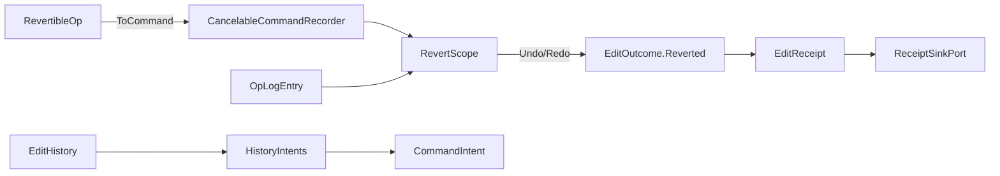

# [APPUI_EDIT_HISTORY]

Client-side undo/redo is a revertible command stack on the admitted `CancelableCommandRecorder`, surfaced as undo/redo command-table intents and sealing `EditReceipt` with `EditOutcome.Reverted` — no per-screen undo stack and no undo package minted. `RevertibleOp` carries a forward and an inverse delta, `RevertScope` is the one inverse algebra spanning the client recorder window and the durable Persistence `Version/ledger` `OpLogEntry` inverse stream as two arms, and `EditHistory` wraps the admitted `CancelableCommandRecorder` (`MaxCommand=20`)/`CommandHistoryViewModel` so every edit is a revertible command. The page owns the revertible-op vocabulary, the unified revert scope, and the history-to-command-intent projection; it mints no second revert vocabulary and no second history scheme — the client window and the durable sync fold one inverse algebra (the `[05]-[PROHIBITIONS]` second-revert-vocabulary clause forecloses a parallel one). The spine is `bodong.PropertyModels` (`CancelableCommandRecorder`, `CommandHistoryViewModel`, `ICancelableCommand`), the `CommandIntent`/`EditReceipt` rails, the `Rasm.Persistence/Version/ledger` op-log, Thinktecture.Runtime.Extensions, and LanguageExt rails.

## [01]-[INDEX]

- [01]-[REVERTIBLE_OP]: Forward/inverse delta op; the one revert vocabulary across client and durable arms.
- [02]-[REVERT_SCOPE]: The unified inverse algebra spanning the recorder window and the op-log inverse stream.
- [03]-[EDIT_HISTORY]: The `CancelableCommandRecorder` wrapper; undo/redo as command-table intents sealing `EditOutcome.Reverted`.

## [02]-[REVERTIBLE_OP]

- Owner: `RevertibleOp` the forward-and-inverse delta op; `RevertKind` the op-kind axis; `HistoryFault` the typed fault family on the `AppUiFaultBand.History` registry row (6320).
- Cases: `RevertKind` = set | insert | remove | move | composite under the locked kind literals; `HistoryFault` = Text | NothingToUndo | NothingToRedo | InverseAbsent — codes derive through the `AppUiFaultBand.History` registry row (6320); the hex band is dead.
- Entry: `public RevertibleOp Inverse()` — produces the inverse op whose forward delta is this op's inverse; `public ICancelableCommand ToCommand(Func<RevertibleOp, bool> apply)` — projects the op onto the admitted `ICancelableCommand` so the recorder owns the undo/redo lifecycle, binding `apply(this)` as the `Execute` (forward/redo) and `apply(Inverse())` as the `Cancel` (inverse/undo) the `CancelableCommandRecorder.Undo`/`Redo` drives.
- Auto: every edit records as a `RevertibleOp` carrying its forward delta (the value-after) and its inverse delta (the value-before) keyed by the edited target and the `ContentIdentity`, so an undo applies the inverse and a redo re-applies the forward without re-deriving either; the `composite` kind folds a batch edit's child ops into one revertible unit so a multi-item batch (`Editing/forms#BATCH_EDIT`) undoes as one transaction; the op projects onto the admitted `ICancelableCommand` — its `Execute` runs the forward (`apply(this)`) and its `Cancel` runs the inverse (`apply(Inverse())`) — so the `CancelableCommandRecorder` owns the queue, the `CanUndo`/`CanRedo` state, and the `MaxCommand=20` window, and `Recorder.Undo`/`Redo` pop-and-apply through that delegate pair so a hand-rolled undo stack is deleted.
- Packages: bodong.PropertyModels, Thinktecture.Runtime.Extensions, LanguageExt.Core, BCL inbox
- Growth: a new edit kind is one `RevertKind` value; zero new surface — the closed five-kind family is the revert vocabulary.
- Boundary: `RevertibleOp` is the one revert vocabulary in the package — a second revertible-op shape, a separate redo stack, and a per-screen undo list are the `[05]-[PROHIBITIONS]` second-revert-vocabulary rejected forms, so the client recorder and the durable op-log both speak `RevertibleOp`; the forward and inverse deltas are both stored so an undo never re-computes the prior state from a snapshot (a snapshot-diff undo is the rejected form); the op keys by `ContentIdentity` so the client `RevertibleOp` and the durable `OpLogEntry` align by content key across the seam (the `ONE_REVERT_VOCABULARY` ripple); the op projects onto the admitted `ICancelableCommand` so the recorder owns the lifecycle and the page binds the recorder, never re-implements the queue; the `composite` kind makes a batch one revertible unit so partial-batch undo is structurally absent.

```csharp signature
[SmartEnum<string>]
public sealed partial class RevertKind {
    public static readonly RevertKind Set = new("set");
    public static readonly RevertKind Insert = new("insert");
    public static readonly RevertKind Remove = new("remove");
    public static readonly RevertKind Move = new("move");
    public static readonly RevertKind Composite = new("composite");
}

[Union]
public abstract partial record HistoryFault : Expected, IValidationError<HistoryFault> {
    private HistoryFault(string detail, int code) : base(detail, code, None) { }

    public static HistoryFault Create(string message) => new Text(message);

    public sealed record Text : HistoryFault { public Text(string detail) : base(detail, AppUiFaultBand.History.Code(0)) { } }
    public sealed record NothingToUndo : HistoryFault { public NothingToUndo(string detail) : base(detail, AppUiFaultBand.History.Code(1)) { } }
    public sealed record NothingToRedo : HistoryFault { public NothingToRedo(string detail) : base(detail, AppUiFaultBand.History.Code(2)) { } }
    public sealed record InverseAbsent : HistoryFault { public InverseAbsent(string detail) : base(detail, AppUiFaultBand.History.Code(3)) { } }
}

public sealed record RevertibleOp(
    string Target,
    string ContentIdentity,
    RevertKind Kind,
    JsonElement Forward,
    JsonElement Backward,
    Seq<RevertibleOp> Children,
    HlcStamp At) {
    public RevertibleOp Inverse() =>
        Kind == RevertKind.Composite
            ? this with { Children = Children.Reverse().Map(static child => child.Inverse()), Forward = Backward, Backward = Forward }
            : this with { Forward = Backward, Backward = Forward };

    public ICancelableCommand ToCommand(string name, Func<RevertibleOp, bool> apply) =>
        new GenericCancelableCommand(name, executeFunc: () => apply(this), cancelFunc: () => apply(Inverse()));
}
```

## [03]-[REVERT_SCOPE]

- Owner: `RevertScope` the unified inverse algebra; `RevertArm` the client-versus-durable axis; `RevertCursor` the position across both arms.
- Cases: `RevertArm` = client | durable under the locked kind literals — the client `CancelableCommandRecorder` window and the durable Persistence `Version/ledger` `OpLogEntry` inverse stream.
- Entry: `public Fin<RevertibleOp> Undo(RevertCursor cursor)` — drives the client recorder's `CancelableCommandRecorder.Undo` (which pops the head command and runs its `Cancel` inverse delegate) while the cursor sits inside the `MaxCommand=20` window and resolves the applied op for the receipt, then falls through to the durable `OpLogEntry` inverse stream keyed by `ContentIdentity` once the client window is exhausted; `public Fin<RevertibleOp> Redo(RevertCursor cursor)` — the symmetric `CancelableCommandRecorder.Redo` forward re-execute.
- Auto: an undo inside the client window drives `CancelableCommandRecorder.Undo`, which pops the head `ICancelableCommand` and runs its `Cancel` inverse delegate so the inverse delta applies through the admitted recorder rather than a hand-rolled re-application, and the popped op resolves through `ClientHead` for the receipt; an undo past the `MaxCommand=20` client window resolves against the durable Persistence `Version/ledger` `OpLogEntry` inverse stream keyed by `ContentIdentity` so the deep history rides the settled durable sync, never a second client history scheme; the two arms speak one `RevertibleOp` vocabulary so the client window and the durable stream fold one inverse algebra — a `RevertibleOp` recorded in the client window projects onto the ONE `Collab/sync.md#DURABLE_INTENT` edit-intent union — the single typed op family every plane contributes — which lands as Persistence-owned `OpLogEntry`/`SyncOpKind` rows through the `Version/ledger` changefeed (the `ONE_REVERT_VOCABULARY` ripple; `RevertibleOp` stays the LOCAL revert algebra projecting onto that family, never a parallel union); the cursor tracks the combined position so the boundary between the in-memory window and the durable stream is invisible to the user.
- Packages: bodong.PropertyModels, Thinktecture.Runtime.Extensions, LanguageExt.Core, NodaTime, Rasm.Persistence (project)
- Growth: a new revert source is structurally fixed at two arms; zero new surface.
- Boundary: the revert scope is the one inverse algebra spanning two arms — a second revert vocabulary beside it is the `[05]-[PROHIBITIONS]` rejected form, so the client window and the durable op-log are two arms of one `RevertScope` and `EditOutcome.Reverted` is the only revert receipt; the client arm is the admitted `CancelableCommandRecorder` and the durable arm is the settled Persistence `Version/ledger` `OpLogEntry` inverse stream reached through the `Collab/sync.md` edit-intent projection, so the page mints neither — it folds them; the cursor falls through from client to durable at the `MaxCommand=20` boundary so a deep undo is seamless and a separate deep-history store is the deleted form; the durable arm keys by `ContentIdentity` so a client op and a durable op align by content key across the seam (the bidirectional `ONE_REVERT_VOCABULARY` link — AppUi owns the `RevertibleOp` forward/inverse-delta vocabulary and records the deltas, Persistence replays them as a `SyncOpKind` row over the `Editing/history → Persistence Version/ledger` revertible op-log seam (via the `Collab/sync.md` intent rail), no AppHost owner mints the vocabulary); a host-mutating revert routes through the abstract `DocumentTransaction` surface-host port so the host undo scope and the client undo fold one transaction.

```csharp signature
[SmartEnum<string>]
public sealed partial class RevertArm {
    public static readonly RevertArm Client = new("client");
    public static readonly RevertArm Durable = new("durable");
}

public sealed record RevertCursor(int ClientDepth, long DurableOffset) {
    public static readonly RevertCursor Origin = new(0, 0L);
    public bool InClientWindow(int maxCommand) => ClientDepth < maxCommand;
}

public sealed record RevertScope(
    CancelableCommandRecorder Recorder,
    Func<RevertArm, Option<RevertibleOp>> ClientHead,
    Func<string, long, IO<Option<RevertibleOp>>> DurableInverse,
    Func<string, long, IO<Option<RevertibleOp>>> DurableForward,
    int MaxCommand) {
    public Fin<RevertibleOp> Undo(RevertCursor cursor, string contentIdentity) =>
        cursor.InClientWindow(MaxCommand) && Recorder.CanUndo
            ? ClientHead(RevertArm.Client).Match(
                Some: op => Recorder.Undo() ? Fin.Succ(op) : Fin.Fail<RevertibleOp>(new HistoryFault.InverseAbsent(op.Target)),
                None: () => Fin.Fail<RevertibleOp>(new HistoryFault.NothingToUndo(contentIdentity)))
            : DurableInverse(contentIdentity, cursor.DurableOffset).Run().Match(
                Some: op => Fin.Succ(op),
                None: () => Fin.Fail<RevertibleOp>(new HistoryFault.NothingToUndo(contentIdentity)));

    public Fin<RevertibleOp> Redo(RevertCursor cursor, string contentIdentity) =>
        Recorder.CanRedo
            ? ClientHead(RevertArm.Client).Match(
                Some: op => Recorder.Redo() ? Fin.Succ(op) : Fin.Fail<RevertibleOp>(new HistoryFault.InverseAbsent(op.Target)),
                None: () => Fin.Fail<RevertibleOp>(new HistoryFault.NothingToRedo(contentIdentity)))
            : DurableForward(contentIdentity, cursor.DurableOffset).Run().Match(
                Some: op => Fin.Succ(op),
                None: () => Fin.Fail<RevertibleOp>(new HistoryFault.NothingToRedo(contentIdentity)));
}
```

## [04]-[EDIT_HISTORY]

- Owner: `EditHistory` the `CancelableCommandRecorder` wrapper; `HistoryIntents` the undo/redo command-table projection.
- Entry: `public IO<EditReceipt> Record(RevertibleOp op, Func<RevertibleOp, bool> apply, ClockPolicy clocks, CorrelationId correlation)` — records the op as an `ICancelableCommand` (whose `Execute`/`Cancel` delegates the `apply` fold drives) on the recorder through `PushCommand` and seals an `EditReceipt`; `public IO<EditReceipt> Undo(string contentIdentity, ...)` / `Redo(...)` — resolve through the `RevertScope` (driving the recorder's `Undo`/`Redo`) and seal `EditReceipt` with `EditOutcome.Reverted`.
- Auto: every edit records through the admitted `CancelableCommandRecorder` as a `RevertibleOp` command so the recorder owns the `MaxCommand=20` window, the `CanUndo`/`CanRedo` state, and the queue snapshots; undo/redo surface as `CommandIntent` table rows (`history.undo`/`history.redo`) whose availability gates on `CommandHistoryViewModel.CanUndo`/`CanRedo` so the toolbar undo button derives from the recorder state, never a manual enable flag; every revert seals one `EditReceipt` with `EditOutcome.Reverted(string Editor)` through the `ReceiptSinkPort` so the revert is one evidence row in the same `EditReceipt` family the inspector seals; the recorder clears at screen teardown so a screen never resumes a stale undo stack.
- Receipt: `EditReceipt` with `EditOutcome.Reverted` per revert; `TelemetryRow` contributes the edit-reverted and edit-redone instruments inward through the AppHost `TelemetryContributorPort`.
- Packages: bodong.PropertyModels, ReactiveUI, Thinktecture.Runtime.Extensions, LanguageExt.Core, NodaTime
- Growth: a new history verb is one `CommandIntent` row; one history instrument is one `InstrumentRow` on `EditHistory.TelemetryRow`; zero new surface — an undo package is deleted by the admitted recorder.
- Boundary: client undo/redo is the admitted `CancelableCommandRecorder`/`CommandHistoryViewModel` (`.api/api-propertygrid.md` command/undo types) — a per-screen undo stack and an undo package are the deleted forms, so the recorder owns the queue and the page binds it; undo/redo are `CommandIntent` rows so the verbs derive from the one command table (`Commands#INTENT_TABLE`) and a history-local command registry is the rejected form; the revert receipt is `EditReceipt` with `EditOutcome.Reverted` so the revert rides the one `EditReceipt` family (`Inspector#COMMIT_VALIDATION`) and a generic history receipt is the rejected form; the recorder's `CommandHistoryViewModel.CanUndo`/`CanRedo` drive the undo/redo command availability so the buttons gate structurally; the deep undo past `MaxCommand=20` resolves through the `RevertScope` durable arm so the client history and the durable sync fold one algebra; the recorder is scoped to the screen activation so it disposes with the screen.

```csharp signature
public sealed record EditHistory(CancelableCommandRecorder Recorder, CommandHistoryViewModel View, RevertScope Scope, string Surface) {
    public const string UndoIntent = "history.undo";
    public const string RedoIntent = "history.redo";

    public IO<EditReceipt> Record(RevertibleOp op, Func<RevertibleOp, bool> apply, ClockPolicy clocks, CorrelationId correlation) =>
        IO.lift(() => Recorder.PushCommand(op.ToCommand(op.Kind.Key, apply)))
            .Map(_ => new EditReceipt(EditReceipt.EditKind, Surface, op.Target, op.Kind.Key, new EditOutcome.Committed(op.Kind.Key), clocks.Now, correlation));

    public IO<EditReceipt> Undo(string contentIdentity, RevertCursor cursor, ClockPolicy clocks, CorrelationId correlation) =>
        Scope.Undo(cursor, contentIdentity).Match(
            Succ: op => IO.pure(new EditReceipt(EditReceipt.EditKind, Surface, op.Target, op.Kind.Key, new EditOutcome.Reverted(op.Kind.Key), clocks.Now, correlation)),
            Fail: error => IO.pure(new EditReceipt(EditReceipt.EditKind, Surface, contentIdentity, string.Empty, new EditOutcome.Rejected(EditFault.Create(error.Message)), clocks.Now, correlation)));

    public IObservable<bool> CanUndo => this.WhenAnyValue(static h => h.View.CanUndo);
    public IObservable<bool> CanRedo => this.WhenAnyValue(static h => h.View.CanRedo);

    public const string RevertedInstrument = "rasm.appui.edit.reverted";
    public const string RedoneInstrument = "rasm.appui.edit.redone";

    public static TelemetryContributorPort TelemetryRow(string version) =>
        AppUiTelemetry.Contribute(version, RevertedInstrument, RedoneInstrument);
}
```



## [05]-[RESEARCH]

- [RECORDER_SURFACE]: the admitted `PropertyModels.ComponentModel.CancelableCommandRecorder` execution surface the `EditHistory` binds is settled — `PushCommand(ICancelableCommand)` enqueues (the edit having already applied), `Undo()` pops the head command and runs its `Cancel` inverse, `Redo()` re-runs its `Execute`, `Clear()` empties both queues, and `CanUndo`/`CanRedo` gate from the head command's `CanCancel`/`CanExecute`; `GenericCancelableCommand(string name, Func<bool>? executeFunc, Func<bool>? cancelFunc, ...)` is the two-delegate `ICancelableCommand` whose `Execute`/`Cancel` return `bool`, and the `CommandHistoryViewModel.UndoCommand`/`RedoCommand`/`ClearCommand` are the bindable surface (`.api/api-propertygrid.md` command/undo types). The `RevertibleOp` vocabulary, the `RevertScope` two-arm inverse algebra driving `Recorder.Undo`/`Redo`, the `EditOutcome.Reverted` receipt, and the command-intent projection are settled with no unverified member at the recorder edge.
- [DURABLE_INVERSE_STREAM]: the Persistence `Version/ledger` `OpLogEntry` inverse-stream surface the `RevertScope` durable arm reads keyed by `ContentIdentity` — the `SyncOpKind` row the Persistence side replays the `RevertibleOp` forward/inverse delta as, and the content-key-keyed inverse-cursor query — resolved at implementation against the settled Persistence `Version/ledger` revertible op-log surface (the `ONE_REVERT_VOCABULARY` counterpart); the client window, the durable fall-through, and the one inverse algebra are settled, the exact `OpLogEntry`/`SyncOpKind` member spellings are the unverified surface consumed at the package edge.
