# [APPUI_EDIT_HISTORY]

Client-side undo/redo is one revert algebra over the admitted `CancelableCommandRecorder` window and the durable Persistence `Version/ledger` stream. `RevertDelta` owns the `Set`, `Insert`, `Remove`, `Move`, and `Composite` payloads plus their structural inverses; `RevertibleOp` derives `RevertKind` from that payload; `RevertCursor` retains client depth and durable offset together; and `RevertScope` applies both directions before advancing either coordinate. `EditHistory` projects undo and redo onto command intents and seals `EditOutcome.Reverted` or `EditOutcome.Redone`. The page owns no parallel stack, direction-specific fetch delegate, or duplicate maximum-window knob. The spine is `bodong.PropertyModels`, the `CommandIntent`/`EditReceipt` rails, the Persistence op-log, Thinktecture.Runtime.Extensions, and LanguageExt rails.

## [01]-[INDEX]

- [01]-[REVERTIBLE_OP]: The per-kind `RevertDelta` union; the one revert vocabulary across client and durable arms.
- [02]-[REVERT_SCOPE]: The unified inverse algebra spanning the recorder window and the op-log inverse stream.
- [03]-[EDIT_HISTORY]: The `CancelableCommandRecorder` wrapper; undo/redo command intents sealing direction-specific outcomes.

## [02]-[REVERTIBLE_OP]

- Owner: `RevertibleOp` the revertible delta op; `RevertDelta` the closed per-kind payload union; `RevertKind` the op-kind key axis the delta case derives; `HistoryFault` the typed fault family on the `AppUiFaultBand.History` registry row (6320).
- Cases: `RevertDelta` = Set | Insert | Remove | Move | Composite — each case carries exactly its own payload and derives its inverse; `RevertKind` = set | insert | remove | move | composite, derived from the delta case; `HistoryFault` = Text | NothingToUndo | NothingToRedo | InverseAbsent | ApplyRejected.
- Entry: `public RevertibleOp Inverse()` — the delta union's per-case inverse lifted onto the op; `public ICancelableCommand ToCommand(string name, Func<RevertibleOp, Fin<Unit>> apply)` — projects the typed application fold onto the admitted recorder's Boolean delegate boundary while durable replay retains the full `Fin<Unit>` failure.
- Auto: every edit records as a `RevertibleOp` whose delta case carries both directions structurally — `Set` swaps before and after, `Insert` inverts to `Remove` at the same position, `Move` swaps endpoints, `Composite` reverses and inverts its children — so an undo applies the derived inverse and a redo re-applies the forward without re-deriving either from a snapshot; the `Composite` case folds a batch edit's child ops into one revertible unit so a multi-item batch undoes as one transaction; the op projects onto the admitted `ICancelableCommand` so the `CancelableCommandRecorder` owns the queue, the `CanUndo`/`CanRedo` state, and the `MaxCommand=20` window, and `Recorder.Undo`/`Redo` pop-and-apply through that delegate pair so a hand-rolled undo stack is deleted.
- Packages: bodong.PropertyModels, Thinktecture.Runtime.Extensions, LanguageExt.Core, BCL inbox
- Growth: a new edit kind is one `RevertDelta` case plus its `RevertKind` key row, with every dispatch site broken loudly at compile time; zero new surface — the closed five-case family is the revert vocabulary.
- Boundary: `RevertibleOp` is the one revert vocabulary in the package — a second revertible-op shape, a separate redo stack, and a per-screen undo list are rejected. Both directions derive from the delta case, every JSON payload is defined, and every composite child re-enters full operation admission under the parent's `ContentIdentity`; an undo never re-computes prior state from a snapshot. The package-owned `ICancelableCommand` Boolean delegate is the sole narrowing boundary for the typed application rail, while durable replay preserves its exact failure. The `Composite` case makes a batch one revertible unit so partial-batch undo is structurally absent.

```csharp signature
[SmartEnum<string>]
public sealed partial class RevertKind {
    public static readonly RevertKind Set = new("set");
    public static readonly RevertKind Insert = new("insert");
    public static readonly RevertKind Remove = new("remove");
    public static readonly RevertKind Move = new("move");
    public static readonly RevertKind Composite = new("composite");
}

[Union]
public abstract partial record HistoryFault : Expected, IValidationError<HistoryFault> {
    private HistoryFault(string detail, int code) : base(detail, code, None) { }

    public static HistoryFault Create(string message) => new Text(message);

    public sealed record Text : HistoryFault { public Text(string detail) : base(detail, AppUiFaultBand.History.Code(0)) { } }
    public sealed record NothingToUndo : HistoryFault { public NothingToUndo(string detail) : base(detail, AppUiFaultBand.History.Code(1)) { } }
    public sealed record NothingToRedo : HistoryFault { public NothingToRedo(string detail) : base(detail, AppUiFaultBand.History.Code(2)) { } }
    public sealed record InverseAbsent : HistoryFault { public InverseAbsent(string detail) : base(detail, AppUiFaultBand.History.Code(3)) { } }
    public sealed record ApplyRejected : HistoryFault { public ApplyRejected(string detail) : base(detail, AppUiFaultBand.History.Code(4)) { } }
}

// Each delta case carries exactly its payload and its own inverse; kind derives from the case, so the
// kind key and the payload shape can never disagree.
[Union(ConversionFromValue = ConversionOperatorsGeneration.None)]
public abstract partial record RevertDelta {
    private RevertDelta() { }
    public sealed record Set(JsonElement Before, JsonElement After) : RevertDelta;
    public sealed record Insert(int At, JsonElement Item) : RevertDelta;
    public sealed record Remove(int At, JsonElement Item) : RevertDelta;
    public sealed record Move(int From, int To) : RevertDelta;
    public sealed record Composite(Seq<RevertibleOp> Children) : RevertDelta;

    public RevertKind Kind => Switch(
        set: static _ => RevertKind.Set,
        insert: static _ => RevertKind.Insert,
        remove: static _ => RevertKind.Remove,
        move: static _ => RevertKind.Move,
        composite: static _ => RevertKind.Composite);

    public RevertDelta Inverse() => Switch(
        set: static s => (RevertDelta)new Set(s.After, s.Before),
        insert: static i => new Remove(i.At, i.Item),
        remove: static r => new Insert(r.At, r.Item),
        move: static m => new Move(m.To, m.From),
        composite: static c => new Composite(c.Children.Reverse().Map(static child => child.Inverse())));

    public Fin<RevertDelta> Admit() => Switch(
        set: static delta => delta.Before.ValueKind is not JsonValueKind.Undefined && delta.After.ValueKind is not JsonValueKind.Undefined
            ? Fin.Succ<RevertDelta>(delta)
            : Fin.Fail<RevertDelta>(new HistoryFault.ApplyRejected("set/undefined")),
        insert: static delta => delta.At >= 0 && delta.Item.ValueKind is not JsonValueKind.Undefined
            ? Fin.Succ<RevertDelta>(delta)
            : Fin.Fail<RevertDelta>(new HistoryFault.ApplyRejected($"insert/{delta.At}")),
        remove: static delta => delta.At >= 0 && delta.Item.ValueKind is not JsonValueKind.Undefined
            ? Fin.Succ<RevertDelta>(delta)
            : Fin.Fail<RevertDelta>(new HistoryFault.ApplyRejected($"remove/{delta.At}")),
        move: static delta => delta.From >= 0 && delta.To >= 0 && delta.From != delta.To
            ? Fin.Succ<RevertDelta>(delta)
            : Fin.Fail<RevertDelta>(new HistoryFault.ApplyRejected($"move/{delta.From}/{delta.To}")),
        composite: static delta => delta.Children.IsEmpty
            ? Fin.Fail<RevertDelta>(new HistoryFault.ApplyRejected("composite/empty"))
            : delta.Children.Traverse(static child => child.Admit()).As().Map(_ => (RevertDelta)delta));
}

public sealed record RevertibleOp(
    string Target,
    string ContentIdentity,
    RevertDelta Delta,
    HlcStamp At) {
    public RevertKind Kind => Delta.Kind;

    public RevertibleOp Inverse() => this with { Delta = Delta.Inverse() };

    public Fin<RevertibleOp> Admit() =>
        !string.IsNullOrWhiteSpace(Target) && !string.IsNullOrWhiteSpace(ContentIdentity)
            ? Delta.Admit().Bind(admitted => admitted is RevertDelta.Composite composite
                && !composite.Children.ForAll(child => StringComparer.Ordinal.Equals(child.ContentIdentity, ContentIdentity))
                ? Fin.Fail<RevertibleOp>(new HistoryFault.ApplyRejected("composite content identity diverges"))
                : Fin.Succ(this with { Delta = admitted }))
            : Fin.Fail<RevertibleOp>(new HistoryFault.ApplyRejected("operation identity is empty"));

    public ICancelableCommand ToCommand(string name, Func<RevertibleOp, Fin<Unit>> apply) =>
        new GenericCancelableCommand(name, executeFunc: () => apply(this).IsSucc, cancelFunc: () => apply(Inverse()).IsSucc);
}
```

## [03]-[REVERT_SCOPE]

- Owner: `RevertScope` the unified inverse algebra; `RevertArm` the client-versus-durable axis; `RevertCursor` the combined client-depth and durable-offset value — every successful inverse operation returns the advanced cursor beside the applied op, so history state never reconstructs one position from the other.
- Cases: `RevertArm` = client | durable under the locked kind literals — the client `CancelableCommandRecorder` window and the durable Persistence `Version/ledger` `OpLogEntry` inverse stream.
- Entry: `public IO<Fin<(RevertibleOp Op, RevertCursor Next)>> Undo(RevertCursor cursor, string contentIdentity)` — drives the client recorder's `CancelableCommandRecorder.Undo` (which pops the head command and runs its `Cancel` inverse delegate) while the cursor sits inside the `MaxCommand=20` window, advancing `ClientDepth`, then falls through to the durable `OpLogEntry` inverse stream keyed by `ContentIdentity`: the fetched inverse op APPLIES through the one `Apply` fold before `DurableOffset` advances, so a durable success is an applied mutation, never a fetch; `public IO<Fin<(RevertibleOp Op, RevertCursor Next)>> Redo(RevertCursor cursor, string contentIdentity)` — the symmetric traversal: a positive `DurableOffset` fetches AND applies the durable forward op at `DurableOffset - 1`, then the client `CancelableCommandRecorder.Redo` retreats `ClientDepth`; both entries stay `IO`-deferred, so the effect terminates only at the screen's composition edge, never inside this owner.
- Auto: an undo inside the client window drives `CancelableCommandRecorder.Undo`, which pops the head `ICancelableCommand` and runs its `Cancel` inverse delegate so the inverse delta applies through the admitted recorder rather than a hand-rolled re-application, and the popped op resolves through `ClientHead` for the receipt; an undo past the `MaxCommand=20` client window fetches from the durable Persistence `Version/ledger` `OpLogEntry` inverse stream keyed by `ContentIdentity` and applies the fetched op through the SAME `Apply` delta fold the client commands were minted with (`ToCommand(name, apply)`), so both arms mutate through one application law and the deep history rides the settled durable sync, never a second client history scheme; every success carries `Next` — `DeeperClient`, `DeeperDurable`, or `Shallower` — so repeated undo addresses strictly deeper positions, repeated redo strictly shallower ones, and the client-to-durable transition is recoverable from the returned cursor alone; the two arms speak one `RevertibleOp` vocabulary so the client window and durable stream fold one inverse algebra — a client-window `RevertibleOp` projects onto the one `EditIntent` union and lands as Persistence-owned `OpLogEntry`/`SyncOpKind` rows through the `Version/ledger` changefeed; the durable-arm write leg is the `Collab/sync.md` route — an inverse decodes off the ledger `DiffBatch` as `EditIntent` rows and commits through `IntentLedger.Commit` exactly as `TimeTravel.Revert` does, so revert commits and live edits ride one ledger ingress; `RevertibleOp` stays the local revert algebra projecting onto that family, never a parallel union.
- Packages: bodong.PropertyModels, Thinktecture.Runtime.Extensions, LanguageExt.Core, NodaTime, Rasm.Persistence (project)
- Growth: a new revert source is structurally fixed at two arms; zero new surface.
- Boundary: the revert scope is the one inverse algebra spanning two arms; the admitted `CancelableCommandRecorder` owns the client window, the settled Persistence `Version/ledger` stream supplies durable operations, and both mutate through the same application fold. `Recorder.MaxCommand` is the only window bound. `RevertCursor` retains the actual client depth while traversing durable history, so returning from durable offset one resumes the real recorder depth instead of inventing `MaxCommand`; `RevertDirection` selects the durable read, and a successful fetch does not advance unless application succeeds. `ContentIdentity` aligns client and durable operations across the seam, while a host-mutating revert routes through the abstract `DocumentTransaction` port so host and client undo remain one transaction.

```csharp signature
[SmartEnum<string>]
public sealed partial class RevertArm {
    public static readonly RevertArm Client = new("client");
    public static readonly RevertArm Durable = new("durable");
}

[SmartEnum<string>]
public sealed partial class RevertDirection {
    public static readonly RevertDirection Undo = new("undo");
    public static readonly RevertDirection Redo = new("redo");
}

public readonly record struct RevertCursor(int ClientDepth, long DurableOffset) {
    public static readonly RevertCursor Start = new(0, 0L);

    public bool InClientWindow(int maxCommand) => DurableOffset == 0L && ClientDepth < maxCommand;

    public RevertCursor DeeperClient() => this with { ClientDepth = ClientDepth + 1 };

    public RevertCursor DeeperDurable() => this with { DurableOffset = DurableOffset + 1L };

    public RevertCursor Shallower() => DurableOffset > 0L
        ? this with { DurableOffset = DurableOffset - 1L }
        : this with { ClientDepth = int.Max(0, ClientDepth - 1) };
}

public sealed record RevertScope(
    CancelableCommandRecorder Recorder,
    Func<RevertDirection, Option<RevertibleOp>> ClientHead,
    Func<RevertDirection, string, long, IO<Option<RevertibleOp>>> Durable,
    Func<RevertibleOp, Fin<Unit>> Apply) {
    // Both arms mutate through one law: the recorder pops-and-applies via the command's delegate pair, and
    // the durable arm applies the fetched op through the SAME Apply fold before the cursor advances — a
    // fetch-only durable success is the deleted form, and the IO terminates at the caller's edge.
    public IO<Fin<(RevertibleOp Op, RevertCursor Next)>> Undo(RevertCursor cursor, string contentIdentity) =>
        cursor.ClientDepth < 0 || cursor.DurableOffset < 0L || string.IsNullOrWhiteSpace(contentIdentity)
            ? IO.pure(Fin.Fail<(RevertibleOp, RevertCursor)>(new HistoryFault.ApplyRejected("undo cursor or content identity is invalid")))
            : cursor.InClientWindow(Recorder.MaxCommand) && Recorder.CanUndo
            ? IO.lift(() => ClientHead(RevertDirection.Undo).Match(
                Some: op => Recorder.Undo()
                    ? Fin.Succ((op, cursor.DeeperClient()))
                    : Fin.Fail<(RevertibleOp, RevertCursor)>(new HistoryFault.ApplyRejected(op.Target)),
                None: () => Fin.Fail<(RevertibleOp, RevertCursor)>(new HistoryFault.NothingToUndo(contentIdentity))))
            : Durable(RevertDirection.Undo, contentIdentity, cursor.DurableOffset).Map(fetched => fetched.Match(
                Some: op => op.Admit().Bind(admitted => Apply(admitted)
                    .Map(_ => (admitted, cursor.DeeperDurable()))),
                None: () => Fin.Fail<(RevertibleOp, RevertCursor)>(new HistoryFault.NothingToUndo(contentIdentity))));

    public IO<Fin<(RevertibleOp Op, RevertCursor Next)>> Redo(RevertCursor cursor, string contentIdentity) =>
        cursor.ClientDepth < 0 || cursor.DurableOffset < 0L || string.IsNullOrWhiteSpace(contentIdentity)
            ? IO.pure(Fin.Fail<(RevertibleOp, RevertCursor)>(new HistoryFault.ApplyRejected("redo cursor or content identity is invalid")))
            : cursor.DurableOffset > 0
            ? Durable(RevertDirection.Redo, contentIdentity, cursor.DurableOffset - 1).Map(fetched => fetched.Match(
                Some: op => op.Admit().Bind(admitted => Apply(admitted)
                    .Map(_ => (admitted, cursor.Shallower()))),
                None: () => Fin.Fail<(RevertibleOp, RevertCursor)>(new HistoryFault.NothingToRedo(contentIdentity))))
            : IO.lift(() => Recorder.CanRedo
                ? ClientHead(RevertDirection.Redo).Match(
                    Some: op => Recorder.Redo()
                        ? Fin.Succ((op, cursor.Shallower()))
                        : Fin.Fail<(RevertibleOp, RevertCursor)>(new HistoryFault.ApplyRejected(op.Target)),
                    None: () => Fin.Fail<(RevertibleOp, RevertCursor)>(new HistoryFault.NothingToRedo(contentIdentity)))
                : Fin.Fail<(RevertibleOp, RevertCursor)>(new HistoryFault.NothingToRedo(contentIdentity)));
}
```

## [04]-[EDIT_HISTORY]

- Owner: `EditHistory` the `CancelableCommandRecorder` wrapper; `HistoryIntents` the undo/redo command-table projection.
- Entry: `Record` admits the delta and returns `IO<Fin<EditReceipt>>` after enqueuing one `ICancelableCommand`; `Undo` and `Redo` resolve through `RevertScope`, seal `EditOutcome.Reverted` and `EditOutcome.Redone` respectively, and return the advanced `RevertCursor`; `Timeline()` projects the recorder's own undo and redo queues.
- Auto: every edit records through the admitted `CancelableCommandRecorder`, whose `MaxCommand`, `CanUndo`, `CanRedo`, lifecycle events, and queue snapshots remain authoritative. The `history.undo` and `history.redo` command rows bind availability to `CommandHistoryViewModel`, and the timeline re-projects from the recorder queues on the recorder's `OnNewCommandAdded`, `OnCommandRedo`, `OnCommandCanceled`, and `OnCommandCleared` events. Undo and redo seal distinct outcomes through the one `EditReceipt` family, and the recorder clears at screen teardown.
- Receipt: `EditReceipt` with `EditOutcome.Reverted` for undo and `EditOutcome.Redone` for redo; `TelemetryRow` contributes both instruments through the AppHost `TelemetryContributorPort`.
- Packages: bodong.PropertyModels, ReactiveUI, Thinktecture.Runtime.Extensions, LanguageExt.Core, NodaTime
- Growth: a new history verb is one `CommandIntent` row; one history instrument is one `InstrumentRow` on `EditHistory.TelemetryRow`; zero new surface — an undo package is deleted by the admitted recorder.
- Boundary: client undo/redo binds the admitted `CancelableCommandRecorder` and `CommandHistoryViewModel`; a per-screen stack, history-local command registry, generic history receipt, and duplicate deep-history store are rejected. Command availability derives from `CanUndo` and `CanRedo`, the durable arm extends the same `RevertScope` beyond the recorder window, and screen activation owns recorder disposal.

```csharp signature
public sealed record EditHistory(CancelableCommandRecorder Recorder, CommandHistoryViewModel View, RevertScope Scope, string Surface) {
    public const string UndoIntent = "history.undo";
    public const string RedoIntent = "history.redo";

    public IO<Fin<EditReceipt>> Record(RevertibleOp op, Func<RevertibleOp, Fin<Unit>> apply, ClockPolicy clocks, CorrelationId correlation) =>
        IO.lift(() => op.Admit().Map(admitted => {
            Recorder.PushCommand(admitted.ToCommand(admitted.Kind.Key, apply));
            return new EditReceipt(EditReceipt.EditKind, Surface, admitted.Target, admitted.Kind.Key, new EditOutcome.Committed(admitted.Kind.Key), clocks.Now, correlation);
        }));

    public IO<(EditReceipt Receipt, RevertCursor Next)> Undo(string contentIdentity, RevertCursor cursor, ClockPolicy clocks, CorrelationId correlation) =>
        Scope.Undo(cursor, contentIdentity).Map(outcome => outcome.Match(
            Succ: advanced => (new EditReceipt(EditReceipt.EditKind, Surface, advanced.Op.Target, advanced.Op.Kind.Key, new EditOutcome.Reverted(advanced.Op.Kind.Key), clocks.Now, correlation), advanced.Next),
            Fail: error => (new EditReceipt(EditReceipt.EditKind, Surface, contentIdentity, string.Empty, new EditOutcome.Rejected(EditFault.Create(error.Message)), clocks.Now, correlation), cursor)));

    public IO<(EditReceipt Receipt, RevertCursor Next)> Redo(string contentIdentity, RevertCursor cursor, ClockPolicy clocks, CorrelationId correlation) =>
        Scope.Redo(cursor, contentIdentity).Map(outcome => outcome.Match(
            Succ: advanced => (new EditReceipt(EditReceipt.EditKind, Surface, advanced.Op.Target, advanced.Op.Kind.Key, new EditOutcome.Redone(advanced.Op.Kind.Key), clocks.Now, correlation), advanced.Next),
            Fail: error => (new EditReceipt(EditReceipt.EditKind, Surface, contentIdentity, string.Empty, new EditOutcome.Rejected(EditFault.Create(error.Message)), clocks.Now, correlation), cursor)));

    // Timeline pane: the recorder's own queue snapshots ARE the history model — undo entries newest-first,
    // redo entries as the not-undoable tail; no parallel history list exists to drift.
    public Seq<(string Name, RevertArm Arm, bool Undoable)> Timeline() =>
        toSeq(Recorder.GetUndoQueue()).Map(static command => (command.Name, RevertArm.Client, true))
        + toSeq(Recorder.GetRedoQueue()).Map(static command => (command.Name, RevertArm.Client, false));

    public IObservable<bool> CanUndo => View.WhenAnyValue(static view => view.CanUndo);
    public IObservable<bool> CanRedo => View.WhenAnyValue(static view => view.CanRedo);

    public const string RevertedInstrument = "rasm.appui.edit.reverted";
    public const string RedoneInstrument = "rasm.appui.edit.redone";

    public static TelemetryContributorPort TelemetryRow(string version, string schemaUrl) =>
        AppUiTelemetry.Contribute(version, schemaUrl,
            new(RevertedInstrument, InstrumentKind.Count, "{edit}", "undo reverts by surface"),
            new(RedoneInstrument, InstrumentKind.Count, "{edit}", "redo replays by surface"));
}
```



```mermaid
---
config:
  theme: base
  look: classic
  layout: elk
  flowchart:
    curve: linear
    padding: 25
  themeVariables:
    darkMode: true
    fontFamily: "SF Mono, Menlo, Cascadia Mono, Segoe UI Mono, Consolas, monospace"
    useGradient: false
    dropShadow: "none"
    background: "#282A36"
    primaryColor: "#44475A"
    primaryTextColor: "#F8F8F2"
    primaryBorderColor: "#BD93F9"
    lineColor: "#FF79C6"
    textColor: "#F8F8F2"
    edgeLabelBackground: "#21222C"
    labelBackgroundColor: "#21222C"
  themeCSS: ".nodeLabel{font-size:13px;font-weight:500}.edgeLabel{font-size:12px;font-weight:500}.cluster-label .nodeLabel{font-size:13.5px;font-weight:700;letter-spacing:.08em}.edge-thickness-normal{stroke-width:2px}.edge-thickness-thick{stroke-width:3px}.edge-pattern-dashed,.edge-pattern-dotted{stroke-width:1.5px;stroke-dasharray:4 6}.node rect,.node circle,.node polygon,.node path,.node .outer-path{stroke-width:1.5px;filter:none!important}.cluster rect{stroke-width:1px!important;stroke-dasharray:5 4!important;filter:none!important}.marker path{transform:scale(.8);transform-origin:5px 5px}.marker circle{transform:scale(.48);transform-origin:5px 5px}.edgeLabel rect{transform-box:fill-box;transform-origin:center;transform:scale(1.1,1.2)}"
---
flowchart LR
    accTitle: Unified revert rail
    accDescr: Client commands and durable operations converge in one revert scope before direction-specific outcomes, receipts, and command intents.
    RevertibleOp -->|ToCommand| CancelableCommandRecorder
    CancelableCommandRecorder --> RevertScope
    OpLogEntry --> RevertScope
    RevertScope -->|Undo/Redo| EditOutcome
    EditOutcome --> EditReceipt
    EditReceipt --> ReceiptSinkPort
    EditHistory --> HistoryIntents
    HistoryIntents --> CommandIntent
    linkStyle 4 stroke:#FFB86C,color:#F8F8F2
    linkStyle 5 stroke:#8BE9FD,color:#F8F8F2
    classDef primary fill:#44475A,stroke:#FF79C6,color:#F8F8F2
    classDef boundary fill:#282A36,stroke:#BD93F9,color:#F8F8F2
    classDef data fill:#FFB86CBF,stroke:#FFB86C,color:#282A36
    classDef external fill:#8BE9FDBF,stroke:#8BE9FD,color:#282A36
    class RevertScope,EditHistory,HistoryIntents primary
    class RevertibleOp,OpLogEntry,EditOutcome,EditReceipt data
    class CancelableCommandRecorder,ReceiptSinkPort external
    class CommandIntent boundary
```

## [05]-[RESEARCH]

- [RECORDER_SURFACE]: `PushCommand` enqueues, `Undo` runs `Cancel`, `Redo` runs `Execute`, `Clear` empties both queues, and `CanUndo`/`CanRedo` derive from the head. `GenericCancelableCommand` carries both delegates; `CommandHistoryViewModel` carries bindable commands; lifecycle delegate arity remains implementation-gated. Admission, the two-arm scope, direction-specific outcomes, and command-intent projection are settled.
- [DURABLE_INVERSE_STREAM]: `RevertScope` reads Persistence `OpLogEntry` values by `ContentIdentity`; the exact inverse-cursor query and `SyncOpKind` replay spellings remain implementation-gated. The client window, durable fall-through, one inverse algebra, and Persistence-owned revertible op-log are settled.
