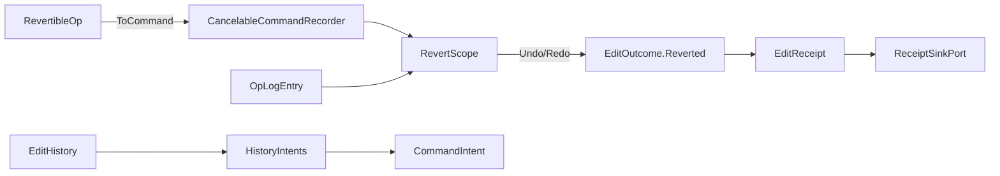

# [APPUI_EDIT_HISTORY]

Client-side undo/redo is a revertible command stack on the admitted `CancelableCommandRecorder`, surfaced as undo/redo command-table intents and sealing `EditReceipt` with `EditOutcome.Reverted` — no per-screen undo stack and no undo package minted. `RevertibleOp` carries a forward and an inverse delta, `RevertScope` is the one inverse algebra spanning the client recorder window and the durable Persistence `Version/ledger` `OpLogEntry` inverse stream as two arms, and `EditHistory` wraps the admitted `CancelableCommandRecorder` (`MaxCommand=20`)/`CommandHistoryViewModel` so every edit is a revertible command. The page owns the revertible-op vocabulary, the unified revert scope, and the history-to-command-intent projection; it mints no second revert vocabulary and no second history scheme — the client window and the durable sync fold one inverse algebra (the `[05]-[PROHIBITIONS]` second-revert-vocabulary clause forecloses a parallel one). The spine is `bodong.PropertyModels` (`CancelableCommandRecorder`, `CommandHistoryViewModel`, `ICancelableCommand`), the `CommandIntent`/`EditReceipt` rails, the `Rasm.Persistence/Version/ledger` op-log, Thinktecture.Runtime.Extensions, and LanguageExt rails.

## [01]-[INDEX]

- [01]-[REVERTIBLE_OP]: The per-kind `RevertDelta` union; the one revert vocabulary across client and durable arms.
- [02]-[REVERT_SCOPE]: The unified inverse algebra spanning the recorder window and the op-log inverse stream.
- [03]-[EDIT_HISTORY]: The `CancelableCommandRecorder` wrapper; undo/redo as command-table intents sealing `EditOutcome.Reverted`.

## [02]-[REVERTIBLE_OP]

- Owner: `RevertibleOp` the revertible delta op; `RevertDelta` the closed per-kind payload union; `RevertKind` the op-kind key axis the delta case derives; `HistoryFault` the typed fault family on the `AppUiFaultBand.History` registry row (6320).
- Cases: `RevertDelta` = Set | Insert | Remove | Move | Composite — each case carries exactly its own payload (value pair, position plus item, position pair, child ops) and derives its own inverse, so the one-shape JsonElement pair that forced a move or composite delta through stringly forward/backward slots is the deleted form; `RevertKind` = set | insert | remove | move | composite under the locked kind literals, derived from the delta case so kind and payload can never disagree; `HistoryFault` = Text | NothingToUndo | NothingToRedo | InverseAbsent — codes derive through the `AppUiFaultBand.History` registry row (6320); the hex band is dead.
- Entry: `public RevertibleOp Inverse()` — the delta union's per-case inverse lifted onto the op; `public ICancelableCommand ToCommand(string name, Func<RevertibleOp, bool> apply)` — projects the op onto the admitted `ICancelableCommand` so the recorder owns the undo/redo lifecycle, binding `apply(this)` as the `Execute` (forward/redo) and `apply(Inverse())` as the `Cancel` (inverse/undo) the `CancelableCommandRecorder.Undo`/`Redo` drives.
- Auto: every edit records as a `RevertibleOp` whose delta case carries both directions structurally — `Set` swaps before and after, `Insert` inverts to `Remove` at the same position, `Move` swaps endpoints, `Composite` reverses and inverts its children — so an undo applies the derived inverse and a redo re-applies the forward without re-deriving either from a snapshot; the `Composite` case folds a batch edit's child ops into one revertible unit so a multi-item batch (`Editing/forms#BATCH_EDIT`) undoes as one transaction; the op projects onto the admitted `ICancelableCommand` so the `CancelableCommandRecorder` owns the queue, the `CanUndo`/`CanRedo` state, and the `MaxCommand=20` window, and `Recorder.Undo`/`Redo` pop-and-apply through that delegate pair so a hand-rolled undo stack is deleted.
- Packages: bodong.PropertyModels, Thinktecture.Runtime.Extensions, LanguageExt.Core, BCL inbox
- Growth: a new edit kind is one `RevertDelta` case plus its `RevertKind` key row, with every dispatch site broken loudly at compile time; zero new surface — the closed five-case family is the revert vocabulary.
- Boundary: `RevertibleOp` is the one revert vocabulary in the package — a second revertible-op shape, a separate redo stack, and a per-screen undo list are the `[05]-[PROHIBITIONS]` second-revert-vocabulary rejected forms, so the client recorder and the durable op-log both speak `RevertibleOp`; both directions are structural properties of the delta case so an undo never re-computes prior state from a snapshot (a snapshot-diff undo is the rejected form); the op keys by `ContentIdentity` so the client `RevertibleOp` and the durable `OpLogEntry` align by content key across the seam (the `ONE_REVERT_VOCABULARY` ripple); the op projects onto the admitted `ICancelableCommand` so the recorder owns the lifecycle and the page binds the recorder, never re-implements the queue; the `Composite` case makes a batch one revertible unit so partial-batch undo is structurally absent.

```csharp signature
[SmartEnum<string>]
public sealed partial class RevertKind {
    public static readonly RevertKind Set = new("set");
    public static readonly RevertKind Insert = new("insert");
    public static readonly RevertKind Remove = new("remove");
    public static readonly RevertKind Move = new("move");
    public static readonly RevertKind Composite = new("composite");
}

[Union]
public abstract partial record HistoryFault : Expected, IValidationError<HistoryFault> {
    private HistoryFault(string detail, int code) : base(detail, code, None) { }

    public static HistoryFault Create(string message) => new Text(message);

    public sealed record Text : HistoryFault { public Text(string detail) : base(detail, AppUiFaultBand.History.Code(0)) { } }
    public sealed record NothingToUndo : HistoryFault { public NothingToUndo(string detail) : base(detail, AppUiFaultBand.History.Code(1)) { } }
    public sealed record NothingToRedo : HistoryFault { public NothingToRedo(string detail) : base(detail, AppUiFaultBand.History.Code(2)) { } }
    public sealed record InverseAbsent : HistoryFault { public InverseAbsent(string detail) : base(detail, AppUiFaultBand.History.Code(3)) { } }
    public sealed record ApplyRejected : HistoryFault { public ApplyRejected(string detail) : base(detail, AppUiFaultBand.History.Code(4)) { } }
}

// Each delta case carries exactly its payload and its own inverse; kind derives from the case, so the
// kind key and the payload shape can never disagree.
[Union(ConversionFromValue = ConversionOperatorsGeneration.None)]
public abstract partial record RevertDelta {
    private RevertDelta() { }
    public sealed record Set(JsonElement Before, JsonElement After) : RevertDelta;
    public sealed record Insert(int At, JsonElement Item) : RevertDelta;
    public sealed record Remove(int At, JsonElement Item) : RevertDelta;
    public sealed record Move(int From, int To) : RevertDelta;
    public sealed record Composite(Seq<RevertibleOp> Children) : RevertDelta;

    public RevertKind Kind => Switch(
        set: static _ => RevertKind.Set,
        insert: static _ => RevertKind.Insert,
        remove: static _ => RevertKind.Remove,
        move: static _ => RevertKind.Move,
        composite: static _ => RevertKind.Composite);

    public RevertDelta Inverse() => Switch(
        set: static s => (RevertDelta)new Set(s.After, s.Before),
        insert: static i => new Remove(i.At, i.Item),
        remove: static r => new Insert(r.At, r.Item),
        move: static m => new Move(m.To, m.From),
        composite: static c => new Composite(c.Children.Reverse().Map(static child => child.Inverse())));
}

public sealed record RevertibleOp(
    string Target,
    string ContentIdentity,
    RevertDelta Delta,
    HlcStamp At) {
    public RevertKind Kind => Delta.Kind;

    public RevertibleOp Inverse() => this with { Delta = Delta.Inverse() };

    public ICancelableCommand ToCommand(string name, Func<RevertibleOp, bool> apply) =>
        new GenericCancelableCommand(name, executeFunc: () => apply(this), cancelFunc: () => apply(Inverse()));
}
```

## [03]-[REVERT_SCOPE]

- Owner: `RevertScope` the unified inverse algebra; `RevertArm` the client-versus-durable axis; `RevertCursor` the position across both arms — every successful inverse operation returns the ADVANCED cursor beside the applied op, so the combined position is history state, never caller arithmetic.
- Cases: `RevertArm` = client | durable under the locked kind literals — the client `CancelableCommandRecorder` window and the durable Persistence `Version/ledger` `OpLogEntry` inverse stream.
- Entry: `public IO<Fin<(RevertibleOp Op, RevertCursor Next)>> Undo(RevertCursor cursor, string contentIdentity)` — drives the client recorder's `CancelableCommandRecorder.Undo` (which pops the head command and runs its `Cancel` inverse delegate) while the cursor sits inside the `MaxCommand=20` window, advancing `ClientDepth`, then falls through to the durable `OpLogEntry` inverse stream keyed by `ContentIdentity`: the fetched inverse op APPLIES through the one `Apply` fold before `DurableOffset` advances, so a durable success is an applied mutation, never a fetch; `public IO<Fin<(RevertibleOp Op, RevertCursor Next)>> Redo(RevertCursor cursor, string contentIdentity)` — the symmetric traversal: a positive `DurableOffset` fetches AND applies the durable forward op at `DurableOffset - 1`, then the client `CancelableCommandRecorder.Redo` retreats `ClientDepth`; both entries stay `IO`-deferred, so the effect terminates only at the screen's composition edge, never inside this owner.
- Auto: an undo inside the client window drives `CancelableCommandRecorder.Undo`, which pops the head `ICancelableCommand` and runs its `Cancel` inverse delegate so the inverse delta applies through the admitted recorder rather than a hand-rolled re-application, and the popped op resolves through `ClientHead` for the receipt; an undo past the `MaxCommand=20` client window fetches from the durable Persistence `Version/ledger` `OpLogEntry` inverse stream keyed by `ContentIdentity` and applies the fetched op through the SAME `Apply` delta fold the client commands were minted with (`ToCommand(name, apply)`), so both arms mutate through one application law and the deep history rides the settled durable sync, never a second client history scheme; every success carries `Next` — `DeeperClient`, `DeeperDurable`, or `Shallower` — so repeated undo addresses strictly deeper positions, repeated redo strictly shallower ones, and the client-to-durable transition is recoverable from the returned cursor alone; the two arms speak one `RevertibleOp` vocabulary so the client window and the durable stream fold one inverse algebra — a `RevertibleOp` recorded in the client window projects onto the ONE `Collab/sync.md#DURABLE_INTENT` edit-intent union — the single typed op family every plane contributes — which lands as Persistence-owned `OpLogEntry`/`SyncOpKind` rows through the `Version/ledger` changefeed (the `ONE_REVERT_VOCABULARY` ripple; `RevertibleOp` stays the LOCAL revert algebra projecting onto that family, never a parallel union).
- Packages: bodong.PropertyModels, Thinktecture.Runtime.Extensions, LanguageExt.Core, NodaTime, Rasm.Persistence (project)
- Growth: a new revert source is structurally fixed at two arms; zero new surface.
- Boundary: the revert scope is the one inverse algebra spanning two arms — a second revert vocabulary beside it is the `[05]-[PROHIBITIONS]` rejected form, so the client window and the durable op-log are two arms of one `RevertScope` and `EditOutcome.Reverted` is the only revert receipt; the client arm is the admitted `CancelableCommandRecorder` and the durable arm is the settled Persistence `Version/ledger` `OpLogEntry` inverse stream reached through the `Collab/sync.md` edit-intent projection, so the page mints neither — it folds them; the cursor falls through from client to durable at the `MaxCommand=20` boundary so a deep undo is seamless and a separate deep-history store is the deleted form; the durable arm keys by `ContentIdentity` so a client op and a durable op align by content key across the seam (the bidirectional `ONE_REVERT_VOCABULARY` link — AppUi owns the `RevertibleOp` forward/inverse-delta vocabulary and records the deltas, Persistence replays them as a `SyncOpKind` row over the `Editing/history → Persistence Version/ledger` revertible op-log seam (via the `Collab/sync.md` intent rail), no AppHost owner mints the vocabulary); a host-mutating revert routes through the abstract `DocumentTransaction` surface-host port so the host undo scope and the client undo fold one transaction.

```csharp signature
[SmartEnum<string>]
public sealed partial class RevertArm {
    public static readonly RevertArm Client = new("client");
    public static readonly RevertArm Durable = new("durable");
}

[SmartEnum<string>]
public sealed partial class RevertDirection {
    public static readonly RevertDirection Undo = new("undo");
    public static readonly RevertDirection Redo = new("redo");
}

[Union(ConversionFromValue = ConversionOperatorsGeneration.None)]
public abstract partial record RevertCursor {
    private RevertCursor() { }
    public sealed record Origin : RevertCursor;
    public sealed record Client(int Depth) : RevertCursor;
    public sealed record Durable(long Offset) : RevertCursor;

    public static readonly RevertCursor Start = new Origin();

    public bool InClientWindow(int maxCommand) => Switch(
        state: maxCommand,
        origin: static (_, _) => true,
        client: static (limit, cursor) => cursor.Depth < limit,
        durable: static (_, _) => false);

    public int ClientDepth() => Switch(
        origin: static _ => 0,
        client: static cursor => cursor.Depth,
        durable: static _ => 0);

    public long DurableOffset() => Switch(
        origin: static _ => 0L,
        client: static _ => 0L,
        durable: static cursor => cursor.Offset);

    public RevertCursor DeeperClient() => new Client(ClientDepth() + 1);
    public RevertCursor DeeperDurable() => new Durable(DurableOffset() + 1);

    public RevertCursor Shallower(int maxCommand) => Switch(
        state: maxCommand,
        origin: static (_, _) => Start,
        client: static (_, cursor) => cursor.Depth <= 1 ? Start : new Client(cursor.Depth - 1),
        durable: static (limit, cursor) => cursor.Offset <= 1 ? new Client(limit) : new Durable(cursor.Offset - 1));
}

public sealed record RevertScope(
    CancelableCommandRecorder Recorder,
    Func<RevertDirection, Option<RevertibleOp>> ClientHead,
    Func<RevertDirection, string, long, IO<Option<RevertibleOp>>> Durable,
    Func<RevertibleOp, bool> Apply) {
    // Both arms mutate through one law: the recorder pops-and-applies via the command's delegate pair, and
    // the durable arm applies the fetched op through the SAME Apply fold before the cursor advances — a
    // fetch-only durable success is the deleted form, and the IO terminates at the caller's edge.
    public IO<Fin<(RevertibleOp Op, RevertCursor Next)>> Undo(RevertCursor cursor, string contentIdentity) =>
        cursor.InClientWindow(Recorder.MaxCommand) && Recorder.CanUndo
            ? IO.lift(() => ClientHead(RevertDirection.Undo).Match(
                Some: op => Recorder.Undo()
                    ? Fin.Succ((op, cursor.DeeperClient()))
                    : Fin.Fail<(RevertibleOp, RevertCursor)>(new HistoryFault.ApplyRejected(op.Target)),
                None: () => Fin.Fail<(RevertibleOp, RevertCursor)>(new HistoryFault.NothingToUndo(contentIdentity))))
            : Durable(RevertDirection.Undo, contentIdentity, cursor.DurableOffset()).Map(fetched => fetched.Match(
                Some: op => Apply(op)
                    ? Fin.Succ((op, cursor.DeeperDurable()))
                    : Fin.Fail<(RevertibleOp, RevertCursor)>(new HistoryFault.ApplyRejected(op.Target)),
                None: () => Fin.Fail<(RevertibleOp, RevertCursor)>(new HistoryFault.NothingToUndo(contentIdentity))));

    public IO<Fin<(RevertibleOp Op, RevertCursor Next)>> Redo(RevertCursor cursor, string contentIdentity) =>
        cursor.DurableOffset() > 0
            ? Durable(RevertDirection.Redo, contentIdentity, cursor.DurableOffset() - 1).Map(fetched => fetched.Match(
                Some: op => Apply(op)
                    ? Fin.Succ((op, cursor.Shallower(Recorder.MaxCommand)))
                    : Fin.Fail<(RevertibleOp, RevertCursor)>(new HistoryFault.ApplyRejected(op.Target)),
                None: () => Fin.Fail<(RevertibleOp, RevertCursor)>(new HistoryFault.NothingToRedo(contentIdentity))))
            : IO.lift(() => Recorder.CanRedo
                ? ClientHead(RevertDirection.Redo).Match(
                    Some: op => Recorder.Redo()
                        ? Fin.Succ((op, cursor.Shallower(Recorder.MaxCommand)))
                        : Fin.Fail<(RevertibleOp, RevertCursor)>(new HistoryFault.ApplyRejected(op.Target)),
                    None: () => Fin.Fail<(RevertibleOp, RevertCursor)>(new HistoryFault.NothingToRedo(contentIdentity)))
                : Fin.Fail<(RevertibleOp, RevertCursor)>(new HistoryFault.NothingToRedo(contentIdentity)));
}
```

## [04]-[EDIT_HISTORY]

- Owner: `EditHistory` the `CancelableCommandRecorder` wrapper; `HistoryIntents` the undo/redo command-table projection.
- Entry: `public IO<EditReceipt> Record(RevertibleOp op, Func<RevertibleOp, bool> apply, ClockPolicy clocks, CorrelationId correlation)` — records the op as an `ICancelableCommand` (whose `Execute`/`Cancel` delegates the `apply` fold drives) on the recorder through `PushCommand` and seals an `EditReceipt`; `public IO<(EditReceipt Receipt, RevertCursor Next)> Undo(string contentIdentity, RevertCursor cursor, ...)` / `Redo(...)` — resolve through the `RevertScope` (driving the recorder's `Undo`/`Redo`), seal `EditReceipt` with `EditOutcome.Reverted`, and return the advanced cursor the screen threads into its next revert; `public Seq<(string Name, RevertArm Arm, bool Undoable)> Timeline()` — the history-timeline pane projection off the recorder's own `GetUndoQueue()`/`GetRedoQueue()` snapshots.
- Auto: every edit records through the admitted `CancelableCommandRecorder` as a `RevertibleOp` command so the recorder owns the `MaxCommand=20` window, the `CanUndo`/`CanRedo` state, and the queue snapshots; undo/redo surface as `CommandIntent` table rows (`history.undo`/`history.redo`) whose availability gates on `CommandHistoryViewModel.CanUndo`/`CanRedo` so the toolbar undo button derives from the recorder state, never a manual enable flag; the timeline pane projects `GetUndoQueue()`/`GetRedoQueue()` snapshots — per-entry name and direction straight off the recorder — and re-projects on the recorder's own lifecycle events (`OnNewCommandAdded`, `OnCommandRedo`, `OnCommandCanceled`, `OnCommandCleared`) so a history HUD is an event-driven fold over the recorder's own queues, never a polled or second history scheme; every revert seals one `EditReceipt` with `EditOutcome.Reverted(string Editor)` through the `ReceiptSinkPort` so the revert is one evidence row in the same `EditReceipt` family the inspector seals; the recorder clears at screen teardown so a screen never resumes a stale undo stack.
- Receipt: `EditReceipt` with `EditOutcome.Reverted` per revert; `TelemetryRow` contributes the edit-reverted and edit-redone instruments inward through the AppHost `TelemetryContributorPort`.
- Packages: bodong.PropertyModels, ReactiveUI, Thinktecture.Runtime.Extensions, LanguageExt.Core, NodaTime
- Growth: a new history verb is one `CommandIntent` row; one history instrument is one `InstrumentRow` on `EditHistory.TelemetryRow`; zero new surface — an undo package is deleted by the admitted recorder.
- Boundary: client undo/redo is the admitted `CancelableCommandRecorder`/`CommandHistoryViewModel` (`.api/api-propertygrid.md` command/undo types) — a per-screen undo stack and an undo package are the deleted forms, so the recorder owns the queue and the page binds it; undo/redo are `CommandIntent` rows so the verbs derive from the one command table (`Commands#INTENT_TABLE`) and a history-local command registry is the rejected form; the revert receipt is `EditReceipt` with `EditOutcome.Reverted` so the revert rides the one `EditReceipt` family (`Inspector#COMMIT_VALIDATION`) and a generic history receipt is the rejected form; the recorder's `CommandHistoryViewModel.CanUndo`/`CanRedo` drive the undo/redo command availability so the buttons gate structurally; the deep undo past `MaxCommand=20` resolves through the `RevertScope` durable arm so the client history and the durable sync fold one algebra; the recorder is scoped to the screen activation so it disposes with the screen.

```csharp signature
public sealed record EditHistory(CancelableCommandRecorder Recorder, CommandHistoryViewModel View, RevertScope Scope, string Surface) {
    public const string UndoIntent = "history.undo";
    public const string RedoIntent = "history.redo";

    public IO<EditReceipt> Record(RevertibleOp op, Func<RevertibleOp, bool> apply, ClockPolicy clocks, CorrelationId correlation) =>
        IO.lift(() => Recorder.PushCommand(op.ToCommand(op.Kind.Key, apply)))
            .Map(_ => new EditReceipt(EditReceipt.EditKind, Surface, op.Target, op.Kind.Key, new EditOutcome.Committed(op.Kind.Key), clocks.Now, correlation));

    public IO<(EditReceipt Receipt, RevertCursor Next)> Undo(string contentIdentity, RevertCursor cursor, ClockPolicy clocks, CorrelationId correlation) =>
        Scope.Undo(cursor, contentIdentity).Map(outcome => outcome.Match(
            Succ: advanced => (new EditReceipt(EditReceipt.EditKind, Surface, advanced.Op.Target, advanced.Op.Kind.Key, new EditOutcome.Reverted(advanced.Op.Kind.Key), clocks.Now, correlation), advanced.Next),
            Fail: error => (new EditReceipt(EditReceipt.EditKind, Surface, contentIdentity, string.Empty, new EditOutcome.Rejected(EditFault.Create(error.Message)), clocks.Now, correlation), cursor)));

    public IO<(EditReceipt Receipt, RevertCursor Next)> Redo(string contentIdentity, RevertCursor cursor, ClockPolicy clocks, CorrelationId correlation) =>
        Scope.Redo(cursor, contentIdentity).Map(outcome => outcome.Match(
            Succ: advanced => (new EditReceipt(EditReceipt.EditKind, Surface, advanced.Op.Target, advanced.Op.Kind.Key, new EditOutcome.Redone(advanced.Op.Kind.Key), clocks.Now, correlation), advanced.Next),
            Fail: error => (new EditReceipt(EditReceipt.EditKind, Surface, contentIdentity, string.Empty, new EditOutcome.Rejected(EditFault.Create(error.Message)), clocks.Now, correlation), cursor)));

    // Timeline pane: the recorder's own queue snapshots ARE the history model — undo entries newest-first,
    // redo entries as the not-undoable tail; no parallel history list exists to drift.
    public Seq<(string Name, RevertArm Arm, bool Undoable)> Timeline() =>
        toSeq(Recorder.GetUndoQueue()).Map(static command => (command.Name, RevertArm.Client, true))
        + toSeq(Recorder.GetRedoQueue()).Map(static command => (command.Name, RevertArm.Client, false));

    public IObservable<bool> CanUndo => View.WhenAnyValue(static view => view.CanUndo);
    public IObservable<bool> CanRedo => View.WhenAnyValue(static view => view.CanRedo);

    public const string RevertedInstrument = "rasm.appui.edit.reverted";
    public const string RedoneInstrument = "rasm.appui.edit.redone";

    public static TelemetryContributorPort TelemetryRow(string version) =>
        AppUiTelemetry.Contribute(version, RevertedInstrument, RedoneInstrument);
}
```



## [05]-[RESEARCH]

- [RECORDER_SURFACE]: the admitted `PropertyModels.ComponentModel.CancelableCommandRecorder` execution surface the `EditHistory` binds is settled — `PushCommand(ICancelableCommand)` enqueues (the edit having already applied), `Undo()` pops the head command and runs its `Cancel` inverse, `Redo()` re-runs its `Execute`, `Clear()` empties both queues, and `CanUndo`/`CanRedo` gate from the head command's `CanCancel`/`CanExecute`; `GenericCancelableCommand(string name, Func<bool>? executeFunc, Func<bool>? cancelFunc, ...)` is the two-delegate `ICancelableCommand` whose `Execute`/`Cancel` return `bool`, and the `CommandHistoryViewModel.UndoCommand`/`RedoCommand`/`ClearCommand` are the bindable surface (`.api/api-propertygrid.md` command/undo types); the four lifecycle event NAMES (`OnNewCommandAdded`, `OnCommandRedo`, `OnCommandCanceled`, `OnCommandCleared`) are catalogued while their delegate arity the timeline subscription adapts resolves at implementation. The `RevertibleOp` vocabulary, the `RevertScope` two-arm inverse algebra driving `Recorder.Undo`/`Redo` and the durable `Apply` fold, the `EditOutcome.Reverted` receipt, and the command-intent projection are settled with no unverified member at the recorder edge.
- [DURABLE_INVERSE_STREAM]: the Persistence `Version/ledger` `OpLogEntry` inverse-stream surface the `RevertScope` durable arm reads keyed by `ContentIdentity` — the `SyncOpKind` row the Persistence side replays the `RevertibleOp` forward/inverse delta as, and the content-key-keyed inverse-cursor query — resolved at implementation against the settled Persistence `Version/ledger` revertible op-log surface (the `ONE_REVERT_VOCABULARY` counterpart); the client window, the durable fall-through, and the one inverse algebra are settled, the exact `OpLogEntry`/`SyncOpKind` member spellings are the unverified surface consumed at the package edge.
