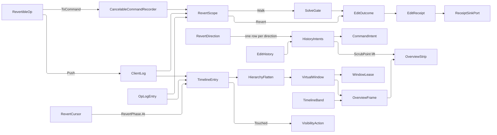

# [APPUI_EDIT_HISTORY]

Client-side undo/redo is one revert algebra over the admitted `CancelableCommandRecorder` window and the durable Persistence `Version/ledger` stream, beside the timeline surface that scrubs it. `RevertDelta` owns the `Set`, `Insert`, `Remove`, `Move`, and `Composite` payloads with their structural inverses; `RevertibleOp` derives `RevertKind` from that payload and carries the target, actor, and stamp every timeline row reads; `ClientLog` is the typed-op roster beside the recorder, so one lane is an INSTANCE of the algebra rather than a second one; `RevertCursor` retains client depth and durable offset together; `RevertDirection` and `RevertArm` carry every difference between the two traversals as delegate columns; one `RevertScope.Revert` applies either direction before advancing its coordinate and one `RevertScope.Walk` folds N of them into one absolute jump. `EditHistory` projects that traversal onto the undo, redo, and scrub command intents under a solve-gate posture, and `TimelineSurface` renders the unified stream through the windowing fabric with its overview-strip decoration lanes. The page owns no parallel stack, direction-named sibling method, direction-specific fetch delegate, duplicate maximum-window knob, or timeline-local virtualizer.

The spine is `bodong.PropertyModels`, the `CommandIntent`/`EditReceipt` rails, the Persistence op-log, the `Shell/virtualization` fabric (`VirtualWindow`, `ExtentLedger`, `HierarchyFlatten`, `OverviewFrame`), the `Shell/controls` `ControlIntent` vocabulary, Thinktecture.Runtime.Extensions, DynamicData, and LanguageExt rails.

## [01]-[INDEX]

- [02]-[REVERTIBLE_OP]: The per-kind `RevertDelta` union; the one revert vocabulary across client and durable arms.
- [03]-[REVERT_SCOPE]: The unified inverse algebra spanning the recorder window and the op-log stream; the client roster and the N-step walk.
- [04]-[EDIT_HISTORY]: The `CancelableCommandRecorder` wrapper; one revert traversal under a solve-gate posture; the undo, redo, and scrub intents.
- [05]-[TIMELINE_SURFACE]: The virtualized timeline over the windowing fabric; phase presentation, decoration lanes, and the two-way highlight link.

## [02]-[REVERTIBLE_OP]

- Owner: `RevertibleOp` the revertible delta op; `RevertDelta` the closed per-kind payload union; `RevertKind` the op-kind key axis the delta case derives, each row carrying the glyph key its timeline row paints; `HistoryFault` the typed fault family on the `AppUiFaultBand.History` registry row (6320).
- Cases: `RevertDelta` = Set | Insert | Remove | Move | Composite — each case carries exactly its own payload and derives its inverse; `RevertKind` = set | insert | remove | move | composite, derived from the delta case; `HistoryFault` = Text | NothingToUndo | NothingToRedo | ApplyRejected | EntryInert | CursorUnreachable. Fault codes are append-only and never re-seat on a retirement, so `ApplyRejected` keeps code 4 across the vacated slot and no persisted receipt re-reads as another case.
- Entry: `public RevertibleOp Inverse()` — the delta union's per-case inverse lifted onto the op; `public ICancelableCommand ToCommand(string name, Func<RevertibleOp, Fin<Unit>> apply)` — projects the typed application fold onto the admitted recorder's Boolean delegate boundary while durable replay retains the full `Fin<Unit>` failure.
- Auto: every edit records as a `RevertibleOp` whose delta case carries both directions structurally — `Set` swaps before and after, `Insert` inverts to `Remove` at the same position, `Move` swaps endpoints, `Composite` reverses and inverts its children — so an undo applies the derived inverse and a redo re-applies the forward without re-deriving either from a snapshot; the `Composite` case folds a batch edit's child ops into one revertible unit so a multi-item batch undoes as one transaction AND discloses as one parent row over its children on the timeline; the op projects onto the admitted `ICancelableCommand` so the `CancelableCommandRecorder` owns the queue, the `CanUndo`/`CanRedo` state, and the `MaxCommand=20` window, and `Recorder.Undo`/`Redo` pop-and-apply through that delegate pair so a hand-rolled undo stack is deleted.
- Packages: bodong.PropertyModels, Thinktecture.Runtime.Extensions, LanguageExt.Core, NodaTime, BCL inbox
- Growth: a new edit kind is one `RevertDelta` case with its `RevertKind` key row carrying its glyph, with every dispatch site broken loudly at compile time; zero new surface — the closed five-case family is the revert vocabulary.
- Boundary: `RevertibleOp` is the one revert vocabulary in the package — a second revertible-op shape, a separate redo stack, and a per-screen undo list are rejected. Both directions derive from the delta case, every JSON payload is defined, and every composite child re-enters full operation admission under the parent's `ContentIdentity`; an undo never re-computes prior state from a snapshot. The op carries `Target`, `Actor`, and `At` because the timeline renders exactly those three beside the kind — the durable arm reads them off `OpLogEntry.EntityKey`, `OpLogEntry.Actor`, and its `Hlc` cell, and the client arm stamps the live session actor, so a timeline row is a projection of the op rather than a second record the recorder's command NAME would have to carry. `RevertKind` owns the glyph key because the kind is the icon's semantic owner; the icon SOURCE rows stay at the `Theme/assets` catalogue, where all five kind keys are rostered and the case-derived fallback walk ranks the rows WITHIN a rostered key — an unrostered key seals `AssetFault.UnknownKey` at that owner rather than degrading, so minting a sixth kind lands its catalogue row in the same pass. The package-owned `ICancelableCommand` Boolean delegate is the sole narrowing boundary for the typed application rail, while durable replay preserves its exact failure. The `Composite` case makes a batch one revertible unit so partial-batch undo is structurally absent.

```csharp signature
// --- [TYPES] ----------------------------------------------------------------------------

// The kind row owns its glyph key: an icon slot addressed off the kind is one lookup, while a parallel
// kind-to-asset table beside this family is a second place a new case would have to be spelled.
[SmartEnum<string>]
[KeyMemberEqualityComparer<ComparerAccessors.StringOrdinal, string>]
[KeyMemberComparer<ComparerAccessors.StringOrdinal, string>]
public sealed partial class RevertKind {
    public static readonly RevertKind Set = new("set", AssetKeys.HistorySet);
    public static readonly RevertKind Insert = new("insert", AssetKeys.HistoryInsert);
    public static readonly RevertKind Remove = new("remove", AssetKeys.HistoryRemove);
    public static readonly RevertKind Move = new("move", AssetKeys.HistoryMove);
    public static readonly RevertKind Composite = new("composite", AssetKeys.HistoryComposite);

    public AssetKey Glyph { get; }

    // The label key IS the kind key under the surface prefix, so the locale catalogue resolves a row's
    // caption from the same value the icon and the receipt carry and no label column can drift from it.
    public string LabelKey => $"history.kind.{Key}";
}

// --- [ERRORS] ---------------------------------------------------------------------------

[Union]
public abstract partial record HistoryFault : Expected, IValidationError<HistoryFault> {
    private HistoryFault(string detail, int code) : base(detail, code, None) { }

    public static HistoryFault Create(string message) => new Text(message);

    public sealed record Text : HistoryFault { public Text(string detail) : base(detail, AppUiFaultBand.History.Code(0)) { } }
    public sealed record NothingToUndo : HistoryFault { public NothingToUndo(string detail) : base(detail, AppUiFaultBand.History.Code(1)) { } }
    public sealed record NothingToRedo : HistoryFault { public NothingToRedo(string detail) : base(detail, AppUiFaultBand.History.Code(2)) { } }
    // Code 3 stays vacant: every RevertDelta case derives its own inverse, so an inverse-absent fault names
    // an impossibility, and re-seating the codes below a retirement re-reads persisted receipts as the wrong case.
    public sealed record ApplyRejected : HistoryFault { public ApplyRejected(string detail) : base(detail, AppUiFaultBand.History.Code(4)) { } }
    public sealed record EntryInert : HistoryFault { public EntryInert(string detail) : base(detail, AppUiFaultBand.History.Code(5)) { } }
    public sealed record CursorUnreachable : HistoryFault { public CursorUnreachable(string detail) : base(detail, AppUiFaultBand.History.Code(6)) { } }
}

// --- [MODELS] ---------------------------------------------------------------------------

// Each delta case carries exactly its payload and its own inverse; kind derives from the case, so the
// kind key and the payload shape can never disagree.
[Union(ConversionFromValue = ConversionOperatorsGeneration.None)]
public abstract partial record RevertDelta {
    private RevertDelta() { }
    public sealed record Set(JsonElement Before, JsonElement After) : RevertDelta;
    public sealed record Insert(int At, JsonElement Item) : RevertDelta;
    public sealed record Remove(int At, JsonElement Item) : RevertDelta;
    public sealed record Move(int From, int To) : RevertDelta;
    public sealed record Composite(Seq<RevertibleOp> Children) : RevertDelta;

    public RevertKind Kind => Switch(
        set: static _ => RevertKind.Set,
        insert: static _ => RevertKind.Insert,
        remove: static _ => RevertKind.Remove,
        move: static _ => RevertKind.Move,
        composite: static _ => RevertKind.Composite);

    public RevertDelta Inverse() => Switch(
        set: static s => (RevertDelta)new Set(s.After, s.Before),
        insert: static i => new Remove(i.At, i.Item),
        remove: static r => new Insert(r.At, r.Item),
        move: static m => new Move(m.To, m.From),
        composite: static c => new Composite(c.Children.Rev().Map(static child => child.Inverse())));

    // The disclosure children a timeline row expands into. Every non-composite case answers empty, so the
    // flatten walks one total projection rather than a case test at the surface.
    public Seq<RevertibleOp> Children => Switch(
        set: static _ => Seq<RevertibleOp>(),
        insert: static _ => Seq<RevertibleOp>(),
        remove: static _ => Seq<RevertibleOp>(),
        move: static _ => Seq<RevertibleOp>(),
        composite: static c => c.Children);

    public Fin<RevertDelta> Admit() => Switch(
        set: static delta => delta.Before.ValueKind is not JsonValueKind.Undefined && delta.After.ValueKind is not JsonValueKind.Undefined
            ? Fin.Succ<RevertDelta>(delta)
            : Fin.Fail<RevertDelta>(new HistoryFault.ApplyRejected("set/undefined")),
        insert: static delta => delta.At >= 0 && delta.Item.ValueKind is not JsonValueKind.Undefined
            ? Fin.Succ<RevertDelta>(delta)
            : Fin.Fail<RevertDelta>(new HistoryFault.ApplyRejected($"insert/{delta.At}")),
        remove: static delta => delta.At >= 0 && delta.Item.ValueKind is not JsonValueKind.Undefined
            ? Fin.Succ<RevertDelta>(delta)
            : Fin.Fail<RevertDelta>(new HistoryFault.ApplyRejected($"remove/{delta.At}")),
        move: static delta => delta.From >= 0 && delta.To >= 0 && delta.From != delta.To
            ? Fin.Succ<RevertDelta>(delta)
            : Fin.Fail<RevertDelta>(new HistoryFault.ApplyRejected($"move/{delta.From}/{delta.To}")),
        composite: static delta => delta.Children.IsEmpty
            ? Fin.Fail<RevertDelta>(new HistoryFault.ApplyRejected("composite/empty"))
            : delta.Children.Traverse(static child => child.Admit()).As().Map(_ => (RevertDelta)delta));
}

// Target, actor, and stamp are COLUMNS rather than a timeline-side lookup: the durable arm lifts all three
// off the ledger entry it already read, so a rendered row never re-queries the stream that produced it and a
// client row is never reduced to the command name the recorder retained.
public sealed record RevertibleOp(
    string Target,
    string ContentIdentity,
    string Actor,
    RevertDelta Delta,
    HlcStamp At) {
    public RevertKind Kind => Delta.Kind;

    public RevertibleOp Inverse() => this with { Delta = Delta.Inverse() };

    public Fin<RevertibleOp> Admit() =>
        !string.IsNullOrWhiteSpace(Target) && !string.IsNullOrWhiteSpace(ContentIdentity) && !string.IsNullOrWhiteSpace(Actor)
            ? Delta.Admit().Bind(admitted => admitted is RevertDelta.Composite composite
                && !composite.Children.ForAll(child => StringComparer.Ordinal.Equals(child.ContentIdentity, ContentIdentity))
                ? Fin.Fail<RevertibleOp>(new HistoryFault.ApplyRejected("composite content identity diverges"))
                : Fin.Succ(this with { Delta = admitted }))
            : Fin.Fail<RevertibleOp>(new HistoryFault.ApplyRejected("operation identity is empty"));

    // The element ids this op touched: a composite answers its children's targets, so the highlight raise
    // and the linked-lane probe read one projection and never special-case the batch.
    public Seq<string> Touched =>
        Delta.Children.IsEmpty ? Seq(Target) : Delta.Children.Bind(static child => child.Touched);

    public ICancelableCommand ToCommand(string name, Func<RevertibleOp, Fin<Unit>> apply) =>
        new GenericCancelableCommand(name, executeFunc: () => apply(this).IsSucc, cancelFunc: () => apply(Inverse()).IsSucc);
}
```

## [03]-[REVERT_SCOPE]

- Owner: `RevertScope` the unified inverse algebra; `ClientLog` the typed-op roster beside the recorder; `RevertArm` the client-versus-durable axis, each row carrying the cursor coordinate it deepens and the fetch-and-apply fold that half runs; `RevertDirection` the undo-versus-redo axis, each row carrying the recorder verb, ledger offset, roster reach, ledger projection, cursor advance, absent fault, and sealed outcome; `RevertCursor` the combined client-depth and durable-offset value; `RevertWalk` the N-step traversal receipt — every successful inverse operation returns the advanced cursor beside the applied op, so history state never reconstructs one position from the other.
- Cases: `RevertArm` = client | durable under the locked kind literals — the client `CancelableCommandRecorder` window and the durable Persistence `Version/ledger` `OpLogEntry` stream; `RevertDirection` = undo | redo.
- Law: a revert LANE is an INSTANCE of this algebra, never a second one — one `RevertScope` per lane, each carrying its own recorder, its own `ClientLog`, its own window read, and its own cursor custody, so the document lane and the `Editing/forms#BATCH_EDIT` parameter lane cannot pop each other's commands; a lane whose history is session-scoped binds a durable window that answers empty by construction, and a turn past its client window therefore seals `NothingToUndo` at the arm boundary rather than reaching the document ledger.
- Entry: `public IO<Fin<(RevertibleOp Op, RevertCursor Next)>> Revert(RevertDirection direction, RevertCursor cursor, string contentIdentity)` — the ONE traversal both directions take: `RevertDirection.Arm` derives the owning half from the cursor, the client arm drives `CancelableCommandRecorder.Undo`/`Redo` (which pops the head command and runs its delegate pair) while the cursor sits inside the `MaxCommand=20` window, and the durable arm reads the ledger's one bounded case, `OpLog.Replay` over `ReplayWindow.ForEntity(contentIdentity, afterSequence, take)`, never a revert-local query. `public IO<RevertWalk> Walk(RevertDirection direction, RevertCursor cursor, string contentIdentity, int steps)` — the absolute jump as N folded single steps sharing one law. Both stay `IO`-deferred, so the effect terminates only at the screen's composition edge, never inside this owner.
- Auto: a turn inside the client window drives the recorder, which pops the head `ICancelableCommand` and runs its `Cancel` or forward delegate so the delta applies through the admitted recorder rather than a hand-rolled re-application, and the popped op resolves through `ClientLog.Head` for the receipt; a turn past the `MaxCommand=20` client window reads the durable Persistence `Version/ledger` window keyed by `ContentIdentity`, projects the entry through `RevertDirection.Project` — undo inverts, redo takes the forward op — and applies it through the SAME `Apply` delta fold the client commands were minted with (`ToCommand(name, apply)`), so both arms mutate through one application law, inversion has exactly one owner in `RevertDelta.Inverse`, and the deep history rides the settled durable sync rather than a second client history scheme; the fetched op APPLIES before the cursor advances, so a durable success is an applied mutation and never a fetch; every success carries `Next` — the arm's own deepening or one `Shallower` walk — so repeated undo addresses strictly deeper positions, repeated redo strictly shallower ones, and the client-to-durable transition is recoverable from the returned cursor alone; the two arms speak one `RevertibleOp` vocabulary so the client window and durable stream fold one inverse algebra — a client-window `RevertibleOp` projects onto the one `EditIntent` union and lands as Persistence-owned `OpLogEntry`/`SyncOpKind` rows through the `Version/ledger` changefeed; the durable-arm write leg is the `Collab/sync#TIME_TRAVEL` route — that owner's `TimeTravel.Revert` decodes the merge authority's own `DiffBatch` through its composition-bound `Inverse` column into `EditIntent` rows and folds each through `IntentLedger.Commit`, and this arm's inverse rides that same ingress, so revert commits and live edits share one ledger seam; the commit-DAG inverse is a different altitude with a different owner — Persistence `Version/commits#COMMIT_DAG` mints it append-only through `CommitGraph.Rewrite` over `HistoryRewrite.Revert`, whose inverse op-key set arrives from `RewriteSeam.Invert` — so neither plane re-derives the other's inversion and `RevertDelta.Inverse` remains the one inversion this package owns.
- Packages: bodong.PropertyModels, Thinktecture.Runtime.Extensions, LanguageExt.Core, NodaTime, Rasm.Persistence (project)
- Growth: a new revert source is structurally fixed at two arms; a new directional difference is one column on `RevertDirection`; a new lane is one `RevertScope` construction; zero new surface.
- Boundary: the revert scope is the one inverse algebra spanning two arms; the admitted `CancelableCommandRecorder` owns the client window, the settled Persistence `Version/ledger` stream supplies durable operations through the one `Window` read both the reverting arm and the timeline pane consume, and both arms mutate through the same application fold. `Recorder.MaxCommand` is the only window bound. `ClientLog` is the ONE client-side typed-op roster: the recorder retains a command NAME and a delegate pair, so the op each queued command was minted from lives here or nowhere, and a per-lane inline roster beside this owner is the deleted form — the head a direction addresses derives from `RevertDirection.Reach` against the live cursor, so an undo-roster and a redo-roster are one value. A push TRUNCATES the redo tail because the recorder clears its own redo queue on push, so a retained tail would name steps the queue no longer holds. `RevertCursor` retains the actual client depth while traversing durable history, so returning from durable offset one resumes the real recorder depth instead of inventing `MaxCommand`; `RevertDirection` supplies the durable offset and projection, and a successful fetch does not advance unless application succeeds; the durable read indexes through `Seq.Skip(offset).Head`, the `Option`-returning positional read the carrier publishes. `Walk` is TOTAL rather than `Fin` because a halted walk that already applied three of five steps is real mutation the cursor must reflect — a failure carrier discarding the applied prefix would leave the surface's cursor addressing a state the document had left. `ContentIdentity` aligns client and durable operations across the seam, while a host-mutating revert routes through the abstract `DocumentTransaction` port so host and client undo remain one transaction.

```csharp signature
// --- [TYPES] ----------------------------------------------------------------------------

// The arm OWNS its half of the traversal: each row carries the coordinate it deepens and the whole
// fetch-and-apply fold that half runs, so the client-versus-durable axis dispatches rather than naming a
// split two inline ternaries re-derive at two call sites.
[SmartEnum<string>]
[KeyMemberEqualityComparer<ComparerAccessors.StringOrdinal, string>]
[KeyMemberComparer<ComparerAccessors.StringOrdinal, string>]
public sealed partial class RevertArm {
    public static readonly RevertArm Client = new("client",
        static cursor => cursor with { ClientDepth = cursor.ClientDepth + 1 },
        static (scope, direction, cursor, identity) => IO.lift(() => scope.Log.Head(direction, cursor).Match(
            Some: op => direction.Drive(scope.Recorder)
                ? Fin.Succ((op, direction.After(Client, cursor)))
                : Fin.Fail<(RevertibleOp, RevertCursor)>(new HistoryFault.ApplyRejected(op.Target)),
            None: () => Fin.Fail<(RevertibleOp, RevertCursor)>(direction.Absent(identity)))));

    // The durable arm reads the SAME bounded ledger window the timeline renders, projects the entry through
    // the direction's own inversion, and applies before the cursor advances — a fetch-only durable success
    // is the deleted form.
    public static readonly RevertArm Durable = new("durable",
        static cursor => cursor with { DurableOffset = cursor.DurableOffset + 1 },
        static (scope, direction, cursor, identity) => direction.Offset(cursor) switch {
            var offset => scope.Window(identity, offset + 1).Map(window => window.Skip(offset).Head.Match(
                Some: entry => direction.Project(entry).Admit().Bind(admitted =>
                    scope.Apply(admitted).Map(_ => (admitted, direction.After(Durable, cursor)))),
                None: () => Fin.Fail<(RevertibleOp, RevertCursor)>(direction.Absent(identity)))),
        });

    [UseDelegateFromConstructor]
    public partial RevertCursor Deeper(RevertCursor cursor);

    [UseDelegateFromConstructor]
    public partial IO<Fin<(RevertibleOp Op, RevertCursor Next)>> Turn(RevertScope scope, RevertDirection direction, RevertCursor cursor, string contentIdentity);
}

// Undo walks DEEPER and inverts what the ledger holds; redo walks back SHALLOWER and re-applies the forward
// op it left. Every difference between the two traversals is a column here, so one entry serves both and a
// direction-named sibling method is the deleted form.
[SmartEnum<string>]
[KeyMemberEqualityComparer<ComparerAccessors.StringOrdinal, string>]
[KeyMemberComparer<ComparerAccessors.StringOrdinal, string>]
public sealed partial class RevertDirection {
    public static readonly RevertDirection Undo = new("undo",
        static recorder => recorder.CanUndo,
        static recorder => recorder.Undo(),
        static cursor => cursor.DurableOffset,
        static cursor => cursor.ClientDepth,
        static op => op.Inverse(),
        static (arm, cursor) => arm.Deeper(cursor),
        static identity => new HistoryFault.NothingToUndo(identity),
        static kind => new EditOutcome.Reverted(kind));
    public static readonly RevertDirection Redo = new("redo",
        static recorder => recorder.CanRedo,
        static recorder => recorder.Redo(),
        static cursor => cursor.DurableOffset - 1,
        static cursor => cursor.ClientDepth - 1,
        static op => op,
        static (_, cursor) => cursor.Shallower(),
        static identity => new HistoryFault.NothingToRedo(identity),
        static kind => new EditOutcome.Redone(kind));

    // The arm DERIVES: the durable half owns the turn whenever the step addresses a durable position the
    // client window cannot serve, which is what the two ternaries computed while the axis they
    // named owned no dispatch. Inversion lives at `RevertDelta.Inverse` alone — the ledger hands forward
    // ops and this column inverts them, so no seam holds a second inversion law.
    public RevertArm Arm(RevertCursor cursor, CancelableCommandRecorder recorder) =>
        Offset(cursor) >= 0 && !(cursor.InClientWindow(recorder.MaxCommand) && Ready(recorder))
            ? RevertArm.Durable
            : RevertArm.Client;

    [UseDelegateFromConstructor] public partial bool Ready(CancelableCommandRecorder recorder);
    [UseDelegateFromConstructor] public partial bool Drive(CancelableCommandRecorder recorder);
    [UseDelegateFromConstructor] public partial int Offset(RevertCursor cursor);
    // How far back into the client roster this direction's head sits: undo addresses the op one step deeper
    // than the live depth, redo the op the previous undo left one step shallower. One roster, two reaches.
    [UseDelegateFromConstructor] public partial int Reach(RevertCursor cursor);
    [UseDelegateFromConstructor] public partial RevertibleOp Project(RevertibleOp op);
    [UseDelegateFromConstructor] public partial RevertCursor After(RevertArm arm, RevertCursor cursor);
    [UseDelegateFromConstructor] public partial HistoryFault Absent(string contentIdentity);
    [UseDelegateFromConstructor] public partial EditOutcome Outcome(string kind);
}

// --- [MODELS] ---------------------------------------------------------------------------

public readonly record struct RevertCursor(int ClientDepth, int DurableOffset) {
    public static readonly RevertCursor Start = new(0, 0);

    public bool InClientWindow(int maxCommand) => DurableOffset == 0 && ClientDepth < maxCommand;

    // The unified ordinal the timeline addresses: one axis over both halves, so an absolute jump computes a
    // step count by subtraction rather than by branching on which arm currently owns the position.
    public int Position => ClientDepth + DurableOffset;

    // Deepening is the ARM's move — each arm owns the coordinate it advances — while shallowing is one walk
    // back through whichever coordinate is live, so the durable-to-client return resumes the real recorder
    // depth instead of inventing `MaxCommand`.
    public RevertCursor Shallower() => DurableOffset > 0
        ? this with { DurableOffset = DurableOffset - 1 }
        : this with { ClientDepth = int.Max(0, ClientDepth - 1) };
}

// A walk is TOTAL: the applied prefix and the reached cursor stand whether or not the traversal halted, so a
// three-of-five jump leaves the surface addressing the state the document holds. A `Fin` carrier
// here discards exactly the ops the document already applied.
public readonly record struct RevertWalk(Seq<RevertibleOp> Ops, RevertCursor Next, Option<Error> Halt);

// --- [OPERATIONS] -----------------------------------------------------------------------

// The typed-op roster beside the recorder it mirrors. The recorder owns the queue, its window, and the
// delegate pair it pops; this holds the `RevertibleOp` each queued command was minted from, so a turn's
// receipt and a timeline row describe the OP rather than the command name. Every lane holds exactly one,
// which is what makes a lane an instance of the algebra rather than a second algebra.
public sealed record ClientLog(Atom<Seq<RevertibleOp>> Ops) {
    public static ClientLog Of() => new(Atom(Seq<RevertibleOp>()));

    // The roster reads newest-last, so the live prefix is everything the cursor has not undone.
    public Seq<RevertibleOp> Live(RevertCursor cursor) =>
        Ops.Value switch { var ops => ops.Take(int.Max(0, ops.Count - cursor.ClientDepth)) };

    // A push TRUNCATES the undone tail: the recorder clears its own redo queue on push, so a retained tail
    // would name steps the queue no longer holds and the timeline would render redo rows nothing can reach.
    public Unit Push(RevertibleOp op, RevertCursor cursor) =>
        ignore(Ops.Swap(ops => ops.Take(int.Max(0, ops.Count - cursor.ClientDepth)).Add(op)));

    // ONE head read for both directions: the reach column places the index and the `Option` answers absence,
    // so a direction-named roster read and a throwing positional index are both unspellable here.
    public Option<RevertibleOp> Head(RevertDirection direction, RevertCursor cursor) =>
        (Ops.Value, Back: direction.Reach(cursor)) switch {
            var read when read.Back >= 0 && read.Back < read.Item1.Count =>
                read.Item1.Skip(read.Item1.Count - 1 - read.Back).Head,
            _ => Option<RevertibleOp>.None,
        };

    // The roster's own change stream, seeded with the live snapshot so a late timeline subscription renders
    // the history already recorded instead of waiting for the next edit to reveal it.
    public IObservable<Seq<RevertibleOp>> Changes =>
        Observable.FromEvent<AtomChangedEvent<Seq<RevertibleOp>>, Seq<RevertibleOp>>(
            handler => value => handler(value),
            handler => Ops.Change += handler,
            handler => Ops.Change -= handler)
            .StartWith(Ops.Value);
}

// One scope per revert LANE. The roster is a VALUE rather than a head delegate because the head a direction
// addresses is derivable from the cursor the arm already holds — a delegate column would let a lane bind a
// head answering from a roster its own pushes never reached.
public sealed record RevertScope(
    CancelableCommandRecorder Recorder,
    ClientLog Log,
    Func<string, int, IO<Seq<RevertibleOp>>> Window,
    Func<RevertibleOp, Fin<Unit>> Apply) {
    // A session lane binds this window: the durable half answers empty by construction, so a turn past the
    // client window seals the direction's absent fault instead of walking into the document's ledger.
    public static readonly Func<string, int, IO<Seq<RevertibleOp>>> SessionWindow =
        static (_, _) => IO.pure(Seq<RevertibleOp>());

    // ONE traversal carries both directions: the direction row supplies the recorder verb, the ledger
    // offset, the roster reach, the ledger projection, the cursor advance, and the absent fault, and the arm
    // it derives owns the fetch-and-apply fold. `Window` is the ledger's one bounded read — `OpLog.Replay`
    // over `ReplayWindow.ForEntity` — so the reverting arm and the timeline pane read one stream, and the IO
    // terminates at the caller's edge.
    public IO<Fin<(RevertibleOp Op, RevertCursor Next)>> Revert(RevertDirection direction, RevertCursor cursor, string contentIdentity) =>
        cursor.ClientDepth < 0 || cursor.DurableOffset < 0 || string.IsNullOrWhiteSpace(contentIdentity)
            ? IO.pure(Fin.Fail<(RevertibleOp, RevertCursor)>(new HistoryFault.ApplyRejected($"{direction.Key}: cursor or content identity is invalid")))
            : direction.Arm(cursor, Recorder).Turn(this, direction, cursor, contentIdentity);

    // The absolute jump is N single steps under ONE law — the same `Revert` a chord takes — so a scrub and a
    // keystroke can never diverge in what they apply. The fold stops at the first halt and KEEPS everything
    // applied before it, and it never inverts the halt into an IO failure, which is what lets a solve gate
    // resume unconditionally around it.
    public IO<RevertWalk> Walk(RevertDirection direction, RevertCursor cursor, string contentIdentity, int steps) =>
        toSeq(System.Linq.Enumerable.Range(0, int.Max(0, steps))).Fold(
            IO.pure(new RevertWalk(Seq<RevertibleOp>(), cursor, None)),
            (running, _) => running.Bind(walk => walk.Halt.IsSome
                ? IO.pure(walk)
                : Revert(direction, walk.Next, contentIdentity).Map(outcome => outcome.Match(
                    Succ: step => walk with { Ops = walk.Ops.Add(step.Op), Next = step.Next },
                    Fail: error => walk with { Halt = Some(error) }))));
}
```

## [04]-[EDIT_HISTORY]

- Owner: `EditHistory` the `CancelableCommandRecorder` wrapper carrying its lane's roster, solve gate, actor, and fault sink; `SolvePosture` the live-versus-gated regeneration axis; `SolveGate` the suspend/resume pair a scrub sequence batches through; `HistoryIntents` the undo/redo/scrub command-table projection; `ScrubPoint` the content-space point codec.
- Cases: `SolvePosture` = live | gated, each row carrying the fold its half wraps a walk in.
- Law: a control that publishes a typed gesture VALUE binds a surface-owned LIFTING arrow, never a deck row's materialized command — `ReactiveCommandBase<TParam,TResult>.ICommandExecute` throws `InvalidOperationException` for a parameter outside `TParam`, so a strip drag handing an `Avalonia.Point` straight to a `ReactiveCommand<CommandPayload, CommandReceipt>` faults on every gesture; the lift mints `CommandPayload.Fields` through `ScrubPoint` and runs the deck row, so the verb stays a deck row while the payload union stays closed at its five cases.
- Entry: `Record` admits the delta and returns `IO<Fin<(EditReceipt Receipt, RevertCursor Next)>>` after enqueuing one `ICancelableCommand` and pushing its typed op; `Revert(RevertDirection direction, …)` resolves through `RevertScope`, seals the direction row's own `EditOutcome` case, and returns the advanced `RevertCursor`; `Jump(int ordinal, …)` folds the whole distance through `RevertScope.Walk` inside the solve gate and seals one receipt for the sequence; `HistoryIntents.Rows(EditHistory history, Func<RevertDirection, CancellationToken, IO<Unit>> turn, Func<int, CancellationToken, IO<Unit>> jump, Func<double, Fin<int>> ordinalOf)` projects the direction table and the scrub row into the deck's history verbs, `ordinalOf` binding `TimelineSurface.OrdinalAt` at composition; `HistoryIntents.Scrub(CommandDeck deck)` mints the point-lifting arrow the strip binds.
- Auto: every edit records through the admitted `CancelableCommandRecorder`, whose `MaxCommand`, `CanUndo`, `CanRedo`, lifecycle events, and queue snapshots remain authoritative, and the same call pushes the typed op onto the lane's `ClientLog` so the timeline projects real ops; the `history.undo` and `history.redo` command rows DERIVE from `HistoryIntents.Rows` — one per `RevertDirection`, keyed off that row's own key and gated on its own `Ready` column against the live recorder — while `CommandHistoryViewModel` drives the availability stream that re-evaluates them; the `history.scrub` row is the surface-scoped absolute-jump verb, so a chord, a palette hit, and a strip drag reach one row; a gated walk suspends regeneration once, applies every step, and resumes once, so scrubbing thirty entries costs one re-solve rather than thirty; the direction row seals its distinct outcome through the one `EditReceipt` family, and the recorder clears at screen teardown.
- Receipt: `EditReceipt` with `EditOutcome.Reverted` for undo and `EditOutcome.Redone` for redo, one per traversal whatever its step count; a walk that applied nothing seals `EditOutcome.Rejected` while a partial walk seals its direction's outcome and sinks the halt on the fault column, because a walk that moved the document is not a refusal; `TelemetryRow` contributes the revert, redo, and scrub instruments through the AppHost `TelemetryContributorPort`.
- Packages: bodong.PropertyModels, ReactiveUI, Thinktecture.Runtime.Extensions, LanguageExt.Core, Avalonia, NodaTime
- Growth: a new history verb is one `CommandIntent` row; a new regeneration posture is one `SolvePosture` row with its wrap fold; one history instrument is one `InstrumentSpec` row on `EditHistory.TelemetryRow`; zero new surface — an undo package is deleted by the admitted recorder.
- Boundary: client undo/redo binds the admitted `CancelableCommandRecorder` and `CommandHistoryViewModel`; a per-screen stack, history-local command registry, generic history receipt, and duplicate deep-history store are rejected. Command availability derives from `CanUndo` and `CanRedo`, the durable arm extends the same `RevertScope` beyond the recorder window, and screen activation owns recorder disposal. `SolveGate` holds `Func<IO<Unit>>` factories rather than effects so both halves are deferred and the gate composes at the caller's edge; resume runs unconditionally because a halted walk is a VALUE on `RevertWalk.Halt` and never an IO failure, so a refused step can never strand a suspended solver. `ScrubPoint` lowers the strip's content-space point onto the existing `CommandPayload.Fields` case rather than widening the closed payload union with a geometry case that would drag Avalonia's coordinate types across the command wire; the Y component alone addresses the timeline because `OverviewAxis.Vertical` tracks one axis, and the content-space offset resolves to an ordinal through the fabric's own `ExtentLedger.StartIndex`, so the strip, the scrollbar, and the jump address one position model.

```csharp signature
// --- [TYPES] ----------------------------------------------------------------------------

// The regeneration axis as rows: single-step undo re-solves per step because that IS the operation, while a
// scrub folds its whole distance inside one suspend/resume. A caller branch spelling the same choice at two
// call sites is what let a thirty-entry scrub issue thirty solves.
[SmartEnum<string>]
[KeyMemberEqualityComparer<ComparerAccessors.StringOrdinal, string>]
[KeyMemberComparer<ComparerAccessors.StringOrdinal, string>]
public sealed partial class SolvePosture {
    public static readonly SolvePosture Live = new("live", static (_, walk) => walk);
    public static readonly SolvePosture Gated = new("gated", static (gate, walk) =>
        gate.Suspend().Bind(_ => walk).Bind(result => gate.Resume().Map(_ => result)));

    [UseDelegateFromConstructor]
    public partial IO<RevertWalk> Around(SolveGate gate, IO<RevertWalk> walk);
}

// --- [MODELS] ---------------------------------------------------------------------------

// Deferred factories, not effects: an eager suspend would fire at composition and leave the solver parked
// for the surface's lifetime. The posture rides the gate so a caller batches by handing the walk over,
// never by remembering to bracket it.
public sealed record SolveGate(Func<IO<Unit>> Suspend, Func<IO<Unit>> Resume, SolvePosture Posture) {
    public static readonly SolveGate Open = new(static () => IO.pure(unit), static () => IO.pure(unit), SolvePosture.Live);

    public IO<RevertWalk> Batch(IO<RevertWalk> walk) => Posture.Around(this, walk);
}

// --- [OPERATIONS] -----------------------------------------------------------------------

// The content-space point codec. `Fields` is the erased keyed case the command rail already carries, so the
// point crosses the one payload union rather than widening it — and the SAME codec reads it back, so the
// mint and the read can never disagree about the two field keys.
public static class ScrubPoint {
    public const string XField = "x";
    public const string YField = "y";

    public static CommandPayload Of(Point at) =>
        new CommandPayload.Fields(HashMap<string, JsonElement>.Empty
            .Add(XField, JsonSerializer.SerializeToElement(at.X))
            .Add(YField, JsonSerializer.SerializeToElement(at.Y)));

    public static Fin<Point> Read(CommandPayload payload) =>
        payload is CommandPayload.Fields fields
        && fields.Values.Find(XField) is { IsSome: true, Case: JsonElement x }
        && fields.Values.Find(YField) is { IsSome: true, Case: JsonElement y }
        && x.TryGetDouble(out double px) && y.TryGetDouble(out double py)
            ? Fin.Succ(new Point(px, py))
            : Fin<Point>.Fail(new HistoryFault.ApplyRejected($"{payload.Kind}: content-space point absent"));
}

// The lane's own history owner: its recorder, its roster (through the scope), its gate, its actor, and its
// fault sink. `Actor` is a column because a client op has no ledger entry to read one off, and a timeline
// that renders an empty author for every local edit is exactly the surface the durable half makes honest.
public sealed record EditHistory(
    CancelableCommandRecorder Recorder,
    CommandHistoryViewModel View,
    RevertScope Scope,
    SolveGate Gate,
    Func<Error, Unit> Fault,
    string Surface,
    string Actor) {
    public const string UndoVerb = "history.undo";
    public const string RedoVerb = "history.redo";
    public const string ScrubVerb = "history.scrub";

    // One enqueue, one push: the recorder takes the delegate pair it drives and the roster takes the op the
    // timeline renders, so the two can never describe different edits. The returned cursor is the surface —
    // a fresh op invalidates every redo position the previous traversal left behind.
    public IO<Fin<(EditReceipt Receipt, RevertCursor Next)>> Record(
        RevertibleOp op, RevertCursor cursor, ClockPolicy clocks, CorrelationId correlation) =>
        IO.lift(() => op.Admit().Map(admitted => {
            Recorder.PushCommand(admitted.ToCommand(admitted.Kind.Key, Scope.Apply));
            ignore(Scope.Log.Push(admitted, cursor));
            return (new EditReceipt(EditReceipt.EditKind, Surface, admitted.Target, admitted.Kind.Key,
                new EditOutcome.Committed(admitted.Kind.Key), clocks.Now, correlation), RevertCursor.Start);
        }));

    // One projection serves both directions: the direction row seals its own outcome case, so the receipt
    // is a row value rather than a second place the undo/redo split is spelled.
    public IO<(EditReceipt Receipt, RevertCursor Next)> Revert(
        RevertDirection direction, string contentIdentity, RevertCursor cursor, ClockPolicy clocks, CorrelationId correlation) =>
        Scope.Revert(direction, cursor, contentIdentity).Map(outcome => outcome.Match(
            Succ: advanced => (new EditReceipt(EditReceipt.EditKind, Surface, advanced.Op.Target, advanced.Op.Kind.Key, direction.Outcome(advanced.Op.Kind.Key), clocks.Now, correlation), advanced.Next),
            Fail: error => (new EditReceipt(EditReceipt.EditKind, Surface, contentIdentity, string.Empty, new EditOutcome.Rejected(EditFault.Create(error.Message)), clocks.Now, correlation), cursor)));

    // The absolute jump: the target ordinal and the live position fix both the direction and the distance,
    // so the whole scrub is one gated walk and a per-step regeneration is unreachable from here. Ordinal
    // zero is the newest op, which is the order the timeline renders and the order the roster holds.
    public IO<(EditReceipt Receipt, RevertCursor Next)> Jump(
        int ordinal, string contentIdentity, RevertCursor cursor, ClockPolicy clocks, CorrelationId correlation) =>
        (Target: int.Max(0, ordinal), From: cursor.Position) switch {
            var move => Gate
                .Batch(Scope.Walk(
                    move.Target >= move.From ? RevertDirection.Undo : RevertDirection.Redo,
                    cursor, contentIdentity, int.Abs(move.Target - move.From)))
                .Map(walk => Sealed(walk, move.Target >= move.From ? RevertDirection.Undo : RevertDirection.Redo,
                    contentIdentity, cursor, clocks, correlation)),
        };

    // A walk that moved the document seals its direction's outcome and sinks the halt as counted evidence; a
    // walk that moved nothing is the only refusal, because a receipt reading `rejected` over three applied
    // steps would describe a document state the surface no longer holds.
    private (EditReceipt Receipt, RevertCursor Next) Sealed(
        RevertWalk walk, RevertDirection direction, string contentIdentity,
        RevertCursor cursor, ClockPolicy clocks, CorrelationId correlation) =>
        (walk.Halt.Map(Fault), walk.Ops.Last) switch {
            (_, { IsSome: true, Case: RevertibleOp last }) => (
                new EditReceipt(EditReceipt.EditKind, Surface, last.Target, last.Kind.Key,
                    direction.Outcome(last.Kind.Key), clocks.Now, correlation),
                walk.Next),
            _ => (
                new EditReceipt(EditReceipt.EditKind, Surface, contentIdentity, string.Empty,
                    new EditOutcome.Rejected(EditFault.Create(
                        walk.Halt.Map(static error => error.Message).IfNone(contentIdentity))),
                    clocks.Now, correlation),
                cursor),
        };

    public IObservable<bool> CanUndo => View.WhenAnyValue(static view => view.CanUndo);
    public IObservable<bool> CanRedo => View.WhenAnyValue(static view => view.CanRedo);

    public const string RevertedInstrument = "rasm.appui.edit.reverted";
    public const string RedoneInstrument = "rasm.appui.edit.redone";
    public const string ScrubbedInstrument = "rasm.appui.edit.scrubbed";

    public static TelemetryContributorPort TelemetryRow(string version) =>
        AppUiTelemetry.Contribute(version,
            InstrumentSpec.Create(RevertedInstrument, InstrumentKind.Count, MeasureForm.Whole, "{edit}",
                "undo reverts by surface", Seq(AppUiTelemetry.SurfaceSlot), None, None, None),
            InstrumentSpec.Create(RedoneInstrument, InstrumentKind.Count, MeasureForm.Whole, "{edit}",
                "redo replays by surface", Seq(AppUiTelemetry.SurfaceSlot), None, None, None),
            InstrumentSpec.Create(ScrubbedInstrument, InstrumentKind.Count, MeasureForm.Whole, "{edit}",
                "timeline steps applied per scrub", Seq(AppUiTelemetry.SurfaceSlot), None, None, None));
}

// ONE row per RevertDirection and one scrub row: the intent key derives from the direction's own key — the
// same string the localization and icon catalogs resolve — availability is that direction's `Ready` column
// read off the live recorder, and the payload domain is empty because a traversal takes its coordinate from
// the screen. `turn` and `jump` bind the screen's content identity and cursor custody at composition, so a
// direction-named sibling row and a history-local command registry are both unspellable.
public static class HistoryIntents {
    public static Seq<CommandIntent> Rows(
        EditHistory history,
        Func<RevertDirection, CancellationToken, IO<Unit>> turn,
        Func<int, CancellationToken, IO<Unit>> jump,
        Func<double, Fin<int>> ordinalOf) =>
        toSeq(RevertDirection.Items).Map(direction => new CommandIntent(
            $"history.{direction.Key}", CommandScope.Screen, [],
            new[] { "none" }.ToFrozenSet(StringComparer.Ordinal),
            _ => direction.Ready(history.Recorder), None, static (_, _) => true,
            FrozenSet<string>.Empty, None,
            (_, cancellation) => turn(direction, cancellation)))
        .Add(new CommandIntent(
            EditHistory.ScrubVerb, CommandScope.Screen, [],
            new[] { "fields" }.ToFrozenSet(StringComparer.Ordinal),
            _ => history.Recorder.CanUndo || history.Recorder.CanRedo, None, static (_, _) => true,
            FrozenSet<string>.Empty, None,
            // The vertical axis alone addresses the timeline, so the horizontal component the strip publishes
            // is read and discarded here rather than at the strip, which owns no position model to drop it in.
            (payload, cancellation) => ScrubPoint.Read(payload).Bind(at => ordinalOf(at.Y)).Match(
                Succ: ordinal => jump(ordinal, cancellation),
                Fail: static error => IO.fail<Unit>(error))));

    // The point-lifting arrow the strip binds. The verb stays a deck row and this arrow is the only place a
    // gesture VALUE becomes a payload — handing the row's own materialized command to a control that
    // publishes a `Point` throws on the first drag, because the command's parameter type is the payload.
    public static Fin<ICommand> Scrub(CommandDeck deck) =>
        deck.Rows.TryGetValue(EditHistory.ScrubVerb, out CommandIntent? row)
            ? Fin<ICommand>.Succ(ReactiveCommand.CreateFromTask<Point, CommandReceipt>(
                (at, token) => row.Run(ScrubPoint.Of(at), deck, token).RunAsync(EnvIO.New(token: token)).AsTask(),
                outputScheduler: deck.Scheduler))
            : Fin<ICommand>.Fail(new HistoryFault.ApplyRejected($"{EditHistory.ScrubVerb}: absent from the frozen deck"));
}
```

## [05]-[TIMELINE_SURFACE]

- Owner: `TimelineKey` the self-ordering arm-and-ordinal address every row and disclosure child shares; `TimelineEntry` the unified row over both arms; `RevertPhase` the applied/marker/suppressed/refused axis carrying ink, inertness, and its decoration lane; `TimelineBand` the strip-lane vocabulary, each row carrying its `OverviewLane` and the predicate that admits an entry to it; `TimelineSurface` the projection composing the fabric window, the strip feed, the control-intent body, and the two-way highlight link.
- Cases: `RevertPhase` = applied | marker | suppressed | refused; `TimelineBand` = history | cursor | linked | refused.
- Law: the timeline is a PROJECTION of the one revert algebra — the client half reads `ClientLog.Ops` and the durable half reads the same bounded `RevertScope.Window` the durable arm reverts through, so the pane renders exactly what a jump can reach and a row nothing can address is unrepresentable.
- Law: roll-to-here is PRESENTATION, not a second state — every entry deeper than the cursor carries `RevertPhase.Suppressed`, whose `Inert` column gates every per-row verb, so the dimmed tail is one derived column rather than a suppressed-set the surface would have to keep in step with the cursor; the one refusal a row can carry is the ordinal the last walk halted at, arriving as a stream column so it clears with the next successful pass.
- Entry: `public IObservable<IChangeSet<TimelineEntry, TimelineKey>> Entries(IObservable<RevertCursor> cursor)` — the unified stream, composite children included as parent-keyed rows; `public WindowLease<RealizedItem<FlatNode<TimelineEntry>>> Lease(IObservable<ViewportRange> viewport, IObservable<Set<TimelineKey>> expansion, IObservable<RevertCursor> cursor)` — the virtualized rows through the one fabric; `public IObservable<OverviewFrame> Frames(IObservable<ViewportRange> viewport, IObservable<RevertCursor> cursor)` — the strip feed; `public Fin<int> OrdinalAt(double offset)` — the content-space offset the scrub verb resolves to a REVERT ordinal, through the ledger's own seek and then the key at that row address; `public ControlIntent Body(VirtualWindowSpec window)` — the tree-plus-strip intent; `public IO<Unit> Link(TimelineEntry entry)` — the entry-to-element highlight raise.
- Auto: the client half projects `ClientLog.Ops` newest-first into `RevertArm.Client` entries and the durable half projects the ledger window into `RevertArm.Durable` entries at continuing ordinals, so one ordinal axis spans both and `RevertCursor.Position` is the marker's own address; a `Composite` op emits its children as rows whose parent key is the composite's own, so disclosure rides `HierarchyFlatten.Flatten` and the `ControlIntent.Tree` kind materializes the resulting `FlatNode` stream — a timeline-local expander is the deleted form; the flattened stream feeds `VirtualWindow.Realize` so a hundred-thousand-entry history windows exactly like a table and a timeline-local virtualizer is the `Shell/virtualization` `[04]-[BOUNDARIES]` per-surface-virtualizer rejected form; successive snapshots diff through `EditDiff` rather than `ToObservableChangeSet` because a truncating push and a collapsing composite both REMOVE rows and the upserting fold removes none; `VirtualWindow.Overview` supplies the content and viewport rectangles off the same `ExtentLedger` the rows realize from, so the strip and the scrollbar can never disagree; each `TimelineBand` row folds its own marks out of the realized ordinal placements, so a new lane is one row and no producer computes a pixel; the strip publishes a content-space point back through `HistoryIntents.Scrub`, `OrdinalAt` seeks the row address through `ExtentLedger.StartIndex` and reads that address's key for the revert ordinal it carries — the row space and the ordinal space diverge by exactly the disclosed composite children, which are rows and never revert steps — and the gated walk applies the whole distance as one regeneration; a durable read that refuses answers the empty window on the lane's fault sink, so the timeline survives a ledger outage rather than terminating on it.
- Receipt: the jump's own `EditReceipt` from `EditHistory.Jump`; the surface seals none of its own, because a rendered row is not an edit.
- Packages: DynamicData, System.Reactive, Avalonia, ReactiveUI, Thinktecture.Runtime.Extensions, LanguageExt.Core
- Growth: a new decoration lane is one `TimelineBand` row carrying its `OverviewLane` and predicate; a new row phase is one `RevertPhase` row carrying its ink, inertness, and lane; a new column on a row is one `ControlIntent` child in the row template; zero new surface.
- Boundary: `TimelineSurface` renders through the settled fabric and the settled control vocabulary and owns no geometry, no scroll position, and no second history model — the window comes from `VirtualWindow`, the disclosure from `HierarchyFlatten`, the downsample from `OverviewScale`, the rows from `ControlFactory`, and the verbs from the frozen deck. `RevertPhase` is the ONE presentation axis and it carries its ink as a `PaintRole` the control theme's own selectors match, so the dimmed tail re-tints on a variant swap and this owner writes no brush, holding the `Theme/tokens` resolved-token law; `Inert` gates the per-row verbs at the row rather than at each verb, so a suppressed row cannot be re-jumped-from, disclosed-into, or linked, and a per-verb inertness test is the deleted form. The row template is ONE intent and every per-row difference is a value slot the recycled control rebinds, so the four columns are four slots rather than four templates; the kind's `Glyph` reaches a row through that same slot channel, which is why the kind row owns its asset key and the template names no asset of its own. Cross-highlight is ONE channel in both directions: an entry raises `Render/pipeline#VIEWPOINT_CODEC` `VisibilityAction.Highlight` over `RevertibleOp.Touched` — the same override vocabulary a viewpoint carries — while the live element selection arrives as a picked-id set that the `TimelineBand.Linked` row admits entries against, so neither direction mints a highlight model of its own and a composite highlights every element its children touched. The picked and halted sets enter as STREAMS rather than queries because both move with no edit behind them, and a decoration derived on the op stream alone would leave the linked lane and the refusal mark stale for the whole selection; the strip binds `OverviewAxis.Vertical`, so a drag moves the timeline alone and the horizontal component of the published point is inert by the axis row's own tracking columns.

```csharp signature
// --- [TYPES] ----------------------------------------------------------------------------

// One row owns presentation, interaction, and decoration: the ink the theme selector matches, the inertness
// every per-row verb gates on, and the lane the strip paints it into. Three parallel tables keyed by the
// same phase is the deleted form — a fourth phase would have to be spelled in all three.
[SmartEnum<string>]
[KeyMemberEqualityComparer<ComparerAccessors.StringOrdinal, string>]
[KeyMemberComparer<ComparerAccessors.StringOrdinal, string>]
public sealed partial class RevertPhase {
    public static readonly RevertPhase Applied = new("applied", PaintRole.Text, inert: false, OverviewLane.Change);
    public static readonly RevertPhase Marker = new("marker", PaintRole.Selection, inert: false, OverviewLane.Selection);
    public static readonly RevertPhase Suppressed = new("suppressed", PaintRole.Disabled, inert: true, OverviewLane.Change);
    public static readonly RevertPhase Refused = new("refused", PaintRole.Error, inert: false, OverviewLane.Error);

    // The roll-to-here derivation: ordinal zero is the newest op and the cursor's position is the marker, so
    // everything above it has been rolled back. A stored suppressed-set beside the cursor is the second
    // state this subtraction deletes. `halted` is the ordinal the last walk could not pass, which is the
    // only refusal the timeline can render — a refusal set the surface accumulated would outlive the walk
    // that produced it and mark rows a later successful pass had already crossed.
    public static RevertPhase At(int ordinal, int marker, Option<int> halted) =>
        halted.Map(at => at == ordinal).IfNone(false) ? Refused
            : ordinal < marker ? Suppressed
                : ordinal == marker ? Marker
                    : Applied;

    public PaintRole Ink { get; }

    public bool Inert { get; }

    public OverviewLane Lane { get; }
}

// The strip lanes as rows over the landed `OverviewLane` vocabulary: each carries the lane it paints into
// and the predicate that admits an entry, so the whole band fold is one map over `Items` and a per-lane
// materialization is unspellable.
[SmartEnum<string>]
[KeyMemberEqualityComparer<ComparerAccessors.StringOrdinal, string>]
[KeyMemberComparer<ComparerAccessors.StringOrdinal, string>]
public sealed partial class TimelineBand {
    public static readonly TimelineBand History = new("history", OverviewLane.Change,
        static (entry, _) => entry.Phase != RevertPhase.Refused);
    public static readonly TimelineBand Cursor = new("cursor", OverviewLane.Selection,
        static (entry, _) => entry.Phase == RevertPhase.Marker);
    // The reverse highlight: an element selected in the viewport marks every history entry that touched it,
    // so the strip answers "when was this changed" without a second index over the ops.
    public static readonly TimelineBand Linked = new("linked", OverviewLane.Search,
        static (entry, picked) => entry.Op.Touched.Exists(picked.Contains));
    public static readonly TimelineBand Refused = new("refused", OverviewLane.Error,
        static (entry, _) => entry.Phase == RevertPhase.Refused);

    public OverviewLane Lane { get; }

    [UseDelegateFromConstructor]
    public partial bool Admits(TimelineEntry entry, LanguageExt.HashSet<string> picked);
}

// --- [MODELS] ---------------------------------------------------------------------------

// The address every row, mark, and disclosure child shares. `Child` is -1 for the op itself, so a composite
// parent and its children live in one key space and the flatten needs no second key type; a root's parent
// key carries ordinal -1, an address the source never holds, which is exactly the root predicate
// `TransformToTree` applies.
// The key ORDERS itself so the one comparer the fabric sorts and measures by is the key's own law rather
// than a surface-side comparer a second consumer could spell differently; ordering is also what the expansion
// `Set<TimelineKey>` the flatten threads requires of its member type.
public readonly record struct TimelineKey(RevertArm Arm, int Ordinal, int Child) : IComparable<TimelineKey> {
    public static TimelineKey Root(RevertArm arm, int ordinal) => new(arm, ordinal, -1);

    // A root's parent addresses ordinal -1, a position the source never holds, which IS the root predicate
    // `TransformToTree` applies — so roots need no second marker column.
    public TimelineKey Parent => Child < 0 ? this with { Ordinal = -1 } : this with { Child = -1 };

    public int CompareTo(TimelineKey other) =>
        Ordinal != other.Ordinal ? Ordinal.CompareTo(other.Ordinal) : Child.CompareTo(other.Child);
}

// The op is carried WHOLE rather than flattened into kind/target/actor/stamp columns: the row renders four
// projections of one value, and a re-projected copy is four fields a later widening would have to chase.
public sealed record TimelineEntry(TimelineKey Key, RevertibleOp Op, RevertPhase Phase);

// --- [OPERATIONS] -----------------------------------------------------------------------

// The surface composes the settled fabric and owns no window, scale, or scroll of its own. `Picked` is a
// STREAM because the viewport selection moves with no edit behind it, and a decoration that only re-derived
// on the op stream would leave the linked lane stale for the whole selection.
public sealed record TimelineSurface(
    EditHistory History,
    VirtualWindow<FlatNode<TimelineEntry>, TimelineKey> Window,
    IObservable<LanguageExt.HashSet<string>> Picked,
    IObservable<Option<int>> Halted,
    Func<Seq<string>, IO<Unit>> Highlight,
    string ContentIdentity,
    int Depth) {
    // Every key derives from the surface's own root, so a rename is one edit and the producer key, the
    // control keys, and the verb keys cannot drift apart. The strip's SOURCE key and its intent KEY stay
    // DISTINCT because they address two registries — the named frame producer the materialize resolves and
    // the control identity the solver stamps — and one literal serving both lets a second producer bind the
    // control by accident.
    public const string BodyKey = "history.timeline";
    public const string RowsKey = $"{BodyKey}.rows";
    public const string StripSource = $"{BodyKey}.overview";
    public const string StripKey = $"{BodyKey}.strip";
    public const string ExpandVerb = $"{BodyKey}.expand";
    public const string RowProgram = $"{BodyKey}.row";

    // The value slots the row template binds. A slot is a NAMED property the composition registers, so the
    // recycled template resolves four live values per realized row and no arm reflects over a string path.
    // Each derives from the row program the template already names, so a fifth column carries no second
    // literal and a rename of the surface root moves the slot registry with it — an authored `history.row.*`
    // spine beside `history.timeline.*` was two roots for one surface, and only one of them could be renamed.
    public const string KindSlot = $"{RowProgram}.kind";
    public const string TargetSlot = $"{RowProgram}.target";
    public const string ActorSlot = $"{RowProgram}.actor";
    public const string StampSlot = $"{RowProgram}.stamp";

    // One ordinal axis over both halves: the client roster leads newest-first and the durable window
    // continues beneath it, so `RevertCursor.Position` addresses the marker directly and no consumer has to
    // know which arm currently owns the cursor.
    public IObservable<IChangeSet<TimelineEntry, TimelineKey>> Entries(IObservable<RevertCursor> cursor) =>
        Observable.CombineLatest(
                History.Scope.Log.Changes,
                Durable,
                cursor.DistinctUntilChanged(),
                Halted.DistinctUntilChanged(),
                Rows)
            .EditDiff(static entry => entry.Key);

    // The durable half re-reads on the SAME roster edge the client half publishes, because a push past the
    // recorder window is exactly what moves an op from one half to the other; the read is the ledger's one
    // bounded case, deferred until subscription so a composed-but-unmounted pane queries nothing.
    //
    // A refused read answers the EMPTY window on the lane's own fault sink rather than faulting the stream:
    // the inner effect terminates at a Task boundary that can only throw, and `Switch` propagates that throw
    // as the outer sequence's terminal error — so one ledger outage ended `Entries`, and with it the lease,
    // the strip feed, and every later client push, for the whole life of the surface. The client half stays
    // rendered and the next roster edge re-reads.
    private IObservable<Seq<RevertibleOp>> Durable =>
        History.Scope.Log.Changes
            .Select(_ => Observable
                .FromAsync(token => History.Scope.Window(ContentIdentity, Depth).RunAsync(EnvIO.New(token: token)).AsTask())
                .Catch((Exception raw) => Observable.Return(
                    (ignore(History.Fault(Error.New(raw))), Seq<RevertibleOp>()).Item2)))
            .Switch()
            .StartWith(Seq<RevertibleOp>());

    // Every op yields its own row and, for a composite, its children beneath it — the SAME children the
    // inverse folds — so disclosure renders the batch the undo would apply and never a re-derived list.
    private static Seq<TimelineEntry> Rows(
        Seq<RevertibleOp> client, Seq<RevertibleOp> durable, RevertCursor cursor, Option<int> halted) =>
        (client.Rev() + durable).Map(static (op, index) => (Ordinal: index, Op: op))
            .Bind(row => Seated(
                row.Op,
                TimelineKey.Root(row.Ordinal < client.Count ? RevertArm.Client : RevertArm.Durable, row.Ordinal),
                RevertPhase.At(row.Ordinal, cursor.Position, halted)));

    // A child inherits its parent's phase, so an expanded suppressed batch dims whole and a per-child phase
    // derivation that could disagree with its parent is unspellable.
    private static Seq<TimelineEntry> Seated(RevertibleOp op, TimelineKey key, RevertPhase phase) =>
        new TimelineEntry(key, op, phase)
            .Cons(op.Delta.Children.Map((child, at) => new TimelineEntry(key with { Child = at }, child, phase)));

    // The flatten is the fabric's, so a composite collapses by retiring its children's ordinals exactly as a
    // removal does and the strip's content extent shrinks with no timeline-side branch.
    public WindowLease<RealizedItem<FlatNode<TimelineEntry>>> Lease(
        IObservable<ViewportRange> viewport,
        IObservable<Set<TimelineKey>> expansion,
        IObservable<RevertCursor> cursor) =>
        Window.Lease(
            new OrderedChangeSet<FlatNode<TimelineEntry>, TimelineKey>(
                Entries(cursor).Flatten(
                    static entry => entry.Key.Parent,
                    expansion,
                    static entry => entry.Key),
                Order),
            viewport,
            static realized => realized);

    // Newest-first by ordinal, parent before its disclosure children: the comparer defers to the key's own
    // ordering, so the sequence the window realizes and the sequence the ledger measures are one law. The
    // flatten emits rows alone here — the timeline groups nothing — so the band arm addresses the tail and
    // the projection stays total without inventing an ordinal a band never carries.
    //
    // The order is FIXED and therefore publishes exactly ONE comparer: the window sorts off a comparer stream
    // so a column-sort flip costs a delta rather than a re-subscription, and a surface whose ordering never
    // moves states that by emitting once. Ordinal is the timeline's only axis — there is no second column to
    // sort by — so a re-emission here would be a flip nothing can raise.
    private static IObservable<IComparer<FlatNode<TimelineEntry>>> Order =>
        Observable.Return(Comparer<FlatNode<TimelineEntry>>.Create(
            static (left, right) => Addressed(left).CompareTo(Addressed(right))));

    private static TimelineKey Addressed(FlatNode<TimelineEntry> node) =>
        node.Switch(row: static n => n.Item.Key, band: static _ => TimelineKey.Root(RevertArm.Durable, int.MaxValue));

    // The strip feed. Content bounds and viewport rectangle come from the fabric's ledger, and the bands are
    // one map over the lane vocabulary — so a resize re-projects one frame and no lane re-emits.
    public IObservable<OverviewFrame> Frames(IObservable<ViewportRange> viewport, IObservable<RevertCursor> cursor) =>
        Window.Overview(
            viewport,
            Observable.CombineLatest(
                Entries(cursor).ToCollection(),
                Picked.DistinctUntilChanged(),
                (entries, picked) => toSeq(TimelineBand.Items).Map(band => new OverviewBand(
                    band.Lane,
                    toSeq(entries).Filter(entry => band.Admits(entry, picked)).Map(Mark)))));

    // A mark is a CONTENT-SPACE span read off the same ledger the rows realize from, so the strip and the
    // rows address one offset model; the cross axis spans the unit width the vertical fit fills, and the
    // ledger's own repair answers a key registration the realize fold has not reached yet.
    private Rect Mark(TimelineEntry entry) =>
        Window.Ledger.PlacementOf(entry.Key).Placement switch {
            var placed => new Rect(0d, placed.Offset, 1d, placed.Extent),
        };

    // The scrub conversion: one content-space offset to one REVERT ordinal, both hops through the ledger so
    // a strip-local index arithmetic is deleted. The seek answers a ROW address over the flattened stream,
    // where a disclosed composite contributes one row per child and no child is a revert step of its own —
    // a batch undoes whole — so handing that address straight to `Jump` spent one step per disclosed child
    // and stopped the document short of the entry the reader pointed at, silently and only under disclosure.
    // The key AT that address is the conversion: a root key carries its own ordinal and a child key carries
    // its parent's, so one read answers both row kinds and the strip, the scrollbar, the rows, and the jump
    // all address one position model. An address the ledger cannot name refuses rather than jumping.
    public Fin<int> OrdinalAt(double offset) =>
        Window.Ledger.StartIndex(new ViewportRange(offset, 0d, 0d))
            .Bind(row => Window.Ledger.KeyAt(row)
                .ToFin(new HistoryFault.CursorUnreachable($"timeline offset {offset}"))
                .Map(static key => key.Ordinal));

    // The entry-to-element direction of the one highlight channel: a composite raises every element its
    // children touched, so a batch highlights what it changed rather than the parent's own target alone.
    public IO<Unit> Link(TimelineEntry entry) =>
        entry.Phase.Inert
            ? IO.fail<Unit>(new HistoryFault.EntryInert($"{entry.Key.Arm.Key}/{entry.Key.Ordinal}"))
            : Highlight(entry.Op.Touched);

    // The body is a splitter over the virtualized tree and the strip: the tree carries the window spec and
    // materializes the flatten's own `FlatNode` stream while the strip names its producer by key, so neither
    // half carries geometry and both cross the intent wire unchanged.
    public ControlIntent Body(VirtualWindowSpec window) =>
        new ControlIntent.Splitter(
            BodyKey,
            new ControlIntent.Tree(RowsKey, Row(), ExpandVerb, window, IntentBinding.Of(PaintRole.Panel)),
            new ControlIntent.Overview(StripKey, OverviewAxis.Vertical, StripSource, EditHistory.ScrubVerb,
                IntentBinding.Of(PaintRole.Well)),
            Orientation.Horizontal,
            IntentBinding.Of(PaintRole.Panel));

    // The row template: the kind chip leads, then the target, the actor, and the stamp, each a value slot the
    // recycled control rebinds per realized row. The phase's ink rides each column's semantic role, so the
    // suppressed tail dims through the control theme's own selectors and this projection resolves no brush;
    // the constraint program owns the column geometry, so no metric is spelled here.
    private static ControlIntent Row() =>
        new ControlIntent.Panel(
            $"{RowsKey}.row",
            Seq<ControlIntent>(
                new ControlIntent.Chip($"{RowsKey}.kind", KindSlot, ChipPosture.Static,
                    IntentBinding.Of(PaintRole.Accent) with { ValueKey = Some(KindSlot) }),
                new ControlIntent.Label($"{RowsKey}.target", TargetSlot, TypographyRole.Body,
                    IntentBinding.Of(PaintRole.Text) with { ValueKey = Some(TargetSlot) }),
                new ControlIntent.Label($"{RowsKey}.actor", ActorSlot, TypographyRole.Caption,
                    IntentBinding.Of(PaintRole.TextMuted) with { ValueKey = Some(ActorSlot) }),
                new ControlIntent.Label($"{RowsKey}.stamp", StampSlot, TypographyRole.Numeric,
                    IntentBinding.Of(PaintRole.TextFaint) with { ValueKey = Some(StampSlot) })),
            RowProgram,
            IntentBinding.Of(PaintRole.Panel));
}
```


```mermaid
---
config:
  layout: elk
  flowchart:
    curve: linear
    padding: 25
---
flowchart LR
    accTitle: Unified revert rail and its timeline surface
    accDescr: Client commands and durable operations converge in one revert scope before direction-specific outcomes, receipts, and command intents, while the same two halves project into timeline entries that flatten, window, and decorate one overview frame.
    RevertibleOp -->|ToCommand| CancelableCommandRecorder
    RevertibleOp -->|Push| ClientLog
    CancelableCommandRecorder --> RevertScope
    ClientLog --> RevertScope
    OpLogEntry --> RevertScope
    RevertScope -->|Revert| EditOutcome
    RevertScope -->|Walk| SolveGate
    SolveGate --> EditOutcome
    EditOutcome --> EditReceipt
    EditReceipt --> ReceiptSinkPort
    EditHistory --> HistoryIntents
    RevertDirection -->|one row per direction| HistoryIntents
    HistoryIntents --> CommandIntent
    HistoryIntents -->|ScrubPoint lift| OverviewStrip
    ClientLog --> TimelineEntry
    OpLogEntry --> TimelineEntry
    RevertCursor -->|RevertPhase.At| TimelineEntry
    TimelineEntry --> HierarchyFlatten
    HierarchyFlatten --> VirtualWindow
    VirtualWindow --> WindowLease
    VirtualWindow --> OverviewFrame
    TimelineBand --> OverviewFrame
    OverviewFrame --> OverviewStrip
    TimelineEntry -->|Touched| VisibilityAction
```

## [06]-[RESEARCH]

(none)
