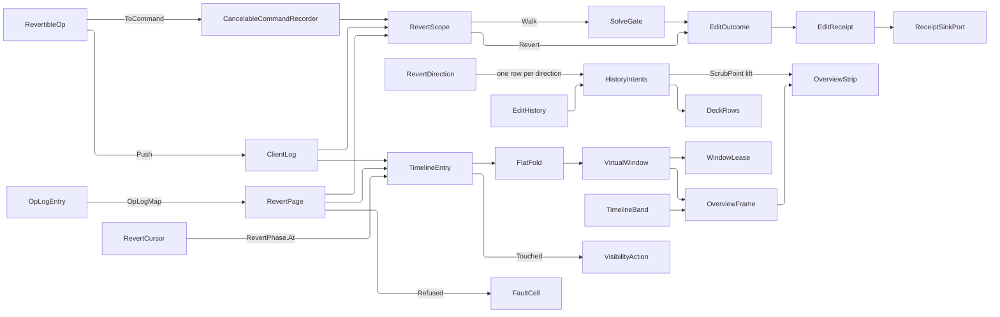

# [APPUI_EDIT_HISTORY]

Client-side undo/redo is one revert algebra over the admitted `CancelableCommandRecorder` window and the durable Persistence `Version/ledger` stream, beside the timeline surface that scrubs it. `RevertDelta` owns the `Set`, `Insert`, `Remove`, `Move`, and `Composite` payloads with their structural inverses; `RevertibleOp` derives `RevertKind` from that payload and carries the target, actor, and `Hlc` stamp every timeline row reads; `ClientLog` is the typed-op roster beside the recorder, so one lane is an INSTANCE of the algebra rather than a second one; `RevertCursor` retains client depth and durable offset together; `RevertDirection` and `RevertArm` carry every difference between the two traversals as delegate columns; one `RevertScope.Revert` applies either direction before advancing its coordinate and one `RevertScope.Walk` folds N of them into one absolute jump. `EditHistory` projects that traversal onto the undo, redo, and scrub command intents under a solve-gate posture, and `TimelineSurface` renders the unified stream through the windowing fabric with its overview-strip decoration lanes. The page owns no parallel stack, direction-named sibling method, direction-specific fetch delegate, duplicate maximum-window knob, or timeline-local virtualizer.

The spine is `bodong.PropertyModels`, the `CommandRow`/`EditReceipt` rails, the Persistence op-log (`OpLogEntry`, `ReplayWindow`, `Hlc`), the `Shell/virtualization` fabric (`VirtualWindow`, `ExtentLedger`, `FlatFold`, `OverviewFrame`), the `Shell/controls` `ControlIntent` vocabulary, Thinktecture.Runtime.Extensions, Riok.Mapperly, DynamicData, and LanguageExt rails.

## [01]-[INDEX]

- [02]-[REVERTIBLE_OP]: The per-kind `RevertDelta` union; the one revert vocabulary across client and durable arms.
- [03]-[REVERT_SCOPE]: The unified inverse algebra spanning the recorder window and the op-log stream; the client roster, the ledger correspondence, and the N-step walk.
- [04]-[EDIT_HISTORY]: The `CancelableCommandRecorder` wrapper; one revert traversal under a solve-gate posture; the undo, redo, and scrub intents.
- [05]-[TIMELINE_SURFACE]: The virtualized timeline over the windowing fabric; phase presentation, decoration lanes, and the two-way highlight link.

## [02]-[REVERTIBLE_OP]

- Owner: `RevertibleOp` the revertible delta op; `RevertDelta` the closed per-kind payload union; `RevertKind` the op-kind key axis the delta case derives, each row carrying the glyph key its timeline row paints; `HistoryFault` the direct generated `[Union]` with one `[FaultCase]` leaf per history failure; `ContentIdentity` and `ActorKey` the two admitted identity axes; `RevertOrdinal` the domain step space; `RevertPayload` the durable half an `OpLogEntry` carries in its bytes.
- Cases: `RevertDelta` = Set | Insert | Remove | Move | Composite — each case carries exactly its own payload and derives its inverse; `RevertKind` = set | insert | remove | move | composite; `HistoryFault` = NothingToUndo | NothingToRedo | ApplyRejected | EntryInert | CursorUnreachable | StoreUnreachable | PayloadUndecodable.
- Entry: `public RevertibleOp Inverse()` — the delta union's per-case inverse lifted onto the op; `public static Fin<RevertibleOp> Admit(string target, string identity, string actor, RevertDelta delta, Hlc at)` — the one boundary admission, accumulating; `public ICancelableCommand ToCommand(string name, Func<RevertibleOp, Fin<Unit>> apply, Func<Error, Unit> refuse)` — projects the typed application fold onto the admitted recorder's Boolean delegate boundary while routing the discarded `Error` to the lane's sink, so the narrow loses a rail and not a cause.
- Auto: every edit records as a `RevertibleOp` whose delta case carries both directions structurally — `Set` swaps before and after, `Insert` inverts to `Remove` at the same position, `Move` swaps endpoints, `Composite` reverses and inverts its children — so an undo applies the derived inverse and a redo re-applies the forward without re-deriving either from a snapshot.
- Auto: the `Composite` case folds a batch edit's child ops into one revertible unit, so a multi-item batch undoes as one transaction AND discloses as one parent row over its children on the timeline.
- Auto: the op projects onto the admitted `ICancelableCommand`, so the `CancelableCommandRecorder` owns the queue, the `CanUndo`/`CanRedo` state, and the `MaxCommand=20` window, and `Recorder.Undo`/`Redo` pop-and-apply through that delegate pair.
- Packages: bodong.PropertyModels, Thinktecture.Runtime.Extensions, LanguageExt.Core, NodaTime, Rasm (kernel `FaultBand`/`[FaultCase]`/`Op`), Rasm.Persistence (project, `Hlc`), BCL inbox
- Growth: a new edit kind is one `RevertDelta` case with its `RevertKind` key row carrying its glyph, with every dispatch site broken loudly at compile time; a new fault is one `[FaultCase]` leaf; zero new surface.
- Boundary: `RevertibleOp` is the one revert vocabulary in the package — a second revertible-op shape, a separate redo stack, and a per-screen undo list are rejected. Both directions derive from the delta case, every durable payload rides `RevertPayload` under the composition-seated `EvidenceOps.Wire` options, and every composite child re-enters full operation admission under the parent's `ContentIdentity`; an undo never re-computes prior state from a snapshot. The op carries `Target`, `Actor`, and `At` because the timeline renders exactly those three beside the kind — the durable arm lifts them off `OpLogEntry.EntityKey`, `OpLogEntry.Actor`, and its own `Hlc` cell through the one `OpLogMap` correspondence, and the client arm stamps the live session actor, so a timeline row is a projection of the op rather than a second record the recorder's command NAME would have to carry.
- Boundary: identity is ADMITTED ONCE. `ContentIdentity` and `ActorKey` are generated value objects refusing a blank at construction, so the four `IsNullOrWhiteSpace` re-guards that stood at two owners are unspellable and the interior never re-validates; `ContentIdentity` addresses the LEDGER ENTITY (`OpLogEntry.EntityKey`), of which a `Collab/sync` `DocumentKey` is one instantiation, so the two carry different domains rather than one spelling twice. `Target` stays raw text because it crosses unchanged into the `Render/viewpoint#VIEWPOINT_CODEC` highlight vocabulary and the picked-id set the linked lane reads.
- Boundary: `RevertKind` owns the glyph key because the kind is the icon's semantic owner; the icon SOURCE rows stay at the `Theme/assets` catalogue, where all five kind keys are rostered through one `History` mint and the case-derived fallback walk ranks the rows WITHIN a rostered key — an unrostered key seals `AssetFault.UnknownKey` at that owner rather than degrading, so minting a sixth kind lands its catalogue row in the same pass and this roster READS the declaration rather than transcribing its text. The label key derives through `LocaleStrings.Key`, the one key derivation every registry-resolved literal crosses.
- Boundary: the package-owned `ICancelableCommand` Boolean delegate is the sole narrowing boundary for the typed application rail, and the narrow ROUTES its discarded `Error` to the lane's fault sink, so the client arm reports the real cause instead of inventing one from the target. Durable replay preserves the exact failure. The `Composite` case makes a batch one revertible unit so partial-batch undo is structurally absent.

```csharp signature
// --- [ERRORS] ---------------------------------------------------------------------------

// Numeric identity derives from the kernel fault band.
[Union(ConversionFromValue = ConversionOperatorsGeneration.None)]
public abstract partial record HistoryFault : Fault {
    private static readonly FaultBand FamilyBand = FaultBand.History;
    private HistoryFault(string detail) { Detail = detail; }

    public string Detail { get; }

    public override string Message => Detail;

    [FaultCase(0)]
    public sealed partial record NothingToUndo(string Detail) : HistoryFault(Detail);
    [FaultCase(1)]
    public sealed partial record NothingToRedo(string Detail) : HistoryFault(Detail);
    [FaultCase(2)]
    public sealed partial record ApplyRejected(string Detail) : HistoryFault(Detail);
    [FaultCase(3)]
    public sealed partial record EntryInert(string Detail) : HistoryFault(Detail);
    [FaultCase(4)]
    public sealed partial record CursorUnreachable(string Detail) : HistoryFault(Detail);

    // The ledger hop is a NETWORK call, so this case alone declares itself re-drivable and the kernel
    // `Redrive.Run` admits exactly it; every sibling inherits `Terminal` without spelling it.
    [FaultCase(5)]
    public sealed partial record StoreUnreachable(string Detail) : HistoryFault(Detail) {
        public override Retriability Retriability => Retriability.Transient;
    }

    [FaultCase(6)]
    public sealed partial record PayloadUndecodable(string Detail) : HistoryFault(Detail);
}

// --- [TYPES] ----------------------------------------------------------------------------

// The ledger entity a lane reverts against, admitted ONCE. Every interior member takes this type, so the
// blank-identity test that used to stand at both `RevertibleOp.Admit` and `RevertScope.Revert` has no site.
[ValueObject<string>]
[ValidationError]
public readonly partial struct ContentIdentity {
    static partial void ValidateFactoryArguments(ref ValidationError? validationError, ref string value) {
        value = value.Trim();
        if (value.Length == 0) { validationError = new ValidationError(string.Join(" | ", new object?[] { "content identity: blank" })); }
    }
}

[ValueObject<string>]
[ValidationError]
public readonly partial struct ActorKey {
    static partial void ValidateFactoryArguments(ref ValidationError? validationError, ref string value) {
        value = value.Trim();
        if (value.Length == 0) { validationError = new ValidationError(string.Join(" | ", new object?[] { "actor: blank" })); }
    }
}

// The DOMAIN step space, distinct from the fabric's row address by declaration (folder RULINGS [02]): a
// disclosed composite contributes one row per child and no child is a revert step of its own, so the two
// agree only while nothing expands. `Jump`, `OrdinalAt`, and `TimelineKey` all speak this one.
[ValueObject<int>]
[ValidationError]
public readonly partial struct RevertOrdinal {
    public static readonly RevertOrdinal Newest = Create(0);

    static partial void ValidateFactoryArguments(ref ValidationError? validationError, ref int value) {
        if (value < 0) { validationError = new ValidationError(string.Join(" | ", new object?[] { $"revert ordinal {value}: negative" })); }
    }
}

// The kind row READS its glyph off the `Theme/assets` declaration rather than transcribing its text, so the
// asset roster is the one authority and a sixth kind lands its catalogue row and its key in one edit.
[SmartEnum<string>]
[KeyMemberEqualityComparer<ComparerAccessors.StringOrdinal, string>]
[KeyMemberComparer<ComparerAccessors.StringOrdinal, string>]
public sealed partial class RevertKind {
    public static readonly RevertKind Set = new("set", AssetDeclaration.HistorySet.Asset);
    public static readonly RevertKind Insert = new("insert", AssetDeclaration.HistoryInsert.Asset);
    public static readonly RevertKind Remove = new("remove", AssetDeclaration.HistoryRemove.Asset);
    public static readonly RevertKind Move = new("move", AssetDeclaration.HistoryMove.Asset);
    public static readonly RevertKind Composite = new("composite", AssetDeclaration.HistoryComposite.Asset);

    // The chip's static caption before its first per-row bind; the per-row value rides `LabelKey` through the
    // row's own value slot, so both halves derive from the one key mint and neither is a call-site literal.
    public static readonly string LabelRoot = LocaleStrings.Key(nameof(RevertKind), "kind");

    public AssetKey Glyph { get; }

    public string LabelKey => LocaleStrings.Key(nameof(RevertKind), Key);
}

// --- [MODELS] ---------------------------------------------------------------------------

// Each delta case carries exactly its payload and its own inverse; kind derives from the case, so the
// kind key and the payload shape can never disagree.
[Union(ConversionFromValue = ConversionOperatorsGeneration.None)]
[JsonPolymorphic(TypeDiscriminatorPropertyName = "kind")]
[JsonDerivedType(typeof(RevertDelta.Set), "set")]
[JsonDerivedType(typeof(RevertDelta.Insert), "insert")]
[JsonDerivedType(typeof(RevertDelta.Remove), "remove")]
[JsonDerivedType(typeof(RevertDelta.Move), "move")]
[JsonDerivedType(typeof(RevertDelta.Composite), "composite")]
public abstract partial record RevertDelta {
    private RevertDelta() { }
    public sealed record Set(JsonElement Before, JsonElement After) : RevertDelta;
    public sealed record Insert(int At, JsonElement Item) : RevertDelta;
    public sealed record Remove(int At, JsonElement Item) : RevertDelta;
    public sealed record Move(int From, int To) : RevertDelta;
    public sealed record Composite(Seq<RevertibleOp> Children) : RevertDelta;

    public RevertKind Kind => Switch(
        set: static _ => RevertKind.Set,
        insert: static _ => RevertKind.Insert,
        remove: static _ => RevertKind.Remove,
        move: static _ => RevertKind.Move,
        composite: static _ => RevertKind.Composite);

    public RevertDelta Inverse() => Switch(
        set: static s => (RevertDelta)new Set(s.After, s.Before),
        insert: static i => new Remove(i.At, i.Item),
        remove: static r => new Insert(r.At, r.Item),
        move: static m => new Move(m.To, m.From),
        composite: static c => new Composite(c.Children.Rev().Map(static child => child.Inverse())));

    // The disclosure children a timeline row expands into. Every non-composite case answers empty, so the
    // flatten walks one total projection rather than a case test at the surface.
    public Seq<RevertibleOp> Children => Switch(
        set: static _ => Seq<RevertibleOp>(),
        insert: static _ => Seq<RevertibleOp>(),
        remove: static _ => Seq<RevertibleOp>(),
        move: static _ => Seq<RevertibleOp>(),
        composite: static c => c.Children);

    // Admission is APPLICATIVE per case: a composite reports every malformed child in one refusal, so a
    // batch of five bad deltas is one report rather than five successive round trips.
    public Validation<Error, RevertDelta> Admit() => Switch(
        set: static delta => Defined(delta, delta.Before, "before").Apply(
            Defined(delta, delta.After, "after"), static (_, _) => (RevertDelta)delta).As(),
        insert: static delta => Positioned(delta, delta.At).Apply(
            Defined(delta, delta.Item, "item"), static (_, _) => (RevertDelta)delta).As(),
        remove: static delta => Positioned(delta, delta.At).Apply(
            Defined(delta, delta.Item, "item"), static (_, _) => (RevertDelta)delta).As(),
        move: static delta => Positioned(delta, delta.From).Apply(
            Positioned(delta, delta.To),
            Distinct(delta),
            static (_, _, _) => (RevertDelta)delta).As(),
        composite: static delta => delta.Children.IsEmpty
            ? Fail<Error, RevertDelta>(new HistoryFault.ApplyRejected("composite/empty"))
            : delta.Children.Traverse(static child => child.Admit()).As().Map(_ => (RevertDelta)delta));

    static Validation<Error, Unit> Defined(RevertDelta delta, JsonElement slot, string column) =>
        slot.ValueKind is not JsonValueKind.Undefined
            ? unit
            : (Error)new HistoryFault.ApplyRejected($"{delta.Kind.Key}/{column}: undefined");

    static Validation<Error, Unit> Positioned(RevertDelta delta, int at) =>
        at >= 0 ? unit : (Error)new HistoryFault.ApplyRejected($"{delta.Kind.Key}/{at}");

    static Validation<Error, Unit> Distinct(Move delta) =>
        delta.From != delta.To ? unit : (Error)new HistoryFault.ApplyRejected($"move/{delta.From}: endpoints equal");
}

// Target, actor, and stamp are COLUMNS rather than a timeline-side lookup: the durable arm lifts all three
// off the ledger entry it already read, so a rendered row never re-queries the stream that produced it and a
// client row is never reduced to the command name the recorder retained.
public sealed record RevertibleOp(
    string Target,
    ContentIdentity ContentIdentity,
    ActorKey Actor,
    RevertDelta Delta,
    Hlc At) {
    static readonly Op Admission = Op.Of(name: "history.admit");

    public RevertKind Kind => Delta.Kind;

    public RevertibleOp Inverse() => this with { Delta = Delta.Inverse() };

    // Boundary admission on the ACCUMULATING carrier: the target, the two identities, the delta, and the
    // composite's identity closure are five INDEPENDENT gates, so a malformed op reports every violated
    // invariant in one refusal instead of the first clause a sequential `&&` ladder happened to test.
    public static Fin<RevertibleOp> Admit(string target, string identity, string actor, RevertDelta delta, Hlc at) =>
        (Named(target),
         Admission.AcceptValidated<ContentIdentity>(identity).ToValidation(),
         Admission.AcceptValidated<ActorKey>(actor).ToValidation(),
         delta.Admit())
        .Apply(static (named, content, author, admitted) => new RevertibleOp(named, content, author, admitted, at))
        .As()
        .Bind(static op => Closed(op).Map(_ => op))
        .ToFin();

    // A composite's children must all address the parent's own content identity, because the parent is what
    // the durable arm keys its ledger window on — a child under a foreign identity would revert a document
    // the walk never windowed.
    static Validation<Error, Unit> Closed(RevertibleOp op) =>
        op.Delta.Children.Filter(child => child.ContentIdentity != op.ContentIdentity) switch {
            { IsEmpty: true } => unit,
            var stray => (Error)new HistoryFault.ApplyRejected(
                $"{op.ContentIdentity.Value}: {stray.Count} composite children diverge"),
        };

    static Validation<Error, string> Named(string target) =>
        string.IsNullOrWhiteSpace(target)
            ? (Error)new HistoryFault.ApplyRejected("target: blank")
            : target.Trim();

    // The element ids this op touched: a composite answers its children's targets, so the highlight raise
    // and the linked-lane probe read one projection and never special-case the batch.
    public Seq<string> Touched =>
        Delta.Children.IsEmpty ? Seq(Target) : Delta.Children.Bind(static child => child.Touched);

    // The package boundary narrows the typed rail onto a Boolean pair, so the `Error` the fold produced has
    // nowhere to go IN the delegate — `refuse` is where it goes instead, and the client arm reports the real
    // cause rather than reconstructing one from the target it still happens to hold.
    public ICancelableCommand ToCommand(string name, Func<RevertibleOp, Fin<Unit>> apply, Func<Error, Unit> refuse) =>
        new GenericCancelableCommand(name,
            executeFunc: () => apply(this).IfFail(refuse).IsSucc,
            cancelFunc: () => apply(Inverse()).IfFail(refuse).IsSucc);
}

// The durable half an `OpLogEntry` carries in its bytes: the element the op touched beside the delta it
// applied. Every other column of the op is a ledger column, so this record is exactly what the entry cannot
// answer and the correspondence below flattens both halves into one generated projection.
public sealed record RevertPayload(string Target, RevertDelta Delta);
```

## [03]-[REVERT_SCOPE]

- Owner: `RevertScope` the unified inverse algebra; `ClientLog` the typed-op roster beside the recorder; `RevertArm` the client-versus-durable axis, each row carrying the cursor coordinate it deepens and the fetch-and-apply fold that half runs; `RevertDirection` the undo-versus-redo axis, each row carrying the deck verb, recorder verb, ledger offset, roster reach, ledger projection, cursor advance, absent fault, and sealed outcome; `RevertCursor` the combined client-depth and durable-offset value; `RevertWalk` the N-step traversal receipt; `RevertRow` the admitted ledger row and `RevertPage` the window's own two-column answer; `OpLogMap` the one `OpLogEntry` correspondence.
- Cases: `RevertArm` = client | durable under the locked kind literals — the client `CancelableCommandRecorder` window and the durable Persistence `Version/ledger` `OpLogEntry` stream; `RevertDirection` = undo | redo.
- Law: a revert LANE is an INSTANCE of this algebra, never a second one — one `RevertScope` per lane, each carrying its own recorder, its own `ClientLog`, its own ledger port, and its own cursor custody; a lane whose history is session-scoped binds a durable port that answers empty by construction, so a turn past its client window seals `NothingToUndo` at the arm boundary rather than reaching the document ledger.
- Entry: `public IO<Fin<(RevertibleOp Op, RevertCursor Next)>> Revert(RevertDirection direction, RevertCursor cursor, ContentIdentity identity)` — the ONE traversal both directions take: `RevertDirection.Arm` derives the owning half from the cursor, the client arm drives `CancelableCommandRecorder.Undo`/`Redo` while the cursor sits inside the `MaxCommand=20` window, and the durable arm reads the ledger's one bounded case through `ReplayWindow` whole. `public IO<RevertWalk> Walk(RevertDirection direction, RevertCursor cursor, ContentIdentity identity, Dimension steps)` — the absolute jump as N folded single steps sharing one law. `public IO<RevertPage> Window(ContentIdentity identity, long afterSequence, int take)` — the one bounded ledger read both the reverting arm and the timeline pane consume. Both traversals stay `IO`-deferred, so the effect terminates only at the screen's composition edge.
- Auto: a turn inside the client window drives the recorder, which pops the head `ICancelableCommand` and runs its `Cancel` or forward delegate so the delta applies through the admitted recorder rather than a hand-rolled re-application, and the popped op resolves through `ClientLog.Head` for the receipt.
- Auto: a turn past the client window reads the durable window keyed by `ContentIdentity`, projects the entry through `RevertDirection.Project` — undo inverts, redo takes the forward op — and applies it through the SAME `Apply` delta fold the client commands were minted with, so both arms mutate through one application law, inversion has exactly one owner in `RevertDelta.Inverse`, and the fetched op APPLIES before the cursor advances.
- Auto: every success carries `Next` — the arm's own deepening or one `Shallower` walk — so repeated undo addresses strictly deeper positions, repeated redo strictly shallower ones, and the client-to-durable transition is recoverable from the returned cursor alone.
- Auto: the two arms speak one `RevertibleOp` vocabulary, so a client-window op projects onto the one `Collab/sync#EDIT_INTENT` `EditIntent` union and lands as Persistence-owned `OpLogEntry`/`SyncOpKind` rows through the `Version/ledger` changefeed.
- Auto: the durable-arm write leg is the `Collab/compare#TIME_TRAVEL` route — that owner decodes the merge authority's own `DiffBatch` through its composition-bound `Inverse` column into `EditIntent` rows and folds each through `IntentLedger.Commit`, and this arm's inverse rides that same ingress, so revert commits and live edits share one ledger seam.
- Auto: the commit-DAG inverse is a different altitude with a different owner — Persistence `Version/commits#COMMIT_DAG` mints it append-only through `CommitGraph.Rewrite` over `HistoryRewrite.Revert` — so neither plane re-derives the other's inversion and `RevertDelta.Inverse` remains the one inversion this package owns.
- Packages: bodong.PropertyModels, Thinktecture.Runtime.Extensions, Riok.Mapperly, LanguageExt.Core, NodaTime, System.Reactive, Rasm (kernel `Cell`/`Transition`/`Dimension`/`Redrive`), Rasm.Persistence (project)
- Growth: a new revert source is structurally fixed at two arms; a new directional difference is one column on `RevertDirection`; a new lane is one `RevertScope` construction; zero new surface.
- Boundary: the revert scope is the one inverse algebra spanning two arms; the admitted `CancelableCommandRecorder` owns the client window and `Recorder.MaxCommand` is the only window bound. The durable half crosses as the frozen `ReplayWindow` WHOLE — origin, entity, model, family, `AfterSequence`, and `Take` — because a two-argument fetch delegate dropped `AfterSequence` and made a deep scrub structurally unable to page past its first window; the port is `Func<ReplayWindow, IO<Seq<OpLogEntry>>>`, so the take-and-offset arithmetic is a value the caller dials rather than an arity the seam re-derives.
- Boundary: `OpLogMap` is the FIRST owner of the `OpLogEntry` correspondence the arm and the timeline both depended on. It was erased into a fetch delegate that answered ops already mapped, so every composer hand-transcribed the entity key, the actor, and the HLC cell; one generated `[Mapper]` now flattens the entry's structural half beside the decoded payload half, `RequiredMappingStrategy.Target` keeps the target-side diagnostic, and the conversion set withdraws `ExplicitCast` because LanguageExt carriers cross this seam and its throwing explicit conversions would otherwise be preferred over the registered value-object mints.
- Boundary: a window keeps BOTH halves. `RevertPage` carries the admitted ops beside the entries that refused, because a ledger holding one undecodable row must still serve every row around it — a `Fin` over the whole page would blank the history a reader can see for one entry it cannot. The refusals ride the stream to the lane's kernel `FaultCell` as counted evidence.
- Boundary: `ClientLog` is the ONE client-side typed-op roster and a sealed CLASS, never a record — it holds a live `Atom` and folder RULINGS `[02]` rules that a record copy shares such a cell by reference, so `with`-copying a lane would have yielded two lanes over one roster. `Push` ANSWERS what it retired: the settled roster rides a kernel `Transition`, so the caller seats its cursor and its receipt off one snapshot rather than re-reading a cell a concurrent push may already have moved, and the truncation a push performs is observable instead of discarded. A push TRUNCATES the redo tail because the recorder clears its own redo queue on push, so a retained tail would name steps the queue no longer holds.
- Boundary: `RevertCursor` retains the actual client depth while traversing durable history, so returning from durable offset one resumes the real recorder depth instead of inventing `MaxCommand`; both coordinates are kernel `Dimension` values, so the negative-cursor guard that stood at the traversal head is unrepresentable. The durable read indexes through `Seq.Skip(offset).Head`, the `Option`-returning positional read the carrier publishes.
- Boundary: `Walk` is TOTAL rather than `Fin` because a halted walk that already applied three of five steps is real mutation the cursor must reflect — a failure carrier discarding the applied prefix would leave the surface's cursor addressing a state the document had left. Its step count is a `Dimension`, so the clamp the fold used to spell has no site. `ContentIdentity` aligns client and durable operations across the seam, while a host-mutating revert routes through the abstract `DocumentTransaction` port so host and client undo remain one transaction.

```csharp signature
// --- [TYPES] ----------------------------------------------------------------------------

// The arm OWNS its half of the traversal: each row carries the coordinate it deepens and the whole
// fetch-and-apply fold that half runs.
[SmartEnum<string>]
[KeyMemberEqualityComparer<ComparerAccessors.StringOrdinal, string>]
[KeyMemberComparer<ComparerAccessors.StringOrdinal, string>]
public sealed partial class RevertArm {
    public static readonly RevertArm Client = new("client",
        static cursor => cursor with { ClientDepth = Dimension.Create(cursor.ClientDepth.Value + 1) },
        static (scope, direction, cursor, identity) => IO.lift(() => scope.Log.Head(direction, cursor).Match(
            Some: op => direction.Drive(scope.Recorder)
                ? Fin.Succ((op, direction.After(Client, cursor)))
                : Fin.Fail<(RevertibleOp, RevertCursor)>(new HistoryFault.ApplyRejected(op.Target)),
            None: () => Fin.Fail<(RevertibleOp, RevertCursor)>(direction.Absent(identity)))));

    // The durable arm reads the SAME bounded ledger window the timeline renders, projects the entry through
    // the direction's own inversion, and applies before the cursor advances — a fetch-only durable success
    // is the deleted form.
    public static readonly RevertArm Durable = new("durable",
        static cursor => cursor with { DurableOffset = Dimension.Create(cursor.DurableOffset.Value + 1) },
        static (scope, direction, cursor, identity) => direction.Offset(cursor) switch {
            var offset => scope.Window(identity, RevertScope.FromHead, offset + 1).Map(page => page.Ops.Skip(offset).Head.Match(
                Some: entry => direction.Project(entry) switch {
                    var projected => scope.Apply(projected).Map(_ => (projected, direction.After(Durable, cursor))),
                },
                None: () => Fin.Fail<(RevertibleOp, RevertCursor)>(direction.Absent(identity)))),
        });

    [UseDelegateFromConstructor]
    public partial RevertCursor Deeper(RevertCursor cursor);

    [UseDelegateFromConstructor]
    public partial IO<Fin<(RevertibleOp Op, RevertCursor Next)>> Turn(RevertScope scope, RevertDirection direction, RevertCursor cursor, ContentIdentity identity);
}

// Undo walks DEEPER and inverts what the ledger holds; redo walks back SHALLOWER and re-applies the forward
// op it left. Every difference between the two traversals is a column here, so one entry serves both and a
// direction-named sibling method is the deleted form. `Verb` is the deck key the row DECLARES — the two
// consts that used to hold it were unread while the projection interpolated a third spelling.
[SmartEnum<string>]
[KeyMemberEqualityComparer<ComparerAccessors.StringOrdinal, string>]
[KeyMemberComparer<ComparerAccessors.StringOrdinal, string>]
public sealed partial class RevertDirection {
    public static readonly RevertDirection Undo = new("undo", "history.undo",
        static recorder => recorder.CanUndo,
        static recorder => recorder.Undo(),
        static cursor => cursor.DurableOffset.Value,
        static cursor => cursor.ClientDepth.Value,
        static op => op.Inverse(),
        static (arm, cursor) => arm.Deeper(cursor),
        static identity => new HistoryFault.NothingToUndo(identity.Value),
        static kind => new EditOutcome.Reverted(kind));
    public static readonly RevertDirection Redo = new("redo", "history.redo",
        static recorder => recorder.CanRedo,
        static recorder => recorder.Redo(),
        static cursor => cursor.DurableOffset.Value - 1,
        static cursor => cursor.ClientDepth.Value - 1,
        static op => op,
        static (_, cursor) => cursor.Shallower(),
        static identity => new HistoryFault.NothingToRedo(identity.Value),
        static kind => new EditOutcome.Redone(kind));

    // The direction and the distance of an absolute jump are ONE resolution off two ordinals, so the `>=`
    // law lives on the axis it decides instead of being spelled twice inside a single jump expression.
    public static (RevertDirection Direction, Dimension Steps) Toward(RevertOrdinal from, RevertOrdinal to) =>
        (to.Value >= from.Value ? Undo : Redo, Dimension.Create(int.Abs(to.Value - from.Value)));

    public string Verb { get; }

    // The arm DERIVES: the durable half owns the turn whenever the step addresses a durable position the
    // client window cannot serve. Inversion lives at `RevertDelta.Inverse` alone — the ledger hands forward
    // ops and `Project` inverts them, so no seam holds a second inversion law.
    public RevertArm Arm(RevertCursor cursor, CancelableCommandRecorder recorder) =>
        Offset(cursor) >= 0 && !(cursor.InClientWindow(recorder.MaxCommand) && Ready(recorder))
            ? RevertArm.Durable
            : RevertArm.Client;

    [UseDelegateFromConstructor] public partial bool Ready(CancelableCommandRecorder recorder);
    [UseDelegateFromConstructor] public partial bool Drive(CancelableCommandRecorder recorder);
    [UseDelegateFromConstructor] public partial int Offset(RevertCursor cursor);
    // How far back into the client roster this direction's head sits: undo addresses the op one step deeper
    // than the live depth, redo the op the previous undo left one step shallower. One roster, two reaches.
    [UseDelegateFromConstructor] public partial int Reach(RevertCursor cursor);
    [UseDelegateFromConstructor] public partial RevertibleOp Project(RevertibleOp op);
    [UseDelegateFromConstructor] public partial RevertCursor After(RevertArm arm, RevertCursor cursor);
    [UseDelegateFromConstructor] public partial HistoryFault Absent(ContentIdentity identity);
    [UseDelegateFromConstructor] public partial EditOutcome Outcome(string kind);
}

// --- [MODELS] ---------------------------------------------------------------------------

// Both coordinates are non-negative counts by construction, so the guard head that re-tested them at the
// traversal entry has no site left to stand at.
public readonly record struct RevertCursor(Dimension ClientDepth, Dimension DurableOffset) {
    public static readonly RevertCursor Start = new(Dimension.Create(0), Dimension.Create(0));

    public bool InClientWindow(int maxCommand) => DurableOffset.Value == 0 && ClientDepth.Value < maxCommand;

    // The unified ordinal the timeline addresses: one axis over both halves, so an absolute jump computes a
    // step count by subtraction rather than by branching on which arm currently owns the position.
    public RevertOrdinal Position => RevertOrdinal.Create(ClientDepth.Value + DurableOffset.Value);

    // Deepening is the ARM's move — each arm owns the coordinate it advances — while shallowing is one walk
    // back through whichever coordinate is live, so the durable-to-client return resumes the real recorder
    // depth instead of inventing `MaxCommand`.
    public RevertCursor Shallower() => DurableOffset.Value > 0
        ? this with { DurableOffset = Dimension.Create(DurableOffset.Value - 1) }
        : this with { ClientDepth = Dimension.Create(int.Max(0, ClientDepth.Value - 1)) };
}

// A walk is TOTAL: the applied prefix and the reached cursor stand whether or not the traversal halted, so a
// three-of-five jump leaves the surface addressing the state the document holds. A `Fin` carrier
// here discards exactly the ops the document already applied.
public readonly record struct RevertWalk(Seq<RevertibleOp> Ops, RevertCursor Next, Option<Error> Halt);

// The admitted ledger row: the entry's structural half beside the payload half decoded off its bytes, as ONE
// value, so the correspondence below is one generated method rather than a hand join over two sources.
public readonly record struct RevertRow(OpLogEntry Entry, RevertPayload Payload) {
    static readonly Op Decode = Op.Of(name: "history.decode");

    // Multi-column admission on the ACCUMULATING carrier: an undecodable payload, a blank entity key, and a
    // blank actor are three independent defects one ledger row can carry at once.
    public static Fin<RevertRow> Of(OpLogEntry entry) =>
        (Decoded(entry),
         Decode.AcceptValidated<ContentIdentity>(entry.EntityKey).ToValidation(),
         Decode.AcceptValidated<ActorKey>(entry.Actor).ToValidation())
        .Apply(static (payload, _, _) => payload)
        .As()
        .Map(payload => new RevertRow(entry, payload))
        .ToFin();

    // The ledger's bytes are foreign material, so the payload admits HERE and the interior sees only
    // admitted ops; the crossing rides the composition-seated `EvidenceOps.Wire` options, so the converter
    // factories and the Option-omission modifier the package registered reach this decode too.
    static Validation<Error, RevertPayload> Decoded(OpLogEntry entry) =>
        Decode.Catch(() => Fin.Succ(Optional(
                JsonSerializer.Deserialize<RevertPayload>(entry.Payload.Span, EvidenceOps.Wire))))
            .Bind(payload => payload.ToFin(
                new HistoryFault.PayloadUndecodable($"{entry.EntityKey}@{entry.Sequence}")))
            .ToValidation();
}

// The window's two-column answer.
public readonly record struct RevertPage(Seq<RevertibleOp> Ops, Seq<Error> Refused) {
    public static readonly RevertPage Empty = new(Seq<RevertibleOp>(), Seq<Error>());

    public static RevertPage Of(Error cause) => new(Seq<RevertibleOp>(), Seq(cause));
}

// --- [OPERATIONS] -----------------------------------------------------------------------

// The typed-op roster beside the recorder it mirrors. The recorder owns the queue, its window, and the
// delegate pair it pops; this holds the `RevertibleOp` each queued command was minted from. A sealed CLASS
// because it holds a live cell — a `with`-copy would have handed two lanes one roster.
public sealed class ClientLog {
    private ClientLog(Atom<Seq<RevertibleOp>> ops) => Ops = ops;

    public static ClientLog Of() => new(Atom(Seq<RevertibleOp>()));

    internal Atom<Seq<RevertibleOp>> Ops { get; }

    public Seq<RevertibleOp> Live(RevertCursor cursor) => Retained(Ops.Value, cursor);

    // The push ANSWERS the roster it settled on, so the caller reads the truncation it performed instead of
    // discarding the verdict and re-reading a cell a concurrent push may already have moved.
    public Transition<Seq<RevertibleOp>> Push(RevertibleOp op, RevertCursor cursor) =>
        Cell.Commit(Ops, held => Retained(held, cursor).Add(op));

    // ONE head read for both directions: the reach column places the index and the `Option` answers absence,
    // so a direction-named roster read and a throwing positional index are both unspellable here.
    public Option<RevertibleOp> Head(RevertDirection direction, RevertCursor cursor) =>
        Head(Ops.Value, direction, cursor);

    public static Option<RevertibleOp> Head(Seq<RevertibleOp> ops, RevertDirection direction, RevertCursor cursor) =>
        direction.Reach(cursor) is int back && back >= 0 && back < ops.Count
            ? ops.Skip(ops.Count - 1 - back).Head
            : None;

    // The roster's own change stream, seeded with the live snapshot so a late timeline subscription renders
    // the history already recorded instead of waiting for the next edit to reveal it.
    public IObservable<Seq<RevertibleOp>> Changes =>
        Observable.FromEvent<AtomChangedEvent<Seq<RevertibleOp>>, Seq<RevertibleOp>>(
            handler => value => handler(value),
            handler => Ops.Change += handler,
            handler => Ops.Change -= handler)
            .StartWith(Ops.Value);

    // The retained prefix a cursor names: everything the cursor has not undone. Both the live read and the
    // truncating push take this one projection, so a push and a render can never disagree about the tail.
    static Seq<RevertibleOp> Retained(Seq<RevertibleOp> ops, RevertCursor cursor) =>
        ops.Take(int.Max(0, ops.Count - cursor.ClientDepth.Value));
}

// One scope per revert LANE. The roster is a VALUE rather than a head delegate because the head a direction
// addresses is derivable from the cursor the arm already holds — a delegate column would let a lane bind a
// head answering from a roster its own pushes never reached.
public sealed record RevertScope(
    CancelableCommandRecorder Recorder,
    ClientLog Log,
    Func<ReplayWindow, IO<Seq<OpLogEntry>>> Ledger,
    Func<RevertibleOp, Fin<Unit>> Apply) {
    // A window opened at the feed head: the `Take` bounds it, so the offset arithmetic is the caller's dial
    // rather than a second window shape.
    public const long FromHead = 0L;

    // A session lane binds this port: the durable half answers empty by construction, so a turn past the
    // client window seals the direction's absent fault instead of walking into the document's ledger.
    public static readonly Func<ReplayWindow, IO<Seq<OpLogEntry>>> SessionLedger =
        static _ => IO.pure(Seq<OpLogEntry>());

    // The frozen seam crosses WHOLE. `AfterSequence` is what lets a deep scrub page rather than re-reading
    // the same head window, and it had no spelling at all while the read was a two-argument delegate.
    public IO<RevertPage> Window(ContentIdentity identity, long afterSequence, int take) =>
        Ledger(ReplayWindow.ForEntity(identity.Value, afterSequence, take)).Map(Admitted);

    // ONE traversal carries both directions: the direction row supplies the deck verb, the recorder verb,
    // the ledger offset, the roster reach, the projection, the cursor advance, and the absent fault, and the
    // arm it derives owns the fetch-and-apply fold. The IO terminates at the caller's edge.
    public IO<Fin<(RevertibleOp Op, RevertCursor Next)>> Revert(RevertDirection direction, RevertCursor cursor, ContentIdentity identity) =>
        direction.Arm(cursor, Recorder).Turn(this, direction, cursor, identity);

    // The absolute jump is N single steps under ONE law — the same `Revert` a chord takes — so a scrub and a
    // keystroke can never diverge in what they apply. The fold stops at the first halt and KEEPS everything
    // applied before it, and it never inverts the halt into an IO failure, which is what lets a solve gate
    // resume unconditionally around it.
    public IO<RevertWalk> Walk(RevertDirection direction, RevertCursor cursor, ContentIdentity identity, Dimension steps) =>
        toSeq(System.Linq.Enumerable.Range(0, steps.Value)).Fold(
            IO.pure(new RevertWalk(Seq<RevertibleOp>(), cursor, None)),
            (running, _) => running.Bind(walk => walk.Halt.IsSome
                ? IO.pure(walk)
                : Revert(direction, walk.Next, identity).Map(outcome => outcome.Match(
                    Succ: step => walk with { Ops = walk.Ops.Add(step.Op), Next = step.Next },
                    Fail: error => walk with { Halt = Some(error) }))));

    // `PartitionFallible` splits the admitted ops from the refused entries in ONE traversal, so a page keeps
    // both halves and a single bad row never blanks the history around it.
    static RevertPage Admitted(Seq<OpLogEntry> entries) =>
        entries.Map(static entry => RevertRow.Of(entry).Map(OpLogMap.ToOp)).PartitionFallible() switch {
            var split => new RevertPage(split.Succs, split.Fails),
        };
}

// --- [COMPOSITION] ----------------------------------------------------------------------

// The page's ONE seam mapper. The entry's structural columns and the decoded payload flatten through the
// segment overload, the two identity value objects mint through per-TYPE non-generic user mappings, and
// `ExplicitCast` is withdrawn because LanguageExt and Thinktecture carriers cross here and their throwing
// explicit conversions would otherwise be preferred over these mints.
[Mapper(
    RequiredMappingStrategy = RequiredMappingStrategy.Target,
    EnabledConversions = MappingConversionType.All & ~MappingConversionType.ExplicitCast)]
public static partial class OpLogMap {
    [MapProperty([nameof(RevertRow.Payload), nameof(RevertPayload.Target)], [nameof(RevertibleOp.Target)])]
    [MapProperty([nameof(RevertRow.Payload), nameof(RevertPayload.Delta)], [nameof(RevertibleOp.Delta)])]
    [MapProperty([nameof(RevertRow.Entry), nameof(OpLogEntry.EntityKey)], [nameof(RevertibleOp.ContentIdentity)])]
    [MapProperty([nameof(RevertRow.Entry), nameof(OpLogEntry.Actor)], [nameof(RevertibleOp.Actor)])]
    [MapProperty([nameof(RevertRow.Entry), nameof(OpLogEntry.Stamp)], [nameof(RevertibleOp.At)])]
    public static partial RevertibleOp ToOp(RevertRow row);

    // Both strings admitted at `RevertRow.Of` before the row existed, so these mints are total on every value
    // that reaches them; a generic `TVo Map<TVo>(string)` is refused by the generator (RMG001) and would erase
    // exactly the per-type refusal the admission above paid for.
    [UserMapping] private static ContentIdentity Identity(string raw) => ContentIdentity.Create(raw);
    [UserMapping] private static ActorKey Author(string raw) => ActorKey.Create(raw);
}
```

## [04]-[EDIT_HISTORY]

- Owner: `EditHistory` the `CancelableCommandRecorder` wrapper carrying its lane's scope, solve gate, surface key, actor, and kernel fault cell; `SolvePosture` the live-versus-gated regeneration axis; `SolveGate` the suspend/resume pair a scrub sequence batches through; `HistoryIntents` the undo/redo/scrub command-table projection; `ScrubPoint` the content-space point codec.
- Cases: `SolvePosture` = live | gated, each row carrying the fold its half wraps a walk in.
- Law: a control that publishes a typed gesture VALUE binds a surface-owned LIFTING arrow, never a deck row's materialized command; the lift mints `CommandPayload.Fields` through `ScrubPoint` and runs the deck row, so the verb stays a deck row while the payload union stays closed at its five cases.
- Entry: `Record(RevertibleOp op, RevertCursor cursor, IClock clock, CorrelationId correlation)` admits nothing further — the op admitted at its own boundary — enqueues one `ICancelableCommand`, pushes its typed op, and returns `IO<(EditReceipt Receipt, RevertCursor Next)>` off the push's own settled roster; `Revert(RevertDirection direction, ContentIdentity identity, RevertCursor cursor, IClock clock, CorrelationId correlation)` resolves through `RevertScope`, seals the direction row's own `EditOutcome` case, and returns the advanced `RevertCursor`; `Jump(RevertOrdinal target, ContentIdentity identity, RevertCursor cursor, IClock clock, CorrelationId correlation)` folds the whole distance through `RevertScope.Walk` inside the solve gate and seals one receipt for the sequence; `Ready(RevertDirection direction)` is the ONE availability stream; `HistoryIntents.Rows(EditHistory history, Func<RevertDirection, CancellationToken, IO<Unit>> turn, Func<RevertOrdinal, CancellationToken, IO<Unit>> jump, Func<double, Fin<RevertOrdinal>> ordinalOf)` projects the direction table and the scrub row into the deck's history verbs; `HistoryIntents.Scrub(CommandDeck deck)` mints the point-lifting arrow the strip binds.
- Auto: every edit records through the admitted `CancelableCommandRecorder`, whose `MaxCommand`, `CanUndo`, `CanRedo`, lifecycle events, and queue snapshots remain authoritative, and the same call pushes the typed op onto the lane's `ClientLog` so the timeline projects real ops.
- Auto: the `history.undo` and `history.redo` command rows DERIVE from `HistoryIntents.Rows` — one per `RevertDirection`, keyed off that row's own declared `Verb` and gated on its own `Ready` column against the live recorder — and the recorder's four lifecycle events drive the availability edge those rows re-evaluate on.
- Auto: the `history.scrub` row is the surface-scoped absolute-jump verb, so a chord, a palette hit, and a strip drag reach one row; a gated walk suspends regeneration once, applies every step, and resumes once, so scrubbing thirty entries costs one re-solve rather than thirty; the direction row seals its distinct outcome through the one `EditReceipt` family, and the recorder clears at screen teardown.
- Receipt: `EditReceipt` under `ReceiptKind.Edit` with `EditOutcome.Reverted` for undo and `EditOutcome.Redone` for redo, one per traversal whatever its step count; a walk that applied nothing seals `EditOutcome.Rejected` while a partial walk seals its direction's outcome and parks the halt on the lane's kernel `FaultCell`, because a walk that moved the document is not a refusal; `TelemetryRow` contributes the revert, redo, and scrub instrument rows through the AppHost `TelemetryContributorPort`.
- Packages: bodong.PropertyModels, ReactiveUI, System.Reactive, Thinktecture.Runtime.Extensions, LanguageExt.Core, Avalonia, NodaTime, Rasm (kernel `FaultCell`/`HookId`/`InstrumentSpec`)
- Growth: a new history verb is one `CommandRow` row; a new regeneration posture is one `SolvePosture` row with its wrap fold; one history instrument is one `InstrumentSpec` row on `EditHistory`; zero new surface — an undo package is deleted by the admitted recorder.
- Boundary: client undo/redo binds the admitted `CancelableCommandRecorder` and nothing beside it; a per-screen stack, history-local command registry, generic history receipt, and duplicate deep-history store are rejected. `CommandHistoryViewModel` is GONE from this owner — it published `UndoCommand`/`RedoCommand`/`ClearCommand`, a second undo/redo verb surface inside the very record whose boundary rejects a history-local registry, and its `CanUndo`/`CanRedo` were a second answer to the question `RevertDirection.Ready` already owns; the availability stream now derives from the recorder's own `OnNewCommandAdded`, `OnCommandRedo`, `OnCommandCanceled`, and `OnCommandCleared` events, so the intent row's gate and the rendered button read one column off one queue.
- Boundary: `SolveGate` holds `Func<IO<Unit>>` factories rather than effects so both halves are deferred and the gate composes at the caller's edge, and the gated posture composes the LanguageExt three-arm `IO.Bracket` so resume runs on the success and the failure arm alike — resume was previously unconditional only by the argument that `Walk` is total, an argument a later `Fin`-returning `Walk` would have broken silently while stranding a suspended solver.
- Boundary: the halt PARKS on the lane's kernel `FaultCell` before the receipt projects, so the seal is a pure read of the walk; a side effect smuggled into a pattern subject and discarded by a wildcard arm is the deleted form, and the bounded cell reports a refusal storm as a shed count rather than as process memory.
- Boundary: `ScrubPoint` lowers the strip's content-space point onto the existing `CommandPayload.Fields` case rather than widening the closed payload union with a geometry case that would drag Avalonia's coordinate types across the command wire; the Y component alone addresses the timeline because `OverviewAxis.Vertical` tracks one `DragAxis`, and the axis row HOLDS the untracked component at its prior value, so this reader spells no discard of its own. The content-space offset resolves to a revert ordinal through the fabric's own `ExtentLedger.Window` and `KeyAt`, so the strip, the scrollbar, and the jump address one position model.
- Boundary: the row projection declares each verb as a `Shell/commands` `FamilyRow` and takes its `Mint` rather than constructing `CommandRow` positionally — eight of ten arguments were the same default at both sites, so a column added to the row shape broke this page twice for a fact it never varied, and the shape row now decides the admitted payload domain that two hand-written accepts arrays used to spell.

```csharp signature
// --- [TYPES] ----------------------------------------------------------------------------

// The regeneration axis as rows: single-step undo re-solves per step because that IS the operation, while a
// scrub folds its whole distance inside one suspend/resume. A caller branch spelling the same choice at two
// call sites is what let a thirty-entry scrub issue thirty solves.
[SmartEnum<string>]
[KeyMemberEqualityComparer<ComparerAccessors.StringOrdinal, string>]
[KeyMemberComparer<ComparerAccessors.StringOrdinal, string>]
public sealed partial class SolvePosture {
    public static readonly SolvePosture Live = new("live", static (_, walk) => walk);

    // The BRACKET, not a hand pair: release rides the rail, so resume is unconditional by construction
    // rather than by a totality argument about the body it wraps.
    public static readonly SolvePosture Gated = new("gated", static (gate, walk) =>
        gate.Suspend().Bracket(Use: _ => walk, Fin: _ => gate.Resume()));

    [UseDelegateFromConstructor]
    public partial IO<RevertWalk> Around(SolveGate gate, IO<RevertWalk> walk);
}

// --- [MODELS] ---------------------------------------------------------------------------

// Deferred factories, not effects: an eager suspend would fire at composition and leave the solver parked
// for the surface's lifetime. The posture rides the gate so a caller batches by handing the walk over,
// never by remembering to bracket it.
public sealed record SolveGate(Func<IO<Unit>> Suspend, Func<IO<Unit>> Resume, SolvePosture Posture) {
    public static readonly SolveGate Open = new(static () => IO.pure(unit), static () => IO.pure(unit), SolvePosture.Live);

    public IO<RevertWalk> Batch(IO<RevertWalk> walk) => Posture.Around(this, walk);
}

// --- [OPERATIONS] -----------------------------------------------------------------------

// The content-space point codec. `Fields` is the erased keyed case the command rail already carries, so the
// point crosses the one payload union rather than widening it — and the SAME codec reads it back, so the
// mint and the read can never disagree about the two field keys.
public static class ScrubPoint {
    public const string XField = "x";
    public const string YField = "y";

    public static CommandPayload Of(Point at) =>
        new CommandPayload.Fields(HashMap<string, JsonElement>.Empty
            .Add(XField, JsonSerializer.SerializeToElement(at.X))
            .Add(YField, JsonSerializer.SerializeToElement(at.Y)));

    public static Fin<Point> Read(CommandPayload payload) =>
        payload is CommandPayload.Fields fields
        && fields.Values.Find(XField) is { IsSome: true, Case: JsonElement x }
        && fields.Values.Find(YField) is { IsSome: true, Case: JsonElement y }
        && x.TryGetDouble(out double px) && y.TryGetDouble(out double py)
            ? Fin.Succ(new Point(px, py))
            : Fin<Point>.Fail(new HistoryFault.ApplyRejected($"{payload.Kind}: content-space point absent"));
}

// The lane's own history owner: its recorder, its roster (through the scope), its gate, its actor, and its
// bounded fault cell. `Actor` is a column because a client op has no ledger entry to read one off, and a
// timeline that renders an empty author for every local edit is exactly the surface the durable half makes
// honest.
public sealed record EditHistory(
    CancelableCommandRecorder Recorder,
    RevertScope Scope,
    SolveGate Gate,
    FaultCell Faults,
    SurfaceKey Surface,
    ActorKey Actor) {
    public static readonly HookId Point = HookId.Create("rasm.appui.editing.history");

    public const string ScrubVerb = "history.scrub";

    // One enqueue, one push: the recorder takes the delegate pair it drives and the roster takes the op the
    // timeline renders, so the two can never describe different edits. The cursor the caller gets back is
    // the push's OWN settled position — a fresh op invalidates every redo position the previous traversal
    // left behind, and reading that from the transition rather than re-reading the cell means a concurrent
    // push cannot slip between the write and the answer.
    public IO<(EditReceipt Receipt, RevertCursor Next)> Record(
        RevertibleOp op, RevertCursor cursor, IClock clock, CorrelationId correlation) =>
        IO.lift(() => {
            Recorder.PushCommand(op.ToCommand(op.Kind.Key, Scope.Apply, Park));
            return Scope.Log.Push(op, cursor);
        })
        .Map(settled => (
            Sealed(op.Target, op.Kind.Key, new EditOutcome.Committed(op.Kind.Key), clock, correlation),
            settled is Transition<Seq<RevertibleOp>>.Committed ? RevertCursor.Start : cursor));

    // One projection serves both directions: the direction row seals its own outcome case, so the receipt
    // is a row value rather than a second place the undo/redo split is spelled.
    public IO<(EditReceipt Receipt, RevertCursor Next)> Revert(
        RevertDirection direction, ContentIdentity identity, RevertCursor cursor, IClock clock, CorrelationId correlation) =>
        Scope.Revert(direction, cursor, identity).Map(outcome => outcome.Match(
            Succ: advanced => (
                Sealed(advanced.Op.Target, advanced.Op.Kind.Key, direction.Outcome(advanced.Op.Kind.Key), clock, correlation),
                advanced.Next),
            Fail: error => (
                Sealed(identity.Value, string.Empty,
                    new EditOutcome.Rejected(error), clock, correlation),
                cursor)));

    // The absolute jump: `RevertDirection.Toward` fixes both the direction and the distance from the two
    // ordinals, so the whole scrub is one gated walk and a per-step regeneration is unreachable from here.
    // Ordinal zero is the newest op, which is the order the timeline renders and the roster holds.
    public IO<(EditReceipt Receipt, RevertCursor Next)> Jump(
        RevertOrdinal target, ContentIdentity identity, RevertCursor cursor, IClock clock, CorrelationId correlation) =>
        RevertDirection.Toward(cursor.Position, target) switch {
            var move => Gate.Batch(Scope.Walk(move.Direction, cursor, identity, move.Steps))
                .Bind(Parked)
                .Map(walk => Sealed(walk, move.Direction, identity, cursor, clock, correlation)),
        };

    // ONE availability oracle. `RevertDirection.Ready` reads the live recorder and the recorder's own four
    // lifecycle events are its change edge, so a per-direction view-model property publishing a second
    // answer has no seat and a stale button is unrepresentable.
    public IObservable<bool> Ready(RevertDirection direction) =>
        Turned.Select(_ => direction.Ready(Recorder)).StartWith(direction.Ready(Recorder)).DistinctUntilChanged();

    // Enqueue, redo, cancel, and clear are the WHOLE set of moves that change what the queue can serve, so
    // one merged edge serves every reader and a per-event subscription at each of them is the deleted form.
    private IObservable<Unit> Turned =>
        Observable.Merge(
            Edge(handler => Recorder.OnNewCommandAdded += handler, handler => Recorder.OnNewCommandAdded -= handler),
            Edge(handler => Recorder.OnCommandRedo += handler, handler => Recorder.OnCommandRedo -= handler),
            Edge(handler => Recorder.OnCommandCanceled += handler, handler => Recorder.OnCommandCanceled -= handler),
            Edge(handler => Recorder.OnCommandCleared += handler, handler => Recorder.OnCommandCleared -= handler));

    private static IObservable<Unit> Edge(Action<EventHandler> add, Action<EventHandler> drop) =>
        Observable.FromEvent<EventHandler, Unit>(handler => (_, _) => handler(unit), add, drop);

    // The halt lands on the bounded cell BEFORE the receipt projects, so the seal below is a pure read of
    // the walk and the refusal is counted evidence with a visible shed rather than a discarded tuple slot.
    private IO<RevertWalk> Parked(RevertWalk walk) =>
        IO.lift(() => walk.Halt.Iter(Park)).Map(_ => walk);

    internal Unit Park(Error cause) => ignore(Faults.Park(point: Point, cause: cause));

    // A walk that moved the document seals its direction's outcome; a walk that moved nothing is the only
    // refusal, because a receipt reading `rejected` over three applied steps would describe a document state
    // the surface no longer holds.
    private (EditReceipt Receipt, RevertCursor Next) Sealed(
        RevertWalk walk, RevertDirection direction, ContentIdentity identity,
        RevertCursor cursor, IClock clock, CorrelationId correlation) =>
        walk.Ops.Last.Match(
            Some: last => (
                Sealed(last.Target, last.Kind.Key, direction.Outcome(last.Kind.Key), clock, correlation),
                walk.Next),
            None: () => (
                Sealed(identity.Value, string.Empty,
                    new EditOutcome.Rejected(
                        walk.Halt.IfNone(new HistoryFault.ApplyRejected($"{identity.Value}: walk applied no operation"))),
                    clock, correlation),
                cursor));

    private EditReceipt Sealed(string target, string editor, EditOutcome outcome, IClock clock, CorrelationId correlation) =>
        new(ReceiptKind.Edit, Surface.Value, target, editor, outcome, clock.GetCurrentInstant(), correlation);

    // The three instrument ROWS. `Reverted` and `Redone` stay two rows because the evidence fan routes on
    // the receipt's own outcome spelling and reads these two names — a single row carrying a direction tag
    // would put a dimension where the fan reads a route.
    public static readonly InstrumentSpec Reverted = InstrumentSpec.Create(
        "rasm.appui.edit.reverted", InstrumentKind.Count, MeasureForm.Whole, "{edit}",
        "undo reverts by surface", Seq(AppUiTelemetry.SurfaceSlot), None, None, None);

    public static readonly InstrumentSpec Redone = InstrumentSpec.Create(
        "rasm.appui.edit.redone", InstrumentKind.Count, MeasureForm.Whole, "{edit}",
        "redo replays by surface", Seq(AppUiTelemetry.SurfaceSlot), None, None, None);

    public static readonly InstrumentSpec Scrubbed = InstrumentSpec.Create(
        "rasm.appui.edit.scrubbed", InstrumentKind.Count, MeasureForm.Whole, "{edit}",
        "timeline steps applied per scrub", Seq(AppUiTelemetry.SurfaceSlot), None, None, None);

    public static TelemetryContributorPort TelemetryRow(string version) =>
        AppUiTelemetry.Contribute(version, Reverted, Redone, Scrubbed);
}

// ONE `FamilyRow` per RevertDirection and one scrub row, each minted through the deck's one `FamilyRow.Mint`:
// the intent key is the direction row's DECLARED verb — the same string the localization and icon catalogs
// resolve — availability is that direction's `Ready` column read off the live recorder as the row's one
// override, and `RowShape.Bare` states the empty payload domain because a traversal takes its coordinate
// from the screen. `turn` and `jump` bind the screen's content identity and cursor custody at composition.
public static class HistoryIntents {
    public static Seq<CommandRow> Rows(
        EditHistory history,
        Func<RevertDirection, CancellationToken, IO<Unit>> turn,
        Func<RevertOrdinal, CancellationToken, IO<Unit>> jump,
        Func<double, Fin<RevertOrdinal>> ordinalOf) =>
        toSeq(RevertDirection.Items).Map(direction => new FamilyRow(
            direction.Verb, CommandScope.Screen, RowShape.Bare,
            When: Some<Func<CommandRow.Availability, bool>>(_ => direction.Ready(history.Recorder)))
            .Mint((_, cancellation) => turn(direction, cancellation)))
        .Add(new FamilyRow(
            EditHistory.ScrubVerb, CommandScope.Screen, RowShape.Fielded,
            When: Some<Func<CommandRow.Availability, bool>>(
                _ => toSeq(RevertDirection.Items).Exists(direction => direction.Ready(history.Recorder))))
            .Mint((payload, cancellation) => ScrubPoint.Read(payload).Bind(at => ordinalOf(at.Y)).Match(
                Succ: ordinal => jump(ordinal, cancellation),
                Fail: static error => IO.fail<Unit>(error))));

    // The point-lifting arrow the strip binds. The verb stays a deck row and this arrow is the only place a
    // gesture VALUE becomes a payload — handing the row's own materialized command to a control that
    // publishes a `Point` throws on the first drag, because the command's parameter type is the payload.
    public static Fin<ICommand> Scrub(CommandDeck deck) =>
        deck.Rows.TryGetValue(EditHistory.ScrubVerb, out CommandRow? row)
            ? Fin<ICommand>.Succ(ReactiveCommand.CreateFromTask<Point, DeckReceipt>(
                (at, token) => row.Run(ScrubPoint.Of(at), deck, token).RunAsync(EnvIO.New(token: token)).AsTask(),
                outputScheduler: deck.Scheduler))
            : Fin<ICommand>.Fail(new HistoryFault.ApplyRejected($"{EditHistory.ScrubVerb}: absent from the frozen deck"));
}
```

## [05]-[TIMELINE_SURFACE]

- Owner: `TimelineKey` the self-ordering arm-and-ordinal address every row and disclosure child shares; `TimelineEntry` the unified row over both arms; `RevertPhase` the applied/marker/suppressed/refused axis carrying ink, inertness, and its decoration lane; `TimelineBand` the strip-lane vocabulary, each row carrying its `OverviewLane` and the predicate that admits an entry to it; `TimelineSurface` the projection composing the fabric window, the strip feed, the control-intent body, the row value slots, and the two-way highlight link.
- Cases: `RevertPhase` = applied | marker | suppressed | refused; `TimelineBand` = history | cursor | linked | refused.
- Law: the timeline is a PROJECTION of the one revert algebra — the client half reads `ClientLog.Changes` and the durable half reads the same bounded `RevertScope.Window` the durable arm reverts through, so the pane renders exactly what a jump can reach and a row nothing can address is unrepresentable.
- Law: roll-to-here is PRESENTATION, not a second state — every entry deeper than the cursor carries `RevertPhase.Suppressed`, whose `Inert` column gates every per-row verb, so the dimmed tail is one derived column rather than a suppressed-set the surface would have to keep in step with the cursor; the one refusal a row can carry is the ordinal the last walk halted at, arriving as a stream column so it clears with the next successful pass.
- Entry: `public IObservable<IChangeSet<TimelineEntry, TimelineKey>> Entries(IObservable<RevertCursor> cursor)` — the unified stream, composite children included as parent-keyed rows; `public WindowLease<RealizedItem<FlatNode<TimelineEntry>>> Lease(IObservable<ViewportRange> viewport, IObservable<Set<TimelineKey>> expansion, IObservable<RevertCursor> cursor)` — the virtualized rows through the one fabric; `public IObservable<OverviewFrame> Frames(IObservable<ViewportRange> viewport, IObservable<RevertCursor> cursor)` — the strip feed; `public Fin<RevertOrdinal> OrdinalAt(double offset)` — the content-space offset the scrub verb resolves to a REVERT ordinal, through the ledger's own seek and then the key at that row address; `public ControlIntent Body(VirtualWindowSpec window)` — the tree-plus-strip intent; `public static Seq<(string Slot, string Value)> Slots(TimelineEntry entry)` — the four value slots the recycled row binds; `public IO<Unit> Link(TimelineEntry entry)` — the entry-to-element highlight raise.
- Auto: the client half projects `ClientLog.Ops` newest-first into `RevertArm.Client` entries and the durable half projects the ledger page into `RevertArm.Durable` entries at continuing ordinals, so one ordinal axis spans both and `RevertCursor.Position` is the marker's own address.
- Auto: a `Composite` op emits its children as rows whose parent key is the composite's own, so disclosure rides `FlatFold.Flatten` and the `ControlIntent.Tree` kind materializes the resulting `FlatNode` stream — a timeline-local expander is the deleted form; the flattened stream feeds `VirtualWindow.Realize` so a hundred-thousand-entry history windows exactly like a table.
- Auto: successive snapshots diff through `EditDiff` rather than `ToObservableChangeSet` because a truncating push and a collapsing composite both REMOVE rows and the upserting fold removes none; `VirtualWindow.Overview` supplies the content and viewport rectangles off the same `ExtentLedger` the rows realize from, so the strip and the scrollbar can never disagree.
- Auto: each `TimelineBand` row folds its own marks out of the realized seats, so a new lane is one row and no producer computes a pixel; the strip publishes a content-space point back through `HistoryIntents.Scrub`, `OrdinalAt` seeks the row address through `ExtentLedger.Window` and reads that address's key for the revert ordinal it carries — the row space and the ordinal space diverge by exactly the disclosed composite children, which are rows and never revert steps — and the gated walk applies the whole distance as one regeneration.
- Auto: a durable read that refuses answers the EMPTY page carrying its typed cause, which the surface parks on the lane's kernel `FaultCell`, so the timeline survives a ledger outage rather than terminating on it; a transient store refusal re-drives on the declared kernel `RedrivePolicy` before it ever reaches that arm.
- Receipt: the jump's own `EditReceipt` from `EditHistory.Jump`; the surface seals none of its own, because a rendered row is not an edit.
- Packages: DynamicData, System.Reactive, Avalonia, ReactiveUI, Thinktecture.Runtime.Extensions, LanguageExt.Core, NodaTime, Rasm (kernel `Redrive`/`RedrivePolicy`/`FaultCell`)
- Growth: a new decoration lane is one `TimelineBand` row carrying its `OverviewLane` and predicate; a new row phase is one `RevertPhase` row carrying its ink, inertness, and lane; a new column on a row is one `ControlIntent` child in the row template and one row in `Slots`; zero new surface.
- Boundary: `TimelineSurface` renders through the settled fabric and the settled control vocabulary and owns no geometry, no scroll position, and no second history model — the window comes from `VirtualWindow`, the disclosure from `FlatFold`, the downsample from `OverviewScale`, the rows from `ControlFactory`, and the verbs from the frozen deck.
- Boundary: `RevertPhase` is the ONE presentation axis and it carries its ink as a `PaintRole` the control theme's own selectors match, so the dimmed tail re-tints on a variant swap and this owner writes no brush, holding the `Theme/tokens` resolved-token law; `Inert` gates the per-row verbs at the row rather than at each verb, so a suppressed row cannot be re-jumped-from, disclosed-into, or linked.
- Boundary: the row template is ONE intent and every per-row difference is a value slot the recycled control rebinds, so the four columns are four slots rather than four templates — and `Slots` is what ANSWERS those slots, because the template names four keys and no other owner holds the per-row values they resolve to; the kind's `Glyph` reaches a row through that same slot channel, which is why the kind row owns its asset key and the template names no asset of its own.
- Boundary: the flatten's ordering comparer is TOTAL over the union it sorts — a row answers its key and a band answers absence, and rows sort ahead of bands — so the sentinel address `int.MaxValue` that stood in the band arm is gone; a sentinel past the boundary would have been an ordinal a real key could reach.
- Boundary: cross-highlight is ONE channel in both directions: an entry raises `Render/viewpoint#VIEWPOINT_CODEC` `VisibilityAction.Highlight` over `RevertibleOp.Touched` — the same override vocabulary a viewpoint carries — while the live element selection arrives as a picked-id set that the `TimelineBand.Linked` row admits entries against, so neither direction mints a highlight model of its own and a composite highlights every element its children touched. The picked and halted sets enter as STREAMS rather than queries because both move with no edit behind them.
- Boundary: the strip binds `OverviewAxis.Vertical`, whose `Tracks` capability set holds the horizontal component at its prior value BY THE ROW, so a drag moves the timeline alone and no consumer spells a discard.

```csharp signature
// --- [TYPES] ----------------------------------------------------------------------------

// One row owns presentation, interaction, and decoration: the ink the theme selector matches, the inertness
// every per-row verb gates on, and the lane the strip paints it into. Three parallel tables keyed by the
// same phase is the deleted form — a fourth phase would have to be spelled in all three.
[SmartEnum<string>]
[KeyMemberEqualityComparer<ComparerAccessors.StringOrdinal, string>]
[KeyMemberComparer<ComparerAccessors.StringOrdinal, string>]
public sealed partial class RevertPhase {
    public static readonly RevertPhase Applied = new("applied", PaintRole.Text, inert: false, OverviewLane.Change);
    public static readonly RevertPhase Marker = new("marker", PaintRole.Selection, inert: false, OverviewLane.Selection);
    public static readonly RevertPhase Suppressed = new("suppressed", PaintRole.Disabled, inert: true, OverviewLane.Change);
    public static readonly RevertPhase Refused = new("refused", PaintRole.Error, inert: false, OverviewLane.Error);

    // The roll-to-here derivation: ordinal zero is the newest op and the cursor's position is the marker, so
    // everything above it has been rolled back. A stored suppressed-set beside the cursor is the second
    // state this subtraction deletes. `halted` is the ordinal the last walk could not pass, which is the
    // only refusal the timeline can render — a refusal set the surface accumulated would outlive the walk
    // that produced it and mark rows a later successful pass had already crossed.
    public static RevertPhase At(RevertOrdinal ordinal, RevertOrdinal marker, Option<RevertOrdinal> halted) =>
        halted.Map(at => at == ordinal).IfNone(false) ? Refused
            : ordinal.Value < marker.Value ? Suppressed
                : ordinal == marker ? Marker
                    : Applied;

    public PaintRole Ink { get; }

    public bool Inert { get; }

    public OverviewLane Lane { get; }
}

// The strip lanes as rows over the landed `OverviewLane` vocabulary: each carries the lane it paints into
// and the predicate that admits an entry, so the whole band fold is one map over `Items` and a per-lane
// materialization is unspellable.
[SmartEnum<string>]
[KeyMemberEqualityComparer<ComparerAccessors.StringOrdinal, string>]
[KeyMemberComparer<ComparerAccessors.StringOrdinal, string>]
public sealed partial class TimelineBand {
    public static readonly TimelineBand History = new("history", OverviewLane.Change,
        static (entry, _) => entry.Phase != RevertPhase.Refused);
    public static readonly TimelineBand Cursor = new("cursor", OverviewLane.Selection,
        static (entry, _) => entry.Phase == RevertPhase.Marker);
    // The reverse highlight: an element selected in the viewport marks every history entry that touched it,
    // so the strip answers "when was this changed" without a second index over the ops. This is the ONE band
    // whose predicate reads something other than the phase, which is why the family survives as rows.
    public static readonly TimelineBand Linked = new("linked", OverviewLane.Search,
        static (entry, picked) => entry.Op.Touched.Exists(picked.Contains));
    public static readonly TimelineBand Refused = new("refused", OverviewLane.Error,
        static (entry, _) => entry.Phase == RevertPhase.Refused);

    public OverviewLane Lane { get; }

    [UseDelegateFromConstructor]
    public partial bool Admits(TimelineEntry entry, LanguageExt.HashSet<string> picked);
}

// --- [MODELS] ---------------------------------------------------------------------------

// The address every row, mark, and disclosure child shares. Both sentinels live in the CHILD slot, the one
// coordinate that admits them: `NoChild` marks the op itself and `RootParent` marks a parent key no row
// holds, which IS the root predicate `TransformToTree` applies — so the ordinal stays the admitted
// `RevertOrdinal` and a root needs no second marker column.
// The key ORDERS itself, so the one comparer the fabric sorts and measures by is the key's own law rather
// than a surface-side comparer a second consumer could spell differently; ordering is also what the
// expansion `Set<TimelineKey>` the flatten threads requires of its member type.
public readonly record struct TimelineKey(RevertArm Arm, RevertOrdinal Ordinal, int Child) : IComparable<TimelineKey> {
    public const int NoChild = -1;
    public const int RootParent = -2;

    public static TimelineKey Root(RevertArm arm, RevertOrdinal ordinal) => new(arm, ordinal, NoChild);

    public TimelineKey Parent => Child == NoChild ? this with { Child = RootParent } : this with { Child = NoChild };

    public int CompareTo(TimelineKey other) =>
        Ordinal.Value != other.Ordinal.Value
            ? Ordinal.Value.CompareTo(other.Ordinal.Value)
            : Child.CompareTo(other.Child);
}

// The op is carried WHOLE rather than flattened into kind/target/actor/stamp columns: the row renders four
// projections of one value, and a re-projected copy is four fields a later widening would have to chase.
public sealed record TimelineEntry(TimelineKey Key, RevertibleOp Op, RevertPhase Phase);

// --- [OPERATIONS] -----------------------------------------------------------------------

// The surface composes the settled fabric and owns no window, scale, or scroll of its own. `Picked` is a
// STREAM because the viewport selection moves with no edit behind it, and a decoration that only re-derived
// on the op stream would leave the linked lane stale for the whole selection. `Take` is the ledger's own
// word for the bound it dials, so the seam and the column name one thing.
public sealed record TimelineSurface(
    EditHistory History,
    VirtualWindow<FlatNode<TimelineEntry>, TimelineKey> Window,
    IObservable<LanguageExt.HashSet<string>> Picked,
    IObservable<Option<RevertOrdinal>> Halted,
    Func<Seq<string>, IO<Unit>> Highlight,
    ContentIdentity ContentIdentity,
    int Take) {
    // Every key derives from the surface's own root, so a rename is one edit and the producer key, the
    // control keys, and the verb keys cannot drift apart. The strip's SOURCE key and its intent KEY stay
    // DISTINCT because they address two registries — the named frame producer the materialize resolves and
    // the control identity the solver stamps — and one literal serving both lets a second producer bind the
    // control by accident.
    public const string BodyKey = "history.timeline";
    public const string RowsKey = $"{BodyKey}.rows";
    public const string StripSource = $"{BodyKey}.overview";
    public const string StripKey = $"{BodyKey}.strip";
    public const string ExpandVerb = $"{BodyKey}.expand";
    public const string RowProgram = $"{BodyKey}.row";

    // The value slots the row template binds. A slot is a NAMED property the composition registers, so the
    // recycled template resolves four live values per realized row and no arm reflects over a string path.
    // Each derives from the row program the template already names, so a fifth column carries no second
    // literal and a rename of the surface root moves the slot registry with it.
    public const string KindSlot = $"{RowProgram}.kind";
    public const string TargetSlot = $"{RowProgram}.target";
    public const string ActorSlot = $"{RowProgram}.actor";
    public const string StampSlot = $"{RowProgram}.stamp";

    // The durable read is a network hop: a transient store refusal re-drives on the kernel curve, and only
    // `HistoryFault.StoreUnreachable` declares itself transient, so a decode refusal never re-drives a read
    // that would decode identically.
    static readonly RedrivePolicy Redrives = RedrivePolicy.Of(
        law: Schedule.exponential(Duration.FromMilliseconds(80)) | Schedule.recurs(3), bound: 3);

    // One ordinal axis over both halves: the client roster leads newest-first and the durable window
    // continues beneath it, so `RevertCursor.Position` addresses the marker directly and no consumer has to
    // know which arm currently owns the cursor.
    public IObservable<IChangeSet<TimelineEntry, TimelineKey>> Entries(IObservable<RevertCursor> cursor) =>
        Observable.CombineLatest(
                History.Scope.Log.Changes,
                Durable,
                cursor.DistinctUntilChanged(),
                Halted.DistinctUntilChanged(),
                Rows)
            .EditDiff(static entry => entry.Key);

    // The durable half re-reads on the SAME roster edge the client half publishes, because a push past the
    // recorder window is exactly what moves an op from one half to the other; the read is the ledger's one
    // bounded case, deferred until subscription so a composed-but-unmounted pane queries nothing.
    //
    // A refused read answers the EMPTY page carrying its typed cause rather than faulting the stream: the
    // inner effect terminates at a Task boundary that can only throw, and `Switch` propagates that throw as
    // the outer sequence's terminal error — so one ledger outage ended `Entries`, and with it the lease, the
    // strip feed, and every later client push, for the whole life of the surface. `Do` is the DECLARED sink
    // seam: every refusal the page carries parks on the lane's bounded cell as counted evidence, so a bad
    // entry is a number rather than a silently dropped row.
    private IObservable<RevertPage> Durable =>
        History.Scope.Log.Changes
            .Select(_ => Observable.FromAsync(token =>
                Redrive.Run(Redrives, History.Scope.Window(ContentIdentity, RevertScope.FromHead, Take))
                    .Catch(static _ => true, static (Error cause) => IO.pure(
                        RevertPage.Of(cause)))
                    .RunAsync(EnvIO.New(token: token)).AsTask()))
            .Switch()
            .Do(page => page.Refused.Iter(History.Park))
            .StartWith(RevertPage.Empty);

    // Every op yields its own row and, for a composite, its children beneath it — the SAME children the
    // inverse folds — so disclosure renders the batch the undo would apply and never a re-derived list.
    private static Seq<TimelineEntry> Rows(
        Seq<RevertibleOp> client, RevertPage durable, RevertCursor cursor, Option<RevertOrdinal> halted) =>
        (client.Rev() + durable.Ops).Map(static (op, index) => (Ordinal: RevertOrdinal.Create(index), Op: op))
            .Bind(row => Seated(
                row.Op,
                TimelineKey.Root(row.Ordinal.Value < client.Count ? RevertArm.Client : RevertArm.Durable, row.Ordinal),
                RevertPhase.At(row.Ordinal, cursor.Position, halted)));

    // A child inherits its parent's phase, so an expanded suppressed batch dims whole and a per-child phase
    // derivation that could disagree with its parent is unspellable.
    private static Seq<TimelineEntry> Seated(RevertibleOp op, TimelineKey key, RevertPhase phase) =>
        new TimelineEntry(key, op, phase)
            .Cons(op.Delta.Children.Map((child, at) => new TimelineEntry(key with { Child = at }, child, phase)));

    // The flatten is the fabric's, so a composite collapses by retiring its children's ordinals exactly as a
    // removal does and the strip's content extent shrinks with no timeline-side branch.
    public WindowLease<RealizedItem<FlatNode<TimelineEntry>>> Lease(
        IObservable<ViewportRange> viewport,
        IObservable<Set<TimelineKey>> expansion,
        IObservable<RevertCursor> cursor) =>
        Window.Lease(
            new OrderedChangeSet<FlatNode<TimelineEntry>, TimelineKey>(
                Entries(cursor).Flatten(
                    static entry => entry.Key.Parent,
                    expansion,
                    static entry => entry.Key),
                Order),
            viewport,
            static realized => realized);

    // Newest-first by ordinal, parent before its disclosure children: the comparer defers to the key's own
    // ordering, so the sequence the window realizes and the sequence the ledger measures are one law.
    //
    // The order is FIXED and therefore publishes exactly ONE comparer: the window sorts off a comparer stream
    // so a column-sort flip costs a delta rather than a re-subscription, and a surface whose ordering never
    // moves states that by emitting once. Ordinal is the timeline's only axis.
    private static IObservable<IComparer<FlatNode<TimelineEntry>>> Order =>
        Observable.Return(Comparer<FlatNode<TimelineEntry>>.Create(Ranked));

    // TOTAL over the union without a sentinel: the timeline groups nothing, so the band arm answers ABSENCE
    // and absence sorts last. An `int.MaxValue` address was a position a real ordinal can reach.
    private static int Ranked(FlatNode<TimelineEntry> left, FlatNode<TimelineEntry> right) =>
        (Addressed(left), Addressed(right)) switch {
            ({ IsSome: true, Case: TimelineKey l }, { IsSome: true, Case: TimelineKey r }) => l.CompareTo(r),
            ({ IsSome: true }, _) => -1,
            (_, { IsSome: true }) => 1,
            _ => 0,
        };

    private static Option<TimelineKey> Addressed(FlatNode<TimelineEntry> node) =>
        node.Switch(row: static n => Some(n.Item.Key), band: static _ => Option<TimelineKey>.None);

    // The strip feed. Content bounds and viewport rectangle come from the fabric's ledger, and the bands are
    // one map over the lane vocabulary — so a resize re-projects one frame and no lane re-emits.
    public IObservable<OverviewFrame> Frames(IObservable<ViewportRange> viewport, IObservable<RevertCursor> cursor) =>
        Window.Overview(
            viewport,
            Observable.CombineLatest(
                Entries(cursor).ToCollection(),
                Picked.DistinctUntilChanged(),
                (entries, picked) => toSeq(TimelineBand.Items).Map(band => new OverviewBand(
                    band.Lane,
                    toSeq(entries).Filter(entry => band.Admits(entry, picked)).Map(Mark)))));

    // A mark is a CONTENT-SPACE span read off the same ledger the rows realize from, so the strip and the
    // rows address one offset model; the cross axis spans the unit width the vertical fit fills. The seat's
    // own breach needs no sink here — the realize fold already parked it on the window's fault cell when it
    // admitted the change-set this key came from, and a second park would count one absence twice.
    private Rect Mark(TimelineEntry entry) =>
        Window.Ledger.SeatOf(entry.Key).Seat switch {
            var seat => new Rect(0d, seat.Offset, 1d, seat.Extent),
        };

    // The scrub conversion: one content-space offset to one REVERT ordinal, both hops through the ledger so
    // a strip-local index arithmetic is deleted. The seek answers a ROW address over the flattened stream,
    // where a disclosed composite contributes one row per child and no child is a revert step of its own —
    // a batch undoes whole — so handing that address straight to `Jump` spent one step per disclosed child
    // and stopped the document short of the entry the reader pointed at, silently and only under disclosure.
    // The key AT that address is the conversion: a root key carries its own ordinal and a child key carries
    // its parent's, so one read answers both row kinds. An address the ledger cannot name refuses rather
    // than jumping, which is exactly why `KeyAt` is total by ABSENCE where `SeatOf` is total by repair.
    public Fin<RevertOrdinal> OrdinalAt(double offset) =>
        Window.Ledger.Window(new ViewportRange(offset, 0d, 0d))
            .Bind(bounds => Window.Ledger.KeyAt(bounds.Start)
                .ToFin(new HistoryFault.CursorUnreachable($"timeline offset {offset}"))
                .Map(static key => key.Ordinal));

    // The entry-to-element direction of the one highlight channel: a composite raises every element its
    // children touched, so a batch highlights what it changed rather than the parent's own target alone.
    public IO<Unit> Link(TimelineEntry entry) =>
        entry.Phase.Inert
            ? IO.fail<Unit>(new HistoryFault.EntryInert($"{entry.Key.Arm.Key}/{entry.Key.Ordinal.Value}"))
            : Highlight(entry.Op.Touched);

    // The body is a splitter over the virtualized tree and the strip: the tree carries the window spec and
    // materializes the flatten's own `FlatNode` stream while the strip names its producer by key, so neither
    // half carries geometry and both cross the intent wire unchanged.
    public ControlIntent Body(VirtualWindowSpec window) =>
        new ControlIntent.Splitter(
            BodyKey,
            new ControlIntent.Tree(RowsKey, Row(), ExpandVerb, window, IntentBinding.Of(PaintRole.Panel)),
            new ControlIntent.Overview(StripKey, OverviewAxis.Vertical, StripSource, EditHistory.ScrubVerb,
                IntentBinding.Of(PaintRole.Well)),
            Orientation.Horizontal,
            IntentBinding.Of(PaintRole.Panel));

    // The row template: the kind chip leads, then the target, the actor, and the stamp, each a value slot the
    // recycled control rebinds per realized row. The phase's ink rides each column's semantic role, so the
    // suppressed tail dims through the control theme's own selectors and this projection resolves no brush;
    // the constraint program owns the column geometry, so no metric is spelled here.
    private static ControlIntent Row() =>
        new ControlIntent.Panel(
            $"{RowsKey}.row",
            Seq<ControlIntent>(
                new ControlIntent.Chip($"{RowsKey}.kind", RevertKind.LabelRoot, ChipPosture.Static,
                    IntentBinding.Of(PaintRole.Accent) with { ValueKey = Some(KindSlot) }),
                new ControlIntent.Label($"{RowsKey}.target", TargetSlot, TypographyRole.Body,
                    IntentBinding.Of(PaintRole.Text) with { ValueKey = Some(TargetSlot) }),
                new ControlIntent.Label($"{RowsKey}.actor", ActorSlot, TypographyRole.Caption,
                    IntentBinding.Of(PaintRole.TextMuted) with { ValueKey = Some(ActorSlot) }),
                new ControlIntent.Label($"{RowsKey}.stamp", StampSlot, TypographyRole.Numeric,
                    IntentBinding.Of(PaintRole.TextFaint) with { ValueKey = Some(StampSlot) })),
            RowProgram,
            IntentBinding.Of(PaintRole.Panel));

    // The four values those slots resolve to. The template names the KEYS and the screen seats them through
    // `MaterializeContext.Value`, so without this projection the four columns had a registry and no producer
    // — the kind carries its locale key because the materialize `Label` resolver takes a key, and the stamp
    // carries the ledger's own instant text so a row and a receipt read one spelling.
    public static Seq<(string Slot, string Value)> Slots(TimelineEntry entry) => Seq(
        (KindSlot, entry.Op.Kind.LabelKey),
        (TargetSlot, entry.Op.Target),
        (ActorSlot, entry.Op.Actor.Value),
        (StampSlot, InstantPattern.ExtendedIso.Format(entry.Op.At.Physical)));
}
```


```mermaid
---
config:
  layout: elk
  flowchart:
    curve: linear
    padding: 25
---
flowchart LR
    accTitle: Unified revert rail and its timeline surface
    accDescr: Client commands and durable operations converge in one revert scope before direction-specific outcomes, receipts, and command intents, while the same two halves project into timeline entries that flatten, window, and decorate one overview frame.
    RevertibleOp -->|ToCommand| CancelableCommandRecorder
    RevertibleOp -->|Push| ClientLog
    CancelableCommandRecorder --> RevertScope
    ClientLog --> RevertScope
    OpLogEntry -->|OpLogMap| RevertPage
    RevertPage --> RevertScope
    RevertScope -->|Revert| EditOutcome
    RevertScope -->|Walk| SolveGate
    SolveGate --> EditOutcome
    EditOutcome --> EditReceipt
    EditReceipt --> ReceiptSinkPort
    EditHistory --> HistoryIntents
    RevertDirection -->|one row per direction| HistoryIntents
    HistoryIntents --> DeckRows
    HistoryIntents -->|ScrubPoint lift| OverviewStrip
    ClientLog --> TimelineEntry
    RevertPage --> TimelineEntry
    RevertCursor -->|RevertPhase.At| TimelineEntry
    TimelineEntry --> FlatFold
    FlatFold --> VirtualWindow
    VirtualWindow --> WindowLease
    VirtualWindow --> OverviewFrame
    TimelineBand --> OverviewFrame
    OverviewFrame --> OverviewStrip
    TimelineEntry -->|Touched| VisibilityAction
    RevertPage -->|Refused| FaultCell
```

## [06]-[RESEARCH]

(none)
