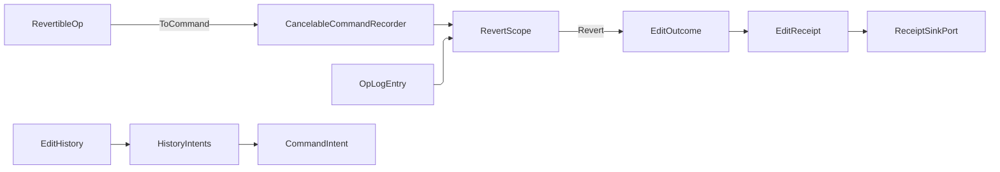

# [APPUI_EDIT_HISTORY]

Client-side undo/redo is one revert algebra over the admitted `CancelableCommandRecorder` window and the durable Persistence `Version/ledger` stream. `RevertDelta` owns the `Set`, `Insert`, `Remove`, `Move`, and `Composite` payloads plus their structural inverses; `RevertibleOp` derives `RevertKind` from that payload; `RevertCursor` retains client depth and durable offset together; `RevertDirection` and `RevertArm` carry every difference between the two traversals as delegate columns; and one `RevertScope.Revert` applies either direction before advancing its coordinate. `EditHistory` projects that one traversal onto the undo and redo command intents, each sealing the outcome its direction row names. The page owns no parallel stack, direction-named sibling method, direction-specific fetch delegate, or duplicate maximum-window knob. The spine is `bodong.PropertyModels`, the `CommandIntent`/`EditReceipt` rails, the Persistence op-log, Thinktecture.Runtime.Extensions, and LanguageExt rails.

## [01]-[INDEX]

- [02]-[REVERTIBLE_OP]: The per-kind `RevertDelta` union; the one revert vocabulary across client and durable arms.
- [03]-[REVERT_SCOPE]: The unified inverse algebra spanning the recorder window and the op-log stream.
- [04]-[EDIT_HISTORY]: The `CancelableCommandRecorder` wrapper; one revert traversal sealing the direction row's outcome.

## [02]-[REVERTIBLE_OP]

- Owner: `RevertibleOp` the revertible delta op; `RevertDelta` the closed per-kind payload union; `RevertKind` the op-kind key axis the delta case derives; `HistoryFault` the typed fault family on the `AppUiFaultBand.History` registry row (6320).
- Cases: `RevertDelta` = Set | Insert | Remove | Move | Composite — each case carries exactly its own payload and derives its inverse; `RevertKind` = set | insert | remove | move | composite, derived from the delta case; `HistoryFault` = Text | NothingToUndo | NothingToRedo | ApplyRejected. Fault codes are append-only and never re-seat on a retirement, so `ApplyRejected` keeps code 4 across the vacated slot and no persisted receipt re-reads as another case.
- Entry: `public RevertibleOp Inverse()` — the delta union's per-case inverse lifted onto the op; `public ICancelableCommand ToCommand(string name, Func<RevertibleOp, Fin<Unit>> apply)` — projects the typed application fold onto the admitted recorder's Boolean delegate boundary while durable replay retains the full `Fin<Unit>` failure.
- Auto: every edit records as a `RevertibleOp` whose delta case carries both directions structurally — `Set` swaps before and after, `Insert` inverts to `Remove` at the same position, `Move` swaps endpoints, `Composite` reverses and inverts its children — so an undo applies the derived inverse and a redo re-applies the forward without re-deriving either from a snapshot; the `Composite` case folds a batch edit's child ops into one revertible unit so a multi-item batch undoes as one transaction; the op projects onto the admitted `ICancelableCommand` so the `CancelableCommandRecorder` owns the queue, the `CanUndo`/`CanRedo` state, and the `MaxCommand=20` window, and `Recorder.Undo`/`Redo` pop-and-apply through that delegate pair so a hand-rolled undo stack is deleted.
- Packages: bodong.PropertyModels, Thinktecture.Runtime.Extensions, LanguageExt.Core, BCL inbox
- Growth: a new edit kind is one `RevertDelta` case plus its `RevertKind` key row, with every dispatch site broken loudly at compile time; zero new surface — the closed five-case family is the revert vocabulary.
- Boundary: `RevertibleOp` is the one revert vocabulary in the package — a second revertible-op shape, a separate redo stack, and a per-screen undo list are rejected. Both directions derive from the delta case, every JSON payload is defined, and every composite child re-enters full operation admission under the parent's `ContentIdentity`; an undo never re-computes prior state from a snapshot. The package-owned `ICancelableCommand` Boolean delegate is the sole narrowing boundary for the typed application rail, while durable replay preserves its exact failure. The `Composite` case makes a batch one revertible unit so partial-batch undo is structurally absent.

```csharp signature
[SmartEnum<string>]
public sealed partial class RevertKind {
    public static readonly RevertKind Set = new("set");
    public static readonly RevertKind Insert = new("insert");
    public static readonly RevertKind Remove = new("remove");
    public static readonly RevertKind Move = new("move");
    public static readonly RevertKind Composite = new("composite");
}

[Union]
public abstract partial record HistoryFault : Expected, IValidationError<HistoryFault> {
    private HistoryFault(string detail, int code) : base(detail, code, None) { }

    public static HistoryFault Create(string message) => new Text(message);

    public sealed record Text : HistoryFault { public Text(string detail) : base(detail, AppUiFaultBand.History.Code(0)) { } }
    public sealed record NothingToUndo : HistoryFault { public NothingToUndo(string detail) : base(detail, AppUiFaultBand.History.Code(1)) { } }
    public sealed record NothingToRedo : HistoryFault { public NothingToRedo(string detail) : base(detail, AppUiFaultBand.History.Code(2)) { } }
    // Code 3 stays vacant: every RevertDelta case derives its own inverse, so an inverse-absent fault names
    // an impossibility, and re-seating the codes below a retirement re-reads persisted receipts as the wrong case.
    public sealed record ApplyRejected : HistoryFault { public ApplyRejected(string detail) : base(detail, AppUiFaultBand.History.Code(4)) { } }
}

// Each delta case carries exactly its payload and its own inverse; kind derives from the case, so the
// kind key and the payload shape can never disagree.
[Union(ConversionFromValue = ConversionOperatorsGeneration.None)]
public abstract partial record RevertDelta {
    private RevertDelta() { }
    public sealed record Set(JsonElement Before, JsonElement After) : RevertDelta;
    public sealed record Insert(int At, JsonElement Item) : RevertDelta;
    public sealed record Remove(int At, JsonElement Item) : RevertDelta;
    public sealed record Move(int From, int To) : RevertDelta;
    public sealed record Composite(Seq<RevertibleOp> Children) : RevertDelta;

    public RevertKind Kind => Switch(
        set: static _ => RevertKind.Set,
        insert: static _ => RevertKind.Insert,
        remove: static _ => RevertKind.Remove,
        move: static _ => RevertKind.Move,
        composite: static _ => RevertKind.Composite);

    public RevertDelta Inverse() => Switch(
        set: static s => (RevertDelta)new Set(s.After, s.Before),
        insert: static i => new Remove(i.At, i.Item),
        remove: static r => new Insert(r.At, r.Item),
        move: static m => new Move(m.To, m.From),
        composite: static c => new Composite(c.Children.Reverse().Map(static child => child.Inverse())));

    public Fin<RevertDelta> Admit() => Switch(
        set: static delta => delta.Before.ValueKind is not JsonValueKind.Undefined && delta.After.ValueKind is not JsonValueKind.Undefined
            ? Fin.Succ<RevertDelta>(delta)
            : Fin.Fail<RevertDelta>(new HistoryFault.ApplyRejected("set/undefined")),
        insert: static delta => delta.At >= 0 && delta.Item.ValueKind is not JsonValueKind.Undefined
            ? Fin.Succ<RevertDelta>(delta)
            : Fin.Fail<RevertDelta>(new HistoryFault.ApplyRejected($"insert/{delta.At}")),
        remove: static delta => delta.At >= 0 && delta.Item.ValueKind is not JsonValueKind.Undefined
            ? Fin.Succ<RevertDelta>(delta)
            : Fin.Fail<RevertDelta>(new HistoryFault.ApplyRejected($"remove/{delta.At}")),
        move: static delta => delta.From >= 0 && delta.To >= 0 && delta.From != delta.To
            ? Fin.Succ<RevertDelta>(delta)
            : Fin.Fail<RevertDelta>(new HistoryFault.ApplyRejected($"move/{delta.From}/{delta.To}")),
        composite: static delta => delta.Children.IsEmpty
            ? Fin.Fail<RevertDelta>(new HistoryFault.ApplyRejected("composite/empty"))
            : delta.Children.Traverse(static child => child.Admit()).As().Map(_ => (RevertDelta)delta));
}

public sealed record RevertibleOp(
    string Target,
    string ContentIdentity,
    RevertDelta Delta,
    HlcStamp At) {
    public RevertKind Kind => Delta.Kind;

    public RevertibleOp Inverse() => this with { Delta = Delta.Inverse() };

    public Fin<RevertibleOp> Admit() =>
        !string.IsNullOrWhiteSpace(Target) && !string.IsNullOrWhiteSpace(ContentIdentity)
            ? Delta.Admit().Bind(admitted => admitted is RevertDelta.Composite composite
                && !composite.Children.ForAll(child => StringComparer.Ordinal.Equals(child.ContentIdentity, ContentIdentity))
                ? Fin.Fail<RevertibleOp>(new HistoryFault.ApplyRejected("composite content identity diverges"))
                : Fin.Succ(this with { Delta = admitted }))
            : Fin.Fail<RevertibleOp>(new HistoryFault.ApplyRejected("operation identity is empty"));

    public ICancelableCommand ToCommand(string name, Func<RevertibleOp, Fin<Unit>> apply) =>
        new GenericCancelableCommand(name, executeFunc: () => apply(this).IsSucc, cancelFunc: () => apply(Inverse()).IsSucc);
}
```

## [03]-[REVERT_SCOPE]

- Owner: `RevertScope` the unified inverse algebra; `RevertArm` the client-versus-durable axis, each row carrying the cursor coordinate it deepens and the fetch-and-apply fold that half runs; `RevertDirection` the undo-versus-redo axis, each row carrying the recorder verb, ledger offset, ledger projection, cursor advance, absent fault, and sealed outcome; `RevertCursor` the combined client-depth and durable-offset value — every successful inverse operation returns the advanced cursor beside the applied op, so history state never reconstructs one position from the other.
- Cases: `RevertArm` = client | durable under the locked kind literals — the client `CancelableCommandRecorder` window and the durable Persistence `Version/ledger` `OpLogEntry` stream; `RevertDirection` = undo | redo.
- Entry: `public IO<Fin<(RevertibleOp Op, RevertCursor Next)>> Revert(RevertDirection direction, RevertCursor cursor, string contentIdentity)` — the ONE traversal both directions take: `RevertDirection.Arm` derives the owning half from the cursor, the client arm drives `CancelableCommandRecorder.Undo`/`Redo` (which pops the head command and runs its delegate pair) while the cursor sits inside the `MaxCommand=20` window, and the durable arm reads the ledger's one bounded case, `OpLog.Replay` over `ReplayWindow.ForEntity(contentIdentity, afterSequence, take)`, never a revert-local query; the entry stays `IO`-deferred, so the effect terminates only at the screen's composition edge, never inside this owner.
- Auto: a turn inside the client window drives the recorder, which pops the head `ICancelableCommand` and runs its `Cancel` or forward delegate so the delta applies through the admitted recorder rather than a hand-rolled re-application, and the popped op resolves through `ClientHead` for the receipt; a turn past the `MaxCommand=20` client window reads the durable Persistence `Version/ledger` window keyed by `ContentIdentity`, projects the entry through `RevertDirection.Project` — undo inverts, redo takes the forward op — and applies it through the SAME `Apply` delta fold the client commands were minted with (`ToCommand(name, apply)`), so both arms mutate through one application law, inversion has exactly one owner in `RevertDelta.Inverse`, and the deep history rides the settled durable sync rather than a second client history scheme; the fetched op APPLIES before the cursor advances, so a durable success is an applied mutation and never a fetch; every success carries `Next` — the arm's own deepening or one `Shallower` walk — so repeated undo addresses strictly deeper positions, repeated redo strictly shallower ones, and the client-to-durable transition is recoverable from the returned cursor alone; the two arms speak one `RevertibleOp` vocabulary so the client window and durable stream fold one inverse algebra — a client-window `RevertibleOp` projects onto the one `EditIntent` union and lands as Persistence-owned `OpLogEntry`/`SyncOpKind` rows through the `Version/ledger` changefeed; the durable-arm write leg is the `Collab/sync.md` route — an inverse decodes off the ledger `DiffBatch` as `EditIntent` rows and commits through `IntentLedger.Commit` exactly as `TimeTravel.Revert` does, so revert commits and live edits ride one ledger ingress; `RevertibleOp` stays the local revert algebra projecting onto that family, never a parallel union.
- Packages: bodong.PropertyModels, Thinktecture.Runtime.Extensions, LanguageExt.Core, NodaTime, Rasm.Persistence (project)
- Growth: a new revert source is structurally fixed at two arms; a new directional difference is one column on `RevertDirection`; zero new surface.
- Boundary: the revert scope is the one inverse algebra spanning two arms; the admitted `CancelableCommandRecorder` owns the client window, the settled Persistence `Version/ledger` stream supplies durable operations through the one `Window` read both the reverting arm and the timeline pane consume, and both arms mutate through the same application fold. `Recorder.MaxCommand` is the only window bound. `RevertCursor` retains the actual client depth while traversing durable history, so returning from durable offset one resumes the real recorder depth instead of inventing `MaxCommand`; `RevertDirection` supplies the durable offset and projection, and a successful fetch does not advance unless application succeeds. `ContentIdentity` aligns client and durable operations across the seam, while a host-mutating revert routes through the abstract `DocumentTransaction` port so host and client undo remain one transaction.

```csharp signature
// The arm OWNS its half of the traversal: each row carries the coordinate it deepens and the whole
// fetch-and-apply fold that half runs, so the client-versus-durable axis dispatches rather than naming a
// split two inline ternaries re-derive at two call sites.
[SmartEnum<string>]
public sealed partial class RevertArm {
    public static readonly RevertArm Client = new("client",
        static cursor => cursor with { ClientDepth = cursor.ClientDepth + 1 },
        static (scope, direction, cursor, identity) => IO.lift(() => scope.ClientHead(direction).Match(
            Some: op => direction.Drive(scope.Recorder)
                ? Fin.Succ((op, direction.After(Client, cursor)))
                : Fin.Fail<(RevertibleOp, RevertCursor)>(new HistoryFault.ApplyRejected(op.Target)),
            None: () => Fin.Fail<(RevertibleOp, RevertCursor)>(direction.Absent(identity)))));

    // The durable arm reads the SAME bounded ledger window the timeline renders, projects the entry through
    // the direction's own inversion, and applies before the cursor advances — a fetch-only durable success
    // is the deleted form.
    public static readonly RevertArm Durable = new("durable",
        static cursor => cursor with { DurableOffset = cursor.DurableOffset + 1 },
        static (scope, direction, cursor, identity) => direction.Offset(cursor) switch {
            var offset => scope.Window(identity, offset + 1).Map(window => window.At(offset).Match(
                Some: entry => direction.Project(entry).Admit().Bind(admitted =>
                    scope.Apply(admitted).Map(_ => (admitted, direction.After(Durable, cursor)))),
                None: () => Fin.Fail<(RevertibleOp, RevertCursor)>(direction.Absent(identity)))),
        });

    [UseDelegateFromConstructor]
    public partial RevertCursor Deeper(RevertCursor cursor);

    [UseDelegateFromConstructor]
    public partial IO<Fin<(RevertibleOp Op, RevertCursor Next)>> Turn(RevertScope scope, RevertDirection direction, RevertCursor cursor, string contentIdentity);
}

// Undo walks DEEPER and inverts what the ledger holds; redo walks back SHALLOWER and re-applies the forward
// op it left. Every difference between the two traversals is a column here, so one entry serves both and a
// direction-named sibling method is the deleted form.
[SmartEnum<string>]
public sealed partial class RevertDirection {
    public static readonly RevertDirection Undo = new("undo",
        static recorder => recorder.CanUndo,
        static recorder => recorder.Undo(),
        static cursor => cursor.DurableOffset,
        static op => op.Inverse(),
        static (arm, cursor) => arm.Deeper(cursor),
        static identity => new HistoryFault.NothingToUndo(identity),
        static kind => new EditOutcome.Reverted(kind));
    public static readonly RevertDirection Redo = new("redo",
        static recorder => recorder.CanRedo,
        static recorder => recorder.Redo(),
        static cursor => cursor.DurableOffset - 1,
        static op => op,
        static (_, cursor) => cursor.Shallower(),
        static identity => new HistoryFault.NothingToRedo(identity),
        static kind => new EditOutcome.Redone(kind));

    // The arm DERIVES: the durable half owns the turn whenever the step addresses a durable position the
    // client window cannot serve, which is exactly what the two ternaries computed while the axis they
    // named owned no dispatch. Inversion lives at `RevertDelta.Inverse` alone — the ledger hands forward
    // ops and this column inverts them, so no seam holds a second inversion law.
    public RevertArm Arm(RevertCursor cursor, CancelableCommandRecorder recorder) =>
        Offset(cursor) >= 0 && !(cursor.InClientWindow(recorder.MaxCommand) && Ready(recorder))
            ? RevertArm.Durable
            : RevertArm.Client;

    [UseDelegateFromConstructor] public partial bool Ready(CancelableCommandRecorder recorder);
    [UseDelegateFromConstructor] public partial bool Drive(CancelableCommandRecorder recorder);
    [UseDelegateFromConstructor] public partial int Offset(RevertCursor cursor);
    [UseDelegateFromConstructor] public partial RevertibleOp Project(RevertibleOp op);
    [UseDelegateFromConstructor] public partial RevertCursor After(RevertArm arm, RevertCursor cursor);
    [UseDelegateFromConstructor] public partial HistoryFault Absent(string contentIdentity);
    [UseDelegateFromConstructor] public partial EditOutcome Outcome(string kind);
}

public readonly record struct RevertCursor(int ClientDepth, int DurableOffset) {
    public static readonly RevertCursor Start = new(0, 0);

    public bool InClientWindow(int maxCommand) => DurableOffset == 0 && ClientDepth < maxCommand;

    // Deepening is the ARM's move — each arm owns the coordinate it advances — while shallowing is one walk
    // back through whichever coordinate is live, so the durable-to-client return resumes the real recorder
    // depth instead of inventing `MaxCommand`.
    public RevertCursor Shallower() => DurableOffset > 0
        ? this with { DurableOffset = DurableOffset - 1 }
        : this with { ClientDepth = int.Max(0, ClientDepth - 1) };
}

public sealed record RevertScope(
    CancelableCommandRecorder Recorder,
    Func<RevertDirection, Option<RevertibleOp>> ClientHead,
    Func<string, int, IO<Seq<RevertibleOp>>> Window,
    Func<RevertibleOp, Fin<Unit>> Apply) {
    // ONE traversal carries both directions: the direction row supplies the recorder verb, the ledger
    // offset, the ledger projection, the cursor advance, and the absent fault, and the arm it derives owns
    // the fetch-and-apply fold. `Window` is the ledger's one bounded read — `OpLog.Replay` over
    // `ReplayWindow.ForEntity` — so the reverting arm and the timeline pane read one stream, and the IO
    // terminates at the caller's edge.
    public IO<Fin<(RevertibleOp Op, RevertCursor Next)>> Revert(RevertDirection direction, RevertCursor cursor, string contentIdentity) =>
        cursor.ClientDepth < 0 || cursor.DurableOffset < 0 || string.IsNullOrWhiteSpace(contentIdentity)
            ? IO.pure(Fin.Fail<(RevertibleOp, RevertCursor)>(new HistoryFault.ApplyRejected($"{direction.Key}: cursor or content identity is invalid")))
            : direction.Arm(cursor, Recorder).Turn(this, direction, cursor, contentIdentity);
}
```

## [04]-[EDIT_HISTORY]

- Owner: `EditHistory` the `CancelableCommandRecorder` wrapper; `HistoryIntents` the undo/redo command-table projection.
- Entry: `Record` admits the delta and returns `IO<Fin<EditReceipt>>` after enqueuing one `ICancelableCommand`; `Revert(RevertDirection direction, …)` resolves through `RevertScope`, seals the direction row's own `EditOutcome` case, and returns the advanced `RevertCursor`; `Timeline(string contentIdentity, int depth)` unions the recorder's undo and redo queues with the durable ledger window under their arms.
- Auto: every edit records through the admitted `CancelableCommandRecorder`, whose `MaxCommand`, `CanUndo`, `CanRedo`, lifecycle events, and queue snapshots remain authoritative. The `history.undo` and `history.redo` command rows bind availability to `CommandHistoryViewModel` and differ only in the `RevertDirection` row they pass, and the timeline re-projects on the recorder's `OnNewCommandAdded`, `OnCommandRedo`, `OnCommandCanceled`, and `OnCommandCleared` events. The direction row seals its distinct outcome through the one `EditReceipt` family, and the recorder clears at screen teardown.
- Receipt: `EditReceipt` with `EditOutcome.Reverted` for undo and `EditOutcome.Redone` for redo; `TelemetryRow` contributes both instruments through the AppHost `TelemetryContributorPort`.
- Packages: bodong.PropertyModels, ReactiveUI, Thinktecture.Runtime.Extensions, LanguageExt.Core, NodaTime
- Growth: a new history verb is one `CommandIntent` row; one history instrument is one `InstrumentSpec` row on `EditHistory.TelemetryRow`; zero new surface — an undo package is deleted by the admitted recorder.
- Boundary: client undo/redo binds the admitted `CancelableCommandRecorder` and `CommandHistoryViewModel`; a per-screen stack, history-local command registry, generic history receipt, and duplicate deep-history store are rejected. Command availability derives from `CanUndo` and `CanRedo`, the durable arm extends the same `RevertScope` beyond the recorder window, and screen activation owns recorder disposal.

```csharp signature
public sealed record EditHistory(CancelableCommandRecorder Recorder, CommandHistoryViewModel View, RevertScope Scope, string Surface) {
    public const string UndoIntent = "history.undo";
    public const string RedoIntent = "history.redo";

    public IO<Fin<EditReceipt>> Record(RevertibleOp op, Func<RevertibleOp, Fin<Unit>> apply, ClockPolicy clocks, CorrelationId correlation) =>
        IO.lift(() => op.Admit().Map(admitted => {
            Recorder.PushCommand(admitted.ToCommand(admitted.Kind.Key, apply));
            return new EditReceipt(EditReceipt.EditKind, Surface, admitted.Target, admitted.Kind.Key, new EditOutcome.Committed(admitted.Kind.Key), clocks.Now, correlation);
        }));

    // One projection serves both directions: the direction row seals its own outcome case, so the receipt
    // is a row value rather than a second place the undo/redo split is spelled.
    public IO<(EditReceipt Receipt, RevertCursor Next)> Revert(
        RevertDirection direction, string contentIdentity, RevertCursor cursor, ClockPolicy clocks, CorrelationId correlation) =>
        Scope.Revert(direction, cursor, contentIdentity).Map(outcome => outcome.Match(
            Succ: advanced => (new EditReceipt(EditReceipt.EditKind, Surface, advanced.Op.Target, advanced.Op.Kind.Key, direction.Outcome(advanced.Op.Kind.Key), clocks.Now, correlation), advanced.Next),
            Fail: error => (new EditReceipt(EditReceipt.EditKind, Surface, contentIdentity, string.Empty, new EditOutcome.Rejected(EditFault.Create(error.Message)), clocks.Now, correlation), cursor)));

    // Timeline pane: the recorder's queue snapshots are the client half — undo entries newest-first, redo
    // entries as the not-undoable tail — and the SAME bounded ledger window the durable arm reverts through
    // is the deep half, so the pane renders the history the arm axis names instead of stamping every entry
    // Client and leaving the durable half unrenderable. No parallel history list exists to drift.
    public IO<Seq<(string Name, RevertArm Arm, bool Undoable)>> Timeline(string contentIdentity, int depth) =>
        Scope.Window(contentIdentity, depth).Map(durable =>
            toSeq(Recorder.GetUndoQueue()).Map(static command => (command.Name, RevertArm.Client, true))
            + toSeq(Recorder.GetRedoQueue()).Map(static command => (command.Name, RevertArm.Client, false))
            + durable.Map(static op => (op.Kind.Key, RevertArm.Durable, true)));

    public IObservable<bool> CanUndo => View.WhenAnyValue(static view => view.CanUndo);
    public IObservable<bool> CanRedo => View.WhenAnyValue(static view => view.CanRedo);

    public const string RevertedInstrument = "rasm.appui.edit.reverted";
    public const string RedoneInstrument = "rasm.appui.edit.redone";

    public static TelemetryContributorPort TelemetryRow(string version) =>
        AppUiTelemetry.Contribute(version,
            InstrumentSpec.Count(RevertedInstrument, "{edit}", "undo reverts by surface", MeasureForm.Whole, AppUiTelemetry.SurfaceSlot),
            InstrumentSpec.Count(RedoneInstrument, "{edit}", "redo replays by surface", MeasureForm.Whole, AppUiTelemetry.SurfaceSlot));
}
```


```mermaid
---
config:
  layout: elk
  flowchart:
    curve: linear
    padding: 25
---
flowchart LR
    accTitle: Unified revert rail
    accDescr: Client commands and durable operations converge in one revert scope before direction-specific outcomes, receipts, and command intents.
    RevertibleOp -->|ToCommand| CancelableCommandRecorder
    CancelableCommandRecorder --> RevertScope
    OpLogEntry --> RevertScope
    RevertScope -->|Revert| EditOutcome
    EditOutcome --> EditReceipt
    EditReceipt --> ReceiptSinkPort
    EditHistory --> HistoryIntents
    HistoryIntents --> CommandIntent
```

## [05]-[RESEARCH]

(none)
