# [APPUI_INSPECTOR_EDITING]

Typed property inspection and value editing for product state: one `InspectorPolicy`-driven PropertyGrid admission capsule, thirteen ranked `EditorFactory` rows resolving the admitted shape families, an `EditFault`/`EditReceipt` commit rail with the preview-versus-commit law, the options-inspector composite binding policy records to user-settings writes and `ReloadReceipt` outcomes, a side-by-side conflict projection over Persistence conflict receipts, and grammar-scoped `CodePane` rows with a completion projection. The page owns the editor-row axis, the edit fault and outcome vocabulary, the inspector policy values, and the conflict and completion projections. The spine is bodong.Avalonia.PropertyGrid, Avalonia.Controls.ColorPicker, Avalonia.AvaloniaEdit with AvaloniaEdit.TextMate, ReactiveUI.Validation, UnitsNet, Thinktecture.Runtime.Extensions, NodaTime, System.Reactive, and LanguageExt.Core.

## [01]-[INDEX]

- [01]-[INSPECTOR_SURFACE]: PropertyGrid admission policy, descriptor filters, focus receipts.
- [02]-[EDITOR_FACTORIES]: Thirteen ranked editor rows with generated, optional, temporal, identifier, scalar, collection, and nested shape coverage.
- [03]-[COMMIT_VALIDATION]: Typed admission rail, preview-commit law, edit receipts.
- [04]-[OPTIONS_INSPECTOR]: Options-to-grid binding, user-settings persist, reload banner.
- [05]-[CONFLICT_RESOLUTION]: Side-by-side conflict projection with resolution intent keys.
- [06]-[CODE_EDITING]: Grammar-scoped code panes and completion projection.

## [02]-[INSPECTOR_SURFACE]

- Owner: `InspectorPolicy` policy record; `InspectorSurface` static boundary capsule.
- Entry: `Mount(PropertyGrid grid, InspectorPolicy policy, object subject, ClockPolicy clocks, CorrelationId correlation, Action<EditReceipt> sink, Action<Error> fault)` — `IDisposable` detacher composed LIFO by the activation scope.
- Receipt: `EditReceipt` focus kind — surface, member path, `Instant`, correlation; `TelemetryRow` contributes the edit-committed and edit-rejected instruments inward through the AppHost `TelemetryContributorPort`.
- Packages: bodong.Avalonia.PropertyGrid, System.Reactive, NodaTime, LanguageExt.Core
- Growth: one policy value on `InspectorPolicy`; one inspector instrument is one `InstrumentRow` on `InspectorSurface.TelemetryRow`; zero new surface.
- Boundary: `Mount` is the page's PropertyGrid boundary capsule — the inspected subject binds through the grid's `DataContext` because `PropertyGridViewModel` is internal, and canonical typing re-enters through the editor adapter; `LayoutStyle` and `CellEdit` are `InspectorPolicy` values over the catalogued `PropertyGridLayoutStyle { Tree, Inline }` and `CellEditAlignmentType { Default, Stretch, Compact }` domains; every grid event enters as `RoutedEventArgs`, narrows to its catalogued public event shape, and routes a mismatch through the supplied `Action<Error>` instead of a cast exception; `Admit` owns descriptor filtering and `FocusTarget` owns member-path projection, while quick-filter, category, and read-only state remain policy values rather than mutable control state.

```csharp signature
public sealed record InspectorPolicy(
    bool ReadOnly,
    bool CategoriesVisible,
    bool QuickFilter,
    bool CategoriesExpanded,
    PropertyGridLayoutStyle LayoutStyle,
    CellEditAlignmentType CellEdit,
    string Surface,
    Action<CustomPropertyDescriptorFilterEventArgs> Admit,
    Func<PropertyGotFocusEventArgs, string> FocusTarget,
    Action<RoutedEventArgs> Rename);

public static partial class InspectorSurface {
    public static IDisposable Mount(PropertyGrid grid, InspectorPolicy policy, object subject, ClockPolicy clocks, CorrelationId correlation, Action<EditReceipt> sink, Action<Error> fault) {
        grid.DataContext = subject;
        grid.IsReadOnly = policy.ReadOnly;
        grid.LayoutStyle = policy.LayoutStyle;
        grid.CellEditAlignment = policy.CellEdit;
        grid.IsCategoryVisible = policy.CategoriesVisible;
        grid.IsQuickFilterVisible = policy.QuickFilter;
        grid.AllCategoriesExpanded = policy.CategoriesExpanded;
        EventHandler<RoutedEventArgs> admit = (_, args) => ignore(args is CustomPropertyDescriptorFilterEventArgs admitted
            ? fun(() => policy.Admit(admitted))()
            : fun(() => fault(new EditFault.UnmatchedShape(args.GetType().Name)))());
        EventHandler<RoutedEventArgs> focus = (_, args) => ignore(args is PropertyGotFocusEventArgs focused
            ? fun(() => sink(new EditReceipt(
                Kind: EditReceipt.FocusKind,
                Surface: policy.Surface,
                Target: policy.FocusTarget(focused),
                Editor: string.Empty,
                Outcome: new EditOutcome.Observed(),
                At: clocks.Now,
                Correlation: correlation)))()
            : fun(() => fault(new EditFault.UnmatchedShape(args.GetType().Name)))());
        EventHandler<RoutedEventArgs> rename = (_, args) => policy.Rename(args);
        grid.CustomPropertyDescriptorFilter += admit;
        grid.PropertyGotFocus += focus;
        grid.CustomNameBlock += rename;
        return Disposable.Create(() => {
            grid.CustomPropertyDescriptorFilter -= admit;
            grid.PropertyGotFocus -= focus;
            grid.CustomNameBlock -= rename;
        });
    }

    public const string CommittedInstrument = "rasm.appui.edit.committed";
    public const string RejectedInstrument = "rasm.appui.edit.rejected";

    public static TelemetryContributorPort TelemetryRow(string version) =>
        AppUiTelemetry.Contribute(version,
            new(CommittedInstrument, InstrumentKind.Count, "{edit}", "edits committed by surface"),
            new(RejectedInstrument, InstrumentKind.Count, "{edit}", "edits rejected by surface"));
}
```

## [03]-[EDITOR_FACTORIES]

- Owner: `ComparerAccessors.StringOrdinalIgnoreCase` accessor; `EditorFactory` `[SmartEnum<string>]` thirteen rows; `EditorRowFactory` — the ONE public `AbstractCellEditFactory` adapter every custom row rides.
- Cases: quantity, value-object, optional, temporal, identifier, color, choice, path, collection, boolean, numeric, text, nested — rank equals declaration order, the match walk takes the first accepting row, and nested is the reference-record fallback.
- Entry: `Match(Type shape, EditorAdapter adapter)` is the ranked `Option<EditorFactory>` walk; `EditorRowFactory.Register(EditorAdapter adapter)` installs the one public custom factory and returns its removal scope.
- Auto: generated `Items` ordering and key factories sit under `[ValidationError<EditFault>]`; `Accepts` is the row delegate column, while `EditorAdapter` owns generated-owner recognition, control presentation, and refresh at composition.
- Packages: bodong.Avalonia.PropertyGrid, Avalonia.Controls.ColorPicker, UnitsNet, NodaTime, Thinktecture.Runtime.Extensions, LanguageExt.Core, BCL inbox
- Growth: one editor row on `EditorFactory` (key, rank, accept predicate, present column); zero new surface — per-shape editor controls and per-`[ValueObject]` editor classes are deleted by the value-object and quantity rows.
- Boundary: the built-in concrete factories are internal and never referenced. Stock rows fall to the registry's built-ins by priority, and custom rows ride one public `EditorRowFactory : AbstractCellEditFactory` registered through `CellEditFactoryService.Default.AddFactory`. `EditorAdapter` binds generated-owner recognition and complete control presentation at composition, so no `Thinktecture.Internal` metadata or hollow unbound control enters the page. Optional admission covers `Option<T>` and `Nullable<T>`; temporal admission covers the NodaTime and BCL date/time families; identifier admission covers `Guid` and `Uri`; numeric admission includes `Half`, `Int128`, and `UInt128`; and color rows bind `PreviewableColorPicker` with the admitted palette family.

```csharp signature

[SmartEnum<string>]
[ValidationError<EditFault>]
[KeyMemberEqualityComparer<ComparerAccessors.StringOrdinalIgnoreCase, string>]
[KeyMemberComparer<ComparerAccessors.StringOrdinalIgnoreCase, string>]
public sealed partial class EditorFactory {
    public static readonly EditorFactory Quantity = new("quantity", rank: 10, accepts: AcceptQuantity, custom: true);
    public static readonly EditorFactory Value = new("value-object", rank: 20, accepts: static _ => false, custom: true);
    public static readonly EditorFactory Optional = new("optional", rank: 30, accepts: AcceptOptional, custom: true);
    public static readonly EditorFactory Temporal = new("temporal", rank: 40, accepts: AcceptTemporal, custom: true);
    public static readonly EditorFactory Identifier = new("identifier", rank: 50, accepts: AcceptIdentifier, custom: true);
    public static readonly EditorFactory Color = new("color", rank: 60, accepts: AcceptColor, custom: true);
    public static readonly EditorFactory Choice = new("choice", rank: 70, accepts: static shape => shape.IsEnum, custom: true);
    public static readonly EditorFactory Path = new("path", rank: 80, accepts: AcceptPath, custom: false);
    public static readonly EditorFactory Collection = new("collection", rank: 90, accepts: AcceptCollection, custom: false);
    public static readonly EditorFactory Boolean = new("boolean", rank: 100, accepts: AcceptBoolean, custom: false);
    public static readonly EditorFactory Numeric = new("numeric", rank: 110, accepts: AcceptNumeric, custom: false);
    public static readonly EditorFactory Text = new("text", rank: 120, accepts: AcceptText, custom: false);
    public static readonly EditorFactory Nested = new("nested", rank: 130, accepts: AcceptNested, custom: false);

    public static readonly Seq<IColorPalette> Palettes = Seq<IColorPalette>(new FluentColorPalette(), new MaterialColorPalette(), new FlatColorPalette());

    public int Rank { get; }
    public bool Custom { get; }

    [UseDelegateFromConstructor]
    public partial bool Accepts(Type shape);

    public bool Accepts(Type shape, EditorAdapter adapter) =>
        ReferenceEquals(this, Value)
            ? adapter.ValueObject(shape)
            : ReferenceEquals(this, Choice)
                ? shape.IsEnum || adapter.SmartEnum(shape)
                : Accepts(shape);

    public static Option<EditorFactory> Match(Type shape, EditorAdapter adapter) =>
        Items.AsIterable()
            .OrderBy(static row => row.Rank)
            .Find(row => row.Accepts(shape, adapter));

    private static readonly FrozenSet<Type> NumericShapes = new[] {
        typeof(byte), typeof(sbyte), typeof(short), typeof(ushort), typeof(int), typeof(uint),
        typeof(long), typeof(ulong), typeof(Int128), typeof(UInt128), typeof(Half), typeof(float), typeof(double), typeof(decimal),
    }.ToFrozenSet();

    private static readonly FrozenSet<Type> TemporalShapes = new[] {
        typeof(Instant), typeof(LocalDate), typeof(LocalDateTime), typeof(LocalTime), typeof(OffsetDateTime),
        typeof(ZonedDateTime), typeof(Duration), typeof(Period), typeof(DateInterval), typeof(DateOnly), typeof(TimeOnly), typeof(DateTimeOffset),
    }.ToFrozenSet();

    private static readonly FrozenSet<Type> IdentifierShapes = new[] { typeof(Guid), typeof(Uri) }.ToFrozenSet();

    private static bool AcceptQuantity(Type shape) => typeof(IQuantity).IsAssignableFrom(shape);
    private static bool AcceptOptional(Type shape) => shape is { IsGenericType: true }
        && (shape.GetGenericTypeDefinition() == typeof(Option<>) || shape.GetGenericTypeDefinition() == typeof(Nullable<>));
    private static bool AcceptTemporal(Type shape) => TemporalShapes.Contains(shape);
    private static bool AcceptIdentifier(Type shape) => IdentifierShapes.Contains(shape);
    private static bool AcceptColor(Type shape) => shape == typeof(Avalonia.Media.Color);
    private static bool AcceptPath(Type shape) => typeof(FileSystemInfo).IsAssignableFrom(shape);
    private static bool AcceptCollection(Type shape) => shape != typeof(string) && typeof(IEnumerable).IsAssignableFrom(shape);
    private static bool AcceptBoolean(Type shape) => shape == typeof(bool);
    private static bool AcceptNumeric(Type shape) => NumericShapes.Contains(shape);
    private static bool AcceptText(Type shape) => shape == typeof(string);
    private static bool AcceptNested(Type shape) => shape is { IsClass: true, IsAbstract: false };
}

public sealed record EditorAdapter(
    Func<Type, bool> ValueObject,
    Func<Type, bool> SmartEnum,
    Func<EditorFactory, PropertyCellContext, Option<Control>> Present,
    Func<EditorFactory, PropertyCellContext, bool> Refresh);

// The ONE public adapter: custom rows resolve through the rank walk and present their control; a stock
// shape returns false so the registry's internal built-ins take the cell at their own priority.
public sealed class EditorRowFactory(EditorAdapter adapter) : AbstractCellEditFactory {
    public override int ImportPriority => 200;

    public static IDisposable Register(EditorAdapter adapter) {
        EditorRowFactory factory = new(adapter);
        CellEditFactoryService.Default.AddFactory(factory);
        return Disposable.Create(() => CellEditFactoryService.Default.RemoveFactory(factory));
    }

    public override bool Accept(object accessToken) =>
        accessToken is Type shape && EditorFactory.Match(shape, adapter).Exists(static row => row.Custom);

    public override Control? HandleNewProperty(PropertyCellContext context) =>
        EditorFactory.Match(context.Property.PropertyType, adapter)
            .Filter(static row => row.Custom)
            .Bind(row => adapter.Present(row, context))
            .IfNoneUnsafe((Control?)null);

    public override bool HandlePropertyChanged(PropertyCellContext context) =>
        EditorFactory.Match(context.Property.PropertyType, adapter)
            .Exists(row => row.Custom && adapter.Refresh(row, context));
}
```

## [04]-[COMMIT_VALIDATION]

- Owner: `EditFault` `[Union]` fault family on the doctrine `Expected` shape with the dual-tier `Create` contract; `EditOutcome` `[Union]`; `EditReceipt` record; `EditGate` static admission surface.
- Cases: `EditFault` Text, Parse, Invariant, UnmatchedShape, StoreRejected, HostRejected, Aggregate — codes derive through the `AppUiFaultBand.Edit` registry row and `Aggregate` carries child codes in its payload; `EditOutcome` Observed, Committed, Reverted, Redone, Rejected, HostRouted.
- Entry: `Admit<TOwner, TRaw, TError>(string target, TRaw raw, IFormatProvider? culture = null)` — `Validation<EditFault,TOwner>` accumulates; `Resolve(Type shape)` lifts an unmatched shape onto the same rail.
- Receipt: `EditReceipt` — kind, surface, target, editor row key, outcome, `Instant`, `CorrelationId`.
- Packages: Thinktecture.Runtime.Extensions, UnitsNet, ReactiveUI.Validation, NodaTime, LanguageExt.Core
- Growth: one case on `EditFault` or `EditOutcome`; zero new surface.
- Boundary: preview interactions (`PreviewColorChanged` on `PreviewableColorPicker`, transient editor control state) mutate nothing durable and emit nothing; the grid's `CommandExecuting` event carries `RoutedCommandExecutingEventArgs` with a settable `Canceled` — the gate vetoes a failing admission there — and `CommandExecuted` carries `RoutedCommandExecutedEventArgs` (`Command`, `Target`, `Property`, `OldValue`, `NewValue`) and sinks exactly one `EditReceipt` per commit — the executing-versus-executed split is the whole debounce law, with `ColorChanged` as the picker's commit edge; the value-object leg is the doctrine `Validate` bridge, so `Create`/`TryCreate` call sites and per-call-site error translation are deleted; quantity admission parses through `Quantity.TryParse` with explicit culture and unit lists present through `QuantityInfo`/`UnitInfo` from `Quantity.Infos`; `ValidateProperty` text renders through `BindValidation` against the screen validation vocabulary and `IsValid` streams gate commit intents — a second validation rail is deleted; host-mutating edits route through the abstract document-transaction surface-host port the app root binds to the host, undo-scoped, and `HostRouted` carries that hop's correlation.

```csharp signature
[Union]
public abstract partial record EditFault : Expected, IValidationError<EditFault>, Semigroup<EditFault> {
    private EditFault(string detail, int code) : base(detail, code, None) { }

    public static EditFault Create(string message) => new Text(message);

    public sealed record Text : EditFault { public Text(string detail) : base(detail, AppUiFaultBand.Edit.Code(0)) { } }
    public sealed record Parse : EditFault {
        public Parse(string target, string detail) : base($"{target}: {detail}", AppUiFaultBand.Edit.Code(1)) => Target = target;
        public string Target { get; }
    }
    public sealed record Invariant : EditFault {
        public Invariant(string target, string detail) : base($"{target}: {detail}", AppUiFaultBand.Edit.Code(2)) => Target = target;
        public string Target { get; }
    }
    public sealed record UnmatchedShape : EditFault {
        public UnmatchedShape(string shape) : base($"{shape}: no editor row", AppUiFaultBand.Edit.Code(3)) => Shape = shape;
        public string Shape { get; }
    }
    public sealed record StoreRejected : EditFault {
        public StoreRejected(string target, string detail) : base($"{target}: {detail}", AppUiFaultBand.Edit.Code(4)) => Target = target;
        public string Target { get; }
    }
    public sealed record HostRejected : EditFault {
        public HostRejected(string target, string detail) : base($"{target}: {detail}", AppUiFaultBand.Edit.Code(5)) => Target = target;
        public string Target { get; }
    }
    public sealed record Aggregate : EditFault {
        public Aggregate(Seq<EditFault> faults) : base($"{faults.Count} faults", AppUiFaultBand.Edit.Code(6)) => Faults = faults;
        public Seq<EditFault> Faults { get; }
    }
    public sealed record ResolutionAbsent : EditFault {
        public ResolutionAbsent(Seq<int> hunks) : base($"unresolved conflict hunks: {string.Join(",", hunks)}", AppUiFaultBand.Edit.Code(7)) => Hunks = hunks;
        public Seq<int> Hunks { get; }
    }

    public EditFault Combine(EditFault rhs) => (this, rhs) switch {
        (Aggregate l, Aggregate r) => new Aggregate(l.Faults + r.Faults),
        (Aggregate l, _) => new Aggregate(l.Faults.Add(rhs)),
        (_, Aggregate r) => new Aggregate(this.Cons(r.Faults)),
        _ => new Aggregate(Seq(this, rhs)),
    };
}

[Union(ConversionFromValue = ConversionOperatorsGeneration.None)]
public abstract partial record EditOutcome {
    private EditOutcome() { }

    public sealed record Observed : EditOutcome;
    public sealed record Committed(string Editor) : EditOutcome;
    public sealed record Reverted(string Editor) : EditOutcome;
    public sealed record Redone(string Editor) : EditOutcome;
    public sealed record Rejected(EditFault Fault) : EditOutcome;
    public sealed record HostRouted(CorrelationId Transaction) : EditOutcome;
}

public sealed record EditReceipt(
    string Kind,
    string Surface,
    string Target,
    string Editor,
    EditOutcome Outcome,
    Instant At,
    CorrelationId Correlation) {
    public const string FocusKind = "focus";
    public const string EditKind = "edit";
    public const string OptionsKind = "options";
    public const string ConflictKind = "conflict";
}

public static class EditGate {
    public static Validation<EditFault, TOwner> Admit<TOwner, TRaw, TError>(string target, TRaw raw, IFormatProvider? culture = null)
        where TOwner : IObjectFactory<TOwner, TRaw, TError>
        where TRaw : notnull, allows ref struct
        where TError : Expected, IValidationError<TError> {
        TError? fault = TOwner.Validate(raw, culture, out TOwner? owner);
        return fault is not null
            ? (Validation<EditFault, TOwner>)new EditFault.Invariant(target, fault.Message)
            : owner is TOwner admitted
                ? (Validation<EditFault, TOwner>)admitted
                : new EditFault.Invariant(target, "generated factory returned no admitted owner");
    }

    public static Validation<EditFault, IQuantity> AdmitQuantity(string target, Type shape, string text, IFormatProvider culture) {
        bool valid = Quantity.TryParse(culture, shape, text, out IQuantity? parsed);
        return valid && parsed is IQuantity quantity
            ? (Validation<EditFault, IQuantity>)quantity
            : new EditFault.Parse(target, text);
    }

    public static Validation<EditFault, EditorFactory> Resolve(Type shape, EditorAdapter adapter) =>
        EditorFactory.Match(shape, adapter) is { IsSome: true, Case: EditorFactory row }
            ? (Validation<EditFault, EditorFactory>)row
            : new EditFault.UnmatchedShape(shape.Name);
}
```

## [05]-[OPTIONS_INSPECTOR]

- Owner: `OptionsInspector<T>` binding record; `InspectorSurface` extension `Attach`/`Banner`.
- Cases: banner keys per `ReloadOutcome` case — options-applied, options-unchanged, options-restart-required, options-rejected; restart-required is the frozen-row path rendered as a typed outcome, never a toast.
- Entry: `Attach<T>(PropertyGrid grid, OptionsInspector<T> binding, InspectorPolicy policy, ClockPolicy clocks, CorrelationId correlation, Action<EditReceipt> sink, Action<string> banner)` — `IDisposable` composing the mount, the persist hook, and the receipt subscription.
- Auto: the generated `ReloadOutcome` `Switch` is the whole banner fold.
- Receipt: `EditReceipt` options kind per persisted commit; `ReloadReceipt` consumed from the options monitor stream.
- Packages: bodong.Avalonia.PropertyGrid, System.Reactive, NodaTime, LanguageExt.Core
- Growth: one options section row binds with one `OptionsInspector` record; zero new surface — a settings-dialog framework is deleted by this composite.
- Boundary: `Attach` extends the `Mount` boundary capsule; `Persist` writes the value returned by `Current`, never the original `Draft` reference mounted into the grid. The options monitor re-validates, its `ReloadReceipt` stream closes the loop, and subscription failure enters the same `EditFault` rail. Cross-process propagation remains the op-log cursor consequence, and the grid never touches configuration directly.

```csharp signature
public sealed record OptionsInspector<T>(
    string Section,
    ReloadClass Reload,
    T Draft,
    Func<T> Current,
    Func<T, Fin<Unit>> Persist,
    IObservable<ReloadReceipt> Receipts) where T : class;

public static partial class InspectorSurface {
    public const string AppliedBanner = "options-applied";
    public const string UnchangedBanner = "options-unchanged";
    public const string RestartBanner = "options-restart-required";
    public const string RejectedBanner = "options-rejected";

    public static string Banner(ReloadOutcome outcome) => outcome.Switch(
        applied: static row => AppliedBanner,
        unchanged: static row => UnchangedBanner,
        restartRequired: static row => RestartBanner,
        rejected: static row => RejectedBanner);

    public static IDisposable Attach<T>(PropertyGrid grid, OptionsInspector<T> binding, InspectorPolicy policy, ClockPolicy clocks, CorrelationId correlation, Action<EditReceipt> sink, Action<string> banner, Action<Error> fault) where T : class {
        IDisposable mount = Mount(grid, policy, binding.Draft, clocks, correlation, sink, fault);
        IDisposable reload = binding.Receipts.Subscribe(
            receipt => banner(Banner(receipt.Outcome)),
            raw => fault(EditFault.Create(raw.Message)));
        EventHandler<RoutedEventArgs> committed = (_, args) => ignore(args is RoutedCommandExecutedEventArgs
            ? binding.Persist(binding.Current()).Match(
                Succ: _ => fun(() => sink(new EditReceipt(
                    EditReceipt.OptionsKind, policy.Surface, binding.Section, binding.Reload.Key,
                    new EditOutcome.Committed(binding.Reload.Key), clocks.Now, correlation)))(),
                Fail: error => fun(() => sink(new EditReceipt(
                    EditReceipt.OptionsKind, policy.Surface, binding.Section, binding.Reload.Key,
                    new EditOutcome.Rejected(EditFault.Create(error.Message)), clocks.Now, correlation)))())
            : fun(() => fault(new EditFault.UnmatchedShape(args.GetType().Name)))());
        grid.CommandExecuted += committed;
        return new CompositeDisposable(mount, reload, Disposable.Create(() => grid.CommandExecuted -= committed));
    }
}
```



```mermaid
---
config:
  theme: base
  look: classic
  layout: elk
  flowchart:
    curve: linear
    padding: 25
  themeVariables:
    darkMode: true
    fontFamily: "SF Mono, Menlo, Cascadia Mono, Segoe UI Mono, Consolas, monospace"
    useGradient: false
    dropShadow: "none"
    background: "#282A36"
    primaryColor: "#44475A"
    primaryTextColor: "#F8F8F2"
    primaryBorderColor: "#BD93F9"
    lineColor: "#FF79C6"
    textColor: "#F8F8F2"
    edgeLabelBackground: "#21222C"
    labelBackgroundColor: "#21222C"
  themeCSS: ".nodeLabel{font-size:13px;font-weight:500}.edgeLabel{font-size:12px;font-weight:500}.cluster-label .nodeLabel{font-size:13.5px;font-weight:700;letter-spacing:.08em}.edge-thickness-normal{stroke-width:2px}.edge-thickness-thick{stroke-width:3px}.edge-pattern-dashed,.edge-pattern-dotted{stroke-width:1.5px;stroke-dasharray:4 6}.node rect,.node circle,.node polygon,.node path,.node .outer-path{stroke-width:1.5px;filter:none!important}.cluster rect{stroke-width:1px!important;stroke-dasharray:5 4!important;filter:none!important}.marker path{transform:scale(.8);transform-origin:5px 5px}.marker circle{transform:scale(.48);transform-origin:5px 5px}.edgeLabel rect{transform-box:fill-box;transform-origin:center;transform:scale(1.1,1.2)}"
---
flowchart LR
    accTitle: Inspector edit and reload receipts
    accDescr: Options inspection separates the property edit gate from reload projection, and both paths terminate in typed user-visible outcomes.
    OptionsInspector --> PropertyGrid
    PropertyGrid --> EditGate
    EditGate --> EditReceipt
    OptionsInspector --> ReloadReceipt
    ReloadReceipt --> ReloadOutcome
    ReloadOutcome --> Banner
    linkStyle 2,3 stroke:#FFB86C,color:#F8F8F2
    linkStyle 4 stroke:#50FA7B,color:#F8F8F2
    classDef primary fill:#44475A,stroke:#FF79C6,color:#F8F8F2
    classDef boundary fill:#282A36,stroke:#BD93F9,color:#F8F8F2
    classDef data fill:#FFB86CBF,stroke:#FFB86C,color:#282A36
    class OptionsInspector,PropertyGrid,EditGate,ReloadOutcome primary
    class EditReceipt,ReloadReceipt data
    class Banner boundary
```

## [06]-[CONFLICT_RESOLUTION]

- Owner: `ConflictPane<TReceipt>` projection record with its `Project` fold; `ThreeWay` the base-local-remote hunk differ; `ConflictSide` the resolution-side axis; `GeometryDiff` the geometry-delta projection.
- Cases: kind keys local-win, remote-win, merged, rejected arrive as projection values from the Persistence conflict union; `ConflictSide` = local | remote | base; seven resolution intent keys — conflict.accept-local, conflict.accept-remote, conflict.merge, conflict.discard, conflict.hunk-local, conflict.hunk-remote, conflict.preview-resolve.
- Entry: `Project(TReceipt receipt, Func<TReceipt, string> kind, ..., Func<TReceipt, string> baseText, Func<TReceipt, string> stamp, Func<TReceipt, Option<GeometryDiff>> geometry)` — total projection, zero re-modeling of the source union; `PreviewMerge(HashMap<int, ConflictSide> choices)` returns the merged text and the ordered resolution evidence only after every conflict has a choice.
- Packages: LanguageExt.Core
- Growth: one resolution intent row; one `ConflictSide` value; zero new surface — resolution verbs derive into the command table, never a conflict-local command registry.
- Boundary: the receipt enters generically with delegate extraction columns because Persistence owns the conflict vocabulary — the pane re-declares nothing; `Stamp` carries the HLC text of the op-log envelope; the three-way resolver folds the base, local, and remote texts into `ThreeWayHunk` rows where a hunk is conflicted only when both sides diverge from base differently, so an auto-mergeable hunk takes the changed side and only a genuine conflict surfaces — a two-way diff that flags every divergence is the deleted form; per-hunk resolution rides the `conflict.hunk-local`/`conflict.hunk-remote` intents, and `PreviewMerge` returns `Fin<ConflictPreview>` only after every conflicted hunk has an explicit choice — silently choosing local for an unresolved hunk is the deleted form. The geometry-diff viewport is the `GeometryDiff` projection — the added, removed, and modified element ids plus the local and remote `Viewpoint` cameras so the side-by-side geometry compare renders two viewport surfaces framed by the same camera through the viewport-pipeline owner and the changed elements highlight through the viewpoint color overrides, SPIKE-gated on the viewport GPU surface over the 2D-fallback projection; modal presentation reuses the Form dialog intent with one conflict content-template row, never a new dialog case; the side-by-side text body renders `Local`, `Remote`, and `Base` through three read-only `CodePane` viewers; chosen verbs sink an `EditReceipt` conflict kind whose outcome carries the resolution.

```csharp signature
public sealed record ConflictPane<TReceipt>(
    TReceipt Receipt,
    string Kind,
    string Target,
    string Local,
    string Remote,
    string Base,
    string Stamp,
    Seq<ThreeWayHunk> Hunks,
    Option<GeometryDiff> Geometry,
    Seq<string> ResolutionIntents) {
    public const string AcceptLocalIntent = "conflict.accept-local";
    public const string AcceptRemoteIntent = "conflict.accept-remote";
    public const string MergeIntent = "conflict.merge";
    public const string DiscardIntent = "conflict.discard";
    public const string TakeHunkLocalIntent = "conflict.hunk-local";
    public const string TakeHunkRemoteIntent = "conflict.hunk-remote";
    public const string PreviewIntent = "conflict.preview-resolve";

    public static ConflictPane<TReceipt> Project(
        TReceipt receipt,
        Func<TReceipt, string> kind,
        Func<TReceipt, string> target,
        Func<TReceipt, string> local,
        Func<TReceipt, string> remote,
        Func<TReceipt, string> baseText,
        Func<TReceipt, string> stamp,
        Func<TReceipt, Option<GeometryDiff>> geometry) =>
        new(receipt, kind(receipt), target(receipt), local(receipt), remote(receipt), baseText(receipt), stamp(receipt),
            ThreeWay.Diff(baseText(receipt), local(receipt), remote(receipt)),
            geometry(receipt),
            Seq(AcceptLocalIntent, AcceptRemoteIntent, MergeIntent, DiscardIntent, TakeHunkLocalIntent, TakeHunkRemoteIntent, PreviewIntent));

    public Fin<ConflictPreview> PreviewMerge(HashMap<int, ConflictSide> choices) {
        Seq<int> unresolved = Hunks.Map((hunk, index) => (hunk, index))
            .Filter(row => row.hunk.Conflicted && choices.Find(row.index).IsNone)
            .Map(static row => row.index);
        return unresolved.IsEmpty
            ? Fin.Succ(new ConflictPreview(
                string.Join("\n", Hunks.Map((hunk, index) => hunk.Conflicted ? hunk.Side(choices[index]) : hunk.Merged)),
                Hunks.Map((hunk, index) => (hunk, index))
                    .Filter(static row => row.hunk.Conflicted)
                    .Map(row => (row.index, choices[row.index]))))
            : Fin.Fail<ConflictPreview>(new EditFault.ResolutionAbsent(unresolved));
    }
}

public sealed record ConflictPreview(string Text, Seq<(int Hunk, ConflictSide Side)> Resolutions);

[SmartEnum<string>]
public sealed partial class ConflictSide {
    public static readonly ConflictSide Local = new("local");
    public static readonly ConflictSide Remote = new("remote");
    public static readonly ConflictSide Base = new("base");
}

public readonly record struct ThreeWayHunk(string Base, string Local, string Remote, bool Conflicted) {
    public string Side(ConflictSide side) => side.Switch(local: _ => Local, remote: _ => Remote, @base: _ => Base);

    public string Merged => Local == Base ? Remote : Remote == Base || Local == Remote ? Local : Base;
}

public readonly record struct GeometryDiff(
    Seq<string> AddedIds,
    Seq<string> RemovedIds,
    Seq<string> ModifiedIds,
    Option<Viewpoint> LocalView,
    Option<Viewpoint> RemoteView);

public static class ThreeWay {
    // Real diff3: LCS-anchored alignment per side, then hunk detection over the anchor structure — an
    // insertion or deletion shifts nothing downstream, so a one-line insert yields ONE hunk, never a
    // whole-file cascade. The positional zip is the deleted form.
    public static Seq<ThreeWayHunk> Diff(string baseText, string local, string remote) {
        Seq<string> baseLines = Lines(baseText);
        Seq<(Option<string> Base, Option<string> Side)> localAligned = Align(baseLines, Lines(local));
        Seq<(Option<string> Base, Option<string> Side)> remoteAligned = Align(baseLines, Lines(remote));
        return Hunks(baseLines, localAligned, remoteAligned);
    }

    static Seq<string> Lines(string text) => toSeq(text.Split('\n'));

    // Myers/LCS alignment: each base line pairs with its matched side line or None (deleted); side lines
    // absent from base interleave as (None, Some) insertions at their anchor position.
    static Seq<(Option<string> Base, Option<string> Side)> Align(Seq<string> baseLines, Seq<string> side) {
        int[,] lcs = new int[baseLines.Count + 1, side.Count + 1];
        for (int i = baseLines.Count - 1; i >= 0; i--) {
            for (int j = side.Count - 1; j >= 0; j--) {
                lcs[i, j] = baseLines[i] == side[j] ? lcs[i + 1, j + 1] + 1 : Math.Max(lcs[i + 1, j], lcs[i, j + 1]);
            }
        }
        Seq<(Option<string>, Option<string>)> aligned = Seq<(Option<string>, Option<string>)>();
        (int bi, int si) = (0, 0);
        while (bi < baseLines.Count && si < side.Count) {
            if (baseLines[bi] == side[si]) { aligned = aligned.Add((Some(baseLines[bi]), Some(side[si]))); bi++; si++; }
            else if (lcs[bi + 1, si] >= lcs[bi, si + 1]) { aligned = aligned.Add((Some(baseLines[bi]), Option<string>.None)); bi++; }
            else { aligned = aligned.Add((Option<string>.None, Some(side[si]))); si++; }
        }
        while (bi < baseLines.Count) { aligned = aligned.Add((Some(baseLines[bi]), Option<string>.None)); bi++; }
        while (si < side.Count) { aligned = aligned.Add((Option<string>.None, Some(side[si]))); si++; }
        return aligned;
    }

    // diff3 hunking: walk both alignments against the shared base spine; a region where either side
    // diverges from base opens a hunk, closed at the next stable anchor; both-diverged marks conflict.
    static Seq<ThreeWayHunk> Hunks(
        Seq<string> baseLines,
        Seq<(Option<string> Base, Option<string> Side)> local,
        Seq<(Option<string> Base, Option<string> Side)> remote) =>
        toSeq(WalkAnchors(baseLines, local, remote));

    static IEnumerable<ThreeWayHunk> WalkAnchors(
        Seq<string> baseLines,
        Seq<(Option<string> Base, Option<string> Side)> local,
        Seq<(Option<string> Base, Option<string> Side)> remote) {
        Map<int, Seq<string>> localByAnchor = ByAnchor(local);
        Map<int, Seq<string>> remoteByAnchor = ByAnchor(remote);
        for (int anchor = 0; anchor <= baseLines.Count; anchor++) {
            Seq<string> baseRun = anchor < baseLines.Count ? Seq(baseLines[anchor]) : Seq<string>();
            Seq<string> localRun = localByAnchor.Find(anchor).IfNone(baseRun);
            Seq<string> remoteRun = remoteByAnchor.Find(anchor).IfNone(baseRun);
            // A stable anchor — both sides equal base — emits NO hunk: only divergent regions open one,
            // so an unchanged document yields zero hunks and a one-line insert yields exactly one.
            if (localRun == baseRun && remoteRun == baseRun) { continue; }
            bool conflicted = localRun != baseRun && remoteRun != baseRun && localRun != remoteRun;
            yield return new ThreeWayHunk(
                string.Join('\n', baseRun), string.Join('\n', localRun), string.Join('\n', remoteRun), conflicted);
        }
    }

    // Projects an alignment into per-anchor side runs: the run replacing base line N, insertions attached
    // to the anchor they precede, base-count as the trailing-insert anchor.
    static Map<int, Seq<string>> ByAnchor(Seq<(Option<string> Base, Option<string> Side)> aligned) {
        Map<int, Seq<string>> runs = Map<int, Seq<string>>();
        int anchor = 0;
        Seq<string> pending = Seq<string>();
        foreach ((Option<string> baseLine, Option<string> side) in aligned) {
            if (baseLine.IsSome) {
                runs = runs.AddOrUpdate(anchor, pending + side.ToSeq());
                pending = Seq<string>();
                anchor++;
            }
            else { pending = pending + side.ToSeq(); }
        }
        return pending.IsEmpty ? runs : runs.AddOrUpdate(anchor, pending);
    }
}
```

## [07]-[CODE_EDITING]

- Owner: `CodeGrammar` the closed grammar-scope vocabulary; `CodePane` document-editor row record; `CompletionRow` completion projection.
- Cases: `CodeGrammar` = source.rasm · source.rasm-expression · source.json — arbitrary scope strings cannot enter a pane, and the Rasm-DSL rows register through the custom `IRegistryOptions` implementation.
- Entry: `Open(TextEditor editor, IRegistryOptions registry)` — `Fin<(TextMate.Installation Session, Option<FoldingManager> Folding, SearchPanel Search)>` aborts on grammar admission and mounts the grammar session, fold margin, and search overlay in one capsule; `Fold(FoldingManager manager, TextDocument document, Seq<(int Start, int End)> regions)` mints explicit folds through `CreateFolding`; `Assist(TextEditor editor)` constructs the `CompletionWindow` over the editor's text area; `Overloads(TextEditor editor)` constructs the `OverloadInsightWindow` over the same text area for multi-signature insight; `FromMetadata(Seq<(string Key, string Detail)> metadata)` — completion projection fold.
- Packages: Avalonia.AvaloniaEdit, AvaloniaEdit.TextMate, LanguageExt.Core
- Growth: one grammar scope row on `CodePane`; a completion, search, or fold posture is one policy value; zero new surface.
- Boundary: `Open` is the editor boundary capsule — one TextMate installation per editor, disposed with the pane; the registry argument implements the four-member `IRegistryOptions` contract (`GetTheme(string)`, `GetGrammar(string)`, `GetInjections(string)`, `GetDefaultTheme()`), and the Rasm-DSL scopes register by returning their raw grammars from `GetGrammar`; highlight colors derive from theme tokens through `SetTheme`/`TryGetThemeColor` and re-sync on the `AppliedTheme` event when the theme-variant subscription flips, so the editor palette rides the one `TokenRow` resolution and per-editor brush literals are deleted; the mono typography role enters as the code role key, so per-editor font setup is deleted; `Folding` panes install the `FoldingManager` and `Fold` mints explicit regions through `CreateFolding`, so a hand-tracked fold-offset table is the deleted form, with the batch `UpdateFoldings`/`NewFolding` error-offset arity that re-syncs the whole region set research-gated under CODE_FOLDING; read-only panes are the evidence and conflict viewer mode; `Open` mounts the search overlay through the catalogued `SearchPanel.Install`, `Assist` constructs the catalogued `CompletionWindow`, and `Overloads` constructs the catalogued `OverloadInsightWindow` over the editor text area, so a bespoke find-replace control, a hand-rolled completion list, and a hand-rolled signature popup are the deleted forms, with the `CompletionWindow.CompletionList` population, the `ICompletionData` projection member set, and the `OverloadInsightWindow.Provider`/`IOverloadProvider` population research-gated under CODE_ASSIST; completion data is a projection fold over options section keys and policy record member names as nameof-derived symbols; Markdown never renders here — the typography projection owns it and the code pane owns only fenced code.

```csharp signature
[SmartEnum<string>]
public sealed partial class CodeGrammar {
    public static readonly CodeGrammar Rasm = new("source.rasm");
    public static readonly CodeGrammar Expression = new("source.rasm-expression");
    public static readonly CodeGrammar Json = new("source.json");
}

public sealed record CodePane(
    CodeGrammar Grammar,
    bool ReadOnly,
    bool LineNumbers,
    bool Folding) {
    public Fin<(TextMate.Installation Session, Option<FoldingManager> Folding, SearchPanel Search)> Open(TextEditor editor, IRegistryOptions registry) {
        editor.IsReadOnly = ReadOnly;
        editor.ShowLineNumbers = LineNumbers;
        editor.WordWrap = false;
        return Try.lift(() => {
            TextMate.Installation session = editor.InstallTextMate(registry);
            session.SetGrammar(Grammar.Key);
            Option<FoldingManager> folding = Folding ? Some(FoldingManager.Install(editor.TextArea)) : Option<FoldingManager>.None;
            SearchPanel search = SearchPanel.Install(editor);
            return (Session: session, Folding: folding, Search: search);
        }).Run().MapFail(static error => (Error)EditFault.Create(error.Message));
    }

    public static Unit Fold(FoldingManager manager, TextDocument document, Seq<(int Start, int End)> regions) =>
        regions.Iter(region => manager.CreateFolding(region.Start, region.End));

    public static CompletionWindow Assist(TextEditor editor) => new(editor.TextArea);

    public static OverloadInsightWindow Overloads(TextEditor editor) => new(editor.TextArea);
}

public sealed record CompletionRow(string Key, string Detail) {
    public static Seq<CompletionRow> FromMetadata(Seq<(string Key, string Detail)> metadata) =>
        metadata.Map(static row => new CompletionRow(row.Key, row.Detail))
            .OrderBy(static row => row.Key, ComparerAccessors.StringOrdinalIgnoreCase.Comparer)
            .ToSeq();
}
```

## [08]-[RESEARCH]

- [CELL_CONTEXT_MEMBERS]: `EditorRowFactory` binds implementation-gated `PropertyCellContext` descriptor and value-channel spellings. The thirteen-row rank walk, one-adapter `CellEditFactoryService.Default.AddFactory` registration, and stock-row fall-through are settled.
- [RECORD_DRAFT]: immutable policy-record draft route for grid editing — PropertyModels descriptor synthesis against a generated mutable draft partial, with `SetPropertyValue` landing on the draft and commit rebuilding the record.
- [CODE_FOLDING]: the `FoldingManager.UpdateFoldings(IEnumerable<NewFolding>, int firstErrorOffset)` batch-resync arity and the `NewFolding` field set that re-folds the whole region pass — the `CreateFolding` per-fold mint and `FoldingManager.Install` are fenced.
- [CODE_ASSIST]: completion binds `CompletionWindow.CompletionList.CompletionData` and `ICompletionData.Image`, `Text`, `Content`, `Description`, `Priority`, and `Complete`; signature help binds `OverloadInsightWindow.Provider` plus `IOverloadProvider.Count`, `SelectedIndex`, `CurrentHeader`, and `CurrentContent`. Window construction and `SearchPanel.Install` are fenced.
