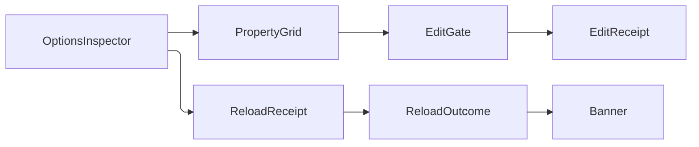

# [APPUI_INSPECTOR_EDITING]

Typed property inspection and value editing for product state: one `InspectorPolicy`-driven PropertyGrid admission capsule carrying its chrome seams, fourteen ranked `EditorFactory` rows under descriptor-driven presentation, an `EditFault`/`EditReceipt` commit rail with the preview-versus-commit law and the N-target fan, the options composite rebuilding an immutable record from its mutable draft, a conflict projection with in-editor hunk chrome, and grammar-scoped `CodePane` rows carrying the chrome bridge, the behavior plane, and a completion projection.

This page owns the editor-row axis, the edit fault and outcome vocabulary, the inspector policy and chrome values, the cell-state vocabulary, and the conflict and completion projections. Its spine is bodong.Avalonia.PropertyGrid, bodong.PropertyModels, Avalonia.Controls.ColorPicker, Avalonia.AvaloniaEdit with AvaloniaEdit.TextMate over TextMateSharp, UnitsNet, Thinktecture.Runtime.Extensions, NodaTime, System.Reactive, and LanguageExt.Core.

## [01]-[INDEX]

- [02]-[INSPECTOR_SURFACE]: PropertyGrid admission policy, chrome seams, descriptor filters, focus receipts, the commit veto and seal pair, the mixed-value and N-target fold.
- [03]-[EDITOR_FACTORIES]: Fourteen ranked editor rows with descriptor-driven presentation, the operation column, and the whole factory contract.
- [04]-[COMMIT_VALIDATION]: Typed admission rail, preview-commit law, edit receipts.
- [05]-[OPTIONS_INSPECTOR]: Options-to-grid binding, user-settings persist, reload banner.
- [06]-[CONFLICT_RESOLUTION]: Side-by-side conflict projection with hunk chrome, the four-side axis, the non-generic `ConflictIntent` verb roster, and the differ census verdict.
- [07]-[CODE_EDITING]: The editor chrome bridge, the behavior plane, grammar-scoped code panes, the fold-margin resync law, and the table-driven completion and overload projections.

## [02]-[INSPECTOR_SURFACE]

- Owner: `InspectorPolicy` policy record with `InspectorChrome` its seam family; `CellState` `[SmartEnum<string>]` the four-row cell vocabulary; `MergedCell` the multi-target read; `InspectorSurface` static boundary capsule.
- Cases: `CellState` = settled | edited | invalid | mixed, each carrying the pseudo-class the control theme selects on, so the fourth state is a row rather than a nullable flag beside the other three.
- Entry: `Mount(PropertyGrid grid, InspectorPolicy policy, object draft, ClockPolicy clocks, CorrelationId correlation, Action<EditReceipt> sink, Action<Error> fault)` — `IDisposable` detacher composed LIFO by the activation scope; `MergedCell.Read(PropertyCellContext)` is the one multi-target value read; `InspectorSurface.ApplyAll(PropertyCellContext, object?)` is the one N-target commit.
- Receipt: `EditReceipt` focus kind on the focus edge and edit kind on the commit pair — surface, member path, admitted editor row key, `Instant`, correlation; a merged cell seals `EditOutcome.Fanned` carrying the target count, distinct from the single cell's `Committed`, so one user action never increments two identically-named cells at the evidence fan; `TelemetryRow` contributes the edit-committed and edit-rejected instruments inward through the AppHost `TelemetryContributorPort`.
- Packages: bodong.Avalonia.PropertyGrid, bodong.PropertyModels, System.Reactive, NodaTime, LanguageExt.Core
- Growth: one policy value on `InspectorPolicy`, one seam on `InspectorChrome`, one cell state row; one inspector instrument is one `InstrumentSpec` row on `InspectorSurface.TelemetryRow`; zero new surface.
- Boundary: `Mount` is the page's PropertyGrid boundary capsule — the inspected draft binds through the grid's `DataContext` because `PropertyGridViewModel` is internal, and canonical typing re-enters through the editor adapter; `LayoutStyle`, `CellEdit`, and `Operations` are `InspectorPolicy` values over the catalogued `PropertyGridLayoutStyle { Tree, Inline }`, `CellEditAlignmentType { Default, Stretch, Compact }`, and `PropertyVisibility` domains; every grid event enters as `RoutedEventArgs`, narrows to its catalogued public event shape, and routes a mismatch through the supplied `Action<Error>` instead of a cast exception; `Admit` owns descriptor filtering while quick-filter, category, and read-only state remain policy values rather than mutable control state. The bound instance is a MUTABLE draft, never the immutable record it commits: `PropertyDescriptorBuilder(draft).GetProperties()` synthesizes the descriptor set over that one live instance and every editor write lands as `PropertyDescriptor.SetValue(draft, value)` in place, so an `init`-only record carries no write channel the grid can drive and the draft partial over `PropertyModels.ComponentModel.MiniReactiveObject` is mandatory rather than a convenience — `[05]` rebuilds the record from draft state at commit. A multi-object selection binds the SAME builder over an `IEnumerable` target, which merges only the descriptors `PropertyDescriptorBuilder.AllowMerge` admits — the BCL `MergablePropertyAttribute`, defaulting to allow — into `MultiObjectPropertyDescriptor` rows and drops the rest, so a merged cell is a declared capability of the descriptor set rather than a grid mode, and the header notice names the dropped remainder instead of leaving a shorter row list unexplained. `MultiObjectPropertyDescriptor.GetValue` returns NULL when its descriptors disagree, which is the same answer a uniformly null value gives, so mixed detection reads `GetValues(targets)` and folds distinctness — reading the merged `GetValue` renders every disagreeing cell as an empty editor a user would then commit over all N targets. Its `SetValue`, `ResetValue`, and `SetValues` hard-cast the component to `object[]` while `GetValue` accepts any `IEnumerable`, and `GetValues` allocates over `components.Length` while looping `Descriptors.Length`, so the target array crosses as an `object[]` whose length equals the descriptor count and a shorter array is refused before the call rather than at an index throw inside the package. `Target` is the ONE member-path projection both edges read — `PropertyGotFocusEventArgs.Context` is a `PropertyCellContext` whose `Property` is the same `System.ComponentModel.PropertyDescriptor` the command args carry, so a focus-shaped and a commit-shaped path column are one. `CommandExecuting` is the veto edge and `CommandExecuted` the commit seal: `AbstractCellEditFactory.SetPropertyValue` mints one `GenericCancelableCommand` per changed cell and raises executing, executes, then raises executed inside one synchronous frame, so `InspectorPolicy.Gate` — the composition-bound closure over `EditGate.Resolve` and `EditGate.Admit` — runs once per edge; the executing arm cancels through `RoutedCommandExecutingEventArgs.Canceled` and seals `EditOutcome.Rejected`, the executed arm seals `EditOutcome.Committed` or `EditOutcome.Fanned` under the admitted editor row key, and an executed arm whose gate refuses names a command that ran past the veto edge on the fault rail instead of sealing a second rejection. `InspectorChrome` is the whole restyle surface and each of its three seams exists because a style cannot reach that pixel: the grid builds one category `Expander` in code and pins `Background`, `Margin`, `Padding`, and `HeaderTemplate` through CLR setters at `BindingPriority.LocalValue`, outranking every `Style`, `ControlTheme`, and theme-variant setter aimed at those four, so the category card rides a `ControlTheme` replacing the unpinned `Template` — the replacement binds `Header` directly to escape the pinned header template, paints its own chrome to escape the null background, and names its presenter something other than `PART_ContentPresenter` because each Expander subscribes `TemplateApplied` at construction and force-writes that part's left margin on every application; `CustomNameBlock` is MANDATORY rather than optional because the shipped row label resolves its foreground once in a static constructor and holds it through every runtime variant change, so a dark pass without the substitution ships light-tuned labels that no theme swap can move; and the operation column takes `CustomPropertyOperationControl` for a whole replacement or the two-stage `CustomPropertyDefaultOperationEventArgs` at `Init` and `MenuOpening` for in-place button and menu edits. Per-row styling rides `[ControlClasses]` on the draft property, which `BuildPropertyControl` unions, distincts, and `Classes.AddRange`s onto the materialized editor before binding `CellEdit`/`Factory`, so a per-property restyle is one attribute plus one class `Style` and never a factory subclass; `CellState` writes its pseudo-class onto that same editor so the mixed and invalid presentations are theme rows rather than per-editor paint. The grid's `TopHeaderContent`, `MiddleContent`, and `BottomContent` are `StyledProperty<object>` slots the chrome fills, and the multi-select header notice lives in the top slot.

```csharp signature
// --- [TYPES] ----------------------------------------------------------------------------

// Four rows, one axis. The pseudo-class is the row's own column because the mixed and invalid presentations
// are control-theme selectors on the materialized editor, so a new state is a row plus a theme arm and never
// a nullable flag threaded beside the other three.
[SmartEnum<string>]
[KeyMemberEqualityComparer<ComparerAccessors.StringOrdinal, string>]
[KeyMemberComparer<ComparerAccessors.StringOrdinal, string>]
public sealed partial class CellState {
    public static readonly CellState Settled = new("settled", pseudo: ":settled");
    public static readonly CellState Edited = new("edited", pseudo: ":edited");
    public static readonly CellState Invalid = new("invalid", pseudo: ":invalid");
    public static readonly CellState Mixed = new("mixed", pseudo: ":mixed");

    public string Pseudo { get; }

    // One write per state change sets this row's class and clears every sibling, so an editor can never wear
    // two states at once and a stale `:mixed` cannot survive the write that unified the selection.
    public Unit Apply(Control editor) =>
        fun(() => Items.Iter(row => editor.Classes.Set(row.Pseudo, ReferenceEquals(row, this))))();
}

// The merged read. `Uniform` is `Some` only when every target agrees; the null the package's own `GetValue`
// returns for disagreement is indistinguishable from a uniformly null value, so this projection reads the
// per-target array instead and a genuinely null uniform value stays `Some(null)`.
// The DISPLAY-POSTURE reader seat. `Render/pipeline#VIEWPOINT_CODEC` `DisplayPosture.Project` runs no
// property query of its own — a posture arrives as resolved `(element, value)` pairs — and this is where
// those pairs come from. The descriptor set is the SAME merged one the grid renders, so the
// property a user picks to colour by is a property they can see, and a key the descriptor set does not carry
// refuses here rather than projecting a posture over values nothing answered.
public static class PostureSource {
    // The election roster: every merged descriptor that carries a value for every target, in the grid's own
    // order. A descriptor the merge dropped is unelectable by construction, which is the honest answer — a
    // posture over a property half the selection lacks would colour that half by absence.
    public static Seq<(string Key, string LabelKey)> Electable(Seq<MergedCell> cells) =>
        cells.Filter(static cell => cell.Uniform.IsSome || cell.Targets == 1)
            .Map(static cell => (cell.Descriptor.Name, LabelKey: cell.Descriptor.DisplayName));

    // The one scene read a posture consumes. Values cross as their invariant text because the posture's own
    // domain derivation classifies them — a categorical axis keys on the string and a sequential one parses
    // it — so this seat resolves and never interprets, and an element whose descriptor answers nothing is
    // DROPPED rather than carried as empty, since an empty string is a legitimate category value.
    public static Fin<Seq<(string ElementId, string Value)>> Read(
        string propertyKey, Seq<(string ElementId, object Target)> scene, ResolvedLocale locale) =>
        scene.Traverse(row => Optional(TypeDescriptor.GetProperties(row.Target)[propertyKey])
                .Map(descriptor => (row.ElementId, Value: Optional(descriptor.GetValue(row.Target))))
                .ToFin(new EditFault.Text($"posture/property:{propertyKey}"))
                .Map(found => (found.ElementId, Text: found.Value.Map(value => Spell(value, locale)))))
            .As()
            .Map(static rows => rows.Choose(static row =>
                row.Text.Map(text => (row.ElementId, Value: text))));

    // One spelling rail: a quantity crosses through the measurement policy so a posture legend and a
    // dimension label read the same units, everything else through the resolved culture.
    static string Spell(object value, ResolvedLocale locale) =>
        value is IQuantity quantity
            ? locale.Quantity(quantity, MeasureRole.Extent).IfFail(_ => string.Empty)
            : Convert.ToString(value, locale.Formats) ?? string.Empty;
}

public readonly record struct MergedCell(PropertyDescriptor Descriptor, int Targets, Option<object?> Uniform) {
    public CellState State => Targets > 1 && Uniform.IsNone ? CellState.Mixed : CellState.Settled;

    public static Fin<MergedCell> Read(PropertyCellContext context) =>
        (context.Property, context.Target) switch {
            (MultiObjectPropertyDescriptor merged, object[] targets) when targets.Length == merged.Count() =>
                merged.GetValues(targets) switch {
                    var values => Fin.Succ(new MergedCell(merged, targets.Length,
                        values.Distinct().Take(2).Count() is 1 ? Some(values[0]) : Option<object?>.None)),
                },
            (MultiObjectPropertyDescriptor merged, object[] targets) =>
                Fin.Fail<MergedCell>(new EditFault.Invariant(merged.Name,
                    $"{targets.Length} targets against {merged.Count()} merged descriptors")),
            (MultiObjectPropertyDescriptor merged, _) =>
                Fin.Fail<MergedCell>(new EditFault.Invariant(merged.Name, "merged cell target is not an object array")),
            _ => Fin.Succ(new MergedCell(context.Property, 1, Some(context.GetValue()))),
        };
}

// The three seams a style cannot reach, plus the three content slots. `Relabel` carries no `Option` because
// the shipped label's foreground is frozen in a static constructor: leaving the stock block is a light-tuned
// row no swap can move, so the substitution is the contract rather than a policy choice.
public sealed record InspectorChrome(
    Func<CustomNameBlockEventArgs, Control> Relabel,
    Func<CustomPropertyOperationControlEventArgs, Option<Control>> Operations,
    Action<CustomPropertyDefaultOperationEventArgs> DefaultOperation,
    Option<object> TopHeader,
    Option<object> Middle,
    Option<object> Bottom) {
    // The stock label re-minted against the token rail. The ink read is DYNAMIC — the observable re-pushes on
    // the same dictionary edit a XAML consumer rides — so a variant flip re-tints every row label, while the
    // resolved text row crosses as a value because the block is code-minted outside any style that could
    // inherit one.
    public static Func<CustomNameBlockEventArgs, Control> TokenLabel(TextStyleRow label) => args => {
        TextBlock block = new() {
            Text = args.Context.Property.DisplayName,
            VerticalAlignment = VerticalAlignment.Center,
            FontFamily = new FontFamily(label.Family),
            FontSize = label.Size,
            FontWeight = (FontWeight)label.Weight,
            LetterSpacing = label.Tracking * label.Size,
            TextWrapping = label.Wraps ? TextWrapping.Wrap : TextWrapping.NoWrap,
        };
        ignore(ThemeRail.Bind(block, TextBlock.ForegroundProperty, PaintRole.TextMuted.At(0)));
        return block;
    };

    // The category card. `Template` is the ONE unpinned member on the grid's code-built Expander, so the
    // whole card is a template replacement: the header binds through `Header` rather than the pinned
    // `HeaderTemplate`, the body paints its own surface rather than the pinned null background, and the
    // presenter carries a product name because the Expander force-writes `PART_ContentPresenter`'s left
    // margin on every `TemplateApplied`.
    public const string CategoryPresenter = "PART_CategoryBody";

    public static ControlTheme CategoryTheme() => new(typeof(Expander)) {
        Setters = {
            new Setter(TemplatedControl.TemplateProperty, CategoryTemplate()),
        },
    };

    static IControlTemplate CategoryTemplate() => new FuncControlTemplate<Expander>((expander, scope) => {
        ContentPresenter body = new() { Name = CategoryPresenter };
        Border card = new() { Child = new DockPanel { Children = { Header(expander), body } } };
        ignore(ThemeRail.Bind(card, Border.BackgroundProperty, PaintRole.Panel.At(0)));
        ignore(ThemeRail.Bind(card, Border.BorderBrushProperty, PaintRole.Separator.At(0)));
        body.RegisterInNameScope(scope);
        return card;
    });

    static Control Header(Expander expander) {
        ContentControl header = new() { [!ContentControl.ContentProperty] = expander[!HeaderedContentControl.HeaderProperty] };
        DockPanel.SetDock(header, Dock.Top);
        return header;
    }
}

public sealed record InspectorPolicy(
    bool ReadOnly,
    bool CategoriesVisible,
    bool QuickFilter,
    bool CategoriesExpanded,
    PropertyGridLayoutStyle LayoutStyle,
    CellEditAlignmentType CellEdit,
    PropertyVisibility Operations,
    string Surface,
    InspectorChrome Chrome,
    Action<CustomPropertyDescriptorFilterEventArgs> Admit,
    Func<PropertyDescriptor, string> Target,
    Func<RoutedCommandExecutedEventArgs, Validation<EditFault, string>> Gate);
```

```csharp signature
// --- [OPERATIONS] -----------------------------------------------------------------------

public static partial class InspectorSurface {
    public static IDisposable Mount(PropertyGrid grid, InspectorPolicy policy, object draft, ClockPolicy clocks, CorrelationId correlation, Action<EditReceipt> sink, Action<Error> fault) {
        // The bound instance is the MUTABLE draft the descriptor builder synthesizes over — every editor write
        // is an in-place `PropertyDescriptor.SetValue(draft, value)`, so binding the immutable record leaves the
        // grid with no write channel at all rather than a read-only view. A multi-target mount binds the
        // `object[]` the merged descriptors index against, never a bare list.
        grid.DataContext = draft;
        grid.IsReadOnly = policy.ReadOnly;
        grid.LayoutStyle = policy.LayoutStyle;
        grid.CellEditAlignment = policy.CellEdit;
        grid.IsCategoryVisible = policy.CategoriesVisible;
        grid.IsQuickFilterVisible = policy.QuickFilter;
        grid.AllCategoriesExpanded = policy.CategoriesExpanded;
        grid.PropertyOperationVisibility = policy.Operations;
        policy.Chrome.TopHeader.Iter(content => grid.TopHeaderContent = content);
        policy.Chrome.Middle.Iter(content => grid.MiddleContent = content);
        policy.Chrome.Bottom.Iter(content => grid.BottomContent = content);
        grid.Styles.Add(new Style(static selector => selector.OfType<Expander>()) {
            Setters = { new Setter(StyledElement.ThemeProperty, InspectorChrome.CategoryTheme()) },
        });
        EventHandler<RoutedEventArgs> admit = (_, args) => ignore(args is CustomPropertyDescriptorFilterEventArgs admitted
            ? fun(() => policy.Admit(admitted))()
            : fun(() => fault(new EditFault.UnmatchedShape(args.GetType().Name)))());
        EventHandler<RoutedEventArgs> focus = (_, args) => ignore(args is PropertyGotFocusEventArgs focused
            ? fun(() => sink(new EditReceipt(
                Kind: EditReceipt.FocusKind,
                Surface: policy.Surface,
                Target: policy.Target(focused.Context.Property),
                Editor: string.Empty,
                Outcome: new EditOutcome.Observed(),
                At: clocks.Now,
                Correlation: correlation)))()
            : fun(() => fault(new EditFault.UnmatchedShape(args.GetType().Name)))());
        // `RoutedCommandExecutingEventArgs` EXTENDS the executed args, so the veto arm narrows to the DERIVED
        // type — a base-typed probe accepts this edge, never reaches `Canceled`, and every refused admission
        // commits anyway.
        EventHandler<RoutedEventArgs> gate = (_, args) => ignore(args is RoutedCommandExecutingEventArgs pending
            ? policy.Gate(pending).Match(
                Succ: static _ => unit,
                Fail: refusal => (pending.Canceled = true, fun(() => sink(
                    Sealed(policy, pending, string.Empty, new EditOutcome.Rejected(refusal), clocks, correlation)))()).Item2)
            : fun(() => fault(new EditFault.UnmatchedShape(args.GetType().Name)))());
        // The grid raises executing, executes, then raises executed inside ONE `ExecuteCommand` frame, so this
        // arm re-reads the same pure gate the veto edge admitted through; a refusal here names a command that
        // ran past that edge — a composition defect on the fault rail, never a second rejection receipt. The
        // outcome discriminates on ARITY: one merged `SetValue` fans across N targets inside the package, so
        // the fan is one command and one receipt whose case carries the count.
        EventHandler<RoutedEventArgs> commit = (_, args) => ignore(args is RoutedCommandExecutedEventArgs done
            ? policy.Gate(done).Match(
                Succ: editor => fun(() => sink(
                    Sealed(policy, done, editor, Outcome(done, editor), clocks, correlation)))(),
                Fail: refusal => fun(() => fault(new EditFault.Invariant(
                    policy.Target(done.Property), $"committed past the veto edge: {refusal.Message}")))())
            : fun(() => fault(new EditFault.UnmatchedShape(args.GetType().Name)))());
        // MANDATORY, not decorative: the shipped label freezes its foreground in a static constructor, so a
        // grid without this handler paints light-tuned row names under every variant.
        EventHandler<RoutedEventArgs> relabel = (_, args) => ignore(args is CustomNameBlockEventArgs named
            ? fun(() => named.CustomNameBlock = policy.Chrome.Relabel(named))()
            : fun(() => fault(new EditFault.UnmatchedShape(args.GetType().Name)))());
        // Assigning replaces the operation column outright; leaving it unset keeps the built-in button, which
        // then raises the default-operation edge twice — once at `Init` for the reset verb and override badge,
        // once per `MenuOpening` for the menu rows.
        EventHandler<RoutedEventArgs> operations = (_, args) => ignore(args switch {
            CustomPropertyOperationControlEventArgs column =>
                fun(() => policy.Chrome.Operations(column).Iter(control => column.CustomControl = control))(),
            CustomPropertyDefaultOperationEventArgs staged => fun(() => policy.Chrome.DefaultOperation(staged))(),
            _ => fun(() => fault(new EditFault.UnmatchedShape(args.GetType().Name)))(),
        });
        grid.CustomPropertyDescriptorFilter += admit;
        grid.PropertyGotFocus += focus;
        grid.CommandExecuting += gate;
        grid.CommandExecuted += commit;
        grid.CustomNameBlock += relabel;
        grid.CustomPropertyOperationControl += operations;
        grid.CustomPropertyOperationMenuOpening += operations;
        return Disposable.Create(() => {
            grid.CustomPropertyDescriptorFilter -= admit;
            grid.PropertyGotFocus -= focus;
            grid.CommandExecuting -= gate;
            grid.CommandExecuted -= commit;
            grid.CustomNameBlock -= relabel;
            grid.CustomPropertyOperationControl -= operations;
            grid.CustomPropertyOperationMenuOpening -= operations;
        });
    }

    // Both commit edges seal one shape differing only in outcome and editor key, so the two arms above spell
    // that difference and nothing else; `RoutedCommandExecutingEventArgs` binds here through its base.
    private static EditReceipt Sealed(InspectorPolicy policy, RoutedCommandExecutedEventArgs args, string editor, EditOutcome outcome, ClockPolicy clocks, CorrelationId correlation) =>
        new(EditReceipt.EditKind, policy.Surface, policy.Target(args.Property), editor, outcome, clocks.Now, correlation);

    private static EditOutcome Outcome(RoutedCommandExecutedEventArgs args, string editor) =>
        (args.Property, args.Target) switch {
            (MultiObjectPropertyDescriptor merged, object[] targets) when targets.Length > 1 =>
                new EditOutcome.Fanned(editor, targets.Length),
            _ => new EditOutcome.Committed(editor),
        };

    // ONE write drives the whole fan: the merged descriptor's own `SetValue` loops its child descriptors, so
    // routing through the cell's factory mints one cancelable command, crosses one veto edge, enqueues one
    // recorder entry, and seals one receipt. A per-target loop over `SetPropertyValue` would mint N commands,
    // N veto edges, and N undo steps for one user gesture.
    public static Fin<Unit> ApplyAll(PropertyCellContext context, object? value) =>
        context.Factory is ICellEditFactory factory
            ? Try.lift(() => { factory.SetPropertyValue(context, value); return unit; }).Run()
                .MapFail(static error => (Error)new EditFault.Text(error.Message))
            : Fin.Fail<Unit>(new EditFault.Invariant(context.Property.Name, "cell carries no materialized factory"));

    // The header notice names BOTH halves of the merge: how many targets the selection carries and how many
    // declared members the merge dropped, because a shorter row list with no explanation reads as a bug.
    public static string MergeNotice(PropertyDescriptorBuilder builder, int targets) =>
        toSeq(builder.GetProperties().Cast<PropertyDescriptor>()) switch {
            var merged => $"{targets} targets · {merged.Count} shared · {merged.Count(static row => row.IsReadOnly)} read-only",
        };

    public const string CommittedInstrument = "rasm.appui.edit.committed";
    public const string RejectedInstrument = "rasm.appui.edit.rejected";

    public static TelemetryContributorPort TelemetryRow(string version) =>
        AppUiTelemetry.Contribute(version,
            InstrumentSpec.Create(CommittedInstrument, InstrumentKind.Count, MeasureForm.Whole, "{edit}",
                "edits committed by surface", Seq(AppUiTelemetry.SurfaceSlot), None, None, None),
            InstrumentSpec.Create(RejectedInstrument, InstrumentKind.Count, MeasureForm.Whole, "{edit}",
                "edits rejected by surface", Seq(AppUiTelemetry.SurfaceSlot), None, None, None));
}
```

## [03]-[EDITOR_FACTORIES]

- Owner: `ComparerAccessors.StringOrdinalIgnoreCase` accessor; `EditorFactory` `[SmartEnum<string>]` fourteen rows; `Presentation` the descriptor-attribute fold; `PropertyFilter` the visibility argument; `EditorRowFactory` — the ONE public `AbstractCellEditFactory` adapter every custom row rides.
- Cases: quantity, value-object, optional, temporal, identifier, color, flags, choice, path, collection, boolean, numeric, text, nested — rank equals declaration order, the match walk takes the first accepting row, and nested is the reference-record fallback.
- Entry: `Match(PropertyDescriptor descriptor, EditorAdapter adapter)` is the ranked `Option<EditorFactory>` walk; `Presentation.Read(PropertyDescriptor)` is the declaration fold every presented control consumes; `EditorRowFactory.Register(EditorAdapter adapter)` installs the one public custom factory and returns its removal scope.
- Auto: generated `Items` ordering and key factories sit under `[ValidationError<EditFault>]`; `Accepts(PropertyDescriptor, EditorAdapter)` is the ONE row delegate column and carries the whole predicate including the adapter, so every row — the two that read generated-owner recognition as much as the twelve that read the declaration alone — answers from its own declaration and an adapter-dependent row is a row rather than a hand-written identity arm; `EditorAdapter` owns generated-owner recognition, control presentation, refresh, read-only routing, and filter visibility at composition.
- Packages: bodong.Avalonia.PropertyGrid, bodong.PropertyModels, Avalonia.Controls.ColorPicker, UnitsNet, NodaTime, Thinktecture.Runtime.Extensions, LanguageExt.Core, BCL inbox
- Growth: one editor row on `EditorFactory` (key, rank, accept predicate, present column); one presentation axis is one column on `Presentation`; zero new surface — per-shape editor controls and per-`[ValueObject]` editor classes are deleted by the value-object and quantity rows.
- Boundary: the shipped concrete factories under `Avalonia.PropertyGrid.Controls.Factories.Builtins` are public and subclassable, so a narrowed editor derives the nearest built-in and raises `ImportPriority` rather than re-implementing its base; the product's own rows need none of them and ride one public `EditorRowFactory : AbstractCellEditFactory` registered through `CellEditFactoryService.Default.AddFactory`, which re-sorts the set by descending `ImportPriority` and back-links `Collection`. `Accept(object accessToken)` gates CLONING, never cell building: `BuildPropertyControl` walks the priority order calling `HandleNewProperty` and takes the first non-null answer, while `CloneFactories(accessToken)` filters on `Accept` before cloning each factory into a grid's own set — so a custom `Accept` narrowing to the inspected TYPE returns false for the grid access token the package passes, and the factory never enters any grid's set at all. The base predicate `accessToken is PropertyGrid` is therefore the correct one and this adapter does not override it; shape selection lives entirely in `HandleNewProperty`. `Clone()` MUST be overridden because the base mints through `Activator.CreateInstance(GetType())`, which throws for a constructor taking the adapter; `HandleReadOnlyStateChanged` MUST be overridden wherever a composite editor needs its write leg disabled rather than its whole body greyed, because the base assigns `IsEnabled` on the returned root; `HandlePropagateVisibility` MUST be overridden to answer the quick filter, because the base returns null and defers to the default match, which cannot see a mixed cell or a row whose declaration hid it. `EditorAdapter` binds generated-owner recognition and complete control presentation at composition, so no `Thinktecture.Internal` metadata or hollow unbound control enters the page. `PropertyCellContext` carries exactly two channels the adapter reads and one it writes: `Property` is the descriptor channel (a `System.ComponentModel.PropertyDescriptor`, whose `PropertyType` and attribute set select the row and its presentation), `GetValue()` is the value channel (reading `Property.GetValue(Target)`, so a presented control seeds from the context rather than a caller-held copy), and `Target` is the instance every write lands on; `CellEdit` and `Factory` hold the materialized editor and its owning factory, so a refresh addresses the live control instead of re-minting one. `SetPropertyValue` is the ONE write channel a presented control commits through — it mints the `GenericCancelableCommand` the `Editing/history#EDIT_HISTORY` recorder records and raises the `CommandExecuting`/`CommandExecuted` pair `[04]`'s veto and seal ride — so a control writing `context.Property.SetValue(context.Target, value)` directly bypasses the admission gate and the undo window at once, which is why `Present` receives that channel bound rather than the raw descriptor. Presentation is DECLARATION-DRIVEN: `Presentation.Read` folds the shipped attribute vocabulary into one value so an integer with `[Trackable]` presents a drag slider, a string with `[MultilineText]` presents a text area, a double with `[FloatPrecision]` carries its increment and format, and a path with `[PathBrowsable]` carries its dialog shape — the row selects the FAMILY and the presentation selects the FORM, so a presentation knob never becomes a fifteenth row. Enum filtering reads the ONE `IEnumValueAuthorizeAttribute` contract rather than the four permit and prohibit attribute types, because all four implement `AllowValue(Type, string, object)` and a per-attribute ladder would re-derive that polymorphism at the call site. The flags row binds `CheckedMaskModel(masks, all)` — the shipped bit-mask multi-select over `MiniReactiveObject` whose `CheckChanged` event, `BeginUpdate`/`EndUpdate` pair, and `IsAllChecked` roll-up are authoritative — through `CheckedListEdit`, so a hand-rolled flags editor and a per-flag boolean row are both deleted. Optional admission covers `Option<T>` and `Nullable<T>`; temporal admission covers the NodaTime and BCL date/time families; identifier admission covers `Guid` and `Uri`; numeric admission includes `Half`, `Int128`, and `UInt128`; and color rows bind `PreviewableColorPicker` against `TokenPalette`, the `IColorPalette` re-cut from the resolved ladder, whose swatches carry the product's own roles instead of the shipped Fluent, Material, and Flat sets — the palette holds resolved values and therefore rides the `Rematerialize.SwatchSource` roster the theme swap rebuilds. Every editor a row presents carries its `CellState` pseudo-class, so a mixed cell renders its indeterminate form from the control theme and each row states its mixed presentation as a column rather than a control-side branch.

```csharp signature
// --- [MODELS] ---------------------------------------------------------------------------

// The declaration fold. One value carries every presentation axis the shipped attribute vocabulary spells, so
// a presented control reads its whole form here and the row set stays a FAMILY axis. Enum filtering folds the
// one `IEnumValueAuthorizeAttribute` contract the permit and prohibit attributes both implement, so admitting
// a fifth filter attribute changes nothing at this seam.
public readonly record struct Presentation(
    Option<(double Min, double Max)> Range,
    Option<double> Increment,
    Option<string> Format,
    bool Trackable,
    bool Spinner,
    Option<(double Min, double Max, bool Text)> Progress,
    Option<string> Watermark,
    bool Multiline,
    Option<string> Unit,
    Option<PathBrowsableAttribute> Browse,
    Option<ImagePreviewModeAttribute> Preview,
    Seq<string> Classes,
    Func<Type, string, object, bool> AdmitsMember) {
    public static Presentation Read(PropertyDescriptor descriptor) {
        Seq<Attribute> declared = toSeq(descriptor.Attributes.Cast<Attribute>());
        Option<TrackableAttribute> track = One<TrackableAttribute>(declared);
        Option<ProgressAttribute> progress = One<ProgressAttribute>(declared);
        Option<FloatPrecisionAttribute> precision = One<FloatPrecisionAttribute>(declared);
        Option<IntegerIncrementAttribute> step = One<IntegerIncrementAttribute>(declared);
        Seq<IEnumValueAuthorizeAttribute> filters = toSeq(declared.OfType<IEnumValueAuthorizeAttribute>());
        return new Presentation(
            Range: track.Map(static row => (row.Minimum, row.Maximum)),
            Increment: track.Map(static row => row.Increment)
                | precision.Map(static row => (double)row.Increment)
                | step.Map(static row => (double)row.Increment),
            Format: track.Map(static row => row.FormatString)
                | precision.Map(static row => row.FormatString)
                | progress.Map(static row => row.FormatString),
            Trackable: track.IsSome,
            Spinner: track.Exists(static row => row.AllowSpin || row.ShowButtonSpinner),
            Progress: progress.Map(static row => (row.Minimum, row.Maximum, row.ShowProgressText)),
            Watermark: One<WatermarkAttribute>(declared).Map(static row => row.Watermark),
            Multiline: One<MultilineTextAttribute>(declared).Exists(static row => row.IsMultiline),
            Unit: One<UnitAttribute>(declared).Map(static row => row.Unit),
            Browse: One<PathBrowsableAttribute>(declared),
            Preview: One<ImagePreviewModeAttribute>(declared),
            Classes: toSeq(declared.OfType<ControlClassesAttribute>()).Bind(static row => toSeq(row.Classes)).Distinct(),
            // Every admitted filter must agree, so permits and prohibits compose as a conjunction and the
            // absent-filter case admits everything without a null branch at the call site.
            AdmitsMember: (owner, member, value) => filters.ForAll(filter => filter.AllowValue(owner, member, value)));
    }

    // `OfType` is the LINQ filter and answers `IEnumerable<T>` — a shape carrying no carrier witness, so
    // neither the `Option`-shaped `Head` nor `Exists` nor a `Bind` landing back on `Seq` reaches it, and the
    // carrier publishes no `ToSeq` member for it either. One `toSeq` re-entry is the whole crossing, and
    // folding it here keeps nine declaration reads spelling one thing.
    static Option<TAttribute> One<TAttribute>(Seq<Attribute> declared) where TAttribute : Attribute =>
        toSeq(declared.OfType<TAttribute>()).Head;
}

// The quick-filter argument as one value, so the row column stays three-wide against a package member that
// grew two optional parameters and would otherwise leak both into every delegate signature.
public readonly record struct PropertyFilter(IPropertyGridFilterContext Context, string Text, bool ParentMatched);

// `Present` receives the BOUND write channel, never the descriptor: a control that commits through the fourth
// argument mints the recorder's cancelable command and raises the gate pair, where a direct
// `context.Property.SetValue(context.Target, value)` would land the value past both. `Refresh` re-seeds the
// live `context.CellEdit` from the merged read and answers whether it handled the change; `ReadOnly` answers
// whether the row owns the disable, so an unhandled cell falls to the package's own root-level `IsEnabled`.
public sealed record EditorAdapter(
    Func<Type, bool> ValueObject,
    Func<Type, bool> SmartEnum,
    Func<EditorFactory, PropertyCellContext, Presentation, Action<object?>, Option<Control>> Present,
    Func<EditorFactory, PropertyCellContext, Presentation, bool> Refresh,
    Func<Control, bool, bool> ReadOnly,
    Func<EditorFactory, PropertyCellContext, PropertyFilter, Option<PropertyVisibility>> Visible);

// The swatch source re-cut from the resolve. `IColorPalette` hands back fixed `Color` values with no way to
// observe a dictionary edit, which is exactly why it rides `Rematerialize.SwatchSource`: the swap rebuilds
// this instance rather than expecting it to re-resolve.
public sealed class TokenPalette(ResolvedTheme resolved, Seq<PaintRole> roles, int rungs) : IColorPalette {
    public int ColorCount => roles.Count;

    public int ShadeCount => rungs;

    public Color GetColor(int colorIndex, int shadeIndex) =>
        roles.Skip(colorIndex).Head
            .Bind(role => resolved.Paint(role, shadeIndex))
            .IfNone(() => resolved.Accent);
}
```

```csharp signature
// --- [TYPES] ----------------------------------------------------------------------------

[SmartEnum<string>]
[ValidationError<EditFault>]
[KeyMemberEqualityComparer<ComparerAccessors.StringOrdinalIgnoreCase, string>]
[KeyMemberComparer<ComparerAccessors.StringOrdinalIgnoreCase, string>]
public sealed partial class EditorFactory {
    public static readonly EditorFactory Quantity = new("quantity", rank: 10, accepts: AcceptQuantity, custom: true);
    public static readonly EditorFactory Value = new("value-object", rank: 20, accepts: AcceptValueObject, custom: true);
    public static readonly EditorFactory Optional = new("optional", rank: 30, accepts: AcceptOptional, custom: true);
    public static readonly EditorFactory Temporal = new("temporal", rank: 40, accepts: AcceptTemporal, custom: true);
    public static readonly EditorFactory Identifier = new("identifier", rank: 50, accepts: AcceptIdentifier, custom: true);
    public static readonly EditorFactory Color = new("color", rank: 60, accepts: AcceptColor, custom: true);
    public static readonly EditorFactory Flags = new("flags", rank: 65, accepts: AcceptFlags, custom: true);
    public static readonly EditorFactory Choice = new("choice", rank: 70, accepts: AcceptChoice, custom: true);
    public static readonly EditorFactory Path = new("path", rank: 80, accepts: AcceptPath, custom: false);
    public static readonly EditorFactory Collection = new("collection", rank: 90, accepts: AcceptCollection, custom: false);
    public static readonly EditorFactory Boolean = new("boolean", rank: 100, accepts: AcceptBoolean, custom: false);
    public static readonly EditorFactory Numeric = new("numeric", rank: 110, accepts: AcceptNumeric, custom: false);
    public static readonly EditorFactory Text = new("text", rank: 120, accepts: AcceptText, custom: false);
    public static readonly EditorFactory Nested = new("nested", rank: 130, accepts: AcceptNested, custom: false);

    public int Rank { get; }
    public bool Custom { get; }

    // The delegate column carries the WHOLE predicate — the descriptor and the adapter — so every row answers
    // from its own value: the two adapter-dependent rows are row values like the twelve declaration-only ones,
    // and a row keying on a declaration attribute rather than a shape is a row rather than a branch. A ladder
    // beside the column forced `Value` to declare a constant no shape could satisfy and left `Choice`'s
    // declared predicate uninvoked while a duplicate ran inline — two rows whose declarations were decoration.
    [UseDelegateFromConstructor]
    public partial bool Accepts(PropertyDescriptor descriptor, EditorAdapter adapter);

    // The ordered run re-enters the carrier through `toSeq` before `Find` reads it: `OrderBy` answers an
    // `IOrderedEnumerable`, which carries no `K<Seq, A>` witness and therefore reaches none of the
    // carrier-generic reads — the walk has to be a `Seq` again before it can be searched as one.
    public static Option<EditorFactory> Match(PropertyDescriptor descriptor, EditorAdapter adapter) =>
        toSeq(Items.OrderBy(static row => row.Rank)).Find(row => row.Accepts(descriptor, adapter));

    private static readonly FrozenSet<Type> NumericShapes = new[] {
        typeof(byte), typeof(sbyte), typeof(short), typeof(ushort), typeof(int), typeof(uint),
        typeof(long), typeof(ulong), typeof(Int128), typeof(UInt128), typeof(Half), typeof(float), typeof(double), typeof(decimal),
    }.ToFrozenSet();

    private static readonly FrozenSet<Type> TemporalShapes = new[] {
        typeof(Instant), typeof(LocalDate), typeof(LocalDateTime), typeof(LocalTime), typeof(OffsetDateTime),
        typeof(ZonedDateTime), typeof(Duration), typeof(Period), typeof(DateInterval), typeof(DateOnly), typeof(TimeOnly), typeof(DateTimeOffset),
    }.ToFrozenSet();

    private static readonly FrozenSet<Type> IdentifierShapes = new[] { typeof(Guid), typeof(Uri) }.ToFrozenSet();

    // Generated-owner recognition is the adapter's, so the two rows that need it read it off the column's
    // second argument; the twelve declaration-only rows discard it by name.
    private static bool AcceptValueObject(PropertyDescriptor row, EditorAdapter adapter) => adapter.ValueObject(row.PropertyType);
    private static bool AcceptChoice(PropertyDescriptor row, EditorAdapter adapter) => row.PropertyType.IsEnum || adapter.SmartEnum(row.PropertyType);
    private static bool AcceptQuantity(PropertyDescriptor row, EditorAdapter _) => typeof(IQuantity).IsAssignableFrom(row.PropertyType);
    private static bool AcceptOptional(PropertyDescriptor row, EditorAdapter _) => row.PropertyType is { IsGenericType: true }
        && (row.PropertyType.GetGenericTypeDefinition() == typeof(Option<>) || row.PropertyType.GetGenericTypeDefinition() == typeof(Nullable<>));
    private static bool AcceptTemporal(PropertyDescriptor row, EditorAdapter _) => TemporalShapes.Contains(row.PropertyType);
    private static bool AcceptIdentifier(PropertyDescriptor row, EditorAdapter _) => IdentifierShapes.Contains(row.PropertyType);
    private static bool AcceptColor(PropertyDescriptor row, EditorAdapter _) => row.PropertyType == typeof(Avalonia.Media.Color);
    // The flags arm precedes the plain choice arm because a `[Flags]` enum satisfies BOTH and the mask editor
    // is the one that can express a combination; ranking them the other way makes the mask model unreachable.
    private static bool AcceptFlags(PropertyDescriptor row, EditorAdapter _) =>
        row.PropertyType.IsEnum && row.PropertyType.IsDefined(typeof(FlagsAttribute), inherit: false);
    private static bool AcceptPath(PropertyDescriptor row, EditorAdapter _) =>
        typeof(FileSystemInfo).IsAssignableFrom(row.PropertyType) || Presentation.Read(row).Browse.IsSome;
    private static bool AcceptCollection(PropertyDescriptor row, EditorAdapter _) =>
        row.PropertyType != typeof(string) && typeof(IEnumerable).IsAssignableFrom(row.PropertyType);
    private static bool AcceptBoolean(PropertyDescriptor row, EditorAdapter _) => row.PropertyType == typeof(bool);
    private static bool AcceptNumeric(PropertyDescriptor row, EditorAdapter _) => NumericShapes.Contains(row.PropertyType);
    private static bool AcceptText(PropertyDescriptor row, EditorAdapter _) => row.PropertyType == typeof(string);
    private static bool AcceptNested(PropertyDescriptor row, EditorAdapter _) => row.PropertyType is { IsClass: true, IsAbstract: false };
}

// EditorRowFactory is the ONE public adapter and implements the WHOLE contract: `Accept` stays the base's
// grid-token predicate because it gates cloning rather than cell building, `Clone` is overridden because the
// base mints through `Activator.CreateInstance` and this type takes its adapter, and read-only and visibility
// route through the adapter so a composite editor and a mixed cell each answer for themselves.
public sealed class EditorRowFactory(EditorAdapter adapter) : AbstractCellEditFactory {
    public override int ImportPriority => 200;

    public static IDisposable Register(EditorAdapter adapter) {
        EditorRowFactory factory = new(adapter);
        CellEditFactoryService.Default.AddFactory(factory);
        return Disposable.Create(() => CellEditFactoryService.Default.RemoveFactory(factory));
    }

    public override ICellEditFactory Clone() => new EditorRowFactory(adapter);

    public override Control? HandleNewProperty(PropertyCellContext context) =>
        EditorFactory.Match(context.Property, adapter)
            .Filter(static row => row.Custom)
            .Bind(row => adapter.Present(row, context, Presentation.Read(context.Property), value => SetPropertyValue(context, value)))
            .Map(control => Stated(context, control))
            .ValueUnsafe();

    public override bool HandlePropertyChanged(PropertyCellContext context) =>
        EditorFactory.Match(context.Property, adapter)
            .Filter(static row => row.Custom)
            .Exists(row => adapter.Refresh(row, context, Presentation.Read(context.Property))
                && Optional(context.CellEdit).Map(control => Stated(context, control)).IsSome);

    // The base assigns `IsEnabled` on the returned root, which greys a composite editor's label and unit
    // affordance along with its write leg; a row that owns a finer disable answers true and the unowned case
    // still falls to the package behaviour rather than losing it.
    public override void HandleReadOnlyStateChanged(Control control, bool readOnly) {
        if (!adapter.ReadOnly(control, readOnly)) { base.HandleReadOnlyStateChanged(control, readOnly); }
    }

    // The base returns null and defers to the default match, which cannot see a mixed cell or a row whose
    // declaration hid it; the two optional parameters are the package's own and cross as one filter value.
    public override PropertyVisibility? HandlePropagateVisibility(
        object? target, PropertyCellContext context, IPropertyGridFilterContext filterContext,
        string? filterText = null, bool filterMatchesParentCategory = false) =>
        EditorFactory.Match(context.Property, adapter)
            .Filter(static row => row.Custom)
            .Bind(row => adapter.Visible(row, context, new PropertyFilter(filterContext, filterText ?? string.Empty, filterMatchesParentCategory)))
            .ValueUnsafe();

    // Every materialized editor wears its cell state as a pseudo-class, so the mixed and invalid forms are
    // control-theme arms and no editor branches on multiplicity while painting.
    private static Control Stated(PropertyCellContext context, Control control) {
        ignore(MergedCell.Read(context).Map(cell => cell.State.Apply(control)));
        return control;
    }
}
```

## [04]-[COMMIT_VALIDATION]

- Owner: `EditFault` `[Union]` fault family on the doctrine `Expected` shape with the dual-tier `Create` contract; `EditOutcome` `[Union]`; `EditReceipt` record; `EditGate` static admission surface.
- Cases: `EditFault` Text, Parse, Invariant, UnmatchedShape, StoreRejected, HostRejected, Aggregate, ResolutionAbsent — codes derive through the `AppUiFaultBand.Edit` registry row and `Aggregate` carries child codes in its payload; `EditOutcome` Observed, Committed, Fanned, Persisted, Reverted, Redone, Rejected, HostRouted, each carrying exactly the evidence its arm consumes — `Committed` the admitted editor row key of one property cell, `Fanned` that key beside the target count of one merged write, `Persisted` the settings section one durable write landed.
- Entry: `Admit<TOwner, TRaw, TError>(string target, TRaw raw, IFormatProvider? culture = null)` — `Validation<EditFault,TOwner>` accumulates; `Resolve(PropertyDescriptor descriptor, EditorAdapter adapter)` lifts an unmatched declaration onto the same rail.
- Receipt: `EditReceipt` — kind, surface, target, editor row key, outcome, `Instant`, `CorrelationId`.
- Packages: Thinktecture.Runtime.Extensions, UnitsNet, NodaTime, LanguageExt.Core
- Growth: one case on `EditFault` or `EditOutcome`; zero new surface.
- Boundary: preview interactions (`PreviewColorChanged` on `PreviewableColorPicker`, `PreviewValueChanged` on `PreviewableSlider`, transient editor control state) mutate nothing durable and emit nothing; the grid's `CommandExecuting` event carries `RoutedCommandExecutingEventArgs` with a settable `Canceled` — `InspectorPolicy.Gate` is the composition-bound closure that invokes `Resolve` then `Admit` there and vetoes a failing admission — and `CommandExecuted` carries `RoutedCommandExecutedEventArgs` (`Command`, `Target`, `Property`, `OldValue`, `NewValue`, `Context`, all readonly fields) and sinks exactly one `EditReceipt` per commit — the executing-versus-executed split is the whole debounce law, with `ColorChanged` and `RealValueChanged` as the two pickers' commit edges; `Admit` reaches the grid only through that `Gate` closure, because a generic self-constrained factory contract cannot bind at an `EventHandler<RoutedEventArgs>` seam and the owner type is known only where the section is composed; the value-object leg is the doctrine `Validate` bridge, so `Create`/`TryCreate` call sites and per-call-site error translation are deleted; quantity admission parses through `Quantity.TryParse` with explicit culture and unit lists present through `QuantityInfo`/`UnitInfo` from `Quantity.Infos`; `ValidateProperty` text renders through the screen validation rail's own `FieldErrors` slot stream and its `Gate` context-validity stream gates commit intents (`Shell/screens#VALIDATION_UX`) — a second validation rail is deleted; a refused admission drives `CellState.Invalid` onto the live editor so the invalid presentation is a theme arm rather than a per-editor paint; host-mutating edits route through the abstract document-transaction surface-host port the app root binds to the host, undo-scoped, and `HostRouted` carries that hop's correlation.

```csharp signature
[Union]
public abstract partial record EditFault : Expected, IValidationError<EditFault>, Semigroup<EditFault> {
    private EditFault(string detail, int code) : base(detail, code, None) { }

    public static EditFault Create(string message) => new Text(message);

    public sealed record Text : EditFault { public Text(string detail) : base(detail, AppUiFaultBand.Edit.Code(0)) { } }
    public sealed record Parse : EditFault {
        public Parse(string target, string detail) : base($"{target}: {detail}", AppUiFaultBand.Edit.Code(1)) => Target = target;
        public string Target { get; }
    }
    public sealed record Invariant : EditFault {
        public Invariant(string target, string detail) : base($"{target}: {detail}", AppUiFaultBand.Edit.Code(2)) => Target = target;
        public string Target { get; }
    }
    public sealed record UnmatchedShape : EditFault {
        public UnmatchedShape(string shape) : base($"{shape}: no editor row", AppUiFaultBand.Edit.Code(3)) => Shape = shape;
        public string Shape { get; }
    }
    public sealed record StoreRejected : EditFault {
        public StoreRejected(string target, string detail) : base($"{target}: {detail}", AppUiFaultBand.Edit.Code(4)) => Target = target;
        public string Target { get; }
    }
    public sealed record HostRejected : EditFault {
        public HostRejected(string target, string detail) : base($"{target}: {detail}", AppUiFaultBand.Edit.Code(5)) => Target = target;
        public string Target { get; }
    }
    public sealed record Aggregate : EditFault {
        public Aggregate(Seq<EditFault> faults) : base($"{faults.Count} faults", AppUiFaultBand.Edit.Code(6)) => Faults = faults;
        public Seq<EditFault> Faults { get; }
    }
    public sealed record ResolutionAbsent : EditFault {
        public ResolutionAbsent(Seq<int> hunks) : base($"unresolved conflict hunks: {string.Join(",", hunks)}", AppUiFaultBand.Edit.Code(7)) => Hunks = hunks;
        public Seq<int> Hunks { get; }
    }

    public EditFault Combine(EditFault rhs) => (this, rhs) switch {
        (Aggregate l, Aggregate r) => new Aggregate(l.Faults + r.Faults),
        (Aggregate l, _) => new Aggregate(l.Faults.Add(rhs)),
        (_, Aggregate r) => new Aggregate(this.Cons(r.Faults)),
        _ => new Aggregate(Seq(this, rhs)),
    };
}

// `Fanned` is a CASE, not a count field on `Committed`: the evidence fan routes on outcome alone, so a
// one-target commit and an N-target fan sharing one case would make a batch indistinguishable from a single
// edit at every consumer that reads the case and not the payload.
[Union(ConversionFromValue = ConversionOperatorsGeneration.None)]
public abstract partial record EditOutcome {
    private EditOutcome() { }

    public sealed record Observed : EditOutcome;
    public sealed record Committed(string Editor) : EditOutcome;
    public sealed record Fanned(string Editor, int Targets) : EditOutcome;
    public sealed record Persisted(string Section) : EditOutcome;
    public sealed record Reverted(string Editor) : EditOutcome;
    public sealed record Redone(string Editor) : EditOutcome;
    public sealed record Rejected(EditFault Fault) : EditOutcome;
    public sealed record HostRouted(CorrelationId Transaction) : EditOutcome;
}

public sealed record EditReceipt(
    string Kind,
    string Surface,
    string Target,
    string Editor,
    EditOutcome Outcome,
    Instant At,
    CorrelationId Correlation) {
    public const string FocusKind = "focus";
    public const string EditKind = "edit";
    public const string OptionsKind = "options";
    public const string ConflictKind = "conflict";
}

public static class EditGate {
    public static Validation<EditFault, TOwner> Admit<TOwner, TRaw, TError>(string target, TRaw raw, IFormatProvider? culture = null)
        where TOwner : IObjectFactory<TOwner, TRaw, TError>
        where TRaw : notnull, allows ref struct
        where TError : Expected, IValidationError<TError> {
        TError? fault = TOwner.Validate(raw, culture, out TOwner? owner);
        return fault is not null
            ? (Validation<EditFault, TOwner>)new EditFault.Invariant(target, fault.Message)
            : owner is TOwner admitted
                ? (Validation<EditFault, TOwner>)admitted
                : new EditFault.Invariant(target, "generated factory returned no admitted owner");
    }

    public static Validation<EditFault, IQuantity> AdmitQuantity(string target, Type shape, string text, IFormatProvider culture) {
        bool valid = Quantity.TryParse(culture, shape, text, out IQuantity? parsed);
        return valid && parsed is IQuantity quantity
            ? (Validation<EditFault, IQuantity>)quantity
            : new EditFault.Parse(target, text);
    }

    public static Validation<EditFault, EditorFactory> Resolve(PropertyDescriptor descriptor, EditorAdapter adapter) =>
        EditorFactory.Match(descriptor, adapter) is { IsSome: true, Case: EditorFactory row }
            ? (Validation<EditFault, EditorFactory>)row
            : new EditFault.UnmatchedShape(descriptor.PropertyType.Name);
}
```

## [05]-[OPTIONS_INSPECTOR]

- Owner: `OptionsInspector<TDraft, TValue>` binding record; `InspectorSurface` extension `Attach`/`Banner`.
- Cases: banner keys per `ReloadOutcome` case — options-applied, options-unchanged, options-restart-required, options-rejected; restart-required is the frozen-row path rendered as a typed outcome, never a toast.
- Entry: `Attach<TDraft, TValue>(PropertyGrid grid, OptionsInspector<TDraft, TValue> binding, InspectorPolicy policy, ClockPolicy clocks, CorrelationId correlation, Action<EditReceipt> sink, Action<string> banner, Action<Error> fault)` — `IDisposable` composing the mount, the persist hook, and the receipt subscription, threading the same fault rail `Mount` takes.
- Auto: the generated `ReloadOutcome` `Switch` is the whole banner fold.
- Receipt: `EditReceipt` options kind per durable write, its outcome `Persisted` or `Rejected`; `ReloadReceipt` consumed from the options monitor stream.
- Packages: bodong.Avalonia.PropertyGrid, bodong.PropertyModels, System.Reactive, NodaTime, LanguageExt.Core
- Growth: one options section row binds with one `OptionsInspector` record; zero new surface — a settings-dialog framework is deleted by this composite.
- Boundary: `Attach` extends the `Mount` boundary capsule; the draft-versus-record split is structural here — `TDraft` is the mutable notifying partial the grid mutates in place, `Commit` rebuilds the immutable `TValue` record from its state, and `Persist` writes that rebuilt record, so persisting the draft reference itself would hand the store an instance the next keystroke rewrites. The persist arm rides the same executed edge `Mount` seals its property receipt on and sinks `EditOutcome.Persisted`, distinct from the property cell's `Committed`, so one user edit crosses the evidence fan once. Options monitoring re-validates, its `ReloadReceipt` stream closes the loop, and subscription failure enters the same `EditFault` rail. Cross-process propagation remains the op-log cursor consequence, and the grid never touches configuration directly.

```csharp signature
// The draft and the record are two type parameters because they are two shapes: `TDraft` is the notifying
// partial the descriptor builder synthesizes over and the grid writes in place, `TValue` the immutable record
// `Commit` rebuilds from that draft's state. Collapsing them onto one parameter is what let a persist hand the
// store the very instance the next keystroke rewrites.
public sealed record OptionsInspector<TDraft, TValue>(
    string Section,
    ReloadClass Reload,
    TDraft Draft,
    Func<TDraft, TValue> Commit,
    Func<TValue, Fin<Unit>> Persist,
    IObservable<ReloadReceipt> Receipts)
    where TDraft : PropertyModels.ComponentModel.MiniReactiveObject
    where TValue : class;

public static partial class InspectorSurface {
    public const string AppliedBanner = "options-applied";
    public const string UnchangedBanner = "options-unchanged";
    public const string RestartBanner = "options-restart-required";
    public const string RejectedBanner = "options-rejected";

    public static string Banner(ReloadOutcome outcome) => outcome.Switch(
        applied: static row => AppliedBanner,
        unchanged: static row => UnchangedBanner,
        restartRequired: static row => RestartBanner,
        rejected: static row => RejectedBanner);

    public static IDisposable Attach<TDraft, TValue>(
        PropertyGrid grid, OptionsInspector<TDraft, TValue> binding, InspectorPolicy policy, ClockPolicy clocks,
        CorrelationId correlation, Action<EditReceipt> sink, Action<string> banner, Action<Error> fault)
        where TDraft : PropertyModels.ComponentModel.MiniReactiveObject where TValue : class {
        IDisposable mount = Mount(grid, policy, binding.Draft, clocks, correlation, sink, fault);
        IDisposable reload = binding.Receipts.Subscribe(
            receipt => banner(Banner(receipt.Outcome)),
            raw => fault(EditFault.Create(raw.Message)));
        // The durable write rides the SAME executed edge `Mount` seals its property receipt on, and it writes
        // the record `Commit` rebuilds — never the draft the grid keeps mutating. `Persisted` is the outcome
        // because a settings write and the property cell that triggered it are two facts, and sealing both as
        // `Committed` counted one user edit twice at the evidence fan.
        EventHandler<RoutedEventArgs> persisted = (_, args) => ignore(args is RoutedCommandExecutedEventArgs
            ? binding.Persist(binding.Commit(binding.Draft)).Match(
                Succ: _ => fun(() => sink(new EditReceipt(
                    EditReceipt.OptionsKind, policy.Surface, binding.Section, binding.Reload.Key,
                    new EditOutcome.Persisted(binding.Section), clocks.Now, correlation)))(),
                Fail: error => fun(() => sink(new EditReceipt(
                    EditReceipt.OptionsKind, policy.Surface, binding.Section, binding.Reload.Key,
                    new EditOutcome.Rejected(EditFault.Create(error.Message)), clocks.Now, correlation)))())
            : fun(() => fault(new EditFault.UnmatchedShape(args.GetType().Name)))());
        grid.CommandExecuted += persisted;
        return new CompositeDisposable(mount, reload, Disposable.Create(() => grid.CommandExecuted -= persisted));
    }
}
```


```mermaid
---
config:
  layout: elk
  flowchart:
    curve: linear
    padding: 25
---
flowchart LR
    accTitle: Inspector edit and reload receipts
    accDescr: Options inspection separates the property edit gate from reload projection, and both paths terminate in typed user-visible outcomes.
    OptionsInspector --> PropertyGrid
    PropertyGrid --> EditGate
    EditGate --> EditReceipt
    OptionsInspector --> ReloadReceipt
    ReloadReceipt --> ReloadOutcome
    ReloadOutcome --> Banner
```

## [06]-[CONFLICT_RESOLUTION]

- Owner: `ConflictPane<TReceipt>` projection record with its `Project` fold; `ConflictFacts<TReceipt>` the one extraction record; `ConflictIntent` the non-generic resolution-verb vocabulary the frozen deck reads; `DiffPolicy` the differ's admission row; `ThreeWay` the base-local-remote hunk differ; `ConflictSide` the resolution-side axis; `HunkSegment`/`HunkPosture`/`HunkBands`/`HunkMargin`/`HunkMount` the in-editor hunk chrome with its verb-roster axis and published mount; `GeometryDiff` the geometry-delta projection.
- Cases: kind keys local-win, remote-win, merged, rejected arrive as projection values from the Persistence conflict union; `ConflictSide` = local | remote | both | base; the eight resolution intent keys ride `ConflictIntent` rows — conflict.accept-local, conflict.accept-remote, conflict.merge, conflict.discard, conflict.hunk-local, conflict.hunk-remote, conflict.hunk-both, conflict.preview-resolve — each carrying its grain, its `Option<ConflictSide>`, and its default chord.
- Entry: `Project(TReceipt receipt, ConflictFacts<TReceipt> facts, DiffPolicy policy)` — `Fin<ConflictPane<TReceipt>>` gated on the differ's admitted line ceiling, zero re-modeling of the source union; `PreviewMerge(HashMap<int, ConflictSide> choices)` returns the merged text and the ordered resolution evidence only after every conflict has a choice; `HunkBands.Attach(TextEditor editor, Seq<ThreeWayHunk> hunks, Func<int, (int First, int Last)> span, HunkPosture posture, Action<int, ConflictSide> take)` — `HunkMount` mounting the band renderer and the gutter margin over one live segment collection and publishing that collection as the overview change-lane arrow a strip consumer binds.
- Packages: Avalonia.AvaloniaEdit, LanguageExt.Core
- Growth: one resolution intent is one `ConflictIntent` row — key, grain, side, chord — whose deck row generates at `Shell/commands#INTENT_TABLE` `DeckRows.Conflict` with no edit there; one `ConflictSide` value; one gutter reading is one `HunkPosture` row carrying its verb roster, width, and row admission; zero new surface — resolution verbs derive into the command table, never a conflict-local command registry.
- Boundary: receipts enter generically through ONE `ConflictFacts` extraction record because Persistence owns the conflict vocabulary — the pane re-declares nothing, and seven parallel delegate parameters on the fold made every call site restate an argument order no type could check; `Stamp` carries the HLC text of the op-log message envelope; the three-way resolver folds the base, local, and remote texts into `ThreeWayHunk` rows where a hunk is a REGION — consecutive divergent anchors accumulate and close at the next stable anchor, so a multi-line edit is one hunk and one choice rather than one per line — and is conflicted only when both sides diverge from base differently, so an auto-mergeable region takes the changed side and only a genuine conflict surfaces; each side of a row is a LINE SEQUENCE rather than a joined string, because the empty run a deletion leaves and the one-blank-line run an edit leaves are the same string and different merges, so the join was a lossy last step over a differ that carries lines everywhere else — the merge preview flattens the taken runs instead of joining per hunk, `Both` concatenates line-wise with no separator to invent, `Merged` compares runs structurally, and a consumer measuring a run reads its `Count` rather than re-splitting and guessing the empty case back; a two-way diff that flags every divergence and a per-anchor emission that atomizes a region are the two deleted forms; the alignment is an exact LCS table over the divergent middle after the shared prefix and suffix strip, admitted against `DiffPolicy.LineCeiling` before either table allocates — an unbounded quadratic differ behind a total projection is the deleted form, and calling the table Myers was the label that hid it. The ceiling is a POLICY ROW carrying its own calibration, not a fence literal, because the value is a memory budget a host profile moves and a constant on the differ makes it unmovable without editing the algorithm. The differ stays PAGE-OWNED against the admitted package estate: `Verify.DiffPlex` sits in the proof cluster and its `DiffPlex` engine is a two-way line, word, and character differ producing `DiffPaneModel` rows with no diff3 form at all, so admitting it would replace `Align` and `Table` alone and leave `Hunks`, `WalkAnchors`, `Region`, and `ByAnchor` — the region law, the conflict decision, the both-arm, and the ceiling — exactly where they are, while adding one product package, one version pin, one `.api` catalog, and one boundary; `LoroCs` merges CRDT operation history between two `Frontiers` of one document and cannot answer three unrelated texts a store-side conflict receipt carries; `Microsoft.AspNetCore.JsonPatch.SystemTextJson` applies RFC 6902 patches and computes no diff. No admission. Per-hunk resolution rides the `conflict.hunk-local`/`conflict.hunk-remote`/`conflict.hunk-both` intents, and `PreviewMerge` returns `Fin<ConflictPreview>` only after every conflicted hunk has an explicit choice — silently choosing local for an unresolved hunk is the deleted form. Hunk chrome is IN-EDITOR: bands render as an `IBackgroundRenderer` on `KnownLayer.Background` over a `TextSegmentCollection<HunkSegment>` constructed against the document, so `UpdateOffsets` keeps every band live across edits and a hand-tracked offset table is the deleted form; the per-hunk verbs ride an `AbstractMargin` in `TextArea.LeftMargins` because a floated overlay tracks no scroll and no wrap; both surfaces resolve their geometry through `BackgroundGeometryBuilder.GetRectsForSegment`, which already carries the scroll offset, so the band and its gutter row share one Y by construction. The gutter's verb roster, its width, and its row admission are all `HunkPosture` columns because the chrome is SHARED with a read-only reading: a merge offers three sides over the hunks that carry a choice, a compare offers the one navigation affordance over every hunk, and the two differ by a row rather than by a consumer wiring three verbs to one arrow — which is also what keeps the degenerate compare run, where `Conflicted` is false throughout, from rendering an empty gutter. The mount is a `HunkMount` value rather than a bare lifetime, so the segment collection it measured crosses to the pane's overview strip as the change-lane arrow and no consumer re-derives line spans onto a second set of offsets. `GeometryDiff` projects the geometry-diff viewport — the added, removed, and modified element ids and the local and remote `Viewpoint` cameras so the side-by-side geometry compare renders two viewport surfaces framed by the same camera through the viewport-pipeline owner and the changed elements highlight through the viewpoint color overrides, SPIKE-gated on the viewport GPU surface over the 2D-fallback projection; modal presentation reuses the Form dialog intent with one conflict content-template row, never a new dialog case; the side-by-side text body renders `Local`, `Remote`, and `Base` through three read-only `CodePane` viewers; chosen verbs sink an `EditReceipt` conflict kind whose outcome carries the resolution. The verbs REACH the pane through the one frozen registry: `ConflictIntent` hoists the eight keys onto a non-generic owner because the deck freezes before any conflict receipt type exists and a key held on `ConflictPane<TReceipt>` is unspellable there, `Project` seeds `ResolutionIntents` from the same roster, and the `Shell/commands#INTENT_TABLE` family generates one Dialog-scoped row per `ConflictIntent` row — so a resolution chord, a gutter press, and a replayed journal entry raise ONE intent and the same `Invoke` route replays it. The Resolving gutter's `take` arrow is the surface-owned lifting arrow the gesture-value ruling names: it lowers `(index, side)` through `ConflictIntent.ForHunk` onto the addressed payload and runs the frozen row, so the press and the chord converge before any fold executes, while the Navigating posture's `Base` press stays the read-only seat's navigation arrow and reaches no resolution channel.

```csharp signature
// --- [MODELS] ---------------------------------------------------------------------------

// One extraction record replaces seven positional delegates. The fold took them in an order nothing checked,
// so a call site swapping `local` and `remote` produced a pane that resolved backwards and compiled clean.
public sealed record ConflictFacts<TReceipt>(
    Func<TReceipt, string> Kind,
    Func<TReceipt, string> Target,
    Func<TReceipt, string> Local,
    Func<TReceipt, string> Remote,
    Func<TReceipt, string> Base,
    Func<TReceipt, string> Stamp,
    Func<TReceipt, Option<GeometryDiff>> Geometry);

// The ceiling is a MEMORY budget over the axis the table is quadratic in, so it belongs to a policy a host
// profile can move rather than to the algorithm. The default is the calibration a desktop conflict pane wants:
// two fully-diverged thousand-line documents allocate an `int` table on the order of tens of megabytes, and
// past that the refusal is the honest answer.
public sealed record DiffPolicy(int LineCeiling) {
    public static readonly DiffPolicy Default = new(LineCeiling: 2_000);
}

[SmartEnum<string>]
public sealed partial class ConflictSide {
    public static readonly ConflictSide Local = new("local");
    public static readonly ConflictSide Remote = new("remote");
    public static readonly ConflictSide Both = new("both");
    public static readonly ConflictSide Base = new("base");
}

// The eight resolution keys on a NON-GENERIC owner. The command table freezes at boot, before any conflict
// receipt exists, so a key held on `ConflictPane<TReceipt>` is unreachable from the one surface whose own law
// requires it — the deck cannot spell a type argument it never learns. Each row carries every reading the deck
// and the raisers take: PerHunk decides the admitted payload domain, Side is the `ConflictSide` a side-bearing
// verb resolves, and Chord is the row's default gesture — so the deck's generated family and the gutter's
// side-to-key read both fold this roster and a ninth resolution verb is ONE row here.
[SmartEnum<string>]
[KeyMemberEqualityComparer<ComparerAccessors.StringOrdinal, string>]
[KeyMemberComparer<ComparerAccessors.StringOrdinal, string>]
public sealed partial class ConflictIntent {
    public static readonly ConflictIntent AcceptLocal = new("conflict.accept-local", perHunk: false,
        Some(ConflictSide.Local), Some(new KeyGesture(Key.L, KeyModifiers.Control | KeyModifiers.Alt)));
    public static readonly ConflictIntent AcceptRemote = new("conflict.accept-remote", perHunk: false,
        Some(ConflictSide.Remote), Some(new KeyGesture(Key.R, KeyModifiers.Control | KeyModifiers.Alt)));
    public static readonly ConflictIntent Merge = new("conflict.merge", perHunk: false,
        None, Some(new KeyGesture(Key.M, KeyModifiers.Control | KeyModifiers.Alt)));
    public static readonly ConflictIntent Discard = new("conflict.discard", perHunk: false, None, None);
    public static readonly ConflictIntent HunkLocal = new("conflict.hunk-local", perHunk: true, Some(ConflictSide.Local), None);
    public static readonly ConflictIntent HunkRemote = new("conflict.hunk-remote", perHunk: true, Some(ConflictSide.Remote), None);
    public static readonly ConflictIntent HunkBoth = new("conflict.hunk-both", perHunk: true, Some(ConflictSide.Both), None);
    public static readonly ConflictIntent Preview = new("conflict.preview-resolve", perHunk: false,
        None, Some(new KeyGesture(Key.P, KeyModifiers.Control | KeyModifiers.Alt)));

    public bool PerHunk { get; }

    public Option<ConflictSide> Side { get; }

    public Option<KeyGesture> Chord { get; }

    // The admitted payload domain is the grain's: a hunk verb addresses the hunk ordinal the gutter's lifting
    // arrow lowers and a replay supplies, a whole-target verb takes the open pane bare or an addressed target.
    public string[] Accepts => PerHunk ? ["single", "fields"] : ["none", "single"];

    // The gutter's side-to-key read: a Resolving swatch press lowers (index, side) through this fold, so the
    // mapping lives on the roster — and a Navigating `Base` press, which names no take, answers absence.
    public static Option<ConflictIntent> ForHunk(ConflictSide side) =>
        toSeq(Items).Find(row => row.PerHunk && row.Side.Exists(held => held == side));

    public static Seq<string> Keys => toSeq(Items).Map(static row => row.Key);
}

// A run is a SEQUENCE of lines, never a joined string: joining loses the one distinction a three-way merge is
// built on, because a side that deleted the region and a side that left one blank line both encode as the
// empty string. Every consequence of that collapse is silent — `Merged` equates a deletion with a blank-line
// edit and auto-takes the wrong side, `PreviewMerge` contributes an empty element where the region should
// vanish and writes a blank line into the merged text, and a downstream reader can only guess the length back
// with a heuristic over its own cut. The differ already carries lines this way at every earlier step, so the
// join was a narrowing at the last one and the only reason anything had to widen back.
//
// `Both` is the standard third merge option and its arm is a CONCATENATION, not a pick: keeping both edits is
// what a reviewer means by "take both", and leaving the axis at three sides made that resolution unspellable
// so users hand-edited the merged text afterwards and lost the receipt. Over runs it is the line-wise join it
// always meant, with no separator to invent and none to leave stranded when either side is empty.
public readonly record struct ThreeWayHunk(Seq<string> Base, Seq<string> Local, Seq<string> Remote, bool Conflicted) {
    public Seq<string> Side(ConflictSide side) => side.Switch(
        local: _ => Local,
        remote: _ => Remote,
        both: _ => Local + Remote,
        @base: _ => Base);

    public Seq<string> Merged => Local == Base ? Remote : Remote == Base || Local == Remote ? Local : Base;
}

public sealed record ConflictPreview(string Text, Seq<(int Hunk, ConflictSide Side)> Resolutions);

public readonly record struct GeometryDiff(
    Seq<string> AddedIds,
    Seq<string> RemovedIds,
    Seq<string> ModifiedIds,
    Option<Viewpoint> LocalView,
    Option<Viewpoint> RemoteView);

public sealed record ConflictPane<TReceipt>(
    TReceipt Receipt,
    string Kind,
    string Target,
    string Local,
    string Remote,
    string Base,
    string Stamp,
    Seq<ThreeWayHunk> Hunks,
    Option<GeometryDiff> Geometry,
    Seq<string> ResolutionIntents) {
    // The projection is FALLIBLE because the differ is quadratic in the divergent middle: a total pane over
    // two large fully-diverged documents allocated its alignment tables before anything could decline, so
    // the one surface a user opened to resolve a conflict was the surface that exhausted the process. The
    // ceiling is the differ's own policy row, admitted before either table exists, and the refusal is a typed
    // fault the conflict UI renders like any other.
    public static Fin<ConflictPane<TReceipt>> Project(TReceipt receipt, ConflictFacts<TReceipt> facts, DiffPolicy policy) =>
        ThreeWay.Diff(facts.Target(receipt), facts.Base(receipt), facts.Local(receipt), facts.Remote(receipt), policy)
            .Map(hunks => new ConflictPane<TReceipt>(
                receipt, facts.Kind(receipt), facts.Target(receipt), facts.Local(receipt), facts.Remote(receipt),
                facts.Base(receipt), facts.Stamp(receipt),
                hunks,
                facts.Geometry(receipt),
                ConflictIntent.Keys));

    public Fin<ConflictPreview> PreviewMerge(HashMap<int, ConflictSide> choices) {
        Seq<int> unresolved = Hunks.Map((hunk, index) => (hunk, index))
            .Filter(row => row.hunk.Conflicted && choices.Find(row.index).IsNone)
            .Map(static row => row.index);
        // The chosen runs FLATTEN before they join, so a hunk whose taken side holds no line contributes no
        // line — a per-hunk join over joined runs contributed an empty element instead, which is a blank line
        // in the merged text everywhere a reviewer accepted a deletion.
        return unresolved.IsEmpty
            ? Fin.Succ(new ConflictPreview(
                string.Join('\n', Hunks.Map((hunk, index) => hunk.Conflicted ? hunk.Side(choices[index]) : hunk.Merged).Flatten()),
                Hunks.Map((hunk, index) => (hunk, index))
                    .Filter(static row => row.hunk.Conflicted)
                    .Map(row => (row.index, choices[row.index]))))
            : Fin.Fail<ConflictPreview>(new EditFault.ResolutionAbsent(unresolved));
    }
}
```

```csharp signature
// --- [OPERATIONS] -----------------------------------------------------------------------

public static class ThreeWay {
    // The alignment is an EXACT LCS dynamic-programming table over the divergent middle — not Myers, whose
    // O(ND) edit-path walk exists to avoid the table and which this page does not implement. Two things
    // make the exact form the right one here: the common prefix and suffix strip first, so a conflict over
    // a large document runs its table over the handful of lines that actually diverge, and the admitted
    // line ceiling bounds the pathological case where two whole documents diverge. Naming a hand-rolled
    // O(ND) walk in a design page for a bounded conflict pane would buy nothing the strip does not already
    // buy and would carry a kernel no benchmark demanded. The ceiling counts LINES, the axis the table is
    // quadratic in, and its `int` cells are why an ungated pair of large documents is measured in hundreds
    // of megabytes rather than a slow render.
    //
    // Real diff3: LCS-anchored alignment per side, then REGION hunking over the anchor structure — an
    // insertion or deletion shifts nothing downstream, so a one-line insert yields ONE hunk and a
    // twenty-line conflicting edit also yields one. The positional zip and the per-anchor emission are
    // both deleted forms: the second asked the resolver for twenty choices where the region law asks one.
    public static Fin<Seq<ThreeWayHunk>> Diff(string target, string baseText, string local, string remote, DiffPolicy policy) {
        Seq<string> baseLines = Lines(baseText);
        Seq<string> localLines = Lines(local);
        Seq<string> remoteLines = Lines(remote);
        int widest = int.Max(baseLines.Count, int.Max(localLines.Count, remoteLines.Count));
        return widest <= policy.LineCeiling
            ? Fin.Succ(Hunks(baseLines, Align(baseLines, localLines), Align(baseLines, remoteLines)))
            : Fin.Fail<Seq<ThreeWayHunk>>(new EditFault.Invariant(
                target, $"{widest} lines exceeds the {policy.LineCeiling}-line alignment ceiling"));
    }

    static Seq<string> Lines(string text) => toSeq(text.Split('\n'));

    // Each base line pairs with its matched side line or None (deleted); side lines absent from base
    // interleave as (None, Some) insertions at their anchor position. The prefix and suffix that both
    // sides share re-attach as matched pairs without entering the table, so the quadratic cost tracks the
    // DIVERGENCE rather than the document — the usual conflict is a few lines inside a large file.
    static Seq<(Option<string> Base, Option<string> Side)> Align(Seq<string> baseLines, Seq<string> side) {
        int head = 0;
        while (head < baseLines.Count && head < side.Count && baseLines[head] == side[head]) { head++; }
        int tail = 0;
        while (tail < baseLines.Count - head && tail < side.Count - head
            && baseLines[baseLines.Count - 1 - tail] == side[side.Count - 1 - tail]) { tail++; }
        return Matched(baseLines.Take(head))
            + Table(baseLines.Skip(head).Take(baseLines.Count - head - tail).Strict(),
                    side.Skip(head).Take(side.Count - head - tail).Strict())
            + Matched(baseLines.Skip(baseLines.Count - tail));
    }

    // A stripped line is identical on both sides by construction, so its pair is the line against itself.
    static Seq<(Option<string> Base, Option<string> Side)> Matched(Seq<string> lines) =>
        lines.Map(static line => (Some(line), Some(line)));

    // The measured kernel: the LCS table and its backtrack are the named statement seam, confined here and
    // returning owned `Seq` pairs the fold above consumes as values.
    static Seq<(Option<string> Base, Option<string> Side)> Table(Seq<string> baseLines, Seq<string> side) {
        int[,] lcs = new int[baseLines.Count + 1, side.Count + 1];
        for (int i = baseLines.Count - 1; i >= 0; i--) {
            for (int j = side.Count - 1; j >= 0; j--) {
                lcs[i, j] = baseLines[i] == side[j] ? lcs[i + 1, j + 1] + 1 : Math.Max(lcs[i + 1, j], lcs[i, j + 1]);
            }
        }
        Seq<(Option<string>, Option<string>)> aligned = Seq<(Option<string>, Option<string>)>();
        (int bi, int si) = (0, 0);
        while (bi < baseLines.Count && si < side.Count) {
            if (baseLines[bi] == side[si]) { aligned = aligned.Add((Some(baseLines[bi]), Some(side[si]))); bi++; si++; }
            else if (lcs[bi + 1, si] >= lcs[bi, si + 1]) { aligned = aligned.Add((Some(baseLines[bi]), Option<string>.None)); bi++; }
            else { aligned = aligned.Add((Option<string>.None, Some(side[si]))); si++; }
        }
        while (bi < baseLines.Count) { aligned = aligned.Add((Some(baseLines[bi]), Option<string>.None)); bi++; }
        while (si < side.Count) { aligned = aligned.Add((Option<string>.None, Some(side[si]))); si++; }
        return aligned;
    }

    // diff3 hunking: walk both alignments against the shared base spine; a region where either side
    // diverges from base opens a hunk, closed at the next stable anchor; both-diverged marks conflict.
    static Seq<ThreeWayHunk> Hunks(
        Seq<string> baseLines,
        Seq<(Option<string> Base, Option<string> Side)> local,
        Seq<(Option<string> Base, Option<string> Side)> remote) =>
        toSeq(WalkAnchors(baseLines, local, remote));

    // The hunk IS the region the law names, so consecutive divergent anchors accumulate into ONE pending
    // run closed at the next stable anchor and at the tail. Emitting per anchor made every divergent line
    // its own hunk, which lands directly on `PreviewMerge`: a twenty-line conflicting edit demanded twenty
    // per-line `ConflictSide` choices where the region semantics ask for one.
    static IEnumerable<ThreeWayHunk> WalkAnchors(
        Seq<string> baseLines,
        Seq<(Option<string> Base, Option<string> Side)> local,
        Seq<(Option<string> Base, Option<string> Side)> remote) {
        Map<int, Seq<string>> localByAnchor = ByAnchor(local);
        Map<int, Seq<string>> remoteByAnchor = ByAnchor(remote);
        (Seq<string> Base, Seq<string> Local, Seq<string> Remote) pending = (Seq<string>(), Seq<string>(), Seq<string>());
        bool open = false;
        for (int anchor = 0; anchor <= baseLines.Count; anchor++) {
            Seq<string> baseRun = anchor < baseLines.Count ? Seq(baseLines[anchor]) : Seq<string>();
            Seq<string> localRun = localByAnchor.Find(anchor).IfNone(baseRun);
            Seq<string> remoteRun = remoteByAnchor.Find(anchor).IfNone(baseRun);
            // Stable anchors — both sides equal base — emit NO hunk of their own and CLOSE any open
            // region, so an unchanged document yields zero hunks and a one-line insert yields exactly one.
            if (localRun == baseRun && remoteRun == baseRun) {
                if (open) { yield return Region(pending); }
                pending = (Seq<string>(), Seq<string>(), Seq<string>());
                open = false;
                continue;
            }
            pending = (pending.Base + baseRun, pending.Local + localRun, pending.Remote + remoteRun);
            open = true;
        }
        if (open) { yield return Region(pending); }
    }

    // Conflict is decided over the WHOLE accumulated run, not line by line, so two sides that made the
    // same multi-line edit agree as one region instead of colliding at every interior line. The runs cross
    // into the hunk AS THEY ARE, so the values the decision compares and the values the hunk carries are one
    // encoding — joining them here made the verdict structural and the payload lossy at the same statement.
    static ThreeWayHunk Region((Seq<string> Base, Seq<string> Local, Seq<string> Remote) run) =>
        new(run.Base, run.Local, run.Remote,
            run.Local != run.Base && run.Remote != run.Base && run.Local != run.Remote);

    // Projects an alignment into per-anchor side runs: the run replacing base line N, insertions attached
    // to the anchor they precede, base-count as the trailing-insert anchor.
    static Map<int, Seq<string>> ByAnchor(Seq<(Option<string> Base, Option<string> Side)> aligned) {
        Map<int, Seq<string>> runs = Map<int, Seq<string>>();
        int anchor = 0;
        Seq<string> pending = Seq<string>();
        foreach ((Option<string> baseLine, Option<string> side) in aligned) {
            if (baseLine.IsSome) {
                runs = runs.AddOrUpdate(anchor, pending + side.ToSeq());
                pending = Seq<string>();
                anchor++;
            }
            else { pending = pending + side.ToSeq(); }
        }
        return pending.IsEmpty ? runs : runs.AddOrUpdate(anchor, pending);
    }
}
```

```csharp signature
// --- [COMPOSITION] ----------------------------------------------------------------------

// A hunk band is a live SEGMENT, not a remembered offset pair: the collection constructs against the document
// and its `UpdateOffsets` moves every held span through each edit, so a band still frames its region after the
// user resolves an earlier hunk. A hand-tracked offset table drifts on the first accepted resolution.
public sealed class HunkSegment : TextSegment {
    public required int Index { get; init; }

    public required bool Conflicted { get; init; }
}

// The gutter's verb roster and its row admission as ROWS: a merge resolves through three sides and admits
// only the hunks that carry a genuine choice, while a read-only reading admits exactly one action — seating
// the cursor at the addressed row — over EVERY hunk, because a compare runs the resolver degenerate with the
// baseline on both the base and local legs and therefore reports `Conflicted` false throughout. A posture is
// what the gutter renders, so a consumer wiring three side verbs to one arrow is unspellable and a
// conflicted-only row filter can no longer blank a compare gutter whole. The read-only seat's own half of
// this contract is settled at `RULINGS` `[02]-[SHAPE]`.
[SmartEnum<string>]
[KeyMemberEqualityComparer<ComparerAccessors.StringOrdinal, string>]
[KeyMemberComparer<ComparerAccessors.StringOrdinal, string>]
public sealed partial class HunkPosture {
    public static readonly HunkPosture Resolving = new("resolving",
        Seq((ConflictSide.Local, PaintRole.Info),
            (ConflictSide.Both, PaintRole.Accent),
            (ConflictSide.Remote, PaintRole.Warning)),
        static segment => segment.Conflicted);
    // `Base` is the side a navigation raise carries because navigating names no take, so the one swatch reads
    // as a position marker rather than as a choice among sides.
    public static readonly HunkPosture Navigating = new("navigating",
        Seq((ConflictSide.Base, PaintRole.Selection)),
        static _ => true);

    public const double SlotWidth = 12d;

    public Seq<(ConflictSide Side, PaintRole Role)> Verbs { get; }

    // The gutter widens with its OWN roster, so a navigating margin is one swatch wide rather than three
    // slots of which two are dead.
    public double Width => Verbs.Count * SlotWidth;

    [UseDelegateFromConstructor]
    public partial bool Admits(HunkSegment segment);
}

// The mount as a VALUE: the lifetime releasing both surfaces beside the overview lane arrow reading the same
// live collection they paint. A bare `IDisposable` left the decoration unreachable, so every strip consumer
// either re-measured the spans or rendered an empty change lane.
public sealed record HunkMount(IDisposable Lifetime, Func<OverviewLane, Seq<TextSegment>> Lane) : IDisposable {
    public void Dispose() => Lifetime.Dispose();
}

// Bands paint on `KnownLayer.Background` as an `IBackgroundRenderer` added to `TextView.BackgroundRenderers`.
// `InsertLayer` is the WRONG rail and says so at runtime: it throws `InvalidOperationException` for anything
// but `Above` against `KnownLayer.Background`, and a layer above the background would paint over the text.
// The ink seats are written from a CONSTRUCTOR body: a field initializer cannot reference the instance being
// built, so a subscription lambda assigning either seat does not compile at all, and the primary-constructor
// form has no body to move it into.
public sealed class HunkBands : IBackgroundRenderer, IDisposable {
    readonly TextSegmentCollection<HunkSegment> segments;

    // Both inks re-resolve like every other consumer and each push repaints this layer, so a variant flip
    // re-tints the bands with nothing rebuilt and no resolved value held past the frame it painted.
    readonly IDisposable inks;

    IBrush? conflicted;

    IBrush? merged;

    public HunkBands(TextView view, TextSegmentCollection<HunkSegment> segments) =>
        (this.segments, inks) = (segments, new CompositeDisposable(
            Track(view, PaintRole.Error.At(3), brush => conflicted = brush),
            Track(view, PaintRole.Info.At(3), brush => merged = brush)));

    public KnownLayer Layer => KnownLayer.Background;

    static IDisposable Track(TextView target, TokenKey key, Action<IBrush?> seat) =>
        target.GetResourceObservable(key.Value).Subscribe(value => {
            seat(value as IBrush);
            target.InvalidateLayer(KnownLayer.Background);
        });

    public void Draw(TextView textView, DrawingContext drawingContext) =>
        toSeq(segments).Iter(segment => {
            BackgroundGeometryBuilder builder = new() { AlignToWholePixels = true, ExtendToFullWidthAtLineEnd = true };
            builder.AddSegment(textView, segment);
            Optional(builder.CreateGeometry()).Iter(geometry =>
                drawingContext.DrawGeometry(segment.Conflicted ? conflicted : merged, null, geometry));
        });

    public void Dispose() => inks.Dispose();

    // One mount owns both surfaces because they share one segment collection and one Y projection: the bands
    // and the gutter row for hunk N cannot disagree about where hunk N is. The mount PUBLISHES that collection
    // as an overview lane arrow, so the pane's scroll strip paints the hunks this mount already measured —
    // `Document/media#DIFF_SEAT` hands the returned `Lane` straight to `CodePane.Open`, where the alternative
    // is a second line-span-to-offset derivation of one decoration, and two derivations disagree the first
    // time either is repaired.
    public static HunkMount Attach(
        TextEditor editor, Seq<ThreeWayHunk> hunks, Func<int, (int First, int Last)> span,
        HunkPosture posture, Action<int, ConflictSide> take) {
        TextSegmentCollection<HunkSegment> segments = new(editor.Document);
        hunks.Map((hunk, index) => (hunk, index)).Iter(row => Spanned(editor.Document, span(row.index))
            .Iter(bounds => segments.Add(new HunkSegment {
                Index = row.index, Conflicted = row.hunk.Conflicted, StartOffset = bounds.Start, Length = bounds.Length,
            })));
        HunkBands bands = new(editor.TextArea.TextView, segments);
        HunkMargin margin = new(segments, posture, take);
        editor.TextArea.TextView.BackgroundRenderers.Add(bands);
        editor.TextArea.LeftMargins.Insert(0, margin);
        return new HunkMount(
            Disposable.Create(() => {
                ignore(editor.TextArea.TextView.BackgroundRenderers.Remove(bands));
                ignore(editor.TextArea.LeftMargins.Remove(margin));
                segments.Disconnect(editor.Document);
                bands.Dispose();
                margin.Dispose();
            }),
            // Hunks are the CHANGE lane and nothing else: search results, diagnostics, and the selection carry
            // their own producers on the pane, so answering their lanes here would overwrite marks this mount
            // never measured. The read is LIVE against the collection, so a resolution that moves a span moves
            // its strip mark with it.
            lane => lane == OverviewLane.Change
                ? toSeq(segments).Map(static segment => (TextSegment)segment)
                : Seq<TextSegment>());
    }

    static Option<(int Start, int Length)> Spanned(TextDocument document, (int First, int Last) span) =>
        span is { First: >= 1 } && span.Last >= span.First && span.Last <= document.LineCount
            ? Some((document.GetLineByNumber(span.First).Offset,
                    document.GetLineByNumber(span.Last).EndOffset - document.GetLineByNumber(span.First).Offset))
            : Option<(int Start, int Length)>.None;
}

// The gutter is an `AbstractMargin` in `TextArea.LeftMargins`, which scrolls and wraps with the text by
// construction; a control floated over the editor tracks neither. Its geometry comes from the SAME
// `GetRectsForSegment` the bands use, so a row and its band share one Y and the scroll offset is already
// folded in. Each verb paints as a side-tinted swatch rather than a glyph, so the affordance needs no font
// resource and no icon source, and the hit test is the same arithmetic that placed it.
public sealed class HunkMargin(TextSegmentCollection<HunkSegment> segments, HunkPosture posture, Action<int, ConflictSide> take)
    : AbstractMargin, IDisposable {
    const double Inset = 2d;

    // The inks resolve only once the margin is IN the tree, because a resource observable off a detached
    // element resolves against nothing; subscribing at construction is the form that silently paints null.
    readonly Atom<HashMap<string, IBrush>> inks = Atom(HashMap<string, IBrush>());

    readonly CompositeDisposable subscriptions = [];

    protected override void OnAttachedToVisualTree(VisualTreeAttachmentEventArgs e) {
        base.OnAttachedToVisualTree(e);
        posture.Verbs.Iter(verb => subscriptions.Add(this.GetResourceObservable(verb.Role.At(0).Value).Subscribe(value => {
            ignore(inks.Swap(map => value is IBrush brush ? map.AddOrUpdate(verb.Side.Key, brush) : map.Remove(verb.Side.Key)));
            InvalidateVisual();
        })));
    }

    protected override Size MeasureOverride(Size availableSize) => new(posture.Width, 0d);

    public override void Render(DrawingContext context) =>
        Rows().Iter(row => Slots().Iter(slot => context.DrawRectangle(
            inks.Value.Find(slot.Side.Key).ValueUnsafe(), null,
            new Rect(slot.Left + Inset, row.Rect.Top + Inset, slot.Span - (Inset * 2d), row.Rect.Height - (Inset * 2d)))));

    protected override void OnPointerPressed(PointerPressedEventArgs e) {
        base.OnPointerPressed(e);
        Point at = e.GetPosition(this);
        Rows()
            .Find(row => at.Y >= row.Rect.Top && at.Y < row.Rect.Bottom)
            .Iter(row => Slots()
                .Find(slot => at.X >= slot.Left && at.X < slot.Left + slot.Span)
                .Iter(slot => take(row.Index, slot.Side)));
    }

    // One placement fold serves the paint and the hit test, so a swatch a user clicks is by construction the
    // swatch that was drawn there; the slot span is the posture's own, so a one-verb gutter fills its width.
    Seq<(ConflictSide Side, double Left, double Span)> Slots() =>
        posture.Verbs.Map((verb, index) => (verb.Side, index * HunkPosture.SlotWidth, HunkPosture.SlotWidth));

    // Row admission is the POSTURE's: a merge offers verbs only where a genuine choice exists, since an
    // auto-merged region already took the changed side, while a read-only reading offers its one navigation
    // affordance on every hunk — the degenerate compare run reports no conflict at all, so a conflicted-only
    // filter rendered a gutter with zero rows and made the seat's reveal arrow unreachable.
    Seq<(int Index, Rect Rect)> Rows() =>
        Optional(TextView).Map(view => toSeq(segments)
            .Filter(posture.Admits)
            .Choose(segment => toSeq(BackgroundGeometryBuilder.GetRectsForSegment(view, segment))
                .Head
                .Map(rect => (segment.Index, rect))))
            .IfNone(Seq<(int, Rect)>());

    public void Dispose() => subscriptions.Dispose();
}
```

## [07]-[CODE_EDITING]

- Owner: `EditorInk` `[SmartEnum<string>]` the chrome correspondence table; `EditorOptionsRow` the enablement policy; `IndentGuides` the owned background renderer; `TokenRawTheme` the projected gui-color decorator; `RasmRegistry` the one product `IRegistryOptions`; `LanguagePlan` the behavior projection with `PlanIndentation` its indentation strategy; `CodeGrammar` the product grammar-scope rows; `CodePane` document-editor row record and the fold-region projection; `CompletionKind` the completion-family axis with `CompletionPolicy` its weight rows; `CompletionRow` the one `ICompletionData` projection; `OverloadRows` the one `IOverloadProvider` projection over that same row set.
- Cases: `CodeGrammar` = source.rasm · source.rasm-expression · source.json — the product's own scopes, registered through `RasmRegistry.GetGrammar`, while every other language resolves through the registry's own extension and language-id lookup; `CompletionKind` = section · member · quantity · intent · snippet, declaration order ascending `Rank` and `Insert` the row delegate column.
- Entry: `Open(TextEditor editor, RasmRegistry registry, string language, ResolvedTheme resolved, Func<OverviewLane, Seq<TextSegment>> segments)` — `Fin<CodeSession>` aborts on scope admission then mounts the grammar session, the chrome bind set, the options row, the fold margin, the indent renderer, the behavior handlers, and the search overlay in one capsule, seating the editor and its per-lane mark lookup on the session the overview strip reads; `Frames(CodeSession session, IObservable<Unit> ticks)` publishes that strip's content-space feed under `CodePane.SourceKey`; `RasmRegistry.Scope(string languageOrExtension)` is the registry-backed scope lookup; `Fold<TFrame>(FoldingManager manager, TextDocument document, Seq<TFrame> frames, Func<TFrame, (int First, int Last)> span, Func<TFrame, string> title, Func<TFrame, bool> closed, int firstError = -1)` — the whole-set resync over an already-parsed frame source; `Assist(TextEditor editor, Seq<CompletionRow> rows, int triggerStart)` mounts and shows the completion window over the trigger span; `Overloads(TextEditor editor, Seq<CompletionRow> rows, int selected)` — `Fin<OverloadInsightWindow>` binding the `OverloadRows` provider over the same row set and refusing an empty signature set; `CompletionRow.Project(Seq<(CompletionKind Kind, string Key, string Detail, string Body, Option<Snippet> Template)> symbols, CompletionPolicy policy, Func<CompletionKind, Option<IImage>> glyph)` — the completion projection fold.
- Auto: `UpdateFoldings` is the diff — it reuses the section whose `StartOffset` the new pass repeats, resizing `Length` and re-titling in place, so `IsFolded` survives a re-parse on every surviving region; it removes the sections the pass no longer names and mints only genuinely new starts, so the pane declares one region set per parse and tracks no fold state of its own; `EditorInk` rows feed BOTH the styled-property bind set and the projected gui-color block from one table, so a chrome pixel cannot disagree between an editor pane and a headless tokenized surface.
- Packages: Avalonia.AvaloniaEdit, AvaloniaEdit.TextMate, TextMateSharp, TextMateSharp.Grammars, bodong.PropertyModels, Thinktecture.Runtime.Extensions, LanguageExt.Core
- Growth: one chrome pixel is one `EditorInk` row; one grammar scope row on `CodeGrammar` or one file-backed extension on the registry; one completion family is one `CompletionKind` row carrying key, rank, and insertion column; a completion, search, fold, or enablement posture is one policy value; zero new surface.
- Boundary: `Open` is the editor boundary capsule — one TextMate installation per editor, disposed with the pane. CHROME resolves from the ONE token resolve, never from the grammar theme: `TextMateColoringTransformer` paints token spans alone and touches no chrome pixel, and the bundled themes author their gui-color block partially and inconsistently — `DarkPlus` declares `editor.background` with no selection or line-number key while `Monokai` and `OneDark` spell the same gutter pixel under two different names — so reading chrome back from `TryGetThemeColor` makes the product's own surface depend on which grammar theme a user picked. The direction inverts: `EditorInk` rows project the resolve INTO the gui-color vocabulary through `TokenRawTheme`, a decorator handing the tokenizer the bundled theme's `tokenColors` beside the product's own `colors` block, so `Theme.GetGuiColorDictionary()` becomes total over the product's keys and every headless tokenized surface — the virtualized log, the read-only preview driving `Registry`/`TMModel` with no styled properties to bind — reads the same pixels an editor pane paints. That decorator takes a VALUE theme because the tokenizer compiles its colour trie once, so it is a re-materialization rather than a dynamic consumer and rides `Theme/tokens#CONTROL_THEMES` `Rematerialize.GrammarTheme`, whose rebuild re-emits the block and calls `SetTheme` on every mounted installation; the projected hex is written `#RRGGBBAA` because Avalonia's own `Color.ToString` writes `#AARRGGBB` and the two differ by a channel rotation no parse can catch. Inside a pane those rows bind styled properties through `ThemeRail.Bind`, so a chrome colour re-resolves on the same dictionary edit a XAML consumer rides and a `SetValue` write of a resolved paint has no remaining form here; a chrome key read back through `TryGetThemeColor` on a mounted editor is the deleted form because the binding already owns that pixel. Three chrome members take a PEN where the emission carries only brushes and metrics, so each folds its ink and its stroke width from two dynamic reads into one `Pen`: `TextArea.SelectionBorder` is declared as the concrete `Pen`, not `IPen`, so an `ImmutablePen` from any frozen source does not assign at all, and the fold's mutable `Pen` is the one shape that does. `TextView.ColumnRulerPenProperty` registers under the Avalonia property name `"ColumnRulerBrush"` while its CLR accessor reads `ColumnRulerPen`, so the two spellings name one value and a XAML setter takes the registered name. `TextEditor.SearchResultsBrush` forwards every write to the installed `SearchPanel`, and a write before the panel mounts is dropped, so the chrome bind runs AFTER `SearchPanel.Install` inside `Open` rather than at pane construction. ENABLEMENT is the other half of chrome: `TextEditorOptions.HighlightCurrentLine` and `ShowColumnRulers` both default false, so the current-line and ruler inks paint nothing until `EditorOptionsRow` turns them on — the options row is a behaviour policy rather than a resolved paint and therefore writes its knobs directly, and the copy constructor forks a base instance per pane rather than sharing one across editors. `TextView.CurrentLineBackground` and `CurrentLineBorder` forward to an internal renderer whose own light-tuned seed never reaches the styled properties, and `SetDefaultHighlightLineColors()` stamps that seed straight onto the renderer behind them, so a dark pass binds the two properties and never calls it. INDENT GUIDES ship in no type: they land as a consumer `IBackgroundRenderer` on `TextView.BackgroundRenderers` walking `TextView.VisualLines` and building geometry through `BackgroundGeometryBuilder`; `InsertLayer` is the wrong rail and refuses at runtime, throwing `InvalidOperationException` for anything but `Above` against `KnownLayer.Background`, and adding straight to `Layers` skips the ordering entirely. The registry argument implements the four-member `IRegistryOptions` contract (`GetTheme(string)`, `GetGrammar(string)`, `GetInjections(string)`, `GetDefaultTheme()`) and `RasmRegistry` composes a bundled `RegistryOptions` behind it, so the product scopes answer from its own rows while every bundled language answers from the corpus; the fence-grammar closure is therefore a LOOKUP rather than a three-row enumeration — `Scope` consults the product rows, then `GetScopeByLanguageId`, then `GetScopeByExtension`, and refuses by name, so a fenced language a document declares highlights when the corpus carries it and reports its own absence when it does not. `GetInjections` is the injection seam and embedded languages are declared IN the grammar JSON the locator returns, so a DSL inside a string or a fenced language inside markdown tokenizes without a second installation; the standalone rail reaches the same capability programmatically through `Registry.GrammarForScopeName(scope, initialLanguage, embeddedLanguages)` for a surface with no editor. File-backed extensions ride `LoadFromLocalDir(dir, overwrite)` and `LoadFromLocalFile(grammarName, packageJson, overwrite)`, so a profile-installed language needs no code change. BEHAVIOUR comes from `LanguageConfiguration`, which the registry already carries per bundled language through `GetLanguageByExtension(ext).Configuration`: `LanguagePlan` projects it once into the comment markers a toggle intent reads, the bracket pairs matching reads, the auto-closing pairs with their `NotIn` scope exclusions, the surrounding pairs, the fold markers feeding the same `Fold` resync the frame projection uses, the indentation patterns `PlanIndentation` binds onto `TextArea.IndentationStrategy`, and the on-enter rules; re-parsing that JSON at the pane is the deleted form. UNDO ownership splits by PLANE and neither stack wraps the other: the editor's own `UndoStack` owns in-pane text history because a keystroke is a rope edit with no revertible-op payload, while the `CancelableCommandRecorder` at `Editing/history` owns property-cell history because an op-log entry is not a rope edit — a pane whose text is a durable document routes its COMMITTED text through the `EditGate` rail at commit rather than per keystroke, so the two stacks never both hold one change and an undo in either plane cannot half-apply the other. Every multi-edit pane operation — comment toggle, auto-close insertion, a merge resolution applied to the buffer — folds through one `DeclareChangeBlock` scope so it undoes as one step, and `StartUndoGroup(groupDescriptor)` with `LastGroupDescriptor` continues a group across a run of same-kind edits so a held keystroke is one undo rather than forty. `Folding` panes install the `FoldingManager` and `Fold` resyncs the whole region set through the one batch `UpdateFoldings(IEnumerable<NewFolding>, int firstErrorOffset)`, so a hand-tracked fold-offset table and the per-region `CreateFolding` mint are both the deleted forms — `CreateFolding` appends an unconditional section, so a per-region re-parse doubles the margin and orphans every region the user opened; the manager's preconditions are the projection's contract, so regions arrive sorted ascending by `StartOffset` (an unsorted sequence throws), a zero-length or out-of-document span drops before the call, and `firstErrorOffset` bounds the trusted range with `-1` as whole-document trust so a partial parse keeps the tail's fold state instead of clearing it; `DefaultClosed` binds only on the manager's first update, so the initial collapse posture rides the first projection and a later pass cannot force a region closed. The region producer is a pure projection over frames the page already parsed — the conflict pane's `ThreeWayHunk` rows, the options section rows, the plan's fold markers — resolved to offsets through the document's own line index, so a second parse inside the pane is the deleted form; read-only panes are the evidence and conflict viewer mode. `Open` mounts the search overlay through the catalogued `SearchPanel.Install`, `Assist` mounts and shows the catalogued `CompletionWindow`, and `Overloads` constructs the catalogued `OverloadInsightWindow` over the editor text area, so a bespoke find-replace control, a hand-rolled completion list, and a hand-rolled signature popup are the deleted forms; `IOverloadProvider` carries five members — the settable `SelectedIndex`, `Count`, `CurrentIndexText`, `CurrentHeader`, `CurrentContent` — and no caret hook at all, because the window wires only Up and Down through its own `ChangeIndex` and only while `Provider.Count > 1`, so re-selecting a signature as arguments land is the consumer assigning `SelectedIndex` off the same completion projection the list mounts and a framework arity callback is a fiction; `OverloadRows` is that provider over the identical `CompletionRow` set, extending `PropertyModels.ComponentModel.ReactiveObject` so `[DependsOnProperty]` raises the three derived members off the one index write and no `PropertyChanged` is hand-raised — the PropertyModels base is named in full because ReactiveUI publishes a same-named screen base; `Assist` sets the window's `StartOffset` to the trigger-word start because the window hands `Complete` an `AnchorSegment` spanning `StartOffset` to `EndOffset` — that span is the whole insertion contract, so insertion runs only on the `ICompletionData.Complete` arm and a pane-side document mutation is the deleted form; `CompletionList.IsFiltering` narrows the mounted rows by typed prefix, so a per-keystroke re-population is the deleted form; the completion families are the page's own symbol vocabulary — options section keys, nameof-derived policy member names, `Quantity.Infos` unit abbreviations, and resolution intent keys — and the snippet family expands through `Snippet.Insert` after removing the trigger span while every other family replaces it, so the insertion delegate column is the whole per-family behaviour and an item-kind ladder inside `Complete` is the deleted form; ranking is a POLICY over the row's ordinal rather than a literal per row, so a re-weighting is one policy value and the row set stays a family axis. Markdown never renders here — the typography projection owns it and the code pane owns only fenced code.

```csharp signature
// --- [TYPES] ----------------------------------------------------------------------------

// The ONE chrome correspondence. Each row names the VS Code key its pixel is addressed by, the resolved role
// that OWNS it, and the bind that seats it on a live editor — so the projected gui-color block a headless
// tokenized surface reads and the styled properties a pane paints come from one table and cannot diverge.
[SmartEnum<string>]
[KeyMemberEqualityComparer<ComparerAccessors.StringOrdinal, string>]
[KeyMemberComparer<ComparerAccessors.StringOrdinal, string>]
public sealed partial class EditorInk {
    public static readonly EditorInk Surface = new("editor.background", PaintRole.Well, rung: 0,
        attach: static (editor, key) => ThemeRail.Bind(editor, TemplatedControl.BackgroundProperty, key));
    public static readonly EditorInk Ink = new("editor.foreground", PaintRole.Text, rung: 0,
        attach: static (editor, key) => ThemeRail.Bind(editor, TemplatedControl.ForegroundProperty, key));
    public static readonly EditorInk CurrentLine = new("editor.lineHighlightBackground", PaintRole.Surface, rung: 1,
        attach: static (editor, key) => ThemeRail.Bind(editor.TextArea.TextView, TextView.CurrentLineBackgroundProperty, key));
    public static readonly EditorInk CurrentLineEdge = new("editor.lineHighlightBorder", PaintRole.Border, rung: 0,
        attach: static (editor, key) => Stroked(editor.TextArea.TextView, TextView.CurrentLineBorderProperty, key, static pen => (IPen)pen));
    public static readonly EditorInk Selection = new("editor.selectionBackground", PaintRole.Selection, rung: 0,
        attach: static (editor, key) => ThemeRail.Bind(editor.TextArea, TextArea.SelectionBrushProperty, key));
    public static readonly EditorInk SelectionInk = new("editor.selectionForeground", PaintRole.SelectionText, rung: 0,
        attach: static (editor, key) => ThemeRail.Bind(editor.TextArea, TextArea.SelectionForegroundProperty, key));
    public static readonly EditorInk SelectionEdge = new("editor.selectionHighlightBorder", PaintRole.Focus, rung: 0,
        attach: static (editor, key) => Stroked(editor.TextArea, TextArea.SelectionBorderProperty, key, static pen => pen));
    public static readonly EditorInk Caret = new("editorCursor.foreground", PaintRole.Text, rung: 0,
        attach: static (editor, key) => ThemeRail.Bind(editor.TextArea, TextArea.CaretBrushProperty, key));
    public static readonly EditorInk LineNumbers = new("editorLineNumber.foreground", PaintRole.TextFaint, rung: 0,
        attach: static (editor, key) => ThemeRail.Bind(editor, TextEditor.LineNumbersForegroundProperty, key));
    public static readonly EditorInk Ruler = new("editorRuler.foreground", PaintRole.Separator, rung: 0,
        attach: static (editor, key) => Stroked(editor.TextArea.TextView, TextView.ColumnRulerPenProperty, key, static pen => (IPen)pen));
    public static readonly EditorInk Whitespace = new("editorWhitespace.foreground", PaintRole.TextFaint, rung: 1,
        attach: static (editor, key) => ThemeRail.Bind(editor.TextArea.TextView, TextView.NonPrintableCharacterBrushProperty, key));
    public static readonly EditorInk Link = new("textLink.foreground", PaintRole.Link, rung: 0,
        attach: static (editor, key) => ThemeRail.Bind(editor.TextArea.TextView, TextView.LinkTextForegroundBrushProperty, key));
    // Every write forwards to the installed panel and is DROPPED before it mounts, so this row binds only
    // after `SearchPanel.Install` — which is why `Open` orders the panel ahead of the ink set.
    public static readonly EditorInk Match = new("editor.findMatchHighlightBackground", PaintRole.Highlight, rung: 0,
        attach: static (editor, key) => ThemeRail.Bind(editor, TextEditor.SearchResultsBrushProperty, key));
    // The four fold-marker brushes are ATTACHED properties, so one bind on the editor styles every marker in
    // the margin beneath it and no per-margin wiring exists.
    public static readonly EditorInk FoldMarker = new("editorGutter.foldingControlForeground", PaintRole.TextMuted, rung: 0,
        attach: static (editor, key) => ThemeRail.Bind(editor, FoldingMargin.FoldingMarkerBrushProperty, key));
    public static readonly EditorInk FoldMarkerFill = new("editorGutter.background", PaintRole.Panel, rung: 0,
        attach: static (editor, key) => ThemeRail.Bind(editor, FoldingMargin.FoldingMarkerBackgroundBrushProperty, key));
    public static readonly EditorInk IndentGuide = new("editorIndentGuide.background", PaintRole.Separator, rung: 0,
        attach: static (_, _) => Disposable.Empty);

    public PaintRole Role { get; }
    public int Rung { get; }

    public TokenKey Token => Role.At(Rung);

    [UseDelegateFromConstructor]
    public partial IDisposable Attach(TextEditor editor, TokenKey token);

    // The paint path: every row seats itself on the live editor through the one code-side dynamic read, so a
    // theme swap re-tints the pane with nothing rebuilt and nothing holding a resolved value.
    public static IDisposable Bind(TextEditor editor) =>
        new CompositeDisposable(toSeq(Items).Map(row => row.Attach(editor, row.Token)));

    // The projection path: the same rows as a gui-color block, so a headless tokenized surface with no styled
    // properties reads exactly the pixels a pane paints. `Emit` runs against a RESOLVED theme rather than the
    // live dictionary because the tokenizer takes a value, not an observable — which is why the projected
    // theme rides the `Rematerialize.GrammarTheme` roster the swap rebuilds.
    public static ICollection<KeyValuePair<string, object>> Emit(ResolvedTheme resolved) =>
        toSeq(Items)
            .Choose(row => resolved.Paint(row.Role, row.Rung)
                .Map(colour => new KeyValuePair<string, object>(row.Key, (object)Hex(colour))))
            .ToList();

    // The theme grammar reads `#RRGGBBAA`, Avalonia's own `ToString` writes `#AARRGGBB`, and both are eight
    // hex digits behind a hash — so the default round-trip is a silently channel-rotated colour rather than a
    // parse failure anything could catch.
    static string Hex(Color colour) => $"#{colour.R:X2}{colour.G:X2}{colour.B:X2}{colour.A:X2}";

    // Three chrome members take a pen where the emission carries brushes and metrics, so the stroke is FOLDED
    // from two dynamic reads. `TextArea.SelectionBorder` is declared as the concrete `Pen`, so the lift there
    // hands back the mutable instance an `ImmutablePen` could never satisfy.
    static IDisposable Stroked<T>(Control target, StyledProperty<T> property, TokenKey ink, Func<Pen, T> lift) =>
        target.Bind(property, target.GetResourceObservable(ink.Value)
            .CombineLatest(target.GetResourceObservable(MetricFamily.Stroke.At(0).Value),
                (brush, width) => lift(new Pen(brush as IBrush, width is double stroke ? stroke : 1d))));
}

// The tokenizer takes a value theme, so the product's chrome crosses as a DECORATOR over the bundled one: the
// grammar theme keeps its `tokenColors` and the product owns the `colors` block whole. Coverage stops being
// theme-authored — every chrome key answers, and the per-key fallback branch every consumer carried is gone.
public sealed class TokenRawTheme(IRawTheme inner, ResolvedTheme resolved) : IRawTheme {
    public string GetName() => inner.GetName();

    public string GetInclude() => inner.GetInclude();

    public ICollection<IRawThemeSetting> GetSettings() => inner.GetSettings();

    public ICollection<IRawThemeSetting> GetTokenColors() => inner.GetTokenColors();

    public ICollection<KeyValuePair<string, object>> GetGuiColors() => EditorInk.Emit(resolved);
}

// Enablement, not paint: two knobs default FALSE and gate the renderers the current-line and ruler inks
// colour, so a chrome bind without this row paints nothing at all. Behaviour knobs write directly because they
// are not resolved values, and the copy constructor forks a base instance per pane rather than sharing one.
public sealed record EditorOptionsRow(
    bool CurrentLine,
    bool Rulers,
    Seq<int> RulerColumns,
    bool Whitespace,
    bool Hyperlinks,
    bool IndentGuides,
    bool VirtualSpace,
    int IndentSize,
    bool SpacesForTabs,
    double LineHeight) {
    public static readonly EditorOptionsRow Default = new(
        CurrentLine: true, Rulers: true, RulerColumns: Seq(100), Whitespace: false, Hyperlinks: true,
        IndentGuides: true, VirtualSpace: false, IndentSize: 4, SpacesForTabs: true, LineHeight: 1.4d);

    public TextEditorOptions Apply(TextEditorOptions basis) => new(basis) {
        HighlightCurrentLine = CurrentLine,
        ShowColumnRulers = Rulers,
        ColumnRulerPositions = RulerColumns,
        ShowSpaces = Whitespace,
        ShowTabs = Whitespace,
        ShowEndOfLine = Whitespace,
        EnableHyperlinks = Hyperlinks,
        EnableEmailHyperlinks = Hyperlinks,
        EnableVirtualSpace = VirtualSpace,
        IndentationSize = IndentSize,
        ConvertTabsToSpaces = SpacesForTabs,
        LineHeightFactor = LineHeight,
    };
}
```

```csharp signature
// --- [OPERATIONS] -----------------------------------------------------------------------

// AvaloniaEdit ships no indent-guide type at all, so guides are an owned background visual. The rail is
// `BackgroundRenderers`, never `InsertLayer` — which throws `InvalidOperationException` for anything but
// `Above` against `KnownLayer.Background`, and an `Above` layer would paint over the text it is meant to sit
// under. The ink re-resolves like every other consumer, repainting its own layer on each push.
public sealed class IndentGuides : IBackgroundRenderer, IDisposable {
    readonly IDisposable subscription;

    IBrush? ink;

    // The subscription is seated from the CONSTRUCTOR because its lambda writes the instance's own ink seat,
    // and a field initializer cannot reference the instance being built at all.
    public IndentGuides(TextView view) =>
        subscription = view.GetResourceObservable(EditorInk.IndentGuide.Token.Value).Subscribe(value => {
            ink = value as IBrush;
            view.InvalidateLayer(KnownLayer.Background);
        });

    public KnownLayer Layer => KnownLayer.Background;

    public void Draw(TextView textView, DrawingContext drawingContext) {
        double step = textView.Options.IndentationSize * textView.WideSpaceWidth;
        if (ink is not IBrush brush || step <= 0d) { return; }
        BackgroundGeometryBuilder builder = new() { AlignToWholePixels = true };
        toSeq(textView.VisualLines).Iter(line => Stops(textView, line, step)
            .Iter(x => builder.AddRectangle(x, line.VisualTop - textView.ScrollOffset.Y, x + 1d,
                line.VisualTop - textView.ScrollOffset.Y + line.Height)));
        Optional(builder.CreateGeometry()).Iter(geometry => drawingContext.DrawGeometry(brush, null, geometry));
    }

    // One stop per indent level the line's leading whitespace reaches, measured in the view's own space
    // rather than in characters, so a proportional face and a tab-indented buffer both land on real columns.
    static Seq<double> Stops(TextView textView, VisualLine line, double step) =>
        toSeq(Enumerable.Range(1, (int)(Leading(textView, line.FirstDocumentLine) / step)))
            .Map(level => level * step - textView.ScrollOffset.X);

    static double Leading(TextView textView, DocumentLine document) =>
        textView.Document.GetText(document).TakeWhile(char.IsWhiteSpace).Count() * textView.WideSpaceWidth;

    public void Dispose() => subscription.Dispose();
}

// The ONE product locator. Product scopes answer from its own rows, every bundled language answers from the
// composed corpus, and file-backed extensions register through the corpus loaders — so a profile-installed
// language needs no code change and no second locator exists per scope.
public sealed class RasmRegistry(RegistryOptions corpus, HashMap<string, IRawGrammar> owned) : IRegistryOptions {
    public IRawTheme GetTheme(string scopeName) => corpus.GetTheme(scopeName);

    public IRawTheme GetDefaultTheme() => corpus.GetDefaultTheme();

    public ICollection<string> GetInjections(string scopeName) => corpus.GetInjections(scopeName);

    // Product grammars win, the corpus answers the rest; embedded languages ride the grammar JSON's own
    // declarations, so a DSL inside a string tokenizes without a second installation.
    public IRawGrammar GetGrammar(string scopeName) =>
        owned.Find(scopeName).IfNone(() => corpus.GetGrammar(scopeName));

    // The registry-backed scope lookup. A fenced language declares a language id or an extension, so the walk
    // is product rows, then language id, then extension, and refuses by NAME rather than returning a scope no
    // grammar answers — which is what a three-row closure could never do for any language but its own.
    public Fin<string> Scope(string languageOrExtension) =>
        CodeGrammar.TryGet(languageOrExtension, out CodeGrammar? product) && product is not null
            ? Fin.Succ(product.Key)
            : Optional(corpus.GetScopeByLanguageId(languageOrExtension))
                .Bind(scope => string.IsNullOrEmpty(scope) ? Option<string>.None : Some(scope))
                | Optional(corpus.GetScopeByExtension(Dotted(languageOrExtension)))
                    .Bind(scope => string.IsNullOrEmpty(scope) ? Option<string>.None : Some(scope))
            switch {
                { IsSome: true, Case: string scope } => Fin.Succ(scope),
                _ => Fin.Fail<string>(new EditFault.UnmatchedShape($"grammar scope for '{languageOrExtension}'")),
            };

    static string Dotted(string token) => token.StartsWith('.') ? token : $".{token}";

    // The behaviour source. The corpus already parsed each bundled language's configuration and hangs it off
    // the language row, so the plan reads it here and the pane parses no JSON of its own; a language id and an
    // extension both resolve because the roster carries the ids the extension lookup does not.
    public Option<LanguageConfiguration> Configuration(string languageOrExtension) =>
        Optional(corpus.GetLanguageByExtension(Dotted(languageOrExtension)))
            | toSeq(corpus.GetAvailableLanguages())
                .Find(row => string.Equals(row.Id, languageOrExtension, StringComparison.OrdinalIgnoreCase))
        switch {
            { IsSome: true, Case: Language language } => Optional(language.Configuration),
            _ => None,
        };

    // File-backed extensions are the one growth path for a language the corpus lacks: a profile drops a VS
    // Code grammar folder or package manifest and the scope resolves, with no code change and no second
    // locator.
    public Unit Install(string directory) => fun(() => corpus.LoadFromLocalDir(directory, overwrite: true))();

    public Unit Install(string grammarName, FileInfo packageJson) =>
        fun(() => corpus.LoadFromLocalFile(grammarName, packageJson, overwrite: true))();
}

// The behavior projection. Every column comes from the `LanguageConfiguration` the registry already carries
// per bundled language, so the pane never re-parses that JSON and a language the corpus configures gets its
// comment toggle, bracket matching, auto-close, folding, and enter rules for free.
public sealed record LanguagePlan(
    Option<string> LineComment,
    Option<(string Open, string Close)> BlockComment,
    Seq<(string Open, string Close)> Brackets,
    Seq<AutoPair> AutoPairs,
    Seq<(char Open, char Close)> Surrounds,
    Option<(string Start, string End)> FoldMarkers,
    Option<(string Increase, string Decrease, string Unindent)> Indent,
    Seq<EnterRule> Enters,
    string AutoCloseBefore) {
    public static readonly LanguagePlan Empty = new(
        None, None, Seq<(string, string)>(), Seq<AutoPair>(), Seq<(char, char)>(), None, None, Seq<EnterRule>(), string.Empty);

    public static LanguagePlan Project(LanguageConfiguration configuration) => new(
        LineComment: Optional(configuration.Comments?.LineComment),
        BlockComment: Optional(configuration.Comments?.BlockComment)
            .Filter(static pair => pair.Count >= 2).Map(static pair => (pair[0], pair[1])),
        Brackets: toSeq(configuration.Brackets ?? []).Filter(static pair => pair.Count >= 2)
            .Map(static pair => (pair[0], pair[1])),
        AutoPairs: toSeq(configuration.AutoClosingPairs?.AutoPairs ?? [])
            + toSeq(configuration.AutoClosingPairs?.CharPairs ?? []).Filter(static pair => pair.Count >= 2)
                .Map(static pair => new AutoPair { Open = pair[0].ToString(), Close = pair[1].ToString() }),
        Surrounds: toSeq(configuration.SurroundingPairs ?? []).Filter(static pair => pair.Count >= 2)
            .Map(static pair => (pair[0], pair[1])),
        FoldMarkers: Optional(configuration.Folding?.Markers)
            .Filter(static markers => !string.IsNullOrEmpty(markers.Start) && !string.IsNullOrEmpty(markers.End))
            .Map(static markers => (markers.Start, markers.End)),
        Indent: Optional(configuration.IndentationRules).Filter(static rules => !rules.IsEmpty)
            .Map(static rules => (rules.Increase, rules.Decrease, rules.Unindent)),
        Enters: toSeq(configuration.EnterRules?.Rules ?? []),
        AutoCloseBefore: configuration.AutoCloseBefore ?? string.Empty);

    // The comment toggle is the plan's own verb: one change block, so a multi-line toggle undoes as one step.
    public Unit Toggle(TextArea area) => LineComment.Match(
        Some: marker => fun(() => {
            using IDisposable scope = area.Document.RunUpdate();
            Selected(area).Iter(line => Commented(area.Document, line, marker));
        })(),
        None: () => BlockComment.Match(
            Some: pair => fun(() => area.Document.Replace(area.Selection.SurroundingSegment,
                $"{pair.Open}{area.Selection.GetText()}{pair.Close}"))(),
            None: () => unit));

    // Fold regions from the plan's markers feed the SAME whole-set resync the frame projection uses, so a
    // marker-folded pane and a frame-folded pane share one fold owner.
    public Seq<(int First, int Last)> MarkerRegions(TextDocument document) =>
        FoldMarkers.Match(
            Some: markers => Regions(document, new Regex(markers.Start), new Regex(markers.End)),
            None: () => Seq<(int, int)>());

    // The open marker CLOSES through the carrier's own optional final read: `Seq.Last` answers `Option`, so a
    // close marker with nothing open leaves the fold state untouched instead of pairing a line number against
    // an absent one, and the nesting stack needs no emptiness guard beside the read that already answers it.
    static Seq<(int First, int Last)> Regions(TextDocument document, Regex opens, Regex closes) =>
        toSeq(Enumerable.Range(1, document.LineCount)).Map(document.GetLineByNumber)
            .Fold((Open: Seq<int>(), Closed: Seq<(int First, int Last)>()), (state, line) =>
                document.GetText(line) switch {
                    var text when opens.IsMatch(text) => (Open: state.Open.Add(line.LineNumber), Closed: state.Closed),
                    var text when closes.IsMatch(text) => state.Open.Last.Match(
                        Some: open => (Open: state.Open.Init, Closed: state.Closed.Add((open, line.LineNumber))),
                        None: () => state),
                    _ => state,
                }).Closed;

    static Seq<DocumentLine> Selected(TextArea area) =>
        (First: area.Document.GetLineByOffset(area.Selection.SurroundingSegment.Offset).LineNumber,
         Last: area.Document.GetLineByOffset(area.Selection.SurroundingSegment.EndOffset).LineNumber) switch {
            var span => toSeq(Enumerable.Range(span.First, span.Last - span.First + 1)).Map(area.Document.GetLineByNumber),
        };

    static Unit Commented(TextDocument document, DocumentLine line, string marker) =>
        fun(() => document.GetText(line).TrimStart().StartsWith(marker, StringComparison.Ordinal)
            ? document.Replace(line, document.GetText(line).Replace(marker, string.Empty, StringComparison.Ordinal))
            : document.Insert(line.Offset, marker))();
}

// The on-enter indentation binding. `TextArea.IndentationStrategy` is a styled property the pane assigns once,
// and the plan's own increase and decrease patterns drive it, so a language the corpus configures indents
// correctly with no per-language code.
public sealed class PlanIndentation(LanguagePlan plan, TextEditorOptions options) : IIndentationStrategy {
    public void IndentLine(TextDocument document, DocumentLine line) =>
        Optional(line.PreviousLine).Iter(previous => document.Replace(
            line.Offset, Whitespace(document, line).Length, Indented(document.GetText(previous))));

    public void IndentLines(TextDocument document, int beginLine, int endLine) =>
        toSeq(Enumerable.Range(beginLine, endLine - beginLine + 1))
            .Map(document.GetLineByNumber)
            .Iter(line => IndentLine(document, line));

    // Enter rules win where one matches, because they carry an explicit action and an appended text the
    // pattern pair cannot express; otherwise the increase and decrease patterns move one level.
    string Indented(string previous) =>
        plan.Enters.Find(rule => new Regex(rule.BeforeText).IsMatch(previous)) is { IsSome: true, Case: EnterRule rule }
            ? Leading(previous) + Shifted(rule.ActionIndent) + (rule.AppendText ?? string.Empty)
            : plan.Indent.Match(
                Some: rules => new Regex(rules.Increase).IsMatch(previous)
                    ? Leading(previous) + options.IndentationString
                    : new Regex(rules.Decrease).IsMatch(previous)
                        ? Trimmed(Leading(previous))
                        : Leading(previous),
                None: () => Leading(previous));

    string Shifted(string? action) => action switch {
        "indent" => options.IndentationString,
        "indentOutdent" => options.IndentationString,
        _ => string.Empty,
    };

    string Trimmed(string leading) =>
        leading.Length >= options.IndentationString.Length ? leading[options.IndentationString.Length..] : string.Empty;

    static string Leading(string text) => new(text.TakeWhile(char.IsWhiteSpace).ToArray());

    static string Whitespace(TextDocument document, DocumentLine line) => Leading(document.GetText(line));
}
```

```csharp signature
// --- [MODELS] ---------------------------------------------------------------------------

[SmartEnum<string>]
[KeyMemberEqualityComparer<ComparerAccessors.StringOrdinal, string>]
[KeyMemberComparer<ComparerAccessors.StringOrdinal, string>]
public sealed partial class CodeGrammar {
    public static readonly CodeGrammar Rasm = new("source.rasm");
    public static readonly CodeGrammar Expression = new("source.rasm-expression");
    public static readonly CodeGrammar Json = new("source.json");
}

// Rank is STRUCTURAL — the family ordering the vocabulary declares — and the numeric weight is a policy value
// the projection applies, so a re-weighting is one policy edit and never fourteen literals scattered across a
// row set. `Insert` stays the whole per-family behaviour: the plain arm replaces the trigger span, the snippet
// arm removes it first because `Snippet.Insert` drives its own placeholder session.
[SmartEnum<string>]
[KeyMemberEqualityComparer<ComparerAccessors.StringOrdinalIgnoreCase, string>]
[KeyMemberComparer<ComparerAccessors.StringOrdinalIgnoreCase, string>]
public sealed partial class CompletionKind {
    public static readonly CompletionKind Section = new("section", rank: 0, insert: Replace);
    public static readonly CompletionKind Member = new("member", rank: 1, insert: Replace);
    public static readonly CompletionKind Quantity = new("quantity", rank: 2, insert: Replace);
    public static readonly CompletionKind Intent = new("intent", rank: 3, insert: Replace);
    public static readonly CompletionKind Snippet = new("snippet", rank: 4, insert: Expand);

    public int Rank { get; }

    [UseDelegateFromConstructor]
    public partial Unit Insert(TextArea area, ISegment trigger, CompletionRow row);

    private static Unit Replace(TextArea area, ISegment trigger, CompletionRow row) =>
        fun(() => area.Document.Replace(trigger, row.Body))();

    private static Unit Expand(TextArea area, ISegment trigger, CompletionRow row) =>
        row.Template.Match(
            Some: template => fun(() => { area.Document.Remove(trigger); ignore(template.Insert(area)); })(),
            None: () => Replace(area, trigger, row));
}

// `Priority` is a `double` on the package contract, so an `int` tier scale cannot express a tie-break; the
// policy therefore owns a continuous ladder and the row set owns only its order.
public sealed record CompletionPolicy(double Head, double Step) {
    public static readonly CompletionPolicy Default = new(Head: 50d, Step: 10d);

    public double Weight(CompletionKind kind) => Head - kind.Rank * Step;
}

// CompletionRow is the ONE ICompletionData implementation: family and insertion resolve through the
// CompletionKind row while rank resolves through the policy, so a new completion family adds a row, a
// re-weighting edits a policy value, and no member here changes for either.
public sealed record CompletionRow(
    CompletionKind Kind,
    string Key,
    string Detail,
    string Body,
    double Priority,
    Option<Snippet> Template,
    Option<IImage> Glyph) : ICompletionData {
    public string Text => Body;
    public object Content => Key;
    public object Description => Detail;

    // ICompletionData declares Image non-nullable while the completion template binds it as an optional
    // visual, so an absent glyph crosses as the absence itself rather than a substitute image.
    IImage ICompletionData.Image => Glyph.ValueUnsafe()!;

    // CompletionWindow supplies the AnchorSegment spanning its own StartOffset to EndOffset; insertion is the
    // kind's delegate over that span, never a document write from the pane.
    public void Complete(TextArea area, ISegment trigger, EventArgs request) => ignore(Kind.Insert(area, trigger, this));

    public static Seq<CompletionRow> Project(
        Seq<(CompletionKind Kind, string Key, string Detail, string Body, Option<Snippet> Template)> symbols,
        CompletionPolicy policy,
        Func<CompletionKind, Option<IImage>> glyph) =>
        toSeq(symbols
            .Map(row => new CompletionRow(row.Kind, row.Key, row.Detail, row.Body, policy.Weight(row.Kind), row.Template, glyph(row.Kind)))
            .OrderByDescending(static row => row.Priority)
            .ThenBy(static row => row.Key, ComparerAccessors.StringOrdinalIgnoreCase.Comparer));
}

// Every owner one pane mounts, held as one value so teardown is one disposal and no caller tracks five
// handles whose lifetimes are identical by construction.
public sealed record CodeSession(
    TextMate.Installation Grammar,
    Option<FoldingManager> Folding,
    SearchPanel Search,
    LanguagePlan Plan,
    // The editor the session was opened over. It rides the session because the overview producer needs the
    // document extent, the scroll window, and the live mark segments, and every one of those is the view's
    // own live value — a snapshot copied at open would strand the strip at the geometry of the first frame.
    TextEditor Editor,
    // The mark segments per lane, bound at open to the producers this pane already runs: conflict hunks,
    // search results, diagnostic spans, and the selection. The lookup is a column rather than four members
    // so a fifth lane landing at the overview owner reaches this session with no signature change.
    Func<OverviewLane, Seq<TextSegment>> Segments,
    IDisposable Chrome) : IDisposable {
    // Content space is the DOCUMENT: full height at the widest visual line, which the view already measures
    // for its own scroll extent, so the strip and the scrollbar answer one geometry. All six extent, viewport,
    // and offset members forward to the editor's templated `ScrollViewer` and answer zero before it applies,
    // which is why the frame producer treats the layout pass as an edge rather than seeding once.
    public Rect Content() => new(0d, 0d, Editor.ExtentWidth, Editor.ExtentHeight);

    public Rect Viewport() => new(Editor.HorizontalOffset, Editor.VerticalOffset, Editor.ViewportWidth, Editor.ViewportHeight);

    // A lane's marks in CONTENT space: each segment's own rectangles come from the view's geometry builder,
    // which already carries the scroll offset, so the strip never re-derives a line position and a segment
    // inside a collapsed fold contributes nothing rather than a mark pointing at hidden text.
    public Seq<Rect> Marks(OverviewLane lane) =>
        Segments(lane).Bind(segment => toSeq(BackgroundGeometryBuilder
            .GetRectsForSegment(Editor.TextArea.TextView, segment))
            .Map(rect => rect.Translate(new Vector(Editor.HorizontalOffset, Editor.VerticalOffset))));

    public void Dispose() {
        Chrome.Dispose();
        Folding.Iter(FoldingManager.Uninstall);
        Search.Uninstall();
        Grammar.Dispose();
    }
}

public sealed record CodePane(
    bool ReadOnly,
    bool LineNumbers,
    bool Folding,
    EditorOptionsRow Options,
    CompletionPolicy Completion) {
    // The pane's overview SOURCE key, the strip's own intent key, and its jump verb. The scroll-ruler strip
    // is the one `Shell/controls` `Overview` intent over the `Shell/virtualization#OVERVIEW_PROJECTION`
    // model, so the pane publishes a content-space frame under the source key and paints no strip of its own
    // — an editor-local minimap is that owner's rejected form. The verb is a DECLARED constant because the
    // materialize resolves it against the boot-frozen deck and aborts the whole strip on a miss, so a
    // spelling reconstructed at the intent site is a dead control the deck can never bind.
    public const string SourceKey = "inspector.code.overview";
    public const string StripKey = $"{SourceKey}.strip";
    public const string JumpVerb = $"{SourceKey}.jump";

    // The frame producer. Content space is the DOCUMENT: the rectangle spans the full line count at the
    // widest visual column, the viewport rectangle is the text view's own scroll window, and the four lanes
    // are the marks the pane already holds — conflict hunks as change, search results as search, diagnostic
    // spans as error, and the selection segment as selection. The axis is `Vertical` because a document
    // scrolls in one direction and a plane fit would compress the line index into an aspect no reader can
    // scan; re-emission rides the supplied scroll and document-change edges BESIDE the editor's own layout
    // pass, so no polling loop exists and no pane is left showing the frame it published before measuring.
    public IObservable<OverviewFrame> Frames(CodeSession session, IObservable<Unit> ticks) =>
        ticks.Merge(Laid(session.Editor))
            .StartWith(unit)
            .Select(_ => new OverviewFrame(
                session.Content(),
                session.Viewport(),
                Seq(new OverviewBand(OverviewLane.Change, session.Marks(OverviewLane.Change)),
                    new OverviewBand(OverviewLane.Search, session.Marks(OverviewLane.Search)),
                    new OverviewBand(OverviewLane.Error, session.Marks(OverviewLane.Error)),
                    new OverviewBand(OverviewLane.Selection, session.Marks(OverviewLane.Selection)))))
            .DistinctUntilChanged()
            .Replay(1)
            .RefCount();

    // The layout pass IS a frame edge: every extent the frame reads forwards to the editor's templated
    // `ScrollViewer` and answers zero until it applies, so a pane the operator neither scrolls nor edits
    // would otherwise hold the degenerate rectangle its first tick published for the session.
    static IObservable<Unit> Laid(TextEditor editor) =>
        Observable.FromEventPattern(
            handler => editor.LayoutUpdated += handler,
            handler => editor.LayoutUpdated -= handler)
            .Select(static _ => unit);

    public static ControlIntent Strip(IntentBinding binding) =>
        new ControlIntent.Overview(StripKey, OverviewAxis.Vertical, SourceKey, JumpVerb, binding);

    // Ordered so each mount's precondition is already met: the scope admits before any owner exists, the
    // options row enables the renderers the chrome colours, the search panel installs BEFORE the ink set
    // because its brush write is dropped otherwise, and the behaviour plane binds last over a live document.
    // `segments` is the per-lane mark lookup the session seats whole — the pane's conflict hunks, search
    // results, diagnostic spans, and selection reach the strip through this ONE column, so a fifth lane
    // landing at the overview owner needs no signature here.
    public Fin<CodeSession> Open(
        TextEditor editor, RasmRegistry registry, string language, ResolvedTheme resolved,
        Func<OverviewLane, Seq<TextSegment>> segments) =>
        registry.Scope(language).Bind(scope => Try.lift(() => {
            editor.IsReadOnly = ReadOnly;
            editor.ShowLineNumbers = LineNumbers;
            editor.WordWrap = false;
            editor.Options = Options.Apply(editor.Options);
            TextMate.Installation grammar = editor.InstallTextMate(registry);
            grammar.SetGrammar(scope);
            grammar.SetTheme(new TokenRawTheme(registry.GetDefaultTheme(), resolved));
            SearchPanel search = SearchPanel.Install(editor);
            Option<FoldingManager> folding = Folding ? Some(FoldingManager.Install(editor.TextArea)) : Option<FoldingManager>.None;
            LanguagePlan plan = Planned(registry, language);
            editor.TextArea.IndentationStrategy = new PlanIndentation(plan, editor.Options);
            IndentGuides guides = new(editor.TextArea.TextView);
            if (Options.IndentGuides) { editor.TextArea.TextView.BackgroundRenderers.Add(guides); }
            EventHandler<TextInputEventArgs> closing = (_, args) => ignore(AutoClose(editor.TextArea, plan, args.Text));
            editor.TextArea.TextEntered += closing;
            return new CodeSession(grammar, folding, search, plan, editor, segments, new CompositeDisposable(
                EditorInk.Bind(editor),
                guides,
                Disposable.Create(() => {
                    ignore(editor.TextArea.TextView.BackgroundRenderers.Remove(guides));
                    editor.TextArea.TextEntered -= closing;
                })));
        }).Run().MapFail(static error => (Error)EditFault.Create(error.Message)));

    // A pair closes only where the plan admits it AND the caret is not inside a scope the pair excludes, so
    // the `NotIn` column the configuration carries is honoured rather than dropped.
    static Unit AutoClose(TextArea area, LanguagePlan plan, string? entered) =>
        plan.AutoPairs.Find(pair => pair.Open == entered) is { IsSome: true, Case: AutoPair pair }
            && (plan.AutoCloseBefore.Length is 0 || Following(area) is null || plan.AutoCloseBefore.Contains(Following(area)!.Value))
            ? fun(() => {
                using IDisposable scope = area.Document.RunUpdate();
                area.Document.Insert(area.Caret.Offset, pair.Close);
                area.Caret.Offset -= pair.Close.Length;
            })()
            : unit;

    static char? Following(TextArea area) =>
        area.Caret.Offset < area.Document.TextLength ? area.Document.GetCharAt(area.Caret.Offset) : null;

    static LanguagePlan Planned(RasmRegistry registry, string language) =>
        registry.Configuration(language).Map(LanguagePlan.Project).IfNone(LanguagePlan.Empty);

    // ONE resync per parse over frames the caller already holds — conflict hunk rows, options section
    // rows, the plan's own marker regions, any structure the page parsed once. Spans resolve to offsets
    // through the document's own line index, degenerate and out-of-document spans drop, and the ascending
    // order is the manager's precondition; the manager then diffs against its live sections and keeps each
    // survivor's fold state.
    public static Unit Fold<TFrame>(
        FoldingManager manager,
        TextDocument document,
        Seq<TFrame> frames,
        Func<TFrame, (int First, int Last)> span,
        Func<TFrame, string> title,
        Func<TFrame, bool> closed,
        int firstError = -1) =>
        fun(() => manager.UpdateFoldings(
            frames.Map(frame => Region(document, span(frame), title(frame), closed(frame)))
                .Somes()
                .OrderBy(static region => region.StartOffset)
                .ToArray(),
            firstError))();

    // Folds open at the END of the header line so the header stays visible behind the marker and
    // close at the last line's visible end; a reversed, single-line, or past-the-document span carries
    // no foldable body and never reaches CreateFolding, which throws on both.
    private static Option<NewFolding> Region(TextDocument document, (int First, int Last) span, string title, bool closed) =>
        span is { First: >= 1 } && span.Last > span.First && span.Last <= document.LineCount
            ? Some(new NewFolding(document.GetLineByNumber(span.First).EndOffset, document.GetLineByNumber(span.Last).EndOffset) {
                Name = title,
                DefaultClosed = closed,
            })
            : Option<NewFolding>.None;

    // Trigger start is the insertion contract: the window anchors StartOffset..EndOffset and hands
    // that segment to Complete, while IsFiltering narrows the mounted rows as the caret advances.
    public static CompletionWindow Assist(TextEditor editor, Seq<CompletionRow> rows, int triggerStart) {
        CompletionWindow window = new(editor.TextArea) {
            StartOffset = triggerStart,
            CloseAutomatically = true,
            CloseWhenCaretAtBeginning = true,
        };
        rows.Iter(row => window.CompletionList.CompletionData.Add(row));
        window.Show();
        return window;
    }

    // Signature insight rides the SAME projection the list mounts, so a second symbol vocabulary for overloads
    // does not exist. An empty row set refuses here rather than at the provider's first index read.
    public static Fin<OverloadInsightWindow> Overloads(TextEditor editor, Seq<CompletionRow> rows, int selected) =>
        rows.IsEmpty
            ? Fin.Fail<OverloadInsightWindow>(EditFault.Create("overload insight over an empty signature set"))
            : new OverloadInsightWindow(editor.TextArea) { Provider = new OverloadRows(rows) { SelectedIndex = selected } } switch {
                var window => (fun(window.Show)(), Fin.Succ(window)).Item2,
            };
}

// The provider is the completion rows read through the insight window's five-member contract. There is no
// caret hook: the window handles Up and Down through its own `ChangeIndex` and only while `Count > 1`, so the
// consumer re-selects by writing `SelectedIndex` as arguments land. `ReactiveObject` propagates
// `[DependsOnProperty]`, so the three derived members raise off that one write with nothing hand-raised, and
// the clamp keeps every derived read inside the row set the constructor closed over.
public sealed class OverloadRows(Seq<CompletionRow> rows) : PropertyModels.ComponentModel.ReactiveObject, IOverloadProvider {
    private int selected;

    public int SelectedIndex {
        get => selected;
        set => ignore(SetProperty(ref selected, int.Clamp(value, 0, rows.Count - 1)));
    }

    public int Count => rows.Count;

    [DependsOnProperty(nameof(SelectedIndex))]
    public string CurrentIndexText => $"{SelectedIndex + 1}/{Count}";

    [DependsOnProperty(nameof(SelectedIndex))]
    public object CurrentHeader => rows[SelectedIndex].Key;

    [DependsOnProperty(nameof(SelectedIndex))]
    public object CurrentContent => rows[SelectedIndex].Detail;
}
```

## [08]-[RESEARCH]

(none)
