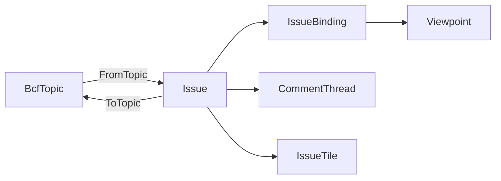

# [APPUI_ISSUE_BOARD]

The coordination rail is the openBIM issue board: `Issue` composes one AppUi `Viewpoint` view-state with a `Rasm.Bim`-owned BCF topic consumed at the boundary, `CommentThread` is a CRDT op-log comment conversation co-edited through the notebook replicated-document law, `IssueTile` projects each issue onto the dashboard tile family, and `IssueBoard` is the board projection owning the issue-to-viewpoint binding. The page owns the UI issue projection, the comment-thread CRDT, the snapshot tile, and the topic-to-viewpoint binding; the substrate is the `Render/pipeline.md#VIEWPOINT_CODEC` `Viewpoint` receipt, the `Editing/notebook.md#CRDT_COEDIT` op-log, the `charts-dashboards` dashboard tiles, and the `Rasm.Bim/Review/issues#BCF_ARCHIVE` `BcfTopic`/`BcfComment`/`BcfViewpoint` contract at the package edge. AppUi composes the BCF topic plus its own `Viewpoint` and CRDT owners into the board and never re-mints a BCF semantic schema, so the round-trip persists through the Persistence op-log changefeed already owned and a second BCF model or a direct BCF-XML writer inside `coordination/` is the rejected form.

## [01]-[INDEX]

- [01]-[ISSUE_MODEL]: Issue composing the `Viewpoint`, the BCF topic, and the snapshot.
- [02]-[COMMENT_THREAD]: CRDT op-log comment conversation over the replicated-document law.
- [03]-[ISSUE_TILE]: Dashboard-tile projection of the issue list with status brushing.
- [04]-[BOARD_PROJECTION]: Board owning the issue-to-viewpoint binding and the BCF round-trip.

## [02]-[ISSUE_MODEL]

- Owner: `IssueStatus` `[SmartEnum<string>]` the coordination lifecycle; `Issue` the board issue record; `IssueBinding` the topic-to-viewpoint binding; `IssueFault` the fault family in the 5000 band.
- Cases: `IssueStatus` = open, in-progress, resolved, closed, reopened; `IssueFault` = Text | TopicMalformed | ViewpointUnbound | CommentConflict in the 5000 code band.
- Entry: `public static Fin<Issue> FromTopic(BcfTopic topic, ClockPolicy clocks)` — projects a `Rasm.Bim` BCF topic consumed at the boundary into a board issue binding its viewpoints onto the AppUi `Viewpoint` receipt; `public BcfTopic ToTopic()` — projects the board issue back onto the BCF topic for the round-trip, never a second BCF schema.
- Auto: each issue carries the BCF topic identity (the GUID, title, status, type, priority, author, and creation instant) plus its bound `Viewpoint` set and its comment thread so a coordination issue is one unit the board renders; the topic status maps onto the `IssueStatus` lifecycle so a board status and a BCF status are one vocabulary; each BCF viewpoint binds onto the AppUi `Viewpoint` through `ViewpointCodec.FromBcf` so the issue's saved view rides the one portable view-state receipt the viewport, the markup, and the reality-capture overlay share — the issue mints no second camera-snapshot shape; the snapshot tile is the viewpoint's rendered thumbnail through the visuals capture lane so the board shows the issue's view at a glance.
- Packages: Thinktecture.Runtime.Extensions, LanguageExt.Core, NodaTime, Rasm.Bim (project)
- Growth: a new issue field is one `Issue` member; a new lifecycle state is one `IssueStatus` row; a new fault is one `IssueFault` case; zero new surface.
- Boundary: the issue composes the `Rasm.Bim/Review/issues#BCF_ARCHIVE` `BcfTopic`/`BcfComment`/`BcfViewpoint` contract consumed at the package edge — AppUi owns the `Viewpoint` receipt and the board projection while `Rasm.Bim` owns the openBIM topic/component/comment exchange semantics, the two meeting only at the topic contract, so a second BCF model or a direct `.bcfzip`/BCF-XML writer inside `coordination/` is the rejected form; the BCF viewpoint binds onto the AppUi `Viewpoint` through `ViewpointCodec.FromBcf` so the issue's view-state is the one portable receipt and a parallel issue-camera shape is the deleted form; the topic status rides the `IssueStatus` smart enum so the board lifecycle and the BCF status are one vocabulary; the issue round-trips back to a `BcfTopic` through `ToTopic` so a CDE or external BCF viewer reads the board's issues and the round-trip is lossless through the `Rasm.Bim` archive codec, never an AppUi-local BCF writer.

```csharp signature
[Union]
public abstract partial record IssueFault : Expected, IValidationError<IssueFault> {
    private IssueFault(string detail, int code) : base(detail, code, None) { }

    public static IssueFault Create(string message) => new Text(message);

    public sealed record Text : IssueFault { public Text(string detail) : base(detail, 5000) { } }
    public sealed record TopicMalformed : IssueFault { public TopicMalformed(string detail) : base(detail, 5001) { } }
    public sealed record ViewpointUnbound : IssueFault { public ViewpointUnbound(string detail) : base(detail, 5002) { } }
    public sealed record CommentConflict : IssueFault { public CommentConflict(string detail) : base(detail, 5003) { } }
}

[SmartEnum<string>]
public sealed partial class IssueStatus {
    public static readonly IssueStatus Open = new("open");
    public static readonly IssueStatus InProgress = new("in-progress");
    public static readonly IssueStatus Resolved = new("resolved");
    public static readonly IssueStatus Closed = new("closed");
    public static readonly IssueStatus Reopened = new("reopened");

    public static IssueStatus FromBcf(Rasm.Bim.Coordination.BcfStatus status) => status switch {
        Rasm.Bim.Coordination.BcfStatus.Open => Open,
        Rasm.Bim.Coordination.BcfStatus.InProgress => InProgress,
        Rasm.Bim.Coordination.BcfStatus.Resolved => Resolved,
        Rasm.Bim.Coordination.BcfStatus.Closed => Closed,
        _ => Reopened,
    };
}

public sealed record IssueBinding(string ViewpointGuid, Viewpoint View);

public sealed record Issue(
    string Guid,
    string Title,
    IssueStatus Status,
    string TopicType,
    string Priority,
    string Author,
    Instant CreatedAt,
    Seq<IssueBinding> Bindings,
    CommentThread Thread,
    Option<string> SnapshotKey) {
    public static Fin<Issue> FromTopic(Rasm.Bim.Coordination.BcfTopic topic, ClockPolicy clocks) =>
        topic.Viewpoints.Map(vp => new IssueBinding(vp.Guid, ToViewpoint(vp, clocks))) switch {
            var bindings => Fin.Succ(new Issue(
                topic.Guid, topic.Title, IssueStatus.FromBcf(topic.Status), topic.TopicType, topic.Priority,
                topic.Author, topic.CreationDate, bindings,
                CommentThread.FromComments(topic.Guid, topic.Comments),
                topic.Viewpoints.HeadOrNone().Bind(static vp => vp.Snapshot.IsSome ? Some(vp.Guid) : None))),
        };

    public Rasm.Bim.Coordination.BcfTopic ToTopic() =>
        new(Guid, Title, ToBcfStatus(Status), TopicType, Priority, Author, CreatedAt,
            Thread.Materialize(), Bindings.Map(static binding => FromBinding(binding)));

    private static Viewpoint ToViewpoint(Rasm.Bim.Coordination.BcfViewpoint vp, ClockPolicy clocks) =>
        new(vp.Guid, Viewpoint.Schema,
            new ViewCamera(true, vp.CameraPosition.X, vp.CameraPosition.Y, vp.CameraPosition.Z,
                vp.CameraPosition.X + vp.CameraDirection.X, vp.CameraPosition.Y + vp.CameraDirection.Y, vp.CameraPosition.Z + vp.CameraDirection.Z,
                vp.CameraUpVector.X, vp.CameraUpVector.Y, vp.CameraUpVector.Z, vp.FieldOfView, 1d),
            new SectionBox(0d, 0d, 0d, 0d, 0d, 0d, false),
            vp.VisibleGlobalIds.Map(static id => new VisibilityOverride(id, true, None, 0d)),
            vp.SelectedGlobalIds, clocks.Now);

    private static Rasm.Bim.Coordination.BcfViewpoint FromBinding(IssueBinding binding) =>
        new(binding.ViewpointGuid,
            new System.Numerics.Vector3((float)binding.View.Camera.EyeX, (float)binding.View.Camera.EyeY, (float)binding.View.Camera.EyeZ),
            new System.Numerics.Vector3((float)(binding.View.Camera.TargetX - binding.View.Camera.EyeX), (float)(binding.View.Camera.TargetY - binding.View.Camera.EyeY), (float)(binding.View.Camera.TargetZ - binding.View.Camera.EyeZ)),
            new System.Numerics.Vector3((float)binding.View.Camera.UpX, (float)binding.View.Camera.UpY, (float)binding.View.Camera.UpZ),
            binding.View.Camera.FieldOfView,
            binding.View.Selection,
            binding.View.Overrides.Filter(static o => o.Visible).Map(static o => o.ElementId),
            None);

    private static Rasm.Bim.Coordination.BcfStatus ToBcfStatus(IssueStatus status) => status.Switch(
        open: static _ => Rasm.Bim.Coordination.BcfStatus.Open,
        inProgress: static _ => Rasm.Bim.Coordination.BcfStatus.InProgress,
        resolved: static _ => Rasm.Bim.Coordination.BcfStatus.Resolved,
        closed: static _ => Rasm.Bim.Coordination.BcfStatus.Closed,
        reopened: static _ => Rasm.Bim.Coordination.BcfStatus.Reopened);
}
```



## [03]-[COMMENT_THREAD]

- Owner: `CommentOp` `[Union]` the replicated comment operation; `CommentThread` the conflict-free replicated comment conversation.
- Entry: `public CommentThread Apply(CommentOp op)` — applies one replicated comment op idempotently; `public CommentThread Merge(CommentThread other)` — folds another replica's comment log into this one, converging without conflict.
- Auto: each comment edit is a `CommentOp` carrying its replica id and HLC stamp so the comment log totally orders by HLC with the replica id as the deterministic tiebreaker exactly as the notebook CRDT op-log does; a comment add appends an immutable comment keyed by its GUID, a comment edit is a last-writer-wins register keyed by HLC so concurrent edits to one comment resolve deterministically, and a comment resolve flags the comment's resolution; `Merge` is commutative, associative, and idempotent so any two replicas that have seen the same comment-op set hold the same thread — the comment thread rides the notebook CRDT convergence law and mints no second co-edit owner; the thread materializes to the `Rasm.Bim` `BcfComment` set for the topic round-trip so a board comment exports to BCF.
- Packages: Thinktecture.Runtime.Extensions, LanguageExt.Core, NodaTime, Rasm.Persistence (project), Rasm.Bim (project)
- Growth: a new replicated comment edit is one `CommentOp` case; zero new surface.
- Boundary: the comment thread rides the `Editing/notebook.md#CRDT_COEDIT` replicated-document law — the `HlcStamp` ordering, the last-writer-wins register, and the idempotent merge are the settled CRDT vocabulary, so the board mints no second CRDT and the `CommentOp` projects onto the Persistence `OpLogEntry` at the seam exactly as the `NotebookOp` does; the op-log rides the Persistence op-log changefeed already owned so a central merge server is the deleted form — two offline coordinators reconcile on reconnect; the thread materializes to the `Rasm.Bim` `BcfComment` record for the topic round-trip so a board comment exports to the openBIM container, never an AppUi-local comment schema; a concurrent same-comment edit resolves last-writer-wins by HLC and the loser surfaces as a superseded op in the log, never silently dropped.

```csharp signature
[Union(ConversionFromValue = ConversionOperatorsGeneration.None)]
public abstract partial record CommentOp {
    private CommentOp() { }
    public sealed record Add(string CommentId, string Author, string Text, Option<string> ViewpointGuid, HlcStamp At) : CommentOp;
    public sealed record Edit(string CommentId, string Text, HlcStamp At) : CommentOp;
    public sealed record Resolve(string CommentId, bool Resolved, HlcStamp At) : CommentOp;

    public HlcStamp At => Switch(add: static a => a.At, edit: static e => e.At, resolve: static r => r.At);

    public string CommentId => Switch(add: static a => a.CommentId, edit: static e => e.CommentId, resolve: static r => r.CommentId);
}

public sealed record CommentEntry(string Author, string Text, Option<string> ViewpointGuid, bool Resolved, Instant Date, HlcStamp At);

public sealed record CommentThread(
    string IssueGuid,
    HashMap<string, CommentEntry> Comments,
    Seq<CommentOp> Log) {
    public static CommentThread Empty(string issueGuid) => new(issueGuid, HashMap<string, CommentEntry>(), Seq<CommentOp>());

    public static CommentThread FromComments(string issueGuid, Seq<Rasm.Bim.Coordination.BcfComment> comments) =>
        comments.Fold(Empty(issueGuid), static (thread, comment) => thread.Apply(
            new CommentOp.Add(comment.Guid, comment.Author, comment.Text, comment.ViewpointGuid,
                new HlcStamp(comment.Date.ToUnixTimeTicks(), 0, comment.Author))));

    public CommentThread Apply(CommentOp op) =>
        Log.Exists(seen => seen.At.Equals(op.At) && seen.CommentId == op.CommentId)
            ? this
            : op.Switch(
                state: this,
                add: static (doc, a) => doc with { Comments = doc.Comments.AddOrUpdate(a.CommentId, new CommentEntry(a.Author, a.Text, a.ViewpointGuid, false, Instant.FromUnixTimeTicks(a.At.Physical), a.At)), Log = doc.Log.Add(a) },
                edit: static (doc, e) => doc.Comments.Find(e.CommentId).Match(
                    Some: cur => e.At.CompareTo(cur.At) > 0 ? doc with { Comments = doc.Comments.AddOrUpdate(e.CommentId, cur with { Text = e.Text, At = e.At }), Log = doc.Log.Add(e) } : doc with { Log = doc.Log.Add(e) },
                    None: () => doc with { Log = doc.Log.Add(e) }),
                resolve: static (doc, r) => doc.Comments.Find(r.CommentId).Match(
                    Some: cur => doc with { Comments = doc.Comments.AddOrUpdate(r.CommentId, cur with { Resolved = r.Resolved, At = r.At }), Log = doc.Log.Add(r) },
                    None: () => doc with { Log = doc.Log.Add(r) }));

    public CommentThread Merge(CommentThread other) =>
        other.Log.OrderBy(static op => op.At, OpOrder).Fold(this, static (doc, op) => doc.Apply(op));

    public Seq<Rasm.Bim.Coordination.BcfComment> Materialize() =>
        toSeq(Comments).OrderBy(static entry => entry.Value.At, OpOrder)
            .Map(static entry => new Rasm.Bim.Coordination.BcfComment(entry.Key, entry.Value.Author, entry.Value.Text, entry.Value.ViewpointGuid, entry.Value.Date))
            .ToSeq();

    static readonly IComparer<HlcStamp> OpOrder = Comparer<HlcStamp>.Create(static (a, b) => a.CompareTo(b));
}
```

## [04]-[ISSUE_TILE]

- Owner: `IssueTile` the dashboard-tile projection of an issue; `IssueFilter` the cross-filter status bitset.
- Entry: `public static Seq<IssueTile> Project(IssueBoard board, IssueFilter filter)` — projects the board's issues onto the dashboard tile family under the status cross-filter; the tile list is the dashboard's issue lane, never a second list owner.
- Auto: each issue projects onto one dashboard tile carrying its title, status, priority, author, and snapshot key so the board's issues render as the dashboard tile lane; the status cross-filter is the dashboard bitset brushing so selecting a status in one tile brushes the issue list exactly as the chart dashboard cross-filters; the snapshot tile renders the issue's bound viewpoint thumbnail through the visuals capture lane so the dashboard shows each issue's view without a second render owner.
- Packages: Thinktecture.Runtime.Extensions, LanguageExt.Core
- Growth: a new tile field is one `IssueTile` member; a new filter axis is one `IssueFilter` bitset column; zero new surface.
- Boundary: the issue list rides the `charts-dashboards` dashboard tile family with the cross-filter bitset brushing so the board reuses the dashboard owner and a second tile or list owner is the deleted form; the status filter is the dashboard bitset so a per-tile filter flag is the rejected form; the snapshot tile renders through the visuals capture lane so the board mints no second render owner — the tile is the issue's bound `Viewpoint` rendered through the settled capture row.

```csharp signature
public readonly record struct IssueFilter(uint StatusMask) {
    public static readonly IssueFilter All = new(uint.MaxValue);

    public bool Admits(IssueStatus status) => (StatusMask & (1u << status.Switch(
        open: static _ => 0, inProgress: static _ => 1, resolved: static _ => 2, closed: static _ => 3, reopened: static _ => 4))) != 0u;
}

public sealed record IssueTile(string Guid, string Title, IssueStatus Status, string Priority, string Author, Option<string> SnapshotKey);

public static class IssueTiles {
    public static Seq<IssueTile> Project(IssueBoard board, IssueFilter filter) =>
        board.Issues
            .Filter(issue => filter.Admits(issue.Status))
            .Map(static issue => new IssueTile(issue.Guid, issue.Title, issue.Status, issue.Priority, issue.Author, issue.SnapshotKey));
}
```

## [05]-[BOARD_PROJECTION]

- Owner: `IssueBoard` the board projection owning the issue set and the BCF round-trip.
- Entry: `public static Fin<IssueBoard> Load(Seq<BcfTopic> topics, ClockPolicy clocks)` — folds a `Rasm.Bim`-read BCF topic set into the board issues; `public Fin<Seq<BcfTopic>> Save()` — projects the board issues back onto the BCF topic set for the `Rasm.Bim` archive writer, so the board round-trips through the openBIM container.
- Auto: the board folds each BCF topic into one `Issue` binding its viewpoints onto the AppUi `Viewpoint`, its comments onto the CRDT thread, and its snapshot onto the tile so the board is the projection over the topic set; the board owns the issue-to-viewpoint binding so navigating to an issue applies its bound `Viewpoint` onto the viewport camera and section through the viewpoint codec; the board persists through the Persistence op-log changefeed already owned so the board state and the comment-thread CRDT ride one durable sync, never a second store; the save projects each issue back to a `BcfTopic` so the `Rasm.Bim` `BcfArchive.Write` emits the `.bcfzip` and the round-trip is one vocabulary.
- Receipt: the board state and the comment-thread CRDT persist through the Persistence op-log changefeed; a board edit is one op on the existing changefeed, never a board-local receipt.
- Packages: LanguageExt.Core, NodaTime, Rasm.Bim (project), Rasm.Persistence (project)
- Growth: a new board view is one projection over the issue set; zero new surface.
- Boundary: the board is the projection over the issue set and owns the issue-to-viewpoint binding so navigating to an issue applies its bound `Viewpoint` onto the viewport through the viewpoint codec — the board owns the binding, never the BCF semantic schema; the board round-trips through the `Rasm.Bim/Review/issues#BCF_ARCHIVE` `BcfArchive.Read`/`Write` so AppUi reads and writes the openBIM container through the `Rasm.Bim` codec and a direct `.bcfzip`/BCF-XML writer inside `coordination/` is the rejected form; the board persists through the Persistence op-log changefeed already owned so the board state rides the settled durable sync and a board-local store is the deleted form; the comment-thread CRDT op-log and the board op-log are the one Persistence changefeed so the board is one event-sourcing truth.

```csharp signature
public sealed record IssueBoard(string Key, Seq<Issue> Issues) {
    public static Fin<IssueBoard> Load(Seq<Rasm.Bim.Coordination.BcfTopic> topics, ClockPolicy clocks) =>
        topics.Traverse(topic => Issue.FromTopic(topic, clocks)).As()
            .Map(issues => new IssueBoard("coordination", issues.ToSeq()));

    public Fin<Seq<Rasm.Bim.Coordination.BcfTopic>> Save() =>
        Fin.Succ(Issues.Map(static issue => issue.ToTopic()));

    public Option<Viewpoint> Navigate(string guid) =>
        Issues.Find(issue => issue.Guid == guid).Bind(static issue => issue.Bindings.HeadOrNone().Map(static binding => binding.View));

    public IssueBoard Apply(string guid, CommentOp op) =>
        this with { Issues = Issues.Map(issue => issue.Guid == guid ? issue with { Thread = issue.Thread.Apply(op) } : issue) };
}
```

## [06]-[RESEARCH]

- [BCF_TOPIC_SEAM]: the `Rasm.Bim/Review/issues#BCF_ARCHIVE` `BcfTopic`/`BcfComment`/`BcfViewpoint` record member set the board consumes at the boundary — the topic GUID/title/status/type/priority/author/creation-instant columns, the comment GUID/author/text/viewpoint-guid/date columns, and the viewpoint `CameraPosition`/`CameraDirection`/`CameraUpVector`/`FieldOfView`/`SelectedGlobalIds`/`VisibleGlobalIds`/`Snapshot` columns anchored on IFC GlobalIds — resolves at implementation against the finalized `Rasm.Bim` issue-exchange surface, including the `Rasm.Bim.Coordination` namespace and the `BcfStatus` enum spelling; the `BcfViewpoint`-to-AppUi-`Viewpoint` projection (the `Vector3` camera-position-and-direction-to-`ViewCamera` eye-target-up correspondence and the GlobalId visibility set) is the board's own boundary mapping over the consumed contract, the board issue model, the comment-thread CRDT, the dashboard tile projection, and the issue-to-viewpoint binding are settled, the exact `Rasm.Bim` BCF record column spellings and namespace are the unverified surface composed at the package edge, never re-minted.
