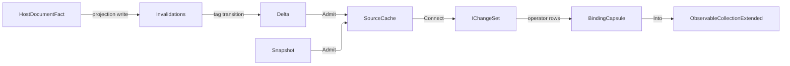

# [APPUI_LIVE_DATA]

Rasm.AppUi live data owns every change-set pipeline between data sources and screens: the seven-case `DataSource` axis, the operator-row vocabulary, the one UI-thread `BindingCapsule`, and the aggregation rows feeding stat tiles and evidence. The engine is DynamicData over System.Reactive — every source folds into one keyed `SourceCache`, key selectors transcribe the Persistence IdentityPolicy vocabulary, the Ui scheduler arrives from the surface scheduler boundary fed by `UiSchedulerPort`, and change evidence leaves through the `ReceiptSinkPort` envelope. The live-data spine — host fact to projection write to tag transition to delta fetch to `IChangeSet` — is the page's composite automation, and screens consume pipelines as expression folds beside their catalog rows.

## [01]-[INDEX]

- [01]-[DATA_SOURCES]: Seven sourcing cases; one cache feed dispatch; the live-data spine.
- [02]-[CHANGE_PIPELINES]: Operator rows; dynamic predicate, comparer, page, window streams.
- [03]-[BINDING_CAPSULE]: One UI-thread binding edge; single `ObserveOn`; the fault rail.
- [04]-[AGGREGATION_SPINE]: Stat folds, change-audit evidence, suspend-resume law.

## [02]-[DATA_SOURCES]

- Owner: `HostDocumentFact`, `SourcePolicy`, `DataSource<TRow, TKey>` — the closed sourcing axis; one generated dispatch feeds one keyed cache per projection, and every `SourcePolicy` axis lands on a composed operator inside `Open` — an inert policy field is the `POLICY_VALUES` rejected form.
- Cases: HostDocumentEvents, PersistenceQuery, CursorQuery, ReceiptStream, InMemorySeq, FakeDeterministic, OrderedList — `ReceiptStream.SourceKey` distinguishes compute and companion producers as seed data because both share admission, identity, timing, and consumer shape; the cursor row is the paged remote source: a large persisted set loads page-by-page through its opaque continuation cursor until `None`, so an unbounded snapshot fetch never rides the query row.
- Entry: `public Fin<DataSource<TRow,TKey>.Opened> Open(Func<TRow,TKey> key, SourcePolicy policy, Action<Error> fault)` — policy admission rejects non-positive expiry, size, and refresh values before allocating the replay cache, and a `Refresh` value on a non-query case is inadmissible so no case can carry a silently inert axis; the carrier exposes the one keyed replay cache, the ordered source when order is a domain fact, and the activation-scope disposable.
- Auto: the live-data spine — a host watch fact drives the Persistence projection write, the tag transition fires `Invalidations`, `Delta` fetches the changed rows, and the cache emits `IChangeSet`; one named pipeline, zero bespoke glue; the emitted `IChangeSet` is the single delta spine — one `Connect` chain fans into chart `SeriesSource`, table projection, and aggregation tiles through `Transform`/`MergeMany` with zero materialized intermediate, so a new consumer subscribes to the existing delta and the source never forks into a second collection-mutation path.
- Packages: DynamicData, System.Reactive, LanguageExt.Core, Thinktecture.Runtime.Extensions, NodaTime
- Growth: a new feed is one case on the closed family; a new bound is one policy value on `SourcePolicy`; a new live consumer is one downstream chain off the existing `Connect`; zero new surface.
- Boundary: `Open` and `Admit` form the Rx-to-rail boundary capsule. Hosts enter only as fact and envelope delegates, key selectors transcribe Persistence identity policy, and late subscribers replay from cache state. `SourcePolicy` consumes scheduling, expiry, size, and query-refresh axes. `OrderedList` keeps its `SourceList` as the authoritative ordered projection while folding each list reason incrementally into the keyed delta spine; `Opened.Ordered` exposes that same source without rebuilding order from a cache that cannot encode position. `CursorQuery` stages each page into a temporary keyed cache, rejects a repeated cursor, swaps the completed snapshot once, and disposes staging, so no concatenated page sequence grows and a failed refresh preserves the prior live cache. Every subscription failure lands in the one `Action<Error>` rail.

```csharp signature
public readonly record struct HostDocumentFact(int PhaseKey, uint DocumentSerial, Seq<Guid> ObjectIds, uint ChangeCounter);

// Every axis is consumed by Open: Source schedules timers and bound sweeps, Expiry -> ExpireAfter,
// SizeBound -> LimitSizeTo, and Refresh -> the query-row re-snapshot interval.
public sealed record SourcePolicy(
    IScheduler Source,
    Option<Duration> Expiry = default,
    Option<int> SizeBound = default,
    Option<Duration> Refresh = default) {
    public Fin<SourcePolicy> Admit() =>
        Expiry.ForAll(static value => value > Duration.Zero)
            && SizeBound.ForAll(static value => value > 0)
            && Refresh.ForAll(static value => value > Duration.Zero)
            ? Fin.Succ(this)
            : Fin.Fail<SourcePolicy>(new LiveDataFault.Source("expiry, size bound, and refresh cadence must be positive"));
}

[Union(ConversionFromValue = ConversionOperatorsGeneration.None)]
public abstract partial record DataSource<TRow, TKey> where TRow : notnull where TKey : notnull {
    private DataSource() { }

    public sealed record Opened(
        IObservableCache<TRow, TKey> Cache,
        Option<IObservableList<TRow>> Ordered,
        IDisposable Feed);

    public sealed record HostDocumentEvents(
        Func<Action<HostDocumentFact>, IDisposable> Facts,
        Func<HostDocumentFact, Seq<TRow>> Project) : DataSource<TRow, TKey>;

    public sealed record PersistenceQuery(
        Func<Fin<Seq<TRow>>> Snapshot,
        Func<Action<string>, IDisposable> Invalidations,
        Func<string, Fin<Seq<TRow>>> Delta) : DataSource<TRow, TKey>;

    public sealed record CursorQuery(
        Func<Option<string>, Fin<(Seq<TRow> Rows, Option<string> Next)>> Fetch) : DataSource<TRow, TKey>;

    public sealed record ReceiptStream(
        string SourceKey,
        Func<Action<ReceiptEnvelope>, IDisposable> Subscribe,
        Func<ReceiptEnvelope, Option<TRow>> Project) : DataSource<TRow, TKey>;

    public sealed record InMemorySeq(Seq<TRow> Rows) : DataSource<TRow, TKey>;

    public sealed record FakeDeterministic(Seq<(Duration At, Seq<TRow> Rows)> Script) : DataSource<TRow, TKey>;

    public sealed record OrderedList(Func<ISourceList<TRow>, IDisposable> Bind) : DataSource<TRow, TKey>;

    // Refresh is a QUERY-row axis: a push, in-memory, scripted, or ordered source cannot re-snapshot, so
    // a Refresh value on a non-query case is inadmissible at Open rather than silently inert.
    public Fin<Opened> Open(Func<TRow, TKey> key, SourcePolicy policy, Action<Error> fault) =>
        policy.Admit()
            .Bind(admitted => admitted.Refresh.IsSome && this is not (PersistenceQuery or CursorQuery)
                ? Fin.Fail<SourcePolicy>(new LiveDataFault.Source("refresh cadence admits only the query rows"))
                : Fin.Succ(admitted))
            .Map(admitted => OpenAdmitted(key, admitted, fault));

    private Opened OpenAdmitted(Func<TRow, TKey> key, SourcePolicy policy, Action<Error> fault) {
        SourceCache<TRow, TKey> cache = new(key);
        DataFeed source = Feed(cache, key, policy, fault);
        return new Opened(cache, source.Ordered, new CompositeDisposable(cache, source.Subscription, Bounds(cache, policy, fault)));
    }

    // The policy operators live at the owning cache: ExpireAfter sweeps TTL leavers and LimitSizeTo evicts
    // oldest-first past the bound, both on the policy scheduler — a per-source bound reimplementation and an
    // inert policy field are the deleted forms.
    private static IDisposable Bounds(ISourceCache<TRow, TKey> cache, SourcePolicy policy, Action<Error> fault) =>
        new CompositeDisposable(
            policy.Expiry.Match(
                Some: ttl => (IDisposable)cache.ExpireAfter(_ => ttl.ToTimeSpan(), policy.Source)
                    .Subscribe(static _ => { }, raw => fault(LiveDataFault.Of("expiry", raw))),
                None: () => Disposable.Empty),
            policy.SizeBound.Match(
                Some: bound => (IDisposable)cache.LimitSizeTo(bound, policy.Source)
                    .Subscribe(static _ => { }, raw => fault(LiveDataFault.Of("size-bound", raw))),
                None: () => Disposable.Empty));

    private DataFeed Feed(ISourceCache<TRow, TKey> cache, Func<TRow, TKey> key, SourcePolicy policy, Action<Error> fault) =>
        Switch(
            state: (cache, key, policy, fault),
            hostDocumentEvents: static (s, c) => DataFeed.Unordered(c.Facts(fact => s.cache.Edit(updater => c.Project(fact).Iter(row => updater.AddOrUpdate(row))))),
            persistenceQuery: static (s, c) => DataFeed.Unordered(new CompositeDisposable(
                Admit(s.cache, c.Snapshot(), s.fault, replace: true),
                c.Invalidations(tag => Admit(s.cache, c.Delta(tag), s.fault)),
                s.policy.Refresh.Match(
                    Some: every => (IDisposable)Observable.Interval(every.ToTimeSpan(), s.policy.Source)
                        .Subscribe(_ => Admit(s.cache, c.Snapshot(), s.fault, replace: true), raw => s.fault(LiveDataFault.Of("query-refresh", raw))),
                    None: () => Disposable.Empty))),
            cursorQuery: static (s, c) => DataFeed.Unordered(new CompositeDisposable(
                CursorSnapshot(s.cache, s.key, c.Fetch, s.fault),
                s.policy.Refresh.Match(
                    Some: every => (IDisposable)Observable.Interval(every.ToTimeSpan(), s.policy.Source)
                        .Subscribe(_ => CursorSnapshot(s.cache, s.key, c.Fetch, s.fault), raw => s.fault(LiveDataFault.Of("cursor-refresh", raw))),
                    None: () => Disposable.Empty))),
            receiptStream: static (s, c) => DataFeed.Unordered(c.Subscribe(envelope => s.cache.Edit(updater => c.Project(envelope).Iter(row => updater.AddOrUpdate(row))))),
            inMemorySeq: static (s, c) => DataFeed.Unordered(Admit(s.cache, Fin.Succ(c.Rows), s.fault)),
            fakeDeterministic: static (s, c) => DataFeed.Unordered(new CompositeDisposable(
                c.Script.Map(step => Observable.Timer(step.At.ToTimeSpan(), s.policy.Source)
                    .Subscribe(_ => Admit(s.cache, Fin.Succ(step.Rows), s.fault), raw => s.fault(LiveDataFault.Of("fake", raw)))))),
            orderedList: static (s, c) => Ordered(s.cache, s.key, c.Bind, s.fault));

    private static IDisposable Admit(ISourceCache<TRow, TKey> cache, Fin<Seq<TRow>> rows, Action<Error> fault, bool replace = false) {
        rows.Match(
            Succ: admitted => fun(() => cache.Edit(updater => {
                if (replace) { updater.Clear(); }
                admitted.Iter(row => updater.AddOrUpdate(row));
            }))(),
            Fail: error => fun(() => fault(error))());
        return Disposable.Empty;
    }

    // Cursor refresh stages pages into a keyed cache as they arrive, then swaps the completed snapshot into
    // the live cache once; a failed page disposes staging and preserves the prior live snapshot.
    private static IDisposable CursorSnapshot(
        ISourceCache<TRow, TKey> cache,
        Func<TRow, TKey> key,
        Func<Option<string>, Fin<(Seq<TRow> Rows, Option<string> Next)>> fetch,
        Action<Error> fault) {
        using SourceCache<TRow, TKey> staging = new(key);
        Chase(staging, fetch, None, Set<string>()).Match(
            Succ: _ => fun(() => ignore(staging.Connect().ToCollection().Take(1).Subscribe(
                rows => cache.Edit(updater => {
                    updater.Clear();
                    rows.Iter(row => updater.AddOrUpdate(row));
                }),
                raw => fault(LiveDataFault.Of("cursor-swap", raw)))))(),
            Fail: error => fun(() => fault(error))());
        return Disposable.Empty;
    }

    private static Fin<Unit> Chase(
        ISourceCache<TRow, TKey> staging,
        Func<Option<string>, Fin<(Seq<TRow> Rows, Option<string> Next)>> fetch,
        Option<string> cursor,
        Set<string> visited) =>
        cursor.Exists(visited.Contains)
            ? Fin.Fail<Unit>(new LiveDataFault.Source($"cursor cycle at {cursor.IfNone(string.Empty)}"))
            : fetch(cursor).Bind(page => {
                Set<string> seen = cursor.Match(Some: visited.Add, None: () => visited);
                staging.Edit(updater => page.Rows.Iter(row => updater.AddOrUpdate(row)));
                return page.Next.Match(
                    Some: next => Chase(staging, fetch, Some(next), seen),
                    None: static () => Fin.Succ(unit));
            });

    // Incremental list-to-cache fold: every SourceList delta lands as its own keyed delta — Add-class
    // reasons upsert, Remove-class reasons remove by key, Clear clears once; the clear-then-reinsert cache
    // rewrite that turned one ordered edit into a full reset is the deleted form. The per-reason accessor
    // spellings ride the LIST_CHANGE_ACCESSORS research row.
    private static DataFeed Ordered(ISourceCache<TRow, TKey> cache, Func<TRow, TKey> key, Func<ISourceList<TRow>, IDisposable> bind, Action<Error> fault) {
        SourceList<TRow> list = new();
        return new DataFeed(
            new CompositeDisposable(
                list,
                bind(list),
                list.Connect().Subscribe(
                    changes => cache.Edit(updater => changes.Iter(change => Fold(updater, key, change, fault))),
                    raw => fault(LiveDataFault.Of("ordered", raw)))),
            Some<IObservableList<TRow>>(list));
    }

    private sealed record DataFeed(IDisposable Subscription, Option<IObservableList<TRow>> Ordered) {
        public static DataFeed Unordered(IDisposable subscription) => new(subscription, None);
    }

    private static Unit Fold(ISourceUpdater<TRow, TKey> updater, Func<TRow, TKey> key, Change<TRow> change, Action<Error> fault) =>
        change.Reason switch {
            ListChangeReason.Add or ListChangeReason.Replace or ListChangeReason.Refresh or ListChangeReason.Moved =>
                ignore(fun(() => updater.AddOrUpdate(change.Item.Current))()),
            ListChangeReason.AddRange => ignore(fun(() => change.Range.Iter(row => updater.AddOrUpdate(row)))()),
            ListChangeReason.Remove => ignore(fun(() => updater.RemoveKey(key(change.Item.Current)))()),
            ListChangeReason.RemoveRange => ignore(fun(() => change.Range.Iter(row => updater.RemoveKey(key(row))))()),
            ListChangeReason.Clear => ignore(fun(updater.Clear)()),
            _ => fun(() => fault(new LiveDataFault.Source($"unsupported list change {change.Reason}")))(),
        };
}
```



## [03]-[CHANGE_PIPELINES]

- Owner: `PipelineInputs<TRow,TKey>` — dynamic predicates and comparers are observable values, `Refresh` is the optional composition-supplied property-refresh fold, and `PipelineWindow` makes all, paged, and virtualized delivery mutually exclusive.
- Packages: DynamicData
- Growth: a new operator concern is one operator row; a new bound is one policy value; zero new surface.
- Boundary: predicates and comparers arrive as streams from screen state, `Refresh` composes the catalogued `AutoRefresh` shape only when the row model admits it, and exactly one `PipelineWindow` case carries the request stream. Re-filtering pushes a predicate, delivery discriminates through the window union, and grouping remains one projection-policy choice; repository layers, per-screen pipeline classes, and a second cache are rejected.

```csharp signature
[Union(ConversionFromValue = ConversionOperatorsGeneration.None)]
public abstract partial record PipelineWindow {
    private PipelineWindow() { }
    public sealed record All : PipelineWindow;
    public sealed record Paged(IObservable<PageRequest> Requests) : PipelineWindow;
    public sealed record Virtualized(IObservable<VirtualRequest> Requests) : PipelineWindow;
}

public sealed record PipelineInputs<TRow, TKey>(
    IObservable<Func<TRow, bool>> Predicates,
    IObservable<IComparer<TRow>> Comparers,
    Option<Func<IObservable<IChangeSet<TRow, TKey>>, IObservable<IChangeSet<TRow, TKey>>>> Refresh,
    PipelineWindow Window);

// Shape owns dynamic filter and sort; Project exhausts the one delivery modality carried by PipelineWindow.
public static class PipelineFolds {
    extension<TRow, TKey>(PipelineInputs<TRow, TKey> inputs) where TRow : notnull where TKey : notnull {
        public IObservable<IChangeSet<TRow, TKey>> Shape(IObservable<IChangeSet<TRow, TKey>> source) {
            IObservable<IChangeSet<TRow, TKey>> shaped = source.Filter(inputs.Predicates).Sort(inputs.Comparers);
            return inputs.Refresh.Match(Some: apply => apply(shaped), None: () => shaped);
        }

        public IObservable<IChangeSet<TRow, TKey>> Project(IObservable<IChangeSet<TRow, TKey>> source) => inputs.Window.Switch(
                state: inputs.Shape(source),
                all: static (shaped, _) => shaped,
                paged: static (shaped, window) => shaped.Page(window.Requests),
                virtualized: static (shaped, window) => shaped.Virtualise(window.Requests));
    }
}
```

| [INDEX] | [ROW]                 | [OPERATORS]             | [POLICY]                                                           |
| :-----: | :-------------------- | :---------------------- | :----------------------------------------------------------------- |
|  [01]   | dynamic-filter        | Filter                  | predicate stream from `Predicates`; pushed value, zero resubscribe |
|  [02]   | comparative-sort      | Sort                    | comparer stream from `Comparers` for mid-pipeline order            |
|  [03]   | projection            | Transform               | row models projected from store and receipt shapes                 |
|  [04]   | flat-map              | TransformMany           | one host fact expands to N child rows                              |
|  [05]   | live-grouping         | Group                   | group change sets for live tiles                                   |
|  [06]   | stable-grouping       | GroupWithImmutableState | the projection-policy row for paged and virtualized projections    |
|  [07]   | property-refresh      | AutoRefresh             | composition-supplied `Refresh` fold over the shaped change-set     |
|  [08]   | child-merge           | MergeMany               | child observable composition                                       |
|  [09]   | timed-expiry          | ExpireAfter             | applied at `Open` from `SourcePolicy.Expiry` (cache-ttl allotment) |
|  [10]   | size-bound            | LimitSizeTo             | applied at `Open` from `SourcePolicy.SizeBound`                    |
|  [11]   | paging                | Page                    | `PipelineWindow.Paged.Requests`                                    |
|  [12]   | windowing             | Virtualise              | `PipelineWindow.Virtualized.Requests`                              |
|  [13]   | set-algebra           | And, Or, Except, Xor    | keyed source composition across `DataSource` outputs               |
|  [14]   | classified-exclusion  | Except                  | subtracts the `DataClassification` deny projection                 |
|  [15]   | item-state-filter     | FilterOnObservable      | per-row `IObservable<bool>` admission; item-state change re-files  |
|  [16]   | item-async-projection | TransformOnObservable   | per-row `IObservable<TDest>`; async results land on the one rail   |

## [04]-[BINDING_CAPSULE]

- Owner: `BindingCapsule` — the single UI-thread binding edge; `LiveDataFault` — the typed fault family on the `AppUiFaultBand.LiveData` registry row (6340), the ONE conversion every Rx failure crosses before reaching the fault rail.
- Entry: `public IDisposable Into<TRow, TKey>(IObservable<IChangeSet<TRow, TKey>> pipeline, ObservableCollectionExtended<TRow> target, Option<IObservable<IComparer<TRow>>> order = default)` — sorted binding rides the comparer stream; absent order is the bare bind; `IntoList<TRow, TKey>(IObservable<IChangeSet<TRow, TKey>> pipeline, IObservableList<TRow> target)` binds the insertion-ordered consumer through `BindToObservableList`; `Drained<TRow, TKey>(IObservable<IChangeSet<TRow, TKey>> pipeline, Action<IObservable<Unit>> drainHook)` binds async disposal for `IAsyncDisposable` rows — the accessor receives the disposals-completed stream the activation scope awaits at teardown.
- Packages: DynamicData, System.Reactive, LanguageExt.Core
- Growth: a new binding posture is one policy value on the capsule record; the list-target bind is one `IntoList` row and the async-drain hook is one `Drained` row on the capsule; zero new surface.
- Boundary: the capsule is the UI-thread boundary capsule and this fence carries the subscription edge under that carve-out; `ObserveOn` applies exactly once here — a second `ObserveOn` anywhere in a pipeline is the named defect; `Ui` arrives from the surface scheduler boundary fed by `UiSchedulerPort`; every `Into` disposable registers into the caller's activation scope, whose disposal receipts are the screens law — no second disposal stream exists here; the `IntoList` edge is the one ordered-target binding — it consumes the `OrderedList` source delta and reattaches insertion order through `BindToObservableList` so the ordered consumer never forks a second collection-mutation path, and a `SortAndBind` over an unordered source beside it is the deleted form; rows holding disposable child resources are `IAsyncDisposable` and bind through `AsyncDisposeMany`, whose `Action<IObservable<Unit>>` accessor hands the disposals-completed stream to the activation scope so leavers release asynchronously before teardown — a synchronous `DisposeMany` over async-disposable rows is the deleted form; faults reach the screen fault state through `Fault` as typed `LiveDataFault` cases (the `LiveDataFault.Of` conversion is the one Rx-to-rail fold — a bare `Error.New` on a subscription edge is the deleted form) and silent failure is structurally impossible; bulk admissions batch through `SuspendNotifications` on `ObservableCollectionExtended` at load edges.

```csharp signature
[Union(ConversionFromValue = ConversionOperatorsGeneration.None)]
public abstract partial record LiveDataFault : Expected {
    private LiveDataFault(string detail, int code) : base(detail, code) { }
    public sealed record Pipeline(string Edge, string Reason)
        : LiveDataFault($"live/pipeline: {Edge}: {Reason}", AppUiFaultBand.LiveData.Code(0));
    public sealed record Source(string Reason)
        : LiveDataFault($"live/source: {Reason}", AppUiFaultBand.LiveData.Code(1));

    // The ONE Rx-to-rail conversion: every subscription edge folds its exception through here.
    public static LiveDataFault Of(string edge, Exception raw) => new Pipeline(edge, raw.Message);
}

public sealed record BindingCapsule(IScheduler Ui, Action<Error> Fault) {
    public IDisposable Into<TRow, TKey>(
        IObservable<IChangeSet<TRow, TKey>> pipeline,
        ObservableCollectionExtended<TRow> target,
        Option<IObservable<IComparer<TRow>>> order = default)
        where TRow : notnull where TKey : notnull =>
        (order.Case switch {
            IObservable<IComparer<TRow>> comparers => pipeline.ObserveOn(Ui).SortAndBind(target, comparers),
            _ => pipeline.ObserveOn(Ui).Bind(target),
        }).Subscribe(static _ => { }, raw => Fault(LiveDataFault.Of("into", raw)));

    public IDisposable IntoList<TRow, TKey>(
        IObservable<IChangeSet<TRow, TKey>> pipeline,
        IObservableList<TRow> target)
        where TRow : notnull where TKey : notnull =>
        pipeline.ObserveOn(Ui)
            .BindToObservableList(target)
            .Subscribe(static _ => { }, raw => Fault(LiveDataFault.Of("into-list", raw)));

    // AsyncDisposeMany disposes IAsyncDisposable leavers itself; the accessor receives the one
    // disposals-completed stream the activation scope awaits before teardown.
    public IDisposable Drained<TRow, TKey>(
        IObservable<IChangeSet<TRow, TKey>> pipeline,
        Action<IObservable<Unit>> drainHook)
        where TRow : notnull, IAsyncDisposable where TKey : notnull =>
        pipeline.AsyncDisposeMany(drainHook)
            .Subscribe(static _ => { }, raw => Fault(LiveDataFault.Of("drained", raw)));
}
```

## [05]-[AGGREGATION_SPINE]

- Owner: `LiveDataOps` — stat folds and change audit attach to the capsule as one extension block.
- Entry: `public IDisposable Tile<TRow, TKey>(IObservable<IChangeSet<TRow, TKey>> pipeline, Func<IObservable<IChangeSet<TRow, TKey>>, IObservable<double>> fold, Action<double> render)` — one entrypoint serves every stat row.
- Receipt: change-audit rows fold `ChangeSummary` scalars into one `EvidenceReceipt.LiveData` case (adds, updates, removes, refreshes per slot) sealed through the `ReceiptSinkPort` envelope — process-local, HLC-correlated, one union case at the evidence owner, never a parallel evidence shape; `TelemetryRow` contributes the change-throughput and live-fault instruments inward through the AppHost `TelemetryContributorPort`.
- Packages: DynamicData, System.Reactive, LanguageExt.Core
- Growth: a new statistic is one stat row mapping a fold; one live instrument is one `InstrumentRow` on `LiveDataOps.TelemetryRow`; zero new surface.
- Boundary: suspend and resume ride the activation scope — surface visibility drives activation at the screens owner, a hidden surface holds zero live subscriptions, and cache state delivers instant replay on resume; gauge and stat tiles on the dashboard surfaces consume `Tile` streams as rows; the change-throughput instrument pulls from the `ChangeStatistics` count and the live-fault instrument from the one `Action<Error>` rail, so metrics and the `ReceiptSinkPort` evidence stream derive from the same audit and a second hand-synced counter is the rejected form; an OAPH mirror of change-set state, a stats service, and a notification-center history store are the rejected forms.

```csharp signature
public static class LiveDataOps {
    public const string ChangesInstrument = "rasm.appui.live.changes";
    public const string FaultsInstrument = "rasm.appui.live.faults";

    public static TelemetryContributorPort TelemetryRow(string version, string schemaUrl) =>
        AppUiTelemetry.Contribute(version, schemaUrl,
            new(ChangesInstrument, InstrumentKind.Count, "{change}", "live change-set operations by slot and change kind"),
            new(FaultsInstrument, InstrumentKind.Count, "{fault}", "live-data faults by slot"));

    extension(BindingCapsule capsule) {
        public IDisposable Tile<TRow, TKey>(
            IObservable<IChangeSet<TRow, TKey>> pipeline,
            Func<IObservable<IChangeSet<TRow, TKey>>, IObservable<double>> fold,
            Action<double> render)
            where TRow : notnull where TKey : notnull =>
            fold(pipeline).ObserveOn(capsule.Ui).Subscribe(render, raw => capsule.Fault(LiveDataFault.Of("tile", raw)));
    }
}
```

| [INDEX] | [ROW]        | [FOLD]                              | [CONSUMER]                                       |
| :-----: | :----------- | :---------------------------------- | :----------------------------------------------- |
|  [01]   | count        | Count                               | stat tiles                                       |
|  [02]   | sum          | Sum                                 | stat tiles                                       |
|  [03]   | average      | Avg                                 | stat tiles                                       |
|  [04]   | minimum      | Minimum                             | stat tiles                                       |
|  [05]   | maximum      | Maximum                             | stat tiles                                       |
|  [06]   | deviation    | StdDev                              | stat tiles                                       |
|  [07]   | change-audit | CollectUpdateStats to ChangeSummary | `EvidenceReceipt.LiveData` via `ReceiptSinkPort` |

## [06]-[RESEARCH]

- [LIST_CHANGE_ACCESSORS]: `Ordered` binds implementation-gated DynamicData `Change<T>.Item` (`Current`/`Previous`), `Range`, and `ListChangeReason` spellings. `SourceList<TRow>.Connect`, the keyed `Edit` sink, and the law that one list edit remains one cache delta without clear-then-reinsert are settled.
