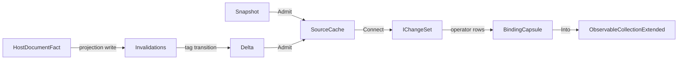

# [APPUI_LIVE_DATA]

Rasm.AppUi live data owns every change-set pipeline between data sources and screens: the seven-case `DataSource` axis, the operator-row vocabulary, the one UI-thread `BindingCapsule`, and the aggregation rows feeding stat tiles and evidence. The engine is DynamicData over System.Reactive — every source folds into one keyed `SourceCache`, key selectors transcribe the Persistence IdentityPolicy vocabulary, the Ui scheduler arrives from the surface scheduler boundary fed by `UiSchedulerPort`, and change evidence leaves through the `ReceiptSinkPort` envelope. The live-data spine — host fact to projection write to tag transition to delta fetch to `IChangeSet` — is the page's composite automation, and screens consume pipelines as expression folds beside their catalog rows.

## [01]-[INDEX]

- [01]-[DATA_SOURCES]: Seven sourcing cases; one cache feed dispatch; the live-data spine.
- [02]-[CHANGE_PIPELINES]: Operator rows; dynamic predicate, comparer, page, window streams.
- [03]-[BINDING_CAPSULE]: One UI-thread binding edge; single `ObserveOn`; the fault rail.
- [04]-[AGGREGATION_SPINE]: Stat folds, change-audit evidence, suspend-resume law.

## [02]-[DATA_SOURCES]

- Owner: `HostDocumentFact`, `SourcePolicy`, `DataSource<TRow, TKey>` — the closed sourcing axis; one generated dispatch feeds one keyed cache per projection, and every `SourcePolicy` axis lands on a composed operator inside `Open` — an inert policy field is the `POLICY_VALUES` rejected form.
- Cases: HostDocumentEvents, PersistenceQuery, ComputeReceiptStream, InMemorySeq, RemoteCompanionStream, FakeDeterministic, OrderedList
- Entry: `public (IObservableCache<TRow, TKey> Cache, IDisposable Feed) Open(Func<TRow, TKey> key, SourcePolicy policy, Action<Error> fault)` — the cache is the replay substrate; the feed disposable registers into the caller's activation scope and carries the policy operators: `Expiry` composes `ExpireAfter` and `SizeBound` composes `LimitSizeTo` over the source cache on the policy scheduler, and `Refresh` drives the periodic re-snapshot on query rows, so a source's scheduling, refresh, expiry, and size behavior is recoverable from its declared policy alone.
- Auto: the live-data spine — a host watch fact drives the Persistence projection write, the tag transition fires `Invalidations`, `Delta` fetches the changed rows, and the cache emits `IChangeSet`; one named pipeline, zero bespoke glue; the emitted `IChangeSet` is the single delta spine — one `Connect` chain fans into chart `SeriesSource`, table projection, and aggregation tiles through `Transform`/`MergeMany` with zero materialized intermediate, so a new consumer subscribes to the existing delta and the source never forks into a second collection-mutation path.
- Packages: DynamicData, System.Reactive, LanguageExt.Core, Thinktecture.Runtime.Extensions, NodaTime
- Growth: a new feed is one case on the closed family; a new bound is one policy value on `SourcePolicy`; a new live consumer is one downstream chain off the existing `Connect`; zero new surface.
- Boundary: `Open` and `Admit` form the page's Rx-to-rail boundary capsule and this fence carries language-owned statement forms inside that capsule; hosts enter only as fact and envelope delegates — the host `WatchEvent` delegate column (bound to the host at the app root) projects to `HostDocumentFact` at the surface adapter (`WatchPhase` key, document serial, object ids, viewport change counter) and a case body never names a host API; key selectors transcribe the Persistence IdentityPolicy rows — uuidv7 surrogate, content hash, natural key — one key discipline per row model; late subscribers replay from cache state because `Connect` emits current state as the first change set, so per-source replay buffers are the deleted pattern; live rows feed on `TaskPoolScheduler` and the fake row on a `VirtualTimeScheduler` through `SourcePolicy.Source`; receipt-stream bounds trace to the cache-ttl `DeadlineClass` row and land as the `Open` policy operators — `Expiry` through `ExpireAfter`, `SizeBound` through `LimitSizeTo`, `Refresh` as the query-row re-snapshot interval — so no policy axis exists that the composed pipeline does not read; the `OrderedList` case is the one insertion-ordered source where row position is the model fact rather than a key projection — it admits a `SourceList<TRow>` change-set, folds into the one keyed cache on every list edit, and the binding capsule reattaches insertion order through `BindToObservableList` so a parallel ordered collection beside the keyed cache is the deleted form, with the diff-efficient list-to-cache path riding the `SourceList<TRow>.Items` (`IReadOnlyList<TRow>`) read and `ObservableCacheEx.PopulateInto(IObservable<IChangeSet<TRow,TKey>>, ISourceCache<TRow,TKey>)` sink over the keyed list connect; chart, table, and aggregation consumers compose off the one `Connect` delta and a second materialized snapshot beside it is the deleted form; an event aggregator and per-source error handlers are the rejected forms — every fault lands in the one `Action<Error>` rail.

```csharp signature
public readonly record struct HostDocumentFact(int PhaseKey, uint DocumentSerial, Seq<Guid> ObjectIds, uint ChangeCounter);

// Every axis is consumed by Open: Source schedules timers and bound sweeps, Expiry -> ExpireAfter,
// SizeBound -> LimitSizeTo, Refresh -> the query-row re-snapshot interval and the AutoRefresh buffer.
public sealed record SourcePolicy(
    IScheduler Source,
    Option<Duration> Expiry = default,
    Option<int> SizeBound = default,
    Option<Duration> Refresh = default);

[Union(ConversionFromValue = ConversionOperatorsGeneration.None)]
public abstract partial record DataSource<TRow, TKey> where TRow : notnull where TKey : notnull {
    private DataSource() { }

    public sealed record HostDocumentEvents(
        Func<Action<HostDocumentFact>, IDisposable> Facts,
        Func<HostDocumentFact, Seq<TRow>> Project) : DataSource<TRow, TKey>;

    public sealed record PersistenceQuery(
        Func<Fin<Seq<TRow>>> Snapshot,
        Func<Action<string>, IDisposable> Invalidations,
        Func<string, Fin<Seq<TRow>>> Delta) : DataSource<TRow, TKey>;

    public sealed record ComputeReceiptStream(
        Func<Action<ReceiptEnvelope>, IDisposable> Receipts,
        Func<ReceiptEnvelope, Option<TRow>> Project) : DataSource<TRow, TKey>;

    public sealed record InMemorySeq(Seq<TRow> Rows) : DataSource<TRow, TKey>;

    public sealed record RemoteCompanionStream(
        Func<Action<ReceiptEnvelope>, IDisposable> Stream,
        Func<ReceiptEnvelope, Option<TRow>> Project) : DataSource<TRow, TKey>;

    public sealed record FakeDeterministic(Seq<(Duration At, Seq<TRow> Rows)> Script) : DataSource<TRow, TKey>;

    public sealed record OrderedList(Func<ISourceList<TRow>, IDisposable> Bind) : DataSource<TRow, TKey>;

    public (IObservableCache<TRow, TKey> Cache, IDisposable Feed) Open(Func<TRow, TKey> key, SourcePolicy policy, Action<Error> fault) {
        SourceCache<TRow, TKey> cache = new(key);
        return (cache, new CompositeDisposable(cache, Feed(cache, key, policy, fault), Bounds(cache, policy)));
    }

    // The policy operators live at the owning cache: ExpireAfter sweeps TTL leavers and LimitSizeTo evicts
    // oldest-first past the bound, both on the policy scheduler — a per-source bound reimplementation and an
    // inert policy field are the deleted forms.
    private static IDisposable Bounds(ISourceCache<TRow, TKey> cache, SourcePolicy policy) =>
        new CompositeDisposable(
            policy.Expiry.Match(
                Some: ttl => (IDisposable)cache.ExpireAfter(_ => ttl.ToTimeSpan(), policy.Source).Subscribe(),
                None: () => Disposable.Empty),
            policy.SizeBound.Match(
                Some: bound => (IDisposable)cache.LimitSizeTo(bound, policy.Source).Subscribe(),
                None: () => Disposable.Empty));

    private IDisposable Feed(ISourceCache<TRow, TKey> cache, Func<TRow, TKey> key, SourcePolicy policy, Action<Error> fault) =>
        Switch(
            state: (cache, key, policy, fault),
            hostDocumentEvents: static (s, c) => c.Facts(fact => s.cache.Edit(updater => c.Project(fact).Iter(row => updater.AddOrUpdate(row)))),
            persistenceQuery: static (s, c) => new CompositeDisposable(
                Admit(s.cache, c.Snapshot(), s.fault),
                c.Invalidations(tag => Admit(s.cache, c.Delta(tag), s.fault)),
                s.policy.Refresh.Match(
                    Some: every => (IDisposable)Observable.Interval(every.ToTimeSpan(), s.policy.Source)
                        .Subscribe(_ => Admit(s.cache, c.Snapshot(), s.fault)),
                    None: () => Disposable.Empty)),
            computeReceiptStream: static (s, c) => c.Receipts(envelope => s.cache.Edit(updater => c.Project(envelope).Iter(row => updater.AddOrUpdate(row)))),
            inMemorySeq: static (s, c) => Admit(s.cache, Fin.Succ(c.Rows), s.fault),
            remoteCompanionStream: static (s, c) => c.Stream(envelope => s.cache.Edit(updater => c.Project(envelope).Iter(row => updater.AddOrUpdate(row)))),
            fakeDeterministic: static (s, c) => new CompositeDisposable(
                c.Script.Map(step => Observable.Timer(step.At.ToTimeSpan(), s.policy.Source)
                    .Subscribe(_ => Admit(s.cache, Fin.Succ(step.Rows), s.fault)))),
            orderedList: static (s, c) => Ordered(s.cache, s.key, c.Bind));

    private static IDisposable Admit(ISourceCache<TRow, TKey> cache, Fin<Seq<TRow>> rows, Action<Error> fault) {
        switch (rows.Case) {
            case Seq<TRow> ok: cache.Edit(updater => ok.Iter(row => updater.AddOrUpdate(row))); break;
            case Error error: fault(error); break;
        }
        return Disposable.Empty;
    }

    private static IDisposable Ordered(ISourceCache<TRow, TKey> cache, Func<TRow, TKey> key, Func<ISourceList<TRow>, IDisposable> bind) {
        SourceList<TRow> list = new();
        return new CompositeDisposable(
            list,
            bind(list),
            list.Connect().Subscribe(_ => cache.Edit(updater => {
                updater.Clear();
                list.Items.Iter(row => updater.AddOrUpdate(row));
            })));
    }
}
```



## [03]-[CHANGE_PIPELINES]

- Owner: `PipelineInputs<TRow>` — every dynamic pipeline parameter is an observable value, never a rebuilt pipeline.
- Packages: DynamicData
- Growth: a new operator concern is one operator row; a new bound is one policy value; zero new surface.
- Boundary: predicates, comparers, pages, and windows arrive as streams from screen state — re-filtering pushes a predicate and resubscription is the deleted pattern; grouping is one projection-policy choice per projection, with immutable-state grouping paired to paged and virtualized windows; the classified-exclusion row subtracts the deny projection driven by the AppHost `DataClassification` consequence — classification is never re-modeled here; pipelines are expression folds declared beside the screen catalog row, so a repository layer and per-screen pipeline classes are the rejected forms; a caching layer is equally rejected — caching lives at the AppHost cache port and the Persistence indexes.

```csharp signature
public sealed record PipelineInputs<TRow>(
    IObservable<Func<TRow, bool>> Predicates,
    IObservable<IComparer<TRow>> Comparers,
    IObservable<PageRequest> Pages,
    IObservable<VirtualRequest> Windows);
```

| [INDEX] | [ROW]                | [OPERATORS]             | [POLICY]                                                           |
| :-----: | :------------------- | :---------------------- | :----------------------------------------------------------------- |
|  [01]   | dynamic-filter       | Filter                  | predicate stream from `Predicates`; pushed value, zero resubscribe |
|  [02]   | comparative-sort     | Sort                    | comparer stream from `Comparers` for mid-pipeline order            |
|  [03]   | projection           | Transform               | row models projected from store and receipt shapes                 |
|  [04]   | flat-map             | TransformMany           | one host fact expands to N child rows                              |
|  [05]   | live-grouping        | Group                   | group change sets for live tiles                                   |
|  [06]   | stable-grouping      | GroupWithImmutableState | the projection-policy row for paged and virtualized projections    |
|  [07]   | property-refresh     | AutoRefresh             | buffer = `SourcePolicy.Refresh`, 250 ms default on host-fact rows |
|  [08]   | child-merge          | MergeMany               | child observable composition                                       |
|  [09]   | timed-expiry         | ExpireAfter             | applied at `Open` from `SourcePolicy.Expiry` (cache-ttl allotment) |
|  [10]   | size-bound           | LimitSizeTo             | applied at `Open` from `SourcePolicy.SizeBound`, 10000 default    |
|  [11]   | paging               | Page                    | `Pages` stream; PageRequest size 50 default                        |
|  [12]   | windowing            | Virtualise              | `Windows` stream; VirtualRequest window 100 default                |
|  [13]   | set-algebra          | And, Or, Except, Xor    | keyed source composition across `DataSource` outputs               |
|  [14]   | classified-exclusion | Except                  | subtracts the `DataClassification` deny projection                 |

## [04]-[BINDING_CAPSULE]

- Owner: `BindingCapsule` — the single UI-thread binding edge; `LiveDataFault` — the typed fault family on the `AppUiFaultBand.LiveData` registry row (6340), the ONE conversion every Rx failure crosses before reaching the fault rail.
- Entry: `public IDisposable Into<TRow, TKey>(IObservable<IChangeSet<TRow, TKey>> pipeline, ObservableCollectionExtended<TRow> target, Option<IObservable<IComparer<TRow>>> order = default)` — sorted binding rides the comparer stream; absent order is the bare bind; `IntoList<TRow, TKey>(IObservable<IChangeSet<TRow, TKey>> pipeline, IObservableList<TRow> target)` binds the insertion-ordered consumer through `BindToObservableList`; `Drained<TRow, TKey>(IObservable<IChangeSet<TRow, TKey>> pipeline, Func<TRow, ValueTask> release)` binds the async-disposal drain hook over the same edge.
- Packages: DynamicData, System.Reactive, LanguageExt.Core
- Growth: a new binding posture is one policy value on the capsule record; the list-target bind is one `IntoList` row and the async-drain hook is one `Drained` row on the capsule; zero new surface.
- Boundary: the capsule is the UI-thread boundary capsule and this fence carries the subscription edge under that carve-out; `ObserveOn` applies exactly once here — a second `ObserveOn` anywhere in a pipeline is the named defect; `Ui` arrives from the surface scheduler boundary fed by `UiSchedulerPort`; every `Into` disposable registers into the caller's activation scope, whose disposal receipts are the screens law — no second disposal stream exists here; the `IntoList` edge is the one ordered-target binding — it consumes the `OrderedList` source delta and reattaches insertion order through `BindToObservableList` so the ordered consumer never forks a second collection-mutation path, and a `SortAndBind` over an unordered source beside it is the deleted form; rows holding disposable child resources bind through `AsyncDisposeMany`, whose completion stream is the cache drain hook awaited at deactivation so leavers release asynchronously before the scope tears down — a synchronous `DisposeMany` over async-disposable rows is the deleted form; faults reach the screen fault state through `Fault` as typed `LiveDataFault` cases (the `LiveDataFault.Of` conversion is the one Rx-to-rail fold — a bare `Error.New` on a subscription edge is the deleted form) and silent failure is structurally impossible; bulk admissions batch through `SuspendNotifications` on `ObservableCollectionExtended` at load edges.

```csharp signature
[Union(ConversionFromValue = ConversionOperatorsGeneration.None)]
public abstract partial record LiveDataFault : Expected {
    private LiveDataFault(string detail, int code) : base(detail, code) { }
    public sealed record Pipeline(string Edge, string Reason)
        : LiveDataFault($"live/pipeline: {Edge}: {Reason}", AppUiFaultBand.LiveData.Code(0));
    public sealed record Source(string Reason)
        : LiveDataFault($"live/source: {Reason}", AppUiFaultBand.LiveData.Code(1));

    // The ONE Rx-to-rail conversion: every subscription edge folds its exception through here.
    public static LiveDataFault Of(string edge, Exception raw) => new Pipeline(edge, raw.Message);
}

public sealed record BindingCapsule(IScheduler Ui, Action<Error> Fault) {
    public IDisposable Into<TRow, TKey>(
        IObservable<IChangeSet<TRow, TKey>> pipeline,
        ObservableCollectionExtended<TRow> target,
        Option<IObservable<IComparer<TRow>>> order = default)
        where TRow : notnull where TKey : notnull =>
        (order.Case switch {
            IObservable<IComparer<TRow>> comparers => pipeline.ObserveOn(Ui).SortAndBind(target, comparers),
            _ => pipeline.ObserveOn(Ui).Bind(target),
        })
        .DisposeMany()
        .Subscribe(static _ => { }, raw => Fault(LiveDataFault.Of("into", raw)));

    public IDisposable IntoList<TRow, TKey>(
        IObservable<IChangeSet<TRow, TKey>> pipeline,
        IObservableList<TRow> target)
        where TRow : notnull where TKey : notnull =>
        pipeline.ObserveOn(Ui)
            .BindToObservableList(target)
            .Subscribe(static _ => { }, raw => Fault(LiveDataFault.Of("into-list", raw)));

    public IDisposable Drained<TRow, TKey>(
        IObservable<IChangeSet<TRow, TKey>> pipeline,
        Func<TRow, ValueTask> release)
        where TRow : notnull where TKey : notnull =>
        pipeline.ObserveOn(Ui)
            .AsyncDisposeMany(release)
            .Subscribe(static _ => { }, raw => Fault(LiveDataFault.Of("drained", raw)));
}
```

## [05]-[AGGREGATION_SPINE]

- Owner: `LiveDataOps` — stat folds and change audit attach to the capsule as one extension block.
- Entry: `public IDisposable Tile<TRow, TKey>(IObservable<IChangeSet<TRow, TKey>> pipeline, Func<IObservable<IChangeSet<TRow, TKey>>, IObservable<double>> fold, Action<double> render)` — one entrypoint serves every stat row.
- Receipt: change-audit rows project `ChangeSummary` into the evidence stream as `ReceiptSinkPort` envelope payloads — process-local, HLC-correlated; `TelemetryRow` contributes the change-throughput and live-fault instruments inward through the AppHost `TelemetryContributorPort`.
- Packages: DynamicData, System.Reactive, LanguageExt.Core
- Growth: a new statistic is one stat row mapping a fold; one live instrument is one `InstrumentRow` on `LiveDataOps.TelemetryRow`; zero new surface.
- Boundary: suspend and resume ride the activation scope — surface visibility drives activation at the screens owner, a hidden surface holds zero live subscriptions, and cache state delivers instant replay on resume; gauge and stat tiles on the dashboard surfaces consume `Tile` streams as rows; the change-throughput instrument pulls from the `ChangeStatistics` count and the live-fault instrument from the one `Action<Error>` rail, so metrics and the `ReceiptSinkPort` evidence stream derive from the same audit and a second hand-synced counter is the rejected form; an OAPH mirror of change-set state, a stats service, and a notification-center history store are the rejected forms.

```csharp signature
public static class LiveDataOps {
    public const string ChangesInstrument = "rasm.appui.live.changes";
    public const string FaultsInstrument = "rasm.appui.live.faults";

    public static TelemetryContributorPort TelemetryRow(string version) =>
        AppUiTelemetry.Contribute(version, ChangesInstrument, FaultsInstrument);

    extension(BindingCapsule capsule) {
        public IDisposable Tile<TRow, TKey>(
            IObservable<IChangeSet<TRow, TKey>> pipeline,
            Func<IObservable<IChangeSet<TRow, TKey>>, IObservable<double>> fold,
            Action<double> render)
            where TRow : notnull where TKey : notnull =>
            fold(pipeline).ObserveOn(capsule.Ui).Subscribe(render, raw => capsule.Fault(LiveDataFault.Of("tile", raw)));
    }
}
```

| [INDEX] | [ROW]        | [FOLD]                              | [CONSUMER]                                     |
| :-----: | :----------- | :---------------------------------- | :--------------------------------------------- |
|  [01]   | count        | Count                               | stat tiles                                     |
|  [02]   | sum          | Sum                                 | stat tiles                                     |
|  [03]   | average      | Avg                                 | stat tiles                                     |
|  [04]   | minimum      | Min                                 | stat tiles                                     |
|  [05]   | maximum      | Max                                 | stat tiles                                     |
|  [06]   | deviation    | StdDev                              | stat tiles                                     |
|  [07]   | change-audit | CollectUpdateStats to ChangeSummary | evidence stream via `ReceiptSinkPort` envelope |
