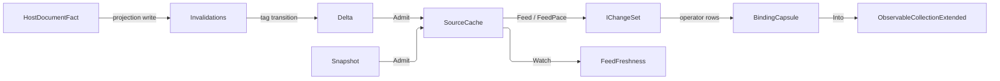
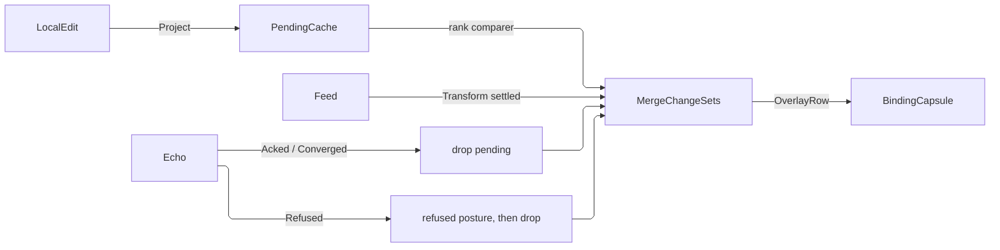

# [APPUI_LIVE_DATA]

Rasm.AppUi live data owns every change-set pipeline between data sources and screens: the seven-case `DataSource` axis with its pacing policy, the one filter-expression algebra and view-state pair every list, board, table, and search surface reads, the operator-row vocabulary, the optimistic overlay that renders a pending mutation before its echo, the one UI-thread `BindingCapsule`, the aggregation rows feeding scalar tiles and evidence, and the design-option row family whose keys join the comparison vocabularies. The engine is DynamicData over System.Reactive — every source folds into one keyed `SourceCache`, key selectors transcribe the Persistence IdentityPolicy vocabulary, the Ui scheduler arrives from the surface scheduler boundary fed by `UiSchedulerPort`, and change evidence leaves through the `ReceiptSinkPort` message envelope. The live-data spine — host fact to projection write to tag transition to delta fetch to `IChangeSet` — is the page's composite automation, and screens consume pipelines as expression folds beside their catalog rows.

`FilterExpr` is the ONE predicate grammar and `FilterSchema` its ONE compiler, so a per-screen filter dialect is unrepresentable; `ViewState` holds group, order, visibility, and saved identity APART from that filter so a filter edit never dirties the view axis. `FeedFreshness` carries `FeedHealth` outward to the `Charts/dashboards#DASHBOARD_TILES` watch rows, whose severity ladder owns that posture vocabulary. `StatFold`, `StatSample`, `DeltaPolarity`, and `CompareOffset` arrive settled from `Charts/dashboards`; `ControlIntent.Chip` with `ChipPosture` is the `Shell/controls#CONTROL_INTENT` chip materialization this page feeds and never constructs; `ScreenState.Filter` is the persisted encoded expression, so the deep link and the checkpoint are one codec. `EvidenceReceipt.LiveData` is the change-audit case, faults derive through the `AppUiFaultBand.LiveData` registry row (6340), and the merge authority's acknowledgment vocabulary is `Collab/sync#LIVE_WIRE` — `EventTriggerKind.Local`/`Import`/`Checkout` for echo routing and `CollabSyncReceipt` for merge outcome.

## [01]-[INDEX]

- [02]-[DATA_SOURCES]: Seven sourcing cases; one cache feed dispatch; the pacing policy and the freshness projection.
- [03]-[FILTER_ALGEBRA]: The property/operator/value grammar, its one compiler, and the deep-link codec.
- [04]-[VIEW_STATE]: Group, order, visibility, and saved-view identity held apart from filter state.
- [05]-[CHANGE_PIPELINES]: Operator rows; the one shaping fold over dynamic predicate and comparer streams.
- [06]-[OVERLAY_SPINE]: The optimistic overlay merge, its acknowledgment ledger, and visible rollback.
- [07]-[BINDING_CAPSULE]: One UI-thread binding edge; single `ObserveOn`; the fault rail.
- [08]-[AGGREGATION_SPINE]: Scalar folds, change-audit evidence, suspend-resume law.
- [09]-[OPTION_SETS]: Named design options, per-option KPI columns, and the comparison-key join.

## [02]-[DATA_SOURCES]

- Owner: `HostDocumentFact`, `FeedPace`, `SourcePolicy`, `DataSource<TRow, TKey>` — the closed sourcing axis; one generated dispatch feeds one keyed cache per projection, and every `SourcePolicy` axis lands on a composed operator inside `Open` — an inert policy field is the `POLICY_VALUES` rejected form. `FreshnessBounds` and `FeedWatch` own the staleness projection.
- Cases: HostDocumentEvents, PersistenceQuery, CursorQuery, ReceiptStream, InMemorySeq, FakeDeterministic, OrderedList — `ReceiptStream.SourceKey` distinguishes compute and companion producers as seed data because both share admission, identity, timing, and consumer shape; the cursor row is the paged remote source: a large persisted set loads page-by-page through its opaque continuation cursor until `None`, so an unbounded snapshot fetch never rides the query row. `FeedPace` = Coalesced | Gated.
- Entry: `public Fin<DataSource<TRow,TKey>.Opened> Open(Func<TRow,TKey> key, SourcePolicy policy, Action<Error> fault)` — policy admission rejects non-positive expiry, size, refresh, page-ceiling, and pacing values before allocating the replay cache, and every optional axis declares the cases that consume it so an axis a case cannot read is inadmissible rather than silently inert; the carrier exposes the one keyed replay cache, the ordered source when order is a domain fact, and the activation-scope disposable. `public IObservable<IChangeSet<TRow,TKey>> Feed()` on `Opened` — the ONE consumer connect, paced by the policy row. `public IObservable<FeedFreshness> Watch(string streamKey, FreshnessBounds bounds, IObservable<bool> reconnecting, IScheduler scheduler)` on `Opened` — the staleness projection.
- Auto: the live-data spine — a host watch fact drives the Persistence projection write, the tag transition fires `Invalidations`, `Delta` fetches the changed rows, and the cache emits `IChangeSet`; one named pipeline, zero bespoke glue; the emitted `IChangeSet` is the single delta spine — one `Feed` chain fans into chart `SeriesSource`, table projection, and aggregation tiles through `Transform`/`MergeMany` with zero materialized intermediate, so a new consumer subscribes to the existing delta and the source never forks into a second collection-mutation path.
- Packages: DynamicData, System.Reactive, LanguageExt.Core, Thinktecture.Runtime.Extensions, NodaTime
- Growth: a new feed is one case on the closed family; a new bound is one policy value on `SourcePolicy`; a new pacing posture is one `FeedPace` arm; a new live consumer is one downstream chain off the existing `Feed`; zero new surface.
- Boundary: `Open` and `Admit` form the Rx-to-rail boundary capsule. Hosts enter only as fact and message-envelope delegates, key selectors transcribe Persistence identity policy, and late subscribers replay from cache state. `SourcePolicy` consumes scheduling, expiry, size, query-refresh, page-ceiling, and pacing axes. `OrderedList` keeps its `SourceList` as the authoritative ordered projection while folding each list reason incrementally into the keyed delta spine; `Opened.Ordered` exposes that same source without rebuilding order from a cache that cannot encode position. `CursorQuery` stages each page into a temporary keyed cache, rejects a repeated cursor and a chase past the admitted `PageCeiling`, swaps the completed snapshot once, and disposes staging, so neither a concatenated page sequence nor a non-repeating continuation chain grows unbounded and a failed refresh preserves the prior live cache; the chase runs on the policy scheduler and its whole lifetime — staging cache, scheduled walk, swap subscription — rides the returned disposable, so activation-scope teardown cancels a chase in flight. BACKPRESSURE is a policy row on the SOURCE and it COALESCES rather than drops: `Batch` buffers the interval's change-sets and flattens them into one, so a high-rate feed costs one bind pass per window with every delta preserved, while a `Throttle` or `Sample` on a change-set stream discards the deltas it skips and leaves the bound collection describing a state no producer ever held — the named deleted form on every delta stream in this package. `Gated` is that same coalescing under an external hold, so a suspended surface accumulates and releases as one batch through `BatchIf` rather than tearing its subscription down and replaying from cache. FRESHNESS is projected here and consumed at the board: the sample stream is probed on the bounds' own cadence so age advances WITHOUT the feed — a feed that stops emitting produces no delta and therefore no age signal, the same silent-stall hole the `Charts/dashboards#DASHBOARD_TILES` stale comparator closes on the watch side — and `FeedHealth` is the board's vocabulary because its severity ladder is the board's, so this page produces values on it and derives none of the ladder. Every subscription failure lands in the one `Action<Error>` rail.

```csharp signature
public readonly record struct HostDocumentFact(int PhaseKey, uint DocumentSerial, Seq<Guid> ObjectIds, uint ChangeCounter);

// Pacing is a CHANGE-SET fold, never a value-stream rate limiter: `Batch` is `Buffer(window).FlattenBufferResult`,
// which merges the window's deltas into one change-set with nothing dropped, while a `Sample`/`Throttle` on this
// stream would discard whole deltas and leave the bound collection holding a state no producer published.
[Union(ConversionFromValue = ConversionOperatorsGeneration.None)]
public abstract partial record FeedPace {
    private FeedPace() { }

    public sealed record Coalesced(Duration Window) : FeedPace;

    // The hold is the surface's own visibility or gate signal, and the ceiling releases anyway, so a hold left
    // asserted by a stuck surface cannot starve the feed forever.
    public sealed record Gated(IObservable<bool> Hold, Duration Ceiling) : FeedPace;

    public Fin<FeedPace> Admit() =>
        Switch(
            coalesced: static row => row.Window > Duration.Zero,
            gated: static row => row.Ceiling > Duration.Zero)
            ? Fin.Succ(this)
            : Fin.Fail<FeedPace>(new LiveDataFault.Source("pacing window and gate ceiling must be positive"));

    public IObservable<IChangeSet<TRow, TKey>> Apply<TRow, TKey>(IObservable<IChangeSet<TRow, TKey>> source, IScheduler scheduler)
        where TRow : notnull where TKey : notnull =>
        Switch(
            state: (Source: source, Scheduler: scheduler),
            coalesced: static (s, row) => s.Source.Batch(row.Window.ToTimeSpan(), s.Scheduler),
            gated: static (s, row) => s.Source.BatchIf(row.Hold, timeOut: row.Ceiling.ToTimeSpan(), scheduler: s.Scheduler));
}

// Every axis is consumed by Open: Source schedules timers and bound sweeps, Expiry -> ExpireAfter,
// SizeBound -> LimitSizeTo, Refresh -> the query-row re-snapshot interval, PageCeiling -> the cursor
// chase bound, and Pace -> the one consumer `Feed` fold. SizeBound governs the LIVE cache and cannot reach the
// staging chase, so the one loop a remote continuation drives carries its own admitted bound rather than
// inheriting a cache eviction.
public sealed record SourcePolicy(
    IScheduler Source,
    Option<Duration> Expiry = default,
    Option<int> SizeBound = default,
    Option<Duration> Refresh = default,
    Option<int> PageCeiling = default,
    Option<FeedPace> Pace = default) {
    public Fin<SourcePolicy> Admit() =>
        Expiry.ForAll(static value => value > Duration.Zero)
            && SizeBound.ForAll(static value => value > 0)
            && Refresh.ForAll(static value => value > Duration.Zero)
            && PageCeiling.ForAll(static value => value > 0)
            ? Pace.Match(Some: pace => pace.Admit().Map(_ => this), None: () => Fin.Succ(this))
            : Fin.Fail<SourcePolicy>(new LiveDataFault.Source("expiry, size bound, refresh cadence, and page ceiling must be positive"));
}

// The freshness ladder as a row rather than two literals at the projection: `Fresh` is the age a live feed
// stays under and `Stale` the age past which a silent feed is a stall, and `Probe` is the cadence age advances
// on WITHOUT a delta, because a stopped feed emits nothing to measure against.
public readonly record struct FreshnessBounds(Duration Fresh, Duration Stale, Duration Probe) {
    public Fin<FreshnessBounds> Admit() =>
        Fresh > Duration.Zero && Stale > Fresh && Probe > Duration.Zero
            ? Fin.Succ(this)
            : Fin.Fail<FreshnessBounds>(new LiveDataFault.Source("freshness bounds must ascend from a positive probe cadence"));
}

[Union(ConversionFromValue = ConversionOperatorsGeneration.None)]
public abstract partial record DataSource<TRow, TKey> where TRow : notnull where TKey : notnull {
    private DataSource() { }

    // The activation-scope handle is `Scope`, never `Feed`: the consumer connect is the `Feed()` fold below,
    // and an instance column of that name shadows every extension member spelling it, so `opened.Feed()`
    // would resolve to a disposable nothing can invoke rather than to the paced change-set stream.
    public sealed record Opened(
        IObservableCache<TRow, TKey> Cache,
        Option<IObservableList<TRow>> Ordered,
        SourcePolicy Policy,
        IDisposable Scope);

    public sealed record HostDocumentEvents(
        Func<Action<HostDocumentFact>, IDisposable> Facts,
        Func<HostDocumentFact, Seq<TRow>> Project) : DataSource<TRow, TKey>;

    public sealed record PersistenceQuery(
        Func<Fin<Seq<TRow>>> Snapshot,
        Func<Action<string>, IDisposable> Invalidations,
        Func<string, Fin<Seq<TRow>>> Delta) : DataSource<TRow, TKey>;

    public sealed record CursorQuery(
        Func<Option<string>, Fin<(Seq<TRow> Rows, Option<string> Next)>> Fetch) : DataSource<TRow, TKey>;

    public sealed record ReceiptStream(
        string SourceKey,
        Func<Action<ReceiptEnvelope>, IDisposable> Subscribe,
        Func<ReceiptEnvelope, Option<TRow>> Project) : DataSource<TRow, TKey>;

    public sealed record InMemorySeq(Seq<TRow> Rows) : DataSource<TRow, TKey>;

    public sealed record FakeDeterministic(Seq<(Duration At, Seq<TRow> Rows)> Script) : DataSource<TRow, TKey>;

    public sealed record OrderedList(Func<ISourceList<TRow>, IDisposable> Bind) : DataSource<TRow, TKey>;

    // Optional axes are case-scoped: refresh re-snapshots and only a query row can, the page ceiling bounds
    // a continuation chase and only the cursor row has one. Each axis names its readers as a row, so a value
    // a case cannot consume refuses at Open instead of sitting inert, and a new axis is one row rather than
    // another guard clause on this rail. Pacing carries no row because every case can be high-rate.
    private sealed record AxisRow(string Axis, string Cases, Func<SourcePolicy, bool> Carried, Func<DataSource<TRow, TKey>, bool> Reaches);

    private static readonly Seq<AxisRow> Axes = Seq(
        new AxisRow("refresh cadence", "the query rows", static policy => policy.Refresh.IsSome, static source => source is PersistenceQuery or CursorQuery),
        new AxisRow("page ceiling", "the cursor row", static policy => policy.PageCeiling.IsSome, static source => source is CursorQuery));

    public Fin<Opened> Open(Func<TRow, TKey> key, SourcePolicy policy, Action<Error> fault) =>
        policy.Admit()
            .Bind(admitted => Axes.Find(row => row.Carried(admitted) && !row.Reaches(this)).Match(
                Some: row => Fin.Fail<SourcePolicy>(new LiveDataFault.Source($"{row.Axis} admits only {row.Cases}")),
                None: () => Fin.Succ(admitted)))
            .Map(admitted => OpenAdmitted(key, admitted, fault));

    private Opened OpenAdmitted(Func<TRow, TKey> key, SourcePolicy policy, Action<Error> fault) {
        SourceCache<TRow, TKey> cache = new(key);
        DataFeed source = Feed(cache, key, policy, fault);
        return new Opened(cache, source.Ordered, policy, new CompositeDisposable(cache, source.Subscription, Bounds(cache, policy, fault)));
    }

    // The policy operators live at the owning cache: ExpireAfter sweeps TTL leavers and LimitSizeTo evicts
    // oldest-first past the bound, both on the policy scheduler — a per-source bound reimplementation and an
    // inert policy field are the deleted forms.
    private static IDisposable Bounds(ISourceCache<TRow, TKey> cache, SourcePolicy policy, Action<Error> fault) =>
        new CompositeDisposable(
            policy.Expiry.Match(
                Some: ttl => (IDisposable)cache.ExpireAfter(_ => ttl.ToTimeSpan(), policy.Source)
                    .Subscribe(static _ => { }, raw => fault(LiveDataFault.Of("expiry", raw))),
                None: () => Disposable.Empty),
            policy.SizeBound.Match(
                Some: bound => (IDisposable)cache.LimitSizeTo(bound, policy.Source)
                    .Subscribe(static _ => { }, raw => fault(LiveDataFault.Of("size-bound", raw))),
                None: () => Disposable.Empty));

    private DataFeed Feed(ISourceCache<TRow, TKey> cache, Func<TRow, TKey> key, SourcePolicy policy, Action<Error> fault) =>
        Switch(
            state: (cache, key, policy, fault),
            hostDocumentEvents: static (s, c) => DataFeed.Unordered(c.Facts(fact => s.cache.Edit(updater => c.Project(fact).Iter(row => updater.AddOrUpdate(row))))),
            // The seed admission is an EFFECT, not a lifetime: it rides the let-idiom ahead of the feed rather
            // than a Disposable.Empty seat inside the composite, so every member of that composite is a
            // subscription teardown actually reaches.
            persistenceQuery: static (s, c) => Admit(s.cache, c.Snapshot(), s.fault, replace: true) switch {
                _ => DataFeed.Unordered(new CompositeDisposable(
                    c.Invalidations(tag => Admit(s.cache, c.Delta(tag), s.fault)),
                    s.policy.Refresh.Match(
                        Some: every => (IDisposable)Observable.Interval(every.ToTimeSpan(), s.policy.Source)
                            .Subscribe(_ => Admit(s.cache, c.Snapshot(), s.fault, replace: true), raw => s.fault(LiveDataFault.Of("query-refresh", raw))),
                        None: () => Disposable.Empty))),
            },
            // One serial slot holds the live chase: a refresh tick REPLACES it, so the prior walk cancels and
            // releases its staging cache instead of stacking one orphaned chase per interval, and teardown
            // reaches whichever chase is current.
            cursorQuery: static (s, c) => new SerialDisposable { Disposable = CursorSnapshot(s.cache, s.key, c.Fetch, s.policy, s.fault) } switch {
                var chase => DataFeed.Unordered(new CompositeDisposable(
                    chase,
                    s.policy.Refresh.Match(
                        Some: every => (IDisposable)Observable.Interval(every.ToTimeSpan(), s.policy.Source)
                            .Subscribe(
                                _ => chase.Disposable = CursorSnapshot(s.cache, s.key, c.Fetch, s.policy, s.fault),
                                raw => s.fault(LiveDataFault.Of("cursor-refresh", raw))),
                        None: () => Disposable.Empty))),
            },
            receiptStream: static (s, c) => DataFeed.Unordered(c.Subscribe(envelope => s.cache.Edit(updater => c.Project(envelope).Iter(row => updater.AddOrUpdate(row))))),
            inMemorySeq: static (s, c) => Admit(s.cache, Fin.Succ(c.Rows), s.fault) switch {
                _ => DataFeed.Unordered(Disposable.Empty),
            },
            fakeDeterministic: static (s, c) => DataFeed.Unordered(new CompositeDisposable(
                c.Script.Map(step => Observable.Timer(step.At.ToTimeSpan(), s.policy.Source)
                    .Subscribe(_ => Admit(s.cache, Fin.Succ(step.Rows), s.fault), raw => s.fault(LiveDataFault.Of("fake", raw)))))),
            orderedList: static (s, c) => Ordered(s.cache, s.key, c.Bind, s.fault));

    // Admission is an effect on the owning cache and carries no lifetime — a disposable return here would
    // promise a teardown the batch edit does not own.
    private static Unit Admit(ISourceCache<TRow, TKey> cache, Fin<Seq<TRow>> rows, Action<Error> fault, bool replace = false) =>
        rows.Match(
            Succ: admitted => fun(() => cache.Edit(updater => {
                if (replace) { updater.Clear(); }
                admitted.Iter(row => updater.AddOrUpdate(row));
            }))(),
            Fail: error => fun(() => fault(error))());

    // The chase is SCHEDULED on the policy scheduler, never a synchronous walk at the composition edge: the
    // returned composite carries the staging cache, the scheduled walk, and the swap subscription, so an
    // activation scope torn down mid-chase cancels the walk and releases staging. Pages stage into a keyed
    // cache as they arrive and swap into the live cache once; a failed page leaves the prior live snapshot.
    private static IDisposable CursorSnapshot(
        ISourceCache<TRow, TKey> cache,
        Func<TRow, TKey> key,
        Func<Option<string>, Fin<(Seq<TRow> Rows, Option<string> Next)>> fetch,
        SourcePolicy policy,
        Action<Error> fault) {
        SourceCache<TRow, TKey> staging = new(key);
        SerialDisposable swap = new();
        IDisposable walk = policy.Source.Schedule(() => Chase(staging, fetch, policy.PageCeiling, page: 0, None, Set<string>()).Match(
            Succ: _ => swap.Disposable = staging.Connect().ToCollection().Take(1).Subscribe(
                rows => cache.Edit(updater => {
                    updater.Clear();
                    rows.Iter(row => updater.AddOrUpdate(row));
                }),
                raw => fault(LiveDataFault.Of("cursor-swap", raw))),
            Fail: error => (fun(() => fault(error))(), (IDisposable)Disposable.Empty).Item2));
        // Disposal order is the teardown order: cancel the walk, release the swap subscription, then the cache
        // the walk was staging into.
        return new CompositeDisposable(walk, swap, staging);
    }

    // Two bounds guard the walk: the visited set catches a repeating cursor and the admitted PageCeiling
    // catches a fresh non-repeating one, which no cycle guard can see and which otherwise drives an
    // unbounded loop accumulating unbounded staging rows.
    private static Fin<Unit> Chase(
        ISourceCache<TRow, TKey> staging,
        Func<Option<string>, Fin<(Seq<TRow> Rows, Option<string> Next)>> fetch,
        Option<int> ceiling,
        int page,
        Option<string> cursor,
        Set<string> visited) =>
        ceiling.Exists(bound => page >= bound)
            ? Fin.Fail<Unit>(new LiveDataFault.Source($"cursor chase exceeded {ceiling.IfNone(page)} pages"))
            : cursor.Exists(visited.Contains)
            ? Fin.Fail<Unit>(new LiveDataFault.Source($"cursor cycle at {cursor.IfNone(string.Empty)}"))
            : fetch(cursor).Bind(fetched => {
                Set<string> seen = cursor.Match(Some: visited.Add, None: () => visited);
                staging.Edit(updater => fetched.Rows.Iter(row => updater.AddOrUpdate(row)));
                return fetched.Next.Match(
                    Some: next => Chase(staging, fetch, ceiling, page + 1, Some(next), seen),
                    None: static () => Fin.Succ(unit));
            });

    // Incremental list-to-cache fold: every SourceList delta lands as its own keyed delta — Add-class
    // reasons upsert, Remove-class reasons remove by key, Clear clears once; the clear-then-reinsert cache
    // rewrite that turned one ordered edit into a full reset is the deleted form. Item-class reasons read
    // `Change<T>.Item.Current` and range-class reasons enumerate `Change<T>.Range` directly.
    private static DataFeed Ordered(ISourceCache<TRow, TKey> cache, Func<TRow, TKey> key, Func<ISourceList<TRow>, IDisposable> bind, Action<Error> fault) {
        SourceList<TRow> list = new();
        return new DataFeed(
            new CompositeDisposable(
                list,
                bind(list),
                list.Connect().Subscribe(
                    changes => cache.Edit(updater => changes.Iter(change => Fold(updater, key, change, fault))),
                    raw => fault(LiveDataFault.Of("ordered", raw)))),
            Some<IObservableList<TRow>>(list));
    }

    private sealed record DataFeed(IDisposable Subscription, Option<IObservableList<TRow>> Ordered) {
        public static DataFeed Unordered(IDisposable subscription) => new(subscription, None);
    }

    private static Unit Fold(ISourceUpdater<TRow, TKey> updater, Func<TRow, TKey> key, Change<TRow> change, Action<Error> fault) =>
        change.Reason switch {
            ListChangeReason.Add or ListChangeReason.Replace or ListChangeReason.Refresh or ListChangeReason.Moved =>
                ignore(fun(() => updater.AddOrUpdate(change.Item.Current))()),
            ListChangeReason.AddRange => ignore(fun(() => change.Range.Iter(row => updater.AddOrUpdate(row)))()),
            ListChangeReason.Remove => ignore(fun(() => updater.RemoveKey(key(change.Item.Current)))()),
            ListChangeReason.RemoveRange => ignore(fun(() => change.Range.Iter(row => updater.RemoveKey(key(row))))()),
            ListChangeReason.Clear => ignore(fun(updater.Clear)()),
            _ => fun(() => fault(new LiveDataFault.Source($"unsupported list change {change.Reason}")))(),
        };
}

public static class SourceFolds {
    extension<TRow, TKey>(DataSource<TRow, TKey>.Opened opened) where TRow : notnull where TKey : notnull {
        // The ONE consumer connect. Pacing composes here rather than at each subscriber, so a high-rate feed
        // is paced once for every downstream chain instead of once per consumer that remembered to ask.
        public IObservable<IChangeSet<TRow, TKey>> Feed() =>
            opened.Policy.Pace.Match(
                Some: pace => pace.Apply(opened.Cache.Connect(), opened.Policy.Source),
                None: opened.Cache.Connect);

        // The staleness projection the watch rows and the connection strip read. The PROBE tick is what makes a
        // stalled feed observable: age is measured against the last arrival on the probe's own cadence, so a
        // feed that stops emitting climbs through degraded into stalled while a delta-driven projection alone
        // would sit forever on its last emission. `Reconnecting` is the transport's own retry signal and
        // OUTRANKS age, because a feed known to be re-establishing is not the same fact as one gone quiet.
        public IObservable<FeedFreshness> Watch(
            string streamKey, FreshnessBounds bounds, IObservable<bool> reconnecting, IScheduler scheduler) =>
            Observable.CombineLatest(
                opened.Feed().Select(_ => Optional(Instant.FromUnixTimeTicks(scheduler.Now.UtcTicks))).StartWith(Option<Instant>.None),
                Observable.Interval(bounds.Probe.ToTimeSpan(), scheduler).Select(static _ => unit).StartWith(unit),
                reconnecting.StartWith(false),
                (last, _, retrying) => Freshness(streamKey, bounds, last, retrying, scheduler))
                .DistinctUntilChanged();

        private static FeedFreshness Freshness(
            string streamKey, FreshnessBounds bounds, Option<Instant> last, bool retrying, IScheduler scheduler) =>
            last.Match(
                Some: at => Instant.FromUnixTimeTicks(scheduler.Now.UtcTicks) - at switch {
                    var age => new FeedFreshness(streamKey, Health(bounds, age, retrying), Some(at), age),
                },
                // A feed that never delivered has no age to grade: it reads reconnecting while the transport
                // is retrying and stalled otherwise, and never live, because a live posture over zero arrivals
                // would report health for a stream nothing has measured.
                None: () => new FeedFreshness(
                    streamKey, retrying ? FeedHealth.Reconnecting : FeedHealth.Stalled, None, Duration.Zero));

        private static FeedHealth Health(FreshnessBounds bounds, Duration age, bool retrying) =>
            retrying ? FeedHealth.Reconnecting
                : age <= bounds.Fresh ? FeedHealth.Live
                : age <= bounds.Stale ? FeedHealth.Degraded
                : FeedHealth.Stalled;
    }
}
```


```mermaid
---
config:
  layout: elk
  flowchart:
    curve: linear
    padding: 25
---
flowchart LR
    accTitle: Live-data admission spine
    accDescr: Host facts and snapshots converge through typed admission into one source cache, paced feed, change-set pipeline, binding capsule, and collection.
    HostDocumentFact -->|projection write| Invalidations
    Invalidations -->|tag transition| Delta
    Snapshot -->|Admit| SourceCache
    Delta -->|Admit| SourceCache
    SourceCache -->|Feed / FeedPace| IChangeSet
    IChangeSet -->|operator rows| BindingCapsule
    BindingCapsule -->|Into| ObservableCollectionExtended
    SourceCache -->|Watch| FeedFreshness
```

## [03]-[FILTER_ALGEBRA]

- Owner: `FilterKind` — the value-domain vocabulary carrying ordering and parsing; `FilterValue` — the typed operand and cell value; `FilterArity` — the operand-count band; `FilterOperator` — the sense vocabulary carrying its kind domain and its predicate; `FilterProperty` — one filterable field declaration with its optional bounded domain; `FilterTerm` — the property/operator/value triple; `FilterExpr` — the recursive and/or/not tree; `FilterField<TRow>`/`FilterSchema<TRow>` — the per-row-model property roster and the ONE compiler; `FilterPace` — the filter-edit cadence; `FilterPolicy` — the decode and suggestion bounds; `FilterLink` — the deep-link and checkpoint codec.
- Cases: `FilterKind` = text | number | moment | flag | member; `FilterValue` = Text | Number | Moment | Flag | Member; `FilterArity` = none | one | pair | many; `FilterOperator` = equality | inequality | containment | prefix | minimum | maximum | range | blank | present; `FilterExpr` = Term | All | Any | Not.
- Law: an operator ROW is arity-agnostic and its cardinality morph is presentation plus admitted band, never a second row — `Equality.Admits` folds `operands.Exists` identically over one operand and over twenty, so `LabelKey` reads singular at one and plural above while `Arity` states the band the term must land in; a separate `is-any-of` row beside `is` is the deleted form, because it lets a picker that gained a second value keep the one-operand row and then admit a term no predicate matches.
- Law: `FilterExpr.Open` is `All` with no parts — vacuous truth, the canonical everything-passes value — so absence of a filter never spells `Option<FilterExpr>` and every consumer evaluates one shape. `Any` with no parts admits nothing, the honest reading of a disjunction over zero alternatives.
- Entry: `public Fin<FilterSchema<TRow>> Admit()`, `public Option<FilterField<TRow>> Field(string key)`, `public Seq<FilterProperty> Suggest(string prefix, FilterPolicy policy)`, `public Fin<Func<TRow,bool>> Compile(FilterExpr expr)`, `public Fin<IComparer<TRow>> Comparer(ViewState view)`, and `public Option<Func<TRow,string>> Grouping(ViewState view)` on `FilterSchema<TRow>` — one roster answers filtering, ordering, and grouping; `public Fin<FilterTerm> Admit(FilterProperty property)` on `FilterTerm`; `public Seq<FilterChip> Chips()` on `FilterExpr` — the term walk carries every argument the projection needs, so no schema crosses it; `public static string Encode(FilterExpr expr)` and `public static Fin<FilterExpr> Decode<TRow>(string query, FilterSchema<TRow> schema, FilterPolicy policy)` on `FilterLink`.
- Packages: LanguageExt.Core, Thinktecture.Runtime.Extensions, NodaTime, BCL inbox
- Growth: a new value domain is one `FilterKind` row with its parse column and one `FilterValue` case; a new filter sense is one `FilterOperator` row carrying its kind domain and predicate; a new filterable field is one `FilterProperty` row on a schema; zero new surface.
- Boundary: this is the ONE filter grammar in the package and every surface consumes it — `Editing/tables#VIEW_STATE` compiles its grid predicate here, `Charts/dashboards#DASHBOARD_TILES` composes the compiled predicate into its `CrossFilter` lens, `Document/search#RANKED_WINDOW` refines its ranked window with it, and the issue board and run queue bind it unchanged, so a per-screen filter UI has no type to be written in. A property carrying a DOMAIN is simultaneously its admission rule and its value picker, the `Charts/dashboards#BOARD_CONTEXT` `BoardVariable` law — an operand outside a declared domain refuses the whole term rather than silently matching nothing, and a deep link cannot smuggle one in. VALUE parsing is the property's, never the link's: the codec carries no kind tag because the schema already declares each property's kind, so a value that does not parse under its declared kind refuses the link rather than decoding into a term whose operand type no predicate can compare. Cross-kind comparison answers `None` and every ordering operator therefore refuses rather than ranking a moment against a number. DEPTH is admitted, not trusted: `Decode` bounds nesting at `FilterPolicy.GroupCeiling` and term count at `TermCeiling` before the tree exists, so the compiler's own recursion and the generated `Switch` walk a tree whose depth the boundary already proved — an unbounded decode feeding a stack-recursive fold is the rejected shape. ENCODING is one codec with two consumers: the deep-link query fragment and the `Shell/screens#SCREEN_STATE` `ScreenState.Filter` checkpoint are the same string, so a shared link and a restored session resolve one expression and a second persistence format is unspellable. Structural characters (`(`, `)`, `,`, `:`, `|`) are safe delimiters because `Uri.EscapeDataString` escapes every character outside the RFC 3986 unreserved set, so an escaped property key, operator key, or operand can never contain one. CHIP presentation stops at the label projection: this owner answers each term's key, label key, and rendered arguments, and `Shell/controls#CONTROL_INTENT` materializes them as `ControlIntent.Chip` rows under `ChipPosture.Removable` with its own intent binding — a control constructed here would put a view type in the data spine. Filter EDIT cadence rides `FilterPace`: one shared edit stream throttled on the quiet span and merged with a sampled emission on the ceiling span, so a held key never starves a surface of a refresh and a burst of keystrokes costs one compile rather than one per character.

```csharp signature
// --- [TYPES] ----------------------------------------------------------------------------

[SmartEnum<string>(SwitchMethods = SwitchMapMethodsGeneration.None, MapMethods = SwitchMapMethodsGeneration.None)]
[KeyMemberEqualityComparer<ComparerAccessors.StringOrdinal, string>]
[KeyMemberComparer<ComparerAccessors.StringOrdinal, string>]
public sealed partial class FilterKind {
    public static readonly FilterKind Text = new("text", ordered: false, ParseText);
    public static readonly FilterKind Number = new("number", ordered: true, ParseNumber);
    public static readonly FilterKind Moment = new("moment", ordered: true, ParseMoment);
    public static readonly FilterKind Flag = new("flag", ordered: false, ParseFlag);
    public static readonly FilterKind Member = new("member", ordered: false, ParseMember);

    // Ordering is a KIND property, not an operator guess: the minimum, maximum, and range senses read it to
    // refuse a bound over a vocabulary member, whose key order is an implementation detail no user means.
    public bool Ordered { get; }

    [UseDelegateFromConstructor]
    public partial Option<FilterValue> Parse(string text);

    private static Option<FilterValue> ParseText(string text) => Some<FilterValue>(new FilterValue.Text(text));

    private static Option<FilterValue> ParseNumber(string text) =>
        double.TryParse(text, NumberStyles.Float, CultureInfo.InvariantCulture, out double value) && double.IsFinite(value)
            ? Some<FilterValue>(new FilterValue.Number(value))
            : None;

    private static Option<FilterValue> ParseMoment(string text) =>
        InstantPattern.ExtendedIso.Parse(text) switch {
            var parsed => parsed.TryGetValue(Instant.MinValue, out Instant at) && parsed.Success
                ? Some<FilterValue>(new FilterValue.Moment(at))
                : None,
        };

    private static Option<FilterValue> ParseFlag(string text) =>
        bool.TryParse(text, out bool value) ? Some<FilterValue>(new FilterValue.Flag(value)) : None;

    private static Option<FilterValue> ParseMember(string text) =>
        string.IsNullOrWhiteSpace(text) ? None : Some<FilterValue>(new FilterValue.Member(text));
}

[SmartEnum<string>(SwitchMethods = SwitchMapMethodsGeneration.None, MapMethods = SwitchMapMethodsGeneration.None)]
[KeyMemberEqualityComparer<ComparerAccessors.StringOrdinal, string>]
[KeyMemberComparer<ComparerAccessors.StringOrdinal, string>]
public sealed partial class FilterArity {
    public static readonly FilterArity None = new("none", least: 0, most: 0);
    public static readonly FilterArity One = new("one", least: 1, most: 1);
    public static readonly FilterArity Pair = new("pair", least: 2, most: 2);
    public static readonly FilterArity Many = new("many", least: 1, most: int.MaxValue);

    public int Least { get; }
    public int Most { get; }

    public bool Admits(int operands) => operands >= Least && operands <= Most;
}

// --- [MODELS] ---------------------------------------------------------------------------

[Union(ConversionFromValue = ConversionOperatorsGeneration.None)]
public abstract partial record FilterValue {
    private FilterValue() { }

    public sealed record Text(string Value) : FilterValue;
    public sealed record Number(double Value) : FilterValue;
    public sealed record Moment(Instant Value) : FilterValue;
    public sealed record Flag(bool Value) : FilterValue;
    public sealed record Member(string Key) : FilterValue;

    public FilterKind Kind => Switch(
        text: static _ => FilterKind.Text,
        number: static _ => FilterKind.Number,
        moment: static _ => FilterKind.Moment,
        flag: static _ => FilterKind.Flag,
        member: static _ => FilterKind.Member);

    // Render is the ROUND TRIP of the kind's own parse, so the codec and the chip argument read one projection
    // and a locale-formatted rendering never reaches the link a peer decodes.
    public string Render() => Switch(
        text: static row => row.Value,
        number: static row => row.Value.ToString("R", CultureInfo.InvariantCulture),
        moment: static row => InstantPattern.ExtendedIso.Format(row.Value),
        flag: static row => row.Value ? bool.TrueString : bool.FalseString,
        member: static row => row.Key);

    // Only text carries a blank reading; a number, moment, flag, or member that exists is present by
    // construction, so `blank` over those kinds answers emptiness of the CELL rather than of the value.
    public bool IsBlank => Switch(
        text: static row => string.IsNullOrWhiteSpace(row.Value),
        number: static _ => false,
        moment: static _ => false,
        flag: static _ => false,
        member: static _ => false);

    // Cross-kind comparison is not an ordering question with a wrong answer — it has no answer, so it returns
    // absence and every ordering operator refuses rather than ranking a moment against a number.
    public static Option<int> Compare(FilterValue left, FilterValue right) => (left, right) switch {
        (Number a, Number b) => Some(a.Value.CompareTo(b.Value)),
        (Moment a, Moment b) => Some(a.Value.CompareTo(b.Value)),
        (Text a, Text b) => Some(string.Compare(a.Value, b.Value, StringComparison.OrdinalIgnoreCase)),
        (Flag a, Flag b) => Some(a.Value.CompareTo(b.Value)),
        (Member a, Member b) => Some(string.Compare(a.Key, b.Key, StringComparison.Ordinal)),
        _ => None,
    };
}

[SmartEnum<string>(SwitchMethods = SwitchMapMethodsGeneration.None, MapMethods = SwitchMapMethodsGeneration.None)]
[KeyMemberEqualityComparer<ComparerAccessors.StringOrdinal, string>]
[KeyMemberComparer<ComparerAccessors.StringOrdinal, string>]
public sealed partial class FilterOperator {
    public static readonly FilterOperator Equality = new("equality", FilterArity.Many, EveryKind, AnyEqual);
    public static readonly FilterOperator Inequality = new("inequality", FilterArity.Many, EveryKind, NoneEqual);
    public static readonly FilterOperator Containment = new("containment", FilterArity.Many, TextKind, AnyContains);
    public static readonly FilterOperator Prefix = new("prefix", FilterArity.One, TextKind, AnyPrefix);
    public static readonly FilterOperator Minimum = new("minimum", FilterArity.One, OrderedKind, AtLeast);
    public static readonly FilterOperator Maximum = new("maximum", FilterArity.One, OrderedKind, AtMost);
    public static readonly FilterOperator Range = new("range", FilterArity.Pair, OrderedKind, Brackets);
    public static readonly FilterOperator Blank = new("blank", FilterArity.None, EveryKind, IsBlank);
    public static readonly FilterOperator Present = new("present", FilterArity.None, EveryKind, IsPresent);

    private const string Singular = "one";
    private const string Plural = "many";

    public FilterArity Arity { get; }

    [UseDelegateFromConstructor]
    public partial bool Reaches(FilterKind kind);

    [UseDelegateFromConstructor]
    public partial bool Admits(Seq<FilterValue> cell, Seq<FilterValue> operands);

    // The cardinality morph in one expression: the row is unchanged and only its label reads plural, so a
    // picker that adds a second value never leaves a stale operator behind it.
    public string LabelKey(int operands) => $"filter.op.{Key}.{(operands > 1 ? Plural : Singular)}";

    private static bool EveryKind(FilterKind kind) => true;
    private static bool TextKind(FilterKind kind) => kind == FilterKind.Text;
    private static bool OrderedKind(FilterKind kind) => kind.Ordered;

    // A multi-valued cell matches when ANY of its values satisfies ANY operand, so a labels column and a
    // single-valued status column read one predicate and the arity morph needs no second body.
    private static bool AnyEqual(Seq<FilterValue> cell, Seq<FilterValue> operands) =>
        operands.Exists(cell.Contains);

    private static bool NoneEqual(Seq<FilterValue> cell, Seq<FilterValue> operands) =>
        !operands.Exists(cell.Contains);

    private static bool AnyContains(Seq<FilterValue> cell, Seq<FilterValue> operands) =>
        operands.Exists(operand => cell.Exists(value =>
            value.Render().Contains(operand.Render(), StringComparison.OrdinalIgnoreCase)));

    private static bool AnyPrefix(Seq<FilterValue> cell, Seq<FilterValue> operands) =>
        operands.Exists(operand => cell.Exists(value =>
            value.Render().StartsWith(operand.Render(), StringComparison.OrdinalIgnoreCase)));

    // Bounds read through the absence-returning comparison, so an unorderable pair fails the bound rather than
    // landing at one edge of the range — the shape that silently kept refused rows inside a filtered set.
    private static bool AtLeast(Seq<FilterValue> cell, Seq<FilterValue> operands) =>
        operands.Exists(edge => cell.Exists(value => FilterValue.Compare(value, edge).Exists(static order => order >= 0)));

    private static bool AtMost(Seq<FilterValue> cell, Seq<FilterValue> operands) =>
        operands.Exists(edge => cell.Exists(value => FilterValue.Compare(value, edge).Exists(static order => order <= 0)));

    // The pair needs no ordering: a value brackets when it compares at-or-above one edge and at-or-below the
    // other, so a range authored high-then-low means what it reads rather than matching nothing.
    private static bool Brackets(Seq<FilterValue> cell, Seq<FilterValue> operands) =>
        cell.Exists(value => operands.Map(edge => FilterValue.Compare(value, edge)) switch {
            var orders => orders.ForAll(static order => order.IsSome)
                && orders.Exists(static order => order.Exists(static side => side >= 0))
                && orders.Exists(static order => order.Exists(static side => side <= 0)),
        });

    // An EMPTY cell is blank: a row whose property carries no value at all answers the same question a blank
    // text value does, so absence and emptiness are one filter rather than two the user has to know apart.
    private static bool IsBlank(Seq<FilterValue> cell, Seq<FilterValue> operands) =>
        cell.ForAll(static value => value.IsBlank);

    private static bool IsPresent(Seq<FilterValue> cell, Seq<FilterValue> operands) => !IsBlank(cell, operands);
}

// A property carrying a non-empty Domain is a bounded vocabulary — simultaneously the value picker and the
// admission rule, so an operand outside it refuses rather than matching nothing.
public sealed record FilterProperty(string Key, string LabelKey, FilterKind Kind, Seq<FilterValue> Domain) {
    public static Fin<FilterProperty> Admit(FilterProperty candidate) =>
        !string.IsNullOrWhiteSpace(candidate.Key)
            && !string.IsNullOrWhiteSpace(candidate.LabelKey)
            && candidate.Domain.ForAll(value => value.Kind == candidate.Kind)
            ? Fin.Succ(candidate)
            : Fin.Fail<FilterProperty>(new LiveDataFault.Filter($"property/{candidate.Key}"));
}

public readonly record struct FilterTerm(string PropertyKey, FilterOperator Op, Seq<FilterValue> Operands) {
    public Fin<FilterTerm> Admit(FilterProperty property) =>
        Op.Reaches(property.Kind)
            && Op.Arity.Admits(Operands.Count)
            && Operands.ForAll(value => value.Kind == property.Kind)
            && (property.Domain.IsEmpty || Operands.ForAll(property.Domain.Contains))
            ? Fin.Succ(this)
            : Fin.Fail<FilterTerm>(new LiveDataFault.Filter($"term/{PropertyKey}:{Op.Key}"));

    // The cardinality edit: operands change, the row does not, and admission re-proves the band. A picker
    // adding or removing a value calls exactly this and cannot desynchronize the operator from the count.
    public Fin<FilterTerm> With(Seq<FilterValue> operands, FilterProperty property) =>
        (this with { Operands = operands }).Admit(property);
}

[Union(ConversionFromValue = ConversionOperatorsGeneration.None)]
public abstract partial record FilterExpr {
    private FilterExpr() { }

    public sealed record Term(FilterTerm Row) : FilterExpr;
    public sealed record All(Seq<FilterExpr> Parts) : FilterExpr;
    public sealed record Any(Seq<FilterExpr> Parts) : FilterExpr;
    public sealed record Not(FilterExpr Inner) : FilterExpr;

    // The canonical everything-passes value, named rather than defaulted: a conjunction over zero parts is
    // vacuously true, so absence of a filter is a value on the family and never a nullable beside it.
    public static readonly FilterExpr Open = new All(Seq<FilterExpr>());

    // Chip projection stops at the label: the key identifies the term for removal, the label key resolves
    // through the locale, and the arguments are the operator's own rendered operands.
    public Seq<FilterChip> Chips() => Switch(
        term: static node => Seq(new FilterChip(
            $"{node.Row.PropertyKey}:{node.Row.Op.Key}",
            node.Row.PropertyKey,
            node.Row.Op.LabelKey(node.Row.Operands.Count),
            node.Row.Operands.Map(static value => value.Render()))),
        all: static node => node.Parts.Bind(static part => part.Chips()),
        any: static node => node.Parts.Bind(static part => part.Chips()),
        not: static node => node.Inner.Chips());
}

public readonly record struct FilterChip(string Key, string PropertyKey, string OperatorLabelKey, Seq<string> Arguments);

// The filter cadence as a ROW, not a literal: the quiet span is the debounce a typist feels and the ceiling
// span is the guarantee a held key still refreshes, so a burst costs one compile and a long burst still lands.
public readonly record struct FilterPace(Duration Quiet, Duration Ceiling) {
    public static readonly FilterPace Typing = new(Duration.FromMilliseconds(180d), Duration.FromMilliseconds(600d));

    public Fin<FilterPace> Admit() =>
        Quiet > Duration.Zero && Ceiling >= Quiet
            ? Fin.Succ(this)
            : Fin.Fail<FilterPace>(new LiveDataFault.Filter("filter pace needs a positive quiet span under its ceiling"));

    public IObservable<T> Pace<T>(IObservable<T> edits, IScheduler scheduler) =>
        edits.Publish(shared => shared.Throttle(Quiet.ToTimeSpan(), scheduler).Merge(shared.Sample(Ceiling.ToTimeSpan(), scheduler)))
            .DistinctUntilChanged();
}

// The three bounds a hostile or merely large input must land inside, held as one row so a decode, a suggestion
// list, and a nesting depth are declared once rather than as literals at three call sites.
public readonly record struct FilterPolicy(int GroupCeiling, int TermCeiling, int SuggestCeiling) {
    public static readonly FilterPolicy Standard = new(GroupCeiling: 8, TermCeiling: 64, SuggestCeiling: 12);
}

public sealed record FilterField<TRow>(FilterProperty Property, Func<TRow, Seq<FilterValue>> Read) where TRow : notnull;

// --- [OPERATIONS] -----------------------------------------------------------------------

// The ONE compiler. A roster of fields answers three questions off one declaration — which rows pass, in what
// order, under what grouping — so a surface that filters can sort and group by construction and a second
// per-surface accessor set cannot drift from the first.
public sealed record FilterSchema<TRow>(Seq<FilterField<TRow>> Fields) where TRow : notnull {
    public Fin<FilterSchema<TRow>> Admit() =>
        Fields.Map(static field => field.Property.Key).Distinct().Count == Fields.Count
            ? Fields.TraverseM(static field => FilterProperty.Admit(field.Property)).As().Map(_ => this)
            : Fin.Fail<FilterSchema<TRow>>(new LiveDataFault.Filter("schema property keys repeat"));

    public Option<FilterField<TRow>> Field(string key) =>
        Fields.Find(field => string.Equals(field.Property.Key, key, StringComparison.Ordinal));

    // Type-ahead ranks PREFIX hits above infix hits and truncates at the policy ceiling, so a picker over a
    // hundred-property model stays a short list and a typed prefix reaches its property first.
    // The ordered run re-enters the carrier at the ONE admission point, because ordering leaves the carrier
    // whole: no carrier member reaches an ordered enumerable, and a carrier egress spelled off the tail of
    // the LINQ chain binds nothing at all.
    public Seq<FilterProperty> Suggest(string prefix, FilterPolicy policy) =>
        toSeq(Fields.Map(static field => field.Property)
            .Filter(property => property.Key.Contains(prefix, StringComparison.OrdinalIgnoreCase)
                || property.LabelKey.Contains(prefix, StringComparison.OrdinalIgnoreCase))
            .OrderBy(property => property.Key.StartsWith(prefix, StringComparison.OrdinalIgnoreCase) ? 0 : 1)
            .ThenBy(static property => property.Key, StringComparer.Ordinal)
            .Take(policy.SuggestCeiling));

    // Recursion is depth-honest and the depth was admitted at the boundary: `FilterLink.Decode` refuses past
    // `GroupCeiling` before a tree exists, and an authored tree grows one group per user action.
    public Fin<Func<TRow, bool>> Compile(FilterExpr expr) => expr.Switch(
        state: this,
        term: static (schema, node) => schema.Field(node.Row.PropertyKey).Match(
            Some: field => node.Row.Admit(field.Property).Map(row =>
                fun((TRow item) => row.Op.Admits(field.Read(item), row.Operands))),
            None: () => Fin.Fail<Func<TRow, bool>>(new LiveDataFault.Filter($"unknown property {node.Row.PropertyKey}"))),
        all: static (schema, node) => node.Parts.TraverseM(schema.Compile).As()
            .Map(static parts => fun((TRow item) => parts.ForAll(part => part(item)))),
        any: static (schema, node) => node.Parts.TraverseM(schema.Compile).As()
            .Map(static parts => fun((TRow item) => parts.Exists(part => part(item)))),
        not: static (schema, node) => schema.Compile(node.Inner)
            .Map(static inner => fun((TRow item) => !inner(item))));

    // Ordering folds the SAME reads the predicate uses, so a column a user can filter on is a column they can
    // sort on without a parallel comparer roster. A row whose property carries no value sorts last on ascent,
    // because an absent value has no rank and burying it is the only honest placement.
    public Fin<IComparer<TRow>> Comparer(ViewState view) =>
        view.Order.TraverseM(row => Field(row.PropertyKey)
                .Match(
                    Some: field => Fin.Succ((Field: field, row.Descending)),
                    None: () => Fin.Fail<(FilterField<TRow> Field, bool Descending)>(
                        new LiveDataFault.View($"order names unknown property {row.PropertyKey}"))))
            .As()
            .Map(static keys => (IComparer<TRow>)Comparer<TRow>.Create((left, right) =>
                keys.Fold(0, (held, key) => held != 0 ? held : Rank(key.Field, left, right) * (key.Descending ? -1 : 1))));

    // Grouping projects the FIRST declared group property's rendered value, so header identity and the encoded
    // link agree; a multi-property grouping is a composed key on the same projection, never a second fold.
    public Option<Func<TRow, string>> Grouping(ViewState view) =>
        view.Group.IsEmpty
            ? None
            : Some(fun((TRow item) => string.Join(
                FilterLink.Operand,
                view.Group.Choose(Field).Map(field => Rendered(field, item)))));

    private static string Rendered(FilterField<TRow> field, TRow item) =>
        field.Read(item).Map(static value => value.Render()).Head.IfNone(string.Empty);

    private static int Rank(FilterField<TRow> field, TRow left, TRow right) =>
        (field.Read(left).Head, field.Read(right).Head) switch {
            ({ IsSome: true } lead, { IsSome: true } trail) =>
                lead.Bind(a => trail.Bind(b => FilterValue.Compare(a, b))).IfNone(0),
            ({ IsSome: true }, _) => -1,
            (_, { IsSome: true }) => 1,
            _ => 0,
        };
}

// The one codec. Structural characters are safe delimiters because `Uri.EscapeDataString` escapes every
// character outside the RFC 3986 unreserved set, so an escaped key or operand can never carry one.
public static class FilterLink {
    public const char Open = '(';
    public const char Close = ')';
    public const char Sibling = ',';
    public const char Field = ':';
    public const char Operand = '|';
    public const char AllHead = 'a';
    public const char AnyHead = 'o';
    public const char NotHead = 'n';

    public static string Encode(FilterExpr expr) => expr.Switch(
        term: static node =>
            $"{Uri.EscapeDataString(node.Row.PropertyKey)}{Field}{Uri.EscapeDataString(node.Row.Op.Key)}"
            + string.Concat(node.Row.Operands.Map(static value => $"{Operand}{Uri.EscapeDataString(value.Render())}")),
        all: static node => Grouped(AllHead, node.Parts),
        any: static node => Grouped(AnyHead, node.Parts),
        not: static node => $"{NotHead}{Open}{Encode(node.Inner)}{Close}");

    public static Fin<FilterExpr> Decode<TRow>(string query, FilterSchema<TRow> schema, FilterPolicy policy)
        where TRow : notnull =>
        string.IsNullOrEmpty(query)
            ? Fin.Succ(FilterExpr.Open)
            : Node(query, from: 0, schema, policy, depth: 0).Bind(parsed => parsed.Next == query.Length
                ? Fin.Succ(parsed.Node)
                : Fin.Fail<FilterExpr>(new LiveDataFault.Filter("trailing text after the filter expression")));

    private readonly record struct Parsed(FilterExpr Node, int Next);

    private sealed record HeadRow(char Token, Func<Seq<FilterExpr>, Fin<FilterExpr>> Build);

    // The group heads as rows: a new connective is one row, and negation's own arity check rides its build
    // arm rather than a guard clause in the parser.
    private static readonly Seq<HeadRow> Heads = Seq(
        new HeadRow(AllHead, static parts => Fin.Succ<FilterExpr>(new FilterExpr.All(parts))),
        new HeadRow(AnyHead, static parts => Fin.Succ<FilterExpr>(new FilterExpr.Any(parts))),
        new HeadRow(NotHead, static parts => parts.Count == 1
            ? Fin.Succ<FilterExpr>(new FilterExpr.Not(parts.Head))
            : Fin.Fail<FilterExpr>(new LiveDataFault.Filter("negation takes exactly one part"))));

    private static string Grouped(char head, Seq<FilterExpr> parts) =>
        $"{head}{Open}{string.Join(Sibling, parts.Map(Encode))}{Close}";

    private static Fin<Parsed> Node<TRow>(string query, int from, FilterSchema<TRow> schema, FilterPolicy policy, int depth)
        where TRow : notnull =>
        depth > policy.GroupCeiling
            ? Fin.Fail<Parsed>(new LiveDataFault.Filter($"filter nesting exceeds {policy.GroupCeiling} groups"))
            : from + 1 < query.Length && query[from + 1] == Open
                && Heads.Find(head => head.Token == query[from]) is { IsSome: true, Case: HeadRow row }
            ? Parts(query, from + 2, schema, policy, depth + 1, Seq<FilterExpr>())
                .Bind(group => row.Build(group.Parts).Map(node => new Parsed(node, group.Next)))
            : Term(query, from, schema, policy);

    // Sibling recursion threads the cursor rather than mutating one, so the parser is a fold and the term
    // ceiling is checked where the count is known.
    private static Fin<(Seq<FilterExpr> Parts, int Next)> Parts<TRow>(
        string query, int from, FilterSchema<TRow> schema, FilterPolicy policy, int depth, Seq<FilterExpr> held)
        where TRow : notnull =>
        held.Count > policy.TermCeiling
            ? Fin.Fail<(Seq<FilterExpr>, int)>(new LiveDataFault.Filter($"filter exceeds {policy.TermCeiling} terms"))
            : from >= query.Length
            ? Fin.Fail<(Seq<FilterExpr>, int)>(new LiveDataFault.Filter("filter group is unterminated"))
            : query[from] == Close
            ? Fin.Succ((held, from + 1))
            : Node(query, from, schema, policy, depth).Bind(parsed =>
                Parts(query,
                    parsed.Next < query.Length && query[parsed.Next] == Sibling ? parsed.Next + 1 : parsed.Next,
                    schema, policy, depth, held.Add(parsed.Node)));

    private static Fin<Parsed> Term<TRow>(string query, int from, FilterSchema<TRow> schema, FilterPolicy policy)
        where TRow : notnull =>
        Extent(query, from) switch {
            var next => query[from..next].Split(Field) switch {
                [var property, var rest] => rest.Split(Operand) switch {
                    [var op, .. var operands] => Row(Uri.UnescapeDataString(property), Uri.UnescapeDataString(op), operands, schema)
                        .Map(row => new Parsed(new FilterExpr.Term(row), next)),
                    _ => Fin.Fail<Parsed>(new LiveDataFault.Filter("filter term names no operator")),
                },
                _ => Fin.Fail<Parsed>(new LiveDataFault.Filter("filter term is not property:operator")),
            },
        };

    private static int Extent(string query, int from) =>
        query.AsSpan(from).IndexOfAny(Sibling, Close) switch {
            < 0 => query.Length,
            var offset => from + offset,
        };

    // Operands parse through the PROPERTY's declared kind, so the link carries no kind tag and a value that
    // does not parse under that kind refuses the whole link rather than decoding into an uncomparable term.
    private static Fin<FilterTerm> Row<TRow>(string property, string op, string[] operands, FilterSchema<TRow> schema)
        where TRow : notnull =>
        schema.Field(property) is { IsSome: true, Case: FilterField<TRow> field }
            ? FilterOperator.TryGet(op, out FilterOperator? row) && row is not null
                ? toSeq(operands).Map(text => field.Property.Kind.Parse(Uri.UnescapeDataString(text))) switch {
                    var parsed => parsed.ForAll(static value => value.IsSome)
                        ? new FilterTerm(field.Property.Key, row, parsed.Choose(static value => value)).Admit(field.Property)
                        : Fin.Fail<FilterTerm>(new LiveDataFault.Filter($"operand does not parse as {field.Property.Kind.Key}")),
                }
                : Fin.Fail<FilterTerm>(new LiveDataFault.Filter($"unknown operator {op}"))
            : Fin.Fail<FilterTerm>(new LiveDataFault.Filter($"unknown property {property}"));
}
```

## [04]-[VIEW_STATE]

- Owner: `ViewState` — the domain view axis: group, order, visible properties, and saved identity; `SavedView` — the durable named pairing of one filter with one view; `ViewStore` — the persistence port; `ViewBinding<TRow>` — the producer of the shaping streams the pipeline consumes.
- Law: view state and filter state are SEPARATE values on one binding, never one record — a filter edit is the high-frequency act and a view edit is the rare one, so folding them together makes every keystroke re-derive the column order and makes "same view, different filter" unspellable; a `SavedView` is the pairing, which is exactly why the live values stay apart.
- Entry: `public Fin<ViewState> Admit<TRow>(FilterSchema<TRow> schema)` on `ViewState` — group, order, and visibility proved against the property roster; `public Fin<PipelineInputs<TRow,TKey>> Inputs<TKey>(IObservable<FilterExpr> filters, IObservable<ViewState> views, IScheduler scheduler, Action<Error> fault, Option<Func<IObservable<IChangeSet<TRow,TKey>>, IObservable<IChangeSet<TRow,TKey>>>> refresh)` on `ViewBinding<TRow>` — the one producer of the shaping streams; `public IO<Fin<SavedView>> Save(ViewStore store, string name, FilterExpr filter, ViewState view)` and `public IO<Fin<(FilterExpr Filter, ViewState View)>> Recall(ViewStore store, SavedViewId id)` on `ViewBinding<TRow>` — the binding already holds the live schema every recall re-admits against.
- Packages: DynamicData, System.Reactive, LanguageExt.Core, NodaTime, BCL inbox
- Growth: a new view axis is one `ViewState` field with its admission clause; a new saved-view column is one field on `SavedView`; zero new surface.
- Boundary: a saved view persists as its ENCODED filter plus its view axes, so the artifact a user shares and the checkpoint a session restores are the same bytes and `ViewStore` never holds an expression tree; a store type never enters these fences — persistence crosses through the port's delegates bound at composition to the Persistence snapshot vocabulary, the `Shell/screens#SCREEN_STATE` law. A COMPILE failure mid-stream is a fault on the rail with the last good predicate HELD, never a silent fall-back to the open filter: a view that quietly showed every row after a bad edit reports success for a question nobody asked, while a held predicate plus a raised fault leaves the surface honest and the banner accurate. Visibility is the DOMAIN axis and lives here — `Editing/tables#VIEW_STATE` keeps only the grid-mechanism cells its control owns (display index and resolved pixel width), so a column hidden on a board and hidden on a grid is one fact.

```csharp signature
[ValueObject<Guid>]
public readonly partial struct SavedViewId;

// The domain view axis. Column WIDTH and display index are not here: those are one control's mechanism, while
// group, order, and visibility are what a user means by "the view" on every surface that has no columns at all.
public sealed record ViewState(
    Seq<string> Group,
    Seq<(string PropertyKey, bool Descending)> Order,
    Seq<string> Visible,
    Option<SavedViewId> Saved) {
    public static readonly ViewState Plain = new(Seq<string>(), Seq<(string, bool)>(), Seq<string>(), None);

    // An EMPTY visible set means every property, so a schema that grows a field shows it rather than hiding it
    // behind a snapshot taken before the field existed.
    public Fin<ViewState> Admit<TRow>(FilterSchema<TRow> schema) where TRow : notnull =>
        Group.Distinct().Count == Group.Count
            && Group.ForAll(key => schema.Field(key).IsSome)
            && Order.Map(static row => row.PropertyKey).Distinct().Count == Order.Count
            && Order.ForAll(row => schema.Field(row.PropertyKey).IsSome)
            && Visible.Distinct().Count == Visible.Count
            && Visible.ForAll(key => schema.Field(key).IsSome)
            ? Fin.Succ(this)
            : Fin.Fail<ViewState>(new LiveDataFault.View("group, order, or visibility names a property the schema does not carry"));

    public bool Shows(string propertyKey) => Visible.IsEmpty || Visible.Contains(propertyKey);
}

// The durable artifact: an ENCODED filter beside the view axes, so a shared link, a stored row, and a session
// checkpoint carry one representation and the store never holds a tree it would have to version.
public sealed record SavedView(SavedViewId Id, string Name, string Filter, ViewState View, bool Shared, Instant At);

public sealed record ViewStore(
    Func<SavedViewId, IO<Option<SavedView>>> Load,
    Func<SavedView, IO<Unit>> Persist,
    Func<IO<Seq<SavedView>>> Roster);

public sealed record ViewBinding<TRow>(FilterSchema<TRow> Schema, FilterPace Pace, FilterPolicy Policy) where TRow : notnull {
    // The one producer of the shaping streams. The predicate stream HOLDS its last good value across a failed
    // compile and routes the fault to the rail, so a surface never silently widens; the comparer stream folds
    // the same roster, so order and filter can never disagree about what a property is.
    public Fin<PipelineInputs<TRow, TKey>> Inputs<TKey>(
        IObservable<FilterExpr> filters,
        IObservable<ViewState> views,
        IScheduler scheduler,
        Action<Error> fault,
        Option<Func<IObservable<IChangeSet<TRow, TKey>>, IObservable<IChangeSet<TRow, TKey>>>> refresh)
        where TKey : notnull =>
        Pace.Admit().Map(pace => new PipelineInputs<TRow, TKey>(
            pace.Pace(filters, scheduler)
                .Select(Schema.Compile)
                .Scan(fun((TRow _) => true), (held, next) => next.Match(
                    Succ: predicate => predicate,
                    Fail: error => fun(() => { fault(error); return held; })())),
            views.Select(view => view.Admit(Schema).Bind(admitted => Schema.Comparer(admitted)))
                .Scan((IComparer<TRow>)Comparer<TRow>.Default, (held, next) => next.Match(
                    Succ: comparer => comparer,
                    Fail: error => fun(() => { fault(error); return held; })())),
            refresh));

    public IO<Fin<SavedView>> Save(ViewStore store, string name, FilterExpr filter, ViewState view) =>
        view.Admit(Schema).Match(
            Succ: admitted => new SavedView(
                    SavedViewId.Create(Guid.CreateVersion7()), name, FilterLink.Encode(filter), admitted, Shared: false,
                    NodaTime.SystemClock.Instance.GetCurrentInstant()) switch {
                var row => store.Persist(row).Map(_ => Fin.Succ(row)),
            },
            Fail: error => IO.pure(Fin.Fail<SavedView>(error)));

    // Recall re-admits against the LIVE schema: a saved view naming a property the model no longer carries
    // refuses rather than restoring an order nothing can rank.
    public IO<Fin<(FilterExpr Filter, ViewState View)>> Recall(ViewStore store, SavedViewId id) =>
        store.Load(id).Map(found => found.Match(
            Some: row => from filter in FilterLink.Decode(row.Filter, Schema, Policy)
                         from view in row.View.Admit(Schema)
                         select (Filter: filter, View: view),
            None: () => Fin.Fail<(FilterExpr, ViewState)>(new LiveDataFault.View($"saved view {id} is absent"))));
}
```

## [05]-[CHANGE_PIPELINES]

- Owner: `PipelineInputs<TRow,TKey>` — the SHAPING inputs of one delta chain: dynamic predicates and comparers are observable values and `Refresh` is the optional composition-supplied property-refresh fold.
- Entry: `public IObservable<IChangeSet<TRow,TKey>> Shape(IObservable<IChangeSet<TRow,TKey>> source)` — the one shaping fold, filter then sort then the optional refresh, over a source `Feed`.
- Packages: DynamicData
- Growth: a new operator concern is one operator row; a new bound is one policy value; zero new surface.
- Boundary: predicates and comparers arrive as streams from `[04]` `ViewBinding.Inputs` and `Refresh` composes the catalogued `AutoRefresh` shape only when the row model admits it. Re-filtering pushes a predicate and grouping remains one projection-policy choice; repository layers, per-screen pipeline classes, and a second cache are rejected. SNAPSHOT sources lower through `EditDiff(keySelector)`, which diffs each emission against the held set and emits the removals that reconcile them, while `ToObservableChangeSet` upserts and removes NOTHING — a query-superseding source lowered through it keeps every row of every earlier answer alive, so it is the deleted form on every successive-snapshot fold in this package and survives only where the source is genuinely append-shaped. DELIVERY is not shaped here — the `Page` and `Virtualise` rows below are composed by the surface that owns the window, `Editing/tables#TREE_FLATTEN` `TableProjection` for the grid and `Shell/virtualization#WINDOW_OWNER` `VirtualWindow` for the extent-ledger fabric, so a live-data delivery union beside them is a second windowing owner the `[04]-[BOUNDARIES]` per-surface-virtualizer law rejects and the one this section deleted.

```csharp signature
// Refresh stays a composition-supplied FOLD rather than a row vocabulary, and the discriminant is a type
// constraint this owner cannot carry: `AutoRefresh` binds `TObject : INotifyPropertyChanged` while
// `PipelineInputs` admits any notnull row model, so a refresh case here would constrain every non-notifying
// consumer out of the pipeline. The caller that knows its row model notifies supplies the operator.
public sealed record PipelineInputs<TRow, TKey>(
    IObservable<Func<TRow, bool>> Predicates,
    IObservable<IComparer<TRow>> Comparers,
    Option<Func<IObservable<IChangeSet<TRow, TKey>>, IObservable<IChangeSet<TRow, TKey>>>> Refresh);

public static class PipelineFolds {
    extension<TRow, TKey>(PipelineInputs<TRow, TKey> inputs) where TRow : notnull where TKey : notnull {
        public IObservable<IChangeSet<TRow, TKey>> Shape(IObservable<IChangeSet<TRow, TKey>> source) {
            IObservable<IChangeSet<TRow, TKey>> shaped = source.Filter(inputs.Predicates).Sort(inputs.Comparers);
            return inputs.Refresh.Match(Some: apply => apply(shaped), None: () => shaped);
        }
    }
}
```

| [INDEX] | [ROW]                 | [OPERATORS]             | [POLICY]                                                           |
| :-----: | :-------------------- | :---------------------- | :----------------------------------------------------------------- |
|  [01]   | dynamic-filter        | Filter                  | predicate stream from `Predicates`; pushed value, zero resubscribe |
|  [02]   | comparative-sort      | Sort                    | comparer stream from `Comparers` for mid-pipeline order            |
|  [03]   | projection            | Transform               | row models projected from store and receipt shapes                 |
|  [04]   | flat-map              | TransformMany           | one host fact expands to N child rows                              |
|  [05]   | live-grouping         | Group                   | group change sets for live tiles and per-option KPI slices         |
|  [06]   | stable-grouping       | GroupWithImmutableState | the projection-policy row for paged and virtualized projections    |
|  [07]   | property-refresh      | AutoRefresh             | composition-supplied `Refresh` fold over the shaped change-set     |
|  [08]   | child-merge           | MergeMany               | child observable composition                                       |
|  [09]   | timed-expiry          | ExpireAfter             | applied at `Open` from `SourcePolicy.Expiry` (cache-ttl allotment) |
|  [10]   | size-bound            | LimitSizeTo             | applied at `Open` from `SourcePolicy.SizeBound`                    |
|  [11]   | coalescing-pace       | Batch, BatchIf          | applied at `Feed` from `SourcePolicy.Pace`; buffers, never drops   |
|  [12]   | paging                | Page                    | composed at `Editing/tables` `TableProjection.Paged`               |
|  [13]   | windowing             | Virtualise              | composed at `Shell/virtualization` `VirtualWindow.Realize`         |
|  [14]   | set-algebra           | And, Or, Except, Xor    | keyed source composition across `DataSource` outputs               |
|  [15]   | classified-exclusion  | Except                  | subtracts the `DataClassification` deny projection                 |
|  [16]   | overlay-merge         | MergeChangeSets         | rank-comparer overlay over the authoritative feed, `[06]`          |
|  [17]   | snapshot-diff         | EditDiff                | successive-snapshot sources; removals included                     |
|  [18]   | item-state-filter     | FilterOnObservable      | per-row `IObservable<bool>` admission; item-state change re-files  |
|  [19]   | item-async-projection | TransformOnObservable   | per-row `IObservable<TDest>`; async results land on the one rail   |
|  [20]   | aggregate-delta       | ForAggregation          | `IAggregateChangeSet` deltas the `[08]` custom folds scan          |

## [06]-[OVERLAY_SPINE]

- Owner: `OverlayPosture` — the three-row visibility ladder a merged key is ranked on; `OverlayRow<TRow>` — the authoritative or pending value under its posture and revision; `OverlayRank<TRow>` — the merge comparer; `OverlayEcho<TRow,TKey>` — the acknowledgment vocabulary; `OverlayPolicy` — the refusal-linger and revision seed; `OverlayLedger<TRow,TKey>` — the pending cache, the projection entry, and the one merged stream.
- Cases: `OverlayPosture` = pending | refused | settled under descending rank; `OverlayEcho` = Acked | Converged | Refused.
- Law: the overlay is a MERGE, not a write-back — `MergeChangeSets` with a rank comparer publishes the pending row while it exists, and its removal makes the tracker re-look-up the best remaining value across every source and republish the authoritative row, so reconciliation and rollback are the package's own fallback rather than a hand-written restore that has to remember what the value was.
- Entry: `public OverlayTicket<TKey> Project(TRow value)` — stamps the next revision and publishes the pending row, deriving its key through the ledger's own row selector so the ticket and the cell address one key; `public Unit Reconcile(OverlayEcho<TRow,TKey> echo)` — the one acknowledgment fold; `public IObservable<IChangeSet<OverlayRow<TRow>,TKey>> Merged(IObservable<IChangeSet<TRow,TKey>> authoritative)` — the merged stream every bound view reads; `public IObservable<int> Pending` — the outstanding-mutation count the connection strip and the pending gauge read.
- Receipt: a refused projection raises its `Error` on the capsule's one `Action<Error>` rail while the refused row renders, so the refusal is simultaneously visible on the surface and countable at the fault instrument, and no second refusal channel exists.
- Packages: DynamicData, System.Reactive, LanguageExt.Core, NodaTime, Thinktecture.Runtime.Extensions
- Growth: a new posture is one `OverlayPosture` row with its rank; a new acknowledgment shape is one `OverlayEcho` case with its ledger arm; zero new surface.
- Boundary: SUPPRESSION of a late authoritative echo is structural rather than a filter — a pending row outranks the settled row for its key, so an echo carrying a pre-mutation value is published into the merge and immediately loses, and no ordering guarantee on the transport is required for the view to stay stable. ACKNOWLEDGMENT is three-armed because the merge authority answers in three shapes: `Acked` carries the ticket's own revision and drops the pending row when the echo is at or past it, so an echo older than the outstanding mutation acknowledges NOTHING and the pending row stands; `Converged` carries the authoritative value and drops the pending row when that value already equals it, the arm a CRDT merge takes because `Collab/sync#LIVE_WIRE` routes remote applies as `EventTriggerKind.Import` diffs carrying values rather than local revisions; `Refused` flips the row to the refused posture, which still outranks settled so the rejected value stays on screen under its refusal chrome, then drops after `OverlayPolicy.Linger` and lets the merge fall back — a rollback that removed the row immediately would make a refusal indistinguishable from a network hiccup. REVISIONS are ledger-local and monotone, never a clock: two mutations on one key from one session must order, and a wall clock at millisecond resolution does not guarantee that. The merged element type is `OverlayRow<TRow>` rather than `TRow` because the posture IS presentation — a pending row renders provisionally and a refused row renders as refused — so a consumer that erased the posture back to `TRow` would have deleted the only reason the overlay exists; the merge's own equality read is `EqualityComparer<OverlayRow<TRow>>.Default`, so `TRow` carries value equality or a converged echo cannot recognize its own value. BACKPRESSURE never reaches this cache: the pending set is bounded by outstanding local mutations, and the authoritative leg arrives already paced by `SourcePolicy.Pace`. KEY authority is the ledger's own row selector — the same shape `[02]` `Open` takes — so a projection's ticket and the cell its cache seats cannot address different keys and no echo can be aimed at a row that was never there. LINGER custody is per key: one serial slot across the ledger let the second refusal cancel the first one's scheduled fallback, leaving that row refused forever above the settled truth, so each key arms and retires its own slot and the drop retires the slot with the row.

```csharp signature
// --- [TYPES] ----------------------------------------------------------------------------

// Rank is the merge order and the visibility order at once: a pending value outranks a refused one, which
// outranks the settled truth, so the newest thing the user did is the thing they see.
[SmartEnum<string>(SwitchMethods = SwitchMapMethodsGeneration.None, MapMethods = SwitchMapMethodsGeneration.None)]
[KeyMemberEqualityComparer<ComparerAccessors.StringOrdinal, string>]
[KeyMemberComparer<ComparerAccessors.StringOrdinal, string>]
public sealed partial class OverlayPosture {
    public static readonly OverlayPosture Pending = new("pending", rank: 0);
    public static readonly OverlayPosture Refused = new("refused", rank: 1);
    public static readonly OverlayPosture Settled = new("settled", rank: 2);

    public int Rank { get; }
}

// --- [MODELS] ---------------------------------------------------------------------------

public readonly record struct OverlayRow<TRow>(TRow Value, OverlayPosture Posture, long Revision, Option<Error> Refusal)
    where TRow : notnull {
    public static OverlayRow<TRow> Settled(TRow value) => new(value, OverlayPosture.Settled, 0L, None);
}

public readonly record struct OverlayTicket<TKey>(TKey Key, long Revision) where TKey : notnull;

// The merge tracker replaces an incumbent only when the candidate compares BELOW it, so ascending rank is
// exactly "pending wins". The revision tie-break makes the comparer total for the equal-posture case a
// keyed cache cannot otherwise reach.
public sealed class OverlayRank<TRow> : IComparer<OverlayRow<TRow>> where TRow : notnull {
    public static readonly OverlayRank<TRow> Instance = new();

    public int Compare(OverlayRow<TRow> left, OverlayRow<TRow> right) =>
        left.Posture.Rank != right.Posture.Rank
            ? left.Posture.Rank.CompareTo(right.Posture.Rank)
            : right.Revision.CompareTo(left.Revision);
}

[Union(ConversionFromValue = ConversionOperatorsGeneration.None)]
public abstract partial record OverlayEcho<TRow, TKey> where TRow : notnull where TKey : notnull {
    private OverlayEcho() { }

    // The merge authority round-tripped the ticket: the revision names exactly which local mutation landed.
    public sealed record Acked(TKey Key, long Revision) : OverlayEcho<TRow, TKey>;

    // The authority answered with a VALUE and no revision — the CRDT shape, where an imported diff carries
    // the converged state rather than the local op it descends from.
    public sealed record Converged(TKey Key, TRow Value) : OverlayEcho<TRow, TKey>;

    public sealed record Refused(TKey Key, long Revision, Error Reason) : OverlayEcho<TRow, TKey>;
}

public readonly record struct OverlayPolicy(Duration Linger, IScheduler Scheduler) {
    public Fin<OverlayPolicy> Admit() =>
        Linger > Duration.Zero
            ? Fin.Succ(this)
            : Fin.Fail<OverlayPolicy>(new LiveDataFault.Overlay("refusal linger must be positive"));
}

// --- [OPERATIONS] -----------------------------------------------------------------------

public sealed class OverlayLedger<TRow, TKey> : IDisposable where TRow : notnull where TKey : notnull {
    private readonly SourceCache<OverlayRow<TRow>, TKey> pending;
    // Linger custody is PER KEY. One serial slot for the whole ledger let a second refusal cancel the first
    // one's scheduled fallback, so that row stood refused forever — outranking the settled truth on a key the
    // authority had already answered, under a refusal chrome nothing would ever clear. Each key holds its own
    // slot, a re-refusal of that key re-arms only its own, and the drop retires the slot with the row so a
    // long session's refusal history cannot accumulate slots for keys nothing is holding.
    private readonly ConcurrentDictionary<TKey, SerialDisposable> sweeps = new();
    private readonly Func<TRow, TKey> key;
    private readonly OverlayPolicy policy;
    private readonly Action<Error> fault;
    private long revision;

    // ONE key authority: the selector reads the ROW, and the pending cache derives its own key through it, so
    // the ticket a projection answers and the cell the cache seats cannot address different keys. A selector
    // over the overlay wrapper beside a caller-supplied key was two authorities that agree only by
    // convention, and their disagreement is a pending row no echo can ever reach.
    public OverlayLedger(Func<TRow, TKey> key, OverlayPolicy policy, Action<Error> fault) {
        this.key = key;
        this.pending = new SourceCache<OverlayRow<TRow>, TKey>(row => key(row.Value));
        this.policy = policy;
        this.fault = fault;
    }

    // Revisions are ledger-local and monotone because two mutations on one key must order and a wall clock at
    // millisecond resolution does not promise that; `Interlocked` makes the stamp safe from any edit thread.
    public OverlayTicket<TKey> Project(TRow value) =>
        Interlocked.Increment(ref revision) switch {
            var stamped => new OverlayTicket<TKey>(key(value), stamped) switch {
                var ticket => fun(() => {
                    pending.AddOrUpdate(new OverlayRow<TRow>(value, OverlayPosture.Pending, stamped, None));
                    return ticket;
                })(),
            },
        };

    public Unit Reconcile(OverlayEcho<TRow, TKey> echo) => echo.Switch(
        state: this,
        // An echo at or past the outstanding revision acknowledges it; an OLDER one acknowledges nothing, so a
        // late server echo of a superseded value cannot clear a mutation the user has already replaced.
        acked: static (ledger, row) => ledger.Held(row.Key)
            .Filter(held => row.Revision >= held.Revision)
            .Match(Some: _ => ledger.Drop(row.Key), None: static () => unit),
        // Value convergence is the CRDT arm: the pending row clears once the authority's own value equals it,
        // because an imported diff carries state rather than the local op it descends from.
        converged: static (ledger, row) => ledger.Held(row.Key)
            .Filter(held => EqualityComparer<TRow>.Default.Equals(held.Value, row.Value))
            .Match(Some: _ => ledger.Drop(row.Key), None: static () => unit),
        refused: static (ledger, row) => ledger.Refuse(row));

    // The merged stream. Removing the pending row makes the tracker re-look-up the best remaining value across
    // both legs and republish the authoritative one, so acknowledgment and rollback are the same mechanism and
    // this owner never restores a value it would have had to remember.
    public IObservable<IChangeSet<OverlayRow<TRow>, TKey>> Merged(IObservable<IChangeSet<TRow, TKey>> authoritative) =>
        authoritative.Transform(static value => OverlayRow<TRow>.Settled(value))
            .MergeChangeSets(pending.Connect(), OverlayRank<TRow>.Instance);

    public IObservable<int> Pending => pending.CountChanged;

    public void Dispose() {
        toSeq(sweeps.Values).Iter(static sweep => sweep.Dispose());
        sweeps.Clear();
        pending.Dispose();
    }

    private Option<OverlayRow<TRow>> Held(TKey held) =>
        pending.Lookup(held) is { HasValue: true } found ? Some(found.Value) : None;

    // The drop retires the key's linger slot with its row, so a scheduled fallback for a key already dropped
    // cannot fire against a row a later projection has since re-seated.
    private Unit Drop(TKey held) =>
        fun(() => {
            if (sweeps.TryRemove(held, out SerialDisposable? sweep)) { sweep.Dispose(); }
            pending.RemoveKey(held);
        })();

    // A refusal RENDERS before it rolls back: the refused posture still outranks settled, so the rejected value
    // stays on screen under its refusal chrome for the linger span and then falls back through the same merge
    // path an acknowledgment takes. Removing it on arrival would make a refusal read as a network hiccup.
    private Unit Refuse(OverlayEcho<TRow, TKey>.Refused row) =>
        Held(row.Key)
            .Filter(held => row.Revision >= held.Revision)
            .Match(
                Some: held => fun(() => {
                    pending.AddOrUpdate(held with { Posture = OverlayPosture.Refused, Refusal = Some(row.Reason) });
                    fault(row.Reason);
                    sweeps.GetOrAdd(row.Key, static _ => new SerialDisposable()).Disposable =
                        policy.Scheduler.Schedule(policy.Linger.ToTimeSpan(), () => Drop(row.Key));
                    return unit;
                })(),
                None: static () => unit);
}
```


```mermaid
---
config:
  layout: elk
  flowchart:
    curve: linear
    padding: 25
---
flowchart LR
    accTitle: Optimistic overlay merge
    accDescr: A local mutation publishes a pending row that outranks the authoritative value until an echo acknowledges, converges, or refuses it.
    LocalEdit -->|Project| PendingCache
    Feed -->|Transform settled| MergeChangeSets
    PendingCache -->|rank comparer| MergeChangeSets
    MergeChangeSets -->|OverlayRow| BindingCapsule
    Echo -->|Acked / Converged| Drop["drop pending"]
    Echo -->|Refused| Linger["refused posture, then drop"]
    Drop --> MergeChangeSets
    Linger --> MergeChangeSets
```

## [07]-[BINDING_CAPSULE]

- Owner: `BindingCapsule` — the single UI-thread binding edge; `LiveDataFault` — the typed fault family on the `AppUiFaultBand.LiveData` registry row (6340), the ONE conversion every Rx failure crosses before reaching the fault rail.
- Entry: `public IDisposable Into<TRow, TKey>(IObservable<IChangeSet<TRow, TKey>> pipeline, ObservableCollectionExtended<TRow> target, Option<IObservable<IComparer<TRow>>> order = default)` — sorted binding rides the comparer stream, absent order is the bare bind, and both read the capsule's one `Bind` posture; `IntoList<TRow, TKey>(IObservable<IChangeSet<TRow, TKey>> pipeline, IObservableList<TRow> target)` binds the insertion-ordered consumer through `BindToObservableList`; `Drained<TRow, TKey>(IObservable<IChangeSet<TRow, TKey>> pipeline, Action<IObservable<Unit>> drainHook)` binds async disposal for `IAsyncDisposable` rows — the accessor receives the disposals-completed stream the activation scope awaits at teardown.
- Packages: DynamicData, System.Reactive, LanguageExt.Core
- Growth: a new binding posture is one `SortAndBindOptions` value on the capsule's `Bind` column; the list-target bind is one `IntoList` row and the async-drain hook is one `Drained` row on the capsule; zero new surface.
- Boundary: the capsule is the UI-thread boundary capsule and this fence carries the subscription edge under that carve-out; `ObserveOn` applies exactly once here — a second `ObserveOn` anywhere in a pipeline is the named defect; `Ui` arrives from the surface scheduler boundary fed by `UiSchedulerPort`; the `Bind` column is the ONE binding posture both bind arms read — the sorted arm hands it to the `SortAndBind(target, comparers, options)` overload and the unsorted arm derives its `BindingOptions` from the same three columns, so the reset threshold, replace-for-update policy, and first-load reset are declared once and `BindingOptions.NeverFireReset` is a posture value rather than a second knob; every `Into` disposable registers into the caller's activation scope, whose disposal receipts are the screens law — no second disposal stream exists here; the `IntoList` edge is the one ordered-target binding — it consumes the `OrderedList` source delta and reattaches insertion order through `BindToObservableList` so the ordered consumer never forks a second collection-mutation path, and a `SortAndBind` over an unordered source beside it is the deleted form; rows holding disposable child resources are `IAsyncDisposable` and bind through `AsyncDisposeMany`, whose `Action<IObservable<Unit>>` accessor hands the disposals-completed stream to the activation scope so leavers release asynchronously before teardown — a synchronous `DisposeMany` over async-disposable rows is the deleted form; faults reach the screen fault state through `Fault` as typed `LiveDataFault` cases (the `LiveDataFault.Of` conversion is the one Rx-to-rail fold — a bare `Error.New` on a subscription edge is the deleted form) and silent failure is structurally impossible; bulk admissions batch through `SuspendNotifications` on `ObservableCollectionExtended` at load edges.

```csharp signature
[Union(ConversionFromValue = ConversionOperatorsGeneration.None)]
public abstract partial record LiveDataFault : Expected {
    private LiveDataFault(string detail, int code) : base(detail, code) { }
    public sealed record Pipeline(string Edge, string Reason)
        : LiveDataFault($"live/pipeline: {Edge}: {Reason}", AppUiFaultBand.LiveData.Code(0));
    public sealed record Source(string Reason)
        : LiveDataFault($"live/source: {Reason}", AppUiFaultBand.LiveData.Code(1));
    public sealed record Filter(string Reason)
        : LiveDataFault($"live/filter: {Reason}", AppUiFaultBand.LiveData.Code(2));
    public sealed record View(string Reason)
        : LiveDataFault($"live/view: {Reason}", AppUiFaultBand.LiveData.Code(3));
    public sealed record Overlay(string Reason)
        : LiveDataFault($"live/overlay: {Reason}", AppUiFaultBand.LiveData.Code(4));
    public sealed record Options(string Reason)
        : LiveDataFault($"live/options: {Reason}", AppUiFaultBand.LiveData.Code(5));

    // The ONE Rx-to-rail conversion: every subscription edge folds its exception through here.
    public static LiveDataFault Of(string edge, Exception raw) => new Pipeline(edge, raw.Message);
}

public sealed record BindingCapsule(IScheduler Ui, Action<Error> Fault, SortAndBindOptions Bind) {
    // Two named postures close the axis: Batched fires one collection reset past the threshold — the
    // virtualization-friendly batch path — and Incremental never resets, for a control that mishandles it.
    // Binary search rides both because the capsule binds a comparer stream, which is pure by contract.
    public static readonly SortAndBindOptions Batched = new() { UseBinarySearch = true };
    public static readonly SortAndBindOptions Incremental = Batched with { ResetThreshold = int.MaxValue, ResetOnFirstTimeLoad = false };

    public IDisposable Into<TRow, TKey>(
        IObservable<IChangeSet<TRow, TKey>> pipeline,
        ObservableCollectionExtended<TRow> target,
        Option<IObservable<IComparer<TRow>>> order = default)
        where TRow : notnull where TKey : notnull =>
        (order.Case switch {
            // The unsorted arm's BindingOptions is DERIVED, never a second declaration: its three columns are
            // exactly the three the posture already carries, so one policy value governs both bind shapes.
            IObservable<IComparer<TRow>> comparers => pipeline.ObserveOn(Ui).SortAndBind(target, comparers, Bind),
            _ => pipeline.ObserveOn(Ui).Bind(target, new BindingOptions(Bind.ResetThreshold, Bind.UseReplaceForUpdates, Bind.ResetOnFirstTimeLoad)),
        }).Subscribe(static _ => { }, raw => Fault(LiveDataFault.Of("into", raw)));

    public IDisposable IntoList<TRow, TKey>(
        IObservable<IChangeSet<TRow, TKey>> pipeline,
        IObservableList<TRow> target)
        where TRow : notnull where TKey : notnull =>
        pipeline.ObserveOn(Ui)
            .BindToObservableList(target)
            .Subscribe(static _ => { }, raw => Fault(LiveDataFault.Of("into-list", raw)));

    // AsyncDisposeMany disposes IAsyncDisposable leavers itself; the accessor receives the one
    // disposals-completed stream the activation scope awaits before teardown.
    public IDisposable Drained<TRow, TKey>(
        IObservable<IChangeSet<TRow, TKey>> pipeline,
        Action<IObservable<Unit>> drainHook)
        where TRow : notnull, IAsyncDisposable where TKey : notnull =>
        pipeline.AsyncDisposeMany(drainHook)
            .Subscribe(static _ => { }, raw => Fault(LiveDataFault.Of("drained", raw)));
}
```

## [08]-[AGGREGATION_SPINE]

- Owner: `LiveDataOps` — the scalar-fold bind and the change-audit seal attach to the capsule as one extension block beside the fault projection; the aggregation vocabulary is the `StatFold` row set, and a multi-accumulator statistic reduces inside ONE `ForAggregation` scan because a second subscription over the same feed publishes each accumulator against a different revision.
- Entry: `public IDisposable Scalar(IObservable<IChangeSet<StatSample, string>> pipeline, StatFold fold, Func<StatSample, double> value, Action<double> render)` — the fold ROW is the parameter, so a bound statistic is recoverable from its declaration and no aggregate lambda crosses the bind edge; `public IDisposable Audit<TRow, TKey>(IObservable<IChangeSet<TRow, TKey>> pipeline, string slot, Func<EvidenceReceipt, IO<Unit>> seal)` — the change-audit fold, one sealed receipt per measured delta; `public static Fin<Unit> Observe(InstrumentSet set, string slot, Error fault)`, `public static Fin<Unit> Observe(InstrumentSet set, FeedFreshness freshness)`, and `public static Fin<Unit> Observe(InstrumentSet set, string slot, int pending)` — the three composition-bound projections.
- Receipt: `Audit` folds each delta's `ChangeSummary.Latest` scalars into one `EvidenceReceipt.LiveData` case (adds, updates, removes, refreshes per slot) sealed through the `ReceiptSinkPort` message envelope — process-local, HLC-correlated, one union case at the evidence owner, never a parallel evidence shape; `TelemetryRow` contributes the change-throughput, live-fault, feed-age, and pending-overlay instruments inward through the AppHost `TelemetryContributorPort`.
- Packages: DynamicData, System.Reactive, LanguageExt.Core
- Growth: a new statistic is one `StatFold` row carrying its aggregation delegate; one live instrument is one `InstrumentSpec` row on `LiveDataOps.TelemetryRow` with its owning projection beside it; a new audited change axis is one field on the evidence case its seal already fills; zero new surface.
- Boundary: suspend and resume ride the activation scope — surface visibility drives activation at the screens owner, a hidden surface holds zero live subscriptions, and cache state delivers instant replay on resume, while a surface that must keep its subscription across a hold declares `FeedPace.Gated` instead, so pausing without unsubscribing is a policy row rather than a second lifetime; gauge and scalar tiles on the dashboard surfaces bind their `StatFold` row through `Scalar`, whose `StatSample` feed carries the population weight the weighted mean reduces on, so an aggregate a tile renders is a row value and a bind-edge lambda is the deleted form — the TILE naming stays at the board, which owns the tile concept, and this edge names only the shape it binds; `Audit` is the ONE producer of the live-data evidence case and therefore of the change-throughput instrument — `CollectUpdateStats` scans the delta stream into a `ChangeSummary` whose `Latest` carries this change-set's own counts and whose `Overall` carries the cumulative run, the seal reads `Latest` because `Overall` republishes every prior delta on every emission and the fan's four-row fold would then count one change once per later change-set, and the sealed receipt IS the write, so a hand-synced counter beside it is the rejected form; the audit sits AHEAD of the binding edge and takes no `ObserveOn`, since evidence never owes the UI thread and a second hop is the capsule's named defect; the keyed audit reads four measured axes because a keyed change-set carries no move reason, and a zero-total emission seals nothing rather than publishing a delta no producer measured; the live-fault instrument comes from `Observe` bound at the one `Action<Error>` rail, the feed-age gauge from the `[02]` freshness projection, and the pending gauge from the `[06]` ledger count, so metrics and the `ReceiptSinkPort` evidence stream derive from the same producers; age and pending ride GAUGE rows because both are standing facts whose last value is the answer, and a counter over either would report a rate for a state — pushed gauges rather than pulled level families, because each value arrives on an emission the projection writes at and each carries dimensions a family keyed on one tag cannot hold; an OAPH mirror of change-set state, a stats service, and a notification-center history store are the rejected forms.

```csharp signature
public static class LiveDataOps {
    public const string ChangesInstrument = "rasm.appui.live.changes";
    public const string FaultsInstrument = "rasm.appui.live.faults";
    public const string AgeInstrument = "rasm.appui.live.age";
    public const string PendingInstrument = "rasm.appui.live.pending";
    public const string AuditEdge = "change-audit";

    public static TelemetryContributorPort TelemetryRow(string version) =>
        AppUiTelemetry.Contribute(version,
            InstrumentSpec.Create(ChangesInstrument, InstrumentKind.Count, MeasureForm.Whole, "{change}",
                "live change-set operations by slot and change kind", Seq(AppUiTelemetry.SlotSlot, AppUiTelemetry.ChangeSlot), None, None, None),
            InstrumentSpec.Create(FaultsInstrument, InstrumentKind.Count, MeasureForm.Whole, "{fault}",
                "live-data faults by slot and fault code", Seq(AppUiTelemetry.SlotSlot, AppUiTelemetry.FaultSlot), None, None, None),
            // Both standing facts are PUSHED gauges rather than pulled level families: each arrives on an Rx
            // emission the projection below writes at, and each carries dimensions the pulled family's one
            // key cannot express — a keyed family declares a tag beside its dimensions and its cells are read
            // through the level entry, so declaring these there would leave the health facet unwritable and
            // route every write onto the pushed-row refusal, which reports a rail that carried while the
            // series stays permanently empty.
            InstrumentSpec.Create(AgeInstrument, InstrumentKind.Reading, MeasureForm.Real, "s",
                "live feed age since last delivery by slot and health", Seq(AppUiTelemetry.SlotSlot, AppUiTelemetry.SeveritySlot), None, None, None),
            InstrumentSpec.Create(PendingInstrument, InstrumentKind.Reading, MeasureForm.Whole, "{mutation}",
                "optimistic mutations awaiting acknowledgment by slot", Seq(AppUiTelemetry.SlotSlot), None, None, None));

    // The one `Action<Error>` rail IS the producer this row's description names: composition binds the
    // projection at the capsule's fault edge, so every LiveDataFault the Rx-to-rail fold raises counts once
    // under the pipeline slot that raised it, and the returned rail parks beside every other tap refusal
    // rather than being discarded at the subscription edge. The registry-derived code writes the FAULT slot,
    // never the outcome slot every other producer fills with a domain key — one dimension carries one scalar
    // type across the whole package or a board grouping on it renders two vocabularies as one column.
    public static Fin<Unit> Observe(InstrumentSet set, string slot, Error fault) =>
        set.Write(FaultsInstrument, 1L, InstrumentSet.Tags(
            (AppUiTelemetry.SlotSlot, slot), (AppUiTelemetry.FaultSlot, fault.Code)));

    // Age carries its HEALTH as a dimension, so a dashboard reads how long a feed has been quiet and under
    // which posture on one series rather than joining two.
    public static Fin<Unit> Observe(InstrumentSet set, FeedFreshness freshness) =>
        set.Write(AgeInstrument, freshness.Age.TotalSeconds, InstrumentSet.Tags(
            (AppUiTelemetry.SlotSlot, freshness.StreamKey), (AppUiTelemetry.SeveritySlot, freshness.Health.Key)));

    public static Fin<Unit> Observe(InstrumentSet set, string slot, int pending) =>
        set.Write(PendingInstrument, (long)pending, InstrumentSet.Tags((AppUiTelemetry.SlotSlot, slot)));

    extension(BindingCapsule capsule) {
        // The StatFold ROW crosses this edge, never a fold lambda: the row owns the DynamicData aggregation
        // (including the ForAggregation scan the weighted mean reduces two accumulators in) and the value
        // selector projects the measured scalar off each StatSample, so a bound statistic is recoverable
        // from its declaration and one entrypoint serves every scalar and gauge consumer.
        public IDisposable Scalar(
            IObservable<IChangeSet<StatSample, string>> pipeline,
            StatFold fold,
            Func<StatSample, double> value,
            Action<double> render) =>
            fold.Fold(pipeline, value).ObserveOn(capsule.Ui).Subscribe(render, raw => capsule.Fault(LiveDataFault.Of("scalar", raw)));

        // The change-audit row [08] realized: `CollectUpdateStats` scans the delta stream into a running
        // `ChangeSummary`, and the seal reads `Latest` — this change-set's own counts — because `Overall` is
        // the cumulative run and re-sealing it would re-publish every earlier delta on every emission. No
        // `ObserveOn` rides here: evidence owes the UI thread nothing and a second hop is the capsule's named
        // defect. The seal IS the producer of `ChangesInstrument`, which the evidence fan writes off this one
        // case, so no instrument write is spelled on this page.
        public IDisposable Audit<TRow, TKey>(
            IObservable<IChangeSet<TRow, TKey>> pipeline,
            string slot,
            Func<EvidenceReceipt, IO<Unit>> seal)
            where TRow : notnull where TKey : notnull =>
            pipeline.CollectUpdateStats()
                .Select(static summary => summary.Latest)
                // A delta with nothing measured on any of the four axes seals nothing — a receipt reading zero
                // across the row set spells a measurement no change-set took.
                .Where(static latest => latest.Adds + latest.Updates + latest.Removes + latest.Refreshes > 0)
                .Select(latest => seal(EvidenceOps.LiveData(slot, latest.Adds, latest.Updates, latest.Removes, latest.Refreshes)))
                .Subscribe(
                    // The subscription is the boundary edge the effect collapses at, and the typed failure
                    // lands on the capsule's own fault rail before the void returns.
                    effect => ignore(Try.lift(() => effect.Run()).Run()
                        .IfFail(error => fun(() => capsule.Fault(error))())),
                    raw => capsule.Fault(LiveDataFault.Of(AuditEdge, raw)));
    }
}
```

| [INDEX] | [ROW]         | [FOLD]                              | [CONSUMER]                                   |
| :-----: | :------------ | :---------------------------------- | :------------------------------------------- |
|  [01]   | count         | Count                               | scalar tiles, per-option KPI columns         |
|  [02]   | sum           | Sum                                 | scalar tiles, per-option KPI columns         |
|  [03]   | average       | Avg                                 | scalar tiles, per-option KPI columns         |
|  [04]   | minimum       | Minimum                             | scalar tiles, per-option KPI columns         |
|  [05]   | maximum       | Maximum                             | scalar tiles, per-option KPI columns         |
|  [06]   | deviation     | StdDev                              | scalar tiles                                 |
|  [07]   | weighted-mean | ForAggregation to a numerator Scan  | scalar and gauge binds over pre-reduced rows |
|  [08]   | change-audit  | CollectUpdateStats `Latest` scalars | `Audit` seals `EvidenceReceipt.LiveData`     |

## [09]-[OPTION_SETS]

- Owner: `OptionKey` — the design-option identity; `DesignOption` — one named option with its lineage and preference; `OptionVerb` — the closed mutation vocabulary; `OptionSet` — the roster under one preference; `OptionKpi` — one measured column over the aggregation spine; `CandidateRow` — one generated candidate under its option; `OptionFolds` — the per-option KPI projection, the filter schema, and the comparison join.
- Cases: `OptionVerb` = Create | Rename | Duplicate | Regenerate | Prefer.
- Law: option-scoped filtering and KPI-sorted candidate lists are the `[03]` filter algebra, never a bound vocabulary of their own — `OptionFolds.Schema` projects the option key as a `member` property over the live roster and each KPI as a `number` property, so `minimum`, `maximum`, and `range` over a KPI are the operators that already exist and `ViewState.Order` over a KPI key is the sort; a `CandidateBound` record beside them is the deleted form.
- Law: this owner declares regeneration and consumes its product; it never generates. `OptionVerb.Regenerate` mints an `OptionRequest` whose seed is the source option's own knobs under a spread, the compute owner runs it, and candidates arrive as feed rows — an in-plane generator here would put a solve inside the data spine.
- Entry: `public Fin<OptionSet> Apply(OptionVerb verb)` on `OptionSet` — the one mutation fold; `public Fin<FilterSchema<CandidateRow>> Schema(Seq<OptionKpi> kpis)` on `OptionSet`; `public IObservable<IChangeSet<OptionReading, OptionKey>> Readings(IObservable<IChangeSet<CandidateRow, string>> candidates, OptionKpi kpi)` on `OptionSet` — the per-option KPI stream; `public BoardVariable Variable()` and `public Fin<CompareOffset> Against(OptionKey member)` on `OptionSet` — the comparison join.
- Packages: DynamicData, System.Reactive, LanguageExt.Core, NodaTime, Thinktecture.Runtime.Extensions
- Growth: a new option mutation is one `OptionVerb` case with its fold arm; a new measured column is one `OptionKpi` row over an existing `StatFold`; zero new surface.
- Boundary: the option key JOINS the comparison vocabularies rather than minting a second one — `OptionSet.Variable` answers the `Charts/dashboards#BOARD_CONTEXT` `BoardVariable` whose domain IS the live option roster, and `Against` answers `CompareOffset.Scenario(VariableKey, member)`, so an option-versus-option read on a board is the same ghost machinery a period-versus-period read takes and the comparison layer, the compare scene, and the compare session all address options by one key. PER-OPTION KPI columns fold through the live `Group` form, whose `IGroup` carries its own `Cache`, so editing one option's candidates re-emits that option's readings alone and every other column stands — `GroupWithImmutableState` would re-snapshot every group per delta and a per-option subscription roster would re-subscribe on every roster change. A candidate MISSING a KPI's metric contributes nothing rather than a zero, the same law the scorecard holds: a mean that counted absent metrics as zero would render a measurement no candidate took. A DUPLICATE and a REGENERATE both record their source on `DesignOption.Parent`, so lineage is one field and "regenerate similar from the preferred option" reads off the roster rather than a side ledger; the preferred option is one key on the set, so preference is a total fact and two preferred options are unrepresentable.

```csharp signature
// --- [TYPES] ----------------------------------------------------------------------------

[ValueObject<string>(EmptyStringInFactoryMethodsYieldsNull = false)]
[KeyMemberEqualityComparer<ComparerAccessors.StringOrdinal, string>]
[KeyMemberComparer<ComparerAccessors.StringOrdinal, string>]
public readonly partial struct OptionKey {
    static partial void ValidateFactoryArguments(ref ValidationError? error, ref string key) =>
        error = string.IsNullOrWhiteSpace(key) ? new ValidationError("option key is blank") : null;
}

// --- [MODELS] ---------------------------------------------------------------------------

// Lineage is ONE field: a duplicate and a regenerate both name their source, so "regenerate similar from the
// preferred option" reads off the roster and no side ledger tracks where an option came from.
public sealed record DesignOption(OptionKey Key, string Name, Option<OptionKey> Parent, Instant At);

// The generator request this owner DECLARES and never runs: the knobs are the source option's own and the
// spread is how far a similar candidate may wander from them.
public sealed record OptionRequest(OptionKey Source, OptionKey Minted, string GeneratorKey, Map<string, double> Knobs, double Spread);

[Union(ConversionFromValue = ConversionOperatorsGeneration.None)]
public abstract partial record OptionVerb {
    private OptionVerb() { }

    public sealed record Create(OptionKey Key, string Name) : OptionVerb;
    public sealed record Rename(OptionKey Key, string Name) : OptionVerb;
    public sealed record Duplicate(OptionKey Source, OptionKey Minted, string Name) : OptionVerb;
    public sealed record Regenerate(OptionKey Source, OptionKey Minted, string Name, string GeneratorKey, Map<string, double> Knobs, double Spread) : OptionVerb;
    public sealed record Prefer(OptionKey Key) : OptionVerb;
}

// Preference is ONE key on the set rather than a flag per option, so two preferred options cannot be spelled
// and "the preferred option" is a total question.
public sealed record OptionSet(
    string VariableKey,
    string LabelKey,
    HashMap<OptionKey, DesignOption> Options,
    Option<OptionKey> Preferred,
    Seq<OptionRequest> Requests,
    Func<Instant> Clock) {
    public Fin<OptionSet> Apply(OptionVerb verb) => verb.Switch(
        state: this,
        create: static (set, row) => set.Absent(row.Key).Map(_ => set.Seated(row.Key, row.Name, None)),
        rename: static (set, row) => set.Present(row.Key).Map(held => set with {
            Options = set.Options.AddOrUpdate(row.Key, held with { Name = row.Name }),
        }),
        duplicate: static (set, row) => from source in set.Present(row.Source)
                                        from _ in set.Absent(row.Minted)
                                        select set.Seated(row.Minted, row.Name, Some(source.Key)),
        // The verb mints the option AND its request in one fold, so a regenerated option always carries the
        // request that produced it and a request never names an option the roster does not hold.
        regenerate: static (set, row) => from source in set.Present(row.Source)
                                         from _ in set.Absent(row.Minted)
                                         from spread in set.Spread(row.Spread)
                                         select set.Seated(row.Minted, row.Name, Some(source.Key)) switch {
                                             var seated => seated with {
                                                 Requests = seated.Requests.Add(new OptionRequest(
                                                     row.Source, row.Minted, row.GeneratorKey, row.Knobs, spread)),
                                             },
                                         },
        prefer: static (set, row) => set.Present(row.Key).Map(_ => set with { Preferred = Some(row.Key) }));

    // The board variable whose DOMAIN is the live roster: an option added here becomes a selectable member on
    // every board reading this variable, with no second registration.
    public BoardVariable Variable() =>
        new(VariableKey, LabelKey,
            Options.Values.Map(static option => option.Key.ToString()).ToSeq(),
            Preferred.Match(Some: key => Set(key.ToString()), None: Set<string>()),
            MultiSelect: true);

    // The comparison join: an option-versus-option read is the scenario ghost the board already renders, so
    // the comparison layer, the compare scene, and the compare session address options by this one key.
    public Fin<CompareOffset> Against(OptionKey member) =>
        Present(member).Map(_ => (CompareOffset)new CompareOffset.Scenario(VariableKey, member.ToString()));

    // Each KPI becomes a `number` property and the option key a bounded `member` property, so option scoping,
    // KPI bounds, and KPI ordering are the one filter algebra rather than a vocabulary minted here.
    public Fin<FilterSchema<CandidateRow>> Schema(Seq<OptionKpi> kpis) =>
        new FilterSchema<CandidateRow>(
            Seq(new FilterField<CandidateRow>(
                    new FilterProperty(VariableKey, LabelKey, FilterKind.Member,
                        Options.Values.Map(static option => (FilterValue)new FilterValue.Member(option.Key.ToString())).ToSeq()),
                    static candidate => Seq<FilterValue>(new FilterValue.Member(candidate.Option.ToString()))))
                + kpis.Map(static kpi => new FilterField<CandidateRow>(
                    new FilterProperty(kpi.Key, kpi.LabelKey, FilterKind.Number, Seq<FilterValue>()),
                    candidate => candidate.Metrics.Find(kpi.Key)
                        .Map(static measured => (FilterValue)new FilterValue.Number(measured))
                        .ToSeq()))).Admit();

    // Per-option KPI columns over the LIVE group form: each group carries its own cache, so editing one
    // option's candidates re-emits that option's reading alone and every other column stands.
    public IObservable<IChangeSet<OptionReading, OptionKey>> Readings(
        IObservable<IChangeSet<CandidateRow, string>> candidates, OptionKpi kpi) =>
        candidates.Group(static candidate => candidate.Option)
            .TransformOnObservable(group => kpi.Fold
                .Fold(group.Cache.Connect()
                        // A candidate missing this metric contributes NOTHING: a mean that counted it as zero
                        // would render a measurement no candidate took.
                        .Filter(candidate => candidate.Metrics.ContainsKey(kpi.Key))
                        .Transform(candidate => kpi.Sample(candidate)),
                    static sample => sample.Value)
                .Select(value => new OptionReading(group.Key, kpi.Key, value, kpi.Polarity)));

    private OptionSet Seated(OptionKey key, string name, Option<OptionKey> parent) => this with {
        Options = Options.AddOrUpdate(key, new DesignOption(key, name, parent, Clock())),
    };

    private Fin<DesignOption> Present(OptionKey key) =>
        Options.Find(key).Match(
            Some: Fin.Succ,
            None: () => Fin.Fail<DesignOption>(new LiveDataFault.Options($"option {key} is absent")));

    private Fin<Unit> Absent(OptionKey key) =>
        Options.ContainsKey(key)
            ? Fin.Fail<Unit>(new LiveDataFault.Options($"option {key} already exists"))
            : Fin.Succ(unit);

    private Fin<double> Spread(double candidate) =>
        double.IsFinite(candidate) && candidate >= 0d
            ? Fin.Succ(candidate)
            : Fin.Fail<double>(new LiveDataFault.Options("regeneration spread must be a finite non-negative fraction"));
}

// One candidate under its option, carrying its measured metrics and the population one reduced metric stands
// for, so a KPI over pre-reduced candidates weights and a KPI over raw ones does not.
public sealed record CandidateRow(string Key, OptionKey Option, Map<string, double> Metrics, double Weight);

// One measured column: the StatFold row owns the aggregation and the polarity states which direction reads as
// better, so a KPI table sorts and colours off its declaration.
public sealed record OptionKpi(string Key, string LabelKey, StatFold Fold, DeltaPolarity Polarity) {
    public StatSample Sample(CandidateRow candidate) =>
        new(candidate.Metrics.Find(Key).IfNone(0d), candidate.Weight);
}

public readonly record struct OptionReading(OptionKey Option, string KpiKey, double Value, DeltaPolarity Polarity);
```

## [10]-[RESEARCH]

(none)
