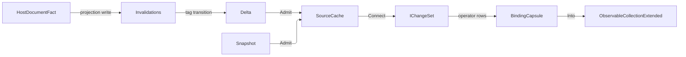

# [APPUI_LIVE_DATA]

Rasm.AppUi live data owns every change-set pipeline between data sources and screens: the seven-case `DataSource` axis, the operator-row vocabulary, the one UI-thread `BindingCapsule`, and the aggregation rows feeding stat tiles and evidence. The engine is DynamicData over System.Reactive — every source folds into one keyed `SourceCache`, key selectors transcribe the Persistence IdentityPolicy vocabulary, the Ui scheduler arrives from the surface scheduler boundary fed by `UiSchedulerPort`, and change evidence leaves through the `ReceiptSinkPort` envelope. The live-data spine — host fact to projection write to tag transition to delta fetch to `IChangeSet` — is the page's composite automation, and screens consume pipelines as expression folds beside their catalog rows.

## [01]-[INDEX]

- [02]-[DATA_SOURCES]: Seven sourcing cases; one cache feed dispatch; the live-data spine.
- [03]-[CHANGE_PIPELINES]: Operator rows; the one shaping fold over dynamic predicate and comparer streams.
- [04]-[BINDING_CAPSULE]: One UI-thread binding edge; single `ObserveOn`; the fault rail.
- [05]-[AGGREGATION_SPINE]: Stat folds, change-audit evidence, suspend-resume law.

## [02]-[DATA_SOURCES]

- Owner: `HostDocumentFact`, `SourcePolicy`, `DataSource<TRow, TKey>` — the closed sourcing axis; one generated dispatch feeds one keyed cache per projection, and every `SourcePolicy` axis lands on a composed operator inside `Open` — an inert policy field is the `POLICY_VALUES` rejected form.
- Cases: HostDocumentEvents, PersistenceQuery, CursorQuery, ReceiptStream, InMemorySeq, FakeDeterministic, OrderedList — `ReceiptStream.SourceKey` distinguishes compute and companion producers as seed data because both share admission, identity, timing, and consumer shape; the cursor row is the paged remote source: a large persisted set loads page-by-page through its opaque continuation cursor until `None`, so an unbounded snapshot fetch never rides the query row.
- Entry: `public Fin<DataSource<TRow,TKey>.Opened> Open(Func<TRow,TKey> key, SourcePolicy policy, Action<Error> fault)` — policy admission rejects non-positive expiry, size, refresh, and page-ceiling values before allocating the replay cache, and every optional axis declares the cases that consume it so an axis a case cannot read is inadmissible rather than silently inert; the carrier exposes the one keyed replay cache, the ordered source when order is a domain fact, and the activation-scope disposable.
- Auto: the live-data spine — a host watch fact drives the Persistence projection write, the tag transition fires `Invalidations`, `Delta` fetches the changed rows, and the cache emits `IChangeSet`; one named pipeline, zero bespoke glue; the emitted `IChangeSet` is the single delta spine — one `Connect` chain fans into chart `SeriesSource`, table projection, and aggregation tiles through `Transform`/`MergeMany` with zero materialized intermediate, so a new consumer subscribes to the existing delta and the source never forks into a second collection-mutation path.
- Packages: DynamicData, System.Reactive, LanguageExt.Core, Thinktecture.Runtime.Extensions, NodaTime
- Growth: a new feed is one case on the closed family; a new bound is one policy value on `SourcePolicy`; a new live consumer is one downstream chain off the existing `Connect`; zero new surface.
- Boundary: `Open` and `Admit` form the Rx-to-rail boundary capsule. Hosts enter only as fact and envelope delegates, key selectors transcribe Persistence identity policy, and late subscribers replay from cache state. `SourcePolicy` consumes scheduling, expiry, size, query-refresh, and page-ceiling axes. `OrderedList` keeps its `SourceList` as the authoritative ordered projection while folding each list reason incrementally into the keyed delta spine; `Opened.Ordered` exposes that same source without rebuilding order from a cache that cannot encode position. `CursorQuery` stages each page into a temporary keyed cache, rejects a repeated cursor and a chase past the admitted `PageCeiling`, swaps the completed snapshot once, and disposes staging, so neither a concatenated page sequence nor a non-repeating continuation chain grows unbounded and a failed refresh preserves the prior live cache; the chase runs on the policy scheduler and its whole lifetime — staging cache, scheduled walk, swap subscription — rides the returned disposable, so activation-scope teardown cancels a chase in flight. Every subscription failure lands in the one `Action<Error>` rail.

```csharp signature
public readonly record struct HostDocumentFact(int PhaseKey, uint DocumentSerial, Seq<Guid> ObjectIds, uint ChangeCounter);

// Every axis is consumed by Open: Source schedules timers and bound sweeps, Expiry -> ExpireAfter,
// SizeBound -> LimitSizeTo, Refresh -> the query-row re-snapshot interval, and PageCeiling -> the cursor
// chase bound. SizeBound governs the LIVE cache and cannot reach the staging chase, so the one loop a
// remote continuation drives carries its own admitted bound rather than inheriting a cache eviction.
public sealed record SourcePolicy(
    IScheduler Source,
    Option<Duration> Expiry = default,
    Option<int> SizeBound = default,
    Option<Duration> Refresh = default,
    Option<int> PageCeiling = default) {
    public Fin<SourcePolicy> Admit() =>
        Expiry.ForAll(static value => value > Duration.Zero)
            && SizeBound.ForAll(static value => value > 0)
            && Refresh.ForAll(static value => value > Duration.Zero)
            && PageCeiling.ForAll(static value => value > 0)
            ? Fin.Succ(this)
            : Fin.Fail<SourcePolicy>(new LiveDataFault.Source("expiry, size bound, refresh cadence, and page ceiling must be positive"));
}

[Union(ConversionFromValue = ConversionOperatorsGeneration.None)]
public abstract partial record DataSource<TRow, TKey> where TRow : notnull where TKey : notnull {
    private DataSource() { }

    public sealed record Opened(
        IObservableCache<TRow, TKey> Cache,
        Option<IObservableList<TRow>> Ordered,
        IDisposable Feed);

    public sealed record HostDocumentEvents(
        Func<Action<HostDocumentFact>, IDisposable> Facts,
        Func<HostDocumentFact, Seq<TRow>> Project) : DataSource<TRow, TKey>;

    public sealed record PersistenceQuery(
        Func<Fin<Seq<TRow>>> Snapshot,
        Func<Action<string>, IDisposable> Invalidations,
        Func<string, Fin<Seq<TRow>>> Delta) : DataSource<TRow, TKey>;

    public sealed record CursorQuery(
        Func<Option<string>, Fin<(Seq<TRow> Rows, Option<string> Next)>> Fetch) : DataSource<TRow, TKey>;

    public sealed record ReceiptStream(
        string SourceKey,
        Func<Action<ReceiptEnvelope>, IDisposable> Subscribe,
        Func<ReceiptEnvelope, Option<TRow>> Project) : DataSource<TRow, TKey>;

    public sealed record InMemorySeq(Seq<TRow> Rows) : DataSource<TRow, TKey>;

    public sealed record FakeDeterministic(Seq<(Duration At, Seq<TRow> Rows)> Script) : DataSource<TRow, TKey>;

    public sealed record OrderedList(Func<ISourceList<TRow>, IDisposable> Bind) : DataSource<TRow, TKey>;

    // Optional axes are case-scoped: refresh re-snapshots and only a query row can, the page ceiling bounds
    // a continuation chase and only the cursor row has one. Each axis names its readers as a row, so a value
    // a case cannot consume refuses at Open instead of sitting inert, and a new axis is one row rather than
    // another guard clause on this rail.
    private sealed record AxisRow(string Axis, string Cases, Func<SourcePolicy, bool> Carried, Func<DataSource<TRow, TKey>, bool> Reaches);

    private static readonly Seq<AxisRow> Axes = Seq(
        new AxisRow("refresh cadence", "the query rows", static policy => policy.Refresh.IsSome, static source => source is PersistenceQuery or CursorQuery),
        new AxisRow("page ceiling", "the cursor row", static policy => policy.PageCeiling.IsSome, static source => source is CursorQuery));

    public Fin<Opened> Open(Func<TRow, TKey> key, SourcePolicy policy, Action<Error> fault) =>
        policy.Admit()
            .Bind(admitted => Axes.Find(row => row.Carried(admitted) && !row.Reaches(this)).Match(
                Some: row => Fin.Fail<SourcePolicy>(new LiveDataFault.Source($"{row.Axis} admits only {row.Cases}")),
                None: () => Fin.Succ(admitted)))
            .Map(admitted => OpenAdmitted(key, admitted, fault));

    private Opened OpenAdmitted(Func<TRow, TKey> key, SourcePolicy policy, Action<Error> fault) {
        SourceCache<TRow, TKey> cache = new(key);
        DataFeed source = Feed(cache, key, policy, fault);
        return new Opened(cache, source.Ordered, new CompositeDisposable(cache, source.Subscription, Bounds(cache, policy, fault)));
    }

    // The policy operators live at the owning cache: ExpireAfter sweeps TTL leavers and LimitSizeTo evicts
    // oldest-first past the bound, both on the policy scheduler — a per-source bound reimplementation and an
    // inert policy field are the deleted forms.
    private static IDisposable Bounds(ISourceCache<TRow, TKey> cache, SourcePolicy policy, Action<Error> fault) =>
        new CompositeDisposable(
            policy.Expiry.Match(
                Some: ttl => (IDisposable)cache.ExpireAfter(_ => ttl.ToTimeSpan(), policy.Source)
                    .Subscribe(static _ => { }, raw => fault(LiveDataFault.Of("expiry", raw))),
                None: () => Disposable.Empty),
            policy.SizeBound.Match(
                Some: bound => (IDisposable)cache.LimitSizeTo(bound, policy.Source)
                    .Subscribe(static _ => { }, raw => fault(LiveDataFault.Of("size-bound", raw))),
                None: () => Disposable.Empty));

    private DataFeed Feed(ISourceCache<TRow, TKey> cache, Func<TRow, TKey> key, SourcePolicy policy, Action<Error> fault) =>
        Switch(
            state: (cache, key, policy, fault),
            hostDocumentEvents: static (s, c) => DataFeed.Unordered(c.Facts(fact => s.cache.Edit(updater => c.Project(fact).Iter(row => updater.AddOrUpdate(row))))),
            // The seed admission is an EFFECT, not a lifetime: it rides the let-idiom ahead of the feed rather
            // than a Disposable.Empty seat inside the composite, so every member of that composite is a
            // subscription teardown actually reaches.
            persistenceQuery: static (s, c) => Admit(s.cache, c.Snapshot(), s.fault, replace: true) switch {
                _ => DataFeed.Unordered(new CompositeDisposable(
                    c.Invalidations(tag => Admit(s.cache, c.Delta(tag), s.fault)),
                    s.policy.Refresh.Match(
                        Some: every => (IDisposable)Observable.Interval(every.ToTimeSpan(), s.policy.Source)
                            .Subscribe(_ => Admit(s.cache, c.Snapshot(), s.fault, replace: true), raw => s.fault(LiveDataFault.Of("query-refresh", raw))),
                        None: () => Disposable.Empty))),
            },
            // One serial slot holds the live chase: a refresh tick REPLACES it, so the prior walk cancels and
            // releases its staging cache instead of stacking one orphaned chase per interval, and teardown
            // reaches whichever chase is current.
            cursorQuery: static (s, c) => new SerialDisposable { Disposable = CursorSnapshot(s.cache, s.key, c.Fetch, s.policy, s.fault) } switch {
                var chase => DataFeed.Unordered(new CompositeDisposable(
                    chase,
                    s.policy.Refresh.Match(
                        Some: every => (IDisposable)Observable.Interval(every.ToTimeSpan(), s.policy.Source)
                            .Subscribe(
                                _ => chase.Disposable = CursorSnapshot(s.cache, s.key, c.Fetch, s.policy, s.fault),
                                raw => s.fault(LiveDataFault.Of("cursor-refresh", raw))),
                        None: () => Disposable.Empty))),
            },
            receiptStream: static (s, c) => DataFeed.Unordered(c.Subscribe(envelope => s.cache.Edit(updater => c.Project(envelope).Iter(row => updater.AddOrUpdate(row))))),
            inMemorySeq: static (s, c) => Admit(s.cache, Fin.Succ(c.Rows), s.fault) switch {
                _ => DataFeed.Unordered(Disposable.Empty),
            },
            fakeDeterministic: static (s, c) => DataFeed.Unordered(new CompositeDisposable(
                c.Script.Map(step => Observable.Timer(step.At.ToTimeSpan(), s.policy.Source)
                    .Subscribe(_ => Admit(s.cache, Fin.Succ(step.Rows), s.fault), raw => s.fault(LiveDataFault.Of("fake", raw)))))),
            orderedList: static (s, c) => Ordered(s.cache, s.key, c.Bind, s.fault));

    // Admission is an effect on the owning cache and carries no lifetime — a disposable return here would
    // promise a teardown the batch edit does not own.
    private static Unit Admit(ISourceCache<TRow, TKey> cache, Fin<Seq<TRow>> rows, Action<Error> fault, bool replace = false) =>
        rows.Match(
            Succ: admitted => fun(() => cache.Edit(updater => {
                if (replace) { updater.Clear(); }
                admitted.Iter(row => updater.AddOrUpdate(row));
            }))(),
            Fail: error => fun(() => fault(error))());

    // The chase is SCHEDULED on the policy scheduler, never a synchronous walk at the composition edge: the
    // returned composite carries the staging cache, the scheduled walk, and the swap subscription, so an
    // activation scope torn down mid-chase cancels the walk and releases staging. Pages stage into a keyed
    // cache as they arrive and swap into the live cache once; a failed page leaves the prior live snapshot.
    private static IDisposable CursorSnapshot(
        ISourceCache<TRow, TKey> cache,
        Func<TRow, TKey> key,
        Func<Option<string>, Fin<(Seq<TRow> Rows, Option<string> Next)>> fetch,
        SourcePolicy policy,
        Action<Error> fault) {
        SourceCache<TRow, TKey> staging = new(key);
        SerialDisposable swap = new();
        IDisposable walk = policy.Source.Schedule(() => Chase(staging, fetch, policy.PageCeiling, page: 0, None, Set<string>()).Match(
            Succ: _ => swap.Disposable = staging.Connect().ToCollection().Take(1).Subscribe(
                rows => cache.Edit(updater => {
                    updater.Clear();
                    rows.Iter(row => updater.AddOrUpdate(row));
                }),
                raw => fault(LiveDataFault.Of("cursor-swap", raw))),
            Fail: error => (fun(() => fault(error))(), (IDisposable)Disposable.Empty).Item2));
        // Disposal order is the teardown order: cancel the walk, release the swap subscription, then the cache
        // the walk was staging into.
        return new CompositeDisposable(walk, swap, staging);
    }

    // Two bounds guard the walk: the visited set catches a repeating cursor and the admitted PageCeiling
    // catches a fresh non-repeating one, which no cycle guard can see and which otherwise drives an
    // unbounded loop accumulating unbounded staging rows.
    private static Fin<Unit> Chase(
        ISourceCache<TRow, TKey> staging,
        Func<Option<string>, Fin<(Seq<TRow> Rows, Option<string> Next)>> fetch,
        Option<int> ceiling,
        int page,
        Option<string> cursor,
        Set<string> visited) =>
        ceiling.Exists(bound => page >= bound)
            ? Fin.Fail<Unit>(new LiveDataFault.Source($"cursor chase exceeded {ceiling.IfNone(page)} pages"))
            : cursor.Exists(visited.Contains)
            ? Fin.Fail<Unit>(new LiveDataFault.Source($"cursor cycle at {cursor.IfNone(string.Empty)}"))
            : fetch(cursor).Bind(fetched => {
                Set<string> seen = cursor.Match(Some: visited.Add, None: () => visited);
                staging.Edit(updater => fetched.Rows.Iter(row => updater.AddOrUpdate(row)));
                return fetched.Next.Match(
                    Some: next => Chase(staging, fetch, ceiling, page + 1, Some(next), seen),
                    None: static () => Fin.Succ(unit));
            });

    // Incremental list-to-cache fold: every SourceList delta lands as its own keyed delta — Add-class
    // reasons upsert, Remove-class reasons remove by key, Clear clears once; the clear-then-reinsert cache
    // rewrite that turned one ordered edit into a full reset is the deleted form. Item-class reasons read
    // `Change<T>.Item.Current` and range-class reasons enumerate `Change<T>.Range` directly.
    private static DataFeed Ordered(ISourceCache<TRow, TKey> cache, Func<TRow, TKey> key, Func<ISourceList<TRow>, IDisposable> bind, Action<Error> fault) {
        SourceList<TRow> list = new();
        return new DataFeed(
            new CompositeDisposable(
                list,
                bind(list),
                list.Connect().Subscribe(
                    changes => cache.Edit(updater => changes.Iter(change => Fold(updater, key, change, fault))),
                    raw => fault(LiveDataFault.Of("ordered", raw)))),
            Some<IObservableList<TRow>>(list));
    }

    private sealed record DataFeed(IDisposable Subscription, Option<IObservableList<TRow>> Ordered) {
        public static DataFeed Unordered(IDisposable subscription) => new(subscription, None);
    }

    private static Unit Fold(ISourceUpdater<TRow, TKey> updater, Func<TRow, TKey> key, Change<TRow> change, Action<Error> fault) =>
        change.Reason switch {
            ListChangeReason.Add or ListChangeReason.Replace or ListChangeReason.Refresh or ListChangeReason.Moved =>
                ignore(fun(() => updater.AddOrUpdate(change.Item.Current))()),
            ListChangeReason.AddRange => ignore(fun(() => change.Range.Iter(row => updater.AddOrUpdate(row)))()),
            ListChangeReason.Remove => ignore(fun(() => updater.RemoveKey(key(change.Item.Current)))()),
            ListChangeReason.RemoveRange => ignore(fun(() => change.Range.Iter(row => updater.RemoveKey(key(row))))()),
            ListChangeReason.Clear => ignore(fun(updater.Clear)()),
            _ => fun(() => fault(new LiveDataFault.Source($"unsupported list change {change.Reason}")))(),
        };
}
```


```mermaid
---
config:
  layout: elk
  flowchart:
    curve: linear
    padding: 25
---
flowchart LR
    accTitle: Live-data admission spine
    accDescr: Host facts and snapshots converge through typed admission into one source cache, change-set pipeline, binding capsule, and collection.
    HostDocumentFact -->|projection write| Invalidations
    Invalidations -->|tag transition| Delta
    Snapshot -->|Admit| SourceCache
    Delta -->|Admit| SourceCache
    SourceCache -->|Connect| IChangeSet
    IChangeSet -->|operator rows| BindingCapsule
    BindingCapsule -->|Into| ObservableCollectionExtended
```

## [03]-[CHANGE_PIPELINES]

- Owner: `PipelineInputs<TRow,TKey>` — the SHAPING inputs of one delta chain: dynamic predicates and comparers are observable values and `Refresh` is the optional composition-supplied property-refresh fold.
- Entry: `public IObservable<IChangeSet<TRow,TKey>> Shape(IObservable<IChangeSet<TRow,TKey>> source)` — the one shaping fold, filter then sort then the optional refresh, over a source `Connect`.
- Packages: DynamicData
- Growth: a new operator concern is one operator row; a new bound is one policy value; zero new surface.
- Boundary: predicates and comparers arrive as streams from screen state and `Refresh` composes the catalogued `AutoRefresh` shape only when the row model admits it. Re-filtering pushes a predicate and grouping remains one projection-policy choice; repository layers, per-screen pipeline classes, and a second cache are rejected. DELIVERY is not shaped here — the `Page` and `Virtualise` rows below are composed by the surface that owns the window, `Editing/tables#TREE_FLATTEN` `TableProjection` for the grid and `Shell/virtualization#WINDOW_OWNER` `VirtualWindow` for the extent-ledger fabric, so a live-data delivery union beside them is a second windowing owner the `[04]-[BOUNDARIES]` per-surface-virtualizer law rejects and the one this section deleted.

```csharp signature
// Refresh stays a composition-supplied FOLD rather than a row vocabulary, and the discriminant is a type
// constraint this owner cannot carry: `AutoRefresh` binds `TObject : INotifyPropertyChanged` while
// `PipelineInputs` admits any notnull row model, so a refresh case here would constrain every non-notifying
// consumer out of the pipeline. The caller that knows its row model notifies supplies the operator.
public sealed record PipelineInputs<TRow, TKey>(
    IObservable<Func<TRow, bool>> Predicates,
    IObservable<IComparer<TRow>> Comparers,
    Option<Func<IObservable<IChangeSet<TRow, TKey>>, IObservable<IChangeSet<TRow, TKey>>>> Refresh);

public static class PipelineFolds {
    extension<TRow, TKey>(PipelineInputs<TRow, TKey> inputs) where TRow : notnull where TKey : notnull {
        public IObservable<IChangeSet<TRow, TKey>> Shape(IObservable<IChangeSet<TRow, TKey>> source) {
            IObservable<IChangeSet<TRow, TKey>> shaped = source.Filter(inputs.Predicates).Sort(inputs.Comparers);
            return inputs.Refresh.Match(Some: apply => apply(shaped), None: () => shaped);
        }
    }
}
```

| [INDEX] | [ROW]                 | [OPERATORS]             | [POLICY]                                                           |
| :-----: | :-------------------- | :---------------------- | :----------------------------------------------------------------- |
|  [01]   | dynamic-filter        | Filter                  | predicate stream from `Predicates`; pushed value, zero resubscribe |
|  [02]   | comparative-sort      | Sort                    | comparer stream from `Comparers` for mid-pipeline order            |
|  [03]   | projection            | Transform               | row models projected from store and receipt shapes                 |
|  [04]   | flat-map              | TransformMany           | one host fact expands to N child rows                              |
|  [05]   | live-grouping         | Group                   | group change sets for live tiles                                   |
|  [06]   | stable-grouping       | GroupWithImmutableState | the projection-policy row for paged and virtualized projections    |
|  [07]   | property-refresh      | AutoRefresh             | composition-supplied `Refresh` fold over the shaped change-set     |
|  [08]   | child-merge           | MergeMany               | child observable composition                                       |
|  [09]   | timed-expiry          | ExpireAfter             | applied at `Open` from `SourcePolicy.Expiry` (cache-ttl allotment) |
|  [10]   | size-bound            | LimitSizeTo             | applied at `Open` from `SourcePolicy.SizeBound`                    |
|  [11]   | paging                | Page                    | composed at `Editing/tables` `TableProjection.Paged`               |
|  [12]   | windowing             | Virtualise              | composed at `Shell/virtualization` `VirtualWindow.Realize`         |
|  [13]   | set-algebra           | And, Or, Except, Xor    | keyed source composition across `DataSource` outputs               |
|  [14]   | classified-exclusion  | Except                  | subtracts the `DataClassification` deny projection                 |
|  [15]   | item-state-filter     | FilterOnObservable      | per-row `IObservable<bool>` admission; item-state change re-files  |
|  [16]   | item-async-projection | TransformOnObservable   | per-row `IObservable<TDest>`; async results land on the one rail   |
|  [17]   | aggregate-delta       | ForAggregation          | `IAggregateChangeSet` deltas the `[05]` custom folds scan          |

## [04]-[BINDING_CAPSULE]

- Owner: `BindingCapsule` — the single UI-thread binding edge; `LiveDataFault` — the typed fault family on the `AppUiFaultBand.LiveData` registry row (6340), the ONE conversion every Rx failure crosses before reaching the fault rail.
- Entry: `public IDisposable Into<TRow, TKey>(IObservable<IChangeSet<TRow, TKey>> pipeline, ObservableCollectionExtended<TRow> target, Option<IObservable<IComparer<TRow>>> order = default)` — sorted binding rides the comparer stream, absent order is the bare bind, and both read the capsule's one `Bind` posture; `IntoList<TRow, TKey>(IObservable<IChangeSet<TRow, TKey>> pipeline, IObservableList<TRow> target)` binds the insertion-ordered consumer through `BindToObservableList`; `Drained<TRow, TKey>(IObservable<IChangeSet<TRow, TKey>> pipeline, Action<IObservable<Unit>> drainHook)` binds async disposal for `IAsyncDisposable` rows — the accessor receives the disposals-completed stream the activation scope awaits at teardown.
- Packages: DynamicData, System.Reactive, LanguageExt.Core
- Growth: a new binding posture is one `SortAndBindOptions` value on the capsule's `Bind` column; the list-target bind is one `IntoList` row and the async-drain hook is one `Drained` row on the capsule; zero new surface.
- Boundary: the capsule is the UI-thread boundary capsule and this fence carries the subscription edge under that carve-out; `ObserveOn` applies exactly once here — a second `ObserveOn` anywhere in a pipeline is the named defect; `Ui` arrives from the surface scheduler boundary fed by `UiSchedulerPort`; the `Bind` column is the ONE binding posture both bind arms read — the sorted arm hands it to the `SortAndBind(target, comparers, options)` overload and the unsorted arm derives its `BindingOptions` from the same three columns, so the reset threshold, replace-for-update policy, and first-load reset are declared once and `BindingOptions.NeverFireReset` is a posture value rather than a second knob; every `Into` disposable registers into the caller's activation scope, whose disposal receipts are the screens law — no second disposal stream exists here; the `IntoList` edge is the one ordered-target binding — it consumes the `OrderedList` source delta and reattaches insertion order through `BindToObservableList` so the ordered consumer never forks a second collection-mutation path, and a `SortAndBind` over an unordered source beside it is the deleted form; rows holding disposable child resources are `IAsyncDisposable` and bind through `AsyncDisposeMany`, whose `Action<IObservable<Unit>>` accessor hands the disposals-completed stream to the activation scope so leavers release asynchronously before teardown — a synchronous `DisposeMany` over async-disposable rows is the deleted form; faults reach the screen fault state through `Fault` as typed `LiveDataFault` cases (the `LiveDataFault.Of` conversion is the one Rx-to-rail fold — a bare `Error.New` on a subscription edge is the deleted form) and silent failure is structurally impossible; bulk admissions batch through `SuspendNotifications` on `ObservableCollectionExtended` at load edges.

```csharp signature
[Union(ConversionFromValue = ConversionOperatorsGeneration.None)]
public abstract partial record LiveDataFault : Expected {
    private LiveDataFault(string detail, int code) : base(detail, code) { }
    public sealed record Pipeline(string Edge, string Reason)
        : LiveDataFault($"live/pipeline: {Edge}: {Reason}", AppUiFaultBand.LiveData.Code(0));
    public sealed record Source(string Reason)
        : LiveDataFault($"live/source: {Reason}", AppUiFaultBand.LiveData.Code(1));

    // The ONE Rx-to-rail conversion: every subscription edge folds its exception through here.
    public static LiveDataFault Of(string edge, Exception raw) => new Pipeline(edge, raw.Message);
}

public sealed record BindingCapsule(IScheduler Ui, Action<Error> Fault, SortAndBindOptions Bind) {
    // Two named postures close the axis: Batched fires one collection reset past the threshold — the
    // virtualization-friendly batch path — and Incremental never resets, for a control that mishandles it.
    // Binary search rides both because the capsule binds a comparer stream, which is pure by contract.
    public static readonly SortAndBindOptions Batched = new() { UseBinarySearch = true };
    public static readonly SortAndBindOptions Incremental = Batched with { ResetThreshold = int.MaxValue, ResetOnFirstTimeLoad = false };

    public IDisposable Into<TRow, TKey>(
        IObservable<IChangeSet<TRow, TKey>> pipeline,
        ObservableCollectionExtended<TRow> target,
        Option<IObservable<IComparer<TRow>>> order = default)
        where TRow : notnull where TKey : notnull =>
        (order.Case switch {
            // The unsorted arm's BindingOptions is DERIVED, never a second declaration: its three columns are
            // exactly the three the posture already carries, so one policy value governs both bind shapes.
            IObservable<IComparer<TRow>> comparers => pipeline.ObserveOn(Ui).SortAndBind(target, comparers, Bind),
            _ => pipeline.ObserveOn(Ui).Bind(target, new BindingOptions(Bind.ResetThreshold, Bind.UseReplaceForUpdates, Bind.ResetOnFirstTimeLoad)),
        }).Subscribe(static _ => { }, raw => Fault(LiveDataFault.Of("into", raw)));

    public IDisposable IntoList<TRow, TKey>(
        IObservable<IChangeSet<TRow, TKey>> pipeline,
        IObservableList<TRow> target)
        where TRow : notnull where TKey : notnull =>
        pipeline.ObserveOn(Ui)
            .BindToObservableList(target)
            .Subscribe(static _ => { }, raw => Fault(LiveDataFault.Of("into-list", raw)));

    // AsyncDisposeMany disposes IAsyncDisposable leavers itself; the accessor receives the one
    // disposals-completed stream the activation scope awaits before teardown.
    public IDisposable Drained<TRow, TKey>(
        IObservable<IChangeSet<TRow, TKey>> pipeline,
        Action<IObservable<Unit>> drainHook)
        where TRow : notnull, IAsyncDisposable where TKey : notnull =>
        pipeline.AsyncDisposeMany(drainHook)
            .Subscribe(static _ => { }, raw => Fault(LiveDataFault.Of("drained", raw)));
}
```

## [05]-[AGGREGATION_SPINE]

- Owner: `LiveDataOps` — the stat-fold bind attaches to the capsule as one extension block beside the fault projection; the aggregation vocabulary is the `StatFold` row set, and a multi-accumulator statistic reduces inside ONE `ForAggregation` scan because a second subscription over the same feed publishes each accumulator against a different revision.
- Entry: `public IDisposable Tile(IObservable<IChangeSet<StatSample, string>> pipeline, StatFold fold, Func<StatSample, double> value, Action<double> render)` — the fold ROW is the parameter, so a tile statistic is recoverable from its declaration and no aggregate lambda crosses the bind edge; `public static Fin<Unit> Observe(InstrumentSet set, string slot, Error fault)` — the fault projection composition binds at the capsule's one `Action<Error>` edge.
- Receipt: change-audit rows fold `ChangeSummary` scalars into one `EvidenceReceipt.LiveData` case (adds, updates, removes, refreshes per slot) sealed through the `ReceiptSinkPort` envelope — process-local, HLC-correlated, one union case at the evidence owner, never a parallel evidence shape; `TelemetryRow` contributes the change-throughput and live-fault instruments inward through the AppHost `TelemetryContributorPort`.
- Packages: DynamicData, System.Reactive, LanguageExt.Core
- Growth: a new statistic is one `StatFold` row carrying its aggregation delegate; one live instrument is one `InstrumentSpec` row on `LiveDataOps.TelemetryRow` with its owning projection beside it; zero new surface.
- Boundary: suspend and resume ride the activation scope — surface visibility drives activation at the screens owner, a hidden surface holds zero live subscriptions, and cache state delivers instant replay on resume; gauge and stat tiles on the dashboard surfaces bind their `StatFold` row through `Tile`, whose `StatSample` feed carries the population weight the weighted mean reduces on, so an aggregate the tile renders is a row value and a bind-edge lambda is the deleted form; the change-throughput instrument pulls from the `ChangeStatistics` count through the evidence fan and the live-fault instrument from `Observe` bound at the one `Action<Error>` rail, so metrics and the `ReceiptSinkPort` evidence stream derive from the same audit and a second hand-synced counter is the rejected form; an OAPH mirror of change-set state, a stats service, and a notification-center history store are the rejected forms.

```csharp signature
public static class LiveDataOps {
    public const string ChangesInstrument = "rasm.appui.live.changes";
    public const string FaultsInstrument = "rasm.appui.live.faults";

    public static TelemetryContributorPort TelemetryRow(string version) =>
        AppUiTelemetry.Contribute(version,
            InstrumentSpec.Count(ChangesInstrument, "{change}", "live change-set operations by slot and change kind", MeasureForm.Whole,
                AppUiTelemetry.SlotSlot, AppUiTelemetry.ChangeSlot),
            InstrumentSpec.Count(FaultsInstrument, "{fault}", "live-data faults by slot and fault code", MeasureForm.Whole,
                AppUiTelemetry.SlotSlot, AppUiTelemetry.OutcomeSlot));

    // The one `Action<Error>` rail IS the producer this row's description names: composition binds the
    // projection at the capsule's fault edge, so every LiveDataFault the Rx-to-rail fold raises counts once
    // under the pipeline slot that raised it, and the returned rail parks beside every other tap refusal
    // rather than being discarded at the subscription edge.
    public static Fin<Unit> Observe(InstrumentSet set, string slot, Error fault) =>
        set.Write(FaultsInstrument, 1L, InstrumentSet.Tags(
            (AppUiTelemetry.SlotSlot, slot), (AppUiTelemetry.OutcomeSlot, fault.Code)));

    extension(BindingCapsule capsule) {
        // The StatFold ROW crosses this edge, never a fold lambda: the row owns the DynamicData aggregation
        // (including the ForAggregation scan the weighted mean reduces two accumulators in) and the value
        // selector projects the measured scalar off each StatSample, so a tile's statistic is recoverable
        // from its declaration and one entrypoint serves every stat and gauge row.
        public IDisposable Tile(
            IObservable<IChangeSet<StatSample, string>> pipeline,
            StatFold fold,
            Func<StatSample, double> value,
            Action<double> render) =>
            fold.Fold(pipeline, value).ObserveOn(capsule.Ui).Subscribe(render, raw => capsule.Fault(LiveDataFault.Of("tile", raw)));
    }
}
```

| [INDEX] | [ROW]         | [FOLD]                              | [CONSUMER]                                       |
| :-----: | :------------ | :---------------------------------- | :----------------------------------------------- |
|  [01]   | count         | Count                               | stat tiles                                       |
|  [02]   | sum           | Sum                                 | stat tiles                                       |
|  [03]   | average       | Avg                                 | stat tiles                                       |
|  [04]   | minimum       | Minimum                             | stat tiles                                       |
|  [05]   | maximum       | Maximum                             | stat tiles                                       |
|  [06]   | deviation     | StdDev                              | stat tiles                                       |
|  [07]   | weighted-mean | ForAggregation to a numerator Scan  | stat and gauge tiles over pre-reduced rows       |
|  [08]   | change-audit  | CollectUpdateStats to ChangeSummary | `EvidenceReceipt.LiveData` via `ReceiptSinkPort` |

## [06]-[RESEARCH]

(none)
