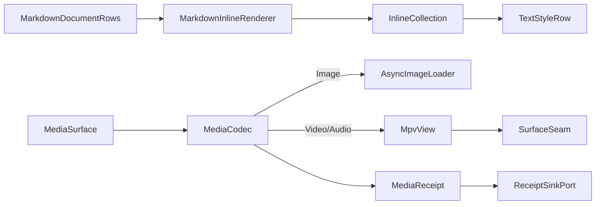

# [APPUI_RICH_CONTENT_MEDIA]

A rich-content-and-media owner renders markdown to live Avalonia inlines and plays image/video/audio through one `MediaSurface` over codec rows, so documentation cells, help, and embedded media become first-class content surfaces beside the code editor. `MarkdownInlineRenderer` walks the `Theme/typography` `MarkdownRow`/`InlineRun` projection into theme-token-styled `Avalonia.Controls.Documents` inlines (the retained materialization the typography projection produces rows for but does not itself mount), and `MediaSurface` is the `[Union]` over image/video/audio codec rows mounting on the one render `SurfaceSeam` with `HanumanInstitute.LibMpv.Avalonia` driving video/audio and the admitted `AsyncImageLoader` the image row. The page owns the markdown retained-materialization, the media codec-row union, and the playback transport; it mints no second markdown model (the typography owner holds the AST projection), no second image cache, and no per-surface codec — one content vocabulary serves every rich surface and a new codec is one row (the `[05]-[PROHIBITIONS]` per-surface-AsyncImageLoader and SKSurface-outside-Offscreen clauses hold). The spine is `Theme/typography` `MarkdownProjection`, `Avalonia.Controls.Documents`, `AsyncImageLoader.Avalonia`, `HanumanInstitute.LibMpv`/`HanumanInstitute.LibMpv.Avalonia` (`.api/api-libmpv.md`), the render `SurfaceSeam`, Thinktecture.Runtime.Extensions, and LanguageExt rails.

## [01]-[INDEX]

- [01]-[MARKDOWN_INLINES]: The `MarkdownRow`/`InlineRun` retained materialization into theme-token Avalonia inlines.
- [02]-[MEDIA_SURFACE]: The `MediaSurface` `[Union]` codec rows mounting on the one render `SurfaceSeam`.
- [03]-[PLAYBACK_TRANSPORT]: One playback transport rail over the libmpv `MpvContext`.

## [02]-[MARKDOWN_INLINES]

- Owner: `MarkdownInlineRenderer` the `MarkdownRow`/`InlineRun`-to-Avalonia-inline materialization; `InlineStyle` the per-run token-style resolve; `ContentFault` the fault family in the 4B00 code band.
- Cases: `ContentFault` = Text | UnresolvedRole | CodecAbsent | DecodeFailed in the 4B00 code band.
- Entry: `public InlineCollection Render(MarkdownDocumentRows rows, FontChain chain)` — materializes the `Theme/typography` `MarkdownProjection.Project` rows into one `InlineCollection` of `Avalonia.Controls.Documents` `Run`/`Bold`/`Italic`/`Span` styled through the resolved `TextStyleRow`; `public Control Block(MarkdownRow row, FontChain chain)` — materializes a block row (heading, quote, list, grid, code-fence, rule) into its container control.
- Auto: the markdown AST projection is owned by `Theme/typography` (`MarkdownProjection`, the closed seven-arm fold to `MarkdownRow`/`InlineRun`) — this renderer consumes those rows and never re-parses, so a parallel markdown model is the deleted form; each `InlineRun` materializes into a `Run` wrapped in `Bold`/`Italic`/`Span` per its `Strong`/`Emphasis`/`Code`/`Link` flags, styled through `TextStyleRow.Resolve(role, chain)` so the inline font, weight, tracking, line-height, and OpenType features ride the one `TypographyRole` vocabulary (the `Code` run takes the mono role, a heading takes its `HeadingRole`); a `CodeFence` row hands off to the `Inspector#CODE_EDITING` `CodePane` with its language tag so the renderer never highlights code; an `HtmlBlock`/`HtmlInline` run degrades to empty per the typography projection so raw HTML never enters the retained tree; the round-trip `SourceSpan` on each run maps a retained run back to its byte range for editor sync.
- Packages: Markdig, Avalonia, Thinktecture.Runtime.Extensions, LanguageExt.Core
- Growth: a new inline style is one `InlineStyle` resolve over an existing `TypographyRole`; a new block container is one `Block` arm over the closed `MarkdownRow` family; zero new surface.
- Boundary: the markdown AST is the `Theme/typography` owner — the renderer materializes its `MarkdownRow`/`InlineRun` rows into `Avalonia.Controls.Documents` inlines and a `Markdig` re-parse or a parallel markdown node model is the deleted form (the typography `MARKDOWN_PROJECTION` boundary names this retained materialization as the consumer of its rows); every inline styles through `TextStyleRow.Resolve` so an inline font literal is the rejected form and the markdown styling rides the one typography vocabulary (the `csharp:Rasm.AppUi/Theme/typography` seam owns the inline-styling roles); the renderer materializes `Run` inside `Span`/`Bold`/`Italic` with `LineBreak` appended to one `InlineCollection`, so a hand-built `TextBlock` per run is the deleted form; `Inlines` dispatches the closed `MarkdownRow` family through the total generated `.Switch` so a new `MarkdownRow` case breaks this site at compile time and a silent `_` catch-all dropping a block is the rejected form — the inline-bearing arms (`Paragraph`/`Heading`/`Quote`) project runs while the block-container arms (`ListRows`/`Grid`/`CodeFence`/`Rule`) return empty here and materialize through `Block`, so the inline-versus-block split is exhaustive and compile-checked; the code-fence hands off to the `CodePane` so the renderer owns only prose and a fenced-code highlighter here is the rejected form; the notebook markdown cells, help, and inspector docs consume this one renderer so a notebook-local markdown renderer is the deleted form (`Notebook#CELL_MODEL` markdown cells route here).

```csharp signature
[Union]
public abstract partial record ContentFault : Expected, IValidationError<ContentFault> {
    private ContentFault(string detail, int code) : base(detail, code, None) { }

    public static ContentFault Create(string message) => new Text(message);

    public sealed record Text : ContentFault { public Text(string detail) : base(detail, 0x4B00) { } }
    public sealed record UnresolvedRole : ContentFault { public UnresolvedRole(string detail) : base(detail, 0x4B01) { } }
    public sealed record CodecAbsent : ContentFault { public CodecAbsent(string detail) : base(detail, 0x4B02) { } }
    public sealed record DecodeFailed : ContentFault { public DecodeFailed(string detail) : base(detail, 0x4B03) { } }
}

public static class MarkdownInlineRenderer {
    public static InlineCollection Render(MarkdownDocumentRows rows, FontChain chain) {
        var collection = new InlineCollection();
        rows.Body.Iter(row => Inlines(row, chain).Iter(collection.Add));
        return collection;
    }

    static Seq<Inline> Inlines(MarkdownRow row, FontChain chain) => row.Switch(
        state: chain,
        paragraph: static (c, paragraph) => paragraph.Runs.Map(run => Styled(run, TypographyRole.Body, c)),
        heading: static (c, heading) => heading.Runs.Map(run => Styled(run, heading.Role, c)),
        quote: static (c, quote) => quote.Children.Bind(child => Inlines(child, c)),
        listRows: static (_, _) => Seq<Inline>(),
        grid: static (_, _) => Seq<Inline>(),
        codeFence: static (_, _) => Seq<Inline>(),
        rule: static (_, _) => Seq<Inline>());

    static Inline Styled(InlineRun run, TypographyRole role, FontChain chain) {
        var style = TextStyleRow.Resolve(run.Code ? TypographyRole.Code : role, chain);
        Inline inline = new Run(run.Text) { FontFamily = new FontFamily(style.Family), FontSize = style.Size, FontWeight = (FontWeight)style.Weight };
        inline = run.Strong ? new Bold { Inlines = { inline } } : inline;
        inline = run.Emphasis ? new Italic { Inlines = { inline } } : inline;
        return inline;
    }
}
```

## [03]-[MEDIA_SURFACE]

- Owner: `MediaSurface` the `[Union]` codec-row family; `MediaCodec` the per-kind decode-and-mount row; `MediaReceipt` the load evidence.
- Cases: `MediaSurface` = Image | Video | Audio under the locked kind literals — image rides the admitted `AsyncImageLoader`, video and audio ride `HanumanInstitute.LibMpv.Avalonia` on the one `SurfaceSeam`.
- Entry: `public Fin<Control> Mount(MediaSurface surface, SurfaceSeam seam)` — projects each codec row onto its control mounted on the one render `SurfaceSeam`; the `Fin` rail seals a `CodecAbsent` fault when a codec's native backend is unprovisioned.
- Auto: the `Image` case mounts the admitted `AsyncImageLoader.Avalonia` `AdvancedImage` control with its `Loader` set to the global `ImageLoader.AsyncImageLoader` (the `RamCachedWebImageLoader`-backed single cache) so an image loads async off the UI thread through the one image cache with `AdvancedImage` owning load state, fallback, and `Stretch` (the `[05]-[PROHIBITIONS]` per-surface-AsyncImageLoader clause — one cache, not per-surface); the `Video` and `Audio` cases compose `MpvView` with `Renderer` set to `VideoRenderer.OpenGl` so playback shares the Avalonia GL surface rather than a `NativeControlHost` airspace (`.api/api-libmpv.md` local admission), mounting on the one render `SurfaceSeam`; a new codec is one `MediaSurface` case so the codec vocabulary is the absorbing axis; every media surface mounts on the single `SurfaceSeam` render host so a per-surface codec is deleted.
- Receipt: `MediaReceipt` — surface key, codec kind, source identity, mount outcome, `Instant`; `TelemetryRow` contributes the media-mounted and media-failed instruments inward through the AppHost `TelemetryContributorPort`.
- Packages: AsyncImageLoader.Avalonia, HanumanInstitute.LibMpv, HanumanInstitute.LibMpv.Avalonia, Avalonia, Thinktecture.Runtime.Extensions, LanguageExt.Core, NodaTime
- Growth: a new codec is one `MediaSurface` case mounting on the same `SurfaceSeam`; one media instrument is one `InstrumentRow` on `MediaSurfaces.TelemetryRow`; zero new surface.
- Boundary: the media vocabulary is the one `MediaSurface` union — a per-surface codec, a second image cache, and a parallel video player are the rejected forms, so a new codec is one row and every surface mounts on the one `SurfaceSeam` (`Hosts#HOST_AXIS`); the image row is the admitted `AsyncImageLoader` single cache so a per-surface `AsyncImageLoader` is the `[05]-[PROHIBITIONS]` rejected form; the video/audio row is `HanumanInstitute.LibMpv.Avalonia` on the OpenGL render path so a bundled libmpv native binary and a `NativeControlHost` airspace embedding are the rejected forms (`.api/api-libmpv.md` reject law), the libmpv native provisioning at the app-host distribution layer; the media surface never owns an `SKSurface` — its render rides the libmpv GL path and the image cache, so an `SKSurface` outside the `Offscreen` capsule is the `[05]-[PROHIBITIONS]` rejected form; playback control flows through the `MpvContext` the bound `IVideoView` exposes, never a hand-rolled mpv command marshaller (`.api/api-libmpv.md` reject); every `MpvContext`/view/overlay disposes through `IVideoView.Dispose` at teardown so the render context releases.

```csharp signature
[Union(ConversionFromValue = ConversionOperatorsGeneration.None)]
public abstract partial record MediaSurface {
    private MediaSurface() { }

    public sealed record Image(string Key, string Source, Stretch Stretch) : MediaSurface;
    public sealed record Video(string Key, string Source, bool AutoPlay, bool Loop) : MediaSurface;
    public sealed record Audio(string Key, string Source, bool AutoPlay) : MediaSurface;

    public string Key => Switch(image: static i => i.Key, video: static v => v.Key, audio: static a => a.Key);

    public string Source => Switch(image: static i => i.Source, video: static v => v.Source, audio: static a => a.Source);
}

public sealed record MediaReceipt(string Key, string Codec, string Source, bool Mounted, Instant At) {
    public const string Kind = "media";
}

public static class MediaSurfaces {
    public const string MountedInstrument = "rasm.appui.media.mounted";
    public const string FailedInstrument = "rasm.appui.media.failed";

    public static TelemetryContributorPort TelemetryRow(string version) =>
        AppUiTelemetry.Contribute(version, MountedInstrument, FailedInstrument);

    public static Fin<Control> Mount(MediaSurface surface, SurfaceSeam seam) => surface.Switch(
        state: seam,
        image: static (s, i) => Fin<Control>.Succ(new AdvancedImage(new Uri(i.Source)) { Stretch = i.Stretch, Loader = ImageLoader.AsyncImageLoader }),
        video: static (s, v) => Fin<Control>.Succ(new MpvView { Renderer = VideoRenderer.OpenGl }),
        audio: static (s, a) => Fin<Control>.Succ(new MpvView { Renderer = VideoRenderer.OpenGl }));
}
```

## [04]-[PLAYBACK_TRANSPORT]

- Owner: `PlaybackTransport` the one playback transport over the libmpv `MpvContext`; `TransportState` the observed position-and-state snapshot.
- Entry: `public IO<Unit> Load(MpvContext context, string source)` — opens media through `LoadFile`; `public IO<Unit> Command(MpvContext context, TransportVerb verb)` — folds a transport verb onto its `MpvContext` member, never a per-control playback handler.
- Auto: transport verbs (play/pause/seek/speed/volume/mute) fold onto the typed `MpvContext` members — `Pause`/`Speed`/`Volume`/`Mute` options, `TimePos`/`PercentPos` for seek, `LoadFile` for source intake (`.api/api-libmpv.md` transport properties); position and state surface through the observed `MpvPropertyRead` members (`TimePos`, `Duration`, `EofReached`, `Seeking`) and the `PropertyChanged` event so the surface never polls libmpv on a timer; the transport binds as `CommandIntent` rows so a media-control toolbar derives from the one command table; playback verbs map onto the pan-zoom-style continuous and discrete intents so a scrub gesture and a play button ride the same intent vocabulary.
- Packages: HanumanInstitute.LibMpv, System.Reactive, Thinktecture.Runtime.Extensions, LanguageExt.Core
- Growth: a new transport verb is one `TransportVerb` value folding onto its `MpvContext` member; zero new surface.
- Boundary: playback transport is the one rail over the typed `MpvContext` — a hand-rolled mpv command/property marshaller is the rejected form (`.api/api-libmpv.md` reject), so transport verbs fold onto the named `MpvContext` members; position surfaces through observed `MpvPropertyRead`/`PropertyChanged`, never a polling timer; transport verbs derive as `CommandIntent` rows so a media control is an intent key, never a transport-local command registry; the transport correlates its receipts through the `MediaReceipt` family so playback evidence rides one stream; a transient seek mutates the live position and re-applies through `RevertSeek`, so a scrub-and-revert rides the libmpv transport rather than a snapshot.

```csharp signature
[SmartEnum<string>]
public sealed partial class TransportVerb {
    public static readonly TransportVerb Play = new("play");
    public static readonly TransportVerb Pause = new("pause");
    public static readonly TransportVerb Seek = new("seek");
    public static readonly TransportVerb Speed = new("speed");
    public static readonly TransportVerb Volume = new("volume");
    public static readonly TransportVerb Mute = new("mute");
}

public readonly record struct TransportState(double Position, double Duration, bool Playing, bool Seeking);

public static class PlaybackTransport {
    public const string PlayIntent = "media.play";
    public const string PauseIntent = "media.pause";
    public const string SeekIntent = "media.seek";

    public static IO<Unit> Load(MpvContext context, string source) =>
        IO.liftAsync(async () => { await context.LoadFile(source).ConfigureAwait(false); return unit; });
}
```



## [05]-[RESEARCH]

- [INLINE_DOCUMENTS]: the `Avalonia.Controls.Documents` inline-materialization surface the `MarkdownInlineRenderer` mounts — the `Run`/`Bold`/`Italic`/`Span`/`LineBreak` construction and the `InlineCollection.Add` append the `Theme/typography` `MARKDOWN_PROJECTION` boundary names — resolved at implementation against the Avalonia 12 documents surface; the `MarkdownRow`/`InlineRun` rows (typography-owned), the `TextStyleRow.Resolve` styling, and the block-container materialization are settled, the per-inline `Avalonia.Controls.Documents` member spellings are the unverified surface bound at composition.
- [MPV_SURFACE_MOUNT]: the `HanumanInstitute.LibMpv.Avalonia` `MpvView`/`OpenGlView` `SurfaceSeam` mount surface the `MediaSurface` video/audio rows bind — the `MpvView.Renderer`/`MpvContext`/`InitRenderer` `DirectProperty` binding and the `OpenGlControlBase` GL-surface mount on the one render `SurfaceSeam` (`.api/api-libmpv.md` view/render integration) — resolved at implementation against the installed `HanumanInstitute.LibMpv.Avalonia` surface and the libmpv native (>= 0.40.0) provisioned at the app-host distribution layer; the `MediaSurface` union, the codec rows, the playback transport, and the `SurfaceSeam` mount are settled, the exact `MpvView` mount member spellings and the libmpv OpenGL render-path binding are the unverified surface composed at the package edge.
