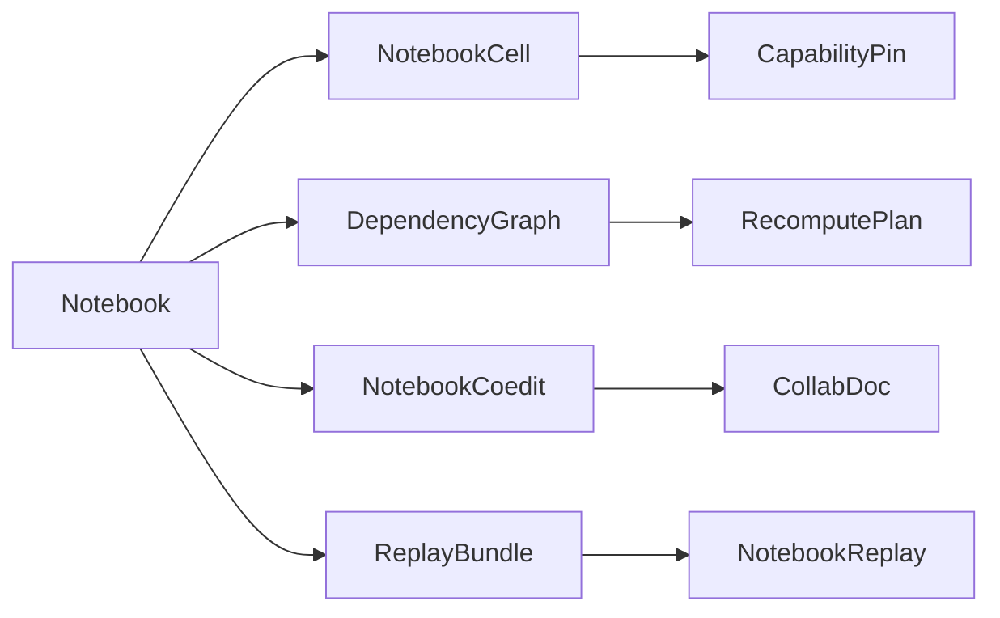

# [APPUI_NOTEBOOK_DOCUMENT]

The notebook rail is the reproducible computational-document model: `NotebookCell` is the closed cell-kind union (code, markdown, chart, render, viewpoint, parameter) each carrying a pinned capability fingerprint, `DependencyGraph` is the cell DAG whose dirty-propagation drives recompute over exactly the affected closure, `NotebookCoedit` projects the cell sequence onto the one `Editing/collab.md` `CollabDoc` merge authority for co-editing, and `ReplayBundle` exports the notebook plus its pinned capabilities and inputs as a portable replay artifact. The page owns the cell union with its pinned-capability fingerprint, the dependency DAG and dirty-recompute fold, the co-edit projection over the shared CRDT document, and the export-to-replay bundle; the substrate is the Compute capability registry and receipt determinism for pinned cells, AvaloniaEdit for code cells, the chart and render owners for output cells, the `Editing/collab.md` `CollabDoc` for co-editing, the Persistence op-log for replay, and the AppHost clock and HLC for ordering. Replay reproduces a notebook bit-identically because every cell pins the capability and inputs it ran against.

## [01]-[INDEX]

- [01]-[CELL_MODEL]: Closed cell-kind union; pinned capability fingerprint per cell.
- [02]-[DEPENDENCY_GRAPH]: Cell DAG, dirty propagation, recompute over the affected closure.
- [03]-[CRDT_COEDIT]: Cell-sequence projection over the one `CollabDoc` merge authority.
- [04]-[REPLAY_BUNDLE]: Export-to-replay artifact with pinned capabilities and inputs.

## [02]-[CELL_MODEL]

- Owner: `CapabilityPin` the pinned-capability fingerprint; `NotebookCell` `[Union]` the cell-kind family; `CellOutput` `[Union]` the materialized output; `Notebook` the cell sequence.
- Cases: `NotebookCell` = Code | Markdown | Chart | Render | Viewpoint | Parameter under the locked kind literals; `CellOutput` = Receipt | Rows | Image | Timeline | Empty under the locked kind literals.
- Entry: `public Fin<CellOutput> Evaluate(NotebookRuntime runtime, HashMap<string, CellOutput> upstream)` — `Fin` aborts on an unpinned capability or a missing upstream output; a code cell runs through the Compute dispatch under its pin.
- Auto: every code and chart cell carries a `CapabilityPin` composing the AppHost `DeterminismContext`/`EnvFingerprint` as its environment identity plus the Compute capability key and the model-or-kernel checksum — so a cell records exactly the determinism context (seed, float mode, host fingerprint) and the capability version it ran against, and a re-run under a drifted environment or capability is a detectable mismatch through `DeterminismKernel.Reproduces`, never a notebook-local checksum tuple and never a silent re-result; the notebook reproducibility-proof is one owner with the runtime determinism kernel — the pin's environment identity is the `EnvFingerprint.Digest` and a notebook-local environment hash is the deleted form; markdown cells project through the typography `MarkdownProjection` so a documentation cell rides the one markdown vocabulary; chart and render cells bind their output to the chart and visual owners so a notebook output cell mints no second chart; parameter cells expose a typed binding the downstream cells read so a notebook is a live parameterized document.
- Packages: Thinktecture.Runtime.Extensions, LanguageExt.Core, NodaTime, Rasm.Compute (project), Rasm.AppHost (project)
- Growth: a new cell kind is one `NotebookCell` case; a new output kind is one `CellOutput` case; a new pin field is one `CapabilityPin` member; zero new surface.
- Boundary: the capability pin is the reproducibility law — a code or chart cell with no pin faults at evaluate so an unpinned cell can never enter the document, and the pin composes the `Rasm.AppHost/Runtime/determinism.md#DETERMINISM_KERNEL` `DeterminismContext`/`EnvFingerprint` as its environment identity plus the Compute model-or-kernel checksum, so the notebook reproducibility rides the settled runtime determinism kernel rather than a notebook-local hash — the `CapabilityPin.Matches` composes `DeterminismKernel.Reproduces` so a re-run under a divergent environment is detected before it produces a wrong result, and a parallel notebook-local checksum tuple is the rejected form; markdown cells route to the typography projection and chart/render cells to the chart and visual owners so the notebook composes existing output owners and a notebook-local renderer is the deleted form; code cells edit through the AvaloniaEdit `CodePane` so the notebook mints no second editor; the cell output is the typed `CellOutput` union and a stringly-typed output blob is the rejected form.

```csharp signature
public readonly record struct CapabilityPin(
    string Capability,
    string Checksum,
    string Substrate,
    Rasm.AppHost.Determinism.DeterminismContext Context) {
    public long Seed => unchecked((long)Context.Seed);

    public bool Matches(CapabilityPin other) =>
        Capability == other.Capability
        && Checksum == other.Checksum
        && Substrate == other.Substrate
        && Rasm.AppHost.Determinism.DeterminismKernel.Reproduces(Context, other.Context);
}

[Union(ConversionFromValue = ConversionOperatorsGeneration.None)]
public abstract partial record CellOutput {
    private CellOutput() { }
    public sealed record Receipt(ComputeReceipt Value) : CellOutput;
    public sealed record Rows(Seq<JsonElement> Values) : CellOutput;
    public sealed record Image(RenderReceipt Render) : CellOutput;
    public sealed record Timeline(EvidenceTimeline Value) : CellOutput;
    public sealed record Empty : CellOutput;
}

[Union(ConversionFromValue = ConversionOperatorsGeneration.None)]
public abstract partial record NotebookCell {
    private NotebookCell() { }
    public sealed record Code(string Id, string Source, CapabilityPin Pin, Seq<string> Inputs, Func<NotebookRuntime, HashMap<string, CellOutput>, IO<CellOutput>> Run) : NotebookCell;
    public sealed record Markdown(string Id, string Source) : NotebookCell;
    public sealed record Chart(string Id, ChartSeriesSpec Spec, ChartPolicy Policy, CapabilityPin Pin, Seq<string> Inputs) : NotebookCell;
    public sealed record Render(string Id, CustomVisual Kind, CapabilityPin Pin, Seq<string> Inputs) : NotebookCell;
    public sealed record Viewpoint(string Id, AppUi.Viewport.Viewpoint View) : NotebookCell;
    public sealed record Parameter(string Id, string Key, JsonElement Value) : NotebookCell;

    public string Id => Switch(
        code: static c => c.Id, markdown: static m => m.Id, chart: static c => c.Id,
        render: static r => r.Id, viewpoint: static v => v.Id, parameter: static p => p.Id);

    public Seq<string> Inputs => Switch(
        code: static c => c.Inputs, markdown: static _ => Seq<string>(), chart: static c => c.Inputs,
        render: static r => r.Inputs, viewpoint: static _ => Seq<string>(), parameter: static _ => Seq<string>());

    public Option<CapabilityPin> Pin => Switch(
        code: static c => Some(c.Pin), markdown: static _ => Option<CapabilityPin>.None, chart: static c => Some(c.Pin),
        render: static r => Some(r.Pin), viewpoint: static _ => Option<CapabilityPin>.None, parameter: static _ => Option<CapabilityPin>.None);

    public IO<CellOutput> Evaluate(NotebookRuntime runtime, HashMap<string, CellOutput> upstream) => Switch(
        state: (Runtime: runtime, Upstream: upstream),
        code: static (ctx, c) => ctx.Runtime.Verify(c.Pin) ? c.Run(ctx.Runtime, ctx.Upstream) : IO.fail<CellOutput>(new NotebookFault.CapabilityDrift(c.Id)),
        markdown: static (_, _) => IO.pure<CellOutput>(new CellOutput.Empty()),
        chart: static (ctx, c) => ctx.Runtime.Verify(c.Pin) ? ctx.Runtime.Chart(c.Spec, c.Policy, ctx.Upstream) : IO.fail<CellOutput>(new NotebookFault.CapabilityDrift(c.Id)),
        render: static (ctx, r) => ctx.Runtime.Verify(r.Pin) ? ctx.Runtime.Render(r.Kind, ctx.Upstream) : IO.fail<CellOutput>(new NotebookFault.CapabilityDrift(r.Id)),
        viewpoint: static (_, _) => IO.pure<CellOutput>(new CellOutput.Empty()),
        parameter: static (_, p) => IO.pure<CellOutput>(new CellOutput.Rows(Seq(p.Value))));
}

public sealed record NotebookRuntime(
    Func<CapabilityPin, bool> VerifyPin,
    Func<ChartSeriesSpec, ChartPolicy, HashMap<string, CellOutput>, IO<CellOutput>> Chart,
    Func<CustomVisual, HashMap<string, CellOutput>, IO<CellOutput>> Render,
    ClockPolicy Clocks,
    CorrelationId Correlation) {
    public bool Verify(CapabilityPin pin) => VerifyPin(pin);
}

public sealed record Notebook(string Key, int Version, Seq<NotebookCell> Cells);

[Union]
public abstract partial record NotebookFault : Expected, IValidationError<NotebookFault> {
    private NotebookFault(string detail, int code) : base(detail, code, None) { }

    public static NotebookFault Create(string message) => new Text(message);

    public sealed record Text : NotebookFault { public Text(string detail) : base(detail, 4800) { } }
    public sealed record CapabilityDrift : NotebookFault { public CapabilityDrift(string detail) : base(detail, 4801) { } }
    public sealed record MissingUpstream : NotebookFault { public MissingUpstream(string detail) : base(detail, 4802) { } }
    public sealed record CycleDetected : NotebookFault { public CycleDetected(string detail) : base(detail, 4803) { } }
}
```

## [03]-[DEPENDENCY_GRAPH]

- Owner: `DependencyGraph` the cell DAG; `RecomputePlan` the affected-closure plan.
- Entry: `public Fin<RecomputePlan> Dirty(string changed)` — folds the downstream transitive closure of the changed cell into the recompute order; `public Fin<HashMap<string, CellOutput>> Recompute(NotebookRuntime runtime, RecomputePlan plan, HashMap<string, CellOutput> cache)` — evaluates exactly the affected cells in topological order, re-using the cached output of unaffected cells.
- Auto: `Build` derives the DAG from each cell's declared `Inputs` so the dependency edges are document data, never inferred from source parsing; `Dirty` walks the downstream closure of the changed cell so editing a parameter recomputes only the cells that read it, transitively, and an unaffected cell never re-runs; the topological order is the one evaluation order so a recompute respects the dependency partial order; a cycle in the declared inputs faults at build so a self-referential notebook is structurally rejected.
- Packages: Thinktecture.Runtime.Extensions, LanguageExt.Core
- Growth: a new propagation policy is one plan value; zero new surface.
- Boundary: dirty propagation recomputes the affected closure only — a full-notebook re-run on every edit is the deleted form, so a parameter change is O(downstream) not O(cells); the dependency edges are the declared cell inputs so a hidden side-effect dependency is structurally absent — a cell reads only its declared upstream outputs; the recompute re-uses the cached output of cells outside the dirty closure so an expensive upstream cell never re-runs for a downstream-only edit; cycle detection runs at build so a topological order always exists.

```csharp signature
public sealed record RecomputePlan(Seq<string> Order);

public sealed record DependencyGraph(
    FrozenDictionary<string, Seq<string>> Inputs,
    FrozenDictionary<string, Seq<string>> Dependents,
    Seq<string> Topological) {
    public static Fin<DependencyGraph> Build(Notebook notebook) {
        var inputs = notebook.Cells.Map(cell => KeyValuePair.Create(cell.Id, cell.Inputs)).ToFrozenDictionary(StringComparer.Ordinal);
        var dependents = notebook.Cells
            .Bind(cell => cell.Inputs.Map(input => (Input: input, Cell: cell.Id)))
            .GroupBy(static edge => edge.Input, StringComparer.Ordinal)
            .ToFrozenDictionary(static group => group.Key, static group => toSeq(group).Map(static edge => edge.Cell), StringComparer.Ordinal);
        return Topo(notebook, inputs).Map(order => new DependencyGraph(inputs, dependents, order));
    }

    public Fin<RecomputePlan> Dirty(string changed) =>
        Reachable(changed, Set<string>()) switch {
            var affected => Fin.Succ(new RecomputePlan(Topological.Filter(affected.Contains))),
        };

    public Fin<HashMap<string, CellOutput>> Recompute(Notebook notebook, NotebookRuntime runtime, RecomputePlan plan, HashMap<string, CellOutput> cache) =>
        plan.Order.Fold(
            Fin.Succ(cache),
            (rail, id) => rail.Bind(state => notebook.Cells.Find(cell => cell.Id == id)
                .Map(cell => Gather(cell, state).Bind(upstream => cell.Evaluate(runtime, upstream).Run().Map(output => state.AddOrUpdate(id, output))))
                .IfNone(() => Fin.Fail<HashMap<string, CellOutput>>(new NotebookFault.MissingUpstream(id)))));

    private Fin<HashMap<string, CellOutput>> Gather(NotebookCell cell, HashMap<string, CellOutput> state) =>
        cell.Inputs.Fold(
            Fin.Succ(HashMap<string, CellOutput>()),
            (rail, input) => rail.Bind(acc => state.Find(input).Match(
                Some: output => Fin.Succ(acc.Add(input, output)),
                None: () => Fin.Fail<HashMap<string, CellOutput>>(new NotebookFault.MissingUpstream($"{cell.Id}<-{input}")))));

    private Set<string> Reachable(string node, Set<string> seen) =>
        seen.Contains(node)
            ? seen
            : Dependents.TryGetValue(node, out var next)
                ? next.Fold(seen.Add(node), (acc, child) => Reachable(child, acc))
                : seen.Add(node);

    private static Fin<Seq<string>> Topo(Notebook notebook, FrozenDictionary<string, Seq<string>> inputs) =>
        notebook.Cells.Fold(
            Fin.Succ((Order: Seq<string>(), Visited: Set<string>())),
            (rail, cell) => rail.Bind(state => Visit(cell.Id, inputs, state, Set<string>())))
        .Map(static state => state.Order);

    private static Fin<(Seq<string> Order, Set<string> Visited)> Visit(string id, FrozenDictionary<string, Seq<string>> inputs, (Seq<string> Order, Set<string> Visited) state, Set<string> stack) =>
        stack.Contains(id)
            ? Fin.Fail<(Seq<string>, Set<string>)>(new NotebookFault.CycleDetected(id))
            : state.Visited.Contains(id)
                ? Fin.Succ(state)
                : (inputs.TryGetValue(id, out var deps) ? deps : Seq<string>())
                    .Fold(Fin.Succ(state), (rail, dep) => rail.Bind(inner => Visit(dep, inputs, inner, stack.Add(id))))
                    .Map(inner => (inner.Order.Add(id), inner.Visited.Add(id)));
}
```

## [04]-[CRDT_COEDIT]

- Owner: `NotebookCoedit` the notebook projection over the one `Editing/collab.md#DOCUMENT_OWNER` `CollabDoc` merge authority.
- Entry: `public Fin<NotebookCoedit> Open(CollabDoc document)` — attaches the notebook's `movable-list` cell-sequence container and per-cell `map` containers on the one document; `public Fin<Unit> Insert(int index, NotebookCell cell)` / `Move(int from, int to)` / `Delete(string cellId)` / `Retext(string cellId, string source)` — each a typed edit on the document's containers, the document converging without conflict.
- Auto: the notebook holds NO replicated-op vocabulary, no last-writer-wins register, no fractional-index math, and no tombstone set — the `CollabDoc` IS the merge authority: the cell sequence is a `movable-list` container whose `Mov(from, to)` reorders by stable id without delete+insert losing identity (the textbook collaborative cell-reorder), a cell insert is `Insert*Container` at the index, a cell delete is the list `Delete` (the engine's tombstone is internal), and a code/markdown cell's `Source` is a `text` container per cell whose concurrent edits the engine's eg-walker text CRDT resolves character-granular rather than whole-cell last-writer-wins; convergence is the `CollabDoc` law so two replicas that have imported the same op-log deltas hold the same notebook; the materialized `Notebook` reads the live container state through `GetDeepValue` projected onto the typed cell union.
- Packages: LoroCs, Thinktecture.Runtime.Extensions, LanguageExt.Core, NodaTime, Rasm.Persistence (project)
- Growth: a new co-edited notebook concern is one container attach on the existing document, never a new replicated-op case; zero new surface.
- Boundary: co-editing rides the one `Editing/collab.md` `CollabDoc` owner — the bespoke `NotebookCrdt`/`NotebookOp` last-writer-wins-plus-fractional-index-plus-tombstone algebra is DROPPED root-up (the `[05]-[PROHIBITIONS]` second-CRDT clause), so the notebook composes the document's `SyncRail` (local-delta broadcast / remote-delta import) and holds no merge logic; the sync transports through the `CollabDoc` `SyncRail` over the Persistence op-log changefeed already owned so the notebook mints no second sync, and a central merge server is the deleted form (two offline replicas reconcile on reconnect through the engine); the cell reorder is `LoroMovableList.Mov` so a reorder preserves cell identity and a delete+reinsert that loses identity is the rejected form; a code cell's `Source` is a per-cell `text` container so concurrent same-cell edits resolve character-granular through the engine rather than a whole-cell last-writer-wins that drops one author's keystrokes; the presence carets ride the document's `Editing/collab.md#PRESENCE` ephemeral channel, never the durable cell op-log; the determinism-replay reproducibility (`[05]-[REPLAY_BUNDLE]`) is a distinct concern composing the AppHost determinism kernel and is never folded into the document time-travel.

```csharp signature
public sealed record NotebookCoedit(CollabDoc Document, LoroMovableList Cells) {
    public const string CellsContainer = "notebook.cells";

    public static Fin<NotebookCoedit> Open(CollabDoc document) =>
        document.Attach(CollabContainer.MovableList, CellsContainer)
            .Bind(handle => handle.Container is LoroMovableList cells
                ? Fin.Succ(new NotebookCoedit(document, cells))
                : Fin.Fail<NotebookCoedit>(new CollabFault.Detached(CellsContainer)));

    public Fin<Unit> Move(int from, int to) =>
        CollabDoc.Lift(() => { Cells.Mov((uint)from, (uint)to); return unit; });

    public Fin<Unit> Delete(int index) =>
        CollabDoc.Lift(() => { Cells.Delete((uint)index, 1); return unit; });

    public Fin<LoroMap> Insert(int index, string cellId) =>
        CollabDoc.Lift(() => Cells.InsertMapContainer((uint)index, new LoroMap()))
            .Map(map => { map.Insert("id", LoroVal.Of(cellId)); return map; });
}
```

## [05]-[REPLAY_BUNDLE]

- Owner: `ReplayManifest` the pinned-input-and-capability manifest; `ReplayBundle` the export-to-replay artifact; `NotebookReplay` the bit-identity check.
- Entry: `public static Fin<ReplayBundle> Export(Notebook notebook, HashMap<string, CellOutput> outputs, Func<string, IO<ReadOnlyMemory<byte>>> blob)` — `Fin` aborts when a code or chart cell carries no pin; the bundle packs the cells, the pinned capabilities, the input blobs, and the recorded outputs; `public static IO<Fin<bool>> Verify(ReplayBundle bundle, NotebookRuntime runtime)` — re-runs the notebook and compares each cell's output hash to the recorded hash.
- Auto: the manifest records every cell's `CapabilityPin` (carrying the AppHost `DeterminismContext`/`EnvFingerprint` environment identity) and the content hash of every input blob through the suite `XxHash128` identity row so the bundle is self-contained — a replay resolves its capabilities and determinism context from the manifest and its inputs from the packed blobs, never the live environment; `Verify` composes the AppHost `EventLog`/`ChainHash`/`ReplayVerify` content-hash identity rather than a notebook-local `hash(output)` fold — it re-runs the dependency graph under the manifest's pins through the one `Render/evidence.md#HEADLESS_DERIVATION` `ProofEngine.Replay` route and proves each cell's output content hash matches the recorded hash so a reproducibility regression surfaces as a named cell mismatch, the notebook reproducibility receipt riding the existing `ReceiptEnvelopeWire`/`LogEntryWire` rather than a notebook-only wire shape; the bundle is a versioned Persistence artifact so it crosses the blob lane as an opaque payload.
- Receipt: `Verify` seals a render or evidence receipt per re-run cell; a mismatch folds the cell id into the replay-mismatch instrument.
- Packages: Thinktecture.Runtime.Extensions, LanguageExt.Core, System.IO.Hashing, NodaTime, Rasm.Persistence (project), Rasm.AppHost (project)
- Growth: a new manifest field is one `ReplayManifest` member; zero new surface.
- Boundary: the bundle is self-contained — replay resolves capabilities, the determinism context, and inputs from the manifest and packed blobs so a notebook reproduces independent of the live environment, and a replay that reaches the live store is the rejected form; the output identity is the content hash through the suite XxHash128 identity row composed as the AppHost `EventLog`/`ChainHash` content-addressed chain so bit-identity is the verification law and a fuzzy float compare is the deleted form; the bundle crosses the Persistence blob lane as a versioned opaque artifact so the notebook mints no second store; the notebook is a UI projection over the runtime determinism owner — the `Verify` composes `Rasm.AppHost/Runtime/determinism.md#REPLAY_VERIFY` `ReplayVerify.Replay` content-hash identity and the journal-replay determinism rides the diagnostics `ProofEngine.Replay` under virtual time so the replay reproducibility shares the settled deterministic-replay law, and a parallel reproducibility-hash fold or a notebook-local replay engine inside `notebook/` is the rejected form; the `RecomputePlan` cell DAG aligns to the `Rasm.AppHost/Runtime/determinism.md#RECOMPUTE_GRAPH` `RecomputeGraph` content-address node identity so the incremental-recompute law is one owner across the runtime and the document — a cell's content-address node identity is its command plus its upstream node hashes exactly as the runtime recompute graph keys it, and a second incremental-recompute owner is the deleted form.

```csharp signature
public readonly record struct ReplayInput(string Key, string ContentHash, long Bytes);

public sealed record ReplayManifest(
    string NotebookKey,
    int Version,
    Rasm.AppHost.Determinism.DeterminismContext Context,
    Seq<CapabilityPin> Pins,
    Seq<ReplayInput> Inputs,
    Seq<(string CellId, Rasm.AppHost.Determinism.ChainHash OutputHash, Seq<string> Inputs)> Outputs,
    Instant At) {
    public Rasm.AppHost.Determinism.RecomputeNode NodeOf(string cellId) =>
        Outputs.Find(row => row.CellId == cellId).Match(
            Some: row => new Rasm.AppHost.Determinism.RecomputeNode(row.OutputHash, cellId, row.Inputs.Bind(input => Outputs.Find(r => r.CellId == input).Map(static r => r.OutputHash).ToSeq())),
            None: () => new Rasm.AppHost.Determinism.RecomputeNode(Rasm.AppHost.Determinism.ChainHash.Genesis, cellId, Seq<Rasm.AppHost.Determinism.ChainHash>()));
}

public sealed record ReplayBundle(ReplayManifest Manifest, Notebook Notebook, HashMap<string, ReadOnlyMemory<byte>> Blobs) {
    public static Fin<ReplayBundle> Export(
        Notebook notebook,
        Rasm.AppHost.Determinism.DeterminismContext context,
        HashMap<string, CellOutput> outputs,
        HashMap<string, ReadOnlyMemory<byte>> blobs,
        Func<CellOutput, Rasm.AppHost.Determinism.ChainHash> hash,
        ClockPolicy clocks) =>
        notebook.Cells.Find(cell => cell.Inputs.Count > 0 && cell.Pin.IsNone) is { IsSome: true, Case: NotebookCell unpinned }
            ? Fin.Fail<ReplayBundle>(new NotebookFault.CapabilityDrift($"{unpinned.Id}: code cell carries no capability pin"))
            : Fin.Succ(new ReplayBundle(
                new ReplayManifest(
                    notebook.Key, notebook.Version, context,
                    notebook.Cells.Bind(cell => cell.Pin.ToSeq()),
                    toSeq(blobs).Map(entry => new ReplayInput(entry.Key, Convert.ToHexStringLower(XxHash128.Hash(entry.Value.Span)), entry.Value.Length)),
                    notebook.Cells.Filter(cell => outputs.ContainsKey(cell.Id)).Map(cell => (cell.Id, hash(outputs[cell.Id]), cell.Inputs)),
                    clocks.Now),
                notebook, blobs));
}

public static class NotebookReplay {
    public const string MismatchInstrument = "rasm.appui.notebook.replay-mismatch";

    public static TelemetryContributorPort TelemetryRow(string version) =>
        AppUiTelemetry.Contribute(version, MismatchInstrument);

    public static IO<Fin<Seq<string>>> Verify(
        ReplayBundle bundle,
        NotebookRuntime runtime,
        Rasm.AppHost.Determinism.DeterminismContext live,
        Func<CellOutput, Rasm.AppHost.Determinism.ChainHash> hash) =>
        Rasm.AppHost.Determinism.DeterminismKernel.Reproduces(bundle.Manifest.Context, live)
            ? IO.lift(() => DependencyGraph.Build(bundle.Notebook).Bind(graph => graph.Dirty(bundle.Notebook.Cells.Head.Id)))
                .Bind(plan => plan.Match(
                    Succ: order => Recompute(bundle, runtime, hash, order),
                    Fail: error => IO.pure(Fin.Fail<Seq<string>>(error))))
            : IO.pure(Fin.Fail<Seq<string>>(new NotebookFault.CapabilityDrift(
                $"replay/environment-mismatch:{bundle.Manifest.Context.Fingerprint.Digest}!={live.Fingerprint.Digest}")));

    static IO<Fin<Seq<string>>> Recompute(ReplayBundle bundle, NotebookRuntime runtime, Func<CellOutput, Rasm.AppHost.Determinism.ChainHash> hash, RecomputePlan plan) =>
        IO.lift(() => DependencyGraph.Build(bundle.Notebook)
            .Bind(graph => graph.Recompute(bundle.Notebook, runtime, plan, HashMap<string, CellOutput>()))
            .Map(outputs => bundle.Manifest.Outputs
                .Filter(recorded => toSeq(outputs).Find(actual => actual.Key == recorded.CellId).Map(actual => hash(actual.Value) != recorded.OutputHash).IfNone(true))
                .Map(static mismatch => mismatch.CellId)));
}
```



## [06]-[RESEARCH]

- [NOTEBOOK_CAPABILITY]: the Compute capability-registry key and checksum surface the `CapabilityPin` records — the capability identity (kernel/model checksum, substrate, opset) the pin matches against, resolved at implementation against the settled Compute model-lane and intent-selection vocabulary; the cell union, the dependency-graph dirty fold, the CRDT merge, and the replay bundle are settled, the exact capability-registry member shape the `VerifyPin` delegate reads is the unverified surface.
- [NOTEBOOK_DETERMINISM]: the `CapabilityPin` composes the `Rasm.AppHost/Runtime/determinism.md#DETERMINISM_KERNEL` `DeterminismContext`/`EnvFingerprint` and `DeterminismKernel.Reproduces` as its environment identity, the `ReplayManifest`/`NotebookReplay.Verify` composes the `#EVENT_LOG` `ChainHash` content-addressed identity and the `#REPLAY_VERIFY` `ReplayVerify.Replay` per-step proof through the diagnostics `ProofEngine.Replay` route, and the `RecomputePlan` cell DAG aligns to the `#RECOMPUTE_GRAPH` `RecomputeNode` content-address node identity — these AppHost determinism members arrive as settled finalized vocabulary consumed at the package edge, so the notebook reproducibility-proof is one owner with the runtime determinism kernel and the `Rasm.AppHost.Determinism` namespace and exact member spellings resolve against the finalized determinism surface, never re-minted.
