# [APPUI_TABLES_HIERARCHY]

Tabular and hierarchical projection for the Rasm.AppUi grid rail: one `TableColumnRow` metadata family drives column generation, sort comparers, filter admission, group descriptors, edit admission, clipboard projection, and export; the `TableProjection` union folds flat, tree, grouped, paged, and windowed shapes into one virtualized `TreeRow` stream on the free `DataGrid` with a `PivotSpec` cross-tab snapshot projection beside it; the `TableViewState` snapshot keeps collection-view state explicit; and the `TableCommit` row bridges grid edits onto the CommandIntent rail, `StoreOp.Upsert` persistence, and `DocumentTransaction` host routing. Export delivery is the `Document/export.md` `VisualDestination` union through `ExportDelivery.Deliver` — the tables fold shapes text, never mints a second delivery vocabulary. Live-data change-set streams, screen-state snapshot rows, density and typography tokens, the AppHost `DataClassification` taxonomy, and the Persistence Sep lane arrive as settled vocabulary.

## [01]-[INDEX]

- [01]-[GRID_SUBSTRATE]: One column metadata family drives columns, filter, masking, export.
- [02]-[VIEW_STATE]: Serializable collection-view snapshot applied in one `DeferRefresh`.
- [03]-[TREE_FLATTEN]: Five projection cases fold to one flat virtualized `TreeRow` stream.
- [04]-[GRID_COMMIT]: Edit commits ride `CommandIntent` rails; exports ride one spec record.

## [02]-[GRID_SUBSTRATE]

- Owner: `TableColumnRow<TRow>` — the one row-model metadata record; `TableColumnAccess<TRow>` closes the plain-versus-classified materialization boundary; `TableSurface` attaches the column and filter folds as one extension block; `TableCellKind` `[SmartEnum<string>]` closes the cell vocabulary with its construction as a delegate column.
- Cases: `Text`, `CheckBox`, `Numeric`, `Temporal`, `Progress`, `Template` — numeric and temporal rows carry cell semantics (tabular-figure role, invariant instant format) the theme classes read off the kind key, progress rows are template-backed meters, and a seventh kind is one row with its construction delegate.
- Entry: `Option<DataGridColumn> Column(Func<DataClassification, DataTemplate> redacted)` — invisible rows materialize no column.
- Auto: one row family derives columns, sort comparers, group descriptors, quick-filter admission, edit admission, clipboard projection, and export admission — seven concerns, one owner; `AutoGenerateColumns` stays false and `Columns` is populated by the `Column()` fold; the `Sort` comparer column lands as `CustomSortComparer` beside `SortMemberPath` so value-object cells order by domain comparer rather than display text, and the `Cell` binding doubles as `ClipboardContentBinding` on bound columns so the grid's own `Ctrl+C` copy under `DataGridClipboardCopyMode.IncludeHeader` and the export fold project one column vocabulary.
- Packages: Avalonia.Controls.DataGrid; Avalonia; Thinktecture.Runtime.Extensions; LanguageExt.Core.
- Growth: one column row per field; a new cell kind is one `TableCellKind` row with its construction delegate; a sizing, visibility, or classification change is one policy value; zero new surface.
- Boundary: classification governs EVERY materialization channel — a classified column materializes ONLY the redacted presentation template (theme-token-resolved through the `redacted` fold), read-only, unsortable, with no `Binding` and no `ClipboardContentBinding`, so display and the grid's own `Ctrl+C` copy structurally cannot carry the source cell value, and the column never enters filter or export admission; row height and cell spacing arrive as density-token values; per-column control subclasses are the deleted form.

```csharp signature
// Cell construction is the kind row's delegate column — Build receives the row scalars and returns the
// materialized column, so a new kind never grows the Column() dispatch.
[SmartEnum<string>(SwitchMethods = SwitchMapMethodsGeneration.None, MapMethods = SwitchMapMethodsGeneration.None)]
[KeyMemberEqualityComparer<ComparerAccessors.StringOrdinal, string>]
[KeyMemberComparer<ComparerAccessors.StringOrdinal, string>]
public sealed partial class TableCellKind {
    public static readonly TableCellKind Text = new("text", static (header, width, cell, editable, _) =>
        new DataGridTextColumn { Header = header, Width = width, Binding = cell, ClipboardContentBinding = cell, IsReadOnly = !editable });
    public static readonly TableCellKind CheckBox = new("check-box", static (header, width, cell, editable, _) =>
        new DataGridCheckBoxColumn { Header = header, Width = width, Binding = cell, ClipboardContentBinding = cell, IsReadOnly = !editable });
    public static readonly TableCellKind Numeric = new("numeric", static (header, width, cell, editable, _) =>
        new DataGridTextColumn { Header = header, Width = width, Binding = cell, ClipboardContentBinding = cell, IsReadOnly = !editable });
    public static readonly TableCellKind Temporal = new("temporal", static (header, width, cell, editable, _) =>
        new DataGridTextColumn { Header = header, Width = width, Binding = cell, ClipboardContentBinding = cell, IsReadOnly = true });
    public static readonly TableCellKind Progress = new("progress", static (header, width, _, _, template) =>
        new DataGridTemplateColumn { Header = header, Width = width, CellTemplate = template.IfNoneUnsafe((DataTemplate?)null), IsReadOnly = true });
    public static readonly TableCellKind Template = new("template", static (header, width, _, editable, template) =>
        new DataGridTemplateColumn { Header = header, Width = width, CellTemplate = template.IfNoneUnsafe((DataTemplate?)null), IsReadOnly = !editable });

    [UseDelegateFromConstructor]
    public partial DataGridColumn Build(string header, DataGridLength width, BindingBase cell, bool editable, Option<DataTemplate> template);
}

[Union(ConversionFromValue = ConversionOperatorsGeneration.None)]
public abstract partial record TableColumnAccess<TRow> {
    private TableColumnAccess() { }
    public sealed record Plain(BindingBase Cell, Func<TRow, string> Export, bool Editable, Option<DataTemplate> Template = default) : TableColumnAccess<TRow>;
    public sealed record Classified(DataClassification Classification) : TableColumnAccess<TRow>;
}

public sealed record TableColumnRow<TRow>(
    string Key,
    string Header,
    TableCellKind Kind,
    TableColumnAccess<TRow> Access,
    DataGridLength Width,
    bool Sortable,
    bool Visible,
    Option<IComparer> Sort = default);

public static class TableSurface {
    extension<TRow>(TableColumnRow<TRow> row) {
        // Classification wins before any kind dispatch: the redacted template is the ONLY materialization
        // of a classified column — no binding, no clipboard projection, no sort.
        public Option<DataGridColumn> Column(Func<DataClassification, DataTemplate> redacted) =>
            !row.Visible
                ? None
                : row.Access.Switch(
                    state: row,
                    plain: static (columnRow, access) => Some(fun(() => {
                        DataGridColumn column = columnRow.Kind.Build(columnRow.Header, columnRow.Width, access.Cell, access.Editable, access.Template);
                        column.CanUserSort = columnRow.Sortable;
                        column.SortMemberPath = columnRow.Key;
                        columnRow.Sort.Iter(comparer => column.CustomSortComparer = comparer);
                        return column;
                    })()),
                    classified: (columnRow, access) => Some<DataGridColumn>(new DataGridTemplateColumn {
                        Header = columnRow.Header,
                        Width = columnRow.Width,
                        CellTemplate = redacted(access.Classification),
                        IsReadOnly = true,
                        CanUserSort = false,
                    }));

        public Option<string> Project(TRow item) => row.Access.Switch(
            state: item,
            plain: static (value, access) => Some(access.Export(value)),
            classified: static (_, _) => Option<string>.None);
    }

    extension<TRow>(Seq<TableColumnRow<TRow>> rows) {
        public Func<object, bool> Matches(string text) =>
            item => item is TreeRow<TRow> tree && rows.Exists(column =>
                column.Visible && column.Project(tree.Item).Exists(value => value.Contains(text, StringComparison.OrdinalIgnoreCase)));
    }
}
```

[SUBSTRATE_LAW]:
- Virtualization: the free `DataGrid` virtualizes rows over the one flat bound collection; a fixed density-token row height keeps the scroll math exact.
- Materialization: `LoadingRow` stamps row state from theme tokens onto the `DataGridRow` pseudo-classes `:selected`, `:current`, `:editing`, `:edited`, `:invalid`, `:pressed`, `:focus`, `:expanded`, `:sortascending`, `:sortdescending`, `:empty-rows`, `:empty-columns`; `LoadingRowDetails` materializes the single per-screen details template on demand.
- Selection: selection mode is a per-screen policy value; `SelectedItems` and the current row project into the screen-state snapshot.
- Sort: `CustomSortComparer` carries the row's `Sort` comparer so a value-object or unit-bearing cell orders by domain law, `SortMemberPath` stays the display fallback, and the `Sorting` event never substitutes a comparer the row already declares — `Comparer<TRow>` instances satisfy the column's non-generic `IComparer` slot.
- Clipboard: the grid `Ctrl+C` copy rides `ClipboardCopyMode` with `ClipboardContentBinding` mirroring each row's `Cell` binding; classified columns render redacted, so the copy path leaks nothing the cell does not already show.
- Quick filter: `Matches` is an ordinal case-insensitive scan over visible unclassified column projections; classified columns never match.
- Footers: aggregate footer values arrive from the live-data aggregation rows (`Count`, `Sum`, `Avg`); the grid renders totals, never computes them.
- Column posture: user reorder, resize, and sort-toggle flags are per-screen policy values on `CanUserReorderColumns`, `CanUserResizeColumns`, and `CanUserSortColumns`, with `FrozenColumnCount`, `RowHeight`, and `RowDetailsTemplate` as the remaining posture members.

## [03]-[VIEW_STATE]

- Owner: `TableViewState` — the serializable collection-view snapshot; `ViewStateSurface` applies it against `DataGridCollectionView`, the only collection-view state holder.
- Entry: `Fin<Unit> Apply<TRow>(TableViewState state, Seq<TableColumnRow<TRow>> columns, Option<object> current = default)` admits sort, group, page, expansion, and realized-window state against the column vocabulary before one batched mutation.
- Auto: `DeferRefresh` collapses every multi-descriptor write into one refresh; apply-on-activate and capture-on-deactivate ride the screen-state snapshot rows; the live-data `Page` and `Virtualise` operators emit `IPagedChangeSet<TRow, TKey>` and `IVirtualChangeSet<TRow, TKey>`, whose `Response` bounds — `IPageResponse.Page`/`PageSize`/`Pages`/`TotalSize` and `IVirtualResponse.StartIndex`/`Size`/`TotalSize` — construct the `WindowState` window field so restore re-requests the same window with zero re-query.
- Packages: Avalonia.Controls.DataGrid; DynamicData; LanguageExt.Core; BCL inbox.
- Growth: one snapshot field per view-state axis; a page-size, window, or group change is one policy value; zero new surface.
- Boundary: boundary capsule (statement carve-out) — `DataGridCollectionView` is package-owned mutable state, so `Apply` carries language-owned statement forms writing filter, sort, group, page, and current-row descriptors inside one `DeferRefresh` scope; the snapshot is built from screen control state and never read back from the view; the `Paged` window rides the live-data `Page` operator and constructs `WindowState.Paged`, while the virtualized window rides `Virtualise` and constructs `WindowState.Virtualized`, so one modality never carries zero/default fields belonging to the other, and `Admit` rejects a `Paged` window whose size disagrees with the snapshot's `PageSize`; a second collection-view state holder is the deleted form.

```csharp signature
[Union(ConversionFromValue = ConversionOperatorsGeneration.None)]
public abstract partial record WindowState {
    private WindowState() { }
    public sealed record Paged(int Index, int Size) : WindowState;
    public sealed record Virtualized(int Start, int Size) : WindowState;
}

public sealed record TableViewState(
    Option<string> Filter,
    Seq<(string ColumnKey, bool Descending)> Sort,
    Seq<string> Groups,
    Option<int> PageSize,
    Option<string> CurrentKey,
    Seq<string> Expanded,
    Option<WindowState> Window = default) {
    public Fin<TableViewState> Admit<TRow>(Seq<TableColumnRow<TRow>> columns) {
        Set<string> plain = toSet(columns
            .Filter(static column => column.Visible && column.Access is TableColumnAccess<TRow>.Plain)
            .Map(static column => column.Key));
        Set<string> sortable = toSet(columns
            .Filter(static column => column.Visible && column.Sortable && column.Access is TableColumnAccess<TRow>.Plain)
            .Map(static column => column.Key));
        bool admitted = Sort.Map(static row => row.ColumnKey).Distinct().Count == Sort.Count
            && Sort.ForAll(row => sortable.Contains(row.ColumnKey))
            && Groups.Distinct().Count == Groups.Count
            && Groups.ForAll(plain.Contains)
            && PageSize.ForAll(static size => size > 0)
            && CurrentKey.ForAll(static key => !string.IsNullOrWhiteSpace(key))
            && Expanded.Distinct().Count == Expanded.Count
            && Expanded.ForAll(static key => !string.IsNullOrWhiteSpace(key))
            && Window.ForAll(window => window switch {
                WindowState.Paged page => page.Index >= 0 && page.Size > 0 && PageSize.ForAll(size => size == page.Size),
                WindowState.Virtualized view => view.Start >= 0 && view.Size > 0,
                _ => false,
            });
        return admitted
            ? Fin.Succ(this)
            : Fin.Fail<TableViewState>(new EditFault.Invariant("table/view-state", "column, page, expansion, or window state is invalid"));
    }
}

public static class ViewStateSurface {
    extension(DataGridCollectionView view) {
        public Fin<Unit> Apply<TRow>(TableViewState state, Seq<TableColumnRow<TRow>> columns, Option<object> current = default) =>
            state.Admit(columns).Map(admitted => fun(() => {
                using IDisposable batch = view.DeferRefresh();
                view.Filter = admitted.Filter is { IsSome: true, Case: string text } ? columns.Matches(text) : null;
                view.SortDescriptions.Clear();
                admitted.Sort.Iter(sort => view.SortDescriptions.Add(DataGridSortDescription.FromPath(
                    sort.ColumnKey,
                    sort.Descending ? ListSortDirection.Descending : ListSortDirection.Ascending)));
                view.GroupDescriptions.Clear();
                admitted.Groups.Iter(group => view.GroupDescriptions.Add(new DataGridPathGroupDescription(group)));
                view.PageSize = admitted.PageSize.IfNone(0);
                current.Iter(item => view.MoveCurrentTo(item));
                return unit;
            })());
    }
}
```

[VIEW_STATE_LAW]:
- Batching: every multi-descriptor write lands inside one `DeferRefresh` scope; per-descriptor refresh churn is the deleted form.
- Paging: paging is live only while `PageSize` exceeds zero, so value `0` reads as unpaged; a paged projection writes its window through the snapshot field, never a second paging surface.
- Transactions: `AddNew` and `EditItem` fire only as CommandIntent executions; page and current transitions surface through `PageChangingEventArgs` and `DataGridCurrentChangingEventArgs` into screen state.
- Group headers: `LoadingRowGroup` stamps group-header state from theme tokens onto each materialized group header, the one materialization edge for grouped projections, so a per-group-header style fork is the deleted form; the group key threads from the snapshot's `Groups` field through the collection view's `GroupDescriptions`, so header expansion state survives restore on the same field.
- Restore: `CurrentKey` resolves against the keyed live-data cache on the screen; `Apply` receives the resolved item as the `current` value.

## [04]-[TREE_FLATTEN]

- Owner: `TableProjection<TRow, TKey>` `[Union]` with `TreeRow<TRow>` as the flat indent row and `ExpansionState<TKey>` as the expansion cell; `ProjectionFold` dispatches the union to one flat row stream.
- Cases: `Flat`, `TreeFlattened(Func<TRow, TKey> ParentKey, Option<IComparer<TRow>> Order, Option<Func<TKey, IObservable<IChangeSet<TRow, TKey>>>> LoadChildren)`, `Grouped(string GroupColumnKey)`, `Paged(IObservable<PageRequest> Pages)`, `Virtualized(VirtualWindow Owner, IObservable<ViewportRange> Viewport, Func<Seq<TKey>> Order)`.
- Entry: `IObservable<IChangeSet<TreeRow<TRow>, TKey>> Project(TableProjection<TRow, TKey> projection, ExpansionState<TKey> expansion, Func<TRow, TKey> key)`.
- Auto: an expansion toggle re-emits the flattened stream through the change-set diff; the `TreeFlattened` arm delegates the flatten to the one `Shell/virtualization` `HierarchyFlatten.Flatten` bridge, and the `Virtualized` arm consumes the caller-owned `VirtualWindow`, current `ViewportRange` stream, and row-order projection to build `OrderedChangeSet<TRow,TKey>` for `VirtualWindow.Realize`; expansion keys persist on the `Expanded` snapshot field through the row key's string projection, and restore mints the expansion cell before the first projection subscription.
- Packages: DynamicData; System.Reactive; Thinktecture.Runtime.Extensions; LanguageExt.Core; Rasm.AppUi/Shell/virtualization.
- Growth: one projection case; an ordering or depth change is one policy value; zero new surface — the closed five-case family is the axis.
- Boundary: `TreeDataGrid` stays rejected — every hierarchy renders as `TreeRow` indent rows on the flat virtualized `DataGrid`, which is the absorbing fold; windowing routes through the one `VirtualWindow` owner — the `TreeFlattened` case folds through `HierarchyFlatten.Flatten` and the `Virtualized` case folds through `VirtualWindow.Realize`, so a tables-local virtualizer is the `[05]-[PROHIBITIONS]` per-surface-virtualizer rejected form and `Editing/tables` delegates windowing to the one fabric while conserving its `TableColumnRow` column-metadata family and its sibling-order comparer; the tables-side fold contributes its `parentKey`, sibling-order comparer, and expansion cell to `HierarchyFlatten`, which owns the `TransformToTree`-plus-recursion the `ProjectionFold.Rows` previously held in-folder, so the flatten algebra moves to the shared owner with zero capability lost — the column metadata, the lazy `LoadChildren`, and the grouped/paged arms stay tables-owned; `TransformToTree` emits root nodes only (its default predicate is `IsRoot`), so the shared flatten fold owns child materialization and never double-counts; grouped virtualization stability rides the live-data immutable-group projection-policy row; the expansion cell disposes inside the activation scope with its `DisposalReceipt`; the `VirtualWindow.Realize` realized bounds construct the `WindowState` snapshot field (`[03]-[VIEW_STATE]`) so restore re-requests the exact viewport with zero re-query.

```csharp signature
public readonly record struct TreeRow<TRow>(TRow Item, int Level, bool HasChildren, bool IsExpanded) {
    public static TreeRow<TRow> Leaf(TRow item) => new(item, Level: 0, HasChildren: false, IsExpanded: false);
}

public sealed record ExpansionState<TKey>(BehaviorSubject<Set<TKey>> Cell) : IDisposable where TKey : notnull {
    public static ExpansionState<TKey> Of(Seq<TKey> expanded) => new(new BehaviorSubject<Set<TKey>>(toSet(expanded)));

    public bool IsExpanded(TKey key) => Cell.Value.Contains(key);

    public Unit Toggle(TKey key) => fun(() => Cell.OnNext(Cell.Value.Contains(key) ? Cell.Value.Remove(key) : Cell.Value.Add(key)))();

    public void Dispose() {
        Cell.OnCompleted();
        Cell.Dispose();
    }
}

[Union(ConversionFromValue = ConversionOperatorsGeneration.None)]
public abstract partial record TableProjection<TRow, TKey> where TRow : notnull where TKey : notnull {
    private TableProjection() { }

    public sealed record Flat : TableProjection<TRow, TKey>;

    public sealed record TreeFlattened(Func<TRow, TKey> ParentKey, Option<IComparer<TRow>> Order = default, Option<Func<TKey, IObservable<IChangeSet<TRow, TKey>>>> LoadChildren = default) : TableProjection<TRow, TKey>;

    public sealed record Grouped(string GroupColumnKey) : TableProjection<TRow, TKey>;

    public sealed record Paged(IObservable<PageRequest> Pages) : TableProjection<TRow, TKey>;

    public sealed record Virtualized(
        VirtualWindow<TRow, TKey> Owner,
        IObservable<ViewportRange> Viewport,
        Func<Seq<TKey>> Order) : TableProjection<TRow, TKey>;
}

public static class ProjectionFold {
    extension<TRow, TKey>(IObservable<IChangeSet<TRow, TKey>> source) where TRow : notnull where TKey : notnull {
        public IObservable<IChangeSet<TreeRow<TRow>, TKey>> Project(TableProjection<TRow, TKey> projection, ExpansionState<TKey> expansion, Func<TRow, TKey> key) =>
            projection.Switch(
                state: (source, expansion, key),
                flat: static (s, _) => s.source.Transform(TreeRow<TRow>.Leaf),
                treeFlattened: static (s, tree) => tree.LoadChildren
                    .Map(load => s.source.Merge(FirstExpansion(s.expansion.Cell, load)))
                    .IfNone(s.source)
                    .Flatten(tree.ParentKey, s.expansion.Cell, s.key, tree.Order)
                    .Transform(static node => new TreeRow<TRow>(node.Item, node.Depth, node.HasChildren, node.Expanded)),
                grouped: static (s, _) => s.source.Transform(TreeRow<TRow>.Leaf),
                paged: static (s, paged) => s.source.Page(paged.Pages).Transform(TreeRow<TRow>.Leaf),
                virtualized: static (s, virtualized) => virtualized.Owner
                    .Realize(new OrderedChangeSet<TRow, TKey>(s.source, virtualized.Order), virtualized.Viewport, s.key)
                    .Transform(static realized => TreeRow<TRow>.Leaf(realized.Item)));
    }

    // First-expansion loading: a key ENTERING the expansion set subscribes its child stream exactly once,
    // and the loaded change-sets merge into the SAME keyed spine the shared flatten reads — a side child
    // collection is the deleted form.
    private static IObservable<IChangeSet<TRow, TKey>> FirstExpansion<TRow, TKey>(
        IObservable<Set<TKey>> expansion, Func<TKey, IObservable<IChangeSet<TRow, TKey>>> load) where TRow : notnull where TKey : notnull =>
        expansion
            .Scan((Seen: Set<TKey>(), Fresh: Seq<TKey>()), static (state, expanded) => (
                Seen: expanded.Fold(state.Seen, static (seen, key) => seen.TryAdd(key)),
                Fresh: toSeq(expanded.Filter(key => !state.Seen.Contains(key)))))
            .SelectMany(static state => state.Fresh)
            .Select(load)
            .Merge();
}
```

```csharp signature
// Cross-tab pivot: the two-axis aggregate SNAPSHOT projection — row axis crosses column axis into an
// aggregate cell matrix whose column roster derives from the data, feeding dynamic TableColumnRow
// generation and the same one delivery fold; a spreadsheet round-trip to pivot elsewhere is the deleted
// form. Live cases stay on the TableProjection union; the pivot re-folds per snapshot by construction.
public sealed record PivotSpec<TRow>(
    Func<TRow, string> RowAxis,
    Func<TRow, string> ColumnAxis,
    Func<Seq<TRow>, double> Cell);

public static class PivotFold {
    public static Fin<(Seq<string> Columns, Seq<(string RowKey, Seq<double> Cells)> Rows)> Cross<TRow>(
        PivotSpec<TRow> spec, Seq<TRow> items) {
        Seq<string> columns = items.Map(spec.ColumnAxis).Distinct().OrderBy(identity, StringComparer.Ordinal).ToSeq();
        Seq<(string RowKey, Seq<double> Cells)> rows = toSeq(items.GroupBy(spec.RowAxis).OrderBy(static group => group.Key, StringComparer.Ordinal)
            .Select(group => (
                RowKey: group.Key,
                Cells: columns.Map(column => spec.Cell(toSeq(group).Filter(row => spec.ColumnAxis(row) == column))))));
        return !items.IsEmpty
            && columns.ForAll(static key => !string.IsNullOrWhiteSpace(key))
            && rows.ForAll(static row => !string.IsNullOrWhiteSpace(row.RowKey) && row.Cells.ForAll(double.IsFinite))
            ? Fin.Succ((columns, rows))
            : Fin.Fail<(Seq<string>, Seq<(string, Seq<double>)>)>(new EditFault.Invariant("table/pivot", "axes and aggregate cells must be non-empty and finite"));
    }
}

// The version-diff summary grid: the SAME (ElementId, DiffClass) classification VersionGhost renders in
// the viewport, projected as a table — per-class counts plus the classified element rows — through the
// one delivery fold; a grid-local diff classification is the deleted form.
public static class DiffTableFold {
    public static (Seq<(string ClassKey, int Count)> Summary, Seq<(string ElementId, string ClassKey)> Rows) Classify(
        Seq<(string ElementId, DiffClass Class)> classified) =>
        (toSeq(classified.GroupBy(static row => row.Class.Key).OrderBy(static group => group.Key, StringComparer.Ordinal)
            .Select(static group => (group.Key, group.Count()))),
         classified.Map(static row => (row.ElementId, row.Class.Key)));
}
```

[FLATTEN_LAW]:
- One stream: every case lands as `IChangeSet<TreeRow<TRow>, TKey>`; the grid binds one flat collection, so the one `VirtualWindow` fabric windows every projection.
- One flatten owner: the `TreeFlattened` recursion is the `Shell/virtualization` `HierarchyFlatten` bridge, not a tables-local fold — the column-metadata family stays tables-owned, the sibling-order comparer threads as the bridge's optional order argument, and windowing delegates to the one fabric.
- Pivot: the cross-tab is a snapshot projection over the materialized item set — quantity-takeoff and status matrices are `PivotSpec` values whose cell fold reuses the aggregation vocabulary, exported through the same `Delimited` shaping and `ExportDelivery.Deliver` fold.
- Tree order: view sort descriptors stay empty on a tree projection; sibling order is the case's `Order` comparer threaded into `HierarchyFlatten.Flatten` — sorting flat indent rows is the deleted form.
- Lazy children: `LoadChildren` materializes a child stream on first expansion through the `FirstExpansion` fold — each key entering the expansion set subscribes its stream exactly once, and loaded children merge into the upstream keyed spine the shared flatten reads, never a side collection.
- Version diff: `DiffTableFold.Classify` projects the SAME `(ElementId, DiffClass)` classification `Render/pipeline.md` `VersionGhost.Project` renders in the viewport into a per-class summary plus classified element rows, exported through the same `Delimited` shaping and `ExportDelivery.Deliver` fold — a grid-local diff classification is the deleted form.
- Grouped: a grouped projection folds identity at the change-set altitude; its `GroupColumnKey` lands on the snapshot's group field so the collection view owns group materialization.

## [05]-[GRID_COMMIT]

- Owner: `TableCommit<TRow>` — the one edit-commit row; `TableExportSpec` — the pure text-shaping policy row whose delivery is the `Document/export.md` `VisualDestination` union; `CommitSurface` bridges grid edit events to the intent rail, folds rows to delimited text, and delivers through the one `ExportDelivery.Deliver` fold.
- Entry: `IDisposable Attach(DataGrid grid, Action<string, TRow> invoke, Action<Error> fault)`; `IO<Fin<string>> Export(VisualRuntime runtime, TableExportSpec spec, Seq<TRow> items, VisualDestination destination)`.
- Auto: every commit and export executes as a CommandIntent, so availability gating, re-entrancy suppression, and `CommandReceipt` emission arrive with zero local receipt code; a delivery-case change breaks the one `VisualDestination` dispatch at compile time, never a table-local sibling family.
- Receipt: the CommandReceipt rail carries intent key, surface, elapsed, outcome, and `CorrelationId`; host-routed commits project the `DocumentTransaction` receipt into the same rail; `TelemetryRow` contributes the commit-outcome and export-volume instruments inward through the AppHost `TelemetryContributorPort`.
- Packages: Avalonia.Controls.DataGrid; System.Reactive; Thinktecture.Runtime.Extensions; LanguageExt.Core.
- Growth: one export policy value on the spec; a new delivery case is one `VisualDestination` case landed at the export.md owner; a new commit target is one `Persist` delegate binding; one grid instrument is one `InstrumentRow` on `CommitSurface.TelemetryRow`; zero new surface.
- Boundary: store rows bind `Persist` to `StoreOp.Upsert` through the Persistence port; host-object rows bind the same column to the abstract `DocumentTransaction` commit surface-host port the app root binds to the host; delivery is the `Document/export.md` `VisualDestination` union through `ExportDelivery.Deliver` — the `FilePath` value arrives from the storage-pick DialogIntent row and the `BlobLane` arm rides the Persistence Sep lane — so a table-local delivery union is the `SHAPE_BUDGET` deleted form; the clipboard path is a transport, never a destination: `TableExportSpec.Tsv` fixes tab-plus-header shaping and the folded text hands to the input rail's typed clipboard row — a bespoke CSV writer is the deleted form.

```csharp signature
public sealed record TableExportSpec(Seq<string> ColumnKeys, bool HeaderRow, char Delimiter) {
    public static TableExportSpec Tsv(Seq<string> columnKeys) => new(columnKeys, HeaderRow: true, Delimiter: '\t');
}

public sealed record TableCommit<TRow>(
    string IntentKey,
    Func<TRow, Fin<TRow>> Gate,
    Func<TRow, CancellationToken, ValueTask<Fin<Unit>>> Persist);

public static class CommitSurface {
    public const string CommitInstrument = "rasm.appui.table.commit";
    public const string ExportInstrument = "rasm.appui.table.export";

    public static TelemetryContributorPort TelemetryRow(string version) =>
        AppUiTelemetry.Contribute(version, CommitInstrument, ExportInstrument);

    extension<TRow>(TableCommit<TRow> commit) {
        public Func<TRow, CancellationToken, ValueTask<Fin<Unit>>> Execution =>
            (row, token) => commit.Gate(row).Match(
                Succ: valid => commit.Persist(valid, token),
                Fail: error => ValueTask.FromResult(Fin.Fail<Unit>(error)));

        // RowEditEnding is the cancellable guard hook: a failing gate vetoes the commit AT the event via
        // e.Cancel, so an inadmissible row never leaves edit mode — the observe-then-fail-later shape that
        // let the grid commit an invalid row is the deleted form.
        public IDisposable Attach(DataGrid grid, Action<string, TRow> invoke, Action<Error> fault) => Observable
            .FromEventPattern<EventHandler<DataGridRowEditEndingEventArgs>, DataGridRowEditEndingEventArgs>(handler => grid.RowEditEnding += handler, handler => grid.RowEditEnding -= handler)
            .Where(static pattern => pattern.EventArgs.EditAction is DataGridEditAction.Commit)
            .Subscribe(pattern => {
                if (pattern.EventArgs.Row.DataContext is not TreeRow<TRow> tree) { return; }
                commit.Gate(tree.Item).Match(
                    Succ: valid => invoke(commit.IntentKey, valid),
                    Fail: error => { pattern.EventArgs.Cancel = true; fault(error); });
            });
    }

    extension<TRow>(Seq<TableColumnRow<TRow>> rows) {
        public Fin<Seq<TableColumnRow<TRow>>> Admitted(TableExportSpec spec) =>
            !spec.ColumnKeys.IsEmpty
                && spec.Delimiter is not '"' and not '\r' and not '\n'
                && spec.ColumnKeys.Distinct().Count == spec.ColumnKeys.Count
                ? spec.ColumnKeys
                    .Traverse(key => rows.Find(row => row.Key == key && row.Visible && row.Access is TableColumnAccess<TRow>.Plain)
                        .ToFin(new EditFault.Invariant(key, "column is absent, hidden, or classified")))
                    .As()
                : Fin.Fail<Seq<TableColumnRow<TRow>>>(new EditFault.Invariant("table/export", "columns or delimiter are invalid"));

        // RFC-4180: a field containing the delimiter, a quote, CR, or LF wraps in quotes with interior
        // quotes doubled — a bare string.Join over raw cell values is the deleted form.
        public Fin<string> Delimited(TableExportSpec spec, Seq<TRow> items) => rows.Admitted(spec).Map(columns =>
            string.Join("\r\n",
                (spec.HeaderRow ? string.Join(spec.Delimiter, columns.Map(row => Quote(row.Header, spec.Delimiter))).Cons(Seq<string>()) : Seq<string>())
                + items.Map(item => string.Join(spec.Delimiter, columns
                    .Map(row => row.Project(item).Map(value => Quote(value, spec.Delimiter)))
                    .Somes()))));

        public IO<Fin<string>> Export(VisualRuntime runtime, TableExportSpec spec, Seq<TRow> items, VisualDestination destination) =>
            rows.Delimited(spec, items).Match(
                Succ: text => ExportDelivery.Deliver(runtime, destination, Encoding.UTF8.GetBytes(text)).Map(static receipt => Fin.Succ(receipt)),
                Fail: error => IO.pure(Fin.Fail<string>(error)));

        private static string Quote(string field, char delimiter) =>
            field.Contains(delimiter) || field.Contains('"') || field.Contains('\r') || field.Contains('\n')
                ? $"\"{field.Replace("\"", "\"\"")}\""
                : field;
    }
}
```



```mermaid
---
config:
  theme: base
  look: classic
  layout: elk
  flowchart:
    curve: linear
    padding: 25
  themeVariables:
    darkMode: true
    fontFamily: "SF Mono, Menlo, Cascadia Mono, Segoe UI Mono, Consolas, monospace"
    useGradient: false
    dropShadow: "none"
    background: "#282A36"
    primaryColor: "#44475A"
    primaryTextColor: "#F8F8F2"
    primaryBorderColor: "#BD93F9"
    lineColor: "#FF79C6"
    textColor: "#F8F8F2"
    edgeLabelBackground: "#21222C"
    labelBackgroundColor: "#21222C"
  themeCSS: ".nodeLabel{font-size:13px;font-weight:500}.edgeLabel{font-size:12px;font-weight:500}.cluster-label .nodeLabel{font-size:13.5px;font-weight:700;letter-spacing:.08em}.edge-thickness-normal{stroke-width:2px}.edge-thickness-thick{stroke-width:3px}.edge-pattern-dashed,.edge-pattern-dotted{stroke-width:1.5px;stroke-dasharray:4 6}.node rect,.node circle,.node polygon,.node path,.node .outer-path{stroke-width:1.5px;filter:none!important}.cluster rect{stroke-width:1px!important;stroke-dasharray:5 4!important;filter:none!important}.marker path{transform:scale(.8);transform-origin:5px 5px}.marker circle{transform:scale(.48);transform-origin:5px 5px}.edgeLabel rect{transform-box:fill-box;transform-origin:center;transform:scale(1.1,1.2)}"
---
flowchart LR
    accTitle: Table commit rail
    accDescr: A cancellable row edit flows through intent resolution and validation before persistence returns a typed result.
    DataGrid -->|RowEditEnding| Attach
    Attach -->|IntentKey| Execution
    Execution --> Gate
    Gate --> Persist
    Persist --> Fin
    linkStyle 0 stroke:#8BE9FD,color:#F8F8F2
    linkStyle 4 stroke:#50FA7B,color:#F8F8F2
    classDef primary fill:#44475A,stroke:#FF79C6,color:#F8F8F2
    classDef boundary fill:#282A36,stroke:#BD93F9,color:#F8F8F2
    classDef external fill:#8BE9FDBF,stroke:#8BE9FD,color:#282A36
    class DataGrid external
    class Attach,Execution,Gate,Persist primary
    class Fin boundary
```

[COMMIT_LAW]:
- Commit rail: `BeginEdit`, `CommitEdit`, and `CancelEdit` drive the programmatic edit lifecycle; only a committing row passes the `EditAction` filter into the gate, and a failing gate vetoes the commit at the cancellable `RowEditEnding` hook via `e.Cancel`.
- Gate altitude: `Gate` receives the screen validation seam's folded `Fin` rail; a failing gate aborts before `Persist` and surfaces on the screen fault state.
- Persistence split: the `Persist` column is the host-agnostic parameter: store rows, host-object rows, and fake-deterministic rows differ only in the bound delegate.
- Clipboard: `TableExportSpec.Tsv` fixes `Delimiter` at tab with `HeaderRow` true and the folded text rides the input rail's typed clipboard row — a transport policy over the one shaping fold, never a destination case.
- Delivery: `Export` folds `Delimited` bytes through `ExportDelivery.Deliver`, so file, blob-lane, and bundle delivery share the export.md exhaustiveness obligation and its `RenderReceipt` seal.
- Export admission: `Admitted` traverses a non-empty `ColumnKeys` sequence in requested order, rejects quote or line-break delimiters and duplicate, unknown, invisible, or classified keys, and the delimited projection is the single text-shaping fold for clipboard and delivered destinations alike.
