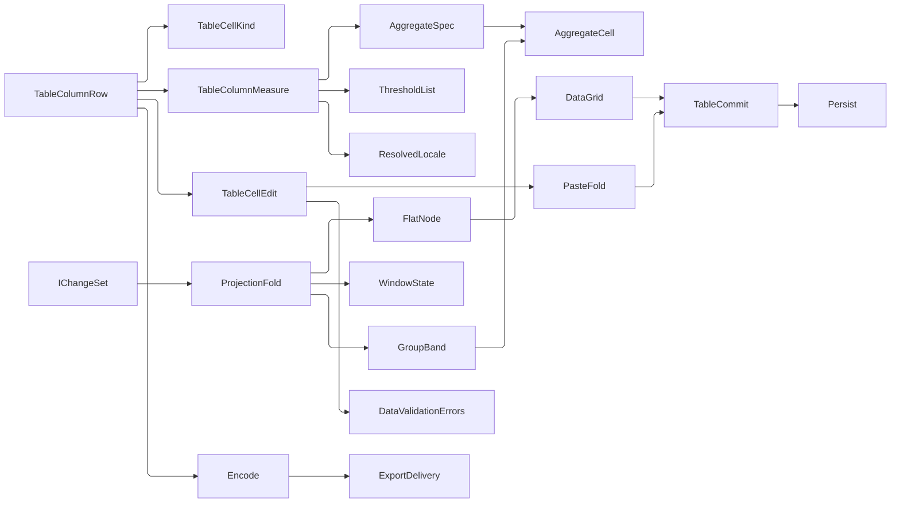

# [APPUI_TABLES_HIERARCHY]

Tabular and hierarchical projection for the Rasm.AppUi grid rail: one `TableColumnRow` metadata family drives column generation, sort comparers, filter admission, group descriptors, edit admission, cell validation, clipboard projection, aggregate contribution, and export; the `TableProjection` union folds flat, tree, grouped, paged, and windowed shapes into one virtualized `FlatNode` stream on the free `DataGrid` with a `PivotSpec` cross-tab snapshot projection beside it; the `TableViewState` snapshot keeps collection-view state and the grid-mechanism column axis explicit over the `Editing/livedata#FILTER_ALGEBRA` filter expression and `Editing/livedata#VIEW_STATE` view axis it consumes; and the `TableCommit` row bridges grid edits, clipboard paste, and fill-down onto the CommandIntent rail, `StoreOp.Upsert` persistence, and `DocumentTransaction` host routing. Export delivery is the `Document/export.md` `VisualDestination` union through `ExportDelivery.Deliver` — the tables fold shapes bytes under a stated ceiling, never mints a second delivery vocabulary. The windowing fabric, the flatten bridges and their aggregate vocabulary, the clipboard payload rows, the threshold family, the measurement policy, live-data change-set streams, screen-state snapshot rows, density and typography tokens, the AppHost `DataClassification` taxonomy, and the Persistence Sep lane arrive as settled vocabulary.

## [01]-[INDEX]

- [02]-[GRID_SUBSTRATE]: One column metadata family drives columns, filter, aggregates, validation, masking, export.
- [03]-[VIEW_STATE]: Serializable collection-view and column-axis snapshot applied in one `DeferRefresh`.
- [04]-[TREE_FLATTEN]: Five projection cases fold to one flat virtualized `FlatNode` stream.
- [05]-[GRID_COMMIT]: Edit, paste, and fill-down ride `CommandIntent` rails; exports stream under one ceiling.

## [02]-[GRID_SUBSTRATE]

- Owner: `TableColumnRow<TRow>` — the one row-model metadata record; `TableColumnAccess<TRow>` closes the plain-versus-classified materialization boundary; `TableCellEdit<TRow>` is the ONE edit authority — its absence IS the read-only verdict and its `Set` fold is the editor admission, the paste admission, and the cell-validation producer; `TableColumnMeasure<TRow>` is the numeric axis carrying the cell's own text, its aggregate contribution, and its value-driven format; `TableCellSlot` is the prepared material one kind consumes; `TableChrome` is the materialization context; `TableSurface` attaches the column, filter, and footer folds as one extension block; `TableCellKind` `[SmartEnum<string>]` closes the cell vocabulary with its construction as a delegate column.
- Cases: `TableCellKind` = Text | CheckBox | Numeric | Temporal | Progress | Template | Spark; `TableMeasure<TRow>` = Quantity | Scalar.
- Law: the free `DataGrid` virtualizes rows over the one flat bound collection; a fixed density-token row height keeps the scroll math exact, and a density change re-realizes the whole window because the ledger's fixed-mode offsets are index times that extent.
- Law: `LoadingRow` stamps row state from theme tokens onto the `DataGridRow` pseudo-classes `:selected`, `:current`, `:editing`, `:edited`, `:invalid`, `:pressed`, `:focus`, `:expanded`, `:sortascending`, `:sortdescending`, `:empty-rows`, `:empty-columns`; `LoadingRowDetails` materializes the single per-screen details template on demand; `LoadingRowGroup` stamps a materialized group header's `DataContext` from the projection's own band roster.
- Law: selection mode is a per-screen policy value; `SelectedItems` and the current row project into the screen-state snapshot.
- Law: `CustomSortComparer` carries the row's `Sort` comparer so a value-object or unit-bearing cell orders by domain law, `SortMemberPath` stays the display fallback, and the `Sorting` event never substitutes a comparer the row already declares — `Comparer<TRow>` instances satisfy the column's non-generic `IComparer` slot.
- Law: the grid `Ctrl+C` copy rides `ClipboardCopyMode` with `ClipboardContentBinding` mirroring each row's `Cell` binding; classified columns render redacted, so the copy path leaks nothing the cell does not already show.
- Law: a measure-bearing column renders and EXPORTS one text — `TableColumnMeasure.Text` folds a quantity through `ResolvedLocale.Quantity` under its `MeasureRole` and a scalar through the resolved `Formats`, so a delimited field can never disagree with the cell a reader saw and a default `ToString` is unspellable.
- Law: aggregate contribution is a column column — `TableColumnMeasure.Specs` mints the `AggregateSpec` rows the grouping fold feeds into band subtotals and the footer folds into grand totals, one `AggregateCell` vocabulary at both altitudes; the grid renders totals, never computes them.
- Law: user reorder, resize, and sort-toggle flags are per-screen policy values on `CanUserReorderColumns`, `CanUserResizeColumns`, and `CanUserSortColumns`, with `FrozenColumnCount`, `RowHeight`, and `RowDetailsTemplate` as the remaining posture members.
- Law: `Binding` is the producing half of the `Charts/dashboards` `TableSourcePort` seam — a roster plus its keyed change-set erase to one `TableSourceBinding` a `TileSource.Rows` key resolves to, so a table tile names a real producer at both ends and the erasure lands where the typed roster is still in hand.
- Entry: `Fin<TableColumnRow<TRow>> Admit()` — kind, slot, measure, and classification proved before materialization; `Fin<Option<DataGridColumn>> Column(TableChrome chrome)` — invisible rows materialize no column; `Option<string> Project(TRow item, ResolvedLocale locale)`; `Fin<FilterSchema<FlatNode<TRow>>> Schema(ResolvedLocale locale)`, `IObservable<Seq<AggregateCell>> Totals<TKey>(IObservable<IChangeSet<TRow, TKey>> rows, ResolvedLocale locale)`, `Fin<GroupPlan<TRow, TKey, string>> Grouping<TKey>(string groupColumnKey, Func<GroupBand, TKey> key, ResolvedLocale locale)`, and `TableSourceBinding Binding<TKey>(string sourceKey, IObservable<IChangeSet<TRow, TKey>> changes)` on the roster.
- Auto: one row family derives columns, sort comparers, group descriptors, per-column filter admission, edit admission, cell validation, clipboard projection, aggregate specs, and export admission — nine concerns, one owner; `AutoGenerateColumns` stays false and `Columns` is populated by the `Column()` fold, which stamps every materialized column's roster key onto `SortMemberPath` so the column-axis snapshot, the cell-validation lookup, and the sort capture all address a column by key rather than by a position a reorder shifts; the `Sort` comparer column lands as `CustomSortComparer` beside `SortMemberPath` so value-object cells order by domain comparer rather than display text, and the `Cell` binding doubles as `ClipboardContentBinding` on bound columns so the grid's own `Ctrl+C` copy under `DataGridClipboardCopyMode.IncludeHeader` and the export fold project one column vocabulary.
- Packages: Avalonia.Controls.DataGrid; Avalonia; DynamicData; UnitsNet; SkiaSharp; Thinktecture.Runtime.Extensions; LanguageExt.Core; Rasm.AppUi/Shell/virtualization; Rasm.AppUi/Charts/dashboards; Rasm.AppUi/Theme/locale.
- Growth: one column row per field; a new cell kind is one `TableCellKind` row with its construction delegate; a new filter sense is one `FilterOperator` row at its live-data owner; a new measure is one `TableMeasure` case; a sizing, visibility, or classification change is one policy value; zero new surface.
- Boundary: classification governs EVERY materialization channel — a classified column materializes ONLY the redacted presentation template (theme-token-resolved through the chrome's `Redacted` fold), read-only, unsortable, with no `Binding` and no `ClipboardContentBinding`, so display and the grid's own `Ctrl+C` copy structurally cannot carry the source cell value, and the column never enters filter, aggregate, paste, or export admission; row height and cell spacing arrive as density-token values; per-column control subclasses are the deleted form. `TableCellEdit` is the ONE edit authority and its absence is the read-only verdict at every kind, so the correction's editable-template-column-with-no-editor is unspellable: `Admit` refuses a template-backed kind whose edit carries no editing template, and the `Template` row writes `CellEditingTemplate` from that same value. CELL-LEVEL validation reaches the `:invalid` pseudo-class on BOUND columns alone and its producer is exact — `DataGridCell.IsValid` and `DataGridRow.IsValid` carry internal setters, so the only reachable writer is the grid's own `EndCellEdit` commit gate, which reads `DataValidationErrors.GetHasErrors` on the editing element and refuses the commit when the column carries a `CellEditBinding`; the attach fold therefore writes `DataValidationErrors.SetErrors` from `TableCellEdit.Set` inside `CellEditEnding`, which raises BEFORE that gate reads, so a refused candidate lands `:invalid` on the cell and its row and never leaves edit mode. A template-backed column generates no `CellEditBinding`, so its rule cannot reach the cell gate and validates at the row gate instead — that is the stated ceiling, not a gap. The value-driven format column is template-backed BY CONSTRUCTION because `DataGridColumn.CellStyleClasses` applies one class list to every cell of a column and cannot vary by value; the page mints that display template itself from the measure and the `ThresholdList`, so the cell background is the threshold family's own `Cell` colour crossing one boundary conversion from the resolved chart ink and this owner authors no brush of its own. `TableCellKind.Spark` mounts the dashboards `Sparkline.Render` offscreen chart rastered at the cell edge with its image and encoded data scope-released in the same expression, and it materializes for REALIZED rows alone because the grid recycles row containers through `LoadingRow`/`UnloadingRow` — a spark cell per source row is the rejected form.

```csharp signature
// --- [TYPES] ----------------------------------------------------------------------------

// The prepared materials ONE kind row consumes. Five loose parameters made every kind delegate restate the
// whole arity, so a new material was a signature change at seven construction sites; a slot record admits a
// material as a column and the kinds that ignore it never learn it exists. `Editable` and `Editor` derive
// from the one `TableCellEdit` value, so they cannot disagree about whether a column can be edited.
public readonly record struct TableCellSlot(
    string Header,
    DataGridLength Width,
    Option<BindingBase> Cell,
    Option<IDataTemplate> Display,
    Option<IDataTemplate> Editor,
    bool Editable);

// Cell construction is the kind row's delegate column — Build receives the prepared slot and returns the
// materialized column, so a new kind never grows the Column() dispatch. `Templated` states whether the row
// materializes a template column, which is what `Admit` proves the slot against.
[SmartEnum<string>(SwitchMethods = SwitchMapMethodsGeneration.None, MapMethods = SwitchMapMethodsGeneration.None)]
[KeyMemberEqualityComparer<ComparerAccessors.StringOrdinal, string>]
[KeyMemberComparer<ComparerAccessors.StringOrdinal, string>]
public sealed partial class TableCellKind {
    public static readonly TableCellKind Text = new("text", templated: false, static slot => new DataGridTextColumn {
        Header = slot.Header, Width = slot.Width,
        Binding = slot.Cell.ValueUnsafe(),
        ClipboardContentBinding = slot.Cell.ValueUnsafe(),
        IsReadOnly = !slot.Editable,
    });

    public static readonly TableCellKind CheckBox = new("check-box", templated: false, static slot => new DataGridCheckBoxColumn {
        Header = slot.Header, Width = slot.Width,
        Binding = slot.Cell.ValueUnsafe(),
        ClipboardContentBinding = slot.Cell.ValueUnsafe(),
        IsReadOnly = !slot.Editable,
    });

    public static readonly TableCellKind Numeric = new("numeric", templated: false, static slot => new DataGridTextColumn {
        Header = slot.Header, Width = slot.Width,
        Binding = slot.Cell.ValueUnsafe(),
        ClipboardContentBinding = slot.Cell.ValueUnsafe(),
        IsReadOnly = !slot.Editable,
    });

    // A temporal cell prints a calendar-and-zone-bound pattern the locale owns, and no pattern round-trips
    // every instant it can render — so the row forces read-only rather than admitting an editor whose commit
    // would reconstruct an instant the display already lost.
    public static readonly TableCellKind Temporal = new("temporal", templated: false, static slot => new DataGridTextColumn {
        Header = slot.Header, Width = slot.Width,
        Binding = slot.Cell.ValueUnsafe(),
        ClipboardContentBinding = slot.Cell.ValueUnsafe(),
        IsReadOnly = true,
    });

    public static readonly TableCellKind Progress = new("progress", templated: true, static slot => new DataGridTemplateColumn {
        Header = slot.Header, Width = slot.Width,
        CellTemplate = slot.Display.ValueUnsafe(),
        IsReadOnly = true,
    });

    // The editing template rides the SAME edit value that admitted the column as editable, so an editable
    // template column entering edit with no editor is unrepresentable rather than merely unlikely.
    public static readonly TableCellKind Template = new("template", templated: true, static slot => new DataGridTemplateColumn {
        Header = slot.Header, Width = slot.Width,
        CellTemplate = slot.Display.ValueUnsafe(),
        CellEditingTemplate = slot.Editor.ValueUnsafe() ?? slot.Display.ValueUnsafe(),
        IsReadOnly = !slot.Editable,
    });

    public static readonly TableCellKind Spark = new("spark", templated: true, static slot => new DataGridTemplateColumn {
        Header = slot.Header, Width = slot.Width,
        CellTemplate = slot.Display.ValueUnsafe(),
        IsReadOnly = true,
    });

    public bool Templated { get; }

    [UseDelegateFromConstructor]
    public partial DataGridColumn Build(TableCellSlot slot);
}

// --- [MODELS] ---------------------------------------------------------------------------

// The ONE edit authority. `Set` admits a candidate text into a new row, so the same value is the editor's
// commit gate, the paste cell admission, and the cell-validation producer; `Editor` is the editing template
// a template-backed kind enters. Absence of the whole record IS the read-only verdict at every kind.
public sealed record TableCellEdit<TRow>(Func<TRow, string, Fin<TRow>> Set, Option<IDataTemplate> Editor = default);

// The numeric axis a column declares, as ONE value: the measured projection, the aggregate roster it feeds,
// and the threshold list that paints it. Three separate columns made a cell's text, its subtotal, and its
// background three independent declarations that could name three different numbers for one field.
[Union(ConversionFromValue = ConversionOperatorsGeneration.None)]
public abstract partial record TableMeasure<TRow> where TRow : notnull {
    private TableMeasure() { }

    public sealed record Quantity(Func<TRow, IQuantity> Value, MeasureRole Role) : TableMeasure<TRow>;

    public sealed record Scalar(Func<TRow, double> Value, int Decimals) : TableMeasure<TRow>;
}

public readonly record struct TableCellFormat(ThresholdList Steps, double Floor, double Ceiling);

public sealed record TableColumnMeasure<TRow>(
    TableMeasure<TRow> Measure,
    Seq<AggregateMeasure> Aggregates,
    Option<TableCellFormat> Format = default) where TRow : notnull {
    // The rendered text and the exported field are ONE projection: a quantity elects its display unit and
    // grammar through the measurement policy under its role, and a scalar takes the resolved number format.
    public Fin<string> Text(TRow row, ResolvedLocale locale) => Measure.Switch(
        state: (Row: row, Locale: locale),
        quantity: static (s, q) => s.Locale.Quantity(q.Value(s.Row), q.Role),
        scalar: static (s, n) => Fin.Succ(n.Value(s.Row).ToString($"N{n.Decimals}", s.Locale.Formats)));

    // The folded number is the value IN THE ELECTED UNIT, so a subtotal and the cells above it are the same
    // measure rather than a sum over whatever unit each row happened to carry. An unconvertible quantity
    // answers NaN, which the footer's own admission refuses by name — a zero would fold as a real reading.
    public double Select(TRow row, ResolvedLocale locale) => Measure.Switch(
        state: (Row: row, Locale: locale),
        quantity: static (s, q) => Try.lift(() => q.Value(s.Row).ToUnit(s.Locale.Measures.Unit(q.Role)).Value).Run()
            .Match(Succ: static value => value, Fail: static _ => double.NaN),
        scalar: static (s, n) => n.Value(s.Row));

    // The band subtotal and the footer grand total read one spec roster, so a grouped quantity table shows
    // sums under the very columns that total them and the footer never re-derives what a band computed.
    public Seq<AggregateSpec<TRow>> Specs(string column, ResolvedLocale locale) =>
        Aggregates.Map(measure => new AggregateSpec<TRow>(column, measure, row => Select(row, locale)));

    // The cell colour the threshold family owns, crossing ONE boundary conversion from the resolved chart
    // ink into the presentation brush type — this owner authors no pigment and holds the token law.
    public Option<IBrush> Shade(TRow row, ChartInk ink, ResolvedLocale locale) =>
        Format.Bind(format => format.Steps.Cell(ink, Select(row, locale), format.Floor, format.Ceiling)
            .Match(
                Succ: shade => Some<IBrush>(new SolidColorBrush(Color.FromArgb(shade.Alpha, shade.Red, shade.Green, shade.Blue))),
                Fail: static _ => Option<IBrush>.None));
}

// The spark cell's declaration: the series it plots and the offscreen extent it rasters into.
public sealed record TableSpark<TRow>(Func<TRow, Seq<double>> Series, ChartChrome Stroke, SKImageInfo Info);

[Union(ConversionFromValue = ConversionOperatorsGeneration.None)]
public abstract partial record TableColumnAccess<TRow> where TRow : notnull {
    private TableColumnAccess() { }

    public sealed record Plain(
        Option<BindingBase> Cell,
        Func<TRow, string> Export,
        Option<TableCellEdit<TRow>> Edit = default,
        Option<IDataTemplate> Display = default,
        Option<TableSpark<TRow>> Spark = default) : TableColumnAccess<TRow>;

    public sealed record Classified(DataClassification Classification) : TableColumnAccess<TRow>;
}

public sealed record TableColumnRow<TRow>(
    string Key,
    string Header,
    TableCellKind Kind,
    TableColumnAccess<TRow> Access,
    DataGridLength Width,
    bool Sortable,
    bool Visible,
    Option<IComparer> Sort = default,
    Option<TableColumnMeasure<TRow>> Measure = default) where TRow : notnull {
    // Admission is the one place kind, slot, measure, and classification are reconciled, so every downstream
    // fold is total over an admitted row: a bound kind always has its binding, a template-backed kind always
    // has its display, an editable template column always has its editor, a formatted measure always has a
    // template to paint into, and a classified column carries no sort, measure, or edit at all.
    public Fin<TableColumnRow<TRow>> Admit() => Access.Switch(
        state: this,
        plain: static (row, plain) => (row.Kind.Templated, plain, row.Measure) switch {
            (false, { Cell.IsNone: true }, _) => Refuse(row.Key, "a bound kind carries no cell binding"),
            (true, { Display.IsNone: true }, _) => Refuse(row.Key, "a template-backed kind carries no display template"),
            (true, { Edit.IsSome: true }, _) when plain.Edit.Exists(static edit => edit.Editor.IsNone) =>
                Refuse(row.Key, "an editable template column carries no editing template"),
            (false, _, { IsSome: true }) when row.Measure.Exists(static measure => measure.Format.IsSome) =>
                Refuse(row.Key, "a value-driven format needs a template-backed kind"),
            _ => Fin.Succ(row),
        },
        classified: static (row, _) => row is { Sortable: false, Sort.IsNone: true, Measure.IsNone: true }
            ? Fin.Succ(row)
            : Refuse(row.Key, "a classified column carries no sort or measure"));

    private static Fin<TableColumnRow<TRow>> Refuse(string key, string detail) =>
        Fin.Fail<TableColumnRow<TRow>>(new EditFault.Invariant(key, detail));
}

// The materialization context: the redaction fold, the resolved chart ink every threshold shade resolves
// through, and the locale every measured and temporal cell prints under. One record because a column can
// materialize under none of them alone.
public sealed record TableChrome(
    Func<DataClassification, IDataTemplate> Redacted,
    ChartInk Ink,
    ResolvedLocale Locale);

// --- [OPERATIONS] -----------------------------------------------------------------------

public static class TableSurface {
    extension<TRow>(TableColumnRow<TRow> row) where TRow : notnull {
        // Classification wins before any kind dispatch: the redacted template is the ONLY materialization of
        // a classified column — no binding, no clipboard projection, no sort. A measure carrying a format
        // MINTS its own display template here, because the caller cannot author a template over folds this
        // owner holds and a per-value background has nowhere else on the control to live.
        public Fin<Option<DataGridColumn>> Column(TableChrome chrome) =>
            row.Admit().Map(admitted => !admitted.Visible
                ? Option<DataGridColumn>.None
                : Some(admitted.Access.Switch(
                    state: (Row: admitted, Chrome: chrome),
                    plain: static (s, access) => Materialized(s.Row, access, s.Chrome),
                    classified: static (s, access) => Configured(new DataGridTemplateColumn {
                        Header = s.Row.Header,
                        Width = s.Row.Width,
                        CellTemplate = s.Chrome.Redacted(access.Classification),
                        IsReadOnly = true,
                    }, s.Row))));

        // The exported field and the rendered cell are one text: a measure-bearing column prints through the
        // measurement policy and every other column through its own export projection, so a delimited file
        // and the grid a reader compared it against can never disagree.
        public Option<string> Project(TRow item, ResolvedLocale locale) => row.Access.Switch(
            state: (Item: item, Row: row, Locale: locale),
            plain: static (s, access) => s.Row.Measure.Match(
                Some: measure => Some(measure.Text(s.Item, s.Locale).IfNone(string.Empty)),
                None: () => Some(access.Export(s.Item))),
            classified: static (_, _) => Option<string>.None);

        public Option<double> Measured(TRow item, ResolvedLocale locale) =>
            row.Measure.Map(measure => measure.Select(item, locale));

        public Option<TableCellEdit<TRow>> Edit =>
            row.Access is TableColumnAccess<TRow>.Plain plain ? plain.Edit : None;
    }

    // The display template a plain column materializes: a formatted measure mints its own, a spark row mints
    // its own, and an authored template stands where neither applies — one election, checked in that order
    // because a measure's format and a caller's template addressing the same cell is an authoring mistake the
    // page resolves toward the value-driven form rather than painting one over the other.
    private static DataGridColumn Materialized<TRow>(
        TableColumnRow<TRow> row, TableColumnAccess<TRow>.Plain access, TableChrome chrome) where TRow : notnull =>
        Configured(row.Kind.Build(new TableCellSlot(
            row.Header,
            row.Width,
            access.Cell,
            row.Measure.Bind(measure => measure.Format.Map(_ => Formatted(measure, chrome)))
                | access.Spark.Map(spark => Sparked(spark, chrome))
                | access.Display,
            access.Edit.Bind(static edit => edit.Editor),
            access.Edit.IsSome)), row);

    // EVERY materialized column carries its roster key at `SortMemberPath`, classified rows included, so the
    // column-axis snapshot, the cell-validation lookup, and the sort capture all address a column by its key
    // rather than by a position that a reorder or a hidden row would shift out from under them.
    private static DataGridColumn Configured<TRow>(DataGridColumn column, TableColumnRow<TRow> row) where TRow : notnull {
        column.CanUserSort = row.Sortable;
        column.SortMemberPath = row.Key;
        row.Sort.Iter(comparer => column.CustomSortComparer = comparer);
        return column;
    }

    // The value-driven format cell: the threshold family's own colour behind the measure's own text, both
    // read off one measured value. The node case is the match predicate because the flatten emits one row
    // vocabulary and a band never reaches a cell template.
    private static IDataTemplate Formatted<TRow>(TableColumnMeasure<TRow> measure, TableChrome chrome) where TRow : notnull =>
        new FuncDataTemplate<FlatNode<TRow>>(
            static node => node is FlatNode<TRow>.Row,
            (node, _) => node is FlatNode<TRow>.Row item
                ? new Border {
                    Background = measure.Shade(item.Item, chrome.Ink, chrome.Locale).ValueUnsafe(),
                    Child = new TextBlock { Text = measure.Text(item.Item, chrome.Locale).IfNone(string.Empty) },
                }
                : (Control)new TextBlock(),
            supportsRecycling: true);

    // The spark cell rasters the dashboards offscreen chart at the cell edge and releases its native image
    // and encoded data in the same expression, so a scrolled-away row leaves nothing behind.
    private static IDataTemplate Sparked<TRow>(TableSpark<TRow> spark, TableChrome chrome) where TRow : notnull =>
        new FuncDataTemplate<FlatNode<TRow>>(
            static node => node is FlatNode<TRow>.Row,
            (node, _) => node is FlatNode<TRow>.Row item
                ? Raster(spark.Series(item.Item), spark, chrome).Match(
                    Succ: static bitmap => (Control)new Image { Source = bitmap },
                    Fail: static _ => (Control)new TextBlock())
                : new TextBlock(),
            supportsRecycling: true);

    private static Fin<Bitmap> Raster<TRow>(Seq<double> values, TableSpark<TRow> spark, TableChrome chrome) where TRow : notnull =>
        Sparkline.Render(values, chrome.Ink, spark.Stroke, spark.Info).Map(static image => {
            using SKImage owned = image;
            using SKData encoded = owned.Encode(SKEncodedImageFormat.Png, 100);
            using MemoryStream stream = new(encoded.ToArray(), writable: false);
            return new Bitmap(stream);
        });

    extension<TRow>(Seq<TableColumnRow<TRow>> rows) where TRow : notnull {
        // The dashboards seam's PRODUCING half: a roster plus its keyed change-set become the erased binding a
        // `TileSource.Rows` key resolves to. The erasure happens HERE, at the one place the typed roster is
        // still in hand, so the board never learns a row type and the tables side never learns a tile.
        public TableSourceBinding Binding<TKey>(string sourceKey, IObservable<IChangeSet<TRow, TKey>> changes)
            where TKey : notnull =>
            new(sourceKey,
                changes.Transform(static row => (object)row).ChangeKey(static (key, _) => key.ToString() ?? string.Empty),
                rows.Filter(static row => row.Visible).Map(static row => row.Key));

        // The filter seam's PRODUCING half: the roster erases into the `Editing/livedata#FILTER_ALGEBRA`
        // property vocabulary, so the grid's predicate, its order comparer, and its group key all come off
        // the one compiler every board, list, and search panel already evaluates. A measured column filters
        // as `number` through its elected-unit projection and every other plain column as `text` through the
        // same display projection its cell renders, so a bound reads a number and a match reads what the user
        // can see. A classified or invisible column contributes no property at all — it cannot be addressed
        // by a filter, an order, or a shared link.
        public Fin<FilterSchema<FlatNode<TRow>>> Schema(ResolvedLocale locale) =>
            new FilterSchema<FlatNode<TRow>>(rows
                .Filter(static row => row.Visible && row.Access is TableColumnAccess<TRow>.Plain)
                .Map(row => new FilterField<FlatNode<TRow>>(
                    new FilterProperty(row.Key, row.Header,
                        row.Measure.IsSome ? FilterKind.Number : FilterKind.Text, Seq<FilterValue>()),
                    node => Cell(row, node, locale)))).Admit();

        // A BAND or window node carries no cell on any column, so it answers an empty value set: every
        // operator refuses it and a header never survives a filter its members failed.
        private static Seq<FilterValue> Cell(TableColumnRow<TRow> row, FlatNode<TRow> node, ResolvedLocale locale) =>
            node is FlatNode<TRow>.Row item
                // Both arms read the projections the cell itself renders — `Measured` for the elected-unit
                // number and `Project` for the displayed text — so a filter matches what a reader sees. A
                // non-finite measure answers an EMPTY set rather than a number, so an unconvertible quantity
                // reads absent instead of landing at one edge of a bound.
                ? row.Measured(item.Item, locale).Match(
                    Some: value => double.IsFinite(value)
                        ? Seq<FilterValue>(new FilterValue.Number(value))
                        : Seq<FilterValue>(),
                    None: () => row.Project(item.Item, locale)
                        .Map(static text => (FilterValue)new FilterValue.Text(text)).ToSeq())
                : Seq<FilterValue>();

        public Seq<AggregateSpec<TRow>> Specs(ResolvedLocale locale) =>
            rows.Filter(static row => row.Visible).Bind(row => row.Measure
                .Map(measure => measure.Specs(row.Key, locale))
                .IfNone(Seq<AggregateSpec<TRow>>()));

        // The footer reads the SAME AggregateCell shape a band header reads, so a grand total and a subtotal
        // are one vocabulary; a non-finite cell is refused by name rather than printed as a number.
        public IObservable<Seq<AggregateCell>> Totals<TKey>(
            IObservable<IChangeSet<TRow, TKey>> changes, ResolvedLocale locale) where TKey : notnull =>
            rows.Specs(locale) switch {
                { IsEmpty: true } => Observable.Return(Seq<AggregateCell>()),
                var specs => Observable
                    .CombineLatest(specs.Map(spec => spec.Over(changes)))
                    .Select(static cells => toSeq(cells).Filter(static cell => double.IsFinite(cell.Value))),
            };

        // The grouping request minted from the roster: the group column's own projection labels each band and
        // every measured column contributes its aggregate specs, so the header subtotals land under the very
        // columns that total them and the plan carries no vocabulary the roster does not already hold.
        public Fin<GroupPlan<TRow, TKey, string>> Grouping<TKey>(
            string groupColumnKey, Func<GroupBand, TKey> key, ResolvedLocale locale) where TKey : notnull =>
            rows.Find(row => row.Key == groupColumnKey && row.Visible && row.Access is TableColumnAccess<TRow>.Plain)
                .ToFin(new EditFault.Invariant(groupColumnKey, "group column is absent, hidden, or classified"))
                .Map(column => new GroupPlan<TRow, TKey, string>(
                    Of: item => column.Project(item, locale).IfNone(string.Empty),
                    Label: static group => group,
                    Key: key,
                    Aggregates: rows.Specs(locale),
                    Order: Some<IComparer<string>>(StringComparer.Ordinal)));
    }
}
```

## [03]-[VIEW_STATE]

- Owner: `TableViewState` — the serializable collection-view AND grid-mechanism column snapshot over the consumed `Editing/livedata#VIEW_STATE` domain axis; `TableColumnState` — the per-column display-index and resolved-width cell; `ViewStateSurface` applies and captures it against one `DataGrid` and its `DataGridCollectionView`, the only collection-view state holder.
- Law: every multi-descriptor write lands inside one `DeferRefresh` scope; per-descriptor refresh churn is the deleted form.
- Law: paging is live only while `PageSize` exceeds zero, so value `0` reads as unpaged; a paged projection writes its window through the snapshot field, never a second paging surface, and restore replays that window's page index so a snapshot re-opens where it closed.
- Law: `AddNew` and `EditItem` fire only as CommandIntent executions; page and current transitions surface through `PageChangingEventArgs` and `DataGridCurrentChangingEventArgs` into screen state.
- Law: the column axis splits by ownership — display index and resolved width are grid MECHANISM and stay on `TableColumnState`, while visibility is the DOMAIN fact `ViewState.Visible` owns because every surface reads it; all three write `DataGridColumn.DisplayIndex`, `Width`, and `IsVisible` and capture back off `DisplayIndex`, `ActualWidth`, and `IsVisible`, so a reordered, resized, and re-shown layout survives restore without a second copy of visibility to disagree with the board's.
- Law: `LoadingRowGroup` stamps group-header state from theme tokens onto each materialized group header, the one materialization edge for grouped projections, so a per-group-header style fork is the deleted form; the group key threads from `ViewState.Group` through the collection view's `GroupDescriptions`, so header expansion state survives restore on the same axis every other surface groups by.
- Law: `CurrentKey` resolves against the keyed live-data cache on the screen; `Apply` receives the resolved item as the `current` value.
- Entry: `Fin<Unit> Apply<TRow>(DataGridCollectionView view, TableViewState state, Seq<TableColumnRow<TRow>> columns, ResolvedLocale locale, FilterPolicy policy, Option<object> current = default)` on `DataGrid` — decodes and compiles the filter, admits view, page, column, expansion, and realized-window state against the column vocabulary, then writes one batched mutation; `TableViewState Capture<TRow>(DataGridCollectionView view, Seq<TableColumnRow<TRow>> columns, TableViewState held)` on `DataGrid` — the producer for every axis the user mutates through the control itself.
- Auto: `DeferRefresh` collapses every multi-descriptor write into one refresh; apply-on-activate and capture-on-deactivate ride the screen-state snapshot rows; the window field is PRODUCED by `ProjectionFold.Project`, which returns its bounds stream beside its row stream — the paged arm off `IPagedChangeSet.Response.Page`/`PageSize` and the virtualized arm off the `ExtentLedger`'s own live positions — so restore re-requests the same window with zero re-query and no snapshot carries a position no projection measured; the filter predicate reaches the view through the live-data `FilterPace`, which publishes one shared edit stream, throttles it on the quiet span, and merges a sampled emission on the ceiling span, so a held key never starves the grid of a refresh and a burst of keystrokes costs one compile rather than one per character.
- Packages: Avalonia.Controls.DataGrid; System.Reactive; DynamicData; LanguageExt.Core; Rasm.AppUi/Theme/locale; BCL inbox.
- Growth: one snapshot field per grid-mechanism axis; a page-size, window, or column change is one policy value; a filter or view axis grows at its live-data owner; zero new surface.
- Boundary: boundary capsule (statement carve-out) — `DataGridCollectionView` and `DataGridColumn` are package-owned mutable state, so `Apply` carries language-owned statement forms writing filter, sort, group, page, column, and current-row descriptors inside one `DeferRefresh` scope; the snapshot is built from screen control state and never read back from the view except through `Capture`, which is the one read-back seam. The PREDICATE is the live-data compiler's and this owner adapts it at one cast, because the control's filter is untyped and every other surface takes the typed one — a grid-local operator vocabulary beside `FilterOperator` is the deleted form and is what made a grid filter and a board filter two dialects; an OPEN expression writes a null filter rather than a predicate that answers true, so an unfiltered view costs the collection view no per-row call at all. SORT identity is the grid's own: a column carrying a domain comparer writes `DataGridSortDescription.FromComparer` and every other column writes `FromPath` with the view's culture, which is exactly what the header gesture constructs — so a restored description and a gesture-produced one are the same value and the header toggles in place instead of appending a second entry. `Capture` maps each description back to its column through `HasPropertyPath` or through `DataGridComparerSortDescription.SourceComparer` reference identity, so a comparer-sorted column — whose description carries no property path at all — still resolves to its key and the sort axis survives restore. Setting BOTH `CustomSortComparer` and a path-bearing description on one column is the rejected form: `DataGridColumn.GetSortDescription` matches a comparer-bearing column by source comparer alone, finds no match against a path description, and the gesture then ADDS a second sort entry for the same column. The MULTI-SORT gesture law is the control's and this owner never re-implements it — a plain header click clears the descriptions and toggles that column alone, `Shift`-click appends or toggles in place so the sort keys read in click order, `Ctrl`/`Cmd`-click clears every description, `Shift`+`Ctrl`/`Cmd` is a no-op, and sorting is refused outright while a row is in edit; `Sorting` with `e.Handled` is the ONE interception, reserved for pushing the order into a backing query, and substituting a comparer there that the column already declares is the deleted form. The `Paged` window rides the live-data `Page` operator and constructs `WindowState.Paged`, while the virtualized window rides `Virtualise` and constructs `WindowState.Virtualized` from the `ExtentLedger`, so one modality never carries zero/default fields belonging to the other, and `Admit` rejects a `Paged` window whose size disagrees with the snapshot's `PageSize`; a second collection-view state holder is the deleted form.

```csharp signature
// --- [MODELS] ---------------------------------------------------------------------------

[Union(ConversionFromValue = ConversionOperatorsGeneration.None)]
public abstract partial record WindowState {
    private WindowState() { }
    public sealed record Paged(int Index, int Size) : WindowState;
    public sealed record Virtualized(int Start, int Size) : WindowState;
}

// The GRID-MECHANISM column cell: display index and resolved pixel extent, the two things a user mutates
// through this control and no other surface has. Visibility left this record for `ViewState.Visible`, because
// a column hidden on a board and hidden on a grid is one domain fact and keeping a second copy here let the
// two disagree the first time a board hid a column the grid still showed. Width persists as a resolved pixel
// extent because `ActualWidth` is what a resize produced and re-applying a star or auto length would discard it.
public readonly record struct TableColumnState(string ColumnKey, int Order, double Width);

// The grid snapshot: the ENCODED filter and the domain view axis both ride the `Editing/livedata` owners, so
// the axes a user recognizes as "the view" are one value across every surface and only the control-mechanism
// cells stay here.
public sealed record TableViewState(
    string Filter,
    FilterPace Pace,
    ViewState View,
    Seq<TableColumnState> Columns,
    Option<int> PageSize,
    Option<string> CurrentKey,
    Seq<string> Expanded,
    Option<WindowState> Window = default) {
    public Fin<TableViewState> Admit<TRow>(
        Seq<TableColumnRow<TRow>> columns, ResolvedLocale locale, FilterPolicy policy) where TRow : notnull =>
        from schema in columns.Schema(locale)
        from _ in FilterLink.Decode(Filter, schema, policy)
        from view in View.Admit(schema)
        from paced in Pace.Admit()
        from held in Structural(columns)
        select held;

    private Fin<TableViewState> Structural<TRow>(Seq<TableColumnRow<TRow>> columns) where TRow : notnull =>
        // The column axis covers the MATERIALIZED roster: an authored-invisible row mints no column at all, so
        // a state row naming it would address a seat the control never held.
        toSet(columns.Filter(static column => column.Visible).Map(static column => column.Key)) switch {
            var roster =>
                // The column axis is a PERMUTATION of the roster: a partial snapshot would leave the unnamed
                // columns at whatever display index the last layout happened to hold, which is a restore that
                // silently reorders the columns it did not mention.
                (Columns.IsEmpty || (Columns.Count == roster.Count
                    && Columns.Map(static column => column.ColumnKey).Distinct().Count == Columns.Count
                    && Columns.ForAll(column => roster.Contains(column.ColumnKey))
                    && toSet(Columns.Map(static column => column.Order)) == toSet(Range(0, Columns.Count))
                    && Columns.ForAll(static column => double.IsFinite(column.Width) && column.Width > 0d)))
                && PageSize.ForAll(static size => size > 0)
                && CurrentKey.ForAll(static key => !string.IsNullOrWhiteSpace(key))
                && Expanded.Distinct().Count == Expanded.Count
                && Expanded.ForAll(static key => !string.IsNullOrWhiteSpace(key))
                && Window.ForAll(window => window switch {
                    WindowState.Paged page => page.Index >= 0 && page.Size > 0 && PageSize.ForAll(size => size == page.Size),
                    WindowState.Virtualized view => view.Start >= 0 && view.Size > 0,
                    _ => false,
                })
                    ? Fin.Succ(this)
                    : Fin.Fail<TableViewState>(new EditFault.Invariant("table/view-state", "column, page, expansion, or window state is invalid")),
        };
}

// --- [OPERATIONS] -----------------------------------------------------------------------

public static class ViewStateSurface {
    extension(DataGrid grid) {
        public Fin<Unit> Apply<TRow>(
            DataGridCollectionView view,
            TableViewState state,
            Seq<TableColumnRow<TRow>> columns,
            ResolvedLocale locale,
            FilterPolicy policy,
            Option<object> current = default) where TRow : notnull =>
            from admitted in state.Admit(columns, locale, policy)
            from schema in columns.Schema(locale)
            from expression in FilterLink.Decode(admitted.Filter, schema, policy)
            // The compiled predicate is the LIVE-DATA compiler's, adapted at this one cast: the control takes
            // an untyped filter and every other surface takes the typed one, so the grammar never forks.
            from compiled in schema.Compile(expression)
            select fun(() => {
                using IDisposable batch = view.DeferRefresh();
                view.Filter = expression is FilterExpr.All { Parts.IsEmpty: true }
                    ? null
                    : item => item is FlatNode<TRow> node && compiled(node);
                view.SortDescriptions.Clear();
                admitted.View.Order.Iter(sort => columns
                    .Find(column => column.Key == sort.PropertyKey)
                    .Iter(column => view.SortDescriptions.Add(Described(column, sort.Descending, view.Culture))));
                view.GroupDescriptions.Clear();
                admitted.View.Group.Iter(group => view.GroupDescriptions.Add(new DataGridPathGroupDescription(group)));
                view.PageSize = admitted.PageSize.IfNone(0);
                // The column axis writes in ASCENDING target order, because assigning `DisplayIndex` shuffles
                // every column between the old and new position — descending assignment walks each column
                // back over the ones already placed and lands a permutation nobody authored. The ordered run
                // re-enters the carrier before the walk, since ordering leaves the carrier and no carrier
                // member reaches an ordered enumerable.
                toSeq(admitted.Columns.OrderBy(static column => column.Order))
                    .Iter(column => Seated(grid, column, admitted.View.Shows(column.ColumnKey)));
                // The paged window's INDEX is collection-view state: `PageSize` alone restores the page SHAPE
                // and lands on page zero, so a snapshot taken on page N re-opens at the top with its own
                // admitted index discarded. The virtualized window holds no view position — its restore is
                // the projection's viewport re-request through `VirtualWindow.Realize` — and the move rides
                // inside the batch, so the deferred page change and the current-row move settle as one refresh.
                admitted.Window.Iter(window => ignore(window.Switch(
                    state: view,
                    paged: static (target, page) => target.MoveToPage(page.Index),
                    virtualized: static (_, _) => false)));
                current.Iter(item => view.MoveCurrentTo(item));
                return unit;
            })();

        // The PRODUCER every user-mutable axis needed: reorder, resize, visibility, and the header sort
        // gesture all write the control, so the snapshot reads them back off the control rather than
        // shadowing each gesture with a second state write that a missed event would desynchronize.
        public TableViewState Capture<TRow>(
            DataGridCollectionView view,
            Seq<TableColumnRow<TRow>> columns,
            TableViewState held) where TRow : notnull =>
            held with {
                // Order and visibility capture back onto the DOMAIN axis, so a header gesture and a board's
                // own column toggle write one value rather than two the merge would have to reconcile.
                View = held.View with {
                    Order = toSeq(view.SortDescriptions)
                        .Choose(description => Keyed(description, columns)
                            .Map(key => (PropertyKey: key, Descending: description.Direction is ListSortDirection.Descending))),
                    Visible = toSeq(grid.Columns).Filter(static column => column.IsVisible)
                        .Map(static column => column.SortMemberPath),
                },
                Columns = toSeq(grid.Columns).Map(static column => new TableColumnState(
                    column.SortMemberPath, column.DisplayIndex, column.ActualWidth)),
            };

        // The seat resolves by KEY: `Configured` stamped every materialized column's roster key onto
        // `SortMemberPath`, so a reorder the user already applied cannot move the seat out from under the
        // state that is about to write it. Visibility arrives from the view axis rather than the column cell,
        // because it is the same fact every other surface reads.
        private static Unit Seated(DataGrid grid, TableColumnState state, bool visible) =>
            toSeq(grid.Columns)
                .Find(column => string.Equals(column.SortMemberPath, state.ColumnKey, StringComparison.Ordinal))
                .Match(
                    Some: column => {
                        column.IsVisible = visible;
                        column.DisplayIndex = state.Order;
                        column.Width = new DataGridLength(state.Width, DataGridLengthUnitType.Pixel);
                        return unit;
                    },
                    None: static () => unit);

        // The description a restore writes is the one the header gesture would have produced, so a restored
        // sort toggles in place on the next click instead of appending a second entry for the same column.
        private static DataGridSortDescription Described<TRow>(
            TableColumnRow<TRow> column, bool descending, CultureInfo culture) where TRow : notnull =>
            (column.Sort, descending ? ListSortDirection.Descending : ListSortDirection.Ascending) switch {
                ({ IsSome: true, Case: IComparer comparer }, var direction) =>
                    DataGridSortDescription.FromComparer(comparer, direction),
                (_, var direction) => DataGridSortDescription.FromPath(column.Key, direction, culture),
            };

        // A comparer-bearing description carries NO property path, so path matching alone dropped every
        // domain-sorted column from the captured snapshot; the package's own `SourceComparer` closes it.
        private static Option<string> Keyed<TRow>(
            DataGridSortDescription description, Seq<TableColumnRow<TRow>> columns) where TRow : notnull =>
            description switch {
                { HasPropertyPath: true } path => columns
                    .Find(column => column.Key == path.PropertyPath)
                    .Map(static column => column.Key),
                DataGridComparerSortDescription comparer => columns
                    .Find(column => column.Sort.Exists(sort => ReferenceEquals(sort, comparer.SourceComparer)))
                    .Map(static column => column.Key),
                _ => None,
            };
    }
}
```

## [04]-[TREE_FLATTEN]

- Owner: `TableProjection<TRow, TKey>` `[Union]` with the `Shell/virtualization` `FlatNode<TRow>` as the one flat row vocabulary and `ExpansionState<TKey>` as the expansion cell; `TableProjectionFeed<TRow, TKey>` carries the row stream, the window bounds, and the band roster off one subscription; `ProjectionFold` dispatches the union onto that feed.
- Cases: `Flat`, `TreeFlattened(Func<TRow, TKey> ParentKey, Option<IComparer<TRow>> Order, Option<Func<TKey, IObservable<IChangeSet<TRow, TKey>>>> LoadChildren)`, `Grouped(string GroupColumnKey, GroupPlan<TRow, TKey, string> Plan)`, `Paged(IObservable<PageRequest> Pages, IObservable<IComparer<TRow>> Order)`, `Virtualized(VirtualWindow<TRow, TKey> Owner, IObservable<ViewportRange> Viewport, IObservable<IComparer<TRow>> Order)`.
- Law: every case lands as `IChangeSet<FlatNode<TRow>, TKey>`; the grid binds one flat collection of that one vocabulary, so the one `VirtualWindow` fabric windows every projection and a tables-local indent row beside `FlatNode` is the deleted form.
- Law: the `TreeFlattened` recursion is the `Shell/virtualization` `HierarchyFlatten` bridge and the `Grouped` fold is the `GroupFlatten` bridge, not tables-local folds — the column-metadata family stays tables-owned, the sibling-order comparer threads as the bridge's optional order argument, the grouping request is the roster-minted `GroupPlan`, and windowing delegates to the one fabric.
- Law: the cross-tab is a snapshot projection over the materialized item set — quantity-takeoff and status matrices are `PivotSpec` values whose cell fold reuses the aggregation vocabulary and answers `Option<double>`, so a vacant cross renders as absence rather than a fabricated zero and the finiteness gate reads only measured cells; the matrix exports through the same `Delimited` shaping and `ExportDelivery.Deliver` fold.
- Law: view sort descriptors stay empty on a tree projection; sibling order is the case's `Order` comparer threaded into `HierarchyFlatten.Flatten` — sorting flat indent rows is the deleted form.
- Law: the two WINDOWED arms each carry the live comparer STREAM and apply it at their own seat, because `Page` and `Virtualise` both demand a sorted change-set while the receiver every arm shares is the keyed feed, so the arm needing the sorted type is the arm that states it; the stream is the `Editing/livedata#VIEW_STATE` `PipelineInputs.Comparers` value, seeded so a window realizes on the first view rather than waiting for a user's first sort. A frozen comparer made a column-sort flip spellable only as a fresh projection on a re-subscribed pipeline, discarding the source cache, the recycle pool, and every measured extent to re-rank an order the package maintains in place; the three unwindowed arms declare none, because nothing downstream of them reads a sorted type.
- Law: `LoadChildren` materializes a child stream on first expansion through the `FirstExpansion` fold — each key entering the expansion set subscribes its stream exactly once, and loaded children merge into the upstream keyed spine the shared flatten reads, never a side collection.
- Law: `DiffTableFold.Classify` projects the SAME `(ElementId, DiffClass)` classification `Render/pipeline.md` `VersionGhost.Project` renders in the viewport into a per-class summary and classified element rows, exported through the same `Delimited` shaping and `ExportDelivery.Deliver` fold — a grid-local diff classification is the deleted form.
- Entry: `TableProjectionFeed<TRow, TKey> Project(TableProjection<TRow, TKey> projection, ExpansionState<TKey> expansion, Func<TRow, TKey> key)` — rows, window bounds, and band roster ride BESIDE each other off one shared subscription, so the `[03]` snapshot field has the producer its `Admit` already validates, an unwindowed case emits an empty window stream rather than a fabricated position, and an ungrouped case emits an empty band roster rather than a header feed nothing stamps.
- Auto: an expansion toggle re-emits the flattened stream through the change-set diff; the `TreeFlattened` arm delegates the flatten to `HierarchyFlatten.Flatten`, the `Grouped` arm delegates to `GroupFlatten.Grouped` with the roster-minted plan, and the `Virtualized` arm consumes the caller-owned `VirtualWindow`, current `ViewportRange` stream, and live comparer stream to build `OrderedChangeSet<TRow,TKey>` for `VirtualWindow.Realize`, which owns the sort for that arm; the windowed arms share one published subscription and project rows and `WindowState` bounds off it, so the snapshot's window and the grid's rows can never disagree about the position they were measured at; expansion keys persist on the `Expanded` snapshot field through the row key's string projection, and restore mints the expansion cell before the first projection subscription.
- Packages: DynamicData; System.Reactive; Thinktecture.Runtime.Extensions; LanguageExt.Core; Rasm.AppUi/Shell/virtualization.
- Growth: one projection case; an ordering or depth change is one policy value; zero new surface — the closed five-case family is the axis.
- Boundary: `TreeDataGrid` stays rejected — every hierarchy renders as `FlatNode.Row` indent rows on the flat virtualized `DataGrid`, which is the absorbing fold; windowing routes through the one `VirtualWindow` owner, so a tables-local virtualizer is the `[04]-[BOUNDARIES]` per-surface-virtualizer rejected form and `Editing/tables` delegates windowing to the one fabric while conserving its `TableColumnRow` column-metadata family and its sibling-order comparer; the tables-side fold contributes its `parentKey`, sibling-order comparer, expansion cell, and grouping plan to the shared bridges, which own the `TransformToTree`-plus-recursion and the `Group`-plus-aggregation this page previously held in-folder, so the flatten algebra lives at one owner with zero capability lost — the column metadata, the lazy `LoadChildren`, the paged arm, and the pivot stay tables-owned. GROUP MATERIALIZATION is the collection view's and the AGGREGATE is the flatten's: `GroupFlatten.Grouped` emits `FlatNode.Band` nodes carrying live `AggregateCell` subtotals, the fold FILTERS those bands out of the bound row stream and publishes them as the band roster `LoadingRowGroup` stamps onto each materialized `DataGridRowGroupHeader` through its `DataContext`, and `GroupDescriptions` renders the header itself — binding a band AS a grid row is the rejected form on this control, because every bound column would render an empty cell against a node carrying no item and a template column carries no `CellEditBinding`, which is the one reachable `:invalid` producer; the band's own `Count` cell is the header's cardinality, so `IsItemCountVisible` stays false and one count source serves the header. `TransformToTree` emits root nodes only (its default predicate is `IsRoot`), so the shared flatten fold owns child materialization and never double-counts; grouped virtualization stability rides the live-data immutable-group projection-policy row; the expansion cell disposes inside the activation scope with its `DisposalReceipt`; the virtualized window bound reads `ExtentLedger.StartIndex`/`Size`/`Live` for the current range rather than folding the realized collection, so restore re-requests the exact viewport with zero re-query and an empty ledger emits no window at all, and a `FlatNode` carries no offset or extent because the fixed density-token row height makes both derivable from the index the window already reports. The PIVOT's column axis is bounded at admission: the control virtualizes ROWS and never columns, so each dynamic column costs one header plus one materialized cell per realized row and an unbounded cross would realize an unbounded control set per row — `PivotSpec.ColumnCeiling` refuses an over-wide cross by name, and column recycling is unavailable by construction because `Columns` is a model collection the grid re-materializes wholesale rather than a recycled container pool.

```csharp signature
// --- [MODELS] ---------------------------------------------------------------------------

public sealed record ExpansionState<TKey>(BehaviorSubject<Set<TKey>> Cell) : IDisposable where TKey : notnull {
    public static ExpansionState<TKey> Of(Seq<TKey> expanded) => new(new BehaviorSubject<Set<TKey>>(toSet(expanded)));

    public bool IsExpanded(TKey key) => Cell.Value.Contains(key);

    public Unit Toggle(TKey key) => fun(() => Cell.OnNext(Cell.Value.Contains(key) ? Cell.Value.Remove(key) : Cell.Value.Add(key)))();

    public void Dispose() {
        Cell.OnCompleted();
        Cell.Dispose();
    }
}

// Three streams off ONE subscription. A tuple return grew a third member the moment grouping landed its band
// roster, so the feed is a record: a fourth beside-the-rows product is a column, never a wider tuple every
// call site re-destructures.
public sealed record TableProjectionFeed<TRow, TKey>(
    IObservable<IChangeSet<FlatNode<TRow>, TKey>> Rows,
    IObservable<WindowState> Window,
    IObservable<HashMap<string, GroupBand>> Bands) where TRow : notnull where TKey : notnull;

[Union(ConversionFromValue = ConversionOperatorsGeneration.None)]
public abstract partial record TableProjection<TRow, TKey> where TRow : notnull where TKey : notnull {
    private TableProjection() { }

    public sealed record Flat : TableProjection<TRow, TKey>;

    public sealed record TreeFlattened(
        Func<TRow, TKey> ParentKey,
        Option<IComparer<TRow>> Order = default,
        Option<Func<TKey, IObservable<IChangeSet<TRow, TKey>>>> LoadChildren = default) : TableProjection<TRow, TKey>;

    // The plan is the fold's request and the column key is the snapshot's vocabulary, so the grouped arm
    // carries both rather than re-deriving one from the other at either end.
    public sealed record Grouped(string GroupColumnKey, GroupPlan<TRow, TKey, string> Plan) : TableProjection<TRow, TKey>;

    // Paging demands the SORTED change-set type, which the shared keyed receiver has already erased, so this
    // arm carries the order it needs rather than trusting an upstream sort the type system cannot see.
    public sealed record Paged(
        IObservable<PageRequest> Pages,
        IObservable<IComparer<TRow>> Order) : TableProjection<TRow, TKey>;

    // The comparer STREAM is the window's ONE ordering authority — `OrderedChangeSet` pairs it with the
    // source and the ledger reads its ordinals off the sorted change-set the window owner produces, so an
    // order projection supplied beside it is a second sequence that can disagree with the one the window
    // actually realized. A frozen comparer here made a column-sort flip spellable only as a fresh projection
    // on a re-subscribed pipeline, which discards the source cache, the recycle pool, and every measured
    // extent to change an ordering the package re-ranks in place.
    public sealed record Virtualized(
        VirtualWindow<TRow, TKey> Owner,
        IObservable<ViewportRange> Viewport,
        IObservable<IComparer<TRow>> Order) : TableProjection<TRow, TKey>;
}

// --- [OPERATIONS] -----------------------------------------------------------------------

public static class ProjectionFold {
    extension<TRow, TKey>(IObservable<IChangeSet<TRow, TKey>> source) where TRow : notnull where TKey : notnull {
        // The windowed arms publish ONE shared subscription and project twice off it: rows for the grid and
        // bounds for the snapshot. Transforming straight to the row vocabulary discards the IPagedChangeSet
        // Response and the realized ordinals, which is the whole evidence the restore law re-requests a
        // window from — a second Page or Realize subscription to recover them would window the source twice.
        public TableProjectionFeed<TRow, TKey> Project(
            TableProjection<TRow, TKey> projection, ExpansionState<TKey> expansion, Func<TRow, TKey> key) =>
            projection.Switch(
                state: (Source: source, Expansion: expansion, Key: key),
                flat: static (s, _) => new TableProjectionFeed<TRow, TKey>(s.Source.Transform(Leaf), Unwindowed, Ungrouped),
                treeFlattened: static (s, tree) => new TableProjectionFeed<TRow, TKey>(
                    tree.LoadChildren
                        .Map(load => s.Source.Merge(FirstExpansion(s.Expansion.Cell, load)))
                        .IfNone(s.Source)
                        .Flatten(tree.ParentKey, s.Expansion.Cell, s.Key, tree.Order),
                    Unwindowed,
                    Ungrouped),
                // The bands are the AGGREGATE product and the collection view is the header materializer, so
                // the fold splits one flatten: `Row` nodes bind the grid, `Band` nodes feed the header stamp.
                grouped: static (s, grouped) => s.Source.Grouped(grouped.Plan, s.Expansion.Cell, s.Key)
                    .Publish().RefCount() switch {
                        var shared => new TableProjectionFeed<TRow, TKey>(
                            shared.Filter(static node => node is FlatNode<TRow>.Row),
                            Unwindowed,
                            shared.ToCollection().Select(static nodes => toHashMap(toSeq(nodes)
                                .Choose(static node => node is FlatNode<TRow>.Band band
                                    ? Some((band.Group.LabelKey, band.Group))
                                    : Option<(string, GroupBand)>.None)))),
                    },
                // The order applies HERE rather than upstream: `Page` takes a sorted change-set and the
                // receiver every arm shares is the keyed feed, so the arm that needs the sorted type is the
                // arm that states it. One comparer stream serves the sort and the re-page, so a column flip
                // re-ranks and re-pages in place instead of re-subscribing the source.
                paged: static (s, paged) => s.Source.Sort(paged.Order).Page(paged.Pages).Publish().RefCount() switch {
                    var shared => new TableProjectionFeed<TRow, TKey>(
                        shared.Transform(Leaf),
                        shared.Select(static changes => (WindowState)new WindowState.Paged(changes.Response.Page, changes.Response.PageSize))
                            .DistinctUntilChanged(),
                        Ungrouped),
                },
                // This arm hands the comparer stream ACROSS rather than applying it: `Realize` sorts inside
                // its own fold, admits the sorted collection to the ledger, and windows off that one
                // sequence, so the ordinals the ledger projects and the order the window realizes cannot
                // come from two applications. Sorting here as well would maintain a second index that
                // re-ranks the whole source on every column flip for a sequence the window then discards.
                // The LEDGER answers the virtual bounds: it holds the live ordinal space `Virtualise` windows
                // and its start and size are the very positions the request derived from, so the persisted
                // window re-requests exactly what was shown. Folding the realized collection instead read a
                // minimum index off rows that a removal before the viewport had already shifted.
                virtualized: static (s, virtualized) => virtualized.Owner
                    .Realize(new OrderedChangeSet<TRow, TKey>(s.Source, virtualized.Order), virtualized.Viewport)
                    .Publish().RefCount() switch {
                        var realized => new TableProjectionFeed<TRow, TKey>(
                            realized.Transform(static item => Leaf(item.Item)),
                            realized.ToCollection()
                                .WithLatestFrom(virtualized.Viewport, static (_, range) => range)
                                .SelectMany(range => Bounds(virtualized.Owner.Ledger, range))
                                .DistinctUntilChanged(),
                            Ungrouped),
                    });
    }

    private static FlatNode<TRow> Leaf<TRow>(TRow item) where TRow : notnull =>
        new FlatNode<TRow>.Row(item, Depth: 0, HasChildren: false, Expanded: false);

    private static IObservable<WindowState> Unwindowed => Observable.Empty<WindowState>();

    private static IObservable<HashMap<string, GroupBand>> Ungrouped =>
        Observable.Return(HashMap<string, GroupBand>());

    // A ledger with no live rows, or a range it refuses, publishes NO window rather than a zero-sized one, so
    // a snapshot taken over an empty source restores nothing instead of pinning the next session to the top
    // of an empty viewport; the empty sequence is what lets the window stream skip an update the way the
    // realize fold already skips a refused range.
    private static Seq<WindowState> Bounds<TKey>(ExtentLedger<TKey> ledger, ViewportRange range) where TKey : notnull =>
        ledger.Live == 0
            ? Seq<WindowState>()
            : (ledger.StartIndex(range), ledger.Size(range))
                .Apply(static (start, size) => (WindowState)new WindowState.Virtualized(start, size))
                .As()
                .ToSeq();

    // First-expansion loading: a key ENTERING the expansion set subscribes its child stream exactly once,
    // and the loaded change-sets merge into the SAME keyed spine the shared flatten reads — a side child
    // collection is the deleted form.
    private static IObservable<IChangeSet<TRow, TKey>> FirstExpansion<TRow, TKey>(
        IObservable<Set<TKey>> expansion, Func<TKey, IObservable<IChangeSet<TRow, TKey>>> load) where TRow : notnull where TKey : notnull =>
        expansion
            .Scan((Seen: Set<TKey>(), Fresh: Seq<TKey>()), static (state, expanded) => (
                Seen: expanded.Fold(state.Seen, static (seen, key) => seen.TryAdd(key)),
                Fresh: toSeq(expanded.Filter(key => !state.Seen.Contains(key)))))
            .SelectMany(static state => state.Fresh)
            .Select(load)
            .Merge();
}

// The band roster's one materialization edge: the control raises its header with the collection view group as
// DataContext, and the stamp replaces it with the band the flatten already computed, so a subtotal in a header
// and a total in the footer read one AggregateCell shape.
public static class GroupHeaderStamp {
    // The HEADER event drives and the roster follows: combining both as equals would re-fire the stamp on the
    // next roster emission against a header reference the control may already have recycled.
    public static IDisposable Attach(DataGrid grid, IObservable<HashMap<string, GroupBand>> bands) =>
        Observable
            .FromEventPattern<EventHandler<DataGridRowGroupHeaderEventArgs>, DataGridRowGroupHeaderEventArgs>(
                handler => grid.LoadingRowGroup += handler, handler => grid.LoadingRowGroup -= handler)
            .WithLatestFrom(bands, static (pattern, roster) => (Roster: roster, Header: pattern.EventArgs.RowGroupHeader))
        .Subscribe(static stamp => {
            if (stamp.Header.DataContext is not DataGridCollectionViewGroup group) { return; }
            stamp.Roster.Find(group.Key?.ToString() ?? string.Empty).Iter(band => {
                stamp.Header.IsItemCountVisible = false;
                stamp.Header.DataContext = band;
            });
        });
}
```

```csharp signature
// Cross-tab pivot: the two-axis aggregate SNAPSHOT projection — row axis crosses column axis into an
// aggregate cell matrix whose column roster derives from the data, feeding dynamic TableColumnRow
// generation and the same one delivery fold; a spreadsheet round-trip to pivot elsewhere is the deleted
// form. Live cases stay on the TableProjection union; the pivot re-folds per snapshot by construction.
// A sparse cross is the NORMAL case for a takeoff or status matrix, so the cell projects Option: a Sum fold
// over no rows would answer a measured-looking zero, an Avg fold NaN, and the finiteness gate would then fail
// the entire pivot on one vacant cross. Absence has two owners and one spelling — the fold owns an empty
// cross, the spec's delegate owns a cross carrying no admitted measure.
public sealed record PivotSpec<TRow>(
    Func<TRow, string> RowAxis,
    Func<TRow, string> ColumnAxis,
    Func<Seq<TRow>, Option<double>> Cell) {
    // The control virtualizes rows and never columns, so every distinct column value costs one header plus
    // one materialized cell control per realized row for the whole surface lifetime. The ceiling is what
    // keeps a takeoff pivoted on a free-text field from realizing thousands of columns nobody can read.
    public const int ColumnCeiling = 64;

    // ONE axis identity for both axes and the cross index. Row keys, column keys, and the per-group cross
    // lookup are the same string space, so a comparer spelled per call site is three chances to grade one
    // matrix under two identities — a row axis grouping case-sensitively against a column axis that folded
    // case renders cells under headers nothing measured, and no structural check compares the three.
    public static readonly StringComparer Axis = StringComparer.Ordinal;
}

public static class PivotFold {
    public static Fin<(Seq<string> Columns, Seq<(string RowKey, Seq<Option<double>> Cells)> Rows)> Cross<TRow>(
        PivotSpec<TRow> spec, Seq<TRow> items) {
        Seq<string> columns = toSeq(items.Map(spec.ColumnAxis).Distinct().OrderBy(identity, PivotSpec<TRow>.Axis));
        // ONE grouping pass per row group: each row group indexes its own members by column axis, so the
        // cross costs one walk of the group rather than one filter per column. Re-filtering the member seq
        // inside the column map priced the whole matrix at O(rows x columns x |group|).
        Seq<(string RowKey, Seq<Option<double>> Cells)> rows = toSeq(items
            .GroupBy(spec.RowAxis, PivotSpec<TRow>.Axis)
            .OrderBy(static group => group.Key, PivotSpec<TRow>.Axis)
            .Select(group => group
                .GroupBy(spec.ColumnAxis, PivotSpec<TRow>.Axis)
                .ToDictionary(static cross => cross.Key, static cross => toSeq(cross), PivotSpec<TRow>.Axis) switch {
                    var crosses => (
                        RowKey: group.Key,
                        Cells: columns.Map(column => crosses.TryGetValue(column, out Seq<TRow> cross)
                            ? spec.Cell(cross)
                            : Option<double>.None)),
                }));
        return !items.IsEmpty
            && columns.Count <= PivotSpec<TRow>.ColumnCeiling
            && columns.ForAll(static key => !string.IsNullOrWhiteSpace(key))
            && rows.ForAll(static row => !string.IsNullOrWhiteSpace(row.RowKey) && row.Cells.ForAll(static cell => cell.ForAll(double.IsFinite)))
            ? Fin.Succ((columns, rows))
            : Fin.Fail<(Seq<string>, Seq<(string, Seq<Option<double>>)>)>(new EditFault.Invariant(
                "table/pivot",
                $"axes must be non-empty, every measured cell finite, and the column axis within {PivotSpec<TRow>.ColumnCeiling}"));
    }
}

public static class DiffTableFold {
    public static (Seq<(string ClassKey, int Count)> Summary, Seq<(string ElementId, string ClassKey)> Rows) Classify(
        Seq<(string ElementId, DiffClass Class)> classified) =>
        (toSeq(classified.GroupBy(static row => row.Class.Key).OrderBy(static group => group.Key, StringComparer.Ordinal)
            .Select(static group => (group.Key, group.Count()))),
         classified.Map(static row => (row.ElementId, row.Class.Key)));
}
```

## [05]-[GRID_COMMIT]

- Owner: `TableCommit<TRow>` — the one edit-commit row carrying the single and batched executions; `PasteFold` — the clipboard-block-to-column mapping every paste and fill-down rides; `TableExportSpec` — the pure text-shaping policy row carrying its own byte ceiling, whose delivery is the `Document/export.md` `VisualDestination` union; `CommitSurface` bridges grid edit events to the intent rail, writes the cell-validation errors the `:invalid` producer reads, streams rows to delimited bytes under that ceiling, and delivers through the one `ExportDelivery.Deliver` fold.
- Law: `BeginEdit`, `CommitEdit`, and `CancelEdit` drive the programmatic edit lifecycle; only a committing row passes the `EditAction` filter into the gate, and a failing gate vetoes the commit at the cancellable `RowEditEnding` hook via `e.Cancel`.
- Law: `Gate` receives the screen validation seam's folded `Fin` rail; a failing gate aborts before `Persist` and surfaces on the screen fault state.
- Law: cell admission is the column's own `TableCellEdit.Set` — the same fold that admits an editor commit admits a pasted cell, so an edit path and a paste path can never disagree about what the column accepts.
- Law: the `Persist` column is the host-agnostic parameter: store rows, host-object rows, and fake-deterministic rows differ only in the bound delegate.
- Law: a paste executes N commits under ONE intent invocation, so the CommandIntent rail seals one `CommandReceipt` and one `CorrelationId` for the whole block; the plan is admitted whole before the first persist, so a block naming a hidden, classified, or read-only column rejects by that column's name with nothing written.
- Law: `TableExportSpec.Tsv` fixes `Delimiter` at tab with `HeaderRow` true and the folded text rides the input rail's `DragPayload.TableRows` clipboard row — a transport policy over the one shaping fold, never a destination case.
- Law: `Export` folds the streamed bytes through `ExportDelivery.Deliver`, so file, blob-lane, and bundle delivery share the export.md exhaustiveness obligation and its `RenderReceipt` seal.
- Law: `Admitted` traverses a non-empty `ColumnKeys` sequence in requested order, rejects quote or line-break delimiters and duplicate, unknown, invisible, or classified keys, and the delimited projection is the single text-shaping fold for clipboard and delivered destinations alike.
- Entry: `IDisposable Attach(DataGrid grid, Seq<TableColumnRow<TRow>> columns, Action<string, TRow> invoke, Action<Error> fault)` on `TableCommit<TRow>`; `Fin<Seq<TRow>> Paste(DragPayload payload, int anchor, Seq<TRow> targets, TableExportSpec spec)` and `Fin<ReadOnlyMemory<byte>> Encode(TableExportSpec spec, Seq<TRow> items, ResolvedLocale locale)` and `IO<Fin<string>> Export(VisualRuntime runtime, TableExportSpec spec, Seq<TRow> items, ResolvedLocale locale, VisualDestination destination)` on the roster; `Fin<Seq<TRow>> PasteFold.FillDown(Seq<TableColumnRow<TRow>> columns, int anchor, int width, TRow source, Seq<TRow> targets, ResolvedLocale locale)` — the fill span is the selection's width, admitted exactly as a paste block's is.
- Auto: every commit, paste, and export executes as a CommandIntent, so availability gating, re-entrancy suppression, and `CommandReceipt` emission arrive with zero local receipt code; a delivery-case change breaks the one `VisualDestination` dispatch at compile time, never a table-local sibling family; the cell-validation write rides `CellEditEnding`, which the control raises BEFORE its own commit gate reads `DataValidationErrors`, so a refused candidate reaches `:invalid` on the same keystroke that produced it.
- Receipt: the CommandReceipt rail carries intent key, surface, elapsed, outcome, and `CorrelationId`; host-routed commits project the `DocumentTransaction` receipt into the same rail; `TelemetryRow` contributes the commit-outcome, paste-outcome, and export-outcome instruments inward through the AppHost `TelemetryContributorPort`, each bound by its own `Observe` projection at the fold that already holds the disposition.
- Packages: Avalonia.Controls.DataGrid; Avalonia; System.Reactive; Thinktecture.Runtime.Extensions; LanguageExt.Core; Rasm.AppUi/Shell/input; BCL inbox.
- Growth: one export policy value on the spec; a new delivery case is one `VisualDestination` case landed at the export.md owner; a new commit target is one `Persist` delegate binding; one grid instrument is one `InstrumentSpec` row on `CommitSurface.TelemetryRow` with its projection beside it; zero new surface.
- Boundary: store rows bind `Persist` to `StoreOp.Upsert` through the Persistence port; host-object rows bind the same column to the abstract `DocumentTransaction` commit surface-host port the app root binds to the host; delivery is the `Document/export.md` `VisualDestination` union through `ExportDelivery.Deliver` — the `FilePath` value arrives from the storage-pick DialogIntent row and the `BlobLane` arm rides the Persistence Sep lane — so a table-local delivery union is the `SHAPE_BUDGET` deleted form; the clipboard is a TRANSPORT owned by `Shell/input`, never a destination and never a boundary this page crosses: the paste fold takes an already-decoded `DragPayload` and refuses every case but `TableRows` by name, so this owner holds no `IClipboard` call and the format gate stays the input rail's `ClipboardRow.Decode`. EXPORT is streamed under a stated ceiling: the fold writes header and rows into one `ArrayBufferWriter<byte>` and tests the written length after the header and after each row, so an oversize set refuses by name at the line that crossed the ceiling with nothing beyond it materialized and a wide roster over an empty item set cannot slip past a test that never ran, and delivery takes that buffer's own `WrittenMemory` through the `ReadOnlyMemory<byte>` overload so the last step copies nothing — joining every row into one string and then doubling it through `Encoding.UTF8.GetBytes` held the whole export twice at peak and could not refuse until after both copies existed. The row projection is POSITIONALLY TOTAL: one field per admitted column, an unprojected cell emitting empty rather than dropping, since a dropped cell shifts every field after the hole one column left against a header this same fold wrote. Batched persistence is a boundary capsule (statement carve-out): the batch walks its admitted rows and returns at the first failure, so a refused row leaves the remainder unwritten and the one receipt carries the refusal.

```csharp signature
// --- [MODELS] ---------------------------------------------------------------------------

public sealed record TableExportSpec(Seq<string> ColumnKeys, bool HeaderRow, char Delimiter, int ByteCeiling) {
    public const int FileCeiling = 268_435_456;
    public const int ClipboardCeiling = 8_388_608;

    public static TableExportSpec Tsv(Seq<string> columnKeys) =>
        new(columnKeys, HeaderRow: true, Delimiter: '\t', ByteCeiling: ClipboardCeiling);

    // The clipboard ceiling is small because a transport payload crosses a platform boundary that copies it;
    // the delivered ceiling is large because the delivery fold streams it once into an artifact.
    public static TableExportSpec Sheet(Seq<string> columnKeys, char delimiter) =>
        new(columnKeys, HeaderRow: true, delimiter, ByteCeiling: FileCeiling);
}

public sealed record TableCommit<TRow>(
    string IntentKey,
    Func<TRow, Fin<TRow>> Gate,
    Func<TRow, CancellationToken, ValueTask<Fin<Unit>>> Persist) where TRow : notnull;

// --- [OPERATIONS] -----------------------------------------------------------------------

// The RFC-4180 scan state as a VALUE: the quote and escape flags are what decide whether a delimiter or a
// newline separates or is literal content, so the fold threads one immutable state and the parse is an
// expression rather than a mutable cursor walk. `Quote` doubles inside a quoted field, so the escape flag is
// resolved on the NEXT glyph — a closing quote and a doubled quote are the same character until then.
public readonly record struct PasteScan(
    Seq<Seq<string>> Rows,
    Seq<string> Fields,
    string Field,
    bool Quoted,
    bool Escaped) {
    public static readonly PasteScan Empty = new(Seq<Seq<string>>(), Seq<string>(), string.Empty, false, false);

    public PasteScan Take(char glyph) => this with { Field = Field + glyph, Escaped = false };

    public PasteScan Break() => this with { Fields = Fields.Add(Field), Field = string.Empty, Escaped = false };

    // A record ends by closing its pending field, so a trailing field is never dropped and an empty tail line
    // yields an empty row the block filter drops rather than a phantom one-field row.
    public PasteScan Wrap() => Break() switch {
        var closed => closed with { Rows = closed.Rows.Add(closed.Fields), Fields = Seq<string>() },
    };
}

// The clipboard-block-to-column mapping every paste and fill-down rides. The block is admitted WHOLE before
// any row is rebuilt, so a rectangle naming one inadmissible column rejects by that column's name with no
// partial write behind it.
public static class PasteFold {
    // RFC-4180 parse: a quoted field carries the delimiter, CR, LF, and doubled quotes literally, and the
    // record separator is the newline OUTSIDE quotes — splitting on the delimiter first is the form that
    // shears a quoted address into two columns.
    public static Seq<Seq<string>> Block(string text, char delimiter) =>
        toSeq(text)
            .Fold(PasteScan.Empty, (scan, glyph) => (glyph, scan.Quoted, scan.Escaped) switch {
                ('"', false, _) when scan.Field.Length == 0 => scan with { Quoted = true },
                ('"', true, false) => scan with { Escaped = true },
                ('"', true, true) => scan.Take('"'),
                (_, true, true) when glyph == delimiter => (scan with { Quoted = false }).Break(),
                ('\n', true, true) => (scan with { Quoted = false }).Wrap(),
                ('\r', true, true) => scan with { Quoted = false, Escaped = false },
                (_, true, _) => scan.Take(glyph),
                ('\r', false, _) => scan,
                ('\n', false, _) => scan.Wrap(),
                _ when glyph == delimiter => scan.Break(),
                _ => scan.Take(glyph),
            })
            .Wrap().Rows.Filter(static row => row.Exists(static field => field.Length > 0));

    // One block row per target row, or ONE block row filled down across every target: a block whose row count
    // is neither one nor the target count refuses, because silently truncating or repeating a two-row block
    // across five targets writes rows a user never saw in the source.
    public static Fin<Seq<TRow>> Plan<TRow>(
        Seq<TableColumnRow<TRow>> columns,
        int anchor,
        Seq<TRow> targets,
        Seq<Seq<string>> block) where TRow : notnull =>
        block.IsEmpty || targets.IsEmpty
            ? Refuse<TRow>("table/paste", "an empty block or an empty target span")
            : block.Count is var height && height != 1 && height != targets.Count
                ? Refuse<TRow>("table/paste", $"a {height}-row block against a {targets.Count}-row span")
                : Seated(columns, anchor, block.Max(static row => row.Count))
                    .Bind(seats => targets
                        .Map(static (row, index) => (Row: row, Index: index))
                        .Traverse(pair => Rebuilt(pair.Row, seats, block[height == 1 ? 0 : pair.Index]))
                        .As());

    // Fill-down reads the anchor row's OWN admitted cells as its one-row block, so the two gestures share the
    // whole admission and a column that refuses a paste refuses a fill for the same stated reason. The span
    // is the SELECTION's width exactly as a paste block's is, never the roster's tail: seating every column
    // from the anchor to the end made one trailing classified or read-only column refuse every fill on the
    // grid, for a span the user never selected.
    public static Fin<Seq<TRow>> FillDown<TRow>(
        Seq<TableColumnRow<TRow>> columns,
        int anchor,
        int width,
        TRow source,
        Seq<TRow> targets,
        ResolvedLocale locale) where TRow : notnull =>
        Seated(columns, anchor, width)
            .Bind(seats => Plan(
                columns,
                anchor,
                targets,
                Seq<Seq<string>>(seats.Map(seat => seat.Column.Project(source, locale).IfNone(string.Empty)))));

    // The seats are resolved ONCE for the whole block: display order from the anchor, every seat proved
    // visible, plain, and editable, so the per-cell fold below never re-derives an admission.
    private static Fin<Seq<(TableColumnRow<TRow> Column, TableCellEdit<TRow> Edit)>> Seated<TRow>(
        Seq<TableColumnRow<TRow>> columns, int anchor, int width) where TRow : notnull =>
        anchor < 0 || anchor >= columns.Count
            ? Refuse<(TableColumnRow<TRow>, TableCellEdit<TRow>)>("table/paste", $"anchor {anchor} is outside the column roster")
            : anchor + width > columns.Count
                ? Refuse<(TableColumnRow<TRow>, TableCellEdit<TRow>)>("table/paste", $"a {width}-column block overruns the roster at anchor {anchor}")
                : columns.Skip(anchor).Take(width)
                    .Traverse(column => column.Visible && column.Access is TableColumnAccess<TRow>.Plain
                        ? column.Edit
                            .Map(edit => (Column: column, Edit: edit))
                            .ToFin(new EditFault.Invariant(column.Key, "column is read-only"))
                        : Fin.Fail<(TableColumnRow<TRow> Column, TableCellEdit<TRow> Edit)>(
                            new EditFault.Invariant(column.Key, "column is hidden or classified")))
                    .As();

    // Each cell admits through the column's OWN edit fold, so a pasted value crosses exactly the gate a typed
    // value crosses; a short block row leaves its trailing seats untouched rather than clearing them.
    private static Fin<TRow> Rebuilt<TRow>(
        TRow row,
        Seq<(TableColumnRow<TRow> Column, TableCellEdit<TRow> Edit)> seats,
        Seq<string> fields) where TRow : notnull =>
        seats.Map(static (seat, index) => (Seat: seat, Index: index))
            .Take(fields.Count)
            .Fold(Fin.Succ(row), (held, seat) => held.Bind(current => seat.Seat.Edit
                .Set(current, fields[seat.Index])
                .MapFail(error => (Error)new EditFault.Invariant(seat.Seat.Column.Key, error.Message))));

    private static Fin<Seq<T>> Refuse<T>(string target, string detail) =>
        Fin.Fail<Seq<T>>(new EditFault.Invariant(target, detail));
}

public static class CommitSurface {
    public const string CommitInstrument = "rasm.appui.table.commit";
    public const string PasteInstrument = "rasm.appui.table.paste";
    public const string ExportInstrument = "rasm.appui.table.export";

    public static TelemetryContributorPort TelemetryRow(string version) =>
        AppUiTelemetry.Contribute(version,
            InstrumentSpec.Create(CommitInstrument, InstrumentKind.Count, MeasureForm.Whole, "{commit}",
                "grid commits by intent and outcome", Seq(AppUiTelemetry.IntentSlot, AppUiTelemetry.OutcomeSlot), None, None, None),
            InstrumentSpec.Create(PasteInstrument, InstrumentKind.Count, MeasureForm.Whole, "{cell}",
                "pasted cells by intent and outcome", Seq(AppUiTelemetry.IntentSlot, AppUiTelemetry.OutcomeSlot), None, None, None),
            InstrumentSpec.Create(ExportInstrument, InstrumentKind.Count, MeasureForm.Whole, "{export}",
                "tabular exports by destination and outcome", Seq(AppUiTelemetry.SlotSlot, AppUiTelemetry.OutcomeSlot), None, None, None));

    // Every projection binds where the typed disposition is already in hand — the gate outcome at the edit
    // hook, the plan outcome at the paste fold, the delivery outcome at the export fold — so each contributed
    // row above has exactly one writer and none stands declared-but-unrecorded. The returned rail parks at
    // the composition's evidence cell.
    public static Fin<Unit> Observe(InstrumentSet set, string intentKey, Fin<Unit> commit) =>
        set.Write(CommitInstrument, 1L, InstrumentSet.Tags(
            (AppUiTelemetry.IntentSlot, intentKey), (AppUiTelemetry.OutcomeSlot, commit.IsSucc ? "committed" : "rejected")));

    public static Fin<Unit> Observe<TRow>(InstrumentSet set, string intentKey, Fin<Seq<TRow>> paste) =>
        set.Write(PasteInstrument, paste.Map(static rows => (long)rows.Count).IfFail(0L), InstrumentSet.Tags(
            (AppUiTelemetry.IntentSlot, intentKey), (AppUiTelemetry.OutcomeSlot, paste.IsSucc ? "pasted" : "rejected")));

    public static Fin<Unit> Observe(InstrumentSet set, VisualDestination destination, Fin<string> export) =>
        set.Write(ExportInstrument, 1L, InstrumentSet.Tags(
            (AppUiTelemetry.SlotSlot, destination.Key),
            (AppUiTelemetry.OutcomeSlot, export.IsSucc ? "delivered" : "rejected")));

    extension<TRow>(TableCommit<TRow> commit) where TRow : notnull {
        public Func<TRow, CancellationToken, ValueTask<Fin<Unit>>> Execution =>
            (row, token) => commit.Gate(row).Match(
                Succ: valid => commit.Persist(valid, token),
                Fail: error => ValueTask.FromResult(Fin.Fail<Unit>(error)));

        // Boundary capsule: the batch is ONE intent invocation over N persists, so the rail seals one receipt
        // and one correlation for the whole block, and the walk returns at the first refusal rather than
        // writing rows behind a row the gate already rejected.
        public async ValueTask<Fin<Unit>> Batch(Seq<TRow> rows, CancellationToken token) {
            foreach (TRow row in rows) {
                Fin<Unit> landed = await commit.Execution(row, token).ConfigureAwait(false);
                if (landed.IsFail) { return landed; }
            }
            return Fin.Succ(unit);
        }

        // Two hooks, two altitudes. `CellEditEnding` is where the cell's own admission runs, and the control
        // reads `DataValidationErrors` on that same editing element immediately after — so writing the errors
        // here is what makes `:invalid` reachable and what refuses the cell commit; a bound column carries the
        // `CellEditBinding` that gate requires, and a template column has no such binding, so its rule lands
        // at the row hook instead. `RowEditEnding` is the cancellable row guard: a failing gate vetoes AT the
        // event via `e.Cancel`, so an inadmissible row never leaves edit mode.
        public IDisposable Attach(
            DataGrid grid,
            Seq<TableColumnRow<TRow>> columns,
            Action<string, TRow> invoke,
            Action<Error> fault) =>
            new CompositeDisposable(
                Observable
                    .FromEventPattern<EventHandler<DataGridCellEditEndingEventArgs>, DataGridCellEditEndingEventArgs>(
                        handler => grid.CellEditEnding += handler, handler => grid.CellEditEnding -= handler)
                    .Where(static pattern => pattern.EventArgs.EditAction is DataGridEditAction.Commit)
                    .Subscribe(pattern => Validate(pattern.EventArgs, columns)),
                Observable
                    .FromEventPattern<EventHandler<DataGridRowEditEndingEventArgs>, DataGridRowEditEndingEventArgs>(
                        handler => grid.RowEditEnding += handler, handler => grid.RowEditEnding -= handler)
                    .Where(static pattern => pattern.EventArgs.EditAction is DataGridEditAction.Commit)
                    .Subscribe(pattern => {
                        if (pattern.EventArgs.Row.DataContext is not FlatNode<TRow>.Row node) { return; }
                        commit.Gate(node.Item).Match(
                            Succ: valid => invoke(commit.IntentKey, valid),
                            Fail: error => { pattern.EventArgs.Cancel = true; fault(error); });
                    }));

        // The candidate text comes from the editor the bound kinds generate — a text box for the text and
        // numeric rows, a check box for the boolean row — and any other editing element is a template column
        // whose rule the row gate owns, so the fold clears rather than refusing what it cannot read.
        private static Unit Validate(DataGridCellEditEndingEventArgs args, Seq<TableColumnRow<TRow>> columns) =>
            (args.Row.DataContext, Candidate(args.EditingElement)) switch {
                (FlatNode<TRow>.Row node, { IsSome: true, Case: string text }) => columns
                    .Find(column => column.Key == args.Column.SortMemberPath)
                    .Bind(static column => column.Edit)
                    .Match(
                        Some: edit => edit.Set(node.Item, text).Match(
                            Succ: _ => Cleared(args.EditingElement),
                            Fail: error => Marked(args.EditingElement, error)),
                        None: () => Cleared(args.EditingElement)),
                _ => Cleared(args.EditingElement),
            };

        private static Option<string> Candidate(Control element) => element switch {
            TextBox box => Some(box.Text ?? string.Empty),
            CheckBox check => Some((check.IsChecked ?? false).ToString(CultureInfo.InvariantCulture)),
            _ => None,
        };

        private static Unit Marked(Control element, Error error) {
            DataValidationErrors.SetErrors(element, [error.Message]);
            return unit;
        }

        private static Unit Cleared(Control element) {
            DataValidationErrors.ClearErrors(element);
            return unit;
        }
    }

    extension<TRow>(Seq<TableColumnRow<TRow>> rows) where TRow : notnull {
        public Fin<Seq<TableColumnRow<TRow>>> Admitted(TableExportSpec spec) =>
            !spec.ColumnKeys.IsEmpty
                && spec.Delimiter is not '"' and not '\r' and not '\n'
                && spec.ByteCeiling > 0
                && spec.ColumnKeys.Distinct().Count == spec.ColumnKeys.Count
                ? spec.ColumnKeys
                    .Traverse(key => rows.Find(row => row.Key == key && row.Visible && row.Access is TableColumnAccess<TRow>.Plain)
                        .ToFin(new EditFault.Invariant(key, "column is absent, hidden, or classified")))
                    .As()
                : Fin.Fail<Seq<TableColumnRow<TRow>>>(new EditFault.Invariant("table/export", "columns, delimiter, or ceiling are invalid"));

        // ONE streamed materialization: header and rows write straight into a single growable byte buffer and
        // the written length is tested after every row, so an oversize set refuses AT the row that crossed the
        // ceiling and nothing beyond it is ever encoded. Both egresses read this one buffer — the delivered
        // payload takes its span and the clipboard transport decodes it — so the shaping fold runs once.
        public Fin<ReadOnlyMemory<byte>> Encode(TableExportSpec spec, Seq<TRow> items, ResolvedLocale locale) =>
            rows.Admitted(spec).Bind(columns => {
                ArrayBufferWriter<byte> buffer = new(Math.Min(spec.ByteCeiling, 65_536));
                if (spec.HeaderRow) { Line(buffer, columns.Map(column => Quote(column.Header, spec.Delimiter)), spec.Delimiter); }
                // The header crosses the SAME test every row does: a wide roster under a clipboard ceiling
                // can exceed it before the first row exists, and an empty item set would then run no test at
                // all and hand back a payload the ceiling was declared to refuse.
                if (Over(buffer, spec)) { return Refused(buffer, spec); }
                foreach (TRow item in items) {
                    Line(buffer, columns.Map(column => Quote(column.Project(item, locale).IfNone(string.Empty), spec.Delimiter)), spec.Delimiter);
                    if (Over(buffer, spec)) { return Refused(buffer, spec); }
                }
                return Fin.Succ(buffer.WrittenMemory);
            });

        public Fin<string> Delimited(TableExportSpec spec, Seq<TRow> items, ResolvedLocale locale) =>
            rows.Encode(spec, items, locale).Map(static payload => Encoding.UTF8.GetString(payload.Span));

        public IO<Fin<string>> Export(
            VisualRuntime runtime,
            TableExportSpec spec,
            Seq<TRow> items,
            ResolvedLocale locale,
            VisualDestination destination) =>
            // The streamed buffer hands over as MEMORY, never as a copy: the fold already refused an oversize
            // set at the row that crossed the ceiling, so materializing a second full-size array here would
            // double the peak the streaming ceiling exists to bound, at the last step before delivery.
            rows.Encode(spec, items, locale).Match(
                Succ: payload => ExportDelivery.Deliver(runtime, destination, payload).Map(static receipt => Fin.Succ(receipt)),
                Fail: error => IO.pure(Fin.Fail<string>(error)));

        // The paste seam takes an ALREADY-DECODED payload from the input rail's clipboard row, so this owner
        // crosses no clipboard boundary and every non-table case refuses by its own case name.
        public Fin<Seq<TRow>> Paste(
            DragPayload payload,
            int anchor,
            Seq<TRow> targets,
            TableExportSpec spec) =>
            payload is DragPayload.TableRows table
                ? PasteFold.Plan(rows, anchor, targets, PasteFold.Block(table.Tsv, spec.Delimiter))
                : Fin.Fail<Seq<TRow>>(new EditFault.Invariant("table/paste", $"{payload.GetType().Name} carries no table rows"));

        // RFC-4180: a field containing the delimiter, a quote, CR, or LF wraps in quotes with interior quotes
        // doubled — a bare join over raw cell values is the deleted form. The row projection is POSITIONALLY
        // TOTAL: one field per admitted column, an unprojected cell emitting empty rather than dropping, since
        // a dropped cell shifts every field after the hole one column left against a header this fold wrote.
        private static Unit Line(ArrayBufferWriter<byte> buffer, Seq<string> fields, char delimiter) {
            Encoding.UTF8.GetBytes(string.Join(delimiter, fields), buffer);
            Encoding.UTF8.GetBytes("\r\n", buffer);
            return unit;
        }

        private static bool Over(ArrayBufferWriter<byte> buffer, TableExportSpec spec) =>
            buffer.WrittenCount > spec.ByteCeiling;

        private static Fin<ReadOnlyMemory<byte>> Refused(ArrayBufferWriter<byte> buffer, TableExportSpec spec) =>
            Fin.Fail<ReadOnlyMemory<byte>>(new EditFault.Invariant(
                "table/export", $"{buffer.WrittenCount} bytes over the {spec.ByteCeiling} ceiling"));

        private static string Quote(string field, char delimiter) =>
            field.Contains(delimiter) || field.Contains('"') || field.Contains('\r') || field.Contains('\n')
                ? $"\"{field.Replace("\"", "\"\"")}\""
                : field;
    }
}
```


```mermaid
---
config:
  layout: elk
  flowchart:
    curve: linear
    padding: 25
---
flowchart LR
    accTitle: Table column, projection, and commit rails
    accDescr: One column row family feeding column materialization, filter admission, aggregate specs, and export shaping, beside a projection fold splitting rows, window bounds, and group bands, and a commit rail carrying cell validation, row commits, and paste plans into typed persistence.
    TableColumnRow --> TableCellKind
    TableColumnRow --> TableColumnMeasure
    TableColumnMeasure --> AggregateSpec
    TableColumnMeasure --> ThresholdList
    TableColumnMeasure --> ResolvedLocale
    AggregateSpec --> AggregateCell
    TableColumnRow --> TableCellEdit
    IChangeSet --> ProjectionFold
    ProjectionFold --> FlatNode
    ProjectionFold --> WindowState
    ProjectionFold --> GroupBand
    GroupBand --> AggregateCell
    FlatNode --> DataGrid
    TableCellEdit --> DataValidationErrors
    TableCellEdit --> PasteFold
    PasteFold --> TableCommit
    DataGrid --> TableCommit
    TableCommit --> Persist
    TableColumnRow --> Encode
    Encode --> ExportDelivery
```

## [06]-[RESEARCH]

(none)
