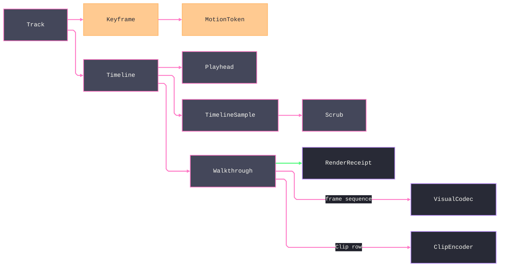

# [APPUI_RENDER_ANIMATION]

The animation rail is the Render plane's temporal engine: `Track` is the closed keyframe-track union over parameters, cameras, visibility, transient-field indices, colors, and per-element rigid transforms, `Keyframe` carries a value and a motion-token easing, `Timeline` composes tracks under a deterministic playhead clock, and `Walkthrough` renders the timeline to an offline frame sequence through the offscreen encode rail with the capture FFmpeg rows composing the flythrough clip. The page owns the track and keyframe vocabulary, the track-owned interpolation policy rows (`TrackInterp` is the ONE pose-interpolation owner AppUi-wide, its camera Pose and element Rigid rows one slerp discipline), the timeline composition and deterministic-playback sampler, the 4D schedule projection, the kinematic and transient-field scrub, and the offline walkthrough export; the substrate is the motion-token easing vocabulary, the `Viewpoint` camera for camera tracks, the `SimField` frame index for transient scrub, the visuals encode rail for walkthrough frames, and the AppHost clock for the deterministic playhead. Playback is frame-indexed under the deterministic motion clock so a scrub and an offline render reproduce the same state; `Collab/tour.md` projects its stops onto camera `Track` keyframes and rides THIS engine — the tour sampler and walkthrough clones are deleted.

## [01]-[INDEX]

- [02]-[TRACK_MODEL]: Keyframe-track union; keyframe value plus motion-token easing; interpolation policy rows.
- [03]-[TIMELINE]: Track composition; deterministic playhead with real ping-pong; sample-at-time fold.
- [04]-[SCRUB]: Kinematic playback; transient-field scrubbing by frame index; scheduler marshal.
- [05]-[WALKTHROUGH]: Offline frame-sequence render; the capture FFmpeg flythrough composition.

## [02]-[TRACK_MODEL]

- Owner: `Keyframe<T>` the timed value with its easing; `Track` `[Union]` the track-kind family; `Easing` the motion-token interpolation projection; `TrackInterp` — the track-owned interpolation policy rows; `AnimationFault` — the typed rail on the `AppUiFaultBand.Animation` registry row (6150).
- Cases: `Track` = Parameter | Camera | Visibility | FieldIndex | Color | Transform under the locked kind literals — a parameter track animates a typed scalar, a camera track the viewpoint camera, a visibility track an element-visibility step, a field-index track the transient simulation frame, a color track an OKLab-interpolated paint, a transform track a per-element `ElementPose` set so exploded axonometrics, assembly/disassembly sequences, and operable-element studies compose on the one timeline.
- Entry: `public static Fin<Track> OfParameter(string Key, Seq<Keyframe<double>> Frames)` and its five sibling smart constructors — each sorts the keyframes by time and rejects an empty track at construction into `AnimationFault.EmptyTrack`, so every constructed `Track` carries at least one keyframe in ascending time and the bracket sampler is total without a sample-time guard.
- Sample: `public static T Sample<T>(Keyframe<T> head, Seq<Keyframe<T>> rest, Duration t, Func<T, T, double, T> lerp)` — samples by finding the bracketing keyframes around the head-plus-rest decomposition and easing between them; the `lerp` is a TRACK-OWNED `TrackInterp` policy row selected by the track case inside `Timeline.SampleAt` — a caller-threaded interpolation delegate is the DELETED form.
- Auto: each keyframe carries its time, value, and a `MotionToken` whose spring or curve drives the interpolation between it and the next so the easing vocabulary is the one motion catalog — a keyframe never carries a raw cubic-bezier literal; camera tracks interpolate through `TrackInterp.Pose` and element transform tracks through `TrackInterp.Rigid` — `System.Numerics.Quaternion.Slerp` over the orientation with the eased positional arc, the stratum peer of the kernel `MotionInterpolation` one-slerp law: `TrackInterp` is the ONE pose-interpolation OWNER AppUi-wide, its Pose and Rigid rows two rows on one slerp discipline, and `Collab/tour.md`'s transition interpolation rides the Pose row — a component-wise eye/target/up lerp or a pose-interpolation site outside this owner is the deleted form; visibility tracks step a `VisibilityOverride` set at the keyframe; field-index tracks step the `SimField.FrameIndex`; color tracks interpolate through `TrackInterp` OKLab row — the `Theme/tokens.md` Unicolour OKLab mix composed ONCE at catalog construction, never a per-call delegate; the bracketing search is a binary search over the time-sorted keyframes so a sample is logarithmic in keyframe count.
- Packages: Thinktecture.Runtime.Extensions, LanguageExt.Core, NodaTime, System.Numerics (inbox)
- Growth: a new track kind is one `Track` case plus its one `Of*` smart constructor plus its one `TrackInterp` policy row; a new easing is one `MotionToken` row consumed here; a new fault is one `detail` ordinal on the 6150 row; zero new surface.
- Boundary: the easing is the motion-token vocabulary so a hand-rolled tween curve is the deleted form — every keyframe traces its easing to a `MotionToken` row exactly as every visual constant traces to a token; camera tracks ride the `ViewCamera` shape so the animation camera and the viewport camera and the drafting projection share one camera vocabulary; field-index tracks step the `SimField.FrameIndex` so a transient field scrub rides the simulation owner and the animation page re-computes no field; the `Track.Of*` smart constructors sort by time and reject an empty track into `Fin`, so the non-empty ascending-time invariant holds at construction and the `Sample` projection is total — an unsorted or empty track is rejected at the rail edge, never guarded inside the pure sampler, so no `throw` and no unconstrained `default!` ever enters the value projection; the `Of*` rail is the ONE track ingress — every consumer (`CaptureClip.OnTimeline`, the tour projection, the timeline authoring verbs) mints through it, and a direct case construction that skips the sorted admission is the deleted form the binary-search bracket makes incorrect by construction; interpolation is track-OWNED policy per `[GENERATOR_LAW]` — the Camera and Transform rows the one slerp owner, the Color row the tokens OKLab mix, and the caller-threaded `lerpD`/`lerpCam`/`lerpColor` delegate tail is the deleted form at every former call site (`SampleAt`, `Scrub.To`, `Walkthrough.Render`, the tour).

```csharp signature
[Union(ConversionFromValue = ConversionOperatorsGeneration.None)]
public abstract partial record AnimationFault : Expected {
    private AnimationFault(string detail, int code) : base(detail, code) { }
    public sealed record EmptyTrack(string Key)
        : AnimationFault($"animation/empty-track: {Key}", AppUiFaultBand.Animation.Code(0));
    public sealed record FrameRenderFailed(long FrameIndex, string Detail)
        : AnimationFault($"animation/frame: {FrameIndex} — {Detail}", AppUiFaultBand.Animation.Code(1));
    public sealed record ClipEncodeFailed(string Detail)
        : AnimationFault($"animation/clip: {Detail}", AppUiFaultBand.Animation.Code(2));
    public sealed record RateOutOfDomain(double Fps)
        : AnimationFault($"animation/frame-rate: {Fps}", AppUiFaultBand.Animation.Code(3));
}

public readonly record struct Keyframe<T>(Duration At, T Value, MotionToken Easing) : IComparable<Keyframe<T>> {
    public int CompareTo(Keyframe<T> other) => At.CompareTo(other.At);
}

public static class Easing {
    public static double Eased(MotionToken token, double t) =>
        token.Spring is { IsSome: true, Case: SpringValue spring }
            ? Damped(spring, Math.Clamp(t, 0d, 1d))
            : token.Curve(Math.Clamp(t, 0d, 1d));

    private static double Damped(SpringValue spring, double t) =>
        1d - (Math.Exp(-spring.Damping * t) * Math.Cos(spring.Stiffness * t));
}

// One per-element rigid pose: translation, orientation quaternion, uniform scale — the keyframe payload of
// the Transform track, so exploded axonometrics, assembly sequences, and operable-element studies are
// timeline compositions over the existing sampler, scrub, and walkthrough rails.
public readonly record struct ElementPose(
    string ElementId,
    double X, double Y, double Z,
    double Qx, double Qy, double Qz, double Qw,
    double Scale);

// Track-owned interpolation policy rows. TrackInterp is the ONE pose-interpolation OWNER AppUi-wide: the
// camera Pose row and the element Rigid row are its two rows over one slerp discipline, written against
// the scalar ViewCamera wire shape the pipeline owns; OkMix binds ONCE at composition to the Theme/tokens
// Unicolour OKLab mix delegate.
public sealed record TrackInterp(Func<Color, Color, double, Color> OkMix) {
    public static double Scalar(double a, double b, double t) => a + ((b - a) * t);

    // Stepped HOLD: the sample equals the preceding keyframe value until the next boundary — a rounded
    // intermediate index would select simulation states no field-index keyframe declared.
    public static int Stepped(int a, int b, double t) => t >= 1d ? b : a;

    // The element twin of the camera Pose row — the SAME slerp discipline, joined per element id; an
    // element absent from the far keyframe holds its present pose, so a partial keyframe steps at the set
    // boundary instead of teleporting to identity.
    public static Seq<ElementPose> Rigid(Seq<ElementPose> a, Seq<ElementPose> b, double t) =>
        a.Map(from => b.Find(to => to.ElementId == from.ElementId).Match(
                Some: to => Blend(from, to, t),
                None: () => from))
            .Concat(b.Filter(to => t >= 1d && !a.Exists(from => from.ElementId == to.ElementId)));

    private static ElementPose Blend(ElementPose a, ElementPose b, double t) {
        Vector3 move = Vector3.Lerp(new((float)a.X, (float)a.Y, (float)a.Z), new((float)b.X, (float)b.Y, (float)b.Z), (float)t);
        Quaternion spin = Quaternion.Slerp(
            new((float)a.Qx, (float)a.Qy, (float)a.Qz, (float)a.Qw),
            new((float)b.Qx, (float)b.Qy, (float)b.Qz, (float)b.Qw), (float)t);
        return a with {
            X = move.X, Y = move.Y, Z = move.Z,
            Qx = spin.X, Qy = spin.Y, Qz = spin.Z, Qw = spin.W,
            Scale = Scalar(a.Scale, b.Scale, t),
        };
    }

    // Lens interpolation is case-preserving: matching projections blend their one live scalar, while a
    // projection-kind cut steps at the keyframe boundary and never manufactures an irrelevant lens value.
    public static ViewCamera Pose(ViewCamera a, ViewCamera b, double t) =>
        a.Switch(
            state: (To: b, T: t),
            perspective: static (state, from) => state.To.Switch(
                state: (From: from, T: state.T),
                perspective: static (pair, to) => new ViewCamera.Perspective(
                    BlendFrame(pair.From.Frame, to.Frame, pair.T), Scalar(pair.From.FieldOfViewDeg, to.FieldOfViewDeg, pair.T)),
                orthographic: static (pair, to) => pair.T < 1d ? (ViewCamera)pair.From : to),
            orthographic: static (state, from) => state.To.Switch(
                state: (From: from, T: state.T),
                perspective: static (pair, to) => pair.T < 1d ? (ViewCamera)pair.From : to,
                orthographic: static (pair, to) => new ViewCamera.Orthographic(
                    BlendFrame(pair.From.Frame, to.Frame, pair.T), Scalar(pair.From.ViewHeight, to.ViewHeight, pair.T))));

    private static CameraFrame BlendFrame(CameraFrame a, CameraFrame b, double t) =>
        new(
            Vector3.Lerp(a.Eye, b.Eye, (float)t),
            Vector3.Lerp(a.Target, b.Target, (float)t),
            Vector3.Transform(Vector3.UnitY, Quaternion.Slerp(OrientOf(a), OrientOf(b), (float)t)));

    private static Quaternion OrientOf(CameraFrame frame) {
        Vector3 forward = Vector3.Normalize(frame.Target - frame.Eye);
        Vector3 right = Vector3.Normalize(Vector3.Cross(forward, frame.Up));
        Vector3 up = Vector3.Cross(right, forward);
        return Quaternion.CreateFromRotationMatrix(new Matrix4x4(
            right.X, right.Y, right.Z, 0f,
            up.X, up.Y, up.Z, 0f,
            -forward.X, -forward.Y, -forward.Z, 0f,
            0f, 0f, 0f, 1f));
    }
}

[Union(ConversionFromValue = ConversionOperatorsGeneration.None)]
public abstract partial record Track(string Key) {
    public sealed record Parameter(string Key, Seq<Keyframe<double>> Frames) : Track(Key);
    public sealed record Camera(string Key, Seq<Keyframe<ViewCamera>> Frames) : Track(Key);
    public sealed record Visibility(string Key, Seq<Keyframe<Seq<VisibilityOverride>>> Frames) : Track(Key);
    public sealed record FieldIndex(string Key, Seq<Keyframe<int>> Frames) : Track(Key);
    public sealed record Color(string Key, Seq<Keyframe<Avalonia.Media.Color>> Frames) : Track(Key);
    public sealed record Transform(string Key, Seq<Keyframe<Seq<ElementPose>>> Frames) : Track(Key);

    public static Fin<Track> OfParameter(string Key, Seq<Keyframe<double>> Frames) =>
        Sorted(Key, Frames).Map(sorted => (Track)new Parameter(Key, sorted));
    public static Fin<Track> OfCamera(string Key, Seq<Keyframe<ViewCamera>> Frames) =>
        Sorted(Key, Frames).Map(sorted => (Track)new Camera(Key, sorted));
    public static Fin<Track> OfVisibility(string Key, Seq<Keyframe<Seq<VisibilityOverride>>> Frames) =>
        Sorted(Key, Frames).Map(sorted => (Track)new Visibility(Key, sorted));
    public static Fin<Track> OfFieldIndex(string Key, Seq<Keyframe<int>> Frames) =>
        Sorted(Key, Frames).Map(sorted => (Track)new FieldIndex(Key, sorted));
    public static Fin<Track> OfColor(string Key, Seq<Keyframe<Avalonia.Media.Color>> Frames) =>
        Sorted(Key, Frames).Map(sorted => (Track)new Color(Key, sorted));
    public static Fin<Track> OfTransform(string Key, Seq<Keyframe<Seq<ElementPose>>> Frames) =>
        Sorted(Key, Frames).Map(sorted => (Track)new Transform(Key, sorted));

    private static Fin<Seq<Keyframe<T>>> Sorted<T>(string key, Seq<Keyframe<T>> frames) =>
        frames.IsEmpty
            ? Fin<Seq<Keyframe<T>>>.Fail(new AnimationFault.EmptyTrack(key))
            : FinSucc(frames.OrderBy(static frame => frame.At).ToSeq());

    public Duration Duration => Switch(
        parameter: static p => p.Frames.Last.At, camera: static c => c.Frames.Last.At,
        visibility: static v => v.Frames.Last.At, fieldIndex: static f => f.Frames.Last.At,
        color: static c => c.Frames.Last.At, transform: static t => t.Frames.Last.At);

    public static T Sample<T>(Keyframe<T> head, Seq<Keyframe<T>> rest, Duration t, Func<T, T, double, T> lerp) =>
        Bracket(head, rest, t) switch {
            (var lo, var hi) when lo.At == hi.At => lo.Value,
            var bracket => lerp(bracket.Lo.Value, bracket.Hi.Value,
                Easing.Eased(bracket.Hi.Easing, (t - bracket.Lo.At).TotalNanoseconds / (double)(bracket.Hi.At - bracket.Lo.At).TotalNanoseconds)),
        };

    // Binary search over the Of*-sorted frames — O(log n) per sample; the invariant frames[lo].At <= t <
    // frames[hi].At narrows one probe per step. The while loop is the named kernel exemption.
    private static (Keyframe<T> Lo, Keyframe<T> Hi) Bracket<T>(Keyframe<T> head, Seq<Keyframe<T>> rest, Duration t) {
        if (rest.IsEmpty || t <= head.At) { return (head, head); }
        Seq<Keyframe<T>> frames = head.Cons(rest);
        if (t >= frames[frames.Count - 1].At) { return (frames[frames.Count - 1], frames[frames.Count - 1]); }
        (int lo, int hi) = (0, frames.Count - 1);
        while (hi - lo > 1) {
            int mid = lo + ((hi - lo) >> 1);
            if (frames[mid].At <= t) { lo = mid; } else { hi = mid; }
        }
        return (frames[lo], frames[hi]);
    }
}
```

## [03]-[TIMELINE]

- Owner: `Playhead` the deterministic playback clock carrying its direction state; `Timeline` the track composition; `TimelineSample` the sampled state at the playhead; `SchedulePhase`/`SchedulePlayback` the 4D construction-sequence projection onto the one timeline.
- Entry: `public TimelineSample SampleAt(Duration t, TrackInterp interp)` — samples every track at the playhead into one composed state through the track-owned policy rows; the playhead advances by frame under the deterministic clock.
- Auto: `Advance` steps the playhead by exactly one frame INDEX — the integer index is the clock state and wall time derives from it through the one `TimeOf` rounding, so a non-integral rate (29.97, 23.976) never accumulates truncation drift, the tail frame is a real renderable frame, and a scrub to frame N and a render of frame N produce the same state; the timeline duration is the max track duration so the playhead clamps at the end; loop and ping-pong are playhead policy values so a looping animation is a clock policy, never a per-track flag — the ping-pong mode carries a `Direction` field that FLIPS at each boundary and advances back through the frames, so ping-pong genuinely reverses and is never behaviorally `Once`; the sample composes the parameter, camera, visibility, field-index, color, and transform tracks into one `TimelineSample` the viewport, the inspector, and the simulation render consume.
- Packages: Thinktecture.Runtime.Extensions, LanguageExt.Core, NodaTime
- Growth: a new playback mode is one `PlaybackMode` value; a new composed-state field is one `TimelineSample` member; a new schedule-phase channel is one `SchedulePhase` column; zero new surface.
- Boundary: the playhead is frame-indexed under the deterministic motion clock so a wall-clock animation is the rejected form — a scrub and an offline render hit identical frames, the determinism the walkthrough export depends on; the frame rate is a timeline row value so a per-render frame-rate literal is the deleted form; loop and ping-pong are playhead policy so a per-track loop flag is the deleted form; the 4D construction-sequence playback is `SchedulePlayback.FromSchedule` — the Bim `ConstructionState.At`/`TaskKind` fold arrives as classed `SchedulePhase` values and projects onto ONE stepped visibility track, so a Navisworks-class sequence scrub rides this timeline and a second 4D timeline or an AppUi-side schedule fold is the deleted form; the composed sample binds the camera onto the viewport camera, the field index onto the simulation render, the visibility onto the viewpoint overrides, and the parameters onto the inspector bindings so the timeline drives existing owners and a timeline-local renderer is the deleted form.

```csharp signature
[SmartEnum<string>]
public sealed partial class PlaybackMode {
    public static readonly PlaybackMode Once = new("once");
    public static readonly PlaybackMode Loop = new("loop");
    public static readonly PlaybackMode PingPong = new("ping-pong");
}

// Frame-INDEXED clock: the integer index IS the state and wall time DERIVES from it in one rounding,
// so a non-integral rate (29.97, 23.976) never accumulates truncation drift and the tail frame renders.
public sealed record Playhead(long Index, double Fps, PlaybackMode Mode, Duration Total, int Direction = 1) {
    public static Playhead At(double fps, Duration total, PlaybackMode mode) => new(0L, fps, mode, total);

    public Duration Position => TimeOf(Index);

    // The ONE index-to-time derivation every scrub and offline render shares; the tail clamps to Total
    // so the last frame samples in-range.
    public Duration TimeOf(long frame) =>
        Duration.FromNanoseconds(Math.Min((long)Math.Round(frame * 1e9 / Fps), (long)Total.TotalNanoseconds));

    public long FrameIndex => Index;

    // Inclusive tail: the frame at the timeline end is a real renderable frame.
    public long FrameCount => (long)Math.Floor(Total.TotalNanoseconds * Fps / 1e9) + 1L;

    public Playhead Advance() =>
        (Index + Direction) switch {
            var next when next >= 0L && next < FrameCount => this with { Index = next },
            var overrun => Mode.Switch(
                state: (Self: this, Overrun: overrun),
                once: static (s, _) => s.Self with { Index = s.Self.FrameCount - 1L },
                loop: static (s, _) => s.Self with { Index = 0L },
                // Ping-pong flips direction at the boundary and reflects one step back inside the range.
                pingPong: static (s, _) => s.Self with {
                    Direction = -s.Self.Direction,
                    Index = s.Overrun >= s.Self.FrameCount ? Math.Max(s.Self.FrameCount - 2L, 0L) : Math.Min(1L, s.Self.FrameCount - 1L),
                }),
        };
}

public sealed record TimelineSample(
    HashMap<string, double> Parameters,
    Option<ViewCamera> Camera,
    Seq<VisibilityOverride> Visibility,
    Option<int> FieldIndex,
    HashMap<string, Color> Colors,
    Seq<ElementPose> Transforms);

public sealed record Timeline(string Key, Seq<Track> Tracks, double FrameRate, PlaybackMode Mode) {
    // The ONE timeline ingress: a non-finite or non-positive frame rate rejects at the rail edge, so
    // every Playhead division and frame count derives from a valid policy value.
    public static Fin<Timeline> Of(string key, Seq<Track> tracks, double frameRate, PlaybackMode mode) =>
        double.IsFinite(frameRate) && frameRate > 0d
            ? Fin.Succ(new Timeline(key, tracks, frameRate, mode))
            : Fin.Fail<Timeline>(new AnimationFault.RateOutOfDomain(frameRate));

    public Duration Total => Tracks.IsEmpty ? Duration.Zero : Tracks.Map(static track => track.Duration).Max();

    public Playhead Playhead() => Animation.Playhead.At(FrameRate, Total, Mode);

    public TimelineSample SampleAt(Duration t, TrackInterp interp) =>
        Tracks.Fold(
            new TimelineSample(HashMap<string, double>(), None, Seq<VisibilityOverride>(), None, HashMap<string, Color>(), Seq<ElementPose>()),
            (sample, track) => track.Switch(
                state: (Sample: sample, T: t, Interp: interp),
                parameter: static (ctx, p) => ctx.Sample with { Parameters = ctx.Sample.Parameters.AddOrUpdate(p.Key, Track.Sample(p.Frames.Head, p.Frames.Tail, ctx.T, TrackInterp.Scalar)) },
                camera: static (ctx, c) => ctx.Sample with { Camera = Some(Track.Sample(c.Frames.Head, c.Frames.Tail, ctx.T, TrackInterp.Pose)) },
                visibility: static (ctx, v) => ctx.Sample with { Visibility = Track.Sample(v.Frames.Head, v.Frames.Tail, ctx.T, static (a, _, _) => a) },
                fieldIndex: static (ctx, f) => ctx.Sample with { FieldIndex = Some(Track.Sample(f.Frames.Head, f.Frames.Tail, ctx.T, TrackInterp.Stepped)) },
                color: static (ctx, c) => ctx.Sample with { Colors = ctx.Sample.Colors.AddOrUpdate(c.Key, Track.Sample(c.Frames.Head, c.Frames.Tail, ctx.T, ctx.Interp.OkMix)) },
                transform: static (ctx, x) => ctx.Sample with { Transforms = ctx.Sample.Transforms + Track.Sample(x.Frames.Head, x.Frames.Tail, ctx.T, TrackInterp.Rigid) }));
}

// The 4D projection twin of the tour: Bim resolves ConstructionState.At per sampled instant into
// TaskKind-classed VisibilityOverride phases (values — a CONSTRUCTION task's elements arrive tinted, a
// DEMOLITION task's depart ghosted; AppUi runs no schedule fold), and FromSchedule projects the phase
// sequence onto ONE stepped visibility track, so a construction-sequence scrub, a camera fly-through, and
// a transient field share the one playhead, sampler, and walkthrough rail.
public readonly record struct SchedulePhase(Instant At, Seq<VisibilityOverride> State);

public static class SchedulePlayback {
    public static Fin<Timeline> FromSchedule(string key, Seq<SchedulePhase> phases, double fps, PlaybackMode mode) =>
        phases.HeadOrNone().Match(
            None: () => Fin.Fail<Timeline>(new AnimationFault.EmptyTrack(key)),
            Some: head => Track.OfVisibility(
                    $"{key}/state",
                    phases.Map(phase => new Keyframe<Seq<VisibilityOverride>>(phase.At - head.At, phase.State, MotionToken.Standard)))
                .Bind(state => Timeline.Of(key, Seq(state), fps, mode)));
}
```

## [04]-[SCRUB]

- Owner: `ScrubState` the interactive playhead binding; `Scrub` the kinematic and transient-field scrub fold.
- Entry: `public static IO<TimelineSample> To(Timeline timeline, long frame, SurfaceScheduler scheduler, TrackInterp interp)` — scrubs the playhead to an exact frame and MARSHALS the composed sample onto the UI thread through the scheduler boundary; the field-index track drives the transient simulation frame.
- Auto: scrubbing to a frame samples the timeline at that frame's exact time so a scrub is deterministic and re-entrant — dragging the playhead back and forth never accumulates drift because the playhead is frame-indexed, not delta-integrated; the kinematic playback advances one frame per tick under the deterministic motion clock so a play is a repeated `Advance` and a pause holds the frame; the transient-field scrub reads the `FieldIndex` track so dragging the playhead steps the simulation frame the simulation render binds — a transient field and a camera fly-through scrub on the same playhead.
- Packages: LanguageExt.Core, System.Reactive, NodaTime
- Growth: a new scrub binding is one `ScrubState` field; zero new surface.
- Boundary: the scrub is frame-indexed so it is deterministic and re-entrant — a delta-integrated scrub that drifts is the deleted form; playback advances under the deterministic motion clock through the scheduler boundary so the one `ObserveOn` law holds and a scrub-local timer is the rejected form; the field-index scrub drives the simulation render frame so the transient field and the kinematic camera share one playhead and a second timeline for the field is the deleted form; the composed sample marshals through the surface scheduler — the scheduler parameter is LOAD-BEARING (the sample computes off-thread and emits on the UI thread through `Marshal`), never decorative.

```csharp signature
public sealed record ScrubState(Playhead Head, bool Playing) {
    public ScrubState Play() => this with { Playing = true };
    public ScrubState Pause() => this with { Playing = false };
    public ScrubState Tick() => Playing ? this with { Head = Head.Advance() } : this;
    public ScrubState Seek(long frame) => this with { Head = Head with { Index = Math.Clamp(frame, 0L, Head.FrameCount - 1L), Direction = 1 } };
}

public static class Scrub {
    public static IO<TimelineSample> To(Timeline timeline, long frame, SurfaceScheduler scheduler, TrackInterp interp) =>
        IO.lift(() => timeline.SampleAt(timeline.Playhead().TimeOf(frame), interp))
            .Bind(sample => scheduler.Marshal(() => sample));

    public static IObservable<ScrubState> Kinematic(ScrubState seed, IObservable<long> ticks) =>
        ticks.Scan(seed, static (state, _) => state.Tick());
}
```

## [05]-[WALKTHROUGH]

- Owner: `WalkthroughSpec` the offline-render specification; `Walkthrough` the frame-sequence render fold — the ONE walkthrough engine the tour projection rides.
- Entry: `public static IO<RenderReceipt> Render(VisualRuntime runtime, Timeline timeline, WalkthroughSpec spec, TrackInterp interp, Func<TimelineSample, SKImageInfo, Fin<SKImage>> frame)` — renders every frame of the timeline to the encode rail and seals one receipt for the sequence; the frame count is the timeline duration over the frame rate.
- Auto: the walkthrough steps the playhead frame by frame from zero to the timeline duration, samples the composed state at each frame through the track-owned policy rows, renders the frame to an `SKImage` through the supplied frame delegate (which binds the viewport or the chart render), and encodes each frame through the visuals codec under the spec's DECLARED `EncodeRow` — the row selects codec, quality, color policy, artifact-key suffix, and the receipt color-space, so the encode input is never behaviorally inert so an offline walkthrough is a deterministic frame sequence; every frame is content-hashed through the runtime `ContentHash` delegate (the kernel `ContentHash.Of` binding) so a walkthrough is reproducible and a regression is attributable to a frame index; the FLYTHROUGH CLIP composes the capture `ClipEncoder.Mux` FFmpeg rows PAST the frame-sequence terminal — animation keeps the frame sequence, the encode is capture's row (`Render/capture.md#VIDEO_ENCODE`), and the resulting MP4 delivers through the export destination union.
- Receipt: one `RenderReceipt` of kind walkthrough per sequence carrying the frame count and the total bytes; one kind-clip receipt per muxed flythrough; sealed through the visuals encode sink.
- Packages: SkiaSharp, LanguageExt.Core, NodaTime, Rasm.AppHost (project)
- Growth: a new walkthrough output is one `WalkthroughSpec` value; zero new surface.
- Boundary: the walkthrough is deterministic frame-indexed playback so an offline render reproduces the interactive scrub exactly — a wall-clock-paced offline render is the rejected form; each frame renders through the supplied frame delegate so the walkthrough composes the viewport, chart, or simulation render and mints no second renderer; each frame encodes through the visuals codec so the walkthrough mints no second encode owner and the per-frame content hash makes a regression frame-attributable; the offline frame sequence delivers through the export `VisualDestination` union so the walkthrough mints no second destination owner; video muxing is capture's `ClipEncoder` row — a walkthrough-local video pipeline is the deleted form; `Collab/tour.md` collapses onto THIS fold (stops -> camera `Track` keyframes; its former `WalkthroughTour.Render` clone is deleted).

```csharp signature
// The encode policy IS the row — the spec carries the VisualCodec EncodeRow it renders with, so the frame
// artifact key, the codec, and the receipt color-space all follow one declared value and a spec input that
// cannot change the output is unrepresentable.
public sealed record WalkthroughSpec(string Key, int Width, int Height, VisualCodec.EncodeRow Encode, VisualDestination Destination, Option<VideoEncodeRow> Clip);

public static class Walkthrough {
    public const string Kind = "walkthrough";

    // Frames are RETAINED only when a clip mux consumes them and disposed frame-by-frame otherwise, so a
    // long frame-only walkthrough runs at one-frame memory; the mux arm disposes its retained set after
    // the clip lands. Encode borrows each frame per the capture reproject ownership law.
    public static IO<RenderReceipt> Render(
        VisualRuntime runtime,
        Timeline timeline,
        WalkthroughSpec spec,
        TrackInterp interp,
        Func<TimelineSample, SKImageInfo, Fin<SKImage>> frame) =>
        from mark in IO.lift(runtime.Clocks.Mark)
        from totals in Range(0L, timeline.Playhead().FrameCount)
            .Fold(IO.pure((Frames: Seq<SKImage>(), Hashes: Seq<string>(), Bytes: 0L)), (rail, index) => rail.Bind(state =>
                from sample in IO.pure(timeline.SampleAt(timeline.Playhead().TimeOf(index), interp))
                from image in IO.lift(() => frame(sample, new SKImageInfo(spec.Width, spec.Height)).ThrowIfFail())
                from receipt in VisualCodec.Encode(runtime, image, spec.Encode, Kind,
                    $"walkthroughs/{spec.Key}/{index.ToString("D6", System.Globalization.CultureInfo.InvariantCulture)}.{spec.Encode.Key}")
                select (
                    spec.Clip.IsSome ? state.Frames.Add(image) : Released(state.Frames, image),
                    state.Hashes.Add(receipt.FrameHash),
                    state.Bytes + receipt.Bytes)))
        from receipt in spec.Clip.Match(
            Some: row => ClipEncoder.Mux(runtime, row, totals.Frames, spec.Destination)
                .Map(clip => (totals.Frames.Iter(static held => held.Dispose()), clip).Item2),
            None: () =>
                from elapsed in IO.lift(() => runtime.Clocks.Elapsed(mark))
                let sequenceHash = runtime.ContentHash(Encoding.UTF8.GetBytes(string.Join("|", totals.Hashes)))
                let sequence = new RenderReceipt(
                    Kind, "frame-sequence", sequenceHash, totals.Bytes, elapsed, runtime.Correlation, None, spec.Encode.Color.Key)
                from _ in runtime.Sink(sequence)
                select sequence)
        select receipt;

    private static Seq<SKImage> Released(Seq<SKImage> held, SKImage frame) {
        frame.Dispose();
        return held;
    }
}
```


