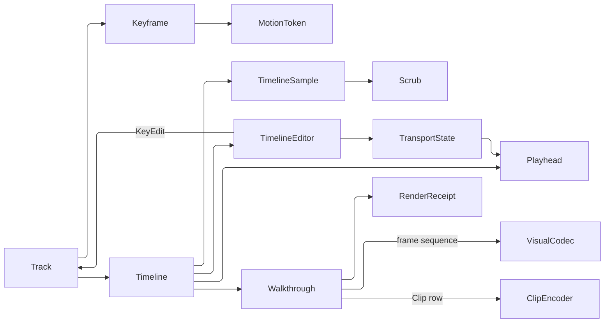

# [APPUI_RENDER_ANIMATION]

Animation is the Render plane's temporal engine: `Track` is the closed keyframe-track union over parameters, cameras, visibility, transient-field indices, colors, per-element rigid transforms, and media cues, `Keyframe` carries a value and a motion-token easing, `Timeline` composes tracks under a deterministic playhead clock, and `Walkthrough` renders the timeline to an offline frame sequence through the offscreen encode rail with the capture FFmpeg rows composing the flythrough clip. `TimelineEditor` folds lane, keyframe, range, and transport edits back onto that union through its own admission gate. This page owns the track and keyframe vocabulary, the track-owned interpolation policy rows (`TrackInterp` is the ONE pose-interpolation owner AppUi-wide, its camera Pose and element Rigid rows one slerp discipline), the timeline composition and deterministic-playback sampler, the 4D schedule projection, the kinematic and transient-field scrub, the keyframe editor with the one transport grammar every playback surface reads, and the offline walkthrough export; the substrate is the motion-token easing vocabulary, the `Viewpoint` camera for camera tracks, the `SimField` frame index for transient scrub, the visuals encode rail for walkthrough frames, and the AppHost clock for the deterministic playhead. Playback is frame-indexed under the deterministic motion clock so a scrub and an offline render reproduce the same state; `Collab/tour.md` projects its stops onto camera `Track` keyframes and rides THIS engine — the tour sampler and walkthrough clones are deleted.

## [01]-[INDEX]

- [02]-[TRACK_MODEL]: Keyframe-track union; keyframe value with motion-token easing; interpolation policy rows.
- [03]-[TIMELINE]: Track composition; deterministic playhead with real ping-pong; sample-at-time fold.
- [04]-[SCRUB]: Kinematic playback; transient-field scrubbing by frame index; scheduler marshal.
- [05]-[WALKTHROUGH]: Offline frame-sequence render; the capture FFmpeg flythrough composition.
- [06]-[TIMELINE_EDITOR]: Per-track lanes with mute and solo, keyframe manipulation with snapping, the range bar, the one transport grammar.

## [02]-[TRACK_MODEL]

- Owner: `Keyframe<T>` the timed value with its easing; `Keyframes<T>` the non-empty sorted frame carrier every track case holds; `Track` `[Union]` the track-kind family; `Easing` the motion-token interpolation projection; `TrackInterp` — the track-owned interpolation policy rows; `AnimationFault` — the typed rail on the `AppUiFaultBand.Animation` registry row (6150).
- Cases: `Track` = Parameter | Camera | Visibility | FieldIndex | Color | Transform | Media under the locked kind literals — a parameter track animates a typed scalar, a camera track the viewpoint camera, a visibility track an element-visibility step, a field-index track the transient simulation frame, a color track an OKLab-interpolated paint, a transform track a per-element `ElementPose` set so exploded axonometrics, assembly/disassembly sequences, and operable-element studies compose on the one timeline, and a media track a `MediaCue` run mapping timeline instants onto source instants so recorded footage scrubs against the sequence it was shot for.
- Law: `public static T Sample<T>(Keyframes<T> frames, Duration t, Func<T, T, double, T> lerp)` — the sampler takes the non-empty CARRIER, so the invariant is discharged by the type rather than re-taken at the edge and the head-plus-rest decomposition stays private to the bracket search; the `lerp` is a TRACK-OWNED `TrackInterp` policy row selected by the track case inside `Timeline.SampleAt` — a caller-threaded interpolation delegate is the DELETED form.
- Law: `TrackInterp` is the AppUi stratum PEER of the kernel one-slerp law, not a copy of it, and the two owners partition by CARRIER and host RUNTIME, never by linkage. `TrackInterp.Pose`/`Rigid` slerp `System.Numerics.Quaternion` over the AppUi `ViewCamera` union and `ElementPose` on the per-keyframe hot path — scalar wire shapes the viewport, the drafting projection, and the walkthrough encode already carry — so a sample costs one quaternion blend and no marshal. `[NOT]` kernel `MotionInterpolation.Interpolate`/`Rotate`, the branch's public rotor-interpolation law, whose signatures speak `Plane`, `Direction`, and `Rhino.Geometry.Quaternion` under the `Context`/`Op` admission rail: those types are spellable here — everything above `Rasm` links RhinoCommon, and host-neutral names the absent host flag in a package's own manifest, never freedom from the kernel bundle — but the split is the CARRIER boundary, so no track carries one: routing a camera keyframe through the kernel owner marshals `ViewCamera` to `Plane` and back on every sample of every frame of every walkthrough while seating a host geometry type the standalone shell must interpolate with no Rhino host loaded. Kernel poses interpolate on the kernel owner and AppUi camera and element poses on this one; a THIRD pose-interpolation site in either stratum is the deleted form on both, and a host-neutral rotor surface on the kernel owner retires the `Pose`/`Rigid` rows onto it.
- Entry: `public static Fin<Track> OfParameter(string Key, Seq<Keyframe<double>> Frames)` and its six sibling smart constructors — each sorts the keyframes by time, refuses an empty run into `AnimationFault.EmptyTrack`, and splits the sorted result into the `Keyframes<T>` lead-plus-rest carrier, so every constructed `Track` carries at least one keyframe in ascending time BY SHAPE and the bracket sampler is total with no guard and no absent-head arm to spell.
- Auto: each keyframe carries its time, value, and a `MotionToken` whose spring or curve drives the interpolation between it and the next so the easing vocabulary is the one motion catalog — a keyframe never carries a raw cubic-bezier literal; camera tracks interpolate through `TrackInterp.Pose` and element transform tracks through `TrackInterp.Rigid` — `System.Numerics.Quaternion.Slerp` over the orientation with the eased positional arc, the stratum peer of the kernel `MotionInterpolation` one-slerp law: `TrackInterp` is the ONE pose-interpolation OWNER AppUi-wide, its Pose and Rigid rows two rows on one slerp discipline, and `Collab/tour.md`'s transition interpolation rides the Pose row — a component-wise eye/target/up lerp or a pose-interpolation site outside this owner is the deleted form; visibility tracks step a `VisibilityOverride` set at the keyframe; field-index tracks step the `SimField.FrameIndex`; color tracks interpolate through `TrackInterp` OKLab row — the `Theme/tokens.md` Unicolour OKLab mix composed ONCE at catalog construction, never a per-call delegate; the bracketing search is a binary search over the time-sorted keyframes so a sample is logarithmic in keyframe count.
- Packages: Rasm (project — `SpringState`/`SpringShape` the spring re-entry state, `Op` the rail key), Thinktecture.Runtime.Extensions, LanguageExt.Core, NodaTime, System.Numerics (inbox)
- Growth: a new track kind is one `Track` case with its one `Of*` smart constructor, its one `TrackInterp` policy row, and its arms on the `Instants`/`Easings`/`Rebuilt` projections the editor reads; a new easing is one `MotionToken` row consumed here; a new fault is one `detail` ordinal on the 6150 row; zero new surface.
- Boundary: the easing is the motion-token vocabulary so a hand-rolled tween curve is the deleted form — every keyframe traces its easing to a `MotionToken` row exactly as every visual constant traces to a token; camera tracks ride the `ViewCamera` shape so the animation camera and the viewport camera and the drafting projection share one camera vocabulary; field-index tracks step the `SimField.FrameIndex` so a transient field scrub rides the simulation owner and the animation page re-computes no field; the `Track.Of*` smart constructors sort by time and split the sorted run into the non-empty `Keyframes<T>` carrier, so the ascending-time invariant holds at construction and non-emptiness holds by SHAPE — the sampler takes a lead and a rest that exist, so its projection is total with no absent-head arm to guard and no `throw` or unconstrained `default!` spelled inside it, reachable or otherwise; the `Of*` rail is the ONE track ingress — every consumer (`CaptureClip.OnTimeline`, the tour projection, the timeline authoring verbs) mints through it, and a direct case construction that skips the sorted admission is the deleted form the binary-search bracket makes incorrect by construction; interpolation is track-OWNED policy per `[GENERATOR_LAW]` — the Camera and Transform rows the one slerp owner, the Color row the tokens OKLab mix, and the caller-threaded `lerpD`/`lerpCam`/`lerpColor` delegate tail is the deleted form at every former call site (`SampleAt`, `Scrub.To`, `Walkthrough.Render`, the tour).

```csharp signature
[Union(ConversionFromValue = ConversionOperatorsGeneration.None)]
public abstract partial record AnimationFault : Expected {
    private AnimationFault(string detail, int code) : base(detail, code) { }
    public sealed record EmptyTrack(string Key)
        : AnimationFault($"animation/empty-track: {Key}", AppUiFaultBand.Animation.Code(0));
    public sealed record FrameRenderFailed(long FrameIndex, string Detail)
        : AnimationFault($"animation/frame: {FrameIndex} — {Detail}", AppUiFaultBand.Animation.Code(1));
    public sealed record ClipEncodeFailed(string Detail)
        : AnimationFault($"animation/clip: {Detail}", AppUiFaultBand.Animation.Code(2));
    public sealed record RateOutOfDomain(double Fps)
        : AnimationFault($"animation/frame-rate: {Fps}", AppUiFaultBand.Animation.Code(3));
    public sealed record RangeRejected(long In, long Out)
        : AnimationFault($"animation/range: [{In}, {Out}]", AppUiFaultBand.Animation.Code(4));
    public sealed record TrackMissing(string Key)
        : AnimationFault($"animation/track: {Key}", AppUiFaultBand.Animation.Code(5));
    public sealed record KeyMissing(string Key, long Index)
        : AnimationFault($"animation/keyframe: {Key}#{Index}", AppUiFaultBand.Animation.Code(6));
}

public readonly record struct Keyframe<T>(Duration At, T Value, MotionToken Easing) : IComparable<Keyframe<T>> {
    public int CompareTo(Keyframe<T> other) => At.CompareTo(other.At);
}

// Token-facing easing facade: the body is the token's own kernel read — the tween case evaluates the kernel
// easing row and the spring case the kernel three-regime closed form, both captured on the timing case at
// catalog construction — so this page owns interpolation-policy SELECTION, never curve math. The hand-rolled
// damped envelope (stiffness where damped frequency belongs, divergent past critical damping) is deleted.
public static class Easing {
    public static double Eased(MotionToken token, double t) => token.Curve(Math.Clamp(t, 0d, 1d));

    // Mid-flight retarget carrying LIVE velocity: an interrupted transition or a scrub reversal re-enters the
    // kernel spring at its current state instead of restarting from rest. `SpringValue.Shape` is the kernel
    // admission gate ON the rail (`Theme/motion.md`), so the two Fin legs join with `Bind` and the return type
    // stays one rail — unwrapping the shape to re-wrap the step would mint a second failure vocabulary for a
    // tuning pair the value-object constructor already refused.
    public static Fin<SpringState> Progress(SpringValue spring, SpringState live, double target, double elapsed, Op? key = null) =>
        spring.Shape.Bind(shape => shape.Evaluate(origin: live, target: target, elapsed: elapsed, key: key.OrDefault()));
}

// One per-element rigid pose: translation, orientation quaternion, uniform scale — the keyframe payload of the
// Transform track, so exploded axonometrics, assembly sequences, and operable-element studies are
// timeline compositions over the existing sampler, scrub, and walkthrough rails.
public readonly record struct ElementPose(
    string ElementId,
    double X, double Y, double Z,
    double Qx, double Qy, double Qz, double Qw,
    double Scale);

// The media cue: which media the track plays and WHERE IN ITS SOURCE the timeline instant maps to. Source
// time is a keyframed value rather than a derived offset, which is what subordinates video time to the
// animation clock instead of the other way round — the playhead is the one authority, so scrubbing back and
// forth lands the same source frame every time and a recorded walkthrough stays aligned to the 4D sequence
// it was shot against. `Rate` is the transport's own reading of the mapping's slope for its speed display,
// not a second time source: the source time between two cues is the interpolation, and a rate that
// disagreed with it would be a second clock the scrub could never satisfy.
public readonly record struct MediaCue(string MediaKey, Duration Source, double Rate) {
    public static MediaCue At(string mediaKey, Duration source) => new(mediaKey, source, 1d);
}

// Track-owned interpolation policy rows. TrackInterp is the ONE pose-interpolation OWNER AppUi-wide: the
// camera Pose row and the element Rigid row are its two rows over one slerp discipline, written against the
// scalar ViewCamera wire shape the pipeline owns; OkMix binds ONCE at composition to the Theme/tokens
// Unicolour OKLab mix delegate. The System.Numerics quaternion is the deliberate half of the stratum split:
// the kernel one-slerp owner interpolates Planes and host quaternions behind an admission rail, and reaching
// it from here would marshal every keyframe of every walkthrough through a host geometry type this shell
// runs without.
public sealed record TrackInterp(Func<Color, Color, double, Color> OkMix) {
    public static double Scalar(double a, double b, double t) => a + ((b - a) * t);

    // The HOLD row, generic over every carrier: the sample equals the preceding keyframe value until the next
    // boundary. A rounded intermediate index would select simulation states no field-index keyframe declared,
    // and a visibility set has no meaningful midpoint at all, so one hold serves both and a per-carrier
    // duplicate is the deleted form — as is a caller-threaded hold lambda at any arm.
    public static T Held<T>(T a, T b, double t) => t >= 1d ? b : a;

    // Media time INTERPOLATES and the media key HOLDS: source time is a continuous function of timeline time
    // so a scrub drives the frame the video shows, while the key steps at the cue boundary because there is
    // no meaningful blend between two files. A held source time would freeze the video on every scrub between
    // cues, which is the shape that made recorded footage and a 4D sequence drift apart the moment either was
    // retimed. The rate carries the slope the two cues imply, so the transport's speed reading is derived
    // from the mapping rather than authored beside it.
    public static MediaCue Cue(MediaCue a, MediaCue b, double t) =>
        a.MediaKey == b.MediaKey
            ? a with {
                Source = a.Source + Duration.FromNanoseconds((long)Math.Round((b.Source - a.Source).TotalNanoseconds * t)),
                Rate = Scalar(a.Rate, b.Rate, t),
            }
            : Held(a, b, t);

    // Element twin of the camera Pose row — the SAME slerp discipline, joined per element id; an
    // element absent from the far keyframe holds its present pose, so a partial keyframe steps at the set
    // boundary instead of teleporting to identity.
    public static Seq<ElementPose> Rigid(Seq<ElementPose> a, Seq<ElementPose> b, double t) =>
        a.Map(from => b.Find(to => to.ElementId == from.ElementId).Match(
                Some: to => Blend(from, to, t),
                None: () => from))
            .Concat(b.Filter(to => t >= 1d && !a.Exists(from => from.ElementId == to.ElementId)));

    private static ElementPose Blend(ElementPose a, ElementPose b, double t) {
        Vector3 move = Vector3.Lerp(new((float)a.X, (float)a.Y, (float)a.Z), new((float)b.X, (float)b.Y, (float)b.Z), (float)t);
        Quaternion spin = Quaternion.Slerp(
            new((float)a.Qx, (float)a.Qy, (float)a.Qz, (float)a.Qw),
            new((float)b.Qx, (float)b.Qy, (float)b.Qz, (float)b.Qw), (float)t);
        return a with {
            X = move.X, Y = move.Y, Z = move.Z,
            Qx = spin.X, Qy = spin.Y, Qz = spin.Z, Qw = spin.W,
            Scale = Scalar(a.Scale, b.Scale, t),
        };
    }

    // Lens interpolation is case-preserving: matching projections blend their own live scalars, while a
    // projection-kind cut steps at the keyframe boundary and never manufactures an irrelevant lens value.
    // ONE dispatch level over the source case with a narrowing probe on the target — the nested camera-inside-
    // camera Switch the two-case family carried grew as the SQUARE of the vocabulary, so the third projection
    // would have made nine arms for one law stated once; a new case still breaks this Switch at compile time.
    public static ViewCamera Pose(ViewCamera a, ViewCamera b, double t) =>
        a.Switch(
            state: (To: b, T: t),
            perspective: static (state, from) => state.To is ViewCamera.Perspective to
                ? new ViewCamera.Perspective(BlendFrame(from.Frame, to.Frame, state.T), Scalar(from.FieldOfViewDeg, to.FieldOfViewDeg, state.T))
                : Stepped(from, state.To, state.T),
            orthographic: static (state, from) => state.To is ViewCamera.Orthographic to
                ? new ViewCamera.Orthographic(BlendFrame(from.Frame, to.Frame, state.T), Scalar(from.ViewHeight, to.ViewHeight, state.T))
                : Stepped(from, state.To, state.T),
            // The XR eye's four signed angles are four independent scalar axes, so they blend per axis exactly
            // as a field of view or a view height does — no tangent-space detour, because a tween between two
            // frusta of one kind is linear in the declared angles the producer wrote.
            asymmetric: static (state, from) => state.To is ViewCamera.Asymmetric to
                ? new ViewCamera.Asymmetric(
                    BlendFrame(from.Frame, to.Frame, state.T),
                    Scalar(from.AngleLeft, to.AngleLeft, state.T), Scalar(from.AngleRight, to.AngleRight, state.T),
                    Scalar(from.AngleUp, to.AngleUp, state.T), Scalar(from.AngleDown, to.AngleDown, state.T))
                : Stepped(from, state.To, state.T));

    private static ViewCamera Stepped(ViewCamera from, ViewCamera to, double t) => t < 1d ? from : to;

    private static CameraFrame BlendFrame(CameraFrame a, CameraFrame b, double t) =>
        new(
            Vector3.Lerp(a.Eye, b.Eye, (float)t),
            Vector3.Lerp(a.Target, b.Target, (float)t),
            Vector3.Transform(Vector3.UnitY, Quaternion.Slerp(OrientOf(a), OrientOf(b), (float)t)));

    private static Quaternion OrientOf(CameraFrame frame) {
        Vector3 forward = Vector3.Normalize(frame.Target - frame.Eye);
        Vector3 right = Vector3.Normalize(Vector3.Cross(forward, frame.Up));
        Vector3 up = Vector3.Cross(right, forward);
        return Quaternion.CreateFromRotationMatrix(new Matrix4x4(
            right.X, right.Y, right.Z, 0f,
            up.X, up.Y, up.Z, 0f,
            -forward.X, -forward.Y, -forward.Z, 0f,
            0f, 0f, 0f, 1f));
    }
}

// Non-emptiness is the SHAPE, not a runtime assertion the sampler re-takes: the lead frame is a member, so an
// empty track is unrepresentable and the value projection needs no absent-head arm at all. The `Of*` mints are
// the ONE admission — they sort and prove — and this carrier is what makes that proof travel, so the sampler
// spells no `throw` and no `default!` rather than spelling one it argues is unreachable. An unreachable throw
// inside a pure projection is still a throw a reader has to disprove, and the argument decays the moment a
// seventh case mints its frames some other way.
public readonly record struct Keyframes<T>(Keyframe<T> Lead, Seq<Keyframe<T>> Rest) {
    public Seq<Keyframe<T>> All => Lead.Cons(Rest);

    public int Count => Rest.Count + 1;
}

[Union(ConversionFromValue = ConversionOperatorsGeneration.None)]
public abstract partial record Track(string Key) {
    public sealed record Parameter(string Key, Keyframes<double> Frames) : Track(Key);
    public sealed record Camera(string Key, Keyframes<ViewCamera> Frames) : Track(Key);
    public sealed record Visibility(string Key, Keyframes<Seq<VisibilityOverride>> Frames) : Track(Key);
    public sealed record FieldIndex(string Key, Keyframes<int> Frames) : Track(Key);
    public sealed record Color(string Key, Keyframes<Avalonia.Media.Color> Frames) : Track(Key);
    public sealed record Transform(string Key, Keyframes<Seq<ElementPose>> Frames) : Track(Key);
    // The media case subordinates recorded footage to THIS clock: a cue maps a timeline instant onto a source
    // instant, so the playhead is the one time authority and a media player advancing on its own wall clock
    // beside the sequence is the deleted form — two clocks that agree only until the first scrub.
    public sealed record Media(string Key, Keyframes<MediaCue> Frames) : Track(Key);

    public static Fin<Track> OfParameter(string Key, Seq<Keyframe<double>> Frames) =>
        Sorted(Key, Frames).Map(sorted => (Track)new Parameter(Key, sorted));
    public static Fin<Track> OfCamera(string Key, Seq<Keyframe<ViewCamera>> Frames) =>
        Sorted(Key, Frames).Map(sorted => (Track)new Camera(Key, sorted));
    public static Fin<Track> OfVisibility(string Key, Seq<Keyframe<Seq<VisibilityOverride>>> Frames) =>
        Sorted(Key, Frames).Map(sorted => (Track)new Visibility(Key, sorted));
    public static Fin<Track> OfFieldIndex(string Key, Seq<Keyframe<int>> Frames) =>
        Sorted(Key, Frames).Map(sorted => (Track)new FieldIndex(Key, sorted));
    public static Fin<Track> OfColor(string Key, Seq<Keyframe<Avalonia.Media.Color>> Frames) =>
        Sorted(Key, Frames).Map(sorted => (Track)new Color(Key, sorted));
    public static Fin<Track> OfTransform(string Key, Seq<Keyframe<Seq<ElementPose>>> Frames) =>
        Sorted(Key, Frames).Map(sorted => (Track)new Transform(Key, sorted));
    public static Fin<Track> OfMedia(string Key, Seq<Keyframe<MediaCue>> Frames) =>
        Sorted(Key, Frames).Map(sorted => (Track)new Media(Key, sorted));

    // The one admission: sort, then SPLIT — the head the sort produced becomes the carrier's lead, so the
    // proof of non-emptiness and the value that carries it are minted in one step and an empty seq refuses by
    // name before any case exists.
    private static Fin<Keyframes<T>> Sorted<T>(string key, Seq<Keyframe<T>> frames) =>
        toSeq(frames.OrderBy(static frame => frame.At)) switch {
            var sorted => sorted.Head.Match(
                Some: lead => Fin.Succ(new Keyframes<T>(lead, sorted.Tail)),
                None: () => Fin<Keyframes<T>>.Fail(new AnimationFault.EmptyTrack(key))),
        };

    // The terminal instant folds off the lead, so the zero seed is the lead's own instant rather than a
    // Duration.Zero stand-in for an absence the carrier makes unspellable.
    public Duration Duration => Switch(
        parameter: static p => Terminal(p.Frames), camera: static c => Terminal(c.Frames),
        visibility: static v => Terminal(v.Frames), fieldIndex: static f => Terminal(f.Frames),
        color: static c => Terminal(c.Frames), transform: static t => Terminal(t.Frames),
        media: static m => Terminal(m.Frames));

    // The keyframe INSTANTS a lane draws its glyphs at and an edit addresses by ordinal — one projection over
    // the carrier so the editor never re-decomposes a case to find out where a track's keys are, and a new
    // case cannot ship a lane with no glyphs.
    public Seq<Duration> Instants => Switch(
        parameter: static p => p.Frames.All.Map(static f => f.At), camera: static c => c.Frames.All.Map(static f => f.At),
        visibility: static v => v.Frames.All.Map(static f => f.At), fieldIndex: static f => f.Frames.All.Map(static k => k.At),
        color: static c => c.Frames.All.Map(static f => f.At), transform: static t => t.Frames.All.Map(static f => f.At),
        media: static m => m.Frames.All.Map(static f => f.At));

    // The EASING each keyframe carries, so a lane draws its ease handles and an ease edit reads the current
    // token without the editor knowing which payload the case holds.
    public Seq<MotionToken> Easings => Switch(
        parameter: static p => p.Frames.All.Map(static f => f.Easing), camera: static c => c.Frames.All.Map(static f => f.Easing),
        visibility: static v => v.Frames.All.Map(static f => f.Easing), fieldIndex: static f => f.Frames.All.Map(static k => k.Easing),
        color: static c => c.Frames.All.Map(static f => f.Easing), transform: static t => t.Frames.All.Map(static f => f.Easing),
        media: static m => m.Frames.All.Map(static f => f.Easing));

    // Every structural edit re-enters the ONE `Of*` admission, so a moved, added, deleted, or re-eased track
    // is re-sorted and re-proved non-empty by the same gate an authored track passes — an editor rewriting a
    // carrier in place would leave the binary-search bracket reading an unsorted run, which answers a
    // plausible wrong value rather than failing.
    public Fin<Track> Rebuilt(Func<Seq<Duration>, Seq<MotionToken>, Seq<(Duration At, MotionToken Easing)>> edit) => Switch(
        state: edit,
        parameter: static (e, p) => Track.OfParameter(p.Key, Retimed(p.Frames, e)),
        camera: static (e, c) => Track.OfCamera(c.Key, Retimed(c.Frames, e)),
        visibility: static (e, v) => Track.OfVisibility(v.Key, Retimed(v.Frames, e)),
        fieldIndex: static (e, f) => Track.OfFieldIndex(f.Key, Retimed(f.Frames, e)),
        color: static (e, c) => Track.OfColor(c.Key, Retimed(c.Frames, e)),
        transform: static (e, t) => Track.OfTransform(t.Key, Retimed(t.Frames, e)),
        media: static (e, m) => Track.OfMedia(m.Key, Retimed(m.Frames, e)));

    // The edit answers the new (time, easing) run and the VALUES ride along by ordinal, so a retime, an ease
    // change, and a deletion are one shape and no arm re-spells a payload type. A run shorter than the
    // carrier drops its tail keyframes, which is exactly what a deletion is; a run longer duplicates the last
    // value, which is what an insert against a copied neighbour means.
    private static Seq<Keyframe<T>> Retimed<T>(
        Keyframes<T> frames, Func<Seq<Duration>, Seq<MotionToken>, Seq<(Duration At, MotionToken Easing)>> edit) =>
        frames.All switch {
            var held => edit(held.Map(static f => f.At), held.Map(static f => f.Easing))
                .Map((row, index) => new Keyframe<T>(row.At, held[Math.Min(index, held.Count - 1)].Value, row.Easing))
                .ToSeq(),
        };

    private static Duration Terminal<T>(Keyframes<T> frames) =>
        frames.Rest.Fold(frames.Lead.At, static (max, frame) => frame.At > max ? frame.At : max);

    // TOTAL by construction — the carrier hands the sampler its lead and its rest, so the bracket walk starts
    // from a frame that exists and no arm, reachable or otherwise, throws inside the value projection.
    public static T Sample<T>(Keyframes<T> frames, Duration t, Func<T, T, double, T> lerp) =>
        Sample(frames.Lead, frames.Rest, t, lerp);

    private static T Sample<T>(Keyframe<T> lead, Seq<Keyframe<T>> rest, Duration t, Func<T, T, double, T> lerp) =>
        Bracket(lead, rest, t) switch {
            (var lo, var hi) when lo.At == hi.At => lo.Value,
            var bracket => lerp(bracket.Lo.Value, bracket.Hi.Value,
                Easing.Eased(bracket.Hi.Easing, (t - bracket.Lo.At).TotalNanoseconds / (double)(bracket.Hi.At - bracket.Lo.At).TotalNanoseconds)),
        };

    // Binary search over the Of*-sorted frames — O(log n) per sample; the invariant frames[lo].At <= t <
    // frames[hi].At narrows one probe per step. The while loop is the named kernel exemption.
    private static (Keyframe<T> Lo, Keyframe<T> Hi) Bracket<T>(Keyframe<T> lead, Seq<Keyframe<T>> rest, Duration t) {
        if (rest.IsEmpty || t <= lead.At) { return (lead, lead); }
        Seq<Keyframe<T>> frames = lead.Cons(rest);
        if (t >= frames[frames.Count - 1].At) { return (frames[frames.Count - 1], frames[frames.Count - 1]); }
        (int lo, int hi) = (0, frames.Count - 1);
        while (hi - lo > 1) {
            int mid = lo + ((hi - lo) >> 1);
            if (frames[mid].At <= t) { lo = mid; } else { hi = mid; }
        }
        return (frames[lo], frames[hi]);
    }
}
```

## [03]-[TIMELINE]

- Owner: `Playhead` the deterministic playback clock carrying its direction state; `Timeline` the track composition; `TimelineSample` the sampled state at the playhead; `SchedulePhase`/`SchedulePlayback` the 4D construction-sequence projection onto the one timeline.
- Entry: `public TimelineSample SampleAt(Duration t, TrackInterp interp)` — samples every track at the playhead into one composed state through the track-owned policy rows; the playhead advances by frame under the deterministic clock.
- Auto: `Advance` steps the playhead by exactly one frame INDEX — the integer index is the clock state and wall time derives from it through the one `TimeOf` rounding, so a non-integral rate (29.97, 23.976) never accumulates truncation drift, the tail frame is a real renderable frame, and a scrub to frame N and a render of frame N produce the same state; the timeline duration is the max track duration so the playhead clamps at the end; loop and ping-pong are playhead policy values so a looping animation is a clock policy, never a per-track flag — the ping-pong mode carries a `Direction` field that FLIPS at each boundary and advances back through the frames, so ping-pong genuinely reverses and is never behaviorally `Once`; the sample composes EVERY track case into one `TimelineSample`, so a new case ships its channel with no fold edit and the viewport, the inspector, the media transport, and the simulation render each read their own.
- Packages: Thinktecture.Runtime.Extensions, LanguageExt.Core, NodaTime
- Growth: a new playback mode is one `PlaybackMode` value; a new composed-state field is one `TimelineSample` member; a new schedule-phase channel is one `SchedulePhase` column; a new playback bound is one `Playhead` column its own `Advance` reads; zero new surface.
- Boundary: the playhead is frame-indexed under the deterministic motion clock so a wall-clock animation is the rejected form — a scrub and an offline render hit identical frames, the determinism the walkthrough export depends on; the frame rate is a timeline row value so a per-render frame-rate literal is the deleted form; loop and ping-pong are playhead policy so a per-track loop flag is the deleted form; the 4D construction-sequence playback is `SchedulePlayback.FromSchedule` — the Bim `ConstructionState.At`/`TaskKind` fold arrives as classed `SchedulePhase` values and projects onto ONE stepped visibility track, so a Navisworks-class sequence scrub rides this timeline and a second 4D timeline or an AppUi-side schedule fold is the deleted form; the composed sample binds the camera onto the viewport camera, the field index onto the simulation render, the visibility onto the viewpoint overrides, and the parameters onto the inspector bindings so the timeline drives existing owners and a timeline-local renderer is the deleted form.

```csharp signature
[SmartEnum<string>]
public sealed partial class PlaybackMode {
    public static readonly PlaybackMode Once = new("once");
    public static readonly PlaybackMode Loop = new("loop");
    public static readonly PlaybackMode PingPong = new("ping-pong");
}

// Frame-INDEXED clock: the integer index IS the state and wall time DERIVES from it in one rounding,
// so a non-integral rate (29.97, 23.976) never accumulates truncation drift and the tail frame renders.
// The in/out RANGE is frame-indexed for the same reason the position is: a wall-clock range over a
// frame-indexed clock re-introduces exactly the rounding drift the index exists to delete, and it makes an
// out point that is not a renderable frame — so a loop would either skip the last frame or overrun it,
// depending on which side the rounding fell. `Speed` is a transport fact rather than a clock one: the index
// advances by exactly one frame per tick and the speed scales the tick CADENCE, so a half-speed playback
// renders every frame slowly and never every other frame quickly.
public sealed record Playhead(long Index, double Fps, PlaybackMode Mode, Duration Total, int Direction = 1, long In = 0L, long Out = -1L) {
    public static Playhead At(double fps, Duration total, PlaybackMode mode) => new(0L, fps, mode, total);

    public Duration Position => TimeOf(Index);

    // ONE index-to-time derivation every scrub and offline render shares; the tail clamps to Total
    // so the last frame samples in-range.
    public Duration TimeOf(long frame) =>
        Duration.FromNanoseconds(Math.Min((long)Math.Round(frame * 1e9 / Fps), (long)Total.TotalNanoseconds));

    public long FrameIndex => Index;

    // Inclusive tail: the frame at the timeline end is a real renderable frame.
    public long FrameCount => (long)Math.Floor(Total.TotalNanoseconds * Fps / 1e9) + 1L;

    // The ACTIVE bounds every advance, loop, and reflection reads. `Out = -1` is the unset sentinel that
    // resolves to the last renderable frame, so a timeline with no range set behaves exactly as it did and
    // a range is never a second duration authority beside `Total`.
    public long Last => Out < 0L ? FrameCount - 1L : Math.Clamp(Out, 0L, FrameCount - 1L);

    public long First => Math.Clamp(In, 0L, Last);

    // The range is set in FRAMES and admitted here, so an in point past its out point refuses rather than
    // producing a loop that advances forever without ever re-entering its own bounds.
    public Fin<Playhead> Ranged(long inFrame, long outFrame) =>
        inFrame >= 0L && outFrame >= inFrame && outFrame < FrameCount
            ? Fin.Succ(this with { In = inFrame, Out = outFrame, Index = Math.Clamp(Index, inFrame, outFrame) })
            : Fin.Fail<Playhead>(new AnimationFault.RangeRejected(inFrame, outFrame));

    public Playhead Advance() =>
        (Index + Direction) switch {
            var next when next >= First && next <= Last => this with { Index = next },
            var overrun => Mode.Switch(
                state: (Self: this, Overrun: overrun),
                once: static (s, _) => s.Self with { Index = s.Self.Last },
                loop: static (s, _) => s.Self with { Index = s.Self.First },
                // Ping-pong flips direction at the boundary and reflects one step back inside the range.
                pingPong: static (s, _) => s.Self with {
                    Direction = -s.Self.Direction,
                    Index = s.Overrun > s.Self.Last
                        ? Math.Max(s.Self.Last - 1L, s.Self.First)
                        : Math.Min(s.Self.First + 1L, s.Self.Last),
                }),
        };
}

// Every multi-valued channel is keyed by the identity its consumer resolves on, so the sample answers "what
// is this element's pose at t" with one row rather than a sequence a reader must de-conflict.
public sealed record TimelineSample(
    HashMap<string, double> Parameters,
    Option<ViewCamera> Camera,
    HashMap<string, VisibilityOverride> Visibility,
    Option<int> FieldIndex,
    HashMap<string, Color> Colors,
    HashMap<string, ElementPose> Transforms,
    HashMap<string, MediaCue> Media);

public sealed record Timeline(string Key, Seq<Track> Tracks, double FrameRate, PlaybackMode Mode) {
    // ONE timeline ingress: a non-finite or non-positive frame rate rejects at the rail edge, so
    // every Playhead division and frame count derives from a valid policy value.
    public static Fin<Timeline> Of(string key, Seq<Track> tracks, double frameRate, PlaybackMode mode) =>
        double.IsFinite(frameRate) && frameRate > 0d
            ? Fin.Succ(new Timeline(key, tracks, frameRate, mode))
            : Fin.Fail<Timeline>(new AnimationFault.RateOutOfDomain(frameRate));

    public Duration Total => Tracks.Map(static track => track.Duration).Max(Duration.Zero);

    public Playhead Playhead() => Animation.Playhead.At(FrameRate, Total, Mode);

    // Every MULTI-VALUED channel composes KEYED by its own natural identity, so two tracks touching one
    // element resolve to one row instead of emitting two conflicting rows (concatenation) or silently
    // dropping one (whole-seq overwrite). The two SINGLE-VALUED channels — camera and field index — carry a
    // declared last-track-wins rule, which is a rule stated on the fold rather than an accident of arm order.
    public TimelineSample SampleAt(Duration t, TrackInterp interp) =>
        Tracks.Fold(
            new TimelineSample(HashMap<string, double>(), None, HashMap<string, VisibilityOverride>(), None, HashMap<string, Color>(), HashMap<string, ElementPose>(), HashMap<string, MediaCue>()),
            (sample, track) => track.Switch(
                state: (Sample: sample, T: t, Interp: interp),
                parameter: static (ctx, p) => ctx.Sample with { Parameters = ctx.Sample.Parameters.AddOrUpdate(p.Key, Track.Sample(p.Frames, ctx.T, TrackInterp.Scalar)) },
                camera: static (ctx, c) => ctx.Sample with { Camera = Some(Track.Sample(c.Frames, ctx.T, TrackInterp.Pose)) },
                visibility: static (ctx, v) => ctx.Sample with {
                    Visibility = Track.Sample(v.Frames, ctx.T, TrackInterp.Held)
                        .Fold(ctx.Sample.Visibility, static (held, row) => held.AddOrUpdate(row.ElementId, row)),
                },
                fieldIndex: static (ctx, f) => ctx.Sample with { FieldIndex = Some(Track.Sample(f.Frames, ctx.T, TrackInterp.Held)) },
                color: static (ctx, c) => ctx.Sample with { Colors = ctx.Sample.Colors.AddOrUpdate(c.Key, Track.Sample(c.Frames, ctx.T, ctx.Interp.OkMix)) },
                transform: static (ctx, x) => ctx.Sample with {
                    Transforms = Track.Sample(x.Frames, ctx.T, TrackInterp.Rigid)
                        .Fold(ctx.Sample.Transforms, static (held, pose) => held.AddOrUpdate(pose.ElementId, pose)),
                },
                media: static (ctx, m) => ctx.Sample with {
                    Media = ctx.Sample.Media.AddOrUpdate(m.Key, Track.Sample(m.Frames, ctx.T, TrackInterp.Cue)),
                }));
}

// 4D projection twin of the tour: Bim resolves ConstructionState.At per sampled instant into
// TaskKind-classed VisibilityOverride phases (values — a CONSTRUCTION task's elements arrive tinted, a
// DEMOLITION task's depart ghosted; AppUi runs no schedule fold), and FromSchedule projects the phase
// sequence onto ONE stepped visibility track, so a construction-sequence scrub, a camera fly-through, and
// a transient field share the one playhead, sampler, and walkthrough rail.
public readonly record struct SchedulePhase(Instant At, Seq<VisibilityOverride> State);

public static class SchedulePlayback {
    // Seq.Head is the Option PROPERTY, not a phantom HeadOrNone member, and it is the phase-zero epoch every
    // keyframe instant subtracts, so an empty schedule refuses at the rail edge rather than dereferencing it.
    public static Fin<Timeline> FromSchedule(string key, Seq<SchedulePhase> phases, double fps, PlaybackMode mode) =>
        phases.Head.Match(
            None: () => Fin.Fail<Timeline>(new AnimationFault.EmptyTrack(key)),
            Some: head => Track.OfVisibility(
                    $"{key}/state",
                    phases.Map(phase => new Keyframe<Seq<VisibilityOverride>>(phase.At - head.At, phase.State, MotionToken.Standard)))
                .Bind(state => Timeline.Of(key, Seq(state), fps, mode)));
}
```

## [04]-[SCRUB]

- Owner: `Scrub` the kinematic and transient-field scrub fold over the ONE `[06]-[TIMELINE_EDITOR]` `TransportState`.
- Entry: `public static IO<TimelineSample> To(Timeline timeline, long frame, SurfaceScheduler scheduler, TrackInterp interp)` — scrubs the playhead to an exact frame and MARSHALS the composed sample onto the UI thread through the scheduler boundary; `public static IObservable<TransportState> Kinematic(Func<TransportState> transport, SurfaceScheduler scheduler)` — the paced playback stream over a LIVE read of the one transport, its step and its cadence both resolved per tick; the field-index track drives the transient simulation frame.
- Auto: scrubbing to a frame samples the timeline at that frame's exact time so a scrub is deterministic and re-entrant — dragging the playhead back and forth never accumulates drift because the playhead is frame-indexed, not delta-integrated; the kinematic playback advances one frame per tick through `TransportState.Advanced` over a LIVE read of the transport the surface holds, so a play is a repeated `Playhead.Advance`, a pause holds the frame, and a drag or a speed change raised between two ticks reaches the very next one; the transient-field scrub reads the `FieldIndex` track so dragging the playhead steps the simulation frame the simulation render binds — a transient field and a camera fly-through scrub on the same playhead.
- Packages: LanguageExt.Core, System.Reactive, NodaTime, BCL inbox (`TaskCompletionSource` as the marshal gate the action-shaped port carries a value across)
- Growth: a new playback bound is one `Playhead` column; a new transport fact is one `TransportState` member; zero new surface.
- Boundary: the scrub is frame-indexed so it is deterministic and re-entrant — a delta-integrated scrub that drifts is the deleted form; playback state is the ONE `TransportState` the transport grammar folds, so a scrub-local play/pause/seek record beside it is the deleted form — it is a second transport vocabulary over one motion, and the two diverge the first time looping, ranging, or a speed change lands on one of them; the driver READS that one state and holds none, so a seeded stream advancing a private lineage is the same deleted form reached through a copy rather than a record; the tick SOURCE is the injected scheduler the surface boundary already owns, so a scrub-local timer and an ambient wall clock are both the rejected forms and a deterministic-time composition paces playback by swapping that one scheduler; the field-index scrub drives the simulation render frame so the transient field and the kinematic camera share one playhead and a second timeline for the field is the deleted form; the composed sample marshals through the surface scheduler — the scheduler parameter is LOAD-BEARING (the sample computes off-thread and emits on the UI thread through `Marshal`), never decorative.

```csharp signature
public static class Scrub {
    // The marshal port carries an ACTION, so the composed sample crosses the thread on a gate the posted body
    // fills and the rail awaits — the same shape `Diagnostics/devloop` takes across the identical seam. The
    // sample computes on the calling thread and the value re-enters the rail only after the UI thread has run
    // the post, so a consumer bound to a control receives it there; handing the port a value-returning lambda
    // type-checks against nothing, because the port's answer is `IO<Unit>` and the sample would be discarded.
    public static IO<TimelineSample> To(Timeline timeline, long frame, SurfaceScheduler scheduler, TrackInterp interp) =>
        IO.lift(() => (
                Sample: timeline.SampleAt(timeline.Playhead().TimeOf(frame), interp),
                Gate: new TaskCompletionSource<TimelineSample>(TaskCreationOptions.RunContinuationsAsynchronously)))
            .Bind(state => scheduler.Marshal(() => state.Gate.TrySetResult(state.Sample))
                .Bind(_ => IO.liftAsync(async () => await state.Gate.Task.ConfigureAwait(false))));

    // The playback driver, holding NO state of its own: it reads the live transport on every tick and answers
    // the state one frame on, and the surface seats that answer where the read came from. A driver SEEDED
    // with a value forks the transport at subscription — the stream advances a private lineage while a raised
    // verb, a playhead drag, and a speed change land on the surface's own value, so a pause never stops the
    // stream, a seek never moves it, and the cadence stays pinned to whatever speed the seed carried. That is
    // the second grammar this page's law deletes, arrived at through a lineage instead of a record. Reading
    // live makes both the step and the cadence track a verb raised between two ticks, and it keeps the editor
    // a pure fold: the ONE transport lives where the surface holds it and this driver owns none of it. The
    // read rides the Generate STATE slot, so every arm stays `static` and closure-free. Pacing rides the
    // boundary's own `IScheduler` — the seat a deterministic composition already swaps — so this fold
    // constructs no timer of its own.
    public static IObservable<TransportState> Kinematic(Func<TransportState> transport, SurfaceScheduler scheduler) =>
        Observable.Generate(
            transport,
            static _ => true,
            static read => read,
            static read => read().Advanced(),
            static read => read().Tick.ToTimeSpan(),
            scheduler.Ui);
}
```

## [05]-[WALKTHROUGH]

- Owner: `WalkthroughSpec` the offline-render specification; `WalkthroughFold` the fault-carrying accumulation; `Walkthrough` the frame-sequence render fold — the ONE walkthrough engine the tour projection rides.
- Entry: `public static IO<RenderReceipt> Render(VisualRuntime runtime, Timeline timeline, WalkthroughSpec spec, TrackInterp interp, Func<TimelineSample, SKImageInfo, Fin<SKImage>> frame)` — renders every frame of the timeline to the encode rail and seals one receipt for the sequence; the frame count is the timeline duration over the frame rate.
- Auto: the walkthrough steps the playhead frame by frame from zero to the timeline duration, samples the composed state at each frame through the track-owned policy rows, renders the frame to an `SKImage` through the supplied frame delegate (which binds the viewport or the chart render), and encodes each frame through the visuals codec under the spec's DECLARED `EncodeRow` — the row selects codec, quality, color policy, artifact-key suffix, and the receipt color-space, so the encode input is never behaviorally inert so an offline walkthrough is a deterministic frame sequence; every frame is content-hashed through the runtime `ContentHash` delegate (the kernel `ContentHash.Of` binding) so a walkthrough is reproducible and a regression is attributable to a frame index; the FLYTHROUGH CLIP composes the capture `ClipEncoder.Mux` FFmpeg rows PAST the frame-sequence terminal — animation keeps the frame sequence, the encode is capture's row (`Render/capture#VIDEO_ENCODE`), and the resulting MP4 delivers through the export destination union.
- Receipt: one `RenderReceipt` of kind walkthrough per sequence carrying the frame count and the total bytes; one kind-clip receipt per muxed flythrough; sealed through the visuals encode sink.
- Packages: SkiaSharp, LanguageExt.Core, NodaTime, Rasm.AppHost (project), BCL inbox (`Encoding` for the sequence-hash join, `CultureInfo.InvariantCulture` for the frame-key ordinal)
- Growth: a new walkthrough output is one `WalkthroughSpec` value; zero new surface.
- Boundary: a parked walkthrough fault is WRAPPED at its own leg — `FrameRenderFailed` carries the frame index the delegate refused at and `ClipEncodeFailed` the artifact key the codec refused, each with the raw message on its `Detail` — so a sequence that failed at one frame is attributable rather than an anonymous codec error, and parking a raw sibling error is the deleted form; the walkthrough is deterministic frame-indexed playback so an offline render reproduces the interactive scrub exactly — a wall-clock-paced offline render is the rejected form; each frame renders through the supplied frame delegate so the walkthrough composes the viewport, chart, or simulation render and mints no second renderer; each frame encodes through the visuals codec so the walkthrough mints no second encode owner and the per-frame content hash makes a regression frame-attributable; the retained set releases at ONE bracket whose acquisition is a pure value, so a parked fault, a refused mux, and a landed clip all reach it — a bracket over the mux alone is unreachable from a fold that aborted, which is why the fold PARKS its fault in state and never fails; the offline frame sequence delivers through the export `VisualDestination` union so the walkthrough mints no second destination owner; video muxing is capture's `ClipEncoder` row — a walkthrough-local video pipeline is the deleted form; `Collab/tour.md` collapses onto THIS fold (stops -> camera `Track` keyframes; its former `WalkthroughTour.Render` clone is deleted).

```csharp signature
// Encode policy IS the row — the spec carries the VisualCodec EncodeRow it renders with, so the frame
// artifact key, the codec, and the receipt color-space all follow one declared value and a spec input that
// cannot change the output is unrepresentable.
public sealed record WalkthroughSpec(string Key, int Width, int Height, VisualCodec.EncodeRow Encode, VisualDestination Destination, Option<VideoEncodeRow> Clip);

// The fold carries its own fault, so a refused frame or a refused encode PARKS instead of aborting the rail
// and every later index short-circuits with the retained set still in hand. An aborting fold is what a
// bracket cannot repair: a failed acquisition never runs its release, so a mid-walkthrough fault abandoned
// every frame retained so far — the largest native leak this folder can produce, and the residual the
// mux-only bracket left behind.
public readonly record struct WalkthroughFold(Seq<SKImage> Frames, Seq<string> Hashes, long Bytes, Option<Error> Fault) {
    public static readonly WalkthroughFold Empty = new(Seq<SKImage>(), Seq<string>(), 0L, None);

    public Unit Release() => Frames.Iter(static image => image.Dispose());
}

public static class Walkthrough {
    public const string Kind = "walkthrough";

    // Frames are RETAINED only when a clip mux consumes them and disposed frame-by-frame otherwise, so a
    // long frame-only walkthrough runs at one-frame memory. Encode borrows each frame per the capture
    // reproject ownership law.
    public static IO<RenderReceipt> Render(
        VisualRuntime runtime,
        Timeline timeline,
        WalkthroughSpec spec,
        TrackInterp interp,
        Func<TimelineSample, SKImageInfo, Fin<SKImage>> frame) =>
        from mark in IO.lift(runtime.Clocks.Mark)
        from totals in Range(0L, timeline.Playhead().FrameCount)
            .Fold(IO.pure(WalkthroughFold.Empty), (rail, index) => rail.Bind(state =>
                Advance(state, runtime, timeline, spec, interp, frame, index)))
        // ONE release point for the whole retained set, reached on EVERY arm: the acquisition is a pure value
        // that cannot fail, so the bracket's release runs after a parked fault, a refused mux, and a landed
        // clip alike. Bracketing the mux instead reached only the arms the fold survived.
        from receipt in IO.pure(totals).Bracket(
            held => held.Fault.Match(
                Some: static error => IO.fail<RenderReceipt>(error),
                None: () => spec.Clip.Match(
                    Some: row => ClipEncoder.Mux(runtime, row, held.Frames, spec.Destination),
                    None: () =>
                        from elapsed in IO.lift(() => runtime.Clocks.Elapsed(mark))
                        let sequenceHash = runtime.ContentHash(Encoding.UTF8.GetBytes(string.Join("|", held.Hashes)))
                        let sequence = new RenderReceipt(
                            Kind, "frame-sequence", sequenceHash, None, None, held.Bytes,
                            elapsed, runtime.Correlation, None, spec.Encode.Color.Key)
                        from _ in runtime.Sink(sequence)
                        select sequence)),
            static held => IO.lift(() => held.Release()))
        select receipt;

    private static IO<WalkthroughFold> Advance(
        WalkthroughFold state, VisualRuntime runtime, Timeline timeline, WalkthroughSpec spec,
        TrackInterp interp, Func<TimelineSample, SKImageInfo, Fin<SKImage>> frame, long index) =>
        state.Fault.IsSome
            ? IO.pure(state)
            : frame(timeline.SampleAt(timeline.Playhead().TimeOf(index), interp), new SKImageInfo(spec.Width, spec.Height)).Match(
                Succ: image => Sealed(runtime, spec, image, index).Map(landed => landed.Match(
                    Succ: receipt => spec.Clip.IsSome
                        ? state with {
                            Frames = state.Frames.Add(image),
                            Hashes = state.Hashes.Add(receipt.FrameHash),
                            Bytes = state.Bytes + receipt.Bytes,
                        }
                        : Released(state, image) with {
                            Hashes = state.Hashes.Add(receipt.FrameHash),
                            Bytes = state.Bytes + receipt.Bytes,
                        },
                    // The parked fault is WRAPPED at its own frame: a raw codec error carries the encoder's own
                    // locus and nothing about which frame of which walkthrough produced it, so a sequence that
                    // failed at frame 4021 reads as an anonymous encode failure. Each case names its own leg,
                    // and the raw error rides its Detail so nothing about the cause is lost.
                    Fail: error => Released(state, image) with {
                        Fault = Some((Error)new AnimationFault.ClipEncodeFailed($"{KeyOf(spec, index)}: {error.Message}")),
                    })),
                Fail: error => IO.pure(state with {
                    Fault = Some((Error)new AnimationFault.FrameRenderFailed(index, error.Message)),
                }));

    // The encode's outcome lands as a Fin INSIDE the effect through the IO carrier's own Fallible catch, so
    // the fold stays total and the frame that failed releases at its own site rather than riding an aborted
    // rail nothing can drain.
    private static IO<Fin<RenderReceipt>> Sealed(VisualRuntime runtime, WalkthroughSpec spec, SKImage image, long index) =>
        (VisualCodec.Encode(runtime, image, spec.Encode, Kind, KeyOf(spec, index)).Map(Fin.Succ)
            | @catch<IO, Fin<RenderReceipt>>(static _ => true, static error => IO.pure(Fin.Fail<RenderReceipt>(error))))
            .As();

    private static string KeyOf(WalkthroughSpec spec, long index) =>
        $"walkthroughs/{spec.Key}/{index.ToString("D6", System.Globalization.CultureInfo.InvariantCulture)}.{spec.Encode.Key}";

    private static WalkthroughFold Released(WalkthroughFold state, SKImage frame) {
        frame.Dispose();
        return state;
    }
}
```


```mermaid
---
config:
  layout: elk
  flowchart:
    curve: linear
    padding: 25
---
flowchart LR
    accTitle: Timeline walkthrough flow
    accDescr: Tracks sample through the timeline into deterministic frame encoding and optional clip muxing.
    Track --> Keyframe
    Keyframe --> MotionToken
    Track --> Timeline
    Timeline --> Playhead
    Timeline --> TimelineSample
    TimelineSample --> Scrub
    Timeline --> TimelineEditor
    TimelineEditor -->|KeyEdit| Track
    TimelineEditor --> TransportState
    TransportState --> Playhead
    Timeline --> Walkthrough
    Walkthrough -->|frame sequence| VisualCodec
    Walkthrough -->|Clip row| ClipEncoder
    Walkthrough --> RenderReceipt
```

## [06]-[TIMELINE_EDITOR]

- Owner: `LaneRow` the per-track lane with its mute, solo, and height rank; `LaneBoard` the lane roster with its audibility resolution and its one pixel projection; `KeySnap` `[SmartEnum<string>]` the snap-target vocabulary each carrying its own candidate reader; `KeyEdit` `[Union]` the keyframe manipulation verbs; `TimelineEdit` the fold applying an edit through the `Track.Of*` admission; `TransportVerb` `[SmartEnum<string>]` the ONE transport grammar; `TransportState` the shared transport value; `TimelineEditor` the editor state and its verb fold.
- Cases: `KeySnap` = frame | neighbour | playhead | range | none; `KeyEdit` = Add | Move | Delete | Ease | Retime; `TransportVerb` = play | pause | stop | step-back | step-forward | jump-in | jump-out | loop | speed.
- Entry: `public static Fin<Timeline> Apply(Timeline timeline, KeyEdit edit, LaneBoard board)` — the one keyframe manipulation fold, every verb rewriting its named track through `Track.Rebuilt` so the sorted, non-empty admission re-proves; `public partial TransportState Fold(TransportState state, Playhead head)` on `TransportVerb` — the row's OWN state fold, the one transport transition every playback surface reads and the body `TimelineEditor.Raise` delegates to; `public Duration Snapped(Duration at, Track track, Playhead head)` on `LaneBoard` — the snap resolution a drag reads, taking the dragged key's own track and the live clock because both candidate sets read off them; `public TimelineEditor Scrubbed(long frame)` — the playhead drag, seating a frame index on the ONE shared transport so a drag and a transport verb answer the same clock.
- Auto: each track is one lane whose glyph row is `Track.Instants` and whose ease handles are `Track.Easings`, so the editor never decomposes a case to find a track's keys and a seventh track kind ships its lane with no editor edit; mute and solo resolve through ONE audibility fold — a non-empty solo set narrows to the soloed tracks and mute applies only where nothing is soloed, so the two are one answer rather than two flags a sampler consults in an order nobody stated; the playhead drags on the deterministic clock by frame index, so a drag, a scrub, and an offline render land the same frame; the range bar's in and out points are the playhead's own frame-indexed bounds, so loop and ping-pong reflect inside the range and a range set past the timeline refuses; keyframe drags snap through the `KeySnap` ladder — the frame grid, the neighbouring keys of the same track, the live playhead, and the range bounds — each row reading its own candidate set so the nearest admitted candidate within the snap reach wins and a snap posture is a policy value rather than a modifier key; ease edits rewrite the keyframe's `MotionToken`, so an ease handle is a token election and a hand-drawn bezier is unspellable; the transport cluster is one verb roster carrying its own state fold, and the media track's cue interpolation subordinates source time to the playhead so a video scrubs against the 4D sequence rather than beside it.
- Law: `TransportVerb` is the ONE transport grammar EVERY playback surface reads, so one verb carries one state fold and one command key wherever a transport mounts and a surface hosting two of them translates between none; naming the consumers here would be the roster a new one has to be appended to, which is the shape that lets a surface be forgotten. Growth is structural on both axes: a new verb is one row whose `[UseDelegateFromConstructor]` column forces it to answer, and every generated `Switch` over the roster breaks at compile time, so a consumer either absorbs the row through the fold or refuses to build — never a guard ladder whose trailing arm silently claims it. The speed rungs the `Speed` verb walks are PUBLISHED as `TransportVerb.SpeedLadder`, so a surface rendering the speed choices renders exactly the rungs the fold advances through and a transcribed rung set beside them is the deleted second roster. A second transport vocabulary is the deleted form: it forces the translation that puts a paused clip under a playing timeline.
- Law: every structural edit re-enters the `Track.Of*` admission through `Track.Rebuilt`, so a moved, added, deleted, or re-eased track is re-sorted and re-proved non-empty by the gate an authored track passes; an editor rewriting a `Keyframes<T>` carrier in place leaves the binary-search bracket walking an unsorted run, which answers a plausible wrong value at every sample rather than failing where the defect is.
- Packages: Thinktecture.Runtime.Extensions, LanguageExt.Core, NodaTime
- Growth: a new lane column is one `LaneRow` member; a new snap target is one `KeySnap` row carrying its candidate reader; a new manipulation is one `KeyEdit` case the fold breaks on at compile time; a new transport verb is one `TransportVerb` row with its state fold; zero new surface.
- Boundary: the editor edits VALUES and drives no frame — `Apply` answers a new `Timeline`, `TransportVerb.Fold` a new `TransportState`, and `TimelineEditor.Raise` a new editor around it, so the composing surface holds the one transport and paces through `[04]-[SCRUB]` `Kinematic`, which READS that held value per tick on the surface boundary's own scheduler — this owner mints no clock, no timer, and no second playhead, and the driver copies none; `TransportState` is the ONE playback state the scrub and the editor share, so a scrub-local play/pause record beside it is the deleted second grammar; lane RENDERING is the `Charts/custom#SKIA_KINDS` span plane, which draws the sealed lane record and states outright that dragging a bar, re-linking a dependency, and re-baselining are this surface's — so the two pages meet at a committed payload and neither carries the other's half; the schedule lane payload the plan grammar owns is fed by `Rasm.Bim` planning receipts through `PlanFeed`, so a construction sequence edited here commits back through that owner and this page re-solves no critical path; the deterministic clock is the `Playhead`, so a wall-clock playback loop and an editor-local timer are the rejected forms; the transport verbs raise `Shell/commands#INTENT_TABLE` rows by key, so an editor-local button command is the deleted form; the media track carries a cue and never a player handle, because a handle makes the timeline hold a resource whose lifetime the document owner manages.

```csharp signature
// --- [TYPES] ----------------------------------------------------------------------------

// Snap targets are ROWS with their own candidate readers, so the ladder is a fold over the roster and a new
// target is one row. The ladder exists because a keyframe drag has four different things a user might mean
// to land on and a modifier key can express one of them: the frame grid is the floor, a neighbouring key is
// what alignment means, the playhead is what "here" means during playback, and the range bounds are what
// trimming means.
[SmartEnum<string>]
[KeyMemberEqualityComparer<ComparerAccessors.StringOrdinal, string>]
public sealed partial class KeySnap {
    public static readonly KeySnap Frame = new("frame", static ctx => Seq(ctx.Head.TimeOf(
        (long)Math.Round(ctx.At.TotalNanoseconds * ctx.Head.Fps / 1e9))));
    public static readonly KeySnap Neighbour = new("neighbour", static ctx => ctx.Track.Instants);
    public static readonly KeySnap Playhead = new("playhead", static ctx => Seq(ctx.Head.Position));
    public static readonly KeySnap Range = new("range", static ctx => Seq(ctx.Head.TimeOf(ctx.Head.First), ctx.Head.TimeOf(ctx.Head.Last)));
    public static readonly KeySnap None = new("none", static _ => Seq<Duration>());

    [UseDelegateFromConstructor]
    public partial Seq<Duration> Candidates(SnapContext context);
}

// The candidate reader's whole input, as one value: the instant being dragged, the track it belongs to, and
// the live clock. Threading three arguments through a delegate column would make a new candidate source a
// signature change at every row.
public readonly record struct SnapContext(Duration At, Track Track, Playhead Head);

// The ONE transport grammar. Every verb carries its own state fold, so the roster IS the behaviour and a
// surface hosting both a timeline and a media clip drives them through one vocabulary — the translation
// layer two vocabularies would force is exactly where a paused clip under a playing timeline comes from.
// `Speed` scales the tick CADENCE and never the frame step, because a half-speed playback must render every
// frame slowly rather than every other frame quickly.
[SmartEnum<string>]
[KeyMemberEqualityComparer<ComparerAccessors.StringOrdinal, string>]
public sealed partial class TransportVerb {
    public static readonly TransportVerb Play = new("play", "transport.play", static (s, _) => s with { Playing = true });
    public static readonly TransportVerb Pause = new("pause", "transport.pause", static (s, _) => s with { Playing = false });
    public static readonly TransportVerb Stop = new("stop", "transport.stop", static (s, h) => s with { Playing = false, Head = h with { Index = h.First, Direction = 1 } });
    public static readonly TransportVerb StepBack = new("step-back", "transport.step.back", static (s, h) => s with { Head = h with { Index = Math.Max(h.Index - 1L, h.First) } });
    public static readonly TransportVerb StepForward = new("step-forward", "transport.step.forward", static (s, h) => s with { Head = h with { Index = Math.Min(h.Index + 1L, h.Last) } });
    public static readonly TransportVerb JumpIn = new("jump-in", "transport.jump.in", static (s, h) => s with { Head = h with { Index = h.First } });
    public static readonly TransportVerb JumpOut = new("jump-out", "transport.jump.out", static (s, h) => s with { Head = h with { Index = h.Last } });
    // Loop cycles the playback MODE rather than toggling a flag, so the three modes reach one control and a
    // ping-pong session is not a second button nobody finds.
    public static readonly TransportVerb Loop = new("loop", "transport.loop", static (s, h) => s with {
        Head = h with { Mode = h.Mode == PlaybackMode.Once ? PlaybackMode.Loop : h.Mode == PlaybackMode.Loop ? PlaybackMode.PingPong : PlaybackMode.Once },
    });
    // Speed walks its own ladder, because a free numeric speed is a value a user cannot hit twice and a
    // recorded review cannot reproduce.
    public static readonly TransportVerb Speed = new("speed", "transport.speed", static (s, _) => s with { Speed = NextSpeed(s.Speed) });

    public string IntentKey { get; }

    [UseDelegateFromConstructor]
    public partial TransportState Fold(TransportState state, Playhead head);

    // The ladder is PUBLISHED because a surface that renders the speed choices must render exactly the rungs
    // the verb walks — a media speed menu transcribing its own rung set is a second roster over one motion,
    // and the two drift on the first retuning, which is the same divergence the one-transport-grammar law
    // deletes at the verb level.
    public static readonly Seq<double> SpeedLadder = Seq(0.25d, 0.5d, 1d, 2d, 4d);

    // The walk wraps to the ladder's OWN lead and holds the current rate where the roster answers nothing, so
    // no rung is spelled outside the published set — a literal fallback here would be the transcribed rung
    // the law two lines up deletes, and it would elect a rate a retuned ladder no longer carries.
    private static double NextSpeed(double held) =>
        SpeedLadder.Find(step => step > held).IfNone(() => SpeedLadder.Head.IfNone(held));
}

// --- [MODELS] ---------------------------------------------------------------------------

// The shared transport value. The head rides IN so every verb answers a complete state and no caller has to
// re-apply a clock change beside a flag change — the two are one transition, which is why `Stop` can rewind
// and pause in one answer. `Tick` is the interval a playback driver waits between advances, derived from the
// clock's own rate and the transport speed so the two cannot disagree.
public sealed record TransportState(Playhead Head, bool Playing, double Speed) {
    public static TransportState Of(Playhead head) => new(head, Playing: false, Speed: 1d);

    public Duration Tick => Duration.FromNanoseconds((long)Math.Round(1e9 / (Head.Fps * Math.Max(Speed, double.Epsilon))));

    // The advance a driver applies per tick: the clock's own step, so playback, scrub, and offline render all
    // walk the identical frame sequence and the speed lives in the cadence alone.
    public TransportState Advanced() => Playing ? this with { Head = Head.Advance() } : this;

    public TransportState Seek(long frame) =>
        this with { Head = Head with { Index = Math.Clamp(frame, Head.First, Head.Last), Direction = 1 } };
}

// One lane per track. `Rank` is the lane's own vertical order so a board reorders without touching the
// timeline's track seq, and `Height` is a multiplier on the board's base row so a camera lane with ease
// handles can stand taller than a visibility lane without a per-lane pixel authored anywhere.
public sealed record LaneRow(string TrackKey, int Rank, bool Muted, bool Soloed, double Height, bool Expanded) {
    public static LaneRow Of(string trackKey, int rank) =>
        new(trackKey, rank, Muted: false, Soloed: false, Height: 1d, Expanded: false);
}

// The lane roster with the ONE audibility resolution. Mute and solo are two flags with one answer: a
// non-empty solo set narrows to the soloed lanes and mute applies only where nothing is soloed. Consulting
// them as two independent flags is what makes a muted-and-soloed lane's behaviour depend on which check a
// sampler happens to run first — a question no user can answer and no test can pin.
public sealed record LaneBoard(Seq<LaneRow> Lanes, KeySnap Snap, double SnapReachPx, double PixelsPerSecond, double RowHeightPx) {
    public static LaneBoard Of(Timeline timeline) =>
        new(timeline.Tracks.Map((track, index) => LaneRow.Of(track.Key, index)),
            KeySnap.Frame, SnapReachPx: 8d, PixelsPerSecond: 120d, RowHeightPx: 22d);

    private bool AnySolo => Lanes.Exists(static lane => lane.Soloed);

    public bool Audible(string trackKey) =>
        Lanes.Find(lane => lane.TrackKey == trackKey).Match(
            None: static () => true,
            Some: lane => AnySolo ? lane.Soloed : !lane.Muted);

    // The AUDIBLE timeline a sample reads: muting is a composition fact the sampler already honours by track
    // absence, so the editor answers a narrowed timeline rather than the sampler learning about lanes. A
    // sampler that consulted a lane board would put an editor concept on the deterministic playback path.
    public Fin<Timeline> Heard(Timeline timeline) =>
        Timeline.Of(timeline.Key, timeline.Tracks.Filter(track => Audible(track.Key)), timeline.FrameRate, timeline.Mode);

    // One pixel projection the whole board shares: a glyph, a playhead, a range handle, and a drag all read
    // it, so a per-element projection cannot drift when the zoom changes.
    public double X(Duration at) => at.TotalSeconds * PixelsPerSecond;

    public Duration At(double x) => Duration.FromNanoseconds((long)Math.Round(x / PixelsPerSecond * 1e9));

    public double Top(LaneRow lane) =>
        Lanes.Filter(row => row.Rank < lane.Rank).Fold(0d, (sum, row) => sum + (row.Height * RowHeightPx));

    // The snap resolution: the nearest admitted candidate within the reach wins, and no candidate inside the
    // reach leaves the raw instant untouched. Reach is in PIXELS because a user's tolerance is a screen
    // distance — a time-valued reach snaps differently at every zoom level, which is the shape that makes a
    // zoomed-out timeline unusable and a zoomed-in one refuse to snap at all.
    public Duration Snapped(Duration at, Track track, Playhead head) =>
        Snap.Candidates(new SnapContext(at, track, head))
            .Map(candidate => (Candidate: candidate, Pixels: Math.Abs(X(candidate) - X(at))))
            .Filter(hit => hit.Pixels <= SnapReachPx)
            .Fold(Option<(Instant Candidate, double Pixels)>.None, static (best, hit) =>
                best.Filter(held => held.Pixels <= hit.Pixels).IsSome ? best : Some(hit))
            .Match(Some: static hit => hit.Candidate, None: () => at);
}

// --- [OPERATIONS] -----------------------------------------------------------------------

// The manipulation verbs. Every case names its TRACK and addresses keyframes by ORDINAL rather than by
// instant, because two keyframes can share an instant during a drag and an instant-addressed edit would move
// whichever the search found first.
[Union(ConversionFromValue = ConversionOperatorsGeneration.None)]
public abstract partial record KeyEdit(string TrackKey) {
    public sealed record Add(string TrackKey, Duration At, MotionToken Easing) : KeyEdit(TrackKey);
    public sealed record Move(string TrackKey, int Ordinal, Duration To) : KeyEdit(TrackKey);
    public sealed record Delete(string TrackKey, int Ordinal) : KeyEdit(TrackKey);
    public sealed record Ease(string TrackKey, int Ordinal, MotionToken Easing) : KeyEdit(TrackKey);
    // Retime scales every keyframe of a track about an anchor, which is what stretching a lane's extent
    // means — expressing it as N moves would re-snap each key independently and lose the ratio the drag
    // stated.
    public sealed record Retime(string TrackKey, Duration Anchor, double Factor) : KeyEdit(TrackKey);
}

public static class TimelineEdit {
    // The ONE edit fold: resolve the track, rewrite its (time, easing) run, and re-enter the `Of*`
    // admission through `Track.Rebuilt` so the sorted, non-empty invariant is re-proved by the gate an
    // authored track passes. Rewriting a carrier in place is the deleted form — the binary-search bracket
    // walks an unsorted run and answers a plausible wrong value at every sample.
    public static Fin<Timeline> Apply(Timeline timeline, KeyEdit edit, LaneBoard board) =>
        timeline.Tracks.Find(track => track.Key == edit.TrackKey)
            .ToFin(new AnimationFault.TrackMissing(edit.TrackKey))
            .Bind(track => Rewritten(track, edit, board, timeline.Playhead()))
            .Bind(rebuilt => Timeline.Of(
                timeline.Key,
                timeline.Tracks.Map(track => track.Key == edit.TrackKey ? rebuilt : track),
                timeline.FrameRate,
                timeline.Mode));

    private static Fin<Track> Rewritten(Track track, KeyEdit edit, LaneBoard board, Playhead head) =>
        edit.Switch(
            state: (Track: track, Board: board, Head: head),
            // An added key snaps exactly as a dragged one does, so a click-to-add and a drag-to-place land on
            // the same instants and an added key never sits a sub-frame off the grid every other key is on.
            add: static (ctx, e) => Fin.Succ(ctx.Track.Rebuilt((times, easings) =>
                times.Zip(easings).Add((ctx.Board.Snapped(e.At, ctx.Track, ctx.Head), e.Easing)))),
            move: static (ctx, e) => Addressed(ctx.Track, e.Ordinal).Map(_ => ctx.Track.Rebuilt((times, easings) =>
                times.Zip(easings).Map((row, index) => index == e.Ordinal
                    ? (ctx.Board.Snapped(e.To, ctx.Track, ctx.Head), row.Item2)
                    : row))),
            // A delete that would empty the track refuses HERE rather than at the `Of*` gate, so the fault
            // names the keyframe the user was deleting instead of reporting an empty track they never made.
            // Every arm answers the SAME nested rail — the addressing refusal outside, the `Of*` refusal
            // inside — so the ONE trailing `Flatten` joins them and a per-arm flatten would fork the arm types.
            delete: static (ctx, e) => Addressed(ctx.Track, e.Ordinal).Bind(_ => ctx.Track.Instants.Count <= 1
                ? Fin.Fail<Fin<Track>>(new AnimationFault.EmptyTrack(ctx.Track.Key))
                : Fin.Succ(ctx.Track.Rebuilt((times, easings) =>
                    times.Zip(easings).Choose((index, row) => index == e.Ordinal ? None : Some(row))))),
            ease: static (ctx, e) => Addressed(ctx.Track, e.Ordinal).Map(_ => ctx.Track.Rebuilt((times, easings) =>
                times.Zip(easings).Map((row, index) => index == e.Ordinal ? (row.Item1, e.Easing) : row))),
            // Retime scales about the anchor so a drag on a lane's tail stretches the whole run by one ratio,
            // and a non-finite or non-positive factor refuses rather than collapsing every key onto the
            // anchor — which reads as a track that lost its animation with no fault to explain it.
            retime: static (ctx, e) => double.IsFinite(e.Factor) && e.Factor > 0d
                ? Fin.Succ(ctx.Track.Rebuilt((times, easings) =>
                    times.Zip(easings).Map(row => (
                        e.Anchor + Duration.FromNanoseconds((long)Math.Round((row.Item1 - e.Anchor).TotalNanoseconds * e.Factor)),
                        row.Item2))))
                : Fin.Fail<Fin<Track>>(new AnimationFault.RateOutOfDomain(e.Factor)))
            .Flatten();

    private static Fin<Unit> Addressed(Track track, int ordinal) =>
        ordinal >= 0 && ordinal < track.Instants.Count
            ? Fin.Succ(unit)
            : Fin.Fail<Unit>(new AnimationFault.KeyMissing(track.Key, ordinal));
}

// The editor STATE and the one verb entry. The board, the transport, and the selection are three values one
// surface holds; a verb answers a new state so the editor is a fold and a mutable editor object is the
// deleted form the deterministic-playback law already forecloses on the clock.
public sealed record TimelineEditor(Timeline Timeline, LaneBoard Board, TransportState Transport, Seq<(string TrackKey, int Ordinal)> Selection) {
    public static Fin<TimelineEditor> Of(Timeline timeline) =>
        Fin.Succ(new TimelineEditor(timeline, LaneBoard.Of(timeline), TransportState.Of(timeline.Playhead()), Seq<(string, int)>()));

    public TimelineEditor Raise(TransportVerb verb) =>
        this with { Transport = verb.Fold(Transport, Transport.Head) };

    // An edit rebuilds the timeline AND re-seats the transport head against the new duration, because a
    // retime that shortened a track leaves a playhead past the end and a range whose out point no longer
    // names a renderable frame — both of which read as a timeline that stopped responding.
    public Fin<TimelineEditor> Edit(KeyEdit edit) =>
        TimelineEdit.Apply(Timeline, edit, Board).Map(next => this with {
            Timeline = next,
            Transport = Transport with {
                Head = next.Playhead() with {
                    Index = Math.Min(Transport.Head.Index, next.Playhead().FrameCount - 1L),
                    Mode = Transport.Head.Mode,
                    In = Transport.Head.In,
                    Out = Math.Min(Transport.Head.Out, next.Playhead().FrameCount - 1L),
                },
            },
        });

    // The range bar's own commit: the in and out points are the playhead's frame-indexed bounds, so a range
    // set past the timeline refuses by name rather than silently clamping to bounds the user did not choose.
    public Fin<TimelineEditor> Ranged(long inFrame, long outFrame) =>
        Transport.Head.Ranged(inFrame, outFrame).Map(head => this with { Transport = Transport with { Head = head } });

    // The playhead DRAG, and the only reachable seat for `TransportState.Seek`: a drag lands a frame index on
    // the shared transport exactly as a verb does, so the drag, the scrub, and the offline render walk one
    // clock. The pixel-to-instant conversion is the board's `At` and the frame index the head's own rounding,
    // so the surface hands an index rather than a duration and a drag can never land between two frames.
    public TimelineEditor Scrubbed(long frame) => this with { Transport = Transport.Seek(frame) };

    // The AUDIBLE sample the viewport reads, so muting a lane is a composition narrowing the sampler never
    // learns about and a lane board never reaches the deterministic playback path.
    public Fin<TimelineSample> Sample(TrackInterp interp) =>
        Board.Heard(Timeline).Map(heard => heard.SampleAt(Transport.Head.Position, interp));

    public TimelineEditor Select(string trackKey, int ordinal, bool additive) =>
        this with {
            Selection = additive
                ? Selection.Exists(row => row == (trackKey, ordinal)) ? Selection.Filter(row => row != (trackKey, ordinal)) : Selection.Add((trackKey, ordinal))
                : Seq((trackKey, ordinal)),
        };
}
```

## [07]-[RESEARCH]

(none)
