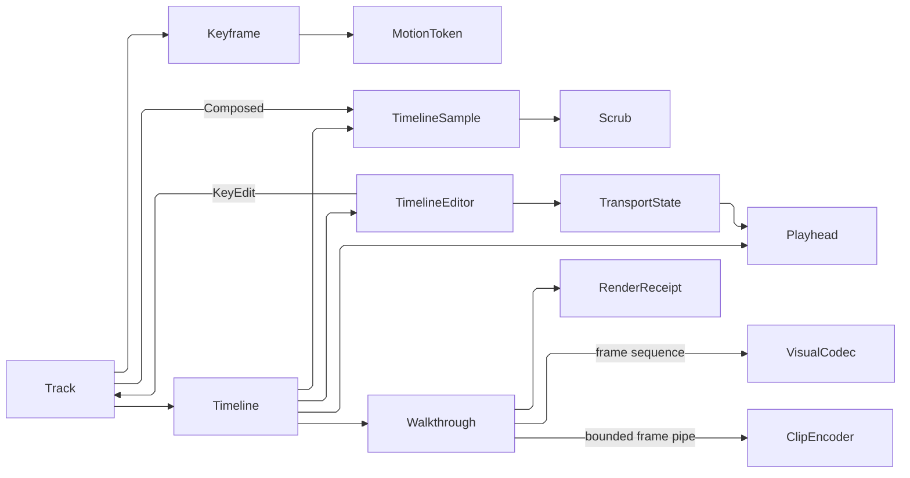

# [APPUI_RENDER_ANIMATION]

Animation is the Render plane's temporal engine: `Track` is the closed keyframe-track union over parameters, cameras, visibility, transient-field indices, colors, per-element rigid transforms, and media cues, `Keyframe` carries a value and a motion-token easing, `Timeline` composes tracks under a deterministic frame-indexed playhead, and `Walkthrough` renders the timeline to an offline frame sequence through the offscreen encode rail with the capture FFmpeg rows composing the flythrough clip off a streamed frame pipe. `TimelineEditor` folds lane, keyframe, range, transport, and selection edits back onto that union through its own admission gate and seats as one `ScreenProgram`. This page owns the track and keyframe vocabulary, the track-owned interpolation policy rows (`TrackInterp` is the ONE pose-interpolation owner AppUi-wide, its camera Pose and element Rigid rows one slerp discipline), the timeline composition and deterministic-playback sampler, the 4D schedule projection, the kinematic and transient-field scrub, the keyframe editor with the one transport grammar every playback surface reads, and the offline walkthrough export; the substrate is the `Theme/motion.md` token vocabulary, the `Viewpoint` camera for camera tracks, the `SimField` frame index for transient scrub, the visuals encode rail for walkthrough frames, and the kernel `MonotonicTimeline` for measured spans. Playback is frame-indexed under the deterministic clock so a scrub and an offline render reproduce the same state; `Collab/tour.md` projects its stops onto camera `Track` keyframes and rides THIS engine — the tour sampler and walkthrough clones are deleted.

## [01]-[INDEX]

- [02]-[TRACK_MODEL]: Keyframe-track union; keyframe value with motion-token easing; track-case-owned interpolation rows.
- [03]-[TIMELINE]: Track composition; deterministic playhead over an admitted frame window; sample-at-time fold.
- [04]-[SCRUB]: Kinematic playback; transient-field scrubbing by frame index; scheduler marshal.
- [05]-[WALKTHROUGH]: Offline frame-sequence render; the streamed capture FFmpeg flythrough composition.
- [06]-[TIMELINE_EDITOR]: Per-track lanes with an audibility capability set, keyframe manipulation with snapping, the range bar, the one transport grammar, the seated screen.

## [02]-[TRACK_MODEL]

- Owner: `Keyframe<T>` the timed value with its easing; `KeyMark` the ordinal-addressed (source, time, easing) row every structural edit speaks; `Keyframes<T>` the non-empty sorted frame carrier every track case holds; `Track` `[Union]` the track-kind family carrying its own interpolation and its own sample-into-state arm; `TrackInterp` the interpolation policy rows a track case elects; `AnimationFault` the direct generated `[Union]` with one `[FaultCase]` leaf per animation failure.
- Cases: `Track` = Parameter | Camera | Visibility | FieldIndex | Color | Transform | Media; `AnimationFault` = EmptyTrack | FrameRenderFailed | ClipEncodeFailed | RateOutOfDomain | RangeRejected | TrackMissing | KeyMissing.
- Law: interpolation is owned by the TRACK CASE and dispatched through the generated total `Switch` — `Track.Composed` is the one sample arm, so the case that knows its payload type is the case that names its blend, and a caller-threaded `lerp` delegate, a per-track `Func` column, and an interpolation-kind enum beside the track are all the deleted form. A new case ships its channel and its blend together or fails to compile.
- Law: `TrackInterp` is the AppUi stratum PEER of the kernel one-slerp law, and the two owners partition by CARRIER and host RUNTIME, never by linkage: `TrackInterp.Pose`/`Rigid` slerp `System.Numerics.Quaternion` over the AppUi `ViewCamera` union and `ElementPose` on the per-keyframe hot path, while kernel `MotionInterpolation.Interpolate`/`Rotate` speak `Plane`, `Direction`, and `Rhino.Geometry.Quaternion` under the `Context`/`Op` admission rail. Routing a camera keyframe through the kernel owner would marshal `ViewCamera` to `Plane` and back on every sample of every frame of every walkthrough while seating a host geometry type the standalone shell must interpolate with no Rhino host loaded. A THIRD pose-interpolation site in either stratum is the deleted form on both, and a host-neutral rotor on the kernel owner retires the `Pose`/`Rigid` rows onto it.
- Entry: `public static Fin<Track> OfParameter(string Key, Seq<Keyframe<double>> Frames)` and its six sibling smart constructors — each sorts the keyframes by time, refuses an empty run into `AnimationFault.EmptyTrack`, and splits the sorted result into the `Keyframes<T>` lead-plus-rest carrier, so every constructed `Track` carries at least one keyframe in ascending time BY SHAPE and the bracket sampler is total with no guard and no absent-head arm to spell; `public TimelineSample Composed(TimelineSample sample, Duration t)` — the per-case sample-into-state arm; `public Seq<KeyMark> Marks` — the one carrier-erasing projection `Instants`, `Easings`, and `Duration` all derive from; `public Fin<Track> Rebuilt(Func<Seq<KeyMark>, Seq<KeyMark>> edit)` — the one structural-edit re-entry.
- Auto: each keyframe carries its time, value, and a `MotionToken` whose curve drives the interpolation between it and the next, so the easing vocabulary is the one motion catalog and a keyframe never carries a raw cubic-bezier literal — the sampler reads `token.Curve` directly and a local easing facade shadowing the kernel `Easing` roster is deleted; camera tracks interpolate through `TrackInterp.Pose` and transform tracks through `TrackInterp.Rigid`, two rows on one slerp discipline; visibility tracks step a `VisibilityOverride` set at the keyframe and field-index tracks step the `SimField.FrameIndex`, both through the one generic `Held` row; color tracks interpolate through `TrackInterp.OkLab`, which admits both endpoints into kernel `PerceptualColor` and mixes along `BlendPath.Oklab`, so a componentwise sRGB lerp and a package-local opponent-space matrix are both unspellable; the bracketing search is a binary search over the time-sorted `Arr` the carrier hoists at mint, so a sample is logarithmic in keyframe count and allocates nothing per probe.
- Exemption: `Track.Bracket` spells a `while` loop. The invariant `frames[lo].At <= t < frames[hi].At` narrows one probe per step, the walk runs once per track per sampled frame of every walkthrough, and no admitted `Seq`/`Arr` operator expresses a halving probe without materializing the intermediate slices the loop exists to avoid.
- Packages: Rasm (project — `FaultBand`/`[FaultCase]`/`Fault` the fault floor, `PerceptualColor`/`BlendPath`/`UnitInterval` the colour algebra, `Op` the operation key), Thinktecture.Runtime.Extensions, LanguageExt.Core, NodaTime, System.Numerics (inbox)
- Growth: a new track kind is one `Track` case with its one `Of*` smart constructor, its `Marks`/`Rebuilt`/`Composed` arms, and its own blend row — every generated `Switch` breaks at compile time until all four land; a new easing is one `MotionToken` row consumed here; a new fault case is one `[FaultCase]` leaf; zero new surface.
- Boundary: the easing is the motion-token vocabulary so a hand-rolled tween curve is the deleted form — every keyframe traces its easing to a `MotionToken` row exactly as every visual constant traces to a token; camera tracks ride the `ViewCamera` shape so the animation camera, the viewport camera, and the drafting projection share one camera vocabulary; field-index tracks step the `SimField.FrameIndex` so a transient field scrub rides the simulation owner and this page re-computes no field; the `Track.Of*` smart constructors sort by time and split the sorted run into the non-empty `Keyframes<T>` carrier, so the ascending-time invariant holds at construction and non-emptiness holds by SHAPE — the sampler takes a lead and a rest that exist, so its projection is total with no absent-head arm to guard and no `throw` or unconstrained `default!` spelled inside it, reachable or otherwise; the `Of*` rail is the ONE track ingress — every consumer (`CaptureClip.OnTimeline`, the tour projection, the timeline authoring verbs) mints through it, and a direct case construction that skips the sorted admission is the deleted form the binary-search bracket makes incorrect by construction.

```csharp signature
// --- [TYPES] ----------------------------------------------------------------------------


// The two encode legs override `Retriability` because a codec refusal under memory or device
// pressure is the one failure here a re-drive can clear; every other case inherits Terminal by construction.
// The inner error rides its own column rather than being stringified into the detail: a parked encode fault
// carries the codec's typed refusal, so a recovery probes it instead of parsing a rendered message.
[Union(ConversionFromValue = ConversionOperatorsGeneration.None)]
public abstract partial record AnimationFault : Fault {
    private static readonly FaultBand FamilyBand = FaultBand.Animation;
    private AnimationFault(string detail) { Detail = detail; }
    public string Detail { get; }
    public override string Message => Detail;
    [FaultCase(0)]
    public sealed partial record EmptyTrack(string Key)
        : AnimationFault($"animation/empty-track: {Key}");
    [FaultCase(1)]
    public sealed partial record FrameRenderFailed(long FrameIndex, Error Cause)
        : AnimationFault($"animation/frame: {FrameIndex} — {Cause.Message}"), ICausedFault {
        public override Retriability Retriability => Retriability.Transient;
    }
    [FaultCase(2)]
    public sealed partial record ClipEncodeFailed(string ArtifactKey, Error Cause)
        : AnimationFault($"animation/clip: {ArtifactKey} — {Cause.Message}"), ICausedFault {
        public override Retriability Retriability => Retriability.Transient;
    }
    [FaultCase(3)]
    public sealed partial record RateOutOfDomain(double Fps)
        : AnimationFault($"animation/frame-rate: {Fps}");
    [FaultCase(4)]
    public sealed partial record RangeRejected(long First, long Last)
        : AnimationFault($"animation/range: [{First}, {Last}]");
    [FaultCase(5)]
    public sealed partial record TrackMissing(string Key)
        : AnimationFault($"animation/track: {Key}");
    [FaultCase(6)]
    public sealed partial record KeyMissing(string Key, int Ordinal)
        : AnimationFault($"animation/keyframe: {Key}#{Ordinal}");
    // The generator's own string-bearing mint; a payload-shaped refusal takes its own case above.
}

// --- [CONSTANTS] ------------------------------------------------------------------------

public static class AnimationOps {
    public static readonly Op Color = Op.Of(name: "appui.animation.color");
    public static readonly Op Rate = Op.Of(name: "appui.animation.rate");
    public static readonly Op Range = Op.Of(name: "appui.animation.range");
    public static readonly Op Board = Op.Of(name: "appui.animation.board");
    public static readonly Op Walk = Op.Of(name: "appui.animation.walkthrough");
}

// --- [MODELS] ---------------------------------------------------------------------------

public readonly record struct Keyframe<T>(Duration At, T Value, MotionToken Easing) : IComparable<Keyframe<T>> {
    public int CompareTo(Keyframe<T> other) => At.CompareTo(other.At);
}

// The edit currency: forward and inverse of ONE correspondence on one row. Reading a track answers marks whose
// `Ordinal` is each keyframe's own index; writing one answers marks whose `Ordinal` NAMES the keyframe whose
// value the new row carries. That is what makes a retime, an ease change, a deletion, and an insertion one
// shape while keeping an insert honest — the prior form clamped an over-long run onto the tail and silently
// duplicated the last value, so an insert past the end read as a move nobody made.
public readonly record struct KeyMark(int Ordinal, Duration At, MotionToken Easing);

// One per-element rigid pose. The payload rides the `System.Numerics` types the blend already ran in — the
// prior eight-double column set claimed a precision the float slerp never honoured and paid sixteen casts per
// element per sampled frame to make the claim.
public readonly record struct ElementPose(string ElementId, Vector3 Position, Quaternion Orientation, float Scale);

// The media cue: which media the track plays and WHERE IN ITS SOURCE the timeline instant maps to. Source
// time is a keyframed value rather than a derived offset, which is what subordinates video time to the
// animation clock instead of the other way round — the playhead is the one authority, so scrubbing back and
// forth lands the same source frame every time and a recorded walkthrough stays aligned to the 4D sequence it
// was shot against. `Rate` is the transport's own reading of the mapping's slope for its speed display, not a
// second time source: the source time between two cues is the interpolation, and a rate that disagreed with
// it would be a second clock the scrub could never satisfy.
public readonly record struct MediaCue(string MediaKey, Duration Source, double Rate) {
    public static MediaCue At(string mediaKey, Duration source) => new(mediaKey, source, 1d);
}

// Non-emptiness is the SHAPE, not a runtime assertion the sampler re-takes: the lead frame is a member, so an
// empty track is unrepresentable and the value projection needs no absent-head arm at all. `All` is strict and
// minted ONCE — the bracket walk indexes it per probe per sample per frame, and re-consing the lead onto a
// lazy rest at every probe is what made an O(log n) search allocate. A record CLASS, not a struct: a struct
// carrying a hoisted member has a default ghost whose `All` is empty, which is the one value that would put
// the absent-head arm back into a sampler this shape exists to keep total.
public sealed record Keyframes<T>(Keyframe<T> Lead, Arr<Keyframe<T>> Rest) {
    public Arr<Keyframe<T>> All { get; } = Lead.Cons(Rest);

    public int Count => All.Count;

    public Duration Terminal => All.Fold(Lead.At, static (max, frame) => frame.At > max ? frame.At : max);
}

// --- [OPERATIONS] -----------------------------------------------------------------------

// The interpolation policy ROWS a track case elects. This is the ONE pose-interpolation owner AppUi-wide: the
// camera Pose row and the element Rigid row are two rows over one slerp discipline, written against the scalar
// `ViewCamera` shape the pipeline owns, and `Collab/tour.md`'s transition interpolation composes the Pose row
// directly rather than receiving it as a parameter. No row is a stored delegate: a `Func` column on a record
// threaded through six signatures was a policy value that could differ per call site for a law that has one
// answer per track case.
public static class TrackInterp {
    public static double Scalar(double a, double b, double t) => a + ((b - a) * t);

    // The HOLD row, generic over every carrier: the sample equals the preceding keyframe value until the next
    // boundary. A rounded intermediate index would select simulation states no field-index keyframe declared,
    // and a visibility set has no meaningful midpoint at all, so one hold serves both.
    public static T Held<T>(T a, T b, double t) => t >= 1d ? b : a;

    // Colour crosses the kernel perceptual owner on BOTH legs — admit, mix along the declared path, quantize
    // once. The refusal arm is structurally unreachable (byte-domain admissions and a clamped unit parameter),
    // and its answer is the far keyframe rather than a fabricated blend, because a sampler with no rail can
    // only be honest about which authored value it fell back to.
    public static Avalonia.Media.Color OkLab(Avalonia.Media.Color a, Avalonia.Media.Color b, double t) =>
        (from lo in PerceptualColor.OfRgb(red: a.R, green: a.G, blue: a.B, alpha: a.A, key: AnimationOps.Color)
         from hi in PerceptualColor.OfRgb(red: b.R, green: b.G, blue: b.B, alpha: b.A, key: AnimationOps.Color)
         from at in AnimationOps.Color.AcceptValidated<UnitInterval>(candidate: Math.Clamp(t, 0d, 1d))
         select lo.Mix(other: hi, amount: at, path: BlendPath.Oklab).ToRgb())
        .Match(
            Succ: static rgb => Avalonia.Media.Color.FromArgb(rgb.Alpha, rgb.Red, rgb.Green, rgb.Blue),
            Fail: static _ => b);

    // Media time INTERPOLATES and the media key HOLDS: source time is a continuous function of timeline time
    // so a scrub drives the frame the video shows, while the key steps at the cue boundary because there is no
    // meaningful blend between two files. A held source time would freeze the video on every scrub between
    // cues, which is the shape that made recorded footage and a 4D sequence drift apart the moment either was
    // retimed.
    public static MediaCue Cue(MediaCue a, MediaCue b, double t) =>
        a.MediaKey == b.MediaKey
            ? a with {
                Source = a.Source + Duration.FromNanoseconds((long)Math.Round((b.Source - a.Source).TotalNanoseconds * t)),
                Rate = Scalar(a.Rate, b.Rate, t),
            }
            : Held(a, b, t);

    // Element twin of the camera Pose row — the SAME slerp discipline, joined per element id; an element
    // absent from the far keyframe holds its present pose, so a partial keyframe steps at the set boundary
    // instead of teleporting to identity.
    public static Seq<ElementPose> Rigid(Seq<ElementPose> a, Seq<ElementPose> b, double t) =>
        a.Map(from => b.Find(to => to.ElementId == from.ElementId).Match(
                Some: to => Blend(from, to, (float)t),
                None: () => from))
            .Concat(b.Filter(to => t >= 1d && !a.Exists(from => from.ElementId == to.ElementId)));

    static ElementPose Blend(ElementPose a, ElementPose b, float t) =>
        a with {
            Position = Vector3.Lerp(a.Position, b.Position, t),
            Orientation = Quaternion.Slerp(a.Orientation, b.Orientation, t),
            Scale = a.Scale + ((b.Scale - a.Scale) * t),
        };

    // Lens interpolation is case-preserving: matching projections blend their own live scalars, while a
    // projection-kind cut steps at the keyframe boundary and never manufactures an irrelevant lens value. ONE
    // dispatch level over the source case with a narrowing probe on the target — the nested camera-inside-
    // camera Switch the two-case family carried grew as the SQUARE of the vocabulary, so the third projection
    // would have made nine arms for one law stated once; a new case still breaks this Switch at compile time.
    public static ViewCamera Pose(ViewCamera a, ViewCamera b, double t) =>
        a.Switch(
            state: (To: b, T: t),
            perspective: static (state, from) => state.To is ViewCamera.Perspective to
                ? new ViewCamera.Perspective(BlendFrame(from.Frame, to.Frame, state.T), Scalar(from.FieldOfViewDeg, to.FieldOfViewDeg, state.T))
                : Stepped(from, state.To, state.T),
            orthographic: static (state, from) => state.To is ViewCamera.Orthographic to
                ? new ViewCamera.Orthographic(BlendFrame(from.Frame, to.Frame, state.T), Scalar(from.ViewHeight, to.ViewHeight, state.T))
                : Stepped(from, state.To, state.T),
            // The XR eye's four signed angles are four independent scalar axes, so they blend per axis exactly
            // as a field of view or a view height does — no tangent-space detour, because a tween between two
            // frusta of one kind is linear in the declared angles the producer wrote.
            asymmetric: static (state, from) => state.To is ViewCamera.Asymmetric to
                ? new ViewCamera.Asymmetric(
                    BlendFrame(from.Frame, to.Frame, state.T),
                    Scalar(from.AngleLeft, to.AngleLeft, state.T), Scalar(from.AngleRight, to.AngleRight, state.T),
                    Scalar(from.AngleUp, to.AngleUp, state.T), Scalar(from.AngleDown, to.AngleDown, state.T))
                : Stepped(from, state.To, state.T));

    static ViewCamera Stepped(ViewCamera from, ViewCamera to, double t) => t < 1d ? from : to;

    static CameraFrame BlendFrame(CameraFrame a, CameraFrame b, double t) =>
        new(
            Vector3.Lerp(a.Eye, b.Eye, (float)t),
            Vector3.Lerp(a.Target, b.Target, (float)t),
            Vector3.Transform(Vector3.UnitY, Quaternion.Slerp(OrientOf(a), OrientOf(b), (float)t)));

    // The look-at rotor. The kernel `MotionInterpolation.Rotate` states this same derivation over `Direction`
    // under the Rhino carrier, so this body retires the moment a host-neutral rotor lands beside it.
    static Quaternion OrientOf(CameraFrame frame) {
        Vector3 forward = Vector3.Normalize(frame.Target - frame.Eye);
        Vector3 right = Vector3.Normalize(Vector3.Cross(forward, frame.Up));
        Vector3 up = Vector3.Cross(right, forward);
        return Quaternion.CreateFromRotationMatrix(new Matrix4x4(
            right.X, right.Y, right.Z, 0f,
            up.X, up.Y, up.Z, 0f,
            -forward.X, -forward.Y, -forward.Z, 0f,
            0f, 0f, 0f, 1f));
    }
}

[Union(ConversionFromValue = ConversionOperatorsGeneration.None)]
public abstract partial record Track(string Key) {
    public sealed record Parameter(string Key, Keyframes<double> Frames) : Track(Key);
    public sealed record Camera(string Key, Keyframes<ViewCamera> Frames) : Track(Key);
    public sealed record Visibility(string Key, Keyframes<Seq<VisibilityOverride>> Frames) : Track(Key);
    public sealed record FieldIndex(string Key, Keyframes<int> Frames) : Track(Key);
    public sealed record Color(string Key, Keyframes<Avalonia.Media.Color> Frames) : Track(Key);
    public sealed record Transform(string Key, Keyframes<Seq<ElementPose>> Frames) : Track(Key);
    // The media case subordinates recorded footage to THIS clock: a cue maps a timeline instant onto a source
    // instant, so the playhead is the one time authority and a media player advancing on its own wall clock
    // beside the sequence is the deleted form — two clocks that agree only until the first scrub.
    public sealed record Media(string Key, Keyframes<MediaCue> Frames) : Track(Key);

    public static Fin<Track> OfParameter(string Key, Seq<Keyframe<double>> Frames) =>
        Sorted(Key, Frames).Map(sorted => (Track)new Parameter(Key, sorted));
    public static Fin<Track> OfCamera(string Key, Seq<Keyframe<ViewCamera>> Frames) =>
        Sorted(Key, Frames).Map(sorted => (Track)new Camera(Key, sorted));
    public static Fin<Track> OfVisibility(string Key, Seq<Keyframe<Seq<VisibilityOverride>>> Frames) =>
        Sorted(Key, Frames).Map(sorted => (Track)new Visibility(Key, sorted));
    public static Fin<Track> OfFieldIndex(string Key, Seq<Keyframe<int>> Frames) =>
        Sorted(Key, Frames).Map(sorted => (Track)new FieldIndex(Key, sorted));
    public static Fin<Track> OfColor(string Key, Seq<Keyframe<Avalonia.Media.Color>> Frames) =>
        Sorted(Key, Frames).Map(sorted => (Track)new Color(Key, sorted));
    public static Fin<Track> OfTransform(string Key, Seq<Keyframe<Seq<ElementPose>>> Frames) =>
        Sorted(Key, Frames).Map(sorted => (Track)new Transform(Key, sorted));
    public static Fin<Track> OfMedia(string Key, Seq<Keyframe<MediaCue>> Frames) =>
        Sorted(Key, Frames).Map(sorted => (Track)new Media(Key, sorted));

    // The one admission: sort, then SPLIT — the head the sort produced becomes the carrier's lead, so the
    // proof of non-emptiness and the value that carries it are minted in one step and an empty seq refuses by
    // name before any case exists.
    static Fin<Keyframes<T>> Sorted<T>(string key, Seq<Keyframe<T>> frames) =>
        toSeq(frames.OrderBy(static frame => frame.At)) switch {
            var sorted => sorted.Head.Match(
                Some: lead => Fin.Succ(new Keyframes<T>(lead, sorted.Tail.ToArr())),
                None: () => Fin<Keyframes<T>>.Fail(new AnimationFault.EmptyTrack(key))),
        };

    // The ONE carrier-erasing projection. Four total dispatches used to re-spell "reach `.Frames.All`" — the
    // lane glyph row, the ease-handle row, the terminal instant, and the edit re-entry — so a seventh case
    // owed four arms to ship one lane. Now `Instants`, `Easings`, and `Duration` all DERIVE, and a case owes
    // this arm, its `Composed` arm, and its `Rebuilt` arm.
    public Keyframes<KeyMark> Marks => Switch(
        parameter: static p => Marked(p.Frames), camera: static c => Marked(c.Frames),
        visibility: static v => Marked(v.Frames), fieldIndex: static f => Marked(f.Frames),
        color: static c => Marked(c.Frames), transform: static t => Marked(t.Frames),
        media: static m => Marked(m.Frames));

    public Seq<Duration> Instants => Marks.All.ToSeq().Map(static mark => mark.At);

    public Seq<MotionToken> Easings => Marks.All.ToSeq().Map(static mark => mark.Easing);

    // The terminal instant folds off the lead, so the seed is the lead's own instant rather than a
    // Duration.Zero stand-in for an absence the carrier makes unspellable — which is why the mark projection
    // answers the same non-empty CARRIER the payload frames ride rather than a bare seq.
    public Duration Duration => Marks.Terminal;

    // The sample-into-state arm: the case that knows its payload type names its own blend and seats its own
    // channel, so `Timeline.SampleAt` is one fold with no interpolation vocabulary of its own. Every
    // MULTI-VALUED channel composes KEYED by its natural identity, so two tracks touching one element resolve
    // to one row instead of emitting two conflicting rows or silently dropping one; the two SINGLE-VALUED
    // channels carry a declared last-track-wins rule, which is a rule stated on the fold rather than an
    // accident of arm order.
    public TimelineSample Composed(TimelineSample sample, Duration t) => Switch(
        state: (Sample: sample, T: t),
        parameter: static (ctx, p) => ctx.Sample with {
            Parameters = ctx.Sample.Parameters.AddOrUpdate(p.Key, Sample(p.Frames, ctx.T, TrackInterp.Scalar)),
        },
        camera: static (ctx, c) => ctx.Sample with { Camera = Some(Sample(c.Frames, ctx.T, TrackInterp.Pose)) },
        visibility: static (ctx, v) => ctx.Sample with {
            Visibility = Sample(v.Frames, ctx.T, TrackInterp.Held)
                .Fold(ctx.Sample.Visibility, static (held, row) => held.AddOrUpdate(row.ElementId, row)),
        },
        fieldIndex: static (ctx, f) => ctx.Sample with { FieldIndex = Some(Sample(f.Frames, ctx.T, TrackInterp.Held)) },
        color: static (ctx, c) => ctx.Sample with {
            Colors = ctx.Sample.Colors.AddOrUpdate(c.Key, Sample(c.Frames, ctx.T, TrackInterp.OkLab)),
        },
        transform: static (ctx, x) => ctx.Sample with {
            Transforms = Sample(x.Frames, ctx.T, TrackInterp.Rigid)
                .Fold(ctx.Sample.Transforms, static (held, pose) => held.AddOrUpdate(pose.ElementId, pose)),
        },
        media: static (ctx, m) => ctx.Sample with {
            Media = ctx.Sample.Media.AddOrUpdate(m.Key, Sample(m.Frames, ctx.T, TrackInterp.Cue)),
        });

    // Every structural edit re-enters the ONE `Of*` admission, so a moved, added, deleted, or re-eased track
    // is re-sorted and re-proved non-empty by the same gate an authored track passes — an editor rewriting a
    // carrier in place would leave the binary-search bracket reading an unsorted run, which answers a
    // plausible wrong value rather than failing.
    public Fin<Track> Rebuilt(Func<Keyframes<KeyMark>, Seq<KeyMark>> edit) => Switch(
        state: edit,
        parameter: static (e, p) => Retimed(p.Key, p.Frames, e).Bind(rows => OfParameter(p.Key, rows)),
        camera: static (e, c) => Retimed(c.Key, c.Frames, e).Bind(rows => OfCamera(c.Key, rows)),
        visibility: static (e, v) => Retimed(v.Key, v.Frames, e).Bind(rows => OfVisibility(v.Key, rows)),
        fieldIndex: static (e, f) => Retimed(f.Key, f.Frames, e).Bind(rows => OfFieldIndex(f.Key, rows)),
        color: static (e, c) => Retimed(c.Key, c.Frames, e).Bind(rows => OfColor(c.Key, rows)),
        transform: static (e, t) => Retimed(t.Key, t.Frames, e).Bind(rows => OfTransform(t.Key, rows)),
        media: static (e, m) => Retimed(m.Key, m.Frames, e).Bind(rows => OfMedia(m.Key, rows)));

    static Keyframes<KeyMark> Marked<T>(Keyframes<T> frames) =>
        new(new KeyMark(0, frames.Lead.At, frames.Lead.Easing),
            frames.Rest.Map(static (frame, index) => new KeyMark(index + 1, frame.At, frame.Easing)));

    // The edit answers marks whose `Ordinal` NAMES the keyframe whose value each new row carries, so the
    // values ride along by an addressed read and an out-of-range address refuses by name. A run shorter than
    // the carrier drops its tail keyframes, which is exactly what a deletion is; a run longer carries the
    // neighbour the edit named, which is what an insert against a copied neighbour means.
    static Fin<Seq<Keyframe<T>>> Retimed<T>(string key, Keyframes<T> frames, Func<Keyframes<KeyMark>, Seq<KeyMark>> edit) =>
        frames.All switch {
            var held => edit(Marked(frames)).Traverse(row => row.Ordinal >= 0 && row.Ordinal < held.Count
                ? Fin.Succ(new Keyframe<T>(row.At, held[row.Ordinal].Value, row.Easing))
                : Fin.Fail<Keyframe<T>>(new AnimationFault.KeyMissing(key, row.Ordinal))).As(),
        };

    // TOTAL by construction — the carrier hands the sampler its lead and its rest, so the bracket walk starts
    // from a frame that exists and no arm, reachable or otherwise, throws inside the value projection. The
    // easing is the FAR keyframe's own token curve; a local clamp-and-evaluate facade over it was a rename
    // wrapper shadowing the kernel `Easing` roster by simple name.
    public static T Sample<T>(Keyframes<T> frames, Duration t, Func<T, T, double, T> blend) =>
        Bracket(frames.All, t) switch {
            (var lo, var hi) when lo.At == hi.At => lo.Value,
            var bracket => blend(bracket.Lo.Value, bracket.Hi.Value,
                bracket.Hi.Easing.Curve(Math.Clamp(
                    (t - bracket.Lo.At).TotalNanoseconds / (double)(bracket.Hi.At - bracket.Lo.At).TotalNanoseconds, 0d, 1d))),
        };

    static (Keyframe<T> Lo, Keyframe<T> Hi) Bracket<T>(Arr<Keyframe<T>> frames, Duration t) {
        if (frames.Count == 1 || t <= frames[0].At) { return (frames[0], frames[0]); }
        if (t >= frames[frames.Count - 1].At) { return (frames[frames.Count - 1], frames[frames.Count - 1]); }
        (int lo, int hi) = (0, frames.Count - 1);
        while (hi - lo > 1) {
            int mid = lo + ((hi - lo) >> 1);
            if (frames[mid].At <= t) { lo = mid; } else { hi = mid; }
        }
        return (frames[lo], frames[hi]);
    }
}
```

## [03]-[TIMELINE]

- Owner: `PlaybackMode` the once/loop/ping-pong policy; `PlayDirection` the two-row step vocabulary whose key IS its step; `FrameWindow` the admitted frame-bounds pair; `Playhead` the deterministic playback clock; `Timeline` the track composition; `TimelineSample` the sampled state at the playhead; `SchedulePhase`/`SchedulePlayback` the 4D construction-sequence projection onto the one timeline.
- Entry: `public TimelineSample SampleAt(Duration t)` — folds every track's own `Composed` arm into one keyed state; `public Fin<Playhead> Ranged(long first, long last)` — the frame-window admission; `public Playhead Advance()` — one frame INDEX step with the overrun dispatched on `PlaybackMode`.
- Auto: `Advance` steps the playhead by exactly one frame INDEX — the integer index is the clock state and wall time derives from it through the one `TimeOf` rounding, so a non-integral rate (29.97, 23.976) never accumulates truncation drift, the tail frame is a real renderable frame, and a scrub to frame N and a render of frame N produce the same state; the timeline duration is the max track duration so the playhead clamps at the end; loop and ping-pong are playhead policy values so a looping animation is a clock policy, never a per-track flag — ping-pong FLIPS its `PlayDirection` at each boundary and advances back through the frames, so it genuinely reverses and is never behaviorally `Once`; the active bounds are ONE admitted `FrameWindow` rather than an in/out pair with an unset sentinel, so `First`, `Last`, `Seek`, and every reflection read one value and an unranged timeline resolves the whole renderable span by derivation.
- Auto: the frame rate is a kernel `PositiveMagnitude`, so every `Playhead` division and frame count derives from a value admitted once at the timeline ingress and no consumer re-guards it — the refusal re-keys onto `AnimationFault.RateOutOfDomain` at that one edge so the page names its own domain in its own vocabulary while the band admission stays the kernel's.
- Packages: Rasm (project — `PositiveMagnitude` the rate band, `Op` the operation key), Thinktecture.Runtime.Extensions, LanguageExt.Core, NodaTime
- Growth: a new playback mode is one `PlaybackMode` row and its `Advance` arm; a new composed-state field is one `TimelineSample` member fed by the owning track case's `Composed` arm; a new schedule-phase channel is one `SchedulePhase` column; zero new surface.
- Boundary: the playhead is frame-indexed under the deterministic motion clock so a wall-clock animation is the rejected form — a scrub and an offline render hit identical frames, the determinism the walkthrough export depends on; the frame rate is a timeline row value so a per-render frame-rate literal is the deleted form; loop and ping-pong are playhead policy so a per-track loop flag is the deleted form; the 4D construction-sequence playback is `SchedulePlayback.FromSchedule` — the Bim `ConstructionState.At(network, graph, instant, phase)` fold answers an `ElementQuery` partitioned by `ConstructionPhase` and classed per task by `TaskKind`, arrives here as already-classed `SchedulePhase` values, and projects onto ONE stepped visibility track, so a Navisworks-class sequence scrub rides this timeline and a second 4D timeline or an AppUi-side schedule fold is the deleted form; the composed sample binds the camera onto the viewport camera, the field index onto the simulation render, the visibility onto the viewpoint overrides, and the parameters onto the inspector bindings so the timeline drives existing owners and a timeline-local renderer is the deleted form.

```csharp signature
// --- [TYPES] ----------------------------------------------------------------------------

[SmartEnum<string>]
[KeyMemberEqualityComparer<ComparerAccessors.StringOrdinal, string>]
public sealed partial class PlaybackMode {
    public static readonly PlaybackMode Once = new("once");
    public static readonly PlaybackMode Loop = new("loop");
    public static readonly PlaybackMode PingPong = new("ping-pong");
}

// The key IS the step, so no consumer spells the sign and a `+1`/`-1` int column with two legal values out of
// four billion stops being representable. `Flipped` is total by the delegate column.
[SmartEnum<int>]
public sealed partial class PlayDirection {
    public static readonly PlayDirection Forward = new(key: 1, flip: static () => Reverse);
    public static readonly PlayDirection Reverse = new(key: -1, flip: static () => Forward);

    public long Step => Key;

    [UseDelegateFromConstructor]
    public partial PlayDirection Flipped();
}

// --- [MODELS] ---------------------------------------------------------------------------

// The ACTIVE bounds as one admitted pair. The prior form carried `In = 0` beside `Out = -1` as an unset
// sentinel and re-clamped both at five reading sites; a negative out point was representable, an inverted pair
// was representable, and every reader owed the same two `Math.Clamp` calls to find out which.
[ComplexValueObject]
[ValidationError]
public readonly partial struct FrameWindow {
    public long First { get; }

    public long Last { get; }

    public long Span => Last - First + 1L;

    public bool Holds(long frame) => frame >= First && frame <= Last;

    public long Clamp(long frame) => Math.Clamp(frame, First, Last);

    static partial void ValidateFactoryArguments(ref ValidationError? validationError, ref long first, ref long last) =>
        validationError = first >= 0L && last >= first ? null : new ValidationError(string.Join(" | ", new object?[] { first, last }));
}

// Frame-INDEXED clock: the integer index IS the state and wall time DERIVES from it in one rounding, so a
// non-integral rate (29.97, 23.976) never accumulates truncation drift and the tail frame renders. The RANGE
// is frame-indexed for the same reason the position is: a wall-clock range over a frame-indexed clock
// re-introduces exactly the rounding drift the index exists to delete, and it makes an out point that is not a
// renderable frame — so a loop would either skip the last frame or overrun it, depending on which side the
// rounding fell. Speed lives on the transport, not here: the index advances by exactly one frame per tick and
// the speed scales the tick CADENCE, so a half-speed playback renders every frame slowly and never every
// other frame quickly.
public sealed record Playhead(
    long Index, PositiveMagnitude Fps, PlaybackMode Mode, Duration Total, PlayDirection Direction, Option<FrameWindow> Range) {
    public static Playhead At(PositiveMagnitude fps, Duration total, PlaybackMode mode) =>
        new(0L, fps, mode, total, PlayDirection.Forward, None);

    public Duration Position => TimeOf(Index);

    // ONE index-to-time derivation every scrub and offline render shares; the tail clamps to Total so the last
    // frame samples in-range.
    public Duration TimeOf(long frame) =>
        Duration.FromNanoseconds(Math.Min(
            (long)Math.Round(frame * (double)NodaConstants.NanosecondsPerSecond / Fps.Value),
            Total.ToInt64Nanoseconds()));

    // Inclusive tail: the frame at the timeline end is a real renderable frame.
    public long FrameCount => (long)Math.Floor(Total.TotalSeconds * Fps.Value) + 1L;

    // An unranged timeline DERIVES its whole span rather than storing a second duration authority beside
    // `Total`. `Create` cannot refuse here: the frame count is at least one, so last is never below first.
    public FrameWindow Window => Range.IfNone(() => FrameWindow.Create(first: 0L, last: FrameCount - 1L));

    // The range is set in FRAMES and admitted here, so an in point past its out point, a negative bound, and a
    // tail past the renderable span each refuse rather than producing a loop that advances forever without
    // ever re-entering its own bounds.
    public Fin<Playhead> Ranged(long first, long last) =>
        AnimationOps.Range.AcceptValidated<FrameWindow>(
                FrameWindow.Validate(first: first, last: last, obj: out FrameWindow? window), window)
            .Bind(admitted => admitted.Last < FrameCount
                ? Fin.Succ(this with { Range = Some(admitted), Index = admitted.Clamp(Index) })
                : Fin.Fail<Playhead>(new AnimationFault.RangeRejected(first, last)));

    public Playhead Advance() =>
        Window switch {
            var window => (Index + Direction.Step) switch {
                var next when window.Holds(next) => this with { Index = next },
                var overrun => Mode.Switch(
                    state: (Self: this, Window: window, Overrun: overrun),
                    once: static (s, _) => s.Self with { Index = s.Window.Last },
                    loop: static (s, _) => s.Self with { Index = s.Window.First },
                    // Ping-pong flips direction at the boundary and reflects one step back inside the range.
                    pingPong: static (s, _) => s.Self with {
                        Direction = s.Self.Direction.Flipped(),
                        Index = s.Overrun > s.Window.Last
                            ? Math.Max(s.Window.Last - 1L, s.Window.First)
                            : Math.Min(s.Window.First + 1L, s.Window.Last),
                    }),
            },
        };
}

// Every multi-valued channel is keyed by the identity its consumer resolves on, so the sample answers "what is
// this element's pose at t" with one row rather than a sequence a reader must de-conflict.
public sealed record TimelineSample(
    HashMap<string, double> Parameters,
    Option<ViewCamera> Camera,
    HashMap<string, VisibilityOverride> Visibility,
    Option<int> FieldIndex,
    HashMap<string, Avalonia.Media.Color> Colors,
    HashMap<string, ElementPose> Transforms,
    HashMap<string, MediaCue> Media) {
    public static readonly TimelineSample Empty = new(
        HashMap<string, double>(), None, HashMap<string, VisibilityOverride>(), None,
        HashMap<string, Avalonia.Media.Color>(), HashMap<string, ElementPose>(), HashMap<string, MediaCue>());
}

public sealed record Timeline(string Key, Seq<Track> Tracks, PositiveMagnitude FrameRate, PlaybackMode Mode) {
    // ONE timeline ingress. The kernel positive band owns the guard and this edge owns the NAME: the refusal
    // re-keys onto the page's own frozen offset so a telemetry read bands it here, while the admission stays
    // the one place a rate is proven.
    public static Fin<Timeline> Of(string key, Seq<Track> tracks, double frameRate, PlaybackMode mode) =>
        AnimationOps.Rate.AcceptValidated<PositiveMagnitude>(candidate: frameRate)
            .MapFail(static _ => (Error)new AnimationFault.RateOutOfDomain(frameRate))
            .Map(rate => new Timeline(key, tracks, rate, mode));

    public Duration Total => Tracks.Map(static track => track.Duration).Max(Duration.Zero);

    public Playhead Playhead() => Animation.Playhead.At(FrameRate, Total, Mode);

    // One fold, no interpolation vocabulary: each track case seats its own channel through its own blend, so a
    // seventh kind ships its channel with no edit here.
    public TimelineSample SampleAt(Duration t) =>
        Tracks.Fold(TimelineSample.Empty, (sample, track) => track.Composed(sample, t));
}

// 4D projection twin of the tour: Bim resolves `ConstructionState.At` per sampled instant into a
// `ConstructionPhase`-partitioned element query and classes each override by the task's own `TaskKind` (a
// CONSTRUCTION task's elements arrive tinted, a DEMOLITION task's depart ghosted; AppUi runs no schedule
// fold), and `FromSchedule` projects the phase sequence onto ONE stepped visibility track, so a
// construction-sequence scrub, a camera fly-through, and a transient field share the one playhead, sampler,
// and walkthrough rail. The phase rides the row because a scrub reads WHICH partition it is watching — an
// instant-and-overrides pair alone cannot tell a completed-by read from an in-flight one.
public readonly record struct SchedulePhase(Instant At, ConstructionPhase Phase, Seq<VisibilityOverride> State);

public static class SchedulePlayback {
    // Seq.Head is the Option PROPERTY, not a phantom HeadOrNone member, and it is the phase-zero epoch every
    // keyframe instant subtracts, so an empty schedule refuses at the rail edge rather than dereferencing it.
    public static Fin<Timeline> FromSchedule(string key, Seq<SchedulePhase> phases, double fps, PlaybackMode mode) =>
        phases.Head.Match(
            None: () => Fin.Fail<Timeline>(new AnimationFault.EmptyTrack(key)),
            Some: head => Track.OfVisibility(
                    $"{key}/state",
                    phases.Map(phase => new Keyframe<Seq<VisibilityOverride>>(phase.At - head.At, phase.State, MotionToken.Standard)))
                .Bind(state => Timeline.Of(key, Seq(state), fps, mode)));
}
```

## [04]-[SCRUB]

- Owner: `Scrub` the kinematic and transient-field scrub fold over the ONE `[06]-[TIMELINE_EDITOR]` `TransportState`.
- Entry: `public static IO<TimelineSample> To(Timeline timeline, long frame, SurfaceScheduler scheduler)` — scrubs the playhead to an exact frame and MARSHALS the composed sample onto the UI thread through the scheduler boundary; `public static IObservable<TransportState> Kinematic(Func<TransportState> transport, SurfaceScheduler scheduler)` — the paced playback stream over a LIVE read of the one transport, its step and its cadence both resolved per tick; the field-index track drives the transient simulation frame.
- Auto: scrubbing to a frame samples the timeline at that frame's exact time so a scrub is deterministic and re-entrant — dragging the playhead back and forth never accumulates drift because the playhead is frame-indexed, not delta-integrated; the kinematic playback advances one frame per tick through `TransportState.Advanced` over a LIVE read of the transport the surface holds, so a play is a repeated `Playhead.Advance`, a pause holds the frame, and a drag or a speed change raised between two ticks reaches the very next one; the transient-field scrub reads the `FieldIndex` track so dragging the playhead steps the simulation frame the simulation render binds — a transient field and a camera fly-through scrub on the same playhead.
- Law: the tick cadence composes the kernel `PaceBand` the transport carries. The band bounds the request from both ends — a variable-refresh panel advertises a ceiling it will not hold and the slowest presentation is the other half of the clamp — so a 240 fps timeline on a 60 Hz display asks for a cadence the display can present instead of asking for one it refuses and reading the shortfall as drift. `ReducedMotion.Posture(PaceBand)` is the producer both this cadence and every kernel drive step read the same band off.
- Packages: Rasm (project — `PaceBand` the cadence band), LanguageExt.Core, System.Reactive, NodaTime, BCL inbox (`TaskCompletionSource` as the marshal gate the action-shaped port carries a value across)
- Growth: a new playback bound is one `Playhead` column; a new transport fact is one `TransportState` member; zero new surface.
- Boundary: the scrub is frame-indexed so it is deterministic and re-entrant — a delta-integrated scrub that drifts is the deleted form; playback state is the ONE `TransportState` the transport grammar folds, so a scrub-local play/pause/seek record beside it is the deleted form — it is a second transport vocabulary over one motion, and the two diverge the first time looping, ranging, or a speed change lands on one of them; the driver READS that one state and holds none, so a seeded stream advancing a private lineage is the same deleted form reached through a copy rather than a record; the tick SOURCE is the injected scheduler the surface boundary already owns, so a scrub-local timer and an ambient wall clock are both the rejected forms and a deterministic-time composition paces playback by swapping that one scheduler; the field-index scrub drives the simulation render frame so the transient field and the kinematic camera share one playhead and a second timeline for the field is the deleted form; the composed sample marshals through the surface scheduler — the scheduler parameter is LOAD-BEARING (the sample computes off-thread and emits on the UI thread through `Marshal`), never decorative.

```csharp signature
// --- [OPERATIONS] -----------------------------------------------------------------------

public static class Scrub {
    // The marshal port carries an ACTION, so the composed sample crosses the thread on a gate the posted body
    // fills and the rail awaits — the same shape `Diagnostics/devloop` takes across the identical seam. The
    // sample computes on the calling thread and the value re-enters the rail only after the UI thread has run
    // the post, so a consumer bound to a control receives it there; handing the port a value-returning lambda
    // type-checks against nothing, because the port's answer is `IO<Unit>` and the sample would be discarded.
    public static IO<TimelineSample> To(Timeline timeline, long frame, SurfaceScheduler scheduler) =>
        IO.lift(() => (
                Sample: timeline.SampleAt(timeline.Playhead().TimeOf(frame)),
                Gate: new TaskCompletionSource<TimelineSample>(TaskCreationOptions.RunContinuationsAsynchronously)))
            .Bind(state => scheduler.Marshal(() => state.Gate.TrySetResult(state.Sample))
                .Bind(_ => IO.liftAsync(async () => await state.Gate.Task.ConfigureAwait(false))));

    // The playback driver, holding NO state of its own: it reads the live transport on every tick and answers
    // the state one frame on, and the surface seats that answer where the read came from. A driver SEEDED with
    // a value forks the transport at subscription — the stream advances a private lineage while a raised verb,
    // a playhead drag, and a speed change land on the surface's own value, so a pause never stops the stream,
    // a seek never moves it, and the cadence stays pinned to whatever speed the seed carried. Reading live
    // makes both the step and the cadence track a verb raised between two ticks, and it keeps the editor a
    // pure fold: the ONE transport lives where the surface holds it and this driver owns none of it. The read
    // rides the Generate STATE slot, so every arm stays `static` and closure-free. Pacing rides the boundary's
    // own `IScheduler` — the seat a deterministic composition already swaps — so this fold constructs no timer.
    public static IObservable<TransportState> Kinematic(Func<TransportState> transport, SurfaceScheduler scheduler) =>
        Observable.Generate(
            transport,
            static _ => true,
            static read => read,
            static read => read().Advanced(),
            static read => read().Tick.ToTimeSpan(),
            scheduler.Ui);
}
```

## [05]-[WALKTHROUGH]

- Owner: `WalkthroughSpec` the offline-render specification; `WalkthroughFold` the fault-carrying accumulation; `Walkthrough` the frame-sequence render fold — the ONE walkthrough engine the tour projection rides.
- Entry: `public static IO<RenderReceipt> Render(VisualRuntime runtime, Timeline timeline, WalkthroughSpec spec, Func<Duration, TimelineSample, SKImageInfo, Fin<SKImage>> frame)` — the delegate carries the sampled instant beside the sample, so a frame renderer can draw anything time-varying beside the tracks (the tour's caption overlay is the first consumer) — renders every frame of the timeline to the encode rail and seals one receipt for the sequence; the frame count is the timeline duration over the frame rate.
- Auto: the walkthrough steps the playhead frame by frame from zero to the timeline duration, samples the composed state at each frame through the track cases' own blends, renders the frame to an `SKImage` through the supplied frame delegate (which binds the viewport or the chart render), and encodes each frame through the visuals codec under the spec's DECLARED `EncodeRow` — the row selects codec, quality, color policy, artifact-key suffix, and the receipt color-space, so an offline walkthrough is a deterministic frame sequence; every frame is content-hashed by the encode leg so a regression is attributable to a frame index; the FLYTHROUGH CLIP composes the capture `ClipEncoder.Mux` FFmpeg rows off a STREAMED frame pipe — animation keeps the frame sequence, the encode is capture's row (`Render/capture#VIDEO_ENCODE`), and the resulting MP4 delivers through the export destination union.
- Law: the clip arm is a PRODUCER/CONSUMER seam, never a retention. The fold writes each frame or terminal refusal into a one-slot bounded `Channel<Fin<SKImage>>` and the muxer drains it as it encodes, so the resident set is one frame at any walkthrough depth and backpressure is the bound — a slow muxer stalls the renderer instead of growing a sequence the process cannot hold. The prior whole-sequence retention grew to the frame count: a 4021-frame 1920x1080 walkthrough held tens of gigabytes of native surface to hand the muxer a `Seq` it consumed once, in order, and dropped.
- Law: the sequence hash is a kernel `ContentHash.Of` preimage over a COUNT-FRAMED row stream. `docs/laws/patterns.md` `[PREIMAGE_FRAMING]` rejects separator-joined concatenation, and the deleted form joined variable-width hex strings on a pipe — two sequences whose frame hashes differ only in where the boundaries fall collide under that join.
- Law: the parked fault is WRAPPED at its own leg and its cause rides a typed column. `FrameRenderFailed` carries the frame index the delegate refused at and `ClipEncodeFailed` the artifact key the codec refused, each carrying the exact `Error` through `ICausedFault` — so a sequence that failed at frame 4021 is attributable rather than an anonymous encode failure, and recovery probes the codec's own case instead of parsing a rendered message.
- Receipt: one `RenderReceipt` of kind walkthrough per sequence carrying the frame count and the total bytes; one kind-clip receipt per muxed flythrough; sealed through the visuals encode sink.
- Packages: Rasm (project — `ContentHash`/`CanonicalWriter` the framed preimage, `MonotonicTimeline` the measured span, `RedrivePolicy`/`Redrive` the encode re-drive), SkiaSharp, LanguageExt.Core, NodaTime, Rasm.AppHost (project), BCL inbox (`System.Threading.Channels` the frame pipe, `CultureInfo.InvariantCulture` for the frame-key ordinal)
- Growth: a new walkthrough output is one `WalkthroughSpec` value; zero new surface.
- Boundary: the walkthrough is deterministic frame-indexed playback so an offline render reproduces the interactive scrub exactly — a wall-clock-paced offline render is the rejected form; each frame renders through the supplied frame delegate so the walkthrough composes the viewport, chart, or simulation render and mints no second renderer; each frame encodes through the visuals codec so the walkthrough mints no second encode owner; the encode leg re-drives under one `RedrivePolicy` whose curve admits TRANSIENT faults alone, so a device-pressure refusal clears and a malformed-input refusal parks on the first pass; the fold PARKS its fault in state and never fails, because a failed acquisition never runs its release and a mid-walkthrough abort would strand whatever the pipe still held — the ONE release drains the reader, so a parked fault, a refused mux, and a landed clip all reach it and the producer can never block against a consumer that stopped reading; the offline frame sequence delivers through the export `VisualDestination` union so the walkthrough mints no second destination owner; video muxing is capture's `ClipEncoder` row — a walkthrough-local video pipeline is the deleted form; `Collab/tour.md` collapses onto THIS fold (stops onto camera `Track` keyframes; its former `WalkthroughTour.Render` clone is deleted).

```csharp signature
// --- [MODELS] ---------------------------------------------------------------------------

// Encode policy IS the row — the spec carries the VisualCodec EncodeRow it renders with, so the frame artifact
// key, the codec, and the receipt color-space all follow one declared value and a spec input that cannot
// change the output is unrepresentable.
public sealed record WalkthroughSpec(
    string Key, int Width, int Height, VisualCodec.EncodeRow Encode, VisualDestination Destination, Option<VideoEncodeRow> Clip);

// The fold carries its own fault, so a refused frame or a refused encode PARKS instead of aborting the rail
// and every later index short-circuits. The accumulation stays an explicit record rather than a WriterT
// ledger: a writer accumulates at every step including the ones after a fault, and the parking short-circuit
// is exactly the arm this fold exists to express.
public readonly record struct WalkthroughFold(Seq<string> Hashes, long Bytes, Option<Error> Fault) {
    public static readonly WalkthroughFold Empty = new(Seq<string>(), 0L, None);
}

// --- [OPERATIONS] -----------------------------------------------------------------------

public static class Walkthrough {
    public const string Kind = "walkthrough";

    // Two re-drives on a linear curve: a codec refusal under device or memory pressure clears inside one
    // frame's budget, and a third attempt on a 4000-frame sequence costs more than the sequence is worth.
    // `Schedule` speaks LanguageExt's own span type, which the globally imported NodaTime `Duration` shadows.
    static readonly RedrivePolicy EncodeRedrive =
        RedrivePolicy.Of(law: Schedule.linear(seed: LanguageExt.Duration.FromMilliseconds(20)), bound: 2);

    public static IO<RenderReceipt> Render(
        VisualRuntime runtime,
        Timeline timeline,
        WalkthroughSpec spec,
        Func<Duration, TimelineSample, SKImageInfo, Fin<SKImage>> frame) =>
        spec.Clip.Match(
            Some: row => Clipped(runtime, timeline, spec, frame, row),
            None: () => Sequenced(runtime, timeline, spec, frame));

    // The clip arm runs both halves at once: the producer forks so the muxer can drain the one-slot pipe it
    // fills. Awaiting the fold first would deadlock against its own bound, which is the property that makes
    // the bound the backpressure rather than a buffer.
    static IO<RenderReceipt> Clipped(
        VisualRuntime runtime, Timeline timeline, WalkthroughSpec spec,
        Func<Duration, TimelineSample, SKImageInfo, Fin<SKImage>> frame, VideoEncodeRow row) =>
        from pipe in IO.lift(static () => Channel.CreateBounded<Fin<SKImage>>(new BoundedChannelOptions(capacity: 1) {
            FullMode = BoundedChannelFullMode.Wait, SingleReader = true, SingleWriter = true,
        }))
        from pump in Advance(runtime, timeline, spec, frame, Some(pipe.Writer)).Fork()
        // The muxer is the terminal consumer and disposes each successful frame it drains. The release DRAINS
        // whatever a refused mux left behind rather than disposing a queue snapshot: the producer is still writing, and
        // only a reader that keeps reading lets it reach its own completion instead of blocking on the bound.
        from clip in IO.pure(pipe).Bracket(
            held => ClipEncoder.Mux(runtime, row, held.Reader.ReadAllAsync(), spec.Destination),
            static held => IO.liftAsync(async () => {
                await foreach (Fin<SKImage> stranded in held.Reader.ReadAllAsync().ConfigureAwait(false)) {
                    ignore(stranded.Match(
                        Succ: image => { image.Dispose(); return unit; },
                        Fail: static _ => unit));
                }
                return unit;
            }))
        from totals in pump.Await
        from receipt in totals.Fault.Match(Some: IO.fail<RenderReceipt>, None: () => IO.pure(clip))
        select receipt;

    // The frame-only arm disposes each frame at its own encode site, so a long sequence runs at one-frame
    // memory with no pipe at all.
    static IO<RenderReceipt> Sequenced(
        VisualRuntime runtime, Timeline timeline, WalkthroughSpec spec, Func<Duration, TimelineSample, SKImageInfo, Fin<SKImage>> frame) =>
        from start in IO.lift(() => runtime.Line.Capture(AnimationOps.Walk))
        from totals in Advance(runtime, timeline, spec, frame, None)
        from receipt in totals.Fault.Match(
            Some: IO.fail<RenderReceipt>,
            None: () =>
                from end in IO.lift(() => runtime.Line.Capture(AnimationOps.Walk))
                from elapsed in IO.lift(() => runtime.Line.Elapsed(start, end, AnimationOps.Walk))
                // Count-framed rows through the kernel writer: the count precedes the run and each hex string
                // carries its own length frame, so no boundary is inferred from a separator character a hash
                // could contain.
                let sequence = new RenderReceipt(
                    Kind, "frame-sequence",
                    ContentHash.Hex(ContentHash.Of(totals.Hashes,
                        static (rows, writer) => writer.Rows(rows, static (hash, field) => field.String(hash)))),
                    None, None, totals.Bytes, Duration.FromTimeSpan(elapsed), runtime.Correlation, None,
                    spec.Encode.Color.Key)
                from _ in runtime.Sink(sequence)
                select sequence)
        select receipt;

    // ONE fold over the frame range whatever the terminal is: the sink's PRESENCE is the clip discriminant, so
    // the retain-or-release decision is a value rather than a second fold. The writer completes on every arm,
    // which is what lets the reader end and the release drain.
    static IO<WalkthroughFold> Advance(
        VisualRuntime runtime, Timeline timeline, WalkthroughSpec spec,
        Func<Duration, TimelineSample, SKImageInfo, Fin<SKImage>> frame, Option<ChannelWriter<Fin<SKImage>>> sink) =>
        Range(0L, timeline.Playhead().FrameCount)
            .Fold(IO.pure(WalkthroughFold.Empty), (rail, index) => rail.Bind(state =>
                Stepped(state, runtime, timeline, spec, frame, sink, index)))
            // A parked refusal crosses as the channel's typed final value, then the channel completes cleanly;
            // expected Error never remints itself as an exception to traverse an internal BCL seam.
            .Bind(totals => sink.Match(
                Some: writer => totals.Fault.Match(
                    Some: error => IO.liftAsync(async () => {
                        await writer.WriteAsync(Fin.Fail<SKImage>(error)).ConfigureAwait(false);
                        ignore(writer.TryComplete());
                        return totals;
                    }),
                    None: () => IO.lift(() => { ignore(writer.TryComplete()); return totals; })),
                None: () => IO.pure(totals)));

    static IO<WalkthroughFold> Stepped(
        WalkthroughFold state, VisualRuntime runtime, Timeline timeline, WalkthroughSpec spec,
        Func<Duration, TimelineSample, SKImageInfo, Fin<SKImage>> frame, Option<ChannelWriter<Fin<SKImage>>> sink, long index) =>
        state.Fault.IsSome
            ? IO.pure(state)
            : timeline.Playhead().TimeOf(index) switch { var at =>
              frame(at, timeline.SampleAt(at), new SKImageInfo(spec.Width, spec.Height)) }.Match(
                Succ: image => Sealed(runtime, spec, image, index).Bind(landed => landed.Match(
                    Succ: receipt => Terminal(sink, image).Map(_ => state with {
                        Hashes = state.Hashes.Add(receipt.FrameHash),
                        Bytes = state.Bytes + receipt.Bytes,
                    }),
                    // The parked fault is WRAPPED at its own frame: a raw codec error carries the encoder's own
                    // locus and nothing about which frame of which walkthrough produced it. Each case names its
                    // own leg and the exact cause rides its own column, so nothing about it is lost.
                    Fail: error => IO.lift(() => ignore(image.Dispose())).Map(_ => state with {
                        Fault = Some((Error)new AnimationFault.ClipEncodeFailed(KeyOf(spec, index), error)),
                    }))),
                Fail: error => IO.pure(state with {
                    Fault = Some((Error)new AnimationFault.FrameRenderFailed(index, error)),
                }));

    // Hand-off or release, decided by the sink's presence: a piped frame belongs to the muxer from the moment
    // the write lands, an unpiped one dies at its own encode site.
    static IO<Unit> Terminal(Option<ChannelWriter<Fin<SKImage>>> sink, SKImage image) =>
        sink.Match(
            Some: writer => IO.liftAsync(async () => {
                await writer.WriteAsync(Fin.Succ(image)).ConfigureAwait(false);
                return unit;
            }),
            None: () => IO.lift(() => ignore(image.Dispose())));

    // The encode's outcome lands as a Fin INSIDE the effect through the IO carrier's own Fallible catch, so
    // the fold stays total. The predicate names the CODEC'S OWN family: a catch-all admitted a cancellation
    // and a rail-closed refusal alike and parked both as an encode failure the receipt then attributed to a
    // frame that rendered correctly.
    static IO<Fin<RenderReceipt>> Sealed(VisualRuntime runtime, WalkthroughSpec spec, SKImage image, long index) =>
        (Redrive.Run(EncodeRedrive, VisualCodec.Encode(runtime, image, spec.Encode, Kind, KeyOf(spec, index))).Map(Fin.Succ)
            | @catch<IO, Fin<RenderReceipt>>(static error => error is VisualFault, static error => IO.pure(Fin.Fail<RenderReceipt>(error))))
            .As();

    static string KeyOf(WalkthroughSpec spec, long index) =>
        $"walkthroughs/{spec.Key}/{index.ToString("D6", System.Globalization.CultureInfo.InvariantCulture)}.{spec.Encode.Key}";
}
```


```mermaid
---
config:
  layout: elk
  flowchart:
    curve: linear
    padding: 25
---
flowchart LR
    accTitle: Timeline walkthrough flow
    accDescr: Tracks sample through the timeline into deterministic frame encoding and a streamed clip mux.
    Track --> Keyframe
    Keyframe --> MotionToken
    Track -->|Composed| TimelineSample
    Track --> Timeline
    Timeline --> Playhead
    Timeline --> TimelineSample
    TimelineSample --> Scrub
    Timeline --> TimelineEditor
    TimelineEditor -->|KeyEdit| Track
    TimelineEditor --> TransportState
    TransportState --> Playhead
    Timeline --> Walkthrough
    Walkthrough -->|frame sequence| VisualCodec
    Walkthrough -->|bounded frame pipe| ClipEncoder
    Walkthrough --> RenderReceipt
```

## [06]-[TIMELINE_EDITOR]

- Owner: `LaneFlag` the audibility and disclosure capability vocabulary; `LaneRow` the per-track lane carrying its capability set and its height rank; `LaneBoard` the lane roster with its audibility resolution and its one pixel projection; `KeySnap` `[SmartEnum<string>]` the snap-target vocabulary each row carrying its own candidate reader; `KeyEdit` `[Union]` the keyframe manipulation verbs; `TimelineEdit` the fold applying an edit through the `Track.Of*` admission; `SpeedRung` `[SmartEnum<double>]` the published speed ladder; `SelectVerb` `[SmartEnum<string>]` the selection algebra; `TransportVerb` `[SmartEnum<string>]` the ONE transport grammar; `TransportState` the shared transport value; `TimelineEditor` the editor state and its verb folds; `TimelineEditorSurface` the seated screen program.
- Cases: `KeySnap` = frame | neighbour | playhead | range | none; `LaneFlag` = muted | soloed | expanded; `KeyEdit` = Add | Move | Delete | Ease | Retime; `SpeedRung` = 0.25 | 0.5 | 1 | 2 | 4; `SelectVerb` = replace | add | remove | toggle; `TransportVerb` = play | pause | stop | step-back | step-forward | jump-in | jump-out | loop | speed.
- Entry: `public static Fin<Timeline> Apply(Timeline timeline, KeyEdit edit, LaneBoard board)` — the one keyframe manipulation fold, every verb rewriting its named track through `Track.Rebuilt` so the sorted, non-empty admission re-proves; `public partial TransportState Fold(TransportState state, Playhead head)` on `TransportVerb` — the row's OWN state fold, the one transport transition every playback surface reads; `public Duration Snapped(Duration at, Track track, Playhead head)` on `LaneBoard` — the snap resolution a drag reads; `public LaneBoard Toggled(string trackKey, LaneFlag flag)` — the one lane-capability write; `public TimelineEditor Scrubbed(long frame)` — the playhead drag, seating a frame index on the ONE shared transport; `public static ScreenProgram Program(ScreenComposition composition)` — the seated screen.
- Auto: each track is one lane whose glyph row is `Track.Instants` and whose ease handles are `Track.Easings`, so the editor never decomposes a case to find a track's keys and a seventh track kind ships its lane with no editor edit; mute and solo resolve through ONE audibility fold — a non-empty solo set narrows to the soloed tracks and mute applies only where nothing is soloed, so the two are one answer rather than two flags a sampler consults in an order nobody stated; the playhead drags on the deterministic clock by frame index, so a drag, a scrub, and an offline render land the same frame; the range bar's bounds are the playhead's own admitted `FrameWindow`, so loop and ping-pong reflect inside the range and a range set past the timeline refuses; keyframe drags snap through the `KeySnap` ladder — the frame grid, the neighbouring keys of the same track, the live playhead, and the range bounds — each row reading its own candidate set so the nearest admitted candidate within the snap reach wins and a snap posture is a policy value rather than a modifier key; ease edits rewrite the keyframe's `MotionToken`, so an ease handle is a token election and a hand-drawn bezier is unspellable.
- Law: `TransportVerb` is the ONE transport grammar EVERY playback surface reads, so one verb carries one state fold and one command key wherever a transport mounts and a surface hosting two of them translates between none; naming the consumers here would be the roster a new one has to be appended to, which is the shape that lets a surface be forgotten. Growth is structural on both axes: a new verb is one row whose `[UseDelegateFromConstructor]` column forces it to answer, and every generated `Switch` over the roster breaks at compile time, so a consumer either absorbs the row through the fold or refuses to build. The speed rungs the `Speed` verb walks ARE the `SpeedRung` roster, so a surface rendering the speed choices renders `SpeedRung.Items` and a transcribed rung set beside them is unspellable — the walk is the row's own total `Next()` column, so no fallback rate outside the published set exists to elect.
- Law: the lane flags are a `CapabilitySet<LaneFlag>`, not three independent bools. Muted-and-soloed was representable and resolved silently by whichever check ran first, and a flag no verb ever wrote was a column the board declared and nothing set — the one `Toggled` write is what makes the set a value a surface produces.
- Law: every structural edit re-enters the `Track.Of*` admission through `Track.Rebuilt`, so a moved, added, deleted, or re-eased track is re-sorted and re-proved non-empty by the gate an authored track passes; an editor rewriting a `Keyframes<T>` carrier in place leaves the binary-search bracket walking an unsorted run, which answers a plausible wrong value at every sample rather than failing where the defect is.
- Packages: Rasm (project — `CapabilitySet`/`ICapability` the lane flags, `PositiveMagnitude` the board metrics, `PaceBand` the cadence band, `Op` the operation key), Thinktecture.Runtime.Extensions, LanguageExt.Core, NodaTime
- Growth: a new lane column is one `LaneRow` member and a new lane posture one `LaneFlag` row; a new snap target is one `KeySnap` row carrying its candidate reader; a new manipulation is one `KeyEdit` case the fold breaks on at compile time; a new transport verb is one `TransportVerb` row with its state fold; a new speed is one `SpeedRung` row spliced into the ladder's own successor chain; zero new surface.
- Boundary: the editor edits VALUES and drives no frame — `Apply` answers a new `Timeline`, `TransportVerb.Fold` a new `TransportState`, and `TimelineEditor.Raise` a new editor around it, so the composing surface holds the one transport and paces through `[04]-[SCRUB]` `Kinematic`, which READS that held value per tick on the surface boundary's own scheduler — this owner mints no clock, no timer, and no second playhead; `TransportState` is the ONE playback state the scrub and the editor share, so a scrub-local play/pause record beside it is the deleted second grammar; lane RENDERING is the `Charts/custom#SKIA_KINDS` span plane, which draws the sealed lane record, so the two pages meet at a committed payload and neither carries the other's half; the schedule lane payload the plan grammar owns is fed by `Rasm.Bim` planning receipts through `PlanFeed`, so a construction sequence edited here commits back through that owner and this page re-solves no critical path; the deterministic clock is the `Playhead`, so a wall-clock playback loop and an editor-local timer are the rejected forms; the transport verbs raise `Shell/commands#INTENT_TABLE` rows by key, so an editor-local button command is the deleted form; the media track carries a cue and never a player handle, because a handle makes the timeline hold a resource whose lifetime the document owner manages; the seated program's body is a `ControlIntent` tree like every other screen's, so the editor mints no control vocabulary and the keyframe canvas mounts as the custom span visual rather than as a case on the shell's control union.

```csharp signature
// --- [TYPES] ----------------------------------------------------------------------------

// Snap targets are ROWS with their own candidate readers, so the ladder is a fold over the roster and a new
// target is one row. The ladder exists because a keyframe drag has four different things a user might mean to
// land on and a modifier key can express one of them: the frame grid is the floor, a neighbouring key is what
// alignment means, the playhead is what "here" means during playback, and the range bounds are what trimming
// means.
[SmartEnum<string>]
[KeyMemberEqualityComparer<ComparerAccessors.StringOrdinal, string>]
public sealed partial class KeySnap {
    public static readonly KeySnap Frame = new("frame", static ctx => Seq(ctx.Head.TimeOf(
        (long)Math.Round(ctx.At.TotalSeconds * ctx.Head.Fps.Value))));
    public static readonly KeySnap Neighbour = new("neighbour", static ctx => ctx.Track.Instants);
    public static readonly KeySnap Playhead = new("playhead", static ctx => Seq(ctx.Head.Position));
    public static readonly KeySnap Range = new("range", static ctx =>
        Seq(ctx.Head.TimeOf(ctx.Head.Window.First), ctx.Head.TimeOf(ctx.Head.Window.Last)));
    public static readonly KeySnap None = new("none", static _ => Seq<Duration>());

    [UseDelegateFromConstructor]
    public partial Seq<Duration> Candidates(SnapContext context);
}

// The lane capability vocabulary. `Rank` derives from declaration order through the kernel default, so the
// roster publishes no second ordinal column.
// Rank IS declaration order (kernel CapabilityRank law) — the attribute pins the roster against a reorder pass.
[NoReorder]
[SmartEnum<string>]
[KeyMemberEqualityComparer<ComparerAccessors.StringOrdinal, string>]
public sealed partial class LaneFlag : ICapability<LaneFlag> {
    public static readonly LaneFlag Muted = new("muted");
    public static readonly LaneFlag Soloed = new("soloed");
    public static readonly LaneFlag Expanded = new("expanded");
}

// The published ladder AS a roster: each row carries its own successor, so the walk is total and no literal
// fallback rate exists to elect. A free numeric speed is a value a user cannot hit twice and a recorded review
// cannot reproduce, which is why the transport's speed column IS this type rather than a guarded double.
[SmartEnum<double>]
public sealed partial class SpeedRung {
    public static readonly SpeedRung Quarter = new(key: 0.25d, next: static () => Half);
    public static readonly SpeedRung Half = new(key: 0.5d, next: static () => Normal);
    public static readonly SpeedRung Normal = new(key: 1d, next: static () => Twice);
    public static readonly SpeedRung Twice = new(key: 2d, next: static () => Fourfold);
    public static readonly SpeedRung Fourfold = new(key: 4d, next: static () => Quarter);

    public double Rate => Key;

    [UseDelegateFromConstructor]
    public partial SpeedRung Next();
}

// The selection algebra as rows carrying their own fold. A `bool additive` expressed two of these four and
// left the other two unreachable, so a rubber-band add and a shift-click remove had no spelling at all.
[SmartEnum<string>]
[KeyMemberEqualityComparer<ComparerAccessors.StringOrdinal, string>]
public sealed partial class SelectVerb {
    public static readonly SelectVerb Replace = new("replace", static (_, row) => Seq(row));
    public static readonly SelectVerb Add = new("add", static (held, row) => held.Exists(seat => seat == row) ? held : held.Add(row));
    public static readonly SelectVerb Remove = new("remove", static (held, row) => held.Filter(seat => seat != row));
    public static readonly SelectVerb Toggle = new("toggle", static (held, row) =>
        held.Exists(seat => seat == row) ? held.Filter(seat => seat != row) : held.Add(row));

    [UseDelegateFromConstructor]
    public partial Seq<KeySeat> Fold(Seq<KeySeat> held, KeySeat row);
}

// The ONE transport grammar. Every verb carries its own state fold, so the roster IS the behaviour and a
// surface hosting both a timeline and a media clip drives them through one vocabulary — the translation layer
// two vocabularies would force is exactly where a paused clip under a playing timeline comes from. `Speed`
// scales the tick CADENCE and never the frame step, because a half-speed playback must render every frame
// slowly rather than every other frame quickly.
[SmartEnum<string>]
[KeyMemberEqualityComparer<ComparerAccessors.StringOrdinal, string>]
public sealed partial class TransportVerb {
    public static readonly TransportVerb Play = new("play", "transport.play", static (s, _) => s with { Playing = true });
    public static readonly TransportVerb Pause = new("pause", "transport.pause", static (s, _) => s with { Playing = false });
    public static readonly TransportVerb Stop = new("stop", "transport.stop", static (s, h) => s with {
        Playing = false, Head = h with { Index = h.Window.First, Direction = PlayDirection.Forward },
    });
    public static readonly TransportVerb StepBack = new("step-back", "transport.step.back", static (s, h) => s with {
        Head = h with { Index = Math.Max(h.Index - 1L, h.Window.First) },
    });
    public static readonly TransportVerb StepForward = new("step-forward", "transport.step.forward", static (s, h) => s with {
        Head = h with { Index = Math.Min(h.Index + 1L, h.Window.Last) },
    });
    public static readonly TransportVerb JumpIn = new("jump-in", "transport.jump.in", static (s, h) => s with {
        Head = h with { Index = h.Window.First },
    });
    public static readonly TransportVerb JumpOut = new("jump-out", "transport.jump.out", static (s, h) => s with {
        Head = h with { Index = h.Window.Last },
    });
    // Loop cycles the playback MODE through the roster's own generated dispatch rather than a branch ladder
    // over its rows, so the three modes reach one control and a fourth mode breaks this arm at compile time.
    public static readonly TransportVerb Loop = new("loop", "transport.loop", static (s, h) => s with {
        Head = h with {
            Mode = h.Mode.Switch(
                once: static _ => PlaybackMode.Loop,
                loop: static _ => PlaybackMode.PingPong,
                pingPong: static _ => PlaybackMode.Once),
        },
    });
    public static readonly TransportVerb Speed = new("speed", "transport.speed", static (s, _) => s with { Speed = s.Speed.Next() });

    public string IntentKey { get; }

    [UseDelegateFromConstructor]
    public partial TransportState Fold(TransportState state, Playhead head);
}

// --- [MODELS] ---------------------------------------------------------------------------

// The addressed keyframe seat. Two keyframes can share an instant during a drag, so a selection addresses by
// ORDINAL and an instant-addressed one would move whichever the search found first.
public readonly record struct KeySeat(string TrackKey, int Ordinal);

// The candidate reader's whole input, as one value: the instant being dragged, the track it belongs to, and
// the live clock. Threading three arguments through a delegate column would make a new candidate source a
// signature change at every row.
public readonly record struct SnapContext(Duration At, Track Track, Playhead Head);

// The shared transport value. The head rides IN so every verb answers a complete state and no caller has to
// re-apply a clock change beside a flag change — the two are one transition, which is why `Stop` can rewind
// and pause in one answer.
public sealed record TransportState(Playhead Head, bool Playing, SpeedRung Speed, PaceBand Pace) {
    public static TransportState Of(Playhead head, PaceBand pace) => new(head, Playing: false, SpeedRung.Normal, pace);

    // The requested period is the timeline's own frame period slowed by the speed rung, CLAMPED into the
    // panel's band. The rung is positive by roster and the rate positive by admission, so the divide needs no
    // epsilon guard — the prior `Math.Max(Speed, double.Epsilon)` was a divide-by-zero patch standing in for a
    // domain the value never carried.
    public Duration Tick =>
        Duration.FromTimeSpan(TimeSpan.FromSeconds(Math.Clamp(
            1d / (Head.Fps.Value * Speed.Rate), Pace.Fastest.TotalSeconds, Pace.Slowest.TotalSeconds)));

    // The advance a driver applies per tick: the clock's own step, so playback, scrub, and offline render all
    // walk the identical frame sequence and the speed lives in the cadence alone.
    public TransportState Advanced() => Playing ? this with { Head = Head.Advance() } : this;

    public TransportState Seek(long frame) =>
        this with { Head = Head with { Index = Head.Window.Clamp(frame), Direction = PlayDirection.Forward } };
}

// One lane per track. `Rank` is the lane's own vertical order so a board reorders without touching the
// timeline's track seq, and `Height` is a multiplier on the board's base row so a camera lane with ease
// handles can stand taller than a visibility lane without a per-lane pixel authored anywhere.
public sealed record LaneRow(string TrackKey, int Rank, CapabilitySet<LaneFlag> Flags, double Height) {
    public static LaneRow Of(string trackKey, int rank) =>
        new(trackKey, rank, CapabilitySet<LaneFlag>.None, Height: 1d);

    public LaneRow Switched(LaneFlag flag) =>
        this with { Flags = Flags.Admits(flag) ? Flags.Without(flag) : Flags.With(flag) };
}

// The lane roster with the ONE audibility resolution. Mute and solo are two capabilities with one answer: a
// non-empty solo set narrows to the soloed lanes and mute applies only where nothing is soloed. Consulting
// them apart is what makes a muted-and-soloed lane's behaviour depend on which check a sampler happens to run
// first — a question no user can answer and no test can pin.
public sealed record LaneBoard(
    Seq<LaneRow> Lanes, KeySnap Snap, PositiveMagnitude SnapReachPx, PositiveMagnitude PixelsPerSecond, PositiveMagnitude RowHeightPx) {
    // Three INDEPENDENT metric admissions, so all three defects report at once: a board authored with a
    // negative reach, a zero zoom, and a negative row height is three authoring mistakes, and a first-defect
    // rail hands the author one of them per round trip.
    public static Fin<LaneBoard> Of(
        Timeline timeline, double snapReachPx = 8d, double pixelsPerSecond = 120d, double rowHeightPx = 22d) =>
        (AnimationOps.Board.AcceptValidated<PositiveMagnitude>(candidate: snapReachPx).ToValidation(),
         AnimationOps.Board.AcceptValidated<PositiveMagnitude>(candidate: pixelsPerSecond).ToValidation(),
         AnimationOps.Board.AcceptValidated<PositiveMagnitude>(candidate: rowHeightPx).ToValidation())
        .Apply((reach, scale, height) => new LaneBoard(
            timeline.Tracks.Map(static (track, index) => LaneRow.Of(track.Key, index)),
            KeySnap.Frame, reach, scale, height))
        .As().ToFin();

    bool AnySolo => Lanes.Exists(static lane => lane.Flags.Admits(LaneFlag.Soloed));

    public bool Audible(string trackKey) =>
        Lanes.Find(lane => lane.TrackKey == trackKey).Match(
            None: static () => true,
            Some: lane => AnySolo ? lane.Flags.Admits(LaneFlag.Soloed) : !lane.Flags.Admits(LaneFlag.Muted));

    // The ONE lane-capability write. Without it the flags were a declared vocabulary nothing set, which reads
    // as a board that renders mute buttons no click can change.
    public LaneBoard Toggled(string trackKey, LaneFlag flag) =>
        this with { Lanes = Lanes.Map(lane => lane.TrackKey == trackKey ? lane.Switched(flag) : lane) };

    // The AUDIBLE timeline a sample reads: muting is a composition fact the sampler already honours by track
    // absence, so the editor answers a narrowed timeline rather than the sampler learning about lanes. A
    // sampler that consulted a lane board would put an editor concept on the deterministic playback path.
    public Fin<Timeline> Heard(Timeline timeline) =>
        Timeline.Of(timeline.Key, timeline.Tracks.Filter(track => Audible(track.Key)), timeline.FrameRate.Value, timeline.Mode);

    // One pixel projection the whole board shares: a glyph, a playhead, a range handle, and a drag all read
    // it, so a per-element projection cannot drift when the zoom changes.
    public double X(Duration at) => at.TotalSeconds * PixelsPerSecond.Value;

    public Duration At(double x) =>
        Duration.FromNanoseconds((long)Math.Round(x / PixelsPerSecond.Value * NodaConstants.NanosecondsPerSecond));

    public double Top(LaneRow lane) =>
        Lanes.Filter(row => row.Rank < lane.Rank).Fold(0d, (sum, row) => sum + (row.Height * RowHeightPx.Value));

    // The snap resolution: the nearest admitted candidate within the reach wins, and no candidate inside the
    // reach leaves the raw instant untouched. Reach is in PIXELS because a user's tolerance is a screen
    // distance — a time-valued reach snaps differently at every zoom level, which is the shape that makes a
    // zoomed-out timeline unusable and a zoomed-in one refuse to snap at all.
    public Duration Snapped(Duration at, Track track, Playhead head) =>
        Snap.Candidates(new SnapContext(at, track, head))
            .Map(candidate => (Candidate: candidate, Pixels: Math.Abs(X(candidate) - X(at))))
            .Filter(hit => hit.Pixels <= SnapReachPx.Value)
            .Fold(Option<(Duration Candidate, double Pixels)>.None, static (best, hit) =>
                best.Filter(held => held.Pixels <= hit.Pixels).IsSome ? best : Some(hit))
            .Match(Some: static hit => hit.Candidate, None: () => at);
}

// --- [OPERATIONS] -----------------------------------------------------------------------

// The manipulation verbs. Every case names its TRACK and addresses keyframes by ORDINAL rather than by
// instant, because two keyframes can share an instant during a drag and an instant-addressed edit would move
// whichever the search found first. `Add` names the neighbour whose value the new key carries, so an insert
// is an addressed read rather than a silent copy of whatever sat at the tail.
[Union(ConversionFromValue = ConversionOperatorsGeneration.None)]
public abstract partial record KeyEdit(string TrackKey) {
    public sealed record Add(string TrackKey, int Neighbour, Duration At, MotionToken Easing) : KeyEdit(TrackKey);
    public sealed record Move(string TrackKey, int Ordinal, Duration To) : KeyEdit(TrackKey);
    public sealed record Delete(string TrackKey, int Ordinal) : KeyEdit(TrackKey);
    public sealed record Ease(string TrackKey, int Ordinal, MotionToken Easing) : KeyEdit(TrackKey);
    // Retime scales every keyframe of a track about an anchor, which is what stretching a lane's extent means
    // — expressing it as N moves would re-snap each key independently and lose the ratio the drag stated. The
    // factor is a POSITIVE MAGNITUDE on the case, so a zero or non-finite factor collapsing every key onto the
    // anchor refuses at construction instead of at the fold.
    public sealed record Retime(string TrackKey, Duration Anchor, PositiveMagnitude Factor) : KeyEdit(TrackKey);
}

public static class TimelineEdit {
    // The ONE edit fold: resolve the track, rewrite its mark run, and re-enter the `Of*` admission through
    // `Track.Rebuilt` so the sorted, non-empty invariant is re-proved by the gate an authored track passes.
    public static Fin<Timeline> Apply(Timeline timeline, KeyEdit edit, LaneBoard board) =>
        timeline.Tracks.Find(track => track.Key == edit.TrackKey)
            .ToFin(new AnimationFault.TrackMissing(edit.TrackKey))
            .Bind(track => Rewritten(track, edit, board, timeline.Playhead()))
            .Bind(rebuilt => Timeline.Of(
                timeline.Key,
                timeline.Tracks.Map(track => track.Key == edit.TrackKey ? rebuilt : track),
                timeline.FrameRate.Value,
                timeline.Mode));

    // Every arm answers the SAME rail because `Rebuilt` now carries the addressing refusal itself: an
    // out-of-range source ordinal refuses inside the mark traverse, so the nested `Fin<Fin<Track>>` and its
    // trailing flatten are gone and no arm forks the type.
    static Fin<Track> Rewritten(Track track, KeyEdit edit, LaneBoard board, Playhead head) =>
        edit.Switch(
            state: (Track: track, Board: board, Head: head),
            // An added key snaps exactly as a dragged one does, so a click-to-add and a drag-to-place land on
            // the same instants and an added key never sits a sub-frame off the grid every other key is on.
            add: static (ctx, e) => ctx.Track.Rebuilt(marks =>
                marks.All.ToSeq().Add(new KeyMark(e.Neighbour, ctx.Board.Snapped(e.At, ctx.Track, ctx.Head), e.Easing))),
            move: static (ctx, e) => Addressed(ctx.Track, e.Ordinal).Bind(_ => ctx.Track.Rebuilt(marks =>
                marks.All.ToSeq().Map(mark => mark.Ordinal == e.Ordinal
                    ? mark with { At = ctx.Board.Snapped(e.To, ctx.Track, ctx.Head) }
                    : mark))),
            // A delete that would empty the track refuses HERE rather than at the `Of*` gate, so the fault
            // names the keyframe the user was deleting instead of reporting an empty track they never made.
            delete: static (ctx, e) => Addressed(ctx.Track, e.Ordinal).Bind(_ => ctx.Track.Marks.Count <= 1
                ? Fin.Fail<Track>(new AnimationFault.EmptyTrack(ctx.Track.Key))
                : ctx.Track.Rebuilt(marks => marks.All.ToSeq().Filter(mark => mark.Ordinal != e.Ordinal))),
            ease: static (ctx, e) => Addressed(ctx.Track, e.Ordinal).Bind(_ => ctx.Track.Rebuilt(marks =>
                marks.All.ToSeq().Map(mark => mark.Ordinal == e.Ordinal ? mark with { Easing = e.Easing } : mark))),
            // Retime scales about the anchor so a drag on a lane's tail stretches the whole run by one ratio.
            retime: static (ctx, e) => ctx.Track.Rebuilt(marks =>
                marks.All.ToSeq().Map(mark => mark with {
                    At = e.Anchor + Duration.FromNanoseconds(
                        (long)Math.Round((mark.At - e.Anchor).TotalNanoseconds * e.Factor.Value)),
                })));

    static Fin<Unit> Addressed(Track track, int ordinal) =>
        ordinal >= 0 && ordinal < track.Marks.Count
            ? Fin.Succ(unit)
            : Fin.Fail<Unit>(new AnimationFault.KeyMissing(track.Key, ordinal));
}

// The editor STATE and its verb entries. The board, the transport, and the selection are three values one
// surface holds; a verb answers a new state so the editor is a fold and a mutable editor object is the
// deleted form the deterministic-playback law already forecloses on the clock.
public sealed record TimelineEditor(Timeline Timeline, LaneBoard Board, TransportState Transport, Seq<KeySeat> Selection) {
    public static Fin<TimelineEditor> Of(Timeline timeline, PaceBand pace) =>
        LaneBoard.Of(timeline).Map(board => new TimelineEditor(
            timeline, board, TransportState.Of(timeline.Playhead(), pace), Seq<KeySeat>()));

    public TimelineEditor Raise(TransportVerb verb) =>
        this with { Transport = verb.Fold(Transport, Transport.Head) };

    public TimelineEditor Toggled(string trackKey, LaneFlag flag) =>
        this with { Board = Board.Toggled(trackKey, flag) };

    // An edit rebuilds the timeline AND re-seats the transport head against the new duration, because a
    // retime that shortened a track leaves a playhead past the end and a range whose out point no longer names
    // a renderable frame — both of which read as a timeline that stopped responding.
    public Fin<TimelineEditor> Edit(KeyEdit edit) =>
        TimelineEdit.Apply(Timeline, edit, Board).Map(next => this with {
            Timeline = next,
            Transport = Transport with { Head = Reseated(Transport.Head, next.Playhead()) },
        });

    // The range bar's own commit: the bounds are the playhead's frame-indexed window, so a range set past the
    // timeline refuses by name rather than silently clamping to bounds the user did not choose.
    public Fin<TimelineEditor> Ranged(long first, long last) =>
        Transport.Head.Ranged(first, last).Map(head => this with { Transport = Transport with { Head = head } });

    // The playhead DRAG, and the only reachable seat for `TransportState.Seek`: a drag lands a frame index on
    // the shared transport exactly as a verb does, so the drag, the scrub, and the offline render walk one
    // clock. The pixel-to-instant conversion is the board's `At` and the frame index the head's own rounding,
    // so the surface hands an index rather than a duration and a drag can never land between two frames.
    public TimelineEditor Scrubbed(long frame) => this with { Transport = Transport.Seek(frame) };

    // The AUDIBLE sample the viewport reads, so muting a lane is a composition narrowing the sampler never
    // learns about and a lane board never reaches the deterministic playback path.
    public Fin<TimelineSample> Sample() =>
        Board.Heard(Timeline).Map(heard => heard.SampleAt(Transport.Head.Position));

    public TimelineEditor Selected(SelectVerb verb, KeySeat seat) =>
        this with { Selection = verb.Fold(Selection, seat) };

    // The re-seat keeps the MODE, the direction, and the range the operator set while rebasing every bound on
    // the new frame count; a range whose tail no longer names a renderable frame narrows rather than refusing,
    // because the edit that shortened the track is the answer the user already gave.
    static Playhead Reseated(Playhead held, Playhead minted) =>
        minted with {
            Mode = held.Mode,
            Direction = held.Direction,
            Index = Math.Min(held.Index, minted.FrameCount - 1L),
        } switch {
            var rebased => held.Range.Match(
                None: () => rebased,
                Some: window => rebased
                    .Ranged(Math.Min(window.First, rebased.FrameCount - 1L), Math.Min(window.Last, rebased.FrameCount - 1L))
                    .IfFail(rebased)),
        };
}

// --- [COMPOSITION] ----------------------------------------------------------------------

// The seated screen. The body reads the LIVE editor through the composition's own surface-scoped arrow, so the
// panel holds no copy of it and an edit re-projects through the one paced re-materialize every screen takes.
// Without this seat the whole editor plane was an unmounted value tree: an owner with a complete verb algebra
// and no surface that could raise a single verb.
public static class TimelineEditorSurface {
    public const string ScreenKey = "render.timeline";
    public const string LaneKey = $"{ScreenKey}.lane";
    public static readonly SlotKey<long> PlayheadSlot = new($"{ScreenKey}.playhead");

    // STATELESS by decision, not by omission: a selection addresses keyframes by ORDINAL, and an ordinal is
    // not stable across the edits a restore would replay against, so a persisted selection restores onto
    // whatever keys later took those positions. The playhead is a transport fact the composing surface already
    // holds, so it needs no second durable seat here either.
    public static ScreenProgram Program(ScreenComposition composition) =>
        ScreenProgram.Of(ScreenKey, screen => Body(composition.Animation(screen.Surface), composition.Window));

    // The transport deck is the roster's own rows raising their own intent keys, the scrub bar addresses
    // FRAMES over the playhead's admitted window so a drag can never land between two frames, and the lane
    // GRID carries one toggle column per `LaneFlag` row so the capability set is written by a click rather
    // than declared and never set. The keyframe CANVAS is the `Charts/custom#SKIA_KINDS` span visual the
    // Boundary names, which is why no control case here draws a glyph row.
    static ControlIntent Body(TimelineEditor editor, VirtualWindowSpec window) =>
        new ControlIntent.Panel(
            ScreenKey,
            Seq<ControlIntent>(
                new ControlIntent.Toolbar(
                    $"{ScreenKey}.transport",
                    toSeq(TransportVerb.Items).Map(static verb => new ToolbarRow(
                        new ControlIntent.Button($"{ScreenKey}.{verb.Key}", $"transport.{verb.Key}",
                            IntentBinding.Of(PaintRole.Surface) with { Command = Some(verb.IntentKey) }),
                        OverflowMode.AsNeeded)),
                    Orientation.Horizontal,
                    IntentBinding.Of(PaintRole.Panel)),
                new ControlIntent.Slider(
                    $"{ScreenKey}.playhead",
                    editor.Transport.Head.Window.First, editor.Transport.Head.Window.Last, 1d,
                    IntentBinding.Of(PaintRole.Accent) with { ValueKey = Some(PlayheadSlot.Name) }),
                new ControlIntent.Grid(
                    $"{ScreenKey}.lanes",
                    new ColumnRow($"{LaneKey}.name",
                        new ControlIntent.Chip($"{LaneKey}.name", $"{LaneKey}.name", ChipPosture.Static,
                            IntentBinding.Of(PaintRole.Text)),
                        None, DataGridLength.Auto, Some($"{LaneKey}.rank"), HorizontalAlignment.Left)
                    .Cons(toSeq(LaneFlag.Items).Map(static flag => new ColumnRow(
                        $"{LaneKey}.{flag.Key}",
                        new ControlIntent.Toggle($"{LaneKey}.{flag.Key}", $"{LaneKey}.{flag.Key}",
                            IntentBinding.Of(PaintRole.Text) with { Command = Some($"{LaneKey}.{flag.Key}") }),
                        None, DataGridLength.Auto, None, HorizontalAlignment.Center))),
                    window,
                    IntentBinding.Of(PaintRole.Well))),
            ConstraintProgram: ScreenKey,
            IntentBinding.Of(PaintRole.Surface));
}
```

## [07]-[RESEARCH]

(none)
