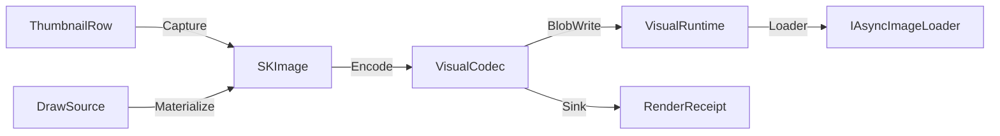

# [APPUI_VISUALS_OFFSCREEN]

Offscreen visuals are the package's raster rail: one DrawSource capsule projects every Skia canvas — host-leased or owned — through a Fin-railed Use, thumbnails and geometry previews materialize as SKImage through host-agnostic capture delegates, one codec surface encodes and decodes with content-hashed RenderReceipt evidence, one narrowed SKDocument surface carries the pure-visual vector-print arm, and one FFmpeg encode surface muxes frame streams into H.264/MP4 clips. The page owns the draw capsule, the thumbnail and preview row families, the encode axis with the ONE `ColorPolicy` gamut/transfer family, the vector-print arm, the video encode rows, and the RenderReceipt family the render-hash proof lanes and the AppHost telemetry spine consume. Document/Office/print export is `Document/export.md`'s — this page only rasters, encodes, and prints vectors. The package spine is SkiaSharp behind Avalonia.Skia leases, AsyncImageLoader display, and PanAndZoom preview navigation; HUD and viewport overlay drawing stays host-side.

## [01]-[INDEX]

- [02]-[DRAW_CAPSULE]: Borrowed and owned Skia canvas projection on one `Fin` rail.
- [03]-[THUMBNAIL_PIPELINE]: Host-agnostic capture rows, blob-backed cache, async display.
- [04]-[PREVIEW_SURFACES]: Receipt-to-path preview rows, backplates, zoomable viewing.
- [05]-[ENCODE_IDENTITY]: Codec axis, the one gamut/transfer family, content-hashed receipts.
- [06]-[VECTOR_PRINT]: The narrowed pure-visual `SKDocument` vector-print arm.
- [07]-[VIDEO_ENCODE]: FFmpeg mux/encode rows — frame stream to H.264/MP4.

## [02]-[DRAW_CAPSULE]

- Owner: `DrawSource` [Union] · `Offscreen` · `VisualFault` — the page's typed fault family on the `AppUiFaultBand.Visual` registry row (6160)
- Cases: Borrowed · Owned; `VisualFault` = LeaseBound | IccInvalid | XpsUnavailable | EncodeFailed
- Entry: `public Fin<T> Use<T>(Func<SKCanvas, Fin<T>> draw)` — Fin rail
- Auto: in-tree visuals lease the live canvas through `ISkiaSharpApiLeaseFeature.Lease` at render scope and fold to Borrowed; offscreen pipelines construct Owned with the target `SKImageInfo` and Materialize a snapshot.
- Packages: SkiaSharp, Avalonia.Skia, Thinktecture.Runtime.Extensions, LanguageExt.Core
- Growth: one effect row extends the FX table, and the in-tree vehicle is one `ICustomDrawOperation` implementation — `Bounds`, `HitTest(Point)`, `Render(ImmediateDrawingContext)` with the canvas leased through `ISkiaSharpApiLeaseFeature.Lease()` folding to Borrowed — zero new surface.
- Boundary: `Offscreen` is the named boundary capsule — the using-scoped `SKSurface` create-and-dispose pair is the only place a Skia surface is owned; a Borrowed lease draws into the host's in-flight frame and never materializes, so Materialize folds that arm to the LeaseBound error row; transforms compose as `SKMatrix` values inside `Save`/`Restore` scopes and no mutated canvas state survives a projection; FX-row effect natives construct once at token resolve and bind onto the long-lived paint, and gradient stops enter through `SKColorF` token paints under the color-managed law so a wide-gamut ramp never quantizes through the byte color path — a per-draw effect construction or a sRGB-lerped gradient is the deleted form; the custom-visual layout folds compose their projected `SKPath` through `Owned.Materialize` exactly as `PreviewRow.Render` does, so `Offscreen` stays the only Skia-surface owner and the custom-visual rail mints no second surface, encode, or capture owner; the GPU-accelerated offscreen path is the `Render/pipeline.md#RENDER_GRAPH` `RenderTargetFactory` backend column, so an offscreen dashboard or custom-tile draw under the `Wgpu` row encodes through the `Silk.NET.WebGPU` `RenderPipeline`/`CommandEncoder` wgpu surface and an offscreen draw under the `Software` row stays this `SKSurface.Create` CPU floor, the backend selection riding the one `GpuBackend` factory column and never a second offscreen-surface owner here — the in-tree `ICustomDrawOperation` Borrowed lease is the Skia-backend vehicle and the offscreen `Owned` capsule is the floor below the GPU factory.

```csharp signature
[Union(ConversionFromValue = ConversionOperatorsGeneration.None)]
public abstract partial record VisualFault : Expected {
    private VisualFault(string detail, int code) : base(detail, code) { }
    public sealed record LeaseBound()
        : VisualFault("visuals/lease-bound: a borrowed host lease draws into the live frame and never materializes", AppUiFaultBand.Visual.Code(0));
    public sealed record IccInvalid(string Key)
        : VisualFault($"visuals/icc-invalid: profile bytes for {Key} do not parse as an ICC profile", AppUiFaultBand.Visual.Code(1));
    public sealed record XpsUnavailable()
        : VisualFault("visuals/xps-unavailable: the loaded Skia native carries no XPS backend on this platform", AppUiFaultBand.Visual.Code(2));
    public sealed record EncodeFailed(string Stage)
        : VisualFault($"visuals/encode-failed: {Stage}", AppUiFaultBand.Visual.Code(3));
}

[Union(ConversionFromValue = ConversionOperatorsGeneration.None)]
public abstract partial record DrawSource {
    private DrawSource() { }
    public sealed record Borrowed(ISkiaSharpApiLease Lease) : DrawSource;
    public sealed record Owned(SKImageInfo Info) : DrawSource;

    public Fin<T> Use<T>(Func<SKCanvas, Fin<T>> draw) => Switch(
        state: draw,
        borrowed: static (paint, source) => paint(source.Lease.SkCanvas),
        owned: static (paint, source) => Offscreen.Rent(source.Info, paint));

    public Fin<SKImage> Materialize(Func<SKCanvas, Fin<Unit>> draw) => Switch(
        state: draw,
        borrowed: static (_, _) => Fin<SKImage>.Fail(Offscreen.LeaseBound),
        owned: static (paint, source) => Offscreen.Snapshot(source.Info, paint));
}

public static class Offscreen {
    public static readonly VisualFault LeaseBound = new VisualFault.LeaseBound();

    public static Fin<T> Rent<T>(SKImageInfo info, Func<SKCanvas, Fin<T>> draw) {
        using SKSurface surface = SKSurface.Create(info);
        return draw(surface.Canvas);
    }

    public static Fin<SKImage> Snapshot(SKImageInfo info, Func<SKCanvas, Fin<Unit>> draw) {
        using SKSurface surface = SKSurface.Create(info);
        return draw(surface.Canvas).Map(_ => surface.Snapshot());
    }
}
```

| [INDEX] | [FX_ROW]       | [FACTORY]                       | [CONSUMER]                          |
| :-----: | :------------- | :------------------------------ | :---------------------------------- |
|  [01]   | runtime-shader | `SKRuntimeEffect.CreateShader`  | animated backplates, gauge fills    |
|  [02]   | blur           | `SKImageFilter.CreateBlur`      | thumbnail elevation underlays       |
|  [03]   | dash           | `SKPathEffect.CreateDash`       | preview curve styling               |
|  [04]   | tint           | `SKColorFilter`                 | classification and state recoloring |
|  [05]   | mask           | `SKMaskFilter`                  | preview edge fades                  |
|  [06]   | gradient       | `SKShader.CreateLinearGradient` | preview fills, sparkline ramps      |

## [03]-[THUMBNAIL_PIPELINE]

- Owner: `VisualRuntime` · `ThumbnailRow` · `Thumbnails`
- Entry: `public static IO<RenderReceipt> Refresh(VisualRuntime runtime, ThumbnailRow row, (double Scale, int PixelSize) variant)` — IO rail
- Auto: capture delegates discriminate on the host row — the rhino row rides the `ViewCapture.CaptureToBitmap` capture delegate column an app root binds to the host, the gh2 row rides the host canvas-snapshot delegate column, and the empty host row materializes through `DrawSource.Owned`; display binds `AdvancedImage` to the runtime `Loader` with `FallbackImage` resolved from the row's placeholder and error keys; variant selection picks the table row whose Scale matches the mounted surface's scale fact.
- Receipt: every refresh lands one RenderReceipt of kind thumbnail carrying the blob artifact key as its destination.
- Packages: AsyncImageLoader.Avalonia, SkiaSharp, Rasm.AppHost (project), LanguageExt.Core, NodaTime
- Growth: one thumbnail row admits a new visual family; one variant row retunes scale and pixel policy values — zero new surface.
- Boundary: the memory cache is the `RamCachedWebImageLoader`-backed Loader and the durable cache is the blob lane behind the BlobWrite and BlobRead delegates — a second thumbnail cache is deleted; host bitmaps convert to `SKImage` exactly once at the port edge and no Eto or RhinoCommon bitmap type crosses into rows; the BundleWrite delegate is the support-contributor consequence, the Sink delegate is the receipt-sink envelope binding, and the Measure delegate records a named-instrument duration through the one `AppUiTelemetry.Contribute` spine so a phase elapsed distinct from the encode receipt rides the same telemetry surface, never a local meter.

```csharp signature
public sealed record VisualRuntime(
    CorrelationId Correlation,
    ProfileRoots Roots,
    ClockPolicy Clocks,
    IAsyncImageLoader Loader,
    Func<string, ReadOnlyMemory<byte>, IO<string>> BlobWrite,
    Func<string, IO<ReadOnlyMemory<byte>>> BlobRead,
    Func<string, DataClassification, ReadOnlyMemory<byte>, IO<string>> BundleWrite,
    Func<ReadOnlyMemory<byte>, string> ContentHash,
    Func<RenderReceipt, IO<Unit>> Sink,
    Func<string, string, Duration, IO<Unit>> Measure,
    Func<IO<Seq<NativeAssetFact>>> NativeIdentity);

public sealed record ThumbnailRow(
    string Key,
    string HostKind,
    Func<(double Scale, int PixelSize), IO<SKImage>> Capture,
    DataClassification Classification,
    string PlaceholderKey,
    string ErrorKey);

public static class Thumbnails {
    public static IO<RenderReceipt> Refresh(VisualRuntime runtime, ThumbnailRow row, (double Scale, int PixelSize) variant) =>
        from image in row.Capture(variant)
        from receipt in VisualCodec.Encode(runtime, image, VisualCodec.Png, "thumbnail", VariantKey(row, variant))
        select receipt;

    static string VariantKey(ThumbnailRow row, (double Scale, int PixelSize) variant) =>
        $"thumbnails/{row.Key}@{variant.Scale}x{variant.PixelSize}.png";
}
```



| [INDEX] | [VARIANT]      | [SCALE] | [PIXEL] |
| :-----: | :------------- | :------ | :------ |
|  [01]   | list           | 1.0     | 128     |
|  [02]   | list-retina    | 2.0     | 256     |
|  [03]   | gallery        | 1.0     | 256     |
|  [04]   | gallery-retina | 2.0     | 512     |

## [04]-[PREVIEW_SURFACES]

- Owner: `PreviewRow<TReceipt>`
- Entry: `public Fin<SKImage> Render(TReceipt receipt, SKImageInfo info)` — Fin rail
- Auto: zoomable previews mount inside `ZoomBorder` with `AutoFit` on load and `ZoomToRectangle` bound to the gesture rows; Underlay and Stroke delegates resolve once at row registration from the backplate table row and the paint-role key.
- Packages: SkiaSharp, PanAndZoom, LanguageExt.Core
- Growth: one preview row admits a new receipt family — geometry families from Compute mesh and curve receipt streams land as rows binding their Project folds; zero new surface.
- Boundary: Render is the named path-scope boundary capsule — the projected `SKPath` is using-scoped and never outlives the fold; HUD and viewport overlays stay host-side: Rhino and Grasshopper display conduits own all in-viewport drawing and AppUi never paints into a host viewport; TReceipt stays generic so no Compute receipt shape is re-modeled here.

```csharp signature
public sealed record PreviewRow<TReceipt>(
    string Key,
    Func<TReceipt, Fin<SKPath>> Project,
    string Backplate,
    string PaintRole,
    Func<SKCanvas, SKImageInfo, Fin<Unit>> Underlay,
    Func<SKCanvas, SKPath, Fin<Unit>> Stroke) {
    public Fin<SKImage> Render(TReceipt receipt, SKImageInfo info) =>
        Project(receipt).Bind(path => {
            using SKPath scoped = path;
            return new DrawSource.Owned(info).Materialize(canvas =>
                Underlay(canvas, info).Bind(_ => Stroke(canvas, scoped)));
        });
}
```

| [INDEX] | [BACKPLATE]  | [CELL] | [PAINT_ROLES]                     |
| :-----: | :----------- | :----- | :-------------------------------- |
|  [01]   | checkerboard | 8 px   | surface-check-a · surface-check-b |
|  [02]   | solid        | —      | surface                           |
|  [03]   | transparent  | —      | none                              |

## [05]-[ENCODE_IDENTITY]

- Owner: `RenderReceipt` · `NativeAssetFact` · `VisualCodec` — including `ColorPolicy`, the ONE suite gamut/transfer row family (`[V10]`).
- Entry: `public static IO<RenderReceipt> Encode(VisualRuntime runtime, SKImage image, EncodeRow row, string kind, string key)` — IO rail
- Auto: the runtime NativeIdentity delegate is filled by the mount transaction's load-identity probe and yields one `NativeAssetFact` per loaded native (libSkiaSharp, libHarfBuzzSharp) with version, path, and RID; the evidence stream folds the facts with kind native-asset.
- Receipt: FrameHash is the whole-payload content hash through the runtime ContentHash delegate — the delegate binds at composition to the kernel `Rasm.Domain` `ContentHash.Of(ReadOnlySpan<byte>) -> UInt128` seed-zero entry (the federation one-hasher; hex encoding stays this boundary's projection), so an AppUi-local `XxHash128` call site is the deleted form; quality values are the encode-row axis values — lossless png at 100, perceptual jpeg and webp at 90; the receipt's `ColorSpace` field is the encode-row working-space tag so a wide-gamut baseline keys distinctly from its sRGB twin and a cross-host byte swap is attributable, never silent.
- Packages: SkiaSharp, SkiaSharp.NativeAssets.macOS, SkiaSharp.NativeAssets.Linux.NoDependencies, Rasm.AppHost (project), Rasm (project), NodaTime, LanguageExt.Core
- Growth: one encode row admits a format; one policy value retunes quality; one `ColorPolicy` row retunes the working-and-output color-space pair; one `ToneMap` row admits an HDR-to-SDR operator; an ICC-profiled output is one `ColorPolicy.FromIcc` value from a profile-byte source — zero new surface.
- Boundary: Decode and Encode are the named native-disposal boundary capsules — the intermediate `SKBitmap`, the consumed `SKImage`, and the encoded `SKData` are using-scoped so a failing later clause never leaks a native handle, and Encode owns the image it consumes; per-format exporter classes are deleted with the encode rows as the absorbing axis; the `RenderReceipt` `Elapsed`, `Bytes`, and `FrameHash` fields project to the encode-duration span and byte-size metric on the AppHost telemetry spine through the runtime `Sink` bound to the `ReceiptSinkPort`, never a local meter or a second receipt vocabulary; render-hash proof lanes compare FrameHash values rendered on Skia-backed headless rows where `UseHeadlessDrawing` false selects real Skia drawing.
- Color law, float end-to-end:
  - The encode row carries a `ColorPolicy` whose `Working` space `Reproject` retags the consumed `SKImage` to its declared space through `SKImage.ColorSpace` and `SKImageInfo.WithColorSpace`, and whose `Output` space pins the encoded payload; `SKColorSpace.CreateSrgbLinear` is the composite-blend working space converted once at projection; `SKColorSpace.Equal` is the only color-space identity test; the reproject is fail-closed against an already-matching color space.
  - The byte `SKColor` path that assumes sRGB and quantizes before conversion is the deleted form — a wide-gamut render hashes its float pixels, never a quantized sRGB shadow; `SKColorF` carries token paints into the float pipeline.
  - `ColorPolicy` is THE single suite-wide gamut/transfer vocabulary — the six gamut rows `Display`, `WideGamut`, `DisplayP3`, `Rec2020`, `ScrgbFloat`, and `HdrPq` are the one family; the custom-visual rail's `ColorSpaceAxis` is a keyed PROJECTION of these rows (`Charts/custom.md`), never a parallel enum with divergent membership; the `RenderReceipt.ColorSpace` tag is one of the family keys so a cross-host byte swap is attributable to the exact gamut.
  - The ICC-tagged rows source `SKColorSpace.CreateRgb(SKColorSpaceTransferFn.Srgb, SKColorSpaceXyz.DisplayP3)` and `SKColorSpaceXyz.Rec2020` on the `Rgba8888` byte surface; the float row sources `SKColorSpace.CreateRgb(SKColorSpaceTransferFn.Linear, SKColorSpaceXyz.Srgb)` on the `RgbaF16` surface; the `Surface` column selects the reproject pixel format per row so the float row never truncates to bytes and the ICC rows never inflate to half-float.
  - HDR tone-mapping is the `ToneMap` smart-enum column on `ColorPolicy` — the `Aces`/`Reinhard`/`HableFilmic` curves are pure float operators sampled into a 256-entry `SKColorFilter.CreateTable` LUT bound onto the reproject paint exactly once at projection, so a scene-referred Rec.2020-PQ render tone-maps to the SDR output gamut through one filter pass; a per-pixel managed tone-map loop or a second display-mapping owner is the deleted form; the `HdrPq` row carries the `Aces` operator so an HDR baseline keys distinctly and its SDR projection is reproducible.
  - ICC profile management is `ColorPolicy.FromIcc` — an embedded or sidecar ICC profile parses through `SKColorSpace.CreateIcc(ReadOnlySpan<byte>)` into the working-and-output space so a display-calibrated profile drives the reproject without a seventh enum row; an unparseable profile folds to the `icc-invalid` error row rather than a silent sRGB fallback; an OpenColorIO config crosses the seam as a profile-byte source the caller resolves — AppUi consumes the profile bytes and never embeds an OCIO runtime; device-CMYK print transforms are `Document/export.md#PRINT_ARM`'s lcmsNET charter, disjoint from this display-referred family.

```csharp signature
public sealed record RenderReceipt(
    string Kind,
    string Format,
    string FrameHash,
    long Bytes,
    Duration Elapsed,
    CorrelationId Correlation,
    Option<string> Destination,
    string ColorSpace);

public sealed record NativeAssetFact(string Library, string Version, string Path, string Rid);

public static class VisualCodec {
    public static readonly EncodeRow Png = new("png", SKEncodedImageFormat.Png, 100, ColorPolicy.Display);
    public static readonly EncodeRow Jpeg = new("jpeg", SKEncodedImageFormat.Jpeg, 90, ColorPolicy.Display);
    public static readonly EncodeRow Webp = new("webp", SKEncodedImageFormat.Webp, 90, ColorPolicy.Display);
    public static readonly EncodeRow PngWide = new("png-wide", SKEncodedImageFormat.Png, 100, ColorPolicy.WideGamut);
    public static readonly EncodeRow PngP3 = new("png-p3", SKEncodedImageFormat.Png, 100, ColorPolicy.DisplayP3);
    public static readonly EncodeRow PngRec2020 = new("png-rec2020", SKEncodedImageFormat.Png, 100, ColorPolicy.Rec2020);
    public static readonly EncodeRow PngScrgb = new("png-scrgb", SKEncodedImageFormat.Png, 100, ColorPolicy.ScrgbFloat);
    public static readonly EncodeRow PngHdr = new("png-hdr", SKEncodedImageFormat.Png, 100, ColorPolicy.HdrPq);

    public sealed record ColorPolicy(string Key, Func<SKColorSpace> Working, Func<SKColorSpace> Output, SKColorType Surface, ToneMap Tone) {
        public static readonly ColorPolicy Display = new("srgb", SKColorSpace.CreateSrgb, SKColorSpace.CreateSrgb, SKColorType.Rgba8888, ToneMap.None);
        public static readonly ColorPolicy WideGamut = new("srgb-linear", SKColorSpace.CreateSrgbLinear, SKColorSpace.CreateSrgb, SKColorType.RgbaF16, ToneMap.None);
        public static readonly ColorPolicy DisplayP3 = new("display-p3", static () => SKColorSpace.CreateRgb(SKColorSpaceTransferFn.Srgb, SKColorSpaceXyz.DisplayP3), static () => SKColorSpace.CreateRgb(SKColorSpaceTransferFn.Srgb, SKColorSpaceXyz.DisplayP3), SKColorType.Rgba8888, ToneMap.None);
        public static readonly ColorPolicy Rec2020 = new("rec2020", static () => SKColorSpace.CreateRgb(SKColorSpaceTransferFn.Srgb, SKColorSpaceXyz.Rec2020), static () => SKColorSpace.CreateRgb(SKColorSpaceTransferFn.Srgb, SKColorSpaceXyz.Rec2020), SKColorType.Rgba8888, ToneMap.None);
        public static readonly ColorPolicy ScrgbFloat = new("scrgb-float", static () => SKColorSpace.CreateRgb(SKColorSpaceTransferFn.Linear, SKColorSpaceXyz.Srgb), static () => SKColorSpace.CreateRgb(SKColorSpaceTransferFn.Linear, SKColorSpaceXyz.Srgb), SKColorType.RgbaF16, ToneMap.None);
        public static readonly ColorPolicy HdrPq = new("rec2020-pq", static () => SKColorSpace.CreateRgb(SKColorSpaceTransferFn.Linear, SKColorSpaceXyz.Rec2020), static () => SKColorSpace.CreateRgb(SKColorSpaceTransferFn.Srgb, SKColorSpaceXyz.Rec2020), SKColorType.RgbaF16, ToneMap.Aces);

        public SKColorF Resolve(Color token) => new(token.R / 255f, token.G / 255f, token.B / 255f, token.A / 255f);

        public static Fin<ColorPolicy> FromIcc(string key, ReadOnlyMemory<byte> profile, SKColorType surface) =>
            Optional(SKColorSpace.CreateIcc(profile.Span)) is { IsSome: true, Case: SKColorSpace space }
                ? Fin.Succ(new ColorPolicy(key, () => space, () => space, surface, ToneMap.None))
                : Fin.Fail<ColorPolicy>(new VisualFault.IccInvalid(key));

        public Fin<SKImage> Reproject(SKImage image) {
            using SKColorSpace target = Output();
            using SKColorFilter? tone = Tone.Filter();
            return SKColorSpace.Equal(image.ColorSpace ?? SKColorSpace.CreateSrgb(), target) && tone is null
                ? Fin.Succ(image)
                : Offscreen.Snapshot(
                    new SKImageInfo(image.Width, image.Height, Surface, SKAlphaType.Premul).WithColorSpace(target),
                    canvas => {
                        using SKPaint paint = new() { ColorFilter = tone };
                        canvas.DrawImage(image, 0f, 0f, paint);
                        return FinSucc(unit);
                    });
        }
    }

    // The capture-time raster tone curve: a SkiaSharp per-channel float SKColorFilter LUT on the encode path. CHARTERED
    // DISTINCT from the appearance-domain csharp:Rasm.Materials/Appearance/surface#TONE_MAP ToneOperator (which grounds
    // path-traced RgbSpectrum radiance through Unicolour) — one tone-map owner per runtime, the shared Narkowicz/Reinhard
    // coefficients two runtimes implementing one published curve, never cross-owner drift and never a dependency either way.
    [SmartEnum<string>]
    public sealed partial class ToneMap {
        public static readonly ToneMap None = new("none", static _ => 1f);
        public static readonly ToneMap Reinhard = new("reinhard", static x => x / (1f + x));
        public static readonly ToneMap Aces = new("aces", static x => Math.Clamp((x * ((2.51f * x) + 0.03f)) / ((x * ((2.43f * x) + 0.59f)) + 0.14f), 0f, 1f));
        public static readonly ToneMap HableFilmic = new("hable", static x => (((x * ((0.15f * x) + 0.05f)) + 0.004f) / ((x * ((0.15f * x) + 0.50f)) + 0.06f)) - 0.0667f);

        private readonly Func<float, float> curve;

        public SKColorFilter? Filter() =>
            ReferenceEquals(this, None) ? null : SKColorFilter.CreateTable(Lut());

        private byte[] Lut() =>
            Enumerable.Range(0, 256)
                .Select(step => (byte)Math.Clamp((int)(curve(step / 255f) * 255f), 0, 255))
                .ToArray();
    }

    public sealed record EncodeRow(string Key, SKEncodedImageFormat Format, int Quality, ColorPolicy Color);

    public static IO<SKImage> Decode(ReadOnlyMemory<byte> payload) =>
        IO.lift(() => {
            using SKBitmap bitmap = SKBitmap.Decode(payload.Span);
            return SKImage.FromBitmap(bitmap);
        });

    public static IO<RenderReceipt> Encode(VisualRuntime runtime, SKImage image, EncodeRow row, string kind, string key) =>
        from mark in IO.lift(runtime.Clocks.Mark)
        from bytes in IO.lift(() => {
            using SKImage scoped = row.Color.Reproject(image).ThrowIfFail();
            using SKData encoded = scoped.Encode(row.Format, row.Quality);
            return encoded.ToArray();
        })
        from artifact in runtime.BlobWrite(key, bytes)
        from elapsed in IO.lift(() => runtime.Clocks.Elapsed(mark))
        let receipt = new RenderReceipt(kind, row.Key, runtime.ContentHash(bytes), bytes.LongLength, elapsed, runtime.Correlation, Optional(artifact), row.Color.Key)
        from _ in runtime.Sink(receipt)
        select receipt;
}
```

## [06]-[VECTOR_PRINT]

- Owner: `VisualExportSpec` · `VisualExport` — the pure-visual vector-print arm: precomposed canvas page folds through `SKDocument.CreatePdf`/`CreateXps`, nothing more.
- Entry: `public static IO<RenderReceipt> Export(VisualRuntime runtime, VisualExportSpec spec)` — IO rail.
- Auto: pages are precomposed `Func<SKCanvas, Fin<Unit>>` folds — vector content enters as picture content so vectors and text survive rather than rasterizing; delivery rides the `Document/export.md#EXPORT_DESTINATIONS` `VisualDestination` union.
- Receipt: one RenderReceipt of kind document per export with whole-payload content hash through the kernel-bound delegate and the delivered destination key.
- Packages: SkiaSharp, SkiaSharp.HarfBuzz, Rasm.AppHost (project), NodaTime, LanguageExt.Core
- Growth: one page-size row extends the table; zero new surface.
- Boundary: this arm is NARROWED to pure-visual vector printing — flow pagination, running bands, Office output, PDF security/signatures/AcroForms/UA, and print color are `Document/export.md`'s owners, and the hand-rolled `FlowBlock`/`FlowFold`/`HeaderFooterBand`/`BreakRule` pagination engine is DELETED for the MigraDoc flow DOM; Paged and Deliver are the named boundary capsules carrying statement bodies for SKDocument paging and byte delivery; the page fold is forward-only — `BeginPage` returns a canvas valid only until `EndPage`, `Close` finalizes, and the failure arm calls `Abort` explicitly so a paging fault neither commits nor disposes silently; `CreateXps` yields null where the Skia native carries no XPS backend, so the xps arm folds to the `XpsUnavailable` error row and pdf is the proven format on macOS and Linux profiles; QuestPDF, ImageSharp, and Magick.NET stay deleted with `SKDocument` and the codec axis as the absorbing owners; text drawn onto a page composes the shaping rail's `DrawShapedText` so glyphs shape through HarfBuzz before they raster.

```csharp signature
public sealed record VisualExportSpec(
    string Format,
    float PageWidth,
    float PageHeight,
    Seq<Func<SKCanvas, Fin<Unit>>> Pages,
    VisualDestination Destination);

public static class VisualExport {
    public static readonly VisualFault XpsUnavailable = new VisualFault.XpsUnavailable();

    public static IO<RenderReceipt> Export(VisualRuntime runtime, VisualExportSpec spec) =>
        from mark in IO.lift(runtime.Clocks.Mark)
        from payload in IO.lift(() => Paged(spec).ThrowIfFail())
        from destination in ExportDelivery.Deliver(runtime, spec.Destination, payload)
        from elapsed in IO.lift(() => runtime.Clocks.Elapsed(mark))
        let receipt = new RenderReceipt("document", spec.Format, runtime.ContentHash(payload), payload.LongLength, elapsed, runtime.Correlation, Optional(destination), VisualCodec.ColorPolicy.Display.Key)
        from _ in runtime.Sink(receipt)
        select receipt;

    static Fin<byte[]> Paged(VisualExportSpec spec) {
        using MemoryStream sink = new();
        SKDocument? document = spec.Format == "xps" ? SKDocument.CreateXps(sink) : SKDocument.CreatePdf(sink);
        if (document is null) { return Fin.Fail<byte[]>(XpsUnavailable); }
        using SKDocument scoped = document;
        return spec.Pages
            .Fold(FinSucc(unit), (rail, page) => rail.Bind(_ =>
                page(scoped.BeginPage(spec.PageWidth, spec.PageHeight)).Map(_ => { scoped.EndPage(); return unit; })))
            .Match(
                Succ: _ => { scoped.Close(); return Fin.Succ(sink.ToArray()); },
                Fail: error => { scoped.Abort(); return Fin.Fail<byte[]>(error); });
    }
}
```

| [INDEX] | [PAGE_ROW]       | [WIDTH_PT] | [HEIGHT_PT] |
| :-----: | :--------------- | :--------- | :---------- |
|  [01]   | a4-portrait      | 595        | 842         |
|  [02]   | a4-landscape     | 842        | 595         |
|  [03]   | letter-portrait  | 612        | 792         |
|  [04]   | letter-landscape | 792        | 612         |

## [07]-[VIDEO_ENCODE]

- Owner: `VideoEncodeRow` — the codec/container policy row; `ClipEncoder` — the in-process FFmpeg mux/encode surface a frame stream folds through.
- Entry: `public static IO<RenderReceipt> Mux(VisualRuntime runtime, VideoEncodeRow row, Seq<SKImage> frames, VisualDestination destination)` — IO rail; one clip per fold.
- Auto: frames convert RGBA -> `Yuv420p` through one `sws_getContext`/`sws_scale` pair constructed once per clip; the codec context configures H.264 through `avcodec_find_encoder`/`avcodec_alloc_context3`/`avcodec_open2`; the container muxes MP4 through `avformat_alloc_output_context2`/`avformat_new_stream`/`avformat_write_header`/`av_interleaved_write_frame`/`av_write_trailer`; the send/receive loop is `avcodec_send_frame`/`avcodec_receive_packet` with the flush-on-null terminal; the animation walkthrough's flythrough composes THESE rows past its frame-sequence terminal — the encode is capture's row, animation keeps the frame sequence (`Render/animation.md#WALKTHROUGH`), and the tour clip render rides the same route.
- Receipt: one RenderReceipt of kind clip per mux with whole-payload content hash and the delivered destination key; per-frame hashes stay animation's walkthrough proof.
- Packages: FFmpeg.AutoGen, SkiaSharp, Rasm.AppHost (project), LanguageExt.Core
- Growth: a new codec or container is one `VideoEncodeRow` (codec id, pixel format, container name, bitrate policy); zero new surface.
- Boundary: FFmpeg binds through `DynamicallyLoadedBindings` with the native FFmpeg shipped as LGPL-configured dynamic-linked libraries (the catalog boundary fact); every native context (`AVFormatContext`, `AVCodecContext`, `AVFrame`, `AVPacket`, `SwsContext`) allocates and frees inside the one encode fold so a failing clause never leaks a native handle; a second video pipeline, a shell-out to an ffmpeg binary, or a per-consumer encoder is the deleted form — this is the ONE in-process mux/encode owner.

```csharp signature
public sealed record VideoEncodeRow(string Key, AVCodecID Codec, AVPixelFormat PixelFormat, string Container, int Fps, long BitRate) {
    public static readonly VideoEncodeRow H264Mp4 = new("h264-mp4", AVCodecID.AV_CODEC_ID_H264, AVPixelFormat.AV_PIX_FMT_YUV420P, "mp4", 30, 8_000_000);
}

public static class ClipEncoder {
    public const string Kind = "clip";

    public static IO<RenderReceipt> Mux(VisualRuntime runtime, VideoEncodeRow row, Seq<SKImage> frames, VisualDestination destination) =>
        from mark in IO.lift(runtime.Clocks.Mark)
        from payload in IO.lift(() => Encode(row, frames))
        from delivered in ExportDelivery.Deliver(runtime, destination, payload)
        from elapsed in IO.lift(() => runtime.Clocks.Elapsed(mark))
        let receipt = new RenderReceipt(Kind, row.Key, runtime.ContentHash(payload), payload.LongLength, elapsed, runtime.Correlation, Optional(delivered), VisualCodec.ColorPolicy.Display.Key)
        from _ in runtime.Sink(receipt)
        select receipt;

    static Exception Fault(string stage) => ((Error)new VisualFault.EncodeFailed(stage)).ToException();

    static int Guard(int code, string stage) => code >= 0 ? code : throw Fault($"{stage}: {code}");

    // ONE statement-bodied boundary kernel per the boundary-kernel law: alloc muxer/encoder/frame/packet/
    // sws, write header, per-frame convert -> send -> receive -> mux, null-frame flush terminal, trailer,
    // teardown in reverse ownership order. Faults throw typed VisualFault the IO.lift rail captures.
    static unsafe byte[] Encode(VideoEncodeRow row, Seq<SKImage> frames) {
        SKImage first = frames.Head.Match(Some: static image => image, None: () => throw Fault("empty frame stream"));
        (int width, int height) = (first.Width, first.Height);
        string sink = Path.Combine(Path.GetTempPath(), $"rasm-clip-{Guid.CreateVersion7():N}.{row.Container}");
        AVFormatContext* mux = null;
        AVCodecContext* codec = null;
        AVFrame* frame = null;
        AVPacket* packet = null;
        SwsContext* sws = null;
        try {
            Guard(ffmpeg.avformat_alloc_output_context2(&mux, null, row.Container, sink), "mux-alloc");
            AVCodec* encoder = ffmpeg.avcodec_find_encoder(row.Codec);
            if (encoder is null) { throw Fault($"encoder-absent: {row.Codec}"); }
            codec = ffmpeg.avcodec_alloc_context3(encoder);
            codec->width = width;
            codec->height = height;
            codec->pix_fmt = row.PixelFormat;
            codec->time_base = new AVRational { num = 1, den = row.Fps };
            codec->framerate = new AVRational { num = row.Fps, den = 1 };
            codec->bit_rate = row.BitRate;
            Guard(ffmpeg.avcodec_open2(codec, encoder, null), "codec-open");
            AVStream* stream = ffmpeg.avformat_new_stream(mux, encoder);
            if (stream is null) { throw Fault("stream-alloc"); }
            stream->time_base = codec->time_base;
            Guard(ffmpeg.avcodec_parameters_from_context(stream->codecpar, codec), "codec-params");
            frame = ffmpeg.av_frame_alloc();
            frame->width = width;
            frame->height = height;
            frame->format = (int)row.PixelFormat;
            Guard(ffmpeg.av_frame_get_buffer(frame, 0), "frame-buffer");
            packet = ffmpeg.av_packet_alloc();
            sws = ffmpeg.sws_getContext(width, height, AVPixelFormat.AV_PIX_FMT_RGBA, width, height, row.PixelFormat, ffmpeg.SWS_BILINEAR, null, null, null);
            if (sws is null) { throw Fault("sws-alloc"); }
            Guard(ffmpeg.avio_open(&mux->pb, sink, ffmpeg.AVIO_FLAG_WRITE), "io-open");
            Guard(ffmpeg.avformat_write_header(mux, null), "header");
            long pts = 0;
            foreach (SKImage image in frames) {
                using SKBitmap pixels = SKBitmap.FromImage(image);
                Guard(ffmpeg.av_frame_make_writable(frame), "frame-writable");
                byte*[] source = [(byte*)pixels.GetPixels(), null, null, null];
                int[] strides = [pixels.RowBytes, 0, 0, 0];
                Guard(ffmpeg.sws_scale(sws, source, strides, 0, height, frame->data, frame->linesize), "sws-scale");
                frame->pts = pts++;
                Drain(mux, codec, stream, packet, frame);
            }
            Drain(mux, codec, stream, packet, null); // null-frame flush terminal
            Guard(ffmpeg.av_write_trailer(mux), "trailer");
            Guard(ffmpeg.avio_closep(&mux->pb), "io-close");
            return File.ReadAllBytes(sink);
        }
        finally {
            if (sws is not null) { ffmpeg.sws_freeContext(sws); }
            if (packet is not null) { ffmpeg.av_packet_free(&packet); }
            if (frame is not null) { ffmpeg.av_frame_free(&frame); }
            if (codec is not null) { ffmpeg.avcodec_free_context(&codec); }
            if (mux is not null) {
                // avformat_free_context never closes an avio_open handle: a mid-encode fault must still
                // release the sink; closep nulls pb, so this is a no-op after the success-path close.
                if (mux->pb is not null) { _ = ffmpeg.avio_closep(&mux->pb); }
                ffmpeg.avformat_free_context(mux);
            }
            File.Delete(sink);
        }
    }

    static unsafe void Drain(AVFormatContext* mux, AVCodecContext* codec, AVStream* stream, AVPacket* packet, AVFrame* frame) {
        Guard(ffmpeg.avcodec_send_frame(codec, frame), "send-frame");
        for (int received = ffmpeg.avcodec_receive_packet(codec, packet);
             received != ffmpeg.AVERROR(ffmpeg.EAGAIN) && received != ffmpeg.AVERROR_EOF;
             received = ffmpeg.avcodec_receive_packet(codec, packet)) {
            Guard(received, "receive-packet");
            packet->pts = ffmpeg.av_rescale_q(packet->pts, codec->time_base, stream->time_base);
            packet->dts = ffmpeg.av_rescale_q(packet->dts, codec->time_base, stream->time_base);
            packet->stream_index = stream->index;
            Guard(ffmpeg.av_interleaved_write_frame(mux, packet), "mux-write");
            ffmpeg.av_packet_unref(packet);
        }
    }
}
```

## [08]-[RESEARCH]

- [ICC_TONEMAP]: the `SKColorSpace.CreateIcc(ReadOnlySpan<byte>)` ICC-profile parse returning a tagged color space, the `SKColorFilter.CreateTable(byte[])` 256-entry LUT-filter arity the `ToneMap.Filter` builds, and the `SKImageInfo.WithColorSpace` ICC round-trip preservation resolve at implementation against the installed SkiaSharp 3 surface; the `ColorPolicy.FromIcc` fence, the `ToneMap` curve operators, and the reproject paint binding are settled, the exact `CreateIcc`/`CreateTable` member shapes are the unverified surface.
