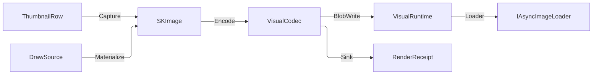

# [APPUI_VISUALS_OFFSCREEN]

Offscreen visuals are the package's raster rail: one DrawSource capsule projects every Skia canvas — host-leased or owned — through a Fin-railed Use, thumbnails and geometry previews materialize as SKImage through host-agnostic capture delegates, one codec surface encodes and decodes with content-hashed RenderReceipt evidence, one narrowed SKDocument surface carries the pure-visual vector-print arm, and one FFmpeg encode surface muxes frame streams into H.264/MP4 clips. Ownership spans the draw capsule, the thumbnail and preview row families, the encode axis with the ONE `ColorPolicy` gamut/transfer family, the vector-print arm, the video encode rows, and the RenderReceipt family the render-hash proof lanes and the AppHost telemetry spine consume. Document/Office/print export is `Document/export.md`'s — this page only rasters, encodes, and prints vectors. SkiaSharp behind Avalonia.Skia leases, AsyncImageLoader display, and PanAndZoom preview navigation form the package spine; HUD and viewport overlay drawing stays host-side.

## [01]-[INDEX]

- [02]-[DRAW_CAPSULE]: Borrowed and owned Skia canvas projection on one `Fin` rail; the FX vocabulary and its one token-resolve paint catalog.
- [03]-[THUMBNAIL_PIPELINE]: Host-agnostic capture rows, blob-backed cache, async display.
- [04]-[PREVIEW_SURFACES]: Receipt-to-path preview rows, catalog-resolved backplates, zoomable viewing.
- [05]-[ENCODE_IDENTITY]: Codec axis, the one gamut/transfer family, content-hashed receipts.
- [06]-[VECTOR_PRINT]: Narrowed pure-visual `SKDocument` vector-print arm.
- [07]-[VIDEO_ENCODE]: FFmpeg mux/encode rows — frame stream to H.264/MP4.

## [02]-[DRAW_CAPSULE]

- Owner: `DrawSource` [Union] · `FxRow` [Union] — the effect vocabulary · `FxEffect` [Union] — the built native · `LayerGround` [Union] and `LayerSpec` — the save-layer parameter surface · `EffectTokens` · `PaintSpec` · `PaintCatalog` — the one token-resolve fold · `Offscreen` · `VisualFault` — the page's typed fault family on the `AppUiFaultBand.Visual` registry row (6160)
- Cases: `DrawSource` = Borrowed | Owned; `FxRow` = Ground | Checker | Dashes; `FxEffect` = Shading | Imaging | Pathing | Coloring; `LayerGround` = Filtered | Previous; `VisualFault` = LeaseBound | IccInvalid | XpsUnavailable | EncodeFailed | SurfaceAllocationFailed | GamutUndeclared | TokenQuantized | CatalogMiss
- Entry: `public Fin<T> Use<T>(Func<SKCanvas, Fin<T>> draw)` — Fin rail; `public Fin<T> Layered<T>(PaintCatalog paints, LayerSpec spec, Func<SKCanvas, Fin<T>> draw)` — the same rail bracketed by the ONE save-layer site, its whole parameter surface carried as one spec value; `public static Fin<PaintCatalog> Of(EffectTokens tokens, Seq<PaintSpec> specs)` — the one resolve.
- Auto: in-tree visuals lease the live canvas through `ISkiaSharpApiLeaseFeature.Lease` at render scope and fold to Borrowed; offscreen pipelines construct Owned with the target `SKImageInfo` and Materialize a snapshot; `Layered` opens `SaveLayer(in SKCanvasSaveLayerRec)` from the spec's own fold — a `Filtered` ground supplying the catalog's frozen filter to the `Backdrop` slot and a `Previous` ground taking `InitializeWithPrevious` instead — and restores on every exit path; `PaintCatalog.Of` folds every distinct `FxRow` a spec names into its native ONCE, mints one role paint per `PaintSpec` under the policy's one working space, binds each spec's FX seq onto that single paint, and carries the generation it is building beside the fault it parks so a refused spec releases every native already minted through the one teardown ordering instead of stranding a partial generation the withheld catalog was the only reach to.
- Law: a pigment is addressed by the `Theme/tokens#TOKEN_CATALOG` `TokenKey` its generation minted and never by a composed string — `PaintSpec.Pigment`, the checker row's two cell keys, and `EffectTokens.Pigment` all take that owner's value, so a spec naming a rung the ladder never emitted refuses where the key is composed rather than resolving to a catalog miss at draw time; the draw-site `Role` stays this catalog's own string vocabulary, because a role addresses a PAINT and a pigment addresses a COLOUR and one string type over both lets each be spelled with the other's name.
- Packages: SkiaSharp, Avalonia.Skia, Thinktecture.Runtime.Extensions, LanguageExt.Core
- Growth: a new effect kind is one `FxRow` case with its one `FxEffect` slot arm; a new frosted-surface treatment is one `FxRow.Ground` value; a new layer posture is one `LayerGround` case; a new painted role is one `PaintSpec` row; the in-tree vehicle is one `ICustomDrawOperation` implementation — `Bounds`, `HitTest(Point)`, `Render(ImmediateDrawingContext)` with the canvas leased through `ISkiaSharpApiLeaseFeature.Lease()` folding to Borrowed — zero new surface.
- Boundary: `Offscreen` is the named boundary capsule — the using-scoped `SKSurface` create-and-dispose pair is the only place a Skia surface is owned; a Borrowed lease draws into the host's in-flight frame and never materializes, so Materialize folds that arm to the LeaseBound error row; transforms compose as `SKMatrix` values inside `Save`/`Restore` scopes and no mutated canvas state survives a projection; a ground-sampling effect rides `Layered` and never a paint `ImageFilter` — a paint filter transforms the draw and leaves the ground untouched, so a frosted panel spelled that way silently renders as an unblurred overlay; `PaintCatalog` is the OWNER of the FX law — every effect native and every role paint mints once per theme generation into a frozen value a draw reads, gradient stops enter through `SKColorF` pigments the policy's own gamut row projects, and a per-draw `new SKPaint()`, a per-draw effect construction, or an sRGB-lerped ramp is the deleted form; a row whose native no fence binds is deleted with the table rather than carried as a roster, and the encode-path tone curve stays the `ColorPolicy.ToneMap` column; runtime-SkSL compilation partitions by TYPE DOMAIN and neither half lands here — `Render/shading#SHADER_ASSET` owns the per-`GpuBackend` appearance-shader cache with its plane residency and VRAM budget, `Vfx/shader#EFFECT_PROGRAM` owns the 2D chrome program roster with its per-frame uniform rebinding, and the parameters this catalogue freezes for a whole generation are exactly the ones neither of those caches holds; the custom-visual layout folds compose their projected `SKPath` through `Owned.Materialize` exactly as `PreviewRow.Render` does, so `Offscreen` stays the only Skia-surface owner and the custom-visual rail mints no second surface, encode, or capture owner; the GPU-accelerated offscreen path is the `Render/pipeline#RENDER_GRAPH` `GpuBackend` target-factory column, so an offscreen dashboard or custom-tile draw under the `Wgpu` row encodes through the `Silk.NET.WebGPU` `RenderPipeline`/`CommandEncoder` wgpu surface and an offscreen draw under the `Software` row stays this `SKSurface.Create` CPU floor, the backend selection riding the one `GpuBackend` factory column and never a second offscreen-surface owner here — the in-tree `ICustomDrawOperation` Borrowed lease is the Skia-backend vehicle and the offscreen `Owned` capsule is the floor below the GPU factory.

```csharp signature
[Union(ConversionFromValue = ConversionOperatorsGeneration.None)]
public abstract partial record VisualFault : Expected {
    private VisualFault(string detail, int code) : base(detail, code) { }
    public sealed record LeaseBound()
        : VisualFault("visuals/lease-bound: a borrowed host lease draws into the live frame and never materializes", AppUiFaultBand.Visual.Code(0));
    public sealed record IccInvalid(string Key)
        : VisualFault($"visuals/icc-invalid: profile bytes for {Key} do not parse as an ICC profile", AppUiFaultBand.Visual.Code(1));
    public sealed record XpsUnavailable()
        : VisualFault("visuals/xps-unavailable: the loaded Skia native carries no XPS backend on this platform", AppUiFaultBand.Visual.Code(2));
    public sealed record EncodeFailed(string Stage)
        : VisualFault($"visuals/encode-failed: {Stage}", AppUiFaultBand.Visual.Code(3));
    public sealed record SurfaceAllocationFailed(int Width, int Height)
        : VisualFault($"visuals/surface-allocation: {Width}x{Height}", AppUiFaultBand.Visual.Code(4));
    public sealed record GamutUndeclared(string Key)
        : VisualFault($"visuals/gamut-undeclared: policy {Key} names no RgbProfile row a float pigment projects through", AppUiFaultBand.Visual.Code(5));
    public sealed record TokenQuantized(string Key)
        : VisualFault($"visuals/token-quantized: an 8-bit sRGB token colour cannot widen into the {Key} working space", AppUiFaultBand.Visual.Code(6));
    public sealed record CatalogMiss(string Key)
        : VisualFault($"visuals/catalog-miss: {Key} is absent from the frozen paint catalog", AppUiFaultBand.Visual.Code(7));
}

[Union(ConversionFromValue = ConversionOperatorsGeneration.None)]
public abstract partial record DrawSource {
    private DrawSource() { }
    public sealed record Borrowed(ISkiaSharpApiLease Lease) : DrawSource;
    public sealed record Owned(SKImageInfo Info) : DrawSource;

    public Fin<T> Use<T>(Func<SKCanvas, Fin<T>> draw) => Switch(
        state: draw,
        borrowed: static (paint, source) => paint(source.Lease.SkCanvas),
        owned: static (paint, source) => Offscreen.Rent(source.Info, paint));

    public Fin<SKImage> Materialize(Func<SKCanvas, Fin<Unit>> draw) => Switch(
        state: draw,
        borrowed: static (_, _) => Fin<SKImage>.Fail(Offscreen.LeaseBound),
        owned: static (paint, source) => Offscreen.Snapshot(source.Info, paint));

    // Backdrop is why SaveLayer takes a REC: SKCanvasSaveLayerRec.Backdrop filters what the canvas
    // ALREADY holds before the nested draw composites over it, which a paint's ImageFilter cannot
    // express — a paint filter transforms the draw, never the ground beneath it. Restore pops the layer
    // on the failure path as well, so a refused nested draw never strands a saved layer. The filter is a
    // CATALOG READ, not a construction: the ground native minted once at token resolve and the layer
    // borrows it, so a frosted panel repainted per frame builds nothing. Both source cases carry the
    // operation because a frosted in-tree panel and an offscreen thumbnail underlay are one operation on
    // two canvases. This is the ONE SaveLayer site in the package and `LayerSpec` is its whole parameter
    // surface, so a second layer opened at a draw site is unrepresentable.
    public Fin<T> Layered<T>(PaintCatalog paints, LayerSpec spec, Func<SKCanvas, Fin<T>> draw) =>
        spec.Rec(paints).Bind(rec => Use(canvas => {
            SKCanvasSaveLayerRec opened = rec;
            canvas.SaveLayer(in opened);
            try { return draw(canvas); }
            finally { canvas.Restore(); }
        }));
}

// The ground a layer opens on, as a CLOSED two-arm choice rather than a nullable filter beside a flag set:
// `Filtered` fills the Backdrop slot so the destination pixels run through the frozen ground filter INTO the
// layer, while `Previous` leaves that slot null and takes InitializeWithPrevious, copying the same pixels
// unfiltered. The two are mutually defeating — a rec carrying both filters the ground and then overwrites it
// with the raw copy — and a rec carrying neither opens on transparent black and erases everything beneath.
[Union(ConversionFromValue = ConversionOperatorsGeneration.None)]
public abstract partial record LayerGround {
    private LayerGround() { }
    public sealed record Filtered(FxRow.Ground Row) : LayerGround;
    public sealed record Previous() : LayerGround;

    public static readonly LayerGround Frosted = new Filtered(FxRow.Frosted);
    public static readonly LayerGround Acrylic = new Filtered(FxRow.Acrylic);
    public static readonly LayerGround Card = new Filtered(FxRow.Card);
    public static readonly LayerGround Copy = new Previous();
}

// The whole save-layer parameter surface. Bounds are the CONTENT's own extent — a layer bounded to the
// surface pays a full-surface offscreen for a panel-sized treatment — and `Composite` names the catalog role
// whose paint composites the layer back on restore, so a layer opacity is a resolved token rather than a
// per-draw paint. `PreserveText` keeps LCD glyph coverage through the layer and is legal ONLY over opaque
// ground, so a translucent caller passes false rather than fringing every glyph against content the layer
// never composited.
public sealed record LayerSpec(SKRect Bounds, LayerGround Ground, Option<string> Composite, bool PreserveText) {
    public Fin<SKCanvasSaveLayerRec> Rec(PaintCatalog paints) =>
        from ground in Ground.Switch(
            state: paints,
            filtered: static (catalog, arm) => catalog.Backdrop(arm.Row).Map(Option<SKImageFilter>.Some),
            previous: static (_, _) => Fin.Succ(Option<SKImageFilter>.None))
        from composite in Composite.Match(
            Some: role => paints.Paint(role).Map(Option<SKPaint>.Some),
            None: () => Fin.Succ(Option<SKPaint>.None))
        select new SKCanvasSaveLayerRec {
            Bounds = Bounds,
            Backdrop = ground.ValueUnsafe(),
            Paint = composite.ValueUnsafe(),
            Flags = (ground.IsNone ? SKCanvasSaveLayerRecFlags.InitializeWithPrevious : SKCanvasSaveLayerRecFlags.None)
                | (PreserveText ? SKCanvasSaveLayerRecFlags.PreserveLcdText : SKCanvasSaveLayerRecFlags.None),
        };
}

// ONE effect vocabulary, closed over the three paint slots a fence on this page actually binds. Payload is
// per-occurrence — a ground filter carries sigma and edge policy, a checker two pigments and a cell, a dash
// its interval run — so the family is a [Union] and the named rows below are its canonical values, each
// carrying its parameters as ROW DATA rather than a nullable column bag one shared row would need. A frosted
// panel, an acrylic flyout, and a dimmed modal ground differ by
// sigma and edge policy ALONE, so each is one value and none is a call-site literal; Clamp bleeds the ground
// outward under a full-bleed panel while Decal keeps a hard boundary under an inset card whose ground must
// not smear past its bounds.
[Union(ConversionFromValue = ConversionOperatorsGeneration.None)]
public abstract partial record FxRow(string Key) {
    public sealed record Ground(string Key, float Sigma, SKShaderTileMode Tile) : FxRow(Key);
    public sealed record Checker(string Key, TokenKey Light, TokenKey Dark, int CellPx) : FxRow(Key);
    public sealed record Dashes(string Key, ImmutableArray<float> Intervals, float Phase) : FxRow(Key);

    // The three canonical grounds type as Ground, not as the base: `DrawSource.Layered` and
    // `PaintCatalog.Backdrop` both take a `Ground`, so a base-typed field would need a downcast at every call
    // site and the compile-time guarantee the narrow parameter states would buy nothing. Checker and Dashes
    // stay base-typed because their consumers take the family.
    public static readonly Ground Frosted = new("frosted", Sigma: 12f, Tile: SKShaderTileMode.Clamp);
    public static readonly Ground Acrylic = new("acrylic", Sigma: 30f, Tile: SKShaderTileMode.Clamp);
    public static readonly Ground Card = new("card", Sigma: 8f, Tile: SKShaderTileMode.Decal);
    // The two cells are two RUNGS of the one surface ladder, minted by the role that generates them: a
    // checkerboard is a tonal step, so an authored `surface-check-a` string names a rung the generation never
    // emits and resolves to nothing the moment the token owner is the only key mint.
    public static readonly FxRow Check = new Checker("check", Light: PaintRole.Surface.At(0), Dark: PaintRole.Surface.At(1), CellPx: 8);
    public static readonly FxRow Dashed = new Dashes("dashed", [3f, 2f], Phase: 0f);

    // The ONE mint. Every arm reads its pigments through EffectTokens, which projects them through the
    // policy's own gamut row, so an effect colour is a float SKColorF in the working space and the byte
    // SKColor overloads — which assume sRGB and quantize — have no call site here. A geometry-dependent
    // shader (a linear ramp over a draw's own extent) is unrepresentable BY DESIGN: a resolve-once frozen
    // native cannot carry an extent the draw supplies, so an extent-varying fill rides a token pigment
    // through ColorPolicy.Resolve rather than a per-draw shader rebuild.
    public Fin<FxEffect> Build(EffectTokens tokens) => Switch(
        state: tokens,
        ground: static (_, g) => Fin.Succ<FxEffect>(
            new FxEffect.Imaging(SKImageFilter.CreateBlur(g.Sigma, g.Sigma, g.Tile))),
        checker: static (t, c) => t.Pigment(c.Light).Bind(light => t.Pigment(c.Dark).Bind(dark => Tiled(t, c, light, dark))),
        dashes: static (_, d) => Fin.Succ<FxEffect>(new FxEffect.Pathing(SKPathEffect.CreateDash([.. d.Intervals], d.Phase))));

    // The checkerboard is ONE repeating two-cell tile the shader repeats across whatever extent the ground
    // covers, so a 4k backplate costs one 2x2-cell image rather than a per-cell rect fold. The tile rasters
    // through Offscreen like every other owned surface on this page, and the image rides the effect case
    // because a sampled shader owns two natives and releasing the source at construction samples freed pixels.
    private static Fin<FxEffect> Tiled(EffectTokens tokens, Checker row, SKColorF light, SKColorF dark) =>
        Offscreen.Snapshot(
            new SKImageInfo(row.CellPx * 2, row.CellPx * 2, tokens.Policy.Surface, SKAlphaType.Premul).WithColorSpace(tokens.Working),
            canvas => {
                using SKPaint pale = new();
                using SKPaint deep = new();
                pale.SetColor(light, tokens.Working);
                deep.SetColor(dark, tokens.Working);
                float cell = row.CellPx;
                canvas.DrawRect(new SKRect(0f, 0f, cell, cell), pale);
                canvas.DrawRect(new SKRect(cell, cell, cell * 2f, cell * 2f), pale);
                canvas.DrawRect(new SKRect(cell, 0f, cell * 2f, cell), deep);
                canvas.DrawRect(new SKRect(0f, cell, cell, cell * 2f), deep);
                return Fin.Succ(unit);
            })
        .Map(static image => (FxEffect)new FxEffect.Shading(
            SKShader.CreateImage(image, SKShaderTileMode.Repeat, SKShaderTileMode.Repeat), Some(image)));
}

// The built native, one case per paint slot. A sampled shader owns TWO natives — the shader and the image it
// samples — so the source rides its case and releases with it.
[Union(ConversionFromValue = ConversionOperatorsGeneration.None)]
public abstract partial record FxEffect {
    private FxEffect() { }
    public sealed record Shading(SKShader Native, Option<SKImage> Source) : FxEffect;
    public sealed record Imaging(SKImageFilter Native) : FxEffect;
    public sealed record Pathing(SKPathEffect Native) : FxEffect;
    public sealed record Coloring(SKColorFilter Native) : FxEffect;

    // ONE paint composes the whole pipeline: each effect writes its own slot and hands the paint back, so a
    // dashed, tiled, blurred role is one Fold over its FX seq onto one paint. The slot writes are the named
    // boundary-capsule statement seam. The colour slot is a paint slot like the other three — a per-pixel
    // transform bound as an image filter forces an offscreen for a transform that needs none.
    public SKPaint BindTo(SKPaint paint) => Switch(
        state: paint,
        shading: static (p, s) => { p.Shader = s.Native; return p; },
        imaging: static (p, i) => { p.ImageFilter = i.Native; return p; },
        pathing: static (p, e) => { p.PathEffect = e.Native; return p; },
        coloring: static (p, c) => { p.ColorFilter = c.Native; return p; });

    // Only an image filter can filter the GROUND a SaveLayer composites over; the other slots transform the
    // DRAW. A colour transform lifts into a ground through `SKImageFilter.CreateColorFilter` at the caller
    // that needs it, so this projection stays the identity read and mints nothing.
    public Option<SKImageFilter> Ground => Switch(
        shading: static _ => Option<SKImageFilter>.None,
        imaging: static i => Some(i.Native),
        pathing: static _ => Option<SKImageFilter>.None,
        coloring: static _ => Option<SKImageFilter>.None);

    // Release order is ownership order: the shader first, then the image it sampled.
    public Unit Release() => Switch(
        shading: static s => { s.Native.Dispose(); s.Source.Iter(static image => image.Dispose()); return unit; },
        imaging: static i => fun(i.Native.Dispose)(),
        pathing: static e => fun(e.Native.Dispose)(),
        coloring: static c => fun(c.Native.Dispose)());
}

// The resolve input: the published theme generation, the resolved token maps the specs name, the colour
// policy every pigment projects through, and the ONE working space minted for the whole generation so
// SKColorSpace.Equal identity holds across every native and the catalog has one space to release rather than
// one per pigment.
public sealed record EffectTokens(int Generation, ResolvedTheme Theme, VisualCodec.ColorPolicy Policy, SKColorSpace Working) {
    public static EffectTokens Of(int generation, ResolvedTheme theme, VisualCodec.ColorPolicy policy) =>
        new(generation, theme, policy, policy.Working());

    // The token edge. A theme paint is an 8-bit display-referred value, so it crosses through the policy's
    // own byte admission and reaches a paint as a float SKColorF — never through SKPaint.Color, which assumes
    // sRGB and quantizes before any conversion. The key is the `Theme/tokens#TOKEN_CATALOG` `TokenKey` the
    // resolved bucket is actually addressed by, so a spec naming a rung the generation never emitted refuses
    // at the mint that composes it rather than at this lookup — a string parameter here re-opened exactly the
    // composed-key miss the one key mint forecloses, and it did not type against the frozen bucket at all.
    public Fin<SKColorF> Pigment(TokenKey key) =>
        (Theme.Paints.TryGetValue(key, out Color token) ? Some(token) : Option<Color>.None)
            .ToFin(new VisualFault.CatalogMiss(key))
            .Bind(Policy.Resolve);
}

// A painted role: the pigment key its colour reads, the stroke geometry, and the FX rows bound onto its one
// paint. Consumers declare rows; nothing constructs a paint at a draw site. The two keys are DIFFERENT
// vocabularies and stay so: `Role` is this catalog's own draw-site address, minted and read by the declaring
// page alone, while `Pigment` is the token owner's generated `TokenKey` — collapsing them onto one string
// would let a draw site address a paint by a colour name and a colour by a role name.
public sealed record PaintSpec(string Role, TokenKey Pigment, float StrokeWidth, SKPaintStyle Style, Seq<FxRow> Effects);

// The ONE token-resolve fold and the owner the [02] paint law was missing. Freeze is TOTAL — a spec naming a
// pigment the resolved theme lacks refuses at construction, so no draw path carries a fallback chain — and
// Release tears one whole generation down in ownership order, paints before the natives their slots hold.
public sealed record PaintCatalog(EffectTokens Tokens, HashMap<string, FxEffect> Effects, HashMap<string, SKPaint> Roles) {
    public int Generation => Tokens.Generation;

    // The mint is a CUSTODY fold: it threads the catalog it is building beside the fault it parks, so a
    // refusal short-circuits every later row with the whole partial generation still in hand and tears it
    // down through the SAME `Release` ordering a live catalog dies by. `TraverseM` is the deleted operator
    // here — it aborts INSIDE the traversal, and the only value that can reach the natives already minted is
    // exactly the catalog the refusal withholds, so a spec refused halfway strands every effect shader, every
    // sampled image, every paint built before it, and the generation's own working space with no owner at
    // all. That is the largest leak this page can produce and it is invisible at the call site, which is the
    // shape the thumbnail bracket law names one section down. The effect map is complete when the role fold
    // runs — both folds walk the specs the same fold already built the effects from — so a role binds its
    // rows by lookup with nothing to miss.
    public static Fin<PaintCatalog> Of(EffectTokens tokens, Seq<PaintSpec> specs) =>
        specs.Fold(
            specs.Bind(static spec => spec.Effects).Distinct().Fold(
                (Held: new PaintCatalog(tokens, HashMap<string, FxEffect>(), HashMap<string, SKPaint>()), Fault: Option<Error>.None),
                static (state, row) => state.Fault.IsSome ? state : row.Build(state.Held.Tokens).Match(
                    Succ: effect => state with { Held = state.Held with { Effects = state.Held.Effects.AddOrUpdate(row.Key, effect) } },
                    Fail: error => state with { Fault = Some(error) })),
            static (state, spec) => state.Fault.IsSome ? state : Minted(state.Held, spec).Match(
                Succ: paint => state with { Held = state.Held with { Roles = state.Held.Roles.AddOrUpdate(spec.Role, paint) } },
                Fail: error => state with { Fault = Some(error) }))
        switch {
            (var unfinished, { IsSome: true, Case: Error refused }) => (ignore(unfinished.Release()), Fin<PaintCatalog>.Fail(refused)).Item2,
            var sealedGeneration => Fin.Succ(sealedGeneration.Held),
        };

    public Fin<SKPaint> Paint(string role) =>
        Roles.Find(role).ToFin(new VisualFault.CatalogMiss(role));

    public Fin<SKImageFilter> Backdrop(FxRow.Ground row) =>
        Effects.Find(row.Key).Bind(static effect => effect.Ground).ToFin(new VisualFault.CatalogMiss(row.Key));

    // One teardown body, reached by the refusal above and by the generation's own end alike: paints first,
    // then the natives their slots held, then the one working space the generation minted.
    public Unit Release() {
        toSeq(Roles.Values).Iter(static paint => paint.Dispose());
        toSeq(Effects.Values).Iter(static effect => ignore(effect.Release()));
        Tokens.Working.Dispose();
        return unit;
    }

    private static Fin<SKPaint> Minted(PaintCatalog held, PaintSpec spec) =>
        held.Tokens.Pigment(spec.Pigment).Map(pigment => {
            SKPaint paint = new() { Style = spec.Style, StrokeWidth = spec.StrokeWidth, IsAntialias = true };
            paint.SetColor(pigment, held.Tokens.Working);
            return spec.Effects.Fold(paint, (bound, row) => held.Effects.Find(row.Key).Match(
                Some: effect => effect.BindTo(bound),
                None: () => bound));
        });
}

public static class Offscreen {
    public static readonly VisualFault LeaseBound = new VisualFault.LeaseBound();

    public static Fin<T> Rent<T>(SKImageInfo info, Func<SKCanvas, Fin<T>> draw) {
        SKSurface? candidate = SKSurface.Create(info);
        if (candidate is null) { return Fin<T>.Fail(new VisualFault.SurfaceAllocationFailed(info.Width, info.Height)); }
        using SKSurface surface = candidate;
        return draw(surface.Canvas);
    }

    public static Fin<SKImage> Snapshot(SKImageInfo info, Func<SKCanvas, Fin<Unit>> draw) {
        SKSurface? candidate = SKSurface.Create(info);
        if (candidate is null) { return Fin<SKImage>.Fail(new VisualFault.SurfaceAllocationFailed(info.Width, info.Height)); }
        using SKSurface surface = candidate;
        return draw(surface.Canvas).Map(_ => surface.Snapshot());
    }
}
```

Every row below is minted by `FxRow.Build` at token resolve and bound by `PaintCatalog`; the producer column names the fence that binds it.

| [INDEX] | [FX_CASE] | [VALUES]                 | [NATIVE]                   | [PRODUCER]                                  |
| :-----: | :-------- | :----------------------- | :------------------------- | :------------------------------------------ |
|  [01]   | `Ground`  | frosted · acrylic · card | `SKImageFilter.CreateBlur` | `LayerGround.Filtered` backdrop arm         |
|  [02]   | `Checker` | check                    | `SKShader.CreateImage`     | `BackplateRow.Checkerboard` preview ground  |
|  [03]   | `Dashes`  | dashed                   | `SKPathEffect.CreateDash`  | `Render/drafting#DRAFT_EMIT` edge-style set |

## [03]-[THUMBNAIL_PIPELINE]

- Owner: `VisualRuntime` · `ThumbnailSource` · `ThumbnailVariant` · `ThumbnailRow` · `Thumbnails`
- Entry: `public static IO<RenderReceipt> Refresh(VisualRuntime runtime, ThumbnailRow row, ThumbnailVariant variant)` — IO rail
- Auto: capture delegates discriminate on the host row — the rhino row rides the `ViewCapture.CaptureToBitmap` capture delegate column an app root binds to the host, the gh2 row rides the host canvas-snapshot delegate column, and the empty host row materializes through `DrawSource.Owned`; display binds `AdvancedImage` to the runtime `Loader` with `FallbackImage` resolved from the row's placeholder and error keys; variant selection picks the table row whose Scale matches the mounted surface's scale fact.
- Receipt: every refresh lands one RenderReceipt of kind thumbnail carrying the blob artifact key as its destination.
- Packages: AsyncImageLoader.Avalonia, SkiaSharp, Rasm.AppHost (project), LanguageExt.Core, NodaTime
- Growth: one thumbnail row admits a new visual family; one variant row retunes scale and pixel policy values — zero new surface.
- Boundary: the memory cache is the `RamCachedWebImageLoader`-backed `Loader`, and the durable cache is the blob lane behind `BlobWrite`/`BlobRead`; admitting `DiskCachedWebImageLoader` creates a second durable owner and is rejected. Host bitmaps convert to `SKImage` exactly once at the port edge, and no Eto or RhinoCommon bitmap type crosses into rows. `BundleWrite`, `Sink`, and `Measure` bind support evidence, receipt delivery, and named duration to the existing AppHost ports.

```csharp signature
public sealed record VisualRuntime(
    CorrelationId Correlation,
    ProfileRoots Roots,
    ClockPolicy Clocks,
    IAsyncImageLoader Loader,
    Func<string, ReadOnlyMemory<byte>, IO<string>> BlobWrite,
    Func<string, IO<ReadOnlyMemory<byte>>> BlobRead,
    Func<string, DataClassification, ReadOnlyMemory<byte>, IO<string>> BundleWrite,
    Func<ReadOnlySpan<byte>, string> ContentHash,
    Func<RenderReceipt, IO<Unit>> Sink,
    Func<string, string, Duration, IO<Unit>> Measure);

[SmartEnum<string>]
public sealed partial class ThumbnailSource {
    public static readonly ThumbnailSource Rhino = new("rhino");
    public static readonly ThumbnailSource Grasshopper = new("grasshopper");
    public static readonly ThumbnailSource Owned = new("owned");
}

[SmartEnum<string>]
public sealed partial class ThumbnailVariant {
    public static readonly ThumbnailVariant List = new("list", 1d, 128);
    public static readonly ThumbnailVariant ListRetina = new("list-retina", 2d, 256);
    public static readonly ThumbnailVariant Gallery = new("gallery", 1d, 256);
    public static readonly ThumbnailVariant GalleryRetina = new("gallery-retina", 2d, 512);

    public double Scale { get; }

    public int PixelSize { get; }
}

public sealed record ThumbnailRow(
    string Key,
    ThumbnailSource Source,
    Func<ThumbnailVariant, IO<SKImage>> Capture,
    DataClassification Classification,
    string PlaceholderKey,
    string ErrorKey);

public static class Thumbnails {
    // Encode borrows; the capture-minted image is this fold's to release. Release brackets the ACQUISITION,
    // never the success arm — a dispose smuggled through a `.Map` tuple projection runs only when the encode
    // succeeded, so every failed encode leaks a native image and the leak is invisible at the call site.
    public static IO<RenderReceipt> Refresh(VisualRuntime runtime, ThumbnailRow row, ThumbnailVariant variant) =>
        row.Capture(variant).Bracket(
            image => VisualCodec.Encode(runtime, image, VisualCodec.Png, "thumbnail", VariantKey(row, variant)),
            static image => IO.lift(() => { image.Dispose(); return unit; }));

    private static string VariantKey(ThumbnailRow row, ThumbnailVariant variant) =>
        $"thumbnails/{row.Source.Key}/{row.Key}/{variant.Key}@{variant.Scale}x{variant.PixelSize}.png";
}
```


```mermaid
---
config:
  layout: elk
  flowchart:
    curve: linear
    padding: 25
---
flowchart LR
    accTitle: Thumbnail capture flow
    accDescr: Host capture or owned drawing produces an image that encodes into a receipt and display cache.
    ThumbnailRow -->|Capture| SKImage
    DrawSource -->|Materialize| SKImage
    SKImage -->|Encode| VisualCodec
    VisualCodec -->|BlobWrite| VisualRuntime
    VisualCodec -->|Sink| RenderReceipt
    VisualRuntime -->|Loader| IAsyncImageLoader
```

| [INDEX] | [VARIANT]      | [SCALE] | [PIXEL] |
| :-----: | :------------- | :------ | :------ |
|  [01]   | list           | 1.0     | 128     |
|  [02]   | list-retina    | 2.0     | 256     |
|  [03]   | gallery        | 1.0     | 256     |
|  [04]   | gallery-retina | 2.0     | 512     |

## [04]-[PREVIEW_SURFACES]

- Owner: `BackplateRow` `[SmartEnum<string>]` the ground vocabulary; `PreviewRow<TReceipt>`; `PreviewSurfaces` — the page's `PaintSpec` rows.
- Entry: `public Fin<SKImage> Render(PaintCatalog paints, TReceipt receipt, SKImageInfo info)` — Fin rail
- Auto: zoomable previews mount inside `ZoomBorder` with `AutoFit` on load and `ZoomToRectangle` bound to the gesture rows; a row names its backplate row and its stroke role and reads BOTH paints off the frozen catalog, so the ground fill and the curve stroke resolve once per theme generation.
- Packages: SkiaSharp, PanAndZoom, LanguageExt.Core
- Growth: one preview row admits a new receipt family — geometry families from Compute mesh and curve receipt streams land as rows binding their Project folds; a new ground is one `BackplateRow` value plus its one `PaintSpec`; zero new surface.
- Boundary: Render is the named path-scope boundary capsule — the projected `SKPath` is using-scoped and never outlives the fold; the ground and the stroke are CATALOG reads, so a preview mints no paint and no effect at draw time and the transparent row draws nothing rather than filling with a sentinel colour; HUD and viewport overlays stay host-side: Rhino and Grasshopper display conduits own all in-viewport drawing and AppUi never paints into a host viewport; TReceipt stays generic so no Compute receipt shape is re-modeled here.

```csharp signature
// The ground is a ROW naming the catalog role that paints it, so the resolved-delegate pair the prior shape
// carried BESIDE its two key strings — resolvable from nothing at construction — is deleted. Transparent
// carries no role at all, so "no ground" is the absent option rather than a paint the fold must recognize.
[SmartEnum<string>]
public sealed partial class BackplateRow {
    public static readonly BackplateRow Checkerboard = new("checkerboard", Some("backplate-check"));
    public static readonly BackplateRow Solid = new("solid", Some("backplate-solid"));
    public static readonly BackplateRow Transparent = new("transparent", Option<string>.None);

    public Option<string> Role { get; }
}

public sealed record PreviewRow<TReceipt>(
    string Key,
    Func<TReceipt, Fin<SKPath>> Project,
    BackplateRow Backplate,
    string PaintRole) {
    public Fin<SKImage> Render(PaintCatalog paints, TReceipt receipt, SKImageInfo info) =>
        Project(receipt).Bind(path => {
            using SKPath scoped = path;
            return paints.Paint(PaintRole).Bind(stroke => new DrawSource.Owned(info).Materialize(canvas =>
                Backplate.Role
                    .Match(
                        Some: role => paints.Paint(role).Map(ground => {
                            canvas.DrawRect(new SKRect(0f, 0f, info.Width, info.Height), ground);
                            return unit;
                        }),
                        None: static () => Fin.Succ(unit))
                    .Map(_ => {
                        canvas.DrawPath(scoped, stroke);
                        return unit;
                    })));
        });
}

// The page's own catalog rows: the checkerboard ground binds the FX tile, the solid ground binds none, and
// the curve stroke is the one stroked role. A composition root concatenates these with every other owner's
// rows into ONE PaintCatalog.Of call, so the whole product resolves its paints in one fold per generation.
public static class PreviewSurfaces {
    public static readonly Seq<PaintSpec> Paints = Seq(
        new PaintSpec("backplate-check", PaintRole.Surface.At(0), 0f, SKPaintStyle.Fill, Seq(FxRow.Check)),
        new PaintSpec("backplate-solid", PaintRole.Surface.At(0), 0f, SKPaintStyle.Fill, Seq<FxRow>()),
        new PaintSpec("preview-curve", PaintRole.Text.At(0), 1.5f, SKPaintStyle.Stroke, Seq<FxRow>()));
}
```

| [INDEX] | [BACKPLATE]  | [ROLE]          | [PIGMENT]                         | [FX]          |
| :-----: | :----------- | :-------------- | :-------------------------------- | :------------ |
|  [01]   | checkerboard | backplate-check | `PaintRole.Surface` rungs 0 and 1 | `FxRow.Check` |
|  [02]   | solid        | backplate-solid | `PaintRole.Surface` rung 0        | —             |
|  [03]   | transparent  | —               | —                                 | —             |

## [05]-[ENCODE_IDENTITY]

- Owner: `RenderReceipt` · `NativeAssetFact` · `VisualCodec` — including `ColorPolicy`, the one suite gamut-and-transfer row family.
- Entry: `public static IO<RenderReceipt> Encode(VisualRuntime runtime, SKImage image, EncodeRow row, string kind, string key, Option<SKPicture> record = default)` — IO rail, the optional sealed record the one draw-hash ingress; `public static IO<SKImage> Decode(ReadOnlyMemory<byte> payload, Option<int> frame = default)` — the inverse on the same rail, frame index the modality; `public Fin<SKColorF> Resolve(PerceptualColor pigment)` and its `Color` token twin — the one pigment egress every paint reads.
- Receipt: FrameHash is the whole-payload content hash through the runtime ContentHash delegate — the delegate binds at composition to the kernel `Rasm.Domain` `ContentHash.Of(ReadOnlySpan<byte>) -> UInt128` seed-zero entry (the federation one-hasher; hex encoding stays this boundary's projection), so an AppUi-local `XxHash128` call site is the deleted form; quality values are the encode-row axis values — lossless png at 100, perceptual jpeg and webp at 90; the receipt's `ColorSpace` field is the encode-row working-space tag so a wide-gamut baseline keys distinctly from its sRGB twin and a cross-host byte swap is attributable, never silent; `DrawHash` is the second evidence axis, folding `SKPicture.Serialize` op bytes through the same delegate exactly when the caller hands its sealed record in, so a golden break reads as a rasterizer move or a content move rather than as a bare inequality, and a recordless encode leaves it `None` because an absent attribution beats a fabricated one.
- Packages: SkiaSharp, SkiaSharp.NativeAssets.macOS, SkiaSharp.NativeAssets.Linux.NoDependencies, Rasm.AppHost (project), Rasm (project — the kernel `ContentHash.Of` seed-zero entry, the `RgbProfile` working-space roster every `ColorPolicy` row names, and the `PerceptualColor.OfRgb`/`ToRgb(RgbProfile)` admission-and-egress pair `Resolve` composes), NodaTime, LanguageExt.Core
- Growth: one encode row admits a format; one policy value retunes quality; one `ColorPolicy` row retunes the working-and-output color-space pair over the kernel `RgbProfile` row it names, so a gamut the kernel roster lacks lands there FIRST; one `ToneMap` row admits an HDR-to-SDR operator; an ICC-profiled output is one `ColorPolicy.FromIcc` value from a profile-byte source — zero new surface.
- Boundary: Decode and Encode are the named native-disposal boundary capsules — Decode admits through the `SKCodec.Create` result taxonomy (`Info`-gated allocation, `IncompleteInput` as partial success gated on the incremental arm's own rows-decoded count, the frame arm through `SKCodecOptions.FrameIndex` alone) and never an eager whole-image `SKBitmap.Decode` — `PriorFrame` is a PROMISE that the destination already holds that frame and this buffer is minted per call, so the codec resolves its own required-frame chain and a caller-named prior frame is the deleted form that composites over uninitialized memory, and the intermediate `SKBitmap`, the minted reprojection, and the encoded `SKData` are scope-released so a failing later clause never leaks a native handle, and Encode BORROWS the caller's image: it disposes only the projection `Reproject` mints (`Some` arm) and never the pass-through original (`None` arm), so a walkthrough frame encoded per-frame survives to its later clip mux and a thumbnail image stays valid for its display bind; per-format exporter classes are deleted with the encode rows as the absorbing axis; the `RenderReceipt` `Elapsed`, `Bytes`, and `FrameHash` fields project to the encode-duration span and byte-size metric on the AppHost telemetry spine through the runtime `Sink` bound to the `ReceiptSinkPort`, never a local meter or a second receipt vocabulary; render-hash proof lanes compare FrameHash values rendered on Skia-backed headless rows where `UseHeadlessDrawing` false selects real Skia drawing.
- Color law, float end-to-end:
  - Each encode row carries a `ColorPolicy` whose `Working` space is the interpretation frame `Reproject` retags the borrowed `SKImage` into through `SKImage.ColorSpace` and `SKImageInfo.WithColorSpace`, and whose `Output` space pins the encoded payload.
  - `SKColorSpace.CreateSrgbLinear` is the composite-blend working space, converted to the output space once at projection rather than blending in a non-linear space and correcting after.
  - `SKColorSpace.Equal` is the only color-space identity test — reference equality passes distinct handles describing one space, and a null space means passthrough, fast and exactly wrong for evidence.
  - Ownership is the result shape: `Reproject` returns `Fin<Option<SKImage>>` where `None` states the caller's image is already conformant and stays caller-owned while `Some` carries the minted projection its consumer owns and disposes, so the identity arm can never route a borrowed image into an owned-resource `using`.
  - Byte `SKColor` paths that assume sRGB and quantize before conversion are the deleted form — a wide-gamut render hashes its float pixels, never a quantized sRGB shadow; `SKColorF` carries token paints into the float pipeline.
  - Each declared row's `Gamut` names the kernel `RgbProfile` row it encodes — `Display`/`WideGamut`/`ScrgbFloat` the sRGB primaries, `DisplayP3` and `Rec2020` their own, `HdrPq` the `Rec2100Pq` row whose `DynamicRange` IS the PQ reference white — so `SKColorSpace.Equal` identity here and `Configuration` identity in the perceptual owner adjudicate one gamut vocabulary rather than two rosters that can silently disagree; the transfer curves stay two owners by the same charter the tone-map split declares, Skia holding the encode curve and Unicolour the appearance model.
  - `ColorPolicy.Resolve` is the ONE pigment egress: it projects a kernel `PerceptualColor` through `PerceptualColor.ToRgb(RgbProfile)` — the profile-parameterized float quadruple, not the sRGB byte twin — under the row the policy's `Gamut` names, so every paint, gradient stop, and backplate colour on this page is float in the policy's own working space; the ICC lane's `None` states that the profile bytes ARE the space, so `Resolve` refuses there instead of projecting through a nearest-declared-row fiction, and an ICC-bound working space crosses to the perceptual owner as those same bytes through `IccConfiguration(byte[], Intent, name)`, the one currency both runtimes admit, never a re-parsed sidecar per runtime.
  - The byte token edge is a typed REFUSAL, never a widen: an Avalonia `Color` carries 8-bit sRGB display-referred channels by construction, so it admits only where the policy's own gamut IS the sRGB row; widening one into `DisplayP3`, `Rec2020`, or `HdrPq` would label a quantized sRGB shadow as wide-gamut colour, which is exactly the fiction the byte-path law above deletes, so a wide-gamut ramp can only be built from float pigments.
  - `ColorPolicy` is THE single suite-wide gamut/transfer vocabulary — the six gamut rows `Display`, `WideGamut`, `DisplayP3`, `Rec2020`, `ScrgbFloat`, and `HdrPq` are the one family; the custom-visual rail's `ColorSpaceAxis` is a keyed PROJECTION of these rows (`Charts/custom.md`), never a parallel enum with divergent membership; the `RenderReceipt.ColorSpace` tag is one of the family keys so a cross-host byte swap is attributable to the exact gamut.
  - ICC-tagged rows source `SKColorSpace.CreateRgb(SKColorSpaceTransferFn.Srgb, SKColorSpaceXyz.DisplayP3)` and `SKColorSpaceXyz.Rec2020` on the `Rgba8888` byte surface; the float row sources `SKColorSpace.CreateRgb(SKColorSpaceTransferFn.Linear, SKColorSpaceXyz.Srgb)` on the `RgbaF16` surface; the `Surface` column selects the reproject pixel format per row so the float row never truncates to bytes and the ICC rows never inflate to half-float.
  - HDR tone-mapping is the `ToneMap` smart-enum column on `ColorPolicy` — the `Aces`/`Reinhard`/`HableFilmic` curves are pure float operators sampled into a 256-entry `SKColorFilter.CreateTable(byte[])` LUT bound onto the reproject paint exactly once at projection, so a scene-referred Rec.2020-PQ render tone-maps to the SDR output gamut through one filter pass.
  - Two forms delete beside that column: a per-pixel managed tone-map loop and a second display-mapping owner; the `HdrPq` row carries the `Aces` operator so an HDR baseline keys distinctly and its SDR projection is reproducible.
  - `ColorPolicy.FromIcc` owns ICC profile management — an embedded or sidecar profile validates through `SKColorSpace.CreateIcc(ReadOnlySpan<byte>)` at admission and the row retains the immutable profile BYTES rather than one shared space, so `Working` and `Output` each mint an independently owned `SKColorSpace` its own consumer disposes and a display-calibrated profile drives the reproject without a seventh enum row; an unparseable profile folds to the `icc-invalid` error row rather than a silent sRGB fallback.
  - OpenColorIO configs cross the seam as a profile-byte source the caller resolves, so AppUi consumes the bytes and never embeds an OCIO runtime; device-CMYK print transforms are `Document/export#PRINT_ARM`'s lcmsNET charter, disjoint from this display-referred family.

```csharp signature
// Two hashes, two questions. FrameHash is the encoded-pixel identity. DrawHash is the recorded
// draw-op identity, present exactly when the source sealed an SKPicture, so a golden break that moves
// pixels while holding draw ops attributes to the rasterizer or the driver and one that moves both is
// a real content change. A capture that recorded nothing carries None — an unattributed break, never
// a forged attribution.
public sealed record RenderReceipt(
    string Kind,
    string Format,
    string FrameHash,
    Option<string> DrawHash,
    long Bytes,
    Duration Elapsed,
    CorrelationId Correlation,
    Option<string> Destination,
    string ColorSpace);

// The load-identity currency this page OWNS and does not produce. Its one producer is the `Shell/hosts`
// `NativeAssets.Identity` census, taken inside the mount transaction before attach, and composition seals each
// present row as `Diagnostics/evidence`'s `EvidenceReceipt.NativeAssetIdentity`. A runtime delegate here that
// re-probed the loaded modules would be a second producer of one fact — the same deleted twin the hosts owner
// forecloses one level down for the record shape — and its answer would be the process state at encode time
// rather than the identity the mount admitted.
public sealed record NativeAssetFact(string Library, string Version, string Path, string Rid);

public static class VisualCodec {
    public static readonly EncodeRow Png = new("png", SKEncodedImageFormat.Png, 100, ColorPolicy.Display);
    public static readonly EncodeRow Jpeg = new("jpeg", SKEncodedImageFormat.Jpeg, 90, ColorPolicy.Display);
    public static readonly EncodeRow Webp = new("webp", SKEncodedImageFormat.Webp, 90, ColorPolicy.Display);
    public static readonly EncodeRow PngWide = new("png-wide", SKEncodedImageFormat.Png, 100, ColorPolicy.WideGamut);
    public static readonly EncodeRow PngP3 = new("png-p3", SKEncodedImageFormat.Png, 100, ColorPolicy.DisplayP3);
    public static readonly EncodeRow PngRec2020 = new("png-rec2020", SKEncodedImageFormat.Png, 100, ColorPolicy.Rec2020);
    public static readonly EncodeRow PngScrgb = new("png-scrgb", SKEncodedImageFormat.Png, 100, ColorPolicy.ScrgbFloat);
    public static readonly EncodeRow PngHdr = new("png-hdr", SKEncodedImageFormat.Png, 100, ColorPolicy.HdrPq);

    // Gamut names the kernel RgbProfile row this policy encodes, so the Skia-side space vocabulary and the
    // Unicolour-side working-space roster are ONE vocabulary named twice — a policy row for a gamut the kernel
    // roster does not hold is unspellable, and a float colour crossing in from the perceptual owner knows the
    // exact profile to project through (PerceptualColor.ToRgb(policy.Gamut)) instead of guessing from a key
    // string. Transfer curves stay separate owners by charter: Skia carries the encode curve and Unicolour
    // carries the appearance model, two runtimes stating one gamut. None rides the ICC lane because a profile's
    // own space is not a declared roster row — profile BYTES are the space, and that absence is the fact a
    // consumer reads rather than a nearest-row fiction.
    public sealed record ColorPolicy(string Key, Option<RgbProfile> Gamut, Func<SKColorSpace> Working, Func<SKColorSpace> Output, SKColorType Surface, ToneMap Tone) {
        public static readonly ColorPolicy Display = new("srgb", Some(RgbProfile.Srgb), SKColorSpace.CreateSrgb, SKColorSpace.CreateSrgb, SKColorType.Rgba8888, ToneMap.None);
        public static readonly ColorPolicy WideGamut = new("srgb-linear", Some(RgbProfile.Srgb), SKColorSpace.CreateSrgbLinear, SKColorSpace.CreateSrgb, SKColorType.RgbaF16, ToneMap.None);
        public static readonly ColorPolicy DisplayP3 = new("display-p3", Some(RgbProfile.DisplayP3), static () => SKColorSpace.CreateRgb(SKColorSpaceTransferFn.Srgb, SKColorSpaceXyz.DisplayP3), static () => SKColorSpace.CreateRgb(SKColorSpaceTransferFn.Srgb, SKColorSpaceXyz.DisplayP3), SKColorType.Rgba8888, ToneMap.None);
        public static readonly ColorPolicy Rec2020 = new("rec2020", Some(RgbProfile.Rec2020), static () => SKColorSpace.CreateRgb(SKColorSpaceTransferFn.Srgb, SKColorSpaceXyz.Rec2020), static () => SKColorSpace.CreateRgb(SKColorSpaceTransferFn.Srgb, SKColorSpaceXyz.Rec2020), SKColorType.Rgba8888, ToneMap.None);
        public static readonly ColorPolicy ScrgbFloat = new("scrgb-float", Some(RgbProfile.Srgb), static () => SKColorSpace.CreateRgb(SKColorSpaceTransferFn.Linear, SKColorSpaceXyz.Srgb), static () => SKColorSpace.CreateRgb(SKColorSpaceTransferFn.Linear, SKColorSpaceXyz.Srgb), SKColorType.RgbaF16, ToneMap.None);
        public static readonly ColorPolicy HdrPq = new("rec2020-pq", Some(RgbProfile.Rec2100Pq), static () => SKColorSpace.CreateRgb(SKColorSpaceTransferFn.Pq, SKColorSpaceXyz.Rec2020), static () => SKColorSpace.CreateRgb(SKColorSpaceTransferFn.Srgb, SKColorSpaceXyz.Rec2020), SKColorType.RgbaF16, ToneMap.Aces);

        // Two ingresses, ONE projection. A kernel PerceptualColor is float and profile-free, so it projects
        // through whatever gamut row this policy names; an Avalonia token Color is 8-bit sRGB by
        // construction, so it admits only where that row IS sRGB. The prior byte divide widened quantized
        // display channels into every policy — a wide-gamut render then hashed an sRGB shadow labelled as
        // scene-referred colour, the exact form the colour law two clauses up deletes. The ICC lane names no
        // roster row at all and refuses rather than picking a nearest one.
        public Fin<SKColorF> Resolve(PerceptualColor pigment) =>
            Gamut.Match(
                Some: profile => pigment.ToRgb(profile) switch {
                    var (red, green, blue, alpha) =>
                        Fin.Succ(new SKColorF((float)red, (float)green, (float)blue, (float)alpha)),
                },
                None: () => Fin.Fail<SKColorF>(new VisualFault.GamutUndeclared(Key)));

        public Fin<SKColorF> Resolve(Color token) =>
            Gamut.ToFin(new VisualFault.GamutUndeclared(Key))
                .Bind(profile => ReferenceEquals(profile, RgbProfile.Srgb)
                    ? PerceptualColor.OfRgb(token.R, token.G, token.B, token.A / (double)byte.MaxValue)
                    : Fin.Fail<PerceptualColor>(new VisualFault.TokenQuantized(Key)))
                .Bind(Resolve);

        public static Fin<ColorPolicy> FromIcc(string key, ReadOnlyMemory<byte> profile, SKColorType surface) {
            byte[] bytes = profile.ToArray();
            using SKColorSpace? probe = SKColorSpace.CreateIcc(bytes);
            return probe is null
                ? Fin.Fail<ColorPolicy>(new VisualFault.IccInvalid(key))
                : Fin.Succ(new ColorPolicy(
                    key,
                    None,
                    () => SKColorSpace.CreateIcc(bytes)!,
                    () => SKColorSpace.CreateIcc(bytes)!,
                    surface,
                    ToneMap.None));
        }

        // None = already conformant, the caller's image stays caller-owned; Some = a minted projection the
        // consumer owns and disposes. The identity arm never re-owns a borrowed image.
        public Fin<Option<SKImage>> Reproject(SKImage image) {
            using SKColorSpace working = Working();
            using SKColorSpace target = Output();
            using SKColorFilter? tone = Tone.Filter();
            // Each row's WORKING space is the interpretation frame for an untagged source — sRGB is never
            // assumed, so the HdrPq and WideGamut rows realize their declared working behavior and the
            // conformance test compares the interpreted source against the output space.
            SKColorSpace source = image.ColorSpace ?? working;
            return SKColorSpace.Equal(source, target) && tone is null
                ? Fin.Succ(Option<SKImage>.None)
                : Offscreen.Snapshot(
                    new SKImageInfo(image.Width, image.Height, Surface, SKAlphaType.Premul).WithColorSpace(target),
                    canvas => {
                        using SKPaint paint = new() { ColorFilter = tone };
                        canvas.DrawImage(image, 0f, 0f, paint);
                        return Fin.Succ(unit);
                    }).Map(Some);
        }
    }

    // Capture-time raster tone curve: a SkiaSharp per-channel float SKColorFilter LUT on the encode path. CHARTERED
    // DISTINCT from the appearance-domain csharp:Rasm.Materials/Appearance/surface#TONE_MAP ToneOperator (which grounds
    // path-traced RgbSpectrum radiance through Unicolour) — one tone-map owner per runtime, the shared Narkowicz/Reinhard
    // coefficients two runtimes implementing one published curve, never cross-owner drift and never a dependency either way.
    [SmartEnum<string>]
    public sealed partial class ToneMap {
        // The identity curve. `Filter` short-circuits this row to a null filter, so the delegate is never
        // invoked — which is exactly why it has to state a truth: a curve mapping every input to a constant
        // one is a claim about the row's semantics that no arm could ever take, and the first consumer to
        // sample the table instead of asking `Filter` would blow every channel to white.
        public static readonly ToneMap None = new("none", static x => x);
        public static readonly ToneMap Reinhard = new("reinhard", static x => x / (1f + x));
        public static readonly ToneMap Aces = new("aces", static x => Math.Clamp((x * ((2.51f * x) + 0.03f)) / ((x * ((2.43f * x) + 0.59f)) + 0.14f), 0f, 1f));
        public static readonly ToneMap HableFilmic = new("hable", static x => (((x * ((0.15f * x) + 0.05f)) + 0.004f) / ((x * ((0.15f * x) + 0.50f)) + 0.06f)) - 0.0667f);

        private readonly Func<float, float> curve;

        public SKColorFilter? Filter() =>
            ReferenceEquals(this, None) ? null : SKColorFilter.CreateTable(Lut());

        private byte[] Lut() =>
            Enumerable.Range(0, 256)
                .Select(step => (byte)Math.Clamp((int)(curve(step / 255f) * 255f), 0, 255))
                .ToArray();
    }

    public sealed record EncodeRow(string Key, SKEncodedImageFormat Format, int Quality, ColorPolicy Color);

    // Raster admission rides the codec taxonomy, never an eager whole-image decode: SKCodec.Create yields the
    // (codec, SKCodecResult) pair, Info gates allocation BEFORE any pixel lands, IncompleteInput is partial
    // success carried with the rows-decoded evidence that DECIDES it, and the frame arm selects one animated
    // frame through SKCodecOptions.FrameIndex off FrameCount — the motion pump schedules the frame table, the
    // codec never owns a timer. One entry, frame index as the modality.
    public static IO<SKImage> Decode(ReadOnlyMemory<byte> payload, Option<int> frame = default) =>
        IO.lift(() => {
            using MemoryStream stream = new(payload.ToArray());
            using SKCodec codec = SKCodec.Create(stream, out SKCodecResult admitted);
            if (codec is null || admitted is not (SKCodecResult.Success or SKCodecResult.IncompleteInput)) {
                throw ((Error)new VisualFault.EncodeFailed($"decode/{admitted}")).ToException();
            }
            SKImageInfo info = codec.Info;
            using SKBitmap pixels = new(info);
            (SKCodecResult Landed, Option<int> Rows) step = frame.Match(
                // `PriorFrame` states that the DESTINATION ALREADY HOLDS that frame's pixels — it is a promise
                // about the buffer, not a request for a dependency. This buffer is freshly allocated per call
                // and holds nothing, so naming the row's `RequiredFrame` there would blend the requested frame
                // over uninitialized memory and read as a correct decode of a corrupt image; the same promise
                // is illegal outright where the required row disposes as RestorePrevious. Left at the struct's
                // own no-prior sentinel — which the one-argument ctor seats — the codec decodes every required
                // frame first under its OWN disposal and blend handling, so a first frame, a mid-run frame
                // depending on a chain, and a still image whose frame count is one all decode by one rule and
                // no dependency walk is re-derived here.
                Some: index => index >= 0 && index < codec.FrameCount
                    ? (codec.GetPixels(info, pixels.GetPixels(), new SKCodecOptions(index)), Option<int>.None)
                    : (SKCodecResult.ErrorInInput, Option<int>.None),
                None: () => {
                    codec.StartIncrementalDecode(info, pixels.GetPixels(), info.RowBytes);
                    return (codec.IncrementalDecode(out int rows), Some(rows));
                });
            // A truncated stream is partial success only where rows LANDED. The incremental arm reports its
            // count and that count is the split: zero rows leaves the buffer uninitialized, and an image over
            // uninitialized pixels is forged rather than partial, so the evidence rides the refusal it decides
            // instead of being discarded into an out-discard the partial-success claim then could not support.
            // The one-shot arm takes no row measurement, so its slot is ABSENT rather than a fabricated height.
            return step.Landed is (SKCodecResult.Success or SKCodecResult.IncompleteInput)
                && !step.Rows.Exists(static rows => rows <= 0)
                ? SKImage.FromBitmap(pixels)
                : throw ((Error)new VisualFault.EncodeFailed(
                    $"decode/pixels/{step.Landed}{step.Rows.Match(Some: static rows => $"@{rows}", None: static () => string.Empty)}")).ToException();
        });

    // SKPicture.Serialize yields resolution- and device-independent op bytes, so the draw hash folds
    // through the SAME kernel content-hash delegate the pixel hash rides and the two are comparable
    // evidence of one capture. A recordless encode yields None rather than a hash of nothing.
    private static Option<string> DrawOf(VisualRuntime runtime, Option<SKPicture> record) =>
        record.Map(picture => {
            using SKData ops = picture.Serialize();
            return runtime.ContentHash(ops.Span);
        });

    // One sealed record is the encode's only optional ingress: a recording source hands its op list
    // in and gains the draw-hash column, every other source calls the same entry unchanged, and no
    // second encode surface exists to carry the difference.
    public static IO<RenderReceipt> Encode(VisualRuntime runtime, SKImage image, EncodeRow row, string kind, string key, Option<SKPicture> record = default) =>
        from mark in IO.lift(runtime.Clocks.Mark)
        from bytes in IO.lift(() => {
            Option<SKImage> minted = row.Color.Reproject(image).ThrowIfFail();
            try {
                using SKData encoded = minted.IfNone(image).Encode(row.Format, row.Quality);
                return encoded.ToArray();
            }
            finally { minted.Iter(static owned => owned.Dispose()); }
        })
        from artifact in runtime.BlobWrite(key, bytes)
        from elapsed in IO.lift(() => runtime.Clocks.Elapsed(mark))
        let receipt = new RenderReceipt(kind, row.Key, runtime.ContentHash(bytes), DrawOf(runtime, record), bytes.LongLength, elapsed, runtime.Correlation, Optional(artifact), row.Color.Key)
        from _ in runtime.Sink(receipt)
        select receipt;
}
```

## [06]-[VECTOR_PRINT]

- Owner: `PrintFormat` the format policy row carrying its own document-open delegate; `VisualExportSpec` · `VisualExport` — the pure-visual vector-print arm: precomposed canvas page folds through the row-opened `SKDocument`, nothing more.
- Entry: `public static IO<RenderReceipt> Export(VisualRuntime runtime, VisualExportSpec spec)` — IO rail.
- Auto: pages are precomposed `Func<SKCanvas, Fin<Unit>>` folds — vector content enters as picture content so vectors and text survive rather than rasterizing; delivery rides the `Document/export#EXPORT_DESTINATIONS` `VisualDestination` union.
- Receipt: one RenderReceipt of kind document per export with whole-payload content hash through the kernel-bound delegate and the delivered destination key.
- Packages: SkiaSharp, SkiaSharp.HarfBuzz, Rasm.AppHost (project), NodaTime, LanguageExt.Core
- Growth: one page-size row extends the table; a new document format is one `PrintFormat` row; zero new surface.
- Boundary: this arm is NARROWED to pure-visual vector printing — flow pagination, running bands, Office output, PDF security/signatures/AcroForms/UA, and print color are `Document/export.md`'s owners, and the hand-rolled `FlowBlock`/`FlowFold`/`HeaderFooterBand`/`BreakRule` pagination engine is DELETED for the MigraDoc flow DOM; Paged and Deliver are the named boundary capsules carrying statement bodies for SKDocument paging and byte delivery; the page fold is forward-only — `BeginPage` returns a canvas valid only until `EndPage`, `Close` finalizes, and the failure arm calls `Abort` explicitly so a paging fault neither commits nor disposes silently; `CreateXps` yields null where the Skia native carries no XPS backend, so the xps row folds to the `XpsUnavailable` error row and pdf is the proven format on macOS and Linux profiles — the format is the `PrintFormat` row whose `Open` delegate IS the behavior, so a free-string format token or an else-to-PDF fallback arm cannot exist; QuestPDF, ImageSharp, and Magick.NET stay deleted with `SKDocument` and the codec axis as the absorbing owners; text drawn onto a page composes the shaping rail's `DrawShapedText` so glyphs shape through HarfBuzz before they raster; cross-reference decoration is `Document/export#PDF_POLICY` `PdfAnnotations.Decorate`, whose returned `Func<SKCanvas, Fin<Unit>>` composes straight into `VisualExportSpec.Pages` beside a sheet's own page folds, so this arm mints no annotation surface and a link, named destination, or keyed annotation is one more fold in the same seq.

```csharp signature
// Document format is a POLICY ROW carrying its own open behavior — the receipt's format identity and the
// selected native document arm are the SAME value, so an unknown, mis-cased, or future token cannot render
// as a different format and a new format is one row. CreateXps yields null where the loaded Skia native
// lacks the XPS backend; the row's absence projects to the XpsUnavailable error row, never a PDF fallback.
[SmartEnum<string>]
public sealed partial class PrintFormat {
    public static readonly PrintFormat Pdf = new("pdf", VisualCodec.ColorPolicy.Display, static sink => Optional(SKDocument.CreatePdf(sink)));
    public static readonly PrintFormat Xps = new("xps", VisualCodec.ColorPolicy.Display, static sink => Optional(SKDocument.CreateXps(sink)));

    // The colour policy is the ROW's, exactly as it is on `EncodeRow`: a receipt that stamps a literal working
    // space describes the format the author expected rather than the one the payload carries, so a wide-gamut
    // document and its sRGB twin key identically and a cross-host byte swap reads as noise.
    public VisualCodec.ColorPolicy Color { get; }

    [UseDelegateFromConstructor]
    public partial Option<SKDocument> Open(Stream sink);
}

public sealed record VisualExportSpec(
    PrintFormat Format,
    float PageWidth,
    float PageHeight,
    Seq<Func<SKCanvas, Fin<Unit>>> Pages,
    VisualDestination Destination);

public static class VisualExport {
    public static readonly VisualFault XpsUnavailable = new VisualFault.XpsUnavailable();

    public static IO<RenderReceipt> Export(VisualRuntime runtime, VisualExportSpec spec) =>
        from mark in IO.lift(runtime.Clocks.Mark)
        from payload in IO.lift(() => Paged(spec).ThrowIfFail())
        from destination in ExportDelivery.Deliver(runtime, spec.Destination, payload)
        from elapsed in IO.lift(() => runtime.Clocks.Elapsed(mark))
        let receipt = new RenderReceipt("document", spec.Format.Key, runtime.ContentHash(payload), None, payload.LongLength, elapsed, runtime.Correlation, Optional(destination), spec.Format.Color.Key)
        from _ in runtime.Sink(receipt)
        select receipt;

    private static Fin<byte[]> Paged(VisualExportSpec spec) {
        using MemoryStream sink = new();
        return spec.Format.Open(sink).Match(
            None: () => Fin.Fail<byte[]>(XpsUnavailable),
            Some: document => {
                using SKDocument scoped = document;
                return spec.Pages
                    .Fold(Fin.Succ(unit), (rail, page) => rail.Bind(_ =>
                        page(scoped.BeginPage(spec.PageWidth, spec.PageHeight)).Map(_ => { scoped.EndPage(); return unit; })))
                    .Match(
                        Succ: _ => { scoped.Close(); return Fin.Succ(sink.ToArray()); },
                        Fail: error => { scoped.Abort(); return Fin.Fail<byte[]>(error); });
            });
    }
}
```

| [INDEX] | [PAGE_ROW]       | [WIDTH_PT] | [HEIGHT_PT] |
| :-----: | :--------------- | :--------- | :---------- |
|  [01]   | a4-portrait      | 595        | 842         |
|  [02]   | a4-landscape     | 842        | 595         |
|  [03]   | letter-portrait  | 612        | 792         |
|  [04]   | letter-landscape | 792        | 612         |

## [07]-[VIDEO_ENCODE]

- Owner: `VideoEncodeRow` — the codec/container policy row; `ClipEncoder` — the in-process FFmpeg mux/encode surface a frame stream folds through.
- Entry: `public static IO<RenderReceipt> Mux(VisualRuntime runtime, VideoEncodeRow row, Seq<SKImage> frames, VisualDestination destination)` — IO rail; one clip per fold; the frame stream admits one uniform geometry before any native allocation, so a dimension-mismatched frame is a typed encode fault, never a malformed native conversion.
- Auto: frames convert RGBA -> `Yuv420p` through one `sws_getContext`/`sws_scale` pair constructed once per clip; the codec context configures H.264 through `avcodec_find_encoder`/`avcodec_alloc_context3`/`avcodec_open2`; the container muxes MP4 through `avformat_alloc_output_context2`/`avformat_new_stream`/`avformat_write_header`/`av_interleaved_write_frame`/`av_write_trailer`; the send/receive loop is `avcodec_send_frame`/`avcodec_receive_packet` with the flush-on-null terminal; the animation walkthrough's flythrough composes THESE rows past its frame-sequence terminal — the encode is capture's row, animation keeps the frame sequence (`Render/animation#WALKTHROUGH`), and the tour clip render rides the same route.
- Receipt: one RenderReceipt of kind clip per mux with whole-payload content hash and the delivered destination key; per-frame hashes stay animation's walkthrough proof.
- Packages: FFmpeg.AutoGen, SkiaSharp, Rasm.AppHost (project), LanguageExt.Core
- Growth: a new codec or container is one `VideoEncodeRow` (codec id, pixel format, container name, bitrate policy); zero new surface.
- Boundary: FFmpeg binds through `DynamicallyLoadedBindings` with the native FFmpeg shipped as LGPL-configured dynamic-linked libraries (the catalog boundary fact); every native context (`AVFormatContext`, `AVCodecContext`, `AVFrame`, `AVPacket`, `SwsContext`) allocates and frees inside the one encode fold so a failing clause never leaks a native handle; a second video pipeline, a shell-out to an ffmpeg binary, a per-consumer encoder, and a temp-file mux round trip are the deleted forms — the container muxes into FFmpeg's own dynamic memory buffer, so this owner is in-process end to end and needs no writable-path policy; the SOURCE pixel format derives from the frame's own `SKColorType` through the `VideoEncodeRow` table, and the row carries the working `ColorPolicy` its receipt stamps, so a wide-gamut clip cannot mux half-float pixels as 8-bit RGBA nor seal an sRGB tag over them.

```csharp signature
// PixelFormat is the ENCODER's destination format; the SOURCE format is whatever colour type the frame's own
// surface carries, so it reads off the frame rather than off a literal. Skia's platform-native surface is
// commonly Bgra8888 and this page's own wide-gamut policies select RgbaF16, so a hardcoded source format
// muxes half-float pixels as 8-bit or swaps red and blue with no diagnostic. A colour type the table does not
// carry is a typed refusal, never a reinterpretation.
public sealed record VideoEncodeRow(string Key, AVCodecID Codec, AVPixelFormat PixelFormat, string Container, int Fps, long BitRate, VisualCodec.ColorPolicy Color) {
    public static readonly VideoEncodeRow H264Mp4 = new("h264-mp4", AVCodecID.AV_CODEC_ID_H264, AVPixelFormat.AV_PIX_FMT_YUV420P, "mp4", 30, 8_000_000, VisualCodec.ColorPolicy.Display);

    private static readonly FrozenDictionary<SKColorType, AVPixelFormat> SourceFormats =
        new KeyValuePair<SKColorType, AVPixelFormat>[] {
            new(SKColorType.Rgba8888, AVPixelFormat.AV_PIX_FMT_RGBA),
            new(SKColorType.Bgra8888, AVPixelFormat.AV_PIX_FMT_BGRA),
            new(SKColorType.RgbaF16, AVPixelFormat.AV_PIX_FMT_RGBA64LE),
        }.ToFrozenDictionary();

    public static Fin<AVPixelFormat> SourceOf(SKColorType surface) =>
        SourceFormats.TryGetValue(surface, out AVPixelFormat format)
            ? Fin.Succ(format)
            : Fin.Fail<AVPixelFormat>(new VisualFault.EncodeFailed($"clip/source-format: {surface} has no admitted AVPixelFormat"));
}

public static class ClipEncoder {
    public const string Kind = "clip";

    public static IO<RenderReceipt> Mux(VisualRuntime runtime, VideoEncodeRow row, Seq<SKImage> frames, VisualDestination destination) =>
        from mark in IO.lift(runtime.Clocks.Mark)
        from payload in IO.lift(() => Encode(row, frames))
        from delivered in ExportDelivery.Deliver(runtime, destination, payload)
        from elapsed in IO.lift(() => runtime.Clocks.Elapsed(mark))
        let receipt = new RenderReceipt(Kind, row.Key, runtime.ContentHash(payload), None, payload.LongLength, elapsed, runtime.Correlation, Optional(delivered), row.Color.Key)
        from _ in runtime.Sink(receipt)
        select receipt;

    private static Exception Fault(string stage) => ((Error)new VisualFault.EncodeFailed(stage)).ToException();

    private static int Guard(int code, string stage) => code >= 0 ? code : throw Fault($"{stage}: {code}");

    // ONE statement-bodied boundary kernel per the boundary-kernel law: alloc muxer/encoder/frame/packet/
    // sws, write header, per-frame convert -> send -> receive -> mux, null-frame flush terminal, trailer,
    // teardown in reverse ownership order. Faults throw typed VisualFault the IO.lift rail captures.
    private static unsafe byte[] Encode(VideoEncodeRow row, Seq<SKImage> frames) {
        SKImage first = frames.Head.Match(Some: static image => image, None: () => throw Fault("empty frame stream"));
        (int width, int height) = (first.Width, first.Height);
        // Frame streams admit ONE geometry and ONE colour type before any native allocation: a
        // dimension-mismatched frame is a typed encode fault, never an invalid sws_scale read under first-frame
        // geometry, and a colour type the source table does not carry refuses rather than reinterpreting
        // half-float or byte-swapped pixels as 8-bit RGBA.
        if (frames.Exists(image => image.Width != width || image.Height != height)) { throw Fault($"frame-shape: stream diverges from {width}x{height}"); }
        if (frames.Exists(image => image.ColorType != first.ColorType)) { throw Fault($"frame-format: stream diverges from {first.ColorType}"); }
        AVPixelFormat source = VideoEncodeRow.SourceOf(first.ColorType).Match(
            Succ: static format => format,
            Fail: static fault => throw fault.ToException());
        // The mux target is FFmpeg's own dynamic memory buffer, so the payload never touches the filesystem:
        // a temp-file round trip contradicts this owner's one in-process claim, needs a writable path policy it
        // does not own, and leaves a clip on disk whenever the process dies between write and delete.
        byte* muxed = null;
        AVFormatContext* mux = null;
        AVCodecContext* codec = null;
        AVFrame* frame = null;
        AVPacket* packet = null;
        SwsContext* sws = null;
        try {
            Guard(ffmpeg.avformat_alloc_output_context2(&mux, null, row.Container, null), "mux-alloc");
            AVCodec* encoder = ffmpeg.avcodec_find_encoder(row.Codec);
            if (encoder is null) { throw Fault($"encoder-absent: {row.Codec}"); }
            codec = ffmpeg.avcodec_alloc_context3(encoder);
            codec->width = width;
            codec->height = height;
            codec->pix_fmt = row.PixelFormat;
            codec->time_base = new AVRational { num = 1, den = row.Fps };
            codec->framerate = new AVRational { num = row.Fps, den = 1 };
            codec->bit_rate = row.BitRate;
            Guard(ffmpeg.avcodec_open2(codec, encoder, null), "codec-open");
            AVStream* stream = ffmpeg.avformat_new_stream(mux, encoder);
            if (stream is null) { throw Fault("stream-alloc"); }
            stream->time_base = codec->time_base;
            Guard(ffmpeg.avcodec_parameters_from_context(stream->codecpar, codec), "codec-params");
            frame = ffmpeg.av_frame_alloc();
            frame->width = width;
            frame->height = height;
            frame->format = (int)row.PixelFormat;
            Guard(ffmpeg.av_frame_get_buffer(frame, 0), "frame-buffer");
            packet = ffmpeg.av_packet_alloc();
            // The scaler flag is an `SwsFlags` ROW cast to the int bitmask the entrypoint takes — the hub
            // publishes the enum and no `SWS_*` constant of its own, so a hub-qualified spelling names nothing.
            sws = ffmpeg.sws_getContext(width, height, source, width, height, row.PixelFormat, (int)SwsFlags.SWS_BILINEAR, null, null, null);
            if (sws is null) { throw Fault("sws-alloc"); }
            Guard(ffmpeg.avio_open_dyn_buf(&mux->pb), "io-open");
            Guard(ffmpeg.avformat_write_header(mux, null), "header");
            long pts = 0;
            foreach (SKImage image in frames) {
                using SKBitmap pixels = SKBitmap.FromImage(image);
                Guard(ffmpeg.av_frame_make_writable(frame), "frame-writable");
                byte*[] planes = [(byte*)pixels.GetPixels(), null, null, null];
                int[] strides = [pixels.RowBytes, 0, 0, 0];
                Guard(ffmpeg.sws_scale(sws, planes, strides, 0, height, frame->data, frame->linesize), "sws-scale");
                frame->pts = pts++;
                Drain(mux, codec, stream, packet, frame);
            }
            Drain(mux, codec, stream, packet, null); // null-frame flush terminal
            Guard(ffmpeg.av_write_trailer(mux), "trailer");
            int length = ffmpeg.avio_close_dyn_buf(mux->pb, &muxed);
            mux->pb = null; // close_dyn_buf consumed the context; the finally arm must not close it twice
            Guard(length, "io-close");
            return new ReadOnlySpan<byte>(muxed, length).ToArray();
        }
        finally {
            if (sws is not null) { ffmpeg.sws_freeContext(sws); }
            if (packet is not null) { ffmpeg.av_packet_free(&packet); }
            if (frame is not null) { ffmpeg.av_frame_free(&frame); }
            if (codec is not null) { ffmpeg.avcodec_free_context(&codec); }
            if (mux is not null) {
                // avformat_free_context never closes an avio handle: a mid-encode fault must still release the
                // dynamic buffer. The success arm nulled pb after consuming it, so this drains the fault path
                // alone, and the buffer it yields frees on the same arm as the one the success path returns.
                if (mux->pb is not null) {
                    byte* orphan = null;
                    _ = ffmpeg.avio_close_dyn_buf(mux->pb, &orphan);
                    if (orphan is not null) { ffmpeg.av_free(orphan); }
                    mux->pb = null;
                }
                ffmpeg.avformat_free_context(mux);
            }
            if (muxed is not null) { ffmpeg.av_free(muxed); }
        }
    }

    private static unsafe void Drain(AVFormatContext* mux, AVCodecContext* codec, AVStream* stream, AVPacket* packet, AVFrame* frame) {
        Guard(ffmpeg.avcodec_send_frame(codec, frame), "send-frame");
        for (int received = ffmpeg.avcodec_receive_packet(codec, packet);
             received != ffmpeg.AVERROR(ffmpeg.EAGAIN) && received != ffmpeg.AVERROR_EOF;
             received = ffmpeg.avcodec_receive_packet(codec, packet)) {
            Guard(received, "receive-packet");
            packet->pts = ffmpeg.av_rescale_q(packet->pts, codec->time_base, stream->time_base);
            packet->dts = ffmpeg.av_rescale_q(packet->dts, codec->time_base, stream->time_base);
            packet->stream_index = stream->index;
            Guard(ffmpeg.av_interleaved_write_frame(mux, packet), "mux-write");
            ffmpeg.av_packet_unref(packet);
        }
    }
}
```

## [08]-[RESEARCH]

(none)
