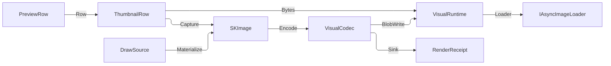

# [APPUI_VISUALS_OFFSCREEN]

Offscreen visuals are the package's raster rail: one `DrawSource` capsule projects every Skia canvas — host-leased or owned — through a `Fin`-railed `Use`, thumbnail and preview rows materialize as `SKImage` through host-agnostic capture arrows, one codec surface encodes and decodes with content-keyed `RenderReceipt` evidence, one narrowed `SKDocument` surface carries the pure-visual vector-print arm over the kernel sheet and plot owners, and one FFmpeg muxer drains a frame stream into H.264/MP4. Ownership spans the draw capsule, the capture row families, the encode axis with the ONE `ColorPolicy` gamut/transfer family, the vector-print arm, the video encode rows, and the `RenderReceipt` family the render-hash proof lanes and the AppHost telemetry spine consume. Document/Office/print export is `Document/export.md`'s — this page only rasters, encodes, and prints vectors. SkiaSharp behind Avalonia.Skia leases, AsyncImageLoader display, and PanAndZoom preview navigation form the package spine; HUD and viewport overlay drawing stays host-side.

Kernel vocabulary arrives whole and is composed, never re-spelled: `ContentHash`/`CanonicalWriter` (`Domain/identity`), `MonotonicTimeline` (`Parametric/projections`), `Custody`/`RedrivePolicy`/`Redrive`/`FaultBand`/`[FaultCase]`/`Fault` (`Domain/rails`), `PerceptualColor` with `RgbProfile`/`RgbTransfer`/`GamutPolicy` (`Numerics/atoms`), and the sheet estate `SheetSize`/`SheetOrientation`/`SheetMargin`/`SheetFrame`/`PlotPolicy`/`PenCode`/`LineWidth`/`LineGroup`/`TextHeight`/`PdfTrait` (`Drawing/sheet`).

## [01]-[INDEX]

- [02]-[DRAW_CAPSULE]: Borrowed and owned Skia canvas projection on one `Fin` rail; the FX vocabulary, the typed draw-role address, and the one token-resolve paint catalog.
- [03]-[THUMBNAIL_PIPELINE]: Host-agnostic capture rows, receipt-to-path preview rows, the blob-backed durable cache, async display.
- [04]-[ENCODE_IDENTITY]: Codec axis, the one gamut/transfer family over the kernel colour rows, content-keyed receipts.
- [05]-[VECTOR_PRINT]: Narrowed pure-visual `SKDocument` vector-print arm over the kernel sheet and plot policy.
- [06]-[VIDEO_ENCODE]: FFmpeg mux/encode rows — an async frame stream to H.264/MP4.

## [02]-[DRAW_CAPSULE]

- Owner: `VisualFault` — the direct generated `[Union]` with one `[FaultCase]` leaf per capture failure; `DrawRole` and `FxKey` — the two typed draw-site address spaces; `CatalogAddress` — the closed miss-address union; `DrawSource` [Union]; `FxRow` [Union] the effect vocabulary; `FxEffect` [Union] the built native; `LayerGround` [Union], `GlyphCoverage`, and `LayerSpec` — the save-layer parameter surface; `EffectTokens`; `PaintSpec`; `PaintCatalog` — the one token-resolve fold; `Offscreen`.
- Cases: `DrawSource` = Borrowed | Owned; `FxRow` = Ground | Checker | Dashes; `FxEffect` = Shading | Imaging | Pathing | Coloring; `LayerGround` = Filtered | Previous; `GlyphCoverage` = Lcd | Grayscale; `CatalogAddress` = Role | Pigment | Effect; `VisualFault` = LeaseBound | IccInvalid | XpsUnavailable | EncodeFailed | SurfaceAllocationFailed | GamutUndeclared | TokenQuantized | CatalogMiss.
- Entry: `public Fin<T> Use<T>(Func<SKCanvas, Fin<T>> draw)` — Fin rail; `public Fin<T> Layered<T>(PaintCatalog paints, LayerSpec spec, Func<SKCanvas, Fin<T>> draw)` — the same rail bracketed by the ONE save-layer site, its whole parameter surface carried as one admitted spec; `public static Fin<LayerSpec> Of(SKRect bounds, LayerGround ground, Option<DrawRole> composite, GlyphCoverage coverage)` — the mount admission; `public static Fin<PaintCatalog> Of(EffectTokens tokens, Seq<PaintSpec> specs)` — the one resolve.
- Auto: in-tree visuals lease the live canvas through `ISkiaSharpApiLeaseFeature.Lease` at render scope and fold to Borrowed; offscreen pipelines construct Owned with the target `SKImageInfo` and Materialize a snapshot; `Layered` opens `SaveLayer(in SKCanvasSaveLayerRec)` from the spec's own fold — a `Filtered` ground supplying the catalog's frozen filter to the `Backdrop` slot and a `Previous` ground taking `InitializeWithPrevious` instead — and restores on every exit path; `PaintCatalog.Of` folds every distinct `FxRow` a spec names into its native ONCE, mints one role paint per `PaintSpec` under the policy's one working space, and binds each spec's FX seq onto that single paint, the whole mint riding kernel `Custody.Rollback` over the LIVE catalog cell so a refused spec releases every native already minted through the one teardown ordering.
- Law: a pigment is addressed by the `Theme/tokens#TOKEN_CATALOG` `TokenKey` its generation minted, a paint by this catalog's own `DrawRole`, and an effect native by its own `FxKey` — three address spaces, three types, and the one miss case carries which space it names, so a draw site cannot address a paint by a colour name or an effect by a role name and `RULINGS.md:105`'s "under its own type" clause is realized rather than restated.
- Law: LCD glyph coverage is legal only over ground the layer actually composited opaquely, so `GlyphCoverage.Lcd` REFUSES at `LayerSpec.Of` under a `Filtered` ground — a blurred backdrop is never opaque, and fringing every glyph against content the layer never composited is the defect a caller flag could only document. The composite paint's own alpha stays the mount's fact, stated at its declaration.
- Packages: SkiaSharp, Avalonia.Skia, Thinktecture.Runtime.Extensions, LanguageExt.Core, Rasm (project — `FaultBand`/`[FaultCase]`/`Fault`, `Custody.Rollback`)
- Growth: a new effect kind is one `FxRow` case with its one `FxEffect` slot arm; a new frosted-surface treatment is one `FxRow.Ground` value; a new layer posture is one `LayerGround` case; a new painted role is one `PaintSpec` row; a new fault case is one `[FaultCase]` leaf; the in-tree vehicle is one `ICustomDrawOperation` implementation — `Bounds`, `HitTest(Point)`, `Render(ImmediateDrawingContext)` with the canvas leased through `ISkiaSharpApiLeaseFeature.Lease()` folding to Borrowed — zero new surface.
- Boundary: `Offscreen` is the named boundary capsule — the using-scoped `SKSurface` create-and-dispose pair is the only place a Skia surface is owned, and both entries bind ONE lease so the allocation refusal has one spelling; a Borrowed lease draws into the host's in-flight frame and never materializes, so Materialize folds that arm to the LeaseBound row; transforms compose as `SKMatrix` values inside `Save`/`Restore` scopes and no mutated canvas state survives a projection; a ground-sampling effect rides `Layered` and never a paint `ImageFilter` — a paint filter transforms the draw and leaves the ground untouched, so a frosted panel spelled that way silently renders as an unblurred overlay; `PaintCatalog` is the OWNER of the FX law — every effect native and every role paint mints once per theme generation into a value a draw reads, gradient stops enter through `SKColorF` pigments the policy's own gamut row projects, and a per-draw `new SKPaint()`, a per-draw effect construction, or an sRGB-lerped ramp is the deleted form; the catalog holds LIVE native maps, so it is a sealed class whose mint is its only writer and whose `Dispose` is the one teardown the rollback and the generation's end both reach (`RULINGS.md:136`); runtime-SkSL compilation partitions by TYPE DOMAIN and neither half lands here — `Render/shading#SHADER_ASSET` owns the per-`GpuBackend` appearance-shader cache and `Vfx/shader#EFFECT_PROGRAM` the 2D chrome program roster, and the parameters this catalogue freezes for a whole generation are exactly the ones neither cache holds; the custom-visual layout folds compose their projected `SKPath` through `Owned.Materialize` exactly as `PreviewRow.Render` does, so `Offscreen` stays the only Skia-surface owner; the GPU-accelerated offscreen path is the `Render/pipeline#RENDER_GRAPH` `GpuBackend` target-factory column, so an offscreen draw under the `Wgpu` row encodes through the `Silk.NET.WebGPU` surface and one under `Software` stays this `SKSurface.Create` CPU floor, the backend selection riding that one factory column and never a second offscreen-surface owner here.

```csharp signature
// --- [RUNTIME_PRELUDE] ------------------------------------------------------------------
using System.Collections.Frozen;
using System.IO.Hashing;
using LanguageExt;
using LanguageExt.Common;
using NodaTime;
using Rasm.Domain;
using Rasm.Drawing;
using Rasm.Numerics;
using Rasm.Parametric;
using Thinktecture;
using static LanguageExt.Prelude;

namespace Rasm.AppUi.Render;

// --- [TYPES] --------------------------------------------------------------------------------
// Draw roles, token keys, and effect keys remain distinct identities.
[ValueObject<string>(SkipKeyMember = false)]
[KeyMemberEqualityComparer<ComparerAccessors.StringOrdinal, string>]
[KeyMemberComparer<ComparerAccessors.StringOrdinal, string>]
public sealed partial class DrawRole {
    static partial void ValidateFactoryArguments(ref ValidationError? validationError, ref string value) =>
        validationError = string.IsNullOrWhiteSpace(value)
            ? new ValidationError("DrawRole requires a non-empty draw-site role.")
            : null;
}

[ValueObject<string>(SkipKeyMember = false)]
[KeyMemberEqualityComparer<ComparerAccessors.StringOrdinal, string>]
public sealed partial class FxKey {
    static partial void ValidateFactoryArguments(ref ValidationError? validationError, ref string value) =>
        validationError = string.IsNullOrWhiteSpace(value)
            ? new ValidationError("FxKey requires a non-empty effect key.")
            : null;
}

// ONE miss case carrying WHICH address space it names, so three vocabularies keep their types through the refusal
// and the fault family spends one offset rather than three of the row's remaining span.
[Union(ConversionFromValue = ConversionOperatorsGeneration.None)]
public abstract partial record CatalogAddress {
    private CatalogAddress() { }
    public sealed record Role(DrawRole Key) : CatalogAddress;
    public sealed record Pigment(TokenKey Key) : CatalogAddress;
    public sealed record Effect(FxKey Key) : CatalogAddress;

    public string Text => Switch(
        role: static r => r.Key.ToString(),
        pigment: static p => p.Key.ToString(),
        effect: static e => e.Key.ToString());
}

// LCD coverage is a MOUNT parameter (`RULINGS.md:127`) whose legality the ground decides, so it is a row rather than
// a caller bool: a row can refuse where a bool can only be documented.
[SmartEnum<string>]
[KeyMemberEqualityComparer<ComparerAccessors.StringOrdinal, string>]
public sealed partial class GlyphCoverage {
    public static readonly GlyphCoverage Lcd = new(key: "lcd", flag: SKCanvasSaveLayerRecFlags.PreserveLcdText);
    public static readonly GlyphCoverage Grayscale = new(key: "grayscale", flag: SKCanvasSaveLayerRecFlags.None);
    public SKCanvasSaveLayerRecFlags Flag { get; }
}

// --- [ERRORS] ---------------------------------------------------------------------------
[Union(ConversionFromValue = ConversionOperatorsGeneration.None)]
public abstract partial record VisualFault : Fault {
    private static readonly FaultBand FamilyBand = FaultBand.Visual;
    private VisualFault(string detail) { Detail = detail; }
    public string Detail { get; }
    public override string Message => Detail;

    [FaultCase(0)]
    public sealed partial record LeaseBound()
        : VisualFault("visuals/lease-bound: a borrowed host lease draws into the live frame and never materializes");
    [FaultCase(1)]
    public sealed partial record IccInvalid(string Key)
        : VisualFault($"visuals/icc-invalid: profile bytes for {Key} do not parse as an ICC profile");
    [FaultCase(2)]
    public sealed partial record XpsUnavailable()
        : VisualFault("visuals/xps-unavailable: the loaded Skia native carries no XPS backend on this platform");
    [FaultCase(3)]
    public sealed partial record EncodeFailed(string Stage)
        : VisualFault($"visuals/encode-failed: {Stage}");
    [FaultCase(4)]
    public sealed partial record SurfaceAllocationFailed(int Width, int Height)
        : VisualFault($"visuals/surface-allocation: {Width}x{Height}");
    [FaultCase(5)]
    public sealed partial record GamutUndeclared(string Key)
        : VisualFault($"visuals/gamut-undeclared: policy {Key} names no RgbProfile row a float pigment projects through");
    [FaultCase(6)]
    public sealed partial record TokenQuantized(string Key)
        : VisualFault($"visuals/token-quantized: an 8-bit sRGB token colour cannot widen into the {Key} working space");
    [FaultCase(7)]
    public sealed partial record CatalogMiss(CatalogAddress Address)
        : VisualFault($"visuals/catalog-miss: {Address.Text} is absent from the resolved paint catalog");
}

// --- [MODELS] ---------------------------------------------------------------------------
[Union(ConversionFromValue = ConversionOperatorsGeneration.None)]
public abstract partial record DrawSource {
    private DrawSource() { }
    public sealed record Borrowed(ISkiaSharpApiLease Lease) : DrawSource;
    public sealed record Owned(SKImageInfo Info) : DrawSource;

    public Fin<T> Use<T>(Func<SKCanvas, Fin<T>> draw) => Switch(
        state: draw,
        borrowed: static (paint, source) => paint(source.Lease.SkCanvas),
        owned: static (paint, source) => Offscreen.Rent(source.Info, paint));

    public Fin<SKImage> Materialize(Func<SKCanvas, Fin<Unit>> draw) => Switch(
        state: draw,
        borrowed: static (_, _) => Fin<SKImage>.Fail(Offscreen.LeaseBound),
        owned: static (paint, source) => Offscreen.Snapshot(source.Info, paint));

    // Backdrop is why SaveLayer takes a REC: SKCanvasSaveLayerRec.Backdrop filters what the canvas ALREADY holds
    // before the nested draw composites over it, which a paint's ImageFilter cannot express — a paint filter
    // transforms the draw, never the ground beneath it. Restore pops the layer on the failure path as well. The
    // filter is a CATALOG READ, not a construction, so a frosted panel repainted per frame builds nothing. This is
    // the ONE SaveLayer site in the package and `LayerSpec` is its whole parameter surface.
    public Fin<T> Layered<T>(PaintCatalog paints, LayerSpec spec, Func<SKCanvas, Fin<T>> draw) =>
        spec.Rec(paints).Bind(rec => Use(canvas => {
            SKCanvasSaveLayerRec opened = rec;
            canvas.SaveLayer(in opened);
            try { return draw(canvas); }
            finally { canvas.Restore(); }
        }));
}

// The ground a layer opens on, as a CLOSED two-arm choice rather than a nullable filter beside a flag set:
// `Filtered` fills the Backdrop slot so the destination pixels run through the frozen ground filter INTO the layer,
// while `Previous` leaves that slot null and takes InitializeWithPrevious, copying the same pixels unfiltered. The
// two are mutually defeating, and a rec carrying neither opens on transparent black and erases everything beneath.
[Union(ConversionFromValue = ConversionOperatorsGeneration.None)]
public abstract partial record LayerGround {
    private LayerGround() { }
    public sealed record Filtered(FxRow.Ground Row) : LayerGround;
    public sealed record Previous() : LayerGround;

    public static readonly LayerGround Frosted = new Filtered(FxRow.Frosted);
    public static readonly LayerGround Acrylic = new Filtered(FxRow.Acrylic);
    public static readonly LayerGround Card = new Filtered(FxRow.Card);
    public static readonly LayerGround Copy = new Previous();
}

// The whole save-layer parameter surface, ADMITTED. Bounds are the CONTENT's own extent — a layer bounded to the
// surface pays a full-surface offscreen for a panel-sized treatment — and `Composite` names the catalog role whose
// paint composites the layer back on restore, so a layer opacity is a resolved token rather than a per-draw paint.
// RESIDUAL: the composite paint's own alpha is the mount's fact and no ground row can state it, so a translucent
// composite over a `Previous` ground still elects its coverage at the mount that knows the opacity.
public sealed record LayerSpec {
    private LayerSpec(SKRect bounds, LayerGround ground, Option<DrawRole> composite, GlyphCoverage coverage) =>
        (Bounds, Ground, Composite, Coverage) = (bounds, ground, composite, coverage);

    public SKRect Bounds { get; }
    public LayerGround Ground { get; }
    public Option<DrawRole> Composite { get; }
    public GlyphCoverage Coverage { get; }

    public static Fin<LayerSpec> Of(SKRect bounds, LayerGround ground, Option<DrawRole> composite, GlyphCoverage coverage) =>
        ground is LayerGround.Filtered && ReferenceEquals(coverage, GlyphCoverage.Lcd)
            ? Fin.Fail<LayerSpec>(new VisualFault.EncodeFailed("layer/lcd-over-filtered: subpixel coverage demands ground the layer composited opaquely"))
            : Fin.Succ(new LayerSpec(bounds, ground, composite, coverage));

    public Fin<SKCanvasSaveLayerRec> Rec(PaintCatalog paints) =>
        from ground in Ground.Switch(
            state: paints,
            filtered: static (catalog, arm) => catalog.Backdrop(arm.Row).Map(Option<SKImageFilter>.Some),
            previous: static (_, _) => Fin.Succ(Option<SKImageFilter>.None))
        from composite in Composite.Match(
            Some: role => paints.Paint(role).Map(Option<SKPaint>.Some),
            None: () => Fin.Succ(Option<SKPaint>.None))
        select new SKCanvasSaveLayerRec {
            Bounds = Bounds,
            Backdrop = ground.ValueUnsafe(),
            Paint = composite.ValueUnsafe(),
            Flags = (ground.IsNone ? SKCanvasSaveLayerRecFlags.InitializeWithPrevious : SKCanvasSaveLayerRecFlags.None)
                | Coverage.Flag,
        };
}

// ONE effect vocabulary, closed over the three paint slots a fence on this page binds. Payload is per-occurrence — a
// ground filter carries sigma and edge policy, a checker two pigments and a cell, a dash its interval run — so the
// family is a [Union] and the named rows below are its canonical values, each carrying its parameters as ROW DATA.
// Clamp bleeds the ground outward under a full-bleed panel while Decal keeps a hard boundary under an inset card.
[Union(ConversionFromValue = ConversionOperatorsGeneration.None)]
public abstract partial record FxRow(FxKey Key) {
    public sealed record Ground(FxKey Key, float Sigma, SKShaderTileMode Tile) : FxRow(Key);
    public sealed record Checker(FxKey Key, TokenKey Light, TokenKey Dark, int CellPx) : FxRow(Key);
    public sealed record Dashes(FxKey Key, ImmutableArray<float> Intervals, float Phase) : FxRow(Key);

    // The three canonical grounds type as Ground, not as the base: `DrawSource.Layered` and `PaintCatalog.Backdrop`
    // both take a `Ground`, so a base-typed field would need a downcast at every call site.
    public static readonly Ground Frosted = new(FxKey.Create("frosted"), Sigma: 12f, Tile: SKShaderTileMode.Clamp);
    public static readonly Ground Acrylic = new(FxKey.Create("acrylic"), Sigma: 30f, Tile: SKShaderTileMode.Clamp);
    public static readonly Ground Card = new(FxKey.Create("card"), Sigma: 8f, Tile: SKShaderTileMode.Decal);
    // The two cells are two RUNGS of the one surface ladder, minted by the role that generates them: a checkerboard
    // is a tonal step, so an authored `surface-check-a` string names a rung the generation never emits.
    public static readonly FxRow Check = new Checker(FxKey.Create("check"), Light: PaintRole.Surface.At(0), Dark: PaintRole.Surface.At(1), CellPx: 8);
    public static readonly FxRow Dashed = new Dashes(FxKey.Create("dashed"), [3f, 2f], Phase: 0f);

    // The ONE mint. Every arm reads its pigments through EffectTokens, which projects them through the policy's own
    // gamut row, so an effect colour is a float SKColorF in the working space and the byte SKColor overloads — which
    // assume sRGB and quantize — have no call site here. A geometry-dependent shader is unrepresentable BY DESIGN: a
    // resolve-once frozen native cannot carry an extent the draw supplies.
    public Fin<FxEffect> Build(EffectTokens tokens) => Switch(
        state: tokens,
        ground: static (_, g) => Fin.Succ<FxEffect>(
            new FxEffect.Imaging(SKImageFilter.CreateBlur(g.Sigma, g.Sigma, g.Tile))),
        checker: static (t, c) => t.Pigment(c.Light).Bind(light => t.Pigment(c.Dark).Bind(dark => Tiled(t, c, light, dark))),
        dashes: static (_, d) => Fin.Succ<FxEffect>(new FxEffect.Pathing(SKPathEffect.CreateDash([.. d.Intervals], d.Phase))));

    // The checkerboard is ONE repeating two-cell tile the shader repeats across whatever extent the ground covers, so
    // a 4k backplate costs one 2x2-cell image rather than a per-cell rect fold. The image rides the effect case
    // because a sampled shader owns two natives and releasing the source at construction samples freed pixels.
    private static Fin<FxEffect> Tiled(EffectTokens tokens, Checker row, SKColorF light, SKColorF dark) =>
        Offscreen.Snapshot(
            new SKImageInfo(row.CellPx * 2, row.CellPx * 2, tokens.Policy.Surface, SKAlphaType.Premul).WithColorSpace(tokens.Working),
            canvas => {
                using SKPaint pale = new();
                using SKPaint deep = new();
                pale.SetColor(light, tokens.Working);
                deep.SetColor(dark, tokens.Working);
                float cell = row.CellPx;
                canvas.DrawRect(new SKRect(0f, 0f, cell, cell), pale);
                canvas.DrawRect(new SKRect(cell, cell, cell * 2f, cell * 2f), pale);
                canvas.DrawRect(new SKRect(cell, 0f, cell * 2f, cell), deep);
                canvas.DrawRect(new SKRect(0f, cell, cell, cell * 2f), deep);
                return Fin.Succ(unit);
            })
        .Map(static image => (FxEffect)new FxEffect.Shading(
            SKShader.CreateImage(image, SKShaderTileMode.Repeat, SKShaderTileMode.Repeat), Some(image)));
}

// The built native, one case per paint slot. A sampled shader owns TWO natives — the shader and the image it samples
// — so the source rides its case and releases with it.
[Union(ConversionFromValue = ConversionOperatorsGeneration.None)]
public abstract partial record FxEffect {
    private FxEffect() { }
    public sealed record Shading(SKShader Native, Option<SKImage> Source) : FxEffect;
    public sealed record Imaging(SKImageFilter Native) : FxEffect;
    public sealed record Pathing(SKPathEffect Native) : FxEffect;
    public sealed record Coloring(SKColorFilter Native) : FxEffect;

    // ONE paint composes the whole pipeline: each effect writes its own slot and hands the paint back, so a dashed,
    // tiled, blurred role is one fold over its FX seq onto one paint. The colour slot is a paint slot like the other
    // three — a per-pixel transform bound as an image filter forces an offscreen for a transform that needs none.
    public SKPaint BindTo(SKPaint paint) => Switch(
        state: paint,
        shading: static (p, s) => { p.Shader = s.Native; return p; },
        imaging: static (p, i) => { p.ImageFilter = i.Native; return p; },
        pathing: static (p, e) => { p.PathEffect = e.Native; return p; },
        coloring: static (p, c) => { p.ColorFilter = c.Native; return p; });

    // Only an image filter can filter the GROUND a SaveLayer composites over; the other slots transform the DRAW. A
    // colour transform lifts into a ground through `SKImageFilter.CreateColorFilter` at the caller that needs it.
    public Option<SKImageFilter> Ground => Switch(
        shading: static _ => Option<SKImageFilter>.None,
        imaging: static i => Some(i.Native),
        pathing: static _ => Option<SKImageFilter>.None,
        coloring: static _ => Option<SKImageFilter>.None);

    // Release order is ownership order: the shader first, then the image it sampled.
    public Unit Release() => Switch(
        shading: static s => { s.Native.Dispose(); s.Source.Iter(static image => image.Dispose()); return unit; },
        imaging: static i => fun(i.Native.Dispose)(),
        pathing: static e => fun(e.Native.Dispose)(),
        coloring: static c => fun(c.Native.Dispose)());
}

// The resolve input: the published theme generation, the resolved token maps the specs name, the colour policy every
// pigment projects through, and the ONE working space minted for the whole generation so SKColorSpace.Equal identity
// holds across every native and the catalog has one space to release rather than one per pigment.
public sealed record EffectTokens(int Generation, ResolvedTheme Theme, VisualCodec.ColorPolicy Policy, SKColorSpace Working) {
    public static EffectTokens Of(int generation, ResolvedTheme theme, VisualCodec.ColorPolicy policy) =>
        new(generation, theme, policy, policy.Working.Space());

    // The token edge. A theme paint is an 8-bit display-referred value, so it crosses through the policy's own byte
    // admission and reaches a paint as a float SKColorF — never through SKPaint.Color, which assumes sRGB and
    // quantizes before any conversion. The key is the generated `TokenKey` the resolved bucket is addressed by, so a
    // spec naming a rung the generation never emitted refuses at the mint that composes it.
    public Fin<SKColorF> Pigment(TokenKey key) =>
        (Theme.Paints.TryGetValue(key, out Color token) ? Some(token) : Option<Color>.None)
            .ToFin(new VisualFault.CatalogMiss(new CatalogAddress.Pigment(key)))
            .Bind(Policy.Resolve);
}

// A painted role: the pigment key its colour reads, the stroke geometry, and the FX rows bound onto its one paint.
// Consumers declare rows; nothing constructs a paint at a draw site.
public sealed record PaintSpec(DrawRole Role, TokenKey Pigment, float StrokeWidth, SKPaintStyle Style, Seq<FxRow> Effects);

// --- [SERVICES] -------------------------------------------------------------------------
// The ONE token-resolve fold. The catalog holds LIVE native maps, so it is a sealed class whose transitions answer
// what they retired (`RULINGS.md:136`) and whose `Dispose` is the one teardown both the rollback and the
// generation's end reach. Freeze is TOTAL: a spec naming a pigment the resolved theme lacks, or an FX row the effect
// fold refused, refuses at construction, so no draw path carries a fallback chain.
public sealed class PaintCatalog : IDisposable {
    private readonly Atom<HashMap<FxKey, FxEffect>> effects = Atom(HashMap<FxKey, FxEffect>());
    private readonly Atom<HashMap<DrawRole, SKPaint>> roles = Atom(HashMap<DrawRole, SKPaint>());

    private PaintCatalog(EffectTokens tokens) => Tokens = tokens;

    public EffectTokens Tokens { get; }

    public int Generation => Tokens.Generation;

    // The mint is a CUSTODY chain, not a hand fold threading `(Held, Fault)`: `Traverse` short-circuits on the first
    // refusal and kernel `Custody.Rollback` releases the live cell on the failure arm alone, because the success
    // value now owns every native. The prior shape argued at length that `TraverseM` strands the partial generation —
    // true of a RECORD accumulator the refusal withholds, and answered here by the cell the rollback still reaches.
    // The effect map is complete before the role fold runs, both folds walking the same specs, so a role binds by
    // lookup and a miss is a typed refusal rather than an unstyled paint.
    public static Fin<PaintCatalog> Of(EffectTokens tokens, Seq<PaintSpec> specs) {
        PaintCatalog held = new(tokens);
        return (from _built in specs.Bind(static spec => spec.Effects).Distinct()
                    .Traverse(row => row.Build(tokens).Map(effect => held.Bind(row.Key, effect))).As()
                from _minted in specs.Traverse(held.Mint).As()
                select held)
            .Rollback(held);
    }

    public Fin<SKPaint> Paint(DrawRole role) =>
        roles.Value.Find(role).ToFin(new VisualFault.CatalogMiss(new CatalogAddress.Role(role)));

    public Fin<SKImageFilter> Backdrop(FxRow.Ground row) =>
        effects.Value.Find(row.Key).Bind(static effect => effect.Ground)
            .ToFin(new VisualFault.CatalogMiss(new CatalogAddress.Effect(row.Key)));

    // One teardown body: paints first, then the natives their slots held, then the one working space the generation
    // minted. Reached by the mint's rollback and by the generation's own end alike.
    public void Dispose() {
        toSeq(roles.Value.Values).Iter(static paint => paint.Dispose());
        toSeq(effects.Value.Values).Iter(static effect => ignore(effect.Release()));
        Tokens.Working.Dispose();
        ignore(roles.Swap(static _ => HashMap<DrawRole, SKPaint>()));
        ignore(effects.Swap(static _ => HashMap<FxKey, FxEffect>()));
    }

    private Unit Bind(FxKey key, FxEffect effect) => ignore(effects.Swap(map => map.AddOrUpdate(key, effect)));

    // The bind is `Fin`, not a silent-miss fold: the effect map was built from these same specs, so a miss is
    // unrepresentable and stating it as one keeps the "Freeze is TOTAL" law reachable instead of shipping a paint
    // whose declared effects never bound.
    private Fin<Unit> Mint(PaintSpec spec) =>
        Tokens.Pigment(spec.Pigment).Bind(pigment => {
            SKPaint paint = new() { Style = spec.Style, StrokeWidth = spec.StrokeWidth, IsAntialias = true };
            paint.SetColor(pigment, Tokens.Working);
            return spec.Effects
                .Traverse(row => effects.Value.Find(row.Key)
                    .ToFin(new VisualFault.CatalogMiss(new CatalogAddress.Effect(row.Key)))
                    .Map(effect => ignore(effect.BindTo(paint)))).As()
                .Map(_ => ignore(roles.Swap(map => map.AddOrUpdate(spec.Role, paint))));
        });
}

// --- [OPERATIONS] -----------------------------------------------------------------------
public static class Offscreen {
    public static readonly VisualFault LeaseBound = new VisualFault.LeaseBound();

    // ONE lease: the allocation refusal has one spelling and both entries bind it, so a null surface cannot reach a
    // `using` on either path. The kernel `Interaction/paint#SURFACE` `Surface`/`OffscreenDraw<TResult>` owner is
    // Eto/`Drawable`-shaped and answers a DEGRADE verdict a host handler refused; this is the Skia offscreen floor,
    // where `SKSurface.Create` refusing is an allocation fault and never a degrade, which is why the verdict here is
    // a bare `Fin` and not that owner's two-case answer.
    public static Fin<T> Rent<T>(SKImageInfo info, Func<SKCanvas, Fin<T>> draw) =>
        Lease(info).Bind(surface => { using SKSurface scoped = surface; return draw(scoped.Canvas); });

    public static Fin<SKImage> Snapshot(SKImageInfo info, Func<SKCanvas, Fin<Unit>> draw) =>
        Lease(info).Bind(surface => {
            using SKSurface scoped = surface;
            return draw(scoped.Canvas).Map(_ => scoped.Snapshot());
        });

    private static Fin<SKSurface> Lease(SKImageInfo info) =>
        Optional(SKSurface.Create(info))
            .ToFin(new VisualFault.SurfaceAllocationFailed(info.Width, info.Height));
}
```

Every row below is minted by `FxRow.Build` at token resolve and bound by `PaintCatalog`; the producer column names the fence that binds it.

| [INDEX] | [FX_CASE] | [VALUES]                 | [NATIVE]                   | [PRODUCER]                                  |
| :-----: | :-------- | :----------------------- | :------------------------- | :------------------------------------------ |
|  [01]   | `Ground`  | frosted · acrylic · card | `SKImageFilter.CreateBlur` | `LayerGround.Filtered` backdrop arm         |
|  [02]   | `Checker` | check                    | `SKShader.CreateImage`     | `BackplateRow.Checkerboard` preview ground  |
|  [03]   | `Dashes`  | dashed                   | `SKPathEffect.CreateDash`  | `Render/drafting#DRAFT_EMIT` edge-style set |

## [03]-[THUMBNAIL_PIPELINE]

- Owner: `VisualRuntime` — the injected boundary row every arm on this page threads; `ThumbnailUse` and `DisplayScale` — the two axes of the variant product; `ThumbnailVariant` — their derived product; `ThumbnailIntake` — the durable-cache posture; `ThumbnailSource`; `ThumbnailRow` — the capture row and the ONE authority for its blob address; `BackplateRow`; `PreviewRow<TReceipt>`; `PreviewSurfaces` — the page's `PaintSpec` rows.
- Cases: `ThumbnailUse` = list | gallery, each carrying its base pixel extent; `DisplayScale` = standard | retina, each carrying its factor; `ThumbnailIntake` = reuse | rebuild; `BackplateRow` = checkerboard | solid | transparent.
- Entry: `public IO<RenderReceipt> Refresh(VisualRuntime runtime, ThumbnailVariant variant)` — the forced capture-and-encode on the IO rail; `public IO<ReadOnlyMemory<byte>> Bytes(VisualRuntime runtime, ThumbnailVariant variant, ThumbnailIntake intake)` — the durable-cache read whose miss folds to `Refresh`; `public string BlobKey(ThumbnailVariant variant)` — the ONE blob-address authority; `public Fin<SKImage> Render(PaintCatalog paints, TReceipt receipt, SKImageInfo info)` — the preview raster on the Fin rail; `public ThumbnailRow Row(DrawRole key, ThumbnailSource source, TReceipt receipt, PaintCatalog paints, EncodeRow encode, DataClassification classification)` — the preview-to-capture wire, so a Compute receipt preview IS a gallery thumbnail rather than a second raster path.
- Auto: a capture arrow is bound per host at the app root — the rhino row binds `ViewCapture.CaptureToBitmap`, the gh2 row the host canvas snapshot, and the owned row `PreviewRow.Render` through `DrawSource.Owned`; display binds `AdvancedImage` to the runtime `Loader` with `FallbackImage` resolved from the row's placeholder and error keys; variant selection picks the product member whose `Scale` matches the mounted surface's scale fact; `PixelSize` DERIVES as the use's base extent times the scale factor, so a retuned base moves both variants and no row re-states the multiplication; zoomable previews mount inside `ZoomBorder` with `AutoFit` on load and `ZoomToRectangle` bound to the gesture rows.
- Law: the blob address has ONE producer. `BlobKey` composes the source, the row key, the variant key, the derived pixel extent, and the encode row's OWN extension — so the `.png` literal beside `EncodeRow.Png` and every consumer-side re-spelling of the same path delete onto it.
- Receipt: every refresh lands one `RenderReceipt` of kind `ArtifactKind.Thumbnail` carrying the blob artifact key as its destination.
- Packages: AsyncImageLoader.Avalonia, SkiaSharp, PanAndZoom, Thinktecture.Runtime.Extensions, Rasm.AppHost (project), Rasm (project — `MonotonicTimeline`, `RedrivePolicy`), LanguageExt.Core, NodaTime
- Growth: one thumbnail row admits a new visual family; one `ThumbnailUse` row retunes a base extent and one `DisplayScale` row a factor, the product following both; a new preview family is one `PreviewRow` binding its Project fold; a new ground is one `BackplateRow` value plus its one `PaintSpec`; zero new surface.
- Boundary: the memory cache is the `RamCachedWebImageLoader`-backed `Loader` and the durable cache is the blob lane behind `BlobWrite`/`BlobRead` — the read is the cache-first arm `Bytes` takes, so the durable half is REACHED rather than declared, and admitting `DiskCachedWebImageLoader` creates a second durable owner and is rejected. A durable MISS is `Option.None`, not an IO failure — absence and a broken lane are two facts and a rail that fused them made every cold thumbnail read as an error. Host bitmaps convert to `SKImage` exactly once at the port edge, and no Eto or RhinoCommon bitmap type crosses into rows. `Render` is the named path-scope boundary capsule — the projected `SKPath` is using-scoped and never outlives the fold; the ground and the stroke are CATALOG reads, so a preview mints no paint and no effect at draw time and the transparent row draws nothing rather than filling with a sentinel colour; HUD and viewport overlays stay host-side, and TReceipt stays generic so no Compute receipt shape is re-modeled here. `VisualRuntime` carries the kernel `MonotonicTimeline` and never an AppHost `ClockPolicy` — that record is an APP-stratum value whose own owner forbids it on a platform signature, and its `Mark`/`Elapsed` members do not exist; `BlobWrite`, `BundleWrite`, `Sink`, and `Measure` bind durable artifacts, support evidence, receipt delivery, and named duration to the existing AppHost ports, and `Redrive` is the one policy value the boundary writes on this page re-drive under.

```csharp signature
// --- [TYPES] ----------------------------------------------------------------------------
[SmartEnum<string>]
[KeyMemberEqualityComparer<ComparerAccessors.StringOrdinal, string>]
public sealed partial class ThumbnailSource {
    public static readonly ThumbnailSource Rhino = new(key: "rhino");
    public static readonly ThumbnailSource Grasshopper = new(key: "grasshopper");
    public static readonly ThumbnailSource Owned = new(key: "owned");
}

// The two axes the variant table was a hand product of. Base extent lives on the USE and the factor on the SCALE, so
// four rows re-deriving one multiplication collapse into the product below.
[SmartEnum<string>]
[KeyMemberEqualityComparer<ComparerAccessors.StringOrdinal, string>]
public sealed partial class ThumbnailUse {
    public static readonly ThumbnailUse List = new(key: "list", basePx: 128);
    public static readonly ThumbnailUse Gallery = new(key: "gallery", basePx: 256);
    public int BasePx { get; }
}

[SmartEnum<string>]
[KeyMemberEqualityComparer<ComparerAccessors.StringOrdinal, string>]
public sealed partial class DisplayScale {
    public static readonly DisplayScale Standard = new(key: "standard", factor: 1d);
    public static readonly DisplayScale Retina = new(key: "retina", factor: 2d);
    public double Factor { get; }
}

// The PRODUCT, with `Key` and `PixelSize` DERIVED: the named members below are coordinates in it, not a roster a new
// use or scale would have to be added to twice.
public readonly record struct ThumbnailVariant(ThumbnailUse Use, DisplayScale Scale) {
    public static readonly ThumbnailVariant List = new(ThumbnailUse.List, DisplayScale.Standard);
    public static readonly ThumbnailVariant ListRetina = new(ThumbnailUse.List, DisplayScale.Retina);
    public static readonly ThumbnailVariant Gallery = new(ThumbnailUse.Gallery, DisplayScale.Standard);
    public static readonly ThumbnailVariant GalleryRetina = new(ThumbnailUse.Gallery, DisplayScale.Retina);

    public static Seq<ThumbnailVariant> Items =>
        toSeq(from use in ThumbnailUse.Items from scale in DisplayScale.Items select new ThumbnailVariant(use, scale));

    public string Key => ReferenceEquals(Scale, DisplayScale.Standard) ? Use.Key : $"{Use.Key}-{Scale.Key}";

    public int PixelSize => (int)Math.Round(Use.BasePx * Scale.Factor);
}

// The durable-cache posture. Neither arm reconstructs from the row or the variant — a gallery scroll REUSES what the
// lane already holds and an edit REBUILDS the same address — so the posture is the caller's declared row.
[SmartEnum<string>]
[KeyMemberEqualityComparer<ComparerAccessors.StringOrdinal, string>]
public sealed partial class ThumbnailIntake {
    public static readonly ThumbnailIntake Reuse = new(key: "reuse", reuses: true);
    public static readonly ThumbnailIntake Rebuild = new(key: "rebuild", reuses: false);
    public bool Reuses { get; }
}

// The ground is a ROW naming the catalog role that paints it, so the resolved-delegate pair the prior shape carried
// beside two key strings is deleted. Transparent carries no role at all, so "no ground" is the absent option rather
// than a paint the fold must recognize.
[SmartEnum<string>]
[KeyMemberEqualityComparer<ComparerAccessors.StringOrdinal, string>]
public sealed partial class BackplateRow {
    public static readonly BackplateRow Checkerboard = new(key: "checkerboard", role: Some(PreviewSurfaces.BackplateCheck));
    public static readonly BackplateRow Solid = new(key: "solid", role: Some(PreviewSurfaces.BackplateSolid));
    public static readonly BackplateRow Transparent = new(key: "transparent", role: Option<DrawRole>.None);
    public Option<DrawRole> Role { get; }
}

// --- [MODELS] ---------------------------------------------------------------------------
public sealed record ThumbnailRow(
    string Key,
    ThumbnailSource Source,
    Func<ThumbnailVariant, IO<SKImage>> Capture,
    EncodeRow Encode,
    DataClassification Classification,
    string PlaceholderKey,
    string ErrorKey) {
    // The ONE blob-address authority. Scale is recoverable from the variant key, so the prior `@{Scale}x{PixelSize}`
    // pair carried the same fact twice; the extension reads off the encode row, so the codec and the address can
    // never disagree. NAMED LOSS: the literal scale factor in the path, recoverable from the variant key it follows.
    public string BlobKey(ThumbnailVariant variant) =>
        $"thumbnails/{Source.Key}/{Key}/{variant.Key}@{variant.PixelSize}{Encode.Extension}";

    // Encode borrows; the capture-minted image is this fold's to release. Release brackets the ACQUISITION, never the
    // success arm — a dispose smuggled through a `.Map` tuple projection runs only when the encode succeeded, so
    // every failed encode leaks a native image and the leak is invisible at the call site.
    public IO<RenderReceipt> Refresh(VisualRuntime runtime, ThumbnailVariant variant) =>
        Capture(variant).Bracket(
            image => VisualCodec.Encode(runtime, image, Encode, ArtifactKind.Thumbnail, BlobKey(variant)),
            static image => IO.lift(() => { image.Dispose(); return unit; }));

    // The durable half of the two-tier cache, REACHED: a reuse posture reads the lane first and only a miss pays for
    // a capture. A read that immediately follows the write it forced and still finds nothing is a lane defect, not a
    // miss, so it refuses by name instead of recursing.
    public IO<ReadOnlyMemory<byte>> Bytes(VisualRuntime runtime, ThumbnailVariant variant, ThumbnailIntake intake) =>
        from held in intake.Reuses ? runtime.BlobRead(BlobKey(variant)) : IO.pure(Option<ReadOnlyMemory<byte>>.None)
        from bytes in held.Match(
            Some: IO.pure,
            None: () => Refresh(runtime, variant).Bind(_ => runtime.BlobRead(BlobKey(variant)).Bind(written => written.Match(
                Some: IO.pure,
                None: () => IO.fail<ReadOnlyMemory<byte>>(
                    new VisualFault.EncodeFailed($"thumbnail/blob-absent:{BlobKey(variant)}"))))))
        select bytes;
}

// A receipt preview: the projection to a path, the ground row, and the stroke role. `Row` is the WIRE that makes this
// family a capture source rather than a second raster path — a preview IS a thumbnail whose capture arrow is its own
// render, so the gallery, the blob lane, and the encode receipt all reach it with no owner between.
public sealed record PreviewRow<TReceipt>(
    DrawRole Key,
    Func<TReceipt, Fin<SKPath>> Project,
    BackplateRow Backplate,
    DrawRole Stroke) {
    public Fin<SKImage> Render(PaintCatalog paints, TReceipt receipt, SKImageInfo info) =>
        Project(receipt).Bind(path => {
            using SKPath scoped = path;
            return paints.Paint(Stroke).Bind(stroke => new DrawSource.Owned(info).Materialize(canvas =>
                Backplate.Role
                    .Match(
                        Some: role => paints.Paint(role).Map(ground => {
                            canvas.DrawRect(new SKRect(0f, 0f, info.Width, info.Height), ground);
                            return unit;
                        }),
                        None: static () => Fin.Succ(unit))
                    .Map(_ => {
                        canvas.DrawPath(scoped, stroke);
                        return unit;
                    })));
        });

    public ThumbnailRow Row(string key, ThumbnailSource source, TReceipt receipt, PaintCatalog paints, EncodeRow encode, DataClassification classification) =>
        new(key, source,
            variant => IO.lift(() => Render(paints, receipt, Info(paints, variant))),
            encode, classification, PlaceholderKey: $"{Key}/placeholder", ErrorKey: $"{Key}/error");

    // The raster extent is the variant's own derived square under the catalog's working space, so a preview and a
    // host capture of the same variant produce identically shaped pixels and their frame hashes are comparable.
    private static SKImageInfo Info(PaintCatalog paints, ThumbnailVariant variant) =>
        new SKImageInfo(variant.PixelSize, variant.PixelSize, paints.Tokens.Policy.Surface, SKAlphaType.Premul)
            .WithColorSpace(paints.Tokens.Working);
}

// --- [SERVICES] -------------------------------------------------------------------------
// The injected boundary row every arm on this page threads. Time is the kernel monotonic timeline alone: no wall
// instant is read here, because the message envelope's HLC is the sole evidence time authority, so no `IClock` rides
// beside it, and the AppHost `ClockPolicy` record — whose own owner forbids it on a platform signature and whose
// `Mark`/`Elapsed` members do not exist — has no seat at all.
public sealed record VisualRuntime(
    CorrelationId Correlation,
    ProfileRoots Roots,
    MonotonicTimeline Line,
    RedrivePolicy Redrive,
    IAsyncImageLoader Loader,
    Func<string, ReadOnlyMemory<byte>, IO<string>> BlobWrite,
    Func<string, IO<Option<ReadOnlyMemory<byte>>>> BlobRead,
    Func<string, DataClassification, ReadOnlyMemory<byte>, IO<string>> BundleWrite,
    Func<RenderReceipt, IO<Unit>> Sink,
    Func<InstrumentSpec, string, Duration, IO<Unit>> Measure);

// --- [COMPOSITION] ----------------------------------------------------------------------
// The page's own catalog rows and their role addresses in ONE place: `BackplateRow` reads these members rather than
// typing the same strings a second time, so the two rosters cannot agree by coincidence. The app root concatenates
// this seq with every other owner's into one `PaintCatalog.Of` call per generation.
public static class PreviewSurfaces {
    public static readonly DrawRole BackplateCheck = DrawRole.Create("backplate-check");
    public static readonly DrawRole BackplateSolid = DrawRole.Create("backplate-solid");
    public static readonly DrawRole PreviewCurve = DrawRole.Create("preview-curve");

    public static readonly Seq<PaintSpec> Paints = Seq(
        new PaintSpec(BackplateCheck, PaintRole.Surface.At(0), 0f, SKPaintStyle.Fill, Seq(FxRow.Check)),
        new PaintSpec(BackplateSolid, PaintRole.Surface.At(0), 0f, SKPaintStyle.Fill, Seq<FxRow>()),
        new PaintSpec(PreviewCurve, PaintRole.Text.At(0), 1.5f, SKPaintStyle.Stroke, Seq<FxRow>()));
}
```


```mermaid
---
config:
  layout: elk
  flowchart:
    curve: linear
    padding: 25
---
flowchart LR
    accTitle: Thumbnail capture flow
    accDescr: Host capture or a preview row produces an image that encodes into a receipt and a durable blob the display cache reads.
    PreviewRow -->|Row| ThumbnailRow
    ThumbnailRow -->|Capture| SKImage
    DrawSource -->|Materialize| SKImage
    SKImage -->|Encode| VisualCodec
    VisualCodec -->|BlobWrite| VisualRuntime
    VisualCodec -->|Sink| RenderReceipt
    ThumbnailRow -->|Bytes| VisualRuntime
    VisualRuntime -->|Loader| IAsyncImageLoader
```

## [04]-[ENCODE_IDENTITY]

- Owner: `ArtifactKind` — the typed artifact-kind address every producer's receipt carries; `RenderReceipt` with its ONE mint; `PixelIdentity`; `NativeAssetFact`; `VisualCodec` — the encode/decode axis; `ColorFrame` and `ColorPolicy` — the suite gamut-and-transfer family over the kernel colour rows; `ToneMap`; `EncodeRow`; `DecodePlan`.
- Cases: `ColorFrame` = Rostered | Icc — a kernel `(RgbProfile, RgbTransfer)` coordinate or the profile BYTES that are their own space; `DecodePlan` = Frame | Incremental.
- Entry: `public static IO<RenderReceipt> Encode(VisualRuntime runtime, SKImage image, EncodeRow row, ArtifactKind kind, string key, Option<SKPicture> record = default)` — IO rail, the optional sealed record the one draw-hash ingress; `public static IO<SKImage> Decode(ReadOnlyMemory<byte> payload, Option<int> frame = default)` — the inverse on the same rail, frame index the modality; `public Fin<SKColorF> Resolve(PerceptualColor pigment)` and its `Color` token twin — the one pigment egress every paint reads; `public static RenderReceipt Of(ArtifactKind kind, string format, ReadOnlySpan<byte> payload, …)` — the ONE receipt mint, which hashes the payload it is handed.
- Receipt: `FrameHash` is the kernel `UInt128` content key over the encoded artifact bytes, minted INSIDE `RenderReceipt.Of` so no producer can seal a receipt whose key is of other bytes.
- Receipt: `DrawHash` keys sealed `SKPicture.Serialize` bytes when a recording exists.
- Receipt: `Pixels` identifies tight top-left RGBA8 sRGB straight-alpha rows independently of encoding, framed by the kernel `CanonicalWriter`.
- Receipt: `ColorSpace` retains encode-row provenance beside normalized pixel identity.
- Packages: SkiaSharp, SkiaSharp.NativeAssets.macOS, SkiaSharp.NativeAssets.Linux.NoDependencies, System.IO.Hashing, Rasm.AppHost (project), Rasm (project — `ContentHash.Of`/`CanonicalWriter` under `EpsilonPolicy.ZeroTolerance`, the `RgbProfile`/`RgbTransfer`/`GamutPolicy` rows every `ColorFrame` names, the `PerceptualColor.OfRgb`/`ToRgb(profile, gamut, transfer)` admission-and-egress pair, `MonotonicTimeline`, `Redrive`), NodaTime, LanguageExt.Core, Thinktecture.Runtime.Extensions
- Growth: one encode row admits a format; one policy value retunes quality; one `ColorPolicy` row is a `(profile, transfer, domain, surface, tone)` coordinate over the kernel rows, so a gamut the kernel roster lacks lands THERE first; one `ToneMap` row admits an HDR-to-SDR operator; an ICC-profiled output is one `ColorFrame.Icc` value from a profile-byte source — zero new surface.
- Boundary: Decode and Encode are the named native-disposal boundary capsules — Decode admits through the `SKCodec.Create` result taxonomy (`Info`-gated allocation, `IncompleteInput` as partial success gated on the incremental arm's own rows-decoded count, the frame arm through `SKCodecOptions.FrameIndex` alone) and never an eager whole-image `SKBitmap.Decode`; `PriorFrame` is a PROMISE that the destination already holds that frame and this buffer is minted per call, so the codec resolves its own required-frame chain and a caller-named prior frame is the deleted form that composites over uninitialized memory; the intermediate `SKBitmap`, the minted reprojection, and the encoded `SKData` are scope-released so a failing later clause never leaks a native handle; Encode BORROWS the caller's image, disposing only the projection `Reproject` mints and never the pass-through original, so a walkthrough frame encoded per-frame survives to its later clip mux; per-format exporter classes are deleted with the encode rows as the absorbing axis; the receipt's `Elapsed` reads a kernel `MonotonicTimeline` span and its `Bytes` and `FrameHash` project onto the AppHost telemetry spine through the runtime `Sink` bound to `ReceiptSinkPort`, never a local meter or a second receipt vocabulary; the blob write re-drives under the runtime's own `RedrivePolicy`, so a transient lane fault costs a bounded re-offer rather than a lost artifact and a terminal one refuses once; render-hash proof lanes compare `FrameHash` values rendered on Skia-backed headless rows where `UseHeadlessDrawing` false selects real Skia drawing.
- Color law, float end to end:
  - A policy row is a COORDINATE in the kernel's already-declared space, transfer, and domain axes (`Numerics/atoms.md` binds AppUi by name): `Working` and `Output` are each a `ColorFrame`, `Domain` is the `GamutPolicy` row bounding every egress, and the Skia `SKColorSpace` values DERIVE from one profile-to-primaries correspondence — the two `Func<SKColorSpace>` columns the prior shape carried WERE the fourth axis that law forbids.
  - Every pigment egress names its transfer AND its domain: `ToRgb` defaults to `RgbTransfer.Encoded` under `GamutPolicy.Perceptual`, so the prior one-argument call silently companded and perceptually bounded every wide-gamut pigment, defeating this page's own float law at the exact rows that needed `Linear` under `Unbounded`.
  - `SKColorSpace.Equal` is the only color-space identity test — reference equality passes distinct handles describing one space, and a null space means passthrough, fast and exactly wrong for evidence; an untagged source is INTERPRETED in the row's working space rather than assumed sRGB.
  - Ownership is the result shape: `Reproject` returns `Fin<Option<SKImage>>` where `None` states the caller's image is already conformant and stays caller-owned while `Some` carries the minted projection its consumer owns and disposes, so the identity arm can never route a borrowed image into an owned-resource `using`.
  - Byte `SKColor` paths that assume sRGB and quantize before conversion are the deleted form; the byte token edge is a typed REFUSAL, never a widen — an Avalonia `Color` carries 8-bit sRGB display-referred channels by construction, so widening one into `DisplayP3`, `Rec2020`, or `Rec2100Pq` would label a quantized sRGB shadow as wide-gamut colour.
  - `ColorPolicy` is THE single suite-wide gamut/transfer vocabulary — the six rows are the one family; the custom-visual rail reads the rows DIRECTLY through its style's `EncodeRow` (`Charts/custom.md` deleted its keyed `ColorSpaceAxis` projection onto this family), never a parallel enum with divergent membership; the `RenderReceipt.ColorSpace` tag is one of the family keys so a cross-host byte swap is attributable to the exact gamut.
  - HDR tone-mapping is the `Option<ToneMap>` column — the `Aces`/`Reinhard`/`HableFilmic` curves are pure float operators sampled ONCE per row into a 256-entry table bound onto the reproject paint through `SKColorFilter.CreateTable`, so a scene-referred Rec.2020-PQ render tone-maps to the SDR output gamut in one filter pass; absence is the option, so the identity curve no arm invokes has no row to be misread from.
  - Two forms delete beside that column: a per-pixel managed tone-map loop and a second display-mapping owner; the `HdrPq` row carries the `Aces` operator so an HDR baseline keys distinctly and its SDR projection is reproducible.
  - `ColorFrame.Icc` owns ICC profile management — the row retains the immutable profile BYTES rather than one shared space, so working and output each mint an independently owned `SKColorSpace` its own consumer disposes and a display-calibrated profile drives the reproject without a seventh roster row; an unparseable profile folds to the `icc-invalid` row rather than a silent sRGB fallback, and the ICC lane names no kernel profile at all, so `Resolve` refuses there instead of projecting through a nearest-declared-row fiction. An ICC-bound working space crosses to the perceptual owner as those same bytes through `IccConfiguration(byte[], Intent, name)`, the one currency both runtimes admit.
  - OpenColorIO configs cross the seam as a profile-byte source the caller resolves, so AppUi consumes the bytes and never embeds an OCIO runtime; device-CMYK print transforms are `Document/export#PRINT_ARM`'s lcmsNET charter, disjoint from this display-referred family.

```csharp signature
// --- [TYPES] ----------------------------------------------------------------------------
// The artifact-kind address. Membership is OPEN by proof, not by taste: the kind space spans this page's three rows,
// `Charts/custom` `custom-visual`, `Charts/basemap` `basemap`, `Diagnostics/proof`, `Collab/issues`,
// `Render/animation`, and every `VisualDestination` key `SupportBundle` seals — a closed roster here would have to
// re-declare six other owners' rows. One TYPE with an admission is the correspondence; the roster is not.
[ValueObject<string>(SkipKeyMember = false)]
[KeyMemberEqualityComparer<ComparerAccessors.StringOrdinal, string>]
public sealed partial class ArtifactKind {
    public static readonly ArtifactKind Thumbnail = Create("thumbnail");
    public static readonly ArtifactKind Document = Create("document");
    public static readonly ArtifactKind Clip = Create("clip");

    static partial void ValidateFactoryArguments(ref ValidationError? validationError, ref string value) =>
        validationError = string.IsNullOrWhiteSpace(value)
            ? new ValidationError("ArtifactKind requires a non-empty artifact kind.")
            : null;
}

// The decode modality as a closed plan rather than a branch ladder returning a foreign enum: the frame arm carries
// its own index and the incremental arm carries the rows-landed evidence that DECIDES its partial success, so a
// fabricated `SKCodecResult.ErrorInInput` for a domain refusal has no spelling.
[Union(ConversionFromValue = ConversionOperatorsGeneration.None)]
public abstract partial record DecodePlan {
    private DecodePlan() { }
    public sealed record Frame(int Index) : DecodePlan;
    public sealed record Incremental() : DecodePlan;
}

// --- [MODELS] ---------------------------------------------------------------------------
// Three keys answer distinct questions: FrameHash keys encoded artifact bytes, DrawHash keys optional recorded draw
// ops, and Pixels keys canonical raster content independently of the codec. All three ride the kernel `UInt128`
// identity currency, so this folder's two content-key spellings (here and `Render/reality`'s `ContentKey`) are one.
public sealed record RenderReceipt(
    ArtifactKind Kind,
    string Format,
    UInt128 FrameHash,
    Option<UInt128> DrawHash,
    Option<PixelIdentity> Pixels,
    long Bytes,
    Duration Elapsed,
    CorrelationId Correlation,
    Option<string> Destination,
    string ColorSpace) {
    // The ONE mint. Three producers hand-built this record from three call sites, each spelling its own hash call; the
    // factory takes the PAYLOAD and hashes it here, so a receipt whose key is of bytes other than the ones it counts
    // is unrepresentable rather than a review obligation.
    public static RenderReceipt Of(
        ArtifactKind kind, string format, ReadOnlySpan<byte> payload, Option<UInt128> draw, Option<PixelIdentity> pixels,
        Duration elapsed, CorrelationId correlation, Option<string> destination, string colorSpace) =>
        new(kind, format, ContentHash.Of(payload), draw, pixels, payload.Length, elapsed, correlation, destination, colorSpace);
}

// The canonical raster key. Framing is the kernel `CanonicalWriter`'s law, not this page's: `String` length-frames the
// version, `Ordinal` writes each extent little-endian, and `Raw` lands the pixel plane as the trailing whole-payload
// leaf whose extent the two ordinals already recover. The version bumps to v2 because that framing IS the identity
// space — the prior hand preimage wrote the version bytes unframed, so the same pixels key differently.
public sealed record PixelIdentity(string Version, int Width, int Height, string Hash) {
    public const string CanonicalVersion = "rgba8-srgb-straight-top-left-v2";

    // No preimage buffer exists to pool: the streaming writer feeds the accumulator span by span, so the prior
    // `GC.AllocateUninitializedArray` copy of the whole plane is gone and a `MemoryOwner<byte>` rental is REFUSED
    // here — it would rent a buffer for bytes no consumer reads.
    public static Fin<PixelIdentity> Of(SKImage image) {
        using SKColorSpace srgb = SKColorSpace.CreateSrgb();
        SKImageInfo info = new SKImageInfo(
            image.Width, image.Height, SKColorType.Rgba8888, SKAlphaType.Unpremul).WithColorSpace(srgb);
        using SKBitmap canonical = new(info);
        using SKPixmap? pixels = canonical.PeekPixels();
        if (pixels is null
            || canonical.RowBytes != info.RowBytes
            || !image.ReadPixels(pixels, 0, 0, SKImageCachingHint.Disallow)) {
            return Fin.Fail<PixelIdentity>(new VisualFault.EncodeFailed("pixels/canonical: readback refused"));
        }
        CanonicalWriter frame = CanonicalWriter.Streaming(
            tolerance: EpsilonPolicy.ZeroTolerance, accumulator: new XxHash128(seed: 0L));
        ignore(frame.String(CanonicalVersion).Ordinal(info.Width).Ordinal(info.Height).Raw(canonical.GetPixelSpan()));
        return Fin.Succ(new PixelIdentity(
            CanonicalVersion, info.Width, info.Height, ContentHash.Hex(frame.Digest())));
    }
}

// The load-identity currency this page OWNS and does not produce. Its one producer is the `Shell/hosts`
// `NativeAssets.Identity` census, taken inside the mount transaction before attach, and composition seals each
// present row as `Diagnostics/evidence`'s `EvidenceReceipt.NativeAssetIdentity`. A runtime delegate here that
// re-probed the loaded modules would be a second producer of one fact, and its answer would be the process state at
// encode time rather than the identity the mount admitted.
public sealed record NativeAssetFact(string Library, string Version, string Path, string Rid);

// --- [SERVICES] -------------------------------------------------------------------------
public static class VisualCodec {
    static readonly Op EncodeOp = Op.Of(name: "appui.visuals.encode");
    static readonly Op DecodeOp = Op.Of(name: "appui.visuals.decode");

    public static readonly EncodeRow Png = new("png", SKEncodedImageFormat.Png, 100, ColorPolicy.Display);
    public static readonly EncodeRow Jpeg = new("jpeg", SKEncodedImageFormat.Jpeg, 90, ColorPolicy.Display);
    public static readonly EncodeRow Webp = new("webp", SKEncodedImageFormat.Webp, 90, ColorPolicy.Display);
    public static readonly EncodeRow PngWide = new("png-wide", SKEncodedImageFormat.Png, 100, ColorPolicy.WideGamut);
    public static readonly EncodeRow PngP3 = new("png-p3", SKEncodedImageFormat.Png, 100, ColorPolicy.DisplayP3);
    public static readonly EncodeRow PngRec2020 = new("png-rec2020", SKEncodedImageFormat.Png, 100, ColorPolicy.Rec2020);
    public static readonly EncodeRow PngScrgb = new("png-scrgb", SKEncodedImageFormat.Png, 100, ColorPolicy.ScrgbFloat);
    public static readonly EncodeRow PngHdr = new("png-hdr", SKEncodedImageFormat.Png, 100, ColorPolicy.HdrPq);

    // ONE profile-to-Skia correspondence, and every derived space reads it: the primaries and the ENCODED transfer
    // function are the profile's own facts, and `RgbTransfer.Linear` is scene light in any of them. A profile the
    // table does not carry has no Skia space at all, which is what makes `GamutUndeclared` reachable rather than a
    // row a reader has to trust. `Rec2100Pq` maps onto Rec.2020 primaries under the PQ curve, exactly as its kernel
    // row's `DynamicRange.High` states.
    static readonly FrozenDictionary<RgbProfile, (SKColorSpaceXyz Primaries, SKColorSpaceTransferFn Encoded)> Spaces =
        new KeyValuePair<RgbProfile, (SKColorSpaceXyz, SKColorSpaceTransferFn)>[] {
            new(RgbProfile.Srgb, (SKColorSpaceXyz.Srgb, SKColorSpaceTransferFn.Srgb)),
            new(RgbProfile.DisplayP3, (SKColorSpaceXyz.DisplayP3, SKColorSpaceTransferFn.Srgb)),
            new(RgbProfile.Rec2020, (SKColorSpaceXyz.Rec2020, SKColorSpaceTransferFn.Srgb)),
            new(RgbProfile.Rec2100Pq, (SKColorSpaceXyz.Rec2020, SKColorSpaceTransferFn.Pq)),
        }.ToFrozenDictionary();

    // A colour FRAME is one coordinate the Skia space derives from, or the ICC bytes that ARE a space. The union is
    // what lets `Working` and `Output` differ in profile as well as transfer — the HdrPq row works in PQ Rec.2100 and
    // outputs companded Rec.2020, which a transfer-only column could not spell.
    [Union(ConversionFromValue = ConversionOperatorsGeneration.None)]
    public abstract partial record ColorFrame {
        private ColorFrame() { }
        public sealed record Rostered(RgbProfile Profile, RgbTransfer Transfer) : ColorFrame;
        public sealed record Icc(ReadOnlyMemory<byte> Bytes) : ColorFrame;

        public static ColorFrame Of(RgbProfile profile, RgbTransfer transfer) => new Rostered(profile, transfer);

        // Each call MINTS: `Working` and `Output` are independently owned handles their own consumer disposes, so no
        // two scopes share one space and no scope releases another's.
        public SKColorSpace Space() => Switch(
            rostered: static row => ReferenceEquals(row.Transfer, RgbTransfer.Linear)
                ? SKColorSpace.CreateRgb(SKColorSpaceTransferFn.Linear, Spaces[row.Profile].Primaries)
                : SKColorSpace.CreateRgb(Spaces[row.Profile].Encoded, Spaces[row.Profile].Primaries),
            icc: static row => SKColorSpace.CreateIcc(row.Bytes.Span)!);

        public Option<RgbProfile> Profile => Switch(
            rostered: static row => Some(row.Profile),
            icc: static _ => Option<RgbProfile>.None);

        public Option<RgbTransfer> Transfer => Switch(
            rostered: static row => Some(row.Transfer),
            icc: static _ => Option<RgbTransfer>.None);
    }

    // The suite gamut/transfer family. `Domain` is the kernel reproducibility domain every egress bounds through, so
    // the scene-linear rows publish above-white light instead of riding a flag that skips the bound.
    public sealed record ColorPolicy(string Key, ColorFrame Working, ColorFrame Output, GamutPolicy Domain, SKColorType Surface, Option<ToneMap> Tone) {
        public static readonly ColorPolicy Display = new("srgb",
            ColorFrame.Of(RgbProfile.Srgb, RgbTransfer.Encoded), ColorFrame.Of(RgbProfile.Srgb, RgbTransfer.Encoded),
            GamutPolicy.Perceptual, SKColorType.Rgba8888, None);
        public static readonly ColorPolicy WideGamut = new("srgb-linear",
            ColorFrame.Of(RgbProfile.Srgb, RgbTransfer.Linear), ColorFrame.Of(RgbProfile.Srgb, RgbTransfer.Encoded),
            GamutPolicy.Unbounded, SKColorType.RgbaF16, None);
        public static readonly ColorPolicy DisplayP3 = new("display-p3",
            ColorFrame.Of(RgbProfile.DisplayP3, RgbTransfer.Encoded), ColorFrame.Of(RgbProfile.DisplayP3, RgbTransfer.Encoded),
            GamutPolicy.Perceptual, SKColorType.Rgba8888, None);
        public static readonly ColorPolicy Rec2020 = new("rec2020",
            ColorFrame.Of(RgbProfile.Rec2020, RgbTransfer.Encoded), ColorFrame.Of(RgbProfile.Rec2020, RgbTransfer.Encoded),
            GamutPolicy.Perceptual, SKColorType.Rgba8888, None);
        public static readonly ColorPolicy ScrgbFloat = new("scrgb-float",
            ColorFrame.Of(RgbProfile.Srgb, RgbTransfer.Linear), ColorFrame.Of(RgbProfile.Srgb, RgbTransfer.Linear),
            GamutPolicy.Unbounded, SKColorType.RgbaF16, None);
        public static readonly ColorPolicy HdrPq = new("rec2020-pq",
            ColorFrame.Of(RgbProfile.Rec2100Pq, RgbTransfer.Encoded), ColorFrame.Of(RgbProfile.Rec2020, RgbTransfer.Encoded),
            GamutPolicy.Unbounded, SKColorType.RgbaF16, Some(ToneMap.Aces));

        // Two ingresses, ONE projection. A kernel `PerceptualColor` is float and profile-free, so it projects through
        // this row's own working coordinate, naming BOTH the transfer and the domain — the defaults are `Encoded`
        // under `Perceptual`, which is exactly the silent companding-and-bounding the float law deletes. An Avalonia
        // token `Color` is 8-bit sRGB by construction, so it admits only where that coordinate IS sRGB.
        public Fin<SKColorF> Resolve(PerceptualColor pigment) =>
            (Working.Profile, Working.Transfer) switch {
                ({ IsSome: true, Case: RgbProfile profile }, { IsSome: true, Case: RgbTransfer transfer }) =>
                    pigment.ToRgb(profile, Some(Domain), Some(transfer)) switch {
                        var (red, green, blue, alpha) =>
                            Fin.Succ(new SKColorF((float)red, (float)green, (float)blue, (float)alpha)),
                    },
                _ => Fin.Fail<SKColorF>(new VisualFault.GamutUndeclared(Key)),
            };

        public Fin<SKColorF> Resolve(Color token) =>
            Working.Profile.ToFin(new VisualFault.GamutUndeclared(Key))
                .Bind(profile => ReferenceEquals(profile, RgbProfile.Srgb)
                    ? PerceptualColor.OfRgb(token.R, token.G, token.B, token.A / (double)byte.MaxValue)
                    : Fin.Fail<PerceptualColor>(new VisualFault.TokenQuantized(Key)))
                .Bind(Resolve);

        // ICC admission PROBES before it binds: an unparseable profile refuses by name here rather than throwing out
        // of the first `Space()` call, and the row retains the bytes so each mint owns its own handle.
        public static Fin<ColorPolicy> FromIcc(string key, ReadOnlyMemory<byte> profile, SKColorType surface) {
            ReadOnlyMemory<byte> bytes = profile.ToArray();
            using SKColorSpace? probe = SKColorSpace.CreateIcc(bytes.Span);
            return probe is null
                ? Fin.Fail<ColorPolicy>(new VisualFault.IccInvalid(key))
                : Fin.Succ(new ColorPolicy(
                    key, new ColorFrame.Icc(bytes), new ColorFrame.Icc(bytes), GamutPolicy.Perceptual, surface, None));
        }

        // None = already conformant, the caller's image stays caller-owned; Some = a minted projection the consumer
        // owns and disposes. The identity arm never re-owns a borrowed image. An untagged source is interpreted in the
        // WORKING space — sRGB is never assumed — so the HdrPq and WideGamut rows realize their declared behaviour.
        public Fin<Option<SKImage>> Reproject(SKImage image) {
            using SKColorSpace working = Working.Space();
            using SKColorSpace target = Output.Space();
            using SKColorFilter? tone = Tone.Match(Some: static row => row.Filter(), None: static () => null);
            SKColorSpace source = Optional(image.ColorSpace).IfNone(working);
            return SKColorSpace.Equal(source, target) && tone is null
                ? Fin.Succ(Option<SKImage>.None)
                : Offscreen.Snapshot(
                    new SKImageInfo(image.Width, image.Height, Surface, SKAlphaType.Premul).WithColorSpace(target),
                    canvas => {
                        using SKPaint paint = new() { ColorFilter = tone };
                        canvas.DrawImage(image, 0f, 0f, paint);
                        return Fin.Succ(unit);
                    }).Map(Some);
        }
    }

    // Capture-time raster tone curve: a per-channel float LUT on the encode path. CHARTERED DISTINCT from the
    // appearance-domain csharp:Rasm.Materials/Appearance/surface#TONE_MAP `ToneOperator` (which grounds path-traced
    // RgbSpectrum radiance through Unicolour) — one tone-map owner per runtime, the shared Narkowicz/Reinhard
    // coefficients two runtimes implementing one published curve, never cross-owner drift and never a dependency.
    [SmartEnum<string>]
    [KeyMemberEqualityComparer<ComparerAccessors.StringOrdinal, string>]
    public sealed partial class ToneMap {
        public static readonly ToneMap Reinhard = new(key: "reinhard", curve: static x => x / (1f + x));
        public static readonly ToneMap Aces = new(key: "aces",
            curve: static x => Math.Clamp((x * ((2.51f * x) + 0.03f)) / ((x * ((2.43f * x) + 0.59f)) + 0.14f), 0f, 1f));
        public static readonly ToneMap HableFilmic = new(key: "hable",
            curve: static x => (((x * ((0.15f * x) + 0.05f)) + 0.004f) / ((x * ((0.15f * x) + 0.50f)) + 0.06f)) - 0.0667f);

        [UseDelegateFromConstructor]
        public partial float Curve(float step);

        // The table is 256 bytes sampled ONCE per row for process life, so an accessor-backed field is the whole
        // memoization: a pooled rental is REFUSED because a permanently retained buffer never returns to its pool,
        // and `TensorPrimitives` is REFUSED because the curve is a per-row delegate no span operator can apply. The
        // FILTER still mints per reproject — SkiaSharp reads the table into its own native and the handle is the
        // caller's to dispose, so caching the native would hand two scopes one lifetime.
        public SKColorFilter Filter() => SKColorFilter.CreateTable(Table);

        private byte[] Table =>
            field ??= [.. Enumerable.Range(0, 256).Select(step => (byte)Math.Clamp((int)(Curve(step / 255f) * 255f), 0, 255))];
    }

    // The format row carries its extension off the format itself, so the blob address and the codec cannot disagree
    // and the `.png` literal beside `VisualCodec.Png` has no second home.
    public sealed record EncodeRow(string Key, SKEncodedImageFormat Format, int Quality, ColorPolicy Color) {
        static readonly FrozenDictionary<SKEncodedImageFormat, string> Extensions =
            new KeyValuePair<SKEncodedImageFormat, string>[] {
                new(SKEncodedImageFormat.Png, ".png"),
                new(SKEncodedImageFormat.Jpeg, ".jpg"),
                new(SKEncodedImageFormat.Webp, ".webp"),
            }.ToFrozenDictionary();

        public string Extension => Extensions[Format];
    }

    // --- [OPERATIONS] ---------------------------------------------------------------------
    // Raster admission rides the codec taxonomy, never an eager whole-image decode: `SKCodec.Create` yields the
    // (codec, result) pair, `Info` gates allocation BEFORE any pixel lands, `IncompleteInput` is partial success
    // carried with the rows-decoded evidence that DECIDES it, and the frame arm selects one animated frame off
    // `FrameCount` — the motion pump schedules the frame table, the codec never owns a timer.
    public static IO<SKImage> Decode(ReadOnlyMemory<byte> payload, Option<int> frame = default) =>
        IO.lift(() => DecodeOp.Catch(() => Admitted(payload, frame)));

    static Fin<SKImage> Admitted(ReadOnlyMemory<byte> payload, Option<int> frame) {
        using MemoryStream stream = new(payload.ToArray());
        using SKCodec? codec = SKCodec.Create(stream, out SKCodecResult admitted);
        if (codec is null || admitted is not (SKCodecResult.Success or SKCodecResult.IncompleteInput)) {
            return Fin.Fail<SKImage>(new VisualFault.EncodeFailed($"decode/{admitted}"));
        }
        SKImageInfo info = codec.Info;
        return Planned(codec, frame).Bind(plan => {
            using SKBitmap pixels = new(info);
            // `PriorFrame` states that the DESTINATION ALREADY HOLDS that frame's pixels — a promise about the buffer,
            // not a request for a dependency. This buffer is freshly allocated per call and holds nothing, so naming
            // the row's `RequiredFrame` would blend the requested frame over uninitialized memory and read as a
            // correct decode of a corrupt image. Left at the struct's own no-prior sentinel, the codec decodes every
            // required frame first under its OWN disposal and blend handling.
            (SKCodecResult Landed, Option<int> Rows) step = plan.Switch(
                frame: row => (codec.GetPixels(info, pixels.GetPixels(), new SKCodecOptions(row.Index)), Option<int>.None),
                incremental: _ => {
                    codec.StartIncrementalDecode(info, pixels.GetPixels(), info.RowBytes);
                    return (codec.IncrementalDecode(out int rows), Some(rows));
                });
            // A truncated stream is partial success only where rows LANDED: zero rows leaves the buffer uninitialized,
            // and an image over uninitialized pixels is forged rather than partial. The one-shot arm takes no row
            // measurement, so its slot is ABSENT rather than a fabricated height.
            return step.Landed is (SKCodecResult.Success or SKCodecResult.IncompleteInput)
                && !step.Rows.Exists(static rows => rows <= 0)
                ? Fin.Succ(SKImage.FromBitmap(pixels))
                : Fin.Fail<SKImage>(new VisualFault.EncodeFailed(
                    $"decode/pixels/{step.Landed}{step.Rows.Match(Some: static rows => $"@{rows}", None: static () => string.Empty)}"));
        });
    }

    // The out-of-range index is a DOMAIN refusal, so it names itself rather than borrowing a foreign codec enum value
    // the caller would then have to attribute to the stream.
    static Fin<DecodePlan> Planned(SKCodec codec, Option<int> frame) =>
        frame.Match(
            Some: index => index >= 0 && index < codec.FrameCount
                ? Fin.Succ<DecodePlan>(new DecodePlan.Frame(index))
                : Fin.Fail<DecodePlan>(new VisualFault.EncodeFailed($"decode/frame-index:{index} outside 0..{codec.FrameCount}")),
            None: static () => Fin.Succ<DecodePlan>(new DecodePlan.Incremental()));

    // `SKPicture.Serialize` yields resolution- and device-independent op bytes, so the draw key folds through the SAME
    // kernel content-hash entry the artifact key rides and the two are comparable evidence of one capture. A
    // recordless encode yields None rather than a key over nothing.
    static Option<UInt128> DrawOf(Option<SKPicture> record) =>
        record.Map(static picture => {
            using SKData ops = picture.Serialize();
            return ContentHash.Of(ops.Span);
        });

    // One sealed record is the encode's only optional ingress: a recording source hands its op list in and gains the
    // draw-key column, every other source calls the same entry unchanged. The span is the kernel timeline's — a
    // `Gauged` bracket is REFUSED here because this page declares no `IGaugeLane` bound any consumer reads, and a
    // lane roster whose `Bound` nothing reads is decorative density.
    public static IO<RenderReceipt> Encode(VisualRuntime runtime, SKImage image, EncodeRow row, ArtifactKind kind, string key, Option<SKPicture> record = default) =>
        from opened in IO.lift(() => runtime.Line.Capture(EncodeOp))
        from pixels in IO.lift(() => EncodeOp.Catch(() => PixelIdentity.Of(image)))
        from bytes in IO.lift(() => Encoded(image, row))
        from artifact in Redrive.Run(runtime.Redrive, runtime.BlobWrite(key, bytes))
        from closed in IO.lift(() => runtime.Line.Capture(EncodeOp))
        from elapsed in IO.lift(() => runtime.Line.Elapsed(opened, closed, EncodeOp))
        let receipt = RenderReceipt.Of(
            kind, row.Key, bytes, DrawOf(record), Some(pixels),
            Duration.FromTimeSpan(elapsed), runtime.Correlation, Optional(artifact), row.Color.Key)
        from _ in runtime.Sink(receipt)
        select receipt;

    // The projection is the only optional owned image. Native encoding runs inside the preserving boundary funnel,
    // and the projection releases on both the typed-refusal and exceptional paths without taking ownership of the
    // caller's image. A null SKData is a provider refusal, never a successful empty artifact.
    static Fin<byte[]> Encoded(SKImage image, EncodeRow row) =>
        EncodeOp.Catch(() => row.Color.Reproject(image).Bind(minted => {
            try {
                using SKData? encoded = minted.IfNone(image).Encode(row.Format, row.Quality);
                return encoded is null
                    ? Fin.Fail<byte[]>(new VisualFault.EncodeFailed($"encode/{row.Key}: codec returned no payload"))
                    : Fin.Succ(encoded.ToArray());
            }
            finally { minted.Iter(static owned => owned.Dispose()); }
        }));
}
```

## [05]-[VECTOR_PRINT]

- Owner: `PrintFormat` — the format policy row carrying its own document-open delegate; `SheetPage` — the per-page seam every page fold draws through; `VisualExportSpec` and `VisualExport` — the pure-visual vector-print arm.
- Entry: `public static IO<RenderReceipt> Export(VisualRuntime runtime, VisualExportSpec spec)` — IO rail.
- Auto: page geometry, orientation, margins, line group, plot styles, resolution, layer emission, and PDF conformance ALL derive from the one kernel `PlotPolicy` the spec carries — `PlotPolicy.Issue(size)` mints it from the size's own standard's `IssuePosture`, and `SheetFrame.For(standard).Margin(size)` yields the binding-aware insets the page rectangle is inset by, both projected into printer points through `SheetSize.In`; a page fold receives a `SheetPage` and reads its stroke widths off `LineWidth.For(pen)` under the sheet's own `LineGroup` and its lettering off `TextHeight.For(size)`, so an authored pen and an authored height are standard rungs rather than call-site floats; delivery rides the `Document/export#EXPORT_DESTINATIONS` `VisualDestination` union under the runtime's own re-drive policy.
- Law: this arm holds NO page-geometry vocabulary of its own. The prior `float PageWidth`/`float PageHeight` pair and the four-row a4/letter point table were a sheet twin no fence read; `SheetSize`, `SheetOrientation`, `SheetMargin`, and `SheetFrame` are the kernel owners and the extent DERIVES from them at one site.
- Receipt: one `RenderReceipt` of kind `ArtifactKind.Document` per export, keyed over the whole payload and carrying the delivered destination key.
- Packages: SkiaSharp, SkiaSharp.HarfBuzz, Thinktecture.Runtime.Extensions, Rasm.AppHost (project), Rasm (project — `SheetSize`/`SheetOrientation`/`SheetMargin`/`SheetFrame`/`PlotPolicy`/`PenCode`/`LineWidth`/`TextHeight`/`PdfTrait`, `ModelUnit`, `Custody.Bracket`, `MonotonicTimeline`, `Redrive`), NodaTime, LanguageExt.Core
- Growth: a new sheet extent is a kernel `SheetSeries` row or a `SheetSize.Custom` value, never a row here; a new document format is one `PrintFormat` row; a new conformance claim is one kernel `PdfTrait` row the policy's `CapabilitySet<PdfTrait>` admits; zero new surface.
- Boundary: this arm is NARROWED to pure-visual vector printing — flow pagination, running bands, Office output, PDF security/signatures/AcroForms/UA, and print color are `Document/export.md`'s owners, and the hand-rolled `FlowBlock`/`FlowFold`/`HeaderFooterBand`/`BreakRule` pagination engine is DELETED for the MigraDoc flow DOM; the kernel `Interaction/chrome#PRINT` job model (`PrintSpec`/`PrintPage`/`PrintPageFact`/`PrintReceipt`/`PrintPlan`) drives an Eto `PrintDocument` against a physical printer and takes `PaintProgram`/`PrintPageEventArgs` values this Skia arm cannot produce, so the two stay disjoint by CARRIER and this arm composes that owner's geometry half (`SheetSize`/`SheetMargin`/`SheetOrientation` through `PlotPolicy`) rather than its page half; `Paged` and `Deliver` are the named boundary capsules carrying statement bodies for SKDocument paging and byte delivery, the document acquired under kernel `Custody.Bracket` so disposal is unconditional while `Close` versus `Abort` stays the fold's own verdict; the page fold is forward-only — `BeginPage` returns a canvas valid only until `EndPage`; `CreateXps` yields null where the Skia native carries no XPS backend, so the xps row folds to the `XpsUnavailable` row and pdf is the proven format on macOS and Linux profiles — the format is the `PrintFormat` row whose `Open` delegate IS the behaviour, so a free-string format token or an else-to-PDF fallback arm cannot exist; QuestPDF, ImageSharp, and Magick.NET stay deleted with `SKDocument` and the codec axis as the absorbing owners; text drawn onto a page composes the shaping rail's `DrawShapedText` so glyphs shape through HarfBuzz before they raster; cross-reference decoration is `Document/export#PDF_POLICY` `PdfAnnotations.Decorate`, whose returned fold composes straight into `VisualExportSpec.Pages`, so this arm mints no annotation surface.

```csharp signature
// --- [TYPES] ----------------------------------------------------------------------------
// Document format is a POLICY ROW carrying its own open behaviour — the receipt's format identity and the selected
// native document arm are the SAME value, so an unknown, mis-cased, or future token cannot render as a different
// format. `CreateXps` yields null where the loaded Skia native lacks the XPS backend; the row's absence projects to
// the XpsUnavailable row, never a PDF fallback.
[SmartEnum<string>]
[KeyMemberEqualityComparer<ComparerAccessors.StringOrdinal, string>]
public sealed partial class PrintFormat {
    public static readonly PrintFormat Pdf = new(key: "pdf", color: VisualCodec.ColorPolicy.Display,
        open: static sink => Optional(SKDocument.CreatePdf(sink)));
    public static readonly PrintFormat Xps = new(key: "xps", color: VisualCodec.ColorPolicy.Display,
        open: static sink => Optional(SKDocument.CreateXps(sink)));

    // The colour policy is the ROW's, exactly as it is on `EncodeRow`: a receipt that stamps a literal working space
    // describes the format the author expected rather than the one the payload carries.
    public VisualCodec.ColorPolicy Color { get; }

    [UseDelegateFromConstructor]
    public partial Option<SKDocument> Open(Stream sink);
}

// --- [MODELS] ---------------------------------------------------------------------------
// The per-page seam. A fold receives the canvas, the sheet policy, the already-inset frame, and the millimetre-to-
// point scale the SAME sheet projection produced, so an authored pen width and an authored lettering height are
// STANDARD RUNGS the kernel ladders own rather than call-site floats the preview and the plot can disagree on. The
// scale is DERIVED at the one projection site rather than minted here, so no 72/25.4 literal exists on this page.
public readonly record struct SheetPage(SKCanvas Canvas, PlotPolicy Plot, SKRect Frame, double PointsPerMillimetre) {
    static readonly Op PageOp = Op.Of(name: "appui.visuals.sheet-page");

    // The pen's width is the ISO 9175-1 rung; the sheet's own `LineGroup` (which `PlotPolicy` derived from the size
    // inside its mint) is what makes a hairline on A1 and on A4 the same drawing.
    public float Stroke(PenCode pen) => (float)(LineWidth.For(pen).Width.Millimeters * PointsPerMillimetre);

    public Fin<float> Lettering() =>
        TextHeight.For(Plot.Size, PageOp).Map(row => (float)(row.Height.Millimeters * PointsPerMillimetre));
}

// The print job. Geometry, conformance, resolution, and linework are ONE kernel `PlotPolicy` value, so a page size, a
// margin, a line group, and a PDF/A claim cannot be authored into disagreement here.
public sealed record VisualExportSpec(
    PrintFormat Format,
    PlotPolicy Plot,
    Seq<Func<SheetPage, Fin<Unit>>> Pages,
    VisualDestination Destination);

// --- [OPERATIONS] -----------------------------------------------------------------------
public static class VisualExport {
    static readonly Op ExportOp = Op.Of(name: "appui.visuals.export");
    public static readonly VisualFault XpsUnavailable = new VisualFault.XpsUnavailable();

    public static IO<RenderReceipt> Export(VisualRuntime runtime, VisualExportSpec spec) =>
        from opened in IO.lift(() => runtime.Line.Capture(ExportOp))
        from payload in IO.lift(() => ExportOp.Catch(() => Paged(spec)))
        from destination in Redrive.Run(runtime.Redrive, ExportDelivery.Deliver(runtime, spec.Destination, payload))
        from closed in IO.lift(() => runtime.Line.Capture(ExportOp))
        from elapsed in IO.lift(() => runtime.Line.Elapsed(opened, closed, ExportOp))
        let receipt = RenderReceipt.Of(
            ArtifactKind.Document, spec.Format.Key, payload, None, None,
            Duration.FromTimeSpan(elapsed), runtime.Correlation, Optional(destination), spec.Format.Color.Key)
        from _ in runtime.Sink(receipt)
        select receipt;

    // The whole page geometry in printer points, DERIVED from the kernel sheet owners at ONE site: the orientation
    // row owns the extent swap, `SheetSize` owns the unit projection, and `SheetFrame` owns the standard's
    // binding-aware insets. The millimetre-to-point scale falls out of the projection already performed — the laid
    // width in both units — so the page, the insets, and every pen rung read one conversion. Margins that consume the
    // sheet refuse rather than yielding a negative page.
    static Fin<PageGeometry> Frame(PlotPolicy plot) =>
        from unit in ModelUnit.Of(value: UnitSystem.PrinterPoints, key: ExportOp)
        let laid = plot.Orientation.Extent(size: plot.Size)
        from surface in SheetSize.Of(width: laid.Width, height: laid.Height, standard: plot.Size.Standard, key: ExportOp)
        from extent in surface.In(unit: unit, key: ExportOp)
        from margin in plot.Frame.Margin(size: plot.Size, key: ExportOp).Bind(row => row.In(unit: unit, key: ExportOp))
        from geometry in margin.Left + margin.Right < extent.Width && margin.Top + margin.Bottom < extent.Height
            ? Fin.Succ(new PageGeometry(
                Page: new SKSize((float)extent.Width, (float)extent.Height),
                Inset: new SKRect(
                    (float)margin.Left, (float)margin.Top,
                    (float)(extent.Width - margin.Right), (float)(extent.Height - margin.Bottom)),
                PointsPerMillimetre: extent.Width / laid.Width.Millimeters))
            : Fin.Fail<PageGeometry>(new VisualFault.EncodeFailed($"print/margin: insets exceed {plot.Size.Key}"))
        select geometry;

    readonly record struct PageGeometry(SKSize Page, SKRect Inset, double PointsPerMillimetre);

    // The stream and the document are kernel-bracketed resources: disposal is unconditional while `Close` versus
    // `Abort` stays the fold's own verdict, so a paging fault neither commits nor disposes silently and the success
    // arm never double-releases what the bracket already owns.
    static Fin<byte[]> Paged(VisualExportSpec spec) =>
        from geometry in Frame(spec.Plot)
        from payload in Custody.Bracket(
            acquire: static () => new MemoryStream(),
            project: sink => spec.Format.Open(sink).Match(
                None: () => Fin.Fail<byte[]>(XpsUnavailable),
                Some: document => Custody.Bracket(
                    acquire: () => document,
                    project: scoped => spec.Pages
                        .Fold(Fin.Succ(unit), (rail, page) => rail.Bind(_ => page(new SheetPage(
                                scoped.BeginPage(geometry.Page.Width, geometry.Page.Height),
                                spec.Plot, geometry.Inset, geometry.PointsPerMillimetre))
                            .Map(_ => { scoped.EndPage(); return unit; })))
                        .Match(
                            Succ: _ => { scoped.Close(); return Fin.Succ(sink.ToArray()); },
                            Fail: error => { scoped.Abort(); return Fin.Fail<byte[]>(error); }),
                    key: ExportOp)),
            key: ExportOp)
        select payload;
}
```

## [06]-[VIDEO_ENCODE]

- Owner: `VideoEncodeRow` — the codec/container policy row; `ClipMuxer` — the native-context capsule; `ClipEncoder` — the in-process FFmpeg mux surface an asynchronous frame stream drains through.
- Entry: `public static IO<RenderReceipt> Mux(VisualRuntime runtime, VideoEncodeRow row, IAsyncEnumerable<Fin<SKImage>> frames, VisualDestination destination, CancellationToken cancel = default)` — IO rail; one clip per drain; the FIRST successful frame fixes the geometry and colour type every later frame is admitted against, while a failed row terminates on its exact rail without reminting an exception.
- Auto: frames convert RGBA -> `Yuv420p` through one `sws_getContext`/`sws_scale` pair constructed once per clip; the codec context configures H.264 through `avcodec_find_encoder`/`avcodec_alloc_context3`/`avcodec_open2`; the container muxes MP4 through `avformat_alloc_output_context2`/`avformat_new_stream`/`avformat_write_header`/`av_interleaved_write_frame`/`av_write_trailer`; the send/receive loop is `avcodec_send_frame`/`avcodec_receive_packet` with the flush-on-null terminal; the animation walkthrough's flythrough composes THESE rows past its frame-sequence terminal — the encode is capture's row, animation keeps the frame sequence (`Render/animation#WALKTHROUGH`), and the tour clip render rides the same route.
- Law: a clip is a STREAM, never a materialized seq. `Seq<SKImage>` held every frame's native image in memory before the first packet was written, and the two whole-sequence pre-passes traversed that materialization twice; the muxer now pulls one `Fin<SKImage>` at a time, stops on an exact refusal, and disposes each successful frame after the push, so a ten-minute walkthrough costs one frame of native pixels. The typed asynchronous seam lets the producer report expected failure without throwing through the channel, and the native contexts live in FIELDS on `ClipMuxer` rather than locals in the drain — a raw pointer cannot survive an `await`, which is exactly why the unsafe kernel is a capsule instead of one statement body. The supplied token reaches both async enumeration and `Op.Catch`, so only that requested token becomes `KernelFault.Cancelled`.
- Receipt: one `RenderReceipt` of kind `ArtifactKind.Clip` per mux, keyed over the whole payload; per-frame keys stay animation's walkthrough proof.
- Packages: FFmpeg.AutoGen, SkiaSharp, Rasm.AppHost (project), Rasm (project — `MonotonicTimeline`, `Redrive`), LanguageExt.Core, NodaTime
- Growth: a new codec or container is one `VideoEncodeRow` — the seven columns are earned by `ClipMuxer` reading every one of them and by the source-format table the row already carries, not by a second row existing; zero new surface.
- Boundary: FFmpeg binds through `DynamicallyLoadedBindings` with the native FFmpeg shipped as LGPL-configured dynamic-linked libraries (the catalog boundary fact); every native context (`AVFormatContext`, `AVCodecContext`, `AVFrame`, `AVPacket`, `SwsContext`) allocates in `Open` and frees in `Dispose`, so a failing clause never leaks a native handle and the drain's own `using` is the one release site; every native status stays on `Fin` and unforeseen wrapper raises cross the preserving `Op.Catch` funnel, so no expected encode refusal is thrown and re-captured; a second video pipeline, a shell-out to an ffmpeg binary, a per-consumer encoder, and a temp-file mux round trip are the deleted forms — the container muxes into FFmpeg's own dynamic memory buffer, so this owner is in-process end to end and needs no writable-path policy; the SOURCE pixel format derives from the frame's own `SKColorType` through the row's table, and the row carries the working `ColorPolicy` its receipt stamps, so a wide-gamut clip cannot mux half-float pixels as 8-bit RGBA nor seal an sRGB tag over them.

```csharp signature
// --- [MODELS] ---------------------------------------------------------------------------
// PixelFormat is the ENCODER's destination format; the SOURCE format is whatever colour type the frame's own surface
// carries, so it reads off the frame rather than off a literal. Skia's platform-native surface is commonly Bgra8888
// and this page's wide-gamut policies select RgbaF16, so a hardcoded source format muxes half-float pixels as 8-bit
// or swaps red and blue with no diagnostic. A colour type the table does not carry is a typed refusal.
public sealed record VideoEncodeRow(string Key, AVCodecID Codec, AVPixelFormat PixelFormat, string Container, int Fps, long BitRate, VisualCodec.ColorPolicy Color) {
    public static readonly VideoEncodeRow H264Mp4 = new("h264-mp4", AVCodecID.AV_CODEC_ID_H264,
        AVPixelFormat.AV_PIX_FMT_YUV420P, "mp4", 30, 8_000_000, VisualCodec.ColorPolicy.Display);

    static readonly FrozenDictionary<SKColorType, AVPixelFormat> SourceFormats =
        new KeyValuePair<SKColorType, AVPixelFormat>[] {
            new(SKColorType.Rgba8888, AVPixelFormat.AV_PIX_FMT_RGBA),
            new(SKColorType.Bgra8888, AVPixelFormat.AV_PIX_FMT_BGRA),
            new(SKColorType.RgbaF16, AVPixelFormat.AV_PIX_FMT_RGBA64LE),
        }.ToFrozenDictionary();

    public static Fin<AVPixelFormat> SourceOf(SKColorType surface) =>
        SourceFormats.TryGetValue(surface, out AVPixelFormat format)
            ? Fin.Succ(format)
            : Fin.Fail<AVPixelFormat>(new VisualFault.EncodeFailed($"clip/source-format: {surface} has no admitted AVPixelFormat"));
}

// --- [SERVICES] -------------------------------------------------------------------------
// The native capsule. Every context is a FIELD, not a local, because the drain that feeds `Push` awaits between
// frames and C# forbids a pointer local across an await — which is the discriminant that keeps this a capsule with a
// lifetime rather than one statement body. `Open` allocates the whole chain, `Push` converts and drains one frame,
// `Close` flushes and returns the muxed payload, and `Dispose` frees in reverse ownership order on every path.
public sealed unsafe class ClipMuxer : IDisposable {
    private static readonly Op OpenOp = Op.Of(name: "appui.visuals.clip-open");
    private static readonly Op PushOp = Op.Of(name: "appui.visuals.clip-push");
    private static readonly Op CloseOp = Op.Of(name: "appui.visuals.clip-close");

    private readonly VideoEncodeRow row;
    private readonly int width;
    private readonly int height;
    // The admitted Skia type is RETAINED beside the FFmpeg format it resolved to: inverting the source table to
    // recover it would be a second correspondence, and the two would disagree the moment a colour type maps onto a
    // format another already claims.
    private readonly SKColorType admitted;
    private readonly AVPixelFormat source;
    private byte* muxed;
    private AVFormatContext* mux;
    private AVCodecContext* codec;
    private AVStream* stream;
    private AVFrame* frame;
    private AVPacket* packet;
    private SwsContext* sws;
    private long pts;

    private ClipMuxer(VideoEncodeRow row, int width, int height, SKColorType admitted, AVPixelFormat source) =>
        (this.row, this.width, this.height, this.admitted, this.source) = (row, width, height, admitted, source);

    // The first frame IS the admission: its geometry and colour type become the contract every later frame is
    // measured against, so nothing is allocated before the stream has stated its shape.
    public static Fin<ClipMuxer> Open(VideoEncodeRow row, SKImage first) =>
        VideoEncodeRow.SourceOf(first.ColorType).Bind(source => {
            ClipMuxer held = new(row, first.Width, first.Height, first.ColorType, source);
            return OpenOp.Catch(held.Allocate).Match(
                Succ: _ => Fin.Succ(held),
                Fail: error => { held.Dispose(); return Fin.Fail<ClipMuxer>(error); });
        });

    // Per-frame admission on the PULL, refusing BOTH axes together: geometry and colour type are independent, so a
    // stream that diverges on both names both rather than reporting the first and hiding the second — which is what
    // the two sequential whole-sequence pre-passes could not do even at twice the traversal cost.
    public Fin<Unit> Push(SKImage image) =>
        (Admit(image.Width == width && image.Height == height, $"frame-shape: {image.Width}x{image.Height} against {width}x{height}"),
         Admit(image.ColorType == admitted, $"frame-format: {image.ColorType} against {admitted}"))
            .Apply(static (_, _) => unit).As()
            .Bind(_ => PushOp.Catch(() => Convert(image)));

    public Fin<byte[]> Close() => CloseOp.Catch(Closed);

    public void Dispose() {
        if (sws is not null) { ffmpeg.sws_freeContext(sws); sws = null; }
        if (packet is not null) { ffmpeg.av_packet_free(&packet); }
        if (frame is not null) { ffmpeg.av_frame_free(&frame); }
        if (codec is not null) { ffmpeg.avcodec_free_context(&codec); }
        if (mux is not null) {
            // avformat_free_context never closes an avio handle: a mid-encode fault must still release the dynamic
            // buffer. `Close` nulled pb after consuming it, so this drains the fault path alone.
            if (mux->pb is not null) {
                byte* orphan = null;
                _ = ffmpeg.avio_close_dyn_buf(mux->pb, &orphan);
                if (orphan is not null) { ffmpeg.av_free(orphan); }
                mux->pb = null;
            }
            ffmpeg.avformat_free_context(mux);
            mux = null;
        }
        if (muxed is not null) { ffmpeg.av_free(muxed); muxed = null; }
    }

    private static Validation<Error, Unit> Admit(bool held, string stage) =>
        held
            ? Validation<Error, Unit>.Success(unit)
            : Validation<Error, Unit>.Fail(new VisualFault.EncodeFailed($"clip/{stage}"));

    // The mux target is FFmpeg's own dynamic memory buffer, so the payload never touches the filesystem: a temp-file
    // round trip contradicts this owner's one in-process claim, needs a writable path policy it does not own, and
    // leaves a clip on disk whenever the process dies between write and delete.
    private Fin<Unit> Allocate() {
        Fin<Unit> step = Guard(ffmpeg.avformat_alloc_output_context2(&mux, null, row.Container, null), "mux-alloc");
        if (step.IsFail) { return step; }
        step = Present(mux, "mux-alloc");
        if (step.IsFail) { return step; }

        AVCodec* encoder = ffmpeg.avcodec_find_encoder(row.Codec);
        step = Present(encoder, $"encoder-absent: {row.Codec}");
        if (step.IsFail) { return step; }

        codec = ffmpeg.avcodec_alloc_context3(encoder);
        step = Present(codec, "codec-alloc");
        if (step.IsFail) { return step; }
        codec->width = width;
        codec->height = height;
        codec->pix_fmt = row.PixelFormat;
        codec->time_base = new AVRational { num = 1, den = row.Fps };
        codec->framerate = new AVRational { num = row.Fps, den = 1 };
        codec->bit_rate = row.BitRate;
        step = Guard(ffmpeg.avcodec_open2(codec, encoder, null), "codec-open");
        if (step.IsFail) { return step; }

        stream = ffmpeg.avformat_new_stream(mux, encoder);
        step = Present(stream, "stream-alloc");
        if (step.IsFail) { return step; }
        stream->time_base = codec->time_base;
        step = Guard(ffmpeg.avcodec_parameters_from_context(stream->codecpar, codec), "codec-params");
        if (step.IsFail) { return step; }

        frame = ffmpeg.av_frame_alloc();
        step = Present(frame, "frame-alloc");
        if (step.IsFail) { return step; }
        frame->width = width;
        frame->height = height;
        frame->format = (int)row.PixelFormat;
        step = Guard(ffmpeg.av_frame_get_buffer(frame, 0), "frame-buffer");
        if (step.IsFail) { return step; }

        packet = ffmpeg.av_packet_alloc();
        step = Present(packet, "packet-alloc");
        if (step.IsFail) { return step; }
        // The scaler flag is an `SwsFlags` ROW cast to the int bitmask the entrypoint takes — the hub publishes the
        // enum and no `SWS_*` constant of its own, so a hub-qualified spelling names nothing.
        sws = ffmpeg.sws_getContext(width, height, source, width, height, row.PixelFormat, (int)SwsFlags.SWS_BILINEAR, null, null, null);
        step = Present(sws, "sws-alloc");
        if (step.IsFail) { return step; }

        step = Guard(ffmpeg.avio_open_dyn_buf(&mux->pb), "io-open");
        if (step.IsFail) { return step; }
        step = Present(mux->pb, "io-open");
        return step.IsFail ? step : Guard(ffmpeg.avformat_write_header(mux, null), "header");
    }

    private Fin<Unit> Convert(SKImage image) {
        using SKBitmap pixels = SKBitmap.FromImage(image);
        Fin<Unit> writable = Guard(ffmpeg.av_frame_make_writable(frame), "frame-writable");
        if (writable.IsFail) { return writable; }
        byte*[] planes = [(byte*)pixels.GetPixels(), null, null, null];
        int[] strides = [pixels.RowBytes, 0, 0, 0];
        int scaled = ffmpeg.sws_scale(sws, planes, strides, 0, height, frame->data, frame->linesize);
        if (scaled != height) {
            return Fin.Fail<Unit>(new VisualFault.EncodeFailed($"clip/sws-scale: {scaled} rows against {height}"));
        }
        frame->pts = pts++;
        return Drain(frame);
    }

    private Fin<Unit> Drain(AVFrame* pending) {
        Fin<Unit> sent = Guard(ffmpeg.avcodec_send_frame(codec, pending), "send-frame");
        if (sent.IsFail) { return sent; }
        for (int received = ffmpeg.avcodec_receive_packet(codec, packet);
             received != ffmpeg.AVERROR(ffmpeg.EAGAIN) && received != ffmpeg.AVERROR_EOF;
             received = ffmpeg.avcodec_receive_packet(codec, packet)) {
            Fin<Unit> read = Guard(received, "receive-packet");
            if (read.IsFail) { return read; }
            packet->pts = ffmpeg.av_rescale_q(packet->pts, codec->time_base, stream->time_base);
            packet->dts = ffmpeg.av_rescale_q(packet->dts, codec->time_base, stream->time_base);
            packet->stream_index = stream->index;
            int written = ffmpeg.av_interleaved_write_frame(mux, packet);
            ffmpeg.av_packet_unref(packet);
            Fin<Unit> landed = Guard(written, "mux-write");
            if (landed.IsFail) { return landed; }
        }
        return Fin.Succ(unit);
    }

    private Fin<byte[]> Closed() {
        Fin<Unit> step = Drain(null);
        if (step.IsFail) { return step.Map(static _ => Array.Empty<byte>()); }
        step = Guard(ffmpeg.av_write_trailer(mux), "trailer");
        if (step.IsFail) { return step.Map(static _ => Array.Empty<byte>()); }

        int length = ffmpeg.avio_close_dyn_buf(mux->pb, &muxed);
        mux->pb = null; // close_dyn_buf consumed the context; Dispose must not close it twice
        step = Guard(length, "io-close");
        if (step.IsFail) { return step.Map(static _ => Array.Empty<byte>()); }
        return length > 0 && muxed is not null
            ? Fin.Succ(new ReadOnlySpan<byte>(muxed, length).ToArray())
            : Fin.Fail<byte[]>(new VisualFault.EncodeFailed("clip/io-close: muxer returned no payload"));
    }

    private static Fin<Unit> Present(void* pointer, string stage) =>
        pointer is not null
            ? Fin.Succ(unit)
            : Fin.Fail<Unit>(new VisualFault.EncodeFailed($"clip/{stage}"));

    private static Fin<Unit> Guard(int code, string stage) =>
        code < 0
            ? Fin.Fail<Unit>(new VisualFault.EncodeFailed($"clip/{stage}: {code}"))
            : Fin.Succ(unit);
}

// --- [OPERATIONS] -----------------------------------------------------------------------
public static class ClipEncoder {
    static readonly Op MuxOp = Op.Of(name: "appui.visuals.mux");

    public static IO<RenderReceipt> Mux(
        VisualRuntime runtime,
        VideoEncodeRow row,
        IAsyncEnumerable<Fin<SKImage>> frames,
        VisualDestination destination,
        CancellationToken cancel = default) =>
        from opened in IO.lift(() => runtime.Line.Capture(MuxOp))
        from payload in Drained(row, frames, cancel)
        from delivered in Redrive.Run(runtime.Redrive, ExportDelivery.Deliver(runtime, destination, payload))
        from closed in IO.lift(() => runtime.Line.Capture(MuxOp))
        from elapsed in IO.lift(() => runtime.Line.Elapsed(opened, closed, MuxOp))
        let receipt = RenderReceipt.Of(
            ArtifactKind.Clip, row.Key, payload, None, None,
            Duration.FromTimeSpan(elapsed), runtime.Correlation, Optional(delivered), row.Color.Key)
        from _ in runtime.Sink(receipt)
        select receipt;

    // The pull loop: the first frame opens the muxer and every later frame is admitted and pushed as it arrives, so
    // the whole clip never exists in managed memory. An empty stream refuses by name rather than closing a muxer that
    // was never opened.
    static IO<byte[]> Drained(VideoEncodeRow row, IAsyncEnumerable<Fin<SKImage>> frames, CancellationToken cancel) =>
        IO.liftVAsync(() => MuxOp.Catch(async token => {
                ClipMuxer? held = null;
                try {
                    await foreach (Fin<SKImage> landed in frames.WithCancellation(token).ConfigureAwait(false)) {
                        Fin<Unit> pushed = landed.Bind(image => {
                            try {
                                return held is null
                                    ? ClipMuxer.Open(row, image).Bind(opened => {
                                        held = opened;
                                        return opened.Push(image);
                                    })
                                    : held.Push(image);
                            }
                            finally { image.Dispose(); }
                        });
                        if (pushed.IsFail) { return pushed.Map(static _ => Array.Empty<byte>()); }
                    }
                    return held is null
                        ? Fin.Fail<byte[]>(new VisualFault.EncodeFailed("clip/empty: the frame stream yielded nothing"))
                        : held.Close();
                }
                finally { held?.Dispose(); }
            }, cancel))
            .Bind(static settled => IO.lift(settled));
}
```

## [07]-[RESEARCH]

(none)
