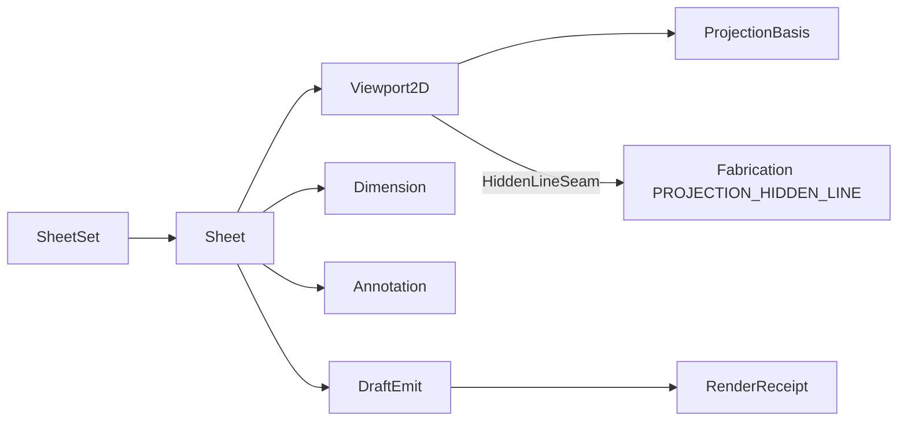

# [APPUI_DRAFTING_SHEETS]

The drafting rail produces 2D documentation from 3D geometry: `SheetSet` owns a locale-aware sheet collection with ISO/ANSI/JIS title-block templating, `Viewport2D` frames a 3D model view onto a sheet region by composing the single CAD-grade hidden-line owner `cs:Rasm.Fabrication/Posting/projection#PROJECTION_HIDDEN_LINE` (the BSP front-to-back visibility kernel) and projecting its world-space visible/hidden/silhouette edge sets to sheet space, `Dimension` and `Annotation` carry the dimensioning and GD&T annotation vocabulary as typed records, and `DraftEmit` renders the composed sheet to DWG/DXF/PDF/SVG through the offscreen document rail and the catalogued entity-writer surface. The page owns the sheet-set and title-block axis, the projection-to-sheet viewport frame, the dimension and GD&T annotation families, and the multi-format emit dispatch; the substrate is SkiaSharp 2D geometry behind the `DrawSource.Owned` capsule and the `SKDocument` PDF export, the `ACadSharp` `CadDocument` DWG and `netDxf` `DxfDocument` DXF model-space entity writers (`.api/api-drafting-export.md`), the locale culture for title-block fields, the `Viewpoint` camera for the projection basis, and the Compute geometry payload for the projected edges. The PDF, SVG, DWG, and DXF emit arms transcribe their writer bodies now; the live host-shared GPU hidden-line depth buffer is the `Render/viewport.md#RESEARCH` `[VIEWPORT_GPU]` consequence while the Fabrication BSP kernel is the CAD-grade visibility owner this page composes — AppUi mints no second hidden-line kernel and no second CAD writer.

## [01]-[INDEX]

- [01]-[SHEET_SET]: Sheet collection, locale-aware ISO/ANSI/JIS title-block templating.
- [02]-[PROJECTION]: 3D-to-2D hidden-line viewport frame, scale, projection basis.
- [03]-[DIMENSIONING]: Dimension and GD&T annotation vocabulary as typed records.
- [04]-[DRAFT_EMIT]: DWG/DXF/PDF/SVG multi-format emit over the document rail.

## [02]-[SHEET_SET]

- Owner: `SheetSize` `[SmartEnum<string>]` the standard sheet-size catalog; `TitleBlock` the locale-aware title-block record; `Sheet` the single sheet with its regions; `SheetSet` the sheet collection.
- Cases: `SheetSize` = a0…a4 (ISO 216) · ansi-a…ansi-e (ANSI/ASME Y14.1) · jis-b0…jis-b4 (JIS B) — the standard sheet rows carrying width, height, and standard family.
- Entry: `public Fin<Sheet> Compose(SheetSize size, TitleBlock title, Seq<SheetRegion> regions, ResolvedLocale locale)` — `Fin` aborts on a region outside the sheet bounds; the title-block fields resolve through the locale string vocabulary.
- Auto: `TitleBlock` carries the standard family so an ISO sheet draws the ISO border-and-zone grid, an ANSI sheet the ANSI title-block layout, and a JIS sheet the JIS layout from one templating fold; the title-block field labels (drawing number, title, scale, date, sheet n-of-m, revision) resolve through `ResolvedLocale.Label` so a localized drawing renders its field labels in the active culture and the date through the NodaTime pattern, never a hardcoded label string.
- Packages: Thinktecture.Runtime.Extensions, LanguageExt.Core, NodaTime, BCL inbox
- Growth: a new sheet size is one `SheetSize` row carrying its dimensions and standard family; a new title-block layout is one `TitleBlockStandard` value; a new field is one `TitleBlock` member; zero new surface.
- Boundary: sheet dimensions are millimeter row data traced here once — a call-site sheet-dimension literal is the deleted form; the title-block standard drives the border, zone-grid, and field layout from one fold so a per-standard title-block control is the deleted form; field labels and the date format ride `ResolvedLocale` so a `CultureInfo.CurrentCulture` read is the rejected form; sheet regions are placement rectangles in sheet millimeter space and a region outside the sheet bounds faults at compose, never at render; the sheet composes into the `FlowBlock` page run for PDF export so the document-pagination concern stays the visuals export owner and the drafting page mints no second pagination.

```csharp signature
[SmartEnum<string>]
public sealed partial class TitleBlockStandard {
    public static readonly TitleBlockStandard Iso = new("iso");
    public static readonly TitleBlockStandard Ansi = new("ansi");
    public static readonly TitleBlockStandard Jis = new("jis");
}

[SmartEnum<string>]
public sealed partial class SheetSize {
    public static readonly SheetSize A0 = new("a0", 841d, 1189d, TitleBlockStandard.Iso);
    public static readonly SheetSize A1 = new("a1", 594d, 841d, TitleBlockStandard.Iso);
    public static readonly SheetSize A2 = new("a2", 420d, 594d, TitleBlockStandard.Iso);
    public static readonly SheetSize A3 = new("a3", 297d, 420d, TitleBlockStandard.Iso);
    public static readonly SheetSize A4 = new("a4", 210d, 297d, TitleBlockStandard.Iso);
    public static readonly SheetSize AnsiA = new("ansi-a", 215.9d, 279.4d, TitleBlockStandard.Ansi);
    public static readonly SheetSize AnsiB = new("ansi-b", 279.4d, 431.8d, TitleBlockStandard.Ansi);
    public static readonly SheetSize AnsiC = new("ansi-c", 431.8d, 558.8d, TitleBlockStandard.Ansi);
    public static readonly SheetSize AnsiD = new("ansi-d", 558.8d, 863.6d, TitleBlockStandard.Ansi);
    public static readonly SheetSize AnsiE = new("ansi-e", 863.6d, 1117.6d, TitleBlockStandard.Ansi);
    public static readonly SheetSize JisB0 = new("jis-b0", 1030d, 1456d, TitleBlockStandard.Jis);
    public static readonly SheetSize JisB1 = new("jis-b1", 728d, 1030d, TitleBlockStandard.Jis);
    public static readonly SheetSize JisB2 = new("jis-b2", 515d, 728d, TitleBlockStandard.Jis);
    public static readonly SheetSize JisB3 = new("jis-b3", 364d, 515d, TitleBlockStandard.Jis);
    public static readonly SheetSize JisB4 = new("jis-b4", 257d, 364d, TitleBlockStandard.Jis);

    public double WidthMm { get; }

    public double HeightMm { get; }

    public TitleBlockStandard Standard { get; }

    public float PointWidth => (float)(WidthMm / 25.4d * 72d);

    public float PointHeight => (float)(HeightMm / 25.4d * 72d);
}

public sealed record TitleBlock(
    string DrawingNumber,
    string TitleKey,
    string Scale,
    LocalDate Date,
    int SheetNumber,
    int SheetCount,
    string Revision,
    TitleBlockStandard Standard) {
    public Seq<(string LabelKey, string Value)> Fields(ResolvedLocale locale) => Seq(
        ("draft.field.number", DrawingNumber),
        ("draft.field.title", locale.Label(TitleKey)),
        ("draft.field.scale", Scale),
        ("draft.field.date", locale.Day(Date)),
        ("draft.field.sheet", $"{SheetNumber}/{SheetCount}"),
        ("draft.field.revision", Revision));
}

public readonly record struct SheetRegion(string Key, double X, double Y, double Width, double Height);

public sealed record Sheet(string Key, SheetSize Size, TitleBlock Title, Seq<SheetRegion> Regions, Seq<Dimension> Dimensions, Seq<Annotation> Annotations);

public sealed record SheetSet(string Key, Seq<Sheet> Sheets) {
    public static Fin<Sheet> Compose(string key, SheetSize size, TitleBlock title, Seq<SheetRegion> regions, Seq<Dimension> dimensions, Seq<Annotation> annotations) =>
        regions.Find(region => region.X < 0d || region.Y < 0d || region.X + region.Width > size.WidthMm || region.Y + region.Height > size.HeightMm) is { IsSome: true, Case: SheetRegion bad }
            ? Fin.Fail<Sheet>(new DraftFault.RegionOutOfBounds($"{key}/{bad.Key}"))
            : Fin.Succ(new Sheet(key, size, title, regions, dimensions, annotations));
}
```

## [03]-[PROJECTION]

- Owner: `ProjectionBasis` the view-direction-and-scale projection; `Viewport2D` the model-view frame on a sheet region projecting the CAD-grade hidden-line edge sets to sheet space; `HiddenLineSeam` the composition-bound delegate column carrying the `cs:Rasm.Fabrication/Posting/projection#PROJECTION_HIDDEN_LINE` `Hlr.Solve` visibility solver as the one in-process producer.
- Entry: `public Fin<Seq<(SKPoint A, SKPoint B, EdgeStyle Style)>> Project(MeshSource mesh)` — the `Viewport2D` record carries its `Basis` and `Region`, so `Project` folds the model through the seam-bound Fabrication hidden-line solver to the world-space visible/hidden/silhouette `Edge3` sets, then projects each surviving sub-edge into sheet-space line segments under the basis, tagging each with its `EdgeStyle` (visible solid, hidden dashed, silhouette emphasized) and clipping to the region.
- Auto: `ProjectionBasis.From` derives the orthographic or perspective projection matrix from a `Viewpoint` camera so a saved 3D view drafts to a 2D viewport with the same basis — the drafting projection and the viewport camera share one camera vocabulary; standard views (top, front, right, iso) are basis presets; the projection scales model millimeters to sheet millimeters through the viewport scale so a 1:50 detail and a 1:1 detail are scale row values, never call-site arithmetic; visible-edge resolution composes the Fabrication BSP front-to-back visibility kernel — the `HiddenLineSeam` delegate runs the `Hlr.Solve` BSP-tree front-to-back occluder ordering plus Clipper2 open-path screen Boolean and returns the world-space `(Visible, Hidden, Silhouette)` `Edge3` sets, and `Viewport2D.Project` maps each set's sub-edges to the sheet through the basis and tags the style, so a concave self-occluding solid resolves CAD-grade rather than by a painter approximation.
- Packages: SkiaSharp, Thinktecture.Runtime.Extensions, LanguageExt.Core, Rasm.Compute (project), Rasm.Fabrication (project)
- Growth: a new standard view is one `ProjectionBasis` preset; a new line style is one `EdgeStyle` row; the hidden-line algorithm deepens at the single Fabrication owner, never in this page; zero new surface.
- Boundary: the projection basis derives from the `Viewpoint` camera so the drafting view and the GPU viewport share one camera shape and a second camera model is the deleted form; the projected geometry is the `MeshSource` boundary projection off the canonical Compute `GeometryPayload` so the page never re-tessellates — the same wire boundary the viewport meshlet build consumes; hidden-line removal is the single CAD-grade owner `cs:Rasm.Fabrication/Posting/projection#PROJECTION_HIDDEN_LINE` (the BSP front-to-back visibility solver plus the Clipper2 open-path screen clip) composed through the `HiddenLineSeam` in-process delegate column — the in-folder painter depth-sort `HiddenLine` is DROPPED root-up, the two-sided CONSUMPTION seam has Fabrication produce the world-space visible/hidden/silhouette `Edge3` sets and AppUi own the projection-to-sheet, and a re-minted painter back-to-front sort or a second hidden-line kernel here is the deleted form; the GPU depth-buffer hidden-line is the `Render/viewport.md#RESEARCH` `[VIEWPORT_GPU]` consequence the live render graph rides while the Fabrication BSP kernel is the deterministic CAD-grade producer this page composes today; viewport scale is millimeter-to-millimeter row data and a hardcoded scale factor is the rejected form; the projected segments draw through the `DrawSource.Owned` capsule into the sheet region so the drafting page mints no second Skia-surface owner.

```csharp signature
public sealed record ProjectionBasis(
    bool Perspective,
    (double X, double Y, double Z) Eye,
    (double X, double Y, double Z) Direction,
    (double X, double Y, double Z) Up,
    double Scale) {
    public static readonly ProjectionBasis Top = new(false, (0d, 0d, 1d), (0d, 0d, -1d), (0d, 1d, 0d), 1d);
    public static readonly ProjectionBasis Front = new(false, (0d, -1d, 0d), (0d, 1d, 0d), (0d, 0d, 1d), 1d);
    public static readonly ProjectionBasis Right = new(false, (1d, 0d, 0d), (-1d, 0d, 0d), (0d, 0d, 1d), 1d);
    public static readonly ProjectionBasis Iso = new(false, (1d, -1d, 1d), (-1d, 1d, -1d), (0d, 0d, 1d), 1d);

    public static ProjectionBasis From(ViewCamera camera, double scale) =>
        new(camera.Perspective,
            (camera.EyeX, camera.EyeY, camera.EyeZ),
            (camera.TargetX - camera.EyeX, camera.TargetY - camera.EyeY, camera.TargetZ - camera.EyeZ),
            (camera.UpX, camera.UpY, camera.UpZ),
            scale);

    public (double X, double Y) Map((double X, double Y, double Z) point) {
        var (rx, ry) = Screen(point);
        return (rx * Scale, ry * Scale);
    }

    private (double X, double Y) Screen((double X, double Y, double Z) point) {
        var (ux, uy, uz) = Normalize(Cross(Direction, Up));
        var (vx, vy, vz) = Up;
        return ((point.X * ux) + (point.Y * uy) + (point.Z * uz), (point.X * vx) + (point.Y * vy) + (point.Z * vz));
    }

    private static (double X, double Y, double Z) Cross((double X, double Y, double Z) a, (double X, double Y, double Z) b) =>
        ((a.Y * b.Z) - (a.Z * b.Y), (a.Z * b.X) - (a.X * b.Z), (a.X * b.Y) - (a.Y * b.X));

    private static (double X, double Y, double Z) Normalize((double X, double Y, double Z) v) =>
        Math.Sqrt((v.X * v.X) + (v.Y * v.Y) + (v.Z * v.Z)) switch {
            var len when len > 0d => (v.X / len, v.Y / len, v.Z / len),
            _ => (0d, 0d, 1d),
        };
}

[SmartEnum<string>]
public sealed partial class EdgeStyle {
    public static readonly EdgeStyle Visible = new("visible", dashed: false);
    public static readonly EdgeStyle Hidden = new("hidden", dashed: true);
    public static readonly EdgeStyle Centerline = new("centerline", dashed: true);

    public bool Dashed { get; }
}

public readonly record struct HiddenLineEdgeSets(
    Seq<((double X, double Y, double Z) A, (double X, double Y, double Z) B)> Visible,
    Seq<((double X, double Y, double Z) A, (double X, double Y, double Z) B)> Hidden,
    Seq<((double X, double Y, double Z) A, (double X, double Y, double Z) B)> Silhouette);

public sealed record HiddenLineSeam(
    Func<MeshSource, ProjectionBasis, Fin<HiddenLineEdgeSets>> Solve) {
    public Fin<HiddenLineEdgeSets> Resolve(MeshSource mesh, ProjectionBasis basis) => Solve(mesh, basis);
}

public sealed record Viewport2D(string Key, SheetRegion Region, ProjectionBasis Basis, HiddenLineSeam Hlr) {
    public Fin<Seq<(SKPoint A, SKPoint B, EdgeStyle Style)>> Project(MeshSource mesh) =>
        mesh.Positions.Length < 3
            ? Fin.Fail<Seq<(SKPoint A, SKPoint B, EdgeStyle Style)>>(new DraftFault.EmptyView(Key))
            : Hlr.Resolve(mesh, Basis).Map(sets =>
                Styled(sets.Visible, EdgeStyle.Visible)
                    + Styled(sets.Hidden, EdgeStyle.Hidden)
                    + Styled(sets.Silhouette, EdgeStyle.Visible));

    private Seq<(SKPoint A, SKPoint B, EdgeStyle Style)> Styled(
        Seq<((double X, double Y, double Z) A, (double X, double Y, double Z) B)> edges, EdgeStyle style) =>
        edges.Map(edge => (Point(edge.A), Point(edge.B), style));

    private SKPoint Point((double X, double Y, double Z) world) =>
        Basis.Map(world) switch { var p => new SKPoint((float)(Region.X + p.X), (float)(Region.Y - p.Y)) };
}
```

## [04]-[DIMENSIONING]

- Owner: `Dimension` `[Union]` the dimension vocabulary; `Tolerance` the tolerance value; `Annotation` `[Union]` the GD&T and text annotation vocabulary; `GdtFrame` the feature-control frame.
- Cases: `Dimension` = Linear | Aligned | Angular | Radial | Diametric | Ordinate under the locked kind literals; `Annotation` = Text | Leader | Datum | FeatureControl | SurfaceFinish | Weld under the locked kind literals.
- Entry: `public Fin<SKPath> Draw(ProjectionBasis basis, ResolvedLocale locale)` — projects the dimension into sheet-space extension lines, arrowheads, and the dimension text; the value formats through the locale quantity edge.
- Auto: each dimension carries its anchor points and the measured value, and `Draw` builds the extension lines, dimension line, arrowheads, and text from the dimension kind — a linear dimension draws horizontal-or-vertical extension lines, an aligned dimension parallel to the measured edge, an angular dimension an arc with the angle, a radial a leader from the arc center, a diametric a through-center line, and an ordinate a single offset value from the datum; the GD&T feature-control frame folds the geometric characteristic symbol, tolerance value, and datum references into the ASME Y14.5 frame layout; dimension values format through `ResolvedLocale.Quantity` so a metric or imperial drawing reads its values in the active unit and culture.
- Packages: SkiaSharp, Thinktecture.Runtime.Extensions, LanguageExt.Core, UnitsNet, BCL inbox
- Growth: a new dimension kind is one `Dimension` case; a new annotation kind is one `Annotation` case; a new GD&T characteristic is one `GeometricCharacteristic` row; zero new surface.
- Boundary: dimension geometry is built in sheet-space from the projected anchor points so a dimension follows its view — a free-floating annotation layer is the deleted form; the GD&T feature-control frame is the typed `GdtFrame` record so a hand-laid-out tolerance frame is the deleted form, and the geometric characteristic symbols (straightness, flatness, position, concentricity, and the rest) ride one `GeometricCharacteristic` smart-enum carrying its Unicode glyph; dimension text shapes through the typography rail's `DrawShapedText` so a raw `DrawText` loop is the rejected form; the tolerance value rides UnitsNet through the locale quantity edge so a tolerance reads in the drawing unit.

```csharp signature
public readonly record struct Tolerance(double Plus, double Minus) {
    public static readonly Tolerance None = new(0d, 0d);
    public bool Symmetric => Math.Abs(Plus - Minus) < double.Epsilon;
}

[SmartEnum<string>]
public sealed partial class GeometricCharacteristic {
    public static readonly GeometricCharacteristic Straightness = new("straightness", "⏤");
    public static readonly GeometricCharacteristic Flatness = new("flatness", "⏥");
    public static readonly GeometricCharacteristic Circularity = new("circularity", "○");
    public static readonly GeometricCharacteristic Cylindricity = new("cylindricity", "⌭");
    public static readonly GeometricCharacteristic Profile = new("profile", "⌓");
    public static readonly GeometricCharacteristic Perpendicularity = new("perpendicularity", "⟂");
    public static readonly GeometricCharacteristic Parallelism = new("parallelism", "∥");
    public static readonly GeometricCharacteristic Angularity = new("angularity", "∠");
    public static readonly GeometricCharacteristic Position = new("position", "⌖");
    public static readonly GeometricCharacteristic Concentricity = new("concentricity", "◎");
    public static readonly GeometricCharacteristic Symmetry = new("symmetry", "⌯");
    public static readonly GeometricCharacteristic Runout = new("runout", "↗");

    public string Glyph { get; }
}

public sealed record GdtFrame(GeometricCharacteristic Characteristic, double ToleranceValue, bool Diameter, Seq<string> Datums);

[Union(ConversionFromValue = ConversionOperatorsGeneration.None)]
public abstract partial record Dimension {
    private Dimension() { }
    public sealed record Linear((double X, double Y, double Z) A, (double X, double Y, double Z) B, double Offset, Tolerance Tolerance) : Dimension;
    public sealed record Aligned((double X, double Y, double Z) A, (double X, double Y, double Z) B, double Offset, Tolerance Tolerance) : Dimension;
    public sealed record Angular((double X, double Y, double Z) Vertex, (double X, double Y, double Z) A, (double X, double Y, double Z) B) : Dimension;
    public sealed record Radial((double X, double Y, double Z) Center, double Radius) : Dimension;
    public sealed record Diametric((double X, double Y, double Z) Center, double Diameter) : Dimension;
    public sealed record Ordinate((double X, double Y, double Z) Datum, (double X, double Y, double Z) Point) : Dimension;

    public double Measure => Switch(
        linear: static l => Distance(l.A, l.B),
        aligned: static a => Distance(a.A, a.B),
        angular: static a => Angle(a.Vertex, a.A, a.B),
        radial: static r => r.Radius,
        diametric: static d => d.Diameter,
        ordinate: static o => Distance(o.Datum, o.Point));

    private static double Distance((double X, double Y, double Z) a, (double X, double Y, double Z) b) =>
        Math.Sqrt(Math.Pow(a.X - b.X, 2) + Math.Pow(a.Y - b.Y, 2) + Math.Pow(a.Z - b.Z, 2));

    private static double Angle((double X, double Y, double Z) v, (double X, double Y, double Z) a, (double X, double Y, double Z) b) =>
        Math.Acos(Math.Clamp(
            (((a.X - v.X) * (b.X - v.X)) + ((a.Y - v.Y) * (b.Y - v.Y)) + ((a.Z - v.Z) * (b.Z - v.Z)))
                / (Distance(v, a) * Distance(v, b) + double.Epsilon), -1d, 1d)) * 180d / Math.PI;
}

[Union(ConversionFromValue = ConversionOperatorsGeneration.None)]
public abstract partial record Annotation {
    private Annotation() { }
    public sealed record Text(string Key, (double X, double Y) At, string Role) : Annotation;
    public sealed record Leader((double X, double Y) Tail, (double X, double Y) Head, string Key) : Annotation;
    public sealed record Datum(string Label, (double X, double Y) At) : Annotation;
    public sealed record FeatureControl(GdtFrame Frame, (double X, double Y) At) : Annotation;
    public sealed record SurfaceFinish(double Roughness, (double X, double Y) At) : Annotation;
    public sealed record Weld(string Symbol, (double X, double Y) At) : Annotation;
}
```

## [05]-[DRAFT_EMIT]

- Owner: `DraftFormat` `[SmartEnum<string>]` the emit-format axis; `DraftFault` the fault family; `DraftEmit` the multi-format emit dispatch.
- Cases: `DraftFormat` = pdf · svg · dwg · dxf under the locked kind literals; `DraftFault` = Text | RegionOutOfBounds | EmptyView | EntityWriterUnavailable in the 4600 code band.
- Entry: `public static IO<RenderReceipt> Emit(VisualRuntime runtime, Sheet sheet, DraftFormat format, ResolvedLocale locale, VisualDestination destination, Func<string, Option<MeshSource>> meshOf, HiddenLineSeam hlr)` — `IO` rail; the sheet projects each region through the `HiddenLineSeam` HLR, then renders to the format and delivers to the destination.
- Auto: the PDF arm composes each sheet as a `FlowBlock.Tile` page run through the visuals `SKDocument` export so a multi-sheet set is one paginated PDF; the SVG arm renders each sheet to an `SKCanvas` recording surface emitted as SVG text through `SKSvgCanvas`; the DWG arm writes the projected line/arc/text/dimension entities as model-space `ACadSharp` `Line`/`Arc`/`MText`/`Dimension` entities into a `CadDocument` and serializes through `DwgWriter.Write` (`.api/api-drafting-export.md` ENTRYPOINTS 7-8), the DXF arm writes the same entity run as `netDxf` `Line`/`Arc`/`MText` entities into a `DxfDocument` and serializes through `DxfDocument.Save` (ENTRYPOINTS 3-5) — both layer the visible solid, hidden dashed, and silhouette runs onto named `Layer`/`Layers` table entries carrying their `LineType`/`linetype` so the CAD layer structure round-trips the `EdgeStyle` tag; every emit lands one `RenderReceipt` of kind drawing carrying the format and the delivered destination.
- Receipt: one `RenderReceipt` of kind drawing per emit; sealed through the visuals encode receipt sink.
- Packages: SkiaSharp, ACadSharp, netDxf, Thinktecture.Runtime.Extensions, LanguageExt.Core, Rasm.AppHost (project)
- Growth: a new emit format is one `DraftFormat` row plus one `Emit` dispatch arm; a new CAD entity kind is one `SheetEntity` projection arm written into both the `CadDocument` and `DxfDocument`; zero new surface.
- Boundary: PDF and SVG ride the settled visuals document and Skia surfaces so the page mints no second exporter — the `SKDocument` PDF and the `SKSvgCanvas` SVG ship today; DWG writes through the `ACadSharp` `CadDocument`/`DwgWriter` typed-entity surface and DXF through the `netDxf` `DxfDocument` typed-entity surface — both go through the typed entity constructor then collection `Add`, never a raw group-code write (the `IMPLEMENTATION_LAW` LOCAL_ADMISSION reject), so the entity-writer bodies transcribe now and only the per-entity property spellings (the `Dimension` style table, the `MText` formatting codes) carry the residual DRAFT_ENTITY verification; the destination union is the visuals `VisualDestination` so the drafting emit delivers through the one destination owner and a drafting-local file write is the rejected form, the `SheetEntities` fold being the single projection of a `Sheet`'s viewports, dimensions, and title-block into the shared entity run both CAD writers consume so a DWG and a DXF of the same sheet carry identical entities; the emit receipt rides the visuals `RenderReceipt` family so the drafting page mints no second receipt vocabulary; vector content survives as picture content in PDF, path elements in SVG, and typed CAD entities in DWG/DXF so a drawing rasterizes only where the format demands.

```csharp signature
[Union]
public abstract partial record DraftFault : Expected, IValidationError<DraftFault> {
    private DraftFault(string detail, int code) : base(detail, code, None) { }

    public static DraftFault Create(string message) => new Text(message);

    public sealed record Text : DraftFault { public Text(string detail) : base(detail, 4600) { } }
    public sealed record RegionOutOfBounds : DraftFault { public RegionOutOfBounds(string detail) : base(detail, 4601) { } }
    public sealed record EmptyView : DraftFault { public EmptyView(string detail) : base(detail, 4602) { } }
    public sealed record EntityWriterUnavailable : DraftFault { public EntityWriterUnavailable(string detail) : base(detail, 4603) { } }
}

[SmartEnum<string>]
public sealed partial class DraftFormat {
    public static readonly DraftFormat Pdf = new("pdf", vector: true, native: true);
    public static readonly DraftFormat Svg = new("svg", vector: true, native: true);
    public static readonly DraftFormat Dwg = new("dwg", vector: true, native: false);
    public static readonly DraftFormat Dxf = new("dxf", vector: true, native: false);

    public bool Vector { get; }

    public bool Native { get; }
}

public readonly record struct SheetEntity(EdgeStyle Style, (double X, double Y) A, (double X, double Y) B);

public static class DraftEmit {
    public const string Kind = "drawing";

    public static IO<RenderReceipt> Emit(
        VisualRuntime runtime, Sheet sheet, DraftFormat format, ResolvedLocale locale, VisualDestination destination,
        Func<string, Option<MeshSource>> meshOf, HiddenLineSeam hlr) =>
        Project(sheet, meshOf, hlr).Match(
            Succ: entities => format.Key switch {
                var key when key == DraftFormat.Pdf.Key =>
                    VisualExport.Export(runtime, new VisualExportSpec("pdf", sheet.Size.PointWidth, sheet.Size.PointHeight,
                        Seq((Func<SKCanvas, Fin<Unit>>)(canvas => Render(canvas, sheet, entities, locale))), BreakRule.OnePerPage, destination)),
                var key when key == DraftFormat.Svg.Key => Svg(runtime, sheet, entities, locale, destination),
                var key when key == DraftFormat.Dwg.Key => CadEmit(runtime, sheet, entities, locale, destination, WriteDwg),
                _ => CadEmit(runtime, sheet, entities, locale, destination, WriteDxf),
            },
            Fail: error => IO.fail<RenderReceipt>(error));

    static Fin<Seq<SheetEntity>> Project(Sheet sheet, Func<string, Option<MeshSource>> meshOf, HiddenLineSeam hlr) =>
        sheet.Regions
            .Map(region => new Viewport2D(region.Key, region, ProjectionBasis.Top, hlr) switch {
                var view => meshOf(region.Key).Match(
                    Some: mesh => view.Project(mesh).Map(segs => segs.Map(s => new SheetEntity(s.Style, (s.A.X, s.A.Y), (s.B.X, s.B.Y)))),
                    None: () => Fin.Succ(Seq<SheetEntity>())),
            })
            .Fold(Fin.Succ(Seq<SheetEntity>()), (rail, region) => rail.Bind(acc => region.Map(acc.Concat)));

    static IO<RenderReceipt> Svg(VisualRuntime runtime, Sheet sheet, Seq<SheetEntity> entities, ResolvedLocale locale, VisualDestination destination) =>
        from bytes in IO.lift(() => {
            using MemoryStream sink = new();
            using (SKCanvas canvas = SKSvgCanvas.Create(new SKRect(0f, 0f, sheet.Size.PointWidth, sheet.Size.PointHeight), sink)) {
                ignore(Render(canvas, sheet, entities, locale));
            }
            return sink.ToArray();
        })
        from artifact in runtime.BlobWrite($"drawings/{sheet.Key}.svg", bytes)
        let receipt = new RenderReceipt(Kind, DraftFormat.Svg.Key, runtime.ContentHash(bytes), bytes.LongLength, Duration.Zero, runtime.Correlation, Optional(artifact), VisualCodec.ColorPolicy.Display.Key)
        from _ in runtime.Sink(receipt)
        select receipt;

    static IO<RenderReceipt> CadEmit(
        VisualRuntime runtime, Sheet sheet, Seq<SheetEntity> entities, ResolvedLocale locale, VisualDestination destination,
        Func<Sheet, Seq<SheetEntity>, ResolvedLocale, byte[]> write) =>
        from mark in IO.lift(runtime.Clocks.Mark)
        from bytes in IO.lift(() => write(sheet, entities, locale))
        from artifact in Deliver(runtime, destination, bytes)
        from elapsed in IO.lift(() => runtime.Clocks.Elapsed(mark))
        let format = destination is VisualDestination.FilePath { AbsolutePath: var p } && p.EndsWith("dxf", StringComparison.OrdinalIgnoreCase) ? DraftFormat.Dxf.Key : DraftFormat.Dwg.Key
        let receipt = new RenderReceipt(Kind, format, runtime.ContentHash(bytes), bytes.LongLength, elapsed, runtime.Correlation, Optional(artifact), VisualCodec.ColorPolicy.Display.Key)
        from _ in runtime.Sink(receipt)
        select receipt;

    static byte[] WriteDwg(Sheet sheet, Seq<SheetEntity> entities, ResolvedLocale locale) {
        CadDocument doc = new();
        LineType dashed = new("DASHED");
        doc.LineTypes.Add(dashed);
        Layer visible = new("draft-visible") { LineType = LineType.Continuous };
        Layer hidden = new("draft-hidden") { LineType = dashed };
        doc.Layers.Add(visible);
        doc.Layers.Add(hidden);
        entities.Iter(entity => {
            Line line = new(new CSMath.XYZ(entity.A.X, entity.A.Y, 0d), new CSMath.XYZ(entity.B.X, entity.B.Y, 0d)) {
                Layer = entity.Style.Dashed ? hidden : visible,
            };
            doc.Entities.Add(line);
        });
        TitleEntities(sheet, locale).Iter(text => doc.Entities.Add(text));
        using MemoryStream sink = new();
        DwgWriter.Write(sink, doc);
        return sink.ToArray();
    }

    static byte[] WriteDxf(Sheet sheet, Seq<SheetEntity> entities, ResolvedLocale locale) {
        netDxf.DxfDocument doc = new(netDxf.Header.DxfVersion.AutoCad2018);
        netDxf.Tables.Layer visible = new("draft-visible") { Linetype = netDxf.Tables.Linetype.Continuous };
        netDxf.Tables.Layer hidden = new("draft-hidden") { Linetype = netDxf.Tables.Linetype.Dashed };
        entities.Iter(entity => doc.Entities.Add(new netDxf.Entities.Line(
            new netDxf.Vector2(entity.A.X, entity.A.Y), new netDxf.Vector2(entity.B.X, entity.B.Y)) {
            Layer = entity.Style.Dashed ? hidden : visible,
        }));
        sheet.Title.Fields(locale).Iter((field, index) => doc.Entities.Add(new netDxf.Entities.MText(
            field.Value, new netDxf.Vector2(10d, sheet.Size.HeightMm - 10d - (index * 6d)), 3d)));
        using MemoryStream sink = new();
        doc.Save(sink);
        return sink.ToArray();
    }

    static Seq<MText> TitleEntities(Sheet sheet, ResolvedLocale locale) =>
        sheet.Title.Fields(locale).Map((field, index) => new MText {
            Value = field.Value,
            InsertPoint = new CSMath.XYZ(10d, sheet.Size.HeightMm - 10d - (index * 6d), 0d),
            Height = 3d,
        });

    static IO<string> Deliver(VisualRuntime runtime, VisualDestination destination, byte[] payload) =>
        destination.Switch(
            state: (runtime, payload),
            filePath: static (ctx, file) => IO.lift(() => { File.WriteAllBytes(file.AbsolutePath, ctx.payload); return file.AbsolutePath; }),
            blobLane: static (ctx, blob) => ctx.runtime.BlobWrite(blob.ArtifactKey, ctx.payload),
            bundle: static (ctx, bundle) => ctx.runtime.BundleWrite(bundle.ArtifactName, bundle.Classification, ctx.payload));

    static Fin<Unit> Render(SKCanvas canvas, Sheet sheet, Seq<SheetEntity> entities, ResolvedLocale locale) =>
        entities.Fold(FinSucc(unit), (rail, entity) => rail.Bind(_ => {
            using SKPaint paint = new() {
                Color = SKColors.Black, StrokeWidth = entity.Style == EdgeStyle.Visible ? 0.5f : 0.25f, IsStroke = true,
                PathEffect = entity.Style.Dashed ? SKPathEffect.CreateDash([3f, 2f], 0f) : null,
            };
            canvas.DrawLine((float)entity.A.X, (float)entity.A.Y, (float)entity.B.X, (float)entity.B.Y, paint);
            return FinSucc(unit);
        }));
}
```



## [06]-[RESEARCH]

- [DRAFT_ENTITY]: the DWG/DXF model-space entity-writer bodies transcribe now against the catalogued `ACadSharp` `CadDocument`/`Line`/`Layer`/`MText`/`DwgWriter.Write` and `netDxf` `DxfDocument`/`Line`/`Layer`/`MText`/`Save` surfaces (`.api/api-drafting-export.md`); the residual verification is the per-entity property spelling — `ACadSharp` exposes only the `LineType.Continuous`/`ByLayer`/`ByBlock` static singletons (NO `Dashed` singleton), so the hidden layer binds a constructed named `LineType("DASHED")` registered on `doc.LineTypes` whose `Segments` dash pattern resolves at implementation, while `netDxf.Tables.Linetype` does carry the `Continuous`/`Dashed` statics; the `CSMath.XYZ` point constructor, the `netDxf.Vector2`/`MText` height arity, and the `Dimension`-entity style-table mapping for a dimensioned drawing (`Dimension` entity is catalogued PUBLIC_TYPE but its style-table population resolves at implementation) resolve against the installed ACadSharp 3.6.29 / netDxf 2023.11.10 surface; the projected line run, the layer `EdgeStyle` mapping, the title-block text entities, the `DwgWriter.Write(Stream, CadDocument)` static (its config/notification tail defaulted), and the `SKSvgCanvas.Create(SKRect, Stream)` SVG path are settled.
- [HIDDEN_LINE_SEAM]: the CAD-grade hidden-line removal is the single Fabrication owner `cs:Rasm.Fabrication/Posting/projection#PROJECTION_HIDDEN_LINE` (`Hlr.Solve` over the BSP front-to-back visibility tree plus the Clipper2 open-path screen Boolean), composed here through the `HiddenLineSeam` in-process delegate column AppUi binds at composition — a two-sided CONSUMPTION seam where Fabrication produces the world-space `(Visible, Hidden, Silhouette)` `Edge3` sets and AppUi owns the projection-to-sheet; the in-folder painter depth-sort `HiddenLine` is DROPPED root-up, the `MeshSource`-to-`FabricationInput` adapter (the `ProjectionBasis`-to-`ProjectionDir` and `MeshSource`-to-`MeshSpace` projection) binds at the seam delegate where the Fabrication `FabricationInput`/`FabricationPolicy.HiddenLine` shape meets the AppUi `MeshSource`, and a re-minted painter sort here is the rejected form.
