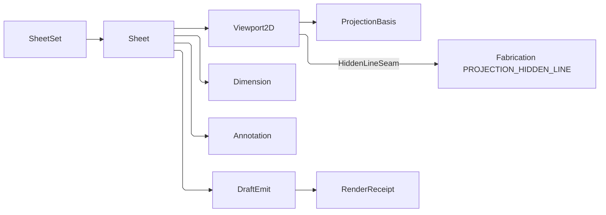

# [APPUI_DRAFTING_SHEETS]

The drafting rail produces 2D documentation from 3D geometry: `SheetSet` owns a locale-aware sheet collection with ISO/ANSI/JIS title-block templating, `Viewport2D` frames a `ViewCamera` onto a sheet region by composing the single CAD-grade hidden-line owner `cs:Rasm.Fabrication/Documentation/projection#PROJECTION_HIDDEN_LINE` and projecting its world-space visible, hidden, and silhouette edge sets to sheet space, `Dimension` and `Annotation` carry the dimensioning and GD&T annotation vocabulary as typed records, and `DraftEmit` renders the composed sheet to DWG, DXF, PDF, or SVG through the offscreen document rail and the catalogued entity-writer surface. The page owns the sheet-set and title-block axis, the projection-to-sheet viewport frame, the dimension and GD&T annotation families, and the multi-format emit dispatch. SkiaSharp supplies 2D geometry behind the `DrawSource.Owned` capsule and `SKDocument` PDF export; the write-scoped `ACadSharp` `CadDocument` fold supplies the `DwgWriter`, `DxfWriter`, and `SvgWriter` rows; the locale culture supplies title-block fields; the shared `ViewCamera` supplies the projection basis; and the Compute geometry payload supplies projected edges. The Fabrication projection seam remains the sole CAD-grade visibility owner, so AppUi mints neither a second hidden-line kernel nor a second CAD writer.

## [01]-[INDEX]

- [01]-[SHEET_SET]: Sheet collection, locale-aware ISO/ANSI/JIS title-block templating.
- [02]-[PROJECTION]: 3D-to-2D hidden-line viewport frame, scale, projection basis.
- [03]-[DIMENSIONING]: Dimension and GD&T annotation vocabulary as typed records.
- [04]-[DRAFT_EMIT]: DWG/DXF/PDF/SVG multi-format emit over the document rail.

## [02]-[SHEET_SET]

- Owner: `SheetSize` `[SmartEnum<string>]` the standard sheet-size catalog; `TitleBlock` the locale-aware title-block record; `Sheet` the single sheet with its regions; `SheetSet` the sheet collection.
- Cases: `SheetSize` = a0…a4 (ISO 216) · ansi-a…ansi-e (ANSI/ASME Y14.1) · jis-b0…jis-b4 (JIS B) — the standard sheet rows carrying width, height, and standard family.
- Entry: `public static Fin<Sheet> Compose(string key, SheetSize size, TitleBlock title, Seq<SheetRegion> regions, Seq<(string Region, Dimension Value)> dimensions, Seq<Annotation> annotations)` — `Fin` aborts on a region outside the sheet bounds and on a dimension naming an unresolved region; the title-block fields resolve through the locale string vocabulary at emit.
- Auto: `SheetSize.Standard` carries the standard family, so ISO, ANSI, and JIS sheets select their border, zone grid, and title-block geometry without duplicating that reconstructible choice on `TitleBlock`. `DraftEmit.TitleLayout` is one templating fold over the standard row's margin, zone, and block values; field labels and dates resolve through `ResolvedLocale`.
- Packages: Thinktecture.Runtime.Extensions, LanguageExt.Core, NodaTime, BCL inbox
- Growth: a new sheet size is one `SheetSize` row carrying its dimensions and standard family; a new title-block layout is one `TitleBlockStandard` value; a new field is one `TitleBlock` member; zero new surface.
- Boundary: sheet dimensions are millimeter row data traced here once — a call-site sheet-dimension literal is the deleted form; the title-block standard drives the border, zone-grid, and field layout from one fold so a per-standard title-block control is the deleted form; field labels and the date format ride `ResolvedLocale` so a `CultureInfo.CurrentCulture` read is the rejected form; sheet regions are placement rectangles in sheet millimeter space and a region outside the sheet bounds faults at compose, never at render; the sheet composes as precomposed vector page folds on the capture vector-print arm (a flow REPORT rides `Document/export.md#FLOW_REPORT`) so the document-pagination concern stays the export owner and the drafting page mints no second pagination.

```csharp signature
// Each standard row carries its frame geometry as ROW DATA — border margin, zone-grid divisions, and the
// title-block anchor rectangle — so the ISO/ANSI/JIS layouts diverge only in values and ONE templating
// fold (DraftEmit.TitleLayout) draws border, zone grid, block frame, and field cells for every standard.
[SmartEnum<string>]
public sealed partial class TitleBlockStandard {
    public static readonly TitleBlockStandard Iso = new("iso", marginMm: 10d, zoneColumns: 8, zoneRows: 6, blockWidthMm: 180d, blockHeightMm: 55d);
    public static readonly TitleBlockStandard Ansi = new("ansi", marginMm: 12.7d, zoneColumns: 4, zoneRows: 4, blockWidthMm: 165.1d, blockHeightMm: 63.5d);
    public static readonly TitleBlockStandard Jis = new("jis", marginMm: 10d, zoneColumns: 6, zoneRows: 4, blockWidthMm: 170d, blockHeightMm: 50d);

    public double MarginMm { get; }

    public int ZoneColumns { get; }

    public int ZoneRows { get; }

    public double BlockWidthMm { get; }

    public double BlockHeightMm { get; }
}

[SmartEnum<string>]
public sealed partial class SheetSize {
    public static readonly SheetSize A0 = new("a0", 841d, 1189d, TitleBlockStandard.Iso);
    public static readonly SheetSize A1 = new("a1", 594d, 841d, TitleBlockStandard.Iso);
    public static readonly SheetSize A2 = new("a2", 420d, 594d, TitleBlockStandard.Iso);
    public static readonly SheetSize A3 = new("a3", 297d, 420d, TitleBlockStandard.Iso);
    public static readonly SheetSize A4 = new("a4", 210d, 297d, TitleBlockStandard.Iso);
    public static readonly SheetSize AnsiA = new("ansi-a", 215.9d, 279.4d, TitleBlockStandard.Ansi);
    public static readonly SheetSize AnsiB = new("ansi-b", 279.4d, 431.8d, TitleBlockStandard.Ansi);
    public static readonly SheetSize AnsiC = new("ansi-c", 431.8d, 558.8d, TitleBlockStandard.Ansi);
    public static readonly SheetSize AnsiD = new("ansi-d", 558.8d, 863.6d, TitleBlockStandard.Ansi);
    public static readonly SheetSize AnsiE = new("ansi-e", 863.6d, 1117.6d, TitleBlockStandard.Ansi);
    public static readonly SheetSize JisB0 = new("jis-b0", 1030d, 1456d, TitleBlockStandard.Jis);
    public static readonly SheetSize JisB1 = new("jis-b1", 728d, 1030d, TitleBlockStandard.Jis);
    public static readonly SheetSize JisB2 = new("jis-b2", 515d, 728d, TitleBlockStandard.Jis);
    public static readonly SheetSize JisB3 = new("jis-b3", 364d, 515d, TitleBlockStandard.Jis);
    public static readonly SheetSize JisB4 = new("jis-b4", 257d, 364d, TitleBlockStandard.Jis);

    public double WidthMm { get; }

    public double HeightMm { get; }

    public TitleBlockStandard Standard { get; }

    public float PointWidth => (float)(WidthMm / 25.4d * 72d);

    public float PointHeight => (float)(HeightMm / 25.4d * 72d);
}

public sealed record TitleBlock(
    string DrawingNumber,
    string TitleKey,
    string Scale,
    LocalDate Date,
    int SheetNumber,
    int SheetCount,
    string Revision) {
    public Seq<(string LabelKey, string Value)> Fields(ResolvedLocale locale) => Seq(
        ("draft.field.number", DrawingNumber),
        ("draft.field.title", locale.Label(TitleKey)),
        ("draft.field.scale", Scale),
        ("draft.field.date", locale.Day(Date)),
        ("draft.field.sheet", $"{SheetNumber}/{SheetCount}"),
        ("draft.field.revision", Revision));
}

// Each region carries its OWN projection basis and model reference — no pinned view, no key conflation.
public readonly record struct SheetRegion(string Key, string ModelKey, ProjectionBasis Basis, double X, double Y, double Width, double Height);

// A dimension anchors in the world space of a NAMED region so emission resolves its projection basis;
// annotations are already sheet-space and carry no region key.
public sealed record Sheet(string Key, SheetSize Size, TitleBlock Title, Seq<SheetRegion> Regions, Seq<(string Region, Dimension Value)> Dimensions, Seq<Annotation> Annotations);

public sealed record SheetSet(string Key, Seq<Sheet> Sheets) {
    public static Fin<Sheet> Compose(string key, SheetSize size, TitleBlock title, Seq<SheetRegion> regions, Seq<(string Region, Dimension Value)> dimensions, Seq<Annotation> annotations) =>
        regions.Find(region => region.X < 0d || region.Y < 0d || region.X + region.Width > size.WidthMm || region.Y + region.Height > size.HeightMm) is { IsSome: true, Case: SheetRegion bad }
            ? Fin.Fail<Sheet>(new DraftFault.RegionOutOfBounds($"{key}/{bad.Key}"))
            : dimensions.Find(row => !regions.Exists(region => region.Key == row.Region)) is { IsSome: true, Case: (string orphan, _) }
                ? Fin.Fail<Sheet>(new DraftFault.RegionOutOfBounds($"{key}/dimension:{orphan}"))
                : Fin.Succ(new Sheet(key, size, title, regions, dimensions, annotations));
}
```

## [03]-[PROJECTION]

- Owner: `ProjectionBasis` the view-direction-and-scale projection; `Viewport2D` the model-view frame on a sheet region projecting the CAD-grade hidden-line edge sets to sheet space; `HiddenLineSeam` the composition-bound delegate column carrying the `cs:Rasm.Fabrication/Documentation/projection#PROJECTION_HIDDEN_LINE` `Hlr.Solve` visibility solver as the one in-process producer.
- Entry: `public Fin<Seq<(SKPoint A, SKPoint B, EdgeStyle Style)>> Project(MeshSource mesh)` — the `Viewport2D` record carries its `Basis` and `Region`, so `Project` folds the model through the seam-bound Fabrication hidden-line solver to the world-space visible/hidden/silhouette `Edge3` sets, then projects each surviving sub-edge into sheet-space line segments under the basis, tagging each with its `EdgeStyle` (visible solid `0.5`-weight, hidden dashed `0.25`-weight, silhouette emphasized `0.7`-weight) and clipping to the region — the silhouette set tags as the first-class `EdgeStyle.Silhouette` emphasized row, not folded into `Visible`, so the silhouette reads as a heavier outline.
- Auto: `ProjectionBasis.From` derives the orthographic or perspective projection matrix from a `Viewpoint` camera so a saved 3D view drafts to a 2D viewport with the same basis — the drafting projection and the viewport camera share one camera vocabulary; standard views (top, front, right, iso) are basis presets; the projection scales model millimeters to sheet millimeters through the viewport scale so a 1:50 detail and a 1:1 detail are scale row values, never call-site arithmetic; visible-edge resolution composes the Fabrication projection seam — the `HiddenLineSeam` delegate runs the `Hlr.Solve` exact quantitative-invisibility solve over the kernel's exact silhouette locus and screen crossing lattice, returning the world-space visible, hidden, and silhouette edge sets, and `Viewport2D.Project` maps each set's sub-edges to the sheet through the basis and tags the style, so a concave self-occluding solid resolves by exact sign rather than by a depth-sorted painter approximation.
- Packages: SkiaSharp, Thinktecture.Runtime.Extensions, LanguageExt.Core, Rasm.Compute (project), Rasm.Fabrication (project)
- Growth: a new standard view is one `ProjectionBasis` preset; a new line style is one `EdgeStyle` row; the hidden-line algorithm deepens at the single Fabrication owner, never in this page; zero new surface.
- Boundary: `ProjectionBasis` consumes the shared `ViewCamera`, and `MeshSource` projects the canonical Compute geometry without re-tessellation. Fabrication's `Hlr.Solve` supplies world-space visible, hidden, and silhouette edge sets through `HiddenLineSeam`; AppUi projects those sets to sheet space and emphasizes `Silhouette` with the `EdgeStyle.Silhouette` row. Viewport scale remains millimeter-to-millimeter data, and projected segments draw through `DrawSource.Owned`, so the page owns neither a second camera, hidden-line kernel, nor Skia surface.

```csharp signature
public sealed record ProjectionBasis(ViewCamera Camera, double Scale) {
    public static readonly ProjectionBasis Top = Orthographic(
        new System.Numerics.Vector3(0f, 0f, 1f), new System.Numerics.Vector3(0f, 0f, 0f), System.Numerics.Vector3.UnitY);
    public static readonly ProjectionBasis Front = Orthographic(
        new System.Numerics.Vector3(0f, -1f, 0f), new System.Numerics.Vector3(0f, 0f, 0f), System.Numerics.Vector3.UnitZ);
    public static readonly ProjectionBasis Right = Orthographic(
        new System.Numerics.Vector3(1f, 0f, 0f), new System.Numerics.Vector3(0f, 0f, 0f), System.Numerics.Vector3.UnitZ);
    public static readonly ProjectionBasis Iso = Orthographic(
        new System.Numerics.Vector3(1f, -1f, 1f), new System.Numerics.Vector3(0f, 0f, 0f), System.Numerics.Vector3.UnitZ);

    public static ProjectionBasis From(ViewCamera camera, double scale) =>
        new(camera, scale);

    public (double X, double Y) Map((double X, double Y, double Z) point) {
        (double rx, double ry) = Screen(point);
        return (rx * Scale, ry * Scale);
    }

    private (double X, double Y) Screen((double X, double Y, double Z) point) {
        CameraFrame frame = Camera.Frame;
        (double fx, double fy, double fz) = Normalize((frame.Target.X - frame.Eye.X, frame.Target.Y - frame.Eye.Y, frame.Target.Z - frame.Eye.Z));
        (double rx, double ry, double rz) = Normalize(Cross((fx, fy, fz), (frame.Up.X, frame.Up.Y, frame.Up.Z)));
        (double ux, double uy, double uz) = Cross((rx, ry, rz), (fx, fy, fz));
        (double px, double py, double pz) = (point.X - frame.Eye.X, point.Y - frame.Eye.Y, point.Z - frame.Eye.Z);
        (double x, double y, double z) = (
            (px * rx) + (py * ry) + (pz * rz),
            (px * ux) + (py * uy) + (pz * uz),
            (px * fx) + (py * fy) + (pz * fz));
        return Camera.Switch(
            state: (X: x, Y: y, Z: z),
            perspective: static (projected, lens) => (
                projected.X / Math.Max(projected.Z * Math.Tan(double.DegreesToRadians(lens.FieldOfViewDeg) / 2d), 1e-9),
                projected.Y / Math.Max(projected.Z * Math.Tan(double.DegreesToRadians(lens.FieldOfViewDeg) / 2d), 1e-9)),
            orthographic: static (projected, _) => (projected.X, projected.Y));
    }

    private static ProjectionBasis Orthographic(System.Numerics.Vector3 eye, System.Numerics.Vector3 target, System.Numerics.Vector3 up) =>
        new(new ViewCamera.Orthographic(new CameraFrame(eye, target, up), 1d), 1d);

    private static (double X, double Y, double Z) Cross((double X, double Y, double Z) a, (double X, double Y, double Z) b) =>
        ((a.Y * b.Z) - (a.Z * b.Y), (a.Z * b.X) - (a.X * b.Z), (a.X * b.Y) - (a.Y * b.X));

    private static (double X, double Y, double Z) Normalize((double X, double Y, double Z) v) =>
        Math.Sqrt((v.X * v.X) + (v.Y * v.Y) + (v.Z * v.Z)) switch {
            var len when len > 0d => (v.X / len, v.Y / len, v.Z / len),
            _ => (0d, 0d, 1d),
        };
}

[SmartEnum<string>]
public sealed partial class EdgeStyle {
    public static readonly EdgeStyle Visible = new("visible", dashed: false, weight: 0.5f);
    public static readonly EdgeStyle Hidden = new("hidden", dashed: true, weight: 0.25f);
    public static readonly EdgeStyle Silhouette = new("silhouette", dashed: false, weight: 0.7f);
    public static readonly EdgeStyle Centerline = new("centerline", dashed: true, weight: 0.25f);
    public static readonly EdgeStyle Marking = new("marking", dashed: false, weight: 0.25f);

    public bool Dashed { get; }

    public float Weight { get; }
}

public readonly record struct HiddenLineEdgeSets(
    Seq<((double X, double Y, double Z) A, (double X, double Y, double Z) B)> Visible,
    Seq<((double X, double Y, double Z) A, (double X, double Y, double Z) B)> Hidden,
    Seq<((double X, double Y, double Z) A, (double X, double Y, double Z) B)> Silhouette);

public sealed record HiddenLineSeam(
    Func<MeshSource, ProjectionBasis, Fin<HiddenLineEdgeSets>> Solve) {
    public Fin<HiddenLineEdgeSets> Resolve(MeshSource mesh, ProjectionBasis basis) => Solve(mesh, basis);
}

public sealed record Viewport2D(string Key, SheetRegion Region, ProjectionBasis Basis, HiddenLineSeam Hlr) {
    public Fin<Seq<(SKPoint A, SKPoint B, EdgeStyle Style)>> Project(MeshSource mesh) =>
        mesh.Positions.Length < 3
            ? Fin.Fail<Seq<(SKPoint A, SKPoint B, EdgeStyle Style)>>(new DraftFault.EmptyView(Key))
            : Hlr.Resolve(mesh, Basis).Map(sets =>
                Styled(sets.Visible, EdgeStyle.Visible)
                    + Styled(sets.Hidden, EdgeStyle.Hidden)
                    + Styled(sets.Silhouette, EdgeStyle.Silhouette));

    private Seq<(SKPoint A, SKPoint B, EdgeStyle Style)> Styled(
        Seq<((double X, double Y, double Z) A, (double X, double Y, double Z) B)> edges, EdgeStyle style) =>
        edges.Choose(edge => Clip(Point(edge.A), Point(edge.B)).Map(segment => (segment.A, segment.B, style)));

    private SKPoint Point((double X, double Y, double Z) world) =>
        Basis.Map(world) switch { var p => new SKPoint((float)(Region.X + p.X), (float)(Region.Y - p.Y)) };

    private Option<(SKPoint A, SKPoint B)> Clip(SKPoint a, SKPoint b) {
        float minX = (float)Region.X;
        float minY = (float)Region.Y;
        float maxX = (float)(Region.X + Region.Width);
        float maxY = (float)(Region.Y + Region.Height);
        float dx = b.X - a.X;
        float dy = b.Y - a.Y;
        (float Enter, float Exit) interval = (0f, 1f);
        (float P, float Q)[] planes = [(-dx, a.X - minX), (dx, maxX - a.X), (-dy, a.Y - minY), (dy, maxY - a.Y)];
        foreach ((float p, float q) in planes) {
            if (p == 0f && q < 0f) { return None; }
            if (p == 0f) { continue; }
            float t = q / p;
            interval = p < 0f
                ? (MathF.Max(interval.Enter, t), interval.Exit)
                : (interval.Enter, MathF.Min(interval.Exit, t));
            if (interval.Enter > interval.Exit) { return None; }
        }
        return Some((
            new SKPoint(a.X + (interval.Enter * dx), a.Y + (interval.Enter * dy)),
            new SKPoint(a.X + (interval.Exit * dx), a.Y + (interval.Exit * dy))));
    }
}
```

## [04]-[DIMENSIONING]

- Owner: `Dimension` `[Union]` the dimension vocabulary; `Tolerance` the tolerance value; `Annotation` `[Union]` the GD&T and text annotation vocabulary; `GdtFrame` the feature-control frame.
- Cases: `Dimension` = Linear | Aligned | Angular | Radial | Diametric | Ordinate under the locked kind literals; `Annotation` = Text | Leader | Datum | FeatureControl | SurfaceFinish | Weld under the locked kind literals.
- Entry: `public Seq<SheetEntity> Entities(Func<(double X, double Y, double Z), (double X, double Y)> project, ResolvedLocale locale)` — the ONE dimension-to-entity projection: sheet-space extension lines, the offset dimension line, terminal ticks, arcs, and the locale-formatted value as a `TextRun`, consumed identically by every emit format; `Annotation.Entities(ResolvedLocale)` is the sibling projection for the annotation family.
- Auto: each dimension carries its anchor points and the measured value, and `Entities` builds the extension lines, dimension line, ticks, and text from the dimension kind — a linear or aligned dimension spans its projected anchors under its offset, an angular dimension sweeps an arc at the vertex with both legs, a radial and a diametric draw the center ray with the `R`/`⌀` prefix, and an ordinate draws the datum elbow; the GD&T feature-control frame folds the geometric characteristic `Glyph`, tolerance value, and datum references into the ASME Y14.5 box-stroke frame layout; dimension values and tolerances format through `ResolvedLocale.Quantity` so a metric or imperial drawing reads its values in the active unit and culture, the `±` symmetric and `+/-` asymmetric tolerance spellings deriving from `Tolerance.Symmetric`.
- Packages: SkiaSharp, Thinktecture.Runtime.Extensions, LanguageExt.Core, UnitsNet, BCL inbox
- Growth: a new dimension kind is one `Dimension` case; a new annotation kind is one `Annotation` case; a new GD&T characteristic is one `GeometricCharacteristic` row; zero new surface.
- Boundary: dimension geometry is built in sheet-space from the projected anchor points so a dimension follows its view — a free-floating annotation layer is the deleted form, and each dimension names its owning region so emission resolves the projection basis the anchors ride; the GD&T feature-control frame is the typed `GdtFrame` record so a hand-laid-out tolerance frame is the deleted form, and the geometric characteristic symbols (straightness, flatness, position, concentricity, and the rest) ride one `GeometricCharacteristic` smart-enum carrying its Unicode glyph; dimension and annotation text lands as `SheetEntity.TextRun`/`Glyph` cases rendered through the `ShapedTextSeam` typography column so a raw `DrawText` loop is the rejected form; the tolerance value rides UnitsNet through the locale quantity edge so a tolerance reads in the drawing unit.

```csharp signature
public readonly record struct Tolerance(double Plus, double Minus) {
    public static readonly Tolerance None = new(0d, 0d);
    public bool Symmetric => Math.Abs(Plus - Minus) < double.Epsilon;
}

[SmartEnum<string>]
public sealed partial class GeometricCharacteristic {
    public static readonly GeometricCharacteristic Straightness = new("straightness", "⏤");
    public static readonly GeometricCharacteristic Flatness = new("flatness", "⏥");
    public static readonly GeometricCharacteristic Circularity = new("circularity", "○");
    public static readonly GeometricCharacteristic Cylindricity = new("cylindricity", "⌭");
    public static readonly GeometricCharacteristic Profile = new("profile", "⌓");
    public static readonly GeometricCharacteristic Perpendicularity = new("perpendicularity", "⟂");
    public static readonly GeometricCharacteristic Parallelism = new("parallelism", "∥");
    public static readonly GeometricCharacteristic Angularity = new("angularity", "∠");
    public static readonly GeometricCharacteristic Position = new("position", "⌖");
    public static readonly GeometricCharacteristic Concentricity = new("concentricity", "◎");
    public static readonly GeometricCharacteristic Symmetry = new("symmetry", "⌯");
    public static readonly GeometricCharacteristic Runout = new("runout", "↗");

    public string Glyph { get; }
}

public sealed record GdtFrame(GeometricCharacteristic Characteristic, double ToleranceValue, bool Diameter, Seq<string> Datums);

[Union(ConversionFromValue = ConversionOperatorsGeneration.None)]
public abstract partial record Dimension {
    private Dimension() { }
    public sealed record Linear((double X, double Y, double Z) A, (double X, double Y, double Z) B, double Offset, Tolerance Tolerance) : Dimension;
    public sealed record Aligned((double X, double Y, double Z) A, (double X, double Y, double Z) B, double Offset, Tolerance Tolerance) : Dimension;
    public sealed record Angular((double X, double Y, double Z) Vertex, (double X, double Y, double Z) A, (double X, double Y, double Z) B) : Dimension;
    public sealed record Radial((double X, double Y, double Z) Center, double Radius) : Dimension;
    public sealed record Diametric((double X, double Y, double Z) Center, double Diameter) : Dimension;
    public sealed record Ordinate((double X, double Y, double Z) Datum, (double X, double Y, double Z) Point) : Dimension;

    public double Measure => Switch(
        linear: static l => Distance(l.A, l.B),
        aligned: static a => Distance(a.A, a.B),
        angular: static a => Angle(a.Vertex, a.A, a.B),
        radial: static r => r.Radius,
        diametric: static d => d.Diameter,
        ordinate: static o => Distance(o.Datum, o.Point));

    // The ONE dimension-to-entity projection every emit format consumes: extension lines, the offset
    // dimension line, tick strokes, and the locale-formatted value as a TextRun — sheet space throughout.
    public Seq<SheetEntity> Entities(Func<(double X, double Y, double Z), (double X, double Y)> project, ResolvedLocale locale) => Switch(
        state: (Project: project, Locale: locale),
        linear:    static (ctx, l) => Span(ctx.Project(l.A), ctx.Project(l.B), l.Offset, Label(l.Measure, l.Tolerance, ctx.Locale)),
        aligned:   static (ctx, a) => Span(ctx.Project(a.A), ctx.Project(a.B), a.Offset, Label(a.Measure, a.Tolerance, ctx.Locale)),
        angular:   static (ctx, a) => Wedge(ctx.Project(a.Vertex), ctx.Project(a.A), ctx.Project(a.B), $"{ctx.Locale.Quantity(a.Measure)}°"),
        radial:    static (ctx, r) => Ray(ctx.Project(r.Center), r.Radius, $"R{ctx.Locale.Quantity(r.Measure)}"),
        diametric: static (ctx, d) => Ray(ctx.Project(d.Center), d.Diameter * 0.5d, $"⌀{ctx.Locale.Quantity(d.Measure)}"),
        ordinate:  static (ctx, o) => Elbow(ctx.Project(o.Datum), ctx.Project(o.Point), ctx.Locale.Quantity(o.Measure)));

    private static string Label(double measure, Tolerance tolerance, ResolvedLocale locale) =>
        tolerance == Tolerance.None
            ? locale.Quantity(measure)
            : tolerance.Symmetric
                ? $"{locale.Quantity(measure)} ±{locale.Quantity(tolerance.Plus)}"
                : $"{locale.Quantity(measure)} +{locale.Quantity(tolerance.Plus)}/-{locale.Quantity(tolerance.Minus)}";

    private static Seq<SheetEntity> Span((double X, double Y) a, (double X, double Y) b, double offset, string label) {
        (double dx, double dy) = (b.X - a.X, b.Y - a.Y);
        double length = Math.Max(Math.Sqrt((dx * dx) + (dy * dy)), double.Epsilon);
        (double nx, double ny) = (-dy / length * offset, dx / length * offset);
        ((double X, double Y) a2, (double X, double Y) b2) = ((a.X + nx, a.Y + ny), (b.X + nx, b.Y + ny));
        return Seq<SheetEntity>(
            new SheetEntity.Stroke(EdgeStyle.Marking, a, a2),
            new SheetEntity.Stroke(EdgeStyle.Marking, b, b2),
            new SheetEntity.Stroke(EdgeStyle.Marking, a2, b2),
            Tick(a2, dx / length, dy / length), Tick(b2, dx / length, dy / length),
            new SheetEntity.TextRun(label, ((a2.X + b2.X) * 0.5d, (a2.Y + b2.Y) * 0.5d), 3d, "annotation"));
    }

    // The architectural 45° tick at a dimension-line terminus.
    private static SheetEntity Tick((double X, double Y) at, double ux, double uy) =>
        new SheetEntity.Stroke(EdgeStyle.Marking, (at.X - ((ux - uy) * 1.2d), at.Y - ((uy + ux) * 1.2d)), (at.X + ((ux - uy) * 1.2d), at.Y + ((uy + ux) * 1.2d)));

    private static Seq<SheetEntity> Wedge((double X, double Y) vertex, (double X, double Y) a, (double X, double Y) b, string label) {
        double radius = Math.Min(Hypot(vertex, a), Hypot(vertex, b)) * 0.6d;
        (double startDeg, double endDeg) = (Deg(vertex, a), Deg(vertex, b));
        return Seq<SheetEntity>(
            new SheetEntity.Stroke(EdgeStyle.Marking, vertex, a),
            new SheetEntity.Stroke(EdgeStyle.Marking, vertex, b),
            new SheetEntity.Sweep(EdgeStyle.Marking, vertex, radius, startDeg, endDeg - startDeg),
            new SheetEntity.TextRun(label, (vertex.X + radius, vertex.Y - radius), 3d, "annotation"));
    }

    private static Seq<SheetEntity> Ray((double X, double Y) center, double reach, string label) => Seq<SheetEntity>(
        new SheetEntity.Stroke(EdgeStyle.Marking, center, (center.X + reach, center.Y)),
        new SheetEntity.TextRun(label, (center.X + (reach * 0.5d), center.Y - 2d), 3d, "annotation"));

    private static Seq<SheetEntity> Elbow((double X, double Y) datum, (double X, double Y) point, string label) => Seq<SheetEntity>(
        new SheetEntity.Stroke(EdgeStyle.Marking, datum, (point.X, datum.Y)),
        new SheetEntity.Stroke(EdgeStyle.Marking, (point.X, datum.Y), point),
        new SheetEntity.TextRun(label, point, 3d, "annotation"));

    private static double Hypot((double X, double Y) a, (double X, double Y) b) =>
        Math.Sqrt(Math.Pow(b.X - a.X, 2) + Math.Pow(b.Y - a.Y, 2));

    private static double Deg((double X, double Y) origin, (double X, double Y) to) =>
        Math.Atan2(to.Y - origin.Y, to.X - origin.X) * 180d / Math.PI;

    private static double Distance((double X, double Y, double Z) a, (double X, double Y, double Z) b) =>
        Math.Sqrt(Math.Pow(a.X - b.X, 2) + Math.Pow(a.Y - b.Y, 2) + Math.Pow(a.Z - b.Z, 2));

    private static double Angle((double X, double Y, double Z) v, (double X, double Y, double Z) a, (double X, double Y, double Z) b) =>
        Math.Acos(Math.Clamp(
            (((a.X - v.X) * (b.X - v.X)) + ((a.Y - v.Y) * (b.Y - v.Y)) + ((a.Z - v.Z) * (b.Z - v.Z)))
                / (Distance(v, a) * Distance(v, b) + double.Epsilon), -1d, 1d)) * 180d / Math.PI;
}

[Union(ConversionFromValue = ConversionOperatorsGeneration.None)]
public abstract partial record Annotation {
    private Annotation() { }
    public sealed record Text(string Key, (double X, double Y) At, string Role) : Annotation;
    public sealed record Leader((double X, double Y) Tail, (double X, double Y) Head, string Key) : Annotation;
    public sealed record Datum(string Label, (double X, double Y) At) : Annotation;
    public sealed record FeatureControl(GdtFrame Frame, (double X, double Y) At) : Annotation;
    public sealed record SurfaceFinish(double Roughness, (double X, double Y) At) : Annotation;
    public sealed record Weld(string Symbol, (double X, double Y) At) : Annotation;

    // The ONE annotation-to-entity projection every emit format consumes — the ASME Y14.5 frame renders
    // as its box strokes plus the characteristic Glyph, so no format-specific annotation arm exists.
    public Seq<SheetEntity> Entities(ResolvedLocale locale) => Switch(
        state: locale,
        text:    static (l, t) => Seq<SheetEntity>(new SheetEntity.TextRun(l.Label(t.Key), t.At, 3d, t.Role)),
        leader:  static (l, a) => Seq<SheetEntity>(
            new SheetEntity.Stroke(EdgeStyle.Marking, a.Tail, a.Head),
            new SheetEntity.TextRun(l.Label(a.Key), a.Tail, 3d, "annotation")),
        datum:   static (_, d) => Box(d.At, 6d, 6d)
            .Add(new SheetEntity.TextRun(d.Label, (d.At.X + 1.5d, d.At.Y + 1.5d), 3d, "annotation")),
        featureControl: static (l, f) => Box(f.At, 10d + (f.Frame.Datums.Count * 6d), 6d)
            .Add(new SheetEntity.Glyph(f.Frame.Characteristic.Glyph, (f.At.X + 1d, f.At.Y + 1.5d), 3d))
            .Add(new SheetEntity.TextRun(
                $"{(f.Frame.Diameter ? "⌀" : string.Empty)}{l.Quantity(f.Frame.ToleranceValue)} {string.Join('|', f.Frame.Datums)}",
                (f.At.X + 5d, f.At.Y + 1.5d), 3d, "annotation")),
        surfaceFinish: static (l, s) => Seq<SheetEntity>(
            new SheetEntity.Glyph("√", s.At, 3d),
            new SheetEntity.TextRun(l.Quantity(s.Roughness), (s.At.X + 3d, s.At.Y - 2d), 2.5d, "annotation")),
        weld:    static (_, w) => Seq<SheetEntity>(
            new SheetEntity.Stroke(EdgeStyle.Marking, w.At, (w.At.X + 8d, w.At.Y)),
            new SheetEntity.Glyph(w.Symbol, (w.At.X + 3d, w.At.Y - 3d), 3d)));

    private static Seq<SheetEntity> Box((double X, double Y) at, double width, double height) => Seq<SheetEntity>(
        new SheetEntity.Stroke(EdgeStyle.Marking, at, (at.X + width, at.Y)),
        new SheetEntity.Stroke(EdgeStyle.Marking, (at.X + width, at.Y), (at.X + width, at.Y + height)),
        new SheetEntity.Stroke(EdgeStyle.Marking, (at.X + width, at.Y + height), (at.X, at.Y + height)),
        new SheetEntity.Stroke(EdgeStyle.Marking, (at.X, at.Y + height), at));
}
```

## [05]-[DRAFT_EMIT]

- Owner: `DraftFormat` `[SmartEnum<string>]` the emit-format axis; `DraftFault` the fault family; `DraftEmit` the multi-format emit dispatch.
- Cases: `DraftFormat` = pdf · svg · dwg · dxf under the locked kind literals; `DraftFault` = Text | RegionOutOfBounds | EmptyView | EntityWriterUnavailable — codes derive through the `AppUiFaultBand.Draft` registry row (6140).
- Entry: `public static IO<RenderReceipt> Emit(VisualRuntime runtime, Sheet sheet, DraftFormat format, ResolvedLocale locale, CadVersionPolicy cadVersion, VisualDestination destination, Func<string, Option<MeshSource>> meshOf, HiddenLineSeam hlr, ShapedTextSeam text)` — `IO` rail; the sheet projects ONCE into the complete `SheetEntity` run — per-region hidden-line strokes, region-basis-projected dimensions, annotations, title-block runs — then every format arm renders that one run and delivers to the destination, the CAD arms threading the one version-policy row to their writer.
- Auto: PDF folds each sheet through `VisualExport`; SVG, DWG, and DXF consume the same `CadDocument` entity run through `SvgWriter`, `DwgWriter`, or `DxfWriter`. `Stroke`, `Sweep`, `TextRun`, and `Glyph` project once into `Line`, `Arc`, and `MText`; every `EdgeStyle` row owns a registered layer and a real line type, including the ordered dash-gap pattern. Every emit seals one drawing `RenderReceipt` with format, elapsed duration, and delivered destination.
- Receipt: one `RenderReceipt` of kind drawing per emit; sealed through the visuals encode receipt sink.
- Packages: SkiaSharp, ACadSharp, Thinktecture.Runtime.Extensions, LanguageExt.Core, Rasm.AppHost (project)
- Growth: a new emit format is one `DraftFormat` row plus one `Emit` dispatch arm; a new drawn primitive is one `SheetEntity` case that breaks the Skia render and the `CadDocument` fold at compile time so no format can silently drop it; a new line style is one `EdgeStyle` row that mints its CAD layer by construction; zero new surface.
- Boundary: PDF consumes `PrintFormat.Pdf`, while SVG, DWG, and DXF write through one typed `CadDocument` fold. `CadVersionPolicy` supplies format version and SVG line-weight policy, and `ExportDelivery.Deliver` owns every destination. One `Project` fold produces the complete `SheetEntity` run consumed by all four formats, and every arm measures elapsed time on the shared `RenderReceipt` family. Vector content remains vector in PDF, SVG, DWG, and DXF.

```csharp signature
[Union]
public abstract partial record DraftFault : Expected, IValidationError<DraftFault> {
    private DraftFault(string detail, int code) : base(detail, code, None) { }

    public static DraftFault Create(string message) => new Text(message);

    public sealed record Text : DraftFault { public Text(string detail) : base(detail, AppUiFaultBand.Draft.Code(0)) { } }
    public sealed record RegionOutOfBounds : DraftFault { public RegionOutOfBounds(string detail) : base(detail, AppUiFaultBand.Draft.Code(1)) { } }
    public sealed record EmptyView : DraftFault { public EmptyView(string detail) : base(detail, AppUiFaultBand.Draft.Code(2)) { } }
    public sealed record EntityWriterUnavailable : DraftFault { public EntityWriterUnavailable(string detail) : base(detail, AppUiFaultBand.Draft.Code(3)) { } }
}

[SmartEnum<string>]
public sealed partial class DraftFormat {
    public static readonly DraftFormat Pdf = new("pdf");
    public static readonly DraftFormat Svg = new("svg");
    public static readonly DraftFormat Dwg = new("dwg");
    public static readonly DraftFormat Dxf = new("dxf");
}

// The ONE drawn-primitive vocabulary every emit format consumes — viewport edges, dimension linework,
// arcs, shaped text, and symbol glyphs are cases of one closed family, so no format can drop a
// drawing-vocabulary axis without a compile break at its dispatch.
[Union(ConversionFromValue = ConversionOperatorsGeneration.None)]
public abstract partial record SheetEntity {
    private SheetEntity() { }
    public sealed record Stroke(EdgeStyle Style, (double X, double Y) A, (double X, double Y) B) : SheetEntity;
    public sealed record Sweep(EdgeStyle Style, (double X, double Y) Center, double Radius, double StartDeg, double SweepDeg) : SheetEntity;
    public sealed record TextRun(string Value, (double X, double Y) At, double Height, string Role) : SheetEntity;
    public sealed record Glyph(string Symbol, (double X, double Y) At, double Height) : SheetEntity;
}

// The composition-bound shaped-text column: drafting text rasters through the typography shaping rail
// (HarfBuzz DrawShapedText under the role's resolved font), never a raw DrawText loop minted here.
public sealed record ShapedTextSeam(Func<SKCanvas, string, (double X, double Y), double, string, Fin<Unit>> Draw);

public static class DraftEmit {
    public const string Kind = "drawing";

    // TOTAL generated dispatch over the closed format vocabulary — a new DraftFormat row breaks this
    // Switch at compile time, and no string re-derivation or catch-all writer arm exists.
    public static IO<RenderReceipt> Emit(
        VisualRuntime runtime, Sheet sheet, DraftFormat format, ResolvedLocale locale, CadVersionPolicy cadVersion,
        VisualDestination destination, Func<string, Option<MeshSource>> meshOf, HiddenLineSeam hlr, ShapedTextSeam text) =>
        Project(sheet, locale, meshOf, hlr).Match(
            Succ: entities => format.Switch(
                state: (Runtime: runtime, Sheet: sheet, Entities: entities, Text: text, Destination: destination, Version: cadVersion),
                pdf: static s => VisualExport.Export(s.Runtime, new VisualExportSpec(PrintFormat.Pdf, s.Sheet.Size.PointWidth, s.Sheet.Size.PointHeight,
                    Seq((Func<SKCanvas, Fin<Unit>>)(canvas => Render(canvas, s.Entities, s.Text))), s.Destination)),
                svg: static s => CadEmit(s.Runtime, s.Entities, s.Destination, DraftFormat.Svg, s.Version, WriteSvg),
                dwg: static s => CadEmit(s.Runtime, s.Entities, s.Destination, DraftFormat.Dwg, s.Version, WriteDwg),
                dxf: static s => CadEmit(s.Runtime, s.Entities, s.Destination, DraftFormat.Dxf, s.Version, WriteDxf)),
            Fail: error => IO.fail<RenderReceipt>(error));

    // The ONE sheet-to-entity projection: per-region hidden-line strokes (each region its OWN basis and
    // model reference), region-basis-projected dimensions, sheet-space annotations, and the title-block
    // runs — every format consumes this complete fold, so a dropped drawing axis is unrepresentable.
    private static Fin<Seq<SheetEntity>> Project(Sheet sheet, ResolvedLocale locale, Func<string, Option<MeshSource>> meshOf, HiddenLineSeam hlr) =>
        sheet.Regions
            .Map(region => new Viewport2D(region.Key, region, region.Basis, hlr) switch {
                var view => meshOf(region.ModelKey).Match(
                    Some: mesh => view.Project(mesh).Map(segs => segs.Map(s => (SheetEntity)new SheetEntity.Stroke(s.Style, (s.A.X, s.A.Y), (s.B.X, s.B.Y)))),
                    None: () => Fin.Fail<Seq<SheetEntity>>(new DraftFault.EmptyView($"{region.Key}: model {region.ModelKey} unresolved"))),
            })
            .Fold(Fin.Succ(Seq<SheetEntity>()), (rail, region) => rail.Bind(acc => region.Map(acc.Concat)))
            .Bind(strokes => sheet.Dimensions
                .Map(row => sheet.Regions.Find(region => region.Key == row.Region)
                    .ToFin(new DraftFault.EmptyView($"dimension region {row.Region} unresolved"))
                    .Map(region => row.Value.Entities(world => Mapped(region, world), locale)))
                .Fold(Fin.Succ(strokes), (rail, dim) => rail.Bind(acc => dim.Map(acc.Concat))))
            .Map(drawn => drawn + sheet.Annotations.Bind(annotation => annotation.Entities(locale)) + TitleLayout(sheet, locale));

    private static (double X, double Y) Mapped(SheetRegion region, (double X, double Y, double Z) world) =>
        region.Basis.Map(world) switch { var p => (region.X + p.X, region.Y - p.Y) };

    // ONE templating fold over the standard's row values: the sheet border at the row margin, the zone
    // reference ticks on all four edges, the title-block frame anchored bottom-right, and the
    // locale-resolved field cells — ISO/ANSI/JIS diverge only in row DATA, never in a per-standard arm.
    private static Seq<SheetEntity> TitleLayout(Sheet sheet, ResolvedLocale locale) {
        TitleBlockStandard std = sheet.Size.Standard;
        (double w, double h, double m) = (sheet.Size.WidthMm, sheet.Size.HeightMm, std.MarginMm);
        (double bx, double by) = (w - m - std.BlockWidthMm, h - m - std.BlockHeightMm);
        Seq<SheetEntity> frame = Seq<SheetEntity>(
            new SheetEntity.Stroke(EdgeStyle.Visible, (m, m), (w - m, m)),
            new SheetEntity.Stroke(EdgeStyle.Visible, (w - m, m), (w - m, h - m)),
            new SheetEntity.Stroke(EdgeStyle.Visible, (w - m, h - m), (m, h - m)),
            new SheetEntity.Stroke(EdgeStyle.Visible, (m, h - m), (m, m)),
            new SheetEntity.Stroke(EdgeStyle.Visible, (bx, by), (w - m, by)),
            new SheetEntity.Stroke(EdgeStyle.Visible, (bx, by), (bx, h - m)));
        Seq<SheetEntity> zones =
            toSeq(Enumerable.Range(1, std.ZoneColumns - 1)
                .Select(col => m + (col * ((w - (2d * m)) / std.ZoneColumns)))
                .SelectMany(x => new SheetEntity[] {
                    new SheetEntity.Stroke(EdgeStyle.Marking, (x, m), (x, m + 3d)),
                    new SheetEntity.Stroke(EdgeStyle.Marking, (x, h - m - 3d), (x, h - m)),
                }))
            + toSeq(Enumerable.Range(1, std.ZoneRows - 1)
                .Select(row => m + (row * ((h - (2d * m)) / std.ZoneRows)))
                .SelectMany(y => new SheetEntity[] {
                    new SheetEntity.Stroke(EdgeStyle.Marking, (m, y), (m + 3d, y)),
                    new SheetEntity.Stroke(EdgeStyle.Marking, (w - m - 3d, y), (w - m, y)),
                }));
        Seq<SheetEntity> fields = sheet.Title.Fields(locale).Map((field, index) => (SheetEntity)new SheetEntity.TextRun(
            $"{locale.Label(field.LabelKey)}: {field.Value}",
            (bx + 3d, by + 5d + (index * ((std.BlockHeightMm - 8d) / 5d))), 3d, "annotation")).ToSeq();
        return frame + zones + fields;
    }

    // The version policy is ROW-THREADED: the dispatch arm names its DraftFormat and hands the one
    // CadVersionPolicy to its writer row — the receipt format is the dispatching row, never a path sniff.
    private static IO<RenderReceipt> CadEmit(
        VisualRuntime runtime, Seq<SheetEntity> entities, VisualDestination destination,
        DraftFormat format, CadVersionPolicy version, Func<Seq<SheetEntity>, CadVersionPolicy, byte[]> write) =>
        from mark in IO.lift(runtime.Clocks.Mark)
        from bytes in IO.lift(() => write(entities, version))
        from artifact in ExportDelivery.Deliver(runtime, destination, bytes)
        from elapsed in IO.lift(() => runtime.Clocks.Elapsed(mark))
        let receipt = new RenderReceipt(Kind, format.Key, runtime.ContentHash(bytes), bytes.LongLength, elapsed, runtime.Correlation, Optional(artifact), VisualCodec.ColorPolicy.Display.Key)
        from _ in runtime.Sink(receipt)
        select receipt;

    private static byte[] WriteDwg(Seq<SheetEntity> entities, CadVersionPolicy version) {
        CadDocument doc = BuildCadDocument(entities);
        doc.Header.Version = version.Dwg;
        using MemoryStream sink = new();
        DwgWriter.Write(sink, doc);
        return sink.ToArray();
    }

    // ONE CadDocument entity fold both writer rows consume — a DWG and a DXF of one sheet carry identical
    // entities by construction; every EdgeStyle row owns a named layer bound to its linetype so the layer
    // structure round-trips the style tag, and text lands on the annotation layer as MText.
    private static CadDocument BuildCadDocument(Seq<SheetEntity> entities) {
        CadDocument doc = new();
        LineType dashed = new("DASHED") { Description = "3 mm dash, 2 mm gap" };
        dashed.AddSegment(new LineType.Segment { Length = 3d });
        dashed.AddSegment(new LineType.Segment { Length = -2d });
        doc.LineTypes.Add(dashed);
        Dictionary<EdgeStyle, Layer> layers = EdgeStyle.Items.ToDictionary(
            style => style,
            style => {
                Layer layer = new($"draft-{style.Key}") { LineType = style.Dashed ? dashed : LineType.Continuous };
                doc.Layers.Add(layer);
                return layer;
            });
        Layer note = new("draft-annotation") { LineType = LineType.Continuous };
        doc.Layers.Add(note);
        entities.Iter(entity => doc.Entities.Add(entity.Switch(
            stroke: s => (Entity)new Line(new CSMath.XYZ(s.A.X, s.A.Y, 0d), new CSMath.XYZ(s.B.X, s.B.Y, 0d)) { Layer = layers[s.Style] },
            sweep: s => new Arc {
                Center = new CSMath.XYZ(s.Center.X, s.Center.Y, 0d), Radius = s.Radius,
                StartAngle = s.StartDeg * Math.PI / 180d, EndAngle = (s.StartDeg + s.SweepDeg) * Math.PI / 180d,
                Layer = layers[s.Style],
            },
            textRun: t => new MText { Value = t.Value, InsertPoint = new CSMath.XYZ(t.At.X, t.At.Y, 0d), Height = t.Height, Layer = note },
            glyph: g => new MText { Value = g.Symbol, InsertPoint = new CSMath.XYZ(g.At.X, g.At.Y, 0d), Height = g.Height, Layer = note })));
        return doc;
    }

    // The DXF row: the SAME CadDocument fold as DWG, serialized through DxfWriter — one document model,
    // three writer rows; the output version is the CadVersionPolicy row, never a literal.
    private static byte[] WriteDxf(Seq<SheetEntity> entities, CadVersionPolicy version) {
        CadDocument doc = BuildCadDocument(entities);
        doc.Header.Version = version.Dxf;
        using MemoryStream sink = new();
        DxfWriter.Write(sink, doc, binary: version.BinaryDxf);
        return sink.ToArray();
    }

    // The SVG row rides the SAME CadDocument fold through ACadSharp.IO.SVG.SvgWriter — layer structure and
    // typed entities carry into the SVG exactly as into DWG/DXF, SvgConfiguration reads the policy row's
    // LineWeightRatio, and the SKSvgCanvas presentation arm is the deleted second-SVG-semantic form.
    private static byte[] WriteSvg(Seq<SheetEntity> entities, CadVersionPolicy version) {
        CadDocument doc = BuildCadDocument(entities);
        using MemoryStream sink = new();
        SvgWriter writer = new(sink, doc);
        writer.Configuration.LineWeightRatio = version.SvgLineWeightRatio;
        writer.Write();
        return sink.ToArray();
    }

    // Output-version policy row — the hardcoded AutoCad2018 literal is the deleted form; the SVG line-weight
    // ratio rides the same row so no writer arm carries a call-site literal.
    public sealed record CadVersionPolicy(ACadVersion Dwg, ACadVersion Dxf, bool BinaryDxf, double SvgLineWeightRatio) {
        public static readonly CadVersionPolicy Default = new(ACadVersion.AC1032, ACadVersion.AC1032, BinaryDxf: false, SvgLineWeightRatio: 1d);
    }

    private static Fin<Unit> Render(SKCanvas canvas, Seq<SheetEntity> entities, ShapedTextSeam text) =>
        entities.Fold(FinSucc(unit), (rail, entity) => rail.Bind(_ => entity.Switch(
            state: (Canvas: canvas, Text: text),
            stroke: static (ctx, s) => Drawn(ctx.Canvas, s),
            sweep: static (ctx, s) => Swept(ctx.Canvas, s),
            textRun: static (ctx, t) => ctx.Text.Draw(ctx.Canvas, t.Value, t.At, t.Height, t.Role),
            glyph: static (ctx, g) => ctx.Text.Draw(ctx.Canvas, g.Symbol, g.At, g.Height, "annotation"))));

    private static Fin<Unit> Drawn(SKCanvas canvas, SheetEntity.Stroke stroke) {
        using SKPaint paint = Paint(stroke.Style);
        canvas.DrawLine((float)stroke.A.X, (float)stroke.A.Y, (float)stroke.B.X, (float)stroke.B.Y, paint);
        return FinSucc(unit);
    }

    private static Fin<Unit> Swept(SKCanvas canvas, SheetEntity.Sweep sweep) {
        using SKPaint paint = Paint(sweep.Style);
        using SKPath arc = new();
        arc.AddArc(new SKRect(
            (float)(sweep.Center.X - sweep.Radius), (float)(sweep.Center.Y - sweep.Radius),
            (float)(sweep.Center.X + sweep.Radius), (float)(sweep.Center.Y + sweep.Radius)),
            (float)sweep.StartDeg, (float)sweep.SweepDeg);
        canvas.DrawPath(arc, paint);
        return FinSucc(unit);
    }

    private static SKPaint Paint(EdgeStyle style) => new() {
        Color = SKColors.Black, StrokeWidth = style.Weight, IsStroke = true,
        PathEffect = style.Dashed ? SKPathEffect.CreateDash([3f, 2f], 0f) : null,
    };
}
```



## [06]-[CAD_BOUNDARY]

- [DRAFT_ENTITY]: one `Seq<SheetEntity>` fold constructs the `ACadSharp` `CadDocument`, `Line`, `Arc`, `Layer`, and `MText` graph consumed by `DwgWriter.Write`, `DxfWriter.Write`, and `SvgWriter.Write`. `EdgeStyle` selects registered line-type and layer data, `CadVersionPolicy` carries DWG/DXF version and SVG line-weight policy, and `DraftFormat.Switch` is total across PDF, SVG, DWG, and DXF.
- [HIDDEN_LINE_SEAM]: Fabrication owns `Hlr.Solve` over its BSP visibility tree and Clipper2 path Boolean. `HiddenLineSeam` binds `MeshSource` and `ProjectionBasis` into that owner, receives world-space visible, hidden, and silhouette `Edge3` sets, and leaves AppUi only the projection-to-sheet operation.

## [07]-[RESEARCH]

(none)
