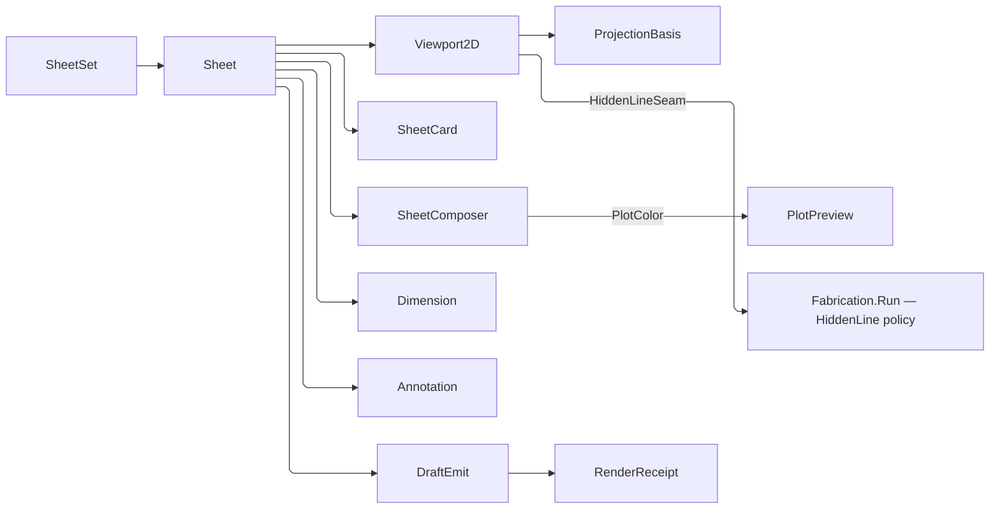

# [APPUI_DRAFTING_SHEETS]

The drafting rail produces 2D documentation from 3D geometry: `SheetSet` owns the emitted drawing set with ISO/ANSI/JIS title-block templating, its one paper size, and its derived sheet numbering, `Viewport2D` frames a `ViewCamera` onto a sheet region by composing the single CAD-grade hidden-line owner `Rasm.Fabrication/Documentation/projection#PROJECTION` through its public `Fabrication.Run` entry and projecting the returned world-space visible, hidden, and silhouette edge sets to sheet space, `Dimension` and `Annotation` carry the dimensioning and GD&T annotation vocabulary as typed records, and `DraftEmit` renders the composed sheet to DWG, DXF, PDF, or SVG through the offscreen document rail and the catalogued entity-writer surface. `SheetComposer` edits the placed frames and stat cards through one verb fold that re-runs the sheet's own compose gate and previews the plot under the elected `PlotColor` posture. The page owns the sheet-set and bound title-block axis, the projection-to-sheet viewport frame with its in-plane roll, the dimension and GD&T annotation families with their UnitsNet-dimensioned measures under one per-sheet `DraftUnits` posture, the composition and plot-preview fold, and the multi-format emit dispatch. SkiaSharp supplies 2D geometry behind the `DrawSource.Owned` capsule and `SKDocument` PDF export, its every paint resolved once through the capture `PaintCatalog`; the write-scoped `ACadSharp` `CadDocument` fold supplies the `DwgWriter`, `DxfWriter`, and `SvgWriter` rows; the locale culture supplies title-block fields; the shared `ViewCamera` supplies the projection basis; and the Compute geometry payload supplies projected edges. The Fabrication projection seam remains the sole CAD-grade visibility owner, so AppUi mints neither a second hidden-line kernel nor a second CAD writer.

## [01]-[INDEX]

- [02]-[SHEET_SET]: Sheet collection, bound ISO/ANSI/JIS title-block cells, view-frame and stat-card placement.
- [03]-[PROJECTION]: 3D-to-2D hidden-line viewport frame, scale, projection basis with its in-plane roll.
- [04]-[DIMENSIONING]: Dimension and GD&T annotation vocabulary as typed records under the sheet's unit posture.
- [05]-[DRAFT_EMIT]: DWG/DXF/PDF/SVG multi-format emit over the document rail.
- [06]-[SHEET_COMPOSER]: Frame editing, paper-unit weights with a display scale, plot postures, the plot preview.

## [02]-[SHEET_SET]

- Owner: `SheetSize` `[SmartEnum<string>]` the standard sheet-size catalog; `TitleField` `[SmartEnum<string>]` the bound title-block cell family and `TitleBlock` the block it reads; `NorthPosture` `[SmartEnum<string>]` the project-versus-true north axis; `SheetRegion` the placed view frame carrying its source view, crop rect, layer context, and north; `Sheet` the single sheet with its frames and cards; `SheetSet` the emitted drawing set carrying the one paper size and the derived sheet numbering.
- Cases: `SheetSize` = a0…a4 (ISO 216) · ansi-a…ansi-e (ANSI/ASME Y14.1) · jis-b0…jis-b4 (JIS B) — the standard sheet rows carrying width, height, and standard family.
- Entry: `public static Fin<Sheet> Compose(string key, SheetSize size, DraftUnits units, TitleBlock title, Seq<SheetRegion> regions, Seq<SheetCard> cards, Seq<(string Region, Dimension Value)> dimensions, Seq<Annotation> annotations)` — `Fin` aborts on a frame or card outside the sheet bounds and on a dimension naming an unresolved frame; the unit POSTURE is a sheet column every label reads, and the title-block cells resolve through the `TitleField` roster at emit. `public static Fin<SheetSet> Of(string key, Seq<Sheet> sheets)` seals the emitted set — refusing an empty set and a sheet whose size diverges from the lead's, then restamping `SheetNumber`/`SheetCount` off the ordinal and `Sheets.Count`.
- Auto: `SheetSize.Standard` carries the standard family, so ISO, ANSI, and JIS sheets select their border, zone grid, and title-block geometry without duplicating that reconstructible choice on `TitleBlock`. `DraftEmit.TitleLayout` is one templating fold over the standard row's margin, zone, and block values, its cell pitch derived from the `TitleField` roster so an added cell re-spaces every standard; each cell's label key derives from its own row and its value reads off the block, so a project rename re-renders the whole set. The set derives its own numbering, so `1/3` states the set's own arithmetic rather than an author's transcription that an inserted sheet silently falsifies.
- Packages: Thinktecture.Runtime.Extensions, LanguageExt.Core, NodaTime, BCL inbox
- Growth: a new sheet size is one `SheetSize` row carrying its dimensions and standard family; a new title-block layout is one `TitleBlockStandard` value; a new cell is one `TitleField` row whose label key and reader ride the row; a new north convention is one `NorthPosture` row; zero new surface.
- Boundary: sheet dimensions are millimeter row data traced here once — a call-site sheet-dimension literal is the deleted form; the title-block standard drives the border, zone-grid, and field layout from one fold so a per-standard title-block control is the deleted form; a title-block cell is a ROW that reads its own value, so an authored label-plus-value tuple beside the roster is the deleted form that put the field set, its keys, and its read order in three places; field labels and the date format ride `ResolvedLocale` so a `CultureInfo.CurrentCulture` read is the rejected form; sheet frames and cards are placement rectangles in Y-down sheet millimetre space sharing one bounds predicate, and a placement outside the sheet bounds faults at compose, never at render; the set is size-uniform by construction because one exported document opens at ONE page extent and one CAD model space lays its sheets on one pitch, so a mixed-size set refuses at `Of` rather than emitting pages that clip or overlap; the sheet composes as precomposed vector page folds on the capture vector-print arm (a flow REPORT rides `Document/export#FLOW_REPORT`) so the document-pagination concern stays the export owner and the drafting page mints no second pagination.

```csharp signature
// Each standard row carries its frame geometry as ROW DATA — border margin, zone-grid divisions, and the
// title-block anchor rectangle — so the ISO/ANSI/JIS layouts diverge only in values and ONE templating
// fold (DraftEmit.TitleLayout) draws border, zone grid, block frame, and field cells for every standard.
[SmartEnum<string>]
public sealed partial class TitleBlockStandard {
    public static readonly TitleBlockStandard Iso = new("iso", marginMm: 10d, zoneColumns: 8, zoneRows: 6, blockWidthMm: 180d, blockHeightMm: 55d);
    public static readonly TitleBlockStandard Ansi = new("ansi", marginMm: 12.7d, zoneColumns: 4, zoneRows: 4, blockWidthMm: 165.1d, blockHeightMm: 63.5d);
    public static readonly TitleBlockStandard Jis = new("jis", marginMm: 10d, zoneColumns: 6, zoneRows: 4, blockWidthMm: 170d, blockHeightMm: 50d);

    public double MarginMm { get; }

    public int ZoneColumns { get; }

    public int ZoneRows { get; }

    public double BlockWidthMm { get; }

    public double BlockHeightMm { get; }
}

[SmartEnum<string>]
public sealed partial class SheetSize {
    public static readonly SheetSize A0 = new("a0", 841d, 1189d, TitleBlockStandard.Iso);
    public static readonly SheetSize A1 = new("a1", 594d, 841d, TitleBlockStandard.Iso);
    public static readonly SheetSize A2 = new("a2", 420d, 594d, TitleBlockStandard.Iso);
    public static readonly SheetSize A3 = new("a3", 297d, 420d, TitleBlockStandard.Iso);
    public static readonly SheetSize A4 = new("a4", 210d, 297d, TitleBlockStandard.Iso);
    public static readonly SheetSize AnsiA = new("ansi-a", 215.9d, 279.4d, TitleBlockStandard.Ansi);
    public static readonly SheetSize AnsiB = new("ansi-b", 279.4d, 431.8d, TitleBlockStandard.Ansi);
    public static readonly SheetSize AnsiC = new("ansi-c", 431.8d, 558.8d, TitleBlockStandard.Ansi);
    public static readonly SheetSize AnsiD = new("ansi-d", 558.8d, 863.6d, TitleBlockStandard.Ansi);
    public static readonly SheetSize AnsiE = new("ansi-e", 863.6d, 1117.6d, TitleBlockStandard.Ansi);
    public static readonly SheetSize JisB0 = new("jis-b0", 1030d, 1456d, TitleBlockStandard.Jis);
    public static readonly SheetSize JisB1 = new("jis-b1", 728d, 1030d, TitleBlockStandard.Jis);
    public static readonly SheetSize JisB2 = new("jis-b2", 515d, 728d, TitleBlockStandard.Jis);
    public static readonly SheetSize JisB3 = new("jis-b3", 364d, 515d, TitleBlockStandard.Jis);
    public static readonly SheetSize JisB4 = new("jis-b4", 257d, 364d, TitleBlockStandard.Jis);

    public double WidthMm { get; }

    public double HeightMm { get; }

    public TitleBlockStandard Standard { get; }

    // The one millimetre-to-point factor: sheet geometry is authored in millimetres estate-wide and only the
    // paged raster format speaks points, so the conversion lives here and the PDF arm brackets its page fold
    // in it rather than each entity carrying a pre-scaled twin.
    public const float PointsPerMillimetre = 72f / 25.4f;

    public float PointWidth => (float)(WidthMm * PointsPerMillimetre);

    public float PointHeight => (float)(HeightMm * PointsPerMillimetre);
}

// Every title-block cell is a BOUND row, never an authored string beside a hand-written label: each row
// names its label key and READS its value off the block, so a project rename, a revision bump, and an
// inserted sheet all re-render the whole set from the facts they already moved. The six authored tuples this
// replaces put the field roster, the label keys, and the read order in three places that drifted apart the
// moment a seventh field was wanted — and a bound row makes the drawing-set metadata a projection rather
// than a transcription. Sheet number and count are the SET's derivation, so their rows read the restamped
// members rather than an author's typing.
[SmartEnum<string>]
public sealed partial class TitleField {
    public static readonly TitleField Number = new("number", static (block, _) => block.DrawingNumber);
    public static readonly TitleField Title = new("title", static (block, locale) => locale.Label(block.TitleKey));
    public static readonly TitleField Project = new("project", static (block, locale) => locale.Label(block.ProjectKey));
    public static readonly TitleField Client = new("client", static (block, locale) => locale.Label(block.ClientKey));
    public static readonly TitleField Discipline = new("discipline", static (block, locale) => locale.Label(block.DisciplineKey));
    public static readonly TitleField Scale = new("scale", static (block, _) => block.Scale);
    public static readonly TitleField Date = new("date", static (block, locale) => locale.Day(block.Date));
    public static readonly TitleField Drawn = new("drawn", static (block, _) => block.DrawnBy);
    public static readonly TitleField Checked = new("checked", static (block, _) => block.CheckedBy);
    public static readonly TitleField Sheet = new("sheet", static (block, _) => $"{block.SheetNumber}/{block.SheetCount}");
    public static readonly TitleField Revision = new("revision", static (block, _) => block.Revision);

    // The label key derives from the row, so a field's caption and its value can never name different
    // concerns and a new field carries no second registration.
    public string LabelKey => $"draft.field.{Key}";

    [UseDelegateFromConstructor]
    public partial string Read(TitleBlock block, ResolvedLocale locale);
}

public sealed record TitleBlock(
    string DrawingNumber,
    string TitleKey,
    string ProjectKey,
    string ClientKey,
    string DisciplineKey,
    string Scale,
    LocalDate Date,
    string DrawnBy,
    string CheckedBy,
    int SheetNumber,
    int SheetCount,
    string Revision) {
    // The ROSTER is the row family, so the layout fold iterates the vocabulary rather than a per-block list
    // and a standard that carries fewer cells narrows by taking the head of this run at its own row count.
    public Seq<(string LabelKey, string Value)> Fields(ResolvedLocale locale) =>
        toSeq(TitleField.Items).Map(field => (field.LabelKey, field.Read(this, locale)));
}

// Each region carries its OWN projection basis and model reference — no pinned view, no key conflation — and
// owns the ONE sheet correspondence, so the viewport edge fold and the dimension anchor fold read one member
// instead of two copies that drift. The correspondence is TWO ENTRIES ON ONE BODY because its two callers
// arrive at different altitudes: the kernel hidden-line solve already applied this region's basis and returns
// the projection PLANE, while a dimension anchors as a model point that has been projected by nothing yet.
// `Place` is the placement — the only step both share — and `Map` is `Place` composed with the projection, so
// a world anchor and a solved edge cannot land in different sheet frames. Re-projecting an already-projected
// point through `Map` is the deleted form: it drives screen ordinates back through the camera basis as if
// they were model coordinates, which draws a plausible figure at the wrong scale, position, and skew with no
// fault to read. The placement CENTRES on the region: a camera-relative projection is signed about its own
// origin, so anchoring it at the region's corner sent every point with a positive up-component above the
// region's top edge and every point left of the camera outside its left edge, where the clip discarded them.
// Sheet space is Y-DOWN — the frame the Skia canvas draws in and the one the title block anchors bottom-right
// in at high Y — so the up-axis negates here and nowhere else.
// North is a POSTURE with its own rotation reader, so true north and project north are one axis and the
// survey declination lives once on the composer binding. A drawing that states "true north" while its plan
// draws project north is the one titleblock claim a reader cannot check against the linework, so the
// rotation is derived from the posture the frame declares rather than pre-baked into the camera an author
// happened to save.
[SmartEnum<string>]
public sealed partial class NorthPosture {
    public static readonly NorthPosture Project = new("project", static _ => Angle.Zero);
    public static readonly NorthPosture True = new("true", static declination => declination);

    [UseDelegateFromConstructor]
    public partial Angle Rotation(Angle declination);
}

public readonly record struct SheetRegion(
    string Key,
    string ModelKey,
    ProjectionBasis Basis,
    double X,
    double Y,
    double Width,
    double Height,
    Option<string> Source,
    Seq<VisibilityOverride> Overrides,
    NorthPosture North) {
    // The rect IS the crop: a frame shows what its own bounds admit and the viewport clip is what performs
    // it, so a crop rectangle beside the placement rectangle would be two extents over one figure.
    public (double X, double Y) Place((double X, double Y) projected) =>
        (X + (Width * 0.5d) + projected.X, Y + (Height * 0.5d) - projected.Y);

    public (double X, double Y) Map((double X, double Y, double Z) world) => Place(Basis.Map(world));

    // The frame's OWN basis: the saved camera the `Source` names arrives as `Basis` and the north posture
    // rotates it about the view axis, so a plan reads in whichever north the sheet declares and the
    // registry's stored camera is never mutated to spell an orientation the drawing owns.
    public ProjectionBasis Oriented(Angle declination) =>
        Basis with { Roll = Basis.Roll + North.Rotation(declination) };
}

// A dimension anchors in the world space of a NAMED region so emission resolves its projection basis;
// annotations are already sheet-space and carry no region key. The unit pair is the SHEET's — a drawing
// reads in one unit end to end, so the frame sits beside the paper standard rather than travelling as a
// parameter every dimension, annotation, and emit arm would have to thread and could disagree on.
public sealed record Sheet(
    string Key,
    SheetSize Size,
    DraftUnits Units,
    TitleBlock Title,
    Seq<SheetRegion> Regions,
    Seq<SheetCard> Cards,
    Seq<(string Region, Dimension Value)> Dimensions,
    Seq<Annotation> Annotations) {
    // The compose gate seats on the record it RETURNS: a factory answering `Fin<Sheet>` off a collection type
    // makes the collection a namespace rather than an owner, and it is what left the set-grained fold with no
    // member of its own. Frames and cards are two placement rosters because they are structurally different
    // — one carries a projection basis and one a metric binding — but they share ONE bounds predicate, so a
    // card cannot hang off the page under a rule a frame is held to.
    public static Fin<Sheet> Compose(
        string key, SheetSize size, DraftUnits units, TitleBlock title,
        Seq<SheetRegion> regions, Seq<SheetCard> cards,
        Seq<(string Region, Dimension Value)> dimensions, Seq<Annotation> annotations) =>
        regions.Find(region => Escapes(size, region.X, region.Y, region.Width, region.Height)) is { IsSome: true, Case: SheetRegion bad }
            ? Fin.Fail<Sheet>(new DraftFault.RegionOutOfBounds($"{key}/{bad.Key}"))
            : cards.Find(card => Escapes(size, card.X, card.Y, card.Width, card.Height)) is { IsSome: true, Case: SheetCard offPage }
                ? Fin.Fail<Sheet>(new DraftFault.RegionOutOfBounds($"{key}/card:{offPage.Key}"))
                : dimensions.Find(row => !regions.Exists(region => region.Key == row.Region)) is { IsSome: true, Case: (string orphan, _) }
                    ? Fin.Fail<Sheet>(new DraftFault.RegionOutOfBounds($"{key}/dimension:{orphan}"))
                    : Fin.Succ(new Sheet(key, size, units, title, regions, cards, dimensions, annotations));

    private static bool Escapes(SheetSize size, double x, double y, double width, double height) =>
        x < 0d || y < 0d || x + width > size.WidthMm || y + height > size.HeightMm;
}

// The drawing SET is what `DraftEmit.Emit` consumes, and a lone drawing is a one-sheet set — so the page
// carries one emit entry rather than a sheet arm and a set arm that drift. Two facts are the set's alone and
// neither can be authored per sheet without disagreeing with it: the paper SIZE, because one exported
// document opens at one page extent, and the SHEET NUMBERING, because `1/3` is a statement about the set. `Of`
// derives both — the size from the lead sheet with every divergent member refused by name, the ordinal and
// count restamped onto each title block — so an author-typed `SheetNumber` cannot outlive an inserted sheet.
public sealed record SheetSet(string Key, SheetSize Size, Seq<Sheet> Sheets) {
    public static Fin<SheetSet> Of(string key, Seq<Sheet> sheets) =>
        sheets.Head.Match(
            None: () => Fin.Fail<SheetSet>(new DraftFault.EmptySet(key)),
            Some: lead => sheets.Find(sheet => sheet.Size != lead.Size) is { IsSome: true, Case: Sheet odd }
                ? Fin.Fail<SheetSet>(new DraftFault.SheetSizeMismatch($"{key}/{odd.Key}: {odd.Size.Key} beside {lead.Size.Key}"))
                : Fin.Succ(new SheetSet(key, lead.Size, sheets.Map((sheet, index) => sheet with {
                    Title = sheet.Title with { SheetNumber = index + 1, SheetCount = sheets.Count },
                }))));
}
```

## [03]-[PROJECTION]

- Owner: `ProjectionBasis` the view-direction-and-scale projection; `Viewport2D` the model-view frame on a sheet region projecting the CAD-grade hidden-line edge sets AND the run's pattern fill to sheet space; `HiddenLineSeam` the composition-bound delegate column carrying the `Rasm.Fabrication/Documentation/projection#PROJECTION` package entry `Fabrication.Run` as the one in-process producer.
- Entry: `public IO<Seq<SheetEntity>> Project(MeshSpace mesh)` — the `Viewport2D` record is the region plus the solver seam and reads its key and basis off that region, so `Project` folds the admitted mesh through the seam-bound Fabrication run to the world-space visible/hidden/silhouette edge sets plus the run's `Option<HatchResult>`, then projects each surviving sub-edge into a sheet-space `SheetEntity.Stroke` under the basis, tagging each with its `EdgeStyle` (visible solid `0.5`-weight, hidden dashed `0.25`-weight, silhouette emphasized `0.7`-weight) and clipping to the region — the silhouette set tags as the first-class `EdgeStyle.Silhouette` emphasized row, not folded into `Visible`, so the silhouette reads as a heavier outline — and folds the hatch's chained courses into ONE `SheetEntity.Fill`; the view projects directly into the drawn-primitive vocabulary, so no consumer re-maps an intermediate segment tuple. The rail is `IO` because the owner's entry is `ValueTask<Fin<RunEvidence>>` — a synchronous seam over an asynchronous package entry blocks the render thread on a kernel solve.
- Auto: `ProjectionBasis.From` derives the orthographic or perspective projection matrix from a `Viewpoint` camera so a saved 3D view drafts to a 2D viewport with the same basis — the drafting projection and the viewport camera share one camera vocabulary; standard views (top, front, right, iso) are basis presets; the projection scales model millimeters to sheet millimeters through the viewport scale so a 1:50 detail and a 1:1 detail are scale row values, never call-site arithmetic; visible-edge resolution composes the Fabrication package entry — the `HiddenLineSeam` delegate runs `Fabrication.Run` under a `FabricationPolicy.HiddenLine` whose `ProjectionPolicy` carries THIS basis as its `Views` row and `Scale`, so the kernel projects with the basis the region already holds and the page never re-derives the same matrix twice, and the exact quantitative-invisibility solve over the kernel's exact silhouette locus and screen crossing lattice returns through `RunEvidence.Result` as `FabricationResult.HiddenLineResult`, whose `ProjectionReceipt` run hands back a `DrawingProjection` ALREADY partitioned into visible and hidden projection-plane segments — `ProjectedSegment.State` publishes the Appel verdict the emission decided — from which the seam lifts the `EdgeKind.Silhouette` rows into their own set, so `Viewport2D.Project` places each set on the sheet and tags the style with no second projection, and a concave self-occluding solid resolves by exact sign rather than by a depth-sorted painter approximation; the SAME run carries the `Option<HatchResult>` — the kernel `Hatching.Apply` product Fabrication's `ProjectionRun` already holds, generated against that same `DrawingProjection` so the courses share the segments' plane — so a section's pattern fill arrives exactly clipped against the view's own loops and chained through the result's own `Next` column, and AppUi places the courses and never re-derives a pattern.
- Packages: SkiaSharp, Thinktecture.Runtime.Extensions, LanguageExt.Core, Rasm (project — `MeshSpace` the admitted mesh carrier, `HatchResult` the exactly-clipped pattern-fill carrier and its `ToPolylines` chaining, `DrawingProjection`/`ProjectedSegment`/`EdgeKind` the solved projection-plane vocabulary), Rasm.Compute (project), Rasm.Fabrication (project — `Fabrication.Run`, `FabricationInput.Admit`, `FabricationRuntime.Admit`, `FabricationPolicy.HiddenLine`, `ProjectionPolicy`, `RunEvidence.Result`, `FabricationResult.HiddenLineResult`, `ProjectionReceipt`/`ProjectionRun`)
- Law: `ProjectionBasis.Roll` is the figure's IN-PLANE rotation, applied after the camera projection and before the scale, so a north posture, a rotated detail, and a plan turned to fit its frame are one drawing rotation and none of them is a camera move; twisting the saved camera's `Up` to spell the same orientation mutates the registry view a frame merely NAMES, so two frames of one saved view could never state different norths. The frame's `Oriented` composition is what carries the posture into the kernel's own `ProjectionPolicy`, so the solve and the sheet stay one basis.
- Growth: a new standard view is one `ProjectionBasis` preset; a new line style is one `EdgeStyle` row; a new hatch pattern is a kernel `HatchPattern` row that reaches the sheet as courses with no AppUi edit; the hidden-line and hatch algorithms deepen at their single owners, never in this page; zero new surface.
- Boundary: `SheetRegion` is the ONE sheet correspondence every fold reads — `Place` seats a projection-plane pair and `Map` composes the basis ahead of it for a model anchor, so the two altitudes share one body and a second copy at the dimension-anchor site is the deleted form — and it fixes the two conventions the whole page rides: the projection CENTRES on the region (a camera-relative projection is signed about its own origin, so a corner anchor clipped away every point above and left of the camera) and sheet space is Y-DOWN, the frame the Skia canvas and the title-block layout already share. `ProjectionBasis` consumes the shared `ViewCamera`, and `MeshSpace` carries the admitted mesh whole so the view projects the canonical geometry without re-tessellation — its interior is the kernel's, so no AppUi fold reads a vertex off it and a page-local emptiness probe over a carrier whose buffers are internal is unspellable; admission defects surface as the owner's own typed refusal on the seam rail, and `DraftFault.EmptyView` names the one verdict THIS page owns — a solve that produced no visible, hidden, silhouette, or fill entity, a blank viewport with a fault rather than a silent empty region. `Fabrication.Run` supplies PROJECTION-PLANE visible, hidden, and silhouette edge sets plus the run's hatch through `HiddenLineSeam`; AppUi PLACES those sets on the sheet, emphasizes `Silhouette` with the `EdgeStyle.Silhouette` row, and pours the hatch courses onto `EdgeStyle.Fill` — projection, pattern generation, region clipping, and course chaining all stay the kernel owners', so a second projection at the sheet fold, a page-local hatch generator, a per-segment fill fold that discards the chaining, and a fabricated pattern where the run carries none are the deleted forms. Viewport scale remains millimeter-to-millimeter data, the model-anchor projection reads its camera triad off the `Render/pathtrace#BSDF_SHADING` `OracleFrame.OfCamera` owner (the prior page-local normalize fabricated `+Z` on zero length — the divergence the one-owner law deletes), and projected segments draw through `DrawSource.Owned`, so the page owns neither a second camera, hidden-line kernel, nor Skia surface.

```csharp signature
// Roll is an IN-PLANE rotation of the projected figure, applied after the camera projection and before the
// scale: a north posture, a rotated detail, and a plan turned to fit its frame are all one drawing rotation
// and none of them is a camera move. Spelling it as an `Up`-vector twist on the saved camera would mutate
// the registry's stored view to express a sheet's own orientation, so two frames of one saved view could
// never state different norths.
public sealed record ProjectionBasis(ViewCamera Camera, double Scale, Angle Roll = default) {
    public static readonly ProjectionBasis Top = Orthographic(
        new System.Numerics.Vector3(0f, 0f, 1f), new System.Numerics.Vector3(0f, 0f, 0f), System.Numerics.Vector3.UnitY);
    public static readonly ProjectionBasis Front = Orthographic(
        new System.Numerics.Vector3(0f, -1f, 0f), new System.Numerics.Vector3(0f, 0f, 0f), System.Numerics.Vector3.UnitZ);
    public static readonly ProjectionBasis Right = Orthographic(
        new System.Numerics.Vector3(1f, 0f, 0f), new System.Numerics.Vector3(0f, 0f, 0f), System.Numerics.Vector3.UnitZ);
    public static readonly ProjectionBasis Iso = Orthographic(
        new System.Numerics.Vector3(1f, -1f, 1f), new System.Numerics.Vector3(0f, 0f, 0f), System.Numerics.Vector3.UnitZ);

    public static ProjectionBasis From(ViewCamera camera, double scale) =>
        new(camera, scale);

    // Rotate THEN scale, both after the projection: the roll turns the figure in its own drawing plane, so a
    // rolled frame and an unrolled one differ by an orientation and never by a size.
    public (double X, double Y) Map((double X, double Y, double Z) point) {
        (double rx, double ry) = Screen(point);
        (double cos, double sin) = (Math.Cos(Roll.Radians), Math.Sin(Roll.Radians));
        return (((rx * cos) - (ry * sin)) * Scale, ((rx * sin) + (ry * cos)) * Scale);
    }

    private (double X, double Y) Screen((double X, double Y, double Z) point) {
        CameraFrame frame = Camera.Frame;
        // ONE camera triad — the pathtrace OracleFrame.OfCamera owner, whose clamped-divisor normalize is the
        // law: the prior page-local copy fabricated +Z on a zero-length forward, the one divergent arm in the
        // compilation unit, deleted onto the owner.
        ((double fx, double fy, double fz), (double rx, double ry, double rz), (double ux, double uy, double uz)) = OracleFrame.OfCamera(frame);
        (double px, double py, double pz) = (point.X - frame.Eye.X, point.Y - frame.Eye.Y, point.Z - frame.Eye.Z);
        (double x, double y, double z) = (
            (px * rx) + (py * ry) + (pz * rz),
            (px * ux) + (py * uy) + (pz * uz),
            (px * fx) + (py * fy) + (pz * fz));
        return Camera.Switch(
            state: (X: x, Y: y, Z: z),
            perspective: static (projected, lens) => (
                projected.X / Math.Max(projected.Z * Math.Tan(double.DegreesToRadians(lens.FieldOfViewDeg) / 2d), 1e-9),
                projected.Y / Math.Max(projected.Z * Math.Tan(double.DegreesToRadians(lens.FieldOfViewDeg) / 2d), 1e-9)),
            orthographic: static (projected, _) => (projected.X, projected.Y),
            // The asymmetric XR eye recentres by the tangent MIDPOINT of its signed angle pair and scales by
            // the tangent half-span, per axis — a symmetric-frustum divide would offset an off-axis eye.
            asymmetric: static (projected, lens) => (
                ((projected.X / Math.Max(projected.Z, 1e-9)) - ((Math.Tan(lens.AngleRight) + Math.Tan(lens.AngleLeft)) / 2d))
                    / Math.Max((Math.Tan(lens.AngleRight) - Math.Tan(lens.AngleLeft)) / 2d, 1e-9),
                ((projected.Y / Math.Max(projected.Z, 1e-9)) - ((Math.Tan(lens.AngleUp) + Math.Tan(lens.AngleDown)) / 2d))
                    / Math.Max((Math.Tan(lens.AngleUp) - Math.Tan(lens.AngleDown)) / 2d, 1e-9)));
    }

    private static ProjectionBasis Orthographic(System.Numerics.Vector3 eye, System.Numerics.Vector3 target, System.Numerics.Vector3 up) =>
        new(new ViewCamera.Orthographic(new CameraFrame(eye, target, up), 1d), 1d);
}

[SmartEnum<string>]
public sealed partial class EdgeStyle {
    public static readonly EdgeStyle Visible = new("visible", dashed: false, weight: 0.5f);
    public static readonly EdgeStyle Hidden = new("hidden", dashed: true, weight: 0.25f);
    public static readonly EdgeStyle Silhouette = new("silhouette", dashed: false, weight: 0.7f);
    // The axis row: `[04]-[DIMENSIONING]`'s radial and diametric centre marks emit on it, so its dash pattern and
    // its CAD layer both carry axis semantics no dimension marking should inherit.
    public static readonly EdgeStyle Centerline = new("centerline", dashed: true, weight: 0.25f);
    public static readonly EdgeStyle Marking = new("marking", dashed: false, weight: 0.25f);
    public static readonly EdgeStyle Fill = new("fill", dashed: false, weight: 0.18f);

    public bool Dashed { get; }

    public float Weight { get; }
}

// The sets are PROJECTION-PLANE pairs, not model points: `ProjectedSegment` carries `ScreenA`/`ScreenB`, the
// kernel's own once-rounded emission under the policy this region's basis raised, so the ordinate pair is
// already scaled and already signed about the projection origin. Declaring a model-space triple here is the
// deleted form — it is what invited a second projection at the sheet fold and made the kernel's exact solve
// and the page's own camera two authorities over one figure. Silhouette is an `EdgeKind` row rather than a
// visibility verdict, so it lifts OUT of the two visibility sets instead of overlaying them: a silhouette
// edge draws once at its heavier weight, never twice with the light stroke underneath. Depth stays on the
// kernel segment for a line-weight cue and reaches no sheet ordinate. The run's fill rides BESIDE the edges:
// Fabrication's projection receipt already holds `Option<HatchResult>` per run, so dropping it here would
// leave AppUi re-deriving a pattern fill the kernel already clipped exactly against the view's own loops.
// The hatch arrives as the kernel carrier, not as pre-flattened segments, so the sheet fold chooses its own
// chaining, and its courses share the segments' plane because `HatchOp.Projection` generated them against
// this same `DrawingProjection`.
public readonly record struct HiddenLineEdgeSets(
    Seq<((double X, double Y) A, (double X, double Y) B)> Visible,
    Seq<((double X, double Y) A, (double X, double Y) B)> Hidden,
    Seq<((double X, double Y) A, (double X, double Y) B)> Silhouette,
    Option<HatchResult> Hatch);

// The seam binds `Fabrication.Run` — the package's SOLE public entry — never the internal solver behind it:
// composition raises a `FabricationPolicy.HiddenLine` carrying the `ProjectionPolicy` whose `Views` row and
// `Scale` ARE this region's `ProjectionBasis` camera and scale (one basis, so the solve and the sheet agree
// by construction), admits the model and its `ProjectionDir` through `FabricationInput.Admit` beside a
// `FabricationRuntime.Admit` runtime, awaits the run, and reads `RunEvidence.Result` narrowed to
// `FabricationResult.HiddenLineResult`. Its `ProjectionReceipt` retains one keyed `ProjectionRun` per
// requested view; that run's `DrawingProjection` already partitions `Visible` and `Hidden` by shape — the
// Appel count decided it at emission and `ProjectedSegment.State` publishes the same verdict — so the fold
// takes those two sets, lifts the `EdgeKind.Silhouette` rows out of both, and carries the run's
// `Option<HatchResult>` through unchanged. The rail is `IO` because that entry is asynchronous; a
// `Func<…, Fin<…>>` column would force the binder to block a UI-thread frame on an exact-arithmetic kernel
// solve, and it names a member no consumer outside the package can reach.
public sealed record HiddenLineSeam(
    Func<MeshSpace, ProjectionBasis, IO<HiddenLineEdgeSets>> Solve) {
    public IO<HiddenLineEdgeSets> Resolve(MeshSpace mesh, ProjectionBasis basis) => Solve(mesh, basis);
}

// The region already carries its key and its basis, so the view is the region plus the solver seam; the
// prior shape re-declared both beside it and every construction re-read them off the same region.
public sealed record Viewport2D(SheetRegion Region, HiddenLineSeam Hlr, Angle Declination = default) {
    public string Key => Region.Key;

    // The frame's ORIENTED basis, so the north posture reaches the kernel's own `ProjectionPolicy` rather
    // than being applied to the returned ordinates: the solve and the sheet stay one basis, which is the
    // whole reason the region carries the basis at all.
    public ProjectionBasis Basis => Region.Oriented(Declination);

    // The solved sets place straight into the ONE drawn-primitive vocabulary: the three edge classes become
    // styled strokes and the run's hatch becomes ONE fill entity carrying every chained course, so a filled
    // region is one paint and one CAD layer rather than N sibling strokes, and the intermediate segment
    // tuple every consumer had to re-map is deleted. `Project` names the WHOLE model-to-sheet arrow the seam
    // and the placement compose; the projection itself happened inside the solve.
    // The emptiness verdict is the SOLVE's, never a vertex-count guess ahead of it: `MeshSpace` publishes no
    // buffer to count, the kernel already refuses an empty or non-finite mesh on its own typed band, and a
    // fully-clipped or fully-degenerate view is exactly the case a pre-count cannot see. A region that draws
    // nothing faults by name so a blank viewport carries a locus instead of sealing as a legitimate sheet.
    public IO<Seq<SheetEntity>> Project(MeshSpace mesh) =>
        from sets in Hlr.Resolve(mesh, Basis)
        let drawn = Styled(sets.Visible, EdgeStyle.Visible)
            + Styled(sets.Hidden, EdgeStyle.Hidden)
            + Styled(sets.Silhouette, EdgeStyle.Silhouette)
            + Filled(sets.Hatch)
        from entities in drawn.IsEmpty
            ? IO.fail<Seq<SheetEntity>>(new DraftFault.EmptyView($"{Key}: solve drew no edge and no fill"))
            : IO.pure(drawn)
        select entities;

    private Seq<SheetEntity> Styled(Seq<((double X, double Y) A, (double X, double Y) B)> edges, EdgeStyle style) =>
        edges.Choose(edge => Clip(Sheeted(edge.A), Sheeted(edge.B))
            .Map(segment => (SheetEntity)new SheetEntity.Stroke(style, (segment.A.X, segment.A.Y), (segment.B.X, segment.B.Y))));

    // The kernel chains its courses through `Next`, so `ToPolylines` hands back the longest runs already
    // joined — placing those preserves the chaining a per-segment fold would destroy, and a course that
    // clips away entirely drops rather than degenerating to a point. An absent hatch is an empty projection,
    // never a fabricated pattern. `ToPolylines` returns `Seq<Polyline>` and a `Polyline` enumerates `Point3d`
    // in the projection plane, so the fold reads the planar ordinate pair and DROPS the third: `Point3d`
    // carries neither a tuple conversion nor a deconstruction, and its Z is the kernel's plane coordinate, a
    // value no sheet ordinate takes.
    private Seq<SheetEntity> Filled(Option<HatchResult> hatch) =>
        hatch.Map(result => toSeq(result.ToPolylines())
                .Map(course => toSeq(course).Map(p => Region.Place((p.X, p.Y))))
                .Filter(static course => course.Count >= 2))
            .Bind(static courses => courses.Head.Map(lead => new SheetEntity.Fill(EdgeStyle.Fill, lead, courses.Tail)))
            .Map(static fill => Seq<SheetEntity>(fill))
            .IfNone(Seq<SheetEntity>());

    private SKPoint Sheeted((double X, double Y) projected) =>
        Region.Place(projected) switch { var p => new SKPoint((float)p.X, (float)p.Y) };

    private Option<(SKPoint A, SKPoint B)> Clip(SKPoint a, SKPoint b) {
        float minX = (float)Region.X;
        float minY = (float)Region.Y;
        float maxX = (float)(Region.X + Region.Width);
        float maxY = (float)(Region.Y + Region.Height);
        float dx = b.X - a.X;
        float dy = b.Y - a.Y;
        (float Enter, float Exit) interval = (0f, 1f);
        (float P, float Q)[] planes = [(-dx, a.X - minX), (dx, maxX - a.X), (-dy, a.Y - minY), (dy, maxY - a.Y)];
        foreach ((float p, float q) in planes) {
            if (p == 0f && q < 0f) { return None; }
            if (p == 0f) { continue; }
            float t = q / p;
            interval = p < 0f
                ? (MathF.Max(interval.Enter, t), interval.Exit)
                : (interval.Enter, MathF.Min(interval.Exit, t));
            if (interval.Enter > interval.Exit) { return None; }
        }
        return Some((
            new SKPoint(a.X + (interval.Enter * dx), a.Y + (interval.Enter * dy)),
            new SKPoint(a.X + (interval.Exit * dx), a.Y + (interval.Exit * dy))));
    }
}
```

## [04]-[DIMENSIONING]

- Owner: `Dimension` `[Union]` the dimension vocabulary; `DraftUnits` the sheet's linear-and-angular unit frame; `Tolerance` the dimensioned tolerance limbs; `Annotation` `[Union]` the GD&T and text annotation vocabulary; `GdtFrame` the feature-control frame as the specification's own compartment rows under this plane's layout.
- Cases: `Dimension` = Linear | Aligned | Angular | Radial | Diametric | Ordinate under the locked kind literals; `Annotation` = Text | Leader | Datum | FeatureControl | SurfaceFinish | Weld under the locked kind literals.
- Entry: `public IQuantity Measure(DraftUnits units)` — the one measure read, a `Length` on the five length cases and an `Angle` on the angular one, minted in the sheet's own unit; `public Fin<Seq<SheetEntity>> Entities(Func<(double X, double Y, double Z), (double X, double Y)> project, ResolvedLocale locale, DraftUnits units)` — the ONE dimension-to-entity projection: sheet-space extension lines, the offset dimension line, terminal ticks, arcs, and the role-rendered quantity as a `TextRun`, consumed identically by every emit format; `Annotation.Entities(ResolvedLocale, DraftUnits)` is the sibling projection for the annotation family; `public Fin<string> Text(ResolvedLocale locale, IQuantity value, MeasureRole role)` on `DraftUnits` is the one label render both consume.
- Auto: each dimension carries its anchor points alone and derives its measure from them, so the drawn geometry and the printed number resolve from one pair of points under the region's own projection and a stored scalar serving as both a model measure and a sheet length is the deleted form; `Entities` builds the extension lines, dimension line, ticks, and text from the dimension kind — a linear or aligned dimension spans its projected anchors under its offset, an angular dimension sweeps an arc at the vertex with both legs, a radial and a diametric draw the center-to-rim ray in SHEET space with the `R`/`⌀` prefix beside the feature's own centre mark on the `EdgeStyle.Centerline` row — the two centre-crossing strokes scaled to the projected radius that make the measured centre visible and name the feature circular — and an ordinate draws the datum elbow; the GD&T feature-control frame folds the specification's compartment rows left to right into ISO 1101 box strokes, each compartment boxed to its own symbol run so a composite or multi-modifier frame needs no second layout arm; every measure and tolerance crosses the measurement edge as a UnitsNet quantity under the readout ROLE its case names, so the unit abbreviation is the quantity's own, the precision and grammar are the role's, the elected system is the SHEET's posture rather than the reading user's, and a label states no unit the value does not carry — the `±` symmetric and `+/-` asymmetric tolerance spellings deriving from `Tolerance.Symmetric`.
- Packages: SkiaSharp, Thinktecture.Runtime.Extensions, LanguageExt.Core, UnitsNet (`Length`, `Angle`, `LengthUnit`, `AngleUnit`, `IQuantity`, `ComparisonType` — the dimensioned measure, tolerance, and unit-frame vocabulary), Rasm.Fabrication (project — `FrameSymbolRow`/`FrameCompartment` off `Spec/tolerance`, republished per view on the projection anchor), Rasm.AppUi `Theme/locale` (`MeasureRole`, `MeasurePolicy`, `UnitPosture`), BCL inbox
- Growth: a new dimension kind is one `Dimension` case; a new annotation kind is one `Annotation` case; a new GD&T characteristic is a `Rasm.Fabrication` `Spec/tolerance` `FeatureCharacteristic` row at that owner and reaches this plane as a compartment row with zero edits here; a drawing-unit convention is one `DraftUnits` posture at the sheet, whose length and angle tokens are the `Theme/locale#MEASUREMENT_FORMAT` roster's; zero new surface.
- Boundary: dimension geometry is built in sheet-space from the projected anchor points so a dimension follows its view — a free-floating annotation layer is the deleted form, and each dimension names its owning region so emission resolves the projection basis the anchors ride; the GD&T feature-control frame is the typed `GdtFrame` record so a hand-laid-out tolerance frame is the deleted form, and its CONTENT is the specification's — `Rasm.Fabrication` `Spec/tolerance` owns the characteristic symbols, the zone spelling, the material condition, the modifiers, and the datum labels, publishing them as layout-free `FrameSymbolRow` compartments this plane places, sizes, and boxes without re-deciding one glyph, so a second characteristic vocabulary here is the deleted form and a frame drawn from anything but the spec rows cannot state a symbol the inspection program never sees; dimension and annotation text lands as `SheetEntity.TextRun`/`Glyph` cases rendered through the `ShapedTextSeam` typography column so a raw `DrawText` loop is the rejected form; every measure and tolerance limb rides UnitsNet through `DraftUnits.Text`, which takes `IQuantity` and a `MeasureRole` and nothing else, so a bare double has no path to a label, a role whose family the quantity does not match is a typed refusal rather than a conversion through an unrelated unit token, and a tolerance reads in the drawing unit by construction rather than by convention — the sheet's own `DraftUnits` POSTURE is what "the drawing unit" names and the readout roster supplies the token, so a hardcoded degree sign, a millimetre assumption at a label, a dimensionless tolerance epsilon, and a locale-elected unit on a sheet that declared its own are the four deleted forms; two carve-outs are stated rather than inferred — surface roughness renders in its authored unit under the locale's number formats because Ra states micrometres on a millimetre drawing by convention, and a feature-control compartment renders the specification's own spelling because a tolerance zone re-elected into a display unit would no longer be the zone the inspection program measures; the SI-scalar wire law still binds outward, so no UnitsNet type reaches an emit payload or a cross-runtime shape and the CAD arms consume the projected `SheetEntity` run alone.

```csharp signature
// The drawing's own unit frame is a POSTURE, and its units are READ off the measurement roster rather than
// authored beside it. Model space is millimetre-native by the `[03]-[PROJECTION]` scale law, so a model-unit
// column here would let a sheet declare a unit the projection does not honour; what a sheet DOES own is what
// its labels read in — and the readout roster already states which length and angle unit each system reads,
// so an authored pair beside it is a second unit authority the render's own election then converts away
// from. That divergence is what a sheet-versus-locale posture split makes visible: a metric sheet opened by
// an imperial user printed inches under a title block still reading millimetres.
//
// The SHEET's posture wins over the locale's, and only the posture: the locale keeps its fraction
// denominator, its number formats, and its grammar rows, so a shop drawing in sixteenths and a metric plan
// read correctly on one screen without either page carrying a unit vocabulary of its own.
public readonly record struct DraftUnits(UnitPosture Posture) {
    public static readonly DraftUnits Metric = new(UnitPosture.Metric);
    public static readonly DraftUnits Imperial = new(UnitPosture.Imperial);

    public LengthUnit Linear => (LengthUnit)MeasureRole.Distance.Unit(Posture);

    public AngleUnit Angular => (AngleUnit)MeasureRole.Angle.Unit(Posture);

    public Length Span(double millimetres) => Length.FromMillimeters(millimetres).ToUnit(Linear);

    public Angle Arc(double degrees) => Angle.FromDegrees(degrees).ToUnit(Angular);

    // The ONE drafting label render. Every dimension value, tolerance limb, GD&T tolerance, and roughness
    // figure crosses here, so the elected unit, the precision, and the grammar all arrive from the one
    // measurement policy and a `ToString` at any label site is unspellable. The rail is `Fin` because the
    // policy refuses a role whose quantity family does not match — a mass reaching a distance readout is a
    // typed refusal at the label rather than a converted lie on the sheet.
    public Fin<string> Text(ResolvedLocale locale, IQuantity value, MeasureRole role) =>
        (locale.Measures with { Posture = Posture }).Render(value, role, locale.Formats);
}

// Both limbs are dimensioned, so a `+0.5` on a millimetre drawing and a `+0.5` on an inch drawing are two
// different tolerances the type keeps apart. Absence and symmetry compare through the package's own
// unit-normalizing equality at zero slack: the `Math.Abs(Plus - Minus) < double.Epsilon` test they replace
// measured a dimensioned difference against a machine constant no authored tolerance could ever reach, so it
// was exact identity wearing a fabricated threshold — and it silently read `0.5 mm` and `0.5 in` as equal.
public readonly record struct Tolerance(Length Plus, Length Minus) {
    public static readonly Tolerance None = new(Length.Zero, Length.Zero);
    public bool Absent => Vanishes(Plus) && Vanishes(Minus);
    public bool Symmetric => Plus.Equals(Minus, 0d, ComparisonType.Absolute);
    private static bool Vanishes(Length limb) => limb.Equals(Length.Zero, 0d, ComparisonType.Absolute);
}

// The frame's CONTENT is the specification's, never this plane's: `Rasm.Fabrication` `Spec/tolerance` publishes
// the ISO 1101 compartments as layout-free `FrameSymbolRow` values off `FeatureFrameReceipt.Annotation`, and the
// projection republishes that stream per view on its anchor. This plane owns where the box sits, how wide each
// compartment draws, and what size a glyph takes — nothing about what a compartment says. A characteristic roster
// minted here is the deleted form: it drifted from the spec owner's finer partition (profile-line versus
// profile-surface, circular versus total runout) the moment it existed, and a drawing carrying a symbol the
// inspection program never sees is exactly the failure a shared vocabulary forecloses.
public sealed record GdtFrame(Seq<FrameSymbolRow> Compartments);

[Union(ConversionFromValue = ConversionOperatorsGeneration.None)]
public abstract partial record Dimension {
    private Dimension() { }
    public sealed record Linear((double X, double Y, double Z) A, (double X, double Y, double Z) B, double Offset, Tolerance Tolerance) : Dimension;
    public sealed record Aligned((double X, double Y, double Z) A, (double X, double Y, double Z) B, double Offset, Tolerance Tolerance) : Dimension;
    public sealed record Angular((double X, double Y, double Z) Vertex, (double X, double Y, double Z) A, (double X, double Y, double Z) B) : Dimension;
    // A rim ANCHOR rather than a stored radius: every other case derives its measure from points it carries,
    // and the scalar was doing double duty as a model-space measure and a sheet-space ray length — the
    // viewport scale between them silently dropped, so a 1:50 detail drew its radius ray fifty times long.
    // With the rim anchored, the measure projects one way and the ray the other, from the same two points.
    public sealed record Radial((double X, double Y, double Z) Center, (double X, double Y, double Z) Rim) : Dimension;
    public sealed record Diametric((double X, double Y, double Z) Center, (double X, double Y, double Z) Rim) : Dimension;
    public sealed record Ordinate((double X, double Y, double Z) Datum, (double X, double Y, double Z) Point) : Dimension;

    // The measure is a QUANTITY and which family it belongs to is the case's own fact — five length cases
    // beside one angle case — so the erased face is the honest common return, each arm mints through the
    // sheet's unit frame, and a consumer that formats, compares, or exports reads one value rather than a
    // scalar it has to re-unit from the case it happens to know.
    public IQuantity Measure(DraftUnits units) => Switch<DraftUnits, IQuantity>(
        state: units,
        linear: static (u, l) => u.Span(Distance(l.A, l.B)),
        aligned: static (u, a) => u.Span(Distance(a.A, a.B)),
        angular: static (u, a) => u.Arc(Subtended(a.Vertex, a.A, a.B)),
        radial: static (u, r) => u.Span(Distance(r.Center, r.Rim)),
        diametric: static (u, d) => u.Span(Distance(d.Center, d.Rim) * 2d),
        ordinate: static (u, o) => u.Span(Distance(o.Datum, o.Point)));

    // The ONE dimension-to-entity projection every emit format consumes: extension lines, the offset
    // dimension line, tick strokes, and the locale-formatted value as a TextRun — sheet space throughout.
    // Every label reads the SAME `Measure` a consumer reads, so the value drawn and the value exported can
    // never diverge, and the angular arm spells no degree sign because the quantity carries its own
    // abbreviation — a literal `°` beside an `AngleUnit` was the drawing's unit stated twice, once wrong.
    // The rail is `Fin` because each arm NAMES the readout role its quantity belongs to and the measurement
    // policy refuses a role whose family does not match — the five length cases take `MeasureRole.Distance`
    // and the angular case `MeasureRole.Angle`, so precision, grammar, and unit election all arrive from the
    // one policy row. A roleless render is unspellable: it left the elected unit to whichever posture the UI
    // locale happened to hold, so the same sheet printed differently for two users.
    public Fin<Seq<SheetEntity>> Entities(
        Func<(double X, double Y, double Z), (double X, double Y)> project, ResolvedLocale locale, DraftUnits units) => Switch(
        state: (Project: project, Locale: locale, Units: units),
        linear:    static (ctx, l) => Label(l.Measure(ctx.Units), l.Tolerance, ctx.Units, ctx.Locale)
            .Map(label => Span(ctx.Project(l.A), ctx.Project(l.B), l.Offset, label)),
        aligned:   static (ctx, a) => Label(a.Measure(ctx.Units), a.Tolerance, ctx.Units, ctx.Locale)
            .Map(label => Span(ctx.Project(a.A), ctx.Project(a.B), a.Offset, label)),
        angular:   static (ctx, a) => ctx.Units.Text(ctx.Locale, a.Measure(ctx.Units), MeasureRole.Angle)
            .Map(label => Wedge(ctx.Project(a.Vertex), ctx.Project(a.A), ctx.Project(a.B), label)),
        radial:    static (ctx, r) => ctx.Units.Text(ctx.Locale, r.Measure(ctx.Units), MeasureRole.Distance)
            .Map(label => Ray(ctx.Project(r.Center), ctx.Project(r.Rim), $"R{label}")),
        diametric: static (ctx, d) => ctx.Units.Text(ctx.Locale, d.Measure(ctx.Units), MeasureRole.Distance)
            .Map(label => Ray(ctx.Project(d.Center), ctx.Project(d.Rim), $"⌀{label}")),
        ordinate:  static (ctx, o) => ctx.Units.Text(ctx.Locale, o.Measure(ctx.Units), MeasureRole.Distance)
            .Map(label => Elbow(ctx.Project(o.Datum), ctx.Project(o.Point), label)));

    // Both limbs render through the SAME sheet-posture election the measure does, so a frame reading its
    // measure in one unit and its tolerance in the unit an author happened to type is the divergence the
    // typed limbs exist to catch — and the explicit reprojection each limb once carried is deleted with it,
    // because electing the display unit twice is exactly how the two halves of one label diverge.
    private static Fin<string> Label(IQuantity measure, Tolerance tolerance, DraftUnits units, ResolvedLocale locale) =>
        units.Text(locale, measure, MeasureRole.Distance).Bind(spelled =>
            tolerance.Absent
                ? Fin.Succ(spelled)
                : units.Text(locale, tolerance.Plus, MeasureRole.Distance).Bind(plus =>
                    tolerance.Symmetric
                        ? Fin.Succ($"{spelled} ±{plus}")
                        : units.Text(locale, tolerance.Minus, MeasureRole.Distance)
                            .Map(minus => $"{spelled} +{plus}/-{minus}")));

    private static Seq<SheetEntity> Span((double X, double Y) a, (double X, double Y) b, double offset, string label) {
        (double dx, double dy) = (b.X - a.X, b.Y - a.Y);
        double length = Math.Max(Math.Sqrt((dx * dx) + (dy * dy)), double.Epsilon);
        (double nx, double ny) = (-dy / length * offset, dx / length * offset);
        ((double X, double Y) a2, (double X, double Y) b2) = ((a.X + nx, a.Y + ny), (b.X + nx, b.Y + ny));
        return Seq<SheetEntity>(
            new SheetEntity.Stroke(EdgeStyle.Marking, a, a2),
            new SheetEntity.Stroke(EdgeStyle.Marking, b, b2),
            new SheetEntity.Stroke(EdgeStyle.Marking, a2, b2),
            Tick(a2, dx / length, dy / length), Tick(b2, dx / length, dy / length),
            new SheetEntity.TextRun(label, ((a2.X + b2.X) * 0.5d, (a2.Y + b2.Y) * 0.5d), 3d, "annotation"));
    }

    // The architectural 45° tick at a dimension-line terminus.
    private static SheetEntity Tick((double X, double Y) at, double ux, double uy) =>
        new SheetEntity.Stroke(EdgeStyle.Marking, (at.X - ((ux - uy) * 1.2d), at.Y - ((uy + ux) * 1.2d)), (at.X + ((ux - uy) * 1.2d), at.Y + ((uy + ux) * 1.2d)));

    private static Seq<SheetEntity> Wedge((double X, double Y) vertex, (double X, double Y) a, (double X, double Y) b, string label) {
        double radius = Math.Min(Hypot(vertex, a), Hypot(vertex, b)) * 0.6d;
        (double startDeg, double endDeg) = (Deg(vertex, a), Deg(vertex, b));
        return Seq<SheetEntity>(
            new SheetEntity.Stroke(EdgeStyle.Marking, vertex, a),
            new SheetEntity.Stroke(EdgeStyle.Marking, vertex, b),
            new SheetEntity.Sweep(EdgeStyle.Marking, vertex, radius, startDeg, endDeg - startDeg),
            new SheetEntity.TextRun(label, (vertex.X + radius, vertex.Y - radius), 3d, "annotation"));
    }

    // A radial or diametric dimension carries its feature's CENTRE MARK, because both measure from a centre the
    // drawing must show: the leader alone points at an unmarked coordinate, and every drafting standard reads the
    // mark as the statement that this is a circular feature's axis. It is the one entity that draws in the
    // CENTERLINE style — the long-dash row whose paint and CAD layer the style roster already mints — so the mark
    // reads as an axis rather than as more dimension marking, and the linear, angular, and ordinate arms carry no
    // mark because none of them measures from a centre.
    // The leader draws centre TO RIM, both anchors already projected: the rim's projected DIRECTION is the
    // half of the measure a scalar reach throws away, and dropping it points every radial leader at +X, so a
    // dimension on the left of an arc leads away from the feature it measures and two dimensions on one
    // circle draw the same stroke twice. The projected distance survives as the centre-mark scale alone,
    // which is the one place a magnitude with no direction is the whole answer.
    private static Seq<SheetEntity> Ray((double X, double Y) center, (double X, double Y) rim, string label) =>
        CenterMark(center, Hypot(center, rim)) + Seq<SheetEntity>(
            new SheetEntity.Stroke(EdgeStyle.Marking, center, rim),
            new SheetEntity.TextRun(label, ((center.X + rim.X) * 0.5d, ((center.Y + rim.Y) * 0.5d) - 2d), 3d, "annotation"));

    // The mark scales with the feature it marks and floors at a legible size, so a detail circle and a plan-scale
    // arc both read: the arms are a fraction of the projected radius until that fraction falls below the floor.
    // Both arms cross AT the centre, so the mark is two strokes rather than four half-arms that leave a gap the
    // eye reads as two separate ticks.
    private const double CenterMarkFraction = 0.18d;
    private const double CenterMarkFloor = 1.5d;

    private static Seq<SheetEntity> CenterMark((double X, double Y) center, double reach) =>
        Math.Max(reach * CenterMarkFraction, CenterMarkFloor) switch {
            var arm => Seq<SheetEntity>(
                new SheetEntity.Stroke(EdgeStyle.Centerline, (center.X - arm, center.Y), (center.X + arm, center.Y)),
                new SheetEntity.Stroke(EdgeStyle.Centerline, (center.X, center.Y - arm), (center.X, center.Y + arm))),
        };

    private static Seq<SheetEntity> Elbow((double X, double Y) datum, (double X, double Y) point, string label) => Seq<SheetEntity>(
        new SheetEntity.Stroke(EdgeStyle.Marking, datum, (point.X, datum.Y)),
        new SheetEntity.Stroke(EdgeStyle.Marking, (point.X, datum.Y), point),
        new SheetEntity.TextRun(label, point, 3d, "annotation"));

    private static double Hypot((double X, double Y) a, (double X, double Y) b) =>
        Math.Sqrt(Math.Pow(b.X - a.X, 2) + Math.Pow(b.Y - a.Y, 2));

    private static double Deg((double X, double Y) origin, (double X, double Y) to) =>
        Math.Atan2(to.Y - origin.Y, to.X - origin.X) * 180d / Math.PI;

    private static double Distance((double X, double Y, double Z) a, (double X, double Y, double Z) b) =>
        Math.Sqrt(Math.Pow(a.X - b.X, 2) + Math.Pow(a.Y - b.Y, 2) + Math.Pow(a.Z - b.Z, 2));

    // Named for the geometry rather than the quantity: a member spelled `Angle` shadows the `UnitsNet.Angle`
    // type inside this declaration, so the unit frame's own arc mint would stop resolving.
    private static double Subtended((double X, double Y, double Z) v, (double X, double Y, double Z) a, (double X, double Y, double Z) b) =>
        Math.Acos(Math.Clamp(
            (((a.X - v.X) * (b.X - v.X)) + ((a.Y - v.Y) * (b.Y - v.Y)) + ((a.Z - v.Z) * (b.Z - v.Z)))
                / (Distance(v, a) * Distance(v, b) + double.Epsilon), -1d, 1d)) * 180d / Math.PI;
}

[Union(ConversionFromValue = ConversionOperatorsGeneration.None)]
public abstract partial record Annotation {
    private Annotation() { }
    public sealed record Text(string Key, (double X, double Y) At, string Role) : Annotation;
    public sealed record Leader((double X, double Y) Tail, (double X, double Y) Head, string Key) : Annotation;
    public sealed record Datum(string Label, (double X, double Y) At) : Annotation;
    public sealed record FeatureControl(GdtFrame Frame, (double X, double Y) At) : Annotation;
    // Roughness is a length that deliberately does NOT follow the drawing unit — a millimetre drawing states
    // Ra in micrometres by convention — so the case carries the quantity its author stated and renders it in
    // that author's own unit, which is precisely what typing the value buys over reprojecting every scalar.
    public sealed record SurfaceFinish(Length Roughness, (double X, double Y) At) : Annotation;
    public sealed record Weld(string Symbol, (double X, double Y) At) : Annotation;

    // The ONE annotation-to-entity projection every emit format consumes — the ASME Y14.5 frame renders
    // as its box strokes plus the characteristic Glyph, so no format-specific annotation arm exists. The
    // rail is `Fin` for the same reason the dimension projection's is: the GD&T tolerance names its readout
    // role and refuses rather than converting through an unrelated unit token.
    public Fin<Seq<SheetEntity>> Entities(ResolvedLocale locale, DraftUnits units) => Switch(
        state: (Locale: locale, Units: units),
        text:    static (ctx, t) => Fin.Succ(Seq<SheetEntity>(new SheetEntity.TextRun(ctx.Locale.Label(t.Key), t.At, 3d, t.Role))),
        leader:  static (ctx, a) => Fin.Succ(Seq<SheetEntity>(
            new SheetEntity.Stroke(EdgeStyle.Marking, a.Tail, a.Head),
            new SheetEntity.TextRun(ctx.Locale.Label(a.Key), a.Tail, 3d, "annotation"))),
        datum:   static (_, d) => Fin.Succ(Box(d.At, 6d, 6d)
            .Add(new SheetEntity.TextRun(d.Label, (d.At.X + 1.5d, d.At.Y + 1.5d), 3d, "annotation"))),
        // Compartments draw left to right in the specification's own row order, each boxed to its own symbol run,
        // so the frame's width falls out of the rows rather than out of a datum count a caller had to restate and
        // a composite or multi-modifier frame needs no second layout arm. The cursor threads through the fold
        // because the arm is closure-free.
        featureControl: static (_, f) => Fin.Succ(f.Frame.Compartments
            .Fold((Drawn: Seq<SheetEntity>(), Cursor: f.At), static (state, row) => (
                state.Drawn
                    + Box(state.Cursor, Compartment(row.Symbol), FrameHeight)
                    + Seq<SheetEntity>(new SheetEntity.Glyph(
                        row.Symbol, (state.Cursor.X + FramePad, state.Cursor.Y + FramePad), GlyphHeight)),
                (state.Cursor.X + Compartment(row.Symbol), state.Cursor.Y)))
            .Drawn),
        // Roughness is the second carve-out from the sheet's unit election beside the specification-owned frame,
        // and the carve is the whole reason the case carries a typed quantity: Ra states micrometres on a millimetre drawing by convention, so
        // the value renders in ITS OWN unit under the locale's number formats and never through the display
        // election every other label takes. The quantity's own abbreviation still travels with it.
        surfaceFinish: static (ctx, s) => Fin.Succ(Seq<SheetEntity>(
            new SheetEntity.Glyph("√", s.At, 3d),
            new SheetEntity.TextRun(s.Roughness.ToString(ctx.Locale.Formats), (s.At.X + 3d, s.At.Y - 2d), 2.5d, "annotation"))),
        weld:    static (_, w) => Fin.Succ(Seq<SheetEntity>(
            new SheetEntity.Stroke(EdgeStyle.Marking, w.At, (w.At.X + 8d, w.At.Y)),
            new SheetEntity.Glyph(w.Symbol, (w.At.X + 3d, w.At.Y - 3d), 3d))));

    private const double FrameHeight = 6d;
    private const double FramePad = 1.5d;
    private const double GlyphHeight = 3d;

    // The drafting glyphs are box-drawing and geometric characters whose advance sits near seven-tenths of the em,
    // and a compartment box only has to CONTAIN its run — final shaping is the typography seam's at raster time —
    // so the width is a padded advance estimate floored to one square cell, which keeps a single-glyph compartment
    // reading as a box rather than a slit.
    private const double GlyphAdvance = 0.7d;

    private static double Compartment(string symbol) =>
        double.Max(FrameHeight, (symbol.Length * GlyphHeight * GlyphAdvance) + (2d * FramePad));

    private static Seq<SheetEntity> Box((double X, double Y) at, double width, double height) => Seq<SheetEntity>(
        new SheetEntity.Stroke(EdgeStyle.Marking, at, (at.X + width, at.Y)),
        new SheetEntity.Stroke(EdgeStyle.Marking, (at.X + width, at.Y), (at.X + width, at.Y + height)),
        new SheetEntity.Stroke(EdgeStyle.Marking, (at.X + width, at.Y + height), (at.X, at.Y + height)),
        new SheetEntity.Stroke(EdgeStyle.Marking, (at.X, at.Y + height), at));
}
```

## [05]-[DRAFT_EMIT]

- Owner: `DraftFormat` `[SmartEnum<string>]` the emit-format axis; `DraftPolicy` the locale/version/ink/plot/declination policy value; `DraftSeams` the composition-bound seam bundle; `DraftFault` the fault family; `DraftEmit` the multi-format emit dispatch with its public `Page` projection and `Raster` canvas fold.
- Cases: `SheetEntity` = Stroke | Sweep | TextRun | Glyph | Fill — the five drawn primitives; `DraftFormat` = pdf · svg · dwg · dxf under the locked kind literals; `DraftFault` = Text | RegionOutOfBounds | EmptyView | EmptySet | SheetSizeMismatch — codes derive through the `AppUiFaultBand.Draft` registry row (6140), `Code(3)` spent by a retired case.
- Entry: `public static IO<RenderReceipt> Emit(VisualRuntime runtime, SheetSet set, DraftFormat format, DraftPolicy policy, DraftSeams seams, VisualDestination destination)` — `IO` rail; each sheet projects ONCE through `Page` into its complete `SheetEntity` run — per-frame hidden-line strokes under the frame's own layer context and north, stat-card frames and figures, frame-projected dimensions, annotations, title-block runs — then every format arm renders the set's page runs into ONE artifact and delivers it to the destination; `public static Seq<PaintSpec> Paints(DraftPolicy policy, PlotCanvas canvas)` is the page's contribution to the one `PaintCatalog` resolve — its pigment elected by the policy's plot posture and its width projected by the named canvas, so the composition root resolves the emit generation at `PlotCanvas.Paper` and the plot preview resolves its own at the live canvas from the identical mint.
- Auto: PDF folds the set's page runs through one `VisualExport` open, one `SKDocument` page per sheet; SVG, DWG, and DXF consume the same `CadDocument` entity run through `SvgWriter`, `DwgWriter`, or `DxfWriter`, each sheet laid at its own model-space origin on the set's width-plus-gutter pitch. `Stroke`, `Sweep`, `TextRun`, `Glyph`, and `Fill` project once into `Line`, `Arc`, `MText`, and `LwPolyline`; every `EdgeStyle` row owns a registered layer and a real line type under the SAME `Role` projection its frozen raster paint keys on, including the ordered dash-gap pattern, so a fill layer toggles the whole pattern and the CAD layer set cannot name a style differently from the paint set. Every emit seals one drawing `RenderReceipt` with format, elapsed duration, and delivered destination.
- Receipt: one `RenderReceipt` of kind drawing per emit; sealed through the visuals encode receipt sink.
- Packages: SkiaSharp, ACadSharp, Thinktecture.Runtime.Extensions, LanguageExt.Core, Rasm.AppHost (project)
- Growth: a new emit format is one `DraftFormat` row plus one `Emit` dispatch arm; a new drawn primitive is one `SheetEntity` case that breaks the Skia render and the `CadDocument` fold at compile time so no format can silently drop it; a new line style is one `EdgeStyle` row that mints its CAD layer by construction; zero new surface.
- Boundary: PDF consumes `PrintFormat.Pdf`, while SVG, DWG, and DXF write through one typed `CadDocument` fold. A `Fill` writes as one `LwPolyline` per chained course on the fill layer and strokes as one `SKPath` under one paint — the ACadSharp `Hatch` entity is the rejected form because it re-solves a pattern inside the writer from a boundary the kernel already clipped, which would diverge the CAD fill from the raster and vector arms. `CadVersionPolicy` supplies format version and SVG line-weight policy, and `ExportDelivery.Deliver` owns every destination. One `Page` fold per sheet produces the complete `SheetEntity` run consumed by all four formats and by the plot preview, and every arm measures elapsed time on the shared `RenderReceipt` family. The set is the emitted unit for every format, so a per-sheet emit entry beside this one is the deleted form — it would let a three-sheet drawing seal three receipts one caller has to re-key and would leave the numbering the set derives unread. The run is millimetre-native and Y-DOWN, so each format applies exactly ONE reframing at its own boundary and never in the projection: PDF brackets the millimetre-to-point scale, and the CAD fold flips Y once through `Cad` — which also carries the sheet's model-space origin, so a second placement rule per entity arm cannot exist — while negating and swapping every arc bound, because an ACadSharp `Arc` sweeps counter-clockwise in a Y-up frame where `Math.Atan2` over Y-down deltas measured clockwise. Writing sheet ordinates raw into a `CadDocument` mirrors the drawing against its own PDF and inverts every wedge — the same silent-divergence shape the unit boundary carried — so a second pre-reframed entity run and a per-format projection are both the deleted forms. Raster paints are CATALOG reads keyed by `Role(style)`; a per-entity `SKPaint` or `SKPathEffect` construction is the deleted form. Vector content remains vector in PDF, SVG, DWG, and DXF.

```csharp signature
// `Code(3)` is SPENT: the retired `EntityWriterUnavailable` arm probed nothing — every ACadSharp writer row
// constructs unconditionally — and a retired case leaves its ordinal spent so a stored fault code never
// re-reads as a different concern.
[Union]
public abstract partial record DraftFault : Expected, IValidationError<DraftFault> {
    private DraftFault(string detail, int code) : base(detail, code, None) { }

    public static DraftFault Create(string message) => new Text(message);

    public sealed record Text : DraftFault { public Text(string detail) : base(detail, AppUiFaultBand.Draft.Code(0)) { } }
    public sealed record RegionOutOfBounds : DraftFault { public RegionOutOfBounds(string detail) : base(detail, AppUiFaultBand.Draft.Code(1)) { } }
    public sealed record EmptyView : DraftFault { public EmptyView(string detail) : base(detail, AppUiFaultBand.Draft.Code(2)) { } }
    public sealed record EmptySet : DraftFault { public EmptySet(string detail) : base(detail, AppUiFaultBand.Draft.Code(4)) { } }
    public sealed record SheetSizeMismatch : DraftFault { public SheetSizeMismatch(string detail) : base(detail, AppUiFaultBand.Draft.Code(5)) { } }
}

[SmartEnum<string>]
public sealed partial class DraftFormat {
    public static readonly DraftFormat Pdf = new("pdf");
    public static readonly DraftFormat Svg = new("svg");
    public static readonly DraftFormat Dwg = new("dwg");
    public static readonly DraftFormat Dxf = new("dxf");
}

// The ONE drawn-primitive vocabulary every emit format consumes — viewport edges, pattern fills, dimension
// linework, arcs, shaped text, and symbol glyphs are cases of one closed family, so no format can drop a
// drawing-vocabulary axis without a compile break at its dispatch.
[Union(ConversionFromValue = ConversionOperatorsGeneration.None)]
public abstract partial record SheetEntity {
    private SheetEntity() { }
    public sealed record Stroke(EdgeStyle Style, (double X, double Y) A, (double X, double Y) B) : SheetEntity;
    public sealed record Sweep(EdgeStyle Style, (double X, double Y) Center, double Radius, double StartDeg, double SweepDeg) : SheetEntity;
    public sealed record TextRun(string Value, (double X, double Y) At, double Height, string Role) : SheetEntity;
    public sealed record Glyph(string Symbol, (double X, double Y) At, double Height) : SheetEntity;
    // Non-emptiness is the SHAPE, not a mint-side filter every reader must re-assert: the lead course is a
    // member, so a fill with no course is unrepresentable and the CAD arm returns its one entity totally
    // rather than dereferencing an Option or forging an empty polyline to keep a dispatch uniform.
    public sealed record Fill(EdgeStyle Style, Seq<(double X, double Y)> Lead, Seq<Seq<(double X, double Y)>> Rest) : SheetEntity {
        public Seq<Seq<(double X, double Y)>> Courses => Lead.Cons(Rest);
    }
}

// The composition-bound shaped-text column: drafting text rasters through the typography shaping rail
// (HarfBuzz DrawShapedText under the role's resolved font), never a raw DrawText loop minted here.
public sealed record ShapedTextSeam(Func<SKCanvas, string, (double X, double Y), double, string, Fin<Unit>> Draw);

// Output-version policy row — the hardcoded AutoCad2018 literal is the deleted form; the SVG line-weight
// ratio rides the same row so no writer arm carries a call-site literal.
public sealed record CadVersionPolicy(ACadVersion Dwg, ACadVersion Dxf, bool BinaryDxf, double SvgLineWeightRatio) {
    public static readonly CadVersionPolicy Default = new(ACadVersion.AC1032, ACadVersion.AC1032, BinaryDxf: false, SvgLineWeightRatio: 1d);
}

// Locale, CAD version, drawing ink, plot posture, and the survey declination are one policy VALUE; the model
// resolver, the hidden-line solver, the shaped-text column, the frozen paint catalog, and the card fact
// reader are one composition-bound SEAM value. A new policy axis or a new seam is one member rather than a
// tenth argument every caller re-threads. The declination is a PROJECT fact, so it sits here and reaches
// every frame through the one `Viewport2D` construction rather than being authored per frame — the
// per-frame column is the posture, which is genuinely a per-frame choice.
public sealed record DraftPolicy(
    ResolvedLocale Locale, CadVersionPolicy CadVersion, TokenKey InkPigment, PlotColor Plot, Angle Declination) {
    public static DraftPolicy Of(ResolvedLocale locale) =>
        new(locale, CadVersionPolicy.Default, PaintRole.Text.At(0), PlotColor.Monochrome, Angle.Zero);
}

// The model resolver takes the frame's own VISIBILITY CONTEXT beside its model key, because a layer toggle
// on a view frame is a narrower model, never a post-solve filter: the hidden-line solve decides visibility
// against the geometry it was handed, so hiding a wall after the solve leaves the walls behind it still
// drawn as hidden edges of a wall that is not there. The override rows are the one `Render/pipeline`
// visibility vocabulary, so a frame's layer state, a saved view's, and a live viewport's are one value.
public sealed record DraftSeams(
    Func<string, Seq<VisibilityOverride>, Option<MeshSpace>> MeshOf,
    HiddenLineSeam Hlr,
    ShapedTextSeam Text,
    PaintCatalog Paints,
    Func<SheetCard, ResolvedLocale, Fin<Seq<(string LabelKey, IQuantity Value, MeasureRole Role)>>> CardFacts);

public static class DraftEmit {
    public const string Kind = "drawing";

    // Every EdgeStyle row mints ONE frozen paint at token resolve, and a dashed row binds the shared
    // FxRow.Dashed effect rather than a per-stroke SKPathEffect: the prior per-entity `new SKPaint()` plus
    // per-entity CreateDash rebuilt two natives for every segment on the sheet, which on a dense hidden-line
    // run is thousands of paints per page and is the per-draw effect construction the capture [02] paint law
    // deletes. The layer name and the paint role derive from ONE row projection, so the CAD layer structure
    // and the raster paint set cannot name a style differently.
    public static string Role(EdgeStyle style) => $"draft-{style.Key}";

    // The ONE paint-spec mint for the whole style roster, its width PARAMETERIZED by the canvas it resolves
    // for: the plot posture elects the pigment, the style carries the drawing standard's paper weight, and
    // the canvas projects that weight for the surface it rasters onto — `PlotCanvas.Paper` is the identity, so
    // every emitted format carries the authored millimetre and a preview carries its own zoom. A second
    // screen-side mint is the deleted form on both counts: spelled as a re-map it had to recover each spec's
    // style by reverse-matching the role STRING this very fold had just projected, and its no-match arm
    // silently widened that spec at another style's weight; spelled as a copy it is one row family declared
    // twice, which is where a pigment election and a dash row drift between the preview and the plot.
    public static Seq<PaintSpec> Paints(DraftPolicy policy, PlotCanvas canvas) =>
        toSeq(EdgeStyle.Items).Map(style => new PaintSpec(
            Role(style), policy.Plot.Ink(style, policy.InkPigment), canvas.Screen(style), SKPaintStyle.Stroke,
            style.Dashed ? Seq(FxRow.Dashed) : Seq<FxRow>()));

    // TOTAL generated dispatch over the closed format vocabulary — a new DraftFormat row breaks this
    // Switch at compile time, and no string re-derivation or catch-all writer arm exists. The SET is the
    // consumed unit and a lone drawing is a one-sheet set, so no second sheet-grained entry exists to drift
    // from this one: the PDF arm hands its page folds to the one multi-page `SKDocument` open, and the CAD
    // arms fold every sheet into ONE document, which is what makes a three-sheet drawing one delivered
    // artifact per format rather than three the caller has to name and re-key.
    public static IO<RenderReceipt> Emit(
        VisualRuntime runtime, SheetSet set, DraftFormat format,
        DraftPolicy policy, DraftSeams seams, VisualDestination destination) =>
        from pages in set.Sheets
            .Map(sheet => Page(sheet, policy, seams))
            .Fold(IO.pure(Seq<Seq<SheetEntity>>()), static (rail, page) => rail.Bind(acc => page.Map(acc.Add)))
        from receipt in format.Switch(
            state: (Runtime: runtime, Set: set, Pages: pages, Seams: seams, Destination: destination, Policy: policy),
            // The page opens in POINTS and every projected entity is in sheet MILLIMETRES, so the unit
            // conversion brackets the page fold at the one format boundary that needs it. Pre-scaling a
            // second entity run is the deleted form — the projection stays millimetre-native for all four
            // formats, which is what makes the congruence law true rather than asserted; without the
            // bracket an A4 drawing renders into the lower-left third of its own page and every stroke
            // weight authored in millimetres draws as points. Sheet space is Y-down like the canvas, so
            // the scale is uniform and positive and no second flip enters here. One page fold per sheet
            // rides the SAME export spec, so the set's page extent is stated once.
            pdf: static s => VisualExport.Export(s.Runtime, new VisualExportSpec(PrintFormat.Pdf, s.Set.Size.PointWidth, s.Set.Size.PointHeight,
                s.Pages.Map(page => (Func<SKCanvas, Fin<Unit>>)(canvas => {
                    canvas.Scale(SheetSize.PointsPerMillimetre);
                    return Raster(canvas, page, s.Seams);
                })), s.Destination)),
            svg: static s => CadEmit(s.Runtime, s.Set.Size, s.Pages, s.Destination, DraftFormat.Svg, s.Policy.CadVersion, WriteSvg),
            dwg: static s => CadEmit(s.Runtime, s.Set.Size, s.Pages, s.Destination, DraftFormat.Dwg, s.Policy.CadVersion, WriteDwg),
            dxf: static s => CadEmit(s.Runtime, s.Set.Size, s.Pages, s.Destination, DraftFormat.Dxf, s.Policy.CadVersion, WriteDxf))
        select receipt;

    // The ONE sheet-to-entity projection: per-region hidden-line strokes (each region its OWN basis and
    // model reference), region-projected dimension anchors reading the region's own Map, sheet-space
    // annotations, and the title-block runs — every format consumes this complete fold, so a dropped drawing
    // axis is unrepresentable. The rail is the viewport seam's own `IO`, so the asynchronous kernel solve
    // stays asynchronous the whole way to the destination write. It is PUBLIC because the plot preview
    // composes it: a preview rendering its own projection is the only way a preview can lie about the plot.
    public static IO<Seq<SheetEntity>> Page(Sheet sheet, DraftPolicy policy, DraftSeams seams) =>
        from strokes in sheet.Regions
            .Map(region => seams.MeshOf(region.ModelKey, region.Overrides).Match(
                Some: mesh => new Viewport2D(region, seams.Hlr, policy.Declination).Project(mesh),
                None: () => IO.fail<Seq<SheetEntity>>(new DraftFault.EmptyView($"{region.Key}: model {region.ModelKey} unresolved"))))
            .Fold(IO.pure(Seq<SheetEntity>()), static (rail, region) => rail.Bind(acc => region.Map(acc.Concat)))
        from carded in sheet.Cards
            .Map(card => IO.lift(() => card.Entities(seams, policy.Locale, sheet.Units).ThrowIfFail()))
            .Fold(IO.pure(strokes), static (rail, card) => rail.Bind(acc => card.Map(acc.Concat)))
        from dimensioned in sheet.Dimensions
            .Map(row => sheet.Regions.Find(region => region.Key == row.Region)
                .Match(
                    // The label render is `Fin` and the sheet fold is `IO`, so the refusal lifts at THIS one
                    // hop: a dimension whose quantity family the elected role rejects aborts the sheet by
                    // name rather than emitting a region with a silently missing figure.
                    Some: region => IO.lift(() => row.Value.Entities(
                        world => region.Oriented(policy.Declination) switch { var oriented => region.Place(oriented.Map(world)) },
                        policy.Locale, sheet.Units).ThrowIfFail()),
                    None: () => IO.fail<Seq<SheetEntity>>(new DraftFault.EmptyView($"dimension region {row.Region} unresolved"))))
            .Fold(IO.pure(carded), static (rail, dim) => rail.Bind(acc => dim.Map(acc.Concat)))
        from annotated in sheet.Annotations
            .Map(annotation => IO.lift(() => annotation.Entities(policy.Locale, sheet.Units).ThrowIfFail()))
            .Fold(IO.pure(dimensioned), static (rail, note) => rail.Bind(acc => note.Map(acc.Concat)))
        select annotated + TitleLayout(sheet, policy.Locale);

    // ONE templating fold over the standard's row values: the sheet border at the row margin, the zone
    // reference ticks on all four edges, the title-block frame anchored bottom-right, and the
    // locale-resolved field cells — ISO/ANSI/JIS diverge only in row DATA, never in a per-standard arm.
    private static Seq<SheetEntity> TitleLayout(Sheet sheet, ResolvedLocale locale) {
        TitleBlockStandard std = sheet.Size.Standard;
        (double w, double h, double m) = (sheet.Size.WidthMm, sheet.Size.HeightMm, std.MarginMm);
        (double bx, double by) = (w - m - std.BlockWidthMm, h - m - std.BlockHeightMm);
        Seq<SheetEntity> frame = Seq<SheetEntity>(
            new SheetEntity.Stroke(EdgeStyle.Visible, (m, m), (w - m, m)),
            new SheetEntity.Stroke(EdgeStyle.Visible, (w - m, m), (w - m, h - m)),
            new SheetEntity.Stroke(EdgeStyle.Visible, (w - m, h - m), (m, h - m)),
            new SheetEntity.Stroke(EdgeStyle.Visible, (m, h - m), (m, m)),
            new SheetEntity.Stroke(EdgeStyle.Visible, (bx, by), (w - m, by)),
            new SheetEntity.Stroke(EdgeStyle.Visible, (bx, by), (bx, h - m)));
        Seq<SheetEntity> zones =
            toSeq(Enumerable.Range(1, std.ZoneColumns - 1)
                .Select(col => m + (col * ((w - (2d * m)) / std.ZoneColumns)))
                .SelectMany(x => new SheetEntity[] {
                    new SheetEntity.Stroke(EdgeStyle.Marking, (x, m), (x, m + 3d)),
                    new SheetEntity.Stroke(EdgeStyle.Marking, (x, h - m - 3d), (x, h - m)),
                }))
            + toSeq(Enumerable.Range(1, std.ZoneRows - 1)
                .Select(row => m + (row * ((h - (2d * m)) / std.ZoneRows)))
                .SelectMany(y => new SheetEntity[] {
                    new SheetEntity.Stroke(EdgeStyle.Marking, (m, y), (m + 3d, y)),
                    new SheetEntity.Stroke(EdgeStyle.Marking, (w - m - 3d, y), (w - m, y)),
                }));
        // The cell pitch derives from the ROSTER the block projects, so a field row added to the vocabulary
        // re-spaces every standard's block instead of overflowing its frame under a divisor authored for a
        // shorter roster — the exact defect a hardcoded field count produces, silently and only on the sheet.
        Seq<(string LabelKey, string Value)> rows = sheet.Title.Fields(locale);
        double pitch = (std.BlockHeightMm - 8d) / Math.Max(rows.Count - 1, 1);
        Seq<SheetEntity> fields = rows.Map((field, index) => (SheetEntity)new SheetEntity.TextRun(
            $"{locale.Label(field.LabelKey)}: {field.Value}",
            (bx + 3d, by + 5d + (index * pitch)), 3d, "annotation")).ToSeq();
        return frame + zones + fields;
    }

    // The version policy is ROW-THREADED: the dispatch arm names its DraftFormat and hands the one
    // CadVersionPolicy to its writer row — the receipt format is the dispatching row, never a path sniff.
    private static IO<RenderReceipt> CadEmit(
        VisualRuntime runtime, SheetSize size, Seq<Seq<SheetEntity>> pages, VisualDestination destination,
        DraftFormat format, CadVersionPolicy version, Func<SheetSize, Seq<Seq<SheetEntity>>, CadVersionPolicy, byte[]> write) =>
        from mark in IO.lift(runtime.Clocks.Mark)
        from bytes in IO.lift(() => write(size, pages, version))
        from artifact in ExportDelivery.Deliver(runtime, destination, bytes)
        from elapsed in IO.lift(() => runtime.Clocks.Elapsed(mark))
        let receipt = new RenderReceipt(
            Kind, format.Key, runtime.ContentHash(bytes), None, None, bytes.LongLength,
            elapsed, runtime.Correlation, Optional(artifact), VisualCodec.ColorPolicy.Display.Key)
        from _ in runtime.Sink(receipt)
        select receipt;

    private static byte[] WriteDwg(SheetSize size, Seq<Seq<SheetEntity>> pages, CadVersionPolicy version) {
        CadDocument doc = BuildCadDocument(size, pages);
        doc.Header.Version = version.Dwg;
        using MemoryStream sink = new();
        DwgWriter.Write(sink, doc);
        return sink.ToArray();
    }

    // Sheet space is Y-DOWN — the frame the Skia canvas draws in and the one the title block anchors in —
    // while CAD model space is Y-UP, so the flip lives at THIS one format boundary exactly as the
    // millimetre-to-point scale lives at the PDF one. Writing sheet ordinates raw into a CadDocument mirrors
    // the whole drawing against its own PDF while every congruence claim still reads true, which is the same
    // silent-divergence shape the unit boundary carried.
    private static CSMath.XYZ Cad(double heightMm, double originX, (double X, double Y) at) => new(originX + at.X, heightMm - at.Y, 0d);

    // Sheets lay on ONE model-space pitch — the set's own width plus a fixed gutter — because a CAD document
    // has one model space and stacking every sheet at the same origin superimposes N drawings. The pitch is
    // exact because the set is size-uniform by construction, so sheet N's border never crosses sheet N+1's.
    private const double SheetGutterMm = 20d;

    // ONE CadDocument entity fold every writer row consumes — a DWG, a DXF, and an SVG of one set carry
    // identical entities by construction; every EdgeStyle row owns a named layer bound to its linetype under
    // the SAME role projection the raster paints key on, so the layer structure round-trips the style tag,
    // and text lands on the annotation layer as MText. Layers and line types register ONCE for the whole
    // set — a per-sheet registration would mint duplicate table entries the writers reject.
    private static CadDocument BuildCadDocument(SheetSize size, Seq<Seq<SheetEntity>> pages) {
        double h = size.HeightMm;
        CadDocument doc = new();
        LineType dashed = new("DASHED") { Description = "3 mm dash, 2 mm gap" };
        dashed.AddSegment(new LineType.Segment { Length = 3d });
        dashed.AddSegment(new LineType.Segment { Length = -2d });
        doc.LineTypes.Add(dashed);
        // The solid line type is the document's OWN registered entry, read once off its table. The static
        // `LineType.Continuous` is a factory property that mints a fresh unregistered entry on every read, so
        // binding it per layer seats one distinct "Continuous" instance per style and the writers reject the
        // duplicate table rows — the same defect the once-per-set registration below exists to foreclose.
        LineType solid = doc.LineTypes.Continuous;
        Dictionary<EdgeStyle, Layer> layers = EdgeStyle.Items.ToDictionary(
            style => style,
            style => {
                Layer layer = new(Role(style)) { LineType = style.Dashed ? dashed : solid };
                doc.Layers.Add(layer);
                return layer;
            });
        Layer note = new("draft-annotation") { LineType = solid };
        doc.Layers.Add(note);
        pages.Map((page, sheet) => Placed(doc, h, sheet * (size.WidthMm + SheetGutterMm), page, layers, note)).Strict();
        return doc;
    }

    // One sheet's entities at its own model-space origin. The origin threads through the ONE Cad projection
    // every arm already reads, so no arm carries a second placement rule and a sheet's arcs, text, and fills
    // travel with its linework by construction.
    private static Unit Placed(
        CadDocument doc, double heightMm, double originX, Seq<SheetEntity> entities,
        Dictionary<EdgeStyle, Layer> layers, Layer note) =>
        entities.Iter(entity => doc.Entities.Add(entity.Switch(
            state: (Doc: doc, Height: heightMm, Origin: originX, Layers: layers, Note: note),
            stroke: static (ctx, s) => (Entity)new Line(Cad(ctx.Height, ctx.Origin, s.A), Cad(ctx.Height, ctx.Origin, s.B)) { Layer = ctx.Layers[s.Style] },
            // The mirror inverts sweep direction: Math.Atan2 over Y-down deltas is the Skia AddArc convention
            // (clockwise from +X) while an ACadSharp Arc always sweeps Start to End COUNTER-clockwise in a
            // Y-up frame, so the CAD bounds negate AND swap. Negating alone would draw the complementary arc,
            // and leaving both would sweep the wedge the opposite way from the PDF for one dimension.
            sweep: static (ctx, s) => new Arc {
                Center = Cad(ctx.Height, ctx.Origin, s.Center), Radius = s.Radius,
                StartAngle = double.DegreesToRadians(-(s.StartDeg + s.SweepDeg)),
                EndAngle = double.DegreesToRadians(-s.StartDeg),
                Layer = ctx.Layers[s.Style],
            },
            textRun: static (ctx, t) => new MText { Value = t.Value, InsertPoint = Cad(ctx.Height, ctx.Origin, t.At), Height = t.Height, Layer = ctx.Note },
            glyph: static (ctx, g) => new MText { Value = g.Symbol, InsertPoint = Cad(ctx.Height, ctx.Origin, g.At), Height = g.Height, Layer = ctx.Note },
            // The fill writes its EXACT courses as lightweight polylines on the fill layer. The ACadSharp
            // `Hatch` entity is the rejected form here: it re-solves a pattern inside the writer from a
            // boundary the kernel already clipped against the view's own loops, so the CAD file would carry
            // a different fill than the PDF and the SVG. One entity per course keeps the three writers and
            // the raster arm byte-congruent by construction.
            fill: static (ctx, f) => Filled(ctx.Doc, ctx.Height, ctx.Origin, f, ctx.Layers[f.Style]))));

    // A fill lands as one polyline per chained course, every course on the one fill layer, so a layer
    // toggle hides the whole pattern and the entity count tracks the kernel's chaining rather than its
    // segment count. The first course carries the returned entity and the remainder append directly, so no
    // group container is minted for what is one drawing element.
    private static Entity Filled(CadDocument doc, double heightMm, double originX, SheetEntity.Fill fill, Layer layer) =>
        (fill.Rest.Map(course => Polyline(heightMm, originX, course, layer)).Iter(doc.Entities.Add), Polyline(heightMm, originX, fill.Lead, layer)).Item2;

    // `LwPolyline.Vertices` is the entity's OWN get-only list, so the course pours into it rather than being
    // assigned: a collection initializer admits elements one at a time and takes no spread, and the vertex
    // carries the reframed `CSMath.XY` the one `Cad` convention already fixes for every other arm.
    private static Entity Polyline(double heightMm, double originX, Seq<(double X, double Y)> course, Layer layer) =>
        new LwPolyline { Layer = layer } switch {
            var poly => (course.Iter(point => poly.Vertices.Add(
                new LwPolyline.Vertex(new CSMath.XY(originX + point.X, heightMm - point.Y)))), poly).Item2,
        };

    // The DXF row: the SAME CadDocument fold as DWG, serialized through DxfWriter — one document model,
    // three writer rows; the output version is the CadVersionPolicy row, never a literal.
    private static byte[] WriteDxf(SheetSize size, Seq<Seq<SheetEntity>> pages, CadVersionPolicy version) {
        CadDocument doc = BuildCadDocument(size, pages);
        doc.Header.Version = version.Dxf;
        using MemoryStream sink = new();
        DxfWriter.Write(sink, doc, binary: version.BinaryDxf);
        return sink.ToArray();
    }

    // The SVG row rides the SAME CadDocument fold through ACadSharp.IO.SvgWriter — layer structure and typed
    // entities carry into the SVG exactly as into DWG/DXF, and the writer's `Configuration` is the
    // `CadWriterBase<SvgConfiguration>` slot, so the policy row's LineWeightRatio lands on the writer's own
    // config rather than on a constructed one. The SKSvgCanvas presentation arm is the deleted
    // second-SVG-semantic form.
    private static byte[] WriteSvg(SheetSize size, Seq<Seq<SheetEntity>> pages, CadVersionPolicy version) {
        CadDocument doc = BuildCadDocument(size, pages);
        using MemoryStream sink = new();
        SvgWriter writer = new(sink, doc);
        writer.Configuration.LineWeightRatio = version.SvgLineWeightRatio;
        writer.Write();
        return sink.ToArray();
    }

    // Every arm reads its paint off the frozen catalog by the style's own role, so the raster pass BORROWS
    // paints and constructs none; the entity fold is the only place that touches a canvas.
    public static Fin<Unit> Raster(SKCanvas canvas, Seq<SheetEntity> entities, DraftSeams seams) =>
        entities.Fold(Fin.Succ(unit), (rail, entity) => rail.Bind(_ => entity.Switch(
            state: (Canvas: canvas, Seams: seams),
            stroke: static (ctx, s) => Inked(ctx, s.Style, paint => Drawn(ctx.Canvas, s, paint)),
            sweep: static (ctx, s) => Inked(ctx, s.Style, paint => Swept(ctx.Canvas, s, paint)),
            textRun: static (ctx, t) => ctx.Seams.Text.Draw(ctx.Canvas, t.Value, t.At, t.Height, t.Role),
            glyph: static (ctx, g) => ctx.Seams.Text.Draw(ctx.Canvas, g.Symbol, g.At, g.Height, "annotation"),
            fill: static (ctx, f) => Inked(ctx, f.Style, paint => Poured(ctx.Canvas, f, paint)))));

    private static Fin<Unit> Inked(
        (SKCanvas Canvas, DraftSeams Seams) ctx, EdgeStyle style, Func<SKPaint, Fin<Unit>> draw) =>
        ctx.Seams.Paints.Paint(Role(style)).Bind(draw);

    // Every course of a fill strokes through ONE path and ONE paint, and the courses stay open polylines
    // because the kernel already clipped them against the region's loops.
    private static Fin<Unit> Poured(SKCanvas canvas, SheetEntity.Fill fill, SKPaint paint) {
        using SKPath courses = new();
        fill.Courses.Iter(course => course.Fold(true, (first, point) => {
            if (first) { courses.MoveTo((float)point.X, (float)point.Y); } else { courses.LineTo((float)point.X, (float)point.Y); }
            return false;
        }));
        canvas.DrawPath(courses, paint);
        return Fin.Succ(unit);
    }

    private static Fin<Unit> Drawn(SKCanvas canvas, SheetEntity.Stroke stroke, SKPaint paint) {
        canvas.DrawLine((float)stroke.A.X, (float)stroke.A.Y, (float)stroke.B.X, (float)stroke.B.Y, paint);
        return Fin.Succ(unit);
    }

    // Skia measures AddArc clockwise from +X on its Y-down canvas, which is exactly the convention
    // Dimension.Deg produces from Y-down sheet deltas, so the raster arc takes the entity's bounds unchanged
    // and the CAD arm alone reframes them.
    private static Fin<Unit> Swept(SKCanvas canvas, SheetEntity.Sweep sweep, SKPaint paint) {
        using SKPath arc = new();
        arc.AddArc(new SKRect(
            (float)(sweep.Center.X - sweep.Radius), (float)(sweep.Center.Y - sweep.Radius),
            (float)(sweep.Center.X + sweep.Radius), (float)(sweep.Center.Y + sweep.Radius)),
            (float)sweep.StartDeg, (float)sweep.SweepDeg);
        canvas.DrawPath(arc, paint);
        return Fin.Succ(unit);
    }
}
```


```mermaid
---
config:
  layout: elk
  flowchart:
    curve: linear
    padding: 25
---
flowchart LR
    accTitle: Drafting projection and export flow
    accDescr: Sheet geometry, annotations, and title data project once before PDF, SVG, DWG, or DXF emission.
    SheetSet --> Sheet
    Sheet --> Viewport2D
    Viewport2D --> ProjectionBasis
    Sheet --> SheetCard
    Sheet --> SheetComposer
    SheetComposer -->|PlotColor| PlotPreview
    Viewport2D -->|HiddenLineSeam| Hlr["Fabrication.Run — HiddenLine policy"]
    Sheet --> Dimension
    Sheet --> Annotation
    Sheet --> DraftEmit
    DraftEmit --> RenderReceipt
```

## [06]-[SHEET_COMPOSER]

- Owner: `PlotColor` `[SmartEnum<string>]` the plot-colour posture carrying its pigment election and its print device target; `PlotCanvas` the per-canvas display scale that never reaches a printed weight; `SheetCard` the placeable, per-option re-bindable metric card; `FrameEdit` `[Union]` the frame-editing verb family folding onto the placement rows; `SheetComposer` the composition fold and the plot preview.
- Cases: `PlotColor` = monochrome | grayscale | color under the locked posture literals; `FrameEdit` = Move | Resize | Scale | Source | Crop | Layers | North | Basis under the locked verb literals; `NorthPosture` = project | true; `TitleField` = number | title | project | client | discipline | scale | date | drawn | checked | sheet | revision.
- Entry: `public static Fin<Sheet> Apply(Sheet sheet, string frame, FrameEdit edit)` — the ONE frame-editing fold, every verb rewriting the named placement row and re-running the sheet's own compose gate so an edit that drives a frame off the page refuses exactly where an authored frame would; `public static IO<SKImage> Preview(Sheet sheet, DraftPolicy policy, DraftSeams seams, PlotCanvas plot)` — the plot preview, which renders the sheet's OWN entity run under the plot posture's paints so preview and plot cannot disagree.
- Auto: a view frame carries its source named-view key, its scale, its layer context, and its north posture as placement-row columns, so the frame editor is a projection over one row rather than a parallel frame model; `FrameEdit.Apply` folds each verb onto the row and re-composes, so bounds, orphaned dimensions, and off-page cards all refuse through the one gate; stroke weights stay PAPER millimetres end to end and the canvas a paint set resolves for projects them, so an emit generation resolved at `PlotCanvas.Paper` carries the authored millimetre and zooming a preview never re-authors a printed weight; the title block's cells are `TitleField` rows read off the block, so a project rename re-renders the whole set; a stat card names its metric binding and its option, and re-binding it to another option is one column rewrite that re-reads through the same `DraftSeams.CardFacts` reader; the preview folds the entity run through `DrawSource.Owned` under a `PaintCatalog` resolved from the plot posture's own pigment election, and the posture's `ColorTarget` is what the `Document/export#PRINT_ARM` conversion consumes when the sheet plots to a press device.
- Packages: SkiaSharp, Thinktecture.Runtime.Extensions, LanguageExt.Core, UnitsNet, NodaTime
- Growth: a new frame-editing verb is one `FrameEdit` case that breaks the fold at compile time; a new plot posture is one `PlotColor` row carrying its election and device target; a new title-block cell is one `TitleField` row whose label key derives from the row; a new card kind is one `SheetCard` binding value the fact reader resolves; zero new surface.
- Boundary: the composer edits the SETTLED placement rows and mints no second frame model — `SheetRegion` is the one view-frame owner, its rect IS the crop, its basis IS the projection, and its overrides ARE the layer context, so a `ViewFrame` record beside it would be a rename shell that drifts from the row the emit fold actually reads; a layer toggle narrows the MODEL the solve receives through `DraftSeams.MeshOf` and never filters solved edges, because hiding geometry after a visibility solve leaves the edges it occluded drawn as hidden edges of absent geometry; north is a `ProjectionBasis.Roll`, so the saved view the frame names is never mutated to spell a sheet's orientation and two frames of one view state two norths; the display scale is `PlotCanvas`'s and enters the ONE `DraftEmit.Paints` mint as the canvas that projects a width, so the emit generation resolves at the paper canvas and a preview at its own — folding a scale into `EdgeStyle.Weight` would make every emitted format carry the zoom the author happened to be at, and a second screen-side spec mint beside the one row family is the deleted form whose reverse role-string match silently widened a style the roster grew past; the preview's paint generation is minted for that render alone and releases at a bracket over its own acquisition, so a refused raster and a landed one tear down alike and no preview leaks a generation of natives; the plot preview consumes the one `DraftEmit.Page` entity run so a preview-only render path cannot exist and what the preview shows is byte-congruent with what the PDF arm pages; device-CMYK conversion, ink limiting, and soft proofing stay `Document/export#PRINT_ARM`'s charter and reach this page as the posture's `ColorTarget` row alone, so the composer names a device target and owns no colour transform; a stat card's numbers come from the bound fact reader and are rendered through the sheet's own `DraftUnits.Text`, so a card figure and a dimension figure on one sheet read in one unit system by construction.

```csharp signature
// --- [TYPES] ----------------------------------------------------------------------------

// The plot posture is the ONE print-colour authority a sheet carries: it elects the pigment every EdgeStyle
// row paints with AND names the device target the press conversion runs through, so the on-screen preview
// and the plotted sheet read one policy value. A preview painting the dark screen ink beside a plot printing
// black is two authorities over one drawing, and the divergence is invisible until the sheet leaves the
// plotter. Drafting's colour axis is TONE — linework separates by weight and dash, not by hue — so the
// election walks a readable ladder and the gamut question is the device row's alone.
[SmartEnum<string>]
public sealed partial class PlotColor {
    public static readonly PlotColor Monochrome = new("monochrome", ColorTarget.Screen, static (_, ink) => ink);
    public static readonly PlotColor Grayscale = new("grayscale", ColorTarget.Screen, static (style, _) => Grey(style));
    public static readonly PlotColor Color = new("color", ColorTarget.Press, static (_, ink) => ink);

    // The device row the `Document/export#PRINT_ARM` chain consumes: this page NAMES the target and performs
    // no colour transform, so the lcms charter and the drafting charter stay disjoint.
    public ColorTarget Target { get; }

    [UseDelegateFromConstructor]
    public partial TokenKey Ink(EdgeStyle style, TokenKey ink);

    // The grey ladder is the READABLE role family, never a rung walk inside one role: `PaintRole.Text`
    // carries a single rung by construction, so a `Text.At(2)` names a rung the generation never emits and
    // resolves to nothing. Ink, muted, muted's second rung, and faint are four generated steps at descending
    // contrast floors, which is exactly the tonal separation a greyscale plot wants.
    private static readonly Seq<TokenKey> Greys = Seq(
        PaintRole.Text.At(0), PaintRole.TextMuted.At(0), PaintRole.TextMuted.At(1), PaintRole.TextFaint.At(0));

    // Rank is computed ONCE off the style roster's own weight order, so a new `EdgeStyle` row re-ranks the
    // ladder with no edit here and a per-style grey literal never exists. A roster longer than the ladder
    // clamps at its faintest step rather than indexing past it.
    private static readonly FrozenDictionary<EdgeStyle, int> WeightRank =
        toSeq(EdgeStyle.Items).OrderByDescending(static row => row.Weight)
            .Select(static (row, index) => KeyValuePair.Create(row, index))
            .ToFrozenDictionary();

    private static TokenKey Grey(EdgeStyle style) =>
        Greys[Math.Min(WeightRank[style], Greys.Count - 1)];
}

// The display scale is a CANVAS fact and never a drawing fact: stroke weights are authored in paper
// millimetres so a 0.25 mm line prints 0.25 mm at every zoom, and a preview at 4x reads those weights four
// times wider on screen while the emitted formats carry the authored value untouched. Folding the scale into
// `EdgeStyle.Weight` would bake whichever zoom the author last used into every DWG, PDF, and SVG the set
// emits — a drawing standard silently replaced by a UI state.
public readonly record struct PlotCanvas(double DisplayScale, double DevicePixelRatio) {
    // The PAPER canvas: the unit projection under which `Screen` answers the authored weight unchanged, so
    // the emit path names a canvas like every other raster surface and the paper-unit law is a value rather
    // than a second entry that omits the parameter.
    public static readonly PlotCanvas Paper = new(DisplayScale: 1d, DevicePixelRatio: 1d);

    public float Screen(EdgeStyle style) => (float)(style.Weight * DisplayScale * DevicePixelRatio);

    public SKImageInfo Info(SheetSize size) =>
        new((int)Math.Round(size.WidthMm * DisplayScale * DevicePixelRatio),
            (int)Math.Round(size.HeightMm * DisplayScale * DevicePixelRatio));
}

// --- [MODELS] ---------------------------------------------------------------------------

// A stat card is a PLACEMENT with a binding, not a chart tile copied onto paper: it names the metric source
// and the option it reads under, and the bound fact reader answers the label/quantity/role rows the sheet
// renders through its own unit frame. Re-binding a card to another option is ONE column rewrite, which is
// what makes an option-comparison sheet set a re-render rather than a re-authoring.
public readonly record struct SheetCard(
    string Key,
    string MetricKey,
    string OptionKey,
    double X,
    double Y,
    double Width,
    double Height) {
    private const double CardPadMm = 3d;
    private const double CardRowMm = 5d;
    private const double CardTextMm = 3d;

    // The card's figures render through the SHEET's unit frame, so a card quantity and a dimension quantity
    // on one page read in one system — a card formatting its own numbers is the second unit authority the
    // measurement policy exists to delete.
    public Fin<Seq<SheetEntity>> Entities(DraftSeams seams, ResolvedLocale locale, DraftUnits units) =>
        seams.CardFacts(this, locale).Bind(facts => facts
            .Map((fact, index) => units.Text(locale, fact.Value, fact.Role)
                .Map(text => (SheetEntity)new SheetEntity.TextRun(
                    $"{locale.Label(fact.LabelKey)}: {text}",
                    (X + CardPadMm, Y + CardPadMm + CardRowMm + (index * CardRowMm)), CardTextMm, "annotation")))
            .Fold(Fin.Succ(Frame()), static (rail, row) => rail.Bind(acc => row.Map(acc.Add))));

    private Seq<SheetEntity> Frame() => Seq<SheetEntity>(
        new SheetEntity.Stroke(EdgeStyle.Marking, (X, Y), (X + Width, Y)),
        new SheetEntity.Stroke(EdgeStyle.Marking, (X + Width, Y), (X + Width, Y + Height)),
        new SheetEntity.Stroke(EdgeStyle.Marking, (X + Width, Y + Height), (X, Y + Height)),
        new SheetEntity.Stroke(EdgeStyle.Marking, (X, Y + Height), (X, Y)),
        new SheetEntity.TextRun(Key, (X + CardPadMm, Y + CardPadMm), CardTextMm, "annotation"));
}

// --- [OPERATIONS] -----------------------------------------------------------------------

// Every frame edit is a ROW REWRITE re-run through the sheet's own compose gate, so a drag that pushes a
// frame past the border, a scale change that orphans nothing, and a source swap all pass the identical
// admission an authored sheet passes. An editor mutating the placement in place would bypass the one gate
// and let an interactive session build a sheet the authoring path refuses.
[Union(ConversionFromValue = ConversionOperatorsGeneration.None)]
public abstract partial record FrameEdit {
    private FrameEdit() { }
    public sealed record Move(double X, double Y) : FrameEdit;
    public sealed record Resize(double Width, double Height) : FrameEdit;
    public sealed record Scale(double Ratio) : FrameEdit;
    public sealed record Source(string ViewKey, ProjectionBasis Basis) : FrameEdit;
    public sealed record Crop(double X, double Y, double Width, double Height) : FrameEdit;
    public sealed record Layers(Seq<VisibilityOverride> Overrides) : FrameEdit;
    public sealed record North(NorthPosture Posture) : FrameEdit;
    public sealed record Basis(ProjectionBasis Value) : FrameEdit;

    // The verb folds onto the ROW and nothing else — placement, scale, source, crop, layers, north, and the
    // whole basis are seven columns of one record, so the fold is total and a new column is a new case the
    // compiler demands here. `Scale` rewrites the basis scale rather than the rect, because a 1:50 frame and
    // a 1:100 frame of one view differ by what the projection divides by and never by how big the window is.
    public SheetRegion Rewrite(SheetRegion region) => Switch(
        state: region,
        move: static (row, e) => row with { X = e.X, Y = e.Y },
        resize: static (row, e) => row with { Width = e.Width, Height = e.Height },
        scale: static (row, e) => row with { Basis = row.Basis with { Scale = e.Ratio } },
        source: static (row, e) => row with { Source = Some(e.ViewKey), Basis = e.Basis },
        crop: static (row, e) => row with { X = e.X, Y = e.Y, Width = e.Width, Height = e.Height },
        layers: static (row, e) => row with { Overrides = e.Overrides },
        north: static (row, e) => row with { North = e.Posture },
        basis: static (row, e) => row with { Basis = e.Value });
}

public static class SheetComposer {
    // The ONE editing entry. A frame key naming no placement row is the same refusal an orphaned dimension
    // takes, so an editor acting on a deleted frame reports by name rather than silently rewriting nothing.
    public static Fin<Sheet> Apply(Sheet sheet, string frame, FrameEdit edit) =>
        sheet.Regions.Find(region => region.Key == frame).Match(
            None: () => Fin.Fail<Sheet>(new DraftFault.RegionOutOfBounds($"{sheet.Key}/frame:{frame}")),
            Some: region => Sheet.Compose(
                sheet.Key, sheet.Size, sheet.Units, sheet.Title,
                sheet.Regions.Map(row => row.Key == frame ? edit.Rewrite(region) : row),
                sheet.Cards, sheet.Dimensions, sheet.Annotations));

    // The card's binding rewrite is the same shape one column narrower: an option swap re-reads every figure
    // through the bound reader, so an option-comparison set is N sheets differing by one column.
    public static Fin<Sheet> Rebind(Sheet sheet, string card, string option) =>
        sheet.Cards.Exists(row => row.Key == card)
            ? Sheet.Compose(
                sheet.Key, sheet.Size, sheet.Units, sheet.Title, sheet.Regions,
                sheet.Cards.Map(row => row.Key == card ? row with { OptionKey = option } : row),
                sheet.Dimensions, sheet.Annotations)
            : Fin.Fail<Sheet>(new DraftFault.RegionOutOfBounds($"{sheet.Key}/card:{card}"));

    // The preview renders the sheet's OWN entity run — the identical fold the PDF and CAD arms consume — so
    // what a plot preview shows and what a plot produces are one projection under one paint set. A
    // preview-local render path is the deleted form: it is the only way a preview can be wrong, and it is
    // wrong exactly where the reviewer stops checking.
    //
    // The canvas scale enters ONCE, as a canvas transform ahead of the entity fold, and the preview resolves
    // the SAME `DraftEmit.Paints` mint the emit path resolves — one row family, one pigment election, one
    // dash row, the canvas alone projecting the width — so a monochrome preview and a monochrome plot ink
    // identically by construction rather than by two folds agreeing.
    //
    // That paint set is a WHOLE generation of natives minted for THIS render — one paint per style, each
    // effect's shader and the image it samples, and the generation's own working colour space — so it
    // releases at a bracket over its own acquisition and a refused raster tears it down exactly as a landed
    // one does. Dropping it at the end of the comprehension leaked a generation per preview, and a plot
    // preview re-renders on every zoom, posture flip, and frame drag. The catalog on `seams` is the
    // composition's own emit generation and is never released here.
    public static IO<SKImage> Preview(Sheet sheet, DraftPolicy policy, DraftSeams seams, PlotCanvas plot) =>
        from run in DraftEmit.Page(sheet, policy, seams)
        from image in IO.lift(() => PaintCatalog.Of(seams.Paints.Tokens, DraftEmit.Paints(policy, plot)).ThrowIfFail())
            .Bracket(
                paints => IO.lift(() => Offscreen.Snapshot(plot.Info(sheet.Size), canvas => {
                    canvas.Scale((float)(plot.DisplayScale * plot.DevicePixelRatio));
                    return DraftEmit.Raster(canvas, run, seams with { Paints = paints });
                }).ThrowIfFail()),
                static paints => IO.lift(() => paints.Release()))
        select image;
}
```

`SheetComposer.Preview` reaches the emit fold through the three members `DraftEmit` publishes for it — `Page`, the per-sheet `IO<Seq<SheetEntity>>` projection; `Paints`, the canvas-projected spec mint; and `Raster`, the canvas fold — so the preview composes the emit owner at every layer rather than re-deriving any of them, and a second rendering, a second spec mint, or a second ink election over one sheet is unrepresentable.

| [INDEX] | [POSTURE]  | [INK_ELECTION]                   | [DEVICE_TARGET]      | [PREVIEW_READS]                  |
| :-----: | :--------- | :------------------------------- | :------------------- | :------------------------------- |
|  [01]   | monochrome | the policy ink rung, every style | `ColorTarget.Screen` | weight and dash separate styles  |
|  [02]   | grayscale  | readable ladder by weight rank   | `ColorTarget.Screen` | tone tracks line weight          |
|  [03]   | color      | the policy ink rung, every style | `ColorTarget.Press`  | press gamut through the lcms arm |

## [07]-[CAD_BOUNDARY]

- [DRAFT_ENTITY]: one `Seq<SheetEntity>` fold constructs the `ACadSharp` `CadDocument`, `Line`, `Arc`, `Layer`, and `MText` graph consumed by `DwgWriter.Write`, `DxfWriter.Write`, and `SvgWriter.Write`, taking the sheet size so the one Y-down-to-Y-up reframing lands here and nowhere else. `EdgeStyle` selects registered line-type and layer data under the shared `Role` projection, `CadVersionPolicy` carries DWG/DXF version and SVG line-weight policy, and `DraftFormat.Switch` is total across PDF, SVG, DWG, and DXF.
- [HIDDEN_LINE_SEAM]: `Fabrication.Run` is the package's sole public entry and the seam's one bound producer — the internal solver behind it is unreachable from AppUi, so binding it by name is unspellable, not merely discouraged. Visibility there is EXACT ANALYTIC and no depth-sorted or space-partitioning structure participates: `Predicate.Orient3D` signs the eye against each face for the silhouette locus, the Appel quantitative-invisibility count resolves over an exact crossing lattice, and QuikGraph `ConnectedComponents` labels the candidate components the two-stage seeding culls. `HiddenLineSeam` binds `MeshSpace` and `ProjectionBasis` into that entry — the basis becoming the run's own `ProjectionPolicy` `Views` row and `Scale`, so ONE basis governs both ends — reads `RunEvidence.Result` as `FabricationResult.HiddenLineResult`, and folds its run's `DrawingProjection` into projection-plane visible, hidden, and silhouette sets plus the run's `Option<HatchResult>`. AppUi is left the PLACEMENT alone: the kernel emitted its ordinates already projected and already scaled, so a sheet-side re-projection would make the page a second view authority over the same figure. The rail is `IO` end to end because the entry is asynchronous.

## [08]-[RESEARCH]

(none)
