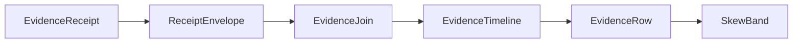
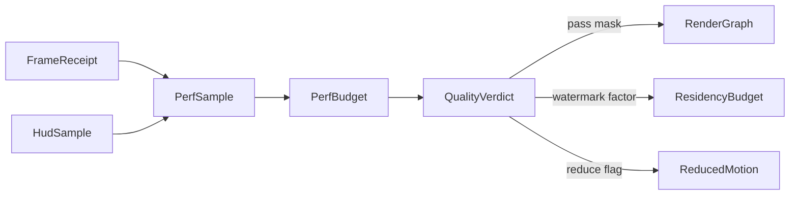

# [APPUI_DIAGNOSTICS_EVIDENCE]

Rasm.AppUi evidence is one rail: a seven-case `EvidenceReceipt` union folds every sibling receipt stream into the HLC-stamped sink envelope, one correlation join projects per-package envelope streams into causal timelines with typed skew bands, host-agnostic capture rows prove pixels by content hash, and a derivation engine generates the headless proof matrix from the screen catalog and replays command journals under virtual time. The page owns the evidence union with the package wire context, the join fold, the capture and proof row families, the Debug loop rows, and the evidence wire contract — composing AppHost ports and the settled sibling receipt records throughout.

## [01]-[INDEX]

- [01]-[RECEIPT_UNION]: Seven-case evidence union sealed through the HLC sink envelope.
- [02]-[CORRELATION_JOIN]: Causal timeline join keyed correlation plus HLC with skew bands.
- [03]-[CAPTURE_LANES]: Host-agnostic frame capture rows; render-hash regression proof.
- [04]-[HEADLESS_DERIVATION]: Catalog-derived proof matrix; deterministic command-journal replay.
- [05]-[DEV_LOOP]: Debug hot-reload knob rows; dispatcher starvation probe.
- [06]-[PERF_BUDGET]: Declarative quality governor folding telemetry into one degrade verdict.
- [07]-[TS_PROJECTION]: Evidence and timeline wire shapes for dashboard ingestion.

## [02]-[RECEIPT_UNION]

- Owner: `EvidenceReceipt` — the one `[Union]` evidence vocabulary; `EvidenceOps` — the sibling-receipt projection fold; `AppUiWireContext` — the package wire context.
- Cases: Surface | Focus | Render | Disposal | Edit | Command | NativeAssetIdentity under the locked kind literals surface, focus, render, disposal, edit, command, native-asset.
- Entry: `public IO<ReceiptEnvelope> Seal(ReceiptSinkPort sink, CorrelationId correlation, TenantContext tenant, JsonSerializerOptions wire)` — `IO` carries the sink effect; the returned envelope is the emission evidence carrying both cross-process primitives, the ambient `TenantContext` threaded from `TenantContext.Current` at composition; the tenant is consumed as settled AppHost vocabulary and never re-minted here.
- Auto: composition binds the settled sibling delegates onto case constructors — `ScreenRuntime.Disposed` to Disposal, `VisualRuntime.Sink` to Render through `ToEvidence`, the inspector receipt sink to the Edit flatten, the mount transaction and its fact stream to Surface and Focus, and the native load-identity probe to NativeAssetIdentity — so every existing receipt stream folds into one union with zero new emitters.
- Receipt: the sealed `ReceiptEnvelope` is the emission evidence; its HLC stamp is the only time authority on evidence, so a second stamp field on a case payload is the deleted form; the envelope's `Tenant` field partitions evidence per tenant from the same threaded `TenantContext`, so a per-tenant evidence view derives from the envelope partition rather than a second tenant field on a case payload.
- Packages: Thinktecture.Runtime.Extensions, LanguageExt.Core, NodaTime, BCL inbox
- Growth: one case row absorbs a new evidence family and one `[JsonSerializable]` row extends the context; zero new surface.
- Boundary: receipts are process-local and HLC-correlated, never globally shared; a generic receipt or ledger abstraction is the rejected form — the typed union with slot metadata is the absorbing owner; cases nest a sibling receipt when its wire form is settled and flatten to scalars when the sibling shape carries non-wire members — the render flatten absorbs the optional destination and the render-row color-space tag so a wide-gamut baseline keys distinctly on the timeline, and the edit flatten absorbs the literal-free outcome union, and a third parallel evidence shape is the named defect; the kind literal reads from the serialized payload, so a second literal table is the deleted form; `AppUiTelemetry.Contribute(version, instruments)` is the one parameterized telemetry-contribution surface every owner calls with its own instrument-name constants — a hand-rolled per-owner `TelemetryContributorPort` factory is the deleted form, the instrument names stay owned by the contributing page, and the contribution shape stays single.

```csharp signature
[Union(ConversionFromValue = ConversionOperatorsGeneration.None)]
[JsonPolymorphic(TypeDiscriminatorPropertyName = "kind")]
[JsonDerivedType(typeof(EvidenceReceipt.Surface), "surface")]
[JsonDerivedType(typeof(EvidenceReceipt.Focus), "focus")]
[JsonDerivedType(typeof(EvidenceReceipt.Render), "render")]
[JsonDerivedType(typeof(EvidenceReceipt.Disposal), "disposal")]
[JsonDerivedType(typeof(EvidenceReceipt.Edit), "edit")]
[JsonDerivedType(typeof(EvidenceReceipt.Command), "command")]
[JsonDerivedType(typeof(EvidenceReceipt.NativeAssetIdentity), "native-asset")]
public abstract partial record EvidenceReceipt {
    private EvidenceReceipt() { }
    public sealed record Surface(SurfaceReceipt Receipt) : EvidenceReceipt;
    public sealed record Focus(string Target, bool Focused) : EvidenceReceipt;
    public sealed record Render(string Slot, string Format, string FrameHash, long Bytes, Duration Elapsed, string? Destination, string ColorSpace) : EvidenceReceipt;
    public sealed record Disposal(string ScreenId, Duration Active, int Disposables) : EvidenceReceipt;
    public sealed record Edit(string Slot, string Surface, string Target, string Editor, string Outcome) : EvidenceReceipt;
    public sealed record Command(CommandReceipt Receipt) : EvidenceReceipt;
    public sealed record NativeAssetIdentity(NativeAssetFact Fact) : EvidenceReceipt;

    public IO<ReceiptEnvelope> Seal(ReceiptSinkPort sink, CorrelationId correlation, TenantContext tenant, JsonSerializerOptions wire) =>
        IO.lift(() => JsonSerializer.SerializeToElement<EvidenceReceipt>(this, wire))
            .Bind(payload => sink.Send(
                correlation, tenant, "Rasm.AppUi", payload.GetProperty("kind").GetString() ?? string.Empty, payload));
}

public static class EvidenceOps {
    extension(RenderReceipt receipt) {
        public EvidenceReceipt ToEvidence() => new EvidenceReceipt.Render(
            receipt.Kind, receipt.Format, receipt.FrameHash, receipt.Bytes, receipt.Elapsed,
            receipt.Destination.Case as string, receipt.ColorSpace);
    }

    extension(EditReceipt receipt) {
        public EvidenceReceipt ToEvidence() => new EvidenceReceipt.Edit(
            receipt.Kind, receipt.Surface, receipt.Target, receipt.Editor,
            receipt.Outcome.Switch(
                observed: static _ => "observed",
                committed: static _ => "committed",
                reverted: static _ => "reverted",
                rejected: static _ => "rejected",
                hostRouted: static _ => "host-routed"));
    }
}

public static class AppUiTelemetry {
    public static TelemetryContributorPort Contribute(string version, params ReadOnlySpan<string> instruments) =>
        new(TelemetrySource.AppUi, version,
            toSeq(instruments.ToArray()).Map(static name => new InstrumentRow(TelemetrySource.AppUi, name)));
}
```

```csharp signature
[JsonSourceGenerationOptions(
    PropertyNamingPolicy = JsonKnownNamingPolicy.CamelCase,
    UnmappedMemberHandling = JsonUnmappedMemberHandling.Disallow,
    RespectNullableAnnotations = true,
    RespectRequiredConstructorParameters = true)]
[JsonSerializable(typeof(CommandPayload))]
[JsonSerializable(typeof(CommandReceipt))]
[JsonSerializable(typeof(EvidenceReceipt))]
[JsonSerializable(typeof(EvidenceTimeline))]
public partial class AppUiWireContext : JsonSerializerContext;
```

## [03]-[CORRELATION_JOIN]

- Owner: `SkewBand` — the HLC uncertainty band; `EvidenceRow` — the ordered timeline row; `EvidenceTimeline` — the causal projection; `EvidenceJoin` — the cross-package fold.
- Entry: `public static Seq<EvidenceTimeline> Correlate(Seq<ReceiptEnvelope> envelopes, Option<string> package = default)` — pure fold; the package filter value is the model-result provenance projection over the Compute stream.
- Auto: rows order by the HLC pair physical-then-logical with the package name as the deterministic tiebreaker, and every row derives its band from the envelope `SkewBound`, so the timeline surfaces clock-skew uncertainty with zero configuration.
- Receipt: `EvidenceTimeline` serializes through the package wire context for dashboard export.
- Packages: LanguageExt.Core, NodaTime, BCL inbox
- Growth: one provenance-filter row absorbs a new per-package view; zero new surface.
- Boundary: the join consumes only `ReceiptEnvelope` — no Compute or Persistence receipt shape enters the fold, and each per-package payload stays an opaque `JsonElement` decoded against its owning wire contract at the view edge; a second correlation vocabulary beside `CorrelationId` plus the HLC stamp is the rejected form; `Overlaps` is the band algebra — a causal-order claim between rows whose bands overlap is structurally unrepresentable, so the timeline renders overlapping bands as one uncertainty region.

```csharp signature
public readonly record struct SkewBand(Instant Earliest, Instant Latest) {
    public static SkewBand Of(ReceiptEnvelope envelope) =>
        new(envelope.Physical - envelope.SkewBound, envelope.Physical);

    public bool Overlaps(SkewBand other) =>
        Earliest <= other.Latest && other.Earliest <= Latest;
}

public sealed record EvidenceRow(int Ordinal, ReceiptEnvelope Envelope, SkewBand Band);

public sealed record EvidenceTimeline(CorrelationId Correlation, Seq<EvidenceRow> Rows);

public static class EvidenceJoin {
    public static Seq<EvidenceTimeline> Correlate(Seq<ReceiptEnvelope> envelopes, Option<string> package = default) =>
        envelopes
            .Filter(envelope => package.Map(name => envelope.Package == name).IfNone(true))
            .GroupBy(static envelope => envelope.Correlation)
            .AsIterable()
            .Map(static group => new EvidenceTimeline(group.Key, Ordered(group)))
            .ToSeq();

    static Seq<EvidenceRow> Ordered(IEnumerable<ReceiptEnvelope> grouped) =>
        toSeq(grouped
            .OrderBy(static envelope => (envelope.Physical, envelope.Logical, envelope.Package))
            .Select(static (envelope, ordinal) => new EvidenceRow(ordinal, envelope, SkewBand.Of(envelope))));
}
```



## [04]-[CAPTURE_LANES]

- Owner: `CaptureRow` — the per-surface capture row carrying the DPI-scale column; `Captures` — the shot-and-regression surface.
- Entry: `public static IO<RenderReceipt> Shot(VisualRuntime runtime, CaptureRow row)` — `IO` rail through the settled encode fold; one PNG artifact plus one render receipt per shot.
- Auto: capture keys prefix into the per-run artifact scope behind the runtime blob delegate, so a shot never computes a path; the `Scale` column pins the headless render scaling through `SetRenderScaling` so a hi-DPI baseline keys distinctly from its standard-scale twin; the `Ticks` column folds that many `ForceRenderTimerTick` advances into one deterministic frame effect before the grab, so a single-frame baseline pins `Ticks: 1` and an animation-settled or multi-frame capture pins its own count as data and never wall time; the receipt's `FrameHash` rides the suite content-hash identity row.
- Packages: SkiaSharp, Avalonia.Headless, Avalonia.Skia, LanguageExt.Core
- Growth: one capture row absorbs a new surface lane; one `Scale` value on a row absorbs a new DPI baseline; zero new surface.
- Boundary: grab delegates bind at composition per surface row and no capture member is named outside its own row — the headless lane rides the `WriteableBitmap? CaptureRenderedFrame(this TopLevel)` and `WriteableBitmap? GetLastRenderedFrame(this TopLevel)` extensions whose `WriteableBitmap` pixels enter the hash fold through `Lock()` over the `ILockedFramebuffer` (`Address`, `RowBytes`, `Size`, `Format`), an un-shown top-level returning a null frame folds to an absent grab rather than a throw, with `UseHeadlessDrawing` false selecting the Skia backend on every hash lane and `SetRenderScaling(this TopLevel, double)` pinning the device scale before the grab (it throws `ArgumentOutOfRangeException` on a non-positive scale, so the row `Scale` stays positive) so the render-hash is scale-attributable, the custom-visual lane is one `CaptureRow` per kind×gamut cell whose `Grab` materializes the kind through `CustomVisual.Materialize` and encodes through `VisualCodec` at the kind's `ColorSpaceAxis` row, so a wide-gamut custom tile hashes its float or ICC-tagged pixels keyed by `key@scale×gamut` and never a quantized sRGB shadow, and the render-hash regression attributes a custom-tile pixel drift to the exact kind, scale, and gamut cell, the rhino lane rides the settled host viewport capture port, and the desktop in-tree lane renders through `RenderTargetBitmap.Render(Visual)` with `CopyPixels(PixelRect, nint, int, int)` as its pixel projection, or evaluates a live visual onto a leased Skia canvas through `DrawingContextHelper.RenderAsync` where the in-tree row already holds a render lease so the capture composes the visual into the encode fold without a second offscreen surface; `ForceRenderTimerTick` is the only frame-advance verb on the deterministic lane — a debounce or animation that fails under forced ticks has smuggled wall time, and the tick count is a row column so a multi-frame capture is data; `Regression` compares `FrameHash` values from the settled receipt family, so a per-spec screenshot helper is the deleted form and a second baseline store beside the blob lane is the rejected form.

```csharp signature
public sealed record CaptureRow(string Key, Func<SurfaceHost, bool> Surface, double Scale, int Ticks, Func<double, Func<IO<Unit>>, IO<SKImage>> Grab) {
    public IO<SKImage> Shoot() =>
        Grab(Scale, () => Range(0, int.Max(Ticks, 1))
            .Fold(IO.pure(unit), static (rail, _) => rail.Bind(static _ => IO.lift(AvaloniaHeadlessPlatform.ForceRenderTimerTick))));
}

public static class Captures {
    public const string Kind = "capture";

    public static IO<RenderReceipt> Shot(VisualRuntime runtime, CaptureRow row) =>
        row.Shoot().Bind(image =>
            VisualCodec.Encode(runtime, image, VisualCodec.Png, Kind, $"captures/{row.Key}@{row.Scale}x.png"));

    public static Fin<RenderReceipt> Regression(RenderReceipt actual, string baseline) =>
        actual.FrameHash == baseline
            ? Fin.Succ(actual)
            : Fin.Fail<RenderReceipt>(Error.New($"evidence/render-hash: {actual.Kind} diverged from {baseline}"));
}
```

## [05]-[HEADLESS_DERIVATION]

- Owner: `ComparerAccessors.StringOrdinal` accessor; `ProofCheck` — the eight-row check vocabulary; `ProofSpec` — the derived spec row; `ProofEngine` — the derivation and replay surface; `RenderHashLane` — the `key@scale×gamut` render-hash cell; `ProofLaw` — the law-matrix fence surface composing `ProofEngine` with CsCheck property generators and `Verify.XunitV3` FrameHash equality.
- Cases: activation, render-hash, focus-walk, variant-sweep, density-sweep, disposal-leak, pointer-walk, drag-drop — the two input-proof rows drive the headless synthetic-input verbs.
- Entry: `public static Seq<ProofSpec> Derive(ScreenCatalog catalog, Seq<(ThemeVariantRow Variant, DensityRow Density)> grid, Func<ScreenCatalogRow, ProofCheck, ThemeVariantRow, DensityRow, Func<IO<EvidenceReceipt>>> probe)` — every headless catalog row crossed with every check and every variant-density cell.
- Auto: derived specs execute on the shared `HeadlessUnitTestSession` through `GetOrStartForAssembly` once per assembly and `Dispatch` per spec, so every spec runs on the one UI thread without a per-spec session boot, and `[AvaloniaFact]` dispatch under the xunit.v3 MTP runner rides the same session; `FakeTimeProvider` time travel fills the headless row's virtual-time slot; `Replay` drives the journal through the one remote-invocation route on the frozen deck, so journal replay, deep links, and interactive execution seal the same receipt family; the snapshot store rehydrates screen state before the first journal entry, so replay is deterministic end to end; the pointer-walk and drag-drop checks drive synthetic input on the session top-level through `HeadlessWindowExtensions.MouseDown(this TopLevel, Point, MouseButton, RawInputModifiers)`/`MouseMove(this TopLevel, Point, RawInputModifiers)`/`MouseUp(this TopLevel, Point, MouseButton, RawInputModifiers)`/`MouseWheel(this TopLevel, Point, Vector, RawInputModifiers)` between `ForceRenderTimerTick` advances, the drag-drop check driving `DragDrop(this TopLevel, Point, RawDragEventType, IDataTransfer, DragDropEffects, RawInputModifiers)` (void return) in the load-bearing `DragEnter` → `DragOver` → `Drop` sequence (`RawDragEventType` from `Avalonia.Input.Raw`) because a `DragOver` without a prior `DragEnter` seeds no drop context and raises no routed handler, the resulting effect read from `DragEventArgs.DragEffects` inside the handler and never a return value, so a pointer-interaction or drop-target proof is a deterministic frame sequence and never wall-time hover timing.
- Receipt: every executed spec seals its `EvidenceReceipt` through the union — disposal-leak audits ride the Disposal case and render checks ride the Render case.
- Packages: Avalonia.Headless, Avalonia.Headless.XUnit, Avalonia.Skia, Verify.XunitV3, CsCheck (testkit), Microsoft.Extensions.TimeProvider.Testing (FakeTimeProvider), Thinktecture.Runtime.Extensions, LanguageExt.Core, BCL inbox
- Growth: one check row sweeps every headless screen, one grid cell sweeps every check, and one `RenderHashLane` cell sweeps every key×scale×gamut combination; zero new surface.
- Boundary: the derivation engine deletes hand-written per-screen smoke specs — a bespoke screen spec beside the engine is the named defect; the engine owns execution and capture while sibling audit folds declare their own row shapes over it; the proof spec is a law-matrix fence — `ProofLaw.FrameHashEquality` seals one `key@scale×gamut` cell through `Captures.Shot` then `Verifier.Verify` so a render-hash regression attributes to the exact cell, `ProofLaw.DeterministicCapture` is the CsCheck property that two captures of one lane hash identically (a debounce or animation that smuggles wall time fails it), `ProofLaw.ReplayDeterminism` replays the journal twice under `FakeTimeProvider.SetUtcNow(UnixEpoch)` and `Verifier.Verify`-equals the two payload-digest seqs, and `ProofLaw.ProofMatrix` is the one entrypoint that owns the singular-cell and full-matrix run by input shape so a per-spec screenshot helper is the deleted form; the `RenderHashGrid` FrameHash golden bytes are the C#-host-validated leg of the content-addressed `XxHash128`-keyed ONE_WIRE_FIXTURE_CORPUS — the render-hash lane is the host golden producer the cross-runtime consumers read, never a second golden store; the render-hash and capture lanes run on the Skia render-proof builder the surface-hosts headless row binds (`UseSkia` then `UseHeadless(new AvaloniaHeadlessPlatformOptions { UseHeadlessDrawing = false })` then `SetupWithoutStarting`) because `HeadlessUnitTestSession.StartNew` force-applies `UseHeadlessDrawing = true` and never `UseSkia`, so a frame captured under the session alone is the stub-drawing form, while the activation, focus-walk, pointer-walk, drag-drop, and disposal-leak checks ride the shared `HeadlessUnitTestSession` where stub drawing is acceptable; host-bound screens exit the matrix structurally through the catalog's headless lane, never through skipped specs.

```csharp signature

[SmartEnum<string>]
[KeyMemberEqualityComparer<ComparerAccessors.StringOrdinal, string>]
[KeyMemberComparer<ComparerAccessors.StringOrdinal, string>]
public sealed partial class ProofCheck {
    public static readonly ProofCheck Activation = new("activation");
    public static readonly ProofCheck RenderHash = new("render-hash");
    public static readonly ProofCheck FocusWalk = new("focus-walk");
    public static readonly ProofCheck VariantSweep = new("variant-sweep");
    public static readonly ProofCheck DensitySweep = new("density-sweep");
    public static readonly ProofCheck DisposalLeak = new("disposal-leak");
    public static readonly ProofCheck PointerWalk = new("pointer-walk");
    public static readonly ProofCheck DragDrop = new("drag-drop");
}

public sealed record ProofSpec(
    string ScreenId,
    ProofCheck Check,
    ThemeVariantRow Variant,
    DensityRow Density,
    Func<IO<EvidenceReceipt>> Run);

public static class ProofEngine {
    public static Seq<ProofSpec> Derive(
        ScreenCatalog catalog,
        Seq<(ThemeVariantRow Variant, DensityRow Density)> grid,
        Func<ScreenCatalogRow, ProofCheck, ThemeVariantRow, DensityRow, Func<IO<EvidenceReceipt>>> probe) =>
        catalog.HeadlessLane.Bind(row =>
            grid.Bind(cell =>
                toSeq(ProofCheck.Items).Map(check =>
                    new ProofSpec(row.Id, check, cell.Variant, cell.Density, probe(row, check, cell.Variant, cell.Density)))));

    public static IO<EvidenceReceipt> Dispatch(ProofSpec spec) =>
        IO.liftAsync(async () => await HeadlessUnitTestSession
            .GetOrStartForAssembly(typeof(ProofEngine).Assembly)
            .Dispatch(() => spec.Run().RunAsync().AsTask(), CancellationToken.None)
            .ConfigureAwait(false));

    public static IO<Seq<CommandReceipt>> Replay(CommandDeck deck, Seq<(string Key, JsonElement Payload)> journal) =>
        journal.TraverseM(entry => deck.Invoke(entry.Key, entry.Payload)).As();
}
```

```csharp signature
public readonly record struct RenderHashLane(string Key, double Scale, string Gamut, int Ticks) {
    public string Cell => $"{Key}@{Scale}x{Gamut}";

    public CaptureRow Row(Func<double, Func<IO<Unit>>, IO<SKImage>> grab, Func<SurfaceHost, bool> surface) =>
        new(Cell, surface, Scale, Ticks, grab);
}

public static class ProofLaw {
    public static readonly Seq<RenderHashLane> RenderHashGrid = toSeq(
        from key in Seq("viewport", "custom-tile", "drafting-sheet")
        from scale in Seq(1.0, 2.0)
        from gamut in Seq(ColorPolicy.Display.Key, ColorPolicy.DisplayP3.Key, ColorPolicy.Rec2020.Key)
        select new RenderHashLane(key, scale, gamut, Ticks: 1));

    public static async Task FrameHashEquality(VisualRuntime runtime, RenderHashLane lane, Func<double, Func<IO<Unit>>, IO<SKImage>> grab, Func<SurfaceHost, bool> surface) {
        RenderReceipt receipt = await Captures.Shot(runtime, lane.Row(grab, surface)).RunAsync();
        await Verifier.Verify(new { lane.Cell, receipt.FrameHash, receipt.ColorSpace })
            .UseTextForParameters(lane.Cell);
    }

    public static Gen<RenderHashLane> LaneGen =>
        from key in Gen.OneOfConst("viewport", "custom-tile", "drafting-sheet")
        from scale in Gen.OneOfConst(1.0, 2.0)
        from gamut in Gen.OneOfConst(ColorPolicy.Display.Key, ColorPolicy.DisplayP3.Key, ColorPolicy.Rec2020.Key)
        select new RenderHashLane(key, scale, gamut, 1);

    public static void DeterministicCapture(VisualRuntime runtime, Func<double, Func<IO<Unit>>, IO<SKImage>> grab, Func<SurfaceHost, bool> surface) =>
        LaneGen.Sample(lane => {
            RenderReceipt first = Captures.Shot(runtime, lane.Row(grab, surface)).Run();
            RenderReceipt second = Captures.Shot(runtime, lane.Row(grab, surface)).Run();
            return first.FrameHash == second.FrameHash;
        });

    public static IO<Seq<EvidenceReceipt>> ProofMatrix(ScreenCatalog catalog, Seq<(ThemeVariantRow Variant, DensityRow Density)> grid, Func<ScreenCatalogRow, ProofCheck, ThemeVariantRow, DensityRow, Func<IO<EvidenceReceipt>>> probe) =>
        ProofEngine.Derive(catalog, grid, probe).TraverseM(ProofEngine.Dispatch).As();

    public static async Task ReplayDeterminism(CommandDeck deck, Seq<(string Key, JsonElement Payload)> journal, FakeTimeProvider time) {
        time.SetUtcNow(DateTimeOffset.UnixEpoch);
        Seq<CommandReceipt> first = await ProofEngine.Replay(deck, journal).RunAsync();
        time.SetUtcNow(DateTimeOffset.UnixEpoch);
        Seq<CommandReceipt> second = await ProofEngine.Replay(deck, journal).RunAsync();
        await Verifier.Verify(first.Map(static r => r.PayloadDigest).Zip(second.Map(static r => r.PayloadDigest)));
    }
}
```

## [06]-[DEV_LOOP]

- Owner: `DevLoop` — the Debug loop surface with the hot-reload knob rows, the manual-reload intent edge, the remote-evidence ingest edge, the performance-HUD sample feed, the flamegraph fold, the solve time-travel scrub, the cross-machine replay-verify, and the in-app REPL; `HudSample`, `FlameNode`, `SolveScrub`, `Repl`, `ReplResult` the user-facing debug owners.
- Entry: `public static IO<Unit> DispatcherLag(SurfaceScheduler boundary, TimeProvider time, Func<Duration, IO<Unit>> sink)` — marshal round-trip lag into the composition-bound sink delegate; `public static IO<Unit> Reload(ReloadIntent intent, Func<IO<Unit>> trigger, Func<IO<Unit>> enable, Func<IO<Unit>> disable)` — the manual-reload verb routes the three injected `AvaloniaHotReloadExtensions` operations through composition-bound delegates so a palette-raised reload intent dispatches `TriggerHotReload`/`EnableHotReload`/`DisableHotReload` without DevLoop touching the injected surface; `public static IO<Unit> Ingest(ReceiptSinkPort sink, Func<ReadOnlyMemory<byte>, Fin<ReceiptEnvelope>> decode, ReadOnlyMemory<byte> frame)` — the composition-bound binary-wire `decode` column lifts a remote frame into a `ReceiptEnvelope` re-emitted through `sink.Emit`, preserving the origin node's HLC stamp so the correlation join reads each node's own clock.
- Auto: the lag sink binds to `ReceiptSinkPort.Send` at composition under the `LagKind` row, so starvation evidence rides the same envelope stream the dashboards ingest; threshold evaluation stays with the health fold, so the probe carries zero literals; the `decode` column binds the settled Persistence binary-wire decode at composition so a companion node's receipt frames fold into the same envelope stream as local evidence with no second codec; `Reload` binds the three injected operations at composition under the master gate so the manual-reload intent is a command-table verb on Debug profiles and a structurally-absent route on Release closures where the injected source is stripped.
- Packages: HotAvalonia, LanguageExt.Core, NodaTime, BCL inbox
- Growth: one knob row retunes the reload gate, one `ReloadIntent` case absorbs a new manual-reload verb, one probe row absorbs a new loop measure, one `HudSample` field absorbs a new HUD metric, and one `ReplResult` case absorbs a new eval outcome; zero new surface.
- Boundary: HotAvalonia is a Debug-gated build asset whose injected `UseHotReload`, `EnableHotReload`, `DisableHotReload`, and `TriggerHotReload` extensions on `AppBuilder`/`Application` are the only callable surface — the master gate plus `HotAvaloniaProcessReferences` enabled strips `HotAvalonia.Core`, `HotAvalonia.Extensions`, and the `HotAvalonia.Fody` weaver from Release closures while `HotAvaloniaExcludeReferences` names the exact reference list the strip removes, and the explicit `Avalonia.Markup.Xaml.Loader` markup-loader pin with its transitive floor lands in the charter admissions so the Debug XAML-compile path resolves and the Release closure carries none of it — the markup loader is the HotAvalonia weaver's Debug-only re-patch dependency, never a managed `AvaloniaXamlLoader.Load` runtime-materialize surface DevLoop exposes, so `TriggerHotReload` re-patches compiled-XAML methods in place while a DevLoop-raised runtime `AvaloniaXamlLoader.Load` call is the rejected form whose structural fault is `Surfaces.RejectRuntimeXaml`; the manual-reload intent rides composition-bound delegates so DevLoop names no injected symbol directly and the deleted form is a DevLoop-internal reload bootstrap beside the injected extensions; a DevTools attach surface is the deleted form — the dev loop is hot reload plus headless evidence plus the user-facing performance HUD, solve debugger, and REPL; the performance HUD is the `HudSample` feed — frame-elapsed, GPU-elapsed, VRAM bytes, triangle count from the viewport `FrameReceipt`, and the per-node solve elapsed from the Compute solve receipts fold into one HUD sample stream the overlay renders, so the HUD reads the same receipt envelopes the timeline ingests and a HUD-local meter is the deleted form; flamegraphs are the `FlameNode` fold — the per-node solve and per-pass render durations nest into one self-and-total tree the overlay flattens by depth so a profiling flamegraph is a fold over the existing receipt durations, never a second profiler; solve time-travel is the `SolveScrub` — each solve frame records its node id and state json keyed by ordinal so a user scrubs the solve history backward and forward and `Diff` surfaces the per-node state delta between two frames, the time-travel debugger over the journal the replay lane already records; cross-machine replay-verify is `ReplayVerify` — a journal replays through the one `ProofEngine.Replay` route and each receipt's payload digest compares to the baseline machine's digest so a cross-machine divergence surfaces as the exact journal index that diverged, the determinism check the headless lanes already prove extended across machines; the in-app REPL is `Repl` — a typed line parses into an intent key and payload and evaluates through the one `CommandProjections.Invoke` route so the REPL is the command table's interactive face and a second command-execution path is the rejected form, the eval result the typed `ReplResult` union; remote evidence ingestion packs envelopes through the settled Persistence binary wire row via a composition-bound codec delegate, so a second binary codec here is the rejected form; the HARFS remote-server knobs and the runtime timeout and hotkey knobs ride the same MSBuild gate as the master row and carry no managed surface.

```csharp signature
[Union(ConversionFromValue = ConversionOperatorsGeneration.None)]
public abstract partial record ReloadIntent {
    private ReloadIntent() { }
    public sealed record Trigger : ReloadIntent;
    public sealed record Enable : ReloadIntent;
    public sealed record Disable : ReloadIntent;
}

public readonly record struct HudSample(
    Duration FrameElapsed,
    Duration GpuElapsed,
    long VramBytes,
    long Triangles,
    Duration SolveElapsed,
    int PerNodeCount);

public sealed record FlameNode(string Frame, Duration Self, Seq<FlameNode> Children) {
    public Duration Total => Self + Children.Fold(Duration.Zero, static (acc, child) => acc + child.Total);

    public Seq<(string Frame, Duration Total, int Depth)> Flatten(int depth = 0) =>
        Seq1((Frame, Total, depth)) + Children.Bind(child => child.Flatten(depth + 1));
}

public sealed record SolveFrame(int Ordinal, string NodeId, JsonElement State, Instant At);

public sealed record SolveScrub(Seq<SolveFrame> Frames) {
    public Option<SolveFrame> At(int ordinal) => Frames.Find(frame => frame.Ordinal == ordinal);

    public SolveScrub Record(SolveFrame frame) => this with { Frames = Frames.Add(frame) };

    public Option<(SolveFrame From, SolveFrame To)> Diff(int from, int to) =>
        (At(from), At(to)) switch {
            ({ IsSome: true, Case: SolveFrame a }, { IsSome: true, Case: SolveFrame b }) => Some((a, b)),
            _ => None,
        };
}

[Union(ConversionFromValue = ConversionOperatorsGeneration.None)]
public abstract partial record ReplResult {
    private ReplResult() { }
    public sealed record Value(JsonElement Json) : ReplResult;
    public sealed record Receipt(CommandReceipt Command) : ReplResult;
    public sealed record Failed(string Detail) : ReplResult;
}

public sealed record Repl(CommandDeck Deck, Func<string, Fin<(string Key, JsonElement Payload)>> Parse) {
    public IO<ReplResult> Eval(string line) =>
        Parse(line).Match(
            Succ: parsed => Deck.Invoke(parsed.Key, parsed.Payload).Map(static receipt => (ReplResult)new ReplResult.Receipt(receipt)),
            Fail: error => IO.pure<ReplResult>(new ReplResult.Failed(error.Message)));
}

public static class DevLoop {
    public const string LagKind = "dispatcher-lag";
    public const string HudKind = "perf-hud";

    public static IO<Unit> DispatcherLag(SurfaceScheduler boundary, TimeProvider time, Func<Duration, IO<Unit>> sink) =>
        IO.lift(time.GetTimestamp)
            .Bind(mark => boundary.Marshal(() =>
                ignore(sink(Duration.FromTimeSpan(time.GetElapsedTime(mark))).Run())));

    public static IO<Unit> Hud(IObservable<HudSample> samples, Func<HudSample, IO<Unit>> render) =>
        IO.lift(() => ignore(samples.Subscribe(sample => ignore(render(sample).Run()))));

    public static IO<Fin<Seq<int>>> ReplayVerify(Seq<(string Key, JsonElement Payload)> journal, CommandDeck deck, Seq<string> baseline) =>
        ProofEngine.Replay(deck, journal)
            .Map(receipts => Fin.Succ(toSeq(receipts)
                .Zip(baseline)
                .Filter(pair => pair.Item1.PayloadDigest != pair.Item2)
                .Map((pair, index) => index)));

    public static IO<Unit> Reload(ReloadIntent intent, Func<IO<Unit>> trigger, Func<IO<Unit>> enable, Func<IO<Unit>> disable) =>
        intent.Switch(
            state: (Trigger: trigger, Enable: enable, Disable: disable),
            trigger: static (ops, _) => ops.Trigger(),
            enable: static (ops, _) => ops.Enable(),
            disable: static (ops, _) => ops.Disable());

    public static IO<Unit> Ingest(ReceiptSinkPort sink, Func<ReadOnlyMemory<byte>, Fin<ReceiptEnvelope>> decode, ReadOnlyMemory<byte> frame) =>
        decode(frame).Match(
            Succ: sink.Emit,
            Fail: static error => IO.fail<Unit>(error));
}
```

| [INDEX] | [KNOB_ROW]                   | [VALUE]            | [ROLE]                                  |
| :-----: | :--------------------------- | :----------------- | :-------------------------------------- |
|  [01]   | HotAvalonia                  | Debug default      | master gate                             |
|  [02]   | HotAvaloniaIncludeExtensions | exe default        | injects the UseHotReload source         |
|  [03]   | HotAvaloniaProcessReferences | enabled            | Release closure strip                   |
|  [04]   | HotAvaloniaExcludeReferences | weaver + core list | reference list the strip removes        |
|  [05]   | markup-loader pin            | transitive floor   | `Avalonia.Markup.Xaml.Loader` Debug pin |
|  [06]   | HotAvaloniaRemote            | non-desktop opt-in | remote reload route                     |
|  [07]   | HotAvaloniaTimeout           | runtime default    | reload timeout window                   |
|  [08]   | HotAvaloniaHotkey            | runtime default    | manual-reload key chord                 |
|  [09]   | HarfsAddress / HarfsPort     | remote endpoint    | HARFS file-server endpoint              |

## [07]-[PERF_BUDGET]

- Owner: `QualityTier` `[SmartEnum<string>]` the descending quality grades; `PerfSample` the folded telemetry observation; `QualityVerdict` the one degrade verdict; `PerfBudget` the declarative quality governor; `GpuTimingPass` the per-pass timestamp-query writer; `PipelineStat` the pipeline-statistics row; `GpuTimeline` the measured-vs-projected per-pass GPU projection feeding the verdict.
- Cases: `QualityTier` = ultra, high, balanced, conservative, floor — ultra runs the full pass list and motion catalog, floor runs the `Composite`-only fallback with reduced motion and the tightest residency watermark.
- Entry: `public static QualityVerdict Govern(PerfBudget governor, PerfSample sample)` — folds one telemetry sample into a quality verdict degrading render passes, the residency watermark, and the motion tokens together; the governor reads the existing evidence receipt envelopes and the `FrameBudget`/`ResidencyBudget` instruments, never a second meter.
- Auto: `PerfSample` folds the viewport `FrameReceipt` frame-elapsed and GPU-elapsed, the residency-evict count, the VRAM watermark, and the layout-elapsed into one observation off the receipt stream the timeline already ingests, so the governor reads the settled evidence and mints no new instrument; `Govern` compares the sample against the budget thresholds and selects the lowest `QualityTier` whose budget the sample holds, so a frame-budget breach steps the tier down deterministically and a recovered budget steps it up under a hysteresis band so the tier never oscillates per frame; the verdict carries the degraded pass mask (path-trace samples capped, sim volume dropped to isosurface, the meshlet LOD pixel-threshold raised), the residency watermark factor, and the motion reduce flag so one verdict degrades the three owners together; the governor degrades deterministically so the render-hash lanes stay attributable under a budget breach — a given tier produces a given pass list.
- Profiler: `GpuTimingPass` writes a `Silk.NET.WebGPU` `QueryType.Timestamp` query at each render-graph pass boundary through `CommandEncoderWriteTimestamp` (api-silk-webgpu.md 126), resolves the `QuerySet` to a read buffer through `CommandEncoderResolveQuerySet` (127), and retires the resolve through the non-blocking `Wgpu.DevicePoll` (api-silk-webgpu-wgpu.md 39) so the per-pass figure becomes resolved GPU nanoseconds, never a blocking fence; a `QueryType.PipelineStatistics` set (128) captures the vertices-shaded, primitives-culled, and fragment-invocations as a `PipelineStat` frozen-column Fold so a slow pass attributes to a bottleneck not just a duration; `GpuTimeline` correlates the measured GPU seq against the projected CPU seq keyed by the frame ordinal so a projection-vs-measurement divergence is itself attributable evidence — ONE evidence-receipt projection riding the `Render`-family `FrameReceipt`, the per-pass GPU figure MIGRATING the existing `Render/pipeline.md#RENDER_GRAPH` `FrameReceipt` GPU `Duration` from the encoder-projected accumulated cost to the resolved nanoseconds (deepen the receipt, never fork it), so the governor degrades the genuinely-overrunning pass on measured cost.
- Receipt: `QualityVerdict` rides the evidence stream as a `Render`-family fact carrying the active tier and the degrade mask so a tier transition is attributable; the verdict folds the tier-transition count onto the governor instrument; `GpuTimeline` rides the same `Render`-family fact so the measured per-pass GPU seq is one projection beside the verdict, never a second telemetry surface.
- Packages: Silk.NET.WebGPU, Silk.NET.WebGPU.Extensions.WGPU, Thinktecture.Runtime.Extensions, LanguageExt.Core, NodaTime, BCL inbox
- Growth: a new quality grade is one `QualityTier` row carrying its pass-mask and watermark column; a new degrade axis is one `QualityVerdict` field; a new profiled pass is one `GpuTimingPass` timestamp-query pair; a new pipeline-statistic is one `PipelineStat` column; zero new surface.
- Boundary: the governor is the one adaptive-quality owner — absent the governor the per-owner frame/VRAM/layout-elapsed instruments enforce locally with no cross-owner authority, and the `PerfBudget` folds that evidence telemetry back into one quality policy so a second meter or a per-pass ad-hoc throttle is the deleted form; the governor consumes the settled `Render/pipeline.md#RENDER_GRAPH` `FrameReceipt`, the `Render/meshlets.md#RESIDENCY_BUDGET` evict and prefetch instruments, the `Theme/motion.md#REDUCED_MOTION` switch, and the `Render/evidence.md#DEV_LOOP` HUD samples, and emits one `QualityVerdict` that degrades render passes (the pass mask the render graph reads at frame head), the residency watermark (the factor the `ResidencyBudget` scales its watermark by), and the motion tokens (the reduce flag the `ReducedMotion.Observe` swaps) together — the governor consumes evidence and emits one quality verdict, never a second meter; the tier transition rides a hysteresis band so the tier degrades deterministically and the render-hash lane pins a tier so a budget-breach frame is reproducible; the verdict is the only quality authority so a per-pass throttle, a per-screen quality flag, or a second residency watermark owner is the rejected form.

```csharp signature
[SmartEnum<string>]
public sealed partial class QualityTier {
    public static readonly QualityTier Ultra = new("ultra", rank: 4, pathTraceSamples: 256, simVolume: true, lodPixelScale: 1.0, watermarkFactor: 1.0, reduceMotion: false);
    public static readonly QualityTier High = new("high", rank: 3, pathTraceSamples: 128, simVolume: true, lodPixelScale: 1.0, watermarkFactor: 1.0, reduceMotion: false);
    public static readonly QualityTier Balanced = new("balanced", rank: 2, pathTraceSamples: 64, simVolume: true, lodPixelScale: 1.5, watermarkFactor: 0.8, reduceMotion: false);
    public static readonly QualityTier Conservative = new("conservative", rank: 1, pathTraceSamples: 16, simVolume: false, lodPixelScale: 2.5, watermarkFactor: 0.6, reduceMotion: true);
    public static readonly QualityTier Floor = new("floor", rank: 0, pathTraceSamples: 0, simVolume: false, lodPixelScale: 4.0, watermarkFactor: 0.4, reduceMotion: true);

    public int Rank { get; }
    public int PathTraceSamples { get; }
    public bool SimVolume { get; }
    public double LodPixelScale { get; }
    public double WatermarkFactor { get; }
    public bool ReduceMotion { get; }

    private static readonly Lazy<FrozenDictionary<int, QualityTier>> ByRank =
        new(static () => Items.ToFrozenDictionary(static row => row.Rank));

    public static Option<QualityTier> Ranked(int rank) =>
        ByRank.Value.TryGetValue(Math.Clamp(rank, 0, 4), out var row) ? Optional(row) : None;
}

public readonly record struct PerfSample(Duration FrameElapsed, Duration GpuElapsed, long VramBytes, long ResidencyEvicts, Duration LayoutElapsed, Instant At) {
    public static PerfSample Of(HudSample hud, long evicts, Duration layout, Instant at) =>
        new(hud.FrameElapsed, hud.GpuElapsed, hud.VramBytes, evicts, layout, at);
}

public readonly record struct QualityVerdict(QualityTier Tier, int PathTraceSamples, bool SimVolume, double LodPixelScale, double WatermarkFactor, bool ReduceMotion, Instant At) {
    public static QualityVerdict Of(QualityTier tier, Instant at) =>
        new(tier, tier.PathTraceSamples, tier.SimVolume, tier.LodPixelScale, tier.WatermarkFactor, tier.ReduceMotion, at);
}

public sealed record PerfBudget(FrameBudget Budget, double HysteresisFraction, QualityTier Active) {
    public const string TierInstrument = "rasm.appui.evidence.quality-tier";

    public static TelemetryContributorPort TelemetryRow(string version) =>
        AppUiTelemetry.Contribute(version, TierInstrument);

    public QualityVerdict Govern(PerfSample sample) =>
        sample.FrameElapsed > Budget.Frame || sample.VramBytes > Budget.VramBytes
            ? Step(Active.Rank - 1, sample.At)
            : sample.FrameElapsed < Budget.Frame * (1.0 - HysteresisFraction) && sample.VramBytes < (long)(Budget.VramBytes * (1.0 - HysteresisFraction))
                ? Step(Active.Rank + 1, sample.At)
                : QualityVerdict.Of(Active, sample.At);

    private static QualityVerdict Step(int rank, Instant at) =>
        QualityTier.Ranked(rank).Match(
            Some: tier => QualityVerdict.Of(tier, at),
            None: () => QualityVerdict.Of(QualityTier.Floor, at));
}
```

```csharp signature
public readonly record struct PipelineStat(string Pass, long VerticesShaded, long PrimitivesCulled, long FragmentInvocations);

public readonly record struct PassTiming(string Pass, int QueryIndex, Duration Projected, Option<Duration> Measured) {
    public Duration Resolved => Measured.IfNone(Projected);

    public bool Diverged(double fraction) =>
        Measured.Match(
            Some: gpu => Math.Abs((gpu - Projected).ToTimeSpan().TotalNanoseconds) > Projected.ToTimeSpan().TotalNanoseconds * fraction,
            None: () => false);
}

public sealed record GpuTimingPass(Seq<string> PassBoundaries, double PeriodNs) {
    public Seq<PassTiming> Plan(Seq<(string Pass, Duration Projected)> projected) =>
        PassBoundaries.Map((pass, index) =>
            new PassTiming(pass, index, projected.Find(p => p.Pass == pass).Map(static p => p.Projected).IfNone(Duration.Zero), None));

    public Seq<PassTiming> Resolve(Seq<PassTiming> planned, ReadOnlyMemory<ulong> resolvedTicks) =>
        planned.Map(timing =>
            timing.QueryIndex + 1 < resolvedTicks.Length
                ? timing with { Measured = Some(Duration.FromNanoseconds(
                    (resolvedTicks.Span[timing.QueryIndex + 1] - resolvedTicks.Span[timing.QueryIndex]) * PeriodNs)) }
                : timing);
}

public sealed record GpuTimeline(long FrameOrdinal, Seq<PassTiming> Passes, Seq<PipelineStat> Stats) {
    public const string Kind = "gpu-timeline";
    public const string DivergenceInstrument = "rasm.appui.evidence.gpu-projection-divergence";

    public static TelemetryContributorPort TelemetryRow(string version) =>
        AppUiTelemetry.Contribute(version, DivergenceInstrument);

    public Duration MeasuredGpu => Passes.Fold(Duration.Zero, static (acc, pass) => acc + pass.Resolved);

    public Seq<PassTiming> Divergent(double fraction) => Passes.Filter(pass => pass.Diverged(fraction));

    public FrameReceipt Migrate(FrameReceipt receipt) =>
        receipt with {
            Gpu = MeasuredGpu,
            Passes = Passes.Map(static pass => (pass.Pass, pass.Resolved)),
        };
}
```



## [08]-[TS_PROJECTION]

- Owner: `EvidenceReceiptWire`, `SurfaceReceiptWire`, `NativeAssetFactWire`, `SkewBandWire`, `EvidenceRowWire`, `EvidenceTimelineWire` — the evidence wire contract; the command case composes the settled command receipt wire shape.
- Packages: BCL inbox
- Growth: one wire member row per new case field and one kind literal per new evidence case; zero new surface.
- Boundary: shapes transcribe the camelCase Strict emission — kind literals discriminate the union, the surface host crosses as its locked case key, instants cross as ISO-8601 text and durations as round-trip text, the optional destination crosses as null, and the receipt binds as the payload type parameter on the suite envelope wire record; skew bands cross as instant pairs so the dashboard renders uncertainty regions without recomputing the HLC fold; timeline rows carry the envelope whole, so the dashboard decodes each payload against its owning package contract.

```ts contract
type EvidenceReceiptWire =
  | { readonly kind: "surface"; readonly receipt: SurfaceReceiptWire }
  | { readonly kind: "focus"; readonly target: string; readonly focused: boolean }
  | { readonly kind: "render"; readonly slot: string; readonly format: string; readonly frameHash: string; readonly bytes: number; readonly elapsed: string; readonly destination: string | null; readonly colorSpace: string }
  | { readonly kind: "disposal"; readonly screenId: string; readonly active: string; readonly disposables: number }
  | { readonly kind: "edit"; readonly slot: string; readonly surface: string; readonly target: string; readonly editor: string; readonly outcome: string }
  | { readonly kind: "command"; readonly receipt: CommandReceiptWire }
  | { readonly kind: "native-asset"; readonly fact: NativeAssetFactWire };

interface SurfaceReceiptWire {
  readonly host: string;
  readonly descriptor: string;
  readonly handle: number;
  readonly scale: number;
  readonly at: string;
  readonly correlation: string;
}

interface NativeAssetFactWire {
  readonly library: string;
  readonly version: string;
  readonly path: string;
  readonly rid: string;
}

interface SkewBandWire {
  readonly earliest: string;
  readonly latest: string;
}

interface EvidenceRowWire {
  readonly ordinal: number;
  readonly envelope: ReceiptEnvelopeWire<unknown>;
  readonly band: SkewBandWire;
}

interface EvidenceTimelineWire {
  readonly correlation: string;
  readonly rows: readonly EvidenceRowWire[];
}
```

## [09]-[RESEARCH]

- [DEV_LOOP_STRIP]: HotAvalonia Release closure strip and markup-loader floor resolution against the central Avalonia pin, verified against the built project MSBuild closure at implementation.
