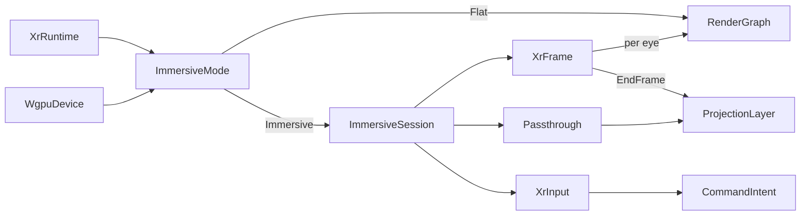

# [APPUI_RENDER_IMMERSIVE]

One immersive owner binds OpenXR stereo design-review plus `XR_FB_passthrough` onto the same `Wgpu` device the viewport leases, with `ImmersiveMode` carrying immersive-versus-flat as a value so a host without an OpenXR loader renders the flat viewport through the same receipt family. `ImmersiveSession` runs the `Instance -> SystemId -> Session -> Swapchain` lifecycle against the shared graphics binding, `XrFrame` runs the predicted-display-time `WaitFrame`/`BeginFrame`/`LocateViews`/`EndFrame` loop submitting one `CompositionLayerProjection` per frame, `XrInput` is the action-set controller model, and `Passthrough` chains the `XR_FB_passthrough` env-blend layer under the rendered scene. The page owns the session lifecycle, the stereo frame loop, the action-set input, and the passthrough composition; it shares the one `Wgpu` device the `Render/pipeline` viewport leases through the branch `ONE_WGPU_DEVICE` owner rather than a second GPU context, and the runtime arm is SPIKE-gated (the `[05]-[PROHIBITIONS]` per-host-GpuBackend clause holds — never a second GPU context). The substrate is `Silk.NET.OpenXR` (`.api/api-silk-openxr.md`), `Silk.NET.OpenXR.Extensions.FB` (`.api/api-silk-openxr-fb.md`), the `GpuBackend.Wgpu` `RenderTargetFactory`, Thinktecture.Runtime.Extensions, and LanguageExt rails. The flat-fold fallback carries the page even without an XR runtime.

## [01]-[INDEX]

- [01]-[XR_SESSION]: Instance/system/session lifecycle against the shared `Wgpu` graphics binding; flat-fold fallback.
- [02]-[STEREO_FRAME]: The predicted-display-time frame loop submitting one stereo projection layer per frame.
- [03]-[XR_INPUT_PASSTHROUGH]: The action-set controller model and the `XR_FB_passthrough` env-blend composition.

## [02]-[XR_SESSION]

- Owner: `ImmersiveMode` `[Union]` the availability algebra — `Immersive(ImmersiveSession)` or `Flat(FlatCause)`; `FlatCause` `[SmartEnum<string>]` the flat-state vocabulary; `ImmersiveSession` the OpenXR session lifecycle; `XrRuntime` the loader-presence probe; `ImmersiveFault` the typed fault family on the `AppUiFaultBand.Immersive` registry row (6120).
- Cases: `ImmersiveFault` = Text | SystemUnavailable | SessionRejected | SwapchainFailed — codes derive through the `Diagnostics/evidence.md#FAULT_TABLES` registry; `FlatCause` = LoaderAbsent | PlatformUnsupported | SystemAbsent — capability states, not faults: an absent loader, a loaderless platform, or a runtime with no attached HMD lands as `Flat` with its cause, and only a present-but-refusing runtime faults.
- Entry: `public static Fin<ImmersiveMode> Create(WgpuDevice device, XrRuntime runtime, Func<WgpuDevice, Fin<ImmersiveSession>> bind)` — gates on the loader-presence probe: an absent loader returns `Fin.Succ(new Flat(FlatCause.LoaderAbsent))` so the desktop floor is a value on the surface, never a terminal fault; a present loader hands the shared `WgpuDevice` to the `bind` native-open continuation that runs `XR.GetApi` -> `CreateInstance` (with `XR_FB_passthrough` listed in the enabled-extension chain when the runtime advertises it) -> `GetSystem` -> `CreateSession` against the device's `Wgpu` graphics binding -> `CreateSwapchain` per eye -> `CreateReferenceSpace`; `bind` is the named boundary capsule carrying the native-handle statements so the one `WgpuDevice` crosses into the OpenXR session and a second GPU device is structurally impossible; `ImmersiveFrame.Frame` dispatches the mode — the `Immersive` arm runs the stereo loop and the `Flat` arm runs the one `Render/pipeline` `RenderGraph.Frame`, so both arms seal the same `FrameReceipt` family.
- Auto: the session creates against the graphics-binding `next` chain sharing the same physical device, queue family, and queue index the wgpu instance negotiated (`KHR_vulkan_enable2`, `GraphicsBindingVulkanKHR`) so the meshlet/path-trace/splat passes render into the OpenXR swapchain images with the one device — a second GPU device for the immersive path is the cross-adapter copy penalty the shared binding avoids; the session probes for `XR_FB_passthrough` through `EnumerateInstanceExtensionProperties` and lists it in `InstanceCreateInfo.EnabledExtensionNames` when advertised; the absence of an installed loader (`libopenxr_loader`) is the `Flat(LoaderAbsent)` capability value that renders through the flat `Render/pipeline` viewport, so the immersive session is an optional surface the desktop path degrades from with the cause preserved and no XR session constructed; all native handles release through their `DestroyXxx` call in a scoped fold.
- Receipt: the session creation emits a session-resolved evidence row — system id, view config, swapchain format, passthrough-available flag; `TelemetryRow` contributes the session-resolved and session-absent instruments inward through the AppHost `TelemetryContributorPort`.
- Packages: Silk.NET.OpenXR, Silk.NET.OpenXR.Extensions.FB, Thinktecture.Runtime.Extensions, LanguageExt.Core, NodaTime
- Growth: a new XR extension is one enabled-extension-name row; one immersive instrument is one `InstrumentRow` on `Immersive.TelemetryRow`; zero new surface.
- Boundary: the session shares the one `Wgpu` device the `Render/pipeline` viewport leases through the branch `ONE_WGPU_DEVICE` `EMBED_CAPSULE` law — a second GPU context for the immersive path is the `[05]-[PROHIBITIONS]` rejected form, so the OpenXR session created with the Vulkan binding shares the wgpu device's physical device, queue family, and queue index; `Silk.NET.OpenXR` carries no bundled native runtime so it P/Invokes the host-installed loader (`.api/api-silk-openxr.md` local admission) and the loader-absent case is `Flat(LoaderAbsent)` — macOS ships no Apple OpenXR loader (visionOS uses ARKit/RealityKit), so the immersive session activates on Windows/Linux desktop hosts where the loader is present and lands `Flat(PlatformUnsupported)` on macOS, the session create being a capability probe not a launch precondition, and a rejected XR session (`SessionRejected`/`SwapchainFailed`) stays a distinguishable fault, never conflated with the normal no-loader state; all native handles (`Instance`, `Session`, `Swapchain`, `Space`) release through `DestroyXxx` in a scoped fold, not `IDisposable`; the runtime arm is SPIKE-gated exactly as the viewport; the `Silk.NET.OpenXR.Extensions.FB` passthrough rides the same `2.23.0` line as the core (Silk.NET publishes its whole core-plus-extension set from one monorepo release) so no version split.

```csharp signature
[Union]
public abstract partial record ImmersiveFault : Expected, IValidationError<ImmersiveFault> {
    private ImmersiveFault(string detail, int code) : base(detail, code, None) { }

    public static ImmersiveFault Create(string message) => new Text(message);

    public sealed record Text : ImmersiveFault { public Text(string detail) : base(detail, AppUiFaultBand.Immersive.Code(0)) { } }
    public sealed record SystemUnavailable : ImmersiveFault { public SystemUnavailable(string detail) : base(detail, AppUiFaultBand.Immersive.Code(1)) { } }
    public sealed record SessionRejected : ImmersiveFault { public SessionRejected(string detail) : base(detail, AppUiFaultBand.Immersive.Code(2)) { } }
    public sealed record SwapchainFailed : ImmersiveFault { public SwapchainFailed(string detail) : base(detail, AppUiFaultBand.Immersive.Code(3)) { } }
}

[SmartEnum<string>]
[KeyMemberEqualityComparer<ComparerAccessors.StringOrdinal, string>]
[KeyMemberComparer<ComparerAccessors.StringOrdinal, string>]
public sealed partial class FlatCause {
    public static readonly FlatCause LoaderAbsent = new("loader-absent");
    public static readonly FlatCause PlatformUnsupported = new("platform-unsupported");
    public static readonly FlatCause SystemAbsent = new("system-absent");
}

public readonly record struct XrRuntime(bool LoaderPresent, bool PassthroughAdvertised, ViewConfigurationType ViewConfig) {
    public static readonly XrRuntime Absent = new(false, false, ViewConfigurationType.PrimaryStereo);
}

// The availability algebra: capability absence is the NORMAL Flat state carrying its cause, and only a
// present-but-refusing runtime faults — both arms render through the one RenderGraph, so the desktop
// floor preserves the FrameReceipt family with zero XR session constructed.
[Union(ConversionFromValue = ConversionOperatorsGeneration.None)]
public abstract partial record ImmersiveMode {
    private ImmersiveMode() { }
    public sealed record Immersive(ImmersiveSession Session) : ImmersiveMode;
    public sealed record Flat(FlatCause Cause) : ImmersiveMode;

    public static Fin<ImmersiveMode> Create(WgpuDevice device, XrRuntime runtime, Func<WgpuDevice, Fin<ImmersiveSession>> bind) =>
        runtime.LoaderPresent
            ? bind(device).Map(static ImmersiveMode (session) => new Immersive(session))
            : Fin.Succ<ImmersiveMode>(new Flat(FlatCause.LoaderAbsent));
}

public sealed record ImmersiveSession(
    Instance Instance,
    SystemId System,
    Session Session,
    Seq<Swapchain> EyeSwapchains,
    Space ReferenceSpace,
    Option<Passthrough> Passthrough,
    IDisposable Teardown) : IDisposable {
    public void Dispose() => Teardown.Dispose();

    public const string ResolvedInstrument = "rasm.appui.immersive.session-resolved";
    public const string AbsentInstrument = "rasm.appui.immersive.session-absent";

    public static TelemetryContributorPort TelemetryRow(string version) =>
        AppUiTelemetry.Contribute(version, ResolvedInstrument, AbsentInstrument);
}
```

## [03]-[STEREO_FRAME]

- Owner: `XrFrame` the predicted-display-time frame loop; `EyeView` the per-eye pose-and-fov; `ProjectionLayer` the stereo composition layer.
- Entry: `public IO<FrameReceipt> Frame(RenderGraph graph, ViewportClock clock, FrameBudget budget, int tierRank)` on `ImmersiveSession` — runs `WaitFrame` (predicted display time) -> `BeginFrame` -> `LocateViews` (per-eye pose/fov) -> render each eye into its swapchain image through the shared `Render/pipeline` `RenderGraph` under the governor tier -> `EndFrame` submitting one `CompositionLayerProjection` plus the optional passthrough layer; `ImmersiveFrame.Frame` on `ImmersiveMode` is the one dispatch over the availability algebra.
- Auto: the frame loop is driven by the runtime-predicted display time from `WaitFrame`'s `FrameState`, never a wall clock, so the render anticipates the display deadline; `LocateViews` resolves the two `View` structs (per-eye `Posef`+`Fovf`) and the render walks the one `Render/pipeline` `RenderGraph` once per eye into the eye's acquired swapchain image, so the meshlet/path-trace passes render stereo with no second scene model; `EndFrame` submits one `CompositionLayerProjection` carrying two `CompositionLayerProjectionView` sub-images (left/right eye) plus the passthrough layer beneath when present; the frame seals the same `Render/pipeline` `FrameReceipt` so the immersive frame rides the one evidence family.
- Receipt: the `Render/pipeline` `FrameReceipt` per submitted frame, carrying the stereo backend and the per-eye pass elapsed.
- Packages: Silk.NET.OpenXR, Thinktecture.Runtime.Extensions, LanguageExt.Core, NodaTime
- Growth: a new view config (quad views) is one `ViewConfigurationType` row; zero new surface.
- Boundary: the frame loop runs the runtime-predicted display time so a wall-clock frame pace ignoring the predicted display time is the rejected form (`.api/api-silk-openxr.md` reject); each eye renders through the one `Render/pipeline` `RenderGraph` so the immersive path re-models no geometry and re-uses the meshlet/path-trace/residency owners; `EndFrame` submits one `CompositionLayerProjection` with two sub-images so a per-eye separate layer is the deleted form; the passthrough layer chains into the same `EndFrame` layer array beneath the projection layer so the rendered BIM scene composites over the camera feed in one frame submit; the frame seals the `Render/pipeline` `FrameReceipt` so the immersive frame mints no second receipt vocabulary; the swapchain images are the shared `Wgpu` device's textures so the eye render and the desktop render share one device lifetime.

```csharp signature
public readonly record struct EyeView(Posef Pose, Fovf Fov, uint SwapchainImageIndex);

public readonly record struct ProjectionLayer(Seq<EyeView> Eyes, Space ReferenceSpace);

public static class XrFrame {
    extension(ImmersiveSession session) {
        public IO<FrameReceipt> Frame(RenderGraph graph, ViewportClock clock, FrameBudget budget, int tierRank) =>
            from predicted in WaitFrame(session)
            from begin in BeginFrame(session)
            from views in LocateViews(session, predicted)
            from rendered in views.TraverseM(eye => RenderEye(session, graph, eye, clock, budget, tierRank)).As()
            from receipt in EndFrame(session, predicted, views)
            select receipt;
    }
}

// The one frame entry over the availability algebra: the Immersive arm runs the stereo loop (RenderEye
// projects each located Posef/Fovf onto the per-eye ViewCamera the graph consumes), the Flat arm runs
// the desktop RenderGraph.Frame — one receipt family, two composition arms.
public static class ImmersiveFrame {
    extension(ImmersiveMode mode) {
        public IO<FrameReceipt> Frame(RenderGraph graph, ViewportClock clock, FrameBudget budget, int tierRank, ViewCamera camera) =>
            mode.Switch(
                immersive: s => s.Session.Frame(graph, clock, budget, tierRank),
                flat: _ => graph.Frame(clock, budget, tierRank, camera));
    }
}
```

## [04]-[XR_INPUT_PASSTHROUGH]

- Owner: `XrInput` the action-set controller model; `Passthrough` the `XR_FB_passthrough` env-blend layer; `PassthroughStyle` the edge-color-and-opacity policy; `XrComfort` the refresh-rate and foveation negotiation the governor tier steps.
- Entry: `public Fin<XrInput> Bind(ImmersiveSession session, Seq<XrAction> actions)` — creates the action set, binds actions to interaction-profile paths, and suggests the bindings; `public Fin<Passthrough> Start(ImmersiveSession session)` — creates the passthrough feature and layer against the session and starts the camera feed.
- Auto: input is the action-set model — an `ActionSet` holds `Action`s bound to interaction-profile paths (`/user/hand/left/input/select/click`, `/user/hand/right/input/aim/pose`), `SyncActions` polls them per frame, and `GetActionStatePose`+`LocateSpace` resolves the controller pose the navigation and measurement tools read, so the controller drives the shell through the OpenXR device abstraction; passthrough creates through `CreatePassthroughFB` (the `IsRunningAtCreationBitFB` flag auto-starting the feed) -> `CreatePassthroughLayerFB` (`ReconstructionFB` for full-screen passthrough) -> the per-frame `CompositionLayerPassthroughFB` chained into the `EndFrame` layer array beneath the projection layer so the rendered BIM scene composites over the camera feed; the `EnvironmentBlendMode` selects opaque VR, additive AR, or `XR_FB_passthrough` mixed-reality compositing, folding to opaque when the runtime lacks the extension; `PassthroughLayerSetStyleFB` carries the edge-color and texture-opacity so an on-site review tints or fades the real-world feed as a per-frame style fold.
- Packages: Silk.NET.OpenXR, Silk.NET.OpenXR.Extensions.FB, Thinktecture.Runtime.Extensions, LanguageExt.Core
- Growth: a new controller action is one `XrAction` bound to its interaction-profile path; a new passthrough style is one `PassthroughStyle` value; a new comfort lever is one `XrComfort` column; zero new surface.
- Boundary: input rides the action-set model so a raw HID controller read bypassing the action-set is the rejected form (`.api/api-silk-openxr.md` reject — OpenXR owns the device abstraction), and the controller pose resolves through `GetActionStatePose`+`LocateSpace`; the action verbs map onto the `CommandIntent` vocabulary so a controller button raises an intent exactly as the input fabric folds (`Shell/input#INPUT_FABRIC`), never a controller-local command; passthrough is created against the one session the core owns (`.api/api-silk-openxr-fb.md` reject — a second OpenXR session or instance for passthrough is rejected), the FB layer chained into the same `EndFrame` layer array; a passthrough toggle rides `PassthroughLayerPauseFB`/`PassthroughLayerResumeFB` on the live layer so the feed flips without feature teardown and a per-toggle feature re-create is the deleted form; the env-blend folds to the opaque flat composite when the runtime lacks `XR_FB_passthrough` so the page ships without a passthrough-capable runtime; the passthrough handles release through `DestroyPassthroughFB`/`DestroyPassthroughLayerFB` in a scoped fold; the style update is a per-frame fold, never a re-created layer; `XrComfort` is the XR arm of the ONE quality authority — `EnumerateDisplayRefreshRatesFB`/`GetDisplayRefreshRateFB`/`RequestDisplayRefreshRateFB` negotiate the display rate and `CreateFoveationProfileFB`/`DestroyFoveationProfileFB` swap the foveation profile, both stepped by the same `Diagnostics/governor.md` `QualityTier` rank that steps the resolve ladder and residency watermark, so a second XR-local quality knob path is the rejected form.

```csharp signature
public readonly record struct XrAction(string Name, string ProfilePath, ActionType Type);

public sealed record XrInput(ActionSet ActionSet, Seq<(XrAction Action, Action Handle)> Bound, Space ActionSpace) {
    public IO<Unit> Sync(ImmersiveSession session) => IO.lift(() => SyncActions(session, this));
}

public readonly record struct PassthroughStyle(float EdgeR, float EdgeG, float EdgeB, float TextureOpacity) {
    public static readonly PassthroughStyle Clear = new(0f, 0f, 0f, 1f);
}

public sealed record Passthrough(PassthroughFB Feature, PassthroughLayerFB Layer, PassthroughStyle Style, IDisposable Teardown) : IDisposable {
    public void Dispose() => Teardown.Dispose();

    public EnvironmentBlendMode BlendMode => EnvironmentBlendMode.AlphaBlend;

    public Passthrough Restyle(PassthroughStyle style) => this with { Style = style };

    // Per-layer toggle without feature teardown: PassthroughLayerPauseFB/ResumeFB flip the camera feed
    // while the feature, layer, and style survive.
    public IO<Unit> Pause() => IO.lift(() => PauseLayer(Layer));

    public IO<Unit> Resume() => IO.lift(() => ResumeLayer(Layer));
}

// XR-native quality levers on the one governor authority: refresh-rate negotiation through the
// FBDisplayRefreshRate triple, foveation through CreateFoveationProfileFB/DestroyFoveationProfileFB —
// stepped by the same hysteresis-banded tier rank that steps the resolve ladder.
public sealed record XrComfort(Seq<float> AdvertisedRates, float ActiveRate, Option<FoveationProfileFB> Foveation) {
    public IO<XrComfort> Step(ImmersiveSession session, int tierRank) =>
        from rate in RequestRate(session, RateFor(tierRank))
        from profile in ApplyFoveation(session, tierRank)
        select this with { ActiveRate = rate, Foveation = profile };

    // High tiers hold the highest advertised rate with no foveation; degraded tiers step the rate down
    // and deepen foveation — comfort follows the governor, never a second XR knob.
    private float RateFor(int tierRank) =>
        AdvertisedRates.IsEmpty ? ActiveRate : tierRank >= 3 ? AdvertisedRates.Max() : AdvertisedRates.Min();
}
```



## [05]-[RESEARCH]

- [XR_SESSION_GRAPHICS]: the `Silk.NET.OpenXR` `CreateSession` graphics-binding `next` chain that shares the `Wgpu` device — the `GraphicsBindingVulkanKHR` (or Metal/D3D12 binding) struct carrying the physical device, queue family, and queue index the wgpu instance negotiated, the `EnumerateSwapchainImages`/`AcquireSwapchainImage`/`WaitSwapchainImage` per-eye image acquisition, and the `LocateViews`/`EndFrame` `CompositionLayerProjectionView` submission (`.api/api-silk-openxr.md`) — resolved at implementation against the `Silk.NET.OpenXR` 2.23 surface and the shared `Wgpu` device the `Render/pipeline` lease and the branch `ONE_WGPU_DEVICE` owner bind; the session lifecycle, the predicted-display-time frame loop, the action-set input, and the flat-fold fallback are settled, the exact graphics-binding `next`-chain spelling and the swapchain image-acquisition members are the unverified surface gated on the live OpenXR loader.
- [FB_PASSTHROUGH]: the `Silk.NET.OpenXR.Extensions.FB` `CreatePassthroughFB`/`CreatePassthroughLayerFB`/`PassthroughStartFB`/`PassthroughLayerSetStyleFB` surface and the `CompositionLayerPassthroughFB` `EndFrame` chaining (`.api/api-silk-openxr-fb.md`) the env-blend composition binds — the `PassthroughCreateInfoFB`/`PassthroughLayerCreateInfoFB` descriptor flags, the `PassthroughStyleFB` edge-color/opacity struct, and the `new FBPassthrough(xr.Context)` extension-load convention — resolved at implementation against the `Silk.NET.OpenXR.Extensions.FB` 2.23 surface; the passthrough lifecycle, the env-blend mode selection, the opaque-fold fallback, and the per-frame style fold are settled, the exact `*FB` descriptor member spellings and the extension-load convention are the unverified surface gated on a `XR_FB_passthrough`-advertising runtime.
