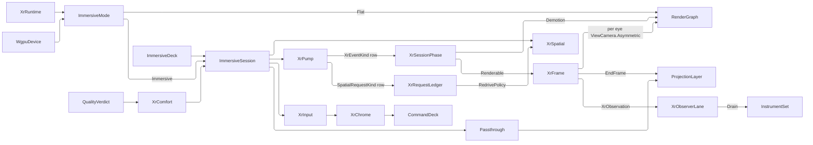

# [APPUI_RENDER_IMMERSIVE]

One immersive owner binds OpenXR stereo design review, `XR_FB_passthrough`, and the Meta spatial-entity world-lock onto the same `Wgpu` device the viewport leases, with `ImmersiveMode` carrying immersive-versus-flat as a value so a host without an OpenXR loader renders the flat viewport through the same receipt family. `ImmersiveSession` is the `UiLease`-derived session owner running the `Instance -> system id -> Session -> Swapchain` lifecycle against the shared graphics binding and carrying the runtime-driven `XrSessionPhase` cell, `XrPump` drains the event queue once per frame ahead of `WaitFrame`, `XrFrame` runs the predicted-display-time frame loop submitting one `CompositionLayerProjection` per frame, `XrInput` is the action-set controller model, `Passthrough` chains the `XR_FB_passthrough` environment-blend layer under the rendered scene, and `XrSpatial` mints the persistent anchors, room model, and cross-user share the on-site review registers against. `XrChrome` mounts world-anchored panels as quad layers rendering the settled control vocabulary and picks them by controller ray into ordinary panel-pixel coordinates, and `ImmersiveDeck` is the one composition root binding every one of those planes to the command deck a reviewer drives. The page owns the session lifecycle and state machine, the stereo frame loop, action-set input, passthrough composition, the FB spatial-entity plane, the immersive review chrome with its comfort policy, and the deck that composes them, while sharing the viewport's one `Wgpu` device. `Silk.NET.OpenXR`, its FB extensions, `GpuBinding.Wgpu`, Thinktecture, and LanguageExt supply the substrate; the flat fold remains a complete successful mode when no XR runtime is available and the terminal fold every lost runtime degrades to.

## [01]-[INDEX]

- [02]-[XR_SESSION]: Instance/system/session lifecycle against the shared `Wgpu` graphics binding; the session-state vocabulary; the accrued handle custody; flat-fold fallback.
- [03]-[STEREO_FRAME]: The event drain and the predicted-display-time frame loop submitting one stereo projection layer per frame.
- [04]-[XR_INPUT_PASSTHROUGH]: The action-set controller model, the `XR_FB_passthrough` env-blend composition, and the governor-driven comfort levers.
- [05]-[SPATIAL_ANCHORS]: The FB spatial-entity async request ledger, its redrive law, persistent anchors, room understanding, and cross-user share.
- [06]-[XR_REVIEW_CHROME]: World-anchored control panels on quad layers, ray-hit input mapping, comfort policy rows, anchored annotations, controller review verbs.
- [07]-[IMMERSIVE_DECK]: The one composition root — post-session mint fold, the per-frame arrow, verb routing, and the observation drain that writes the instruments.

## [02]-[XR_SESSION]

- Owner: `ImmersiveMode` `[Union]` the availability algebra — `Immersive(ImmersiveSession)` or `Flat(FlatCause)`; `FlatCause` `[SmartEnum<string>]` the flat-state vocabulary; `XrSessionPhase` `[SmartEnum<int>]` the runtime-driven session-state row keyed on the host `SessionState` ordinal; `ImmersiveSession` the `UiLease`-derived OpenXR session owner carrying the loaded tables, the negotiated `XrComfortPolicy` whose stance row its reference space was created from, and its runtime-state cells — phase, request ledger, bound input, negotiated comfort, passthrough, motion, mounted panel roster, predicted display time; `XrExtension` `[SmartEnum<string>]` the advertised-extension vocabulary with `XrExtensions` the one loaded-function-table carrier; `XrHandle` `[Union]` the handle-to-destroy correspondence; `XrRuntime` the impossible-state-free availability union; `XrLane` the gauge roster the frame's measured crossings are judged against; `XrObserverLane` the bounded observation channel; `[FaultCase]`/`XrSurface`/`ImmersiveFault` the generated fault estate.
- Cases: `ImmersiveFault` = SystemUnavailable | SessionRejected | SwapchainFailed | NativeRefused; `NativeRefused` carries its `XrSurface` evidence and derives recovery from that row; `FlatCause` = LoaderAbsent | PlatformUnsupported | SystemAbsent | RuntimeLost | SessionExited — capability states, not faults.
- Entry: `public static Fin<ImmersiveMode> Create(WgpuDevice device, XrRuntime runtime, Func<WgpuDevice, XrRuntime.Ready, Fin<ImmersiveSession>> bind)` dispatches the complete `XrRuntime.Ready(Advertised, ViewConfig, BlendModes)` payload to the native-open continuation — `Ready.Blend` selects the strongest advertised `EnvironmentBlendMode`, so opaque VR, additive AR, and admitted passthrough are runtime-capability outcomes, never a constant — and preserves `XrRuntime.Unavailable(FlatCause)` as the successful desktop floor. `Ready` alone can carry the advertised capability set and view configuration, so an absent loader or system can never coexist with usable runtime data. The continuation creates the OpenXR instance, system, session, eye swapchains, and reference space against the shared `WgpuDevice`; `ImmersiveFrame.Frame` then returns the same `FrameReceipt` family for stereo and flat modes.
- Auto: the session creates against the graphics-binding `next` chain sharing the same physical device, queue family, and queue index the wgpu instance negotiated (`KHR_vulkan_enable2`, `GraphicsBindingVulkanKHR`) so the meshlet/path-trace/splat passes render into the OpenXR swapchain images with the one device — a second GPU device for the immersive path is the cross-adapter copy penalty the shared binding avoids; the session probes each `XrExtension` row through `EnumerateInstanceExtensionProperties` and lists the advertised set's own `Name` column in `InstanceCreateInfo.EnabledExtensionNames`, so the enabled-name roster and the capability set are one declaration; the absence of an installed loader (`libopenxr_loader`) is the `Flat(LoaderAbsent)` capability value that renders through the flat `Render/pipeline` viewport, so the immersive session is an optional surface the desktop path degrades from with the cause preserved and no XR session constructed; the runtime drives the session through `XrSessionPhase` and the app answers on the same row — `Ready` runs `BeginSession` against the primary view configuration, `Stopping` runs `EndSession`, and `LossPending`/`Exiting` carry the `FlatCause` that retires the session, so a phase is one row rather than a transition ladder; every acquired native handle accrues its own `XrHandle.Destroy` arm on the session's `UiLease` base in acquisition order — the base rather than a construction-time column, because passthrough features, action sets, foveation profiles, and anchor spaces are all acquired AFTER the session exists — and release is the base's guarded one-shot reverse drain, which runs every arm even when one refuses and ledgers each refusal as its own `NativeRefused` row on `ReleaseFaults`; the tables that fold reaches are a SESSION COLUMN rather than a per-call parameter, because the enabled extension set is fixed at instance creation and a caller handing a live session a second table set is exactly the defect the column forecloses.
- Receipt: the session creation emits a session-resolved evidence row — system id, view config, swapchain format, advertised capability set; `TelemetryRow` contributes the session-resolved, session-absent, session-demoted, event-drained, and observation-shed rows inward through the AppHost `TelemetryContributorPort`, and `ImmersiveSession.Observed` is their ONE writer — the availability arm at `ImmersiveMode.Create` and the drain arm inside `ImmersiveDeck.Drain`, so every contributed row has a recording site and absence, demotion, drain, and shed each key the dimension its own declaration names.
- Packages: Silk.NET.OpenXR, Silk.NET.OpenXR.Extensions.FB, Thinktecture.Runtime.Extensions, LanguageExt.Core, NodaTime, BCL inbox (`System.Threading.Channels`)
- Growth: a new XR extension is one `XrExtension` row carrying its native name and its table reader, which the enabled-name list, the capability set, and the loaded carrier all derive from; a new session state is one `XrSessionPhase` row carrying its own renderability, transition, and demotion; a new native surface is one `XrSurface` row carrying its band offset and its retriability posture; one immersive instrument is one `InstrumentSpec` row on `ImmersiveSession.TelemetryRow`; zero new surface.
- Boundary: the session shares the one `Wgpu` device the `Render/pipeline` viewport leases through the branch `ONE_WGPU_DEVICE` `EMBED_CAPSULE` law — a second GPU context for the immersive path is the `[04]-[BOUNDARIES]` rejected form, so the OpenXR session created with the Vulkan binding shares the wgpu device's physical device, queue family, and queue index; `Silk.NET.OpenXR` carries no bundled native runtime so it P/Invokes the host-installed loader (`.api/api-silk-openxr.md` local admission) and the loader-absent case is `Flat(LoaderAbsent)` — macOS ships no Apple OpenXR loader (visionOS uses ARKit/RealityKit), so the immersive session activates on Windows/Linux desktop hosts where the loader is present and lands `Flat(PlatformUnsupported)` on macOS, the session create being a capability probe not a launch precondition, and a rejected XR session (`SessionRejected`/`SwapchainFailed`) stays a distinguishable fault, never conflated with the normal no-loader state; the system id is the `ulong` `GetSystem` writes, never a wrapper type the binding does not declare; all native handles (`Instance`, `Session`, `Swapchain`, `Space`, `ActionSet`, `Action`, and the FB passthrough/foveation set) release through the `UiLease` reverse drain, and the handle-to-destroy correspondence stays RECOVERABLE FROM THE CASE — `XrHandle.Destroy` is one total `Switch` naming each matching `DestroyXxx`/`DestroyXxxFB` entrypoint with its `Result` checked, so an opaque teardown erasing that correspondence is still the deleted form while the one-shot guard, the fault ledger, and the reverse ordering are the base's rather than re-spelled here; `XrExtensions` is the ONE carrier and it rides the session, so a per-extension optional parameter beside the core root is the deleted arity and an unloaded table refuses its own handles with `Result.ErrorHandleInvalid` rather than widening a signature; `ImmersiveSession` is a sealed CLASS because it holds eight live cells and a `with` copy would share every one by reference while duplicating the identity the ledger keys on (folder `RULINGS.md` `[02]`); the runtime arm is SPIKE-gated exactly as the viewport; the `Silk.NET.OpenXR.Extensions.FB` roots ride the same `2.23.0` line as the core (Silk.NET publishes its whole core-plus-extension set from one monorepo release) so no version split.

```csharp signature
// --- [TYPES] ----------------------------------------------------------------------------
[SmartEnum<string>]
[KeyMemberEqualityComparer<ComparerAccessors.StringOrdinal, string>]
[KeyMemberComparer<ComparerAccessors.StringOrdinal, string>]
public sealed partial class FlatCause {
    public static readonly FlatCause LoaderAbsent = new("loader-absent");
    public static readonly FlatCause PlatformUnsupported = new("platform-unsupported");
    public static readonly FlatCause SystemAbsent = new("system-absent");
    public static readonly FlatCause RuntimeLost = new("runtime-lost");
    public static readonly FlatCause SessionExited = new("session-exited");
}

// The runtime drives the session and the app answers; both answers ride ONE row keyed on the host enum's own
// ordinal. Renderable is the ONLY gate the frame loop reads — OpenXR refuses BeginFrame until the app has
// answered Ready with BeginSession, so a frame loop with no drain leaves the session constructible and
// permanently unrenderable. Demotion defers behind its delegate: an eager cross-vocabulary field reference
// captures null before the FlatCause materialization protects it.
[SmartEnum<int>]
[ValidationError]
public sealed partial class XrSessionPhase {
    public static readonly XrSessionPhase Unknown      = new((int)SessionState.Unknown,      renderable: false, Absent, Inert);
    public static readonly XrSessionPhase Idle         = new((int)SessionState.Idle,         renderable: false, Absent, Inert);
    public static readonly XrSessionPhase Ready        = new((int)SessionState.Ready,        renderable: false, Absent, Begin);
    public static readonly XrSessionPhase Synchronized = new((int)SessionState.Synchronized, renderable: true,  Absent, Inert);
    public static readonly XrSessionPhase Visible      = new((int)SessionState.Visible,      renderable: true,  Absent, Inert);
    public static readonly XrSessionPhase Focused      = new((int)SessionState.Focused,      renderable: true,  Absent, Inert);
    public static readonly XrSessionPhase Stopping     = new((int)SessionState.Stopping,     renderable: false, Absent, End);
    public static readonly XrSessionPhase LossPending  = new((int)SessionState.LossPending,  renderable: false, static () => Some(FlatCause.RuntimeLost),   Inert);
    public static readonly XrSessionPhase Exiting      = new((int)SessionState.Exiting,      renderable: false, static () => Some(FlatCause.SessionExited), Inert);

    public bool Renderable { get; }

    [UseDelegateFromConstructor]
    public partial Option<FlatCause> Demotion();

    [UseDelegateFromConstructor]
    public partial Result Arrive(XR core, Session session, ViewConfigurationType config);

    public static XrSessionPhase Of(SessionState state) => TryGet((int)state, out XrSessionPhase? row) ? row : Unknown;

    private static readonly Func<Option<FlatCause>> Absent = static () => None;

    private static Result Inert(XR core, Session session, ViewConfigurationType config) => Result.Success;

    private static unsafe Result Begin(XR core, Session session, ViewConfigurationType config) {
        SessionBeginInfo info = new(primaryViewConfigurationType: config);
        return core.BeginSession(session, &info);
    }

    private static Result End(XR core, Session session, ViewConfigurationType config) => core.EndSession(session);
}

// The advertised-extension vocabulary: each row carries the NATIVE NAME the instance enables and the reader
// that answers whether the carrier loaded that root. Presence, the enabled-name list, and the loaded table are
// therefore ONE declaration with one authority — the carrier's own Option columns — so a set stored beside ten
// options could never disagree with them, and admitting a further vendor extension is one row plus one column.
// Rank IS declaration order (kernel CapabilityRank law) — the attribute pins the roster against a reorder pass.
[NoReorder]
[SmartEnum<string>]
[KeyMemberEqualityComparer<ComparerAccessors.StringOrdinal, string>]
public sealed partial class XrExtension : ICapability<XrExtension> {
    public static readonly XrExtension Passthrough     = new("passthrough",      "XR_FB_passthrough",            static t => t.Passthrough.IsSome);
    public static readonly XrExtension Foveation       = new("foveation",        "XR_FB_foveation",              static t => t.Foveation.IsSome);
    public static readonly XrExtension SwapchainState  = new("swapchain-state",  "XR_FB_swapchain_update_state", static t => t.SwapchainState.IsSome);
    public static readonly XrExtension RefreshRate     = new("refresh-rate",     "XR_FB_display_refresh_rate",   static t => t.RefreshRate.IsSome);
    public static readonly XrExtension Spatial         = new("spatial",          "XR_FB_spatial_entity",         static t => t.Spatial.IsSome);
    public static readonly XrExtension SpatialQuery    = new("spatial-query",    "XR_FB_spatial_entity_query",   static t => t.SpatialQuery.IsSome);
    public static readonly XrExtension SpatialStorage  = new("spatial-storage",  "XR_FB_spatial_entity_storage", static t => t.SpatialStorage.IsSome);
    public static readonly XrExtension SpatialSharing  = new("spatial-sharing",  "XR_FB_spatial_entity_sharing", static t => t.SpatialSharing.IsSome);
    public static readonly XrExtension Scene           = new("scene",            "XR_FB_scene",                  static t => t.Scene.IsSome);
    public static readonly XrExtension SceneCapture    = new("scene-capture",    "XR_FB_scene_capture",          static t => t.SceneCapture.IsSome);

    public string Name { get; }

    [UseDelegateFromConstructor]
    public partial bool Loaded(XrExtensions tables);
}

// The gauge vocabulary the frame's measured crossings are judged against. A bound is what the lane is JUDGED
// by, never a timeout the app enforces — the compositor owns every native deadline here — so a breached span
// is evidence a reviewer's frame overran, not a refusal.
[SmartEnum<string>]
[KeyMemberEqualityComparer<ComparerAccessors.StringOrdinal, string>]
public sealed partial class XrLane : IGaugeLane<XrLane> {
    public static readonly XrLane Drain = new("drain", TimeSpan.FromMilliseconds(1d));
    public static readonly XrLane Submit = new("submit", TimeSpan.FromMilliseconds(11d));
    public static readonly XrLane Panel = new("panel", TimeSpan.FromMilliseconds(2d));

    public TimeSpan Bound { get; }
}

// --- [ERRORS] ---------------------------------------------------------------------------
// The native surface is typed payload evidence. It does not allocate identity or mirror the fault band.
[SmartEnum<string>]
[KeyMemberEqualityComparer<ComparerAccessors.StringOrdinal, string>]
public sealed partial class XrSurface {
    public static readonly XrSurface Frame = new("frame",
        static outcome => Lost(outcome) ? Retriability.Terminal : Retriability.Transient);
    public static readonly XrSurface State = new("state", Retires);
    public static readonly XrSurface Input = new("input", Retires);
    public static readonly XrSurface Passthrough = new("passthrough", Retires);
    public static readonly XrSurface Spatial = new("spatial",
        static outcome => outcome == Result.ErrorExtensionNotPresent || Lost(outcome) ? Retriability.Terminal : Retriability.Transient);
    public static readonly XrSurface Comfort = new("comfort",
        static outcome => Lost(outcome) ? Retriability.Terminal : Retriability.Transient);

    [UseDelegateFromConstructor]
    public partial Retriability Posture(Result outcome);

    // The two results the runtime uses to say the handle graph is gone; every other refusal leaves something
    // the next frame or the next redrive can still reach.
    private static bool Lost(Result outcome) => outcome is Result.ErrorInstanceLost or Result.ErrorSessionLost;

    private static readonly Func<Result, Retriability> Retires = static _ => Retriability.Terminal;
}

[Union(ConversionFromValue = ConversionOperatorsGeneration.None)]
public abstract partial record ImmersiveFault : Fault {
    private static readonly FaultBand FamilyBand = FaultBand.Immersive;
    private ImmersiveFault(string detail) => Detail = detail;
    public string Detail { get; }
    public override string Message => Detail;

    [FaultCase(0)] public sealed partial record SystemUnavailable(string Detail) : ImmersiveFault(Detail);
    [FaultCase(1)] public sealed partial record SessionRejected(string Detail) : ImmersiveFault(Detail);
    [FaultCase(2)] public sealed partial record SwapchainFailed(string Detail) : ImmersiveFault(Detail);

    // ONE case over every native-entrypoint refusal: the entrypoint name plus its Result is the whole evidence,
    // and the surface row is what keeps a recoverable frame skip, a retired lever, and a lost session three
    // readings rather than one stringified stage. Six sibling cases restating one field set is the collapsed
    // form; the discriminant is the row the site names.
    [FaultCase(3)]
    public sealed partial record NativeRefused(XrSurface Surface, string Entrypoint, Result Outcome)
        : ImmersiveFault($"xr/{Surface.Key} {Entrypoint}: {Outcome}") {
        public override Retriability Retriability => Surface.Posture(Outcome);
    }
}

// The one OpenXR status bridge. Every unsafe capsule names its surface and entrypoint here, so native status never
// becomes an exception and five per-capsule guard copies cannot drift in classification.
public static class XrStatus {
    public static Fin<Unit> Admit(Result outcome, XrSurface surface, string entrypoint) =>
        outcome == Result.Success
            ? Fin.Succ(unit)
            : Fin.Fail<Unit>(new ImmersiveFault.NativeRefused(surface, entrypoint, outcome));
}

// --- [MODELS] ---------------------------------------------------------------------------
// Loaded function tables travel as ONE carrier, never as an optional parameter per extension. `Advertised` is
// DERIVED from these columns rather than stored beside them, so the capability set and the roots it names can
// never disagree and a further FB or EXT table is one column plus its `XrExtension` row.
public sealed record XrExtensions(
    XR Core,
    Option<FBPassthrough> Passthrough,
    Option<FBFoveation> Foveation,
    Option<FBSwapchainUpdateState> SwapchainState,
    Option<FBDisplayRefreshRate> RefreshRate,
    Option<FBSpatialEntity> Spatial,
    Option<FBSpatialEntityQuery> SpatialQuery,
    Option<FBSpatialEntityStorage> SpatialStorage,
    Option<FBSpatialEntitySharing> SpatialSharing,
    Option<FBScene> Scene,
    Option<FBSceneCapture> SceneCapture) {
    public CapabilitySet<XrExtension> Advertised =>
        CapabilitySet<XrExtension>.Of(XrExtension.Items.Where(row => row.Loaded(this)).ToArray());
}

[Union(ConversionFromValue = ConversionOperatorsGeneration.None)]
public abstract partial record XrRuntime {
    private XrRuntime() { }

    // Composition selects the strongest ADVERTISED blend: FB passthrough rides AlphaBlend, an AR runtime's
    // AdditiveBlend composits over the see-through display, and Opaque is the VR floor — an unadvertised mode
    // is unrepresentable as the selected composite.
    public sealed record Ready(
        CapabilitySet<XrExtension> Advertised,
        ViewConfigurationType ViewConfig,
        Seq<EnvironmentBlendMode> BlendModes) : XrRuntime {
        public EnvironmentBlendMode Blend =>
            Advertised.Admits(XrExtension.Passthrough) && BlendModes.Contains(EnvironmentBlendMode.AlphaBlend) ? EnvironmentBlendMode.AlphaBlend
            : BlendModes.Contains(EnvironmentBlendMode.AdditiveBlend) ? EnvironmentBlendMode.AdditiveBlend
            : EnvironmentBlendMode.Opaque;

        // The enabled-extension-name list IS the advertised set read through each row's own native name, so the
        // instance create and the capability probe cannot name two different extension sets.
        public Seq<string> EnabledNames => toSeq(Advertised.Held).Map(static row => row.Name).Strict();
    }

    public sealed record Unavailable(FlatCause Cause) : XrRuntime;
}

// Native lifetime is the HANDLE-TO-DESTROY correspondence: each acquired handle records as its typed case and
// `Destroy` is the ONE fan over the family, so a tenth handle edits the case list and this arm alone — the
// separate key projection its only reader (a joined release message) took with it. The one-shot guard, the
// fault ledger, and the reverse ordering are the session's `UiLease` base, never re-spelled here.
[Union(ConversionFromValue = ConversionOperatorsGeneration.None)]
public abstract partial record XrHandle {
    private XrHandle() { }
    public sealed record InstanceHandle(Instance Handle) : XrHandle;
    public sealed record SessionHandle(Session Handle) : XrHandle;
    public sealed record SwapchainHandle(Swapchain Handle) : XrHandle;
    public sealed record SpaceHandle(Space Handle) : XrHandle;
    public sealed record ActionSetHandle(ActionSet Handle) : XrHandle;
    public sealed record ActionHandle(Action Handle) : XrHandle;
    public sealed record PassthroughHandle(PassthroughFB Handle) : XrHandle;
    public sealed record PassthroughLayerHandle(PassthroughLayerFB Handle) : XrHandle;
    public sealed record FoveationHandle(FoveationProfileFB Handle) : XrHandle;

    public Fin<Unit> Destroy(XrExtensions tables) => Switch(
        state: tables,
        instanceHandle:         static (t, h) => Settled(nameof(XR.DestroyInstance), t.Core.DestroyInstance(h.Handle)),
        sessionHandle:          static (t, h) => Settled(nameof(XR.DestroySession), t.Core.DestroySession(h.Handle)),
        swapchainHandle:        static (t, h) => Settled(nameof(XR.DestroySwapchain), t.Core.DestroySwapchain(h.Handle)),
        spaceHandle:            static (t, h) => Settled(nameof(XR.DestroySpace), t.Core.DestroySpace(h.Handle)),
        actionSetHandle:        static (t, h) => Settled(nameof(XR.DestroyActionSet), t.Core.DestroyActionSet(h.Handle)),
        actionHandle:           static (t, h) => Settled(nameof(XR.DestroyAction), t.Core.DestroyAction(h.Handle)),
        passthroughHandle:      static (t, h) => Settled(nameof(FBPassthrough.DestroyPassthroughFB),
            t.Passthrough.Map(api => api.DestroyPassthroughFB(h.Handle)).IfNone(Result.ErrorHandleInvalid)),
        passthroughLayerHandle: static (t, h) => Settled(nameof(FBPassthrough.DestroyPassthroughLayerFB),
            t.Passthrough.Map(api => api.DestroyPassthroughLayerFB(h.Handle)).IfNone(Result.ErrorHandleInvalid)),
        foveationHandle:        static (t, h) => Settled(nameof(FBFoveation.DestroyFoveationProfileFB),
            t.Foveation.Map(api => api.DestroyFoveationProfileFB(h.Handle)).IfNone(Result.ErrorHandleInvalid)));

    private static Fin<Unit> Settled(string entrypoint, Result outcome) =>
        XrStatus.Admit(outcome, XrSurface.State, entrypoint);
}

// The availability algebra: capability absence is the NORMAL Flat state carrying its cause, and only a
// present-but-refusing runtime faults — both arms render through the one RenderGraph, so the desktop floor
// preserves the FrameReceipt family with zero XR session constructed.
[Union(ConversionFromValue = ConversionOperatorsGeneration.None)]
public abstract partial record ImmersiveMode {
    private ImmersiveMode() { }
    public sealed record Immersive(ImmersiveSession Session) : ImmersiveMode;
    public sealed record Flat(FlatCause Cause) : ImmersiveMode;

    public static Fin<ImmersiveMode> Create(
        WgpuDevice device,
        XrRuntime runtime,
        Func<WgpuDevice, XrRuntime.Ready, Fin<ImmersiveSession>> bind) =>
        runtime.Switch(
            state: (Device: device, Bind: bind),
            ready: static (state, ready) => state.Bind(state.Device, ready).Map(static ImmersiveMode (session) => new Immersive(session)),
            unavailable: static (_, absent) => Fin.Succ<ImmersiveMode>(new Flat(absent.Cause)));
}

// What one frame handed the observer: the queue the runtime spoke, the answer the frame gave it, and the span
// the submit took. The three belong to ONE frame and none is recoverable from the others.
public readonly record struct XrObservation(XrFrameOutcome Outcome, Seq<XrEvent> Drained, GaugedSpan<XrLane> Span);

// --- [SERVICES] -------------------------------------------------------------------------
// The observation seam is a BOUNDED DROP-OLDEST CHANNEL, not a delegate the frame awaits: a telemetry sink
// invoked inside the frame comprehension runs on the compositor thread, so one slow write stalls a submit and
// the runtime reprojects a frame the app was still measuring. A superseded observation is exactly the stale
// item the bound sheds — the newest frame is the one a board wants — and the shed count is a measured cell.
// The DRAIN of the event queue stays synchronous by the OpenXR contract; only this fan-out leaves the thread.
public sealed class XrObserverLane {
    private readonly Channel<XrObservation> queue;
    private readonly Atom<long> shed;

    private XrObserverLane(Channel<XrObservation> queue, Atom<long> shed) => (this.queue, this.shed) = (queue, shed);

    public static Fin<XrObserverLane> Of(int capacity, Op key) {
        if (capacity <= 0) { return Fin.Fail<XrObserverLane>(key.InvalidInput()); }
        Atom<long> shed = Atom(0L);
        Channel<XrObservation> queue = Channel.CreateBounded<XrObservation>(
            new BoundedChannelOptions(capacity) { FullMode = BoundedChannelFullMode.DropOldest, SingleReader = true },
            _ => ignore(shed.Swap(static held => held + 1L)));
        return Fin.Succ(new XrObserverLane(queue, shed));
    }

    // Publishing never blocks the frame: a full lane drops oldest by construction, and a refused write (a lane
    // closed at teardown) counts as shed rather than throwing into the frame fold.
    public Unit Publish(XrObservation observation) =>
        queue.Writer.TryWrite(observation) ? unit : ignore(shed.Swap(static held => held + 1L));

    public IAsyncEnumerable<XrObservation> Read(CancellationToken token) => queue.Reader.ReadAllAsync(token);

    // A COUNT reads what happened since the previous seal, so the cell DRAINS at its own write; the taken value
    // is captured inside the swap because a post-swap read answers only the zero it installed.
    public long Shed() {
        long taken = 0L;
        ignore(shed.Swap(held => { taken = held; return 0L; }));
        return taken;
    }

    public Unit Close() => ignore(queue.Writer.TryComplete());
}

// The session owner: a sealed CLASS deriving the kernel mount custody, because it holds eight live cells and a
// record copy would share every one by reference while duplicating the identity the accrued release arms key
// on. The eye render, the panel raster, and the observation lane are BOUND COLUMNS: composition binds the one
// `Render/pipeline` RenderGraph whose lease resolves to the acquired XR swapchain image for that eye, the one
// `ControlFactory`/`PaintCatalog` behind the panel raster, and the one bounded lane the drain consumes, so this
// owner never re-decides the lease, never re-models the scene, and never names a backend target factory.
public sealed class ImmersiveSession : UiLease {
    public ImmersiveSession(
        Instance instance,
        ulong system,
        Session session,
        XrExtensions tables,
        ViewConfigurationType viewConfig,
        EnvironmentBlendMode blend,
        Seq<Swapchain> eyeSwapchains,
        Extent2Di eyeExtent,
        long eyeFormat,
        Space referenceSpace,
        XrComfortPolicy comfortPolicy,
        MonotonicTimeline line,
        IClock clock,
        XrObserverLane observer,
        Func<EyePass, Fin<FrameReceipt>> renderEye,
        Func<ControlIntent, SKCanvas, SKImageInfo, Fin<Unit>> panelRender,
        Op key) : base(key) =>
        (Instance, System, Session, Tables, ViewConfig, Blend, EyeSwapchains, EyeExtent, EyeFormat, ReferenceSpace,
         ComfortPolicy, Line, Clock, Observer, RenderEye, PanelRender) =
        (instance, system, session, tables, viewConfig, blend, eyeSwapchains, eyeExtent, eyeFormat, referenceSpace,
         comfortPolicy, line, clock, observer, renderEye, panelRender);

    public Instance Instance { get; }
    public ulong System { get; }
    public Session Session { get; }

    // The tables are the INSTANCE's own and fixed at its creation, so they are a column rather than the
    // parameter fifteen members used to thread — a caller handing a live session a second table set names an
    // extension roster the instance never enabled.
    public XrExtensions Tables { get; }
    public ViewConfigurationType ViewConfig { get; }
    public EnvironmentBlendMode Blend { get; }
    public Seq<Swapchain> EyeSwapchains { get; }
    public Extent2Di EyeExtent { get; }

    // The eye swapchains' negotiated format is the format a panel on the same device must take, so it is a
    // session column rather than a mount parameter a caller could disagree with.
    public long EyeFormat { get; }
    public Space ReferenceSpace { get; }

    // The comfort ROWS a user set and the session negotiated once. The stance's reference-space row is what the
    // session was created against, so the policy and the space cannot disagree.
    public XrComfortPolicy ComfortPolicy { get; }
    public MonotonicTimeline Line { get; }
    public IClock Clock { get; }
    public XrObserverLane Observer { get; }
    public Func<EyePass, Fin<FrameReceipt>> RenderEye { get; }

    // ONE panel column: composition binds the control factory and the paint catalog behind it, and `XrChrome`
    // owns the bracket, the gauge, and the pass row — a second `XrPanel -> pass row` delegate beside it was the
    // same binding stated twice.
    public Func<ControlIntent, SKCanvas, SKImageInfo, Fin<Unit>> PanelRender { get; }

    // Every cell below carries a fact that first exists AFTER this owner does: the phase the runtime drives, the
    // FB requests awaiting completion, the action set bound against the live session, the comfort value each
    // frame advances, the passthrough layer started after the session, the locomotion state the movement fold
    // writes and the eye render reads, the panel roster mount and unmount edit, and the display time WaitFrame
    // predicts. Absence IS the second state on each optional one — a runtime with no attached action set and one
    // with neither the refresh-rate nor the foveation root are both complete sessions.
    public Atom<XrSessionPhase> Phase { get; } = Atom(XrSessionPhase.Unknown);
    public Atom<XrRequestLedger> Requests { get; } = Atom(XrRequestLedger.Empty);
    public Atom<Option<XrInput>> Input { get; } = Atom(Option<XrInput>.None);
    public Atom<Option<XrComfort>> Comfort { get; } = Atom(Option<XrComfort>.None);
    public Atom<Option<Passthrough>> Passthrough { get; } = Atom(Option<Passthrough>.None);
    public Atom<MotionState> Motion { get; } = Atom(MotionState.Stationary);
    public Atom<Seq<XrPanel>> Panels { get; } = Atom(Seq<XrPanel>());

    // A location resolved against a fabricated instant is a pose at a time the runtime never predicted, so the
    // reads that consume this answer absence rather than a forged ray before the first frame paces.
    public Atom<Option<long>> Display { get; } = Atom(Option<long>.None);

    // Acquisition and its release arm land in ONE step, so a handle that reached the runtime and one the drain
    // will destroy are the same set by construction.
    public Fin<Unit> Acquire(XrHandle handle, Op key) => Accrue(() => handle.Destroy(Tables), key);

    public static readonly InstrumentSpec Resolved = InstrumentSpec.Create(
        "rasm.appui.immersive.session.resolved", InstrumentKind.Count, MeasureForm.Whole, "{session}",
        "XR sessions resolved against an advertised runtime", Seq<string>(), None, None, None);

    // Absence and demotion both land a Flat mode and the mode ALONE cannot tell them apart — one is a runtime
    // that never opened, the other a session that opened and was lost — so they are two rows keyed on the same
    // cause dimension. Resolution carries none: the XR system id is a per-boot handle, and fanning a metric
    // across it mints one series per launch.
    public static readonly InstrumentSpec Absent = InstrumentSpec.Create(
        "rasm.appui.immersive.session.absent", InstrumentKind.Count, MeasureForm.Whole, "{session}",
        "XR session absences by cause", Seq(AppUiTelemetry.CauseSlot), None, None, None);

    public static readonly InstrumentSpec Demoted = InstrumentSpec.Create(
        "rasm.appui.immersive.session.demoted", InstrumentKind.Count, MeasureForm.Whole, "{session}",
        "XR sessions demoted to flat by cause", Seq(AppUiTelemetry.CauseSlot), None, None, None);

    public static readonly InstrumentSpec Drained = InstrumentSpec.Create(
        "rasm.appui.immersive.event.drained", InstrumentKind.Count, MeasureForm.Whole, "{event}",
        "XR runtime events drained by kind", Seq(AppUiTelemetry.SourceSlot), None, None, None);

    public static readonly InstrumentSpec Shed = InstrumentSpec.Create(
        "rasm.appui.immersive.observation.shed", InstrumentKind.Count, MeasureForm.Whole, "{observation}",
        "frame observations the bounded lane dropped before the drain read them", Seq<string>(), None, None, None);

    public static readonly InstrumentSpec Overrun = InstrumentSpec.Create(
        "rasm.appui.immersive.frame.overrun", InstrumentKind.Distribution, MeasureForm.Real, "s",
        "submit time past the frame lane's declared bound", Seq(AppUiTelemetry.PassSlot), None, None, None);

    public static TelemetryContributorPort TelemetryRow(string version) =>
        AppUiTelemetry.Contribute(version, Resolved, Absent, Demoted, Drained, Shed, Overrun);

    // The availability arm, bound at the ONE mint of the availability algebra.
    public static Fin<Unit> Observed(InstrumentSet set, ImmersiveMode mode) =>
        mode.Switch(
            state: set,
            immersive: static (s, _) => s.Write(Resolved, 1d),
            flat: static (s, absent) => s.Write(Absent, 1d,
                InstrumentSet.Tags((AppUiTelemetry.CauseSlot, absent.Cause.Key))));

    // The drain arm, the ONE point holding a frame's queue beside the outcome that queue produced. The fan runs
    // over the event KIND — the union's own roster projection — so a new case is one arm on that roster and no
    // write site spells a case-to-literal ladder. Submitted and Idled publish no demotion, because a frame that
    // drew or paced is not a demotion and a zero write is a measurement the frame never took; the overrun
    // publishes only where the lane's own bound was breached.
    public static Fin<Unit> Observed(InstrumentSet set, XrObservation observation, long shed) =>
        toSeq(observation.Drained.GroupBy(static drop => drop.Kind))
            .TraverseM(group => set.Write(Drained, group.LongCount(),
                InstrumentSet.Tags((AppUiTelemetry.SourceSlot, group.Key)))).As()
            .Bind(_ => observation.Outcome is XrFrameOutcome.Demoted demoted
                ? set.Write(Demoted, 1d, InstrumentSet.Tags((AppUiTelemetry.CauseSlot, demoted.Cause.Key)))
                : Fin.Succ(unit))
            .Bind(_ => observation.Span.Breached
                ? set.Write(Overrun, observation.Span.Overrun.TotalSeconds,
                    InstrumentSet.Tags((AppUiTelemetry.PassSlot, observation.Span.Lane.Key)))
                : Fin.Succ(unit))
            .Bind(_ => shed > 0L ? set.Write(Shed, shed) : Fin.Succ(unit));
}
```

## [03]-[STEREO_FRAME]

- Owner: `XrPump` the per-frame event drain with `XrEventKind` its core-event roster; `XrEvent` `[Union]` the drained-event vocabulary; `XrFrame` the predicted-display-time frame loop and its one layer-array build; `XrFrameOutcome` `[Union]` the submit-idle-demote answer; `EyeView`/`EyePass` the per-eye pose, graph camera, acquired swapchain image, and the frame facts the eye render consumes; `ImmersiveFrame` the one entry over the availability algebra.
- Entry: `public IO<XrFrameOutcome> Frame(ViewportClock clock, FrameBudget budget, QualityVerdict quality, ViewCamera camera)` on `ImmersiveSession` — the WHOLE per-frame obligation in one arrow: drain the event queue applying each arrival's transition, redrive or abandon the stale requests off the same ledger, sync the attached action sets, step comfort against the frame's own verdict and swap the advanced value back into its cell, run `WaitFrame` -> `BeginFrame` -> `LocateView` -> per-eye acquire/wait/render/release -> `EndFrame` when the phase is renderable under the submit lane's gauge, then PUBLISH the outcome and the frame's whole queue to the bounded observation lane; `public IO<(ImmersiveMode Mode, FrameReceipt Receipt)> Frame(RenderGraph graph, ViewportClock clock, FrameBudget budget, QualityVerdict quality, ViewCamera camera)` on `ImmersiveMode` is the one dispatch over the availability algebra, threading the mode outward so a demoted session cannot be re-entered.
- Auto: the drain runs ONCE per frame ahead of `WaitFrame` and is the session's only state authority — `PollEvent` empties the queue until `Result.EventUnavailable`, each structure type resolves its `XrEventKind` row and that row's own reader admits it, an `EventDataSessionStateChanged` runs its `XrSessionPhase` row's `Arrive` transition through a GUARDED cell step so an idempotent re-arrival cedes rather than publishing a transition that never happened, each `EventDataSpace*CompleteFB` retires its request on the one ledger, and a bounded drain ceiling keeps a runtime flooding the queue from starving the frame; the frame loop is driven by the runtime-predicted display time from `WaitFrame`'s `FrameState`, never a wall clock, so the render anticipates the display deadline, and a `ShouldRender` of zero still runs the `BeginFrame`/`EndFrame` pair with an empty layer array so the runtime keeps pacing while no eye pass is wasted; `LocateView` resolves the two `View` structs against the predicted display time and refuses on an invalid position, and each eye's asymmetric `Fovf` lifts onto `ViewCamera.Asymmetric` so the cull ladder, the HZB projection, and the path tracer read the eye's OWN frustum in the graph's own vocabulary; each eye acquires and waits its swapchain image through the one swapchain bracket the panel raster also takes, renders through the bound `RenderEye` arrow, and releases the image before the next eye acquires; `EndFrame` submits one `CompositionLayerProjection` carrying two `CompositionLayerProjectionView` sub-images plus the passthrough layer beneath when present; panel rasters PARTITION rather than throw, so one stalled panel parks on the receipt fault column and the frame still submits; the frame seals ONE `Render/pipeline` `FrameReceipt` folded from the per-eye receipts, so the immersive frame rides the one evidence family; a phase carrying a `Demotion` releases the accrued handle arms once and answers `Demoted`, which `ImmersiveFrame` folds to `Flat(cause)` and renders desktop from then on.
- Receipt: the `Render/pipeline` `FrameReceipt` per submitted frame — the two eye receipts' passes concatenated under their eye ordinal, GPU and triangle columns summed, `WithinBudget` conjoined, and the release fault of a demoting frame or a stalled panel parked on its `Fault` column; the submit's own `GaugedSpan<XrLane>` rides the observation the lane carries.
- Packages: Silk.NET.OpenXR, Silk.NET.OpenXR.Extensions.FB, Thinktecture.Runtime.Extensions, LanguageExt.Core, NodaTime
- Growth: a new view config (quad views) is one `ViewConfigurationType` row plus the eye count the config's own `EnumerateViewConfigurationView` census answers; a new core runtime event is one `XrEventKind` row carrying its own reader plus one `XrEvent` case; zero new surface.
- Boundary: the head pose enters as a RIGID transform of the whole app camera — the located orientation rotates the camera basis and the located position translates the eye through that same basis — so an eye-only translation (a headset that pans while the image holds still) and a position composed with its own accompanying orientation are the two deleted forms; the eye lens crosses as `ViewCamera.Asymmetric` because an XR eye frustum is four signed tangent angles and a symmetric single-scalar camera spells it wrong (`.api/api-silk-openxr.md` reject), so a `Fovf` smuggled beside a `CameraFrame` past the eye seam is the deleted arity; the per-frame obligations ride ONE arrow in the runtime's own order, so an input sync, a comfort step, or an expiry fold left to a caller is the deleted form — declared per-frame law with no per-frame caller is exactly the gap that leaves `SyncAction` never polled and the governor's XR levers never applied; the frame loop runs the runtime-predicted display time so a wall-clock frame pace ignoring the predicted display time is the rejected form (`.api/api-silk-openxr.md` reject); the event drain is a PRECONDITION of the loop, not an optional observer — OpenXR refuses `BeginFrame` until the runtime has driven the session to `SessionState.Ready` and the app has answered with `BeginSession`, so a loop with no drain never renders and decoupling the drain onto an async stream would make the session permanently unrenderable, which is why the ONLY seam that leaves the compositor thread is the observation fan-out; each eye renders through the bound `RenderEye` arrow over the one `Render/pipeline` `RenderGraph` so the immersive path re-models no geometry and re-uses the meshlet/path-trace/residency owners; `EndFrame` submits one `CompositionLayerProjection` with two sub-images so a per-eye separate layer is the deleted form; ONE layer array carries the whole submit in compositing order — the passthrough feed beneath, the projection layer over it so the rendered BIM scene composites onto the camera feed, and the `[06]` mounted panel quads above both — and the projection layer carries `CompositionLayerFlags.BlendTextureSourceAlphaBit` under a non-opaque blend so its alpha reaches the compositor; each mounted panel rasters between the eye loop and the submit through `XrChrome.Paint` over the session's own bound panel renderer, because a quad's swapchain image releases before `EndFrame` reads it exactly as an eye image does, and its pass row folds onto the same `FrameReceipt`; the swapchain images are the shared `Wgpu` device's textures so the eye render and the desktop render share one device lifetime; the acquire/wait/release triple brackets each eye render through ONE swapchain bracket this page owns, so a failing eye pass returns its image before the fault leaves the kernel and the panel raster cannot spell a second bracket.

```csharp signature
// --- [TYPES] ----------------------------------------------------------------------------
// Whether this frame is MOVING, as a row rather than a bool parameter: the vignette exists to narrow the
// peripheral flow field during motion, and the movement fold that knows which state holds is not the eye render
// that applies it — so the state is a cell one owner writes and the eye pass reads.
[SmartEnum<string>]
[KeyMemberEqualityComparer<ComparerAccessors.StringOrdinal, string>]
public sealed partial class MotionState {
    public static readonly MotionState Stationary = new("stationary", flowing: false);
    public static readonly MotionState Moving = new("moving", flowing: true);

    public bool Flowing { get; }
}

// The drained vocabulary: one case per event this session acts on, each carrying exactly its own evidence. A
// structure type no row claims is dropped — the runtime is free to queue events for extensions this session
// never enabled.
[Union(ConversionFromValue = ConversionOperatorsGeneration.None)]
public abstract partial record XrEvent {
    private XrEvent() { }
    public sealed record Transitioned(XrSessionPhase Phase, long At) : XrEvent;
    public sealed record SpatialCompleted(SpatialRequest Request, SpatialOutcome Outcome, Duration Waited) : XrEvent;
    public sealed record QueryResultsReady(ulong RequestId) : XrEvent;
    public sealed record RefreshRateChanged(float From, float To) : XrEvent;
    public sealed record ProfileRebound : XrEvent;
    public sealed record Lost(uint Count) : XrEvent;
    // A request the ledger re-issued and one it gave up on are two runtime signals the composition must be able
    // to attribute — an extension unloaded mid-flight abandons every pending verb — so both ride the same queue
    // rather than vanishing into a fold no counter reads.
    public sealed record Redriven(SpatialRequest Request) : XrEvent;
    public sealed record Abandoned(SpatialRequest Request) : XrEvent;
    // A refused lever leaves the session whole and retires only the lever, so it is neither a frame fault nor a
    // silent fallback — it is an event the drain counts, which is what makes a degrading headset visible.
    public sealed record LeverRefused(XrSurface Surface, string Entrypoint, Result Outcome) : XrEvent;

    // The case kind every drain count tags with, spelled off the case names themselves so the roster and the tag
    // vocabulary are one declaration and no write site carries a case-to-literal ladder.
    public string Kind => Switch(
        transitioned:       static _ => nameof(Transitioned),
        spatialCompleted:   static _ => nameof(SpatialCompleted),
        queryResultsReady:  static _ => nameof(QueryResultsReady),
        refreshRateChanged: static _ => nameof(RefreshRateChanged),
        profileRebound:     static _ => nameof(ProfileRebound),
        lost:               static _ => nameof(Lost),
        redriven:           static _ => nameof(Redriven),
        abandoned:          static _ => nameof(Abandoned),
        leverRefused:       static _ => nameof(LeverRefused));
}

// The core drain as a TABLE: each row names the structure type it retires and the reader that decodes that
// event's payload, so a seventh core event is one row rather than a seventh arm — the same shape the FB half
// already argued for and reached through `SpatialRequestKind`. The payload address crosses as nint because a
// row cannot carry a pointer in a delegate column.
[SmartEnum<string>]
[KeyMemberEqualityComparer<ComparerAccessors.StringOrdinal, string>]
public sealed partial class XrEventKind {
    public static readonly XrEventKind SessionState = new("session-state", StructureType.TypeEventDataSessionStateChanged, XrPump.ReadTransition);
    public static readonly XrEventKind InstanceLoss = new("instance-loss", StructureType.TypeEventDataInstanceLossPending, XrPump.ReadLoss);
    public static readonly XrEventKind QueryReady = new("query-ready", StructureType.TypeEventDataSpaceQueryResultsAvailableFB, XrPump.ReadQueryReady);
    public static readonly XrEventKind RefreshRate = new("refresh-rate", StructureType.TypeEventDataDisplayRefreshRateChangedFB, XrPump.ReadRefreshRate);
    public static readonly XrEventKind ProfileChanged = new("profile-changed", StructureType.TypeEventDataInteractionProfileChanged, XrPump.ReadProfile);
    public static readonly XrEventKind EventsLost = new("events-lost", StructureType.TypeEventDataEventsLost, XrPump.ReadEventsLost);

    public StructureType Structure { get; }

    [UseDelegateFromConstructor]
    public partial Fin<Option<XrEvent>> Read(ImmersiveSession session, nint payload);

    private static readonly Lazy<FrozenDictionary<StructureType, XrEventKind>> ByStructure =
        new(static () => Items.ToFrozenDictionary(static row => row.Structure));

    public static Option<XrEventKind> Of(StructureType structure) =>
        ByStructure.Value.TryGetValue(structure, out XrEventKind? row) ? Optional(row) : None;
}

// --- [MODELS] ---------------------------------------------------------------------------
// One eye's whole submit input: the located pose the layer submits back, the eye's OWN camera in the render
// graph's vocabulary, and the acquired swapchain image the render targets. The camera is `ViewCamera.Asymmetric`
// because the four signed tangent angles are the eye's frustum — a `Fovf` beside a `CameraFrame` was two halves
// of one camera crossing the seam apart, and every cull, HZB, and integrator arm already reads the union.
public readonly record struct EyeView(int Eye, Posef Pose, ViewCamera Camera, Swapchain Swapchain, uint ImageIndex);

// ONE carrier crosses the eye-render seam: the eye's own facts beside the per-frame facts the graph consumes,
// so the arrow is a single-parameter arrow and a clock/budget/quality/comfort parameter tail is the deleted
// arity. Comfort and its motion state ride here because the peripheral vignette is applied by the eye render
// and nowhere else — the policy states the strength and the demand, the state states whether this frame moves.
public readonly record struct EyePass(
    EyeView View, ViewportClock Clock, FrameBudget Budget, QualityVerdict Quality,
    XrComfortPolicy Comfort, MotionState Motion);

// Submitted / Idled / Demoted are three different frame answers with three different evidence shapes, so a
// nullable receipt cannot state which one happened: Idled names the phase that declined, Demoted the FlatCause
// and the release outcome the caller must park.
[Union(ConversionFromValue = ConversionOperatorsGeneration.None)]
public abstract partial record XrFrameOutcome {
    private XrFrameOutcome() { }
    public sealed record Submitted(FrameReceipt Receipt) : XrFrameOutcome;
    public sealed record Idled(XrSessionPhase Phase) : XrFrameOutcome;
    public sealed record Demoted(FlatCause Cause, Option<Error> Release) : XrFrameOutcome;
}

// --- [OPERATIONS] -----------------------------------------------------------------------
// The acquire/wait/render/release triple, once: an eye image and a panel image take the identical native
// bracket, and release brackets the ACQUISITION so a body that faults mid-render still returns its image rather
// than stranding the swapchain at its acquired index forever. Kernel `Custody.Settled` owns the opaque native
// release callback and preserves both the primary refusal and any release refusal.
public static class XrSwapchain {
    private static readonly Op SwapOp = Op.Of(name: "appui.immersive.swapchain");

    // The compositor owns the image-ready deadline; a finite app-side timeout would race the runtime's own
    // pacing and refuse a frame it was about to hand back.
    public const long InfiniteDuration = long.MaxValue;

    public static unsafe Fin<T> Bracket<T>(XR core, XrSurface surface, Swapchain swapchain, Func<uint, Fin<T>> body) =>
        SwapOp.Catch(() => Bracketed(core, surface, swapchain, body));

    private static unsafe Fin<T> Bracketed<T>(XR core, XrSurface surface, Swapchain swapchain, Func<uint, Fin<T>> body) {
        SwapchainImageAcquireInfo acquire = new();
        uint image = 0u;
        Result acquired = core.AcquireSwapchainImage(swapchain, &acquire, &image);
        if (acquired != Result.Success) {
            return Fin.Fail<T>(new ImmersiveFault.NativeRefused(surface, nameof(XR.AcquireSwapchainImage), acquired));
        }

        Fin<T> primary = SwapOp.Catch(() => {
            SwapchainImageWaitInfo wait = new(timeout: InfiniteDuration);
            Result waited = core.WaitSwapchainImage(swapchain, &wait);
            return waited == Result.Success
                ? body(image)
                : Fin.Fail<T>(new ImmersiveFault.NativeRefused(surface, nameof(XR.WaitSwapchainImage), waited));
        });
        return primary.Settled(() => {
            SwapchainImageReleaseInfo release = new();
            Result outcome = core.ReleaseSwapchainImage(swapchain, &release);
            return outcome == Result.Success
                ? Fin.Succ(unit)
                : Fin.Fail<Unit>(new ImmersiveFault.NativeRefused(
                    surface, nameof(XR.ReleaseSwapchainImage), outcome));
        }, SwapOp);
    }
}

public static class XrPump {
    // A runtime queueing faster than the app drains would starve the frame; the ceiling bounds one drain and the
    // residue rides the next frame, which is exactly the pacing WaitFrame already enforces.
    private const int DrainCeiling = 64;

    private static readonly Op DrainKey = Op.Of(name: "appui.immersive.drain");

    extension(ImmersiveSession session) {
        public unsafe IO<Seq<XrEvent>> Pump() => IO.lift(() => DrainKey.Catch(() => Drain(session)));
    }

    // Poll into a stack EventDataBuffer, resolve the row that claims its structure type, apply the state transition
    // and retire the request ledger in place, and stop on EventUnavailable. Native refusals never leave the Fin rail.
    private static unsafe Fin<Seq<XrEvent>> Drain(ImmersiveSession session) {
        Seq<XrEvent> drained = Seq<XrEvent>();
        for (int pass = 0; pass < DrainCeiling; pass++) {
            EventDataBuffer buffer = new();
            Result polled = session.Tables.Core.PollEvent(session.Instance, &buffer);
            if (polled == Result.EventUnavailable) { break; }
            if (polled != Result.Success) {
                return Fin.Fail<Seq<XrEvent>>(new ImmersiveFault.NativeRefused(
                    XrSurface.Frame, nameof(XR.PollEvent), polled));
            }
            Fin<Option<XrEvent>> admitted = Admit(session, (nint)(&buffer), buffer.Type);
            if (admitted.Case is not Option<XrEvent> value) {
                return Fin.Fail<Seq<XrEvent>>((Error)admitted.Case);
            }
            drained = value.Match(Some: drained.Add, None: () => drained);
        }
        return Fin.Succ(drained);
    }

    // Two tables, one lookup each: the core roster claims the events this session acts on and the FB roster the
    // async completions its ledger holds. A structure type neither claims is dropped — the runtime queues events
    // for extensions this session never enabled.
    private static Fin<Option<XrEvent>> Admit(ImmersiveSession session, nint payload, StructureType structure) =>
        XrEventKind.Of(structure).Match(
            Some: row => row.Read(session, payload),
            None: () => Fin.Succ(SpatialRequestKind.Retiring(structure).Bind(kind => Retire(session, kind, payload))));

    internal static unsafe Fin<Option<XrEvent>> ReadTransition(ImmersiveSession session, nint payload) {
        EventDataSessionStateChanged* changed = (EventDataSessionStateChanged*)payload;
        XrSessionPhase phase = XrSessionPhase.Of(changed->State);
        Result arrived = phase.Arrive(session.Tables.Core, session.Session, session.ViewConfig);
        return arrived == Result.Success
            ? Fin.Succ(Publish(session, phase, changed->Time))
            : Fin.Fail<Option<XrEvent>>(new ImmersiveFault.NativeRefused(XrSurface.State, phase.Key, arrived));
    }

    internal static Fin<Option<XrEvent>> ReadLoss(ImmersiveSession session, nint payload) =>
        Fin.Succ(Publish(session, XrSessionPhase.LossPending, 0L));

    internal static unsafe Fin<Option<XrEvent>> ReadQueryReady(ImmersiveSession session, nint payload) =>
        Fin.Succ(Some<XrEvent>(new XrEvent.QueryResultsReady(((EventDataSpaceQueryResultsAvailableFB*)payload)->RequestId)));

    internal static unsafe Fin<Option<XrEvent>> ReadRefreshRate(ImmersiveSession session, nint payload) {
        EventDataDisplayRefreshRateChangedFB* rate = (EventDataDisplayRefreshRateChangedFB*)payload;
        return Fin.Succ(Some<XrEvent>(new XrEvent.RefreshRateChanged(rate->FromDisplayRefreshRate, rate->ToDisplayRefreshRate)));
    }

    internal static Fin<Option<XrEvent>> ReadProfile(ImmersiveSession session, nint payload) =>
        Fin.Succ(Some<XrEvent>(new XrEvent.ProfileRebound()));

    internal static unsafe Fin<Option<XrEvent>> ReadEventsLost(ImmersiveSession session, nint payload) =>
        Fin.Succ(Some<XrEvent>(new XrEvent.Lost(((EventDataEventsLost*)payload)->LostEventCount)));

    // The guarded step is what tells an idempotent re-arrival from a real transition: a runtime is free to
    // re-announce the state it already drove the session to, and a bare swap reports only the post-swap value,
    // so both readings looked alike from outside. `Committed` is a transition and publishes; `Refused` is the
    // re-arrival and publishes nothing, because an event the session did not move on is not one.
    private static Option<XrEvent> Publish(ImmersiveSession session, XrSessionPhase phase, long at) =>
        Cell.Step(session.Phase, held => held == phase ? Option<XrSessionPhase>.None : Some(phase), DrainKey.InvalidInput())
            is Transition<XrSessionPhase>.Committed committed
            ? Some<XrEvent>(new XrEvent.Transitioned(committed.State, at))
            : None;

    // The retired ROW is captured INSIDE the transition body — the kernel's own `Cell.Claim` idiom — because a
    // cell step answers the post-swap state alone, so a ledger that consumed a row and one that found none to
    // consume read identically from outside. A completion for a request no row holds is dropped: the runtime may
    // complete a request a prior session minted.
    private static Option<XrEvent> Retire(ImmersiveSession session, SpatialRequestKind kind, nint payload) {
        SpatialOutcome outcome = kind.Read(payload);
        Instant now = session.Clock.GetCurrentInstant();
        // A minting completion is where the handle first exists — the verb answered with a request id and no
        // Space — so the release arm accrues here or the world-lock leaks past session teardown.
        if (kind.Payload.Mints && outcome.Outcome == Result.Success) {
            outcome.Space.Iter(space => ignore(session.Acquire(new XrHandle.SpaceHandle(space), DrainKey)));
        }
        Option<SpatialRequest> retired = None;
        ignore(Cell.Step(session.Requests, held => {
            Option<(XrRequestLedger Next, SpatialRequest Row)> taken = held.Retire(outcome.Id);
            retired = taken.Map(static row => row.Row);
            return taken.Map(static row => row.Next);
        }, DrainKey.InvalidInput()));
        return retired.Map(request => (XrEvent)new XrEvent.SpatialCompleted(request, outcome, now - request.At));
    }
}

public static class XrFrame {
    private const uint EyeCount = 2u;

    private static readonly Op SubmitKey = Op.Of(name: "appui.immersive.submit");
    private static readonly Op FrameKey = Op.Of(name: "appui.immersive.frame");

    extension(ImmersiveSession session) {
        // The WHOLE per-frame obligation runs here, in the one order the runtime contract fixes: the drain
        // empties the queue and applies every phase transition first, because `BeginFrame` is refused until the
        // runtime has driven the session to Ready; the stale-request sweep runs beside it on the same ledger the
        // drain retires against; the action sets sync BEFORE the render so a controller pose the eye pass reads
        // is this frame's; comfort steps against the frame's own governor verdict and its advanced value swaps
        // back into the cell so the profile cache survives; then the stereo loop runs under the submit lane's
        // gauge. The observation PUBLISHES last because it is the one point holding the drained queue beside the
        // outcome that queue produced — and it publishes to a bounded lane rather than awaiting a sink, so a
        // slow exporter sheds an observation instead of stalling the compositor.
        public unsafe IO<(XrFrameOutcome Outcome, Seq<XrEvent> Drained)> Frame(
            ViewportClock clock, FrameBudget budget, QualityVerdict quality, ViewCamera camera) =>
            from drained in session.Pump()
            from swept in session.Expire()
            from _synced in session.Input.Value.Match(
                Some: input => input.Sync(session),
                None: static () => IO.pure(unit))
            from levered in session.Comfort.Value.Match(
                Some: comfort => comfort.Step(session, quality).Map(stepped => {
                    ignore(session.Comfort.Swap(_ => Some(stepped.Comfort)));
                    return stepped.Refusals;
                }),
                None: static () => IO.pure(Seq<XrEvent>()))
            from measured in IO.lift(() => Advance(session, clock, budget, quality, camera))
                .Bind(static settled => settled.Match(
                    Succ: IO.pure,
                    Fail: IO.fail<(XrFrameOutcome Outcome, GaugedSpan<XrLane> Span)>))
            let queue = drained + swept + levered
            from _published in IO.lift(() =>
                session.Observer.Publish(new XrObservation(measured.Outcome, queue, measured.Span)))
            // The queue leaves BESIDE the answer because the composition root settles what this frame drained —
            // a root that re-polled would consume a second drain the runtime never queued twice.
            select (measured.Outcome, queue);
    }

    // The span lands whether the submit drew or refused, because a refused frame still took time and a reviewer
    // reading an overrun needs the frame that caused it — so the body's own verdict rides inside the gauged pair
    // and only a broken capture fails the outer rail.
    private static (XrFrameOutcome Outcome, GaugedSpan<XrLane> Span) Measured(
        Fin<XrFrameOutcome> value, GaugedSpan<XrLane> span, XrFrameOutcome fallback) =>
        (value.Match(Succ: static outcome => outcome, Fail: _ => fallback), span);

    private static Fin<(XrFrameOutcome Outcome, GaugedSpan<XrLane> Span)> Advance(
        ImmersiveSession session, ViewportClock clock, FrameBudget budget, QualityVerdict quality, ViewCamera camera) =>
        session.Line.Gauged(XrLane.Submit, SubmitKey, () => Attempt(session, clock, budget, quality, camera), FrameKey)
            .Bind(measured => measured.Value.Map(outcome => (outcome, measured.Span)));

    private static unsafe Fin<XrFrameOutcome> Attempt(
        ImmersiveSession session, ViewportClock clock, FrameBudget budget, QualityVerdict quality, ViewCamera camera) =>
        session.Phase.Value switch {
            { } phase when phase.Demotion() is { IsSome: true, Case: FlatCause cause } =>
                Fin.Succ<XrFrameOutcome>(new XrFrameOutcome.Demoted(
                    cause, session.Release(FrameKey).Match(Succ: static _ => Option<Error>.None, Fail: Some))),
            // A renderable phase whose runtime answered ShouldRender = false paced the frame without drawing it,
            // so the desktop mirror carries the receipt rather than a zero-ordinal stereo forgery.
            { Renderable: true } renderable => Submit(session, clock, budget, quality, camera).Map(
                drawn => drawn.Match(
                    Some: XrFrameOutcome (receipt) => new XrFrameOutcome.Submitted(receipt),
                    None: () => new XrFrameOutcome.Idled(renderable))),
            var idle => Fin.Succ<XrFrameOutcome>(new XrFrameOutcome.Idled(idle)),
        };

    // ONE statement-bodied unsafe boundary kernel per the boundary-kernel law: stack-allocate every create-info
    // and out struct, check each Result onto the typed rail, bracket each eye's acquire/wait/render/release
    // through the one swapchain bracket, and submit one layer array.
    private static unsafe Fin<Option<FrameReceipt>> Submit(
        ImmersiveSession session, ViewportClock clock, FrameBudget budget, QualityVerdict quality, ViewCamera camera) =>
        SubmitKey.Catch(() => Drawn(session, clock, budget, quality, camera));

    private static unsafe Fin<Option<FrameReceipt>> Drawn(
        ImmersiveSession session, ViewportClock clock, FrameBudget budget, QualityVerdict quality, ViewCamera camera) {
        XR core = session.Tables.Core;
        FrameWaitInfo waitFrame = new();
        FrameState state = new();
        Fin<Unit> step = Guard(core.WaitFrame(session.Session, &waitFrame, &state), nameof(XR.WaitFrame));
        if (step.IsFail) { return step.Map(static _ => Option<FrameReceipt>.None); }
        // The predicted display time publishes the moment the runtime answers it and BEFORE the render gate,
        // because a paced-but-undrawn frame predicted an instant just as a drawn one did — a pose read resolved
        // against it is valid whether or not this frame reached an eye pass.
        ignore(session.Display.Swap(_ => Some(state.PredictedDisplayTime)));
        FrameBeginInfo beginFrame = new();
        step = Guard(core.BeginFrame(session.Session, &beginFrame), nameof(XR.BeginFrame));
        if (step.IsFail) { return step.Map(static _ => Option<FrameReceipt>.None); }

        // ShouldRender is the runtime's own answer: a Synchronized-but-not-Visible session still runs the frame
        // pair so pacing survives, and it submits ZERO layers. Rendering into a swapchain the compositor will
        // not show is the wasted-eye-pass form, and sealing a receipt for it would publish an ordinal and a pass
        // fold no eye produced.
        if (state.ShouldRender == 0) {
            FrameEndInfo idle = new(displayTime: state.PredictedDisplayTime, environmentBlendMode: session.Blend, layerCount: 0u, layers: null);
            return Guard(core.EndFrame(session.Session, &idle), nameof(XR.EndFrame))
                .Map(static _ => Option<FrameReceipt>.None);
        }

        ViewLocateInfo locate = new(viewConfigurationType: session.ViewConfig, displayTime: state.PredictedDisplayTime, space: session.ReferenceSpace);
        ViewState viewState = new();
        View* located = stackalloc View[(int)EyeCount];
        for (int eye = 0; eye < EyeCount; eye++) { located[eye] = new View(); }
        uint locatedCount = 0u;
        step = Guard(core.LocateView(session.Session, &locate, &viewState, EyeCount, &locatedCount, located), nameof(XR.LocateView));
        if (step.IsFail) { return step.Map(static _ => Option<FrameReceipt>.None); }
        if (locatedCount != EyeCount || (viewState.ViewStateFlags & ViewStateFlags.PositionValidBit) == 0) {
            return Fin.Fail<Option<FrameReceipt>>(new ImmersiveFault.NativeRefused(
                XrSurface.Frame, nameof(XR.LocateView), Result.ErrorValidationFailure));
        }

        Rect2Di imageRect = new(extent: session.EyeExtent);
        CompositionLayerProjectionView* projected = stackalloc CompositionLayerProjectionView[(int)EyeCount];
        MotionState motion = session.Motion.Value;
        Seq<FrameReceipt> eyes = Seq<FrameReceipt>();
        for (int eye = 0; eye < EyeCount; eye++) {
            Swapchain swapchain = session.EyeSwapchains[eye];
            int ordinal = eye;
            Posef pose = located[eye].Pose;
            Fovf fov = located[eye].Fov;
            Fin<FrameReceipt> drawn = XrSwapchain.Bracket(core, XrSurface.Frame, swapchain, image => session.RenderEye(
                new EyePass(
                    new EyeView(ordinal, pose, EyeCamera(camera, pose, fov), swapchain, image),
                    clock, budget, quality, session.ComfortPolicy, motion)));
            if (drawn.Case is not FrameReceipt receipt) {
                return Fin.Fail<Option<FrameReceipt>>((Error)drawn.Case);
            }
            eyes = eyes.Add(receipt);
            projected[eye] = new CompositionLayerProjectionView(
                pose: pose,
                fov: fov,
                subImage: new SwapchainSubImage(swapchain: swapchain, imageRect: imageRect, imageArrayIndex: 0u));
        }

        // Panels raster INSIDE the frame, between the eye passes and the submit, because a quad's swapchain image
        // must be released before `EndFrame` reads it exactly as an eye image must. The roster PARTITIONS rather
        // than short-circuits: one stalled panel is a named fault on the receipt, not a demoted submit — a `Map`
        // over a throwing selector made one panel's refusal end the whole frame.
        Seq<XrPanel> panels = session.Panels.Value;
        (Seq<Error> stalled, Seq<(string Pass, Duration Elapsed)> chrome) = panels.Map(panel => XrChrome.Paint(session, panel)).Partition();

        // ONE layer array, in compositing order: the passthrough feed beneath, the projection layer over it
        // blending its own alpha so the rendered model composites onto the camera feed, and every world-anchored
        // quad above both — chrome the model occludes is chrome a reviewer cannot read. A second EndFrame, a
        // second layer array, and a panel-local frame loop are all the deleted forms.
        CompositionLayerProjection projection = new(
            layerFlags: session.Blend == EnvironmentBlendMode.Opaque ? CompositionLayerFlags.None : CompositionLayerFlags.BlendTextureSourceAlphaBit,
            space: session.ReferenceSpace,
            viewCount: EyeCount,
            views: projected);
        Option<Passthrough> feed = session.Passthrough.Value;
        CompositionLayerPassthroughFB passthrough = feed.Match(
            Some: layer => new CompositionLayerPassthroughFB(flags: CompositionLayerFlags.BlendTextureSourceAlphaBit, space: session.ReferenceSpace, layerHandle: layer.Layer),
            None: static () => default);
        Seq<CompositionLayerQuad> quads = XrChrome.Layers(panels, session.ReferenceSpace);
        CompositionLayerQuad* chromeLayers = stackalloc CompositionLayerQuad[quads.Count];
        for (int at = 0; at < quads.Count; at++) { chromeLayers[at] = quads[at]; }
        uint layerCount = (uint)((feed.IsSome ? 2 : 1) + quads.Count);
        CompositionLayerBaseHeader** layers = stackalloc CompositionLayerBaseHeader*[(int)layerCount];
        int depth = 0;
        if (feed.IsSome) { layers[depth++] = (CompositionLayerBaseHeader*)&passthrough; }
        layers[depth++] = (CompositionLayerBaseHeader*)&projection;
        for (int at = 0; at < quads.Count; at++) { layers[depth++] = (CompositionLayerBaseHeader*)&chromeLayers[at]; }
        FrameEndInfo end = new(displayTime: state.PredictedDisplayTime, environmentBlendMode: session.Blend, layerCount: layerCount, layers: layers);
        step = Guard(core.EndFrame(session.Session, &end), nameof(XR.EndFrame));
        return step.Bind(_ => Seal(session, clock, eyes, chrome, stalled).Map(Some));
    }

    // The eye is the unit of GPU work and the FRAME is the unit of evidence: the eye receipts and the panel
    // raster rows fold into ONE FrameReceipt whose passes carry their eye ordinal or their panel key, so an
    // immersive frame mints no second receipt vocabulary. The lead eye owns the ordinal and the backend; an
    // empty fold is unreachable by the loop above and refuses rather than publishing a zero ordinal no eye
    // measured. A stalled panel's fault parks here rather than ending the submit that carried it.
    private static Fin<FrameReceipt> Seal(
        ImmersiveSession session, ViewportClock clock, Seq<FrameReceipt> eyes,
        Seq<(string Pass, Duration Elapsed)> chrome, Seq<Error> stalled) =>
        eyes.Head.Match(
            Some: lead => Fin.Succ(new FrameReceipt(
                lead.Ordinal,
                lead.Backend,
                eyes.Map(static (eye, index) => eye.Passes.Map(row => ($"eye{index}/{row.Pass}", row.Elapsed))).Flatten()
                    + chrome.Map(static row => ($"panel/{row.Pass}", row.Elapsed)),
                eyes.Fold(Duration.Zero, static (sum, eye) => sum + eye.Gpu),
                eyes.Fold(0L, static (sum, eye) => sum + eye.Triangles),
                eyes.ForAll(static eye => eye.WithinBudget) && stalled.IsEmpty,
                session.Clock.GetCurrentInstant(),
                clock.Correlation,
                eyes.Choose(static eye => eye.Fault).Head || stalled.Head,
                eyes.Map(static eye => eye.Deferred).Flatten())),
            None: static () => Fin.Fail<FrameReceipt>(
                new ImmersiveFault.NativeRefused(XrSurface.Frame, nameof(XR.EndFrame), Result.ErrorValidationFailure)));

    // The head pose is a RIGID TRANSFORM of the whole app camera, never a translation of its eye point: the
    // located pose carries an orientation AND a position in the reference space, and moving only the eye leaves
    // `Target`/`Up` pinned to the desktop viewpoint, so the rendered view never turns when the head turns — a
    // headset that pans while the image holds still, which is the immersive path's whole purpose inverted.
    // Rotating the position by its OWN orientation is the second half of the same defect: a pose is
    // orientation-then-translation in ONE frame, so composing a point with the rotation that accompanies it
    // names no transform at all.
    //
    // The reference space is right-handed with +X right, +Y up, and -Z forward; the app camera's basis is the
    // ONE triad `OracleFrame.OfCamera` derives, so lifting each reference-space axis onto that triad is what
    // makes the head frame and the desktop frame the same world. The gaze distance carries over so a
    // `Target`-relative orbit radius survives the lift, and the eye's four signed tangent angles land on the
    // graph's own asymmetric camera rather than a symmetric stand-in.
    private static ViewCamera EyeCamera(ViewCamera camera, Posef pose, Fovf fov) {
        CameraFrame frame = camera.Frame;
        ((double fx, double fy, double fz), (double rx, double ry, double rz), (double ux, double uy, double uz)) =
            OracleFrame.OfCamera(frame);
        System.Numerics.Vector3 forward = new((float)fx, (float)fy, (float)fz);
        System.Numerics.Vector3 right = new((float)rx, (float)ry, (float)rz);
        System.Numerics.Vector3 up = new((float)ux, (float)uy, (float)uz);
        System.Numerics.Quaternion head = new(pose.Orientation.X, pose.Orientation.Y, pose.Orientation.Z, pose.Orientation.W);
        System.Numerics.Vector3 Lifted(System.Numerics.Vector3 local) => (right * local.X) + (up * local.Y) - (forward * local.Z);
        System.Numerics.Vector3 eye = frame.Eye + Lifted(new System.Numerics.Vector3(pose.Position.X, pose.Position.Y, pose.Position.Z));
        // Divisor guard, not a domain tolerance: an eye sitting on its own target yields a zero reach no
        // direction survives (the `Render/meshlets` cone-reach floor is the same class of guard).
        float reach = MathF.Max(System.Numerics.Vector3.Distance(frame.Target, frame.Eye), ReachFloor);
        return new ViewCamera.Asymmetric(
            frame with {
                Eye = eye,
                Target = eye + (Lifted(System.Numerics.Vector3.Transform(-System.Numerics.Vector3.UnitZ, head)) * reach),
                Up = Lifted(System.Numerics.Vector3.Transform(System.Numerics.Vector3.UnitY, head)),
            },
            fov.AngleLeft, fov.AngleRight, fov.AngleUp, fov.AngleDown);
    }

    private const float ReachFloor = 1e-6f;

    private static Fin<Unit> Guard(Result outcome, string entrypoint) =>
        XrStatus.Admit(outcome, XrSurface.Frame, entrypoint);
}

// --- [COMPOSITION] ----------------------------------------------------------------------
// The one frame entry over the availability algebra: the Immersive arm runs the drain and the stereo loop, the
// Flat arm runs the desktop RenderGraph.Frame, and BOTH answer with the mode the next frame must use — a
// demoted session folds to Flat(cause) here and cannot be re-entered, so a lost runtime degrades to the desktop
// floor rather than faulting every frame forever.
public static class ImmersiveFrame {
    extension(ImmersiveMode mode) {
        public IO<(ImmersiveMode Mode, FrameReceipt Receipt, Seq<XrEvent> Drained)> Frame(
            RenderGraph graph, ViewportClock clock, FrameBudget budget, QualityVerdict quality, ViewCamera camera) =>
            mode.Switch(
                immersive: s => s.Session.Frame(clock, budget, quality, camera).Bind(advanced => advanced.Outcome.Switch(
                    submitted: submit => IO.pure((mode, submit.Receipt, advanced.Drained)),
                    idled: _ => graph.Frame(clock, budget, quality, camera).Map(receipt => (mode, receipt, advanced.Drained)),
                    // The release outcome parks on the frame the demotion produced rather than being discarded:
                    // a typed rail a seam cannot carry outward lands on the composing evidence cell, and the
                    // graph's own fault wins where both are present.
                    demoted: fallen => graph.Frame(clock, budget, quality, camera).Map(receipt =>
                        ((ImmersiveMode)new ImmersiveMode.Flat(fallen.Cause),
                         receipt with { Fault = receipt.Fault || fallen.Release }, advanced.Drained)))),
                flat: _ => graph.Frame(clock, budget, quality, camera).Map(receipt => (mode, receipt, Seq<XrEvent>())));
    }
}
```

## [04]-[XR_INPUT_PASSTHROUGH]

- Owner: `XrAction` the action declaration carrying its own interaction-profile and component paths; `XrInput` the bound action-set model; `PassthroughFeed` `[SmartEnum<string>]` the live-feed state carrying the entrypoint that reaches it; `Passthrough` the `XR_FB_passthrough` env-blend layer; `PassthroughStyle` the edge-colour-and-opacity policy; `XrComfort` the refresh-rate and foveation negotiation the governor verdict drives.
- Entry: `public static Fin<XrInput> Bind(ImmersiveSession session, Seq<XrAction> actions)` — creates the action set, creates every action on a `Validation` applicative so a mis-declared roster names EVERY defect in one refusal, resolves each profile and component path through `StringToPath`, suggests the bindings per interaction profile, attaches the set to the session, and creates the pose action space; `public Fin<Option<Posef>> Aim(ImmersiveSession session)` — the controller ray `[06]`'s panel pick consumes, resolved at the display time the frame published on the session and absent where no frame has paced yet, where the action is untracked, or where this instant's location carries invalid flags; `public static Fin<Passthrough> Start(ImmersiveSession session, PassthroughStyle style)` — creates the passthrough feature and layer against the session and starts the camera feed; `public Fin<Passthrough> Feed(ImmersiveSession session, PassthroughFeed feed)` — the ONE flip, which records the state it reached; `public static Fin<XrComfort> Bind(ImmersiveSession session)` — enumerates the advertised refresh rates capacity-then-fill, reads the running rate, and seats the empty profile cache the governor's steps fill, so the comfort cell's `Some` arm has a producer and a runtime with no rate root answers an empty roster rather than a fabricated ladder; all four read the tables off the session, so an unloaded root refuses at its own `Option` rather than at a per-call parameter, and both create paths accrue every acquired handle's release arm.
- Auto: input is the action-set model — an `ActionSet` holds `Action`s whose component paths bind under an interaction profile (`/interaction_profiles/khr/simple_controller` carrying `/user/hand/left/input/select/click` and `/user/hand/right/input/aim/pose`), `SuggestInteractionProfileBinding` takes one suggestion array per profile so the bindings group by profile rather than per action, `AttachSessionActionSets` seals the set to the session before any sync, `SyncAction` polls the attached sets per frame, and `Aim` folds `GetActionStatePose`+`LocateSpace` into the controller ray the panel pick, the navigation verbs, and the measurement session read; passthrough creates through `CreatePassthroughFB` (the `IsRunningATCreationBitFB` flag auto-starting the feed) -> `CreatePassthroughLayerFB` (`ReconstructionFB` for full-screen passthrough) -> the per-frame `CompositionLayerPassthroughFB` chained into the `EndFrame` layer array beneath the projection layer so the rendered BIM scene composites over the camera feed, and the pause/resume pair is ONE `Feed` entry over a two-row state so which of the two is live is a value the layer carries rather than a fact nothing records; the `EnvironmentBlendMode` selects opaque VR, additive AR, or `XR_FB_passthrough` mixed-reality compositing, folding to opaque when the runtime lacks the extension; `PassthroughLayerSetStyleFB` carries the edge colour as a `PerceptualColor` quantized once at the native edge and the texture opacity as a `UnitInterval`, so an on-site review tints or fades the real-world feed through the one colour owner rather than five unguarded floats; comfort reads the governor verdict WHOLE — `verdict.Tier.RefreshHz` picks the nearest advertised rate at or below it through the one `Ranked` selection and `verdict.Tier.FoveationLevel` picks the profile row, which `UpdateSwapchainFB` applies to each eye swapchain — so the XR levers are projections of the one quality authority rather than a second ladder, and a rank the level table does not carry REFUSES rather than degrading silently to no foveation.
- Receipt: the input bind and passthrough start each accrue their acquired handles' release arms; comfort's applied rate and foveation level ride the `Diagnostics/governor.md` `QualityVerdict` evidence, and a refused lever rides the frame's own drained queue as an `XrEvent.LeverRefused` so a degrading headset is counted rather than inferred.
- Packages: Silk.NET.OpenXR, Silk.NET.OpenXR.Extensions.FB, Thinktecture.Runtime.Extensions, LanguageExt.Core, UnitsNet, Rasm (kernel `PerceptualColor`/`UnitInterval`/`Ranked`)
- Growth: a new controller action is one `XrAction` carrying its profile and component paths; a new passthrough style is one `PassthroughStyle` value; a new feed state is one `PassthroughFeed` row carrying its own entrypoint; a new comfort lever is one `XrComfort` column reading an existing `QualityTier` column; zero new surface.
- Boundary: input rides the action-set model so a raw HID controller read bypassing the action-set is the rejected form (`.api/api-silk-openxr.md` reject — OpenXR owns the device abstraction), and the controller pose resolves through `GetActionStatePose`+`LocateSpace`; the action verbs map onto the `CommandRow` vocabulary so a controller button raises an intent exactly as the input fabric folds (`Shell/input#INPUT_FABRIC`), never a controller-local command; a suggestion that never reaches `AttachSessionActionSets` binds nothing, so attach is part of `Bind` rather than a caller step; the action roster admits on a `Validation` applicative because the handles accrue as they land, so partial progress is already the model and refusing on the first native defect reported one defect per run of a roster that may carry several; passthrough is created against the one session the core owns (`.api/api-silk-openxr-fb.md` reject — a second OpenXR session or instance for passthrough is rejected), the FB layer chained into the same `EndFrame` layer array; a passthrough toggle rides `PassthroughLayerPauseFB`/`PassthroughLayerResumeFB` on the live layer so the feed flips without feature teardown and a per-toggle feature re-create is the deleted form; the env-blend folds to the opaque flat composite when the runtime lacks `XR_FB_passthrough` so the page ships without a passthrough-capable runtime; the style update is a per-frame fold, never a re-created layer, and its edge colour has no page-local default because a pigment is a `Theme/tokens` `TokenKey` the composition reads; `XrComfort` is the XR arm of the ONE quality authority and it MINTS through `Bind` like every other post-session owner here — a lever whose cell has no producer is a declared knob the runtime never receives; the advertised set is the runtime's own truth read capacity-then-fill, a foveation profile is created once per level and cached so a per-frame profile mint that grows the accrued release set without bound is the deleted form, a refused rate request degrades to the running rate AND publishes its refusal on the drained queue rather than vanishing, and a second XR-local quality knob path is the rejected form.

```csharp signature
// --- [TYPES] ----------------------------------------------------------------------------
// Which of the two live states the feed stands in, carrying the entrypoint that reaches it. The pair used to be
// two one-line arms over a shared flip, which left the STATE unrepresentable — nothing recorded which one was
// live, so a resume over a running feed and a pause over a paused one read alike.
[SmartEnum<string>]
[KeyMemberEqualityComparer<ComparerAccessors.StringOrdinal, string>]
public sealed partial class PassthroughFeed {
    public static readonly PassthroughFeed Running = new("running",
        static (api, layer) => api.PassthroughLayerResumeFB(layer), nameof(FBPassthrough.PassthroughLayerResumeFB));
    public static readonly PassthroughFeed Paused = new("paused",
        static (api, layer) => api.PassthroughLayerPauseFB(layer), nameof(FBPassthrough.PassthroughLayerPauseFB));

    public string Entrypoint { get; }

    [UseDelegateFromConstructor]
    public partial Result Reach(FBPassthrough api, PassthroughLayerFB layer);

    public PassthroughFeed Flipped => this == Running ? Paused : Running;
}

// --- [MODELS] ---------------------------------------------------------------------------
// An interaction profile and a component path are two different paths: the profile groups the suggestion array
// the runtime binds, the component names the physical control. Carrying one string for both is what made the
// suggestion arity unstatable.
public readonly record struct XrAction(string Name, string Localized, string Profile, string Component, ActionType Type);

// The edge colour is the ONE colour owner and the opacity the ONE unit-interval owner, so a five-float tuple
// where four were a colour and one a normalized factor has no spelling and the native quantization happens once,
// at the edge that demands it.
public readonly record struct PassthroughStyle(PerceptualColor Edge, UnitInterval TextureOpacity);

public sealed record XrInput(ActionSet ActionSet, Seq<(XrAction Action, Action Handle)> Bound, Space ActionSpace) {
    private static readonly Op InputKey = Op.Of(name: "appui.immersive.input");

    public IO<Unit> Sync(ImmersiveSession session) => IO.lift(() => InputKey.Catch(() => Synced(session, this)));

    // The controller ray, resolved at the frame's OWN predicted display time READ OFF THE SESSION, and answered
    // as an OPTION because a pose has three independent absences the runtime and the session state separately:
    // no frame has yet predicted an instant to resolve against, the action reports whether it is bound and
    // tracking at all, and the location reports whether this instant's pose is valid. Folding any of them onto
    // an identity pose would aim a ray down the reference space's forward axis and press whatever panel sits
    // there, which reads as a phantom click a user cannot attribute.
    public Fin<Option<Posef>> Aim(ImmersiveSession session) => InputKey.Catch(() => Aimed(session, this));

    private static unsafe Fin<Option<Posef>> Aimed(ImmersiveSession session, XrInput input) {
        if (session.Display.Value.Case is not long displayTime) { return Fin.Succ(Option<Posef>.None); }
        return input.Pose().Bind(pose => {
            ActionStateGetInfo query = new(action: pose, subactionPath: 0UL);
            ActionStatePose state = new();
            Fin<Unit> step = Guard(session.Tables.Core.GetActionStatePose(session.Session, &query, &state), nameof(XR.GetActionStatePose));
            if (step.IsFail) { return step.Map(static _ => Option<Posef>.None); }
            if (state.IsActive == 0u) { return Fin.Succ(Option<Posef>.None); }
            SpaceLocation located = new();
            return Guard(session.Tables.Core.LocateSpace(input.ActionSpace, session.ReferenceSpace, displayTime, &located), nameof(XR.LocateSpace))
                .Map(_ => (located.LocationFlags & Tracked) == Tracked ? Some(located.Pose) : None);
        });
    }

    // The pose action is the roster's own obligation, so the two readers that need it resolve it through ONE
    // refusal rather than each restating the same absent-action fault.
    private Fin<Action> Pose() =>
        Bound.Find(static row => row.Action.Type == ActionType.PoseInput)
            .Map(static row => row.Handle)
            .ToFin(Fail: new ImmersiveFault.NativeRefused(
                XrSurface.Input, nameof(ActionType.PoseInput), Result.ErrorActionTypeMismatch));

    // Both halves are demanded: an orientation-only location aims a ray from the reference origin and a
    // position-only one aims it down a fixed axis, so either alone is a pick at the wrong place.
    private const SpaceLocationFlags Tracked = SpaceLocationFlags.OrientationValidBit | SpaceLocationFlags.PositionValidBit;

    // The roster admits on a VALIDATION applicative: every action creates before any refusal settles, so a
    // roster carrying three mis-declared actions names three defects rather than the first. Partial progress was
    // already the model — each created handle accrues its release arm as it lands — so accumulating is what the
    // custody shape already implied.
    public static unsafe Fin<XrInput> Bind(ImmersiveSession session, Seq<XrAction> actions) =>
        InputKey.Catch(() => Bound(session, actions));

    private static unsafe Fin<XrInput> Bound(ImmersiveSession session, Seq<XrAction> actions) {
        XR core = session.Tables.Core;
        ActionSetCreateInfo setInfo = new(priority: 0u);
        Utf8.FromUtf16(SetName, new Span<byte>(setInfo.ActionSetName, 64), out _, out _);
        Utf8.FromUtf16(SetLocalized, new Span<byte>(setInfo.LocalizedActionSetName, 128), out _, out _);
        ActionSet set = default;
        Fin<Unit> created = Guard(core.CreateActionSet(session.Instance, &setInfo, &set), nameof(XR.CreateActionSet));
        if (created.Case is Error creationError) { return Fin.Fail<XrInput>(creationError); }
        ignore(session.Acquire(new XrHandle.ActionSetHandle(set), InputKey));

        return actions
            .Traverse(declared => Created(session, core, set, declared))
            .Map(bound => bound.ToSeq())
            .ToFin()
            .Bind(bound => Attached(session, core, set, bound));
    }

    private static unsafe Validation<Error, (XrAction Action, Action Handle)> Created(
        ImmersiveSession session, XR core, ActionSet set, XrAction declared) {
        ActionCreateInfo actionInfo = new(actionType: declared.Type, countSubactionPaths: 0u);
        Utf8.FromUtf16(declared.Name, new Span<byte>(actionInfo.ActionName, 64), out _, out _);
        Utf8.FromUtf16(declared.Localized, new Span<byte>(actionInfo.LocalizedActionName, 128), out _, out _);
        Action handle = default;
        Result created = core.CreateAction(set, &actionInfo, &handle);
        if (created != Result.Success) {
            return Validation<Error, (XrAction, Action)>.Fail(
                (Error)new ImmersiveFault.NativeRefused(XrSurface.Input, $"{nameof(XR.CreateAction)}:{declared.Name}", created));
        }
        ignore(session.Acquire(new XrHandle.ActionHandle(handle), InputKey));
        return (declared, handle);
    }

    // Suggestions group BY PROFILE because the entrypoint takes one profile and its whole binding array; a
    // per-action call would overwrite the prior suggestion set for that profile. Every array-bearing create-info
    // on this page spells its COUNT field immediately before its pointer — CountSuggestedBindings then
    // SuggestedBindings, CountActionSets then ActionSets — so each construction names both halves together and a
    // stack buffer can never reach the runtime under a count some other line set.
    private static unsafe Fin<XrInput> Attached(
        ImmersiveSession session, XR core, ActionSet set, Seq<(XrAction Action, Action Handle)> bound) {
        foreach (IGrouping<string, (XrAction Action, Action Handle)> profile in bound.GroupBy(static row => row.Action.Profile)) {
            Seq<(XrAction Action, Action Handle)> rows = toSeq(profile);
            ActionSuggestedBinding* suggested = stackalloc ActionSuggestedBinding[rows.Count];
            for (int at = 0; at < rows.Count; at++) {
                Fin<ulong> path = Path(core, session.Instance, rows[at].Action.Component);
                if (path.Case is not ulong componentPath) { return Fin.Fail<XrInput>((Error)path.Case); }
                suggested[at] = new ActionSuggestedBinding(action: rows[at].Handle, binding: componentPath);
            }
            Fin<ulong> profilePath = Path(core, session.Instance, profile.Key);
            if (profilePath.Case is not ulong profileValue) { return Fin.Fail<XrInput>((Error)profilePath.Case); }
            InteractionProfileSuggestedBinding suggestion = new(
                interactionProfile: profileValue,
                countSuggestedBindings: (uint)rows.Count,
                suggestedBindings: suggested);
            Fin<Unit> suggestedResult = Guard(
                core.SuggestInteractionProfileBinding(session.Instance, &suggestion), nameof(XR.SuggestInteractionProfileBinding));
            if (suggestedResult.Case is Error suggestionError) { return Fin.Fail<XrInput>(suggestionError); }
        }

        ActionSet* attached = stackalloc ActionSet[1];
        attached[0] = set;
        SessionActionSetsAttachInfo attach = new(countActionSets: 1u, actionSets: attached);
        Fin<Unit> attachedResult = Guard(core.AttachSessionActionSets(session.Session, &attach), nameof(XR.AttachSessionActionSets));
        if (attachedResult.Case is Error attachmentError) { return Fin.Fail<XrInput>(attachmentError); }

        return new XrInput(set, bound, default).Pose().Bind(pose => {
            ActionSpaceCreateInfo spaceInfo = new(action: pose, subactionPath: 0UL, poseInActionSpace: Identity);
            Space space = default;
            return Guard(core.CreateActionSpace(session.Session, &spaceInfo, &space), nameof(XR.CreateActionSpace))
                .Map(_ => {
                    ignore(session.Acquire(new XrHandle.SpaceHandle(space), InputKey));
                    return new XrInput(set, bound, space);
                });
        });
    }

    private static unsafe Fin<Unit> Synced(ImmersiveSession session, XrInput input) {
        ActiveActionSet* active = stackalloc ActiveActionSet[1];
        active[0] = new ActiveActionSet(actionSet: input.ActionSet, subactionPath: 0UL);
        ActionsSyncInfo sync = new(countActiveActionSets: 1u, activeActionSets: active);
        return Guard(session.Tables.Core.SyncAction(session.Session, &sync), nameof(XR.SyncAction));
    }

    private static unsafe Fin<ulong> Path(XR core, Instance instance, string text) {
        Span<byte> utf8 = stackalloc byte[256];
        Utf8.FromUtf16(text, utf8, out _, out int written);
        utf8[written] = 0;
        ulong path = 0UL;
        fixed (byte* raw = utf8) {
            return Guard(core.StringToPath(instance, raw, &path), nameof(XR.StringToPath)).Map(_ => path);
        }
    }

    private static readonly Posef Identity = new(orientation: new Quaternionf(0f, 0f, 0f, 1f), position: new Vector3f(0f, 0f, 0f));

    private const string SetName = "rasm-review";
    private const string SetLocalized = "Rasm design review";

    private static Fin<Unit> Guard(Result outcome, string entrypoint) =>
        XrStatus.Admit(outcome, XrSurface.Input, entrypoint);
}

// Passthrough handles accrue their release arms on the ONE session lease, so teardown rides the session's
// reverse drain and no second lifetime owner exists. `Feed` is the layer's own live state, so a toggle reads
// what stands rather than guessing which of two entrypoints last ran.
public sealed record Passthrough(PassthroughFB Feature, PassthroughLayerFB Layer, PassthroughStyle Style, PassthroughFeed State) {
    private static readonly Op PassKey = Op.Of(name: "appui.immersive.passthrough");

    public static unsafe Fin<Passthrough> Start(ImmersiveSession session, PassthroughStyle style) =>
        session.Tables.Passthrough.Match(
            Some: api => PassKey.Catch(() => Started(session, api, style)),
            None: static () => Fin.Fail<Passthrough>(new ImmersiveFault.NativeRefused(
                XrSurface.Passthrough, nameof(FBPassthrough), Result.ErrorExtensionNotPresent)));

    private static unsafe Fin<Passthrough> Started(ImmersiveSession session, FBPassthrough api, PassthroughStyle style) {
        PassthroughCreateInfoFB featureInfo = new(flags: PassthroughFlagsFB.IsRunningATCreationBitFB);
        PassthroughFB feature = default;
        Fin<Unit> step = Guard(api.CreatePassthroughFB(session.Session, &featureInfo, &feature), nameof(FBPassthrough.CreatePassthroughFB));
        if (step.Case is Error featureError) { return Fin.Fail<Passthrough>(featureError); }
        ignore(session.Acquire(new XrHandle.PassthroughHandle(feature), PassKey));

        PassthroughLayerCreateInfoFB layerInfo = new(
            passthrough: feature,
            flags: PassthroughFlagsFB.IsRunningATCreationBitFB,
            purpose: PassthroughLayerPurposeFB.ReconstructionFB);
        PassthroughLayerFB layer = default;
        step = Guard(api.CreatePassthroughLayerFB(session.Session, &layerInfo, &layer), nameof(FBPassthrough.CreatePassthroughLayerFB));
        if (step.Case is Error layerError) { return Fin.Fail<Passthrough>(layerError); }
        ignore(session.Acquire(new XrHandle.PassthroughLayerHandle(layer), PassKey));

        return Guard(api.PassthroughStartFB(feature), nameof(FBPassthrough.PassthroughStartFB))
            .Bind(_ => new Passthrough(feature, layer, style, PassthroughFeed.Running).Restyle(session, style));
    }

    // The style reapplies on the LIVE layer, so a restyle never recreates the layer and never tears the feed.
    public Fin<Passthrough> Restyle(ImmersiveSession session, PassthroughStyle style) =>
        session.Tables.Passthrough.Match(
            Some: api => PassKey.Catch(() => Restyled(this, api, style)),
            None: () => Fin.Succ(this));

    // ONE flip over the two-row state: the row carries the entrypoint that reaches it, so the pair is a value a
    // caller names rather than two members whose effect nothing records.
    public Fin<Passthrough> Feed(ImmersiveSession session, PassthroughFeed feed) =>
        feed == State
            ? Fin.Succ(this)
            : session.Tables.Passthrough.Match(
                Some: api => feed.Reach(api, Layer) switch {
                    Result.Success => Fin.Succ(this with { State = feed }),
                    var refused => Fin.Fail<Passthrough>(new ImmersiveFault.NativeRefused(XrSurface.Passthrough, feed.Entrypoint, refused)),
                },
                None: () => Fin.Fail<Passthrough>(new ImmersiveFault.NativeRefused(
                    XrSurface.Passthrough, feed.Entrypoint, Result.ErrorHandleInvalid)));

    // The colour quantizes ONCE, here, at the native edge that demands four floats — AppUi's scene-linear
    // coordinate is `RgbProfile.Srgb` read through `RgbTransfer.Linear` under the unbounded domain, so the
    // compositor receives the light the token declared rather than a companded byte round-trip.
    private static unsafe Fin<Passthrough> Restyled(Passthrough held, FBPassthrough api, PassthroughStyle style) {
        (double red, double green, double blue, double alpha) =
            style.Edge.ToRgb(RgbProfile.Srgb, gamut: Some(GamutPolicy.Unbounded), transfer: Some(RgbTransfer.Linear));
        PassthroughStyleFB native = new(
            textureOpacityFactor: (float)style.TextureOpacity.Value,
            edgeColor: new Color4f((float)red, (float)green, (float)blue, (float)alpha));
        return Guard(api.PassthroughLayerSetStyleFB(held.Layer, &native), nameof(FBPassthrough.PassthroughLayerSetStyleFB))
            .Map(_ => held with { Style = style });
    }

    private static Fin<Unit> Guard(Result outcome, string entrypoint) =>
        XrStatus.Admit(outcome, XrSurface.Passthrough, entrypoint);
}

// XR-native quality levers as PROJECTIONS of the one governor verdict: the tier already publishes its own
// RefreshHz and FoveationLevel columns, so this owner picks the nearest advertised rate at or below the tier's
// target and the profile row for the tier's level — a second rate ladder derived from a rank is the deleted
// form the ONE quality authority forecloses. Profiles cache by level, so at most one release arm per level ever
// accrues on the session lease.
public sealed record XrComfort(Seq<float> AdvertisedRates, float ActiveRate, HashMap<int, FoveationProfileFB> Profiles) {
    private static readonly Op ComfortKey = Op.Of(name: "appui.immersive.comfort");

    // The MINT, the sibling of `XrInput.Bind` and `Passthrough.Start`: without it the comfort cell had a `Some`
    // arm nothing could produce, so `Step` never ran and the tier's refresh and foveation columns reached the
    // runtime never. The advertised set is a capacity-then-fill enumeration because the rate roster is the
    // runtime's own truth and a fixed-capacity read silently truncates a headset offering more rates than the
    // buffer holds; the active rate is READ rather than assumed, since the runtime is already running at one.
    public static unsafe Fin<XrComfort> Bind(ImmersiveSession session) => ComfortKey.Catch(() => Bound(session));

    // ONE statement-bodied boundary kernel per the boundary-kernel law: census the advertised rates at zero
    // capacity, fill at the count the runtime answered, read the rate it is already running, and seat the empty
    // profile cache the governor's steps fill. The fill bounds on the FILLED count rather than the probe's,
    // because the probe's is a prior observation the second call is free to supersede.
    private static unsafe Fin<XrComfort> Bound(ImmersiveSession session) {
        // A runtime carrying no rate root is a complete session with no lever, so the roster is EMPTY at a zero
        // rate — the nearest-at-or-below pick then moves nothing, where a fabricated ladder would have it
        // request rates the runtime never advertised.
        if (session.Tables.RefreshRate.Case is not FBDisplayRefreshRate api) {
            return Fin.Succ(new XrComfort(Seq<float>(), 0f, HashMap<int, FoveationProfileFB>()));
        }
        uint offered = 0u;
        Fin<Unit> step = Guard(
            api.EnumerateDisplayRefreshRatesFB(session.Session, 0u, &offered, null),
            nameof(FBDisplayRefreshRate.EnumerateDisplayRefreshRatesFB));
        if (step.Case is Error censusError) { return Fin.Fail<XrComfort>(censusError); }
        float* rates = stackalloc float[(int)offered];
        uint filled = 0u;
        step = Guard(
            api.EnumerateDisplayRefreshRatesFB(session.Session, offered, &filled, rates),
            nameof(FBDisplayRefreshRate.EnumerateDisplayRefreshRatesFB));
        if (step.Case is Error fillError) { return Fin.Fail<XrComfort>(fillError); }
        Seq<float> advertised = toSeq(new ReadOnlySpan<float>(rates, (int)filled).ToArray());
        float active = 0f;
        return Guard(api.GetDisplayRefreshRateFB(session.Session, &active), nameof(FBDisplayRefreshRate.GetDisplayRefreshRateFB))
            .Map(_ => new XrComfort(advertised, active, HashMap<int, FoveationProfileFB>()));
    }

    // The step answers the advanced value BESIDE the levers it could not reach, because a refused rate or
    // foveation update leaves the session whole and retires only that lever — a fact the frame counts on its own
    // queue rather than one the fold swallows into an unchanged column.
    public IO<(XrComfort Comfort, Seq<XrEvent> Refusals)> Step(ImmersiveSession session, QualityVerdict quality) =>
        IO.lift(() => Stepped(session, quality));

    // The governor publishes a foveation RANK; this table is the ONLY place that rank meets the FB level
    // vocabulary, so a level added at either end is one row rather than a cast reinterpreting a rank as an
    // ordinal the two vocabularies never agreed to share.
    private static readonly FrozenDictionary<int, FoveationLevelFB> Levels =
        new KeyValuePair<int, FoveationLevelFB>[] {
            new(0, FoveationLevelFB.NoneFB),
            new(1, FoveationLevelFB.LowFB),
            new(2, FoveationLevelFB.MediumFB),
            new(3, FoveationLevelFB.HighFB),
        }.ToFrozenDictionary();

    private unsafe (XrComfort Comfort, Seq<XrEvent> Refusals) Stepped(ImmersiveSession session, QualityVerdict quality) {
        (float rate, Seq<XrEvent> rateRefusals) = session.Tables.RefreshRate.Match(
            Some: api => Requested(api, session, RateFor(quality.Tier.RefreshHz)),
            None: () => (ActiveRate, Seq<XrEvent>()));
        (HashMap<int, FoveationProfileFB> profiles, Seq<XrEvent> foveaRefusals) =
            (session.Tables.Foveation, session.Tables.SwapchainState) switch {
                ({ IsSome: true, Case: FBFoveation foveation }, { IsSome: true, Case: FBSwapchainUpdateState swapchains }) =>
                    Applied(session, foveation, swapchains, quality.Tier.FoveationLevel),
                _ => (Profiles, Seq<XrEvent>()),
            };
        return (this with { ActiveRate = rate, Profiles = profiles }, rateRefusals + foveaRefusals);
    }

    // The advertised set is the runtime's truth: the tier names a target and this picks the STRONGEST advertised
    // rate that does not exceed it, falling to the weakest advertised where none does — one bounded selection
    // through the kernel ranker, where a descending order fed into an ascending fallback was two sorts spelling
    // one pick. The band is a FREQUENCY, not a numeric epsilon: a runtime advertising 89.9 for a 90 tier is
    // offering that tier's rate.
    private float RateFor(double target) =>
        Ranked.Top(AdvertisedRates.Filter(hz => hz <= target + RateBand.Hertz), 1, static hz => hz, ExtremumDirection.Maximum).Head
            .Match(Some: static hz => hz,
                   None: () => Ranked.Top(AdvertisedRates, 1, static hz => hz, ExtremumDirection.Minimum).Head.IfNone(ActiveRate));

    private static readonly UnitsNet.Frequency RateBand = UnitsNet.Frequency.FromHertz(0.5d);

    private (float Rate, Seq<XrEvent> Refusals) Requested(FBDisplayRefreshRate api, ImmersiveSession session, float rate) {
        if (rate == ActiveRate) { return (ActiveRate, Seq<XrEvent>()); }
        Result requested = api.RequestDisplayRefreshRateFB(session.Session, rate);
        return requested == Result.Success
            ? (rate, Seq<XrEvent>())
            : (ActiveRate, Seq<XrEvent>(new XrEvent.LeverRefused(
                XrSurface.Comfort, nameof(FBDisplayRefreshRate.RequestDisplayRefreshRateFB), requested)));
    }

    private unsafe (HashMap<int, FoveationProfileFB> Profiles, Seq<XrEvent> Refusals) Applied(
        ImmersiveSession session, FBFoveation foveation, FBSwapchainUpdateState swapchains, int level) =>
        Profiles.Find(level).Match(Some: Fin.Succ, None: () => Minted(session, foveation, level)).Match(
            Succ: profile => {
                SwapchainStateFoveationFB state = new(flags: SwapchainStateFoveationFlagsFB.None, profile: profile);
                // SwapchainStateBaseHeaderFB is the bare `{ Type, Next }` header every swapchain-state subtype
                // opens with, and UpdateSwapchainFB dispatches on the Type it reads THROUGH that header — so the
                // cast is the sanctioned downcast to the common prefix, and the runtime recovers the foveation
                // payload from the type tag the subtype's own constructor set.
                Seq<XrEvent> refused = session.EyeSwapchains.Choose(swapchain =>
                    swapchains.UpdateSwapchainFB(swapchain, (SwapchainStateBaseHeaderFB*)&state) switch {
                        Result.Success => Option<XrEvent>.None,
                        var outcome => Some<XrEvent>(new XrEvent.LeverRefused(
                            XrSurface.Comfort, nameof(FBSwapchainUpdateState.UpdateSwapchainFB), outcome)),
                    });
                return (Profiles.AddOrUpdate(level, profile), refused);
            },
            Fail: fault => (Profiles, Seq<XrEvent>(new XrEvent.LeverRefused(
                XrSurface.Comfort, nameof(QualityTier.FoveationLevel),
                fault is ImmersiveFault.NativeRefused named ? named.Outcome : Result.ErrorValidationFailure))));

    // A rank the level table does not carry is a CONTRACT BREAK between the governor's ladder and the FB
    // vocabulary, not "no foveation" — degrading an unrostered rank onto NoneFB published a lever the runtime
    // never received and a tier the board read as applied.
    private static unsafe Fin<FoveationProfileFB> Minted(ImmersiveSession session, FBFoveation foveation, int level) {
        if (!Levels.TryGetValue(level, out FoveationLevelFB row)) {
            return Fin.Fail<FoveationProfileFB>(new ImmersiveFault.NativeRefused(
                XrSurface.Comfort, $"{nameof(QualityTier.FoveationLevel)}:{level}", Result.ErrorValidationFailure));
        }
        FoveationLevelProfileCreateInfoFB levelInfo = new(level: row, verticalOffset: 0f, dynamic: FoveationDynamicFB.DisabledFB);
        FoveationProfileCreateInfoFB profileInfo = new(next: &levelInfo);
        FoveationProfileFB profile = default;
        Result created = foveation.CreateFoveationProfileFB(session.Session, &profileInfo, &profile);
        if (created != Result.Success) {
            return Fin.Fail<FoveationProfileFB>(new ImmersiveFault.NativeRefused(
                XrSurface.Comfort, nameof(FBFoveation.CreateFoveationProfileFB), created));
        }
        ignore(session.Acquire(new XrHandle.FoveationHandle(profile), ComfortKey));
        return Fin.Succ(profile);
    }

    private static Fin<Unit> Guard(Result outcome, string entrypoint) =>
        XrStatus.Admit(outcome, XrSurface.Comfort, entrypoint);
}
```

## [05]-[SPATIAL_ANCHORS]

- Owner: `SpatialIntent` `[Union]` the async spatial verb family with `ComponentAction` its activate/deactivate row; `SpatialRequestKind` `[SmartEnum<string>]` the request vocabulary carrying its completion structure type, its payload class, its redrive law, and its payload reader; `SpatialPayload` `[SmartEnum<string>]` what a completion carries and whether it MINTS the handle it names; `SpatialRequest`/`SpatialOutcome` the minted request and its completion evidence; `XrRequestLedger` the pending-request cell contents; `XrSpatial` the request entrypoint and the synchronous scene reads; `RoomSurface`/`RoomModel` the read room understanding.
- Entry: `public IO<SpatialRequest> Request(SpatialIntent intent)` on `ImmersiveSession` — one entrypoint over every FB verb that answers with a `ulong` request identifier, minting the ledger row the `[03]` drain retires; `public Fin<RoomSurface> Surface(Space space)` and `public Fin<RoomModel> Room(Space space)` — the synchronous scene reads the `[07]` deck folds on a scene-capture completion; `public Fin<Seq<SpaceQueryResultFB>> Recalled(ulong requestId)` — the held result set the `QueryResultsReady` signal releases; `public IO<Seq<XrEvent>> Expire()` — the stale-request sweep the frame runs beside the drain, which RE-DRIVES under each row's own policy and abandons only what the policy exhausted.
- Auto: `CreateSpatialAnchorFB` mints the world-lock at a `Posef` in the reference space and `SetSpaceComponentStatusFB` applies the `ComponentAction` row to the `LocatableFB`/`StorableFB`/`SharableFB` components the persistence and share paths require; `SaveSpaceFB` persists the anchor to the local or cloud store and `QuerySpacesFB` restores it in a later session, with `EventDataSpaceQueryResultsAvailableFB` signalling that `RetrieveSpaceQueryResultsFB` has rows to read and the matching `EventDataSpaceQueryCompleteFB` retiring the request; `ShareSpacesFB` hands a uuid set to a `SpaceUserFB` set so a second headset on the same site loads the identical world-lock and two reviewers see the model in one registered position; `FBScene` reads the runtime's room model — `GetSpaceRoomLayoutFB` yields the floor, ceiling, and wall anchor set, `GetSpaceSemanticLabelsFB` the per-surface label string, and `GetSpaceBoundingBox3Dfb` the real-world bounds the renderer occludes the virtual model against — and `RequestSceneCaptureFB` triggers a fresh room scan when none exists; every async verb answers with a request id and NOTHING else, so the ledger is the only place a pending request lives and the drain is the only place one retires; a request that outlives the ledger ceiling re-issues its own INTENT under the row's `RedrivePolicy` and both the re-issue and the final abandonment ride the drained queue, so a save the runtime dropped is retried rather than lost and an extension unloaded mid-flight names what it gave up on.
- Receipt: each completion rides the `[03]` drain as an `XrEvent.SpatialCompleted` carrying its request, its `SpatialOutcome`, and the elapsed wait; a MINTING completion accrues its `SpaceHandle` release arm at retirement — the one point at which an anchor handle first exists — so the world-lock releases with the session; a redrive rides `XrEvent.Redriven` and an exhausted one `XrEvent.Abandoned`.
- Packages: Silk.NET.OpenXR, Silk.NET.OpenXR.Extensions.FB, Thinktecture.Runtime.Extensions, LanguageExt.Core (`Schedule`), NodaTime, Rasm (kernel `RedrivePolicy`/`Cell`)
- Growth: a new FB async verb is ONE `SpatialRequestKind` row (key, completion structure type, payload class, redrive law, payload reader) plus one `SpatialIntent` case, and the drain retires it with no new completion path; a new scene read is one `XrSpatial` member over an existing `FBScene` entrypoint; zero new surface.
- Boundary: the spatial plane lands WITH the session-state machine and never before it — the async request ledger has exactly one retirement point and that point is the `[03]` drain, so a spatial verb reaching a session with no drain mints a request that can never complete; every FB feature is created against the one session the core owns (`.api/api-silk-openxr-fb.md` reject — a second OpenXR session or instance for anchors is rejected); a blocking wait on a save or query is the rejected form the request-id contract exists to delete, so no member here polls for its own completion and `Recalled` reads only against a request id the `XrEvent.QueryResultsReady` signal already delivered; every recalled `Space` accrues its release arm exactly as a minted one does, because a restored world-lock leaks identically; the seven payload readers each cast to their OWN declared event struct and no reader reads a sibling's — the catalog declares eight independently generated completion structs and names a base header for exactly one unrelated family (`.api/api-silk-openxr-fb.md` swapchain-state row), so a shared-prefix cast across four distinct structs would assume an ABI layout nothing publishes; expiry is a REDRIVE DECISION rather than a forget — `Forget` dropped an abandoned `Save` or `Share` with no retry at all — and the policy lives on the row because a user-gesture anchor and a durable share do not deserve the same persistence; anchor `Space` handles release through the session lease like every other handle; the geometry the room model bounds crosses to `Render/pipeline` as `SectionBox`-shaped values, and `Rasm.Bim` owns every model-to-site registration semantic — this page mints the world-lock and reads the runtime's room, never a coordination semantic of its own.

```csharp signature
// --- [TYPES] ----------------------------------------------------------------------------
// What a completion CARRIES and whether the handle it names is NEW. Three rows because two facts travel here:
// an anchor create answers with a Space that exists nowhere until the event arrives, a component-set or save
// answers with the space the caller already held, and a query, share, or capture answers with neither. A
// `MintsSpace` bool stated only the first fact and left the second re-derived at every reader.
[SmartEnum<string>]
[KeyMemberEqualityComparer<ComparerAccessors.StringOrdinal, string>]
public sealed partial class SpatialPayload {
    public static readonly SpatialPayload Minted = new("minted", anchored: true, mints: true);
    public static readonly SpatialPayload Held = new("held", anchored: true, mints: false);
    public static readonly SpatialPayload Bare = new("bare", anchored: false, mints: false);

    public bool Anchored { get; }

    // Recording a held space would double-accrue one handle's release arm and destroy it twice.
    public bool Mints { get; }
}

// Which half of the component status a verb applies, as a row: the `enabled ? 1u : 0u` cast at the native edge
// was the tell that a bool was standing in for a two-member vocabulary the site already knew by name.
[SmartEnum<string>]
[KeyMemberEqualityComparer<ComparerAccessors.StringOrdinal, string>]
public sealed partial class ComponentAction {
    public static readonly ComponentAction Activate = new("activate", 1u);
    public static readonly ComponentAction Deactivate = new("deactivate", 0u);

    public uint Enabled { get; }
}

// The async contract as data: each row names the completion structure type that retires it, the payload class
// that decides whether a completion accrues a handle, the redrive law a stale request re-issues under, and the
// reader that decodes that event's payload — so the drain resolves a completion by ONE table lookup and the
// next FB async verb is one row rather than a seventh arm in the drain.
[SmartEnum<string>]
[KeyMemberEqualityComparer<ComparerAccessors.StringOrdinal, string>]
[KeyMemberComparer<ComparerAccessors.StringOrdinal, string>]
public sealed partial class SpatialRequestKind {
    // A user-gesture anchor re-issues once — a reviewer who placed a note expects it to land — while a durable
    // save or share re-issues three times against a store that may be reconnecting, and a query or scan re-issues
    // never, because the reviewer who asked is standing there and can ask again.
    public static readonly SpatialRequestKind AnchorCreate = new("anchor-create", StructureType.TypeEventDataSpatialAnchorCreateCompleteFB, SpatialPayload.Minted, Gesture, ReadAnchor);
    public static readonly SpatialRequestKind ComponentSet = new("component-set", StructureType.TypeEventDataSpaceSetStatusCompleteFB, SpatialPayload.Held, Gesture, ReadComponent);
    public static readonly SpatialRequestKind Save = new("save", StructureType.TypeEventDataSpaceSaveCompleteFB, SpatialPayload.Held, Durable, ReadSave);
    public static readonly SpatialRequestKind Erase = new("erase", StructureType.TypeEventDataSpaceEraseCompleteFB, SpatialPayload.Held, Durable, ReadErase);
    public static readonly SpatialRequestKind Query = new("query", StructureType.TypeEventDataSpaceQueryCompleteFB, SpatialPayload.Bare, RedrivePolicy.None, ReadQuery);
    public static readonly SpatialRequestKind Share = new("share", StructureType.TypeEventDataSpaceShareCompleteFB, SpatialPayload.Bare, Durable, ReadShare);
    public static readonly SpatialRequestKind SceneCapture = new("scene-capture", StructureType.TypeEventDataSceneCaptureCompleteFB, SpatialPayload.Bare, RedrivePolicy.None, ReadCapture);

    public StructureType Completion { get; }
    public SpatialPayload Payload { get; }
    public RedrivePolicy Redrive { get; }

    // The payload address crosses as nint rather than a pointer so the row can carry its reader as a delegate
    // column; each reader casts to its OWN event struct, so no ABI layout is assumed across rows.
    [UseDelegateFromConstructor]
    public partial SpatialOutcome Read(nint payload);

    private static readonly RedrivePolicy Gesture = RedrivePolicy.Of(Schedule.spaced(TimeSpan.FromSeconds(2d)), bound: 1);
    private static readonly RedrivePolicy Durable = RedrivePolicy.Of(Schedule.exponential(TimeSpan.FromSeconds(2d)), bound: 3);

    private static readonly Lazy<FrozenDictionary<StructureType, SpatialRequestKind>> ByCompletion =
        new(static () => Items.ToFrozenDictionary(static row => row.Completion));

    public static Option<SpatialRequestKind> Retiring(StructureType completion) =>
        ByCompletion.Value.TryGetValue(completion, out SpatialRequestKind? row) ? Optional(row) : None;

    private static unsafe SpatialOutcome ReadAnchor(nint payload) {
        EventDataSpatialAnchorCreateCompleteFB* completed = (EventDataSpatialAnchorCreateCompleteFB*)payload;
        return new SpatialOutcome(completed->RequestId, completed->Result, Some(completed->Space), Some(completed->Uuid));
    }

    private static unsafe SpatialOutcome ReadComponent(nint payload) {
        EventDataSpaceSetStatusCompleteFB* completed = (EventDataSpaceSetStatusCompleteFB*)payload;
        return new SpatialOutcome(completed->RequestId, completed->Result, Some(completed->Space), Some(completed->Uuid));
    }

    private static unsafe SpatialOutcome ReadSave(nint payload) {
        EventDataSpaceSaveCompleteFB* completed = (EventDataSpaceSaveCompleteFB*)payload;
        return new SpatialOutcome(completed->RequestId, completed->Result, Some(completed->Space), Some(completed->Uuid));
    }

    private static unsafe SpatialOutcome ReadErase(nint payload) {
        EventDataSpaceEraseCompleteFB* completed = (EventDataSpaceEraseCompleteFB*)payload;
        return new SpatialOutcome(completed->RequestId, completed->Result, Some(completed->Space), Some(completed->Uuid));
    }

    // Query, share, and scene-capture completions carry NO space and NO uuid; the slots stay ABSENT rather than
    // defaulted, because a zero handle published as a read column is the forged measurement this shape
    // forecloses — an arm that cannot take a measure rides an optional slot, never a zero.
    private static unsafe SpatialOutcome ReadQuery(nint payload) {
        EventDataSpaceQueryCompleteFB* completed = (EventDataSpaceQueryCompleteFB*)payload;
        return new SpatialOutcome(completed->RequestId, completed->Result, None, None);
    }

    private static unsafe SpatialOutcome ReadShare(nint payload) {
        EventDataSpaceShareCompleteFB* completed = (EventDataSpaceShareCompleteFB*)payload;
        return new SpatialOutcome(completed->RequestId, completed->Result, None, None);
    }

    private static unsafe SpatialOutcome ReadCapture(nint payload) {
        EventDataSceneCaptureCompleteFB* completed = (EventDataSceneCaptureCompleteFB*)payload;
        return new SpatialOutcome(completed->RequestId, completed->Result, None, None);
    }
}

// --- [MODELS] ---------------------------------------------------------------------------
public readonly record struct SpatialOutcome(ulong Id, Result Outcome, Option<Space> Space, Option<UuidEXT> Uuid);

// The request carries its own INTENT and its attempt count, because a redrive re-issues the verb the caller
// asked for — a row holding only an id could be retired but never retried.
public readonly record struct SpatialRequest(SpatialRequestKind Kind, ulong Id, Instant At, SpatialIntent Intent, int Attempt);

// One pending set, one mint, one retire, one expiry sweep. A verb that tracked its own completion would need its
// own drain, and the drain is the session's — so the ledger is where every async verb meets the event queue.
// `Retire` answers the CONSUMED ROW beside the next ledger, so a caller reads whether this completion retired
// anything instead of re-deriving it from a post-swap value that reads alike either way.
public sealed record XrRequestLedger(HashMap<ulong, SpatialRequest> Pending) {
    public static readonly XrRequestLedger Empty = new(HashMap<ulong, SpatialRequest>());

    // A request older than the ceiling never received its completion — the runtime dropped it or the extension
    // unloaded — so expiry is the ledger's own read and the row's redrive policy decides what happens next.
    public static readonly Duration Ceiling = Duration.FromSeconds(30);

    public XrRequestLedger Mint(SpatialRequest request) => new(Pending.AddOrUpdate(request.Id, request));

    public Option<(XrRequestLedger Next, SpatialRequest Row)> Retire(ulong id) =>
        Pending.Find(id).Map(request => (new XrRequestLedger(Pending.Remove(id)), request));

    public Seq<SpatialRequest> Stale(Instant now) =>
        Pending.Values.Filter(row => now - row.At > Ceiling).ToSeq();

    public XrRequestLedger Drop(Seq<SpatialRequest> swept) =>
        new(swept.Fold(Pending, static (map, row) => map.Remove(row.Id)));
}

// Seven async verbs, ONE entrypoint: the intent's case is the discriminant, so a sibling CreateAnchor/SaveAnchor/
// QueryAnchors family is the collapsed form and a new verb breaks this dispatch at compile time.
[Union(ConversionFromValue = ConversionOperatorsGeneration.None)]
public abstract partial record SpatialIntent {
    private SpatialIntent() { }
    public sealed record Anchor(Posef PoseInSpace, long At) : SpatialIntent;
    public sealed record Component(Space Space, SpaceComponentTypeFB Kind, ComponentAction Action) : SpatialIntent;
    public sealed record Persist(Space Space, SpaceStorageLocationFB Location) : SpatialIntent;
    public sealed record Forget(Space Space, SpaceStorageLocationFB Location) : SpatialIntent;
    public sealed record Recall(uint MaxResults) : SpatialIntent;
    public sealed record Share(Seq<Space> Spaces, Seq<SpaceUserFB> Users) : SpatialIntent;
    public sealed record Scan : SpatialIntent;

    public SpatialRequestKind Kind => Switch(
        anchor: static _ => SpatialRequestKind.AnchorCreate,
        component: static _ => SpatialRequestKind.ComponentSet,
        persist: static _ => SpatialRequestKind.Save,
        forget: static _ => SpatialRequestKind.Erase,
        recall: static _ => SpatialRequestKind.Query,
        share: static _ => SpatialRequestKind.Share,
        scan: static _ => SpatialRequestKind.SceneCapture);
}

public readonly record struct RoomSurface(UuidEXT Uuid, Option<string> Label, Option<Rect3DfFB> Bounds);

public readonly record struct RoomModel(UuidEXT Floor, UuidEXT Ceiling, Seq<UuidEXT> Walls);

// --- [OPERATIONS] -----------------------------------------------------------------------
public static class XrSpatial {
    // Native timeouts are the RUNTIME's own bound; the app's bound is the ledger sweep, so a query names the
    // infinite native duration and the ledger decides when a request is stale.
    private const long InfiniteDuration = long.MaxValue;

    private static readonly Op SpatialKey = Op.Of(name: "appui.immersive.spatial");

    extension(ImmersiveSession session) {
        public unsafe IO<SpatialRequest> Request(SpatialIntent intent) =>
            IO.lift(() => SpatialKey.Catch(() => Minted(session, intent, attempt: 0)));

        public unsafe Fin<RoomSurface> Surface(Space space) => SpatialKey.Catch(() => Read(session, space));

        public unsafe Fin<RoomModel> Room(Space space) => SpatialKey.Catch(() => Layout(session, space));

        // The recalled anchors are read off the request id the QueryResultsReady event signalled, never polled:
        // the runtime holds the rows until this call takes them, so a caller that never saw the event has
        // nothing to retrieve and one that did reads exactly its own query's rows.
        public unsafe Fin<Seq<SpaceQueryResultFB>> Recalled(ulong requestId) =>
            SpatialKey.Catch(() => Retrieved(session, requestId));

        // The stale set is the ledger's own read, swept once per frame beside the drain. Each row's policy
        // decides between a RE-ISSUE of the intent the caller asked for and a final abandonment — dropping an
        // unfinished `Save` or `Share` outright was a durable write silently lost.
        public IO<Seq<XrEvent>> Expire() => IO.lift(() => SpatialKey.Catch(() => Swept(session)));
    }

    private static Fin<Seq<XrEvent>> Swept(ImmersiveSession session) {
        Seq<SpatialRequest> stale = session.Requests.Value.Stale(session.Clock.GetCurrentInstant());
        if (stale.IsEmpty) { return Fin.Succ(Seq<XrEvent>()); }
        ignore(session.Requests.Swap(held => held.Drop(stale)));
        return stale.Traverse(row => row.Kind.Redrive.Exhausted(row.Attempt)
                ? Fin.Succ<XrEvent>(new XrEvent.Abandoned(row))
                : Minted(session, row.Intent, row.Attempt + 1)
                    .Map(request => (XrEvent)new XrEvent.Redriven(request)))
            .As()
            .Map(static rows => rows.ToSeq());
    }

    // ONE statement-bodied boundary kernel over the whole verb family: each arm stack-allocates its own
    // create-info, calls its entrypoint, and writes the returned request id through the one out slot. The slot
    // crosses as nint because a Switch state tuple cannot carry a pointer type; the arms run synchronously
    // inside this frame, so the local it addresses outlives every one of them.
    private static unsafe Fin<SpatialRequest> Minted(ImmersiveSession session, SpatialIntent intent, int attempt) {
        ulong id = 0UL;
        SpatialRequestKind kind = intent.Kind;
        Result outcome = intent.Switch(
            state: (Session: session, Tables: session.Tables, Id: (nint)(&id)),
            anchor: static (s, a) => {
                SpatialAnchorCreateInfoFB info = new(space: s.Session.ReferenceSpace, poseInSpace: a.PoseInSpace, time: a.At);
                return s.Tables.Spatial.Map(api => api.CreateSpatialAnchorFB(s.Session.Session, &info, (ulong*)s.Id)).IfNone(Result.ErrorExtensionNotPresent);
            },
            component: static (s, c) => {
                SpaceComponentStatusSetInfoFB info = new(componentType: c.Kind, enabled: c.Action.Enabled, timeout: InfiniteDuration);
                return s.Tables.Spatial.Map(api => api.SetSpaceComponentStatusFB(c.Space, &info, (ulong*)s.Id)).IfNone(Result.ErrorExtensionNotPresent);
            },
            persist: static (s, p) => {
                SpaceSaveInfoFB info = new(space: p.Space, location: p.Location, persistenceMode: SpacePersistenceModeFB.IndefiniteFB);
                return s.Tables.SpatialStorage.Map(api => api.SaveSpaceFB(s.Session.Session, &info, (ulong*)s.Id)).IfNone(Result.ErrorExtensionNotPresent);
            },
            forget: static (s, f) => {
                SpaceEraseInfoFB info = new(space: f.Space, location: f.Location);
                return s.Tables.SpatialStorage.Map(api => api.EraseSpaceFB(s.Session.Session, &info, (ulong*)s.Id)).IfNone(Result.ErrorExtensionNotPresent);
            },
            recall: static (s, r) => {
                SpaceQueryInfoFB info = new(
                    queryAction: SpaceQueryActionFB.LoadFB, maxResultCount: r.MaxResults, timeout: InfiniteDuration,
                    filter: null, excludeFilter: null);
                return s.Tables.SpatialQuery.Map(api => api.QuerySpacesFB(s.Session.Session, (SpaceQueryInfoBaseHeaderFB*)&info, (ulong*)s.Id)).IfNone(Result.ErrorExtensionNotPresent);
            },
            share: static (s, h) => {
                Space* spaces = stackalloc Space[h.Spaces.Count];
                for (int at = 0; at < h.Spaces.Count; at++) { spaces[at] = h.Spaces[at]; }
                SpaceUserFB* users = stackalloc SpaceUserFB[h.Users.Count];
                for (int at = 0; at < h.Users.Count; at++) { users[at] = h.Users[at]; }
                SpaceShareInfoFB info = new(spaceCount: (uint)h.Spaces.Count, spaces: spaces, userCount: (uint)h.Users.Count, users: users);
                return s.Tables.SpatialSharing.Map(api => api.ShareSpacesFB(s.Session.Session, &info, (ulong*)s.Id)).IfNone(Result.ErrorExtensionNotPresent);
            },
            scan: static (s, _) => {
                SceneCaptureRequestInfoFB info = new(requestByteCount: 0u, request: null);
                return s.Tables.SceneCapture.Map(api => api.RequestSceneCaptureFB(s.Session.Session, &info, (ulong*)s.Id)).IfNone(Result.ErrorExtensionNotPresent);
            });
        if (outcome != Result.Success) {
            return Fin.Fail<SpatialRequest>(new ImmersiveFault.NativeRefused(XrSurface.Spatial, kind.Key, outcome));
        }
        SpatialRequest request = new(kind, id, session.Clock.GetCurrentInstant(), intent, attempt);
        ignore(session.Requests.Swap(held => held.Mint(request)));
        return Fin.Succ(request);
    }

    // Semantic labels and bounds are capacity-then-fill reads: the first call answers the byte count and the
    // second fills the buffer. A single fixed-capacity read silently truncates a room with many labels.
    private static unsafe Fin<RoomSurface> Read(ImmersiveSession session, Space space) {
        if (session.Tables.Scene.Case is not FBScene scene) {
            return Fin.Fail<RoomSurface>(new ImmersiveFault.NativeRefused(
                XrSurface.Spatial, SpatialRequestKind.SceneCapture.Key, Result.ErrorExtensionNotPresent));
        }
        if (session.Tables.Spatial.Case is not FBSpatialEntity spatial) {
            return Fin.Fail<RoomSurface>(new ImmersiveFault.NativeRefused(
                XrSurface.Spatial, SpatialRequestKind.AnchorCreate.Key, Result.ErrorExtensionNotPresent));
        }
        UuidEXT uuid = default;
        Fin<Unit> step = Guard(spatial.GetSpaceUuidFB(space, &uuid), SpatialRequestKind.AnchorCreate.Key);
        if (step.Case is Error uuidError) { return Fin.Fail<RoomSurface>(uuidError); }

        SemanticLabelsFB probe = new(bufferCapacityInput: 0u, buffer: null);
        Option<string> label = None;
        Result labelProbe = scene.GetSpaceSemanticLabelsFB(session.Session, space, &probe);
        if (labelProbe != Result.Success) {
            return Fin.Fail<RoomSurface>(new ImmersiveFault.NativeRefused(
                XrSurface.Spatial, nameof(FBScene.GetSpaceSemanticLabelsFB), labelProbe));
        }
        if (probe.BufferCountOutput > 0u) {
            byte* text = stackalloc byte[(int)probe.BufferCountOutput];
            SemanticLabelsFB filled = new(bufferCapacityInput: probe.BufferCountOutput, buffer: text);
            step = Guard(scene.GetSpaceSemanticLabelsFB(session.Session, space, &filled), SpatialRequestKind.SceneCapture.Key);
            if (step.Case is Error labelError) { return Fin.Fail<RoomSurface>(labelError); }
            label = Some(Encoding.UTF8.GetString(text, (int)filled.BufferCountOutput));
        }

        Rect3DfFB box = default;
        Result bounded = scene.GetSpaceBoundingBox3Dfb(session.Session, space, &box);
        return bounded == Result.Success
            ? Fin.Succ(new RoomSurface(uuid, label, Some(box)))
            : Fin.Fail<RoomSurface>(new ImmersiveFault.NativeRefused(
                XrSurface.Spatial, nameof(FBScene.GetSpaceBoundingBox3Dfb), bounded));
    }

    // Capacity-then-fill over the runtime's held result set, and each recalled Space accrues a release arm — a
    // restored world-lock leaks exactly like a freshly minted one. The two-count idiom is the struct's own:
    // ResultCapacityInput is what the caller offers and ResultCountOutput what the runtime holds, so the
    // zero-capacity probe is a census rather than a failed read, and the fill bounds on the FILLED struct's
    // count — the probe's is a prior observation the second call is free to supersede.
    private static unsafe Fin<Seq<SpaceQueryResultFB>> Retrieved(ImmersiveSession session, ulong requestId) {
        if (session.Tables.SpatialQuery.Case is not FBSpatialEntityQuery query) {
            return Fin.Fail<Seq<SpaceQueryResultFB>>(new ImmersiveFault.NativeRefused(
                XrSurface.Spatial, SpatialRequestKind.Query.Key, Result.ErrorExtensionNotPresent));
        }
        SpaceQueryResultsFB probe = new(resultCapacityInput: 0u);
        Fin<Unit> step = Guard(query.RetrieveSpaceQueryResultsFB(session.Session, requestId, &probe), SpatialRequestKind.Query.Key);
        if (step.Case is Error censusError) { return Fin.Fail<Seq<SpaceQueryResultFB>>(censusError); }
        SpaceQueryResultFB* rows = stackalloc SpaceQueryResultFB[(int)probe.ResultCountOutput];
        SpaceQueryResultsFB filled = new(resultCapacityInput: probe.ResultCountOutput, results: rows);
        step = Guard(query.RetrieveSpaceQueryResultsFB(session.Session, requestId, &filled), SpatialRequestKind.Query.Key);
        if (step.Case is Error fillError) { return Fin.Fail<Seq<SpaceQueryResultFB>>(fillError); }
        Seq<SpaceQueryResultFB> recalled = toSeq(new ReadOnlySpan<SpaceQueryResultFB>(rows, (int)filled.ResultCountOutput).ToArray());
        recalled.Iter(row => ignore(session.Acquire(new XrHandle.SpaceHandle(row.Space), SpatialKey)));
        return Fin.Succ(recalled);
    }

    private static unsafe Fin<RoomModel> Layout(ImmersiveSession session, Space space) {
        if (session.Tables.Scene.Case is not FBScene scene) {
            return Fin.Fail<RoomModel>(new ImmersiveFault.NativeRefused(
                XrSurface.Spatial, SpatialRequestKind.SceneCapture.Key, Result.ErrorExtensionNotPresent));
        }
        RoomLayoutFB probe = new(wallUuidCapacityInput: 0u, wallUuids: null);
        Fin<Unit> step = Guard(scene.GetSpaceRoomLayoutFB(session.Session, space, &probe), SpatialRequestKind.SceneCapture.Key);
        if (step.Case is Error censusError) { return Fin.Fail<RoomModel>(censusError); }
        UuidEXT* walls = stackalloc UuidEXT[(int)probe.WallUuidCountOutput];
        RoomLayoutFB filled = new(wallUuidCapacityInput: probe.WallUuidCountOutput, wallUuids: walls);
        return Guard(scene.GetSpaceRoomLayoutFB(session.Session, space, &filled), SpatialRequestKind.SceneCapture.Key)
            .Map(_ => new RoomModel(filled.FloorUuid, filled.CeilingUuid,
                toSeq(new ReadOnlySpan<UuidEXT>(walls, (int)filled.WallUuidCountOutput).ToArray())));
    }

    private static Fin<Unit> Guard(Result outcome, string entrypoint) =>
        XrStatus.Admit(outcome, XrSurface.Spatial, entrypoint);
}
```


```mermaid
---
config:
  layout: elk
  flowchart:
    curve: linear
    padding: 25
---
flowchart LR
    accTitle: Immersive session state, frame, and spatial flow
    accDescr: Runtime availability selects an OpenXR session or the flat render graph, the per-frame event drain publishes the session phase and retires or redrives spatial requests, and the renderable phase submits one stereo projection layer while the bounded observation lane carries the frame's evidence off the compositor thread.
    XrRuntime --> ImmersiveMode
    WgpuDevice --> ImmersiveMode
    ImmersiveMode -->|Immersive| ImmersiveSession
    ImmersiveMode -->|Flat| RenderGraph
    ImmersiveDeck --> ImmersiveSession
    ImmersiveSession --> XrPump
    XrPump -->|XrEventKind row| XrSessionPhase
    XrPump -->|SpatialRequestKind row| XrRequestLedger
    XrRequestLedger -->|RedrivePolicy| XrSpatial
    XrSessionPhase -->|Renderable| XrFrame
    XrSessionPhase -->|Demotion| RenderGraph
    XrFrame -->|per eye ViewCamera.Asymmetric| RenderGraph
    XrFrame -->|EndFrame| ProjectionLayer
    XrFrame -->|XrObservation| XrObserverLane
    XrObserverLane -->|Drain| InstrumentSet
    ImmersiveSession --> XrInput
    XrInput --> XrChrome
    XrChrome --> CommandDeck
    ImmersiveSession --> Passthrough
    Passthrough --> ProjectionLayer
    QualityVerdict --> XrComfort
    XrComfort --> ImmersiveSession
    ImmersiveSession --> XrSpatial
```

## [06]-[XR_REVIEW_CHROME]

- Owner: `XrLocomotion` `[SmartEnum<string>]` the movement vocabulary carrying its own vignette demand; `XrStance` `[SmartEnum<string>]` the seated/standing calibration carrying its reference-space row; `XrComfortPolicy` the comfort row set the session negotiates and the frame applies; `XrPanel` the world-anchored quad rendering the control vocabulary; `XrRayHit` the controller-ray-to-panel-local pick; `XrReviewVerb` `[SmartEnum<string>]` the controller-reachable review verb roster; `XrAnnotation` the spatial-anchor-pinned review note; `XrChrome` the panel layer fold and the input mapping.
- Cases: `XrLocomotion` = teleport | smooth; `XrStance` = seated | standing; `XrReviewVerb` = next-view | previous-view | capture-issue | measure | toggle-passthrough | recenter.
- Entry: `public static Fin<XrPanel> Mount(ImmersiveSession session, string key, ControlIntent content, Posef pose, Extent2Df extent, int pixelsPerMetre)` — creates the panel's own swapchain against the shared device in the session's own eye format, accrues its release arm, and seats the panel on the session's roster, with `Unmount(ImmersiveSession, string)` its roster inverse; `public static Fin<(string Pass, Duration Elapsed)> Paint(ImmersiveSession session, XrPanel panel)` — brackets the panel image through the one swapchain bracket, rasters the control tree through the session's own bound renderer under the panel lane's gauge, and answers the frame's own pass row; `public static Fin<Option<XrRayHit>> Pick(ImmersiveSession session)` — the one ray-to-panel pick END TO END over the session that holds the input binding, the published display time, and the panel roster, so an unbound controller, an untracked pose, and a session no frame has paced yet all produce no pick rather than a pick at the reference origin; `public static Seq<CompositionLayerQuad> Layers(Seq<XrPanel> panels, Space reference)` — the quad layers `[03]`'s one `EndFrame` array chains above the projection layer.
- Auto: a panel is a `CompositionLayerQuad` over its OWN swapchain — pose in the reference space, extent in metres, and a pixel extent derived from the metre extent times the panel's own pixels-per-metre — so panel content rasters through the control factory and the Skia paint catalog exactly as a desktop surface does and the runtime composites it at the depth the pose states; the ray pick intersects the controller's aim pose against each panel's plane, converts the hit to panel-local UV, scales UV to the panel's pixel extent, and takes the NEAREST forward hit through the one bounded selection so roster order never decides which of two overlapping panels a user can press; comfort rows are POLICY the session negotiates once and the frame applies — the locomotion row states whether a vignette is demanded at all, the vignette strength scales the peripheral occlusion while the motion state says the frame is moving, the snap-turn angle quantizes yaw so a smooth turn never induces the vestibular mismatch that ends a review session, and the stance row selects the reference space the session created against (`ReferenceSpaceType.Local` for seated, `Stage` for standing) so a recentre is a space re-creation rather than a pose offset the app maintains; a review annotation binds a spatial anchor's `Space` to a `Viewpoint` measurement or an issue key, so an annotation persists through `SpatialIntent.Persist` and reloads through `Recall` with the world-lock the anchor plane already owns; review verbs are `Shell/commands#INTENT_TABLE` rows raised by key from controller actions through the `[07]` deck's own routing, so a controller button and a keyboard chord reach one command.
- Law: XR chrome renders the SETTLED control vocabulary onto quads and mints no XR-specific control — a panel's content is a `ControlIntent` tree the one `ControlFactory` materializes and the one `PaintCatalog` inks, so a button in a headset and a button on a desktop are one row with one command key, and an XR-local widget family is the deleted form that would fork every verb, every label, and every availability rule at the modality boundary.
- Law: comfort is POLICY ROWS, never a hardcode — a locomotion mode, a vignette strength, a snap-turn angle, and a stance are four values a user sets and a session negotiates, because comfort tolerance varies by person more than any other setting in the product and a fixed value makes the modality unusable for the users it does not suit.
- Receipt: a panel's per-frame raster contributes its own `(pass, elapsed)` row to the frame's `FrameReceipt.Passes` under its panel key and its `GaugedSpan<XrLane>` states whether the panel lane's bound held, so panel cost is attributable in the same evidence the eye passes seal into and a panel that stalls a frame is named rather than inferred.
- Packages: Silk.NET.OpenXR, Silk.NET.OpenXR.Extensions.FB, SkiaSharp, Thinktecture.Runtime.Extensions, LanguageExt.Core, UnitsNet, NodaTime, Rasm (kernel `UnitInterval`/`Ranked`/`MonotonicTimeline`)
- Growth: a new panel is one `XrPanel` value naming an existing control tree; a new review verb is one `XrReviewVerb` row naming an existing command key; a new comfort axis is one `XrComfortPolicy` column; a new locomotion mode is one `XrLocomotion` row carrying its vignette demand; zero new surface.
- Boundary: panel quads chain into the ONE `EndFrame` layer array the stereo frame already submits — above the projection layer, since chrome the model occludes is chrome a reviewer cannot read — and the mounted roster is the session's own cell, so a mounted panel the frame's array cannot see is unrepresentable and a second `EndFrame`, a second layer array, and a panel-local frame loop are all the deleted forms; each panel owns its own swapchain and takes the SAME bracket an eye pass takes, so a panel that fails mid-raster still returns its image and a second acquire/wait/release spelling has no home; the swapchain FORMAT and the panel renderer are the session's own columns rather than mount parameters, because the format the eye swapchains negotiated is the format a panel on the same device must take and the renderer is already bound — a caller supplying either names a second authority for a fact the session settled; unmount drops the roster row alone and leaves the release arm accrued, because destroying a swapchain the compositor still holds the last image of is the fault the reverse-order session teardown exists to foreclose; the ray pick is a PLANE intersection against panel geometry this owner holds and never a scene pick, so aiming at a panel can never select the model behind it, and it is ONE entry over the session rather than a ray read and a plane fold the caller composes — the ray resolves against the display time the frame publishes, which no caller can produce, so a split chain reads composable and is not; the annotation binds an anchor `Space` the `[05]` plane minted and stores no pose of its own, because a pose beside an anchor is a second world-lock that drifts from the one the runtime maintains; review verbs raise `CommandRow` keys through the command deck, so availability, capability gating, and the payload-kind admission all arrive from the deck and an XR-local verb roster is the deleted form; measurement in a headset is the `Render/measure#MEASURE_MODE` session fed controller-resolved points, so this page mints no measurement vocabulary; the viewpoint the next/previous verbs walk is the `Render/viewpoint#VIEW_REGISTRY` ring, so immersive review and desktop review traverse ONE history.

```csharp signature
// --- [TYPES] ----------------------------------------------------------------------------
// The locomotion row states whether a vignette is DEMANDED, because the two modes differ in exactly that:
// teleport moves the world in one discontinuous step that produces no optical flow at all, while smooth
// locomotion produces continuous flow the vestibular system has no matching motion for — which is the whole
// mechanism of simulator sickness. A vignette strength authored against a teleport session is a knob with no
// effect, so the demand rides the row and the strength column reads through it.
[SmartEnum<string>]
[KeyMemberEqualityComparer<ComparerAccessors.StringOrdinal, string>]
public sealed partial class XrLocomotion {
    public static readonly XrLocomotion Teleport = new("teleport", vignette: false);
    public static readonly XrLocomotion Smooth = new("smooth", vignette: true);

    public bool Vignette { get; }
}

// Stance selects the REFERENCE SPACE, which is the fact it exists to carry: a standing session tracks against
// the runtime's own play-area origin and a seated one against the view pose at recentre, so a stance flip is a
// space re-creation the session performs and never a translation the app maintains against a space that
// disagrees with it.
[SmartEnum<string>]
[KeyMemberEqualityComparer<ComparerAccessors.StringOrdinal, string>]
public sealed partial class XrStance {
    public static readonly XrStance Seated = new("seated", ReferenceSpaceType.Local);
    public static readonly XrStance Standing = new("standing", ReferenceSpaceType.Stage);

    public ReferenceSpaceType Space { get; }
}

// The review verbs a controller can raise, each naming the COMMAND KEY the deck already carries — so a
// controller button and a keyboard chord reach one verb with one availability rule, and the roster states which
// verbs are worth a physical button rather than minting verbs of its own.
[SmartEnum<string>]
[KeyMemberEqualityComparer<ComparerAccessors.StringOrdinal, string>]
public sealed partial class XrReviewVerb {
    // The three verbs this plane OWNS declare their keys here and the deck's immersive projection binds them;
    // the view verbs name the viewport chrome's own constants, so no key on this roster is a literal.
    public const string CaptureIssueIntent = "review.issue.capture";
    public const string PassthroughIntent = "xr.passthrough.toggle";
    public const string RecenterIntent = "xr.recenter";

    public static readonly XrReviewVerb NextView = new("next-view", ViewChrome.ForwardKey);
    public static readonly XrReviewVerb PreviousView = new("previous-view", ViewChrome.BackKey);
    public static readonly XrReviewVerb CaptureIssue = new("capture-issue", CaptureIssueIntent);
    public static readonly XrReviewVerb Measure = new("measure", ViewChrome.MeasureKey);
    public static readonly XrReviewVerb TogglePassthrough = new("toggle-passthrough", PassthroughIntent);
    public static readonly XrReviewVerb Recenter = new("recenter", RecenterIntent);

    public string IntentKey { get; }

    // The verb resolves against the FROZEN deck, so a row naming a key the deck does not carry is a roster
    // defect surfaced at bind rather than a controller button that silently does nothing in a headset where the
    // user has no console to check.
    public Fin<CommandRow> Bound(CommandDeck deck) =>
        deck.Rows.TryGetValue(IntentKey, out CommandRow? intent)
            ? Fin.Succ(intent)
            : Fin.Fail<CommandRow>(new ImmersiveFault.NativeRefused(
                XrSurface.Input, $"xr/verb:{Key}", Result.ErrorPathUnsupported));
}

// --- [MODELS] ---------------------------------------------------------------------------
// Comfort is a POLICY VALUE the user sets and the session negotiates, because comfort tolerance varies by
// person more than any other setting the product carries: a snap angle that reads as jarring to one reviewer is
// the only thing that keeps another in the headset.
public sealed record XrComfortPolicy(
    XrLocomotion Locomotion,
    UnitInterval VignetteStrength,
    UnitsNet.Angle SnapTurn,
    XrStance Stance,
    UnitsNet.Length EyeHeight) {
    public static readonly XrComfortPolicy Default = new(
        XrLocomotion.Teleport, UnitInterval.Create(0.6d), UnitsNet.Angle.FromDegrees(30d),
        XrStance.Standing, UnitsNet.Length.FromMeters(1.7d));

    // The vignette a frame actually applies: a teleport session demands none whatever the strength column
    // holds, and a stationary frame applies none whatever the locomotion row is — the occlusion exists to
    // narrow the peripheral flow field DURING motion, so applying it while still would darken a static view for
    // no reason a user could name. Both halves are ROWS, so neither is a bool a caller re-derives.
    public double Occlusion(MotionState motion) =>
        Locomotion.Vignette && motion.Flowing ? VignetteStrength.Value : 0d;

    // Yaw QUANTIZES to the snap angle under a snapping mode and passes through under a smooth one, so the turn
    // fold reads one member rather than branching on the locomotion row at its own call site.
    public UnitsNet.Angle Turn(UnitsNet.Angle requested) =>
        Locomotion == XrLocomotion.Smooth
            ? requested
            : UnitsNet.Angle.FromDegrees(Math.Round(requested.Degrees / SnapTurn.Degrees) * SnapTurn.Degrees);

    // A seated session's floor is the eye height below the recentred view pose; a standing session's floor is
    // the runtime's own stage origin and the column is inert there, which is the honest shape — the value is
    // read exactly where the space cannot supply it.
    public UnitsNet.Length Floor => Stance == XrStance.Seated ? EyeHeight : UnitsNet.Length.Zero;
}

// A world-anchored panel: its own swapchain, its metre extent, its pose in the reference space, and the SETTLED
// control tree it renders. The pixel extent DERIVES from the metre extent and the panel's own pixels-per-metre,
// so a panel resized in world units re-rasters at the density it declared and a pixel extent authored beside a
// metre extent — two sizes for one surface — is unrepresentable.
public sealed record XrPanel(
    string Key,
    Swapchain Swapchain,
    Extent2Df Extent,
    Posef Pose,
    int PixelsPerMetre,
    ControlIntent Content) {
    public Extent2Di Pixels =>
        new((int)Math.Round(Extent.Width * PixelsPerMetre), (int)Math.Round(Extent.Height * PixelsPerMetre));

    public SKImageInfo Info => new(Pixels.Width, Pixels.Height);

    // The quad the frame chains: the sub-image is the whole panel image, the layer blends its own source alpha
    // so a panel's rounded corners and translucent ground composite against the scene, and both eyes see it
    // because a review panel is world-anchored content rather than a per-eye overlay.
    public CompositionLayerQuad Quad(Space reference) =>
        new(layerFlags: CompositionLayerFlags.BlendTextureSourceAlphaBit,
            space: reference,
            eyeVisibility: EyeVisibility.Both,
            subImage: new SwapchainSubImage(swapchain: Swapchain, imageRect: new Rect2Di(extent: Pixels), imageArrayIndex: 0u),
            pose: Pose,
            size: Extent);

    // The panel plane in the reference space: its centre is the pose position and its normal is the pose
    // orientation's own forward, so the ray intersection reads the plane the compositor will actually draw
    // rather than a plane the app maintains beside it.
    public (System.Numerics.Vector3 Centre, System.Numerics.Quaternion Orientation) Plane =>
        (new System.Numerics.Vector3(Pose.Position.X, Pose.Position.Y, Pose.Position.Z),
         new System.Numerics.Quaternion(Pose.Orientation.X, Pose.Orientation.Y, Pose.Orientation.Z, Pose.Orientation.W));
}

// The pick: the panel it hit, the panel-local pixel coordinate the control tree receives, and the ray distance
// the nearest-hit selection reads. The pixel coordinate is what makes the desktop hit-test, hover, and press
// paths reachable unchanged — a bespoke XR pointer vocabulary would fork every one.
public readonly record struct XrRayHit(XrPanel Panel, (double X, double Y) Pixel, double Distance);

// A review annotation binds an ANCHOR to a review payload and holds no pose of its own, because a pose beside
// an anchor is a second world-lock that drifts from the one the runtime maintains across sessions. The payload
// is the settled review vocabulary — a viewpoint measurement or an issue key — so an annotation placed in a
// headset opens as an ordinary issue on a desktop.
public sealed record XrAnnotation(
    string Key,
    Space Anchor,
    UuidEXT Uuid,
    Option<ViewMeasurement> Measurement,
    Option<string> IssueKey,
    Instant At);

// --- [OPERATIONS] -----------------------------------------------------------------------
public static class XrChrome {
    private static readonly Op ChromeKey = Op.Of(name: "appui.immersive.chrome");

    // A panel's swapchain is created against the SHARED device in the session's OWN eye format, so panel content
    // and eye content live on one device lifetime and a caller cannot name a second format for a device the
    // session already negotiated one for. The release arm accrues at creation, which is the one point at which
    // the handle first exists, and the panel joins the session's own roster in the same step — a mounted panel
    // the frame's layer array cannot see is chrome that renders nowhere.
    public static unsafe Fin<XrPanel> Mount(
        ImmersiveSession session, string key, ControlIntent content,
        Posef pose, Extent2Df extent, int pixelsPerMetre) {
        Extent2Di pixels = new((int)Math.Round(extent.Width * pixelsPerMetre), (int)Math.Round(extent.Height * pixelsPerMetre));
        SwapchainCreateInfo create = new(
            usageFlags: SwapchainUsageFlags.ColorAttachmentBit | SwapchainUsageFlags.SampledBit,
            format: session.EyeFormat, sampleCount: 1u,
            width: (uint)pixels.Width, height: (uint)pixels.Height,
            faceCount: 1u, arraySize: 1u, mipCount: 1u);
        Swapchain swapchain = default;
        Result outcome = session.Tables.Core.CreateSwapchain(session.Session, &create, &swapchain);
        if (outcome != Result.Success) {
            return Fin.Fail<XrPanel>(new ImmersiveFault.NativeRefused(
                XrSurface.Frame, $"{nameof(XR.CreateSwapchain)}:panel/{key}", outcome));
        }
        XrPanel panel = new(key, swapchain, extent, pose, pixelsPerMetre, content);
        return session.Acquire(new XrHandle.SwapchainHandle(swapchain), ChromeKey)
            .Map(_ => { ignore(session.Panels.Swap(held => held.Add(panel))); return panel; });
    }

    // Unmount is the roster's own inverse and nothing more: the release arm stays accrued, because a handle
    // destroyed while the compositor still holds its last submitted image is exactly the class of fault the
    // reverse-order session teardown exists to foreclose. A panel dropped from the roster stops compositing on
    // the very next frame, which is what "unmounted" means to a reviewer.
    public static Unit Unmount(ImmersiveSession session, string key) =>
        ignore(session.Panels.Swap(held => held.Filter(panel => panel.Key != key)));

    // The panel raster is the DESKTOP raster: the control tree materializes through the one factory and inks
    // through the one paint catalog, so a panel is a surface the shell already knows how to draw and no
    // XR-specific rendering path exists. The image rides the ONE swapchain bracket an eye pass takes, and the
    // raster runs under the panel lane's gauge so a stalling panel is measured against a declared bound rather
    // than a mark-and-subtract pair spelled here.
    public static unsafe Fin<(string Pass, Duration Elapsed)> Paint(ImmersiveSession session, XrPanel panel) =>
        session.Line.Gauged(
            XrLane.Panel, ChromeKey,
            () => XrSwapchain.Bracket(session.Tables.Core, XrSurface.Frame, panel.Swapchain,
                _ => Offscreen.Rent(panel.Info, canvas => session.PanelRender(panel.Content, canvas, panel.Info))),
            ChromeKey)
            .Bind(measured => measured.Value.Map(_ => (panel.Key, Duration.FromTimeSpan(measured.Span.Elapsed))));

    // The ONE ray pick, END TO END over the session that already holds both halves: the controller ray at this
    // frame's own predicted display time, then the nearest panel plane it crosses. A controller aim pose is a
    // ray in the reference space, the hit is a plane intersection against each panel's own geometry, and the
    // NEAREST forward hit wins through the one bounded selection: a scene pick would select the model behind a
    // panel exactly when the user is aiming at the panel, and taking the first panel in the roster would make
    // roster order decide which of two overlapping panels a user can press. An unbound controller, an untracked
    // pose, and a session no frame has paced yet all answer the same absence.
    public static Fin<Option<XrRayHit>> Pick(ImmersiveSession session) =>
        session.Input.Value.Match(
            Some: input => input.Aim(session).Map(aim => aim.Bind(pose => Crossed(session.Panels.Value, pose))),
            None: static () => Fin.Succ(Option<XrRayHit>.None));

    private static Option<XrRayHit> Crossed(Seq<XrPanel> panels, Posef aim) {
        System.Numerics.Quaternion orientation = new(aim.Orientation.X, aim.Orientation.Y, aim.Orientation.Z, aim.Orientation.W);
        System.Numerics.Vector3 origin = new(aim.Position.X, aim.Position.Y, aim.Position.Z);
        System.Numerics.Vector3 direction = System.Numerics.Vector3.Transform(-System.Numerics.Vector3.UnitZ, orientation);
        return Ranked.Top(panels.Choose(panel => Intersect(panel, origin, direction)), 1,
            static hit => hit.Distance, ExtremumDirection.Minimum).Head;
    }

    // Divisor guard, not a domain tolerance: a ray parallel to the panel plane yields a facing dot no distance
    // can divide by (the `Render/meshlets` cone-reach floor is the same class of guard).
    private const float FacingFloor = 1e-6f;

    // The panel's local frame is its pose orientation's own axes, so the UV the hit produces is the extent the
    // compositor draws into and the pixel coordinate scales from it directly. A hit outside the extent answers
    // `None` rather than clamping to an edge, because a clamped miss presses the control nearest the panel
    // border on every ray that passes beside the panel.
    private static Option<XrRayHit> Intersect(XrPanel panel, System.Numerics.Vector3 origin, System.Numerics.Vector3 direction) {
        (System.Numerics.Vector3 centre, System.Numerics.Quaternion orientation) = panel.Plane;
        System.Numerics.Vector3 normal = System.Numerics.Vector3.Transform(-System.Numerics.Vector3.UnitZ, orientation);
        float facing = System.Numerics.Vector3.Dot(normal, direction);
        if (MathF.Abs(facing) < FacingFloor) { return None; }
        float distance = System.Numerics.Vector3.Dot(centre - origin, normal) / facing;
        if (distance <= 0f) { return None; }
        System.Numerics.Vector3 local = origin + (direction * distance) - centre;
        float u = System.Numerics.Vector3.Dot(local, System.Numerics.Vector3.Transform(System.Numerics.Vector3.UnitX, orientation));
        float v = System.Numerics.Vector3.Dot(local, System.Numerics.Vector3.Transform(System.Numerics.Vector3.UnitY, orientation));
        return MathF.Abs(u) > panel.Extent.Width * 0.5f || MathF.Abs(v) > panel.Extent.Height * 0.5f
            ? None
            // Panel-local metres to panel PIXELS with the surface's own Y-down convention, so the coordinate the
            // control tree receives is the coordinate a desktop pointer would have produced.
            : Some(new XrRayHit(
                panel,
                (((u / panel.Extent.Width) + 0.5d) * panel.Pixels.Width,
                 (0.5d - (v / panel.Extent.Height)) * panel.Pixels.Height),
                distance));
    }

    // The quad layers the frame chains ABOVE the projection layer: chrome the model occludes is chrome a
    // reviewer cannot read, and the whole point of a world-anchored panel is that it stays legible from the pose
    // it was placed at.
    public static Seq<CompositionLayerQuad> Layers(Seq<XrPanel> panels, Space reference) =>
        panels.Map(panel => panel.Quad(reference));

    // The controller-to-verb mapping: every rostered verb resolves against the frozen deck at bind, so a headset
    // press and a desktop chord execute ONE bound body under one availability rule and a verb whose intent the
    // deck refuses lands as a typed casualty rather than a button that does nothing.
    public static Fin<HashMap<XrReviewVerb, CommandRow>> Verbs(CommandDeck deck) =>
        toSeq(XrReviewVerb.Items)
            .Traverse(verb => verb.Bound(deck).Map(intent => (verb, intent))).As()
            .Map(static rows => rows.ToSeq().ToHashMap(static row => row.verb, static row => row.intent));

    // An annotation is minted from a COMPLETED anchor request, so the anchor space it binds is one the runtime
    // already world-locked and the annotation never holds a pose that could drift from it.
    public static Fin<XrAnnotation> Annotate(
        ImmersiveSession session, SpatialOutcome outcome, Option<ViewMeasurement> measurement, Option<string> issueKey) =>
        (outcome.Space, outcome.Uuid) switch {
            ({ IsSome: true, Case: Space anchor }, { IsSome: true, Case: UuidEXT uuid }) =>
                Fin.Succ(new XrAnnotation($"{AnnotationPrefix}{uuid}", anchor, uuid, measurement, issueKey,
                    session.Clock.GetCurrentInstant())),
            // The refusal names the ENTRYPOINT whose completion should have carried the anchor beside the
            // outcome's own `Result`, so a completion that succeeded with an absent handle and one that failed
            // outright stay two readings of one row rather than a stringified verdict with no code to read.
            _ => Fin.Fail<XrAnnotation>(new ImmersiveFault.NativeRefused(
                XrSurface.Spatial, SpatialRequestKind.AnchorCreate.Key, outcome.Outcome)),
        };

    private const string AnnotationPrefix = "xr-annotation/";
}
```

| [INDEX] | [COMFORT_AXIS] | [ROW_OR_COLUMN]    | [READ_BY]                               | [WHEN_INERT]                       |
| :-----: | :------------- | :----------------- | :-------------------------------------- | :--------------------------------- |
|  [01]   | locomotion     | `XrLocomotion`     | `ImmersiveDeck.Move` and `Occlusion`    | never                              |
|  [02]   | vignette       | `VignetteStrength` | the eye pass's peripheral occlusion     | teleport locomotion, or stationary |
|  [03]   | snap turn      | `SnapTurn`         | `Turn` under a snapping mode            | smooth locomotion                  |
|  [04]   | stance         | `XrStance`         | reference-space creation and `Recentre` | never                              |
|  [05]   | eye height     | `EyeHeight`        | `Floor` on a seated session             | standing stance                    |

## [07]-[IMMERSIVE_DECK]

- Owner: `XrPanelSpec` the declared chrome roster one open mounts; `ImmersiveDeck` the ONE composition root over the immersive plane — the post-session mint fold, the per-frame arrow, the drained-event settle, the verb routing, and the observation drain that writes the instruments.
- Entry: `public static IO<Fin<ImmersiveDeck>> Open(ImmersiveMode mode, CommandDeck deck, Seq<XrAction> actions, Seq<XrPanelSpec> chrome, PassthroughStyle style, Func<CommandRow, IO<Unit>> execute, Func<XrPanel, (double X, double Y), IO<Unit>> press, InstrumentSet set)` — binds the action set, the comfort levers, the passthrough feed, and the panel roster onto the session in one fold and records the availability row, answering a deck over the FLAT mode with an empty plane so a host with no runtime opens the same way; `public IO<(ImmersiveDeck Deck, FrameReceipt Receipt)> Frame(RenderGraph graph, ViewportClock clock, FrameBudget budget, QualityVerdict quality, ViewCamera camera)` — the one per-frame arrow, which runs the mode dispatch, settles the frame's drained queue, and folds the controller press; `public IO<Unit> Act(XrReviewVerb verb)` — the verb routing every controller button reaches; `public IO<Unit> Drain(InstrumentSet set, CancellationToken token)` — the ONE observation consumer, running off the compositor thread for the process's life.
- Auto: `Open` is where every post-session owner this page declares acquires its producer — `XrInput.Bind`, `XrComfort.Bind`, `Passthrough.Start`, and one `XrChrome.Mount` per declared panel — so a cell whose `Some` arm nothing produced is unspellable and the plane cannot ship half-bound; the frame arrow runs `ImmersiveFrame.Frame` and then SETTLES the queue that frame drained, because every asynchronous answer this page can receive arrives there and nowhere else — a `QueryResultsReady` releases the runtime's held rows through `Recalled`, a completed scene capture reads the room model and its surfaces, a completed anchor mints the annotation the capture verb was waiting on and persists it, and a redrive or abandonment is already an event the observer counts; the press fold takes the frame's own pick and hands the panel-local PIXEL to the bound pointer arrow, so a headset press reaches the identical hit-test, hover, and press path a desktop pointer takes; verb routing raises the deck's own `CommandRow` for the four verbs the shell owns and folds the two this plane owns — a passthrough toggle flips the live feed's row and a recentre re-creates the reference space at the stance's own row and world-locks it with an anchor — so a controller button and a keyboard chord reach one command with one availability rule; the movement fold writes the motion state the eye pass reads and quantizes its yaw through the comfort policy's own `Turn`.
- Receipt: `Drain` reads one `XrObservation` at a time off the bounded lane and writes the drained-by-kind, demoted-by-cause, overrun, and shed rows through `ImmersiveSession.Observed`, so the instruments this page declares have exactly one writer and it never runs on the compositor thread.
- Packages: Silk.NET.OpenXR, Thinktecture.Runtime.Extensions, LanguageExt.Core, NodaTime, BCL inbox (`System.Threading.Channels`)
- Growth: a new mounted panel is one `XrPanelSpec` row; a new settled event is one arm on the settle fold, which the union breaks at compile time; a new verb is one `XrReviewVerb` row plus its arm here; zero new surface.
- Boundary: this owner is the plane's ONE composition root, so every entry `[03]` through `[06]` declares has a caller and a file no owner reaches has no spelling here; it MINTS nothing the sibling sections own — no swapchain, no action, no anchor, no panel geometry — it binds them, which is why it holds arrows rather than natives; the two bound arrows are the shell's own (`Shell/commands#COMMAND_DECK` invoke route and `Shell/input#INPUT_FABRIC` pointer path), so this page raises intents and pointer coordinates and executes neither; the flat mode opens a deck with an empty plane rather than refusing, because a host with no OpenXR loader must compose the same root; the observation drain is the only member here that leaves the compositor thread and it never writes back into session state.

```csharp signature
// --- [MODELS] ---------------------------------------------------------------------------
// A declared chrome panel: the control tree, where it hangs, and how dense it rasters. The swapchain is the
// mount's, so a spec names what a reviewer sees and never a native handle.
public readonly record struct XrPanelSpec(string Key, ControlIntent Content, Posef Pose, Extent2Df Extent, int PixelsPerMetre);

// --- [COMPOSITION] ----------------------------------------------------------------------
// The ONE composition root over the immersive plane. It is a sealed class because it holds the mode cell every
// frame advances and the pending-annotation cell the anchor completions retire — a record copy would share both
// by reference while duplicating the deck identity the drain keys on.
public sealed class ImmersiveDeck {
    private static readonly Op DeckKey = Op.Of(name: "appui.immersive.deck");

    private ImmersiveDeck(
        Atom<ImmersiveMode> mode,
        HashMap<XrReviewVerb, CommandRow> verbs,
        Func<CommandRow, IO<Unit>> execute,
        Func<XrPanel, (double X, double Y), IO<Unit>> press) =>
        (Mode, Verbs, Execute, Press) = (mode, verbs, execute, press);

    public Atom<ImmersiveMode> Mode { get; }
    public HashMap<XrReviewVerb, CommandRow> Verbs { get; }
    public Func<CommandRow, IO<Unit>> Execute { get; }
    public Func<XrPanel, (double X, double Y), IO<Unit>> Press { get; }

    // What the anchor completions are waiting to become, keyed by the request id the verb minted: an annotation
    // needs the payload the reviewer asked for AND the anchor the runtime has not created yet, and those two
    // facts arrive at different moments.
    public Atom<HashMap<ulong, (Option<ViewMeasurement> Measurement, Option<string> IssueKey)>> Pending { get; } =
        Atom(HashMap<ulong, (Option<ViewMeasurement>, Option<string>)>());

    public Atom<Seq<XrAnnotation>> Annotations { get; } = Atom(Seq<XrAnnotation>());

    public Atom<Option<RoomModel>> Room { get; } = Atom(Option<RoomModel>.None);

    public Atom<Seq<RoomSurface>> Surfaces { get; } = Atom(Seq<RoomSurface>());

    // The query's held rows, released the moment the runtime says it has them. They are the ONLY source of
    // anchor `Space` handles a later read can address, which is why the room's semantic surfaces resolve here
    // and not off the layout's uuid columns — a uuid names a surface, a space is what a read takes.
    public Atom<Seq<SpaceQueryResultFB>> Recalled { get; } = Atom(Seq<SpaceQueryResultFB>());

    // Every post-session owner mints HERE, which is what makes the cells above reachable at all: an input
    // binding, a comfort negotiation, a passthrough feed, and a panel roster are each a producer the session
    // declared a cell for, and a plane that opened without them shipped four knobs the runtime never received.
    // The flat arm opens the same deck over an empty plane, so a loaderless host composes one root.
    public static IO<Fin<ImmersiveDeck>> Open(
        ImmersiveMode mode,
        CommandDeck deck,
        Seq<XrAction> actions,
        Seq<XrPanelSpec> chrome,
        PassthroughStyle style,
        Func<CommandRow, IO<Unit>> execute,
        Func<XrPanel, (double X, double Y), IO<Unit>> press,
        InstrumentSet set) =>
        IO.lift(() =>
            from verbs in XrChrome.Verbs(deck)
            from _observed in ImmersiveSession.Observed(set, mode)
            from _bound in mode.Switch(
                state: (Actions: actions, Chrome: chrome, Style: style),
                immersive: static (seed, live) => Bind(live.Session, seed.Actions, seed.Chrome, seed.Style),
                flat: static (_, _) => Fin.Succ(unit))
            select new ImmersiveDeck(Atom(mode), verbs, execute, press));

    // The passthrough arm folds out on absence rather than refusing: a runtime with no `XR_FB_passthrough` is a
    // complete VR session, and the env-blend already answered opaque for it.
    private static Fin<Unit> Bind(ImmersiveSession session, Seq<XrAction> actions, Seq<XrPanelSpec> chrome, PassthroughStyle style) =>
        from input in XrInput.Bind(session, actions)
        from comfort in XrComfort.Bind(session)
        from panels in chrome.Traverse(spec =>
            XrChrome.Mount(session, spec.Key, spec.Content, spec.Pose, spec.Extent, spec.PixelsPerMetre)).As()
        let _input = ignore(session.Input.Swap(_ => Some(input)))
        let _comfort = ignore(session.Comfort.Swap(_ => Some(comfort)))
        let feed = session.Tables.Advertised.Admits(XrExtension.Passthrough)
            ? Passthrough.Start(session, style).Map(Some)
            : Fin.Succ(Option<Passthrough>.None)
        from seated in feed
        select ignore(session.Passthrough.Swap(_ => seated));

    // The whole per-frame obligation a composition root owes: advance the mode, settle everything the frame's
    // drain answered, and fold the controller press. The mode swaps because a demoted session must not be
    // re-entered — the frame arrow answers the mode the NEXT frame takes.
    public IO<(ImmersiveDeck Deck, FrameReceipt Receipt)> Frame(
        RenderGraph graph, ViewportClock clock, FrameBudget budget, QualityVerdict quality, ViewCamera camera) =>
        from advanced in Mode.Value.Frame(graph, clock, budget, quality, camera)
        let _mode = ignore(Mode.Swap(_ => advanced.Mode))
        from _settled in Settle(advanced.Mode, advanced.Drained)
        from _pressed in Pressed(advanced.Mode)
        select (this, advanced.Receipt);

    // Every asynchronous answer this page can receive arrives on the drained queue and nowhere else, so this is
    // the ONE fold that reacts to one: a query's held rows release here, a completed scan reads the room and its
    // surfaces, and a completed anchor becomes the annotation the capture verb was waiting on and persists it.
    // Redrives and abandonments need no arm — the observer already counts them.
    private IO<Unit> Settle(ImmersiveMode mode, Seq<XrEvent> drained) =>
        mode.Switch(
            state: drained,
            immersive: (queue, live) =>
                queue.TraverseM(row => Settled(live.Session, row)).As().Map(static _ => unit),
            flat: static (_, _) => IO.pure(unit));

    private IO<Unit> Settled(ImmersiveSession session, XrEvent row) =>
        row.Switch(
            state: (Deck: this, Session: session),
            queryResultsReady: static (s, ready) => IO.lift(() => s.Session.Recalled(ready.RequestId).Match(
                Succ: rows => {
                    ignore(s.Deck.Recalled.Swap(_ => rows));
                    return ignore(s.Deck.Surfaces.Swap(_ => rows.Choose(row => s.Session.Surface(row.Space).ToOption())));
                },
                Fail: static _ => unit)),
            spatialCompleted: static (s, done) => s.Deck.Completed(s.Session, done),
            transitioned: static (_, _) => IO.pure(unit),
            refreshRateChanged: static (_, _) => IO.pure(unit),
            profileRebound: static (_, _) => IO.pure(unit),
            lost: static (_, _) => IO.pure(unit),
            redriven: static (_, _) => IO.pure(unit),
            abandoned: static (_, _) => IO.pure(unit),
            leverRefused: static (_, _) => IO.pure(unit));

    // An anchor completion is where the annotation the reviewer asked for first becomes mintable, so the
    // payload waiting on this request id retires here and the note persists in the same step — a completion
    // whose payload nothing claimed is a recalled anchor, not a new note.
    private IO<Unit> Completed(ImmersiveSession session, XrEvent.SpatialCompleted done) =>
        done.Request.Kind == SpatialRequestKind.AnchorCreate ? Annotated(session, done)
        : done.Request.Kind == SpatialRequestKind.SceneCapture ? Scanned(session, done)
        : IO.pure(unit);

    private IO<Unit> Annotated(ImmersiveSession session, XrEvent.SpatialCompleted done) {
        Option<(Option<ViewMeasurement> Measurement, Option<string> IssueKey)> waiting = None;
        ignore(Cell.Step(Pending, held => {
            waiting = held.Find(done.Request.Id);
            return waiting.Map(_ => held.Remove(done.Request.Id));
        }, DeckKey.InvalidInput()));
        return waiting.Match(
            Some: payload => XrChrome.Annotate(session, done.Outcome, payload.Measurement, payload.IssueKey).Match(
                Succ: note => IO.lift(() => ignore(Annotations.Swap(held => held.Add(note))))
                    .Bind(_ => done.Outcome.Space.Match(
                        Some: anchor => session.Request(new SpatialIntent.Persist(anchor, SpaceStorageLocationFB.LocalFB)).Map(static _ => unit),
                        None: static () => IO.pure(unit))),
                Fail: static _ => IO.pure(unit)),
            None: static () => IO.pure(unit));
    }

    // The room layout is read SYNCHRONOUSLY once the scan completes, which is the only moment the runtime has
    // one to answer with — polling for a layout before then is the rejected form. The layout answers UUIDs, so
    // the per-surface semantic read waits on the query that hands back `Space` handles.
    private IO<Unit> Scanned(ImmersiveSession session, XrEvent.SpatialCompleted done) =>
        IO.lift(() => done.Outcome.Space.Match(
            Some: space => session.Room(space).Match(
                Succ: room => ignore(Room.Swap(_ => Some(room))),
                Fail: static _ => unit),
            None: static () => unit));

    // The pick's PIXEL is what reaches the pointer path, so a headset press and a desktop click are one path
    // through the control tree — an XR-local pointer vocabulary would fork every hover, hit-test, and press.
    private IO<Unit> Pressed(ImmersiveMode mode) =>
        mode.Switch(
            immersive: live => XrChrome.Pick(live.Session).Match(
                Succ: hit => hit.Match(Some: row => Press(row.Panel, row.Pixel), None: static () => IO.pure(unit)),
                Fail: static _ => IO.pure(unit)),
            flat: static _ => IO.pure(unit));

    // Four verbs are the shell's and reach it unchanged; two are this plane's own and fold here, because a
    // passthrough flip and a recentre are runtime state no command body outside this page can reach.
    public IO<Unit> Act(XrReviewVerb verb) =>
        verb == XrReviewVerb.TogglePassthrough ? Flip()
        : verb == XrReviewVerb.Recenter ? Recentre()
        : Verbs.Find(verb).Match(Some: Execute, None: static () => IO.pure(unit));

    private IO<Unit> Flip() =>
        Mode.Value.Switch(
            immersive: live => IO.lift(() => live.Session.Passthrough.Value.Match(
                Some: feed => ignore(feed.Feed(live.Session, feed.State.Flipped).Match(
                    Succ: flipped => ignore(live.Session.Passthrough.Swap(_ => Some(flipped))),
                    Fail: static _ => unit)),
                None: static () => unit)),
            flat: static _ => IO.pure(unit));

    // A recentre is a SPACE re-creation at the stance's own reference-space row, world-locked with an anchor so
    // the recentred origin survives the session — a pose offset the app maintained beside a space that disagreed
    // with it was the deleted form the stance row exists to foreclose.
    private IO<Unit> Recentre() =>
        Mode.Value.Switch(
            immersive: live => live.Session.Display.Value.Match(
                Some: at => live.Session.Request(new SpatialIntent.Anchor(Origin, at)).Map(static _ => unit),
                None: static () => IO.pure(unit)),
            flat: static _ => IO.pure(unit));

    private static readonly Posef Origin = new(
        orientation: new Quaternionf(0f, 0f, 0f, 1f), position: new Vector3f(0f, 0f, 0f));

    // The movement fold: the yaw quantizes through the comfort policy's own `Turn` and the motion state the eye
    // pass reads is written HERE, by the one owner that knows whether the reviewer is moving.
    public Unit Move(MotionState motion) =>
        Mode.Value.Switch(
            immersive: live => ignore(live.Session.Motion.Swap(_ => motion)),
            flat: static _ => unit);

    // The capture verb mints the anchor AND parks its payload against the request id, so the completion that
    // arrives frames later knows what note it is becoming.
    public IO<Unit> Capture(Option<ViewMeasurement> measurement, Option<string> issueKey) =>
        Mode.Value.Switch(
            immersive: live => live.Session.Display.Value.Match(
                Some: at => live.Session.Request(new SpatialIntent.Anchor(Origin, at))
                    .Map(request => ignore(Pending.Swap(held => held.AddOrUpdate(request.Id, (measurement, issueKey))))),
                None: static () => IO.pure(unit)),
            flat: static _ => IO.pure(unit));

    // The ONE observation consumer, off the compositor thread for the process's life: each observation carries
    // the frame's queue, its answer, and its span, and the shed count drains beside it so a board reads both the
    // frames it saw and the frames the bound dropped.
    public IO<Unit> Drain(InstrumentSet set, CancellationToken token) =>
        Mode.Value.Switch(
            immersive: live => IO.liftAsync(async () => {
                await foreach (XrObservation observation in live.Session.Observer.Read(token)) {
                    ignore(ImmersiveSession.Observed(set, observation, live.Session.Observer.Shed()));
                }
                return unit;
            }),
            flat: static _ => IO.pure(unit));
}
```

## [08]-[XR_BOUNDARY]

- [XR_SESSION_GRAPHICS]: `XrRuntime.Ready` carries the advertised capability set, view configurations, and blend modes consumed by `ImmersiveMode.Create`, and its `EnabledNames` projection is the enabled-extension list the instance create reads, so the probe and the create name one set. The bound session owns `CreateSession`, swapchain enumeration/acquire/wait/release, `LocateView`, and `EndFrame` behind one `WgpuDevice`; `XrExtensions` carries the core root beside every loaded vendor table as a SESSION column, and every acquired handle's `XrHandle.Destroy` arm accrues on the session's `UiLease` base, whose guarded one-shot reverse drain runs every arm and ledgers each refusal.
- [XR_SESSION_STATE]: `PollEvent` is the session's only state authority — the runtime drives `SessionState` and the app answers `BeginSession`/`EndSession`/`RequestExitSession` on the matching `XrSessionPhase` row through a guarded cell step, so an idempotent re-arrival cedes rather than publishing a transition. A frame loop with no drain never reaches `Ready`, so `BeginFrame` refuses forever and the session is constructible and permanently unrenderable; the drain is therefore a precondition of `[03]` rather than an observer of it, which is why the ONLY seam that leaves the compositor thread is the bounded observation lane, and it is the ONE point at which the `[05]` async request ledger retires.
- [FB_PASSTHROUGH]: the passthrough arm admits only when `XR_FB_passthrough` is advertised, then owns `CreatePassthroughFB`, `CreatePassthroughLayerFB`, `PassthroughStartFB`, `PassthroughLayerSetStyleFB`, the `PassthroughFeed` rows' `PassthroughLayerPauseFB`/`PassthroughLayerResumeFB` pair, and `CompositionLayerPassthroughFB` submission as one `Passthrough` case carrying its own live state. An unavailable extension folds to the opaque projection path and cannot create a partial handle graph.
- [FB_SPATIAL_ENTITY]: the anchor, storage, query, sharing, and scene roots admit independently, each folding to its own `Result.ErrorExtensionNotPresent` refusal rather than a partial graph. Every verb answers with a `ulong` request identifier and no outcome, so the request ledger and the `[03]` drain are the whole async contract; a blocking wait on a save or query is the rejected form, a completion for a request no ledger row holds is dropped rather than fabricated, and a request that outlives the ledger ceiling re-issues its own intent under the row's `RedrivePolicy` before it is ever abandoned. Each completion reader casts to its OWN declared event struct: the catalog publishes eight independently generated completion structs and names a base header for one unrelated family alone, so a shared-prefix cast across four of them would assume an ABI layout nothing declares.
- [QUAD_CHROME]: `CompositionLayerQuad` carries `LayerFlags`, `Space`, `EyeVisibility`, `SwapchainSubImage`, `Posef`, and `Extent2Df` under `StructureType.TypeCompositionLayerQuad`, so a world-anchored panel is one quad over its OWN swapchain chained above the projection layer in the `[03]` layer array — the panel image takes the same `XrSwapchain.Bracket` an eye pass takes and its release arm accrues on the same lease. Panel content is the shell's own `ControlIntent` tree through the one `ControlFactory` and `PaintCatalog`, so no XR control family exists; the ray pick is a plane intersection against panel geometry answering panel PIXELS, so every desktop hover, hit-test, and press path is reachable unchanged, and `[07]` is the one root that calls it.

## [09]-[RESEARCH]

(none)
