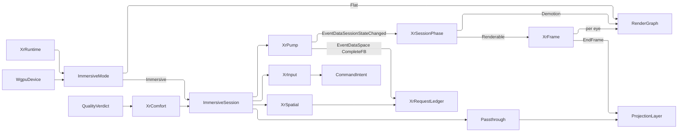

# [APPUI_RENDER_IMMERSIVE]

One immersive owner binds OpenXR stereo design review, `XR_FB_passthrough`, and the Meta spatial-entity world-lock onto the same `Wgpu` device the viewport leases, with `ImmersiveMode` carrying immersive-versus-flat as a value so a host without an OpenXR loader renders the flat viewport through the same receipt family. `ImmersiveSession` runs the `Instance -> system id -> Session -> Swapchain` lifecycle against the shared graphics binding and carries the runtime-driven `XrSessionPhase` state cell, `XrPump` drains the event queue once per frame ahead of `WaitFrame`, `XrFrame` runs the predicted-display-time frame loop submitting one `CompositionLayerProjection` per frame, `XrInput` is the action-set controller model, `Passthrough` chains the `XR_FB_passthrough` environment-blend layer under the rendered scene, and `XrSpatial` mints the persistent anchors, room model, and cross-user share the on-site review registers against. `XrChrome` mounts world-anchored panels as quad layers rendering the settled control vocabulary, picks them by controller ray into ordinary panel-pixel coordinates, and carries the comfort policy rows a reviewer's tolerance sets. The page owns the session lifecycle and state machine, the stereo frame loop, action-set input, passthrough composition, the FB spatial-entity plane, and the immersive review chrome with its comfort policy, while sharing the viewport's one `Wgpu` device. `Silk.NET.OpenXR`, its FB extensions, `GpuBinding.Wgpu`, Thinktecture, and LanguageExt supply the substrate; the flat fold remains a complete successful mode when no XR runtime is available and the terminal fold every lost runtime degrades to.

## [01]-[INDEX]

- [02]-[XR_SESSION]: Instance/system/session lifecycle against the shared `Wgpu` graphics binding; the session-state vocabulary; the handle ledger; flat-fold fallback.
- [03]-[STEREO_FRAME]: The event drain and the predicted-display-time frame loop submitting one stereo projection layer per frame.
- [04]-[XR_INPUT_PASSTHROUGH]: The action-set controller model, the `XR_FB_passthrough` env-blend composition, and the governor-driven comfort levers.
- [05]-[SPATIAL_ANCHORS]: The FB spatial-entity async request ledger, persistent anchors, room understanding, and cross-user share.
- [06]-[XR_REVIEW_CHROME]: World-anchored control panels on quad layers, ray-hit input mapping, comfort policy rows, anchored annotations, controller review verbs.

## [02]-[XR_SESSION]

- Owner: `ImmersiveMode` `[Union]` the availability algebra — `Immersive(ImmersiveSession)` or `Flat(FlatCause)`; `FlatCause` `[SmartEnum<string>]` the flat-state vocabulary; `XrSessionPhase` `[SmartEnum<int>]` the runtime-driven session-state row keyed on the host `SessionState` ordinal; `ImmersiveSession` the OpenXR session lifecycle, the negotiated `XrComfortPolicy` whose stance row its reference space was created from, and its runtime-state cells — phase, handle ledger, request ledger, bound input, negotiated comfort, mounted panel roster; `XrExtensions` the one loaded-function-table carrier; `XrHandle`/`XrHandleLedger` the typed handle-to-destroy ledger; `XrRuntime` the impossible-state-free availability union; `ImmersiveFault` the typed fault family on the `AppUiFaultBand.Immersive` registry row (6120).
- Cases: `ImmersiveFault` = Text | SystemUnavailable | SessionRejected | SwapchainFailed | ReleaseFailed | FrameRejected | StateRefused | InputRejected | PassthroughRejected | SpatialRejected | ComfortRejected — codes derive through `AppUiFaultBand.Immersive`, one case per native surface whose `Result` a recovery arm reads differently; `FlatCause` = LoaderAbsent | PlatformUnsupported | SystemAbsent | RuntimeLost | SessionExited — capability states, not faults: an absent loader, a loaderless platform, a runtime with no attached HMD, a runtime that revoked the instance, and an app-requested exit each land as `Flat` with their cause, and only a present-but-refusing runtime faults.
- Entry: `public static Fin<ImmersiveMode> Create(WgpuDevice device, XrRuntime runtime, Func<WgpuDevice, XrRuntime.Ready, Fin<ImmersiveSession>> bind)` dispatches the complete `XrRuntime.Ready(PassthroughAdvertised, SpatialAdvertised, ViewConfig, BlendModes)` payload to the native-open continuation — `Ready.Blend` selects the strongest advertised `EnvironmentBlendMode`, so opaque VR, additive AR, and admitted passthrough are runtime-capability outcomes, never a constant — and preserves `XrRuntime.Unavailable(FlatCause)` as the successful desktop floor. `Ready` alone can carry advertised extension and view-configuration facts, so an absent loader or system can never coexist with usable runtime data. The continuation creates the OpenXR instance, system, session, eye swapchains, and reference space against the shared `WgpuDevice`; `ImmersiveFrame.Frame` then returns the same `FrameReceipt` family for stereo and flat modes.
- Auto: the session creates against the graphics-binding `next` chain sharing the same physical device, queue family, and queue index the wgpu instance negotiated (`KHR_vulkan_enable2`, `GraphicsBindingVulkanKHR`) so the meshlet/path-trace/splat passes render into the OpenXR swapchain images with the one device — a second GPU device for the immersive path is the cross-adapter copy penalty the shared binding avoids; the session probes each extension through `EnumerateInstanceExtensionProperties` and lists the advertised set in `InstanceCreateInfo.EnabledExtensionNames`; the absence of an installed loader (`libopenxr_loader`) is the `Flat(LoaderAbsent)` capability value that renders through the flat `Render/pipeline` viewport, so the immersive session is an optional surface the desktop path degrades from with the cause preserved and no XR session constructed; the runtime drives the session through `XrSessionPhase` and the app answers on the same row — `Ready` runs `BeginSession` against the primary view configuration, `Stopping` runs `EndSession`, and `LossPending`/`Exiting` carry the `FlatCause` that retires the session, so a phase is one row rather than a transition ladder; every acquired native handle records as its typed `XrHandle` case on the session `Atom<XrHandleLedger>` cell — the cell rather than a construction-time column, because passthrough features, action sets, foveation profiles, and anchor spaces are all acquired AFTER the session exists — and release is the ledger fold in reverse-acquisition order through the matching `DestroyXxx`/`DestroyXxxFB` entrypoint with each `Result` checked; the tables that fold reaches travel as ONE `XrExtensions` carrier — the core `XR` root beside each optionally-loaded vendor root — so admitting a further vendor extension is one column on the carrier and no release, comfort, input, passthrough, or spatial signature widens.
- Receipt: the session creation emits a session-resolved evidence row — system id, view config, swapchain format, passthrough-available flag; `TelemetryRow` contributes the session-resolved, session-absent, session-demoted, and event-drained instruments inward through the AppHost `TelemetryContributorPort`, and `ImmersiveSession.Observed` is their ONE writer — the availability arm at `ImmersiveMode.Create` and the frame arm inside the bound event-observer arrow the `Observe` column carries, so every contributed row has a recording site and absence, demotion, and drain each key the dimension its own declaration names.
- Packages: Silk.NET.OpenXR, Silk.NET.OpenXR.Extensions.FB, Thinktecture.Runtime.Extensions, LanguageExt.Core, NodaTime
- Growth: a new XR extension is one enabled-extension-name row plus one `XrExtensions` column every consumer already receives; a new session state is one `XrSessionPhase` row carrying its own renderability, transition, and demotion; one immersive instrument is one `InstrumentSpec` row on `ImmersiveSession.TelemetryRow`; zero new surface.
- Boundary: the session shares the one `Wgpu` device the `Render/pipeline` viewport leases through the branch `ONE_WGPU_DEVICE` `EMBED_CAPSULE` law — a second GPU context for the immersive path is the `[04]-[BOUNDARIES]` rejected form, so the OpenXR session created with the Vulkan binding shares the wgpu device's physical device, queue family, and queue index; `Silk.NET.OpenXR` carries no bundled native runtime so it P/Invokes the host-installed loader (`.api/api-silk-openxr.md` local admission) and the loader-absent case is `Flat(LoaderAbsent)` — macOS ships no Apple OpenXR loader (visionOS uses ARKit/RealityKit), so the immersive session activates on Windows/Linux desktop hosts where the loader is present and lands `Flat(PlatformUnsupported)` on macOS, the session create being a capability probe not a launch precondition, and a rejected XR session (`SessionRejected`/`SwapchainFailed`) stays a distinguishable fault, never conflated with the normal no-loader state; the system id is the `ulong` `GetSystem` writes, never a wrapper type the binding does not declare; all native handles (`Instance`, `Session`, `Swapchain`, `Space`, `ActionSet`, `Action`, and the FB passthrough/foveation set) release through the `XrHandleLedger` reverse-order fold naming each matching `DestroyXxx`/`DestroyXxxFB` entrypoint with its `Result` checked — an opaque `IDisposable` teardown erasing the handle-to-destroy correspondence is the deleted form; `XrExtensions` is the ONE carrier every table-consuming member takes, so a per-extension optional parameter beside the core root is the deleted arity and an unloaded table refuses its own handles with `Result.ErrorHandleInvalid` rather than widening a signature; the runtime arm is SPIKE-gated exactly as the viewport; the `Silk.NET.OpenXR.Extensions.FB` roots ride the same `2.23.0` line as the core (Silk.NET publishes its whole core-plus-extension set from one monorepo release) so no version split.

```csharp signature
[Union]
public abstract partial record ImmersiveFault : Expected, IValidationError<ImmersiveFault> {
    private ImmersiveFault(string detail, int code) : base(detail, code, None) { }

    public static ImmersiveFault Create(string message) => new Text(message);

    public sealed record Text : ImmersiveFault { public Text(string detail) : base(detail, AppUiFaultBand.Immersive.Code(0)) { } }
    public sealed record SystemUnavailable : ImmersiveFault { public SystemUnavailable(string detail) : base(detail, AppUiFaultBand.Immersive.Code(1)) { } }
    public sealed record SessionRejected : ImmersiveFault { public SessionRejected(string detail) : base(detail, AppUiFaultBand.Immersive.Code(2)) { } }
    public sealed record SwapchainFailed : ImmersiveFault { public SwapchainFailed(string detail) : base(detail, AppUiFaultBand.Immersive.Code(3)) { } }
    public sealed record ReleaseFailed : ImmersiveFault {
        public ReleaseFailed(Seq<(string Handle, Result Outcome)> failures)
            : base($"xr/release: {string.Join(", ", failures.Map(static row => $"{row.Handle}={row.Outcome}"))}", AppUiFaultBand.Immersive.Code(4)) { }
    }
    // The native entrypoint is the evidence: an entrypoint name plus its Result is what distinguishes a
    // recoverable frame skip from a lost session, so a stringified stage with the code folded into the text
    // is the shape that made every frame failure read alike.
    public sealed record FrameRejected : ImmersiveFault {
        public FrameRejected(string entrypoint, Result outcome) : base($"xr/frame {entrypoint}: {outcome}", AppUiFaultBand.Immersive.Code(5)) => (Entrypoint, Outcome) = (entrypoint, outcome);
        public string Entrypoint { get; }
        public Result Outcome { get; }
    }
    public sealed record StateRefused : ImmersiveFault {
        public StateRefused(XrSessionPhase phase, Result outcome) : base($"xr/state {phase.Key}: {outcome}", AppUiFaultBand.Immersive.Code(6)) => (Phase, Outcome) = (phase, outcome);
        public XrSessionPhase Phase { get; }
        public Result Outcome { get; }
    }
    public sealed record InputRejected : ImmersiveFault {
        public InputRejected(string entrypoint, Result outcome) : base($"xr/input {entrypoint}: {outcome}", AppUiFaultBand.Immersive.Code(7)) { }
    }
    public sealed record PassthroughRejected : ImmersiveFault {
        public PassthroughRejected(string entrypoint, Result outcome) : base($"xr/passthrough {entrypoint}: {outcome}", AppUiFaultBand.Immersive.Code(8)) { }
    }
    public sealed record SpatialRejected : ImmersiveFault {
        public SpatialRejected(SpatialRequestKind kind, Result outcome) : base($"xr/spatial {kind.Key}: {outcome}", AppUiFaultBand.Immersive.Code(9)) => (Kind, Outcome) = (kind, outcome);
        public SpatialRequestKind Kind { get; }
        public Result Outcome { get; }
    }
    // The comfort levers are their own recovery surface: a refused rate enumeration or foveation update
    // degrades the lever and leaves the session whole, where a passthrough refusal retires a composition
    // layer — so reporting a foveation failure on the passthrough case is the same read-alike collapse the
    // frame case's own evidence law deletes one band up.
    public sealed record ComfortRejected : ImmersiveFault {
        public ComfortRejected(string entrypoint, Result outcome) : base($"xr/comfort {entrypoint}: {outcome}", AppUiFaultBand.Immersive.Code(10)) { }
    }
}

[SmartEnum<string>]
[KeyMemberEqualityComparer<ComparerAccessors.StringOrdinal, string>]
[KeyMemberComparer<ComparerAccessors.StringOrdinal, string>]
public sealed partial class FlatCause {
    public static readonly FlatCause LoaderAbsent = new("loader-absent");
    public static readonly FlatCause PlatformUnsupported = new("platform-unsupported");
    public static readonly FlatCause SystemAbsent = new("system-absent");
    public static readonly FlatCause RuntimeLost = new("runtime-lost");
    public static readonly FlatCause SessionExited = new("session-exited");
}

// The runtime drives the session and the app answers; both answers ride ONE row keyed on the host enum's own
// ordinal. Arrive is the native transition the arrival obliges, Demotion is the FlatCause a terminal state
// folds the mode to, and Renderable is the ONLY gate the frame loop reads — a session that never reaches
// Synchronized submits no frame, and OpenXR refuses BeginFrame until the app has answered Ready with
// BeginSession, so a frame loop with no drain leaves the session constructible and permanently unrenderable.
// Demotion defers behind its delegate: an eager cross-vocabulary field reference captures null before the
// FlatCause materialization protects it.
[SmartEnum<int>]
[ValidationError<ImmersiveFault>]
public sealed partial class XrSessionPhase {
    public static readonly XrSessionPhase Unknown      = new((int)SessionState.Unknown,      renderable: false, Absent, Inert);
    public static readonly XrSessionPhase Idle         = new((int)SessionState.Idle,         renderable: false, Absent, Inert);
    public static readonly XrSessionPhase Ready        = new((int)SessionState.Ready,        renderable: false, Absent, Begin);
    public static readonly XrSessionPhase Synchronized = new((int)SessionState.Synchronized, renderable: true,  Absent, Inert);
    public static readonly XrSessionPhase Visible      = new((int)SessionState.Visible,      renderable: true,  Absent, Inert);
    public static readonly XrSessionPhase Focused      = new((int)SessionState.Focused,      renderable: true,  Absent, Inert);
    public static readonly XrSessionPhase Stopping     = new((int)SessionState.Stopping,     renderable: false, Absent, End);
    public static readonly XrSessionPhase LossPending  = new((int)SessionState.LossPending,  renderable: false, static () => Some(FlatCause.RuntimeLost),   Inert);
    public static readonly XrSessionPhase Exiting      = new((int)SessionState.Exiting,      renderable: false, static () => Some(FlatCause.SessionExited), Inert);

    public bool Renderable { get; }

    [UseDelegateFromConstructor]
    public partial Option<FlatCause> Demotion();

    [UseDelegateFromConstructor]
    public partial Result Arrive(XR core, Session session, ViewConfigurationType config);

    public static XrSessionPhase Of(SessionState state) => TryGet((int)state, out XrSessionPhase? row) ? row : Unknown;

    private static readonly Func<Option<FlatCause>> Absent = static () => None;

    private static Result Inert(XR core, Session session, ViewConfigurationType config) => Result.Success;

    private static unsafe Result Begin(XR core, Session session, ViewConfigurationType config) {
        SessionBeginInfo info = new(primaryViewConfigurationType: config);
        return core.BeginSession(session, &info);
    }

    private static Result End(XR core, Session session, ViewConfigurationType config) => core.EndSession(session);
}

[Union(ConversionFromValue = ConversionOperatorsGeneration.None)]
public abstract partial record XrRuntime {
    private XrRuntime() { }
    public sealed record Ready(bool PassthroughAdvertised, bool SpatialAdvertised, ViewConfigurationType ViewConfig, Seq<EnvironmentBlendMode> BlendModes) : XrRuntime {
        // Composition selects the strongest ADVERTISED blend: FB passthrough rides AlphaBlend, an AR
        // runtime's AdditiveBlend composits over the see-through display, and Opaque is the VR floor —
        // an unadvertised mode is unrepresentable as the selected composite.
        public EnvironmentBlendMode Blend =>
            PassthroughAdvertised && BlendModes.Contains(EnvironmentBlendMode.AlphaBlend) ? EnvironmentBlendMode.AlphaBlend
            : BlendModes.Contains(EnvironmentBlendMode.AdditiveBlend) ? EnvironmentBlendMode.AdditiveBlend
            : EnvironmentBlendMode.Opaque;
    }

    public sealed record Unavailable(FlatCause Cause) : XrRuntime;

    public static readonly XrRuntime Absent = new Unavailable(FlatCause.LoaderAbsent);
}

// The availability algebra: capability absence is the NORMAL Flat state carrying its cause, and only a
// present-but-refusing runtime faults — both arms render through the one RenderGraph, so the desktop
// floor preserves the FrameReceipt family with zero XR session constructed.
[Union(ConversionFromValue = ConversionOperatorsGeneration.None)]
public abstract partial record ImmersiveMode {
    private ImmersiveMode() { }
    public sealed record Immersive(ImmersiveSession Session) : ImmersiveMode;
    public sealed record Flat(FlatCause Cause) : ImmersiveMode;

    public static Fin<ImmersiveMode> Create(
        WgpuDevice device,
        XrRuntime runtime,
        Func<WgpuDevice, XrRuntime.Ready, Fin<ImmersiveSession>> bind) =>
        runtime.Switch(
            state: (Device: device, Bind: bind),
            ready: static (state, ready) => state.Bind(state.Device, ready).Map(static ImmersiveMode (session) => new Immersive(session)),
            unavailable: static (_, absent) => Fin.Succ<ImmersiveMode>(new Flat(absent.Cause)));
}

// Loaded function tables travel as ONE carrier, never as an optional parameter per extension: a core
// root is always present, each vendor root is Some only where the instance enabled its extension, and
// a further FB or EXT table is one column here — every consumer's signature is already correct.
public sealed record XrExtensions(
    XR Core,
    Option<FBPassthrough> Passthrough,
    Option<FBFoveation> Foveation,
    Option<FBSwapchainUpdateState> SwapchainState,
    Option<FBDisplayRefreshRate> RefreshRate,
    Option<FBSpatialEntity> Spatial,
    Option<FBSpatialEntityQuery> SpatialQuery,
    Option<FBSpatialEntityStorage> SpatialStorage,
    Option<FBSpatialEntitySharing> SpatialSharing,
    Option<FBScene> Scene,
    Option<FBSceneCapture> SceneCapture);

// Native lifetime is the HANDLE-TO-DESTROY correspondence, never an opaque IDisposable: every acquired
// core and FB handle records as its typed case, so each handle's matching release entrypoint is
// recoverable from the ledger alone and an unreleased handle is a visible ledger row.
[Union(ConversionFromValue = ConversionOperatorsGeneration.None)]
public abstract partial record XrHandle {
    private XrHandle() { }
    public sealed record InstanceHandle(Instance Handle) : XrHandle;
    public sealed record SessionHandle(Session Handle) : XrHandle;
    public sealed record SwapchainHandle(Swapchain Handle) : XrHandle;
    public sealed record SpaceHandle(Space Handle) : XrHandle;
    public sealed record ActionSetHandle(ActionSet Handle) : XrHandle;
    public sealed record ActionHandle(Action Handle) : XrHandle;
    public sealed record PassthroughHandle(PassthroughFB Handle) : XrHandle;
    public sealed record PassthroughLayerHandle(PassthroughLayerFB Handle) : XrHandle;
    public sealed record FoveationHandle(FoveationProfileFB Handle) : XrHandle;

    public string Key => Switch(
        instanceHandle: static _ => "instance",
        sessionHandle: static _ => "session",
        swapchainHandle: static _ => "swapchain",
        spaceHandle: static _ => "space",
        actionSetHandle: static _ => "action-set",
        actionHandle: static _ => "action",
        passthroughHandle: static _ => "passthrough",
        passthroughLayerHandle: static _ => "passthrough-layer",
        foveationHandle: static _ => "foveation-profile");
}

// Reverse-acquisition release through the matching native entrypoints — DestroyAction/DestroyActionSet/
// DestroySwapchain/DestroySpace/DestroySession/DestroyInstance on the core, DestroyPassthroughLayerFB/
// DestroyPassthroughFB/DestroyFoveationProfileFB on the FB tables — each Result checked: a failing destroy
// is a counted ImmersiveFault on the telemetry spine, never a swallowed native error.
public sealed record XrHandleLedger(Seq<XrHandle> Acquired) {
    public static readonly XrHandleLedger Empty = new(Seq<XrHandle>());

    public XrHandleLedger Push(XrHandle handle) => this with { Acquired = Acquired.Add(handle) };

    public Fin<Unit> Release(XrExtensions tables) =>
        Acquired.Rev()
            .Choose(handle => Failed(handle.Key, handle.Switch(
                state: tables,
                instanceHandle: static (t, h) => t.Core.DestroyInstance(h.Handle),
                sessionHandle: static (t, h) => t.Core.DestroySession(h.Handle),
                swapchainHandle: static (t, h) => t.Core.DestroySwapchain(h.Handle),
                spaceHandle: static (t, h) => t.Core.DestroySpace(h.Handle),
                actionSetHandle: static (t, h) => t.Core.DestroyActionSet(h.Handle),
                actionHandle: static (t, h) => t.Core.DestroyAction(h.Handle),
                passthroughHandle: static (t, h) => t.Passthrough.Map(api => api.DestroyPassthroughFB(h.Handle)).IfNone(Result.ErrorHandleInvalid),
                passthroughLayerHandle: static (t, h) => t.Passthrough.Map(api => api.DestroyPassthroughLayerFB(h.Handle)).IfNone(Result.ErrorHandleInvalid),
                foveationHandle: static (t, h) => t.Foveation.Map(api => api.DestroyFoveationProfileFB(h.Handle)).IfNone(Result.ErrorHandleInvalid))))
            .ToSeq() switch {
                { IsEmpty: true } => Fin.Succ(unit),
                Seq<(string Handle, Result Outcome)> failures => Fin.Fail<Unit>(new ImmersiveFault.ReleaseFailed(failures)),
            };

    private static Option<(string Handle, Result Outcome)> Failed(string handle, Result outcome) =>
        outcome == Result.Success ? None : Some((handle, outcome));
}

// The eye render and the event sink are DELEGATE COLUMNS, not graph or bus references: the composition binds
// the one Render/pipeline RenderGraph whose Lease resolves to the acquired XR swapchain image for that eye
// and the observer that routes each drained event, so this owner never re-decides the lease, never re-models
// the scene, never names a backend target factory, and never drops the evidence its drain produced. The cells
// carry the runtime state a record column cannot: the phase the runtime drives, the handles acquired after
// construction, the FB requests awaiting their completion event, the action set bound against the live
// session, the comfort value each frame's step advances, the mounted panel roster, and the display time each
// frame predicts — every one of them a fact that first exists after this record does.
public sealed record ImmersiveSession(
    Instance Instance,
    ulong System,
    Session Session,
    ViewConfigurationType ViewConfig,
    EnvironmentBlendMode Blend,
    Seq<Swapchain> EyeSwapchains,
    Extent2Di EyeExtent,
    Space ReferenceSpace,
    Option<Passthrough> Passthrough,
    Atom<XrSessionPhase> Phase,
    Atom<XrHandleLedger> Ledger,
    Atom<XrRequestLedger> Requests,
    // Input and comfort are per-frame runtime state minted AFTER the session exists — `Bind` and the
    // rate/foveation negotiation both take the session — and `Step` answers a NEW comfort value whose profile
    // cache must survive to the next frame, so both ride cells exactly as the phase, handle, and request
    // state do. Absence IS the second state on each: a runtime with no attached action set and one with
    // neither the refresh-rate nor the foveation extension are both complete sessions, so a sentinel value
    // standing in for either would put an unbound action set on `SyncAction` and a fabricated rate on the
    // governor's own column.
    Atom<Option<XrInput>> Input,
    Atom<Option<XrComfort>> Comfort,
    // The frame's own PREDICTED DISPLAY TIME, published where every other reader of it can reach it. It is a
    // per-frame runtime fact the runtime alone answers — `WaitFrame` writes it into a `FrameState` inside the
    // submit kernel — and every pose LOCATION is resolved against it, so leaving it in that kernel's local
    // left the controller-ray read taking a `long` no surface on this page produces and the panel pick
    // unreachable from anywhere but the frame it is deliberately not an arm of. Absence is the pre-first-frame
    // state and it is a real one: a location resolved against a fabricated instant is a pose at a time the
    // runtime never predicted, so the reads that consume this answer absence rather than a forged ray.
    Atom<Option<long>> Display,
    // Panels mount and unmount across a session's life exactly as handles and requests do, so the roster is a
    // cell and the frame reads it once per submit. It is a SESSION column rather than a caller argument because
    // the layer array is built inside the one `EndFrame` — a caller-supplied panel seq would let two frames
    // submit different chrome for one mounted set.
    Atom<Seq<XrPanel>> Panels,
    // The comfort ROWS a user set and the session negotiated once. The stance's reference-space row is what the
    // session was created against, so the policy and the space cannot disagree, and the frame hands the whole
    // value to each eye pass rather than the eye render holding a second copy.
    XrComfortPolicy ComfortPolicy,
    Func<EyePass, Fin<FrameReceipt>> RenderEye,
    // The panel raster is a DELEGATE COLUMN for the same reason the eye render is: composition binds the one
    // `ControlFactory` and the one `PaintCatalog` behind it, so this owner composites panel content it never
    // materializes and no XR-specific rendering path exists.
    Func<XrPanel, Fin<(string Pass, Duration Elapsed)>> RenderPanel,
    // The observer receives the frame's ANSWER beside its drained queue, because the two facts belong to one
    // frame and neither is recoverable from the other: the queue names what the runtime said, the outcome
    // names what the frame did with it, and the demotion count exists only on the second. Handing it the
    // queue alone leaves the demoted-session row declared with no writer that can ever fill it.
    Func<XrFrameOutcome, Seq<XrEvent>, IO<Unit>> Observe) {
    // Terminal by construction: the demotion that calls this hands the caller a Flat mode, so no second
    // release reaches the same ledger and a drain column on the cell would state a phase nothing can enter.
    // A failing destroy leaves its row visible rather than clearing evidence the fault names.
    public Fin<Unit> Release(XrExtensions tables) => Ledger.Value.Release(tables);

    public Unit Acquire(XrHandle handle) => ignore(Ledger.Swap(held => held.Push(handle)));

    public const string ResolvedInstrument = "rasm.appui.immersive.session.resolved";
    public const string AbsentInstrument = "rasm.appui.immersive.session.absent";
    public const string DemotedInstrument = "rasm.appui.immersive.session.demoted";
    public const string EventInstrument = "rasm.appui.immersive.event.drained";

    // Absence and demotion both land a Flat mode, and the mode ALONE cannot tell them apart — one is a runtime
    // that never opened, the other a session that opened and was lost — so they are two rows keyed on the same
    // FlatCause dimension rather than one row a reader has to disambiguate from context. Resolution carries no
    // dimension: the XR system id is a per-boot runtime handle, and fanning a metric across it mints one series
    // per launch. Every declared dimension below is written by the projection beside it.
    public static TelemetryContributorPort TelemetryRow(string version) =>
        AppUiTelemetry.Contribute(version,
            InstrumentSpec.Count(ResolvedInstrument, "{session}", "XR sessions resolved against an advertised runtime", MeasureForm.Whole),
            InstrumentSpec.Count(AbsentInstrument, "{session}", "XR session absences by cause", MeasureForm.Whole, AppUiTelemetry.OutcomeSlot),
            InstrumentSpec.Count(DemotedInstrument, "{session}", "XR sessions demoted to flat by cause", MeasureForm.Whole,
                AppUiTelemetry.OutcomeSlot),
            InstrumentSpec.Count(EventInstrument, "{event}", "XR runtime events drained by kind", MeasureForm.Whole, AppUiTelemetry.SourceSlot));

    // Two projections, two moments, because the availability value and the frame answer are the two shapes that
    // carry these facts and neither is recoverable from the other. Composition binds the mode arm at
    // `ImmersiveMode.Create` — the one mint of the availability algebra — and the frame arm inside the observer
    // arrow the `Observe` column already receives, which is the ONE point holding a frame's drained queue beside
    // the outcome that queue produced. Written anywhere else the four rows describe two different frames;
    // written nowhere they stand declared with no writer at all. The projections are `Observed` because
    // `Observe` is the record's own delegate column and a static of that name would collide with it.
    public static Fin<Unit> Observed(InstrumentSet set, ImmersiveMode mode) =>
        mode.Switch(
            state: set,
            immersive: static (s, _) => s.Write(ResolvedInstrument, 1L),
            flat: static (s, absent) => s.Write(AbsentInstrument, 1L,
                InstrumentSet.Tags((AppUiTelemetry.OutcomeSlot, absent.Cause.Key))));

    // The drain fans over the event KIND — the union's own roster projection — so a sixth case is one arm on
    // that roster and no write site spells a case-to-literal ladder. A demotion counts once, on the frame that
    // released the ledger; Submitted and Idled publish nothing, because a frame that drew or paced is not an
    // event this counter measures and a zero write would be a measurement the frame never took.
    public static Fin<Unit> Observed(InstrumentSet set, XrFrameOutcome outcome, Seq<XrEvent> drained) =>
        toSeq(drained.GroupBy(static drop => drop.Kind))
            .TraverseM(group => set.Write(EventInstrument, group.LongCount(),
                InstrumentSet.Tags((AppUiTelemetry.SourceSlot, group.Key)))).As()
            .Bind(_ => outcome is XrFrameOutcome.Demoted demoted
                ? set.Write(DemotedInstrument, 1L, InstrumentSet.Tags((AppUiTelemetry.OutcomeSlot, demoted.Cause.Key)))
                : Fin.Succ(unit));
}
```

## [03]-[STEREO_FRAME]

- Owner: `XrPump` the per-frame event drain; `XrEvent` `[Union]` the drained-event vocabulary; `XrFrame` the predicted-display-time frame loop and its one layer-array build; `XrFrameOutcome` `[Union]` the submit-idle-demote answer; `EyeView`/`EyePass` the per-eye pose, fov, acquired swapchain image, and the frame facts the eye render consumes; `ImmersiveFrame` the one entry over the availability algebra.
- Entry: `public IO<XrFrameOutcome> Frame(XrExtensions tables, ViewportClock clock, FrameBudget budget, QualityVerdict quality, ViewCamera camera)` on `ImmersiveSession` — the WHOLE per-frame obligation in one arrow: drain the event queue applying each arrival's transition, fold the abandoned requests off the same ledger, sync the attached action sets, step comfort against the frame's own verdict and swap the advanced value back into its cell, run `WaitFrame` -> `BeginFrame` -> `LocateView` -> per-eye acquire/wait/render/release -> `EndFrame` when the phase is renderable, then hand the OUTCOME and the frame's whole queue to the bound observer; `public IO<(ImmersiveMode Mode, FrameReceipt Receipt)> Frame(RenderGraph graph, XrExtensions tables, ViewportClock clock, FrameBudget budget, QualityVerdict quality, ViewCamera camera)` on `ImmersiveMode` is the one dispatch over the availability algebra, threading the mode outward so a demoted session cannot be re-entered.
- Auto: the drain runs ONCE per frame ahead of `WaitFrame` and is the session's only state authority — `PollEvent` empties the queue until `Result.EventUnavailable`, each `EventDataSessionStateChanged` resolves its `XrSessionPhase` row and runs that row's `Arrive` transition, each `EventDataSpace*CompleteFB` retires its request on the one ledger, and a bounded drain ceiling keeps a runtime flooding the queue from starving the frame; the frame loop is driven by the runtime-predicted display time from `WaitFrame`'s `FrameState`, never a wall clock, so the render anticipates the display deadline, and a `ShouldRender` of zero still runs the `BeginFrame`/`EndFrame` pair with an empty layer array so the runtime keeps pacing while no eye pass is wasted; `LocateView` resolves the two `View` structs (per-eye `Posef`+`Fovf`) against the predicted display time and refuses on an invalid position, each eye acquires and waits its swapchain image, renders through the bound `RenderEye` arrow, and releases the image before the next eye acquires; `EndFrame` submits one `CompositionLayerProjection` carrying two `CompositionLayerProjectionView` sub-images plus the passthrough layer beneath when present; the frame seals ONE `Render/pipeline` `FrameReceipt` folded from the per-eye receipts, so the immersive frame rides the one evidence family; a phase carrying a `Demotion` releases the handle ledger once and answers `Demoted`, which `ImmersiveFrame` folds to `Flat(cause)` and renders desktop from then on.
- Receipt: the `Render/pipeline` `FrameReceipt` per submitted frame — the two eye receipts' passes concatenated under their eye ordinal, GPU and triangle columns summed, `WithinBudget` conjoined, and the release fault of a demoting frame parked on its `Fault` column.
- Packages: Silk.NET.OpenXR, Silk.NET.OpenXR.Extensions.FB, Thinktecture.Runtime.Extensions, LanguageExt.Core, NodaTime
- Growth: a new view config (quad views) is one `ViewConfigurationType` row plus the eye count the config's own `EnumerateViewConfigurationView` census answers; a new runtime event is one `XrEvent` case; zero new surface.
- Boundary: the head pose enters as a RIGID transform of the whole app camera — the located orientation rotates the camera basis and the located position translates the eye through that same basis — so an eye-only translation (a headset that pans while the image holds still) and a position composed with its own accompanying orientation are the two deleted forms; the per-frame obligations ride ONE arrow in the runtime's own order, so an input sync, a comfort step, or an expiry fold left to a caller is the deleted form — declared per-frame law with no per-frame caller is exactly the gap that leaves `SyncAction` never polled and the governor's XR levers never applied; the frame loop runs the runtime-predicted display time so a wall-clock frame pace ignoring the predicted display time is the rejected form (`.api/api-silk-openxr.md` reject); the event drain is a PRECONDITION of the loop, not an optional observer — OpenXR refuses `BeginFrame` until the runtime has driven the session to `SessionState.Ready` and the app has answered with `BeginSession`, so a loop with no drain never renders; each eye renders through the bound `RenderEye` arrow over the one `Render/pipeline` `RenderGraph` so the immersive path re-models no geometry and re-uses the meshlet/path-trace/residency owners; `EndFrame` submits one `CompositionLayerProjection` with two sub-images so a per-eye separate layer is the deleted form; ONE layer array carries the whole submit in compositing order — the passthrough feed beneath, the projection layer over it so the rendered BIM scene composites onto the camera feed, and the `[06]` mounted panel quads above both — and the projection layer carries `CompositionLayerFlags.BlendTextureSourceAlphaBit` under a non-opaque blend so its alpha reaches the compositor; each mounted panel rasters between the eye loop and the submit through the session's own `RenderPanel` column, because a quad's swapchain image releases before `EndFrame` reads it exactly as an eye image does, and its pass row folds onto the same `FrameReceipt`; the frame seals the `Render/pipeline` `FrameReceipt` so the immersive frame mints no second receipt vocabulary; the swapchain images are the shared `Wgpu` device's textures so the eye render and the desktop render share one device lifetime; the acquire/wait/release triple brackets each eye render so a failing eye pass releases its image before the fault leaves the kernel.

```csharp signature
// One eye's whole submit input: the located pose and asymmetric tangent fov, the world frame the head pose
// composed against the app camera, and the acquired swapchain image the render targets. The fov crosses as
// the native Fovf because an XR eye frustum is asymmetric and a single-scalar field-of-view camera cannot
// carry it — projecting it onto one symmetric angle is the silently-wrong-stereo form.
public readonly record struct EyeView(int Eye, Posef Pose, Fovf Fov, CameraFrame Frame, Swapchain Swapchain, uint ImageIndex);

// ONE carrier crosses the eye-render seam: the eye's own facts beside the per-frame facts the graph consumes,
// so the arrow is a single-parameter arrow and a clock/budget/quality/comfort parameter tail beside the view
// is the deleted arity. Comfort rides here because the peripheral vignette is applied by the eye render and
// nowhere else — the policy states the strength and the locomotion demand, and the render holds the one fact
// the policy cannot: whether this frame is moving.
public readonly record struct EyePass(
    EyeView View, ViewportClock Clock, FrameBudget Budget, QualityVerdict Quality, XrComfortPolicy Comfort);

// The drained vocabulary: one case per event this session acts on, each carrying exactly its own evidence.
// A structure type no case claims is dropped — the runtime is free to queue events for extensions this
// session never enabled.
[Union(ConversionFromValue = ConversionOperatorsGeneration.None)]
public abstract partial record XrEvent {
    private XrEvent() { }
    public sealed record Transitioned(XrSessionPhase Phase, long At) : XrEvent;
    public sealed record SpatialCompleted(SpatialRequest Request, SpatialOutcome Outcome, Duration Waited) : XrEvent;
    public sealed record QueryResultsReady(ulong RequestId) : XrEvent;
    public sealed record RefreshRateChanged(float From, float To) : XrEvent;
    public sealed record ProfileRebound : XrEvent;
    public sealed record Lost(uint Count) : XrEvent;
    // A request the ledger forgot past its ceiling is a runtime signal the composition must be able to
    // attribute — an extension unloaded mid-flight abandons every pending verb — so it rides the same queue
    // rather than vanishing into a fold no counter reads.
    public sealed record Abandoned(SpatialRequest Request) : XrEvent;

    // The case kind every drain count tags with, spelled off the case names themselves so the roster and the
    // tag vocabulary are one declaration — a new case answers here at compile time, and no write site
    // carries a case-to-literal ladder beside this family.
    public string Kind => Switch(
        transitioned:      static _ => nameof(Transitioned),
        spatialCompleted:  static _ => nameof(SpatialCompleted),
        queryResultsReady: static _ => nameof(QueryResultsReady),
        refreshRateChanged: static _ => nameof(RefreshRateChanged),
        profileRebound:    static _ => nameof(ProfileRebound),
        lost:              static _ => nameof(Lost),
        abandoned:         static _ => nameof(Abandoned));
}

// Submitted / Idled / Demoted are three different frame answers with three different evidence shapes, so a
// nullable receipt or a bare Option cannot state which one happened: Idled names the phase that declined,
// Demoted names the FlatCause and carries the ledger release outcome the caller must park.
[Union(ConversionFromValue = ConversionOperatorsGeneration.None)]
public abstract partial record XrFrameOutcome {
    private XrFrameOutcome() { }
    public sealed record Submitted(FrameReceipt Receipt) : XrFrameOutcome;
    public sealed record Idled(XrSessionPhase Phase) : XrFrameOutcome;
    public sealed record Demoted(FlatCause Cause, Option<Error> Release) : XrFrameOutcome;
}

public static class XrPump {
    // A runtime queueing faster than the app drains would starve the frame; the ceiling bounds one drain and
    // the residue rides the next frame, which is exactly the pacing WaitFrame already enforces.
    private const int DrainCeiling = 64;

    extension(ImmersiveSession session) {
        public unsafe IO<Seq<XrEvent>> Pump(XrExtensions tables, ClockPolicy clocks) =>
            IO.lift(() => Drain(session, tables, clocks));
    }

    // ONE statement-bodied boundary kernel per the boundary-kernel law: poll into a stack EventDataBuffer,
    // dispatch on its structure type, apply the state transition and retire the request ledger in place, and
    // stop on EventUnavailable. Faults throw typed ImmersiveFault the IO.lift rail captures.
    private static unsafe Seq<XrEvent> Drain(ImmersiveSession session, XrExtensions tables, ClockPolicy clocks) {
        Seq<XrEvent> drained = Seq<XrEvent>();
        for (int pass = 0; pass < DrainCeiling; pass++) {
            EventDataBuffer buffer = new();
            Result polled = tables.Core.PollEvent(session.Instance, &buffer);
            if (polled == Result.EventUnavailable) { break; }
            if (polled != Result.Success) { throw Refused(new ImmersiveFault.FrameRejected(nameof(XR.PollEvent), polled)); }
            drained = Admit(session, tables, clocks, &buffer).Match(Some: drained.Add, None: () => drained);
        }
        return drained;
    }

    private static unsafe Option<XrEvent> Admit(ImmersiveSession session, XrExtensions tables, ClockPolicy clocks, EventDataBuffer* buffer) {
        switch (buffer->Type) {
            case StructureType.TypeEventDataSessionStateChanged:
                return Transition(session, tables, (EventDataSessionStateChanged*)buffer);
            case StructureType.TypeEventDataInstanceLossPending:
                return Publish(session, XrSessionPhase.LossPending, 0L);
            case StructureType.TypeEventDataSpaceQueryResultsAvailableFB:
                // The results-available signal is NOT a completion: it says RetrieveSpaceQueryResultsFB has
                // rows, and the paired query-complete event is what retires the ledger row.
                return Some<XrEvent>(new XrEvent.QueryResultsReady(((EventDataSpaceQueryResultsAvailableFB*)buffer)->RequestId));
            case StructureType.TypeEventDataDisplayRefreshRateChangedFB: {
                EventDataDisplayRefreshRateChangedFB* rate = (EventDataDisplayRefreshRateChangedFB*)buffer;
                return Some<XrEvent>(new XrEvent.RefreshRateChanged(rate->FromDisplayRefreshRate, rate->ToDisplayRefreshRate));
            }
            case StructureType.TypeEventDataInteractionProfileChanged:
                return Some<XrEvent>(new XrEvent.ProfileRebound());
            case StructureType.TypeEventDataEventsLost:
                return Some<XrEvent>(new XrEvent.Lost(((EventDataEventsLost*)buffer)->LostEventCount));
            // Every FB async completion retires through ONE table lookup and the row's own reader, so a new
            // async verb is one SpatialRequestKind row rather than a seventh arm here. A structure type no
            // row claims is dropped: the runtime queues events for extensions this session never enabled.
            default:
                return SpatialRequestKind.Retiring(buffer->Type).Bind(kind => Retire(session, clocks, kind, (nint)buffer));
        }
    }

    private static unsafe Option<XrEvent> Transition(ImmersiveSession session, XrExtensions tables, EventDataSessionStateChanged* changed) {
        XrSessionPhase phase = XrSessionPhase.Of(changed->State);
        Result arrived = phase.Arrive(tables.Core, session.Session, session.ViewConfig);
        return arrived == Result.Success
            ? Publish(session, phase, changed->Time)
            : throw Refused(new ImmersiveFault.StateRefused(phase, arrived));
    }

    private static Option<XrEvent> Publish(ImmersiveSession session, XrSessionPhase phase, long at) =>
        Some<XrEvent>(new XrEvent.Transitioned(session.Phase.Swap(_ => phase), at));

    // The retirement decision lives INSIDE the swapped value: Atom.Swap answers with the post-swap state
    // alone, so a ledger that removed a row and one that found nothing to remove would read identically from
    // outside. The Retired slot carries which row this swap consumed, and a completion for a request no row
    // holds is dropped — the runtime may complete a request a prior session minted.
    private static Option<XrEvent> Retire(ImmersiveSession session, ClockPolicy clocks, SpatialRequestKind kind, nint payload) {
        SpatialOutcome outcome = kind.Read(payload);
        Instant now = clocks.Now;
        // A minting completion is where the handle first exists — the verb answered with a request id and no
        // Space — so the ledger records it here or the world-lock leaks past session teardown.
        if (kind.MintsSpace && outcome.Outcome == Result.Success) { outcome.Space.Iter(space => session.Acquire(new XrHandle.SpaceHandle(space))); }
        return session.Requests.Swap(held => held.Retire(outcome.Id)).Retired
            .Map(request => (XrEvent)new XrEvent.SpatialCompleted(request, outcome, now - request.At));
    }

    private static Exception Refused(ImmersiveFault fault) => ((Error)fault).ToException();
}

public static class XrFrame {
    private const uint EyeCount = 2u;

    // XR_INFINITE_DURATION: the compositor owns the image-ready deadline, and a finite local timeout would
    // race the runtime's own pacing rather than bound anything the app can act on.
    private const long InfiniteDuration = long.MaxValue;

    extension(ImmersiveSession session) {
        // The WHOLE per-frame obligation runs here, in the one order the runtime contract fixes: the drain
        // empties the queue and applies every phase transition first, because `BeginFrame` is refused until
        // the runtime has driven the session to Ready; the abandoned-request fold runs beside it on the same
        // ledger the drain retires against; the action sets sync BEFORE the render so a controller pose the
        // eye pass reads is this frame's, not last frame's; comfort steps against the frame's own governor
        // verdict and its advanced value swaps back into the cell so the profile cache survives; then the
        // stereo loop runs. The observer fires LAST because it is the one point holding the drained queue
        // beside the outcome that queue produced — an observer called ahead of `Advance` can only ever see a
        // frame with no answer, which is what left the demotion count unwritable.
        public unsafe IO<XrFrameOutcome> Frame(XrExtensions tables, ViewportClock clock, FrameBudget budget, QualityVerdict quality, ViewCamera camera) =>
            from drained in session.Pump(tables, clock.Clocks)
            from abandoned in session.Expire(clock.Clocks)
            from _synced in session.Input.Value.Match(
                Some: input => input.Sync(session, tables),
                None: static () => IO.pure(unit))
            from _comfort in session.Comfort.Value.Match(
                Some: comfort => comfort.Step(session, tables, quality).Map(stepped => ignore(session.Comfort.Swap(_ => Some(stepped)))),
                None: static () => IO.pure(unit))
            from outcome in IO.lift(() => Advance(session, tables, clock, budget, quality, camera))
            // An abandoned request is a runtime signal like any drained one, so it reaches the observer on
            // the same queue rather than expiring silently past a ledger ceiling no counter ever names.
            from _observed in session.Observe(outcome, drained + abandoned.Map(XrEvent (request) => new XrEvent.Abandoned(request)))
            select outcome;
    }

    private static unsafe XrFrameOutcome Advance(ImmersiveSession session, XrExtensions tables, ViewportClock clock, FrameBudget budget, QualityVerdict quality, ViewCamera camera) =>
        session.Phase.Value switch {
            { } phase when phase.Demotion() is { IsSome: true, Case: FlatCause cause } =>
                new XrFrameOutcome.Demoted(cause, session.Release(tables).Match(Succ: static _ => Option<Error>.None, Fail: Some)),
            // A renderable phase whose runtime answered ShouldRender = false paced the frame without drawing
            // it, so the desktop mirror carries the receipt rather than a zero-ordinal stereo forgery.
            { Renderable: true } renderable => Submit(session, tables, clock, budget, quality, camera).Match(
                Some: XrFrameOutcome (receipt) => new XrFrameOutcome.Submitted(receipt),
                None: () => new XrFrameOutcome.Idled(renderable)),
            var idle => new XrFrameOutcome.Idled(idle),
        };

    // ONE statement-bodied unsafe boundary kernel per the boundary-kernel law: stack-allocate every
    // create-info and out struct, check each Result onto the typed rail, bracket each eye's acquire/wait/
    // render/release, and submit one layer array. The five-clause IO comprehension over free functions that
    // resolved to nothing is the deleted form.
    private static unsafe Option<FrameReceipt> Submit(ImmersiveSession session, XrExtensions tables, ViewportClock clock, FrameBudget budget, QualityVerdict quality, ViewCamera camera) {
        XR core = tables.Core;
        FrameWaitInfo waitFrame = new();
        FrameState state = new();
        Guard(core.WaitFrame(session.Session, &waitFrame, &state), nameof(XR.WaitFrame));
        // The predicted display time publishes the moment the runtime answers it and BEFORE the render gate,
        // because a paced-but-undrawn frame predicted an instant just as a drawn one did — a pose read
        // resolved against it is valid whether or not this frame reached an eye pass.
        ignore(session.Display.Swap(_ => Some(state.PredictedDisplayTime)));
        FrameBeginInfo beginFrame = new();
        Guard(core.BeginFrame(session.Session, &beginFrame), nameof(XR.BeginFrame));

        // ShouldRender is the runtime's own answer: a Synchronized-but-not-Visible session still runs the
        // frame pair so pacing survives, and it submits ZERO layers. Rendering into a swapchain the
        // compositor will not show is the wasted-eye-pass form, and sealing a receipt for it would publish
        // an ordinal and a pass fold no eye produced.
        if (state.ShouldRender == 0) {
            FrameEndInfo idle = new(displayTime: state.PredictedDisplayTime, environmentBlendMode: session.Blend, layerCount: 0u, layers: null);
            Guard(core.EndFrame(session.Session, &idle), nameof(XR.EndFrame));
            return None;
        }

        ViewLocateInfo locate = new(viewConfigurationType: session.ViewConfig, displayTime: state.PredictedDisplayTime, space: session.ReferenceSpace);
        ViewState viewState = new();
        View* located = stackalloc View[(int)EyeCount];
        for (int eye = 0; eye < EyeCount; eye++) { located[eye] = new View(); }
        uint locatedCount = 0u;
        Guard(core.LocateView(session.Session, &locate, &viewState, EyeCount, &locatedCount, located), nameof(XR.LocateView));
        if (locatedCount != EyeCount || (viewState.ViewStateFlags & ViewStateFlags.PositionValidBit) == 0) {
            throw Refused(new ImmersiveFault.FrameRejected(nameof(XR.LocateView), Result.ErrorValidationFailure));
        }

        Rect2Di imageRect = new(extent: session.EyeExtent);
        CompositionLayerProjectionView* projected = stackalloc CompositionLayerProjectionView[(int)EyeCount];
        Seq<FrameReceipt> eyes = Seq<FrameReceipt>();
        for (int eye = 0; eye < EyeCount; eye++) {
            Swapchain swapchain = session.EyeSwapchains[eye];
            SwapchainImageAcquireInfo acquire = new();
            uint image = 0u;
            Guard(core.AcquireSwapchainImage(swapchain, &acquire, &image), nameof(XR.AcquireSwapchainImage));
            try {
                SwapchainImageWaitInfo waitImage = new(timeout: InfiniteDuration);
                Guard(core.WaitSwapchainImage(swapchain, &waitImage), nameof(XR.WaitSwapchainImage));
                EyeView view = new(eye, located[eye].Pose, located[eye].Fov, EyeFrame(camera, located[eye].Pose), swapchain, image);
                EyePass pass = new(view, clock, budget, quality, session.ComfortPolicy);
                eyes = eyes.Add(session.RenderEye(pass).Match(Succ: static drawn => drawn, Fail: static fault => throw fault.ToException()));
            }
            finally {
                // Release brackets the ACQUISITION: an eye pass that faults mid-render still returns its
                // image, so a failing frame cannot strand the swapchain at its acquired index forever.
                SwapchainImageReleaseInfo release = new();
                Guard(core.ReleaseSwapchainImage(swapchain, &release), nameof(XR.ReleaseSwapchainImage));
            }
            projected[eye] = new CompositionLayerProjectionView(
                pose: located[eye].Pose,
                fov: located[eye].Fov,
                subImage: new SwapchainSubImage(swapchain: swapchain, imageRect: imageRect, imageArrayIndex: 0u));
        }

        // Panels raster INSIDE the frame, between the eye passes and the submit, because a quad's swapchain
        // image must be released before `EndFrame` reads it exactly as an eye image must. Their pass rows fold
        // onto the frame receipt, so a panel that stalls a frame is named rather than inferred.
        Seq<XrPanel> panels = session.Panels.Value;
        Seq<(string Pass, Duration Elapsed)> chrome = panels.Map(panel =>
            session.RenderPanel(panel).Match(Succ: static row => row, Fail: static fault => throw fault.ToException()));

        // ONE layer array, in compositing order: the passthrough feed beneath, the projection layer over it
        // blending its own alpha so the rendered model composites onto the camera feed, and every world-anchored
        // quad above both — chrome the model occludes is chrome a reviewer cannot read. A second EndFrame, a
        // second layer array, and a panel-local frame loop are all the deleted forms.
        CompositionLayerProjection projection = new(
            layerFlags: session.Blend == EnvironmentBlendMode.Opaque ? CompositionLayerFlags.None : CompositionLayerFlags.BlendTextureSourceAlphaBit,
            space: session.ReferenceSpace,
            viewCount: EyeCount,
            views: projected);
        CompositionLayerPassthroughFB passthrough = session.Passthrough.Match(
            Some: layer => new CompositionLayerPassthroughFB(flags: CompositionLayerFlags.BlendTextureSourceAlphaBit, space: session.ReferenceSpace, layerHandle: layer.Layer),
            None: static () => default);
        Seq<CompositionLayerQuad> quads = XrChrome.Layers(panels, session.ReferenceSpace);
        CompositionLayerQuad* chromeLayers = stackalloc CompositionLayerQuad[quads.Count];
        for (int at = 0; at < quads.Count; at++) { chromeLayers[at] = quads[at]; }
        uint layerCount = (uint)((session.Passthrough.IsSome ? 2 : 1) + quads.Count);
        CompositionLayerBaseHeader** layers = stackalloc CompositionLayerBaseHeader*[(int)layerCount];
        int depth = 0;
        if (session.Passthrough.IsSome) { layers[depth++] = (CompositionLayerBaseHeader*)&passthrough; }
        layers[depth++] = (CompositionLayerBaseHeader*)&projection;
        for (int at = 0; at < quads.Count; at++) { layers[depth++] = (CompositionLayerBaseHeader*)&chromeLayers[at]; }
        FrameEndInfo end = new(displayTime: state.PredictedDisplayTime, environmentBlendMode: session.Blend, layerCount: layerCount, layers: layers);
        Guard(core.EndFrame(session.Session, &end), nameof(XR.EndFrame));
        return Some(Seal(clock, eyes, chrome));
    }

    // The eye is the unit of GPU work and the FRAME is the unit of evidence: the eye receipts and the panel
    // raster rows fold into ONE FrameReceipt whose passes carry their eye ordinal or their panel key, so an
    // immersive frame mints no second receipt vocabulary and a per-eye or per-panel receipt never reaches the
    // sink as a frame of its own. The lead eye owns the ordinal and the backend; an empty fold is unreachable
    // by the loop above and refuses rather than publishing a zero ordinal no eye measured.
    private static FrameReceipt Seal(ViewportClock clock, Seq<FrameReceipt> eyes, Seq<(string Pass, Duration Elapsed)> chrome) =>
        eyes.Head.Match(
            Some: lead => new FrameReceipt(
                lead.Ordinal,
                lead.Backend,
                eyes.Map(static (eye, index) => eye.Passes.Map(row => ($"eye{index}/{row.Pass}", row.Elapsed))).Flatten()
                    + chrome.Map(static row => ($"panel/{row.Pass}", row.Elapsed)),
                eyes.Fold(Duration.Zero, static (sum, eye) => sum + eye.Gpu),
                eyes.Fold(0L, static (sum, eye) => sum + eye.Triangles),
                eyes.ForAll(static eye => eye.WithinBudget),
                clock.Clocks.Now,
                clock.Correlation,
                eyes.Choose(static eye => eye.Fault).Head,
                eyes.Map(static eye => eye.Deferred).Flatten()),
            None: static () => throw Refused(new ImmersiveFault.FrameRejected(nameof(XR.EndFrame), Result.ErrorValidationFailure)));

    // The head pose is a RIGID TRANSFORM of the whole app camera, never a translation of its eye point: the
    // located pose carries an orientation AND a position in the reference space, and moving only the eye
    // leaves `Target`/`Up` pinned to the desktop viewpoint, so the rendered view never turns when the head
    // turns — a headset that pans while the image holds still, which is the immersive path's whole purpose
    // inverted. Rotating the position by its OWN orientation is the second half of the same defect: a pose is
    // orientation-then-translation in ONE frame, so composing a point with the rotation that accompanies it
    // names no transform at all.
    //
    // The reference space is right-handed with +X right, +Y up, and -Z forward; the app camera's basis is the
    // ONE triad `OracleFrame.OfCamera` derives, so lifting each reference-space axis onto that triad is what
    // makes the head frame and the desktop frame the same world. The gaze distance carries over from the app
    // camera so a `Target`-relative orbit radius survives the lift, and the eye's own asymmetric `Fovf` — not
    // this frame — carries the per-eye frustum.
    private static CameraFrame EyeFrame(ViewCamera camera, Posef pose) {
        CameraFrame frame = camera.Frame;
        ((double fx, double fy, double fz), (double rx, double ry, double rz), (double ux, double uy, double uz)) =
            OracleFrame.OfCamera(frame);
        System.Numerics.Vector3 forward = new((float)fx, (float)fy, (float)fz);
        System.Numerics.Vector3 right = new((float)rx, (float)ry, (float)rz);
        System.Numerics.Vector3 up = new((float)ux, (float)uy, (float)uz);
        System.Numerics.Quaternion head = new(pose.Orientation.X, pose.Orientation.Y, pose.Orientation.Z, pose.Orientation.W);
        System.Numerics.Vector3 Lifted(System.Numerics.Vector3 local) => (right * local.X) + (up * local.Y) - (forward * local.Z);
        System.Numerics.Vector3 eye = frame.Eye + Lifted(new System.Numerics.Vector3(pose.Position.X, pose.Position.Y, pose.Position.Z));
        float reach = MathF.Max(System.Numerics.Vector3.Distance(frame.Target, frame.Eye), 1e-6f);
        return frame with {
            Eye = eye,
            Target = eye + (Lifted(System.Numerics.Vector3.Transform(-System.Numerics.Vector3.UnitZ, head)) * reach),
            Up = Lifted(System.Numerics.Vector3.Transform(System.Numerics.Vector3.UnitY, head)),
        };
    }

    private static Exception Refused(ImmersiveFault fault) => ((Error)fault).ToException();

    private static Result Guard(Result outcome, string entrypoint) =>
        outcome == Result.Success ? outcome : throw Refused(new ImmersiveFault.FrameRejected(entrypoint, outcome));
}

// The one frame entry over the availability algebra: the Immersive arm runs the drain and the stereo loop,
// the Flat arm runs the desktop RenderGraph.Frame, and BOTH answer with the mode the next frame must use —
// a demoted session folds to Flat(cause) here and cannot be re-entered, so a lost runtime degrades to the
// desktop floor rather than faulting every frame forever.
public static class ImmersiveFrame {
    extension(ImmersiveMode mode) {
        public IO<(ImmersiveMode Mode, FrameReceipt Receipt)> Frame(
            RenderGraph graph, XrExtensions tables, ViewportClock clock, FrameBudget budget, QualityVerdict quality, ViewCamera camera) =>
            mode.Switch(
                immersive: s => s.Session.Frame(tables, clock, budget, quality, camera).Bind(outcome => outcome.Switch(
                    submitted: submit => IO.pure((mode, submit.Receipt)),
                    idled: _ => graph.Frame(clock, budget, quality, camera).Map(receipt => (mode, receipt)),
                    // The release outcome parks on the frame the demotion produced rather than being
                    // discarded: a typed rail a seam cannot carry outward lands on the composing evidence
                    // cell, and the graph's own fault wins where both are present.
                    demoted: fallen => graph.Frame(clock, budget, quality, camera).Map(receipt =>
                        ((ImmersiveMode)new ImmersiveMode.Flat(fallen.Cause),
                         receipt with { Fault = receipt.Fault.IsSome ? receipt.Fault : fallen.Release })))),
                flat: _ => graph.Frame(clock, budget, quality, camera).Map(receipt => (mode, receipt)));
    }
}
```

## [04]-[XR_INPUT_PASSTHROUGH]

- Owner: `XrAction` the action declaration carrying its own interaction-profile and component paths; `XrInput` the bound action-set model; `Passthrough` the `XR_FB_passthrough` env-blend layer; `PassthroughStyle` the edge-color-and-opacity policy; `XrComfort` the refresh-rate and foveation negotiation the governor verdict drives.
- Entry: `public static Fin<XrInput> Bind(ImmersiveSession session, XrExtensions tables, Seq<XrAction> actions)` — creates the action set, creates each action, resolves every profile and component path through `StringToPath`, suggests the bindings per interaction profile, attaches the set to the session, and creates the pose action space; `public Fin<Option<Posef>> Aim(ImmersiveSession session, XrExtensions tables)` — the controller ray `[06]`'s panel pick consumes, resolved at the display time the frame published on the session and absent where no frame has paced yet, where the action is untracked, or where this instant's location carries invalid flags; `public static Fin<Passthrough> Start(ImmersiveSession session, XrExtensions tables, PassthroughStyle style)` — creates the passthrough feature and layer against the session and starts the camera feed; `public static Fin<XrComfort> Bind(ImmersiveSession session, XrExtensions tables)` — enumerates the advertised refresh rates capacity-then-fill, reads the running rate, and seats the empty profile cache the governor's steps fill, so the comfort cell's `Some` arm has a producer and a runtime with no rate root answers an empty roster rather than a fabricated ladder; all four take the one carrier, so an unloaded table refuses at its own `Option` rather than at a per-extension parameter, and both create paths push every acquired handle onto the session ledger cell.
- Auto: input is the action-set model — an `ActionSet` holds `Action`s whose component paths bind under an interaction profile (`/interaction_profiles/khr/simple_controller` carrying `/user/hand/left/input/select/click` and `/user/hand/right/input/aim/pose`), `SuggestInteractionProfileBinding` takes one suggestion array per profile so the bindings group by profile rather than per action, `AttachSessionActionSets` seals the set to the session before any sync, `SyncAction` polls the attached sets per frame, and `Aim` folds `GetActionStatePose`+`LocateSpace` into the controller ray the panel pick, the navigation verbs, and the measurement session read, so the controller drives the shell through the OpenXR device abstraction; passthrough creates through `CreatePassthroughFB` (the `IsRunningATCreationBitFB` flag auto-starting the feed) -> `CreatePassthroughLayerFB` (`ReconstructionFB` for full-screen passthrough) -> the per-frame `CompositionLayerPassthroughFB` chained into the `EndFrame` layer array beneath the projection layer so the rendered BIM scene composites over the camera feed; the `EnvironmentBlendMode` selects opaque VR, additive AR, or `XR_FB_passthrough` mixed-reality compositing, folding to opaque when the runtime lacks the extension; `PassthroughLayerSetStyleFB` carries the edge-color and texture-opacity so an on-site review tints or fades the real-world feed as a per-frame style fold; comfort reads the governor verdict WHOLE — `QualityTier.RefreshHz` picks the nearest advertised rate at or below it and `QualityTier.FoveationLevel` picks the profile row, which `UpdateSwapchainFB` applies to each eye swapchain — so the XR levers are projections of the one quality authority rather than a second ladder.
- Receipt: the input bind and passthrough start each contribute their acquired handles to the session ledger; comfort's applied rate and foveation level ride the `Diagnostics/governor.md` `QualityVerdict` evidence rather than a second receipt.
- Packages: Silk.NET.OpenXR, Silk.NET.OpenXR.Extensions.FB, Thinktecture.Runtime.Extensions, LanguageExt.Core
- Growth: a new controller action is one `XrAction` carrying its profile and component paths; a new passthrough style is one `PassthroughStyle` value; a new comfort lever is one `XrComfort` column reading an existing `QualityTier` column; zero new surface.
- Boundary: input rides the action-set model so a raw HID controller read bypassing the action-set is the rejected form (`.api/api-silk-openxr.md` reject — OpenXR owns the device abstraction), and the controller pose resolves through `GetActionStatePose`+`LocateSpace`; the action verbs map onto the `CommandIntent` vocabulary so a controller button raises an intent exactly as the input fabric folds (`Shell/input#INPUT_FABRIC`), never a controller-local command; a suggestion that never reaches `AttachSessionActionSets` binds nothing, so attach is part of `Bind` rather than a caller step; passthrough is created against the one session the core owns (`.api/api-silk-openxr-fb.md` reject — a second OpenXR session or instance for passthrough is rejected), the FB layer chained into the same `EndFrame` layer array; a passthrough toggle rides `PassthroughLayerPauseFB`/`PassthroughLayerResumeFB` on the live layer so the feed flips without feature teardown and a per-toggle feature re-create is the deleted form; the env-blend folds to the opaque flat composite when the runtime lacks `XR_FB_passthrough` so the page ships without a passthrough-capable runtime; every acquired handle records on the session `XrHandleLedger` cell and releases in its reverse-order fold; the style update is a per-frame fold, never a re-created layer; `XrComfort` is the XR arm of the ONE quality authority and it MINTS through `Bind` like every other post-session owner here — a lever whose cell has no producer is a declared knob the runtime never receives, so the enumerate-and-read bind is what makes the frame arrow's comfort step reachable at all; the advertised set is the runtime's own truth read capacity-then-fill, a foveation profile is created once per level and cached so a per-frame profile mint that grows the handle ledger without bound is the deleted form, a refused rate request degrades to the running rate rather than faulting a frame, and a second XR-local quality knob path is the rejected form.

```csharp signature
// An interaction profile and a component path are two different paths: the profile groups the suggestion
// array the runtime binds, the component names the physical control. Carrying one string for both is what
// made the suggestion arity unstatable.
public readonly record struct XrAction(string Name, string Localized, string Profile, string Component, ActionType Type);

public sealed record XrInput(ActionSet ActionSet, Seq<(XrAction Action, Action Handle)> Bound, Space ActionSpace) {
    public IO<Unit> Sync(ImmersiveSession session, XrExtensions tables) => IO.lift(() => Synced(session, tables, this));

    // The controller ray, resolved at the frame's OWN predicted display time READ OFF THE SESSION, and
    // answered as an OPTION because a pose has three independent absences the runtime and the session state
    // separately: no frame has yet predicted an instant to resolve against, the action reports whether it is
    // bound and tracking at all, and the location reports whether this instant's pose is valid. Folding any of
    // them onto an identity pose would aim a ray down the reference space's forward axis and press whatever
    // panel sits there, which reads as a phantom click a user cannot attribute. The instant is the SESSION's
    // published fact rather than a parameter: the frame kernel is its only producer, so a caller-supplied time
    // named a value this page gave no surface to obtain and left the pick it feeds unreachable from anywhere
    // but the frame the pick is deliberately not an arm of. This read is `XrChrome.Pick`'s one producer, and
    // the pick stays a controller-event fold the input fabric calls rather than a per-frame obligation.
    public Fin<Option<Posef>> Aim(ImmersiveSession session, XrExtensions tables) =>
        Try.lift(() => Aimed(session, tables, this)).Run().MapFail(static error => (Error)ImmersiveFault.Create(error.Message));

    private static unsafe Option<Posef> Aimed(ImmersiveSession session, XrExtensions tables, XrInput input) {
        if (session.Display.Value.Case is not long displayTime) { return None; }
        Action pose = input.Bound.Find(static row => row.Action.Type == ActionType.PoseInput)
            .Map(static row => row.Handle)
            .IfNone(() => throw Refused(new ImmersiveFault.InputRejected(nameof(ActionType.PoseInput), Result.ErrorActionTypeMismatch)));
        ActionStateGetInfo query = new(action: pose, subactionPath: 0UL);
        ActionStatePose state = new();
        Guard(tables.Core.GetActionStatePose(session.Session, &query, &state), nameof(XR.GetActionStatePose));
        if (state.IsActive == 0u) { return None; }
        SpaceLocation located = new();
        Guard(tables.Core.LocateSpace(input.ActionSpace, session.ReferenceSpace, displayTime, &located), nameof(XR.LocateSpace));
        return (located.LocationFlags & Tracked) == Tracked ? Some(located.Pose) : None;
    }

    // Both halves are demanded: an orientation-only location aims a ray from the reference origin and a
    // position-only one aims it down a fixed axis, so either alone is a pick at the wrong place.
    private const SpaceLocationFlags Tracked = SpaceLocationFlags.OrientationValidBit | SpaceLocationFlags.PositionValidBit;

    // ONE statement-bodied boundary kernel: create the set, create every action, resolve every path, suggest
    // one binding array PER PROFILE, attach the set, and create the pose space — each Result checked and each
    // handle pushed onto the session ledger cell as it is acquired, so a mid-bind fault leaves a ledger that
    // still names every handle to destroy.
    public static unsafe Fin<XrInput> Bind(ImmersiveSession session, XrExtensions tables, Seq<XrAction> actions) =>
        Try.lift(() => Bound(session, tables, actions)).Run().MapFail(static error => (Error)ImmersiveFault.Create(error.Message));

    private static unsafe XrInput Bound(ImmersiveSession session, XrExtensions tables, Seq<XrAction> actions) {
        XR core = tables.Core;
        ActionSetCreateInfo setInfo = new(priority: 0u);
        Utf8.FromUtf16(SetName, new Span<byte>(setInfo.ActionSetName, 64), out _, out _);
        Utf8.FromUtf16(SetLocalized, new Span<byte>(setInfo.LocalizedActionSetName, 128), out _, out _);
        ActionSet set = default;
        Guard(core.CreateActionSet(session.Instance, &setInfo, &set), nameof(XR.CreateActionSet));
        session.Acquire(new XrHandle.ActionSetHandle(set));

        Seq<(XrAction Action, Action Handle)> bound = Seq<(XrAction, Action)>();
        foreach (XrAction declared in actions) {
            ActionCreateInfo actionInfo = new(actionType: declared.Type, countSubactionPaths: 0u);
            Utf8.FromUtf16(declared.Name, new Span<byte>(actionInfo.ActionName, 64), out _, out _);
            Utf8.FromUtf16(declared.Localized, new Span<byte>(actionInfo.LocalizedActionName, 128), out _, out _);
            Action handle = default;
            Guard(core.CreateAction(set, &actionInfo, &handle), nameof(XR.CreateAction));
            session.Acquire(new XrHandle.ActionHandle(handle));
            bound = bound.Add((declared, handle));
        }

        // Suggestions group BY PROFILE because the entrypoint takes one profile and its whole binding array;
        // a per-action call would overwrite the prior suggestion set for that profile. Every array-bearing
        // create-info on this page spells its COUNT field immediately before its pointer — CountSuggestedBindings
        // then SuggestedBindings, CountActionSets then ActionSets, CountActiveActionSets then ActiveActionSets —
        // so each construction names both halves together and a stack buffer can never reach the runtime under a
        // count some other line set.
        foreach (IGrouping<string, (XrAction Action, Action Handle)> profile in bound.GroupBy(static row => row.Action.Profile)) {
            Seq<(XrAction Action, Action Handle)> rows = toSeq(profile);
            ActionSuggestedBinding* suggested = stackalloc ActionSuggestedBinding[rows.Count];
            for (int at = 0; at < rows.Count; at++) {
                suggested[at] = new ActionSuggestedBinding(action: rows[at].Handle, binding: Path(core, session.Instance, rows[at].Action.Component));
            }
            InteractionProfileSuggestedBinding suggestion = new(
                interactionProfile: Path(core, session.Instance, profile.Key),
                countSuggestedBindings: (uint)rows.Count,
                suggestedBindings: suggested);
            Guard(core.SuggestInteractionProfileBinding(session.Instance, &suggestion), nameof(XR.SuggestInteractionProfileBinding));
        }

        ActionSet* attached = stackalloc ActionSet[1];
        attached[0] = set;
        SessionActionSetsAttachInfo attach = new(countActionSets: 1u, actionSets: attached);
        Guard(core.AttachSessionActionSets(session.Session, &attach), nameof(XR.AttachSessionActionSets));

        Action pose = bound.Find(static row => row.Action.Type == ActionType.PoseInput)
            .Map(static row => row.Handle)
            .IfNone(() => throw Refused(new ImmersiveFault.InputRejected(nameof(ActionType.PoseInput), Result.ErrorActionTypeMismatch)));
        ActionSpaceCreateInfo spaceInfo = new(action: pose, subactionPath: 0UL, poseInActionSpace: Identity);
        Space space = default;
        Guard(core.CreateActionSpace(session.Session, &spaceInfo, &space), nameof(XR.CreateActionSpace));
        session.Acquire(new XrHandle.SpaceHandle(space));
        return new XrInput(set, bound, space);
    }

    private static unsafe Unit Synced(ImmersiveSession session, XrExtensions tables, XrInput input) {
        ActiveActionSet* active = stackalloc ActiveActionSet[1];
        active[0] = new ActiveActionSet(actionSet: input.ActionSet, subactionPath: 0UL);
        ActionsSyncInfo sync = new(countActiveActionSets: 1u, activeActionSets: active);
        Guard(tables.Core.SyncAction(session.Session, &sync), nameof(XR.SyncAction));
        return unit;
    }

    private static unsafe ulong Path(XR core, Instance instance, string text) {
        Span<byte> utf8 = stackalloc byte[256];
        Utf8.FromUtf16(text, utf8, out _, out int written);
        utf8[written] = 0;
        ulong path = 0UL;
        fixed (byte* raw = utf8) { Guard(core.StringToPath(instance, raw, &path), nameof(XR.StringToPath)); }
        return path;
    }

    private static readonly Posef Identity = new(orientation: new Quaternionf(0f, 0f, 0f, 1f), position: new Vector3f(0f, 0f, 0f));

    private const string SetName = "rasm-review";
    private const string SetLocalized = "Rasm design review";

    private static Exception Refused(ImmersiveFault fault) => ((Error)fault).ToException();

    private static Result Guard(Result outcome, string entrypoint) =>
        outcome == Result.Success ? outcome : throw Refused(new ImmersiveFault.InputRejected(entrypoint, outcome));
}

public readonly record struct PassthroughStyle(float EdgeR, float EdgeG, float EdgeB, float EdgeA, float TextureOpacity) {
    public static readonly PassthroughStyle Clear = new(0f, 0f, 0f, 0f, 1f);
}

// Passthrough handles record on the ONE session ledger cell (PassthroughHandle/PassthroughLayerHandle rows),
// so release rides the session's reverse-order fold and no second lifetime owner exists.
public sealed record Passthrough(PassthroughFB Feature, PassthroughLayerFB Layer, PassthroughStyle Style) {
    public static unsafe Fin<Passthrough> Start(ImmersiveSession session, XrExtensions tables, PassthroughStyle style) =>
        tables.Passthrough.Match(
            Some: api => Try.lift(() => Started(session, api, style)).Run().MapFail(static error => (Error)ImmersiveFault.Create(error.Message)),
            None: static () => Fin.Fail<Passthrough>(new ImmersiveFault.PassthroughRejected(nameof(FBPassthrough), Result.ErrorExtensionNotPresent)));

    private static unsafe Passthrough Started(ImmersiveSession session, FBPassthrough api, PassthroughStyle style) {
        PassthroughCreateInfoFB featureInfo = new(flags: PassthroughFlagsFB.IsRunningATCreationBitFB);
        PassthroughFB feature = default;
        Guard(api.CreatePassthroughFB(session.Session, &featureInfo, &feature), nameof(FBPassthrough.CreatePassthroughFB));
        session.Acquire(new XrHandle.PassthroughHandle(feature));

        PassthroughLayerCreateInfoFB layerInfo = new(
            passthrough: feature,
            flags: PassthroughFlagsFB.IsRunningATCreationBitFB,
            purpose: PassthroughLayerPurposeFB.ReconstructionFB);
        PassthroughLayerFB layer = default;
        Guard(api.CreatePassthroughLayerFB(session.Session, &layerInfo, &layer), nameof(FBPassthrough.CreatePassthroughLayerFB));
        session.Acquire(new XrHandle.PassthroughLayerHandle(layer));

        Guard(api.PassthroughStartFB(feature), nameof(FBPassthrough.PassthroughStartFB));
        return new Passthrough(feature, layer, style).Restyled(api, style);
    }

    // The style reapplies on the LIVE layer, so a restyle never recreates the layer and never tears the feed.
    public Passthrough Restyle(XrExtensions tables, PassthroughStyle style) =>
        tables.Passthrough.Match(Some: api => Restyled(api, style), None: () => this);

    // Per-layer toggle without feature teardown: PassthroughLayerPauseFB/ResumeFB flip the camera feed while
    // the feature, layer, and style survive. The table arrives on the one carrier, so a runtime that never
    // loaded the passthrough root cannot reach a toggle for a layer it could not create.
    public IO<Unit> Pause(XrExtensions tables) => Toggle(tables, static (api, layer) => api.PassthroughLayerPauseFB(layer), nameof(FBPassthrough.PassthroughLayerPauseFB));

    public IO<Unit> Resume(XrExtensions tables) => Toggle(tables, static (api, layer) => api.PassthroughLayerResumeFB(layer), nameof(FBPassthrough.PassthroughLayerResumeFB));

    private IO<Unit> Toggle(XrExtensions tables, Func<FBPassthrough, PassthroughLayerFB, Result> flip, string entrypoint) =>
        IO.lift(() => tables.Passthrough.Match(
            Some: api => { Guard(flip(api, Layer), entrypoint); return unit; },
            None: () => throw Refused(new ImmersiveFault.PassthroughRejected(entrypoint, Result.ErrorHandleInvalid))));

    private unsafe Passthrough Restyled(FBPassthrough api, PassthroughStyle style) {
        PassthroughStyleFB native = new(
            textureOpacityFactor: style.TextureOpacity,
            edgeColor: new Color4f(style.EdgeR, style.EdgeG, style.EdgeB, style.EdgeA));
        Guard(api.PassthroughLayerSetStyleFB(Layer, &native), nameof(FBPassthrough.PassthroughLayerSetStyleFB));
        return this with { Style = style };
    }

    private static Exception Refused(ImmersiveFault fault) => ((Error)fault).ToException();

    private static Result Guard(Result outcome, string entrypoint) =>
        outcome == Result.Success ? outcome : throw Refused(new ImmersiveFault.PassthroughRejected(entrypoint, outcome));
}

// XR-native quality levers as PROJECTIONS of the one governor verdict: the tier already publishes its own
// RefreshHz and FoveationLevel columns, so this owner picks the nearest advertised rate at or below the
// tier's target and the profile row for the tier's level — a second rate ladder derived from a rank is the
// deleted form the ONE quality authority forecloses. Profiles cache by level, so at most one handle per
// level ever reaches the session ledger.
public sealed record XrComfort(Seq<float> AdvertisedRates, float ActiveRate, HashMap<int, FoveationProfileFB> Profiles) {
    // The MINT, the sibling of `XrInput.Bind` and `Passthrough.Start`: without it the comfort cell had a
    // `Some` arm nothing could produce, so `Step` never ran and the tier's refresh and foveation columns
    // reached the runtime never — a whole quality lever declared, wired into the frame arrow, and dead. The
    // advertised set is a capacity-then-fill enumeration because the rate roster is the runtime's own truth
    // and a fixed-capacity read silently truncates a headset offering more rates than the buffer holds; the
    // active rate is READ rather than assumed, since the runtime is already running at one. A runtime with
    // neither root is a complete session with no lever, so it answers an EMPTY roster at its own current
    // rate rather than a fabricated ladder the governor would then walk against nothing.
    public static unsafe Fin<XrComfort> Bind(ImmersiveSession session, XrExtensions tables) =>
        Try.lift(() => Bound(session, tables)).Run().MapFail(static error => (Error)ImmersiveFault.Create(error.Message));

    // ONE statement-bodied boundary kernel per the boundary-kernel law: census the advertised rates at zero
    // capacity, fill at the count the runtime answered, read the rate it is already running, and seat the
    // empty profile cache the governor's steps fill. The fill loop bounds on the FILLED count rather than the
    // probe's, because the probe's is a prior observation the second call is free to supersede.
    private static unsafe XrComfort Bound(ImmersiveSession session, XrExtensions tables) {
        // A runtime carrying no rate root is a complete session with no lever, so the roster is EMPTY at a
        // zero rate — the governor's own nearest-at-or-below pick then moves nothing, where a fabricated
        // ladder would have it request rates the runtime never advertised.
        if (tables.RefreshRate.Case is not FBDisplayRefreshRate api) { return new XrComfort(Seq<float>(), 0f, HashMap<int, FoveationProfileFB>()); }
        uint offered = 0u;
        Guard(api.EnumerateDisplayRefreshRatesFB(session.Session, 0u, &offered, null), nameof(FBDisplayRefreshRate.EnumerateDisplayRefreshRatesFB));
        float* rates = stackalloc float[(int)offered];
        uint filled = 0u;
        Guard(api.EnumerateDisplayRefreshRatesFB(session.Session, offered, &filled, rates), nameof(FBDisplayRefreshRate.EnumerateDisplayRefreshRatesFB));
        Seq<float> advertised = Seq<float>();
        for (int at = 0; at < filled; at++) { advertised = advertised.Add(rates[at]); }
        float active = 0f;
        Guard(api.GetDisplayRefreshRateFB(session.Session, &active), nameof(FBDisplayRefreshRate.GetDisplayRefreshRateFB));
        return new XrComfort(advertised, active, HashMap<int, FoveationProfileFB>());
    }

    public IO<XrComfort> Step(ImmersiveSession session, XrExtensions tables, QualityVerdict quality) =>
        IO.lift(() => Stepped(session, tables, quality));

    // The governor publishes a foveation RANK; this table is the ONLY place that rank meets the FB level
    // vocabulary, so a level added at either end is one row rather than a cast reinterpreting a rank as an
    // ordinal the two vocabularies never agreed to share.
    private static readonly FrozenDictionary<int, FoveationLevelFB> Levels =
        new KeyValuePair<int, FoveationLevelFB>[] {
            new(0, FoveationLevelFB.NoneFB),
            new(1, FoveationLevelFB.LowFB),
            new(2, FoveationLevelFB.MediumFB),
            new(3, FoveationLevelFB.HighFB),
        }.ToFrozenDictionary();

    private unsafe XrComfort Stepped(ImmersiveSession session, XrExtensions tables, QualityVerdict quality) {
        float rate = tables.RefreshRate.Match(
            Some: api => Requested(api, session, RateFor(quality.RefreshHz)),
            None: () => ActiveRate);
        HashMap<int, FoveationProfileFB> profiles = (tables.Foveation, tables.SwapchainState) switch {
            ({ IsSome: true, Case: FBFoveation foveation }, { IsSome: true, Case: FBSwapchainUpdateState swapchains }) =>
                Applied(session, foveation, swapchains, quality.FoveationLevel),
            _ => Profiles,
        };
        return this with { ActiveRate = rate, Profiles = profiles };
    }

    // The advertised set is the runtime's truth: the tier names a target and this picks the strongest
    // advertised rate that does not exceed it, so a runtime offering 72/90/120 and a tier asking 90 lands on
    // 90 while a runtime offering 60/72 lands on 72 with no tier edit.
    private float RateFor(double target) =>
        toSeq(AdvertisedRates.Filter(hz => hz <= target + Epsilon).OrderByDescending(identity)).Head
            .Match(Some: static hz => hz, None: () => toSeq(AdvertisedRates.OrderBy(identity)).Head.IfNone(ActiveRate));

    private float Requested(FBDisplayRefreshRate api, ImmersiveSession session, float rate) =>
        rate == ActiveRate || api.RequestDisplayRefreshRateFB(session.Session, rate) != Result.Success ? ActiveRate : rate;

    private unsafe HashMap<int, FoveationProfileFB> Applied(ImmersiveSession session, FBFoveation foveation, FBSwapchainUpdateState swapchains, int level) {
        FoveationProfileFB profile = Profiles.Find(level).Match(
            Some: static held => held,
            None: () => Minted(session, foveation, level));
        SwapchainStateFoveationFB state = new(flags: SwapchainStateFoveationFlagsFB.None, profile: profile);
        // SwapchainStateBaseHeaderFB is the bare `{ Type, Next }` header every swapchain-state subtype opens with,
        // and UpdateSwapchainFB dispatches on the Type it reads THROUGH that header — so the cast is the sanctioned
        // downcast to the common prefix, and the runtime recovers the foveation payload from the type tag the
        // subtype's own constructor set. A state struct whose Type never mints reaches the runtime as an
        // unrecognized header and the update silently does nothing.
        foreach (Swapchain swapchain in session.EyeSwapchains) {
            Guard(swapchains.UpdateSwapchainFB(swapchain, (SwapchainStateBaseHeaderFB*)&state), nameof(FBSwapchainUpdateState.UpdateSwapchainFB));
        }
        return Profiles.AddOrUpdate(level, profile);
    }

    private static unsafe FoveationProfileFB Minted(ImmersiveSession session, FBFoveation foveation, int level) {
        FoveationLevelProfileCreateInfoFB levelInfo = new(
            level: Levels.TryGetValue(level, out FoveationLevelFB row) ? row : FoveationLevelFB.NoneFB,
            verticalOffset: 0f,
            dynamic: FoveationDynamicFB.DisabledFB);
        FoveationProfileCreateInfoFB profileInfo = new(next: &levelInfo);
        FoveationProfileFB profile = default;
        Guard(foveation.CreateFoveationProfileFB(session.Session, &profileInfo, &profile), nameof(FBFoveation.CreateFoveationProfileFB));
        session.Acquire(new XrHandle.FoveationHandle(profile));
        return profile;
    }

    private const float Epsilon = 0.5f;

    private static Result Guard(Result outcome, string entrypoint) =>
        outcome == Result.Success ? outcome : throw ((Error)new ImmersiveFault.ComfortRejected(entrypoint, outcome)).ToException();
}
```

## [05]-[SPATIAL_ANCHORS]

- Owner: `SpatialIntent` `[Union]` the async spatial verb family; `SpatialRequestKind` `[SmartEnum<string>]` the request vocabulary carrying its own completion structure type and payload reader; `SpatialRequest`/`SpatialOutcome` the minted request and its completion evidence; `XrRequestLedger` the pending-request cell contents; `XrSpatial` the request entrypoint and the synchronous scene reads; `RoomSurface`/`RoomModel` the read room understanding.
- Entry: `public IO<SpatialRequest> Request(XrExtensions tables, ClockPolicy clocks, SpatialIntent intent)` on `ImmersiveSession` — one entrypoint over every FB verb that answers with a `ulong` request identifier, minting the ledger row the `[03]` drain retires; `public Fin<RoomSurface> Surface(XrExtensions tables, Space space)` and `public Fin<RoomModel> Room(XrExtensions tables, Space space)` — the synchronous scene reads; `public IO<Seq<SpatialRequest>> Expire(ClockPolicy clocks)` — the abandoned-request fold the frame runs beside the drain.
- Auto: `CreateSpatialAnchorFB` mints the world-lock at a `Posef` in the reference space and `SetSpaceComponentStatusFB` activates the `LocatableFB`/`StorableFB`/`SharableFB` components the persistence and share paths require; `SaveSpaceFB` persists the anchor to the local or cloud store and `QuerySpacesFB` restores it in a later session, with `EventDataSpaceQueryResultsAvailableFB` signalling that `RetrieveSpaceQueryResultsFB` has rows to read and the matching `EventDataSpaceQueryCompleteFB` retiring the request; `ShareSpacesFB` hands a uuid set to a `SpaceUserFB` set so a second headset on the same site loads the identical world-lock and two reviewers see the model in one registered position; `FBScene` reads the runtime's room model — `GetSpaceRoomLayoutFB` yields the floor, ceiling, and wall anchor set, `GetSpaceSemanticLabelsFB` the per-surface label string, and `GetSpaceBoundingBox3Dfb` the real-world bounds the renderer occludes the virtual model against — and `RequestSceneCaptureFB` triggers a fresh room scan when none exists; every async verb answers with a request id and NOTHING else, so the ledger is the only place a pending request lives and the drain is the only place one retires.
- Receipt: each completion rides the `[03]` drain as an `XrEvent.SpatialCompleted` carrying its request, its `SpatialOutcome`, and the elapsed wait; a minting completion pushes its `SpaceHandle` row onto the session ledger cell at retirement — the one point at which an anchor handle first exists — so the world-lock releases with the session.
- Packages: Silk.NET.OpenXR, Silk.NET.OpenXR.Extensions.FB, Thinktecture.Runtime.Extensions, LanguageExt.Core, NodaTime
- Growth: a new FB async verb is ONE `SpatialRequestKind` row (key, completion structure type, mints-a-handle, payload reader) plus one `SpatialIntent` case, and the drain retires it with no new completion path; a new scene read is one `XrSpatial` member over an existing `FBScene` entrypoint; zero new surface.
- Boundary: the spatial plane lands WITH the session-state machine and never before it — the async request ledger has exactly one retirement point and that point is the `[03]` drain, so a spatial verb reaching a session with no drain mints a request that can never complete; every FB feature is created against the one session the core owns (`.api/api-silk-openxr-fb.md` reject — a second OpenXR session or instance for anchors is rejected); a blocking wait on a save or query is the rejected form the request-id contract exists to delete, so no member here polls for its own completion and `Recalled` reads only against a request id the `XrEvent.QueryResultsReady` signal already delivered; every recalled `Space` records on the ledger exactly as a minted one does, because a restored world-lock leaks identically; `Expire` folds the abandoned set past the ledger ceiling so an extension unloaded mid-flight cannot grow the pending set without bound and an abandoned save is attributable rather than invisible; anchor `Space` handles release through the session `XrHandleLedger` reverse-order fold like every other handle; the geometry the room model bounds crosses to `Render/pipeline` as `SectionBox`-shaped values, and `Rasm.Bim` owns every model-to-site registration semantic — this page mints the world-lock and reads the runtime's room, never a coordination semantic of its own.

```csharp signature
// The async contract as data: each row names the completion structure type that retires it and the reader
// that decodes that event's payload, so the drain resolves a completion by ONE table lookup and the next FB
// async verb is one row rather than a seventh arm in the drain.
[SmartEnum<string>]
public sealed partial class SpatialRequestKind {
    public static readonly SpatialRequestKind AnchorCreate = new("anchor-create", StructureType.TypeEventDataSpatialAnchorCreateCompleteFB, mintsSpace: true, ReadAnchor);
    public static readonly SpatialRequestKind ComponentSet = new("component-set", StructureType.TypeEventDataSpaceSetStatusCompleteFB, mintsSpace: false, ReadComponent);
    public static readonly SpatialRequestKind Save = new("save", StructureType.TypeEventDataSpaceSaveCompleteFB, mintsSpace: false, ReadSave);
    public static readonly SpatialRequestKind Erase = new("erase", StructureType.TypeEventDataSpaceEraseCompleteFB, mintsSpace: false, ReadErase);
    public static readonly SpatialRequestKind Query = new("query", StructureType.TypeEventDataSpaceQueryCompleteFB, mintsSpace: false, ReadQuery);
    public static readonly SpatialRequestKind Share = new("share", StructureType.TypeEventDataSpaceShareCompleteFB, mintsSpace: false, ReadShare);
    public static readonly SpatialRequestKind SceneCapture = new("scene-capture", StructureType.TypeEventDataSceneCaptureCompleteFB, mintsSpace: false, ReadCapture);

    public StructureType Completion { get; }

    // Which row's completion carries a NEWLY MINTED handle is the row's own fact: an anchor create answers
    // with a Space that exists nowhere until the event arrives, while a component-set or a save answers with
    // the space the caller already held. Recording both would double-push one handle and double-destroy it.
    public bool MintsSpace { get; }

    // The payload address crosses as nint rather than a pointer so the row can carry its reader as a
    // delegate column; each reader casts to its OWN event struct, so no ABI layout is assumed across rows.
    [UseDelegateFromConstructor]
    public partial SpatialOutcome Read(nint payload);

    private static readonly Lazy<FrozenDictionary<StructureType, SpatialRequestKind>> ByCompletion =
        new(static () => Items.ToFrozenDictionary(static row => row.Completion));

    public static Option<SpatialRequestKind> Retiring(StructureType completion) =>
        ByCompletion.Value.TryGetValue(completion, out SpatialRequestKind? row) ? Optional(row) : None;

    private static unsafe SpatialOutcome ReadAnchor(nint payload) {
        EventDataSpatialAnchorCreateCompleteFB* completed = (EventDataSpatialAnchorCreateCompleteFB*)payload;
        return new SpatialOutcome(completed->RequestId, completed->Result, Some(completed->Space), Some(completed->Uuid));
    }

    private static unsafe SpatialOutcome ReadComponent(nint payload) {
        EventDataSpaceSetStatusCompleteFB* completed = (EventDataSpaceSetStatusCompleteFB*)payload;
        return new SpatialOutcome(completed->RequestId, completed->Result, Some(completed->Space), Some(completed->Uuid));
    }

    private static unsafe SpatialOutcome ReadSave(nint payload) {
        EventDataSpaceSaveCompleteFB* completed = (EventDataSpaceSaveCompleteFB*)payload;
        return new SpatialOutcome(completed->RequestId, completed->Result, Some(completed->Space), Some(completed->Uuid));
    }

    private static unsafe SpatialOutcome ReadErase(nint payload) {
        EventDataSpaceEraseCompleteFB* completed = (EventDataSpaceEraseCompleteFB*)payload;
        return new SpatialOutcome(completed->RequestId, completed->Result, Some(completed->Space), Some(completed->Uuid));
    }

    // Query, share, and scene-capture completions carry NO space and NO uuid; the slots stay ABSENT rather
    // than defaulted, because a zero handle published as a read column is the forged measurement this shape
    // forecloses — an arm that cannot take a measure rides an optional slot, never a zero.
    private static unsafe SpatialOutcome ReadQuery(nint payload) {
        EventDataSpaceQueryCompleteFB* completed = (EventDataSpaceQueryCompleteFB*)payload;
        return new SpatialOutcome(completed->RequestId, completed->Result, None, None);
    }

    private static unsafe SpatialOutcome ReadShare(nint payload) {
        EventDataSpaceShareCompleteFB* completed = (EventDataSpaceShareCompleteFB*)payload;
        return new SpatialOutcome(completed->RequestId, completed->Result, None, None);
    }

    private static unsafe SpatialOutcome ReadCapture(nint payload) {
        EventDataSceneCaptureCompleteFB* completed = (EventDataSceneCaptureCompleteFB*)payload;
        return new SpatialOutcome(completed->RequestId, completed->Result, None, None);
    }
}

public readonly record struct SpatialOutcome(ulong Id, Result Outcome, Option<Space> Space, Option<UuidEXT> Uuid);

public readonly record struct SpatialRequest(SpatialRequestKind Kind, ulong Id, Instant At);

// One pending set, one mint, one retire, one expiry sweep. A verb that tracked its own completion would need
// its own drain, and the drain is the session's — so the ledger is where every async verb meets the event
// queue. Retired is the transition's OWN answer rather than a re-derivation: a cell swap reports only the
// post-swap value, so a ledger that consumed a row and one that found none to consume read alike from
// outside, and the caller could not tell whether this completion retired anything.
public sealed record XrRequestLedger(HashMap<ulong, SpatialRequest> Pending, Option<SpatialRequest> Retired) {
    public static readonly XrRequestLedger Empty = new(HashMap<ulong, SpatialRequest>(), None);

    // A request older than the ceiling never received its completion — the runtime dropped it or the
    // extension unloaded — so expiry is the ledger's own read and an abandoned save stays attributable
    // rather than growing the pending set silently.
    public static readonly Duration Ceiling = Duration.FromSeconds(30);

    public XrRequestLedger Mint(SpatialRequest request) =>
        new(Pending.AddOrUpdate(request.Id, request), None);

    public XrRequestLedger Retire(ulong id) =>
        Pending.Find(id).Match(
            Some: request => new XrRequestLedger(Pending.Remove(id), Some(request)),
            None: () => new XrRequestLedger(Pending, None));

    public Seq<SpatialRequest> Stale(Instant now) =>
        Pending.Values.Filter(row => now - row.At > Ceiling).ToSeq();

    public XrRequestLedger Forget(Seq<SpatialRequest> abandoned) =>
        new(abandoned.Fold(Pending, static (map, row) => map.Remove(row.Id)), None);
}

// Seven async verbs, ONE entrypoint: the intent's case is the discriminant, so a sibling CreateAnchor/
// SaveAnchor/QueryAnchors family is the collapsed form and a new verb breaks this dispatch at compile time.
[Union(ConversionFromValue = ConversionOperatorsGeneration.None)]
public abstract partial record SpatialIntent {
    private SpatialIntent() { }
    public sealed record Anchor(Posef PoseInSpace, long At) : SpatialIntent;
    public sealed record Component(Space Space, SpaceComponentTypeFB Kind, bool Enabled) : SpatialIntent;
    public sealed record Persist(Space Space, SpaceStorageLocationFB Location) : SpatialIntent;
    public sealed record Forget(Space Space, SpaceStorageLocationFB Location) : SpatialIntent;
    public sealed record Recall(uint MaxResults) : SpatialIntent;
    public sealed record Share(Seq<Space> Spaces, Seq<SpaceUserFB> Users) : SpatialIntent;
    public sealed record Scan : SpatialIntent;

    public SpatialRequestKind Kind => Switch(
        anchor: static _ => SpatialRequestKind.AnchorCreate,
        component: static _ => SpatialRequestKind.ComponentSet,
        persist: static _ => SpatialRequestKind.Save,
        forget: static _ => SpatialRequestKind.Erase,
        recall: static _ => SpatialRequestKind.Query,
        share: static _ => SpatialRequestKind.Share,
        scan: static _ => SpatialRequestKind.SceneCapture);
}

public readonly record struct RoomSurface(UuidEXT Uuid, Option<string> Label, Option<Rect3DfFB> Bounds);

public readonly record struct RoomModel(UuidEXT Floor, UuidEXT Ceiling, Seq<UuidEXT> Walls);

public static class XrSpatial {
    // Native timeouts are the RUNTIME's own bound; the app's bound is the ledger sweep, so a query names the
    // infinite native duration and the ledger decides when a request is abandoned.
    private const long InfiniteDuration = long.MaxValue;

    extension(ImmersiveSession session) {
        public unsafe IO<SpatialRequest> Request(XrExtensions tables, ClockPolicy clocks, SpatialIntent intent) =>
            IO.lift(() => Minted(session, tables, clocks, intent));

        public unsafe Fin<RoomSurface> Surface(XrExtensions tables, Space space) =>
            Try.lift(() => Read(session, tables, space)).Run().MapFail(static error => (Error)ImmersiveFault.Create(error.Message));

        public unsafe Fin<RoomModel> Room(XrExtensions tables, Space space) =>
            Try.lift(() => Layout(session, tables, space)).Run().MapFail(static error => (Error)ImmersiveFault.Create(error.Message));

        // The recalled anchors are read off the request id the QueryResultsReady event signalled, never
        // polled: the runtime holds the rows until this call takes them, so a caller that never saw the
        // event has nothing to retrieve and one that did reads exactly its own query's rows.
        public unsafe Fin<Seq<SpaceQueryResultFB>> Recalled(XrExtensions tables, ulong requestId) =>
            Try.lift(() => Retrieved(session, tables, requestId)).Run().MapFail(static error => (Error)ImmersiveFault.Create(error.Message));

        // The abandoned set is the ledger's own read, folded once per frame beside the drain so a runtime
        // that unloaded an extension mid-flight cannot grow the pending set without bound.
        public IO<Seq<SpatialRequest>> Expire(ClockPolicy clocks) => IO.lift(() => Expired(session, clocks));
    }

    private static Seq<SpatialRequest> Expired(ImmersiveSession session, ClockPolicy clocks) {
        Seq<SpatialRequest> abandoned = session.Requests.Value.Stale(clocks.Now);
        if (abandoned.IsEmpty) { return abandoned; }
        session.Requests.Swap(held => held.Forget(abandoned));
        return abandoned;
    }

    // ONE statement-bodied boundary kernel over the whole verb family: each arm stack-allocates its own
    // create-info, calls its entrypoint, and writes the returned request id through the one out slot. The
    // slot crosses as nint because a Switch state tuple cannot carry a pointer type; the arms run
    // synchronously inside this frame, so the local it addresses outlives every one of them.
    private static unsafe SpatialRequest Minted(ImmersiveSession session, XrExtensions tables, ClockPolicy clocks, SpatialIntent intent) {
        ulong id = 0UL;
        SpatialRequestKind kind = intent.Kind;
        Result outcome = intent.Switch(
            state: (Session: session, Tables: tables, Id: (nint)(&id)),
            anchor: static (s, a) => {
                SpatialAnchorCreateInfoFB info = new(space: s.Session.ReferenceSpace, poseInSpace: a.PoseInSpace, time: a.At);
                return s.Tables.Spatial.Map(api => api.CreateSpatialAnchorFB(s.Session.Session, &info, (ulong*)s.Id)).IfNone(Result.ErrorExtensionNotPresent);
            },
            component: static (s, c) => {
                SpaceComponentStatusSetInfoFB info = new(componentType: c.Kind, enabled: c.Enabled ? 1u : 0u, timeout: InfiniteDuration);
                return s.Tables.Spatial.Map(api => api.SetSpaceComponentStatusFB(c.Space, &info, (ulong*)s.Id)).IfNone(Result.ErrorExtensionNotPresent);
            },
            persist: static (s, p) => {
                SpaceSaveInfoFB info = new(space: p.Space, location: p.Location, persistenceMode: SpacePersistenceModeFB.IndefiniteFB);
                return s.Tables.SpatialStorage.Map(api => api.SaveSpaceFB(s.Session.Session, &info, (ulong*)s.Id)).IfNone(Result.ErrorExtensionNotPresent);
            },
            forget: static (s, f) => {
                SpaceEraseInfoFB info = new(space: f.Space, location: f.Location);
                return s.Tables.SpatialStorage.Map(api => api.EraseSpaceFB(s.Session.Session, &info, (ulong*)s.Id)).IfNone(Result.ErrorExtensionNotPresent);
            },
            recall: static (s, r) => {
                SpaceQueryInfoFB info = new(
                    queryAction: SpaceQueryActionFB.LoadFB, maxResultCount: r.MaxResults, timeout: InfiniteDuration,
                    filter: null, excludeFilter: null);
                return s.Tables.SpatialQuery.Map(api => api.QuerySpacesFB(s.Session.Session, (SpaceQueryInfoBaseHeaderFB*)&info, (ulong*)s.Id)).IfNone(Result.ErrorExtensionNotPresent);
            },
            share: static (s, h) => {
                Space* spaces = stackalloc Space[h.Spaces.Count];
                for (int at = 0; at < h.Spaces.Count; at++) { spaces[at] = h.Spaces[at]; }
                SpaceUserFB* users = stackalloc SpaceUserFB[h.Users.Count];
                for (int at = 0; at < h.Users.Count; at++) { users[at] = h.Users[at]; }
                SpaceShareInfoFB info = new(spaceCount: (uint)h.Spaces.Count, spaces: spaces, userCount: (uint)h.Users.Count, users: users);
                return s.Tables.SpatialSharing.Map(api => api.ShareSpacesFB(s.Session.Session, &info, (ulong*)s.Id)).IfNone(Result.ErrorExtensionNotPresent);
            },
            scan: static (s, _) => {
                SceneCaptureRequestInfoFB info = new(requestByteCount: 0u, request: null);
                return s.Tables.SceneCapture.Map(api => api.RequestSceneCaptureFB(s.Session.Session, &info, (ulong*)s.Id)).IfNone(Result.ErrorExtensionNotPresent);
            });
        if (outcome != Result.Success) { throw ((Error)new ImmersiveFault.SpatialRejected(kind, outcome)).ToException(); }
        SpatialRequest request = new(kind, id, clocks.Now);
        session.Requests.Swap(held => held.Mint(request));
        return request;
    }

    // Semantic labels and bounds are capacity-then-fill reads: the first call answers the byte count and the
    // second fills the buffer. A single fixed-capacity read silently truncates a room with many labels.
    private static unsafe RoomSurface Read(ImmersiveSession session, XrExtensions tables, Space space) {
        FBScene scene = tables.Scene.IfNone(() => throw Refused(SpatialRequestKind.SceneCapture, Result.ErrorExtensionNotPresent));
        FBSpatialEntity spatial = tables.Spatial.IfNone(() => throw Refused(SpatialRequestKind.AnchorCreate, Result.ErrorExtensionNotPresent));
        UuidEXT uuid = default;
        Guard(spatial.GetSpaceUuidFB(space, &uuid), SpatialRequestKind.AnchorCreate);

        SemanticLabelsFB probe = new(bufferCapacityInput: 0u, buffer: null);
        Option<string> label = None;
        if (scene.GetSpaceSemanticLabelsFB(session.Session, space, &probe) == Result.Success && probe.BufferCountOutput > 0u) {
            byte* text = stackalloc byte[(int)probe.BufferCountOutput];
            SemanticLabelsFB filled = new(bufferCapacityInput: probe.BufferCountOutput, buffer: text);
            Guard(scene.GetSpaceSemanticLabelsFB(session.Session, space, &filled), SpatialRequestKind.SceneCapture);
            label = Some(Encoding.UTF8.GetString(text, (int)filled.BufferCountOutput));
        }

        Rect3DfFB box = default;
        Option<Rect3DfFB> bounds = scene.GetSpaceBoundingBox3Dfb(session.Session, space, &box) == Result.Success ? Some(box) : None;
        return new RoomSurface(uuid, label, bounds);
    }

    // Capacity-then-fill over the runtime's held result set, and each recalled Space is a handle the ledger
    // must own — a restored world-lock leaks exactly like a freshly minted one. The two-count idiom is the
    // struct's own: ResultCapacityInput is what the caller offers and ResultCountOutput what the runtime holds,
    // so the zero-capacity probe is a census rather than a failed read, and the fill loop bounds on the FILLED
    // struct's count — the probe's count is a prior observation the second call is free to supersede.
    private static unsafe Seq<SpaceQueryResultFB> Retrieved(ImmersiveSession session, XrExtensions tables, ulong requestId) {
        FBSpatialEntityQuery query = tables.SpatialQuery.IfNone(() => throw Refused(SpatialRequestKind.Query, Result.ErrorExtensionNotPresent));
        SpaceQueryResultsFB probe = new(resultCapacityInput: 0u);
        Guard(query.RetrieveSpaceQueryResultsFB(session.Session, requestId, &probe), SpatialRequestKind.Query);
        SpaceQueryResultFB* rows = stackalloc SpaceQueryResultFB[(int)probe.ResultCountOutput];
        SpaceQueryResultsFB filled = new(resultCapacityInput: probe.ResultCountOutput, results: rows);
        Guard(query.RetrieveSpaceQueryResultsFB(session.Session, requestId, &filled), SpatialRequestKind.Query);
        Seq<SpaceQueryResultFB> recalled = Seq<SpaceQueryResultFB>();
        for (int at = 0; at < filled.ResultCountOutput; at++) {
            session.Acquire(new XrHandle.SpaceHandle(rows[at].Space));
            recalled = recalled.Add(rows[at]);
        }
        return recalled;
    }

    private static unsafe RoomModel Layout(ImmersiveSession session, XrExtensions tables, Space space) {
        FBScene scene = tables.Scene.IfNone(() => throw Refused(SpatialRequestKind.SceneCapture, Result.ErrorExtensionNotPresent));
        RoomLayoutFB probe = new(wallUuidCapacityInput: 0u, wallUuids: null);
        Guard(scene.GetSpaceRoomLayoutFB(session.Session, space, &probe), SpatialRequestKind.SceneCapture);
        UuidEXT* walls = stackalloc UuidEXT[(int)probe.WallUuidCountOutput];
        RoomLayoutFB filled = new(wallUuidCapacityInput: probe.WallUuidCountOutput, wallUuids: walls);
        Guard(scene.GetSpaceRoomLayoutFB(session.Session, space, &filled), SpatialRequestKind.SceneCapture);
        Seq<UuidEXT> ring = Seq<UuidEXT>();
        for (int at = 0; at < filled.WallUuidCountOutput; at++) { ring = ring.Add(walls[at]); }
        return new RoomModel(filled.FloorUuid, filled.CeilingUuid, ring);
    }

    private static Exception Refused(SpatialRequestKind kind, Result outcome) =>
        ((Error)new ImmersiveFault.SpatialRejected(kind, outcome)).ToException();

    private static Result Guard(Result outcome, SpatialRequestKind kind) =>
        outcome == Result.Success ? outcome : throw Refused(kind, outcome);
}
```


```mermaid
---
config:
  layout: elk
  flowchart:
    curve: linear
    padding: 25
---
flowchart LR
    accTitle: Immersive session state, frame, and spatial flow
    accDescr: Runtime availability selects an OpenXR session or the flat render graph, the per-frame event drain publishes the session phase and retires spatial requests, and the renderable phase submits one stereo projection layer while preserving one frame receipt family.
    XrRuntime --> ImmersiveMode
    WgpuDevice --> ImmersiveMode
    ImmersiveMode -->|Immersive| ImmersiveSession
    ImmersiveMode -->|Flat| RenderGraph
    ImmersiveSession --> XrPump
    XrPump -->|EventDataSessionStateChanged| XrSessionPhase
    XrPump -->|EventDataSpace CompleteFB| XrRequestLedger
    XrSessionPhase -->|Renderable| XrFrame
    XrSessionPhase -->|Demotion| RenderGraph
    XrFrame -->|per eye| RenderGraph
    XrFrame -->|EndFrame| ProjectionLayer
    ImmersiveSession --> XrInput
    XrInput --> CommandIntent
    ImmersiveSession --> Passthrough
    Passthrough --> ProjectionLayer
    QualityVerdict --> XrComfort
    XrComfort --> ImmersiveSession
    XrSpatial --> XrRequestLedger
    ImmersiveSession --> XrSpatial
```

## [06]-[XR_REVIEW_CHROME]

- Owner: `XrLocomotion` `[SmartEnum<string>]` the movement vocabulary carrying its own vignette demand; `XrStance` `[SmartEnum<string>]` the seated/standing calibration carrying its reference-space row; `XrComfortPolicy` the comfort row set the session negotiates and the frame applies; `XrPanel` the world-anchored quad rendering the control vocabulary; `XrPanelSurface` the panel's own swapchain and Skia raster; `XrRayHit` the controller-ray-to-panel-local pick; `XrReviewVerb` `[SmartEnum<string>]` the controller-reachable review verb roster; `XrAnnotation` the spatial-anchor-pinned review note; `XrChrome` the panel layer fold and the input mapping.
- Cases: `XrLocomotion` = teleport | smooth; `XrStance` = seated | standing; `XrReviewVerb` = next-view | previous-view | capture-issue | measure | toggle-passthrough | recenter.
- Entry: `public static Fin<XrPanel> Mount(ImmersiveSession session, XrExtensions tables, string key, ControlIntent content, Posef pose, Extent2Df extent, int pixelsPerMetre, long format)` — creates the panel's own swapchain against the shared device, records its handle on the session ledger, and seats the panel on the session's own roster, with `Unmount(ImmersiveSession, string)` its roster inverse; `public static Fin<(string Pass, Duration Elapsed)> Paint(XrPanel panel, XrExtensions tables, ClockPolicy clocks, Func<ControlIntent, SKCanvas, SKImageInfo, Fin<Unit>> render)` — acquires, rasters the control tree through the composition-bound renderer, releases the panel image, and answers the frame's own pass row; `public static Fin<Option<XrRayHit>> Pick(ImmersiveSession session, XrExtensions tables)` — the one ray-to-panel pick END TO END over the session that holds the input binding, the published display time, and the panel roster, so the chain has one call site and an unbound controller, an untracked pose, and a session no frame has paced yet all produce no pick rather than a pick at the reference origin; `public static Seq<CompositionLayerQuad> Layers(Seq<XrPanel> panels, Space reference)` — the quad layers `[03]`'s one `EndFrame` array chains above the projection layer.
- Auto: a panel is a `CompositionLayerQuad` over its OWN swapchain — pose in the reference space, extent in metres, and a pixel extent derived from the metre extent times the panel's own pixels-per-metre — so panel content rasters through the control factory and the Skia paint catalog exactly as a desktop surface does and the runtime composites it at the depth the pose states; the ray pick intersects the controller's aim pose against each panel's plane, converts the hit to panel-local UV, and scales UV to the panel's pixel extent so the pointer coordinate the control tree receives is an ordinary surface coordinate and every hit-testing, hover, and press path is the desktop one; comfort rows are POLICY the session negotiates once and the frame applies — the locomotion row states whether a vignette is demanded at all, the vignette strength scales the peripheral occlusion during motion, the snap-turn angle quantizes yaw so a smooth turn never induces the vestibular mismatch that ends a review session, and the stance row selects the reference space the session created against (`ReferenceSpaceType.Local` for seated, `Stage` for standing) so a recentre is a space re-creation rather than a pose offset the app maintains; a review annotation binds a spatial anchor's `Space` to a `Viewpoint` measurement or an issue key, so an annotation persists through `SpatialIntent.Persist` and reloads through `Recall` with the world-lock the anchor plane already owns; review verbs are `Shell/commands#INTENT_TABLE` rows raised by key from controller actions through the input fabric's own mapping, so a controller button and a keyboard chord reach one command.
- Law: XR chrome renders the SETTLED control vocabulary onto quads and mints no XR-specific control — a panel's content is a `ControlIntent` tree the one `ControlFactory` materializes and the one `PaintCatalog` inks, so a button in a headset and a button on a desktop are one row with one command key, and an XR-local widget family is the deleted form that would fork every verb, every label, and every availability rule at the modality boundary.
- Law: comfort is POLICY ROWS, never a hardcode — a locomotion mode, a vignette strength, a snap-turn angle, and a stance are four values a user sets and a session negotiates, because comfort tolerance varies by person more than any other setting in the product and a fixed value makes the modality unusable for the users it does not suit.
- Receipt: a panel's per-frame raster contributes its own `(pass, elapsed)` row to the frame's `FrameReceipt.Passes` under its panel key, so panel cost is attributable in the same evidence the eye passes seal into and a panel that stalls a frame is named rather than inferred.
- Packages: Silk.NET.OpenXR, Silk.NET.OpenXR.Extensions.FB, SkiaSharp, Thinktecture.Runtime.Extensions, LanguageExt.Core, UnitsNet, NodaTime
- Growth: a new panel is one `XrPanel` value naming an existing control tree; a new review verb is one `XrReviewVerb` row naming an existing command key; a new comfort axis is one `XrComfortPolicy` column; a new locomotion mode is one `XrLocomotion` row carrying its vignette demand; zero new surface.
- Boundary: panel quads chain into the ONE `EndFrame` layer array the stereo frame already submits — above the projection layer, since chrome the model occludes is chrome a reviewer cannot read — and the mounted roster is the session's own cell, so a mounted panel the frame's array cannot see is unrepresentable and a second `EndFrame`, a second layer array, and a panel-local frame loop are all the deleted forms; each panel owns its own swapchain and its acquire/wait/release triple brackets its raster exactly as an eye pass does, so a panel that fails mid-raster still returns its image; unmount drops the roster row alone and leaves the handle on the ledger, because destroying a swapchain the compositor still holds the last image of is the fault the reverse-order session teardown exists to foreclose; the panel handle set records on the session `XrHandleLedger` like every other handle and releases in the same reverse-order fold; the ray pick is a PLANE intersection against panel geometry this owner holds and never a scene pick, so aiming at a panel can never select the model behind it, and it is ONE entry over the session rather than a ray read and a plane fold the caller composes — the ray resolves against the display time the frame publishes, which no caller can produce, so a split chain reads composable and is not; the annotation binds an anchor `Space` the `[05]-[SPATIAL_ANCHORS]` plane minted and stores no pose of its own, because a pose beside an anchor is a second world-lock that drifts from the one the runtime maintains; review verbs raise `CommandIntent` keys through the command deck, so availability, capability gating, and the payload-kind admission all arrive from the deck and an XR-local verb roster is the deleted form; measurement in a headset is the `Render/pipeline#MEASURE_MODE` session fed controller-resolved points, so this page mints no measurement vocabulary; the viewpoint the next/previous verbs walk is the `Render/pipeline#VIEW_REGISTRY` ring, so immersive review and desktop review traverse ONE history.

```csharp signature
// --- [TYPES] ----------------------------------------------------------------------------

// The locomotion row states whether a vignette is DEMANDED, because the two modes differ in exactly that:
// teleport moves the world in one discontinuous step that produces no optical flow at all, while smooth
// locomotion produces continuous flow the vestibular system has no matching motion for — which is the whole
// mechanism of simulator sickness. A vignette strength authored against a teleport session is a knob with no
// effect, so the demand rides the row and the strength column reads through it.
[SmartEnum<string>]
[KeyMemberEqualityComparer<ComparerAccessors.StringOrdinal, string>]
public sealed partial class XrLocomotion {
    public static readonly XrLocomotion Teleport = new("teleport", vignette: false);
    public static readonly XrLocomotion Smooth = new("smooth", vignette: true);

    public bool Vignette { get; }
}

// Stance selects the REFERENCE SPACE, which is the fact it exists to carry: a standing session tracks against
// the runtime's own play-area origin and a seated one against the view pose at recentre, so a stance flip is
// a space re-creation the session performs and never a translation the app maintains against a space that
// disagrees with it.
[SmartEnum<string>]
[KeyMemberEqualityComparer<ComparerAccessors.StringOrdinal, string>]
public sealed partial class XrStance {
    public static readonly XrStance Seated = new("seated", ReferenceSpaceType.Local);
    public static readonly XrStance Standing = new("standing", ReferenceSpaceType.Stage);

    public ReferenceSpaceType Space { get; }
}

// The review verbs a controller can raise, each naming the COMMAND KEY the deck already carries — so a
// controller button and a keyboard chord reach one verb with one availability rule, and the roster states
// which verbs are worth a physical button rather than minting verbs of its own.
[SmartEnum<string>]
[KeyMemberEqualityComparer<ComparerAccessors.StringOrdinal, string>]
public sealed partial class XrReviewVerb {
    // The three verbs this plane OWNS declare their keys here and the deck's immersive projection binds them;
    // the view verbs name the viewport chrome's own constants, so no key on this roster is a literal.
    public const string CaptureIssueIntent = "review.issue.capture";
    public const string PassthroughIntent = "xr.passthrough.toggle";
    public const string RecenterIntent = "xr.recenter";

    public static readonly XrReviewVerb NextView = new("next-view", ViewChrome.ForwardKey);
    public static readonly XrReviewVerb PreviousView = new("previous-view", ViewChrome.BackKey);
    public static readonly XrReviewVerb CaptureIssue = new("capture-issue", CaptureIssueIntent);
    public static readonly XrReviewVerb Measure = new("measure", ViewChrome.MeasureKey);
    public static readonly XrReviewVerb TogglePassthrough = new("toggle-passthrough", PassthroughIntent);
    public static readonly XrReviewVerb Recenter = new("recenter", RecenterIntent);

    public string IntentKey { get; }

    // The verb resolves against the FROZEN deck, so a row naming a key the deck does not carry is a roster
    // defect surfaced at bind rather than a controller button that silently does nothing in a headset where
    // the user has no console to check.
    public Fin<CommandIntent> Bound(CommandDeck deck) =>
        deck.Rows.TryGetValue(IntentKey, out CommandIntent? intent)
            ? Fin.Succ(intent)
            : Fin.Fail<CommandIntent>(new ImmersiveFault.InputRejected($"xr/verb:{Key}", Result.ErrorPathUnsupported));
}

// --- [MODELS] ---------------------------------------------------------------------------

// Comfort is a POLICY VALUE the user sets and the session negotiates, because comfort tolerance varies by
// person more than any other setting the product carries: a snap angle that reads as jarring to one reviewer
// is the only thing that keeps another in the headset. Every column is read by exactly one consumer — the
// locomotion row by the movement fold, the vignette by the frame's peripheral occlusion, the snap angle by
// the turn fold, the stance by the reference-space creation — so a column with no reader is unspellable.
public sealed record XrComfortPolicy(
    XrLocomotion Locomotion,
    UnitInterval VignetteStrength,
    UnitsNet.Angle SnapTurn,
    XrStance Stance,
    UnitsNet.Length EyeHeight) {
    public static readonly XrComfortPolicy Default = new(
        XrLocomotion.Teleport, UnitInterval.Create(0.6d), UnitsNet.Angle.FromDegrees(30d),
        XrStance.Standing, UnitsNet.Length.FromMeters(1.7d));

    // The vignette a frame actually applies: a teleport session demands none whatever the strength column
    // holds, and a stationary frame applies none whatever the locomotion row is — the occlusion exists to
    // narrow the peripheral flow field DURING motion, so applying it while still would darken a static view
    // for no reason a user could name.
    public double Occlusion(bool moving) =>
        Locomotion.Vignette && moving ? VignetteStrength.Value : 0d;

    // Yaw QUANTIZES to the snap angle under a snapping mode and passes through under a smooth one, so the
    // turn fold reads one member rather than branching on the locomotion row at its own call site.
    public UnitsNet.Angle Turn(UnitsNet.Angle requested) =>
        Locomotion == XrLocomotion.Smooth
            ? requested
            : UnitsNet.Angle.FromDegrees(Math.Round(requested.Degrees / SnapTurn.Degrees) * SnapTurn.Degrees);

    // A seated session's floor is the eye height below the recentred view pose; a standing session's floor is
    // the runtime's own stage origin and the column is inert there, which is the honest shape — the value is
    // read exactly where the space cannot supply it.
    public UnitsNet.Length Floor => Stance == XrStance.Seated ? EyeHeight : UnitsNet.Length.Zero;
}

// A world-anchored panel: its own swapchain, its metre extent, its pose in the reference space, and the
// SETTLED control tree it renders. The pixel extent DERIVES from the metre extent and the panel's own
// pixels-per-metre, so a panel resized in world units re-rasters at the density it declared and a pixel
// extent authored beside a metre extent — two sizes for one surface — is unrepresentable.
public sealed record XrPanel(
    string Key,
    Swapchain Swapchain,
    Extent2Df Extent,
    Posef Pose,
    int PixelsPerMetre,
    ControlIntent Content) {
    public Extent2Di Pixels =>
        new((int)Math.Round(Extent.Width * PixelsPerMetre), (int)Math.Round(Extent.Height * PixelsPerMetre));

    public SKImageInfo Info => new(Pixels.Width, Pixels.Height);

    // The quad the frame chains: the sub-image is the whole panel image, the layer blends its own source
    // alpha so a panel's rounded corners and translucent ground composite against the scene, and both eyes
    // see it because a review panel is world-anchored content rather than a per-eye overlay.
    public CompositionLayerQuad Quad(Space reference) =>
        new(layerFlags: CompositionLayerFlags.BlendTextureSourceAlphaBit,
            space: reference,
            eyeVisibility: EyeVisibility.Both,
            subImage: new SwapchainSubImage(swapchain: Swapchain, imageRect: new Rect2Di(extent: Pixels), imageArrayIndex: 0u),
            pose: Pose,
            size: Extent);

    // The panel plane in the reference space: its centre is the pose position and its normal is the pose
    // orientation's own forward, so the ray intersection reads the plane the compositor will actually draw
    // rather than a plane the app maintains beside it.
    public (System.Numerics.Vector3 Centre, System.Numerics.Quaternion Orientation) Plane =>
        (new System.Numerics.Vector3(Pose.Position.X, Pose.Position.Y, Pose.Position.Z),
         new System.Numerics.Quaternion(Pose.Orientation.X, Pose.Orientation.Y, Pose.Orientation.Z, Pose.Orientation.W));
}

// The pick: the panel it hit, the panel-local pixel coordinate the control tree receives, and the ray
// distance the nearest-hit selection reads. The pixel coordinate is what makes the desktop hit-test,
// hover, and press paths reachable unchanged — a bespoke XR pointer vocabulary would fork every one.
public readonly record struct XrRayHit(XrPanel Panel, (double X, double Y) Pixel, double Distance);

// A review annotation binds an ANCHOR to a review payload and holds no pose of its own, because a pose
// beside an anchor is a second world-lock that drifts from the one the runtime maintains across sessions.
// The payload is the settled review vocabulary — a viewpoint measurement or an issue key — so an annotation
// placed in a headset opens as an ordinary issue on a desktop.
public sealed record XrAnnotation(
    string Key,
    Space Anchor,
    UuidEXT Uuid,
    Option<ViewMeasurement> Measurement,
    Option<string> IssueKey,
    Instant At);

// --- [OPERATIONS] -----------------------------------------------------------------------

public static class XrChrome {
    // A panel's swapchain is created against the SHARED device exactly as an eye swapchain is, so panel
    // content and eye content live on one device lifetime and a panel cannot outlive the session that
    // composites it. The handle records on the session ledger at creation, which is the one point at which it
    // first exists, and the panel itself joins the session's own roster in the same step — a mounted panel the
    // frame's layer array cannot see is chrome that renders nowhere, so mounting and compositing read one cell.
    public static unsafe Fin<XrPanel> Mount(
        ImmersiveSession session, XrExtensions tables, string key, ControlIntent content,
        Posef pose, Extent2Df extent, int pixelsPerMetre, long format) {
        Extent2Di pixels = new((int)Math.Round(extent.Width * pixelsPerMetre), (int)Math.Round(extent.Height * pixelsPerMetre));
        SwapchainCreateInfo create = new(
            usageFlags: SwapchainUsageFlags.ColorAttachmentBit | SwapchainUsageFlags.SampledBit,
            format: format, sampleCount: 1u,
            width: (uint)pixels.Width, height: (uint)pixels.Height,
            faceCount: 1u, arraySize: 1u, mipCount: 1u);
        Swapchain swapchain = default;
        Result outcome = tables.Core.CreateSwapchain(session.Session, &create, &swapchain);
        return outcome == Result.Success
            ? Fin.Succ(new XrPanel(key, swapchain, extent, pose, pixelsPerMetre, content) switch {
                var panel => (
                    session.Acquire(new XrHandle.SwapchainHandle(swapchain)),
                    session.Panels.Swap(held => held.Add(panel)),
                    panel).Item3,
            })
            : Fin.Fail<XrPanel>(new ImmersiveFault.SwapchainFailed($"panel/{key}: {outcome}"));
    }

    // Unmount is the roster's own inverse and nothing more: the swapchain handle stays on the ledger, because a
    // handle destroyed while the compositor still holds its last submitted image is exactly the class of fault
    // the reverse-order session teardown exists to foreclose. A panel dropped from the roster stops compositing
    // on the very next frame, which is what "unmounted" means to a reviewer.
    public static Unit Unmount(ImmersiveSession session, string key) =>
        ignore(session.Panels.Swap(held => held.Filter(panel => panel.Key != key)));

    // The panel raster is the DESKTOP raster: the control tree materializes through the one factory and inks
    // through the one paint catalog, so a panel is a surface the shell already knows how to draw and no
    // XR-specific rendering path exists. The acquire/wait/release triple brackets it exactly as an eye pass
    // is bracketed, so a panel that faults mid-raster returns its image rather than stranding the swapchain.
    public static unsafe Fin<(string Pass, Duration Elapsed)> Paint(
        XrPanel panel, XrExtensions tables, ClockPolicy clocks,
        Func<ControlIntent, SKCanvas, SKImageInfo, Fin<Unit>> render) {
        object mark = clocks.Mark();
        SwapchainImageAcquireInfo acquire = new();
        uint image = 0u;
        Result acquired = tables.Core.AcquireSwapchainImage(panel.Swapchain, &acquire, &image);
        if (acquired != Result.Success) {
            return Fin.Fail<(string, Duration)>(new ImmersiveFault.SwapchainFailed($"panel/{panel.Key}: {acquired}"));
        }
        try {
            SwapchainImageWaitInfo wait = new(timeout: PanelWaitTimeout);
            Result waited = tables.Core.WaitSwapchainImage(panel.Swapchain, &wait);
            return waited == Result.Success
                ? Offscreen.Rent(panel.Info, canvas => render(panel.Content, canvas, panel.Info))
                    .Map(_ => (panel.Key, clocks.Elapsed(mark)))
                : Fin.Fail<(string, Duration)>(new ImmersiveFault.SwapchainFailed($"panel/{panel.Key}: {waited}"));
        }
        finally {
            SwapchainImageReleaseInfo release = new();
            ignore(tables.Core.ReleaseSwapchainImage(panel.Swapchain, &release));
        }
    }

    // The ONE ray pick, END TO END over the session that already holds both halves: the controller ray at
    // this frame's own predicted display time, then the nearest panel plane it crosses. Publishing the ray
    // read and the plane fold as two members left the caller composing them, and one of the two took a
    // display time no surface answered — so the chain read composable and was not. A controller aim pose is a
    // ray in the reference space, the hit is a plane intersection against each panel's own geometry, and the
    // NEAREST forward hit wins: a scene pick would select the model behind a panel exactly when the user is
    // aiming at the panel, and taking the first panel in the roster would make roster order decide which of
    // two overlapping panels a user can press. An unbound controller, an untracked pose, and a session no
    // frame has paced yet all answer the same absence, so a pick before the first frame presses nothing.
    public static Fin<Option<XrRayHit>> Pick(ImmersiveSession session, XrExtensions tables) =>
        session.Input.Value.Match(
            Some: input => input.Aim(session, tables).Map(aim => aim.Bind(pose => Crossed(session.Panels.Value, pose))),
            None: static () => Fin.Succ(Option<XrRayHit>.None));

    private static Option<XrRayHit> Crossed(Seq<XrPanel> panels, Posef aim) {
        System.Numerics.Quaternion orientation = new(aim.Orientation.X, aim.Orientation.Y, aim.Orientation.Z, aim.Orientation.W);
        System.Numerics.Vector3 origin = new(aim.Position.X, aim.Position.Y, aim.Position.Z);
        System.Numerics.Vector3 direction = System.Numerics.Vector3.Transform(-System.Numerics.Vector3.UnitZ, orientation);
        return panels.Choose(panel => Intersect(panel, origin, direction))
            .Fold(Option<XrRayHit>.None, static (best, hit) =>
                best.Filter(held => held.Distance <= hit.Distance).IsSome ? best : Some(hit));
    }

    private const float RayEpsilon = 1e-6f;

    // The panel's local frame is its pose orientation's own axes, so the UV the hit produces is the extent
    // the compositor draws into and the pixel coordinate scales from it directly. A hit outside the extent
    // answers `None` rather than clamping to an edge, because a clamped miss presses the control nearest the
    // panel border on every ray that passes beside the panel.
    private static Option<XrRayHit> Intersect(XrPanel panel, System.Numerics.Vector3 origin, System.Numerics.Vector3 direction) {
        (System.Numerics.Vector3 centre, System.Numerics.Quaternion orientation) = panel.Plane;
        System.Numerics.Vector3 normal = System.Numerics.Vector3.Transform(-System.Numerics.Vector3.UnitZ, orientation);
        float facing = System.Numerics.Vector3.Dot(normal, direction);
        if (MathF.Abs(facing) < RayEpsilon) { return None; }
        float distance = System.Numerics.Vector3.Dot(centre - origin, normal) / facing;
        if (distance <= 0f) { return None; }
        System.Numerics.Vector3 local = origin + (direction * distance) - centre;
        float u = System.Numerics.Vector3.Dot(local, System.Numerics.Vector3.Transform(System.Numerics.Vector3.UnitX, orientation));
        float v = System.Numerics.Vector3.Dot(local, System.Numerics.Vector3.Transform(System.Numerics.Vector3.UnitY, orientation));
        return MathF.Abs(u) > panel.Extent.Width * 0.5f || MathF.Abs(v) > panel.Extent.Height * 0.5f
            ? None
            // Panel-local metres to panel PIXELS with the surface's own Y-down convention, so the coordinate
            // the control tree receives is the coordinate a desktop pointer would have produced.
            : Some(new XrRayHit(
                panel,
                (((u / panel.Extent.Width) + 0.5d) * panel.Pixels.Width,
                 (0.5d - (v / panel.Extent.Height)) * panel.Pixels.Height),
                distance));
    }

    // The quad layers the frame chains ABOVE the projection layer: chrome the model occludes is chrome a
    // reviewer cannot read, and the whole point of a world-anchored panel is that it stays legible from the
    // pose it was placed at.
    public static Seq<CompositionLayerQuad> Layers(Seq<XrPanel> panels, Space reference) =>
        panels.Map(panel => panel.Quad(reference));

    // The controller-to-verb mapping: a bound action's rising edge raises its verb's own command key through
    // the deck, so a headset press and a desktop chord execute ONE bound body under one availability rule.
    // A verb whose intent the deck refuses lands as a typed casualty rather than a button that does nothing.
    public static Fin<Seq<(XrReviewVerb Verb, CommandIntent Intent)>> Verbs(CommandDeck deck) =>
        toSeq(XrReviewVerb.Items)
            .Traverse(verb => verb.Bound(deck).Map(intent => (verb, intent))).As()
            .Map(static rows => rows.ToSeq());

    // An annotation is minted from a COMPLETED anchor request, so the anchor space it binds is one the
    // runtime already world-locked and the annotation never holds a pose that could drift from it.
    public static Fin<XrAnnotation> Annotate(
        SpatialOutcome outcome, Option<ViewMeasurement> measurement, Option<string> issueKey, ClockPolicy clocks) =>
        (outcome.Space, outcome.Uuid) switch {
            ({ IsSome: true, Case: Space anchor }, { IsSome: true, Case: UuidEXT uuid }) =>
                Fin.Succ(new XrAnnotation($"{XrAnnotationPrefix}{uuid}", anchor, uuid, measurement, issueKey, clocks.Now)),
            // The refusal names the KIND whose completion should have carried the anchor beside the outcome's
            // own `Result`, so a completion that succeeded with an absent handle and one that failed outright
            // stay two readings of one row rather than a stringified verdict with no code to read.
            _ => Fin.Fail<XrAnnotation>(
                new ImmersiveFault.SpatialRejected(SpatialRequestKind.AnchorCreate, outcome.Outcome)),
        };

    private const string XrAnnotationPrefix = "xr-annotation/";

    // The panel image wait matches the eye pass's: the runtime owns the deadline, so an app-side timeout
    // would refuse a frame the compositor was about to hand back.
    private const long PanelWaitTimeout = long.MaxValue;
}
```

| [INDEX] | [COMFORT_AXIS] | [ROW_OR_COLUMN]    | [READ_BY]                             | [WHEN_INERT]                       |
| :-----: | :------------- | :----------------- | :------------------------------------ | :--------------------------------- |
|  [01]   | locomotion     | `XrLocomotion`     | the movement fold and `Occlusion`     | never                              |
|  [02]   | vignette       | `VignetteStrength` | the frame's peripheral occlusion      | teleport locomotion, or stationary |
|  [03]   | snap turn      | `SnapTurn`         | `Turn` under a snapping mode          | smooth locomotion                  |
|  [04]   | stance         | `XrStance`         | reference-space creation and recentre | never                              |
|  [05]   | eye height     | `EyeHeight`        | `Floor` on a seated session           | standing stance                    |

## [07]-[XR_BOUNDARY]

- [XR_SESSION_GRAPHICS]: `XrRuntime.Ready` carries the advertised view configurations, blend modes, refresh rates, and extension set consumed by `ImmersiveMode.Create`. The bound session owns `CreateSession`, swapchain enumeration/acquire/wait/release, `LocateView`, and `EndFrame` behind one `WgpuDevice`; `XrExtensions` carries the core root beside every loaded vendor table, and `XrHandleLedger` releases every acquired handle in reverse order against that one carrier, accumulating every failed `Result`.
- [XR_SESSION_STATE]: `PollEvent` is the session's only state authority — the runtime drives `SessionState` and the app answers `BeginSession`/`EndSession`/`RequestExitSession` on the matching `XrSessionPhase` row. A frame loop with no drain never reaches `Ready`, so `BeginFrame` refuses forever and the session is constructible and permanently unrenderable; the drain is therefore a precondition of `[03]`, not an observer of it, and the ONE point at which the `[05]` async request ledger retires.
- [FB_PASSTHROUGH]: the passthrough arm admits only when `XR_FB_passthrough` is advertised, then owns `CreatePassthroughFB`, `CreatePassthroughLayerFB`, `PassthroughStartFB`, `PassthroughLayerSetStyleFB`, `PassthroughLayerPauseFB`/`PassthroughLayerResumeFB`, and `CompositionLayerPassthroughFB` submission as one `Passthrough` case. An unavailable extension folds to the opaque projection path and cannot create a partial handle graph.
- [FB_SPATIAL_ENTITY]: the anchor, storage, query, sharing, and scene roots admit independently, each folding to its own `Result.ErrorExtensionNotPresent` refusal rather than a partial graph. Every verb answers with a `ulong` request identifier and no outcome, so the request ledger and the `[03]` drain are the whole async contract; a blocking wait on a save or query is the rejected form, and a completion for a request no ledger row holds is dropped rather than fabricated.
- [QUAD_CHROME]: `CompositionLayerQuad` carries `LayerFlags`, `Space`, `EyeVisibility`, `SwapchainSubImage`, `Posef`, and `Extent2Df` under `StructureType.TypeCompositionLayerQuad`, so a world-anchored panel is one quad over its OWN swapchain chained above the projection layer in the `[03]` layer array — the panel's acquire/wait/release triple brackets its raster exactly as an eye pass does and its swapchain records on the same handle ledger. Panel content is the shell's own `ControlIntent` tree through the one `ControlFactory` and `PaintCatalog`, so no XR control family exists; the ray pick is a plane intersection against panel geometry answering panel PIXELS, so every desktop hover, hit-test, and press path is reachable unchanged.

## [08]-[RESEARCH]

(none)
