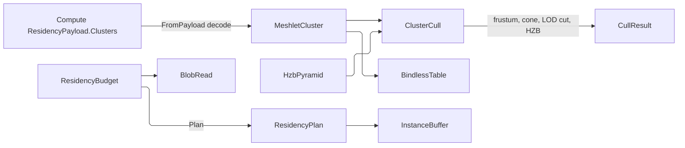

# [APPUI_RENDER_MESHLETS]

The geometry-virtualization and residency owners for the infinite viewport consume Compute's meshopt-built, cone-carrying `ResidencyMeshlet` descriptors with monotonic error columns. This page owns selection — hysteretic LOD, the cull ladder, bindless residency, predictive prefetch, and massive instancing — while Compute owns clustering. `ResidencyBudget` constrains the out-of-core scene by VRAM, the render graph draws the selected clusters, and the path tracer builds its private BVH over their decoded bounds. Compute's `meshlet-cluster` payload, the Persistence blob lane, and the shared wgpu device supply the substrate.

## [01]-[INDEX]

- [02]-[CLUSTER_CONSUMPTION]: Payload-cluster decode; the LOD selection algebra; the raised cull ladder.
- [03]-[RESIDENCY_BUDGET]: VRAM-budget residency, predictive prefetch, out-of-core streaming.

## [02]-[CLUSTER_CONSUMPTION]

- Owner: `MeshletKey` the payload-local cluster identity; `ResidencyMeshletView` the decode-only projection of one Compute `ResidencyMeshlet` descriptor; `MeshletCluster` the cluster scene over the consumed payload; `ClusterCull` the cull-ladder fold; `HzbPyramid` the prior-frame depth pyramid; `BindlessTable` the bindless resource table.
- Entry: `public static Fin<MeshletCluster> FromPayload(GpuBackend backend, ResidencyPayload payload, LodPolicy lod)` projects the payload's cluster rows and rejects a non-cluster payload kind; `public Fin<(MeshletCluster Cluster, CullResult Result)> Visible(Frustum frustum, ViewCamera camera, double lodScale, Option<HzbPyramid> hzb, double nearPlane)` executes the full ladder and returns the advanced immutable cull owner with its receipt.
- Auto: the clusters arrive Compute-built — meshopt clustering, REAL per-cluster bounds, REAL cone apex/axis/cutoff, and encoded `Error`/`ParentError` columns that are monotonic BY CONSTRUCTION (`ParentError >= Error` on the `payload.md` row — the landed encode guarantee), so cut well-formedness (crack-free, no double-draw) rides the producer guarantee and this page re-verifies nothing; the LOD SELECTION ALGEBRA is AppUi's own: the per-cluster error bound projects to screen space under the camera row, the `LodPolicy` pixel threshold picks the cut (`Projected(Error) <= threshold < Projected(ParentError)` — exactly one cluster per subtree by monotonicity), and the hysteresis band on the same policy row keeps a prior-cut cluster selected until its error crosses the threshold by the band so a dolly move never flickers the cut; the cull ladder is RAISED past cone parity per the page's infinite-viewport charter: frustum -> wire-cone backface (a cluster whose cone faces away from the eye rejects; a cutoff of -1 never rejects, so degenerate cones stay drawable) -> LOD cut -> prior-frame depth-pyramid (HZB) two-phase occlusion — draw the prior-visible set first, test the remainder against the pyramid, and a cluster fully occluded by the prior frame draws nothing; bindless resource indices resolve through `BindlessTable` so a draw names a resource by index, never a per-draw bind.
- Packages: Thinktecture.Runtime.Extensions, LanguageExt.Core, Rasm.Compute (project), Silk.NET.WebGPU
- Growth: a new LOD policy is one `LodPolicy` value; a new vertex-stream channel is one `BindlessTable` slot; a new cull phase is one ladder row; zero new surface.
- Boundary: cluster geometry decodes from Compute `ResidencyPayload`; AppUi neither clusters, re-tessellates, nor admits a second meshoptimizer owner. Tiles and clusters retain the payload `ContentKey`. One shared-device compute pass builds the farthest-depth HZB mip chain, with `QueryType.Occlusion` as the capability fallback. GPU multi-draw consumes `RenderPassEncoderMultiDrawIndexedIndirectCount`, push constants, and the pipeline's `WgpuFrameEvidence` retirement and timestamp lanes, so no meshlet-local fence, timer, or evidence owner exists. TAA motion vectors occupy one `BindlessTable` slot.

```csharp signature
public readonly record struct BoundingSphere(double X, double Y, double Z, double Radius) {
    public double SurfaceArea() => 4d * Math.PI * Radius * Radius;
}

public readonly record struct NormalCone(double X, double Y, double Z, double CosCutoff);

public readonly record struct MeshletKey(UInt128 Payload, int Level, int VertexOffset, int TriangleOffset);

// Decode-only view of one Compute ResidencyMeshlet descriptor — every column reads from the wire,
// nothing recomputes; ParentError >= Error holds by the producer's encode guarantee.
public readonly record struct ResidencyMeshletView(
    int VertexOffset,
    int VertexCount,
    int TriangleOffset,
    int TriangleCount,
    BoundingSphere Bounds,
    NormalCone Cone,
    double Error,
    double ParentError,
    int Level,
    int Parent,
    MeshletKey Key);

public sealed record LodPolicy(double PixelThreshold, double HysteresisBand, int MaxLevels) {
    public static readonly LodPolicy Default = new(PixelThreshold: 1.0, HysteresisBand: 0.25, MaxLevels: 8);
}

public readonly record struct Frustum(Seq<(double A, double B, double C, double D)> Planes) {
    public bool Intersects(BoundingSphere sphere) =>
        Planes.ForAll(plane => (plane.A * sphere.X) + (plane.B * sphere.Y) + (plane.C * sphere.Z) + plane.D >= -sphere.Radius);
}

public sealed record BindlessTable(FrozenDictionary<string, int> Slots) {
    public static BindlessTable Of(params ReadOnlySpan<string> channels) =>
        new(channels.ToArray().Select(static (channel, index) => KeyValuePair.Create(channel, index)).ToFrozenDictionary(StringComparer.Ordinal));

    public Option<int> Slot(string channel) => Slots.TryGetValue(channel, out int index) ? Some(index) : None;
}

// Prior-frame depth pyramid: mip 0 is last frame's depth, each mip the FARTHEST-depth (max) reduction of
// the level below — occlusion is conservative only against the footprint's farthest occluder, a min
// reduction over-culls; built by ONE compute pass on the shared device; Occluded samples the mip whose
// texel covers the cluster's screen extent so one sample bounds the whole footprint.
public sealed record HzbPyramid(int Width, int Height, int MipLevels, Func<int, double, double, double> SampleFarDepth) {
    public bool Occluded(BoundingSphere bounds, ViewCamera camera, double nearPlane) {
        (double sx, double sy, double radiusPx, double depth) = ScreenExtent(bounds, camera, nearPlane);
        if (depth <= nearPlane) { return false; } // camera inside or crossing the sphere: never occluded
        int mip = Math.Clamp((int)Math.Ceiling(Math.Log2(Math.Max(radiusPx * 2d, 1d))), 0, MipLevels - 1);
        return depth > SampleFarDepth(mip, sx, sy); // sphere's nearest point behind the footprint's farthest occluder: fully hidden
    }

    // Camera-row projection kernel: view-basis transform of the sphere center, conservative nearest depth,
    // and screen radius; orthographic scale derives from ViewHeight and perspective scale from vertical FOV.
    (double X, double Y, double RadiusPx, double Depth) ScreenExtent(BoundingSphere bounds, ViewCamera camera, double nearPlane) {
        CameraFrame frame = camera.Frame;
        (double fx, double fy, double fz) = Normalize(frame.Target.X - frame.Eye.X, frame.Target.Y - frame.Eye.Y, frame.Target.Z - frame.Eye.Z);
        (double rx, double ry, double rz) = Normalize(Cross(fx, fy, fz, frame.Up.X, frame.Up.Y, frame.Up.Z));
        (double ux, double uy, double uz) = Cross(rx, ry, rz, fx, fy, fz);
        (double cx, double cy, double cz) = (bounds.X - frame.Eye.X, bounds.Y - frame.Eye.Y, bounds.Z - frame.Eye.Z);
        double z = (cx * fx) + (cy * fy) + (cz * fz);
        double x = (cx * rx) + (cy * ry) + (cz * rz);
        double y = (cx * ux) + (cy * uy) + (cz * uz);
        double depth = z - bounds.Radius;
        return camera.Switch(
            state: (Owner: this, X: x, Y: y, Z: z, Depth: depth, Radius: bounds.Radius, Near: nearPlane),
            perspective: static (state, lens) => {
                double half = Math.Tan(double.DegreesToRadians(lens.FieldOfViewDeg) / 2d);
                double safeZ = Math.Max(state.Z, state.Near);
                double aspect = state.Owner.Width / (double)state.Owner.Height;
                return (
                    (((state.X / (safeZ * half * aspect)) * 0.5) + 0.5) * state.Owner.Width,
                    (0.5 - ((state.Y / (safeZ * half)) * 0.5)) * state.Owner.Height,
                    (state.Radius / safeZ) * (state.Owner.Height / (2d * half)),
                    state.Depth);
            },
            orthographic: static (state, lens) => {
                double pxPerUnit = state.Owner.Height / Math.Max(lens.ViewHeight, 1e-6);
                return (
                    (state.X * pxPerUnit) + (state.Owner.Width / 2d),
                    (state.Owner.Height / 2d) - (state.Y * pxPerUnit),
                    state.Radius * pxPerUnit,
                    state.Depth);
            });
    }

    private static (double X, double Y, double Z) Normalize(double x, double y, double z) {
        double length = Math.Max(Math.Sqrt((x * x) + (y * y) + (z * z)), 1e-12);
        return (x / length, y / length, z / length);
    }

    private static (double X, double Y, double Z) Normalize((double X, double Y, double Z) v) => Normalize(v.X, v.Y, v.Z);

    private static (double X, double Y, double Z) Cross(double ax, double ay, double az, double bx, double by, double bz) =>
        ((ay * bz) - (az * by), (az * bx) - (ax * bz), (ax * by) - (ay * bx));
}

public sealed record CullState(LanguageExt.HashSet<MeshletKey> PriorCut, LanguageExt.HashSet<MeshletKey> PriorVisible);

public sealed record CullResult(Seq<ResidencyMeshletView> Draw, Seq<ResidencyMeshletView> OcclusionRetest, CullState Next);

public static class ClusterCull {
    // The raised ladder: frustum -> wire-cone backface -> hysteresis LOD cut -> two-phase HZB occlusion.
    public static CullResult Cull(
        Seq<ResidencyMeshletView> clusters,
        Frustum frustum,
        ViewCamera camera,
        double lodScale,
        LodPolicy lod,
        CullState prior,
        Option<HzbPyramid> hzb,
        double nearPlane) {
        Seq<ResidencyMeshletView> inFrustum = clusters.Filter(cluster => frustum.Intersects(cluster.Bounds));
        Seq<ResidencyMeshletView> facing = inFrustum.Filter(cluster => cluster.Level < lod.MaxLevels && !BackfaceReject(cluster, camera));
        Seq<ResidencyMeshletView> cut = facing.Filter(cluster => InCut(cluster, camera, lodScale, lod, prior.PriorCut));
        (Seq<ResidencyMeshletView> phase1, Seq<ResidencyMeshletView> retest) =
            hzb.Match(
                Some: pyramid => (
                    cut.Filter(cluster => prior.PriorVisible.Contains(cluster.Key)),
                    cut.Filter(cluster => !prior.PriorVisible.Contains(cluster.Key) && !pyramid.Occluded(cluster.Bounds, camera, nearPlane))),
                None: () => (cut, Seq<ResidencyMeshletView>()));
        return new CullResult(
            phase1 + retest,
            retest,
            new CullState(
                toHashSet(cut.Map(static c => c.Key)),
                toHashSet((phase1 + retest).Map(static c => c.Key))));
    }

    // Wire-cone backface: reject when every triangle in the cluster faces away — the meshopt cone test
    // dot(axis, normalize(center - eye)) >= cutoff; a cutoff of -1 never rejects.
    public static bool BackfaceReject(ResidencyMeshletView cluster, ViewCamera camera) {
        CameraFrame frame = camera.Frame;
        (double dx, double dy, double dz) = (cluster.Bounds.X - frame.Eye.X, cluster.Bounds.Y - frame.Eye.Y, cluster.Bounds.Z - frame.Eye.Z);
        double length = Math.Sqrt((dx * dx) + (dy * dy) + (dz * dz));
        if (length <= cluster.Bounds.Radius) { return false; }
        double dot = ((cluster.Cone.X * dx) + (cluster.Cone.Y * dy) + (cluster.Cone.Z * dz)) / length;
        return dot >= cluster.Cone.CosCutoff && cluster.Cone.CosCutoff > -1d;
    }

    // Hysteresis LOD cut: select where Projected(Error) <= threshold < Projected(ParentError) — exactly
    // one cluster per subtree by the monotonic columns; a prior-cut member holds until its error crosses
    // the threshold by the band, so a dolly move never flickers the cut.
    public static bool InCut(ResidencyMeshletView cluster, ViewCamera camera, double lodScale, LodPolicy lod, LanguageExt.HashSet<MeshletKey> priorCut) {
        double projectedError = Projected(cluster.Error, cluster.Bounds, camera) * lodScale;
        double projectedParent = Projected(cluster.ParentError, cluster.Bounds, camera) * lodScale;
        double threshold = lod.PixelThreshold;
        double band = priorCut.Contains(cluster.Key) ? threshold * lod.HysteresisBand : 0d;
        return projectedError <= threshold + band && projectedParent > threshold - band;
    }

    private static double Projected(double error, BoundingSphere bounds, ViewCamera camera) {
        CameraFrame frame = camera.Frame;
        (double dx, double dy, double dz) = (bounds.X - frame.Eye.X, bounds.Y - frame.Eye.Y, bounds.Z - frame.Eye.Z);
        double distance = Math.Max(Math.Sqrt((dx * dx) + (dy * dy) + (dz * dz)) - bounds.Radius, 1e-6);
        return error / distance; // pinhole small-angle projection; the viewport scale folds through lodScale
    }
}

public sealed record MeshletCluster(
    GpuBackend Backend,
    Seq<ResidencyMeshletView> Clusters,
    LodPolicy Lod,
    BindlessTable Bindless,
    long Triangles,
    CullState State) {
    public static Fin<MeshletCluster> FromPayload(GpuBackend backend, ResidencyPayload payload, LodPolicy lod) =>
        payload.Kind == ResidencyKind.MeshletCluster
            ? Fin.Succ(new MeshletCluster(
                backend,
                payload.Clusters.Map(static row => new ResidencyMeshletView(
                    row.VertexOffset, row.VertexCount, row.TriangleOffset, row.TriangleCount,
                    new BoundingSphere(row.Center.X, row.Center.Y, row.Center.Z, row.Radius),
                    new NormalCone(row.ConeAxis.X, row.ConeAxis.Y, row.ConeAxis.Z, row.ConeCutoff),
                    row.Error, row.ParentError, row.Level, row.Parent,
                    new MeshletKey(payload.ContentKey, row.Level, row.VertexOffset, row.TriangleOffset))),
                lod,
                BindlessTable.Of("position", "normal", "uv", "color", "motion-vector"),
                payload.Clusters.Sum(static row => (long)row.TriangleCount),
                new CullState([], [])))
            : Fin.Fail<MeshletCluster>(new ViewportFault.Text($"meshlets/payload-kind: {payload.Kind} is not meshlet-cluster"));

    public Fin<(MeshletCluster Cluster, CullResult Result)> Visible(Frustum frustum, ViewCamera camera, double lodScale, Option<HzbPyramid> hzb, double nearPlane) =>
        ClusterCull.Cull(Clusters, frustum, camera, lodScale, Lod, State, hzb, nearPlane) switch {
            CullResult result => Fin.Succ((this with { State = result.Next }, result)),
        };
}
```

## [03]-[RESIDENCY_BUDGET]

- Owner: `ResidencyTile` the streamable geometry page; `ResidencyBudget` the VRAM-budget residency manager; `Prefetch` the predictive prefetch fold; `InstanceBuffer` the massive-instancing draw row.
- Entry: `public Fin<ResidencyPlan> Plan(Frustum frustum, (double X, double Y, double Z) camera, (double X, double Y, double Z) velocity, long vramBytes, long frame, ResidencyPlan prior)` — one state transition per frame: the prior plan IS the resident-set state, and the next plan accounts for every resident, visible, evicted, and prefetched tile in one fold; the resident-plus-prefetch byte total never exceeds `vramBytes`.
- Auto: residency keys each tile by the payload's own `ContentKey` and tracks its byte cost and last-touch frame; the transition touches every frustum-visible tile at `frame`, carries the prior plan's out-of-frustum residents forward at their old touch, admits the union in touch-recency order under the byte budget (visible tiles admit first by construction because their touch is current), and EVICTS every tile that was resident in the prior plan and is not resident in the next — a tile that left the frustum either survives as a carried resident or lands in `Evict`, so no resident tile can persist outside the reported residency state; prefetch admits the velocity-reachable non-resident tiles greedily into the remaining byte headroom only, its bytes carried on `PrefetchBytes`, so the budget governs resident and prefetch admissions from one derivable total; instanced geometry collapses into one `InstanceBuffer` per mesh key carrying the per-instance transform run so a forest of repeated objects is one draw call, never N draws.
- Packages: Thinktecture.Runtime.Extensions, LanguageExt.Core, NodaTime, Rasm.Persistence (project)
- Growth: a new residency policy is one watermark value; a new instance channel is one `InstanceBuffer` column; zero new surface.
- Boundary: frame budget is the invariant the plan enforces — a plan that overruns the VRAM budget evicts before it admits, and every accepted plan threads `ResidencyBudget.Observe` over the composition cells so the evict and prefetch level gauges read the live plan, out-of-core budget-bounded by construction; tile bytes stream from the Persistence blob lane as opaque versioned payloads through the blob-read delegate so the residency manager never opens files; the predictive prefetch is a pure velocity-extrapolation fold and a background IO thread is the rejected form — prefetch issues blob-read requests the caller's IO scheduler drains; the GPU upload of a resident tile to a bindless slot rides the `Render/pipeline` render-graph lease under VIEWPORT_GPU; the residency manifest the web leg consumes projects through the `Render/pipeline` `ResidencyManifest.Mint` off the resident set, so the residency owner mints no second wire; the watermark scales by the `Diagnostics/governor.md` `QualityVerdict.WatermarkFactor` — one quality authority.

```csharp signature
public readonly record struct ResidencyTile(UInt128 ContentKey, long Bytes, BoundingSphere Bounds, long LastTouch);

public sealed record InstanceBuffer(string MeshKey, Seq<(double M11, double M12, double M13, double M14, double M21, double M22, double M23, double M24, double M31, double M32, double M33, double M34)> Transforms) {
    public int Count => Transforms.Count;
}

// The plan IS the cross-frame residency state: Boot seeds it, every frame folds it forward, and the
// resident/evict/prefetch sets plus both byte totals are recoverable from the value alone.
public sealed record PrefetchRequest(UInt128 ContentKey, long Bytes, IO<ReadOnlyMemory<byte>> Read);

public sealed record ResidencyPlan(Seq<ResidencyTile> Resident, Seq<UInt128> Evict, Seq<PrefetchRequest> Prefetch, long ResidentBytes, long PrefetchBytes, long Frame) {
    public static readonly ResidencyPlan Boot = new(Seq<ResidencyTile>(), Seq<UInt128>(), Seq<PrefetchRequest>(), 0L, 0L, 0L);
}

public sealed record ResidencyBudget(
    HashMap<UInt128, ResidencyTile> Tiles,
    Func<UInt128, IO<ReadOnlyMemory<byte>>> BlobRead,
    long Watermark,
    double PrefetchHorizon) {
    // The effective budget is min(vramBytes, Watermark): the governor-scaled watermark is a CONSUMED bound
    // on every admission and prefetch headroom, never a decorative field beside the plan.
    public Fin<ResidencyPlan> Plan(Frustum frustum, (double X, double Y, double Z) camera, (double X, double Y, double Z) velocity, long vramBytes, long frame, ResidencyPlan prior) =>
        from budget in FinSucc(Math.Min(vramBytes, Watermark))
        let candidates = Candidates(frustum, frame, prior)
        let admitted = Admit(candidates, budget)
        let kept = toHashSet(admitted.Kept.Map(static tile => tile.ContentKey))
        let prefetch = PrefetchSet(camera, velocity, kept, budget - admitted.Bytes)
        select new ResidencyPlan(
            Resident: admitted.Kept,
            Evict: prior.Resident.Map(static tile => tile.ContentKey).Filter(key => !kept.Contains(key)),
            Prefetch: prefetch.Requests,
            ResidentBytes: admitted.Bytes,
            PrefetchBytes: prefetch.Bytes,
            Frame: frame);

    // Candidate set = visible tiles touched NOW + prior residents carried at their old touch; one union,
    // deduped by content key with the fresh touch winning.
    private Seq<ResidencyTile> Candidates(Frustum frustum, long frame, ResidencyPlan prior) =>
        toSeq(toSeq(Tiles.Values)
            .Filter(tile => frustum.Intersects(tile.Bounds))
            .Map(tile => tile with { LastTouch = frame })
            .Concat(prior.Resident)
            .Fold(HashMap<UInt128, ResidencyTile>(), static (held, tile) => held.Find(tile.ContentKey).IsSome ? held : held.Add(tile.ContentKey, tile))
            .Values);

    private static (Seq<ResidencyTile> Kept, long Bytes) Admit(Seq<ResidencyTile> candidates, long vramBytes) =>
        candidates.OrderByDescending(static tile => tile.LastTouch).ToSeq()
            .Fold(
                (Kept: Seq<ResidencyTile>(), Bytes: 0L),
                (state, tile) => state.Bytes + tile.Bytes <= vramBytes
                    ? (state.Kept.Add(tile), state.Bytes + tile.Bytes)
                    : state);

    // Prefetch is budget-bounded: velocity-reachable non-resident tiles admit greedily into the byte
    // headroom the resident admission left; an unbudgeted prefetch cannot type its way onto the plan.
    private (Seq<PrefetchRequest> Requests, long Bytes) PrefetchSet(
        (double X, double Y, double Z) camera,
        (double X, double Y, double Z) velocity,
        LanguageExt.HashSet<UInt128> resident,
        long headroom) =>
        toSeq(Tiles.Values)
            .Filter(tile => !resident.Contains(tile.ContentKey) && Reaches(camera, velocity, tile.Bounds))
            .Fold(
                (Requests: Seq<PrefetchRequest>(), Bytes: 0L),
                (state, tile) => state.Bytes + tile.Bytes <= headroom
                    ? (state.Requests.Add(new PrefetchRequest(tile.ContentKey, tile.Bytes, BlobRead(tile.ContentKey))), state.Bytes + tile.Bytes)
                    : state);

    private bool Reaches((double X, double Y, double Z) camera, (double X, double Y, double Z) velocity, BoundingSphere bounds) =>
        (Predict(camera, velocity) switch {
            var ahead => Math.Sqrt(Math.Pow(ahead.X - bounds.X, 2) + Math.Pow(ahead.Y - bounds.Y, 2) + Math.Pow(ahead.Z - bounds.Z, 2)),
        }) <= bounds.Radius + PrefetchHorizon;

    private (double X, double Y, double Z) Predict((double X, double Y, double Z) camera, (double X, double Y, double Z) velocity) =>
        (camera.X + (velocity.X * PrefetchHorizon), camera.Y + (velocity.Y * PrefetchHorizon), camera.Z + (velocity.Z * PrefetchHorizon));

    public const string EvictInstrument = "rasm.appui.viewport.residency.evict";
    public const string PrefetchInstrument = "rasm.appui.viewport.residency.prefetch";
    public const string PoolInstrument = "rasm.appui.viewport.residency.pool";

    public static TelemetryContributorPort TelemetryRow(LevelCells cells, string version, string schemaUrl) =>
        AppUiTelemetry.Contribute(version, schemaUrl,
            new(EvictInstrument, InstrumentKind.Level, "{page}", "tiles the current plan marked for eviction",
                Level: cells.Reader(EvictInstrument)),
            new(PrefetchInstrument, InstrumentKind.Level, "{page}", "tiles the current plan queued for prefetch",
                Level: cells.Reader(PrefetchInstrument)),
            new(PoolInstrument, InstrumentKind.Levels, "By", "planned VRAM bytes by residency pool",
                Levels: cells.Reader(PoolInstrument, "pool")));

    // Levels beside their writer: the caller threads every accepted plan through Observe, so the residency
    // gauges — evict, prefetch, and the per-pool byte levels — read the live plan at collection cadence.
    public static ResidencyPlan Observe(LevelCells cells, ResidencyPlan plan) =>
        (cells.Level(EvictInstrument, plan.Evict.Count),
         cells.Level(PrefetchInstrument, plan.Prefetch.Count),
         cells.Level(PoolInstrument, "resident", plan.ResidentBytes),
         cells.Level(PoolInstrument, "prefetch", plan.PrefetchBytes), plan).Item5;
}
```



## [04]-[GPU_BOUNDARY]

- [VIEWPORT_GPU]: the shared-device lease owns bindless upload, the HZB farthest-depth reduction, `RenderPassEncoderMultiDrawIndexedIndirectCount`, and `RenderPassEncoderSetPushConstants`. Submission and timing compose the pipeline `WgpuFrameEvidence` lane, so meshlet selection owns no fence, timer, query set, or device lifetime.
- [PAYLOAD_COLUMNS]: `ResidencyMeshlet` supplies `VertexOffset`, `TriangleOffset`, `VertexCount`, `TriangleCount`, `Center`, `Radius`, `ConeAxis`, `ConeCutoff`, `Level`, `Parent`, `Error`, and `ParentError`. `MeshletKey` composes `ResidencyPayload.ContentKey` with level and stream offsets, and hierarchy, hysteresis, residency, and wire projection consume that producer identity unchanged.

## [05]-[RESEARCH]

(none)
