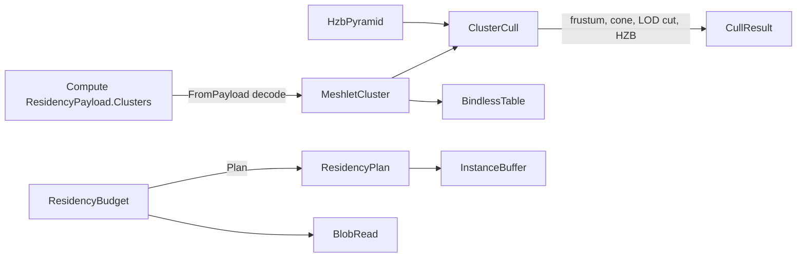

# [APPUI_RENDER_MESHLETS]

The geometry-virtualization and residency owners for the infinite viewport: the cluster plane CONSUMES Compute — `ResidencyPayload.Clusters` delivers the meshopt-built, cone-carrying `ResidencyMeshlet` descriptors with monotonic error columns, and this page owns only the SELECTION algebra (LOD cut with hysteresis, the raised cull ladder) plus the bindless residency the draw rides — local clustering is DEAD (`[V5]`); `ResidencyBudget` keeps an out-of-core scene inside a VRAM budget through predictive prefetch and massive instancing. The page owns the payload-cluster decode view, the cull ladder (frustum -> wire-cone backface -> hysteresis LOD cut -> prior-frame HZB two-phase occlusion), the bindless resource table, the VRAM-budget residency manager, the predictive prefetch fold, and the instance-buffer draw row; the render-graph pass-DAG that draws the cluster lives in `Render/pipeline`, the path-trace integrator that builds its private BVH over the wire-decoded cluster bounds in `Render/pathtrace`. The substrate is the Compute `Runtime/payload.md` `meshlet-cluster` row (a settled contract naming AppUi the demanding consumer), the Persistence blob lane for out-of-core tile streaming, and the shared wgpu device bound through the render-graph lease.

## [01]-[INDEX]

- [02]-[CLUSTER_CONSUMPTION]: Payload-cluster decode; the LOD selection algebra; the raised cull ladder.
- [03]-[RESIDENCY_BUDGET]: VRAM-budget residency, predictive prefetch, out-of-core streaming.

## [02]-[CLUSTER_CONSUMPTION]

- Owner: `ResidencyMeshletView` the decode-only projection of one Compute `ResidencyMeshlet` descriptor; `MeshletCluster` the cluster scene over the consumed payload; `ClusterCull` the cull-ladder fold; `HzbPyramid` the prior-frame depth pyramid; `BindlessTable` the bindless resource table.
- Entry: `public static Fin<MeshletCluster> FromPayload(GpuBackend backend, ResidencyPayload payload, LodPolicy lod)` — decodes the payload's cluster rows (rejecting a non-cluster payload kind); `public Fin<CullResult> Visible(Frustum frustum, ViewCamera camera, double lodScale, CullState prior, Option<HzbPyramid> hzb)` — the full ladder per frame.
- Auto: the clusters arrive Compute-built — meshopt clustering, REAL per-cluster bounds, REAL cone apex/axis/cutoff, and encoded `Error`/`ParentError` columns that are monotonic BY CONSTRUCTION (`ParentError >= Error` on the `payload.md` row — the landed encode guarantee), so cut well-formedness (crack-free, no double-draw) rides the producer guarantee and this page re-verifies nothing; the LOD SELECTION ALGEBRA is AppUi's own: the per-cluster error bound projects to screen space under the camera row, the `LodPolicy` pixel threshold picks the cut (`Projected(Error) <= threshold < Projected(ParentError)` — exactly one cluster per subtree by monotonicity), and the hysteresis band on the same policy row keeps a prior-cut cluster selected until its error crosses the threshold by the band so a dolly move never flickers the cut; the cull ladder is RAISED past cone parity per the page's infinite-viewport charter: frustum -> wire-cone backface (a cluster whose cone faces away from the eye rejects; a cutoff of -1 never rejects, so degenerate cones stay drawable) -> LOD cut -> prior-frame depth-pyramid (HZB) two-phase occlusion — draw the prior-visible set first, test the remainder against the pyramid, and a cluster fully occluded by the prior frame draws nothing; bindless resource indices resolve through `BindlessTable` so a draw names a resource by index, never a per-draw bind.
- Packages: Thinktecture.Runtime.Extensions, LanguageExt.Core, Rasm.Compute (project), Silk.NET.WebGPU
- Growth: a new LOD policy is one `LodPolicy` value; a new vertex-stream channel is one `BindlessTable` slot; a new cull phase is one ladder row; zero new surface.
- Boundary: cluster geometry is DECODE-ONLY consumption of the Compute `ResidencyPayload` — local `Build`/`Partition`, a `MeshSource` re-projection, a re-tessellation, or a `meshoptimizer` AppUi admission is the DELETED form (Compute owns clustering; the recorded roster REJECT stands); tiles and clusters key by the payload's own `ContentKey` per the single-mint law; the HZB pyramid build is ONE compute pass over the shared device (`CommandEncoderBeginComputePass`/`ComputePassEncoder`/`DispatchWorkgroups` — a mip-chain farthest-depth reduction), and `QueryType.Occlusion` is the fallback probe row where the pyramid lane is unavailable; the mesh-shader draw path is the GPU surface bound through the `Render/pipeline` render-graph lease, and the GPU-driven multi-draw rides the WGPU vendor rows (`RenderPassEncoderMultiDrawIndexedIndirect`) under the VIEWPORT_GPU spike; the `Render/pipeline` `Taa` motion-vector buffer is one `BindlessTable` slot here, never a parallel motion-vector owner; this crossing is a declared `[V9]` ledger row (`Render/meshlets` <- Compute `Runtime/payload.md` clusters).

```csharp signature
public readonly record struct BoundingSphere(double X, double Y, double Z, double Radius) {
    public double SurfaceArea() => 4d * Math.PI * Radius * Radius;
}

public readonly record struct NormalCone(double X, double Y, double Z, double CosCutoff);

// Decode-only view of one Compute ResidencyMeshlet descriptor — every column reads from the wire,
// nothing recomputes; ParentError >= Error holds by the producer's encode guarantee.
public readonly record struct ResidencyMeshletView(
    int VertexOffset,
    int VertexCount,
    int TriangleOffset,
    int TriangleCount,
    BoundingSphere Bounds,
    NormalCone Cone,
    double Error,
    double ParentError,
    UInt128 ContentKey);

public sealed record LodPolicy(double PixelThreshold, double HysteresisBand, int MaxLevels) {
    public static readonly LodPolicy Default = new(PixelThreshold: 1.0, HysteresisBand: 0.25, MaxLevels: 8);
}

public readonly record struct Frustum(Seq<(double A, double B, double C, double D)> Planes) {
    public bool Intersects(BoundingSphere sphere) =>
        Planes.ForAll(plane => (plane.A * sphere.X) + (plane.B * sphere.Y) + (plane.C * sphere.Z) + plane.D >= -sphere.Radius);
}

public sealed record BindlessTable(FrozenDictionary<string, int> Slots) {
    public static BindlessTable Of(params ReadOnlySpan<string> channels) =>
        new(channels.ToArray().Select(static (channel, index) => KeyValuePair.Create(channel, index)).ToFrozenDictionary(StringComparer.Ordinal));

    public Option<int> Slot(string channel) => Slots.TryGetValue(channel, out var index) ? Some(index) : None;
}

// Prior-frame depth pyramid: mip 0 is last frame's depth, each mip the FARTHEST-depth (max) reduction of
// the level below — occlusion is conservative only against the footprint's farthest occluder, a min
// reduction over-culls; built by ONE compute pass on the shared device; Occluded samples the mip whose
// texel covers the cluster's screen extent so one sample bounds the whole footprint.
public sealed record HzbPyramid(int Width, int Height, int MipLevels, Func<int, double, double, double> SampleFarDepth) {
    public bool Occluded(BoundingSphere bounds, ViewCamera camera, double nearPlane) {
        (double sx, double sy, double radiusPx, double depth) = ScreenExtent(bounds, camera, nearPlane);
        if (depth <= nearPlane) { return false; } // camera inside or crossing the sphere: never occluded
        int mip = Math.Clamp((int)Math.Ceiling(Math.Log2(Math.Max(radiusPx * 2d, 1d))), 0, MipLevels - 1);
        return depth > SampleFarDepth(mip, sx, sy); // sphere's nearest point behind the footprint's farthest occluder: fully hidden
    }

    // Camera-row projection kernel: view-basis transform of the sphere center, CONSERVATIVE depth (the
    // sphere's closest point, tested against the farthest-depth pyramid) and screen radius; the ortho arm
    // scales by OrthoScale px-per-unit directly, the perspective arm by the vertical field of view.
    (double X, double Y, double RadiusPx, double Depth) ScreenExtent(BoundingSphere bounds, ViewCamera camera, double nearPlane) {
        (double fx, double fy, double fz) = Normalize(camera.TargetX - camera.EyeX, camera.TargetY - camera.EyeY, camera.TargetZ - camera.EyeZ);
        (double rx, double ry, double rz) = Normalize(Cross(fx, fy, fz, camera.UpX, camera.UpY, camera.UpZ));
        (double ux, double uy, double uz) = Cross(rx, ry, rz, fx, fy, fz);
        (double cx, double cy, double cz) = (bounds.X - camera.EyeX, bounds.Y - camera.EyeY, bounds.Z - camera.EyeZ);
        double z = (cx * fx) + (cy * fy) + (cz * fz);
        double x = (cx * rx) + (cy * ry) + (cz * rz);
        double y = (cx * ux) + (cy * uy) + (cz * uz);
        double depth = z - bounds.Radius;
        if (!camera.Perspective) {
            double pxPerUnit = Height / Math.Max(camera.OrthoScale, 1e-6);
            return ((x * pxPerUnit) + (Width / 2d), (Height / 2d) - (y * pxPerUnit), bounds.Radius * pxPerUnit, depth);
        }
        double half = Math.Tan(double.DegreesToRadians(camera.FieldOfView) / 2d);
        double safeZ = Math.Max(z, nearPlane);
        double aspect = Width / (double)Height;
        double sx = (((x / (safeZ * half * aspect)) * 0.5) + 0.5) * Width;
        double sy = (0.5 - ((y / (safeZ * half)) * 0.5)) * Height;
        return (sx, sy, (bounds.Radius / safeZ) * (Height / (2d * half)), depth);
    }

    static (double X, double Y, double Z) Normalize(double x, double y, double z) {
        double length = Math.Max(Math.Sqrt((x * x) + (y * y) + (z * z)), 1e-12);
        return (x / length, y / length, z / length);
    }

    static (double X, double Y, double Z) Normalize((double X, double Y, double Z) v) => Normalize(v.X, v.Y, v.Z);

    static (double X, double Y, double Z) Cross(double ax, double ay, double az, double bx, double by, double bz) =>
        ((ay * bz) - (az * by), (az * bx) - (ax * bz), (ax * by) - (ay * bx));
}

public sealed record CullState(LanguageExt.HashSet<UInt128> PriorCut, LanguageExt.HashSet<UInt128> PriorVisible);

public sealed record CullResult(Seq<ResidencyMeshletView> Draw, Seq<ResidencyMeshletView> OcclusionRetest, CullState Next);

public static class ClusterCull {
    // The raised ladder: frustum -> wire-cone backface -> hysteresis LOD cut -> two-phase HZB occlusion.
    public static CullResult Cull(
        Seq<ResidencyMeshletView> clusters,
        Frustum frustum,
        ViewCamera camera,
        double lodScale,
        LodPolicy lod,
        CullState prior,
        Option<HzbPyramid> hzb,
        double nearPlane) {
        Seq<ResidencyMeshletView> inFrustum = clusters.Filter(cluster => frustum.Intersects(cluster.Bounds));
        Seq<ResidencyMeshletView> facing = inFrustum.Filter(cluster => !BackfaceReject(cluster, camera));
        Seq<ResidencyMeshletView> cut = facing.Filter(cluster => InCut(cluster, camera, lodScale, lod, prior.PriorCut));
        (Seq<ResidencyMeshletView> phase1, Seq<ResidencyMeshletView> retest) =
            hzb.Match(
                Some: pyramid => (
                    cut.Filter(cluster => prior.PriorVisible.Contains(cluster.ContentKey)),
                    cut.Filter(cluster => !prior.PriorVisible.Contains(cluster.ContentKey) && !pyramid.Occluded(cluster.Bounds, camera, nearPlane))),
                None: () => (cut, Seq<ResidencyMeshletView>()));
        return new CullResult(
            phase1 + retest,
            retest,
            new CullState(
                toHashSet(cut.Map(static c => c.ContentKey)),
                toHashSet((phase1 + retest).Map(static c => c.ContentKey))));
    }

    // Wire-cone backface: reject when every triangle in the cluster faces away — the meshopt cone test
    // dot(axis, normalize(center - eye)) >= cutoff; a cutoff of -1 never rejects.
    public static bool BackfaceReject(ResidencyMeshletView cluster, ViewCamera camera) {
        (double dx, double dy, double dz) = (cluster.Bounds.X - camera.EyeX, cluster.Bounds.Y - camera.EyeY, cluster.Bounds.Z - camera.EyeZ);
        double length = Math.Sqrt((dx * dx) + (dy * dy) + (dz * dz));
        if (length <= cluster.Bounds.Radius) { return false; }
        double dot = ((cluster.Cone.X * dx) + (cluster.Cone.Y * dy) + (cluster.Cone.Z * dz)) / length;
        return dot >= cluster.Cone.CosCutoff && cluster.Cone.CosCutoff > -1d;
    }

    // Hysteresis LOD cut: select where Projected(Error) <= threshold < Projected(ParentError) — exactly
    // one cluster per subtree by the monotonic columns; a prior-cut member holds until its error crosses
    // the threshold by the band, so a dolly move never flickers the cut.
    public static bool InCut(ResidencyMeshletView cluster, ViewCamera camera, double lodScale, LodPolicy lod, LanguageExt.HashSet<UInt128> priorCut) {
        double projectedError = Projected(cluster.Error, cluster.Bounds, camera) * lodScale;
        double projectedParent = Projected(cluster.ParentError, cluster.Bounds, camera) * lodScale;
        double threshold = lod.PixelThreshold;
        double band = priorCut.Contains(cluster.ContentKey) ? threshold * lod.HysteresisBand : 0d;
        return projectedError <= threshold + band && projectedParent > threshold - band;
    }

    static double Projected(double error, BoundingSphere bounds, ViewCamera camera) {
        (double dx, double dy, double dz) = (bounds.X - camera.EyeX, bounds.Y - camera.EyeY, bounds.Z - camera.EyeZ);
        double distance = Math.Max(Math.Sqrt((dx * dx) + (dy * dy) + (dz * dz)) - bounds.Radius, 1e-6);
        return error / distance; // pinhole small-angle projection; the viewport scale folds through lodScale
    }
}

public sealed record MeshletCluster(
    GpuBackend Backend,
    Seq<ResidencyMeshletView> Clusters,
    LodPolicy Lod,
    BindlessTable Bindless,
    long Triangles,
    CullState State) {
    public static Fin<MeshletCluster> FromPayload(GpuBackend backend, ResidencyPayload payload, LodPolicy lod) =>
        payload.Kind == ResidencyKind.MeshletCluster
            ? Fin.Succ(new MeshletCluster(
                backend,
                payload.Clusters.Map(static row => new ResidencyMeshletView(
                    row.VertexOffset, row.VertexCount, row.TriangleOffset, row.TriangleCount,
                    new BoundingSphere(row.BoundsX, row.BoundsY, row.BoundsZ, row.BoundsRadius),
                    new NormalCone(row.ConeAxisX, row.ConeAxisY, row.ConeAxisZ, row.ConeCutoff),
                    row.Error, row.ParentError, row.ContentKey)),
                lod,
                BindlessTable.Of("position", "normal", "uv", "color", "motion-vector"),
                payload.Clusters.Sum(static row => (long)row.TriangleCount),
                new CullState([], [])))
            : Fin.Fail<MeshletCluster>(new ViewportFault.Text($"meshlets/payload-kind: {payload.Kind} is not meshlet-cluster"));

    public Fin<CullResult> Visible(Frustum frustum, ViewCamera camera, double lodScale, Option<HzbPyramid> hzb, double nearPlane) =>
        Fin.Succ(ClusterCull.Cull(Clusters, frustum, camera, lodScale, Lod, State, hzb, nearPlane));
}
```

## [03]-[RESIDENCY_BUDGET]

- Owner: `ResidencyTile` the streamable geometry page; `ResidencyBudget` the VRAM-budget residency manager; `Prefetch` the predictive prefetch fold; `InstanceBuffer` the massive-instancing draw row.
- Entry: `public Fin<ResidencyPlan> Plan(Frustum frustum, (double X, double Y, double Z) camera, (double X, double Y, double Z) velocity, long vramBytes)` — folds the resident, evict, and prefetch sets against the VRAM budget; the plan never exceeds `vramBytes`.
- Auto: residency keys each tile by the payload's own `ContentKey` and tracks its byte cost and last-touch frame; the plan keeps the frustum-visible tiles resident, evicts the least-recently-touched tiles when the budget is exceeded (the LRU watermark), and prefetches the tiles the camera velocity will reach within the prefetch horizon so a panning camera streams the next cells before they enter the frustum; instanced geometry collapses into one `InstanceBuffer` per mesh key carrying the per-instance transform run so a forest of repeated objects is one draw call, never N draws.
- Packages: Thinktecture.Runtime.Extensions, LanguageExt.Core, NodaTime, Rasm.Persistence (project)
- Growth: a new residency policy is one watermark value; a new instance channel is one `InstanceBuffer` column; zero new surface.
- Boundary: frame budget is the invariant the plan enforces — a plan that overruns the VRAM budget evicts before it admits and the eviction folds onto the residency-evict instrument, so out-of-core is budget-bounded by construction and an unbounded resident set is structurally impossible; tile bytes stream from the Persistence blob lane as opaque versioned payloads through the blob-read delegate so the residency manager never opens files; the predictive prefetch is a pure velocity-extrapolation fold and a background IO thread is the rejected form — prefetch issues blob-read requests the caller's IO scheduler drains; the GPU upload of a resident tile to a bindless slot rides the `Render/pipeline` render-graph lease under VIEWPORT_GPU; the residency manifest the web leg consumes projects through the `Render/pipeline` `ResidencyManifest.Mint` off the resident set, so the residency owner mints no second wire; the watermark scales by the `Diagnostics/governor.md` `QualityVerdict.WatermarkFactor` — one quality authority.

```csharp signature
public readonly record struct ResidencyTile(UInt128 ContentKey, long Bytes, BoundingSphere Bounds, long LastTouch);

public sealed record InstanceBuffer(string MeshKey, Seq<(double M11, double M12, double M13, double M14, double M21, double M22, double M23, double M24, double M31, double M32, double M33, double M34)> Transforms) {
    public int Count => Transforms.Count;
}

public sealed record ResidencyPlan(Seq<ResidencyTile> Resident, Seq<UInt128> Evict, Seq<UInt128> Prefetch, long ResidentBytes);

public sealed record ResidencyBudget(
    HashMap<UInt128, ResidencyTile> Tiles,
    Func<UInt128, IO<ReadOnlyMemory<byte>>> BlobRead,
    long Watermark,
    double PrefetchHorizon) {
    public Fin<ResidencyPlan> Plan(Frustum frustum, (double X, double Y, double Z) camera, (double X, double Y, double Z) velocity, long vramBytes) =>
        toSeq(Tiles.Values).Filter(tile => frustum.Intersects(tile.Bounds)) switch {
            var visible => Admit(visible, vramBytes) switch {
                var admitted => Fin.Succ(new ResidencyPlan(
                    Resident: admitted.Kept,
                    Evict: admitted.Evicted.Map(static tile => tile.ContentKey),
                    Prefetch: PrefetchSet(camera, velocity),
                    ResidentBytes: admitted.Kept.Sum(static tile => tile.Bytes))),
            },
        };

    private static (Seq<ResidencyTile> Kept, Seq<ResidencyTile> Evicted) Admit(Seq<ResidencyTile> visible, long vramBytes) =>
        visible.OrderByDescending(static tile => tile.LastTouch).ToSeq()
            .Fold(
                (Kept: Seq<ResidencyTile>(), Evicted: Seq<ResidencyTile>(), Bytes: 0L),
                (state, tile) => state.Bytes + tile.Bytes <= vramBytes
                    ? (state.Kept.Add(tile), state.Evicted, state.Bytes + tile.Bytes)
                    : (state.Kept, state.Evicted.Add(tile), state.Bytes))
            switch { var folded => (folded.Kept, folded.Evicted) };

    private Seq<UInt128> PrefetchSet((double X, double Y, double Z) camera, (double X, double Y, double Z) velocity) =>
        toSeq(Tiles.Values)
            .Filter(tile => Reaches(camera, velocity, tile.Bounds))
            .Map(static tile => tile.ContentKey);

    private bool Reaches((double X, double Y, double Z) camera, (double X, double Y, double Z) velocity, BoundingSphere bounds) =>
        (Predict(camera, velocity) switch {
            var ahead => Math.Sqrt(Math.Pow(ahead.X - bounds.X, 2) + Math.Pow(ahead.Y - bounds.Y, 2) + Math.Pow(ahead.Z - bounds.Z, 2)),
        }) <= bounds.Radius + PrefetchHorizon;

    private (double X, double Y, double Z) Predict((double X, double Y, double Z) camera, (double X, double Y, double Z) velocity) =>
        (camera.X + (velocity.X * PrefetchHorizon), camera.Y + (velocity.Y * PrefetchHorizon), camera.Z + (velocity.Z * PrefetchHorizon));

    public const string EvictInstrument = "rasm.appui.viewport.residency-evict";
    public const string PrefetchInstrument = "rasm.appui.viewport.residency-prefetch";

    public static TelemetryContributorPort TelemetryRow(string version) =>
        AppUiTelemetry.Contribute(version, EvictInstrument, PrefetchInstrument);
}
```



## [04]-[RESEARCH]

- [VIEWPORT_GPU]: the mesh-shader emit path, the per-backend bindless descriptor-table spelling (Metal argument buffers, Vulkan descriptor indexing), the GPU upload of a resident tile to a bindless slot, and the HZB compute-shader body resolve under the shared-device lease — the cluster decode, the cull ladder (frustum, wire cones, hysteresis LOD cut, HZB structure), the residency plan, the prefetch fold, and the instance buffer are settled; the GPU-driven multi-draw and the pyramid-build shader are the unverified surface gated on the live device the `Render/pipeline` lease binds.
- [PAYLOAD_COLUMNS]: the exact `ResidencyMeshlet` column spellings (`ConeAxisX`/`ConeCutoff`/`Error`/`ParentError`/`ContentKey`) transcribe against the landed Compute `Runtime/payload.md` `meshlet-cluster` row at implementation; the decode-view shape, the monotonic-error consumption, and the payload-key identity are settled contract.
