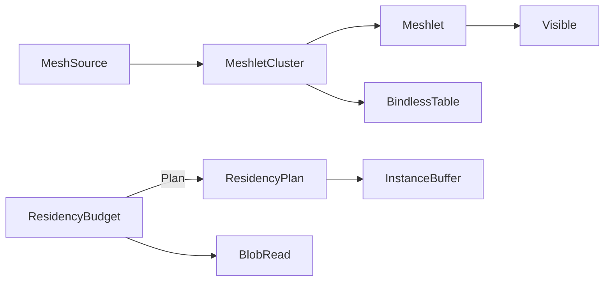

# [APPUI_RENDER_MESHLETS]

The geometry-virtualization and residency owners for the infinite viewport: `MeshletCluster` virtualizes geometry into GPU-driven cluster-LOD with bindless residency, and `ResidencyBudget` keeps an out-of-core scene inside a VRAM budget through predictive prefetch and massive instancing. The page owns the meshlet cluster-LOD build, the GPU-driven cull, the bindless resource table, the VRAM-budget residency manager, the predictive prefetch fold, and the instance-buffer draw row; the render-graph pass-DAG that draws the cluster lives in `Render/pipeline`, the path-trace integrator that builds its BVH over the meshlet bounds in `Render/pathtrace`. The substrate is the canonical Compute `GeometryPayload` proto (projected through the `MeshSource` boundary record), the Persistence blob lane for out-of-core tile streaming, and the SkiaSharp/wgpu GPU surface bound through the render-graph lease. The CPU meshlet build, screen-space-error cull, and blob-backed residency plan ship today for the 2D-fallback wireframe; the GPU mesh-shader draw and bindless upload are the SPIKE.

## [01]-[INDEX]

- [01]-[GEOMETRY_VIRTUAL]: Meshlet cluster-LOD, GPU-driven culling, bindless residency, instancing.
- [02]-[RESIDENCY_BUDGET]: VRAM-budget residency, predictive prefetch, out-of-core streaming.

## [02]-[GEOMETRY_VIRTUAL]

- Owner: `Meshlet` cluster vertex-and-index run; `MeshletCluster` the GPU-driven cluster-LOD scene; `ClusterCull` the GPU-culling fold; `BindlessTable` the bindless resource table.
- Entry: `public Fin<int> Visible(RenderTarget target, Frustum frustum, double lodScale)` — the GPU-driven cull selects the visible meshlet set and the cluster LOD per the screen-space error bound; `public static MeshletCluster Build(GpuBackend backend, Seq<MeshSource> meshes, int meshletVertices, int meshletTriangles, LodPolicy lod)` — clusters the projected mesh sources into meshlets.
- Auto: `MeshSource` is the AppUi-side projection off the canonical Compute `GeometryPayload` proto oneof — the tessellated vertex and index run plus its bounds — crossing the settled interchange wire boundary exactly as the geo overlay projects `GeometryPayload` to land records, so the page never re-models a mesh and never re-tessellates; `Build` partitions each `MeshSource` into meshlets capped at the per-meshlet vertex and triangle counts (the mesh-shader workgroup bound), computes each meshlet's bounding sphere and normal cone for cull, and folds the cluster-LOD tree bottom-up by edge-collapse simplification so a parent meshlet halves its child triangle count; `Visible` runs the frustum-and-normal-cone reject per meshlet against the screen-space-error LOD bound so the GPU draws only the meshlets whose projected error exceeds the pixel threshold — pop-free because adjacent LOD levels share locked cluster boundaries; bindless resource indices resolve through `BindlessTable` so a draw names a resource by index, never a per-draw bind.
- Packages: SkiaSharp, Thinktecture.Runtime.Extensions, LanguageExt.Core, Rasm.Compute (project)
- Growth: a new LOD policy is one `LodPolicy` value; a new vertex-stream channel is one `BindlessTable` slot; zero new surface.
- Boundary: meshlet geometry projects off the canonical Compute `GeometryPayload` through the `MeshSource` boundary record — the page never re-models a mesh or mints a `MeshReceipt` (Compute carries geometry as the `Discretization` receipt and the `GeometryPayload` proto, never a standalone mesh-receipt type), the proto-to-`MeshSource` projection is the cross-package wire boundary resolved under VIEWPORT_GEOMETRY, and the meshlet cluster consumes the projected source so the diff-spine and no-re-tessellation laws hold; the screen-space-error LOD selection is the one pop-free LOD law and a discrete distance-band LOD swap is the deleted form; the mesh-shader draw path is the GPU surface bound through the `Render/pipeline` render-graph lease and the meshlet vertex/triangle caps trace to the workgroup-bound anchor rows; the `SKMesh`/mesh-shader emit path against the leased `GRContext` and the per-backend bindless descriptor-table spelling resolve under the VIEWPORT_GPU spike; a CPU meshlet build and screen-space-error cull ship today for the 2D-fallback wireframe so the virtualization fence is complete and the GPU draw is the SPIKE; the `Render/pipeline` `Taa` motion-vector buffer is one `BindlessTable` slot here, never a parallel motion-vector owner.

```csharp signature
public readonly record struct BoundingSphere(double X, double Y, double Z, double Radius);

public readonly record struct NormalCone(double X, double Y, double Z, double CosAngle);

public sealed record Meshlet(
    int VertexOffset,
    int VertexCount,
    int TriangleOffset,
    int TriangleCount,
    BoundingSphere Bounds,
    NormalCone Cone,
    double ScreenSpaceError);

public sealed record LodPolicy(double PixelThreshold, int MaxLevels) {
    public static readonly LodPolicy Default = new(PixelThreshold: 1.0, MaxLevels: 8);
}

public readonly record struct Frustum(Seq<(double A, double B, double C, double D)> Planes) {
    public bool Intersects(BoundingSphere sphere) =>
        Planes.ForAll(plane => (plane.A * sphere.X) + (plane.B * sphere.Y) + (plane.C * sphere.Z) + plane.D >= -sphere.Radius);
}

public sealed record BindlessTable(FrozenDictionary<string, int> Slots) {
    public static BindlessTable Of(params ReadOnlySpan<string> channels) =>
        new(channels.ToArray().Select(static (channel, index) => KeyValuePair.Create(channel, index)).ToFrozenDictionary(StringComparer.Ordinal));

    public Option<int> Slot(string channel) => Slots.TryGetValue(channel, out var index) ? Some(index) : None;
}

public sealed record MeshSource(string Key, int VertexCount, long TriangleCount, BoundingSphere Bounds, ReadOnlyMemory<float> Positions, ReadOnlyMemory<int> Indices);

public sealed record MeshletCluster(
    GpuBackend Backend,
    Seq<Meshlet> Meshlets,
    LodPolicy Lod,
    BindlessTable Bindless,
    long Triangles) {
    public static MeshletCluster Build(GpuBackend backend, Seq<MeshSource> meshes, int meshletVertices, int meshletTriangles, LodPolicy lod) =>
        meshes.Fold(
            (Meshlets: Seq<Meshlet>(), VertexBase: 0, TriangleBase: 0L),
            (state, mesh) => Partition(mesh, meshletVertices, meshletTriangles, state.VertexBase, state.TriangleBase) switch {
                var built => (state.Meshlets + built, state.VertexBase + mesh.VertexCount, state.TriangleBase + mesh.TriangleCount),
            })
        switch {
            var folded => new MeshletCluster(backend, folded.Meshlets, lod, BindlessTable.Of("position", "normal", "uv", "color"), folded.TriangleBase),
        };

    public Fin<int> Visible(RenderTarget target, Frustum frustum, double lodScale) =>
        Fin.Succ(Meshlets.Count(meshlet =>
            frustum.Intersects(meshlet.Bounds) && meshlet.ScreenSpaceError * lodScale >= Lod.PixelThreshold));

    private static Seq<Meshlet> Partition(MeshSource mesh, int meshletVertices, int meshletTriangles, int vertexBase, long triangleBase) =>
        toSeq(Enumerable.Range(0, (int)((mesh.TriangleCount + meshletTriangles - 1) / Math.Max(meshletTriangles, 1)))
            .Select(block => new Meshlet(
                VertexOffset: vertexBase + (block * meshletVertices),
                VertexCount: Math.Min(meshletVertices, mesh.VertexCount - (block * meshletVertices)),
                TriangleOffset: (int)triangleBase + (block * meshletTriangles),
                TriangleCount: Math.Min(meshletTriangles, (int)mesh.TriangleCount - (block * meshletTriangles)),
                Bounds: mesh.Bounds,
                Cone: new NormalCone(0d, 0d, 1d, -1d),
                ScreenSpaceError: mesh.Bounds.Radius)));
}
```

## [03]-[RESIDENCY_BUDGET]

- Owner: `ResidencyTile` the streamable geometry page; `ResidencyBudget` the VRAM-budget residency manager; `Prefetch` the predictive prefetch fold; `InstanceBuffer` the massive-instancing draw row.
- Entry: `public Fin<ResidencyPlan> Plan(Frustum frustum, (double X, double Y, double Z) camera, (double X, double Y, double Z) velocity, long vramBytes)` — folds the resident, evict, and prefetch sets against the VRAM budget; the plan never exceeds `vramBytes`.
- Auto: residency keys each tile by its scene cell and tracks its byte cost and last-touch frame; the plan keeps the frustum-visible tiles resident, evicts the least-recently-touched tiles when the budget is exceeded (the LRU watermark), and prefetches the tiles the camera velocity will reach within the prefetch horizon so a panning camera streams the next cells before they enter the frustum; instanced geometry collapses into one `InstanceBuffer` per mesh key carrying the per-instance transform run so a forest of repeated objects is one draw call, never N draws.
- Packages: Thinktecture.Runtime.Extensions, LanguageExt.Core, NodaTime, Rasm.Persistence (project)
- Growth: a new residency policy is one watermark value; a new instance channel is one `InstanceBuffer` column; zero new surface.
- Boundary: frame budget is the invariant the plan enforces — a plan that overruns the VRAM budget evicts before it admits and the eviction folds onto the residency-evict instrument, so out-of-core is budget-bounded by construction and an unbounded resident set is structurally impossible; tile bytes stream from the Persistence blob lane as opaque versioned payloads through the blob-read delegate so the residency manager never opens files; the predictive prefetch is a pure velocity-extrapolation fold and a background IO thread is the rejected form — prefetch issues blob-read requests the caller's IO scheduler drains; the GPU upload of a resident tile to a bindless slot rides the `Render/pipeline` render-graph lease under VIEWPORT_GPU; a CPU residency plan with blob-backed tiles ships today so the residency fence is complete and the GPU upload is the SPIKE; the residency manifest the web leg consumes projects through the `Render/pipeline` `ResidencyManifest.Mint` off the resident set, so the residency owner mints no second wire.

```csharp signature
public readonly record struct ResidencyTile(string Key, long Bytes, BoundingSphere Bounds, long LastTouch);

public sealed record InstanceBuffer(string MeshKey, Seq<(double M11, double M12, double M13, double M14, double M21, double M22, double M23, double M24, double M31, double M32, double M33, double M34)> Transforms) {
    public int Count => Transforms.Count;
}

public sealed record ResidencyPlan(Seq<ResidencyTile> Resident, Seq<string> Evict, Seq<string> Prefetch, long ResidentBytes);

public sealed record ResidencyBudget(
    HashMap<string, ResidencyTile> Tiles,
    Func<string, IO<ReadOnlyMemory<byte>>> BlobRead,
    long Watermark,
    double PrefetchHorizon) {
    public Fin<ResidencyPlan> Plan(Frustum frustum, (double X, double Y, double Z) camera, (double X, double Y, double Z) velocity, long vramBytes) =>
        toSeq(Tiles.Values).Filter(tile => frustum.Intersects(tile.Bounds)) switch {
            var visible => Admit(visible, vramBytes) switch {
                var admitted => Fin.Succ(new ResidencyPlan(
                    Resident: admitted.Kept,
                    Evict: admitted.Evicted.Map(static tile => tile.Key),
                    Prefetch: PrefetchSet(camera, velocity),
                    ResidentBytes: admitted.Kept.Sum(static tile => tile.Bytes))),
            },
        };

    private static (Seq<ResidencyTile> Kept, Seq<ResidencyTile> Evicted) Admit(Seq<ResidencyTile> visible, long vramBytes) =>
        visible.OrderByDescending(static tile => tile.LastTouch).ToSeq()
            .Fold(
                (Kept: Seq<ResidencyTile>(), Evicted: Seq<ResidencyTile>(), Bytes: 0L),
                (state, tile) => state.Bytes + tile.Bytes <= vramBytes
                    ? (state.Kept.Add(tile), state.Evicted, state.Bytes + tile.Bytes)
                    : (state.Kept, state.Evicted.Add(tile), state.Bytes))
            switch { var folded => (folded.Kept, folded.Evicted) };

    private Seq<string> PrefetchSet((double X, double Y, double Z) camera, (double X, double Y, double Z) velocity) =>
        toSeq(Tiles.Values)
            .Filter(tile => Reaches(camera, velocity, tile.Bounds))
            .Map(static tile => tile.Key);

    private bool Reaches((double X, double Y, double Z) camera, (double X, double Y, double Z) velocity, BoundingSphere bounds) =>
        (Predict(camera, velocity) switch {
            var ahead => Math.Sqrt(Math.Pow(ahead.X - bounds.X, 2) + Math.Pow(ahead.Y - bounds.Y, 2) + Math.Pow(ahead.Z - bounds.Z, 2)),
        }) <= bounds.Radius + PrefetchHorizon;

    private (double X, double Y, double Z) Predict((double X, double Y, double Z) camera, (double X, double Y, double Z) velocity) =>
        (camera.X + (velocity.X * PrefetchHorizon), camera.Y + (velocity.Y * PrefetchHorizon), camera.Z + (velocity.Z * PrefetchHorizon));

    public const string EvictInstrument = "rasm.appui.viewport.residency-evict";
    public const string PrefetchInstrument = "rasm.appui.viewport.residency-prefetch";

    public static TelemetryContributorPort TelemetryRow(string version) =>
        AppUiTelemetry.Contribute(version, EvictInstrument, PrefetchInstrument);
}
```



## [04]-[RESEARCH]

- [VIEWPORT_GEOMETRY]: the projection from the canonical Compute `GeometryPayload` proto oneof into the `MeshSource` vertex-and-index run is the cross-package wire boundary the meshlet build never re-mints; the proto mesh-primitive member set (position/index/normal accessors) resolves at implementation against the settled Compute interchange wire contract, and the `MeshSource` shape and the meshlet partition fold are settled — the proto accessor spellings are the unverified surface.
- [VIEWPORT_GPU]: the `SKMesh`/mesh-shader emit path against the leased `GRContext`, the per-backend bindless descriptor-table spelling (Metal argument buffers, Vulkan descriptor indexing), and the GPU upload of a resident tile to a bindless slot resolve under the shared-context lease — the meshlet cluster build, the screen-space-error cull, the residency plan, the prefetch fold, and the instance buffer are settled and ship as the CPU/2D-fallback wireframe today; the GPU mesh-shader draw and the bindless upload are the unverified surface gated on the live host-owned GPU context the `Render/pipeline` lease binds.
