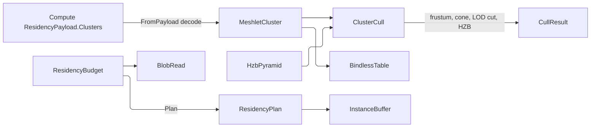

# [APPUI_RENDER_MESHLETS]

The geometry-virtualization and residency owners for the infinite viewport consume Compute's meshopt-built, cone-carrying `ResidencyMeshlet` descriptors with monotonic error columns. This page owns selection — hysteretic LOD, the cull ladder, bindless residency, predictive prefetch, and massive instancing — while Compute owns clustering. `ResidencyBudget` constrains the out-of-core scene by VRAM, the render graph draws the selected clusters, and the path tracer builds its private BVH over their decoded bounds. Compute's `meshlet-cluster` payload, the Persistence blob lane, and the shared wgpu device supply the substrate.

## [01]-[INDEX]

- [02]-[CLUSTER_CONSUMPTION]: Payload-cluster decode; the LOD selection algebra; the raised cull ladder.
- [03]-[RESIDENCY_BUDGET]: VRAM-budget residency, predictive prefetch, out-of-core streaming.

## [02]-[CLUSTER_CONSUMPTION]

- Owner: `MeshletKey` the payload-local cluster identity; `ResidencyMeshletView` the decode-only projection of one Compute `ResidencyMeshlet` descriptor; `MeshletCluster` the cluster scene over the consumed payload and its decoded `ResidencyRuns`; `SurfaceSample` the per-hit interpolated attribute answer; `ClusterCull` the cull-ladder fold and the two-phase draw schedule; `CullResult` the frame's cut carrying both HZB phases; `CutPhase` `[SmartEnum]` the phase selector one geometry row carries; `DrawCut` the phase-narrowed draw value; `HzbPyramid` the prior-frame depth pyramid; `BindlessTable` the bindless resource table.
- Entry: `public static Fin<MeshletCluster> FromPayload(GpuBackend backend, ResidencyPayload payload, LodPolicy lod)` projects the payload's cluster rows through the Compute `Residency.Runs` attribute decode and rejects a non-cluster payload kind; `public Option<SurfaceSample> Sample(int cluster, (double X, double Y, double Z) at)` resolves the nearest-triangle interpolated normal, UV, and UV-gradient tangent for a hit on one cluster — the `Render/pathtrace#BSDF_SHADING` `SurfaceAttribution` closure binds it at composition, and `None` (an unmapped source: empty UV run) is the typed absence the bounding-proxy parameterization fills; `public (MeshletCluster Cluster, CullResult Result) Visible(Frustum frustum, ViewCamera camera, double lodScale, Option<HzbPyramid> hzb, double nearPlane)` executes the full ladder over admitted inputs and returns the advanced immutable cull owner with its cut, totally — the rail belongs to the composition-bound `RenderPass.Cull` delegate, whose HZB build can genuinely refuse.
- Auto: the clusters arrive Compute-built — meshopt clustering, REAL per-cluster bounds, REAL cone apex/axis/cutoff, a measured per-cluster `Curvature` bound the `Render/pathtrace` ray-cone footprint consumes unchanged, and encoded `Error`/`ParentError` columns that are monotonic BY CONSTRUCTION (`ParentError >= Error` on the `payload.md` row — the landed encode guarantee), so cut well-formedness (crack-free, no double-draw) rides the producer guarantee and this page re-verifies nothing; the LOD SELECTION ALGEBRA is AppUi's own: the per-cluster error bound projects to screen space under the camera row, the `LodPolicy` pixel threshold picks the cut (`Projected(Error) <= threshold < Projected(ParentError)` — exactly one cluster per subtree by monotonicity), and the hysteresis band on the same policy row keeps a prior-cut cluster selected until its error crosses the threshold by the band so a dolly move never flickers the cut; the cull ladder is RAISED past cone parity per the page's infinite-viewport charter: frustum -> wire-cone backface (meshopt's EXACT apex-anchored test over the producer's own `ConeApex`, so no radius-over-distance slack is needed and no partially-facing cluster is over-culled into a hole; a cutoff of -1 is the encoder's own no-usable-cone row and never rejects, and an eye inside the bounding sphere never rejects) -> LOD cut -> prior-frame depth-pyramid (HZB) two-phase occlusion — draw the prior-visible set first, test the remainder against the pyramid, and a cluster fully occluded by the prior frame draws nothing; `CullResult` stores those two phases and derives the joined draw set, and `CutPhase` is how a `Render/pipeline` geometry row names the phase it draws while `ClusterCull.DrawRows` folds every SCHEDULED phase into a row off one submit arrow, so the ladder's second draw is scheduled data rather than a set the geometry delegate must re-derive or a phase no pass ever selects; bindless resource indices resolve through `BindlessTable` so a draw names a resource by index, never a per-draw bind.
- Packages: Thinktecture.Runtime.Extensions, LanguageExt.Core, Rasm.Compute (project), Silk.NET.WebGPU
- Growth: a new LOD policy is one `LodPolicy` value; a new vertex-stream channel is one `BindlessTable` slot; a new cull phase is one ladder row and one `CutPhase` row carrying its slice and its `Scheduled` column, which `DrawRows` folds with no schedule edit; zero new surface.
- Boundary: cluster geometry decodes from Compute `ResidencyPayload`, and every per-vertex attribute read crosses through the Compute `Residency.Runs` projection — AppUi neither clusters, re-tessellates, decodes a stream itself, nor admits a second meshoptimizer owner. `ResidencyMeshletView` is a FAITHFUL projection: its column set and column ORDER mirror the producer descriptor, every construction binds by name, and a column the producer carries is projected rather than dropped — a reordered or subsetted view turns a same-typed offset/count copy into a silent transposition and a dropped column into an unreachable producer fact. Tiles and clusters retain the payload `ContentKey`. One shared-device compute pass builds the farthest-depth HZB mip chain, with `QueryType.Occlusion` as the capability fallback. GPU multi-draw consumes `RenderPassEncoderMultiDrawIndexedIndirectCount`, push constants, and the pipeline's `WgpuFrameEvidence` retirement and timestamp lanes, so no meshlet-local fence, timer, or evidence owner exists. TAA motion vectors occupy one `BindlessTable` slot.

```csharp signature
public readonly record struct BoundingSphere(double X, double Y, double Z, double Radius) {
    public double SurfaceArea() => 4d * Math.PI * Radius * Radius;
}

// The producer's WHOLE cone — apex, axis, and cosine cutoff. The apex is what makes the backface test exact:
// meshopt's own apex form asks whether the eye sits inside the reflex cone anchored at the apex, and the
// center-anchored fallback it publishes beside it is only conservative once the sphere radius over the eye
// distance widens the threshold. Dropping the apex leaves a consumer with the fallback and no way to spell
// the exact test, which is a producer fact made unreachable rather than a column saved.
public readonly record struct NormalCone(
    (double X, double Y, double Z) Apex,
    (double X, double Y, double Z) Axis,
    double CosCutoff);

public readonly record struct MeshletKey(UInt128 Payload, int Level, int VertexOffset, int TriangleOffset);

// Decode-only view of one Compute ResidencyMeshlet descriptor — every column reads from the wire,
// nothing recomputes; ParentError >= Error holds by the producer's encode guarantee. Column ORDER
// mirrors the producer exactly (VertexOffset, TriangleOffset, VertexCount, TriangleCount, ... Level,
// Parent, Shell, Error, ParentError, Curvature): the two offset/count pairs are same-typed, so a divergent
// order makes a positional copy transpose silently with no compiler signal. Bounds folds the producer's
// Center+Radius, Cone folds its ConeApex+ConeAxis+ConeCutoff, Shell carries the producer's shell partition, and
// Curvature carries its measured normal-variation bound, so the view stays a faithful projection rather
// than a lossy subset. Curvature is MEASURED per cluster per level at encode — a planar cluster's zero is a
// measurement, not a missing slot — so the ray-cone footprint reads it directly and derives nothing.
public readonly record struct ResidencyMeshletView(
    int VertexOffset,
    int TriangleOffset,
    int VertexCount,
    int TriangleCount,
    BoundingSphere Bounds,
    NormalCone Cone,
    int Level,
    int Parent,
    int Shell,
    double Error,
    double ParentError,
    double Curvature,
    MeshletKey Key);

public sealed record LodPolicy(double PixelThreshold, double HysteresisBand, int MaxLevels) {
    public static readonly LodPolicy Default = new(PixelThreshold: 1.0, HysteresisBand: 0.25, MaxLevels: 8);
}

public readonly record struct Frustum(Seq<(double A, double B, double C, double D)> Planes) {
    public bool Intersects(BoundingSphere sphere) =>
        Planes.ForAll(plane => (plane.A * sphere.X) + (plane.B * sphere.Y) + (plane.C * sphere.Z) + plane.D >= -sphere.Radius);
}

public sealed record BindlessTable(FrozenDictionary<string, int> Slots) {
    public static BindlessTable Of(params ReadOnlySpan<string> channels) =>
        new(channels.ToArray().Select(static (channel, index) => KeyValuePair.Create(channel, index)).ToFrozenDictionary(StringComparer.Ordinal));

    public Option<int> Slot(string channel) => Slots.TryGetValue(channel, out int index) ? Some(index) : None;
}

// Prior-frame depth pyramid: mip 0 is last frame's depth, each mip the FARTHEST-depth (max) reduction of
// the level below — occlusion is conservative only against the footprint's farthest occluder, a min
// reduction over-culls; built by ONE compute pass on the shared device; Occluded samples the mip whose
// texel covers the cluster's screen extent so one sample bounds the whole footprint.
public sealed record HzbPyramid(int Width, int Height, int MipLevels, Func<int, double, double, double> SampleFarDepth) {
    public bool Occluded(BoundingSphere bounds, ViewCamera camera, double nearPlane) {
        (double sx, double sy, double radiusPx, double depth) = ScreenExtent(bounds, camera, nearPlane);
        if (depth <= nearPlane) { return false; } // camera inside or crossing the sphere: never occluded
        // The ceiling floors at zero: `Math.Clamp` THROWS when its minimum exceeds its maximum, so a pyramid
        // declaring no mips would abort the cull pass rather than sample its own base level.
        int mip = Math.Clamp((int)Math.Ceiling(Math.Log2(Math.Max(radiusPx * 2d, 1d))), 0, Math.Max(MipLevels - 1, 0));
        return depth > SampleFarDepth(mip, sx, sy); // sphere's nearest point behind the footprint's farthest occluder: fully hidden
    }

    // Camera-row projection kernel: view-basis transform of the sphere center, conservative nearest depth,
    // and screen radius; orthographic scale derives from ViewHeight and perspective scale from vertical FOV.
    // The triad reads OracleFrame.OfCamera — the ONE camera-basis derivation this compilation unit owns — so
    // the occlusion projection and the integrator's primary rays cannot drift in handedness.
    (double X, double Y, double RadiusPx, double Depth) ScreenExtent(BoundingSphere bounds, ViewCamera camera, double nearPlane) {
        CameraFrame frame = camera.Frame;
        ((double fx, double fy, double fz), (double rx, double ry, double rz), (double ux, double uy, double uz)) = OracleFrame.OfCamera(frame);
        (double cx, double cy, double cz) = (bounds.X - frame.Eye.X, bounds.Y - frame.Eye.Y, bounds.Z - frame.Eye.Z);
        double z = (cx * fx) + (cy * fy) + (cz * fz);
        double x = (cx * rx) + (cy * ry) + (cz * rz);
        double y = (cx * ux) + (cy * uy) + (cz * uz);
        double depth = z - bounds.Radius;
        return camera.Switch(
            state: (Owner: this, X: x, Y: y, Z: z, Depth: depth, Radius: bounds.Radius, Near: nearPlane),
            perspective: static (state, lens) => {
                double half = Math.Tan(double.DegreesToRadians(lens.FieldOfViewDeg) / 2d);
                double safeZ = Math.Max(state.Z, state.Near);
                double aspect = state.Owner.Width / (double)state.Owner.Height;
                return (
                    (((state.X / (safeZ * half * aspect)) * 0.5) + 0.5) * state.Owner.Width,
                    (0.5 - ((state.Y / (safeZ * half)) * 0.5)) * state.Owner.Height,
                    (state.Radius / safeZ) * (state.Owner.Height / (2d * half)),
                    state.Depth);
            },
            orthographic: static (state, lens) => {
                double pxPerUnit = state.Owner.Height / Math.Max(lens.ViewHeight, 1e-6);
                return (
                    (state.X * pxPerUnit) + (state.Owner.Width / 2d),
                    (state.Owner.Height / 2d) - (state.Y * pxPerUnit),
                    state.Radius * pxPerUnit,
                    state.Depth);
            },
            // The asymmetric XR eye reads its own four signed tangents (left/down negative): the frustum
            // center shifts by the tangent midpoint and the half-extents are the tangent half-spans, so a
            // world-locked eye culls against the frustum it renders, never a symmetric stand-in.
            asymmetric: static (state, lens) => {
                (double tanL, double tanR, double tanU, double tanD) =
                    (Math.Tan(lens.AngleLeft), Math.Tan(lens.AngleRight), Math.Tan(lens.AngleUp), Math.Tan(lens.AngleDown));
                (double halfX, double centerX, double halfY, double centerY) =
                    ((tanR - tanL) / 2d, (tanR + tanL) / 2d, (tanU - tanD) / 2d, (tanU + tanD) / 2d);
                double safeZ = Math.Max(state.Z, state.Near);
                return (
                    ((((state.X / safeZ) - centerX) / (2d * halfX)) + 0.5) * state.Owner.Width,
                    (0.5 - (((state.Y / safeZ) - centerY) / (2d * halfY))) * state.Owner.Height,
                    (state.Radius / safeZ) * (state.Owner.Height / (2d * halfY)),
                    state.Depth);
            });
    }

}

public sealed record CullState(LanguageExt.HashSet<MeshletKey> PriorCut, LanguageExt.HashSet<MeshletKey> PriorVisible);

// The two HZB phases are the STORED columns and the whole draw set is the derived join — storing the join
// beside one phase forces every consumer to subtract to recover the other, and the second phase is exactly the
// one a two-phase ladder must schedule on its own. Empty is the honest cut a frame holds before any cull pass
// ran: `Render/pipeline`'s pass fold seeds it, so a geometry pass ordered ahead of its cull draws nothing
// rather than the un-narrowed scene.
public sealed record CullResult(Seq<ResidencyMeshletView> PriorVisible, Seq<ResidencyMeshletView> OcclusionRetest, CullState Next) {
    public static readonly CullResult Empty =
        new(Seq<ResidencyMeshletView>(), Seq<ResidencyMeshletView>(), new CullState([], []));

    public Seq<ResidencyMeshletView> Draw => PriorVisible + OcclusionRetest;
}

// Which slice of the cut one geometry row draws, as DATA on the row rather than a convention its delegate
// remembers: `Prior` and `Retest` are the two phases of the HZB ladder — draw what the prior frame saw, rebuild
// the pyramid, then draw the retested remainder — and `Whole` is the single-draw slice a shade mount, a capture
// composite, or an HZB-less frame consumes. A third phase is one row; a delegate that picks its own phase is
// the deleted form, because the graph then cannot order the ladder it declares.
[SmartEnum<string>]
public sealed partial class CutPhase {
    public static readonly CutPhase Prior = new("prior-visible", scheduled: true, static result => result.PriorVisible);
    public static readonly CutPhase Retest = new("occlusion-retest", scheduled: true, static result => result.OcclusionRetest);
    public static readonly CutPhase Whole = new("whole-cut", scheduled: false, static result => result.Draw);

    // Whether the LADDER schedules this phase as a draw of its own, in declaration order — prior-visible seeds
    // the depth the retest reads. `Whole` is the single-draw slice a shade mount or a capture composite
    // selects and never a scheduled step. The column is what makes `DrawRows` a fold over the roster: a third
    // phase is one row here and no edit anywhere else, where a hand-written schedule forces one and silently
    // strands the new phase's view list in the cull arm if the edit is missed.
    public bool Scheduled { get; }

    [UseDelegateFromConstructor]
    public partial Seq<ResidencyMeshletView> Select(CullResult result);
}

// What a geometry draw actually receives: this phase's view list joined to the cluster owner holding the
// decoded runs, the bindless table those views index into, and the LOD row. The views are the CUT, never the
// payload's whole cluster set — a draw handed the roster submits geometry the ladder already rejected — and
// Triangles is the charge the budget gate reads, summed off the views the draw is about to submit.
public readonly record struct DrawCut(MeshletCluster Cluster, Seq<ResidencyMeshletView> Views) {
    public long Triangles => Views.Fold(0L, static (sum, view) => sum + view.TriangleCount);

    // The instanced placements ride the CLUSTER, so the draw reads them off the same owner the cut narrows
    // and no second parameter threads the frame's plan down the pass arrow. An empty run is the honest
    // singleton case — one placement at identity is one instance, so the draw carries no `if`.
    public Seq<InstanceBuffer> Instances => Cluster.Instances;
}

public static class ClusterCull {
    // The ladder's SCHEDULE, folded off the phase roster because this owner is the one that knows which phases
    // the ladder draws and in what order: the scheduled rows draw in declaration order, so prior-visible seeds
    // the depth the retest reads. Every row shares ONE submit arrow and ONE charge — the phase row selects the
    // slice, so a second delegate per phase would be two copies of one draw that can drift — and each row's
    // key is the phase's OWN key rather than a literal restating it. Scheduling only the whole-cut row is what
    // leaves a phase's view list stranded in the cull arm with no pass that can ever draw it.
    public static Seq<RenderPass> DrawRows(string key, Func<RenderTarget, FrameView, DrawCut, Fin<long>> submit) =>
        toSeq(CutPhase.Items).Filter(static phase => phase.Scheduled)
            .Map(phase => (RenderPass)new RenderPass.Geometry(
                $"{key}/{phase.Key}", phase, static cut => cut.Triangles, submit));

    // The raised ladder: frustum -> wire-cone backface -> hysteresis LOD cut -> two-phase HZB occlusion.
    public static CullResult Cull(
        Seq<ResidencyMeshletView> clusters,
        Frustum frustum,
        ViewCamera camera,
        double lodScale,
        LodPolicy lod,
        CullState prior,
        Option<HzbPyramid> hzb,
        double nearPlane) {
        Seq<ResidencyMeshletView> inFrustum = clusters.Filter(cluster => frustum.Intersects(cluster.Bounds));
        Seq<ResidencyMeshletView> facing = inFrustum.Filter(cluster => !BackfaceReject(cluster, camera));
        Seq<ResidencyMeshletView> cut = facing.Filter(cluster => InCut(cluster, camera, lodScale, lod, prior.PriorCut));
        (Seq<ResidencyMeshletView> phase1, Seq<ResidencyMeshletView> retest) =
            hzb.Match(
                Some: pyramid => (
                    cut.Filter(cluster => prior.PriorVisible.Contains(cluster.Key)),
                    cut.Filter(cluster => !prior.PriorVisible.Contains(cluster.Key) && !pyramid.Occluded(cluster.Bounds, camera, nearPlane))),
                None: () => (cut, Seq<ResidencyMeshletView>()));
        return new CullResult(
            phase1,
            retest,
            new CullState(
                toHashSet(cut.Map(static c => c.Key)),
                toHashSet((phase1 + retest).Map(static c => c.Key))));
    }

    // Wire-cone backface: reject when every triangle in the cluster faces away. This is meshopt's EXACT
    // apex-anchored test — dot(normalize(apex - eye), axis) >= cutoff — because the producer carries the apex
    // and the view projects it. The apex form needs no slack: the cone the encoder fit is anchored there, so a
    // reject means every triangle's outward normal points away from the eye, full stop.
    //
    // The center-anchored form is the FALLBACK meshopt publishes beside it, and it is a different inequality:
    // dot(normalize(center - eye), axis) >= cutoff + radius / distance. The radius-over-distance term is the
    // conservative correction for the cone being anchored somewhere other than the sphere centre. Spelling the
    // center form WITHOUT that term is the named hazard — the threshold falls, the test rejects clusters that
    // are partially facing, and the frame draws holes with no fault and no receipt, which is exactly the
    // failure the sibling LOD level-cap arm forecloses. Both forms degenerate honestly at close range: a
    // cutoff of -1 is the encoder's own "no usable cone" and never rejects, and an eye inside the bounding
    // sphere never rejects because the correction is unbounded there.
    public static bool BackfaceReject(ResidencyMeshletView cluster, ViewCamera camera) {
        if (cluster.Cone.CosCutoff <= -1d) { return false; }
        CameraFrame frame = camera.Frame;
        (double cx, double cy, double cz) = (cluster.Bounds.X - frame.Eye.X, cluster.Bounds.Y - frame.Eye.Y, cluster.Bounds.Z - frame.Eye.Z);
        if (Math.Sqrt((cx * cx) + (cy * cy) + (cz * cz)) <= cluster.Bounds.Radius) { return false; }
        (double ax, double ay, double az) = (cluster.Cone.Apex.X - frame.Eye.X, cluster.Cone.Apex.Y - frame.Eye.Y, cluster.Cone.Apex.Z - frame.Eye.Z);
        double reach = Math.Max(Math.Sqrt((ax * ax) + (ay * ay) + (az * az)), 1e-9);
        return (((cluster.Cone.Axis.X * ax) + (cluster.Cone.Axis.Y * ay) + (cluster.Cone.Axis.Z * az)) / reach) >= cluster.Cone.CosCutoff;
    }

    // Hysteresis LOD cut: select where Projected(Error) <= threshold < Projected(ParentError) — exactly
    // one cluster per subtree by the monotonic columns. The band SHIFTS the one threshold both comparisons
    // read; widening the two bounds independently breaks the half-open partition, and a parent and its child
    // then both pass on a dolly-out — the double-draw the cut exists to foreclose. A prior-cut member holds
    // against a raised threshold until its own error crosses it, which is the stickiness the band buys.
    // A cluster at the level cap is its own terminus: its parent projects at infinity so the subtree selects
    // HERE rather than vanishing, because a filtered-out coarse cluster is a hole with no fault and no receipt.
    public static bool InCut(ResidencyMeshletView cluster, ViewCamera camera, double lodScale, LodPolicy lod, LanguageExt.HashSet<MeshletKey> priorCut) {
        double threshold = lod.PixelThreshold * (priorCut.Contains(cluster.Key) ? 1d + lod.HysteresisBand : 1d);
        double projectedError = Projected(cluster.Error, cluster.Bounds, camera) * lodScale;
        double projectedParent = cluster.Level + 1 >= lod.MaxLevels
            ? double.PositiveInfinity
            : Projected(cluster.ParentError, cluster.Bounds, camera) * lodScale;
        return projectedError <= threshold && projectedParent > threshold;
    }

    // The ONE screen-space error projection this compilation unit owns: the meshlet cut reads it and so does
    // `Render/reality`'s point-octree cut, which is what keeps `lodScale` one meaning estate-wide. Sealing it
    // private would force the sibling family to spell a second pinhole projection that drifts on the first
    // tuning change.
    public static double Projected(double error, BoundingSphere bounds, ViewCamera camera) {
        CameraFrame frame = camera.Frame;
        (double dx, double dy, double dz) = (bounds.X - frame.Eye.X, bounds.Y - frame.Eye.Y, bounds.Z - frame.Eye.Z);
        double distance = Math.Max(Math.Sqrt((dx * dx) + (dy * dy) + (dz * dz)) - bounds.Radius, 1e-6);
        return error / distance; // pinhole small-angle projection; the viewport scale folds through lodScale
    }
}

// One cluster hit's interpolated attribute answer: the shading normal, the unwrap TANGENT every anisotropic lobe is
// evaluated in, the unwrap UV, and the distance from the queried point to the surface the interpolation ran on — the
// consumer's own plausibility gate against a sphere-oracle hit that landed far from any real triangle. The tangent is
// this decode's OWN uvs run, read as the winning triangle's UV gradient, so an anisotropic highlight holds its
// direction across a curved surface and across a seam instead of rotating with whichever normal component happens
// to rank smallest, and no payload column is added upstream to carry it.
public readonly record struct SurfaceSample(
    (double X, double Y, double Z) Normal,
    (double X, double Y, double Z) Tangent,
    (double U, double V) Uv,
    double Distance);

public sealed record MeshletCluster(
    GpuBackend Backend,
    Seq<ResidencyMeshletView> Clusters,
    ResidencyRuns Runs,
    LodPolicy Lod,
    BindlessTable Bindless,
    long Triangles,
    CullState State,
    // The frame's instanced placements of THIS payload, seated by the composition that folds the accepted
    // `ResidencyPlan` — `cluster with { Instances = plan.Instances }` — so the draw reads geometry and its
    // repetitions off one owner. The decode seeds it empty because a payload decode knows the mesh and not
    // where the scene put it, and an empty run draws the mesh once.
    Seq<InstanceBuffer> Instances) {
    public static Fin<MeshletCluster> FromPayload(GpuBackend backend, ResidencyPayload payload, LodPolicy lod) =>
        payload.Kind == ResidencyKind.MeshletCluster
            ? Residency.Runs(payload).MapFail(fault => (Error)new ViewportFault.Text($"meshlets/runs: {fault.Message}"))
                .Map(runs => new MeshletCluster(
                    backend,
                    // Every column binds by NAME: the four same-typed offset and count slots make a
                    // positional copy a silent transposition, and naming them makes that unspellable.
                    payload.Clusters.Map(static row => new ResidencyMeshletView(
                        VertexOffset: row.VertexOffset,
                        TriangleOffset: row.TriangleOffset,
                        VertexCount: row.VertexCount,
                        TriangleCount: row.TriangleCount,
                        Bounds: new BoundingSphere(row.Center.X, row.Center.Y, row.Center.Z, row.Radius),
                        Cone: new NormalCone(
                            (row.ConeApex.X, row.ConeApex.Y, row.ConeApex.Z),
                            (row.ConeAxis.X, row.ConeAxis.Y, row.ConeAxis.Z),
                            row.ConeCutoff),
                        Level: row.Level,
                        Parent: row.Parent,
                        Shell: row.Shell,
                        Error: row.Error,
                        ParentError: row.ParentError,
                        Curvature: row.Curvature,
                        Key: new MeshletKey(payload.ContentKey, row.Level, row.VertexOffset, row.TriangleOffset))),
                    runs,
                    lod,
                    BindlessTable.Of("position", "normal", "uv", "color", "motion-vector"),
                    payload.Clusters.Sum(static row => (long)row.TriangleCount),
                    new CullState([], []),
                    Seq<InstanceBuffer>()))
            : Fin.Fail<MeshletCluster>(new ViewportFault.Text($"meshlets/payload-kind: {payload.Kind} is not meshlet-cluster"));

    // SurfaceAttribution's data source: nearest triangle of ONE cluster to a world point, barycentric-
    // interpolated normal, UV, and unwrap tangent at the closest surface point. A cluster holds at most 124
    // triangles by encode policy, so the walk is a bounded scan, never a per-cluster acceleration structure. The
    // scan carries the WINNING corner triple and its barycentrics alone and projects the attributes once at the
    // end — a per-improvement re-interpolation pays the whole attribute fold for every candidate the next triangle
    // beats. None = no UV run (an unmapped source) or an out-of-range cluster — the typed absence the pathtrace
    // bounding-proxy fills.
    public Option<SurfaceSample> Sample(int cluster, (double X, double Y, double Z) at) {
        if (Runs.Uvs.IsEmpty || cluster < 0 || cluster >= Clusters.Count) { return None; }
        ResidencyMeshletView view = Clusters[cluster];
        ReadOnlySpan<float> positions = Runs.Positions.Span;
        ReadOnlySpan<uint> table = Runs.MeshletVertices.Span;
        ReadOnlySpan<byte> triangles = Runs.MeshletTriangles.Span;
        (double best, (int A, int B, int C) corner, (double U, double V, double W) bary) =
            (double.MaxValue, (0, 0, 0), (0d, 0d, 0d));
        for (int t = 0; t < view.TriangleCount; t++) {
            (int a, int b, int c) = (
                (int)table[view.VertexOffset + triangles[view.TriangleOffset + (t * 3)]],
                (int)table[view.VertexOffset + triangles[view.TriangleOffset + (t * 3) + 1]],
                (int)table[view.VertexOffset + triangles[view.TriangleOffset + (t * 3) + 2]]);
            (double u, double v, double w, double distance) = Closest(positions, a, b, c, at);
            if (distance < best) { (best, corner, bary) = (distance, (a, b, c), (u, v, w)); }
        }
        return best is double.MaxValue
            ? None
            : Some(Interpolated(positions, Runs.Normals.Span, Runs.Uvs.Span, corner, bary, best));
    }

    // One projection at the winning triangle: the interpolated normal, the interpolated UV, and the tangent the
    // triangle's own UV gradient fixes. An absent normals run falls to the face normal, which is the flat-shaded
    // truth for a source that published no vertex normals rather than a fabricated axis.
    static SurfaceSample Interpolated(
        ReadOnlySpan<float> positions,
        ReadOnlySpan<float> normals,
        ReadOnlySpan<float> uvs,
        (int A, int B, int C) corner,
        (double U, double V, double W) bary,
        double distance) {
        (int a, int b, int c) = corner;
        (double u, double v, double w) = bary;
        (double X, double Y, double Z) normal = OracleFrame.Normalize(normals.IsEmpty
            ? FaceNormal(positions, a, b, c)
            : (
                (u * normals[a * 3]) + (v * normals[b * 3]) + (w * normals[c * 3]),
                (u * normals[(a * 3) + 1]) + (v * normals[(b * 3) + 1]) + (w * normals[(c * 3) + 1]),
                (u * normals[(a * 3) + 2]) + (v * normals[(b * 3) + 2]) + (w * normals[(c * 3) + 2])));
        return new SurfaceSample(
            normal,
            Unwrap(positions, uvs, a, b, c, normal),
            (
                (u * uvs[a * 2]) + (v * uvs[b * 2]) + (w * uvs[c * 2]),
                (u * uvs[(a * 2) + 1]) + (v * uvs[(b * 2) + 1]) + (w * uvs[(c * 2) + 1])),
            distance);
    }

    // Below this the unwrap determinant carries no direction the gradient can divide by — a collapsed chart, a
    // zero-area wedge, a seam triangle whose three corners share one UV.
    const double UvDeterminantFloor = 1e-12;

    // Standard UV-gradient solve over one triangle: T = (e_ab·Δv_ac − e_ac·Δv_ab) / (Δu_ab·Δv_ac − Δu_ac·Δv_ab).
    // OracleFrame.Of owns both the Gram-Schmidt against the interpolated normal AND the degenerate fallback, so a
    // collapsed unwrap hands it the zero gradient and reaches the ONE arbitrary-azimuth completion the estate
    // declares rather than a second copy spelled here.
    static (double X, double Y, double Z) Unwrap(
        ReadOnlySpan<float> positions, ReadOnlySpan<float> uvs, int a, int b, int c, (double X, double Y, double Z) normal) {
        (double uab, double vab) = (uvs[b * 2] - uvs[a * 2], uvs[(b * 2) + 1] - uvs[(a * 2) + 1]);
        (double uac, double vac) = (uvs[c * 2] - uvs[a * 2], uvs[(c * 2) + 1] - uvs[(a * 2) + 1]);
        (double ex, double ey, double ez) =
            (positions[b * 3] - positions[a * 3], positions[(b * 3) + 1] - positions[(a * 3) + 1], positions[(b * 3) + 2] - positions[(a * 3) + 2]);
        (double fx, double fy, double fz) =
            (positions[c * 3] - positions[a * 3], positions[(c * 3) + 1] - positions[(a * 3) + 1], positions[(c * 3) + 2] - positions[(a * 3) + 2]);
        return OracleFrame.Of(normal, ((uab * vac) - (uac * vab)) switch {
            var det when Math.Abs(det) > UvDeterminantFloor =>
                (((ex * vac) - (fx * vab)) / det, ((ey * vac) - (fy * vab)) / det, ((ez * vac) - (fz * vab)) / det),
            _ => default,
        }).Tangent;
    }

    // Near point on one triangle: barycentric coordinates of the plane projection, clamped into the triangle.
    // The clamp is not the exact Ericson region walk — an edge-region query can land a corner-biased point — but
    // the consumer picks the MINIMUM over a cluster's triangles and interpolates attributes at the pick, where
    // that bias moves the answer by less than a texel; an exact walk buys nothing a shading read can see.
    static (double U, double V, double W, double Distance) Closest(ReadOnlySpan<float> positions, int a, int b, int c, (double X, double Y, double Z) p) {
        (double ax, double ay, double az) = (positions[a * 3], positions[(a * 3) + 1], positions[(a * 3) + 2]);
        (double bx, double by, double bz) = (positions[b * 3] - ax, positions[(b * 3) + 1] - ay, positions[(b * 3) + 2] - az);
        (double cx, double cy, double cz) = (positions[c * 3] - ax, positions[(c * 3) + 1] - ay, positions[(c * 3) + 2] - az);
        (double px, double py, double pz) = (p.X - ax, p.Y - ay, p.Z - az);
        (double d00, double d01, double d11) = ((bx * bx) + (by * by) + (bz * bz), (bx * cx) + (by * cy) + (bz * cz), (cx * cx) + (cy * cy) + (cz * cz));
        (double d20, double d21) = ((px * bx) + (py * by) + (pz * bz), (px * cx) + (py * cy) + (pz * cz));
        double denom = Math.Max((d00 * d11) - (d01 * d01), 1e-24);
        double v = Math.Clamp(((d11 * d20) - (d01 * d21)) / denom, 0d, 1d);
        double w = Math.Clamp(((d00 * d21) - (d01 * d20)) / denom, 0d, 1d - v);
        (double qx, double qy, double qz) = ((v * bx) + (w * cx) - px, (v * by) + (w * cy) - py, (v * bz) + (w * cz) - pz);
        return (1d - v - w, v, w, Math.Sqrt((qx * qx) + (qy * qy) + (qz * qz)));
    }

    // OracleFrame owns the cross, unit, and orthonormalization folds — one owner for this whole compilation
    // unit; a page-local copy is the divergence surface (one sibling copy already forked its zero-length arm).
    static (double X, double Y, double Z) FaceNormal(ReadOnlySpan<float> positions, int a, int b, int c) =>
        OracleFrame.Cross(
            positions[b * 3] - positions[a * 3], positions[(b * 3) + 1] - positions[(a * 3) + 1], positions[(b * 3) + 2] - positions[(a * 3) + 2],
            positions[c * 3] - positions[a * 3], positions[(c * 3) + 1] - positions[(a * 3) + 1], positions[(c * 3) + 2] - positions[(a * 3) + 2]);

    // Total by construction — every input is admitted, the ladder is four filters over an immutable seq, and no
    // arm can refuse — so the answer is the pair itself. A decorative `Fin` here would advertise a failure mode
    // this fold does not have; the `Render/pipeline` `RenderPass.Cull` delegate keeps its own rail, because the
    // composition-bound HZB build behind it genuinely can.
    public (MeshletCluster Cluster, CullResult Result) Visible(Frustum frustum, ViewCamera camera, double lodScale, Option<HzbPyramid> hzb, double nearPlane) =>
        ClusterCull.Cull(Clusters, frustum, camera, lodScale, Lod, State, hzb, nearPlane) switch {
            CullResult result => (this with { State = result.Next }, result),
        };
}
```

## [03]-[RESIDENCY_BUDGET]

- Owner: `ResidencyTile` the streamable geometry page; `ResidencyBudget` the VRAM-budget residency manager; `Prefetch` the predictive prefetch fold; `InstanceBuffer` the massive-instancing draw row.
- Entry: `public Fin<ResidencyPlan> Plan(Frustum frustum, (double X, double Y, double Z) camera, (double X, double Y, double Z) velocity, QualityVerdict quality, long frame, ResidencyPlan prior)` — one state transition per frame: the prior plan IS the resident-set state, and the next plan accounts for every resident, visible, evicted, instanced, and prefetched tile in one fold. The byte bound is DERIVED here, never passed — `min(DeviceVramBytes, Watermark x quality.WatermarkFactor)` — because the device lease is a budget column and the factor is the governor's own per-frame verdict; a caller-supplied byte count is the second quality authority the one-authority law forecloses, and a non-positive derived bound refuses by name rather than sealing an empty resident set as a successful plan.
- Auto: residency keys each tile by the payload's own `ContentKey` and tracks its byte cost and last-touch frame; the transition touches every frustum-visible tile at `frame`, carries the prior plan's out-of-frustum residents forward at their old touch, admits the union in touch-recency order under the byte budget (visible tiles admit first by construction because their touch is current), and EVICTS every tile that was resident in the prior plan and is not resident in the next — a tile that left the frustum either survives as a carried resident or lands in `Evict`, so no resident tile can persist outside the reported residency state; prefetch admits the velocity-reachable non-resident tiles greedily into the remaining byte headroom only, its bytes carried on `PrefetchBytes`, so the budget governs resident and prefetch admissions from one derivable total; the scene's `Placements` roster groups by payload key over the ADMITTED set alone into one `InstanceBuffer` per mesh carrying the per-instance transform run, so a forest of repeated objects is one draw call and never a draw against a slot the same fold just evicted — the composition seats that run on the frame's `MeshletCluster` and the geometry draw reads it off `DrawCut.Instances`.
- Packages: Thinktecture.Runtime.Extensions, LanguageExt.Core, NodaTime, Rasm.Persistence (project)
- Growth: a new residency policy is one watermark value; a new instance channel is one `InstanceBuffer` column; zero new surface.
- Boundary: frame budget is the invariant the plan enforces — a plan that overruns the VRAM budget evicts before it admits, and a non-positive derived bound refuses as `ViewportFault.BudgetExceeded` rather than sealing an empty resident set as success; `Render/pipeline#RENDER_GRAPH` `RenderGraph.Observe` is the ONE binder of `ResidencyBudget.Observe` — it takes the frame's accepted plan beside its sealed `FrameReceipt`, so the evict, prefetch, and pool level gauges read the plan that frame drew, out-of-core budget-bounded by construction; tile bytes stream from the Persistence blob lane as opaque versioned payloads through the blob-read delegate so the residency manager never opens files; the predictive prefetch is a pure velocity-extrapolation fold and a background IO thread is the rejected form — prefetch issues blob-read requests the caller's IO scheduler drains; the GPU upload of a resident tile to a bindless slot rides the `Render/pipeline` render-graph lease under VIEWPORT_GPU; the residency manifest the web leg consumes projects through the `Render/pipeline` `ResidencyManifest.Mint` off the resident set, so the residency owner mints no second wire; the watermark scales by the `Diagnostics/governor.md` `QualityVerdict.WatermarkFactor` — one quality authority.

```csharp signature
public readonly record struct ResidencyTile(UInt128 ContentKey, long Bytes, BoundingSphere Bounds, long LastTouch);

// The 3x4 affine row-major run an instanced draw uploads per placement. It is a named shape rather than a
// bare twelve-tuple because the tuple appears at the scene ingress, in the grouped buffer, and on the draw,
// and three same-arity anonymous tuples are three chances to transpose a row for a column with no signal.
public readonly record struct InstanceTransform(
    double M11, double M12, double M13, double M14,
    double M21, double M22, double M23, double M24,
    double M31, double M32, double M33, double M34);

// ONE world placement of ONE content-keyed mesh — the scene's own repetition, keyed by the payload identity
// every other row on this page keys on. A parallel string mesh key beside `ContentKey` is a second identity
// that lets a placement name geometry no residency row can resolve.
public readonly record struct InstancePlacement(UInt128 ContentKey, InstanceTransform Transform);

// The instanced draw row: every placement of one resident mesh grouped under its key, so a forest of
// repeated objects submits ONE draw with N transforms rather than N draws. A placement whose geometry is not
// resident this frame is absent by construction — the group folds off the ADMITTED set — because a draw
// naming an evicted payload is a bindless read of a slot the plan just released.
public sealed record InstanceBuffer(UInt128 ContentKey, Seq<InstanceTransform> Transforms) {
    public int Count => Transforms.Count;
}

// The plan IS the cross-frame residency state: Boot seeds it, every frame folds it forward, and the
// resident/evict/instance/prefetch sets plus both byte totals are recoverable from the value alone.
public sealed record PrefetchRequest(UInt128 ContentKey, long Bytes, IO<ReadOnlyMemory<byte>> Read);

public sealed record ResidencyPlan(
    Seq<ResidencyTile> Resident,
    Seq<UInt128> Evict,
    Seq<InstanceBuffer> Instances,
    Seq<PrefetchRequest> Prefetch,
    long ResidentBytes,
    long PrefetchBytes,
    long Frame) {
    public static readonly ResidencyPlan Boot =
        new(Seq<ResidencyTile>(), Seq<UInt128>(), Seq<InstanceBuffer>(), Seq<PrefetchRequest>(), 0L, 0L, 0L);
}

public sealed record ResidencyBudget(
    HashMap<UInt128, ResidencyTile> Tiles,
    // The scene's repetition roster, keyed by the same payload identity the tile map keys on — so the
    // instance fold and the residency fold read one identity and an instanced draw can only ever name
    // geometry this plan admitted.
    Seq<InstancePlacement> Placements,
    Func<UInt128, IO<ReadOnlyMemory<byte>>> BlobRead,
    long DeviceVramBytes,
    long Watermark,
    double PrefetchHorizon) {
    // The effective budget is min(device VRAM, Watermark x the governor's WatermarkFactor). The device byte
    // count is a lease fact that does not move per frame, so it sits on the budget; the quality factor moves
    // every frame, so it arrives as the verdict. Deriving the bound HERE is what makes the governor the one
    // quality authority — a watermark mirrored into a second field is a second authority that drifts.
    // The derived bound is the rail's one refusal: a non-positive effective budget admits nothing and evicts
    // every resident, which reads as a successful plan for an empty scene while the viewport goes black. A
    // zeroed watermark, a zeroed device lease, or a governor factor at zero is a composition defect the frame
    // must see by name — succeeding with an empty resident set is the FORGED plan.
    public Fin<ResidencyPlan> Plan(Frustum frustum, (double X, double Y, double Z) camera, (double X, double Y, double Z) velocity, QualityVerdict quality, long frame, ResidencyPlan prior) =>
        from budget in Math.Min(DeviceVramBytes, (long)(Watermark * quality.WatermarkFactor)) switch {
            > 0L and var bytes => Fin.Succ(bytes),
            var bytes => Fin.Fail<long>(new ViewportFault.BudgetExceeded(
                $"residency/budget: min(device {DeviceVramBytes}b, watermark {Watermark}b x {quality.WatermarkFactor}) resolved to {bytes}b")),
        }
        let candidates = Candidates(frustum, frame, prior)
        let admitted = Admit(candidates, budget)
        let kept = toHashSet(admitted.Kept.Map(static tile => tile.ContentKey))
        let prefetch = PrefetchSet(camera, velocity, kept, budget - admitted.Bytes)
        select new ResidencyPlan(
            Resident: admitted.Kept,
            Evict: prior.Resident.Map(static tile => tile.ContentKey).Filter(key => !kept.Contains(key)),
            Instances: Instanced(kept),
            Prefetch: prefetch.Requests,
            ResidentBytes: admitted.Bytes,
            PrefetchBytes: prefetch.Bytes,
            Frame: frame);

    // Instancing is a GROUPING of the admitted set, not a second admission: the placements collapse by their
    // payload key so N repetitions of one mesh become one buffer, and a placement whose mesh the byte budget
    // did not admit this frame drops rather than submitting a draw against a released slot.
    private Seq<InstanceBuffer> Instanced(LanguageExt.HashSet<UInt128> resident) =>
        toSeq(Placements
            .Filter(row => resident.Contains(row.ContentKey))
            .GroupBy(static row => row.ContentKey))
            .Map(static group => new InstanceBuffer(group.Key, toSeq(group).Map(static row => row.Transform)));

    // Candidate set = visible tiles touched NOW + prior residents carried at their old touch; one union,
    // deduped by content key with the fresh touch winning.
    private Seq<ResidencyTile> Candidates(Frustum frustum, long frame, ResidencyPlan prior) =>
        toSeq((toSeq(Tiles.Values)
            .Filter(tile => frustum.Intersects(tile.Bounds))
            .Map(tile => tile with { LastTouch = frame }) + prior.Resident)
            .Fold(HashMap<UInt128, ResidencyTile>(), static (held, tile) => held.Find(tile.ContentKey).IsSome ? held : held.Add(tile.ContentKey, tile))
            .Values);

    private static (Seq<ResidencyTile> Kept, long Bytes) Admit(Seq<ResidencyTile> candidates, long vramBytes) =>
        toSeq(candidates.OrderByDescending(static tile => tile.LastTouch))
            .Fold(
                (Kept: Seq<ResidencyTile>(), Bytes: 0L),
                (state, tile) => state.Bytes + tile.Bytes <= vramBytes
                    ? (state.Kept.Add(tile), state.Bytes + tile.Bytes)
                    : state);

    // Prefetch is budget-bounded: velocity-reachable non-resident tiles admit greedily into the byte
    // headroom the resident admission left; an unbudgeted prefetch cannot type its way onto the plan.
    private (Seq<PrefetchRequest> Requests, long Bytes) PrefetchSet(
        (double X, double Y, double Z) camera,
        (double X, double Y, double Z) velocity,
        LanguageExt.HashSet<UInt128> resident,
        long headroom) =>
        toSeq(Tiles.Values)
            .Filter(tile => !resident.Contains(tile.ContentKey) && Reaches(camera, velocity, tile.Bounds))
            .Fold(
                (Requests: Seq<PrefetchRequest>(), Bytes: 0L),
                (state, tile) => state.Bytes + tile.Bytes <= headroom
                    ? (state.Requests.Add(new PrefetchRequest(tile.ContentKey, tile.Bytes, BlobRead(tile.ContentKey))), state.Bytes + tile.Bytes)
                    : state);

    private bool Reaches((double X, double Y, double Z) camera, (double X, double Y, double Z) velocity, BoundingSphere bounds) =>
        (Predict(camera, velocity) switch {
            var ahead => Math.Sqrt(Math.Pow(ahead.X - bounds.X, 2) + Math.Pow(ahead.Y - bounds.Y, 2) + Math.Pow(ahead.Z - bounds.Z, 2)),
        }) <= bounds.Radius + PrefetchHorizon;

    private (double X, double Y, double Z) Predict((double X, double Y, double Z) camera, (double X, double Y, double Z) velocity) =>
        (camera.X + (velocity.X * PrefetchHorizon), camera.Y + (velocity.Y * PrefetchHorizon), camera.Z + (velocity.Z * PrefetchHorizon));

    public const string EvictInstrument = "rasm.appui.viewport.residency.evict";
    public const string PrefetchInstrument = "rasm.appui.viewport.residency.prefetch";
    public const string PoolInstrument = "rasm.appui.viewport.residency.pool";

    public static TelemetryContributorPort TelemetryRow(string version) =>
        AppUiTelemetry.Contribute(version,
            InstrumentSpec.Level(EvictInstrument, "{page}", "tiles the current plan marked for eviction", MeasureForm.Whole),
            InstrumentSpec.Level(PrefetchInstrument, "{page}", "tiles the current plan queued for prefetch", MeasureForm.Whole),
            InstrumentSpec.Levels(PoolInstrument, "By", "planned VRAM bytes by residency pool",
                MeasureForm.Whole, AppUiTelemetry.PoolSlot));

    // Levels beside their writer: `Render/pipeline#RENDER_GRAPH` `RenderGraph.Observe` is the one call site — it
    // takes the frame's accepted plan beside the receipt it just sealed and chains this fold, so the gauges and
    // the frame instruments describe ONE frame — and `TelemetryRow` joins the
    // `Diagnostics/evidence#TELEMETRY_SPINE` `AppUiTelemetry.Mount` contributor seq, so the residency gauges —
    // evict, prefetch, and the per-pool byte levels — read the live plan at collection cadence, and every write
    // rides the kernel pulled gate so an unmounted level refuses instead of dropping silently. All three writes
    // take the ONE pulled entry, the trailing key alone separating the per-pool family entry from the two scalar
    // cells, so the fold reads as one shape and a fourth level is a row rather than a second signature.
    public static Fin<ResidencyPlan> Observe(InstrumentSet set, ResidencyPlan plan) =>
        PoolRows.TraverseM(row => set.Level(PoolInstrument, row.Read(plan), Some(row.Pool))).As()
            .Bind(_ => set.Level(EvictInstrument, plan.Evict.Count))
            .Bind(_ => set.Level(PrefetchInstrument, plan.Prefetch.Count))
            .Map(_ => plan);

    // Residency pools are a fanned dimension over ONE keyed family, so a third pool is one row here rather
    // than a third write beside its siblings.
    static readonly Seq<(string Pool, Func<ResidencyPlan, long> Read)> PoolRows = Seq(
        ("resident", (Func<ResidencyPlan, long>)(static plan => plan.ResidentBytes)),
        ("prefetch", static plan => plan.PrefetchBytes));
}
```


```mermaid
---
config:
  layout: elk
  flowchart:
    curve: linear
    padding: 25
---
flowchart LR
    accTitle: Meshlet residency and culling flow
    accDescr: Compute residency payloads project into meshlet clusters, cull state, draw cuts, and residency plans.
    Payload["Compute ResidencyPayload.Clusters"] -->|FromPayload decode| MeshletCluster
    MeshletCluster --> ClusterCull
    ClusterCull -->|frustum, cone, LOD cut, HZB| CullResult
    HzbPyramid --> ClusterCull
    MeshletCluster --> BindlessTable
    ResidencyBudget -->|Plan| ResidencyPlan
    ResidencyPlan --> InstanceBuffer
    ResidencyBudget --> BlobRead
```

## [04]-[GPU_BOUNDARY]

- [VIEWPORT_GPU]: the shared-device lease owns bindless upload, the HZB farthest-depth reduction, `RenderPassEncoderMultiDrawIndexedIndirectCount`, and `RenderPassEncoderSetPushConstants`. Submission and timing compose the pipeline `WgpuFrameEvidence` lane, so meshlet selection owns no fence, timer, query set, or device lifetime.
- [PAYLOAD_COLUMNS]: `ResidencyMeshlet` supplies `VertexOffset`, `TriangleOffset`, `VertexCount`, `TriangleCount`, `Center`, `Radius`, `ConeApex`, `ConeAxis`, `ConeCutoff`, `Level`, `Parent`, `Shell`, `Error`, `ParentError`, and `Curvature`. `ConeApex` is what makes the cull's backface test the EXACT apex-anchored one meshopt publishes rather than its centre-anchored fallback, so the wire leg and the CPU cull ask the same question of the same column. `Shell` is the producer's connected-component partition and it is what makes a `Parent` link meaningful — a parent search is shell-local, so a cut-repair or crack-stitch read consumes the column rather than re-deriving a connectivity this folder is forbidden to compute. `Curvature` is the producer's measured normal-variation bound in radians per object-space unit, measured per cluster per level off the cluster's own triangles, and it arrives on the per-cluster `ResidencyPayload.Clusters` rail rather than the `Runs` attribute decode — so the `Render/pathtrace` ray-cone spread-growth leg reads a producer column and a host-side curvature estimate over the decoded runs is the deleted form. `MeshletKey` composes `ResidencyPayload.ContentKey` with level and stream offsets, and hierarchy, hysteresis, residency, and wire projection consume that producer identity unchanged. `Residency.Runs` supplies the decoded `positions`/`normals`/`uvs` runs with the meshlet vertex table and raw triangle bytes — the one attribute decode `Sample` indexes and the `BindlessTable` `uv` slot uploads; an empty `uvs` run is the payload's own declaration that the source carried no unwrap, and that same run fixes the shading TANGENT as the winning triangle's UV gradient, so the anisotropic frame costs no producer column.

## [05]-[RESEARCH]

(none)
