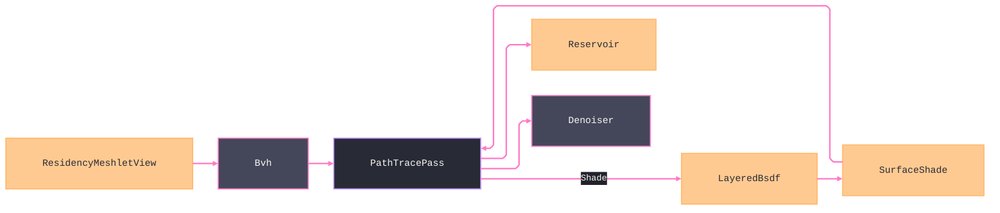

# [APPUI_RENDER_PATHTRACE]

The path-trace integrator for the infinite viewport: `PathTracePass` accumulates global illumination through BVH build-and-refit with ReSTIR reservoirs and progressive denoising, and the integrator shades every scene point from `Rasm.Materials.Appearance.Bsdf.LayeredBsdf`, the product of `SlabStack` lowering and the `MaterialGraph` sink. The page owns the BVH build/refit, the ReSTIR reservoir, progressive accumulation, edge-aware denoise, and exact `LayeredBsdf.Sample`/`Evaluate` consumption at the `PATH_TRACE` seam; `BsdfProjection` owns the sole oracle-tuple projection into the Materials `ShadingFrame`/`Direction`/`Op` vocabulary. The render graph schedules the pass, meshlet bounds feed the BVH, the CPU integrator is the correctness oracle, and GPU acceleration consumes the same contracts.

## [01]-[INDEX]

- [02]-[PATH_TRACE]: Real recursive SAH BVH, kernel-shaped degradation refit, ReSTIR reservoirs, honest accumulation, denoise.
- [03]-[LIGHT_RIG]: The ONE `LightSource` row family shared by both integrators; the Compute solar-position composition.
- [04]-[BSDF_SHADING]: The integrator shades from the Materials `LayeredBsdf`/`SlabStack`/`SurfaceShade`, never re-deriving lobe math.

## [02]-[PATH_TRACE]

- Owner: `Bvh` the bounding-volume hierarchy — PAGE-LOCAL and PRIVATE (a measured oracle kernel over wire-decoded meshlet bounds; the kernel spatial engine is the federation broad-phase owner behind the `[PLACEMENT_LAW]`(e) firebreak, its cross-package acceleration crossing stays wire-shaped `SpatialAnswer.Wire` `NodeLinkProjection`, so an AppUi acceleration wire or a second exported BVH is unrepresentable); `Reservoir` the ReSTIR sample reservoir carried per pixel ON the accumulation target; `SamplePolicy` the light-selection dispatch row; `PathTracePass` the progressive accumulation pass; `Denoiser` the edge-aware denoise fold over the target's own guide plane.
- Entry: `public Fin<AccumulationTarget> Accumulate(AccumulationTarget target, ViewCamera camera, LightRig rig, int sampleBudget, long sampleSeed)` — accumulates one progressive sample set onto the running per-pixel mean under the one camera row and returns the ADVANCED `AccumulationTarget` (`Ordinal + sampleBudget`), so two sequential batches against one target produce the weighted mean of both and the next pass reads the total sample count from the same state owner; convergence is the accumulated sample count, never a wall-clock timer.
- Auto: `Bvh.Build` constructs the hierarchy by a REAL recursive surface-area-heuristic split over the meshlet bounds — children emitted, leaf criterion at four primitives or no cost-improving split; `Refit` is a REAL bottom-up re-bound (leaves re-enclose their moved primitives, interior nodes re-enclose their two children in reverse emission order) and `Maintain` adopts the kernel `[DEGRADATION_REFIT]` shape (`Rasm/.planning/Spatial/index.md`): topology-stable in-place re-bounding plus a deterministic `SahCost` rebuild trigger, so a moving scene refits until quality degrades measurably and then rebuilds deterministically; NEE light selection DISPATCHES on the `SamplePolicy` row — `Restir` streams every rig row through the pixel's `Reservoir` (the prior frame's reservoir seeds the stream decayed to `TemporalCap`, the target function is the unshadowed luminance-times-cosine, ONLY the surviving sample pays a shadow ray, and the advanced reservoir writes back to `AccumulationTarget.Reservoirs[pixel]` so temporal reuse is a real state transition), `Uniform` draws one row scaled by count, `Stratified` rotates the row by pixel-plus-ordinal; the progressive accumulator folds each sample set onto the running mean keyed by the accumulation ordinal and advances that ordinal on the returned target — `AccumulationTarget` is the ONE progression owner (`Of` mints it, `Advanced` weights the next batch, `Reset` clears mean, reservoirs, and guides together on camera motion) and no second sample counter exists — so a static camera converges frame over frame and the render graph resets the same target on camera motion; the primary hit writes each pixel's normal/depth guide onto the target's `NormalDepth` plane, and `Denoiser.Resolve` folds the noisy mean with those guides through the 3x3 joint-bilateral weights so an early-frame estimate is presentable before full convergence while the render-hash lane pins the RAW mean.
- Packages: SkiaSharp, Thinktecture.Runtime.Extensions, LanguageExt.Core
- Growth: a new sampling strategy is one `SamplePolicy` row carrying its `SampleDecision` delegate; a new guide plane extends `AccumulationTarget` and `Denoiser`; zero new surface.
- Boundary: convergence is sample-count progressive — the accumulation ordinal is the only progress measure and a fixed-time render is the rejected form, so a path-traced still converges deterministically and the render-hash lane pins a sample count; the BVH refits in place on an animated frame and a full rebuild per frame is the deleted form — the rebuild fires only through the `Maintain` cost trigger; the ray-trace dispatch is the GPU compute surface bound through the `Render/pipeline` render-graph lease — the `SKRuntimeEffect` ray-generation shader and the per-backend acceleration-structure spelling resolve under VIEWPORT_GPU; the CPU reference path tracer over the BVH is the correctness oracle — it now has light to transport (the `LightRig`), so the oracle renders a lit image by construction and comparability with the raster path holds because BOTH integrators read the same rig; the GPU acceleration is the SPIKE; the BVH builds over the Compute-decoded `Render/meshlets` cluster bounds so the integrator re-models no geometry.

```csharp signature
public readonly record struct BvhNode(BoundingSphere Bounds, int Left, int Right, int FirstPrimitive, int PrimitiveCount) {
    public bool IsLeaf => PrimitiveCount > 0;
}

public sealed record Bvh(ImmutableArray<BvhNode> Nodes, ImmutableArray<int> Primitives, ImmutableArray<BoundingSphere> PrimitiveBounds) {
    private const int LeafSize = 4;

    public static Bvh Build(Seq<ResidencyMeshletView> meshlets) {
        if (meshlets.IsEmpty) { return new Bvh([], [], []); }
        int[] prims = [.. Enumerable.Range(0, meshlets.Count)];
        List<BvhNode> nodes = [];
        BuildNode(meshlets, prims, 0, meshlets.Count, nodes);
        return new Bvh([.. nodes], [.. prims], [.. meshlets.Map(static m => m.Bounds)]);
    }

    // Closest-hit sphere traversal — the oracle's one intersection kernel, shared by primary, shadow,
    // and continuation rays; an explicit stack walk, front-to-back by child hit distance.
    public Option<(int Primitive, double T)> Intersect((double X, double Y, double Z) origin, (double X, double Y, double Z) direction, double tMax) {
        if (Nodes.IsEmpty) { return None; }
        (int Primitive, double T) best = (Primitive: -1, T: tMax);
        Stack<int> walk = new([0]);
        while (walk.TryPop(out int at)) {
            BvhNode node = Nodes[at];
            if (RaySphere(origin, direction, node.Bounds) is not { } enter || enter > best.T) { continue; }
            if (node.IsLeaf) {
                for (int p = node.FirstPrimitive; p < node.FirstPrimitive + node.PrimitiveCount; p++) {
                    int prim = Primitives[p];
                    if (RaySphere(origin, direction, PrimitiveBounds[prim]) is { } t && t < best.T) { best = (prim, t); }
                }
            }
            else { walk.Push(node.Left); walk.Push(node.Right); }
        }
        return best.Primitive >= 0 ? Some((best.Primitive, best.T)) : None;
    }

    private static double? RaySphere((double X, double Y, double Z) origin, (double X, double Y, double Z) direction, BoundingSphere sphere) {
        (double ox, double oy, double oz) = (sphere.X - origin.X, sphere.Y - origin.Y, sphere.Z - origin.Z);
        double along = (ox * direction.X) + (oy * direction.Y) + (oz * direction.Z);
        double square = (ox * ox) + (oy * oy) + (oz * oz) - (along * along);
        double radius2 = sphere.Radius * sphere.Radius;
        if (square > radius2) { return null; }
        double offset = Math.Sqrt(radius2 - square);
        double near = along - offset;
        return near > 1e-6 ? near : along + offset > 1e-6 ? along + offset : null;
    }

    // Real recursive SAH: parent reserves its slot, children EMIT and back-patch — a leaf lands only at
    // LeafSize primitives or when no candidate split beats the leaf cost. Statement-bodied boundary kernel.
    private static int BuildNode(Seq<ResidencyMeshletView> meshlets, int[] prims, int start, int count, List<BvhNode> nodes) {
        int self = nodes.Count;
        nodes.Add(default);
        BoundingSphere bounds = Enclose(meshlets, prims, start, count);
        (int mid, double splitCost) = count <= LeafSize ? (start, double.PositiveInfinity) : SahSplit(meshlets, prims, start, count);
        if (count <= LeafSize || splitCost >= count * bounds.SurfaceArea()) {
            nodes[self] = new BvhNode(bounds, -1, -1, start, count);
            return self;
        }
        int left = BuildNode(meshlets, prims, start, mid - start, nodes);
        int right = BuildNode(meshlets, prims, mid, (start + count) - mid, nodes);
        nodes[self] = new BvhNode(bounds, left, right, -1, 0);
        return self;
    }

    // SAH over the longest centroid axis: sort the slice by centroid, sweep prefix/suffix enclosures,
    // return the minimum-cost partition point and its cost.
    private static (int Mid, double Cost) SahSplit(Seq<ResidencyMeshletView> meshlets, int[] prims, int start, int count) {
        int axis = LongestAxis(meshlets, prims, start, count);
        Array.Sort(prims, start, count, Comparer<int>.Create((a, b) => Centroid(meshlets[a], axis).CompareTo(Centroid(meshlets[b], axis))));
        (int Mid, double Cost) best = (Mid: start + (count / 2), Cost: double.PositiveInfinity);
        for (int split = 1; split < count; split++) {
            double cost =
                (split * Enclose(meshlets, prims, start, split).SurfaceArea())
                + ((count - split) * Enclose(meshlets, prims, start + split, count - split).SurfaceArea());
            if (cost < best.Cost) { best = (start + split, cost); }
        }
        return best;
    }

    // Real enclosing sphere: centroid mean, radius = max(center distance + primitive radius) — a
    // center-sum with a bare max-radius is the deleted form.
    private static BoundingSphere Enclose(Seq<ResidencyMeshletView> meshlets, int[] prims, int start, int count) {
        (double cx, double cy, double cz) = (0d, 0d, 0d);
        for (int at = start; at < start + count; at++) {
            BoundingSphere b = meshlets[prims[at]].Bounds;
            cx += b.X; cy += b.Y; cz += b.Z;
        }
        (cx, cy, cz) = (cx / count, cy / count, cz / count);
        double radius = 0d;
        for (int at = start; at < start + count; at++) {
            BoundingSphere b = meshlets[prims[at]].Bounds;
            radius = Math.Max(radius, Math.Sqrt(((b.X - cx) * (b.X - cx)) + ((b.Y - cy) * (b.Y - cy)) + ((b.Z - cz) * (b.Z - cz))) + b.Radius);
        }
        return new BoundingSphere(cx, cy, cz, radius);
    }

    private static int LongestAxis(Seq<ResidencyMeshletView> meshlets, int[] prims, int start, int count) {
        (double minX, double minY, double minZ, double maxX, double maxY, double maxZ) =
            (double.MaxValue, double.MaxValue, double.MaxValue, double.MinValue, double.MinValue, double.MinValue);
        for (int at = start; at < start + count; at++) {
            BoundingSphere b = meshlets[prims[at]].Bounds;
            (minX, minY, minZ) = (Math.Min(minX, b.X), Math.Min(minY, b.Y), Math.Min(minZ, b.Z));
            (maxX, maxY, maxZ) = (Math.Max(maxX, b.X), Math.Max(maxY, b.Y), Math.Max(maxZ, b.Z));
        }
        (double dx, double dy, double dz) = (maxX - minX, maxY - minY, maxZ - minZ);
        return dx >= dy && dx >= dz ? 0 : dy >= dz ? 1 : 2;
    }

    private static double Centroid(ResidencyMeshletView meshlet, int axis) =>
        axis == 0 ? meshlet.Bounds.X : axis == 1 ? meshlet.Bounds.Y : meshlet.Bounds.Z;

    // Real bottom-up refit: children always emit AFTER their parent slot reserves, so a reverse walk
    // re-bounds every leaf from its moved primitives first, then every interior node from its two children.
    public Bvh Refit(Seq<ResidencyMeshletView> moved) {
        BvhNode[] nodes = [.. Nodes];
        for (int at = nodes.Length - 1; at >= 0; at--) {
            BvhNode node = nodes[at];
            nodes[at] = node.IsLeaf
                ? node with { Bounds = EncloseLeaf(moved, node) }
                : node with { Bounds = EnclosePair(nodes[node.Left].Bounds, nodes[node.Right].Bounds) };
        }
        return this with { Nodes = [.. nodes], PrimitiveBounds = [.. moved.Map(static m => m.Bounds)] };
    }

    private BoundingSphere EncloseLeaf(Seq<ResidencyMeshletView> moved, BvhNode leaf) {
        int[] prims = [.. Primitives];
        return Enclose(moved, prims, leaf.FirstPrimitive, leaf.PrimitiveCount);
    }

    private static BoundingSphere EnclosePair(BoundingSphere a, BoundingSphere b) {
        double d = Math.Sqrt(((b.X - a.X) * (b.X - a.X)) + ((b.Y - a.Y) * (b.Y - a.Y)) + ((b.Z - a.Z) * (b.Z - a.Z)));
        if (d + b.Radius <= a.Radius) { return a; }
        if (d + a.Radius <= b.Radius) { return b; }
        double radius = (d + a.Radius + b.Radius) / 2d;
        double t = d <= 0d ? 0d : (radius - a.Radius) / d;
        return new BoundingSphere(a.X + ((b.X - a.X) * t), a.Y + ((b.Y - a.Y) * t), a.Z + ((b.Z - a.Z) * t), radius);
    }

    // Kernel [DEGRADATION_REFIT] shape: topology-stable in-place re-bounding with a deterministic
    // SahCost rebuild trigger — refit until measured quality degrades past the factor, then rebuild.
    public Bvh Maintain(Seq<ResidencyMeshletView> moved, double rebuildFactor = 1.5) =>
        Refit(moved) switch {
            var refit => refit.SahCost() > SahCost() * rebuildFactor ? Build(moved) : refit,
        };

    public double SahCost() =>
        Nodes.Sum(static node => node.IsLeaf ? node.PrimitiveCount * node.Bounds.SurfaceArea() : node.Bounds.SurfaceArea());
}

// Weighted-reservoir resampled importance sampling state: Update streams one candidate, Decayed caps the
// temporal history so a stale frame never dominates, and Weight is the unbiased RIS estimator factor
// WeightSum / (SampleCount * TargetPdf) the chosen sample shades with.
public readonly record struct Reservoir(double WeightSum, int SampleCount, long ChosenSample, double TargetPdf) {
    public Reservoir Update(long candidate, double weight, double pdf, double random) =>
        (WeightSum + weight) switch {
            var sum => random < weight / Math.Max(sum, 1e-12)
                ? new Reservoir(sum, SampleCount + 1, candidate, pdf)
                : new Reservoir(sum, SampleCount + 1, ChosenSample, TargetPdf),
        };

    public Reservoir Decayed(int cap) =>
        SampleCount <= cap ? this : new Reservoir(WeightSum * ((double)cap / SampleCount), cap, ChosenSample, TargetPdf);

    public double Weight => SampleCount == 0 || TargetPdf <= 0d ? 0d : WeightSum / (SampleCount * TargetPdf);
}

// The light-selection policy the NEE arm DISPATCHES on — a row is behavior at the integrator, never a label:
// Restir streams every rig row through the per-pixel reservoir with temporal reuse and shadow-tests only
// the survivor, Uniform draws one row scaled by count, Stratified rotates the row by (pixel + ordinal).
[SmartEnum<string>]
public sealed partial class SamplePolicy {
    public static readonly SamplePolicy Restir = new("restir", static (_, _, _, _) => new SampleDecision.ReservoirReuse());
    public static readonly SamplePolicy Uniform = new("uniform", static (_, _, count, random) =>
        new SampleDecision.Direct(Math.Min((int)(random * count), count - 1), count));
    public static readonly SamplePolicy Stratified = new("stratified", static (pixel, ordinal, count, _) =>
        new SampleDecision.Direct((int)((pixel + ordinal) % count), count));

    public const int TemporalCap = 20;

    [UseDelegateFromConstructor]
    public partial SampleDecision Decide(int pixel, long ordinal, int count, double random);
}

[Union(ConversionFromValue = ConversionOperatorsGeneration.None)]
public abstract partial record SampleDecision {
    private SampleDecision() { }
    public sealed record ReservoirReuse : SampleDecision;
    public sealed record Direct(int Index, double Weight) : SampleDecision;
}

// Edge-aware joint-bilateral resolve over the accumulation guides: a 3x3 weighted mean whose weights fold
// color, normal, and depth distances through the three sigmas, so an early-frame estimate presents smooth
// while geometry edges hold. Presentation-only — the render-hash lane pins the RAW mean, never this output.
public sealed record Denoiser(double NormalSigma, double DepthSigma, double ColorSigma) {
    public static readonly Denoiser EdgeAware = new(NormalSigma: 0.1, DepthSigma: 0.05, ColorSigma: 0.4);

    public float[] Resolve(AccumulationTarget film) {
        float[] output = new float[film.Rgba.Length];
        Span<float> rgba = film.Rgba.Span;
        Span<float> guides = film.NormalDepth.Span;
        for (int py = 0; py < film.Height; py++) {
            for (int px = 0; px < film.Width; px++) {
                int at = (py * film.Width) + px;
                (double r, double g, double b, double w) = (0d, 0d, 0d, 0d);
                for (int dy = -1; dy <= 1; dy++) {
                    for (int dx = -1; dx <= 1; dx++) {
                        int near = (Math.Clamp(py + dy, 0, film.Height - 1) * film.Width) + Math.Clamp(px + dx, 0, film.Width - 1);
                        double weight = Math.Exp(
                            -(Gap(rgba, at, near, 3) / (ColorSigma * ColorSigma))
                            - (Gap(guides, at, near, 3) / (NormalSigma * NormalSigma))
                            - (Gap(guides, (at * 4) + 3, (near * 4) + 3, 1, raw: true) / (DepthSigma * DepthSigma)));
                        (r, g, b, w) = (r + (rgba[near * 4] * weight), g + (rgba[(near * 4) + 1] * weight), b + (rgba[(near * 4) + 2] * weight), w + weight);
                    }
                }
                (output[at * 4], output[(at * 4) + 1], output[(at * 4) + 2], output[(at * 4) + 3]) =
                    ((float)(r / w), (float)(g / w), (float)(b / w), 1f);
            }
        }
        return output;
    }

    private static double Gap(ReadOnlySpan<float> plane, int a, int b, int components, bool raw = false) {
        (int baseA, int baseB) = raw ? (a, b) : (a * 4, b * 4);
        double sum = 0d;
        for (int c = 0; c < components; c++) { double d = plane[baseA + c] - plane[baseB + c]; sum += d * d; }
        return sum;
    }
}

// The per-pixel running mean, its sample ordinal, the ReSTIR reservoir array, and the normal/depth guide
// plane — the ONE progressive-state owner: Advanced weights the next batch, Reset serves camera motion, and
// reservoirs and guides live HERE so temporal reuse and the edge-aware denoise read the same state the
// accumulation transition writes; no second sample counter or side buffer exists anywhere.
public sealed record AccumulationTarget(
    int Width,
    int Height,
    Memory<float> Rgba,
    Memory<Reservoir> Reservoirs,
    Memory<float> NormalDepth,
    long Ordinal) {
    public static AccumulationTarget Of(int width, int height) =>
        new(width, height, new float[width * height * 4], new Reservoir[width * height], new float[width * height * 4], 0L);

    public AccumulationTarget Advanced(int samples) => this with { Ordinal = Ordinal + samples };

    public AccumulationTarget Reset() {
        Rgba.Span.Clear();
        Reservoirs.Span.Clear();
        NormalDepth.Span.Clear();
        return this with { Ordinal = 0L };
    }
}

public sealed record PathTracePass(
    Bvh Scene,
    SamplePolicy Sampling,
    Denoiser Denoise,
    Func<SurfacePoint, Rasm.Materials.Appearance.Bsdf.LayeredBsdf> MaterialOf,
    BsdfProjection Projection) {
    // Honest integrate-or-gate: an empty scene, a lightless rig, or a non-positive sample budget gates
    // — zero divides a fresh target's mean and a negative budget regresses the ordinal, so only positive
    // batches enter the progressive transition; the integrate arm traces sampleBudget paths per pixel
    // through the private CPU oracle kernel below and returns the target advanced by exactly the samples
    // it folded into the mean.
    public Fin<AccumulationTarget> Accumulate(AccumulationTarget target, ViewCamera camera, LightRig rig, int sampleBudget, long sampleSeed) =>
        sampleBudget <= 0
            ? Fin.Fail<AccumulationTarget>(new ViewportFault.Text($"path-trace/sample-budget: {sampleBudget} is not a positive batch"))
            : Scene.Nodes.IsEmpty
                ? Fin.Fail<AccumulationTarget>(new ViewportFault.Text("path-trace/empty-scene: BVH has no nodes"))
                : rig.Rows.IsEmpty
                    ? Fin.Fail<AccumulationTarget>(new ViewportFault.Text("path-trace/no-light: the rig carries zero LightSource rows"))
                    : Fin.Succ(Integrate(target, camera, rig, sampleBudget, sampleSeed));

    // Statement-bodied oracle kernel — deterministic per-(pixel, ordinal, seed) sequence so the render-hash
    // lane pins a sample count. Path shape: primary ray -> closest hit (miss folds environment) -> NEE over
    // the Sun/Emissive/Spot/Area/Ies rows (shadow rays through the same Intersect kernel, throughput via
    // the Materials Evaluate seam) -> one BSDF-sampled continuation into the environment.
    private AccumulationTarget Integrate(AccumulationTarget target, ViewCamera camera, LightRig rig, int sampleBudget, long sampleSeed) {
        CameraFrame frame = camera.Frame;
        (double fx, double fy, double fz) = Normalize(frame.Target.X - frame.Eye.X, frame.Target.Y - frame.Eye.Y, frame.Target.Z - frame.Eye.Z);
        (double rx, double ry, double rz) = Normalize(Cross(fx, fy, fz, frame.Up.X, frame.Up.Y, frame.Up.Z));
        (double ux, double uy, double uz) = Cross(rx, ry, rz, fx, fy, fz);
        double aspect = target.Width / (double)target.Height;
        for (int py = 0; py < target.Height; py++) {
            for (int px = 0; px < target.Width; px++) {
                (double r, double g, double b) batch = (0d, 0d, 0d);
                for (int s = 0; s < sampleBudget; s++) {
                    ulong state = Mix(((ulong)(uint)((py * target.Width) + px) << 32) ^ (ulong)(target.Ordinal + s) ^ (ulong)sampleSeed);
                    double screenX = ((px + Next(ref state)) / target.Width * 2d) - 1d;
                    double screenY = 1d - ((py + Next(ref state)) / target.Height * 2d);
                    ((double X, double Y, double Z) Origin, (double X, double Y, double Z) Direction) ray = camera.Switch(
                        state: (Frame: frame, Fx: fx, Fy: fy, Fz: fz, Rx: rx, Ry: ry, Rz: rz, Ux: ux, Uy: uy, Uz: uz, X: screenX, Y: screenY, Aspect: aspect),
                        perspective: static (basis, lens) => {
                            double half = Math.Tan(double.DegreesToRadians(lens.FieldOfViewDeg) / 2d);
                            (double x, double y) = (basis.X * half * basis.Aspect, basis.Y * half);
                            return (
                                ((double)basis.Frame.Eye.X, basis.Frame.Eye.Y, basis.Frame.Eye.Z),
                                Normalize(basis.Fx + (x * basis.Rx) + (y * basis.Ux), basis.Fy + (x * basis.Ry) + (y * basis.Uy), basis.Fz + (x * basis.Rz) + (y * basis.Uz)));
                        },
                        orthographic: static (basis, lens) => {
                            (double x, double y) = (basis.X * lens.ViewHeight * basis.Aspect * 0.5d, basis.Y * lens.ViewHeight * 0.5d);
                            return (
                                (basis.Frame.Eye.X + (x * basis.Rx) + (y * basis.Ux), basis.Frame.Eye.Y + (x * basis.Ry) + (y * basis.Uy), basis.Frame.Eye.Z + (x * basis.Rz) + (y * basis.Uz)),
                                (basis.Fx, basis.Fy, basis.Fz));
                        });
                    (double lr, double lg, double lb) = Radiance(ray.Origin, ray.Direction, rig, target, (py * target.Width) + px, ref state);
                    batch = (batch.r + lr, batch.g + lg, batch.b + lb);
                }
                long total = target.Ordinal + sampleBudget;
                int slot = ((py * target.Width) + px) * 4;
                target.Rgba.Span[slot + 0] = (float)(((target.Rgba.Span[slot + 0] * target.Ordinal) + batch.r) / total);
                target.Rgba.Span[slot + 1] = (float)(((target.Rgba.Span[slot + 1] * target.Ordinal) + batch.g) / total);
                target.Rgba.Span[slot + 2] = (float)(((target.Rgba.Span[slot + 2] * target.Ordinal) + batch.b) / total);
                target.Rgba.Span[slot + 3] = 1f;
            }
        }
        return target.Advanced(sampleBudget);
    }

    private (double R, double G, double B) Radiance((double X, double Y, double Z) origin, (double X, double Y, double Z) direction, LightRig rig, AccumulationTarget film, int pixel, ref ulong state) =>
        Scene.Intersect(origin, direction, double.MaxValue).Match(
            None: () => Environment(rig, direction),
            Some: hit => Lit(origin, direction, hit, rig, film, pixel, ref state));

    // NEE is POLICY-DISPATCHED light selection over the rig, never an unconditional every-light loop: the
    // primary hit writes the pixel's normal/depth guide, the SamplePolicy row selects the light-sampling
    // arm, and only the selected candidate pays a shadow ray. The reservoir arm reads and writes
    // film.Reservoirs[pixel], so temporal reuse is a real state transition on the one progressive owner.
    private (double R, double G, double B) Lit((double X, double Y, double Z) origin, (double X, double Y, double Z) direction, (int Primitive, double T) hit, LightRig rig, AccumulationTarget film, int pixel, ref ulong state) {
        BoundingSphere sphere = Scene.PrimitiveBounds[hit.Primitive];
        (double hx, double hy, double hz) = (origin.X + (direction.X * hit.T), origin.Y + (direction.Y * hit.T), origin.Z + (direction.Z * hit.T));
        (double nx, double ny, double nz) = Normalize(hx - sphere.X, hy - sphere.Y, hz - sphere.Z);
        (film.NormalDepth.Span[pixel * 4], film.NormalDepth.Span[(pixel * 4) + 1], film.NormalDepth.Span[(pixel * 4) + 2], film.NormalDepth.Span[(pixel * 4) + 3]) =
            ((float)nx, (float)ny, (float)nz, (float)hit.T);
        SurfacePoint point = new((hx, hy, hz), FrameOf(nx, ny, nz), (0d, 0d), $"{hit.Primitive}");
        Rasm.Materials.Appearance.Bsdf.LayeredBsdf bsdf = MaterialOf(point);
        (double X, double Y, double Z) wo = (-direction.X, -direction.Y, -direction.Z);
        (double r, double g, double b) sum = Nee(point, bsdf, wo, (nx, ny, nz), rig, film, pixel, ref state);
        return this.Shade(point, bsdf, wo, Next(ref state), Next(ref state), Next(ref state)).ToOption().Match(
            Some: bounce => Scene.Intersect(Offset(point.Position, bounce.Wi), bounce.Wi, double.MaxValue).IsNone
                ? Add(sum, Mul(bounce.Throughput, Environment(rig, bounce.Wi)))
                : sum, // one-bounce oracle: a second hit terminates; deeper transport is the GPU twin's
            None: () => sum);
    }

    // One candidate derivation serves every policy arm: the unshadowed (direction, radiance, reach) of one
    // rig row toward the shading point; Environment folds on miss, never as NEE.
    private static Option<((double X, double Y, double Z) Wi, (double R, double G, double B) Radiance, double TMax)> Candidate(LightSource row, SurfacePoint point) =>
        row switch {
            LightSource.Sun sun => Some((sun.Direction, Rgb(sun.Radiance), double.MaxValue)),
            LightSource.Emissive glow when Toward(point.Position, (glow.X, glow.Y, glow.Z)) is var (wi, distance) =>
                Some((wi, Scale(Rgb(glow.Radiance), glow.Area / Math.Max(distance * distance, 1e-6)), distance)),
            LightSource.Spot spot when Toward(point.Position, (spot.X, spot.Y, spot.Z)) is var (wi, distance) =>
                Cone(spot, wi) switch {
                    <= 0d => None,
                    var falloff => Some((wi, Scale(Rgb(spot.Radiance), falloff / Math.Max(distance * distance, 1e-6)), distance)),
                },
            LightSource.Area panel when Toward(point.Position, (panel.X, panel.Y, panel.Z)) is var (wi, distance) =>
                Math.Max(Dot(panel.Normal, (-wi.X, -wi.Y, -wi.Z)), 0d) switch {
                    <= 0d => None,
                    var facing => Some((wi, Scale(Rgb(panel.Radiance), facing * panel.Width * panel.Height / Math.Max(distance * distance, 1e-6)), distance)),
                },
            LightSource.Ies lum when Toward(point.Position, (lum.X, lum.Y, lum.Z)) is var (wi, distance) =>
                IesCandela(lum, wi) switch {
                    <= 0d => None,
                    var candela => Some((wi, Scale(Rgb(lum.Tint), candela / Math.Max(distance * distance, 1e-6)), distance)),
                },
            _ => None,
        };

    private (double R, double G, double B) Nee(SurfacePoint point, Rasm.Materials.Appearance.Bsdf.LayeredBsdf bsdf, (double X, double Y, double Z) wo, (double X, double Y, double Z) normal, LightRig rig, AccumulationTarget film, int pixel, ref ulong state) {
        if (rig.Rows.IsEmpty) { return (0d, 0d, 0d); }
        SampleDecision decision = Sampling.Decide(pixel, film.Ordinal, rig.Rows.Count, Next(ref state));
        ((double R, double G, double B) Color, ulong State) resolved = decision.Switch(
            state: (Owner: this, Point: point, Bsdf: bsdf, Wo: wo, Normal: normal, Rig: rig, Film: film, Pixel: pixel, Random: state),
            reservoirReuse: static (context, _) => context.Owner.NeeRestir(
                context.Point, context.Bsdf, context.Wo, context.Normal, context.Rig, context.Film, context.Pixel, context.Random),
            direct: static (context, direct) => (
                context.Owner.Shaded(context.Rig.Rows[direct.Index], context.Point, context.Bsdf, context.Wo, context.Normal, direct.Weight),
                context.Random));
        state = resolved.State;
        return resolved.Color;
    }

    // Weighted-reservoir RIS with temporal reuse: the prior frame's reservoir seeds the stream (decayed to
    // the cap), every rig row streams a candidate weighted by its unshadowed target function, and ONLY the
    // surviving sample pays the shadow ray, shaded with the reservoir's unbiased Weight — the advanced
    // reservoir writes back to the pixel's cell so the next frame reuses it.
    private ((double R, double G, double B) Color, ulong State) NeeRestir(
        SurfacePoint point,
        Rasm.Materials.Appearance.Bsdf.LayeredBsdf bsdf,
        (double X, double Y, double Z) wo,
        (double X, double Y, double Z) normal,
        LightRig rig,
        AccumulationTarget film,
        int pixel,
        ulong state) {
        Reservoir reservoir = film.Reservoirs.Span[pixel].Decayed(SamplePolicy.TemporalCap);
        for (int row = 0; row < rig.Rows.Count; row++) {
            double target = Candidate(rig.Rows[row], point)
                .Map(candidate => Luminance(candidate.Radiance) * Math.Max(Dot(candidate.Wi, normal), 0d))
                .IfNone(0d);
            reservoir = reservoir.Update(row, target, target, Next(ref state));
        }
        film.Reservoirs.Span[pixel] = reservoir;
        int survivor = (int)Math.Clamp(reservoir.ChosenSample, 0L, rig.Rows.Count - 1L);
        return (Shaded(rig.Rows[survivor], point, bsdf, wo, normal, reservoir.Weight), state);
    }

    private (double R, double G, double B) Shaded(LightSource row, SurfacePoint point, Rasm.Materials.Appearance.Bsdf.LayeredBsdf bsdf, (double X, double Y, double Z) wo, (double X, double Y, double Z) normal, double weight) =>
        Candidate(row, point)
            .Filter(candidate => Scene.Intersect(Offset(point.Position, candidate.Wi), candidate.Wi, candidate.TMax).IsNone)
            .Bind(candidate => this.Evaluate(point, bsdf, wo, candidate.Wi).ToOption()
                .Map(throughput => Scale(Mul(throughput, candidate.Radiance), Math.Max(Dot(candidate.Wi, normal), 0d) * weight)))
            .IfNone((0d, 0d, 0d));

    private static double Luminance((double R, double G, double B) rgb) => (0.2126 * rgb.R) + (0.7152 * rgb.G) + (0.0722 * rgb.B);

    private static (double R, double G, double B) Environment(LightRig rig, (double X, double Y, double Z) direction) =>
        rig.Rows.Fold((R: 0d, G: 0d, B: 0d), (sum, row) => row switch {
            LightSource.Environment dome => Add(sum, Rgb(dome.Radiance)),
            _ => sum,
        });

    private static OracleFrame FrameOf(double nx, double ny, double nz) {
        (double tx, double ty, double tz) = Math.Abs(ny) < 0.999
            ? Normalize(Cross(0d, 1d, 0d, nx, ny, nz))
            : (1d, 0d, 0d);
        return new OracleFrame((nx, ny, nz), (tx, ty, tz), Cross(nx, ny, nz, tx, ty, tz));
    }

    private static ((double X, double Y, double Z) Wi, double Distance) Toward((double X, double Y, double Z) from, (double X, double Y, double Z) to) {
        (double dx, double dy, double dz) = (to.X - from.X, to.Y - from.Y, to.Z - from.Z);
        double distance = Math.Max(Math.Sqrt((dx * dx) + (dy * dy) + (dz * dz)), 1e-9);
        return ((dx / distance, dy / distance, dz / distance), distance);
    }

    private static (double X, double Y, double Z) Offset((double X, double Y, double Z) at, (double X, double Y, double Z) along) =>
        (at.X + (along.X * 1e-4), at.Y + (along.Y * 1e-4), at.Z + (along.Z * 1e-4));

    private static (double R, double G, double B) Rgb(Color color) => (color.R / 255d, color.G / 255d, color.B / 255d);

    private static (double R, double G, double B) Mul((double R, double G, double B) a, (double R, double G, double B) b) => (a.R * b.R, a.G * b.G, a.B * b.B);

    private static (double R, double G, double B) Add((double R, double G, double B) a, (double R, double G, double B) b) => (a.R + b.R, a.G + b.G, a.B + b.B);

    private static (double R, double G, double B) Scale((double R, double G, double B) a, double s) => (a.R * s, a.G * s, a.B * s);

    private static double Dot((double X, double Y, double Z) a, (double X, double Y, double Z) b) => (a.X * b.X) + (a.Y * b.Y) + (a.Z * b.Z);

    private static (double X, double Y, double Z) Normalize(double x, double y, double z) {
        double length = Math.Max(Math.Sqrt((x * x) + (y * y) + (z * z)), 1e-12);
        return (x / length, y / length, z / length);
    }

    private static (double X, double Y, double Z) Normalize((double X, double Y, double Z) v) => Normalize(v.X, v.Y, v.Z);

    private static (double X, double Y, double Z) Cross(double ax, double ay, double az, double bx, double by, double bz) =>
        ((ay * bz) - (az * by), (az * bx) - (ax * bz), (ax * by) - (ay * bx));

    private static ulong Mix(ulong x) {
        x ^= x >> 33; x *= 0xFF51AFD7ED558CCDUL; x ^= x >> 33; x *= 0xC4CEB9FE1A85EC53UL; x ^= x >> 33;
        return x;
    }

    private static double Next(ref ulong state) {
        state = Mix(state + 0x9E3779B97F4A7C15UL);
        return (state >> 11) * (1.0 / (1UL << 53));
    }

    // Spot cone falloff: smooth ramp between the inner (full) and outer (zero) half-angles measured off
    // the aim; wi points surface->light, so the emitter-side direction is -wi.
    private static double Cone(LightSource.Spot spot, (double X, double Y, double Z) wi) {
        double cos = Dot(Normalize(spot.Aim), (-wi.X, -wi.Y, -wi.Z));
        double inner = Math.Cos(double.DegreesToRadians(spot.InnerDeg));
        double outer = Math.Cos(double.DegreesToRadians(spot.OuterDeg));
        return Math.Clamp((cos - outer) / Math.Max(inner - outer, 1e-6), 0d, 1d);
    }

    // IES candela toward the shading point: polar off the aim axis, azimuth in the aim frame, sampled
    // bilinearly from the photometric web and scaled by LumenScale.
    private static double IesCandela(LightSource.Ies lum, (double X, double Y, double Z) wi) {
        (double ax, double ay, double az) = Normalize(lum.Aim);
        ShadingFrame frame = FrameOf(ax, ay, az);
        (double X, double Y, double Z) toward = (-wi.X, -wi.Y, -wi.Z);
        double polar = double.RadiansToDegrees(Math.Acos(Math.Clamp(Dot(toward, (ax, ay, az)), -1d, 1d)));
        double azimuth = double.RadiansToDegrees(Math.Atan2(Dot(toward, frame.Bitangent), Dot(toward, frame.Tangent)));
        return lum.Web.Sample(azimuth, polar) * lum.LumenScale;
    }
}
```

## [03]-[LIGHT_RIG]

- Owner: `LightSource` `[Union]` — the ONE closed light row family (Environment | Sun | Emissive | Spot | Area | Ies, seed DATA per `[GENERATOR_LAW]`); `PhotometricWeb` the decoded IES/LDT candela table; `LightRig` — the scene light set BOTH integrators read; `SunStudy` the day/date solar-sweep instrument composing the Compute `SunPath` export.
- Cases: Environment (uniform or HDR-dome radiance), Sun (site-anchored directional), Emissive (mesh-attached area emitter), Spot (inner/outer cone falloff), Area (rectangular panel with emitter-cosine), Ies (manufacturer luminaire shaped by its photometric web) — the AEC luminaire vocabulary both integrators evaluate; IES is the standard architectural photometry format, so a manufacturer fixture is one `Ies` row over decoded web data, never a bespoke emitter kind.
- Entry: `public static LightSource SunAt(SolarSite site, Instant at)` — the Sun row derives from the Bim `GeoReference` seam plus the NodaTime instant under `ClockPolicy`, its azimuth/altitude COMPOSING the LANDED Compute solar-position export `SolarPosition.At(SolarSite, Instant) -> SunPosition` (the declared `[APPUI_SUN_EXPORT]` package-boundary row on `Analysis/daylight.md` naming the AppUi viewport sun-light) — never a second geodesy or solar-position kernel.
- Study: `SunStudy` is the temporal solar instrument over the SAME export — `Sweep` composes `SolarPosition.SunPath(site, midnight, step, samples)` into the day's dated sun rows, `Arc` projects the swept positions into one `RenderPass.Overlay` drawing the sun-path arc and analemma, and `DesignDays` carries the equinox/solstice presets — so a rights-to-light or solar-envelope shadow study scrubs an instant across the day (or a date across the year) with the rig's Sun row re-derived per frame through an animation `Parameter` track on the one playhead; a Render-side ephemeris sweep or a second sun-study timeline is the deleted form.
- Auto: the raster shading path (`Render/shading.md`) and this oracle integrator read the SAME rig — one light rig, two integrators, comparability by construction; the ReSTIR reservoir samples candidates from the rig rows; a reduced-quality tier caps rig evaluation through the governor pass mask, never a second light list.
- Packages: Thinktecture.Runtime.Extensions, LanguageExt.Core, NodaTime, Rasm.Compute (project), Rasm.Bim (boundary wire)
- Growth: a new emitter kind is one `LightSource` case; a new sun site is a `SolarSite` value from the Bim `GeoReference` lowering; a new statutory study day is one `SunStudy.DesignDays` row; zero new surface.
- Boundary: `SolarPosition.At` supplies the solar ephemeris, and Bim lowers `GeoReference` into `SolarSite` values. IES/LDT decode lands a validated `PhotometricWeb`; `Of` rejects unsorted grids and a non-total candela table, so no light row parses a file. Render owns neither a second solar ephemeris nor a second light vocabulary.

```csharp signature
// The decoded IES/LDT photometric web: sorted polar/azimuth degree grids plus the candela table
// (Candela[(azimuth * PolarDeg.Length) + polar]); the file decode is an asset-boundary admission and
// Of is the one validated constructor.
public sealed record PhotometricWeb(ImmutableArray<double> PolarDeg, ImmutableArray<double> AzimuthDeg, ImmutableArray<double> Candela) {
    public static Fin<PhotometricWeb> Of(ImmutableArray<double> polarDeg, ImmutableArray<double> azimuthDeg, ImmutableArray<double> candela) =>
        polarDeg.Length >= 2 && azimuthDeg.Length >= 1 && candela.Length == polarDeg.Length * azimuthDeg.Length
            && polarDeg.Zip(polarDeg.Skip(1)).All(static pair => pair.First < pair.Second)
            && azimuthDeg.Zip(azimuthDeg.Skip(1)).All(static pair => pair.First < pair.Second)
            ? Fin.Succ(new PhotometricWeb(polarDeg, azimuthDeg, candela))
            : Fin.Fail<PhotometricWeb>(new ViewportFault.Text("light/ies-web: grids must be sorted and the table total"));

    // Bilinear candela over both grids; polar clamps to the measured range, azimuth wraps at 360.
    public double Sample(double azimuthDeg, double polarDeg) {
        (int a0, int a1, double at) = Bracket(AzimuthDeg, ((azimuthDeg % 360d) + 360d) % 360d);
        (int p0, int p1, double pt) = Bracket(PolarDeg, Math.Clamp(polarDeg, PolarDeg[0], PolarDeg[^1]));
        double low = Mix(Candela[(a0 * PolarDeg.Length) + p0], Candela[(a0 * PolarDeg.Length) + p1], pt);
        double high = Mix(Candela[(a1 * PolarDeg.Length) + p0], Candela[(a1 * PolarDeg.Length) + p1], pt);
        return Mix(low, high, at);
    }

    private static (int Lo, int Hi, double T) Bracket(ImmutableArray<double> grid, double value) {
        for (int at = 1; at < grid.Length; at++) {
            if (value <= grid[at]) { return (at - 1, at, (value - grid[at - 1]) / Math.Max(grid[at] - grid[at - 1], 1e-9)); }
        }
        return (grid.Length - 1, grid.Length - 1, 0d);
    }

    private static double Mix(double a, double b, double t) => a + ((b - a) * t);
}

[Union(ConversionFromValue = ConversionOperatorsGeneration.None)]
public abstract partial record LightSource {
    private LightSource() { }
    public sealed record Environment(string Key, Color Radiance, Option<string> HdrAssetKey) : LightSource;
    public sealed record Sun(string Key, double AzimuthDeg, double AltitudeDeg, Color Radiance) : LightSource;
    public sealed record Emissive(string Key, string MeshKey, Color Radiance, double Area, double X, double Y, double Z) : LightSource;
    public sealed record Spot(string Key, double X, double Y, double Z, (double X, double Y, double Z) Aim, double InnerDeg, double OuterDeg, Color Radiance) : LightSource;
    public sealed record Area(string Key, double X, double Y, double Z, (double X, double Y, double Z) Normal, double Width, double Height, Color Radiance) : LightSource;
    public sealed record Ies(string Key, double X, double Y, double Z, (double X, double Y, double Z) Aim, PhotometricWeb Web, Color Tint, double LumenScale) : LightSource;

    // The Compute solar export composed: SunPosition azimuth/altitude become the directional row.
    public static LightSource SunAt(SolarSite site, Instant at, Color radiance) =>
        SolarPosition.At(site, at) switch {
            var sun => new Sun($"sun@{at}", sun.AzimuthDeg, sun.AltitudeDeg, radiance),
        };

    public (double X, double Y, double Z) Direction => this switch {
        Sun sun => (
            Math.Cos(Rad(sun.AltitudeDeg)) * Math.Sin(Rad(sun.AzimuthDeg)),
            Math.Sin(Rad(sun.AltitudeDeg)),
            Math.Cos(Rad(sun.AltitudeDeg)) * Math.Cos(Rad(sun.AzimuthDeg))),
        Spot spot => spot.Aim,
        Ies lum => lum.Aim,
        _ => (0d, 1d, 0d),
    };

    private static double Rad(double deg) => deg * Math.PI / 180d;
}

public sealed record LightRig(Seq<LightSource> Rows) {
    public static readonly LightRig DefaultStudio = new(Seq<LightSource>(
        new LightSource.Environment("studio-dome", Color.FromRgb(240, 240, 245), None)));
}

// The temporal solar instrument over the ONE Compute solar export: Sweep composes SolarPosition.SunPath
// into dated Sun rows, Arc projects the swept positions into one Overlay pass (the sun-path arc and
// analemma drawn through the supplied sheet fold), and DesignDays carries the statutory presets — the
// date/instant scrub rides an animation Parameter track, so the shadow study and a fly-through share the
// one playhead and no second ephemeris, sweep kernel, or sun-study timeline exists on the Render plane.
public sealed record SunStudy(SolarSite Site, Color Radiance) {
    public static readonly Seq<(int Month, int Day)> DesignDays = Seq((3, 20), (6, 21), (9, 22), (12, 21));

    public Seq<(Instant At, LightSource Sun)> Sweep(Instant midnight, Duration step, int samples) =>
        SolarPosition.SunPath(Site, midnight, step, samples)
            .Map(row => (row.Instant, (LightSource)new LightSource.Sun($"sun@{row.Instant}", row.Sun.AzimuthDeg, row.Sun.AltitudeDeg, Radiance)));

    public RenderPass Arc(Seq<(Instant At, LightSource Sun)> swept, Func<SKCanvas, Seq<(double AzimuthDeg, double AltitudeDeg)>, Fin<Unit>> draw) =>
        new RenderPass.Overlay(
            $"sun-path/{Site}",
            canvas => draw(canvas, swept.Choose(static row => row.Sun is LightSource.Sun sun ? Some((sun.AzimuthDeg, sun.AltitudeDeg)) : None)));
}
```

## [04]-[BSDF_SHADING]

- Owner: `SurfacePoint` the per-bounce oracle point; `BsdfProjection` the one composition-bound projection into the Materials `ShadingFrame`/`Direction`/`Op` vocabulary; `BsdfShading` the `LayeredBsdf` consumption fold.
- Entry: `public Fin<((double R, double G, double B) Throughput, (double X, double Y, double Z) Wi, double Pdf)> Shade(SurfacePoint point, LayeredBsdf bsdf, (double X, double Y, double Z) wo, double uLobe, double u0, double u1)` — admits the oracle point and outgoing ray through `BsdfProjection`, invokes the exact five-argument Materials `LayeredBsdf.Sample` rail, transforms the returned local direction through `ShadingFrame.ToWorld`, and applies `|cos(theta)| / pdf` once at the integrator.
- Auto: the app-platform path tracer consumes the one `LayeredBsdf` the `SlabStack.ToLayered` produces (post-split `Appearance/bsdf#OPENPBR_SLAB`) and the `SurfaceShade` the `MaterialGraph.Evaluate` sink assembles, so the integrator shades every material as a weighting of the closed seven-lobe set with zero per-material code — the OpenPBR slab stack lowers to one `LayeredBsdf` the integrator reads and never re-derives lobe math; the per-bounce world ray drives through `ShadingFrame.ToWorld` and the MIS-balanced lobe sample (`LayeredBsdf.Sample`/`Evaluate`/`Pdf`); the position-free multi-scatter random walk admits as the high-fidelity path over the Kulla-Conty fast path so a rough multi-layer material renders energy-conserving; the `SPECTRAL_REFLECTANCE_GROUNDING` per-wavelength conductor curve admits as the high-fidelity conductor path so a metal renders its spectral tint.
- Packages: Thinktecture.Runtime.Extensions, LanguageExt.Core, Rasm.Materials (project)
- Growth: a new shading path (fast versus high-fidelity) is a `LayeredBsdf` policy the Materials owner carries, never a Render-side lobe; zero new surface — the integrator adds no lobe math.
- Boundary: the integrator invokes `Rasm.Materials.Appearance.Bsdf.LayeredBsdf.Sample`/`Evaluate` with the exact Materials `ShadingFrame`, `Direction`, `RgbSpectrum`, and `Op` types and never re-derives lobe math. `BsdfProjection` is the single composition-time boundary from the oracle tuples to those domain values; a Render-side BSDF, host-color throughput, invented method arity, or second conversion site is rejected. `LayeredBsdf.Sample` supplies frame-local direction, value, and balanced PDF, `ShadingFrame.ToWorld` supplies the continuation ray, and the integrator alone applies `|cos(theta)| / pdf`. The `SurfaceShade` graph sink and `SlabStack.ToLayered` remain Materials-owned producers of the same `LayeredBsdf` consumed here.

```csharp signature
public readonly record struct OracleFrame(
    (double X, double Y, double Z) Normal,
    (double X, double Y, double Z) Tangent,
    (double X, double Y, double Z) Bitangent);

public readonly record struct SurfacePoint(
    (double X, double Y, double Z) Position,
    OracleFrame Frame,
    (double U, double V) Uv,
    string MaterialKey);

public sealed record BsdfProjection(
    Func<SurfacePoint, (double X, double Y, double Z), Fin<(Rasm.Materials.Appearance.Bsdf.ShadingFrame Frame, Rasm.Numerics.Direction Outgoing, Op Key)>> Admit,
    Func<(double X, double Y, double Z), Context, Op, Fin<Rasm.Numerics.Direction>> DirectionOf);

public static class BsdfShading {
    extension(PathTracePass pass) {
        public Fin<((double R, double G, double B) Throughput, (double X, double Y, double Z) Wi, double Pdf)> Shade(
            SurfacePoint point,
            Rasm.Materials.Appearance.Bsdf.LayeredBsdf bsdf,
            (double X, double Y, double Z) wo,
            double uLobe,
            double u0,
            double u1) =>
            from boundary in pass.Projection.Admit(point, wo)
            from sample in bsdf.Sample(boundary.Frame, boundary.Outgoing, uLobe, u0, u1, boundary.Key)
            from wi in boundary.Frame.ToWorld(sample.Direction, boundary.Key)
            let throughput = Rgb(sample.Value.Scale(Math.Abs(sample.Direction.CosTheta) / sample.Pdf))
            select (throughput, (wi.Value.X, wi.Value.Y, wi.Value.Z), sample.Pdf);

        // The NEE arm: evaluate the one LayeredBsdf toward a KNOWN light direction — the deterministic
        // counterpart of Shade's sampled arm, same Materials seam, zero Render-side lobe math.
        public Fin<(double R, double G, double B)> Evaluate(
            SurfacePoint point,
            Rasm.Materials.Appearance.Bsdf.LayeredBsdf bsdf,
            (double X, double Y, double Z) wo,
            (double X, double Y, double Z) wi) =>
            from boundary in pass.Projection.Admit(point, wo)
            from incoming in pass.Projection.DirectionOf(wi, boundary.Frame.Context, boundary.Key)
            select Rgb(bsdf.Evaluate(boundary.Frame, boundary.Outgoing, incoming));
    }

    private static (double R, double G, double B) Rgb(Rasm.Materials.Appearance.Bsdf.RgbSpectrum spectrum) =>
        (spectrum.R, spectrum.G, spectrum.B);
}
```



## [05]-[ACCELERATION_BOUNDARY]

- [VIEWPORT_GPU]: `Bvh`, `Reservoir`, `AccumulationTarget`, `Denoiser`, and `BsdfProjection` form the deterministic CPU oracle. The `RenderPass.PathTrace` delegate admits acceleration only under the existing `GpuBinding` lease and preserves the same raw accumulation hash, guide planes, reset rule, and `FrameReceipt` evidence.
- [BSDF_SEAM]: `Rasm.Materials.Appearance.Bsdf.LayeredBsdf.Sample(ShadingFrame, Direction, double, double, double, Op)` returns `Fin<LobeSample>`, `Evaluate(ShadingFrame, Direction, Direction)` returns `RgbSpectrum`, and `ShadingFrame.ToWorld(LocalVector, Op)` returns the world `Direction`. `BsdfProjection` binds oracle tuples into those exact types once; `SlabStack.ToLayered` and `MaterialGraph.Evaluate` remain the upstream producers.
