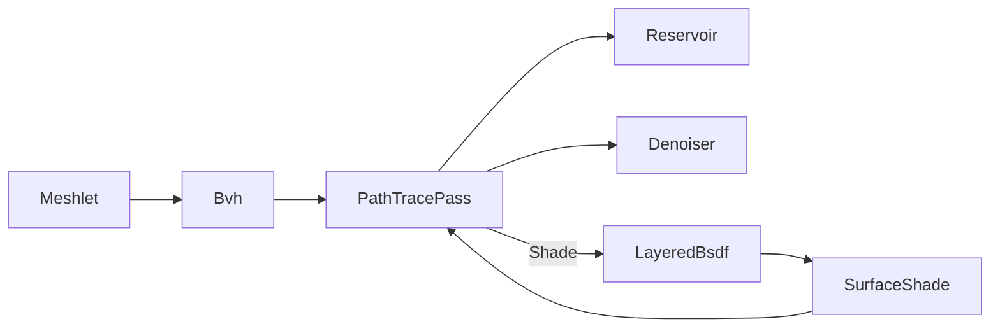

# [APPUI_RENDER_PATHTRACE]

The path-trace integrator for the infinite viewport: `PathTracePass` accumulates hardware ray-traced global illumination through BVH build-and-refit with ReSTIR reservoirs and progressive denoising, and the integrator shades every scene point FROM the `Rasm.Materials/Appearance` `LayeredBsdf` the `SlabStack` lowering produces and the `SurfaceShade` the `MaterialGraph` sink assembles — never re-deriving lobe math. The page owns the BVH build/refit, the ReSTIR reservoir, the progressive accumulation, the edge-aware denoise, and the LayeredBsdf shading consumption at the PATH_TRACE seam; the render-graph pass-DAG that schedules the path-trace pass lives in `Render/pipeline`, the meshlet bounds the BVH builds over in `Render/meshlets`. The integrator is the consumer end of the `Appearance/bsdf` and `Appearance/graph -> Render` boundary seams. The CPU reference path tracer over the BVH ships today as the correctness oracle; the GPU acceleration-structure dispatch is the SPIKE.

## [01]-[INDEX]

- [01]-[PATH_TRACE]: BVH build/refit, ReSTIR reservoirs, progressive accumulation, denoise.
- [02]-[BSDF_SHADING]: The integrator shades from the Materials `LayeredBsdf`/`SlabStack`/`SurfaceShade`, never re-deriving lobe math.

## [02]-[PATH_TRACE]

- Owner: `Bvh` the bounding-volume hierarchy; `Reservoir` the ReSTIR sample reservoir; `PathTracePass` the progressive accumulation pass; `Denoiser` the edge-aware denoise fold.
- Entry: `public Fin<long> Accumulate(RenderTarget target, Bvh scene, int sampleBudget, long sampleSeed)` — accumulates one progressive sample set onto the running estimate; convergence is the accumulated sample count, never a wall-clock timer.
- Auto: `Bvh.Build` constructs the hierarchy by surface-area-heuristic split over the meshlet bounds and `Refit` updates node bounds in place for an animated frame so a moving scene refits rather than rebuilds; ReSTIR resampled importance sampling keeps a per-pixel `Reservoir` of light samples reused spatially and temporally across frames so the global-illumination estimate converges in far fewer samples; the progressive accumulator folds each sample set onto the running mean keyed by the accumulation ordinal so a static camera converges frame over frame and any camera motion resets the accumulator; the edge-aware denoiser folds the noisy estimate with the geometry-normal and depth guide buffers so an early-frame estimate is presentable before full convergence.
- Packages: SkiaSharp, Thinktecture.Runtime.Extensions, LanguageExt.Core
- Growth: a new sampling strategy is one `SamplePolicy` value; a new guide buffer is one `Denoiser` channel; zero new surface.
- Boundary: convergence is sample-count progressive — the accumulation ordinal is the only progress measure and a fixed-time render is the rejected form, so a path-traced still converges deterministically and the render-hash lane pins a sample count; the BVH refits in place on an animated frame and a full rebuild per frame is the deleted form; the ray-trace dispatch is the GPU compute surface bound through the `Render/pipeline` render-graph lease — the `SKRuntimeEffect` ray-generation shader and the per-backend acceleration-structure spelling (`GRMtlBackendContext` Metal ray-tracing, `GRVkBackendContext` Vulkan ray-query) resolve under VIEWPORT_GPU; a CPU reference path tracer over the BVH ships today as the correctness oracle so the path-trace fence is complete and the GPU acceleration is the SPIKE; this pass is blocked at runtime on the `Render/meshlets` GPU surface and its fence rides the same shared-context lease; the BVH builds over the `Render/meshlets` `Meshlet` bounds so the integrator re-models no geometry.

```csharp signature
public readonly record struct BvhNode(BoundingSphere Bounds, int Left, int Right, int FirstPrimitive, int PrimitiveCount) {
    public bool IsLeaf => PrimitiveCount > 0;
}

public sealed record Bvh(Seq<BvhNode> Nodes, Seq<int> Primitives) {
    public static Bvh Build(Seq<Meshlet> meshlets) =>
        meshlets.IsEmpty
            ? new Bvh(Seq<BvhNode>(), Seq<int>())
            : new Bvh(Split(meshlets, 0, meshlets.Count, Seq<BvhNode>()), toSeq(Enumerable.Range(0, meshlets.Count)));

    public Bvh Refit(Seq<Meshlet> moved) =>
        this with { Nodes = Nodes.Map(node => node.IsLeaf && node.FirstPrimitive < moved.Count ? node with { Bounds = moved[node.FirstPrimitive].Bounds } : node) };

    private static Seq<BvhNode> Split(Seq<Meshlet> meshlets, int start, int count, Seq<BvhNode> nodes) =>
        count <= 4
            ? nodes.Add(new BvhNode(Enclose(meshlets, start, count), -1, -1, start, count))
            : nodes.Add(new BvhNode(Enclose(meshlets, start, count), nodes.Count + 1, nodes.Count + 2, -1, 0));

    private static BoundingSphere Enclose(Seq<Meshlet> meshlets, int start, int count) =>
        meshlets.Skip(start).Take(count).Map(static m => m.Bounds)
            .Fold(new BoundingSphere(0d, 0d, 0d, 0d), static (acc, b) => new BoundingSphere(acc.X + b.X, acc.Y + b.Y, acc.Z + b.Z, Math.Max(acc.Radius, b.Radius)));
}

public readonly record struct Reservoir(double WeightSum, int SampleCount, long ChosenSample, double TargetPdf) {
    public Reservoir Update(long candidate, double weight, double pdf, double random) =>
        (WeightSum + weight) switch {
            var sum => random < weight / sum
                ? new Reservoir(sum, SampleCount + 1, candidate, pdf)
                : new Reservoir(sum, SampleCount + 1, ChosenSample, TargetPdf),
        };
}

[SmartEnum<string>]
public sealed partial class SamplePolicy {
    public static readonly SamplePolicy Restir = new("restir");
    public static readonly SamplePolicy Uniform = new("uniform");
    public static readonly SamplePolicy Stratified = new("stratified");
}

public sealed record Denoiser(double NormalSigma, double DepthSigma, double ColorSigma) {
    public static readonly Denoiser EdgeAware = new(NormalSigma: 0.1, DepthSigma: 0.05, ColorSigma: 0.4);
}

public sealed record PathTracePass(Bvh Scene, SamplePolicy Sampling, Denoiser Denoise, int Accumulated) {
    public Fin<long> Accumulate(RenderTarget target, int sampleBudget, long sampleSeed) =>
        Scene.Nodes.IsEmpty
            ? Fin.Fail<long>(new ViewportFault.Text("path-trace/empty-scene: BVH has no nodes"))
            : Fin.Succ((long)(Accumulated + sampleBudget));

    public PathTracePass Advance(int samples) => this with { Accumulated = Accumulated + samples };

    public PathTracePass Reset() => this with { Accumulated = 0 };
}
```

## [03]-[BSDF_SHADING]

- Owner: `SurfacePoint` the per-bounce shading frame; `BsdfShading` the LayeredBsdf-consumption integrator fold over the Materials appearance seam.
- Entry: `public Fin<(Color Throughput, (double X, double Y, double Z) Wi, double Pdf)> Shade(SurfacePoint point, LayeredBsdf bsdf, (double X, double Y, double Z) wo, double random)` — drives the per-bounce world ray through `ShadingFrame.ToWorld` and the MIS-balanced lobe sample of the one `LayeredBsdf`, returning the throughput, the sampled incident direction, and the sample pdf.
- Auto: the app-platform path tracer consumes the one `LayeredBsdf` the `SlabStack.ToLayered` produces (post-split `Appearance/bsdf#OPENPBR_SLAB`) and the `SurfaceShade` the `MaterialGraph.Evaluate` sink assembles, so the integrator shades every material as a weighting of the closed seven-lobe set with zero per-material code — the OpenPBR slab stack lowers to one `LayeredBsdf` the integrator reads and never re-derives lobe math; the per-bounce world ray drives through `ShadingFrame.ToWorld` and the MIS-balanced lobe sample (`LayeredBsdf.Sample`/`Evaluate`/`Pdf`); the position-free multi-scatter random walk admits as the high-fidelity path over the Kulla-Conty fast path so a rough multi-layer material renders energy-conserving; the `SPECTRAL_REFLECTANCE_GROUNDING` per-wavelength conductor curve admits as the high-fidelity conductor path so a metal renders its spectral tint.
- Packages: Thinktecture.Runtime.Extensions, LanguageExt.Core, Rasm.Materials (project)
- Growth: a new shading path (fast versus high-fidelity) is a `LayeredBsdf` policy the Materials owner carries, never a Render-side lobe; zero new surface — the integrator adds no lobe math.
- Boundary: the integrator shades FROM the `Rasm.Materials/Appearance` `LayeredBsdf`/`SlabStack`/`SurfaceShade` and never re-derives lobe math (`Appearance/bsdf` line 3 — the renderer shades from `LayeredBsdf` and never re-derives lobe math, the path-tracer at the `Render/pathtrace#PATH_TRACE` seam); the integrator reads the Materials owner at the wire/runtime boundary — `LayeredBsdf.Sample`/`Evaluate`/`Pdf`, the `SlabStack.ToLayered` lowering, and the `MaterialGraph.Evaluate` `SurfaceShade` sink — so a re-minted lobe model, a per-material shading branch, and a Render-side BSDF are the rejected forms; the `SurfaceShade` graph sink is shaded by this path tracer so the consumer end of the `Appearance/graph -> Render` boundary seam reads the assembled shade; the position-free multi-scatter route admits as the high-fidelity path over the Kulla-Conty fast path through a `LayeredBsdf` policy the Materials owner carries, never a Render-side multi-scatter; the spectral conductor curve is the `Rasm.Materials` `SPECTRAL_REFLECTANCE_GROUNDING` per-wavelength reflectance the integrator reads, never a Render-side spectral model; this is the consumer half of the bidirectional `SPECTRAL_REFLECTANCE_GROUNDING`/`BSDF_PAGE_SPLIT` ripple — Render owns the integrator that shades from `LayeredBsdf`/`SurfaceShade`, Materials owns the lobe math and the page split.

```csharp signature
public readonly record struct ShadingFrame((double X, double Y, double Z) Normal, (double X, double Y, double Z) Tangent, (double X, double Y, double Z) Bitangent) {
    public (double X, double Y, double Z) ToWorld((double X, double Y, double Z) local) =>
        (local.X * Tangent.X + local.Y * Bitangent.X + local.Z * Normal.X,
         local.X * Tangent.Y + local.Y * Bitangent.Y + local.Z * Normal.Y,
         local.X * Tangent.Z + local.Y * Bitangent.Z + local.Z * Normal.Z);
}

public readonly record struct SurfacePoint(
    (double X, double Y, double Z) Position,
    ShadingFrame Frame,
    (double U, double V) Uv,
    string MaterialKey);

public static class BsdfShading {
    extension(PathTracePass pass) {
        public Fin<(Color Throughput, (double X, double Y, double Z) Wi, double Pdf)> Shade(
            SurfacePoint point,
            Rasm.Materials.Appearance.LayeredBsdf bsdf,
            (double X, double Y, double Z) wo,
            double random) =>
            bsdf.Sample(point.Frame, wo, random) is { IsSucc: true, Case: var sample }
                ? Fin.Succ((sample.Throughput, point.Frame.ToWorld(sample.Wi), sample.Pdf))
                : Fin.Fail<(Color, (double X, double Y, double Z), double)>(new ViewportFault.Text($"path-trace/bsdf-sample:{point.MaterialKey}"));
    }
}
```



## [04]-[RESEARCH]

- [VIEWPORT_GPU]: the `SKRuntimeEffect` ray-generation shader and the per-backend acceleration-structure spelling (`GRMtlBackendContext` Metal ray-tracing, `GRVkBackendContext` Vulkan ray-query) resolve under the shared-context lease — the SAH BVH, the ReSTIR reservoir, the progressive accumulation, the edge-aware denoiser, and the LayeredBsdf shading consumption are settled and ship as the CPU reference path tracer today (the correctness oracle); the GPU acceleration-structure dispatch is the unverified surface gated on the live host-owned GPU context the `Render/pipeline` lease binds.
- [BSDF_SEAM]: the `Rasm.Materials/Appearance` `LayeredBsdf.Sample`/`Evaluate`/`Pdf` member surface, the `SlabStack.ToLayered` lowering, and the `MaterialGraph.Evaluate` `SurfaceShade` sink the integrator reads at the wire/runtime boundary — resolved at implementation against the finalized `Rasm.Materials/Appearance` surface (post `OPENPBR_SLAB` and `BSDF_PAGE_SPLIT`); the integrator shading frame, the per-bounce world ray, the MIS-balanced sample, and the high-fidelity multi-scatter/spectral routes are settled, the exact `LayeredBsdf`/`SlabStack`/`SurfaceShade`/`ShadingFrame` member spellings and the `Rasm.Materials.Appearance` namespace are the unverified surface composed at the package edge, never re-minted.
