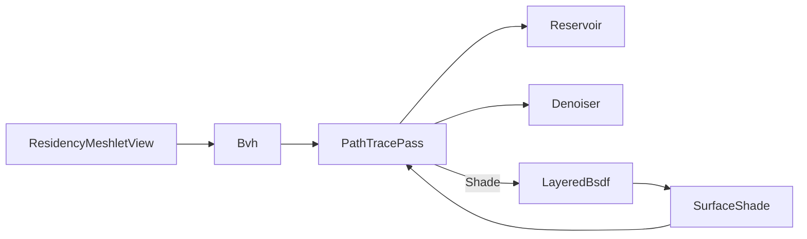

# [APPUI_RENDER_PATHTRACE]

The path-trace integrator for the infinite viewport: `PathTracePass` accumulates hardware ray-traced global illumination through BVH build-and-refit with ReSTIR reservoirs and progressive denoising, and the integrator shades every scene point FROM the `Rasm.Materials/Appearance` `LayeredBsdf` the `SlabStack` lowering produces and the `SurfaceShade` the `MaterialGraph` sink assembles — never re-deriving lobe math. The page owns the BVH build/refit, the ReSTIR reservoir, the progressive accumulation, the edge-aware denoise, and the LayeredBsdf shading consumption at the PATH_TRACE seam; the render-graph pass-DAG that schedules the path-trace pass lives in `Render/pipeline`, the meshlet bounds the BVH builds over in `Render/meshlets`. The integrator is the consumer end of the `Appearance/bsdf` and `Appearance/graph -> Render` boundary seams. The CPU reference path tracer over the BVH is the correctness oracle; the GPU acceleration-structure dispatch is the SPIKE.

## [01]-[INDEX]

- [02]-[PATH_TRACE]: Real recursive SAH BVH, kernel-shaped degradation refit, ReSTIR reservoirs, honest accumulation, denoise.
- [03]-[LIGHT_RIG]: The ONE `LightSource` row family shared by both integrators; the Compute solar-position composition.
- [04]-[BSDF_SHADING]: The integrator shades from the Materials `LayeredBsdf`/`SlabStack`/`SurfaceShade`, never re-deriving lobe math.

## [02]-[PATH_TRACE]

- Owner: `Bvh` the bounding-volume hierarchy — PAGE-LOCAL and PRIVATE (a measured oracle kernel over wire-decoded meshlet bounds; the kernel spatial engine is the federation broad-phase owner behind the `[PLACEMENT_LAW]`(e) firebreak, its cross-package acceleration crossing stays wire-shaped `SpatialAnswer.Wire` `NodeLinkProjection`, so an AppUi acceleration wire or a second exported BVH is unrepresentable); `Reservoir` the ReSTIR sample reservoir; `PathTracePass` the progressive accumulation pass; `Denoiser` the edge-aware denoise fold.
- Entry: `public Fin<AccumulationTarget> Accumulate(AccumulationTarget target, ViewCamera camera, LightRig rig, int sampleBudget, long sampleSeed)` — accumulates one progressive sample set onto the running per-pixel mean under the one camera row and returns the ADVANCED `AccumulationTarget` (`Ordinal + sampleBudget`), so two sequential batches against one target produce the weighted mean of both and the next pass reads the total sample count from the same state owner; convergence is the accumulated sample count, never a wall-clock timer.
- Auto: `Bvh.Build` constructs the hierarchy by a REAL recursive surface-area-heuristic split over the meshlet bounds — children emitted, leaf criterion at four primitives or no cost-improving split; `Refit` is a REAL bottom-up re-bound (leaves re-enclose their moved primitives, interior nodes re-enclose their two children in reverse emission order) and `Maintain` adopts the kernel `[DEGRADATION_REFIT]` shape (`Rasm/.planning/Spatial/index.md`): topology-stable in-place re-bounding plus a deterministic `SahCost` rebuild trigger, so a moving scene refits until quality degrades measurably and then rebuilds deterministically; ReSTIR resampled importance sampling keeps a per-pixel `Reservoir` of light samples from the `LightRig` reused spatially and temporally across frames; the progressive accumulator folds each sample set onto the running mean keyed by the accumulation ordinal and advances that ordinal on the returned target — `AccumulationTarget` is the ONE progression owner (`Of` mints it, `Advanced` weights the next batch, `Reset` serves camera motion) and no second sample counter exists — so a static camera converges frame over frame and the render graph resets the same target on camera motion; the edge-aware denoiser folds the noisy estimate with the geometry-normal and depth guide buffers so an early-frame estimate is presentable before full convergence.
- Packages: SkiaSharp, Thinktecture.Runtime.Extensions, LanguageExt.Core
- Growth: a new sampling strategy is one `SamplePolicy` value; a new guide buffer is one `Denoiser` channel; zero new surface.
- Boundary: convergence is sample-count progressive — the accumulation ordinal is the only progress measure and a fixed-time render is the rejected form, so a path-traced still converges deterministically and the render-hash lane pins a sample count; the BVH refits in place on an animated frame and a full rebuild per frame is the deleted form — the rebuild fires only through the `Maintain` cost trigger; the ray-trace dispatch is the GPU compute surface bound through the `Render/pipeline` render-graph lease — the `SKRuntimeEffect` ray-generation shader and the per-backend acceleration-structure spelling resolve under VIEWPORT_GPU; the CPU reference path tracer over the BVH is the correctness oracle — it now has light to transport (the `LightRig`), so the oracle renders a lit image by construction and comparability with the raster path holds because BOTH integrators read the same rig; the GPU acceleration is the SPIKE; the BVH builds over the Compute-decoded `Render/meshlets` cluster bounds so the integrator re-models no geometry.

```csharp signature
public readonly record struct BvhNode(BoundingSphere Bounds, int Left, int Right, int FirstPrimitive, int PrimitiveCount) {
    public bool IsLeaf => PrimitiveCount > 0;
}

public sealed record Bvh(ImmutableArray<BvhNode> Nodes, ImmutableArray<int> Primitives, ImmutableArray<BoundingSphere> PrimitiveBounds) {
    private const int LeafSize = 4;

    public static Bvh Build(Seq<ResidencyMeshletView> meshlets) {
        if (meshlets.IsEmpty) { return new Bvh([], [], []); }
        int[] prims = [.. Enumerable.Range(0, meshlets.Count)];
        List<BvhNode> nodes = [];
        BuildNode(meshlets, prims, 0, meshlets.Count, nodes);
        return new Bvh([.. nodes], [.. prims], [.. meshlets.Map(static m => m.Bounds)]);
    }

    // Closest-hit sphere traversal — the oracle's one intersection kernel, shared by primary, shadow,
    // and continuation rays; an explicit stack walk, front-to-back by child hit distance.
    public Option<(int Primitive, double T)> Intersect((double X, double Y, double Z) origin, (double X, double Y, double Z) direction, double tMax) {
        if (Nodes.IsEmpty) { return None; }
        var best = (Primitive: -1, T: tMax);
        Stack<int> walk = new([0]);
        while (walk.TryPop(out int at)) {
            BvhNode node = Nodes[at];
            if (RaySphere(origin, direction, node.Bounds) is not { } enter || enter > best.T) { continue; }
            if (node.IsLeaf) {
                for (int p = node.FirstPrimitive; p < node.FirstPrimitive + node.PrimitiveCount; p++) {
                    int prim = Primitives[p];
                    if (RaySphere(origin, direction, PrimitiveBounds[prim]) is { } t && t < best.T) { best = (prim, t); }
                }
            }
            else { walk.Push(node.Left); walk.Push(node.Right); }
        }
        return best.Primitive >= 0 ? Some((best.Primitive, best.T)) : None;
    }

    private static double? RaySphere((double X, double Y, double Z) origin, (double X, double Y, double Z) direction, BoundingSphere sphere) {
        (double ox, double oy, double oz) = (sphere.X - origin.X, sphere.Y - origin.Y, sphere.Z - origin.Z);
        double along = (ox * direction.X) + (oy * direction.Y) + (oz * direction.Z);
        double square = (ox * ox) + (oy * oy) + (oz * oz) - (along * along);
        double radius2 = sphere.Radius * sphere.Radius;
        if (square > radius2) { return null; }
        double offset = Math.Sqrt(radius2 - square);
        double near = along - offset;
        return near > 1e-6 ? near : along + offset > 1e-6 ? along + offset : null;
    }

    // Real recursive SAH: parent reserves its slot, children EMIT and back-patch — a leaf lands only at
    // LeafSize primitives or when no candidate split beats the leaf cost. Statement-bodied boundary kernel.
    private static int BuildNode(Seq<ResidencyMeshletView> meshlets, int[] prims, int start, int count, List<BvhNode> nodes) {
        int self = nodes.Count;
        nodes.Add(default);
        BoundingSphere bounds = Enclose(meshlets, prims, start, count);
        (int mid, double splitCost) = count <= LeafSize ? (start, double.PositiveInfinity) : SahSplit(meshlets, prims, start, count);
        if (count <= LeafSize || splitCost >= count * bounds.SurfaceArea()) {
            nodes[self] = new BvhNode(bounds, -1, -1, start, count);
            return self;
        }
        int left = BuildNode(meshlets, prims, start, mid - start, nodes);
        int right = BuildNode(meshlets, prims, mid, (start + count) - mid, nodes);
        nodes[self] = new BvhNode(bounds, left, right, -1, 0);
        return self;
    }

    // SAH over the longest centroid axis: sort the slice by centroid, sweep prefix/suffix enclosures,
    // return the minimum-cost partition point and its cost.
    private static (int Mid, double Cost) SahSplit(Seq<ResidencyMeshletView> meshlets, int[] prims, int start, int count) {
        int axis = LongestAxis(meshlets, prims, start, count);
        Array.Sort(prims, start, count, Comparer<int>.Create((a, b) => Centroid(meshlets[a], axis).CompareTo(Centroid(meshlets[b], axis))));
        var best = (Mid: start + (count / 2), Cost: double.PositiveInfinity);
        for (var split = 1; split < count; split++) {
            double cost =
                (split * Enclose(meshlets, prims, start, split).SurfaceArea())
                + ((count - split) * Enclose(meshlets, prims, start + split, count - split).SurfaceArea());
            if (cost < best.Cost) { best = (start + split, cost); }
        }
        return best;
    }

    // Real enclosing sphere: centroid mean, radius = max(center distance + primitive radius) — a
    // center-sum with a bare max-radius is the deleted form.
    private static BoundingSphere Enclose(Seq<ResidencyMeshletView> meshlets, int[] prims, int start, int count) {
        var (cx, cy, cz) = (0d, 0d, 0d);
        for (var at = start; at < start + count; at++) {
            BoundingSphere b = meshlets[prims[at]].Bounds;
            cx += b.X; cy += b.Y; cz += b.Z;
        }
        (cx, cy, cz) = (cx / count, cy / count, cz / count);
        var radius = 0d;
        for (var at = start; at < start + count; at++) {
            BoundingSphere b = meshlets[prims[at]].Bounds;
            radius = Math.Max(radius, Math.Sqrt(((b.X - cx) * (b.X - cx)) + ((b.Y - cy) * (b.Y - cy)) + ((b.Z - cz) * (b.Z - cz))) + b.Radius);
        }
        return new BoundingSphere(cx, cy, cz, radius);
    }

    private static int LongestAxis(Seq<ResidencyMeshletView> meshlets, int[] prims, int start, int count) {
        var (minX, minY, minZ, maxX, maxY, maxZ) = (double.MaxValue, double.MaxValue, double.MaxValue, double.MinValue, double.MinValue, double.MinValue);
        for (var at = start; at < start + count; at++) {
            BoundingSphere b = meshlets[prims[at]].Bounds;
            (minX, minY, minZ) = (Math.Min(minX, b.X), Math.Min(minY, b.Y), Math.Min(minZ, b.Z));
            (maxX, maxY, maxZ) = (Math.Max(maxX, b.X), Math.Max(maxY, b.Y), Math.Max(maxZ, b.Z));
        }
        var (dx, dy, dz) = (maxX - minX, maxY - minY, maxZ - minZ);
        return dx >= dy && dx >= dz ? 0 : dy >= dz ? 1 : 2;
    }

    private static double Centroid(ResidencyMeshletView meshlet, int axis) =>
        axis == 0 ? meshlet.Bounds.X : axis == 1 ? meshlet.Bounds.Y : meshlet.Bounds.Z;

    // Real bottom-up refit: children always emit AFTER their parent slot reserves, so a reverse walk
    // re-bounds every leaf from its moved primitives first, then every interior node from its two children.
    public Bvh Refit(Seq<ResidencyMeshletView> moved) {
        BvhNode[] nodes = [.. Nodes];
        for (var at = nodes.Length - 1; at >= 0; at--) {
            BvhNode node = nodes[at];
            nodes[at] = node.IsLeaf
                ? node with { Bounds = EncloseLeaf(moved, node) }
                : node with { Bounds = EnclosePair(nodes[node.Left].Bounds, nodes[node.Right].Bounds) };
        }
        return this with { Nodes = [.. nodes], PrimitiveBounds = [.. moved.Map(static m => m.Bounds)] };
    }

    private BoundingSphere EncloseLeaf(Seq<ResidencyMeshletView> moved, BvhNode leaf) {
        int[] prims = [.. Primitives];
        return Enclose(moved, prims, leaf.FirstPrimitive, leaf.PrimitiveCount);
    }

    private static BoundingSphere EnclosePair(BoundingSphere a, BoundingSphere b) {
        var d = Math.Sqrt(((b.X - a.X) * (b.X - a.X)) + ((b.Y - a.Y) * (b.Y - a.Y)) + ((b.Z - a.Z) * (b.Z - a.Z)));
        if (d + b.Radius <= a.Radius) { return a; }
        if (d + a.Radius <= b.Radius) { return b; }
        var radius = (d + a.Radius + b.Radius) / 2d;
        var t = d <= 0d ? 0d : (radius - a.Radius) / d;
        return new BoundingSphere(a.X + ((b.X - a.X) * t), a.Y + ((b.Y - a.Y) * t), a.Z + ((b.Z - a.Z) * t), radius);
    }

    // Kernel [DEGRADATION_REFIT] shape: topology-stable in-place re-bounding with a deterministic
    // SahCost rebuild trigger — refit until measured quality degrades past the factor, then rebuild.
    public Bvh Maintain(Seq<ResidencyMeshletView> moved, double rebuildFactor = 1.5) =>
        Refit(moved) switch {
            var refit => refit.SahCost() > SahCost() * rebuildFactor ? Build(moved) : refit,
        };

    public double SahCost() =>
        Nodes.Sum(static node => node.IsLeaf ? node.PrimitiveCount * node.Bounds.SurfaceArea() : node.Bounds.SurfaceArea());
}

public readonly record struct Reservoir(double WeightSum, int SampleCount, long ChosenSample, double TargetPdf) {
    public Reservoir Update(long candidate, double weight, double pdf, double random) =>
        (WeightSum + weight) switch {
            var sum => random < weight / sum
                ? new Reservoir(sum, SampleCount + 1, candidate, pdf)
                : new Reservoir(sum, SampleCount + 1, ChosenSample, TargetPdf),
        };
}

[SmartEnum<string>]
public sealed partial class SamplePolicy {
    public static readonly SamplePolicy Restir = new("restir");
    public static readonly SamplePolicy Uniform = new("uniform");
    public static readonly SamplePolicy Stratified = new("stratified");
}

public sealed record Denoiser(double NormalSigma, double DepthSigma, double ColorSigma) {
    public static readonly Denoiser EdgeAware = new(NormalSigma: 0.1, DepthSigma: 0.05, ColorSigma: 0.4);
}

// The per-pixel running mean and its sample ordinal — the ONE progressive-state owner: Advanced weights
// the next batch, Reset serves camera motion, and no second sample counter exists anywhere.
public sealed record AccumulationTarget(int Width, int Height, float[] Rgba, long Ordinal) {
    public static AccumulationTarget Of(int width, int height) => new(width, height, new float[width * height * 4], 0L);

    public AccumulationTarget Advanced(int samples) => this with { Ordinal = Ordinal + samples };

    public AccumulationTarget Reset() {
        Array.Clear(Rgba);
        return this with { Ordinal = 0L };
    }
}

public sealed record PathTracePass(Bvh Scene, SamplePolicy Sampling, Denoiser Denoise, Func<SurfacePoint, Rasm.Materials.Appearance.LayeredBsdf> MaterialOf) {
    // Honest integrate-or-gate: an empty scene or a lightless rig gates; the integrate arm traces
    // sampleBudget paths per pixel through the private CPU oracle kernel below and returns the target
    // advanced by exactly the samples it folded into the mean.
    public Fin<AccumulationTarget> Accumulate(AccumulationTarget target, ViewCamera camera, LightRig rig, int sampleBudget, long sampleSeed) =>
        Scene.Nodes.IsEmpty
            ? Fin.Fail<AccumulationTarget>(new ViewportFault.Text("path-trace/empty-scene: BVH has no nodes"))
            : rig.Rows.IsEmpty
                ? Fin.Fail<AccumulationTarget>(new ViewportFault.Text("path-trace/no-light: the rig carries zero LightSource rows"))
                : Fin.Succ(Integrate(target, camera, rig, sampleBudget, sampleSeed));

    // Statement-bodied oracle kernel — deterministic per-(pixel, ordinal, seed) sequence so the render-hash
    // lane pins a sample count. Path shape: primary ray -> closest hit (miss folds environment) -> NEE over
    // the Sun/Emissive/Spot/Area/Ies rows (shadow rays through the same Intersect kernel, throughput via
    // the Materials Evaluate seam) -> ONE BSDF-sampled continuation into the environment. GPU twin stays SPIKE-gated.
    private AccumulationTarget Integrate(AccumulationTarget target, ViewCamera camera, LightRig rig, int sampleBudget, long sampleSeed) {
        (double fx, double fy, double fz) = Normalize(camera.TargetX - camera.EyeX, camera.TargetY - camera.EyeY, camera.TargetZ - camera.EyeZ);
        (double rx, double ry, double rz) = Normalize(Cross(fx, fy, fz, camera.UpX, camera.UpY, camera.UpZ));
        (double ux, double uy, double uz) = Cross(rx, ry, rz, fx, fy, fz);
        double half = Math.Tan(double.DegreesToRadians(camera.FieldOfView) / 2d);
        double aspect = target.Width / (double)target.Height;
        for (int py = 0; py < target.Height; py++) {
            for (int px = 0; px < target.Width; px++) {
                (double r, double g, double b) batch = (0d, 0d, 0d);
                for (int s = 0; s < sampleBudget; s++) {
                    ulong state = Mix(((ulong)(uint)((py * target.Width) + px) << 32) ^ (ulong)(target.Ordinal + s) ^ (ulong)sampleSeed);
                    double ndcX = ((px + Next(ref state)) / target.Width * 2d - 1d) * half * aspect;
                    double ndcY = (1d - ((py + Next(ref state)) / target.Height * 2d)) * half;
                    (double dx, double dy, double dz) = Normalize(
                        fx + (ndcX * rx) + (ndcY * ux), fy + (ndcX * ry) + (ndcY * uy), fz + (ndcX * rz) + (ndcY * uz));
                    (double lr, double lg, double lb) = Radiance((camera.EyeX, camera.EyeY, camera.EyeZ), (dx, dy, dz), rig, ref state);
                    batch = (batch.r + lr, batch.g + lg, batch.b + lb);
                }
                long total = target.Ordinal + sampleBudget;
                int slot = ((py * target.Width) + px) * 4;
                target.Rgba[slot + 0] = (float)(((target.Rgba[slot + 0] * target.Ordinal) + batch.r) / total);
                target.Rgba[slot + 1] = (float)(((target.Rgba[slot + 1] * target.Ordinal) + batch.g) / total);
                target.Rgba[slot + 2] = (float)(((target.Rgba[slot + 2] * target.Ordinal) + batch.b) / total);
                target.Rgba[slot + 3] = 1f;
            }
        }
        return target.Advanced(sampleBudget);
    }

    private (double R, double G, double B) Radiance((double X, double Y, double Z) origin, (double X, double Y, double Z) direction, LightRig rig, ref ulong state) =>
        Scene.Intersect(origin, direction, double.MaxValue).Match(
            None: () => Environment(rig, direction),
            Some: hit => Lit(origin, direction, hit, rig, ref state));

    private (double R, double G, double B) Lit((double X, double Y, double Z) origin, (double X, double Y, double Z) direction, (int Primitive, double T) hit, LightRig rig, ref ulong state) {
        BoundingSphere sphere = Scene.PrimitiveBounds[hit.Primitive];
        (double hx, double hy, double hz) = (origin.X + (direction.X * hit.T), origin.Y + (direction.Y * hit.T), origin.Z + (direction.Z * hit.T));
        (double nx, double ny, double nz) = Normalize(hx - sphere.X, hy - sphere.Y, hz - sphere.Z);
        SurfacePoint point = new((hx, hy, hz), FrameOf(nx, ny, nz), (0d, 0d), $"{hit.Primitive}");
        Rasm.Materials.Appearance.LayeredBsdf bsdf = MaterialOf(point);
        (double X, double Y, double Z) wo = (-direction.X, -direction.Y, -direction.Z);
        (double r, double g, double b) sum = (0d, 0d, 0d);
        foreach (LightSource row in rig.Rows) {
            Option<((double X, double Y, double Z) Wi, (double R, double G, double B) Radiance, double TMax)> arm = row switch {
                LightSource.Sun sun => Some((sun.Direction, Rgb(sun.Radiance), double.MaxValue)),
                LightSource.Emissive glow when Toward(point.Position, (glow.X, glow.Y, glow.Z)) is var (wi, distance) =>
                    Some((wi, Scale(Rgb(glow.Radiance), glow.Area / Math.Max(distance * distance, 1e-6)), distance)),
                LightSource.Spot spot when Toward(point.Position, (spot.X, spot.Y, spot.Z)) is var (wi, distance) =>
                    Cone(spot, wi) switch {
                        <= 0d => None,
                        var falloff => Some((wi, Scale(Rgb(spot.Radiance), falloff / Math.Max(distance * distance, 1e-6)), distance)),
                    },
                LightSource.Area panel when Toward(point.Position, (panel.X, panel.Y, panel.Z)) is var (wi, distance) =>
                    Math.Max(Dot(panel.Normal, (-wi.X, -wi.Y, -wi.Z)), 0d) switch {
                        <= 0d => None,
                        var facing => Some((wi, Scale(Rgb(panel.Radiance), facing * panel.Width * panel.Height / Math.Max(distance * distance, 1e-6)), distance)),
                    },
                LightSource.Ies lum when Toward(point.Position, (lum.X, lum.Y, lum.Z)) is var (wi, distance) =>
                    IesCandela(lum, wi) switch {
                        <= 0d => None,
                        var candela => Some((wi, Scale(Rgb(lum.Tint), candela / Math.Max(distance * distance, 1e-6)), distance)),
                    },
                _ => None, // Environment folds on miss, never as NEE
            };
            sum = arm
                .Filter(candidate => Scene.Intersect(Offset(point.Position, candidate.Wi), candidate.Wi, candidate.TMax).IsNone)
                .Bind(candidate => this.Evaluate(point, bsdf, wo, candidate.Wi).ToOption()
                    .Map(throughput => Scale(Mul(Rgb(throughput), candidate.Radiance), Math.Max(Dot(candidate.Wi, (nx, ny, nz)), 0d))))
                .Match(Some: lit => (sum.r + lit.R, sum.g + lit.G, sum.b + lit.B), None: () => sum);
        }
        return this.Shade(point, bsdf, wo, Next(ref state)).ToOption().Match(
            Some: bounce => Scene.Intersect(Offset(point.Position, bounce.Wi), bounce.Wi, double.MaxValue).IsNone
                ? Add(sum, Mul(Rgb(bounce.Throughput), Environment(rig, bounce.Wi)))
                : sum, // one-bounce oracle: a second hit terminates; deeper transport is the GPU twin's
            None: () => sum);
    }

    private static (double R, double G, double B) Environment(LightRig rig, (double X, double Y, double Z) direction) =>
        rig.Rows.Fold((R: 0d, G: 0d, B: 0d), (sum, row) => row switch {
            LightSource.Environment dome => Add(sum, Rgb(dome.Radiance)),
            _ => sum,
        });

    private static ShadingFrame FrameOf(double nx, double ny, double nz) {
        (double tx, double ty, double tz) = Math.Abs(ny) < 0.999
            ? Normalize(Cross(0d, 1d, 0d, nx, ny, nz))
            : (1d, 0d, 0d);
        return new ShadingFrame((nx, ny, nz), (tx, ty, tz), Cross(nx, ny, nz, tx, ty, tz));
    }

    private static ((double X, double Y, double Z) Wi, double Distance) Toward((double X, double Y, double Z) from, (double X, double Y, double Z) to) {
        (double dx, double dy, double dz) = (to.X - from.X, to.Y - from.Y, to.Z - from.Z);
        double distance = Math.Max(Math.Sqrt((dx * dx) + (dy * dy) + (dz * dz)), 1e-9);
        return ((dx / distance, dy / distance, dz / distance), distance);
    }

    private static (double X, double Y, double Z) Offset((double X, double Y, double Z) at, (double X, double Y, double Z) along) =>
        (at.X + (along.X * 1e-4), at.Y + (along.Y * 1e-4), at.Z + (along.Z * 1e-4));

    private static (double R, double G, double B) Rgb(Color color) => (color.R / 255d, color.G / 255d, color.B / 255d);

    private static (double R, double G, double B) Mul((double R, double G, double B) a, (double R, double G, double B) b) => (a.R * b.R, a.G * b.G, a.B * b.B);

    private static (double R, double G, double B) Add((double R, double G, double B) a, (double R, double G, double B) b) => (a.R + b.R, a.G + b.G, a.B + b.B);

    private static (double R, double G, double B) Scale((double R, double G, double B) a, double s) => (a.R * s, a.G * s, a.B * s);

    private static double Dot((double X, double Y, double Z) a, (double X, double Y, double Z) b) => (a.X * b.X) + (a.Y * b.Y) + (a.Z * b.Z);

    private static (double X, double Y, double Z) Normalize(double x, double y, double z) {
        double length = Math.Max(Math.Sqrt((x * x) + (y * y) + (z * z)), 1e-12);
        return (x / length, y / length, z / length);
    }

    private static (double X, double Y, double Z) Normalize((double X, double Y, double Z) v) => Normalize(v.X, v.Y, v.Z);

    private static (double X, double Y, double Z) Cross(double ax, double ay, double az, double bx, double by, double bz) =>
        ((ay * bz) - (az * by), (az * bx) - (ax * bz), (ax * by) - (ay * bx));

    private static ulong Mix(ulong x) {
        x ^= x >> 33; x *= 0xFF51AFD7ED558CCDUL; x ^= x >> 33; x *= 0xC4CEB9FE1A85EC53UL; x ^= x >> 33;
        return x;
    }

    private static double Next(ref ulong state) {
        state = Mix(state + 0x9E3779B97F4A7C15UL);
        return (state >> 11) * (1.0 / (1UL << 53));
    }

    // Spot cone falloff: smooth ramp between the inner (full) and outer (zero) half-angles measured off
    // the aim; wi points surface->light, so the emitter-side direction is -wi.
    private static double Cone(LightSource.Spot spot, (double X, double Y, double Z) wi) {
        double cos = Dot(Normalize(spot.Aim), (-wi.X, -wi.Y, -wi.Z));
        double inner = Math.Cos(double.DegreesToRadians(spot.InnerDeg));
        double outer = Math.Cos(double.DegreesToRadians(spot.OuterDeg));
        return Math.Clamp((cos - outer) / Math.Max(inner - outer, 1e-6), 0d, 1d);
    }

    // IES candela toward the shading point: polar off the aim axis, azimuth in the aim frame, sampled
    // bilinearly from the photometric web and scaled by LumenScale.
    private static double IesCandela(LightSource.Ies lum, (double X, double Y, double Z) wi) {
        (double ax, double ay, double az) = Normalize(lum.Aim);
        ShadingFrame frame = FrameOf(ax, ay, az);
        (double X, double Y, double Z) toward = (-wi.X, -wi.Y, -wi.Z);
        double polar = double.RadiansToDegrees(Math.Acos(Math.Clamp(Dot(toward, (ax, ay, az)), -1d, 1d)));
        double azimuth = double.RadiansToDegrees(Math.Atan2(Dot(toward, frame.Bitangent), Dot(toward, frame.Tangent)));
        return lum.Web.Sample(azimuth, polar) * lum.LumenScale;
    }
}
```

## [03]-[LIGHT_RIG]

- Owner: `LightSource` `[Union]` — the ONE closed light row family (Environment | Sun | Emissive | Spot | Area | Ies, seed DATA per `[GENERATOR_LAW]`); `PhotometricWeb` the decoded IES/LDT candela table; `LightRig` — the scene light set BOTH integrators read.
- Cases: Environment (uniform or HDR-dome radiance), Sun (site-anchored directional), Emissive (mesh-attached area emitter), Spot (inner/outer cone falloff), Area (rectangular panel with emitter-cosine), Ies (manufacturer luminaire shaped by its photometric web) — the AEC luminaire vocabulary both integrators evaluate; IES is the standard architectural photometry format, so a manufacturer fixture is one `Ies` row over decoded web data, never a bespoke emitter kind.
- Entry: `public static LightSource SunAt(SolarSite site, Instant at)` — the Sun row derives from the Bim `GeoReference` seam plus the NodaTime instant under `ClockPolicy`, its azimuth/altitude COMPOSING the LANDED Compute solar-position export `SolarPosition.At(SolarSite, Instant) -> SunPosition` (the declared `[APPUI_SUN_EXPORT]` package-boundary row on `Analysis/daylight.md` naming the AppUi viewport sun-light) — never a second geodesy or solar-position kernel.
- Auto: the raster shading path (`Render/shading.md`) and this oracle integrator read the SAME rig — one light rig, two integrators, comparability by construction; the ReSTIR reservoir samples candidates from the rig rows; a reduced-quality tier caps rig evaluation through the governor pass mask, never a second light list.
- Packages: Thinktecture.Runtime.Extensions, LanguageExt.Core, NodaTime, Rasm.Compute (project), Rasm.Bim (boundary wire)
- Growth: a new emitter kind is one `LightSource` case; a new sun site is a `SolarSite` value from the Bim `GeoReference` lowering; zero new surface.
- Boundary: the `SolarPosition.At` crossing is a declared `[V9]` ledger row (`Render/pathtrace` <- Compute `Analysis/daylight`); the `GeoReference`-to-`SolarSite` lowering is Bim-owned and arrives as values; the IES/LDT file decode is an asset-boundary admission that lands a validated `PhotometricWeb` value (`Of` rejects unsorted grids and a non-total candela table) so the rig row consumes decoded data and no light row ever parses a file; a Render-side solar ephemeris, a second light vocabulary on any Render page, or a per-integrator light list is the deleted form.

```csharp signature
// The decoded IES/LDT photometric web: sorted polar/azimuth degree grids plus the candela table
// (Candela[(azimuth * PolarDeg.Length) + polar]); the file decode is an asset-boundary admission and
// Of is the one validated constructor.
public sealed record PhotometricWeb(ImmutableArray<double> PolarDeg, ImmutableArray<double> AzimuthDeg, ImmutableArray<double> Candela) {
    public static Fin<PhotometricWeb> Of(ImmutableArray<double> polarDeg, ImmutableArray<double> azimuthDeg, ImmutableArray<double> candela) =>
        polarDeg.Length >= 2 && azimuthDeg.Length >= 1 && candela.Length == polarDeg.Length * azimuthDeg.Length
            && polarDeg.Zip(polarDeg.Skip(1)).All(static pair => pair.First < pair.Second)
            && azimuthDeg.Zip(azimuthDeg.Skip(1)).All(static pair => pair.First < pair.Second)
            ? Fin.Succ(new PhotometricWeb(polarDeg, azimuthDeg, candela))
            : Fin.Fail<PhotometricWeb>(new ViewportFault.Text("light/ies-web: grids must be sorted and the table total"));

    // Bilinear candela over both grids; polar clamps to the measured range, azimuth wraps at 360.
    public double Sample(double azimuthDeg, double polarDeg) {
        (int a0, int a1, double at) = Bracket(AzimuthDeg, ((azimuthDeg % 360d) + 360d) % 360d);
        (int p0, int p1, double pt) = Bracket(PolarDeg, Math.Clamp(polarDeg, PolarDeg[0], PolarDeg[^1]));
        double low = Mix(Candela[(a0 * PolarDeg.Length) + p0], Candela[(a0 * PolarDeg.Length) + p1], pt);
        double high = Mix(Candela[(a1 * PolarDeg.Length) + p0], Candela[(a1 * PolarDeg.Length) + p1], pt);
        return Mix(low, high, at);
    }

    private static (int Lo, int Hi, double T) Bracket(ImmutableArray<double> grid, double value) {
        for (int at = 1; at < grid.Length; at++) {
            if (value <= grid[at]) { return (at - 1, at, (value - grid[at - 1]) / Math.Max(grid[at] - grid[at - 1], 1e-9)); }
        }
        return (grid.Length - 1, grid.Length - 1, 0d);
    }

    private static double Mix(double a, double b, double t) => a + ((b - a) * t);
}

[Union(ConversionFromValue = ConversionOperatorsGeneration.None)]
public abstract partial record LightSource {
    private LightSource() { }
    public sealed record Environment(string Key, Color Radiance, Option<string> HdrAssetKey) : LightSource;
    public sealed record Sun(string Key, double AzimuthDeg, double AltitudeDeg, Color Radiance) : LightSource;
    public sealed record Emissive(string Key, string MeshKey, Color Radiance, double Area, double X, double Y, double Z) : LightSource;
    public sealed record Spot(string Key, double X, double Y, double Z, (double X, double Y, double Z) Aim, double InnerDeg, double OuterDeg, Color Radiance) : LightSource;
    public sealed record Area(string Key, double X, double Y, double Z, (double X, double Y, double Z) Normal, double Width, double Height, Color Radiance) : LightSource;
    public sealed record Ies(string Key, double X, double Y, double Z, (double X, double Y, double Z) Aim, PhotometricWeb Web, Color Tint, double LumenScale) : LightSource;

    // The Compute solar export composed: SunPosition azimuth/altitude become the directional row.
    public static LightSource SunAt(SolarSite site, Instant at, Color radiance) =>
        SolarPosition.At(site, at) switch {
            var sun => new Sun($"sun@{at}", sun.AzimuthDeg, sun.AltitudeDeg, radiance),
        };

    public (double X, double Y, double Z) Direction => this switch {
        Sun sun => (
            Math.Cos(Rad(sun.AltitudeDeg)) * Math.Sin(Rad(sun.AzimuthDeg)),
            Math.Sin(Rad(sun.AltitudeDeg)),
            Math.Cos(Rad(sun.AltitudeDeg)) * Math.Cos(Rad(sun.AzimuthDeg))),
        Spot spot => spot.Aim,
        Ies lum => lum.Aim,
        _ => (0d, 1d, 0d),
    };

    private static double Rad(double deg) => deg * Math.PI / 180d;
}

public sealed record LightRig(Seq<LightSource> Rows) {
    public static readonly LightRig DefaultStudio = new(Seq<LightSource>(
        new LightSource.Environment("studio-dome", Color.FromRgb(240, 240, 245), None)));
}
```

## [04]-[BSDF_SHADING]

- Owner: `SurfacePoint` the per-bounce shading frame; `BsdfShading` the LayeredBsdf-consumption integrator fold over the Materials appearance seam.
- Entry: `public Fin<(Color Throughput, (double X, double Y, double Z) Wi, double Pdf)> Shade(SurfacePoint point, LayeredBsdf bsdf, (double X, double Y, double Z) wo, double random)` — drives the per-bounce world ray through `ShadingFrame.ToWorld` and the MIS-balanced lobe sample of the one `LayeredBsdf`, returning the throughput, the sampled incident direction, and the sample pdf.
- Auto: the app-platform path tracer consumes the one `LayeredBsdf` the `SlabStack.ToLayered` produces (post-split `Appearance/bsdf#OPENPBR_SLAB`) and the `SurfaceShade` the `MaterialGraph.Evaluate` sink assembles, so the integrator shades every material as a weighting of the closed seven-lobe set with zero per-material code — the OpenPBR slab stack lowers to one `LayeredBsdf` the integrator reads and never re-derives lobe math; the per-bounce world ray drives through `ShadingFrame.ToWorld` and the MIS-balanced lobe sample (`LayeredBsdf.Sample`/`Evaluate`/`Pdf`); the position-free multi-scatter random walk admits as the high-fidelity path over the Kulla-Conty fast path so a rough multi-layer material renders energy-conserving; the `SPECTRAL_REFLECTANCE_GROUNDING` per-wavelength conductor curve admits as the high-fidelity conductor path so a metal renders its spectral tint.
- Packages: Thinktecture.Runtime.Extensions, LanguageExt.Core, Rasm.Materials (project)
- Growth: a new shading path (fast versus high-fidelity) is a `LayeredBsdf` policy the Materials owner carries, never a Render-side lobe; zero new surface — the integrator adds no lobe math.
- Boundary: the integrator shades FROM the `Rasm.Materials/Appearance` `LayeredBsdf`/`SlabStack`/`SurfaceShade` and never re-derives lobe math (`Appearance/bsdf` line 3 — the renderer shades from `LayeredBsdf` and never re-derives lobe math, the path-tracer at the `Render/pathtrace#PATH_TRACE` seam); the integrator reads the Materials owner at the wire/runtime boundary — `LayeredBsdf.Sample`/`Evaluate`/`Pdf`, the `SlabStack.ToLayered` lowering, and the `MaterialGraph.Evaluate` `SurfaceShade` sink — so a re-minted lobe model, a per-material shading branch, and a Render-side BSDF are the rejected forms; the `SurfaceShade` graph sink is shaded by this path tracer so the consumer end of the `Appearance/graph -> Render` boundary seam reads the assembled shade; the position-free multi-scatter route admits as the high-fidelity path over the Kulla-Conty fast path through a `LayeredBsdf` policy the Materials owner carries, never a Render-side multi-scatter; the spectral conductor curve is the `Rasm.Materials` `SPECTRAL_REFLECTANCE_GROUNDING` per-wavelength reflectance the integrator reads, never a Render-side spectral model; this is the consumer half of the bidirectional `SPECTRAL_REFLECTANCE_GROUNDING`/`BSDF_PAGE_SPLIT` ripple — Render owns the integrator that shades from `LayeredBsdf`/`SurfaceShade`, Materials owns the lobe math and the page split.

```csharp signature
public readonly record struct ShadingFrame((double X, double Y, double Z) Normal, (double X, double Y, double Z) Tangent, (double X, double Y, double Z) Bitangent) {
    public (double X, double Y, double Z) ToWorld((double X, double Y, double Z) local) =>
        (local.X * Tangent.X + local.Y * Bitangent.X + local.Z * Normal.X,
         local.X * Tangent.Y + local.Y * Bitangent.Y + local.Z * Normal.Y,
         local.X * Tangent.Z + local.Y * Bitangent.Z + local.Z * Normal.Z);
}

public readonly record struct SurfacePoint(
    (double X, double Y, double Z) Position,
    ShadingFrame Frame,
    (double U, double V) Uv,
    string MaterialKey);

public static class BsdfShading {
    extension(PathTracePass pass) {
        public Fin<(Color Throughput, (double X, double Y, double Z) Wi, double Pdf)> Shade(
            SurfacePoint point,
            Rasm.Materials.Appearance.LayeredBsdf bsdf,
            (double X, double Y, double Z) wo,
            double random) =>
            bsdf.Sample(point.Frame, wo, random) is { IsSucc: true, Case: var sample }
                ? Fin.Succ((sample.Throughput, point.Frame.ToWorld(sample.Wi), sample.Pdf))
                : Fin.Fail<(Color, (double X, double Y, double Z), double)>(new ViewportFault.Text($"path-trace/bsdf-sample:{point.MaterialKey}"));

        // The NEE arm: evaluate the one LayeredBsdf toward a KNOWN light direction — the deterministic
        // counterpart of Shade's sampled arm, same Materials seam, zero Render-side lobe math.
        public Fin<Color> Evaluate(
            SurfacePoint point,
            Rasm.Materials.Appearance.LayeredBsdf bsdf,
            (double X, double Y, double Z) wo,
            (double X, double Y, double Z) wi) =>
            bsdf.Evaluate(point.Frame, wo, wi) is { IsSucc: true, Case: Color throughput }
                ? Fin.Succ(throughput)
                : Fin.Fail<Color>(new ViewportFault.Text($"path-trace/bsdf-eval:{point.MaterialKey}"));
    }
}
```



## [05]-[RESEARCH]

- [VIEWPORT_GPU]: the `SKRuntimeEffect` ray-generation shader and the per-backend acceleration-structure spelling (`GRMtlBackendContext` Metal ray-tracing, `GRVkBackendContext` Vulkan ray-query) resolve under the shared-context lease — the SAH BVH, the ReSTIR reservoir, the progressive accumulation, the edge-aware denoiser, and the LayeredBsdf shading consumption are settled as the CPU reference path tracer (the correctness oracle); the GPU acceleration-structure dispatch is the unverified surface gated on the live host-owned GPU context the `Render/pipeline` lease binds.
- [BSDF_SEAM]: the `Rasm.Materials/Appearance` `LayeredBsdf.Sample`/`Evaluate`/`Pdf` member surface, the `SlabStack.ToLayered` lowering, and the `MaterialGraph.Evaluate` `SurfaceShade` sink the integrator reads at the wire/runtime boundary — resolved at implementation against the finalized `Rasm.Materials/Appearance` surface (post `OPENPBR_SLAB` and `BSDF_PAGE_SPLIT`); the integrator shading frame, the per-bounce world ray, the MIS-balanced sample, and the high-fidelity multi-scatter/spectral routes are settled, the exact `LayeredBsdf`/`SlabStack`/`SurfaceShade`/`ShadingFrame` member spellings and the `Rasm.Materials.Appearance` namespace are the unverified surface composed at the package edge, never re-minted.
