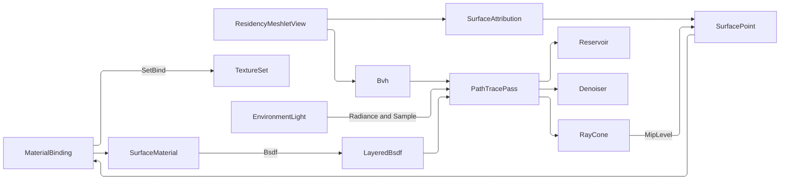

# [APPUI_RENDER_PATHTRACE]

`PathTracePass` integrates global illumination for the infinite viewport through BVH build-and-refit with ReSTIR reservoirs and progressive denoising, and shades every scene point from `LayeredBsdf`, the product of `SlabStack` lowering and the `MaterialGraph` sink. `PathTracePass` and its oracle kernels own the BVH build/refit, the ReSTIR reservoir, ray-cone texture footprint, progressive accumulation, edge-aware denoise, and exact `LayeredBsdf.Sample`/`Evaluate` consumption at the `PATH_TRACE` seam; `BsdfProjection` owns the sole oracle-tuple projection into the Materials `ShadingFrame`/`Direction`/`Op` vocabulary. `Render/pipeline` schedules the pass, meshlet bounds feed the BVH, the CPU integrator is the correctness oracle, and GPU acceleration consumes the same contracts.

Every appearance value crosses as a Materials VALUE: `SurfaceAttribution` resolves a hit into a real parameterization and `MaterialBinding` answers one composition-bound query per hit with the whole `SurfaceMaterial` — layered BSDF, tangent-space normal, opacity, emission — sampled by the Materials `SetBind`/`TextureUv` rails at the point's own UV and ray-cone mip level, so a bound `TextureSet` shades here exactly as it shades on the raster twin and this page mints no sampler, no channel name, and no transfer. `LightSource.Environment` carries the resolved `Rasm.Materials.Appearance.EnvironmentLight` row, so the dome answers directional radiance, a luminance-CDF importance draw, and its own solid-angle density on the owner that prefiltered it. Radiance is the scene-linear `RgbSpectrum` throughout — a display-referred host colour never enters the transport — and the world basis is the frozen `+Z`-up OpenPBR frame the environment owner's `WorldDirection` carrier spells structurally and the equirect correspondence assumes.

## [01]-[INDEX]

- [02]-[PATH_TRACE]: Kernel-owned broad phase over the sanctioned wire, per-ray wire-walk oracle, ReSTIR reservoirs, ray-cone footprint, environment MIS, honest accumulation, denoise.
- [03]-[LIGHT_RIG]: `LightSource` mints the ONE row family both integrators share, carrying the resolved `EnvironmentLight` dome and the Compute solar-position composition.
- [04]-[BSDF_SHADING]: `PathTracePass` shades from the Materials `LayeredBsdf`/`SlabStack`/`SetBind`, never re-deriving lobe math or texture reconstruction.

## [02]-[PATH_TRACE]

- Owner: `Bvh` the trace-accelerator VIEW over the kernel broad phase — build, refit, and the degradation-triggered rebuild are `Rasm/.planning/Spatial/index.md#[02]-[SPATIAL_INDEX]`'s through `Spatial.Apply`, the node stream arrives through the one sanctioned `SpatialAnswer.Wire` egress exactly as Compute decodes it, and page-local remains ONLY the per-ray wire walk (the measured oracle kernel) with the exact ray-sphere leaf narrow test — a page-built hierarchy or a second exported BVH is unrepresentable; `Reservoir` the ReSTIR sample reservoir carried per pixel ON the accumulation target; `SamplePolicy` the light-selection dispatch row; `RayCone` the propagated texture footprint; `TraceLimits` the transport policy row; `PathTracePass` the progressive accumulation pass; `GuidePolicy` the guide-accumulation row family (last-sample overwrite · ordinal-weighted batch mean) every primary guide write folds through; `Denoiser` the edge-aware denoise fold over the target's own guide plane.
- Law: `RayCone` derives every texture LOD and no caller chooses one. `RayCone` propagates the pixel's angular spread from the camera through every hit — width grows by the spread over the traversed distance — and its footprint at the hit divides the plane's texel span into the mip level `MaterialBinding` samples at. That level is FRACTIONAL and only the trilinear sampler row honours it, so the appearance seam binds one — a bind on any other `FilterMode` snaps the level to the nearest plane, and the whole cone derivation measures nothing a bounce crossing a level boundary does not pop through. Curvature-driven spread growth is the DECLARED growth leg arriving with a `SurfaceAttributes` curvature column the meshlet payload does not yet carry; a spread member with no data source is the phantom this line replaces. `RayCone` rides the SHADOW segment too, so a blocker's cut-out reads at the blocker's own distance and the blocker's own texel density; carrying the shading point's level down a shadow ray aliases a distant foliage card into hard-edged speckle. Sampling mip 0 at every distance is the aliasing defect this forecloses, and a caller-supplied LOD is the knob it forecloses.
- Law: environment transport is MULTIPLE-IMPORTANCE-SAMPLED, not double-counted. Once the dome answers a guided draw as an NEE candidate, the BSDF continuation that escapes into the same dome carries the balance-heuristic weight `pdfBsdf / (pdfBsdf + pdfEnv)` and the NEE draw carries its complement, so the two estimators sum to one estimate. Sun, spot, point-shaped emissive, and luminaire rows report a zero density, which the weight reads as the delta case and passes through unweighted; that one sentinel replaces a parallel delta-versus-area light flag.
- Law: every `SamplePolicy` arm estimates the SAME integral at the SAME energy. Resampled importance sampling weights each streamed candidate by its target function over its own source density, and rows stream uniformly, so the reservoir weight carries the row count exactly as the `Uniform` arm's single scaled draw does. Streaming a bare target function makes the reservoir arm darker by the row count — two interchangeable rows disagreeing on brightness, which reads as a denoiser or an exposure problem and is neither.
- Law: shadow rays honour `geometry_opacity`. Sampled opacity below one attenuates a blocker rather than occluding it, the walk continuing past it up to `TraceLimits.CutoutSteps` and multiplying transmittance, so a foliage card, a perforated screen, and a cut-out railing cast their real shadow instead of a solid one. `TraceLimits` carries the step cap, the opacity floor, and the ray-origin epsilon as policy columns, never literals in the walk — and its epsilon doubles as the emitter-proximity floor, so a positional row coincident with the shading point refuses rather than dividing by a distance the shadow ray cannot step across.
- Law: `TraceLimits` ADMITS like every peer policy row on the page — `TraceLimits.Of` gates each column on the `ViewportFault` rail before the walk can read one, because every column has a silently-wrong render behind it rather than a crash: a non-positive `Depth` transports nothing, a negative `SurfaceOffset` seats shadow-ray origins inside the surface, a zero `HitEpsilon` accepts the origin as its own hit, and an `OpacityFloor` outside `(0, 1)` makes every cut-out solid or every blocker transparent. `RefitDegradationLimit` is not with-injected into `BuildPolicy.Canonical` past that record's own construction — `TraceLimits.Broadphase()` derives the kernel policy and reads the kernel's `IsAdmitted` verdict, so a refused refit bar faults naming the trace policy that supplied it instead of surfacing as an opaque `k.InvalidInput()` attributed to the BVH build.
- Entry: `public Fin<AccumulationTarget> Accumulate(AccumulationTarget target, ViewCamera camera, LightRig rig, int sampleBudget, long sampleSeed, CancelScope scope)` — accumulates one progressive sample set onto the running per-pixel mean under the one camera row and returns the ADVANCED `AccumulationTarget` (`Ordinal + sampleBudget`), so two sequential batches against one target produce the weighted mean of both and the next pass reads the total sample count from the same state owner; convergence is the accumulated sample count, never a wall-clock timer; the cancel latch polls per scanline and a cancelled batch RESETS the target before railing, a film folded at two ordinals being unrepresentable.
- Auto: `Bvh.Build` admits the cluster spheres as their enclosing boxes into the kernel broad phase — `Spatial.Apply` `SpatialOp.Build` under the `BuildPolicy` `TraceLimits.Broadphase()` derived and the kernel's `IsAdmitted` accepted — and decodes the `SpatialAnswer.Wire` node stream ONCE per build; `Refit` rides `SpatialOp.Refit`, where the kernel `Rebound` owns topology-stable re-bounding AND the deterministic SAH rebuild trigger against the index's frozen `BuildCost`, so a moving scene refits until quality degrades measurably past the build and then rebuilds deterministically with no page-local cost bookkeeping to rebase; NEE light selection DISPATCHES on the `SamplePolicy` row — `Restir` streams every rig row through the pixel's `Reservoir` (the pixel's running reservoir re-enters the stream as ONE payload candidate whose target re-evaluates at the current point, decayed to `TemporalCap`; the target function is the unshadowed luminance-times-cosine, ONLY the surviving payload pays a shadow ray, and the advanced reservoir writes back to `AccumulationTarget.Reservoirs[pixel]` so temporal reuse is a real state transition that survives a rig rebuild), `Uniform` draws one row scaled by count, `Stratified` rotates the row by pixel-plus-ordinal; the progressive accumulator folds each sample set onto the running mean keyed by the accumulation ordinal and advances that ordinal on the returned target — `AccumulationTarget` is the ONE progression owner (`Of` mints it, `Advanced` weights the next batch, `Reset` clears mean, reservoirs, and guides together on camera motion) and no second sample counter exists — so a static camera converges frame over frame and the render graph resets the same target on camera motion; the primary hit writes each pixel's normal/depth guide onto the target's `NormalDepth` plane through the pass's `GuidePolicy` row — `lastSample` overwrites, `batchMean` folds the same ordinal-weighted running mean the color plane folds so an anti-aliased edge pixel edge-stops on coverage-weighted geometry — and `Denoiser.Resolve` folds the noisy mean with those guides through the 3x3 joint-bilateral weights so an early-frame estimate is presentable before full convergence while the render-hash lane pins the RAW mean.
- Packages: SkiaSharp, Thinktecture.Runtime.Extensions, LanguageExt.Core, Rasm.Materials (project), Rasm (project — `Deterministic.Stream`/`NextUnit` the replayable sampler stream, `Spatial.Apply`/`SpatialOp`/`SpatialAnswer.Wire` the federation broad phase, `Direction`/`UnitInterval`/`Dimension` the kernel atoms the seams spell)
- Growth: a new sampling strategy is one `SamplePolicy` row carrying its `SampleDecision` delegate; a new guide accumulation is one `GuidePolicy` row carrying its `Fold` delegate; a new guide plane extends `AccumulationTarget` and `Denoiser`; a new transport bound is one `TraceLimits` column plus its clause on `TraceLimits.Of`; zero new surface.
- Boundary: convergence is sample-count progressive — the accumulation ordinal is the only progress measure and a fixed-time render is the rejected form, so a path-traced still converges deterministically and the render-hash lane pins a sample count; the BVH refits in place on an animated frame and a full rebuild per frame is the deleted form — the rebuild fires only through the kernel `Rebound` degradation trigger the refit composes; the ray-trace dispatch is the GPU compute surface bound through the `Render/pipeline` render-graph lease — the `SKRuntimeEffect` ray-generation shader and the per-backend acceleration-structure spelling resolve under VIEWPORT_GPU; the CPU reference path tracer over the BVH is the correctness oracle — it now has light to transport (the `LightRig`), so the oracle renders a lit image by construction and comparability with the raster path holds because BOTH integrators read the same rig AND the same bound `TextureSet`; the GPU acceleration is the SPIKE; the BVH builds over the Compute-decoded `Render/meshlets` cluster bounds so the integrator re-models no geometry, and the per-hit parameterization arrives through `SurfaceAttribution` over the `Render/meshlets` `MeshletCluster.Sample` attribute projection rather than being invented here — a fabricated `(0, 0)` UV is the deleted form, and the sphere-proxy fallback is a DECLARED degradation the attribution row reports rather than a silent default.

```csharp signature
// (Continues the Rasm.AppUi.Render compilation unit, plus:)
using Rasm.Domain;                                    // Deterministic — Stream/NextUnit, the one replayable draw
using Rasm.Spatial;                                   // Spatial.Apply, SpatialOp, SpatialAnswer, SpatialKind, BuildPolicy — the federation broad phase
using Rasm.Materials.Appearance;                      // EnvironmentLight, EnvironmentSample, WorldDirection
using Rasm.Materials.Appearance.Bsdf;                 // LayeredBsdf, ShadingFrame, LocalVector, RgbSpectrum
using Rasm.Numerics;                                  // Direction, UnitInterval, Dimension, SolarSite, SunPosition
using SolarPosition = Rasm.Numerics.SolarPosition;    // the kernel almanac — Materials.Appearance carries the same-named frame adapter

// RayCone carries the pixel's angular footprint along the path: Width is the cone diameter at the current vertex and
// Spread its per-unit-distance growth, opened once at the camera and held constant along the walk, so Advanced widens
// Width alone. Curvature-driven spread growth is the DECLARED leg of this struct — a convex hit widening the spread by
// twice its own surface curvature — and it arrives when a SurfaceAttributes curvature column does; the meshlet payload
// carries no such producer row, so no member here reads one. Akenine-Moller ray-cone LOD, one struct, no per-lobe row.
public readonly record struct RayCone(double Width, double Spread) {
    // Primary opens the cone at the pixel solid angle: half the vertical field over the film height.
    public static RayCone Primary(double pixelSpread) => new(0.0, pixelSpread);

    public RayCone Advanced(double distance) => this with { Width = Width + (Spread * distance) };

    // MipLevel returns where a plane of `texels` across is sampled: the cone's footprint in UV, projected against the
    // grazing angle, expressed in halvings. A degenerate cosine clamps rather than diverging to the coarsest level.
    public double MipLevel(int texels, double uvScale, double cosine) =>
        Math.Max(0.0, Math.Log2(Math.Max(Width * uvScale * texels / Math.Max(Math.Abs(cosine), 1e-3), 1e-9)));
}

// TraceLimits carries the transport bounds as policy columns rather than literals scattered through the walk:
// CutoutSteps caps the alpha-cutout shadow traversal, OpacityFloor is the transmittance below which a blocker counts
// as solid, and SurfaceOffset is the shadow/continuation ray origin epsilon.
public readonly record struct TraceLimits {
    private TraceLimits(int depth, int cutoutSteps, double opacityFloor, double surfaceOffset, double hitEpsilon, double refitDegradationLimit) =>
        (Depth, CutoutSteps, OpacityFloor, SurfaceOffset, HitEpsilon, RefitDegradationLimit) =
            (depth, cutoutSteps, opacityFloor, surfaceOffset, hitEpsilon, refitDegradationLimit);

    public int Depth { get; }
    public int CutoutSteps { get; }
    public double OpacityFloor { get; }
    public double SurfaceOffset { get; }
    public double HitEpsilon { get; }
    public double RefitDegradationLimit { get; }

    // Depth is the transport bound itself — the single most load-bearing policy the walk reads — and HitEpsilon the
    // intersection acceptance floor the sphere kernel tests against, both policy columns for the same reason the
    // origin offset is one: a scene authored in millimetres and one in kilometres carry different tolerances.
    // RefitDegradationLimit matches the kernel BuildPolicy.Canonical row — one estate-wide refit-quality bar.
    public static readonly TraceLimits Default = new(depth: 1, cutoutSteps: 4, opacityFloor: 1e-3, surfaceOffset: 1e-4, hitEpsilon: 1e-6, refitDegradationLimit: 1.6);

    // The only policy row on this page that reached the walk unadmitted, and every column has a silently-wrong
    // render behind it: a non-positive Depth transports nothing, a negative SurfaceOffset pushes shadow-ray
    // origins INTO the surface so every lit point self-shadows, a zero HitEpsilon accepts the origin itself as a
    // hit, and an OpacityFloor at or past one makes every cut-out blocker solid. RefitDegradationLimit mirrors
    // the kernel BuildPolicy.IsAdmitted bar (`> 1.0`, finite) so the estate-wide refit-quality bar this row
    // claims to share is ENFORCED where the row is authored — Bvh.Build's with-injection into
    // BuildPolicy.Canonical bypassed BuildPolicy's own construction, deferring the one caught column to an
    // opaque k.InvalidInput() attributed to the BVH build rather than to the trace policy that supplied it.
    public static Fin<TraceLimits> Of(
        int depth, int cutoutSteps, double opacityFloor, double surfaceOffset, double hitEpsilon, double refitDegradationLimit) =>
        depth >= 1
        && cutoutSteps >= 0
        && double.IsFinite(opacityFloor) && opacityFloor is > 0d and < 1d
        && double.IsFinite(surfaceOffset) && surfaceOffset > 0d
        && double.IsFinite(hitEpsilon) && hitEpsilon > 0d
        && double.IsFinite(refitDegradationLimit) && refitDegradationLimit > 1.0
            ? Fin.Succ(new TraceLimits(depth, cutoutSteps, opacityFloor, surfaceOffset, hitEpsilon, refitDegradationLimit))
            : Fin.Fail<TraceLimits>(new ViewportFault.Text(
                $"trace-limits: depth >= 1, cutout-steps >= 0, opacity-floor in (0,1), positive finite surface-offset and hit-epsilon, refit-degradation-limit > 1.0 required"));

    // The kernel build policy DERIVES from this row rather than being with-injected past its own construction:
    // BuildPolicy.IsAdmitted is the kernel's verdict on the value it will actually run, and reading it here is
    // what turns a refused refit bar into a fault naming the trace policy instead of a build failure naming none.
    public Fin<BuildPolicy> Broadphase() =>
        BuildPolicy.Canonical with { RefitDegradationLimit = RefitDegradationLimit } switch {
            { IsAdmitted: true } policy => Fin.Succ(policy),
            var policy => Fin.Fail<BuildPolicy>(new ViewportFault.Text($"trace-limits/build-policy: the kernel refused {policy}")),
        };
}

// Federation broad phase OWNS build, refit, and the degradation-triggered rebuild. Bvh is the trace
// ACCELERATOR VIEW over that owner: cluster spheres admit as their enclosing boxes into `Spatial.Apply` —
// `SpatialOp.Build` under the `BuildPolicy` `TraceLimits` DERIVES and the kernel's own `IsAdmitted` accepts — a
// moved frame re-bounds through `SpatialOp.Refit` (the kernel `Rebound` owns the frozen-`BuildCost` SAH
// rebuild trigger, so the prior-frame-rebase defect is unrepresentable here), and the node stream is the ONE
// sanctioned cross-package egress, `SpatialAnswer.Wire`, exactly as the Compute GPU traversal decodes it. The
// recursive SAH split, the bottom-up refit, and the cost-trigger Maintain that re-derived the kernel's
// own machinery over spheres are deleted; page-local remains the per-ray wire WALK — the measured oracle
// kernel — plus the exact ray-sphere narrow test against each leaf cluster's own bounding sphere.
public sealed record Bvh(float[] Bounds, long[] Nodes, ImmutableArray<BoundingSphere> PrimitiveBounds, Option<SpatialIndex> Index) {
    // Wire node-link packing NodeLinkProjection freezes: interior = (FirstChild << 21) | ChildCount,
    // leaf = -(((LeafStart − NodeCount) << 21) | LeafCount) − 1, primitive ordinals on the tail; decoders
    // recover the node count as Bounds.Length / 6.
    private const int ChildShift = 21;
    private const long ChildMask = (1L << ChildShift) - 1L;

    private int NodeCount => Bounds.Length / 6;

    public static Fin<Bvh> Build(Seq<ResidencyMeshletView> meshlets, TraceLimits limits, Op? key = null) {
        if (meshlets.IsEmpty) { return Fin.Succ(new Bvh([], [], [], None)); }
        Op op = key.OrDefault();
        return from policy in limits.Broadphase()
               from built in Spatial.Apply(new SpatialOp.Build(SpatialKind.Bvh, [.. meshlets.Map(static m => Box(m.Bounds))], policy), op)
               from index in built is SpatialAnswer.Index answer ? Fin.Succ(answer.Value) : Fin.Fail<SpatialIndex>(op.InvalidResult())
               from view in Wired(index, [.. meshlets.Map(static m => m.Bounds)], op)
               select view;
    }

    // Refit rides the kernel refit-or-rebuild: topology-stable re-bound, deterministic SAH rebuild past the
    // policy's degradation limit against the index's own frozen baseline. A cardinality change IS a topology
    // change and rebuilds — indexing a retained order into a differently-sized roster reads bounds that
    // belong to no cluster.
    public Fin<Bvh> Refit(Seq<ResidencyMeshletView> moved, TraceLimits limits, Op? key = null) {
        Op op = key.OrDefault();
        return Index.Match(
            None: () => Build(moved, limits, op),
            Some: held => moved.Count != held.Primitives.Length
                ? Build(moved, limits, op)
                : from refit in Spatial.Apply(new SpatialOp.Refit(held, [.. moved.Map(static m => Box(m.Bounds))]), op)
                  from index in refit is SpatialAnswer.Index answer ? Fin.Succ(answer.Value) : Fin.Fail<SpatialIndex>(op.InvalidResult())
                  from view in Wired(index, [.. moved.Map(static m => m.Bounds)], op)
                  select view);
    }

    private static Fin<Bvh> Wired(SpatialIndex index, ImmutableArray<BoundingSphere> spheres, Op op) =>
        from answer in Spatial.Apply(new SpatialOp.Wire(index), op)
        from wire in answer is SpatialAnswer.Wire w ? Fin.Succ(w) : Fin.Fail<SpatialAnswer.Wire>(op.InvalidResult())
        select new Bvh(wire.Bounds, wire.Nodes, spheres, Some(index));

    private static BoundingBox Box(BoundingSphere sphere) => new(
        new Point3d(sphere.X - sphere.Radius, sphere.Y - sphere.Radius, sphere.Z - sphere.Radius),
        new Point3d(sphere.X + sphere.Radius, sphere.Y + sphere.Radius, sphere.Z + sphere.Radius));

    // Per-thread traversal scratch: the walk runs per ray on the hottest loop the page owns, and a heap `Stack` per
    // ray is the allocation the pass's own measured-oracle claim forbids. [ThreadStatic] keeps the cell race-free
    // without a lock, and Clear-per-call keeps a faulted walk from leaking depth into the next ray.
    [ThreadStatic] private static Stack<int>? traversalScratch;

    // Closest-hit wire traversal — the oracle's one intersection kernel, shared by primary, shadow, and
    // continuation rays; an explicit stack walk over the kernel node-link stream, front-to-back by child slab
    // entry so the nearer child pops first and shrinks best.T before the farther's pop-time re-test — an unhit
    // child never pushes at all. The leaf narrow test is the exact ray-sphere against the cluster's own
    // bounding sphere, tighter than the wire's outward-rounded box. The result is a NULLABLE tuple rather than
    // an Option because every caller sits on a `ref ulong` sampler-state frame, and a monadic Match would have
    // to capture that ref in a lambda — which cannot type.
    public (int Primitive, double T)? Intersect((double X, double Y, double Z) origin, (double X, double Y, double Z) direction, double tMax, double epsilon) {
        if (Nodes.Length == 0) { return null; }
        (int Primitive, double T) best = (Primitive: -1, T: tMax);
        Stack<int> walk = traversalScratch ??= new Stack<int>(64);
        walk.Clear();
        walk.Push(0);
        Span<(int Child, double Enter)> ordered = stackalloc (int, double)[8];
        while (walk.TryPop(out int at)) {
            if (RaySlab(origin, direction, at, best.T, epsilon) is not { } enter || enter > best.T) { continue; }
            long packed = Nodes[at];
            if (packed < 0L) {
                long leaf = -(packed + 1L);
                (int start, int count) = (NodeCount + (int)(leaf >> ChildShift), (int)(leaf & ChildMask));
                for (int slot = start; slot < start + count; slot++) {
                    int prim = (int)Nodes[slot];
                    if (RaySphere(origin, direction, PrimitiveBounds[prim], epsilon) is { } t && t < best.T) { best = (prim, t); }
                }
            }
            else {
                (int first, int fan) = ((int)(packed >> ChildShift), (int)(packed & ChildMask));
                int hits = 0;
                for (int child = first; child < first + fan; child++) {
                    if (RaySlab(origin, direction, child, best.T, epsilon) is { } t) {
                        int seat = hits++;
                        while (seat > 0 && ordered[seat - 1].Enter < t) { ordered[seat] = ordered[seat - 1]; seat--; }
                        ordered[seat] = (child, t);
                    }
                }
                for (int rank = 0; rank < hits; rank++) { walk.Push(ordered[rank].Child); }
            }
        }
        return best.Primitive >= 0 ? best : null;
    }

    // Slab test over the wire's outward-rounded box: IEEE infinities carry a zero direction component and the
    // min/max fold rejects the NaN a degenerate slab would mint.
    private double? RaySlab((double X, double Y, double Z) origin, (double X, double Y, double Z) direction, int node, double tMax, double epsilon) {
        int at = 6 * node;
        (double lo, double hi) = (epsilon, tMax);
        (double invX, double invY, double invZ) = (1.0 / direction.X, 1.0 / direction.Y, 1.0 / direction.Z);
        (double x0, double x1) = ((Bounds[at] - origin.X) * invX, (Bounds[at + 3] - origin.X) * invX);
        if (invX < 0.0) { (x0, x1) = (x1, x0); }
        (lo, hi) = (x0 > lo ? x0 : lo, x1 < hi ? x1 : hi);
        (double y0, double y1) = ((Bounds[at + 1] - origin.Y) * invY, (Bounds[at + 4] - origin.Y) * invY);
        if (invY < 0.0) { (y0, y1) = (y1, y0); }
        (lo, hi) = (y0 > lo ? y0 : lo, y1 < hi ? y1 : hi);
        (double z0, double z1) = ((Bounds[at + 2] - origin.Z) * invZ, (Bounds[at + 5] - origin.Z) * invZ);
        if (invZ < 0.0) { (z0, z1) = (z1, z0); }
        (lo, hi) = (z0 > lo ? z0 : lo, z1 < hi ? z1 : hi);
        return hi >= lo ? lo : null;
    }

    private static double? RaySphere((double X, double Y, double Z) origin, (double X, double Y, double Z) direction, BoundingSphere sphere, double epsilon) {
        (double ox, double oy, double oz) = (sphere.X - origin.X, sphere.Y - origin.Y, sphere.Z - origin.Z);
        double along = (ox * direction.X) + (oy * direction.Y) + (oz * direction.Z);
        double square = (ox * ox) + (oy * oy) + (oz * oz) - (along * along);
        double radius2 = sphere.Radius * sphere.Radius;
        if (square > radius2) { return null; }
        double offset = Math.Sqrt(radius2 - square);
        double near = along - offset;
        return near > epsilon ? near : along + offset > epsilon ? along + offset : null;
    }

}

// One reservoir sample PAYLOAD: the candidate's own direction, unshadowed radiance, shadow reach, and source
// density. Payload storage is what makes temporal reuse survive a rig rebuild — an index into a per-frame row list
// names a different emitter the moment the rig re-derives, and no reprojection can repair a name.
public readonly record struct ReservoirSample(
    (double X, double Y, double Z) Wi, RgbSpectrum Radiance, double TMax, double SourcePdf);

// Weighted-reservoir resampled importance sampling state: Update streams one candidate, Decayed caps the
// temporal history so a stale frame never dominates, Folded re-enters a prior reservoir as ONE candidate whose
// target RE-EVALUATES at the current shading point (the mandatory reweighting that keeps reuse unbiased when the
// surface moved), and Weight is the unbiased RIS estimator factor WeightSum / (SampleCount * TargetPdf) the chosen
// sample shades with — TargetPdf always the chosen sample's target at the CURRENT point, never a stale frame's.
public readonly record struct Reservoir(double WeightSum, int SampleCount, ReservoirSample Chosen, double TargetPdf) {
    public Reservoir Update(ReservoirSample candidate, double weight, double pdf, double random) =>
        (WeightSum + weight) switch {
            var sum => random < weight / Math.Max(sum, 1e-12)
                ? new Reservoir(sum, SampleCount + 1, candidate, pdf)
                : new Reservoir(sum, SampleCount + 1, Chosen, TargetPdf),
        };

    public Reservoir Decayed(int cap) =>
        SampleCount <= cap ? this : new Reservoir(WeightSum * ((double)cap / SampleCount), cap, Chosen, TargetPdf);

    public Reservoir Folded(Reservoir prior, double targetNow, double random) =>
        prior.SampleCount is 0 || targetNow <= 0d
            ? this
            : Update(prior.Chosen, targetNow * prior.Weight * prior.SampleCount, targetNow, random) switch {
                var merged => merged with { SampleCount = SampleCount + prior.SampleCount },
            };

    public double Weight => SampleCount == 0 || TargetPdf <= 0d ? 0d : WeightSum / (SampleCount * TargetPdf);
}

// SamplePolicy dispatches the NEE arm's light selection — a row is behavior at the integrator, never a label:
// Restir streams every rig row through the per-pixel reservoir with temporal reuse and shadow-tests only the
// survivor, Uniform draws one row scaled by count, Stratified rotates the row by (pixel + ordinal).
[SmartEnum<string>]
public sealed partial class SamplePolicy {
    // Reuse decision is payload-free, so ONE cached case serves every pixel-sample — a fresh record per
    // sample allocates on the hottest loop the page owns for a value that never varies.
    static readonly SampleDecision Reused = new SampleDecision.ReservoirReuse();
    public static readonly SamplePolicy Restir = new("restir", static (_, _, _, _) => Reused);
    public static readonly SamplePolicy Uniform = new("uniform", static (_, _, count, random) =>
        new SampleDecision.Direct(Math.Min((int)(random * count), count - 1), count));
    public static readonly SamplePolicy Stratified = new("stratified", static (pixel, ordinal, count, _) =>
        new SampleDecision.Direct((int)((pixel + ordinal) % count), count));

    public const int TemporalCap = 20;

    [UseDelegateFromConstructor]
    public partial SampleDecision Decide(int pixel, long ordinal, int count, double random);
}

[Union(ConversionFromValue = ConversionOperatorsGeneration.None)]
public abstract partial record SampleDecision {
    private SampleDecision() { }
    public sealed record ReservoirReuse : SampleDecision;
    public sealed record Direct(int Index, double Weight) : SampleDecision;
}

// Guide-plane accumulation family: how each sample's primary normal/depth settles into the film's
// NormalDepth plane. Every modality is a ROW carrying its own fold delegate — never a knob beside the write —
// so a new accumulation (first-sample pinning, variance-tracked guides) is one row and every write site is
// untouched. Both rows write the FINITE FarDepth miss sentinel: a mean folding float.MaxValue poisons every
// later sample, and the joint-bilateral gap reads a 1e30 gulf exactly as it read infinity.
[SmartEnum<string>]
[KeyMemberEqualityComparer<ComparerAccessors.StringOrdinal, string>]
public sealed partial class GuidePolicy {
    // Last-sample-wins: each primary write overwrites the slot — free, and exact wherever a pixel's jittered
    // samples agree on geometry.
    public static readonly GuidePolicy LastSample = new("last-sample",
        static (guide, slot, nx, ny, nz, depth, weight) =>
            (guide[slot], guide[slot + 1], guide[slot + 2], guide[slot + 3]) = (nx, ny, nz, depth));

    // Batch mean: the guide folds the SAME ordinal-weighted running mean the color plane folds, so an
    // anti-aliased edge pixel edge-stops on its coverage-weighted geometry instead of whichever jittered sample
    // landed last — the guide flicker that reads as denoiser shimmer on a static camera. No renormalization: the
    // bilateral gap reads DIFFERENCES, and an unnormalized mean preserves every edge it stops on.
    public static readonly GuidePolicy BatchMean = new("batch-mean",
        static (guide, slot, nx, ny, nz, depth, weight) => {
            float next = weight + 1f;
            guide[slot] = ((guide[slot] * weight) + nx) / next;
            guide[slot + 1] = ((guide[slot + 1] * weight) + ny) / next;
            guide[slot + 2] = ((guide[slot + 2] * weight) + nz) / next;
            guide[slot + 3] = ((guide[slot + 3] * weight) + depth) / next;
        });

    // Finite far sentinel a primary MISS writes under either row; Reset clears the plane, so the running
    // weight restarts with the ordinal it derives from.
    public const float FarDepth = 1e30f;

    [UseDelegateFromConstructor]
    public partial void Fold(Span<float> guide, int slot, float nx, float ny, float nz, float depth, float weight);
}

// Edge-aware joint-bilateral resolve over the accumulation guides: a 3x3 weighted mean whose weights fold
// color, normal, and depth distances through the three sigmas, so an early-frame estimate presents smooth
// while geometry edges hold. Presentation-only — the render-hash lane pins the RAW mean, never this output.
public sealed record Denoiser(double NormalSigma, double DepthSigma, double ColorSigma) {
    public static readonly Denoiser EdgeAware = new(NormalSigma: 0.1, DepthSigma: 0.05, ColorSigma: 0.4);

    public float[] Resolve(AccumulationTarget film) {
        float[] output = new float[film.Rgba.Length];
        Span<float> rgba = film.Rgba.Span;
        Span<float> guides = film.NormalDepth.Span;
        for (int py = 0; py < film.Height; py++) {
            for (int px = 0; px < film.Width; px++) {
                int at = (py * film.Width) + px;
                (double r, double g, double b, double w) = (0d, 0d, 0d, 0d);
                for (int dy = -1; dy <= 1; dy++) {
                    for (int dx = -1; dx <= 1; dx++) {
                        int near = (Math.Clamp(py + dy, 0, film.Height - 1) * film.Width) + Math.Clamp(px + dx, 0, film.Width - 1);
                        double weight = Math.Exp(
                            -(Gap(rgba, at, near, 3) / (ColorSigma * ColorSigma))
                            - (Gap(guides, at, near, 3) / (NormalSigma * NormalSigma))
                            - (Gap(guides, (at * 4) + 3, (near * 4) + 3, 1, raw: true) / (DepthSigma * DepthSigma)));
                        (r, g, b, w) = (r + (rgba[near * 4] * weight), g + (rgba[(near * 4) + 1] * weight), b + (rgba[(near * 4) + 2] * weight), w + weight);
                    }
                }
                (output[at * 4], output[(at * 4) + 1], output[(at * 4) + 2], output[(at * 4) + 3]) =
                    ((float)(r / w), (float)(g / w), (float)(b / w), 1f);
            }
        }
        return output;
    }

    private static double Gap(ReadOnlySpan<float> plane, int a, int b, int components, bool raw = false) {
        (int baseA, int baseB) = raw ? (a, b) : (a * 4, b * 4);
        double sum = 0d;
        for (int c = 0; c < components; c++) { double d = plane[baseA + c] - plane[baseB + c]; sum += d * d; }
        return sum;
    }
}

// AccumulationTarget owns the per-pixel running mean, its sample ordinal, the ReSTIR reservoir array, the
// normal/depth guide plane, and the swallowed-shade fault count as the ONE progressive-state owner. A sealed CLASS,
// not a record: one film is one IDENTITY over shared mutable planes, and record value semantics mint aliases —
// two `with` copies of one target write one film through two Ordinals, which is the mean-corruption this shape
// deletes. Advanced mutates and returns THIS; Reset serves camera motion and a cancelled batch alike.
public sealed class AccumulationTarget {
    private AccumulationTarget(int width, int height) {
        (Width, Height) = (width, height);
        (Rgba, Reservoirs, NormalDepth) = (new float[width * height * 4], new Reservoir[width * height], new float[width * height * 4]);
    }

    public int Width { get; }
    public int Height { get; }
    public Memory<float> Rgba { get; }
    public Memory<Reservoir> Reservoirs { get; }
    public Memory<float> NormalDepth { get; }
    public long Ordinal { get; private set; }

    // Shade/Evaluate faults COUNT instead of vanishing: a rail collapsing to black on the hot loop is deliberate
    // (a per-texel Fin re-branch prices a rail that cannot fail), but the collapse leaves evidence here, so a
    // material whose closure faults per sample reads as a fault rate rather than an inexplicably dark render.
    public long Faults { get; private set; }

    public static AccumulationTarget Of(int width, int height) => new(width, height);

    public AccumulationTarget Advanced(int samples) {
        Ordinal += samples;
        return this;
    }

    public void Faulted() => Faults++;

    public AccumulationTarget Reset() {
        Rgba.Span.Clear();
        Reservoirs.Span.Clear();
        NormalDepth.Span.Clear();
        (Ordinal, Faults) = (0L, 0L);
        return this;
    }
}

public sealed record PathTracePass(
    Bvh Scene,
    SamplePolicy Sampling,
    Denoiser Denoise,
    GuidePolicy Guides,
    SurfaceAttribution Attribution,
    MaterialBinding Materials,
    BsdfProjection Projection,
    TraceLimits Limits) {
    // Honest integrate-or-gate: an empty scene, a lightless rig, or a non-positive sample budget gates
    // — zero divides a fresh target's mean and a negative budget regresses the ordinal, so only positive
    // batches enter the progressive transition; the integrate arm traces sampleBudget paths per pixel
    // through the private CPU oracle kernel below and returns the target advanced by exactly the samples
    // it folded into the mean. CANCELLATION polls per scanline on the estate's one cancel rail — the longest
    // synchronous loop in the estate answers the latch like every Compute run does — and a cancelled batch
    // RESETS the target before railing, because rows folded at two ordinals under one counter is a film state
    // no later batch can repair.
    public Fin<AccumulationTarget> Accumulate(AccumulationTarget target, ViewCamera camera, LightRig rig, int sampleBudget, long sampleSeed, CancelScope scope) =>
        sampleBudget <= 0
            ? Fin.Fail<AccumulationTarget>(new ViewportFault.Text($"path-trace/sample-budget: {sampleBudget} is not a positive batch"))
            : Scene.Nodes.Length == 0
                ? Fin.Fail<AccumulationTarget>(new ViewportFault.Text("path-trace/empty-scene: BVH has no nodes"))
                : rig.Rows.IsEmpty
                    ? Fin.Fail<AccumulationTarget>(new ViewportFault.Text("path-trace/no-light: the rig carries zero LightSource rows"))
                    : Integrate(target, camera, rig, sampleBudget, sampleSeed, scope)
                        ? Fin.Succ(target.Advanced(sampleBudget))
                        : Fin.Fail<AccumulationTarget>(new ViewportFault.Text($"path-trace/cancelled: {scope.Provenance}; the target reset"));

    // Statement-bodied oracle kernel — deterministic per-(pixel, ordinal, seed) sequence so the render-hash
    // lane pins a sample count. Path shape: primary ray + its pixel cone -> closest hit (miss folds the dome by
    // DIRECTION) -> attribution and one Materials query at the cone's own mip level -> NEE over every rig row
    // including the guided dome (shadow rays alpha-attenuated through the same Intersect kernel, throughput via the
    // Materials Evaluate seam) -> one BSDF-sampled continuation MIS-weighted against the dome density.
    private bool Integrate(AccumulationTarget target, ViewCamera camera, LightRig rig, int sampleBudget, long sampleSeed, CancelScope scope) {
        CameraFrame frame = camera.Frame;
        // ONE camera triad, shared with the HZB screen projection through OracleFrame.OfCamera — two hand-derived
        // triads is the handedness drift the member exists to foreclose.
        ((double fx, double fy, double fz), (double rx, double ry, double rz), (double ux, double uy, double uz)) = OracleFrame.OfCamera(frame);
        double aspect = target.Width / (double)target.Height;
        for (int py = 0; py < target.Height; py++) {
            if (scope.Source.Token.IsCancellationRequested) {
                target.Reset();
                return false;
            }
            for (int px = 0; px < target.Width; px++) {
                (double r, double g, double b) batch = (0d, 0d, 0d);
                for (int s = 0; s < sampleBudget; s++) {
                    // Kernel Deterministic owns the replayable stream: Stream folds the (pixel, sample-ordinal)
                    // lanes exactly (an XOR-pack of shifted lanes collided (pixel 5, ordinal 0) with (pixel 0,
                    // ordinal 5)) and NextUnit advances the splitmix64 Weyl counter — the page-local murmur twin
                    // that reassigned its mixed value into the counter is the deleted form.
                    ulong state = Deterministic.Stream([(py * target.Width) + px, target.Ordinal + s], sampleSeed);
                    double screenX = ((px + Deterministic.NextUnit(ref state)) / target.Width * 2d) - 1d;
                    double screenY = 1d - ((py + Deterministic.NextUnit(ref state)) / target.Height * 2d);
                    // ViewCamera seeds the ray AND its cone in one switch: a perspective pixel opens an angular
                    // spread of one pixel's solid angle, while an orthographic pixel carries a constant width and
                    // zero spread — parallel rays never widen, so an ortho render must not blur with distance.
                    ((double X, double Y, double Z) Origin, (double X, double Y, double Z) Direction, RayCone Cone) ray = camera.Switch(
                        state: (Frame: frame, Fx: fx, Fy: fy, Fz: fz, Rx: rx, Ry: ry, Rz: rz, Ux: ux, Uy: uy, Uz: uz, X: screenX, Y: screenY, Aspect: aspect, Height: (double)target.Height),
                        perspective: static (basis, lens) => {
                            double half = Math.Tan(double.DegreesToRadians(lens.FieldOfViewDeg) / 2d);
                            (double x, double y) = (basis.X * half * basis.Aspect, basis.Y * half);
                            return (
                                ((double)basis.Frame.Eye.X, basis.Frame.Eye.Y, basis.Frame.Eye.Z),
                                OracleFrame.Normalize(basis.Fx + (x * basis.Rx) + (y * basis.Ux), basis.Fy + (x * basis.Ry) + (y * basis.Uy), basis.Fz + (x * basis.Rz) + (y * basis.Uz)),
                                RayCone.Primary(2d * half / basis.Height));
                        },
                        orthographic: static (basis, lens) => {
                            (double x, double y) = (basis.X * lens.ViewHeight * basis.Aspect * 0.5d, basis.Y * lens.ViewHeight * 0.5d);
                            return (
                                (basis.Frame.Eye.X + (x * basis.Rx) + (y * basis.Ux), basis.Frame.Eye.Y + (x * basis.Ry) + (y * basis.Uy), basis.Frame.Eye.Z + (x * basis.Rz) + (y * basis.Uz)),
                                (basis.Fx, basis.Fy, basis.Fz),
                                new RayCone(lens.ViewHeight / basis.Height, 0d));
                        },
                        // An asymmetric XR eye offsets the ray fan by the tangent midpoint and scales by
                        // the tangent half-spans (left/down signed negative), so a world-locked eye traces
                        // the frustum it presents; the cone spread reads the vertical half-span.
                        asymmetric: static (basis, lens) => {
                            (double tanL, double tanR, double tanU, double tanD) =
                                (Math.Tan(lens.AngleLeft), Math.Tan(lens.AngleRight), Math.Tan(lens.AngleUp), Math.Tan(lens.AngleDown));
                            (double x, double y) = (
                                ((tanR + tanL) / 2d) + (basis.X * ((tanR - tanL) / 2d)),
                                ((tanU + tanD) / 2d) + (basis.Y * ((tanU - tanD) / 2d)));
                            return (
                                ((double)basis.Frame.Eye.X, basis.Frame.Eye.Y, basis.Frame.Eye.Z),
                                OracleFrame.Normalize(basis.Fx + (x * basis.Rx) + (y * basis.Ux), basis.Fy + (x * basis.Ry) + (y * basis.Uy), basis.Fz + (x * basis.Rz) + (y * basis.Uz)),
                                RayCone.Primary((tanU - tanD) / basis.Height));
                        });
                    RgbSpectrum carried = Radiance(ray.Origin, ray.Direction, ray.Cone, rig, target, (py * target.Width) + px, depth: 0, target.Ordinal + s, ref state);
                    batch = (batch.r + carried.R, batch.g + carried.G, batch.b + carried.B);
                }
                long total = target.Ordinal + sampleBudget;
                int slot = ((py * target.Width) + px) * 4;
                target.Rgba.Span[slot + 0] = (float)(((target.Rgba.Span[slot + 0] * target.Ordinal) + batch.r) / total);
                target.Rgba.Span[slot + 1] = (float)(((target.Rgba.Span[slot + 1] * target.Ordinal) + batch.g) / total);
                target.Rgba.Span[slot + 2] = (float)(((target.Rgba.Span[slot + 2] * target.Ordinal) + batch.b) / total);
                target.Rgba.Span[slot + 3] = 1f;
            }
        }
        return true;
    }

    private RgbSpectrum Radiance((double X, double Y, double Z) origin, (double X, double Y, double Z) direction, RayCone cone, LightRig rig, AccumulationTarget film, int pixel, int depth, long ordinal, ref ulong state) {
        if (Scene.Intersect(origin, direction, double.MaxValue, Limits.HitEpsilon) is { } hit) {
            return Lit(origin, direction, cone, hit, rig, film, pixel, depth, ordinal, ref state);
        }
        if (depth is 0) {
            // Primary miss writes its OWN guide — zero normal, finite far sentinel — through the pass's
            // GuidePolicy row, so the denoiser edge-stops between geometry and background instead of blurring
            // silhouettes against whatever the guide last held.
            Guides.Fold(film.NormalDepth.Span, pixel * 4, 0f, 0f, 0f, GuidePolicy.FarDepth, ordinal);
        }
        return Dome(rig, direction, bsdfPdf: 0d);
    }

    // NEE is POLICY-DISPATCHED light selection over the rig, never an unconditional every-light loop: the
    // primary hit writes the pixel's normal/depth guide, the SamplePolicy row selects the light-sampling
    // arm, and only the selected candidate pays a shadow ray. The reservoir arm reads and writes
    // film.Reservoirs[pixel], so temporal reuse is a real state transition on the one progressive owner.
    // Attribution runs BEFORE the Materials query so the query carries a real UV and the cone's own mip level; the
    // guide plane records the PERTURBED normal, so the denoiser edge-stops on the normal the shade used.
    private RgbSpectrum Lit((double X, double Y, double Z) origin, (double X, double Y, double Z) direction, RayCone cone, (int Primitive, double T) hit, LightRig rig, AccumulationTarget film, int pixel, int depth, long ordinal, ref ulong state) {
        BoundingSphere sphere = Scene.PrimitiveBounds[hit.Primitive];
        (double hx, double hy, double hz) = (origin.X + (direction.X * hit.T), origin.Y + (direction.Y * hit.T), origin.Z + (direction.Z * hit.T));
        SurfaceAttributes surface = Attribution.At(hit.Primitive, (hx, hy, hz), sphere);
        (double X, double Y, double Z) wo = (-direction.X, -direction.Y, -direction.Z);
        RayCone atHit = cone.Advanced(hit.T);
        SurfacePoint point = new((hx, hy, hz), surface.Frame, surface.Uv, surface.MaterialKey,
            atHit.MipLevel(surface.Texels, surface.UvScale, OracleFrame.Dot(surface.Frame.Normal, wo)));
        SurfaceMaterial material = Materials.Resolve(point);
        OracleFrame shading = surface.Frame.Perturbed(material.TangentNormal);
        if (depth is 0) {
            // PRIMARY hit alone writes the guide, through the pass's GuidePolicy row — last-sample overwrite
            // or the ordinal-weighted batch mean; a continuation vertex writing here would edge-stop the denoiser
            // on geometry the pixel never shows.
            Guides.Fold(film.NormalDepth.Span, pixel * 4,
                (float)shading.Normal.X, (float)shading.Normal.Y, (float)shading.Normal.Z,
                (float)Math.Min(hit.T, GuidePolicy.FarDepth), ordinal);
        }
        SurfacePoint shaded = point with { Frame = shading };
        RgbSpectrum sum = material.Emission.Add(Nee(shaded, material, wo, shading.Normal, atHit, rig, film, pixel, ref state));
        // Continuation binds OUTSIDE any lambda because the recursion threads the ref sampler state; a faulted
        // Shade counts on the film and contributes black rather than vanishing.
        (RgbSpectrum Throughput, (double X, double Y, double Z) Wi, double Pdf) bounce = default;
        bool scattered = false;
        this.Shade(shaded, material.Bsdf, wo, Deterministic.NextUnit(ref state), Deterministic.NextUnit(ref state), Deterministic.NextUnit(ref state))
            .IfSucc(value => { bounce = value; scattered = true; });
        if (!scattered) {
            film.Faulted();
            return sum;
        }
        (double X, double Y, double Z) next = Offset(shaded.Position, bounce.Wi);
        if (Scene.Intersect(next, bounce.Wi, double.MaxValue, Limits.HitEpsilon) is { } continuation) {
            // Transport walks to TraceLimits.Depth — the policy column, never a structural constant: depth 1 keeps the
            // one-bounce oracle, a deeper study raises the row and nothing else moves.
            return depth + 1 < Limits.Depth
                ? sum.Add(bounce.Throughput.Mul(Lit(next, bounce.Wi, atHit, continuation, rig, film, pixel, depth + 1, ordinal, ref state)))
                : sum;
        }
        return sum.Add(bounce.Throughput.Mul(Dome(rig, bounce.Wi, bounce.Pdf)));
    }

    // One candidate derivation serves every policy arm: the (direction, radiance, reach, density) of one rig row
    // toward the shading point. A positional row reports Pdf 0 — the DELTA sentinel every MIS weight reads — while the
    // dome reports its guided draw's true solid-angle density, so one shape spans both estimator classes and no
    // parallel delta-versus-area flag exists. The dome is a NEE candidate here AND a miss fold in Dome; the balance
    // heuristic is what keeps the two from double-counting. Every positional arm reads its reach through Toward, whose
    // proximity refusal is what keeps an emitter coincident with the shading point from returning an unbounded
    // estimate no downstream clamp could tell from real energy. The
    // non-throwing rail on the hot loop: Next() emits [0,1) so the refusal arm is unreachable, and the default
    // fallback is the representable zero rather than a throw the transport's own domain law forbids.
    private static UnitInterval Draw(double value) =>
        UnitInterval.TryCreate(value, out UnitInterval unit) ? unit : default;

    private Option<LightCandidate> Candidate(LightSource row, SurfacePoint point, double u0, double u1) =>
        row switch {
            LightSource.Environment sky => Some(sky.Dome.Sample(Draw(u0), Draw(u1)) switch {
                var draw => new LightCandidate(
                    (draw.Direction.X, draw.Direction.Y, draw.Direction.Z), draw.Radiance, double.MaxValue, draw.Pdf),
            }),
            LightSource.Sun sun => sun.Direction.Map(wi => new LightCandidate(wi, sun.Radiance, double.MaxValue, 0d)),
            LightSource.Emissive glow => Toward(point.Position, (glow.X, glow.Y, glow.Z)).Map(reach =>
                new LightCandidate(reach.Wi, glow.Radiance.Scale(glow.Area / (reach.Distance * reach.Distance)), reach.Distance, 0d)),
            LightSource.Spot spot => Toward(point.Position, (spot.X, spot.Y, spot.Z)).Bind(reach =>
                Cone(spot, reach.Wi) switch {
                    <= 0d => Option<LightCandidate>.None,
                    var falloff => Some(new LightCandidate(
                        reach.Wi, spot.Radiance.Scale(falloff / (reach.Distance * reach.Distance)), reach.Distance, 0d)),
                }),
            LightSource.Area panel => Toward(point.Position, (panel.X, panel.Y, panel.Z)).Bind(reach =>
                Math.Max(OracleFrame.Dot(panel.Normal, (-reach.Wi.X, -reach.Wi.Y, -reach.Wi.Z)), 0d) switch {
                    <= 0d => Option<LightCandidate>.None,
                    var facing => Some(new LightCandidate(
                        reach.Wi,
                        panel.Radiance.Scale(facing * panel.Width * panel.Height / (reach.Distance * reach.Distance)),
                        reach.Distance, 0d)),
                }),
            LightSource.Ies lum => Toward(point.Position, (lum.X, lum.Y, lum.Z)).Bind(reach =>
                IesCandela(lum, reach.Wi) switch {
                    <= 0d => Option<LightCandidate>.None,
                    var candela => Some(new LightCandidate(
                        reach.Wi, lum.Tint.Scale(candela / (reach.Distance * reach.Distance)), reach.Distance, 0d)),
                }),
            _ => None,
        };

    private RgbSpectrum Nee(SurfacePoint point, SurfaceMaterial material, (double X, double Y, double Z) wo, (double X, double Y, double Z) normal, RayCone cone, LightRig rig, AccumulationTarget film, int pixel, ref ulong state) {
        if (rig.Rows.IsEmpty) { return RgbSpectrum.Black; }
        SampleDecision decision = Sampling.Decide(pixel, film.Ordinal, rig.Rows.Count, Deterministic.NextUnit(ref state));
        (RgbSpectrum Color, ulong State) resolved = decision.Switch(
            state: (Owner: this, Point: point, Material: material, Wo: wo, Normal: normal, Cone: cone, Rig: rig, Film: film, Pixel: pixel, Random: state),
            reservoirReuse: static (context, _) => context.Owner.NeeRestir(
                context.Point, context.Material, context.Wo, context.Normal, context.Cone, context.Rig, context.Film, context.Pixel, context.Random),
            direct: static (context, direct) => context.Owner.NeeDirect(
                context.Rig.Rows[direct.Index], context.Point, context.Material, context.Wo, context.Normal, context.Cone, direct.Weight, context.Film, context.Random));
        state = resolved.State;
        return resolved.Color;
    }

    // Every arm draws its dome coordinates from the SAME stream and returns the advanced state, so a guided
    // environment candidate decorrelates per pixel and no arm consumes randoms the caller cannot account for.
    private (RgbSpectrum Color, ulong State) NeeDirect(LightSource row, SurfacePoint point, SurfaceMaterial material, (double X, double Y, double Z) wo, (double X, double Y, double Z) normal, RayCone cone, double weight, AccumulationTarget film, ulong state) {
        (double u0, double u1) = (Deterministic.NextUnit(ref state), Deterministic.NextUnit(ref state));
        return (Shaded(row, point, material, wo, normal, cone, weight, u0, u1, film), state);
    }

    // Weighted-reservoir RIS with temporal reuse over PAYLOADS: the pixel's running reservoir re-enters the stream
    // as one candidate whose target RE-EVALUATES at the current shading point (Folded — the mandatory reweighting;
    // reusing the stale TargetPdf normalizes with a density measured on a surface the pixel no longer shows), every
    // rig row streams a fresh candidate weighted by its unshadowed target, and ONLY the surviving payload pays the
    // shadow ray, shaded with the reservoir's unbiased Weight. Reuse is PROGRESSIVE — each sample's stream folds the
    // pixel's running reservoir, within a batch and across frames alike, the cap bounding total history — and the
    // survivor crosses as its own direction, radiance, and reach, so a rig rebuild invalidates nothing and no fresh
    // draw the reservoir never measured is shaded in its place.
    private (RgbSpectrum Color, ulong State) NeeRestir(
        SurfacePoint point,
        SurfaceMaterial material,
        (double X, double Y, double Z) wo,
        (double X, double Y, double Z) normal,
        RayCone cone,
        LightRig rig,
        AccumulationTarget film,
        int pixel,
        ulong state) {
        Reservoir prior = film.Reservoirs.Span[pixel].Decayed(SamplePolicy.TemporalCap);
        Reservoir reservoir = default;
        for (int row = 0; row < rig.Rows.Count; row++) {
            (double u0, double u1) = (Deterministic.NextUnit(ref state), Deterministic.NextUnit(ref state));
            Option<LightCandidate> candidate = Candidate(rig.Rows[row], point, u0, u1);
            double target = candidate
                .Map(drawn => drawn.Radiance.Luminance * Math.Max(OracleFrame.Dot(drawn.Wi, normal), 0d))
                .IfNone(0d);
            // RIS weights each candidate by its target function OVER its SOURCE density. Rows stream uniformly, so
            // that density is 1/N and the streamed weight is N times the target. Streaming the bare target makes this
            // arm N times darker than the Uniform arm, which scales its single draw by the same N — two estimators of
            // one integral disagreeing on energy, which is exactly the divergence an interchangeable SamplePolicy row
            // must not carry, and which no image comparison attributes to the reservoir. A refused candidate streams
            // at weight zero — it still counts a slot, and zero weight never survives the draw.
            ReservoirSample payload = candidate
                .Map(static drawn => new ReservoirSample(drawn.Wi, drawn.Radiance, drawn.TMax, drawn.Pdf))
                .IfNone(default(ReservoirSample));
            reservoir = reservoir.Update(payload, target * rig.Rows.Count, target, Deterministic.NextUnit(ref state));
        }
        double targetPrior = prior.Chosen.Radiance.Luminance * Math.Max(OracleFrame.Dot(prior.Chosen.Wi, normal), 0d);
        reservoir = reservoir.Folded(prior, targetPrior, Deterministic.NextUnit(ref state));
        film.Reservoirs.Span[pixel] = reservoir;
        return reservoir.TargetPdf <= 0d
            ? (RgbSpectrum.Black, state)
            : (Illuminated(
                new LightCandidate(reservoir.Chosen.Wi, reservoir.Chosen.Radiance, reservoir.Chosen.TMax, reservoir.Chosen.SourcePdf),
                point, material, wo, normal, cone, reservoir.Weight, film), state);
    }

    // Shaded draws one fresh candidate off a rig row and hands it to the shared shading fold — the Direct arm's
    // whole body, and the seam the reservoir arm enters PAYLOAD-first without re-drawing.
    private RgbSpectrum Shaded(LightSource row, SurfacePoint point, SurfaceMaterial material, (double X, double Y, double Z) wo, (double X, double Y, double Z) normal, RayCone cone, double weight, double u0, double u1, AccumulationTarget film) =>
        Candidate(row, point, u0, u1)
            .Map(candidate => Illuminated(candidate, point, material, wo, normal, cone, weight, film))
            .IfNone(RgbSpectrum.Black);

    // Illuminated folds transmittance (alpha-cutout aware), the Materials Evaluate seam, the geometric cosine, the
    // policy weight, and — for a non-delta row alone — the balance-heuristic MIS weight over its own density. A
    // faulted Evaluate counts on the film and contributes black rather than vanishing.
    private RgbSpectrum Illuminated(LightCandidate candidate, SurfacePoint point, SurfaceMaterial material, (double X, double Y, double Z) wo, (double X, double Y, double Z) normal, RayCone cone, double weight, AccumulationTarget film) =>
        Transmittance(point, cone, candidate) switch {
            <= 0d => RgbSpectrum.Black,
            var visible => this.Evaluate(point, material.Bsdf, wo, candidate.Wi).Match(
                Succ: throughput => throughput.Mul(candidate.Radiance).Scale(
                    visible * Math.Max(OracleFrame.Dot(candidate.Wi, normal), 0d) * weight
                    * (candidate.Pdf <= 0d
                        ? 1d
                        : Balance(candidate.Pdf, this.Density(point, material.Bsdf, wo, candidate.Wi)) / candidate.Pdf)),
                Fail: _ => {
                    film.Faulted();
                    return RgbSpectrum.Black;
                }),
        };

    // Transmittance walks the shadow segment. A blocker whose sampled geometry_opacity is below one ATTENUATES and the
    // walk resumes past it, so a foliage card or a perforated screen casts its real shadow; TraceLimits.CutoutSteps
    // bounds the traversal, which terminates opaque at the transmittance floor rather than looping through an alpha stack.
    private double Transmittance(SurfacePoint from, RayCone cone, LightCandidate candidate) {
        (double X, double Y, double Z) at = Offset(from.Position, candidate.Wi);
        (double reach, double carried) = (candidate.TMax, 1d);
        RayCone walked = cone;
        for (int step = 0; step < Limits.CutoutSteps; step++) {
            if (Scene.Intersect(at, candidate.Wi, reach, Limits.HitEpsilon) is not { } blocker) { return carried; }
            (double bx, double by, double bz) =
                (at.X + (candidate.Wi.X * blocker.T), at.Y + (candidate.Wi.Y * blocker.T), at.Z + (candidate.Wi.Z * blocker.T));
            SurfaceAttributes surface = Attribution.At(blocker.Primitive, (bx, by, bz), Scene.PrimitiveBounds[blocker.Primitive]);
            walked = walked.Advanced(blocker.T);
            // Shadow rays read their cutout as the alpha at THIS blocker's distance over THIS primitive's own texel
            // density — the cone advances along the shadow segment exactly as it advances along a camera path.
            // Carrying the shading point's level instead reads a distant foliage card at the near surface's
            // resolution, which aliases the cut-out into hard-edged shadow speckle no denoise guide edge-stops on.
            carried *= 1d - Materials.Resolve(new SurfacePoint(
                (bx, by, bz), surface.Frame, surface.Uv, surface.MaterialKey,
                walked.MipLevel(surface.Texels, surface.UvScale, OracleFrame.Dot(surface.Frame.Normal, (-candidate.Wi.X, -candidate.Wi.Y, -candidate.Wi.Z))))).Opacity;
            if (carried <= Limits.OpacityFloor) { return 0d; }
            (at, reach) = (Offset((bx, by, bz), candidate.Wi), reach - blocker.T);
        }
        return carried;
    }

    // Luminance reads the carrier's OWN AP1 member: a hand-rolled Rec.709 weighting over AP1-linear channels is the
    // colorimetric defect the graph owner names — here it green-biased the ReSTIR target function, skewing
    // light selection and temporal reuse under a law that demands every SamplePolicy arm estimate one integral
    // at one energy.

    // Every Environment row answers BY DIRECTION on its own resolved EnvironmentLight — the equirect
    // correspondence, the rotation, and the intensity all live on that owner, so this fold re-derives nothing.
    // FRAME LAW, now STRUCTURAL: the dome reads take the producer's own `WorldDirection` — the environment
    // owner's +Z-up world carrier, a distinct type from the tangent `LocalVector` — so a world ray direction
    // constructs it verbatim and a surface tangent-frame vector cannot reach these reads at all.
    // Balance makes the miss fold and the NEE draw one estimator: a primary camera ray carries no BSDF
    // density and takes the dome whole, while a BSDF-sampled continuation splits with the guided draw that already
    // paid for the same direction.
    private static RgbSpectrum Dome(LightRig rig, (double X, double Y, double Z) direction, double bsdfPdf) =>
        rig.Rows.Fold(RgbSpectrum.Black, (sum, row) => row switch {
            LightSource.Environment sky when new WorldDirection(direction.X, direction.Y, direction.Z) is var wi =>
                sum.Add(sky.Dome.Radiance(wi).Scale(Balance(bsdfPdf, sky.Dome.Pdf(wi)))),
            _ => sum,
        });

    private static double Balance(double primary, double other) =>
        primary <= 0d ? 1d : primary / Math.Max(primary + other, 1e-12);

    // Toward reports the reach to a positional emitter, or ABSENCE when the emitter sits closer than the ray-origin
    // epsilon: the shadow ray cannot even step across that gap, and the inverse-square fall-off at that distance
    // returns an estimate unbounded above. Clamping the distance to a literal floor instead reports a finite number
    // that is simply wrong — refusal is what makes shading a point on a luminaire's own position a zero rather than a
    // fabricated blowout.
    private Option<((double X, double Y, double Z) Wi, double Distance)> Toward((double X, double Y, double Z) from, (double X, double Y, double Z) to) {
        (double dx, double dy, double dz) = (to.X - from.X, to.Y - from.Y, to.Z - from.Z);
        double distance = Math.Sqrt((dx * dx) + (dy * dy) + (dz * dz));
        return distance > Limits.SurfaceOffset
            ? Some(((dx / distance, dy / distance, dz / distance), distance))
            : None;
    }

    // TraceLimits.SurfaceOffset carries the ray-origin epsilon as a policy column, so a scene authored in millimetres
    // and one authored in kilometres both offset by their own tolerance instead of one literal that self-shadows in the
    // first and leaks in the second.
    private (double X, double Y, double Z) Offset((double X, double Y, double Z) at, (double X, double Y, double Z) along) =>
        (at.X + (along.X * Limits.SurfaceOffset), at.Y + (along.Y * Limits.SurfaceOffset), at.Z + (along.Z * Limits.SurfaceOffset));

    // Spot cone falloff: smooth ramp between the inner (full) and outer (zero) half-angles measured off the
    // aim; wi points surface->light, so the emitter-side direction is -wi.
    private static double Cone(LightSource.Spot spot, (double X, double Y, double Z) wi) {
        double cos = OracleFrame.Dot(OracleFrame.Normalize(spot.Aim), (-wi.X, -wi.Y, -wi.Z));
        double inner = Math.Cos(double.DegreesToRadians(spot.InnerDeg));
        double outer = Math.Cos(double.DegreesToRadians(spot.OuterDeg));
        return Math.Clamp((cos - outer) / Math.Max(inner - outer, 1e-6), 0d, 1d);
    }

    // IES candela toward the shading point: polar off the aim axis, azimuth measured in the luminaire's OWN C0
    // reference plane, sampled bilinearly from the photometric web and scaled by LumenScale.
    private static double IesCandela(LightSource.Ies lum, (double X, double Y, double Z) wi) {
        (double ax, double ay, double az) = OracleFrame.Normalize(lum.Aim);
        OracleFrame frame = OracleFrame.Of((ax, ay, az), lum.Reference);
        (double X, double Y, double Z) toward = (-wi.X, -wi.Y, -wi.Z);
        double polar = double.RadiansToDegrees(Math.Acos(Math.Clamp(OracleFrame.Dot(toward, (ax, ay, az)), -1d, 1d)));
        double azimuth = double.RadiansToDegrees(Math.Atan2(OracleFrame.Dot(toward, frame.Bitangent), OracleFrame.Dot(toward, frame.Tangent)));
        return lum.Web.Sample(azimuth, polar) * lum.LumenScale;
    }
}
```

## [03]-[LIGHT_RIG]

- Owner: `LightSource` `[Union]` — the ONE closed light row family (Environment | Sun | Emissive | Spot | Area | Ies, seed DATA per `[GENERATOR_LAW]`); `LightCandidate` the one unshadowed projection every policy arm reads; `PhotometricWeb` the decoded IES/LDT candela table; `LightRig` — the scene light set BOTH integrators read; `SunStudy` the day/date solar-sweep instrument composing the kernel `SunPath` almanac.
- Cases: Environment (the RESOLVED Materials `EnvironmentLight` dome), Sun (site-anchored directional), Emissive (mesh-attached area emitter), Spot (inner/outer cone falloff), Area (rectangular panel with emitter-cosine), Ies (manufacturer luminaire shaped by its photometric web) — the AEC luminaire vocabulary both integrators evaluate; IES is the standard architectural photometry format, so a manufacturer fixture is one `Ies` row over decoded web data, never a bespoke emitter kind.
- Law: radiance is the scene-linear `RgbSpectrum` on every row. Host `Color` carries eight display-encoded bits, so an eight-bit rig row and a float dome in one accumulation buffer fork the transport's own units; the validated non-negative three-band carrier is the one radiance vocabulary and the `/255` normalization it replaced is the deleted form.
- Law: `Environment` carries the resolved dome VALUE, never an asset handle. `EnvironmentLight` already answers `Radiance`, `Irradiance`, `Sample`, `Pdf`, `SpecularLevel`, and `SplitSum` on the owner that prefiltered the map, so the row's rotation, intensity, SH band order, and equirect correspondence are read-time policy on that owner and this page holds none of them. Every consumer of an unresolved key column re-derives a decode Materials already owns.
- Law: the world basis is `+Z`-up, matching the OpenPBR local frame the `bsdf#SHADING_FRAME` `LocalVector` basis declares and the frozen equirect correspondence assumes. Sun azimuth measures from `+X` geographic north increasing EASTWARD onto `−Y` — clockwise viewed from `+Z`, the environment owner's own solar frame, whose direction fold seats east on `−sin(azimuth)` — and altitude above the horizon, so the directional row lands in the SAME basis the dome speaks; a fold seating east on `+Y` (or measuring from `+Y`) lights every surface from a rotated hemisphere while the dome lights it correctly, and that divergence hides inside a single render. `LightSource.Direction` therefore reports ABSENCE on the rows that carry no orientation — the dome and the point-shaped emissive — rather than a `+Z` stand-in a consumer cannot tell from a measured axis.
- Law: `SunStudy` is the temporal solar instrument over the SAME almanac — `Sweep` composes `SolarPosition.SunPath(site, midnight, step, samples)` into the day's dated sun rows, `Arc` projects the swept positions into one `RenderPass.Overlay` drawing the sun-path arc and analemma, and `DesignDays` carries the equinox/solstice presets — so a rights-to-light or solar-envelope shadow study scrubs an instant across the day (or a date across the year) with the rig's Sun row re-derived per frame through an animation `Parameter` track on the one playhead; a Render-side ephemeris sweep or a second sun-study timeline is the deleted form.
- Entry: `public static LightSource SunAt(SolarSite site, Instant at)` — the Sun row derives from the Bim `GeoReference` seam and the NodaTime instant under `ClockPolicy`, its azimuth/altitude COMPOSING the kernel `Rasm/Numerics/calculus#SOLAR_EPHEMERIS` almanac `SolarPosition.At(SolarSite, Instant) -> SunPosition` — never a second geodesy or solar-position kernel.
- Auto: the raster shading path (`Render/shading.md`) and this oracle integrator read the SAME rig and the SAME resolved `EnvironmentLight` — this page draws the dome by direction and by guided sample, that page binds the prefilter's SH run, roughness ladder, split-sum LUT, and stored equirect as `EnvironmentRead` rows, so one dome lights both integrators and neither re-derives the other's half; the ReSTIR reservoir samples candidates from the rig rows; a reduced-quality tier caps rig evaluation through the governor pass mask, never a second light list.
- Packages: Thinktecture.Runtime.Extensions, LanguageExt.Core, NodaTime, Rasm.Materials (project), Rasm (project — `SolarPosition`/`SolarSite`/`SunPosition`), Rasm.Bim (boundary wire)
- Growth: a new emitter kind is one `LightSource` case carrying its `Candidate` projection; a new sun site is a `SolarSite` value from the Bim `GeoReference` lowering; a new statutory study day is one `SunStudy.DesignDays` row; zero new surface.
- Boundary: the kernel `SolarPosition.At` supplies the solar ephemeris, and Bim lowers `GeoReference` into `SolarSite` values. IES/LDT decode lands a validated `PhotometricWeb`; `Of` rejects unsorted grids and a non-total candela table, so no light row parses a file, and the read honours each axis's own topology — the polar arc clamps to its measured range while the azimuth circle interpolates across the 360 wrap rather than snapping the last measured plane's span to one column. `csharp:Rasm.Materials/Appearance/environment#IBL_PREFILTER` supplies the resolved `EnvironmentLight` over the declared `[BOUNDARY]` seam (`Render <- csharp:Rasm.Materials/Appearance # [BOUNDARY]: EnvironmentLight at the light rig`) — this page never decodes an HDRI, projects an equirect, integrates an SH band, builds a prefilter ladder, or mints a luminance guide. Fabricating a uniform dome as a rig constant is the deleted form, because a dome the composition root has not resolved is a dome no importance sampler can draw from; `LightRig.Studio` therefore TAKES the resolved row. Render owns neither a second solar ephemeris nor a second light vocabulary.

```csharp signature
// PhotometricWeb carries the decoded IES/LDT web: sorted polar/azimuth degree grids plus the candela table
// (Candela[(azimuth * PolarDeg.Length) + polar]); the file decode is an asset-boundary admission and
// Of is the one validated constructor.
public sealed record PhotometricWeb(ImmutableArray<double> PolarDeg, ImmutableArray<double> AzimuthDeg, ImmutableArray<double> Candela) {
    public static Fin<PhotometricWeb> Of(ImmutableArray<double> polarDeg, ImmutableArray<double> azimuthDeg, ImmutableArray<double> candela) =>
        polarDeg.Length >= 2 && azimuthDeg.Length >= 1 && candela.Length == polarDeg.Length * azimuthDeg.Length
            && polarDeg.Zip(polarDeg.Skip(1)).All(static pair => pair.First < pair.Second)
            && azimuthDeg.Zip(azimuthDeg.Skip(1)).All(static pair => pair.First < pair.Second)
            ? Fin.Succ(new PhotometricWeb(polarDeg, azimuthDeg, candela))
            : Fin.Fail<PhotometricWeb>(new ViewportFault.Text("light/ies-web: grids must be sorted and the table total"));

    // Bilinear candela over both grids under the two axes' OWN topologies: polar is a bounded arc and clamps to the
    // measured range, azimuth is a circle and wraps at 360.
    public double Sample(double azimuthDeg, double polarDeg) {
        (int a0, int a1, double at) = Wrap(AzimuthDeg, ((azimuthDeg % 360d) + 360d) % 360d);
        (int p0, int p1, double pt) = Bracket(PolarDeg, Math.Clamp(polarDeg, PolarDeg[0], PolarDeg[^1]));
        double low = Mix(Candela[(a0 * PolarDeg.Length) + p0], Candela[(a0 * PolarDeg.Length) + p1], pt);
        double high = Mix(Candela[(a1 * PolarDeg.Length) + p0], Candela[(a1 * PolarDeg.Length) + p1], pt);
        return Mix(low, high, at);
    }

    private static (int Lo, int Hi, double T) Bracket(ImmutableArray<double> grid, double value) {
        for (int at = 1; at < grid.Length; at++) {
            if (value <= grid[at]) { return (at - 1, at, (value - grid[at - 1]) / Math.Max(grid[at] - grid[at - 1], 1e-9)); }
        }
        return (grid.Length - 1, grid.Length - 1, 0d);
    }

    // Wrap brackets PERIODICALLY. A value past the last measured plane brackets that plane against the FIRST one 360
    // degrees on, so a web measured on 0-350 interpolates across the wrap instead of snapping every direction in the
    // last ten degrees to one column — an asymmetric luminaire read that way carries a hard candela discontinuity at
    // due north.
    private static (int Lo, int Hi, double T) Wrap(ImmutableArray<double> grid, double value) {
        if (grid.Length is 1) { return (0, 0, 0d); }
        for (int at = 1; at < grid.Length; at++) {
            if (value <= grid[at]) { return (at - 1, at, (value - grid[at - 1]) / Math.Max(grid[at] - grid[at - 1], 1e-9)); }
        }
        return (grid.Length - 1, 0, (value - grid[^1]) / Math.Max((grid[0] + 360d) - grid[^1], 1e-9));
    }

    private static double Mix(double a, double b, double t) => a + ((b - a) * t);
}

// One unshadowed light projection: the direction toward the emitter, its scene-linear radiance, the shadow reach, and
// its solid-angle density. Pdf 0 is the DELTA sentinel — a positional or directional row no MIS weight applies to —
// so one shape spans the delta and area-measure estimator classes and no parallel light-class flag exists.
public readonly record struct LightCandidate(
    (double X, double Y, double Z) Wi,
    RgbSpectrum Radiance,
    double TMax,
    double Pdf);

[Union(ConversionFromValue = ConversionOperatorsGeneration.None)]
public abstract partial record LightSource {
    private LightSource() { }
    public sealed record Environment(EnvironmentLight Dome) : LightSource;
    public sealed record Sun(string Key, double AzimuthDeg, double AltitudeDeg, RgbSpectrum Radiance) : LightSource;
    public sealed record Emissive(string Key, string MeshKey, RgbSpectrum Radiance, double Area, double X, double Y, double Z) : LightSource;
    public sealed record Spot(string Key, double X, double Y, double Z, (double X, double Y, double Z) Aim, double InnerDeg, double OuterDeg, RgbSpectrum Radiance) : LightSource;
    public sealed record Area(string Key, double X, double Y, double Z, (double X, double Y, double Z) Normal, double Width, double Height, RgbSpectrum Radiance) : LightSource;
    // Reference is the luminaire's own AZIMUTH-ZERO axis — the C0 plane the photometric file's azimuth grid is
    // measured against. Without it the azimuth origin falls out of an arbitrary completion around the aim, so an
    // asymmetric fixture (a wall washer, an asymmetric street optic) throws its beam in a direction that rotates
    // with the aim's smallest component and no gate can see it; Of orthonormalizes the reference against the aim,
    // and a reference collinear with the aim degrades to that completion — the symmetric case, where it is exact.
    public sealed record Ies(string Key, double X, double Y, double Z, (double X, double Y, double Z) Aim, (double X, double Y, double Z) Reference, PhotometricWeb Web, RgbSpectrum Tint, double LumenScale) : LightSource;

    // SunAt composes the kernel solar almanac: SunPosition azimuth/altitude become the directional row.
    public static LightSource SunAt(SolarSite site, Instant at, RgbSpectrum radiance) =>
        SolarPosition.At(site, at) switch {
            var sun => new Sun($"sun@{at}", sun.AzimuthDeg, sun.AltitudeDeg, radiance),
        };

    // Direction reads the +Z-up world basis in the ENVIRONMENT owner's solar frame — north on +X, east on −Y,
    // azimuth from north increasing eastward, altitude above the horizon — the same projection environment#SKY_MODEL
    // SolarPosition.Of spells over the kernel angles, so the rig's sun and a synthesized sky at the same instant agree by
    // construction (the prior +Y-north/+X-east seating was 90° rotated against the dome). A row that HAS an
    // orientation reports it NORMALIZED — the sun its solar direction, a spot and a luminaire their aim, a panel
    // its emitter normal — and a row that has none reports ABSENCE. A catch-all `+Z` fabricated a direction for the
    // panel that carries a real one and for the dome and the point emitter that carry none, and a fabricated
    // axis lights a solar study from a hemisphere nobody chose.
    public Option<(double X, double Y, double Z)> Direction => this switch {
        Sun sun => Some((
            Math.Cos(Rad(sun.AltitudeDeg)) * Math.Cos(Rad(sun.AzimuthDeg)),
            -(Math.Cos(Rad(sun.AltitudeDeg)) * Math.Sin(Rad(sun.AzimuthDeg))),
            Math.Sin(Rad(sun.AltitudeDeg)))),
        Spot spot => Some(OracleFrame.Normalize(spot.Aim)),
        Ies lum => Some(OracleFrame.Normalize(lum.Aim)),
        Area panel => Some(OracleFrame.Normalize(panel.Normal)),
        _ => None,
    };

    private static double Rad(double deg) => deg * Math.PI / 180d;
}

// LightRig TAKES a resolved dome — a fabricated uniform-colour constant is the deleted form, because the importance
// sampler, the SH irradiance read, and the split-sum read all answer on the Materials owner that prefiltered a real
// map, and a constant carries none of them.
public sealed record LightRig(Seq<LightSource> Rows) {
    public static LightRig Studio(EnvironmentLight dome, params ReadOnlySpan<LightSource> lamps) =>
        new(Seq<LightSource>(new LightSource.Environment(dome)).Concat(toSeq(lamps.ToArray())));
}

// SunStudy is the temporal solar instrument over the ONE kernel almanac: Sweep composes SolarPosition.SunPath
// into dated Sun rows, Arc projects the swept positions into one Overlay pass (the sun-path arc and
// analemma drawn through the supplied sheet fold), and DesignDays carries the statutory presets — the
// date/instant scrub rides an animation Parameter track, so the shadow study and a fly-through share the
// one playhead and no second ephemeris, sweep kernel, or sun-study timeline exists on the Render plane.
public sealed record SunStudy(SolarSite Site, RgbSpectrum Radiance) {
    public static readonly Seq<(int Month, int Day)> DesignDays = Seq((3, 20), (6, 21), (9, 22), (12, 21));

    public Seq<(Instant At, LightSource Sun)> Sweep(Instant midnight, Duration step, int samples) =>
        SolarPosition.SunPath(Site, midnight, step, samples)
            .Map(row => (row.Instant, (LightSource)new LightSource.Sun($"sun@{row.Instant}", row.Sun.AzimuthDeg, row.Sun.AltitudeDeg, Radiance)));

    public RenderPass Arc(Seq<(Instant At, LightSource Sun)> swept, Func<SKCanvas, Seq<(double AzimuthDeg, double AltitudeDeg)>, Fin<Unit>> draw) =>
        new RenderPass.Overlay(
            $"sun-path/{Site}",
            canvas => draw(canvas, swept.Choose(static row => row.Sun is LightSource.Sun sun ? Some((sun.AzimuthDeg, sun.AltitudeDeg)) : None)));
}
```

## [04]-[BSDF_SHADING]

- Owner: `SurfacePoint` the per-bounce oracle point carrying its parameterization and derived mip level; `OracleFrame` the tangent basis — its UV-gradient admission (`Of`), its arbitrary-azimuth completion (`About`), and its normal-map perturbation; `SurfaceAttributes` the resolved per-hit parameterization; `SurfaceAttribution` the composition-bound attribute resolver over the meshlet vertex streams; `SurfaceMaterial` the whole per-point appearance answer; `MaterialBinding` the composition-bound Materials query; `BsdfProjection` the one composition-bound projection into the Materials `ShadingFrame`/`Direction`/`Op` vocabulary; `BsdfShading` the `LayeredBsdf` consumption fold.
- Law: ONE Materials query answers a hit. `MaterialBinding.Resolve` returns the layered BSDF, the tangent-space normal, the opacity, and the emission TOGETHER, because each of them is a channel of the same `TextureSet` sampled at the same UV and the same mip level; four closures sample the set four times and disagree on the level. Materials `EnvironmentSample` holds the same law in its return shape, on the other side of the seam.
- Law: the binding closure is TOTAL, not railed. `SetBind` guarantees a partial set binds against its fallback row and `TextureUv.Port` folds every fault and non-finite texel to the channel neutral, so failure resolves at closure CONSTRUCTION, in the composition root, on the Materials `Fin` rail. Per-texel `Fin` at a quarter-billion samples prices a rail that can no longer fail, and the ref-threaded sampler frame carries no monadic bind at all.
- Law: the shading frame's AZIMUTH is DERIVED, never invented. Anisotropic lobes evaluate in the tangent direction the unwrap fixes — `MeshletCluster.Sample` solves it from the winning triangle's UV gradient over the `uvs` run it already holds and `OracleFrame.Of` orthonormalizes it against the interpolated normal, so no payload column is added and a highlight holds its direction across curvature and across a seam. `About` is the arbitrary-azimuth completion, admissible only where azimuth carries no meaning — the cosine draw, a collapsed unwrap, and `SurfaceAttributes.Proxy`, whose `Proxied` column declares the degradation. Completing a frame per texel from the perturbed normal is the deleted form: it rotates every anisotropic highlight with the normal map and flips it wherever the normal's smallest component changes rank, a defect no gate in this estate can see.
- Law: attribution is composition-bound and its degradation is DECLARED. `SurfaceAttribution.Resolve` binds the `Render/meshlets` `MeshletCluster.Sample` projection — nearest-triangle barycentric UV, normal, and unwrap tangent over the Compute-decoded `ResidencyRuns` — so the real arm reads the payload's own `uvs` stream; where `Sample` answers `None` (an unmapped source's empty UV run), `SurfaceAttributes.Proxy` derives the spherical parameterization of the bounding proxy and says so on its own `Proxied` column, so a downstream consumer distinguishes a real UV from a stand-in. `SurfaceAttribution` carries the proxy's plane resolution on its own `ProxyTexels` column, threaded from the bound set's extent, so a degraded parameterization still derives its mip level against the planes the scene carries. Hardcoded `(0, 0)` is the deleted form — it maps every texel of every plane to one corner — and a hardcoded texel span is the same defect one axis over.
- Entry: `public Fin<(RgbSpectrum Throughput, (double X, double Y, double Z) Wi, double Pdf)> Shade(SurfacePoint point, LayeredBsdf bsdf, (double X, double Y, double Z) wo, double uLobe, double u0, double u1)` — admits the oracle point and outgoing ray through `BsdfProjection`, invokes the exact six-argument Materials `LayeredBsdf.Sample` rail, transforms the returned local direction through `ShadingFrame.ToWorld`, and applies `|cos(theta)| / pdf` once at the integrator; `Evaluate` is its deterministic NEE counterpart and `Density` the balance-heuristic density both estimators weigh against.
- Auto: the app-platform path tracer consumes the one `LayeredBsdf` the `SlabStack.ToLayered` produces (post-split `Rasm.Materials/Appearance/surface#OPENPBR_SLAB`) and the `SurfaceShade` the `MaterialGraph.Evaluate` sink assembles, so the integrator shades every material as a weighting of the closed seven-lobe set with zero per-material code — the OpenPBR slab stack lowers to one `LayeredBsdf` the integrator reads and never re-derives lobe math; a textured material lowers the SAME way, the composition root binding `SetBind.Bind(set, fallback, new BindTarget.Point(u, v, mip), SamplerState.Default with { Filter = FilterMode.Trilinear }, key)` at the point the integrator hands it, so a baked plane changes the parameter row and nothing else — the trilinear row is what makes the fractional level this page computes the level the reconstruction reads, since every other `FilterMode` snaps to the nearest plane and discards the ray cone's whole answer; the per-bounce world ray drives through `ShadingFrame.ToWorld` and the MIS-balanced lobe sample (`LayeredBsdf.Sample`/`Evaluate`/`Pdf`); the position-free multi-scatter random walk admits as the high-fidelity path over the Kulla-Conty fast path so a rough multi-layer material renders energy-conserving; the `SPECTRAL_REFLECTANCE_GROUNDING` per-wavelength conductor curve admits as the high-fidelity conductor path so a metal renders its spectral tint.
- Packages: Thinktecture.Runtime.Extensions, LanguageExt.Core, Rasm.Materials (project)
- Growth: a new shading path (fast versus high-fidelity) is a `LayeredBsdf` policy the Materials owner carries, never a Render-side lobe; a new per-point appearance value is one `SurfaceMaterial` column the Materials binding fills from an existing `TextureChannel` row; zero new surface — the integrator adds no lobe math and no channel name.
- Boundary: `PathTracePass` invokes `LayeredBsdf.Sample`/`Evaluate`/`Pdf` with the exact Materials `ShadingFrame`, `Direction`, `RgbSpectrum`, and `Op` types and never re-derives lobe math. `BsdfProjection` is the single composition-time boundary from the oracle tuples to those domain values; a Render-side BSDF, host-color throughput, invented method arity, or second conversion site is rejected. `LayeredBsdf.Sample` supplies frame-local direction, value, and balanced PDF, `ShadingFrame.ToWorld` supplies the continuation ray, and the integrator alone applies `|cos(theta)| / pdf`. `SurfaceShade`, `SlabStack.ToLayered`, `SetBind.Bind`, and `TextureUv.Sample` remain Materials-owned producers of everything `MaterialBinding` answers (`Render <- csharp:Rasm.Materials/Raster # [BOUNDARY]: TextureSet / SetBind at the surface point`); a Render-side texture sampler, mip reconstruction, transfer decode, or channel roster is the rejected form — this page supplies the point, the UV, and the mip level and reads the answer. Materials delivers the tangent-space normal DECODED and signed from its plane rail, so the perturbation here is one basis rotation and never a `2v−1` decode a second surface then double-applies.

```csharp signature
public readonly record struct OracleFrame(
    (double X, double Y, double Z) Normal,
    (double X, double Y, double Z) Tangent,
    (double X, double Y, double Z) Bitangent) {
    // About builds a basis around an axis, its helper picked as the axis's own SMALLEST component so the cross never
    // degenerates — an up-vector literal would collapse for a surface facing it, which is exactly the ground plane in
    // a +Z-up scene. The azimuth it lands on is ARBITRARY and switches DISCONTINUOUSLY as that smallest component
    // changes rank across a curved surface, so About is admissible exactly where azimuth carries no meaning: the
    // cosine-hemisphere draw, and the bounding proxy that declares its degradation on its own Proxied column. An
    // anisotropic lobe reads azimuth, so a hit carrying an unwrap builds its frame through Of over the UV gradient.
    public static OracleFrame About(double nx, double ny, double nz) {
        (double hx, double hy, double hz) = Math.Abs(nx) <= Math.Abs(ny) && Math.Abs(nx) <= Math.Abs(nz)
            ? (1d, 0d, 0d)
            : Math.Abs(ny) <= Math.Abs(nz) ? (0d, 1d, 0d) : (0d, 0d, 1d);
        (double X, double Y, double Z) tangent = Normalize(Cross(hx, hy, hz, nx, ny, nz));
        return new OracleFrame((nx, ny, nz), tangent, Cross(nx, ny, nz, tangent.X, tangent.Y, tangent.Z));
    }

    // Of ORTHONORMALIZES a supplied tangent, never invents one: the normal admits, the hint projects off it and
    // renormalizes, and the bitangent closes the triad. A hint parallel to the normal, a zero gradient from a
    // collapsed unwrap, and a non-finite solve all drive the projection under the floor and fall back to About, so
    // that arbitrary-azimuth completion keeps exactly ONE owner every degenerate caller reaches instead of
    // re-spelling it. Every frame carrying real azimuth — the meshlet unwrap tangent, the luminaire's reference axis, a
    // perturbed normal re-seated against the tangent it already held — enters here.
    public static OracleFrame Of((double X, double Y, double Z) n, (double X, double Y, double Z) t) {
        (double X, double Y, double Z) normal = Normalize(n);
        double along = Dot(t, normal);
        (double X, double Y, double Z) projected =
            (t.X - (normal.X * along), t.Y - (normal.Y * along), t.Z - (normal.Z * along));
        double length = Math.Sqrt((projected.X * projected.X) + (projected.Y * projected.Y) + (projected.Z * projected.Z));
        if (!double.IsFinite(length) || length <= TangentFloor) { return About(normal.X, normal.Y, normal.Z); }
        (double X, double Y, double Z) tangent = (projected.X / length, projected.Y / length, projected.Z / length);
        return new OracleFrame(normal, tangent, Cross(normal.X, normal.Y, normal.Z, tangent.X, tangent.Y, tangent.Z));
    }

    // Projected-tangent floor: below it the hint carries no azimuth this frame can hold, and dividing by it would
    // mint a direction out of rounding noise that flips per texel.
    internal const double TangentFloor = 1e-9;

    // Tangent-space perturbation. The vector arrives DECODED and signed from the Materials plane rail, so this is one
    // rotation into the frame followed by ONE re-orthogonalization of the tangent this frame ALREADY HOLDS — never a
    // fresh About completion, which re-derives an arbitrary azimuth per texel and rotates every anisotropic highlight
    // with the normal map, and never a [0,1] decode a producing surface already applied.
    public OracleFrame Perturbed((double X, double Y, double Z) local) =>
        local switch {
            (0d, 0d, 1d) => this,
            var n => Of(
                ((Tangent.X * n.X) + (Bitangent.X * n.Y) + (Normal.X * n.Z),
                 (Tangent.Y * n.X) + (Bitangent.Y * n.Y) + (Normal.Y * n.Z),
                 (Tangent.Z * n.X) + (Bitangent.Z * n.Y) + (Normal.Z * n.Z)),
                Tangent),
        };

    // OracleFrame owns the ONE unit and cross fold, because every consumer on the oracle path — the camera basis, the
    // spot aim, the IES aim, the proxy parameterization, the meshlet attribute sampler, the HZB projection, the
    // splat view sort, the drafting screen projection — is
    // building or reading a frame; a sibling page in this compilation unit composes THESE members and re-spells
    // neither (a re-spelled copy already diverged once on the zero-length arm). The kernel VectorFrame/Direction
    // pair stays the admission-grade owner at the BsdfProjection seam — one kernel-frame admission per shaded
    // hit — and these tuple folds are the declared sub-hit carve-out: the per-tap, per-candidate interior work
    // where a Fin-railed admission per operation cannot price.
    internal static (double X, double Y, double Z) Normalize(double x, double y, double z) {
        double length = Math.Max(Math.Sqrt((x * x) + (y * y) + (z * z)), 1e-12);
        return (x / length, y / length, z / length);
    }

    internal static (double X, double Y, double Z) Normalize((double X, double Y, double Z) v) => Normalize(v.X, v.Y, v.Z);

    internal static (double X, double Y, double Z) Cross(double ax, double ay, double az, double bx, double by, double bz) =>
        ((ay * bz) - (az * by), (az * bx) - (ax * bz), (ax * by) - (ay * bx));

    internal static double Dot((double X, double Y, double Z) a, (double X, double Y, double Z) b) =>
        (a.X * b.X) + (a.Y * b.Y) + (a.Z * b.Z);

    // ONE camera-basis derivation: forward toward the target, right off the up hint, true up closing the
    // triad. The HZB screen projection and the integrator's primary-ray fold both read THIS member, so the
    // handedness the two must share cannot drift between two hand-derived triads.
    internal static ((double X, double Y, double Z) Forward, (double X, double Y, double Z) Right, (double X, double Y, double Z) Up) OfCamera(CameraFrame frame) {
        (double fx, double fy, double fz) = Normalize(frame.Target.X - frame.Eye.X, frame.Target.Y - frame.Eye.Y, frame.Target.Z - frame.Eye.Z);
        (double X, double Y, double Z) right = Normalize(Cross(fx, fy, fz, frame.Up.X, frame.Up.Y, frame.Up.Z));
        return ((fx, fy, fz), right, Cross(right.X, right.Y, right.Z, fx, fy, fz));
    }
}

// SurfaceAttributes carries the resolved per-hit parameterization. Its Frame carries the unwrap's OWN tangent, so an
// anisotropic lobe evaluates in the direction the texture author painted. Texels and UvScale turn a ray-cone width
// into a mip level: the plane resolution the material samples at and the UV-per-world-unit density of this
// primitive's own unwrap. Proxied records that the parameterization is the bounding-sphere stand-in rather than a
// decoded vertex stream, so a consumer never mistakes a stand-in for a real unwrap — and it is the ONE column that
// declares the frame's azimuth arbitrary, which is exactly the state an anisotropic highlight cannot be trusted in.
public readonly record struct SurfaceAttributes(
    OracleFrame Frame,
    (double U, double V) Uv,
    string MaterialKey,
    int Texels,
    double UvScale,
    bool Proxied) {
    // Proxy is the declared degradation. A cluster carrying no vertex stream parameterizes on its bounding proxy — the
    // spherical map of the hit direction from the proxy centre — so a texture lookup stays total and continuous
    // instead of collapsing to one corner. It keeps About because there is no unwrap to derive a tangent from: the
    // azimuth is arbitrary and the Proxied column says so, making a proxied hit's anisotropy typed degradation
    // rather than the silent lie an About frame over a real unwrap tells. The mapping is the FROZEN equirect correspondence, so a proxied hit and
    // an environment lookup address the same way and no second spherical convention enters the estate. The plane
    // resolution is the resolver's own column, threaded from the bound set's extent at composition: a literal here
    // derives every proxied mip level against a plane size the scene may not carry.
    public static SurfaceAttributes Proxy(int primitive, BoundingSphere sphere, (double X, double Y, double Z) at, Dimension texels) {
        (double nx, double ny, double nz) = OracleFrame.Normalize(at.X - sphere.X, at.Y - sphere.Y, at.Z - sphere.Z);
        return new SurfaceAttributes(
            OracleFrame.About(nx, ny, nz),
            (0.5 + (Math.Atan2(ny, nx) / (2d * Math.PI)), Math.Acos(Math.Clamp(nz, -1d, 1d)) / Math.PI),
            $"{primitive}",
            texels.Value,
            UvScale: 1d / Math.Max(2d * Math.PI * sphere.Radius, 1e-9),
            Proxied: true);
    }
}

// SurfaceAttribution resolves attributes at composition through the Render/meshlets MeshletCluster.Sample
// projection over the Compute-decoded ResidencyRuns — the root binds Resolve = (primitive, at) =>
// cluster.Sample(primitive, at).Map(...), lifting the interpolated normal AND the sample's UV-gradient tangent
// through OracleFrame.Of and the UV onto the point. Absence is typed state the proxy fills, so At is TOTAL and the
// integrator never branches on a nullable attribute. ProxyTexels is the extent the composition root reads off the bound TextureSet, so the degraded
// parameterization derives its mip level against the planes the scene actually carries.
public sealed record SurfaceAttribution(
    Func<int, (double X, double Y, double Z), Option<SurfaceAttributes>> Resolve,
    Dimension ProxyTexels) {
    public SurfaceAttributes At(int primitive, (double X, double Y, double Z) at, BoundingSphere proxy) =>
        Resolve(primitive, at).IfNone(() => SurfaceAttributes.Proxy(primitive, proxy, at, ProxyTexels));
}

// Everything the transport needs at one point, answered by ONE Materials query: the lowered BSDF, the decoded
// tangent-space normal, the geometry_opacity coverage the shadow walk attenuates by, and the emitted radiance the
// hit adds. Four separate closures would sample the same set four times and could disagree on the mip level.
public readonly record struct SurfaceMaterial(
    LayeredBsdf Bsdf,
    (double X, double Y, double Z) TangentNormal,
    double Opacity,
    RgbSpectrum Emission);

// MaterialBinding carries the composition-bound Materials query. The root binds SetBind.Bind(set, fallback,
// BindTarget.Point(u, v, mip), SamplerState.Default with { Filter = FilterMode.Trilinear }, key) through
// SlabStack.ToLayered and hands the TOTAL closure here; ToLayered returns the (Bsdf, Emission) PAIR and the root
// destructures it onto the two SurfaceMaterial columns — the emission is the collapse result's own field, never a
// lobe, and the integrator adds it once per shading point outside the estimator (never times cosine, never over
// pdf). Construction is where the Fin rail lives, because SetBind always binds against its fallback row and
// TextureUv.Port folds every fault to the channel neutral. The sampler is a BIND argument, not a default: only
// the trilinear row honours the fractional mip level this page derives from the ray cone, so a bind omitting it
// buys the whole cone machinery and then snaps it away.
public sealed record MaterialBinding(Func<SurfacePoint, SurfaceMaterial> Resolve);

public readonly record struct SurfacePoint(
    (double X, double Y, double Z) Position,
    OracleFrame Frame,
    (double U, double V) Uv,
    string MaterialKey,
    double MipLevel);

public sealed record BsdfProjection(
    Func<SurfacePoint, (double X, double Y, double Z), Fin<(ShadingFrame Frame, Direction Outgoing, Op Key)>> Admit,
    Func<(double X, double Y, double Z), Context, Op, Fin<Direction>> DirectionOf);

public static class BsdfShading {
    extension(PathTracePass pass) {
        public Fin<(RgbSpectrum Throughput, (double X, double Y, double Z) Wi, double Pdf)> Shade(
            SurfacePoint point,
            LayeredBsdf bsdf,
            (double X, double Y, double Z) wo,
            double uLobe,
            double u0,
            double u1) =>
            from boundary in pass.Projection.Admit(point, wo)
            from sample in bsdf.Sample(boundary.Frame, boundary.Outgoing, uLobe, u0, u1, boundary.Key)
            from wi in boundary.Frame.ToWorld(sample.Direction, boundary.Key)
            let throughput = sample.Value.Scale(Math.Abs(sample.Direction.CosTheta) / sample.Pdf)
            select (throughput, (wi.Value.X, wi.Value.Y, wi.Value.Z), sample.Pdf);

        // Evaluate serves the NEE arm: the one LayeredBsdf toward a KNOWN light direction — the deterministic
        // counterpart of Shade's sampled arm, same Materials seam, zero Render-side lobe math.
        public Fin<RgbSpectrum> Evaluate(
            SurfacePoint point,
            LayeredBsdf bsdf,
            (double X, double Y, double Z) wo,
            (double X, double Y, double Z) wi) =>
            from boundary in pass.Projection.Admit(point, wo)
            from incoming in pass.Projection.DirectionOf(wi, boundary.Frame.Context, boundary.Key)
            select bsdf.Evaluate(boundary.Frame, boundary.Outgoing, incoming);

        // Density reports what the BSDF estimator WOULD have charged for a direction that the light estimator
        // drew. A projection failure means the frame cannot carry the direction at all, which is a zero density
        // rather than a fault — the weight then reads the light draw as the only estimator, which it is.
        public double Density(
            SurfacePoint point,
            LayeredBsdf bsdf,
            (double X, double Y, double Z) wo,
            (double X, double Y, double Z) wi) =>
            (from boundary in pass.Projection.Admit(point, wo)
             from incoming in pass.Projection.DirectionOf(wi, boundary.Frame.Context, boundary.Key)
             select bsdf.Pdf(boundary.Frame, boundary.Outgoing, incoming)).IfFail(0d);
    }
}
```


```mermaid
---
config:
  layout: elk
  flowchart:
    curve: linear
    padding: 25
---
flowchart LR
    accTitle: Path tracing material and environment flow
    accDescr: Meshlet bounds build the BVH, attribution and the ray cone key one Materials query, and the dome answers by direction.
    ResidencyMeshletView --> Bvh
    ResidencyMeshletView --> SurfaceAttribution
    Bvh --> PathTracePass
    PathTracePass --> Reservoir
    PathTracePass --> Denoiser
    PathTracePass --> RayCone
    SurfaceAttribution --> SurfacePoint
    RayCone -->|MipLevel| SurfacePoint
    SurfacePoint --> MaterialBinding
    MaterialBinding -->|SetBind| TextureSet
    MaterialBinding --> SurfaceMaterial
    SurfaceMaterial -->|Bsdf| LayeredBsdf
    LayeredBsdf --> PathTracePass
    EnvironmentLight -->|Radiance and Sample| PathTracePass
```

## [05]-[ACCELERATION_BOUNDARY]

- [VIEWPORT_GPU]: `Bvh`, `Reservoir`, `AccumulationTarget`, `RayCone`, `GuidePolicy`, `Denoiser`, and `BsdfProjection` form the deterministic CPU oracle. `RenderPass.PathTrace` admits acceleration only under the existing `GpuBinding` lease and preserves the same raw accumulation hash, guide planes and their declared accumulation row, reset rule, and `FrameReceipt` evidence.
- [BSDF_SEAM]: `LayeredBsdf.Sample(ShadingFrame, Direction, double, double, double, Op)` returns `Fin<LobeSample>`, `Evaluate(ShadingFrame, Direction, Direction)` returns `RgbSpectrum`, `Pdf(ShadingFrame, Direction, Direction)` returns the balance-heuristic density, and `ShadingFrame.ToWorld(LocalVector, Op)` returns the world `Direction`. `BsdfProjection` binds oracle tuples into those exact types once; `SlabStack.ToLayered` and `MaterialGraph.Evaluate` remain the upstream producers.
- [APPEARANCE_SEAM]: `MaterialBinding.Resolve` closes over `SetBind.Bind(TextureSet, MaterialParameters, BindTarget.Point(...), SamplerState, Op)` and `SlabStack.ToLayered(Op)`; the bound `SamplerState` is `SamplerState.Default with { Filter = FilterMode.Trilinear }`, since `TextureUv` honours a fractional `MipLevel` on that row alone; `EnvironmentLight.Radiance`/`.Sample`/`.Pdf` answer the dome on the owner's +Z-up `WorldDirection` carrier, so a tangent-frame vector cannot cross by type. Every plane read, transfer decode, mip reconstruction, and equirect projection stays on the Materials side of both edges.

## [06]-[RESEARCH]

(none)
