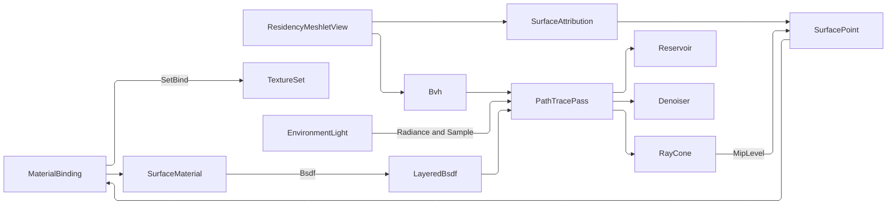

# [APPUI_RENDER_PATHTRACE]

The path-trace integrator for the infinite viewport: `PathTracePass` accumulates global illumination through BVH build-and-refit with ReSTIR reservoirs and progressive denoising, and the integrator shades every scene point from `LayeredBsdf`, the product of `SlabStack` lowering and the `MaterialGraph` sink. The page owns the BVH build/refit, the ReSTIR reservoir, ray-cone texture footprint, progressive accumulation, edge-aware denoise, and exact `LayeredBsdf.Sample`/`Evaluate` consumption at the `PATH_TRACE` seam; `BsdfProjection` owns the sole oracle-tuple projection into the Materials `ShadingFrame`/`Direction`/`Op` vocabulary. The render graph schedules the pass, meshlet bounds feed the BVH, the CPU integrator is the correctness oracle, and GPU acceleration consumes the same contracts.

Every appearance value crosses as a Materials VALUE: `SurfaceAttribution` resolves a hit into a real parameterization and `MaterialBinding` answers one composition-bound query per hit with the whole `SurfaceMaterial` — layered BSDF, tangent-space normal, opacity, emission — sampled by the Materials `SetBind`/`TextureUv` rails at the point's own UV and ray-cone mip level, so a bound `TextureSet` shades here exactly as it shades on the raster twin and this page mints no sampler, no channel name, and no transfer. `LightSource.Environment` carries the resolved `Rasm.Materials.Appearance.EnvironmentLight` row, so the dome answers directional radiance, a luminance-CDF importance draw, and its own solid-angle density on the owner that prefiltered it. Radiance is the scene-linear `RgbSpectrum` throughout — a display-referred host colour never enters the transport — and the world basis is the frozen `+Z`-up OpenPBR frame the `bsdf#SHADING_FRAME` `LocalVector` basis and the equirect correspondence share.

## [01]-[INDEX]

- [02]-[PATH_TRACE]: Real recursive SAH BVH, kernel-shaped degradation refit, ReSTIR reservoirs, ray-cone footprint, environment MIS, honest accumulation, denoise.
- [03]-[LIGHT_RIG]: The ONE `LightSource` row family shared by both integrators; the resolved `EnvironmentLight` dome and the Compute solar-position composition.
- [04]-[BSDF_SHADING]: The integrator shades from the Materials `LayeredBsdf`/`SlabStack`/`SetBind`, never re-deriving lobe math or texture reconstruction.

## [02]-[PATH_TRACE]

- Owner: `Bvh` the bounding-volume hierarchy — PAGE-LOCAL and PRIVATE (a measured oracle kernel over wire-decoded meshlet bounds; the kernel spatial engine is the federation broad-phase owner behind the `[PLACEMENT_LAW]`(e) firebreak, its cross-package acceleration crossing stays wire-shaped `SpatialAnswer.Wire` `NodeLinkProjection`, so an AppUi acceleration wire or a second exported BVH is unrepresentable); `Reservoir` the ReSTIR sample reservoir carried per pixel ON the accumulation target; `SamplePolicy` the light-selection dispatch row; `RayCone` the propagated texture footprint; `TraceLimits` the transport policy row; `PathTracePass` the progressive accumulation pass; `Denoiser` the edge-aware denoise fold over the target's own guide plane.
- Law: a texture LOD is derived, never chosen. `RayCone` propagates the pixel's angular spread from the camera through every hit — width grows by the spread over the traversed distance and the spread itself grows by twice the surface curvature the hit reports — and the cone's footprint at the hit divides the plane's texel span into the mip level `MaterialBinding` samples at. The cone rides the SHADOW segment too, so a blocker's cut-out reads at the blocker's own distance and the blocker's own texel density; carrying the shading point's level down a shadow ray aliases a distant foliage card into hard-edged speckle. Sampling mip 0 at every distance is the aliasing defect this forecloses, and a caller-supplied LOD is the knob it forecloses.
- Law: environment transport is MULTIPLE-IMPORTANCE-SAMPLED, not double-counted. Once the dome answers a guided draw as an NEE candidate, the BSDF continuation that escapes into the same dome carries the balance-heuristic weight `pdfBsdf / (pdfBsdf + pdfEnv)` and the NEE draw carries its complement, so the two estimators sum to one estimate. A delta row — sun, spot, point-shaped emissive, luminaire — reports a zero density, which the weight reads as the delta case and passes through unweighted; that one sentinel replaces a parallel delta-versus-area light flag.
- Law: every `SamplePolicy` arm estimates the SAME integral at the SAME energy. Resampled importance sampling weights each streamed candidate by its target function over its own source density, and rows stream uniformly, so the reservoir weight carries the row count exactly as the `Uniform` arm's single scaled draw does. A bare target function makes the reservoir arm darker by the row count — two interchangeable rows disagreeing on brightness, which reads as a denoiser or an exposure problem and is neither.
- Law: shadow rays honour `geometry_opacity`. A blocker whose sampled opacity is below one attenuates rather than occludes, the walk continuing past it up to `TraceLimits.CutoutSteps` and multiplying transmittance, so a foliage card, a perforated screen, and a cut-out railing cast their real shadow instead of a solid one. The step cap, the opacity floor, and the ray-origin epsilon are policy columns, never literals in the walk — and the epsilon doubles as the emitter-proximity floor, so a positional row coincident with the shading point refuses rather than dividing by a distance the shadow ray cannot step across.
- Entry: `public Fin<AccumulationTarget> Accumulate(AccumulationTarget target, ViewCamera camera, LightRig rig, int sampleBudget, long sampleSeed)` — accumulates one progressive sample set onto the running per-pixel mean under the one camera row and returns the ADVANCED `AccumulationTarget` (`Ordinal + sampleBudget`), so two sequential batches against one target produce the weighted mean of both and the next pass reads the total sample count from the same state owner; convergence is the accumulated sample count, never a wall-clock timer.
- Auto: `Bvh.Build` constructs the hierarchy by a REAL recursive surface-area-heuristic split over the meshlet bounds — children emitted, leaf criterion at four primitives or no cost-improving split; `Refit` is a REAL bottom-up re-bound (leaves re-enclose their moved primitives, interior nodes re-enclose their two children in reverse emission order) and `Maintain` adopts the kernel `[DEGRADATION_REFIT]` shape (`Rasm/.planning/Spatial/index.md`): topology-stable in-place re-bounding and a deterministic `SahCost` rebuild trigger, so a moving scene refits until quality degrades measurably and then rebuilds deterministically; NEE light selection DISPATCHES on the `SamplePolicy` row — `Restir` streams every rig row through the pixel's `Reservoir` (the prior frame's reservoir seeds the stream decayed to `TemporalCap`, the target function is the unshadowed luminance-times-cosine, ONLY the surviving sample pays a shadow ray, and the advanced reservoir writes back to `AccumulationTarget.Reservoirs[pixel]` so temporal reuse is a real state transition), `Uniform` draws one row scaled by count, `Stratified` rotates the row by pixel-plus-ordinal; the progressive accumulator folds each sample set onto the running mean keyed by the accumulation ordinal and advances that ordinal on the returned target — `AccumulationTarget` is the ONE progression owner (`Of` mints it, `Advanced` weights the next batch, `Reset` clears mean, reservoirs, and guides together on camera motion) and no second sample counter exists — so a static camera converges frame over frame and the render graph resets the same target on camera motion; the primary hit writes each pixel's normal/depth guide onto the target's `NormalDepth` plane, and `Denoiser.Resolve` folds the noisy mean with those guides through the 3x3 joint-bilateral weights so an early-frame estimate is presentable before full convergence while the render-hash lane pins the RAW mean.
- Packages: SkiaSharp, Thinktecture.Runtime.Extensions, LanguageExt.Core, Rasm.Materials (project)
- Growth: a new sampling strategy is one `SamplePolicy` row carrying its `SampleDecision` delegate; a new guide plane extends `AccumulationTarget` and `Denoiser`; a new transport bound is one `TraceLimits` column; zero new surface.
- Boundary: convergence is sample-count progressive — the accumulation ordinal is the only progress measure and a fixed-time render is the rejected form, so a path-traced still converges deterministically and the render-hash lane pins a sample count; the BVH refits in place on an animated frame and a full rebuild per frame is the deleted form — the rebuild fires only through the `Maintain` cost trigger; the ray-trace dispatch is the GPU compute surface bound through the `Render/pipeline` render-graph lease — the `SKRuntimeEffect` ray-generation shader and the per-backend acceleration-structure spelling resolve under VIEWPORT_GPU; the CPU reference path tracer over the BVH is the correctness oracle — it now has light to transport (the `LightRig`), so the oracle renders a lit image by construction and comparability with the raster path holds because BOTH integrators read the same rig AND the same bound `TextureSet`; the GPU acceleration is the SPIKE; the BVH builds over the Compute-decoded `Render/meshlets` cluster bounds so the integrator re-models no geometry, and the per-hit parameterization arrives through `SurfaceAttribution` over the `Render/meshlets` `BindlessTable` `uv` channel rather than being invented here — a fabricated `(0, 0)` UV is the deleted form, and the sphere-proxy fallback is a DECLARED degradation the attribution row reports rather than a silent default.

```csharp signature
// (Continues the Rasm.AppUi.Render compilation unit, plus:)
using CommunityToolkit.HighPerformance.Buffers;       // SpanOwner<T> — the SAH suffix-area rental
using Rasm.Materials.Appearance;                      // EnvironmentLight, EnvironmentSample
using Rasm.Materials.Appearance.Bsdf;                 // LayeredBsdf, ShadingFrame, LocalVector, RgbSpectrum
using Rasm.Numerics;                                  // Direction, UnitInterval, Dimension

// The pixel's angular footprint carried along the path. Width is the cone diameter at the current vertex and Spread
// its per-unit-distance growth; a hit widens the spread by twice the surface curvature the attribution reports, so a
// convex hit blurs downstream taps and a planar hit does not. Akenine-Moller ray-cone LOD, one struct, no per-lobe row.
public readonly record struct RayCone(double Width, double Spread) {
    // The primary cone opens at the pixel solid angle: half the vertical field over the film height.
    public static RayCone Primary(double pixelSpread) => new(0.0, pixelSpread);

    public RayCone Advanced(double distance) => this with { Width = Width + (Spread * distance) };
    public RayCone Scattered(double curvature) => this with { Spread = Spread + (2.0 * curvature) };

    // The mip level a plane of `texels` across is sampled at: the cone's footprint in UV, projected against the
    // grazing angle, expressed in halvings. A degenerate cosine clamps rather than diverging to the coarsest level.
    public double MipLevel(int texels, double uvScale, double cosine) =>
        Math.Max(0.0, Math.Log2(Math.Max(Width * uvScale * texels / Math.Max(Math.Abs(cosine), 1e-3), 1e-9)));
}

// The transport bounds, as policy columns rather than literals scattered through the walk. CutoutSteps caps the
// alpha-cutout shadow traversal, OpacityFloor is the transmittance below which a blocker counts as solid, and
// SurfaceOffset is the shadow/continuation ray origin epsilon.
public readonly record struct TraceLimits(int CutoutSteps, double OpacityFloor, double SurfaceOffset) {
    public static readonly TraceLimits Default = new(CutoutSteps: 4, OpacityFloor: 1e-3, SurfaceOffset: 1e-4);
}

public readonly record struct BvhNode(BoundingSphere Bounds, int Left, int Right, int FirstPrimitive, int PrimitiveCount) {
    public bool IsLeaf => PrimitiveCount > 0;
}

public sealed record Bvh(ImmutableArray<BvhNode> Nodes, ImmutableArray<int> Primitives, ImmutableArray<BoundingSphere> PrimitiveBounds) {
    private const int LeafSize = 4;

    public static Bvh Build(Seq<ResidencyMeshletView> meshlets) {
        if (meshlets.IsEmpty) { return new Bvh([], [], []); }
        int[] prims = [.. Enumerable.Range(0, meshlets.Count)];
        List<BvhNode> nodes = [];
        BuildNode(meshlets, prims, 0, meshlets.Count, nodes);
        return new Bvh([.. nodes], [.. prims], [.. meshlets.Map(static m => m.Bounds)]);
    }

    // Closest-hit sphere traversal — the oracle's one intersection kernel, shared by primary, shadow,
    // and continuation rays; an explicit stack walk, front-to-back by child hit distance. The result is a NULLABLE
    // tuple rather than an Option because every caller sits on a `ref ulong` sampler-state frame, and a monadic Match
    // would have to capture that ref in a lambda — which cannot type.
    public (int Primitive, double T)? Intersect((double X, double Y, double Z) origin, (double X, double Y, double Z) direction, double tMax) {
        if (Nodes.IsEmpty) { return null; }
        (int Primitive, double T) best = (Primitive: -1, T: tMax);
        Stack<int> walk = new([0]);
        while (walk.TryPop(out int at)) {
            BvhNode node = Nodes[at];
            if (RaySphere(origin, direction, node.Bounds) is not { } enter || enter > best.T) { continue; }
            if (node.IsLeaf) {
                for (int p = node.FirstPrimitive; p < node.FirstPrimitive + node.PrimitiveCount; p++) {
                    int prim = Primitives[p];
                    if (RaySphere(origin, direction, PrimitiveBounds[prim]) is { } t && t < best.T) { best = (prim, t); }
                }
            }
            else { walk.Push(node.Left); walk.Push(node.Right); }
        }
        return best.Primitive >= 0 ? best : null;
    }

    private static double? RaySphere((double X, double Y, double Z) origin, (double X, double Y, double Z) direction, BoundingSphere sphere) {
        (double ox, double oy, double oz) = (sphere.X - origin.X, sphere.Y - origin.Y, sphere.Z - origin.Z);
        double along = (ox * direction.X) + (oy * direction.Y) + (oz * direction.Z);
        double square = (ox * ox) + (oy * oy) + (oz * oz) - (along * along);
        double radius2 = sphere.Radius * sphere.Radius;
        if (square > radius2) { return null; }
        double offset = Math.Sqrt(radius2 - square);
        double near = along - offset;
        return near > 1e-6 ? near : along + offset > 1e-6 ? along + offset : null;
    }

    // Real recursive SAH: parent reserves its slot, children EMIT and back-patch — a leaf lands only at
    // LeafSize primitives or when no candidate split beats the leaf cost. Statement-bodied boundary kernel.
    private static int BuildNode(Seq<ResidencyMeshletView> meshlets, int[] prims, int start, int count, List<BvhNode> nodes) {
        int self = nodes.Count;
        nodes.Add(default);
        BoundingSphere bounds = Enclose(meshlets, prims.AsSpan(), start, count);
        (int mid, double splitCost) = count <= LeafSize ? (start, double.PositiveInfinity) : SahSplit(meshlets, prims, start, count);
        if (count <= LeafSize || splitCost >= count * bounds.SurfaceArea()) {
            nodes[self] = new BvhNode(bounds, -1, -1, start, count);
            return self;
        }
        int left = BuildNode(meshlets, prims, start, mid - start, nodes);
        int right = BuildNode(meshlets, prims, mid, (start + count) - mid, nodes);
        nodes[self] = new BvhNode(bounds, left, right, -1, 0);
        return self;
    }

    // SAH over the longest centroid axis in TWO LINEAR SWEEPS: a backward pass records the suffix bound's area at every
    // split point into one rental, a forward pass grows the prefix bound, and each candidate costs two O(1) area reads.
    // Re-enclosing both sides per candidate is quadratic per node and cubic-ish over the build — at the cluster counts
    // an infinite viewport streams, that is the whole build cost, and it is the naive form this sweep deletes. Both
    // running bounds grow through the exact two-sphere EnclosePair, so the partition the cost picks is a real bound.
    private static (int Mid, double Cost) SahSplit(Seq<ResidencyMeshletView> meshlets, int[] prims, int start, int count) {
        int axis = LongestAxis(meshlets, prims.AsSpan(), start, count);
        Array.Sort(prims, start, count, Comparer<int>.Create((a, b) => Centroid(meshlets[a], axis).CompareTo(Centroid(meshlets[b], axis))));
        using SpanOwner<double> suffix = SpanOwner<double>.Allocate(count);
        BoundingSphere right = meshlets[prims[start + count - 1]].Bounds;
        suffix.Span[count - 1] = right.SurfaceArea();
        for (int at = count - 2; at >= 0; at--) {
            right = EnclosePair(right, meshlets[prims[start + at]].Bounds);
            suffix.Span[at] = right.SurfaceArea();
        }
        (int Mid, double Cost) best = (Mid: start + (count / 2), Cost: double.PositiveInfinity);
        BoundingSphere left = meshlets[prims[start]].Bounds;
        for (int split = 1; split < count; split++) {
            double cost = (split * left.SurfaceArea()) + ((count - split) * suffix.Span[split]);
            if (cost < best.Cost) { best = (start + split, cost); }
            left = EnclosePair(left, meshlets[prims[start + split]].Bounds);
        }
        return best;
    }

    // Real enclosing sphere: centroid mean, radius = max(center distance + primitive radius) — a
    // center-sum with a bare max-radius is the deleted form. The index run arrives as a SPAN, so a leaf re-bound reads
    // the retained order in place instead of copying the whole primitive array once per leaf.
    private static BoundingSphere Enclose(Seq<ResidencyMeshletView> meshlets, ReadOnlySpan<int> prims, int start, int count) {
        (double cx, double cy, double cz) = (0d, 0d, 0d);
        for (int at = start; at < start + count; at++) {
            BoundingSphere b = meshlets[prims[at]].Bounds;
            cx += b.X; cy += b.Y; cz += b.Z;
        }
        (cx, cy, cz) = (cx / count, cy / count, cz / count);
        double radius = 0d;
        for (int at = start; at < start + count; at++) {
            BoundingSphere b = meshlets[prims[at]].Bounds;
            radius = Math.Max(radius, Math.Sqrt(((b.X - cx) * (b.X - cx)) + ((b.Y - cy) * (b.Y - cy)) + ((b.Z - cz) * (b.Z - cz))) + b.Radius);
        }
        return new BoundingSphere(cx, cy, cz, radius);
    }

    private static int LongestAxis(Seq<ResidencyMeshletView> meshlets, ReadOnlySpan<int> prims, int start, int count) {
        (double minX, double minY, double minZ, double maxX, double maxY, double maxZ) =
            (double.MaxValue, double.MaxValue, double.MaxValue, double.MinValue, double.MinValue, double.MinValue);
        for (int at = start; at < start + count; at++) {
            BoundingSphere b = meshlets[prims[at]].Bounds;
            (minX, minY, minZ) = (Math.Min(minX, b.X), Math.Min(minY, b.Y), Math.Min(minZ, b.Z));
            (maxX, maxY, maxZ) = (Math.Max(maxX, b.X), Math.Max(maxY, b.Y), Math.Max(maxZ, b.Z));
        }
        (double dx, double dy, double dz) = (maxX - minX, maxY - minY, maxZ - minZ);
        return dx >= dy && dx >= dz ? 0 : dy >= dz ? 1 : 2;
    }

    private static double Centroid(ResidencyMeshletView meshlet, int axis) =>
        axis == 0 ? meshlet.Bounds.X : axis == 1 ? meshlet.Bounds.Y : meshlet.Bounds.Z;

    // Real bottom-up refit: children always emit AFTER their parent slot reserves, so a reverse walk
    // re-bounds every leaf from its moved primitives first, then every interior node from its two children.
    public Bvh Refit(Seq<ResidencyMeshletView> moved) {
        BvhNode[] nodes = [.. Nodes];
        for (int at = nodes.Length - 1; at >= 0; at--) {
            BvhNode node = nodes[at];
            nodes[at] = node.IsLeaf
                ? node with { Bounds = EncloseLeaf(moved, node) }
                : node with { Bounds = EnclosePair(nodes[node.Left].Bounds, nodes[node.Right].Bounds) };
        }
        return this with { Nodes = [.. nodes], PrimitiveBounds = [.. moved.Map(static m => m.Bounds)] };
    }

    private BoundingSphere EncloseLeaf(Seq<ResidencyMeshletView> moved, BvhNode leaf) =>
        Enclose(moved, Primitives.AsSpan(), leaf.FirstPrimitive, leaf.PrimitiveCount);

    private static BoundingSphere EnclosePair(BoundingSphere a, BoundingSphere b) {
        double d = Math.Sqrt(((b.X - a.X) * (b.X - a.X)) + ((b.Y - a.Y) * (b.Y - a.Y)) + ((b.Z - a.Z) * (b.Z - a.Z)));
        if (d + b.Radius <= a.Radius) { return a; }
        if (d + a.Radius <= b.Radius) { return b; }
        double radius = (d + a.Radius + b.Radius) / 2d;
        double t = d <= 0d ? 0d : (radius - a.Radius) / d;
        return new BoundingSphere(a.X + ((b.X - a.X) * t), a.Y + ((b.Y - a.Y) * t), a.Z + ((b.Z - a.Z) * t), radius);
    }

    // Kernel [DEGRADATION_REFIT] shape: topology-stable in-place re-bounding with a deterministic
    // SahCost rebuild trigger — refit until measured quality degrades past the factor, then rebuild.
    public Bvh Maintain(Seq<ResidencyMeshletView> moved, double rebuildFactor = 1.5) =>
        Refit(moved) switch {
            var refit => refit.SahCost() > SahCost() * rebuildFactor ? Build(moved) : refit,
        };

    public double SahCost() =>
        Nodes.Sum(static node => node.IsLeaf ? node.PrimitiveCount * node.Bounds.SurfaceArea() : node.Bounds.SurfaceArea());
}

// Weighted-reservoir resampled importance sampling state: Update streams one candidate, Decayed caps the
// temporal history so a stale frame never dominates, and Weight is the unbiased RIS estimator factor
// WeightSum / (SampleCount * TargetPdf) the chosen sample shades with.
public readonly record struct Reservoir(double WeightSum, int SampleCount, long ChosenSample, double TargetPdf) {
    public Reservoir Update(long candidate, double weight, double pdf, double random) =>
        (WeightSum + weight) switch {
            var sum => random < weight / Math.Max(sum, 1e-12)
                ? new Reservoir(sum, SampleCount + 1, candidate, pdf)
                : new Reservoir(sum, SampleCount + 1, ChosenSample, TargetPdf),
        };

    public Reservoir Decayed(int cap) =>
        SampleCount <= cap ? this : new Reservoir(WeightSum * ((double)cap / SampleCount), cap, ChosenSample, TargetPdf);

    public double Weight => SampleCount == 0 || TargetPdf <= 0d ? 0d : WeightSum / (SampleCount * TargetPdf);
}

// The light-selection policy the NEE arm DISPATCHES on — a row is behavior at the integrator, never a label:
// Restir streams every rig row through the per-pixel reservoir with temporal reuse and shadow-tests only
// the survivor, Uniform draws one row scaled by count, Stratified rotates the row by (pixel + ordinal).
[SmartEnum<string>]
public sealed partial class SamplePolicy {
    public static readonly SamplePolicy Restir = new("restir", static (_, _, _, _) => new SampleDecision.ReservoirReuse());
    public static readonly SamplePolicy Uniform = new("uniform", static (_, _, count, random) =>
        new SampleDecision.Direct(Math.Min((int)(random * count), count - 1), count));
    public static readonly SamplePolicy Stratified = new("stratified", static (pixel, ordinal, count, _) =>
        new SampleDecision.Direct((int)((pixel + ordinal) % count), count));

    public const int TemporalCap = 20;

    [UseDelegateFromConstructor]
    public partial SampleDecision Decide(int pixel, long ordinal, int count, double random);
}

[Union(ConversionFromValue = ConversionOperatorsGeneration.None)]
public abstract partial record SampleDecision {
    private SampleDecision() { }
    public sealed record ReservoirReuse : SampleDecision;
    public sealed record Direct(int Index, double Weight) : SampleDecision;
}

// Edge-aware joint-bilateral resolve over the accumulation guides: a 3x3 weighted mean whose weights fold
// color, normal, and depth distances through the three sigmas, so an early-frame estimate presents smooth
// while geometry edges hold. Presentation-only — the render-hash lane pins the RAW mean, never this output.
public sealed record Denoiser(double NormalSigma, double DepthSigma, double ColorSigma) {
    public static readonly Denoiser EdgeAware = new(NormalSigma: 0.1, DepthSigma: 0.05, ColorSigma: 0.4);

    public float[] Resolve(AccumulationTarget film) {
        float[] output = new float[film.Rgba.Length];
        Span<float> rgba = film.Rgba.Span;
        Span<float> guides = film.NormalDepth.Span;
        for (int py = 0; py < film.Height; py++) {
            for (int px = 0; px < film.Width; px++) {
                int at = (py * film.Width) + px;
                (double r, double g, double b, double w) = (0d, 0d, 0d, 0d);
                for (int dy = -1; dy <= 1; dy++) {
                    for (int dx = -1; dx <= 1; dx++) {
                        int near = (Math.Clamp(py + dy, 0, film.Height - 1) * film.Width) + Math.Clamp(px + dx, 0, film.Width - 1);
                        double weight = Math.Exp(
                            -(Gap(rgba, at, near, 3) / (ColorSigma * ColorSigma))
                            - (Gap(guides, at, near, 3) / (NormalSigma * NormalSigma))
                            - (Gap(guides, (at * 4) + 3, (near * 4) + 3, 1, raw: true) / (DepthSigma * DepthSigma)));
                        (r, g, b, w) = (r + (rgba[near * 4] * weight), g + (rgba[(near * 4) + 1] * weight), b + (rgba[(near * 4) + 2] * weight), w + weight);
                    }
                }
                (output[at * 4], output[(at * 4) + 1], output[(at * 4) + 2], output[(at * 4) + 3]) =
                    ((float)(r / w), (float)(g / w), (float)(b / w), 1f);
            }
        }
        return output;
    }

    private static double Gap(ReadOnlySpan<float> plane, int a, int b, int components, bool raw = false) {
        (int baseA, int baseB) = raw ? (a, b) : (a * 4, b * 4);
        double sum = 0d;
        for (int c = 0; c < components; c++) { double d = plane[baseA + c] - plane[baseB + c]; sum += d * d; }
        return sum;
    }
}

// The per-pixel running mean, its sample ordinal, the ReSTIR reservoir array, and the normal/depth guide
// plane — the ONE progressive-state owner: Advanced weights the next batch, Reset serves camera motion, and
// reservoirs and guides live HERE so temporal reuse and the edge-aware denoise read the same state the
// accumulation transition writes; no second sample counter or side buffer exists anywhere.
public sealed record AccumulationTarget(
    int Width,
    int Height,
    Memory<float> Rgba,
    Memory<Reservoir> Reservoirs,
    Memory<float> NormalDepth,
    long Ordinal) {
    public static AccumulationTarget Of(int width, int height) =>
        new(width, height, new float[width * height * 4], new Reservoir[width * height], new float[width * height * 4], 0L);

    public AccumulationTarget Advanced(int samples) => this with { Ordinal = Ordinal + samples };

    public AccumulationTarget Reset() {
        Rgba.Span.Clear();
        Reservoirs.Span.Clear();
        NormalDepth.Span.Clear();
        return this with { Ordinal = 0L };
    }
}

public sealed record PathTracePass(
    Bvh Scene,
    SamplePolicy Sampling,
    Denoiser Denoise,
    SurfaceAttribution Attribution,
    MaterialBinding Materials,
    BsdfProjection Projection,
    TraceLimits Limits) {
    // Honest integrate-or-gate: an empty scene, a lightless rig, or a non-positive sample budget gates
    // — zero divides a fresh target's mean and a negative budget regresses the ordinal, so only positive
    // batches enter the progressive transition; the integrate arm traces sampleBudget paths per pixel
    // through the private CPU oracle kernel below and returns the target advanced by exactly the samples
    // it folded into the mean.
    public Fin<AccumulationTarget> Accumulate(AccumulationTarget target, ViewCamera camera, LightRig rig, int sampleBudget, long sampleSeed) =>
        sampleBudget <= 0
            ? Fin.Fail<AccumulationTarget>(new ViewportFault.Text($"path-trace/sample-budget: {sampleBudget} is not a positive batch"))
            : Scene.Nodes.IsEmpty
                ? Fin.Fail<AccumulationTarget>(new ViewportFault.Text("path-trace/empty-scene: BVH has no nodes"))
                : rig.Rows.IsEmpty
                    ? Fin.Fail<AccumulationTarget>(new ViewportFault.Text("path-trace/no-light: the rig carries zero LightSource rows"))
                    : Fin.Succ(Integrate(target, camera, rig, sampleBudget, sampleSeed));

    // Statement-bodied oracle kernel — deterministic per-(pixel, ordinal, seed) sequence so the render-hash
    // lane pins a sample count. Path shape: primary ray + its pixel cone -> closest hit (miss folds the dome by
    // DIRECTION) -> attribution and one Materials query at the cone's own mip level -> NEE over every rig row
    // including the guided dome (shadow rays alpha-attenuated through the same Intersect kernel, throughput via
    // the Materials Evaluate seam) -> one BSDF-sampled continuation MIS-weighted against the dome density.
    private AccumulationTarget Integrate(AccumulationTarget target, ViewCamera camera, LightRig rig, int sampleBudget, long sampleSeed) {
        CameraFrame frame = camera.Frame;
        (double fx, double fy, double fz) = OracleFrame.Normalize(frame.Target.X - frame.Eye.X, frame.Target.Y - frame.Eye.Y, frame.Target.Z - frame.Eye.Z);
        (double rx, double ry, double rz) = OracleFrame.Normalize(OracleFrame.Cross(fx, fy, fz, frame.Up.X, frame.Up.Y, frame.Up.Z));
        (double ux, double uy, double uz) = OracleFrame.Cross(rx, ry, rz, fx, fy, fz);
        double aspect = target.Width / (double)target.Height;
        for (int py = 0; py < target.Height; py++) {
            for (int px = 0; px < target.Width; px++) {
                (double r, double g, double b) batch = (0d, 0d, 0d);
                for (int s = 0; s < sampleBudget; s++) {
                    ulong state = Mix(((ulong)(uint)((py * target.Width) + px) << 32) ^ (ulong)(target.Ordinal + s) ^ (ulong)sampleSeed);
                    double screenX = ((px + Next(ref state)) / target.Width * 2d) - 1d;
                    double screenY = 1d - ((py + Next(ref state)) / target.Height * 2d);
                    // The camera row seeds the ray AND its cone in one switch: a perspective pixel opens an angular
                    // spread of one pixel's solid angle, while an orthographic pixel carries a constant width and
                    // zero spread — parallel rays never widen, so an ortho render must not blur with distance.
                    ((double X, double Y, double Z) Origin, (double X, double Y, double Z) Direction, RayCone Cone) ray = camera.Switch(
                        state: (Frame: frame, Fx: fx, Fy: fy, Fz: fz, Rx: rx, Ry: ry, Rz: rz, Ux: ux, Uy: uy, Uz: uz, X: screenX, Y: screenY, Aspect: aspect, Height: (double)target.Height),
                        perspective: static (basis, lens) => {
                            double half = Math.Tan(double.DegreesToRadians(lens.FieldOfViewDeg) / 2d);
                            (double x, double y) = (basis.X * half * basis.Aspect, basis.Y * half);
                            return (
                                ((double)basis.Frame.Eye.X, basis.Frame.Eye.Y, basis.Frame.Eye.Z),
                                OracleFrame.Normalize(basis.Fx + (x * basis.Rx) + (y * basis.Ux), basis.Fy + (x * basis.Ry) + (y * basis.Uy), basis.Fz + (x * basis.Rz) + (y * basis.Uz)),
                                RayCone.Primary(2d * half / basis.Height));
                        },
                        orthographic: static (basis, lens) => {
                            (double x, double y) = (basis.X * lens.ViewHeight * basis.Aspect * 0.5d, basis.Y * lens.ViewHeight * 0.5d);
                            return (
                                (basis.Frame.Eye.X + (x * basis.Rx) + (y * basis.Ux), basis.Frame.Eye.Y + (x * basis.Ry) + (y * basis.Uy), basis.Frame.Eye.Z + (x * basis.Rz) + (y * basis.Uz)),
                                (basis.Fx, basis.Fy, basis.Fz),
                                new RayCone(lens.ViewHeight / basis.Height, 0d));
                        });
                    RgbSpectrum carried = Radiance(ray.Origin, ray.Direction, ray.Cone, rig, target, (py * target.Width) + px, ref state);
                    batch = (batch.r + carried.R, batch.g + carried.G, batch.b + carried.B);
                }
                long total = target.Ordinal + sampleBudget;
                int slot = ((py * target.Width) + px) * 4;
                target.Rgba.Span[slot + 0] = (float)(((target.Rgba.Span[slot + 0] * target.Ordinal) + batch.r) / total);
                target.Rgba.Span[slot + 1] = (float)(((target.Rgba.Span[slot + 1] * target.Ordinal) + batch.g) / total);
                target.Rgba.Span[slot + 2] = (float)(((target.Rgba.Span[slot + 2] * target.Ordinal) + batch.b) / total);
                target.Rgba.Span[slot + 3] = 1f;
            }
        }
        return target.Advanced(sampleBudget);
    }

    private RgbSpectrum Radiance((double X, double Y, double Z) origin, (double X, double Y, double Z) direction, RayCone cone, LightRig rig, AccumulationTarget film, int pixel, ref ulong state) =>
        Scene.Intersect(origin, direction, double.MaxValue) is { } hit
            ? Lit(origin, direction, cone, hit, rig, film, pixel, ref state)
            : Dome(rig, direction, bsdfPdf: 0d);

    // NEE is POLICY-DISPATCHED light selection over the rig, never an unconditional every-light loop: the
    // primary hit writes the pixel's normal/depth guide, the SamplePolicy row selects the light-sampling
    // arm, and only the selected candidate pays a shadow ray. The reservoir arm reads and writes
    // film.Reservoirs[pixel], so temporal reuse is a real state transition on the one progressive owner.
    // Attribution runs BEFORE the Materials query so the query carries a real UV and the cone's own mip level;
    // the guide plane records the PERTURBED normal, so the denoiser edge-stops on the normal the shade used.
    private RgbSpectrum Lit((double X, double Y, double Z) origin, (double X, double Y, double Z) direction, RayCone cone, (int Primitive, double T) hit, LightRig rig, AccumulationTarget film, int pixel, ref ulong state) {
        BoundingSphere sphere = Scene.PrimitiveBounds[hit.Primitive];
        (double hx, double hy, double hz) = (origin.X + (direction.X * hit.T), origin.Y + (direction.Y * hit.T), origin.Z + (direction.Z * hit.T));
        SurfaceAttributes surface = Attribution.At(hit.Primitive, (hx, hy, hz), sphere);
        (double X, double Y, double Z) wo = (-direction.X, -direction.Y, -direction.Z);
        RayCone atHit = cone.Advanced(hit.T);
        SurfacePoint point = new((hx, hy, hz), surface.Frame, surface.Uv, surface.MaterialKey,
            atHit.MipLevel(surface.Texels, surface.UvScale, Dot(surface.Frame.Normal, wo)));
        SurfaceMaterial material = Materials.Resolve(point);
        OracleFrame shading = surface.Frame.Perturbed(material.TangentNormal);
        (film.NormalDepth.Span[pixel * 4], film.NormalDepth.Span[(pixel * 4) + 1], film.NormalDepth.Span[(pixel * 4) + 2], film.NormalDepth.Span[(pixel * 4) + 3]) =
            ((float)shading.Normal.X, (float)shading.Normal.Y, (float)shading.Normal.Z, (float)hit.T);
        SurfacePoint shaded = point with { Frame = shading };
        RgbSpectrum sum = material.Emission.Add(Nee(shaded, material, wo, shading.Normal, atHit, rig, film, pixel, ref state));
        return this.Shade(shaded, material.Bsdf, wo, Next(ref state), Next(ref state), Next(ref state)).ToOption().Match(
            Some: bounce => Scene.Intersect(Offset(shaded.Position, bounce.Wi), bounce.Wi, double.MaxValue) is null
                ? sum.Add(bounce.Throughput.Mul(Dome(rig, bounce.Wi, bounce.Pdf)))
                : sum, // one-bounce oracle: a second hit terminates; deeper transport is the GPU twin's
            None: () => sum);
    }

    // One candidate derivation serves every policy arm: the (direction, radiance, reach, density) of one rig row
    // toward the shading point. A positional row reports Pdf 0 — the DELTA sentinel every MIS weight reads — while
    // the dome reports its guided draw's true solid-angle density, so one shape spans both estimator classes and no
    // parallel delta-versus-area flag exists. The dome is a NEE candidate here AND a miss fold in Dome; the balance
    // heuristic is what keeps the two from double-counting. Every positional arm reads its reach through Toward, whose
    // proximity refusal is what keeps an emitter coincident with the shading point from returning an unbounded
    // estimate no downstream clamp could tell from real energy.
    private Option<LightCandidate> Candidate(LightSource row, SurfacePoint point, double u0, double u1) =>
        row switch {
            LightSource.Environment sky => Some(sky.Dome.Sample(UnitInterval.Create(u0), UnitInterval.Create(u1)) switch {
                var draw => new LightCandidate(
                    (draw.Direction.X, draw.Direction.Y, draw.Direction.Z), draw.Radiance, double.MaxValue, draw.Pdf),
            }),
            LightSource.Sun sun => sun.Direction.Map(wi => new LightCandidate(wi, sun.Radiance, double.MaxValue, 0d)),
            LightSource.Emissive glow => Toward(point.Position, (glow.X, glow.Y, glow.Z)).Map(reach =>
                new LightCandidate(reach.Wi, glow.Radiance.Scale(glow.Area / (reach.Distance * reach.Distance)), reach.Distance, 0d)),
            LightSource.Spot spot => Toward(point.Position, (spot.X, spot.Y, spot.Z)).Bind(reach =>
                Cone(spot, reach.Wi) switch {
                    <= 0d => Option<LightCandidate>.None,
                    var falloff => Some(new LightCandidate(
                        reach.Wi, spot.Radiance.Scale(falloff / (reach.Distance * reach.Distance)), reach.Distance, 0d)),
                }),
            LightSource.Area panel => Toward(point.Position, (panel.X, panel.Y, panel.Z)).Bind(reach =>
                Math.Max(Dot(panel.Normal, (-reach.Wi.X, -reach.Wi.Y, -reach.Wi.Z)), 0d) switch {
                    <= 0d => Option<LightCandidate>.None,
                    var facing => Some(new LightCandidate(
                        reach.Wi,
                        panel.Radiance.Scale(facing * panel.Width * panel.Height / (reach.Distance * reach.Distance)),
                        reach.Distance, 0d)),
                }),
            LightSource.Ies lum => Toward(point.Position, (lum.X, lum.Y, lum.Z)).Bind(reach =>
                IesCandela(lum, reach.Wi) switch {
                    <= 0d => Option<LightCandidate>.None,
                    var candela => Some(new LightCandidate(
                        reach.Wi, lum.Tint.Scale(candela / (reach.Distance * reach.Distance)), reach.Distance, 0d)),
                }),
            _ => None,
        };

    private RgbSpectrum Nee(SurfacePoint point, SurfaceMaterial material, (double X, double Y, double Z) wo, (double X, double Y, double Z) normal, RayCone cone, LightRig rig, AccumulationTarget film, int pixel, ref ulong state) {
        if (rig.Rows.IsEmpty) { return RgbSpectrum.Black; }
        SampleDecision decision = Sampling.Decide(pixel, film.Ordinal, rig.Rows.Count, Next(ref state));
        (RgbSpectrum Color, ulong State) resolved = decision.Switch(
            state: (Owner: this, Point: point, Material: material, Wo: wo, Normal: normal, Cone: cone, Rig: rig, Film: film, Pixel: pixel, Random: state),
            reservoirReuse: static (context, _) => context.Owner.NeeRestir(
                context.Point, context.Material, context.Wo, context.Normal, context.Cone, context.Rig, context.Film, context.Pixel, context.Random),
            direct: static (context, direct) => context.Owner.NeeDirect(
                context.Rig.Rows[direct.Index], context.Point, context.Material, context.Wo, context.Normal, context.Cone, direct.Weight, context.Random));
        state = resolved.State;
        return resolved.Color;
    }

    // Every arm draws its dome coordinates from the SAME stream and returns the advanced state, so a guided
    // environment candidate decorrelates per pixel and no arm consumes randoms the caller cannot account for.
    private (RgbSpectrum Color, ulong State) NeeDirect(LightSource row, SurfacePoint point, SurfaceMaterial material, (double X, double Y, double Z) wo, (double X, double Y, double Z) normal, RayCone cone, double weight, ulong state) {
        (double u0, double u1) = (Next(ref state), Next(ref state));
        return (Shaded(row, point, material, wo, normal, cone, weight, u0, u1), state);
    }

    // Weighted-reservoir RIS with temporal reuse: the prior frame's reservoir seeds the stream (decayed to
    // the cap), every rig row streams a candidate weighted by its unshadowed target function, and ONLY the
    // surviving sample pays the shadow ray, shaded with the reservoir's unbiased Weight — the advanced
    // reservoir writes back to the pixel's cell so the next frame reuses it. The survivor's OWN draw coordinates
    // ride along, so the shaded dome direction is the one whose target function won the stream rather than a
    // fresh draw the reservoir never measured.
    private (RgbSpectrum Color, ulong State) NeeRestir(
        SurfacePoint point,
        SurfaceMaterial material,
        (double X, double Y, double Z) wo,
        (double X, double Y, double Z) normal,
        RayCone cone,
        LightRig rig,
        AccumulationTarget film,
        int pixel,
        ulong state) {
        Reservoir reservoir = film.Reservoirs.Span[pixel].Decayed(SamplePolicy.TemporalCap);
        (double U0, double U1) drawn = (0d, 0d);
        for (int row = 0; row < rig.Rows.Count; row++) {
            (double u0, double u1) = (Next(ref state), Next(ref state));
            double target = Candidate(rig.Rows[row], point, u0, u1)
                .Map(candidate => Luminance(candidate.Radiance) * Math.Max(Dot(candidate.Wi, normal), 0d))
                .IfNone(0d);
            // RIS weights each candidate by its target function OVER its SOURCE density. Rows stream uniformly, so
            // that density is 1/N and the streamed weight is N times the target. Streaming the bare target makes this
            // arm N times darker than the Uniform arm, which scales its single draw by the same N — two estimators of
            // one integral disagreeing on energy, which is exactly the divergence an interchangeable SamplePolicy row
            // must not carry, and which no image comparison attributes to the reservoir.
            reservoir = reservoir.Update(row, target * rig.Rows.Count, target, Next(ref state));
            if (reservoir.ChosenSample == row) { drawn = (u0, u1); }
        }
        film.Reservoirs.Span[pixel] = reservoir;
        int survivor = (int)Math.Clamp(reservoir.ChosenSample, 0L, rig.Rows.Count - 1L);
        return (Shaded(rig.Rows[survivor], point, material, wo, normal, cone, reservoir.Weight, drawn.U0, drawn.U1), state);
    }

    // The shaded candidate: transmittance (alpha-cutout aware), the Materials Evaluate seam, the geometric cosine,
    // the policy weight, and — for a non-delta row alone — the balance-heuristic MIS weight over its own density.
    private RgbSpectrum Shaded(LightSource row, SurfacePoint point, SurfaceMaterial material, (double X, double Y, double Z) wo, (double X, double Y, double Z) normal, RayCone cone, double weight, double u0, double u1) =>
        Candidate(row, point, u0, u1)
            .Map(candidate => Transmittance(point, cone, candidate) switch {
                <= 0d => RgbSpectrum.Black,
                var visible => this.Evaluate(point, material.Bsdf, wo, candidate.Wi).ToOption()
                    .Map(throughput => throughput.Mul(candidate.Radiance).Scale(
                        visible * Math.Max(Dot(candidate.Wi, normal), 0d) * weight
                        * (candidate.Pdf <= 0d
                            ? 1d
                            : Balance(candidate.Pdf, this.Density(point, material.Bsdf, wo, candidate.Wi)) / candidate.Pdf)))
                    .IfNone(RgbSpectrum.Black),
            })
            .IfNone(RgbSpectrum.Black);

    // The shadow walk. A blocker whose sampled geometry_opacity is below one ATTENUATES and the walk resumes past
    // it, so a foliage card or a perforated screen casts its real shadow; the traversal is bounded by the policy's
    // own step count and terminates opaque at the transmittance floor rather than looping through an alpha stack.
    private double Transmittance(SurfacePoint from, RayCone cone, LightCandidate candidate) {
        (double X, double Y, double Z) at = Offset(from.Position, candidate.Wi);
        (double reach, double carried) = (candidate.TMax, 1d);
        RayCone walked = cone;
        for (int step = 0; step < Limits.CutoutSteps; step++) {
            if (Scene.Intersect(at, candidate.Wi, reach) is not { } blocker) { return carried; }
            (double bx, double by, double bz) =
                (at.X + (candidate.Wi.X * blocker.T), at.Y + (candidate.Wi.Y * blocker.T), at.Z + (candidate.Wi.Z * blocker.T));
            SurfaceAttributes surface = Attribution.At(blocker.Primitive, (bx, by, bz), Scene.PrimitiveBounds[blocker.Primitive]);
            walked = walked.Advanced(blocker.T);
            // The cutout a shadow ray reads is the alpha at THIS blocker's distance over THIS primitive's own texel
            // density — the cone advances along the shadow segment exactly as it advances along a camera path. Carrying
            // the shading point's level instead reads a distant foliage card at the near surface's resolution, which
            // aliases the cut-out into hard-edged shadow speckle no denoise guide edge-stops on.
            carried *= 1d - Materials.Resolve(new SurfacePoint(
                (bx, by, bz), surface.Frame, surface.Uv, surface.MaterialKey,
                walked.MipLevel(surface.Texels, surface.UvScale, Dot(surface.Frame.Normal, (-candidate.Wi.X, -candidate.Wi.Y, -candidate.Wi.Z))))).Opacity;
            if (carried <= Limits.OpacityFloor) { return 0d; }
            (at, reach) = (Offset((bx, by, bz), candidate.Wi), reach - blocker.T);
        }
        return carried;
    }

    private static double Luminance(RgbSpectrum radiance) => (0.2126 * radiance.R) + (0.7152 * radiance.G) + (0.0722 * radiance.B);

    // Every Environment row answers BY DIRECTION on its own resolved EnvironmentLight — the equirect
    // correspondence, the rotation, and the intensity all live on that owner, so this fold re-derives nothing.
    // The balance weight makes the miss fold and the NEE draw one estimator: a primary camera ray carries no BSDF
    // density and takes the dome whole, while a BSDF-sampled continuation splits with the guided draw that already
    // paid for the same direction.
    private static RgbSpectrum Dome(LightRig rig, (double X, double Y, double Z) direction, double bsdfPdf) =>
        rig.Rows.Fold(RgbSpectrum.Black, (sum, row) => row switch {
            LightSource.Environment sky when new LocalVector(direction.X, direction.Y, direction.Z) is var wi =>
                sum.Add(sky.Dome.Radiance(wi).Scale(Balance(bsdfPdf, sky.Dome.Pdf(wi)))),
            _ => sum,
        });

    private static double Balance(double primary, double other) =>
        primary <= 0d ? 1d : primary / Math.Max(primary + other, 1e-12);

    // The reach toward a positional emitter, or ABSENCE when the emitter sits closer than the ray-origin epsilon: the
    // shadow ray cannot even step across that gap, and the inverse-square fall-off at that distance returns an estimate
    // unbounded above. Clamping the distance to a literal floor instead reports a finite number that is simply wrong —
    // the refusal is what makes shading a point on a luminaire's own position a zero rather than a fabricated blowout.
    private Option<((double X, double Y, double Z) Wi, double Distance)> Toward((double X, double Y, double Z) from, (double X, double Y, double Z) to) {
        (double dx, double dy, double dz) = (to.X - from.X, to.Y - from.Y, to.Z - from.Z);
        double distance = Math.Sqrt((dx * dx) + (dy * dy) + (dz * dz));
        return distance > Limits.SurfaceOffset
            ? Some(((dx / distance, dy / distance, dz / distance), distance))
            : None;
    }

    // The ray-origin epsilon is the policy column, so a scene authored in millimetres and one authored in kilometres
    // both offset by their own tolerance instead of one literal that self-shadows in the first and leaks in the second.
    private (double X, double Y, double Z) Offset((double X, double Y, double Z) at, (double X, double Y, double Z) along) =>
        (at.X + (along.X * Limits.SurfaceOffset), at.Y + (along.Y * Limits.SurfaceOffset), at.Z + (along.Z * Limits.SurfaceOffset));

    private static double Dot((double X, double Y, double Z) a, (double X, double Y, double Z) b) => (a.X * b.X) + (a.Y * b.Y) + (a.Z * b.Z);

    private static ulong Mix(ulong x) {
        x ^= x >> 33; x *= 0xFF51AFD7ED558CCDUL; x ^= x >> 33; x *= 0xC4CEB9FE1A85EC53UL; x ^= x >> 33;
        return x;
    }

    private static double Next(ref ulong state) {
        state = Mix(state + 0x9E3779B97F4A7C15UL);
        return (state >> 11) * (1.0 / (1UL << 53));
    }

    // Spot cone falloff: smooth ramp between the inner (full) and outer (zero) half-angles measured off
    // the aim; wi points surface->light, so the emitter-side direction is -wi.
    private static double Cone(LightSource.Spot spot, (double X, double Y, double Z) wi) {
        double cos = Dot(OracleFrame.Normalize(spot.Aim), (-wi.X, -wi.Y, -wi.Z));
        double inner = Math.Cos(double.DegreesToRadians(spot.InnerDeg));
        double outer = Math.Cos(double.DegreesToRadians(spot.OuterDeg));
        return Math.Clamp((cos - outer) / Math.Max(inner - outer, 1e-6), 0d, 1d);
    }

    // IES candela toward the shading point: polar off the aim axis, azimuth in the aim frame, sampled
    // bilinearly from the photometric web and scaled by LumenScale.
    private static double IesCandela(LightSource.Ies lum, (double X, double Y, double Z) wi) {
        (double ax, double ay, double az) = OracleFrame.Normalize(lum.Aim);
        OracleFrame frame = OracleFrame.About(ax, ay, az);
        (double X, double Y, double Z) toward = (-wi.X, -wi.Y, -wi.Z);
        double polar = double.RadiansToDegrees(Math.Acos(Math.Clamp(Dot(toward, (ax, ay, az)), -1d, 1d)));
        double azimuth = double.RadiansToDegrees(Math.Atan2(Dot(toward, frame.Bitangent), Dot(toward, frame.Tangent)));
        return lum.Web.Sample(azimuth, polar) * lum.LumenScale;
    }
}
```

## [03]-[LIGHT_RIG]

- Owner: `LightSource` `[Union]` — the ONE closed light row family (Environment | Sun | Emissive | Spot | Area | Ies, seed DATA per `[GENERATOR_LAW]`); `LightCandidate` the one unshadowed projection every policy arm reads; `PhotometricWeb` the decoded IES/LDT candela table; `LightRig` — the scene light set BOTH integrators read; `SunStudy` the day/date solar-sweep instrument composing the Compute `SunPath` export.
- Cases: Environment (the RESOLVED Materials `EnvironmentLight` dome), Sun (site-anchored directional), Emissive (mesh-attached area emitter), Spot (inner/outer cone falloff), Area (rectangular panel with emitter-cosine), Ies (manufacturer luminaire shaped by its photometric web) — the AEC luminaire vocabulary both integrators evaluate; IES is the standard architectural photometry format, so a manufacturer fixture is one `Ies` row over decoded web data, never a bespoke emitter kind.
- Law: radiance is the scene-linear `RgbSpectrum` on every row. Host `Color` carries eight display-encoded bits, so an eight-bit rig row and a float dome in one accumulation buffer fork the transport's own units; the validated non-negative three-band carrier is the one radiance vocabulary and the `/255` normalization it replaced is the deleted form.
- Law: `Environment` carries the resolved dome VALUE, never an asset handle. `EnvironmentLight` already answers `Radiance`, `Irradiance`, `Sample`, `Pdf`, `SpecularLevel`, and `SplitSum` on the owner that prefiltered the map, so the row's rotation, intensity, SH band order, and equirect correspondence are read-time policy on that owner and this page holds none of them. Every consumer of an unresolved key column re-derives a decode Materials already owns.
- Law: the world basis is `+Z`-up, matching the OpenPBR local frame the `bsdf#SHADING_FRAME` `LocalVector` basis declares and the frozen equirect correspondence assumes. Sun azimuth measures clockwise from `+Y` and altitude above the horizon, so the directional row lands in that basis; a `+Y`-up direction fold lights every surface from a rotated hemisphere while the dome lights it correctly, and that divergence hides inside a single render. `LightSource.Direction` therefore reports ABSENCE on the rows that carry no orientation — the dome and the point-shaped emissive — rather than a `+Z` stand-in a consumer cannot tell from a measured axis.
- Law: `SunStudy` is the temporal solar instrument over the SAME export — `Sweep` composes `SolarPosition.SunPath(site, midnight, step, samples)` into the day's dated sun rows, `Arc` projects the swept positions into one `RenderPass.Overlay` drawing the sun-path arc and analemma, and `DesignDays` carries the equinox/solstice presets — so a rights-to-light or solar-envelope shadow study scrubs an instant across the day (or a date across the year) with the rig's Sun row re-derived per frame through an animation `Parameter` track on the one playhead; a Render-side ephemeris sweep or a second sun-study timeline is the deleted form.
- Entry: `public static LightSource SunAt(SolarSite site, Instant at)` — the Sun row derives from the Bim `GeoReference` seam and the NodaTime instant under `ClockPolicy`, its azimuth/altitude COMPOSING the LANDED Compute solar-position export `SolarPosition.At(SolarSite, Instant) -> SunPosition` (the declared `[APPUI_SUN_EXPORT]` package-boundary row on `Analysis/daylight.md` naming the AppUi viewport sun-light) — never a second geodesy or solar-position kernel.
- Auto: the raster shading path (`Render/shading.md`) and this oracle integrator read the SAME rig and the SAME resolved `EnvironmentLight` — this page draws the dome by direction and by guided sample, that page binds the prefilter's SH run, roughness ladder, split-sum LUT, and stored equirect as `EnvironmentRead` rows, so one dome lights both integrators and neither re-derives the other's half; the ReSTIR reservoir samples candidates from the rig rows; a reduced-quality tier caps rig evaluation through the governor pass mask, never a second light list.
- Packages: Thinktecture.Runtime.Extensions, LanguageExt.Core, NodaTime, Rasm.Materials (project), Rasm.Compute (project), Rasm.Bim (boundary wire)
- Growth: a new emitter kind is one `LightSource` case carrying its `Candidate` projection; a new sun site is a `SolarSite` value from the Bim `GeoReference` lowering; a new statutory study day is one `SunStudy.DesignDays` row; zero new surface.
- Boundary: `SolarPosition.At` supplies the solar ephemeris, and Bim lowers `GeoReference` into `SolarSite` values. IES/LDT decode lands a validated `PhotometricWeb`; `Of` rejects unsorted grids and a non-total candela table, so no light row parses a file, and the read honours each axis's own topology — the polar arc clamps to its measured range while the azimuth circle interpolates across the 360 wrap rather than snapping the last measured plane's span to one column. `csharp:Rasm.Materials/Appearance/environment#IBL_PREFILTER` supplies the resolved `EnvironmentLight` over the declared `[BOUNDARY]` seam (`Render <- csharp:Rasm.Materials/Appearance # [BOUNDARY]: EnvironmentLight at the light rig`) — this page never decodes an HDRI, projects an equirect, integrates an SH band, builds a prefilter ladder, or mints a luminance guide. A rig constant carrying a fabricated uniform dome is the deleted form, because a dome the composition root has not resolved is a dome no importance sampler can draw from; `LightRig.Studio` therefore TAKES the resolved row. Render owns neither a second solar ephemeris nor a second light vocabulary.

```csharp signature
// The decoded IES/LDT photometric web: sorted polar/azimuth degree grids plus the candela table
// (Candela[(azimuth * PolarDeg.Length) + polar]); the file decode is an asset-boundary admission and
// Of is the one validated constructor.
public sealed record PhotometricWeb(ImmutableArray<double> PolarDeg, ImmutableArray<double> AzimuthDeg, ImmutableArray<double> Candela) {
    public static Fin<PhotometricWeb> Of(ImmutableArray<double> polarDeg, ImmutableArray<double> azimuthDeg, ImmutableArray<double> candela) =>
        polarDeg.Length >= 2 && azimuthDeg.Length >= 1 && candela.Length == polarDeg.Length * azimuthDeg.Length
            && polarDeg.Zip(polarDeg.Skip(1)).All(static pair => pair.First < pair.Second)
            && azimuthDeg.Zip(azimuthDeg.Skip(1)).All(static pair => pair.First < pair.Second)
            ? Fin.Succ(new PhotometricWeb(polarDeg, azimuthDeg, candela))
            : Fin.Fail<PhotometricWeb>(new ViewportFault.Text("light/ies-web: grids must be sorted and the table total"));

    // Bilinear candela over both grids under the two axes' OWN topologies: polar is a bounded arc and clamps to the
    // measured range, azimuth is a circle and wraps at 360.
    public double Sample(double azimuthDeg, double polarDeg) {
        (int a0, int a1, double at) = Wrap(AzimuthDeg, ((azimuthDeg % 360d) + 360d) % 360d);
        (int p0, int p1, double pt) = Bracket(PolarDeg, Math.Clamp(polarDeg, PolarDeg[0], PolarDeg[^1]));
        double low = Mix(Candela[(a0 * PolarDeg.Length) + p0], Candela[(a0 * PolarDeg.Length) + p1], pt);
        double high = Mix(Candela[(a1 * PolarDeg.Length) + p0], Candela[(a1 * PolarDeg.Length) + p1], pt);
        return Mix(low, high, at);
    }

    private static (int Lo, int Hi, double T) Bracket(ImmutableArray<double> grid, double value) {
        for (int at = 1; at < grid.Length; at++) {
            if (value <= grid[at]) { return (at - 1, at, (value - grid[at - 1]) / Math.Max(grid[at] - grid[at - 1], 1e-9)); }
        }
        return (grid.Length - 1, grid.Length - 1, 0d);
    }

    // The PERIODIC bracket. A value past the last measured plane brackets that plane against the FIRST one 360 degrees
    // on, so a web measured on 0-350 interpolates across the wrap instead of snapping every direction in the last ten
    // degrees to one column — an asymmetric luminaire read that way carries a hard candela discontinuity at due north.
    private static (int Lo, int Hi, double T) Wrap(ImmutableArray<double> grid, double value) {
        if (grid.Length is 1) { return (0, 0, 0d); }
        for (int at = 1; at < grid.Length; at++) {
            if (value <= grid[at]) { return (at - 1, at, (value - grid[at - 1]) / Math.Max(grid[at] - grid[at - 1], 1e-9)); }
        }
        return (grid.Length - 1, 0, (value - grid[^1]) / Math.Max((grid[0] + 360d) - grid[^1], 1e-9));
    }

    private static double Mix(double a, double b, double t) => a + ((b - a) * t);
}

// One unshadowed light projection: the direction toward the emitter, its scene-linear radiance, the shadow reach, and
// its solid-angle density. Pdf 0 is the DELTA sentinel — a positional or directional row no MIS weight applies to —
// so one shape spans the delta and area-measure estimator classes and no parallel light-class flag exists.
public readonly record struct LightCandidate(
    (double X, double Y, double Z) Wi,
    RgbSpectrum Radiance,
    double TMax,
    double Pdf);

[Union(ConversionFromValue = ConversionOperatorsGeneration.None)]
public abstract partial record LightSource {
    private LightSource() { }
    public sealed record Environment(EnvironmentLight Dome) : LightSource;
    public sealed record Sun(string Key, double AzimuthDeg, double AltitudeDeg, RgbSpectrum Radiance) : LightSource;
    public sealed record Emissive(string Key, string MeshKey, RgbSpectrum Radiance, double Area, double X, double Y, double Z) : LightSource;
    public sealed record Spot(string Key, double X, double Y, double Z, (double X, double Y, double Z) Aim, double InnerDeg, double OuterDeg, RgbSpectrum Radiance) : LightSource;
    public sealed record Area(string Key, double X, double Y, double Z, (double X, double Y, double Z) Normal, double Width, double Height, RgbSpectrum Radiance) : LightSource;
    public sealed record Ies(string Key, double X, double Y, double Z, (double X, double Y, double Z) Aim, PhotometricWeb Web, RgbSpectrum Tint, double LumenScale) : LightSource;

    // The Compute solar export composed: SunPosition azimuth/altitude become the directional row.
    public static LightSource SunAt(SolarSite site, Instant at, RgbSpectrum radiance) =>
        SolarPosition.At(site, at) switch {
            var sun => new Sun($"sun@{at}", sun.AzimuthDeg, sun.AltitudeDeg, radiance),
        };

    // The +Z-up world basis: azimuth clockwise from +Y (north), altitude above the horizon, matching the OpenPBR local
    // frame the dome's equirect correspondence also assumes. A row that HAS an orientation reports it NORMALIZED — the
    // sun its solar direction, a spot and a luminaire their aim, a panel its emitter normal — and a row that has none
    // reports ABSENCE. A catch-all `+Z` fabricated a direction for the panel that carries a real one and for the dome
    // and the point emitter that carry none, and a fabricated axis lights a solar study from a hemisphere nobody chose.
    public Option<(double X, double Y, double Z)> Direction => this switch {
        Sun sun => Some((
            Math.Cos(Rad(sun.AltitudeDeg)) * Math.Sin(Rad(sun.AzimuthDeg)),
            Math.Cos(Rad(sun.AltitudeDeg)) * Math.Cos(Rad(sun.AzimuthDeg)),
            Math.Sin(Rad(sun.AltitudeDeg)))),
        Spot spot => Some(OracleFrame.Normalize(spot.Aim)),
        Ies lum => Some(OracleFrame.Normalize(lum.Aim)),
        Area panel => Some(OracleFrame.Normalize(panel.Normal)),
        _ => None,
    };

    private static double Rad(double deg) => deg * Math.PI / 180d;
}

// The rig TAKES a resolved dome — a fabricated uniform-colour constant is the deleted form, because the importance
// sampler, the SH irradiance read, and the split-sum read all answer on the Materials owner that prefiltered a real
// map, and a constant carries none of them.
public sealed record LightRig(Seq<LightSource> Rows) {
    public static LightRig Studio(EnvironmentLight dome, params ReadOnlySpan<LightSource> lamps) =>
        new(Seq<LightSource>(new LightSource.Environment(dome)).Concat(toSeq(lamps.ToArray())));
}

// The temporal solar instrument over the ONE Compute solar export: Sweep composes SolarPosition.SunPath
// into dated Sun rows, Arc projects the swept positions into one Overlay pass (the sun-path arc and
// analemma drawn through the supplied sheet fold), and DesignDays carries the statutory presets — the
// date/instant scrub rides an animation Parameter track, so the shadow study and a fly-through share the
// one playhead and no second ephemeris, sweep kernel, or sun-study timeline exists on the Render plane.
public sealed record SunStudy(SolarSite Site, RgbSpectrum Radiance) {
    public static readonly Seq<(int Month, int Day)> DesignDays = Seq((3, 20), (6, 21), (9, 22), (12, 21));

    public Seq<(Instant At, LightSource Sun)> Sweep(Instant midnight, Duration step, int samples) =>
        SolarPosition.SunPath(Site, midnight, step, samples)
            .Map(row => (row.Instant, (LightSource)new LightSource.Sun($"sun@{row.Instant}", row.Sun.AzimuthDeg, row.Sun.AltitudeDeg, Radiance)));

    public RenderPass Arc(Seq<(Instant At, LightSource Sun)> swept, Func<SKCanvas, Seq<(double AzimuthDeg, double AltitudeDeg)>, Fin<Unit>> draw) =>
        new RenderPass.Overlay(
            $"sun-path/{Site}",
            canvas => draw(canvas, swept.Choose(static row => row.Sun is LightSource.Sun sun ? Some((sun.AzimuthDeg, sun.AltitudeDeg)) : None)));
}
```

## [04]-[BSDF_SHADING]

- Owner: `SurfacePoint` the per-bounce oracle point carrying its parameterization and derived mip level; `OracleFrame` the tangent basis and its normal-map perturbation; `SurfaceAttributes` the resolved per-hit parameterization; `SurfaceAttribution` the composition-bound attribute resolver over the meshlet vertex streams; `SurfaceMaterial` the whole per-point appearance answer; `MaterialBinding` the composition-bound Materials query; `BsdfProjection` the one composition-bound projection into the Materials `ShadingFrame`/`Direction`/`Op` vocabulary; `BsdfShading` the `LayeredBsdf` consumption fold.
- Law: ONE Materials query answers a hit. `MaterialBinding.Resolve` returns the layered BSDF, the tangent-space normal, the opacity, and the emission TOGETHER, because each of them is a channel of the same `TextureSet` sampled at the same UV and the same mip level; four closures sample the set four times and disagree on the level. The same law the Materials `EnvironmentSample` return shape holds, on the other side of the seam.
- Law: the binding closure is TOTAL, not railed. `SetBind` guarantees a partial set binds against its fallback row and `TextureUv.Port` folds every fault and non-finite texel to the channel neutral, so failure resolves at closure CONSTRUCTION, in the composition root, on the Materials `Fin` rail. Per-texel `Fin` at a quarter-billion samples prices a rail that can no longer fail, and the ref-threaded sampler frame carries no monadic bind at all.
- Law: attribution is composition-bound and its degradation is DECLARED. `SurfaceAttribution.Resolve` reads the `Render/meshlets` `BindlessTable` `uv` channel for the hit primitive; where a cluster carries no vertex stream, `SurfaceAttributes.Proxy` derives the spherical parameterization of the bounding proxy and says so on its own `Proxied` column, so a downstream consumer distinguishes a real UV from a stand-in. The proxy's plane resolution is the resolver's own `ProxyTexels` column, threaded from the bound set's extent, so a degraded parameterization still derives its mip level against the planes the scene carries. Hardcoded `(0, 0)` is the deleted form — it maps every texel of every plane to one corner — and a hardcoded texel span is the same defect one axis over.
- Entry: `public Fin<(RgbSpectrum Throughput, (double X, double Y, double Z) Wi, double Pdf)> Shade(SurfacePoint point, LayeredBsdf bsdf, (double X, double Y, double Z) wo, double uLobe, double u0, double u1)` — admits the oracle point and outgoing ray through `BsdfProjection`, invokes the exact six-argument Materials `LayeredBsdf.Sample` rail, transforms the returned local direction through `ShadingFrame.ToWorld`, and applies `|cos(theta)| / pdf` once at the integrator; `Evaluate` is its deterministic NEE counterpart and `Density` the balance-heuristic density both estimators weigh against.
- Auto: the app-platform path tracer consumes the one `LayeredBsdf` the `SlabStack.ToLayered` produces (post-split `Rasm.Materials/Appearance/surface#OPENPBR_SLAB`) and the `SurfaceShade` the `MaterialGraph.Evaluate` sink assembles, so the integrator shades every material as a weighting of the closed seven-lobe set with zero per-material code — the OpenPBR slab stack lowers to one `LayeredBsdf` the integrator reads and never re-derives lobe math; a textured material lowers the SAME way, the composition root binding `SetBind.Bind(set, fallback, new BindTarget.Point(u, v, mip), key)` at the point the integrator hands it, so a baked plane changes the parameter row and nothing else; the per-bounce world ray drives through `ShadingFrame.ToWorld` and the MIS-balanced lobe sample (`LayeredBsdf.Sample`/`Evaluate`/`Pdf`); the position-free multi-scatter random walk admits as the high-fidelity path over the Kulla-Conty fast path so a rough multi-layer material renders energy-conserving; the `SPECTRAL_REFLECTANCE_GROUNDING` per-wavelength conductor curve admits as the high-fidelity conductor path so a metal renders its spectral tint.
- Packages: Thinktecture.Runtime.Extensions, LanguageExt.Core, Rasm.Materials (project)
- Growth: a new shading path (fast versus high-fidelity) is a `LayeredBsdf` policy the Materials owner carries, never a Render-side lobe; a new per-point appearance value is one `SurfaceMaterial` column the Materials binding fills from an existing `TextureChannel` row; zero new surface — the integrator adds no lobe math and no channel name.
- Boundary: the integrator invokes `LayeredBsdf.Sample`/`Evaluate`/`Pdf` with the exact Materials `ShadingFrame`, `Direction`, `RgbSpectrum`, and `Op` types and never re-derives lobe math. `BsdfProjection` is the single composition-time boundary from the oracle tuples to those domain values; a Render-side BSDF, host-color throughput, invented method arity, or second conversion site is rejected. `LayeredBsdf.Sample` supplies frame-local direction, value, and balanced PDF, `ShadingFrame.ToWorld` supplies the continuation ray, and the integrator alone applies `|cos(theta)| / pdf`. `SurfaceShade`, `SlabStack.ToLayered`, `SetBind.Bind`, and `TextureUv.Sample` remain Materials-owned producers of everything `MaterialBinding` answers (`Render <- csharp:Rasm.Materials/Raster # [BOUNDARY]: TextureSet / SetBind at the surface point`); a Render-side texture sampler, mip reconstruction, transfer decode, or channel roster is the rejected form — this page supplies the point, the UV, and the mip level and reads the answer. The tangent-space normal arrives DECODED and signed from the Materials plane rail, so the perturbation here is one basis rotation and never a `2v−1` decode a second surface then double-applies.

```csharp signature
public readonly record struct OracleFrame(
    (double X, double Y, double Z) Normal,
    (double X, double Y, double Z) Tangent,
    (double X, double Y, double Z) Bitangent) {
    // A basis about an axis, its helper picked as the axis's own SMALLEST component so the cross never degenerates —
    // an up-vector literal would collapse for a surface facing it, which is exactly the ground plane in a +Z-up scene.
    public static OracleFrame About(double nx, double ny, double nz) {
        (double hx, double hy, double hz) = Math.Abs(nx) <= Math.Abs(ny) && Math.Abs(nx) <= Math.Abs(nz)
            ? (1d, 0d, 0d)
            : Math.Abs(ny) <= Math.Abs(nz) ? (0d, 1d, 0d) : (0d, 0d, 1d);
        (double X, double Y, double Z) tangent = Normalize(Cross(hx, hy, hz, nx, ny, nz));
        return new OracleFrame((nx, ny, nz), tangent, Cross(nx, ny, nz, tangent.X, tangent.Y, tangent.Z));
    }

    // Tangent-space perturbation. The vector arrives DECODED and signed from the Materials plane rail, so this is one
    // rotation into the frame and re-orthonormalization — never a [0,1] decode a producing surface already applied.
    public OracleFrame Perturbed((double X, double Y, double Z) local) =>
        local switch {
            (0d, 0d, 1d) => this,
            var n => Normalize(
                (Tangent.X * n.X) + (Bitangent.X * n.Y) + (Normal.X * n.Z),
                (Tangent.Y * n.X) + (Bitangent.Y * n.Y) + (Normal.Y * n.Z),
                (Tangent.Z * n.X) + (Bitangent.Z * n.Y) + (Normal.Z * n.Z)) switch {
                var world => About(world.X, world.Y, world.Z),
            },
        };

    // The page's ONE unit and cross fold. The basis type owns them because every consumer on the oracle path — the
    // camera basis, the spot aim, the IES aim, the proxy parameterization — is building or reading a frame.
    internal static (double X, double Y, double Z) Normalize(double x, double y, double z) {
        double length = Math.Max(Math.Sqrt((x * x) + (y * y) + (z * z)), 1e-12);
        return (x / length, y / length, z / length);
    }

    internal static (double X, double Y, double Z) Normalize((double X, double Y, double Z) v) => Normalize(v.X, v.Y, v.Z);

    internal static (double X, double Y, double Z) Cross(double ax, double ay, double az, double bx, double by, double bz) =>
        ((ay * bz) - (az * by), (az * bx) - (ax * bz), (ax * by) - (ay * bx));
}

// The resolved per-hit parameterization. Texels and UvScale are what turn a ray-cone width into a mip level: the
// plane resolution the material samples at and the UV-per-world-unit density of this primitive's own unwrap. Proxied
// records that the parameterization is the bounding-sphere stand-in rather than a decoded vertex stream, so a
// consumer never mistakes a stand-in for a real unwrap.
public readonly record struct SurfaceAttributes(
    OracleFrame Frame,
    (double U, double V) Uv,
    string MaterialKey,
    int Texels,
    double UvScale,
    bool Proxied) {
    // The declared degradation. A cluster carrying no vertex stream parameterizes on its bounding proxy — the
    // spherical map of the hit direction from the proxy centre — so a texture lookup stays total and continuous
    // instead of collapsing to one corner. The mapping is the FROZEN equirect correspondence, so a proxied hit and
    // an environment lookup address the same way and no second spherical convention enters the estate. The plane
    // resolution is the resolver's own column, threaded from the bound set's extent at composition: a literal here
    // derives every proxied mip level against a plane size the scene may not carry.
    public static SurfaceAttributes Proxy(int primitive, BoundingSphere sphere, (double X, double Y, double Z) at, Dimension texels) {
        (double nx, double ny, double nz) = OracleFrame.Normalize(at.X - sphere.X, at.Y - sphere.Y, at.Z - sphere.Z);
        return new SurfaceAttributes(
            OracleFrame.About(nx, ny, nz),
            (0.5 + (Math.Atan2(ny, nx) / (2d * Math.PI)), Math.Acos(Math.Clamp(nz, -1d, 1d)) / Math.PI),
            $"{primitive}",
            texels.Value,
            UvScale: 1d / Math.Max(2d * Math.PI * sphere.Radius, 1e-9),
            Proxied: true);
    }
}

// The composition-bound attribute resolver over the Render/meshlets bindless vertex streams. Absence is the typed
// state the proxy fills, so At is TOTAL and the integrator never branches on a nullable attribute. ProxyTexels is the
// extent the composition root reads off the bound TextureSet, so the degraded parameterization derives its mip level
// against the planes the scene actually carries.
public sealed record SurfaceAttribution(
    Func<int, (double X, double Y, double Z), Option<SurfaceAttributes>> Resolve,
    Dimension ProxyTexels) {
    public SurfaceAttributes At(int primitive, (double X, double Y, double Z) at, BoundingSphere proxy) =>
        Resolve(primitive, at).IfNone(() => SurfaceAttributes.Proxy(primitive, proxy, at, ProxyTexels));
}

// Everything the transport needs at one point, answered by ONE Materials query: the lowered BSDF, the decoded
// tangent-space normal, the geometry_opacity coverage the shadow walk attenuates by, and the emitted radiance the
// hit adds. Four separate closures would sample the same set four times and could disagree on the mip level.
public readonly record struct SurfaceMaterial(
    LayeredBsdf Bsdf,
    (double X, double Y, double Z) TangentNormal,
    double Opacity,
    RgbSpectrum Emission);

// The composition-bound Materials query. The root binds SetBind.Bind(set, fallback, BindTarget.Point(u, v, mip), key)
// through SlabStack.ToLayered and hands the TOTAL closure here; construction is where the Fin rail lives, because
// SetBind always binds against its fallback row and TextureUv.Port folds every fault to the channel neutral.
public sealed record MaterialBinding(Func<SurfacePoint, SurfaceMaterial> Resolve);

public readonly record struct SurfacePoint(
    (double X, double Y, double Z) Position,
    OracleFrame Frame,
    (double U, double V) Uv,
    string MaterialKey,
    double MipLevel);

public sealed record BsdfProjection(
    Func<SurfacePoint, (double X, double Y, double Z), Fin<(ShadingFrame Frame, Direction Outgoing, Op Key)>> Admit,
    Func<(double X, double Y, double Z), Context, Op, Fin<Direction>> DirectionOf);

public static class BsdfShading {
    extension(PathTracePass pass) {
        public Fin<(RgbSpectrum Throughput, (double X, double Y, double Z) Wi, double Pdf)> Shade(
            SurfacePoint point,
            LayeredBsdf bsdf,
            (double X, double Y, double Z) wo,
            double uLobe,
            double u0,
            double u1) =>
            from boundary in pass.Projection.Admit(point, wo)
            from sample in bsdf.Sample(boundary.Frame, boundary.Outgoing, uLobe, u0, u1, boundary.Key)
            from wi in boundary.Frame.ToWorld(sample.Direction, boundary.Key)
            let throughput = sample.Value.Scale(Math.Abs(sample.Direction.CosTheta) / sample.Pdf)
            select (throughput, (wi.Value.X, wi.Value.Y, wi.Value.Z), sample.Pdf);

        // The NEE arm: evaluate the one LayeredBsdf toward a KNOWN light direction — the deterministic
        // counterpart of Shade's sampled arm, same Materials seam, zero Render-side lobe math.
        public Fin<RgbSpectrum> Evaluate(
            SurfacePoint point,
            LayeredBsdf bsdf,
            (double X, double Y, double Z) wo,
            (double X, double Y, double Z) wi) =>
            from boundary in pass.Projection.Admit(point, wo)
            from incoming in pass.Projection.DirectionOf(wi, boundary.Frame.Context, boundary.Key)
            select bsdf.Evaluate(boundary.Frame, boundary.Outgoing, incoming);

        // The balance-heuristic density: what the BSDF estimator WOULD have charged for a direction the light
        // estimator drew. A projection failure means the frame cannot carry the direction at all, which is a zero
        // density rather than a fault — the weight then reads the light draw as the only estimator, which it is.
        public double Density(
            SurfacePoint point,
            LayeredBsdf bsdf,
            (double X, double Y, double Z) wo,
            (double X, double Y, double Z) wi) =>
            (from boundary in pass.Projection.Admit(point, wo)
             from incoming in pass.Projection.DirectionOf(wi, boundary.Frame.Context, boundary.Key)
             select bsdf.Pdf(boundary.Frame, boundary.Outgoing, incoming)).IfFail(0d);
    }
}
```


```mermaid
---
config:
  layout: elk
  flowchart:
    curve: linear
    padding: 25
---
flowchart LR
    accTitle: Path tracing material and environment flow
    accDescr: Meshlet bounds build the BVH, attribution and the ray cone key one Materials query, and the dome answers by direction.
    ResidencyMeshletView --> Bvh
    ResidencyMeshletView --> SurfaceAttribution
    Bvh --> PathTracePass
    PathTracePass --> Reservoir
    PathTracePass --> Denoiser
    PathTracePass --> RayCone
    SurfaceAttribution --> SurfacePoint
    RayCone -->|MipLevel| SurfacePoint
    SurfacePoint --> MaterialBinding
    MaterialBinding -->|SetBind| TextureSet
    MaterialBinding --> SurfaceMaterial
    SurfaceMaterial -->|Bsdf| LayeredBsdf
    LayeredBsdf --> PathTracePass
    EnvironmentLight -->|Radiance and Sample| PathTracePass
```

## [05]-[ACCELERATION_BOUNDARY]

- [VIEWPORT_GPU]: `Bvh`, `Reservoir`, `AccumulationTarget`, `RayCone`, `Denoiser`, and `BsdfProjection` form the deterministic CPU oracle. The `RenderPass.PathTrace` delegate admits acceleration only under the existing `GpuBinding` lease and preserves the same raw accumulation hash, guide planes, reset rule, and `FrameReceipt` evidence.
- [BSDF_SEAM]: `LayeredBsdf.Sample(ShadingFrame, Direction, double, double, double, Op)` returns `Fin<LobeSample>`, `Evaluate(ShadingFrame, Direction, Direction)` returns `RgbSpectrum`, `Pdf(ShadingFrame, Direction, Direction)` returns the balance-heuristic density, and `ShadingFrame.ToWorld(LocalVector, Op)` returns the world `Direction`. `BsdfProjection` binds oracle tuples into those exact types once; `SlabStack.ToLayered` and `MaterialGraph.Evaluate` remain the upstream producers.
- [APPEARANCE_SEAM]: `MaterialBinding.Resolve` is the composition root's total closure over `SetBind.Bind(TextureSet, MaterialParameters, BindTarget.Point(UnitInterval, UnitInterval, double), Op)` and `SlabStack.ToLayered(Op)`; `EnvironmentLight.Radiance(LocalVector)`, `.Sample(UnitInterval, UnitInterval) -> EnvironmentSample`, and `.Pdf(LocalVector)` answer the dome. Every plane read, transfer decode, mip reconstruction, and equirect projection stays on the Materials side of both edges.

## [06]-[RESEARCH]

- [MESHLET_UV_STREAM]-[OPEN]: does the `Render/meshlets` `ResidencyPayload` expose the `BindlessTable` `uv` and `normal` vertex runs as addressable spans a `SurfaceAttribution` closure can index per primitive, or does the decode stop at cluster descriptors?; verify against the landed `Render/meshlets` payload fence and, where the runs are absent, card the vertex-stream projection at the Compute producer rather than widening the proxy.
