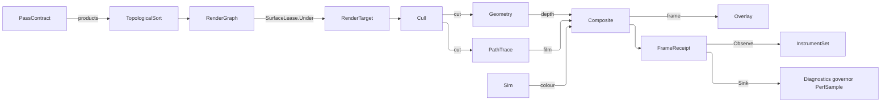

# [APPUI_RENDER_PIPELINE]

`RenderGraph` is the infinite viewport's GPU render pipeline: one pass-DAG drives every frame over the platform's one compositor-owned `GRContext` leased through the embed capsule. The `GpuBackend` rows carry the per-backend target-construction delegate over the composition-bound `GpuBinding` union and a `CapabilitySet<GpuTrait>` column stating what each substrate can run, so backend identity derives from the binding and a mismatched backend-factory pair is unrepresentable; each `RenderPass` case declares the products it makes and the products it must follow, so the roster's topological order is PROVED at composition rather than assumed from a caller's `Seq`; the `ResolvePass` ladder selects the antialias-and-super-resolution resolve off the governor tier's own rank; and `SimVisual` renders isosurface, volume, streamline, glyph, deformation, mesh-quality, and parallel-coordinate fields off the Compute field receipts. This page owns the render-graph pass algebra with its scheduling proof, the backend vocabulary and its capability column, the measured GPU-time evidence lane, the resolve ladder, the simulation render passes, and the browser residency wire; the view-state receipt and the named-view registry live in `Render/viewpoint`, the overlay-plane manipulators in `Render/measure`, the geometry-virtualization and residency owners in `Render/meshlets`, and the path-trace integrator in `Render/pathtrace`. Its substrate is SkiaSharp 3 GPU backends (`GRContext`, `GRMtlBackendContext`, `GRVkBackendContext`, `SKRuntimeEffect`) leased through `ISkiaSharpApiLease`, the `Silk.NET.WebGPU` wgpu/Dawn target factory, the Compute geometry and field receipts, and the AppHost frame-budget and receipt-sink ports. GPU passes share the one leased compositor context, and the `Software` 2D-Skia raster is the deterministic CPU floor.

## [01]-[INDEX]

- [02]-[RENDER_GRAPH]: The proved pass-DAG, the `GpuBackend` capability and target-factory columns over `GpuBinding`, the resolve ladder, the frame-budget verdict, and the software fallback.
- [03]-[SIM_VISUAL]: Traced, volumetric, mesh-quality, and parallel-coordinate field render passes off the Compute receipts.
- [04]-[TS_PROJECTION]: The content-keyed geometry-residency wire contract and its one generated projection seam.
- [05]-[GPU_AND_WIRE_BOUNDARY]: Viewport GPU lease law, the wgpu presentation arms, and the web residency mint.

## [02]-[RENDER_GRAPH]

- Owner: `ViewportFault` the direct generated `[Union]` with one `[FaultCase]` leaf per viewport failure; `GpuTrait` the substrate capability vocabulary; `GpuBackend` `[SmartEnum]` the backend rows carrying that capability set and their target-construction delegate; `GpuBinding` `[Union]` the composition-bound substrate each backend row folds; `SyncArm` `[SmartEnum]` the closed compositor synchronization vocabulary; `WgpuPresentation` `[Union]` the present dispatch; `WgpuErrorScope` the GPU validation bracket; `WgpuFrameEvidence` the timestamp-query GPU-time lane; `PassProduct` the frame-artifact vocabulary a pass makes and follows; `PassContract` the four-column declaration one `RenderPass` case answers; `RenderPass` `[Union]` the frame-pass vocabulary; `RenderTargetRequest` the resolve-row-derived allocation request; `RenderTarget` the lease-bound GPU surface; `SurfaceLease` the named platform-lease seam; `FrameView` the render-time view value; `ResolvePass` `[SmartEnum]` the resolve ladder whose `MinRank` column IS the tier binding; `ResolveState`/`ResolveStep` the temporal cell state; `BudgetVerdict` `[Union]` the frame's own budget answer; `FrameBudget` the per-axis ceilings; `ViewportClock` the timeline, clock, and correlation triple; `PassAnswer` the one shape every pass arm fills; `FrameReceipt` per-frame evidence; `RenderGraph` the admitted frame executor.
- Cases: `RenderPass` = Cull | Geometry | PathTrace | Composite | Sim | Overlay; `ResolvePass` = Msaa | Taa | Fsr | Smaa; `PassProduct` = cut | depth | colour | film | frame; `GpuTrait` = accelerated | skia-canvas | native-pipeline; `SyncArm` = keyed-mutex | timeline | semaphores | automatic; `BudgetVerdict` = Within | Overran; `ViewportFault` = ContextUnavailable | BackendUnsupported | BudgetExceeded | LeaseRejected | Contended.
- Entry: `RenderGraph.Of(passes, cluster, binding, fallback, gpuTime, validation, lease, sink)` — the ONE mint, which proves the pass roster's keys distinct, every declared need produced, and the dependency graph acyclic, and stores the topological order; `RenderGraph.Draw(ViewportClock clock, FrameBudget budget, QualityVerdict quality, ViewCamera camera)` — `IO` rail, one frame over that proved order under the frame camera and the ONE governor verdict, sealing one receipt; `RenderGraph.Observe(InstrumentSet set, FrameReceipt receipt, ResidencyPlan plan)` — the frame-retire projection that writes the frame instruments and retires the accepted residency plan together.
- Auto: `Lease` opens the compositor's own GPU context through `ISkiaSharpApiLease.TryLeasePlatformGraphicsApi` and folds the leased context to the `RenderTarget` through the bound `GpuBinding`'s own backend row, so a pass-emit body binds a backend-provided target rather than the single `GRContext`-plus-`SKRuntimeEffect` emit path; composition owns the DISPLAY extent alone and hands it to the request builder the graph threads in, so the render extent and the sample count derive from the resolve row the tier selected; a lease-class fault re-runs the frame through the `Fallback` raster binding, so the CPU floor is a reachable arm of the same fold; the frame-budget invariant executes inside the pass fold — a pass starting past `FrameBudget.Frame`, or whose own declared charge carries the fold past `MaxTriangles`, DEFERS to the next frame — and the sealed verdict names the axis that breached rather than collapsing three facts to one bit.
- Law: the pass DAG is PROVED, not assumed. Each `RenderPass` case answers one `PassContract` naming the substrate traits it demands, the products it MAKES, the products it must follow (`After`), and the subset of those it cannot run without (`Needs`) — so `RenderGraph.Of` builds the edge set through one `GraphExtensions.ToAdjacencyGraph` fold, refuses a duplicate key, refuses a need no scheduled pass produces, refuses a cycle by name, and stores `AlgorithmExtensions.TopologicalSort`'s order. A caller-supplied `Seq` order is the deleted form and it is what let a geometry pass scheduled ahead of its cull read `CullResult.Empty` and silently draw nothing while every receipt reported a healthy frame. `Needs` and `After` are two columns because a composite legitimately runs with no colour producer — the raster fallback roster is exactly `Composite` and `Overlay` — while a geometry draw with no cull is the named defect.
- Law: each `GpuBackend` row is CONSTRUCTED with its target-construction delegate and CARRIES the trait set its substrate admits, so `IsGpu` and every `Family == A || Family == B` disjunction become one `Traits.Admits` read and a pass roster narrows from `pass.Contract.Demands` against `binding.Backend.Traits`. `Metal`, `Vulkan`, and `OpenGl` fold the `GpuBinding.Ganesh` leased `GRContext` to `SKSurface.Create(GRRecordingContext, budgeted, request.Info, request.Samples, GRSurfaceOrigin)` for an offscreen target, or wrap the host framebuffer as a `GRBackendRenderTarget` and read `SampleCount` back as the granted column; `Software` folds `GpuBinding.Raster` to the CPU `SKSurface.Create(SKImageInfo)` floor, which takes no sample count and therefore grants one; `Wgpu` folds `GpuBinding.Wgpu` — whose target texture carries `TextureDescriptor.SampleCount` and whose pipeline multisample state must match it — over the `Silk.NET.WebGPU` wgpu/Dawn substrate (D3D12/Metal/Vulkan auto-negotiated through `BackendType`) whose `Adapter` matched the compositor adapter LUID/UUID at composition, its `Device`+`Queue` shared branch-wide; and `WebGpu` folds `GpuBinding.Browser`, the in-browser WebGPU surface the TS web leg consumes. `GpuBinding.Backend` DERIVES the backend row from the binding case, so `RenderGraph` holds bindings alone and a substrate swap is one backend row with its binding case.
- Law: the compositor synchronization mode is a CLOSED ROW admitted ONCE, at `WgpuPresentation.CompositedOf`, where the interop's `GetSynchronizationCapabilities` probe is already read — so `Present` dispatches over `SyncArm` totally and the five `HasFlag` probes and the unsupported-mode `throw` beside them have no spelling. The composited arm imports the rendered texture through the compositor interop family (`ICompositionGpuInterop.ImportImage`/`ImportSemaphore` then the arm's own `UpdateWith*Async` member); a second swapchain in composited mode is the DELETED form, and `SurfaceConfigure`/`SurfaceGetCurrentTexture` survives ONLY as the exclusive-fullscreen and headless arm. The wgpu mesh-shader and compute passes record through `CommandEncoder`/`RenderPassEncoder` and submit through `QueueSubmit`, never a managed scene wrapper.
- Law: a lost compositor import and a refused lease are TRANSIENT by the fault row's own `Retriability` column, so the re-drive is the kernel `RedrivePolicy(Schedule, Bound)` the composition elects and the graph's own fallback arm reads `error.Retriability` rather than a type-pattern disjunction over the fault union. A hand `catch`-and-rewrap, a bare `Option<Instant> Retry`, and a spelled-out `fault is LeaseRejected or ContextUnavailable` list are the three deleted forms.
- Law: the resolve ladder is ONE authority — `ResolvePass.MinRank` — read against `QualityTier`'s own rank roster. The per-tier table proves its coverage at type initialization exactly as `QualityTier.Ranked` proves its contiguity, so `ResolvePass.For(tier)` is TOTAL by construction and the absent-key fall to `Msaa` that answered the floor tier's most-degraded frame with a four-sample resolve has no spelling; a hand `(rank, pass)` roster beside the tier roster was a second authority over one ladder. `Taa` jitters the camera sub-pixel per frame and reprojects the prior frame through the motion-vector buffer under a neighborhood clamp, `Smaa` runs morphological edge AA, `Msaa` multi-samples the raster, and `Fsr` renders sub-resolution and spatially upscales, so the governor steps the whole ladder on the same hysteresis band that degrades the render passes.
- Law: each of the resolve row's three columns reaches the surface it governs. `RenderScale` and `Samples` mint the frame's `RenderTargetRequest`, so an `Fsr` frame allocates at `round(display * 0.6)` and an `Msaa` frame asks its backend for four samples, while `RenderTarget.Samples` publishes what the allocation GRANTED. `Jitter` becomes a CAMERA fact: `FrameView.Of` converts the signed sub-pixel offset to NDC against the target the frame allocated, and the geometry draw adds `NdcJitter` to its projection's third column. Cull and LOD read `FrameView.Camera` and `FrameView.LodScale` — the governor's own degrade lever — because a sub-pixel offset moves no cull decision; the `PathTrace` arm reads `Camera` too, and that is load-bearing: a jittered lens differs from the prior frame's every frame, so `AccumulationTarget.Reset` would fire on every frame and the film would never converge past one sample. The `Taa` motion-vector buffer is ONE `Render/meshlets` `BindlessTable` slot, never a parallel motion-vector owner.
- Law: the triangle column is a MEASURED draw count over one contract, and the contract is the frame's CUT. `RenderPass.Geometry` carries `Phase`, the `Render/meshlets` `CutPhase` row naming which slice of the cut it draws; `Charge`, the budget projection the pre-charge gate reads against that slice; and `Draw`, which returns the triangles it recorded. The cut is minted ONCE per geometry pass and charged then drawn, so the pre-charge estimate and the actual submission read one value; every other case contributes zero triangles, while the sim arm answers its swept field points and the pathTrace arm the film's shade-fault level on their own columns — measures with their own instruments, kept out of the triangle ceiling because a marched volume and a failed scatter are not triangles. `Render/meshlets`' `ClusterCull.DrawRows` mints BOTH meshlet geometry rows off one submit arrow — `CutPhase.Prior` then `CutPhase.Retest` — and the DAG orders them by their declared depth product rather than by their arrival order in a caller's seq.
- Receipt: `FrameReceipt` — frame ordinal, backend, per-pass durations, the folded elapsed total, GPU duration, drawn triangles, swept sim points, film shade-fault level, the typed budget verdict, the deferred-pass set, instant and correlation. The elapsed total is a STORED column folded once at seal, because the receipt and the instrument write were two folds over one seq and two authorities over one number. The GPU column is MEASURED evidence off the `WgpuFrameEvidence` timestamp lane (`QueryType.Timestamp` `DeviceCreateQuerySet`, per-pass `RenderPassTimestampWrites`/`ComputePassTimestampWrites`, `CommandEncoderResolveQuerySet` into the read buffer, `BufferMapAsync`/`BufferGetMappedRange`/`BufferUnmap` readback, `QuerySetRelease` teardown), never the CPU elapsed re-labelled — a binding without the `timestamp-query` feature binds `None` and the column carries the honest `Duration.Zero`, while a FAILED readback keeps the zero and lands its fault on the receipt fault rail so unsupported and failed never conflate; `Diagnostics/governor.md` `GpuTimeline.Migrate` deepens the same column from the lane-measured frame duration to per-pass resolved nanoseconds only when EVERY pass resolved its timestamp pair, and that timeline is what seals the `EvidenceReceipt.GpuFrame` case. The frame receipt itself rides the composition-bound `Sink` and its measured facts reach the telemetry spine through `Observe`, so it mints no evidence case of its own; `Diagnostics/governor.md` folds it into `PerfSample`, and `RenderGraph.Observe` is the sole binder of `ResidencyBudget.Observe` so the evict, prefetch, and pool gauges read the plan THIS frame drew.
- Packages: SkiaSharp, Avalonia.Skia, Avalonia (compositor GPU interop), Silk.NET.WebGPU, Silk.NET.WebGPU.Extensions.WGPU, Silk.NET.WebGPU.Native.WGPU, QuikGraph, Thinktecture.Runtime.Extensions, LanguageExt.Core, NodaTime, Rasm (project — `Deterministic.RadicalInverse` the TAA jitter sequence, `Cell.Commit` the resolve transition, `Custody.Bracket` the target lease), Rasm.AppHost (project)
- Growth: a new frame stage is one `RenderPass` case with its `PassContract` row, which the schedule proof orders with no edit; a new resolve column is one `ResolvePass` column plus its read on `RenderTargetRequest.Of` or `FrameView.Of`; a new resolve row is one `MinRank` declaration the ladder table picks up; a new backend is one `GpuBackend` row constructed with its trait set, its target delegate, and its `GpuBinding` case — Skia Graphite re-admits as one `SkiaGraphite` row the moment SkiaSharp ships its Recorder/Context surface; a new substrate capability is one `GpuTrait` row every consumer reads by column; a new fault case is one `[FaultCase]` leaf; zero new surface.
- Growth: a new viewport reliability indicator is one `ViewportObjectives` row on the evidence page, carried here with no edit.
- Boundary: `RenderGraph` is the named boundary capsule and a sealed CLASS, because a `with` copy shares the resolve cell by reference while duplicating the frame ordinal, and the mint is `Fin`-admitted because the pass DAG's soundness is proved once at composition rather than re-derived per frame. The resolve transition is the FRAME's and taken exactly once through kernel `Cell.Commit`, so a lease-rejected frame re-enters the fallback with the SAME `ResolveStep` — stepping the reprojection ordinal or re-jittering on the re-entry is the deleted form that made every GPU refusal skip a TAA sample; the transition body is PURE and names the history image it superseded on the state it installs, and the one drain releases that image after the exchange, because the commit body re-runs on every contended attempt and a release inside it frees a handle the winning state still holds. The frame ordinal is a monotone `Interlocked.Increment` over the graph-local counter — a per-graph IDENTITY the correlation join and the render-hash lane key on, not a gauged span, which is why it reads no timeline; per-pass DURATION is `MonotonicTimeline.Capture`/`Elapsed`, and an `IGaugeLane` roster beside it is refused by name because a pass has exactly one ceiling, the live `FrameBudget` the governor owns, and a static lane bound would be a second budget authority. The lease brackets its target through kernel `Custody.Bracket`, so a mid-fold fault releases the native rather than leaking one target per refused frame. Frame retirement PRESENTS through the binding's own `WgpuPresentation` with the four synchronization indices derived from the receipt ordinal, so a declared-but-uninvoked presentation arm and a caller-supplied index pair are both deleted forms. The shared GPU context arrives as one `SurfaceLease` over the `Shell/hosts#EMBED_CAPSULE` platform-lease seam so no pass body names a `GRContext.CreateMetal`/`CreateVulkan` factory at a call site — a direct GPU-backend construction inside a pass arm is the rejected form. GPU validation on the `Wgpu` arm rides the error-scope rail: `DeviceSetUncapturedErrorCallback` installs once at device acquisition and `WgpuErrorScope` brackets every ACCELERATED pass encoding inside the fold, so a validation or out-of-memory error is a counted `ViewportFault` on the telemetry spine rather than a declared bracket nothing ever entered. The meshlet cluster the graph draws is the `Render/meshlets` owner and the path-trace pass the `Render/pathtrace` integrator, so the pipeline composes them and re-models neither.

```csharp signature
// --- [TYPES] -----------------------------------------------------------------------------
[Union(ConversionFromValue = ConversionOperatorsGeneration.None)]
public abstract partial record ViewportFault : Fault {
    private static readonly FaultBand FamilyBand = FaultBand.Viewport;
    private ViewportFault(string detail) { Detail = detail; }

    public string Detail { get; }

    public override string Message => Detail;

    // A refused platform lease and a vanished compositor context are both the frame AFTER a display change:
    // the next frame's lease succeeds, so the class is transient and the fallback arm and the kernel redrive
    // curve both read it off the row.
    [FaultCase(0)]
    public sealed partial record ContextUnavailable(string Detail) : ViewportFault(Detail) {
        public override Retriability Retriability => Retriability.Transient;
    }
    [FaultCase(1)]
    public sealed partial record BackendUnsupported(string Detail) : ViewportFault(Detail);
    [FaultCase(2)]
    public sealed partial record BudgetExceeded(string Detail) : ViewportFault(Detail);
    [FaultCase(3)]
    public sealed partial record LeaseRejected(string Detail) : ViewportFault(Detail) {
        public override Retriability Retriability => Retriability.Transient;
    }
    // A CAS budget spent with nothing landed: the next frame's transition takes it, so contention is transient
    // exactly as a refused lease is.
    [FaultCase(4)]
    public sealed partial record Contended(string Detail) : ViewportFault(Detail) {
        public override Retriability Retriability => Retriability.Transient;
    }
}

// What a substrate can DO, as a capability vocabulary rather than three bool columns on a second SmartEnum.
// The family roster it replaces carried `Skia` and `Chained` columns with ZERO readers corpus-wide and one
// `Accelerated` column read at a single site — decorative density beside a real axis. A consumer asks a
// capability; a `Family == A || Family == B` list falls out of every hand-written disjunction the moment a
// fifth substrate lands.
// Rank IS declaration order (kernel CapabilityRank law) — the attribute pins the roster against a reorder pass.
[NoReorder]
[SmartEnum<string>]
[KeyMemberEqualityComparer<ComparerAccessors.StringOrdinal, string>]
public sealed partial class GpuTrait : ICapability<GpuTrait> {
    public static readonly GpuTrait Accelerated = new("accelerated");
    public static readonly GpuTrait SkiaCanvas = new("skia-canvas");
    public static readonly GpuTrait NativePipeline = new("native-pipeline");
}

// What a frame pass PRODUCES and what it must follow. The vocabulary is the DAG's edge alphabet, so the
// schedule proof and the pass declaration read one roster and an ordering fact never lives in a caller's seq.
// Rank IS declaration order (kernel CapabilityRank law) — the attribute pins the roster against a reorder pass.
[NoReorder]
[SmartEnum<string>]
[KeyMemberEqualityComparer<ComparerAccessors.StringOrdinal, string>]
public sealed partial class PassProduct : ICapability<PassProduct> {
    public static readonly PassProduct Cut = new("cut");
    public static readonly PassProduct Depth = new("depth");
    public static readonly PassProduct Colour = new("colour");
    public static readonly PassProduct Film = new("film");
    public static readonly PassProduct Frame = new("frame");
}

// The four-column declaration one `RenderPass` case answers, folded through ONE generated `Switch` instead of
// four. `Needs` is the HARD half — a product with no producer refuses the mint — and `After` the ORDERING
// half, which is strictly wider: a composite legitimately runs over an empty colour set (the raster fallback
// roster is exactly composite plus overlay), while a geometry draw with no cull draws the honest nothing and
// reports a healthy frame, which is the defect the split exists to name.
public readonly record struct PassContract(
    CapabilitySet<GpuTrait> Demands,
    CapabilitySet<PassProduct> Needs,
    CapabilitySet<PassProduct> After,
    CapabilitySet<PassProduct> Makes);

// The antialias-and-super-resolution ladder. `MinRank` IS the tier binding: the ladder table below is derived
// from `QualityTier.Items` against this column, so the tier roster and the resolve roster have ONE
// correspondence and the hand `(rank, pass)` table beside them is gone with its unmapped-rank fallback.
[SmartEnum<string>]
[KeyMemberEqualityComparer<ComparerAccessors.StringOrdinal, string>]
public sealed partial class ResolvePass {
    public static readonly ResolvePass Fsr = new("fsr", samples: 1, renderScale: 0.6, reproject: false, minRank: 0);
    public static readonly ResolvePass Msaa = new("msaa", samples: 4, renderScale: 1.0, reproject: false, minRank: 1);
    public static readonly ResolvePass Smaa = new("smaa", samples: 1, renderScale: 1.0, reproject: false, minRank: 2);
    public static readonly ResolvePass Taa = new("taa", samples: 1, renderScale: 1.0, reproject: true, minRank: 3);

    public int Samples { get; }
    public double RenderScale { get; }
    public bool Reproject { get; }

    // The lowest tier rank this row may serve. The elected row for a tier is the HIGHEST-ranked row the tier
    // admits, so the high tiers spend pixels on temporal quality and the floor tier trades resolution.
    public int MinRank { get; }

    // Coverage proves at type init, exactly as `QualityTier.Ranked` proves rank contiguity: a roster whose
    // lowest `MinRank` sat above the floor tier would answer that tier with no row, and the fallback that hid
    // it answered `Msaa` — a four-sample resolve on the frame that most needed sub-resolution.
    private static readonly Lazy<FrozenDictionary<int, ResolvePass>> Ladder = new(static () =>
        QualityTier.Items.ToFrozenDictionary(
            static tier => tier.Rank,
            static tier => toSeq(Items)
                .Filter(row => row.MinRank <= tier.Rank)
                .OrderByDescending(static row => row.MinRank)
                .Head
                .IfNone(() => throw new InvalidOperationException(
                    $"ResolvePass rows must cover QualityTier rank {tier.Rank}."))));

    public static ResolvePass For(QualityTier tier) => Ladder.Value[tier.Rank];

    // TAA sub-pixel jitter is the Halton (2,3) sequence READ off the kernel equidistribution owner — the
    // base-2 leg through the bit-reversal fast path, the base-3 leg through the radix-parameterized radical
    // inverse — so the sequence is generable at any phase and a hand-transcribed sample table cannot drift.
    // Eight phases keep the reprojection history window coherent; the period is policy.
    private const int JitterPeriod = 8;

    // Centred on the pixel: the radical inverse lands in [0, 1) and a sub-pixel camera offset is signed about
    // the pixel centre, so the half-shift is the projection offset itself, never a consumer-side correction
    // one consumer would apply and the next would forget.
    private static (double X, double Y) HaltonJitter(long ordinal) =>
        (uint)((ordinal % JitterPeriod) + 1L) switch {
            var phase => (Deterministic.RadicalInverse(bits: phase) - 0.5,
                          Deterministic.RadicalInverse(index: phase, radix: 3) - 0.5),
        };

    // ONE predicate owns the whole transition: a history image survives exactly when this row reprojects AND
    // the camera held still, and that same answer re-seeds the reprojection ordinal, zeroes the jitter, and
    // retires the superseded image. Spelling the three separately is what let a non-reprojecting row advance
    // an ordinal indexing a history it had just dropped. The body is PURE — it names the image it retires and
    // releases nothing — because the commit loop re-runs it on every contended attempt.
    public ResolveState Advance(ResolveState prior, ViewCamera camera) =>
        prior.Camera.Map(held => held != camera).IfNone(true) switch {
            var moved => (Reproject && !moved) switch {
                var keeps => prior with {
                    Ordinal = keeps ? prior.Ordinal + 1 : 1L,
                    Jitter = Reproject ? HaltonJitter(ordinal: keeps ? prior.Ordinal + 1 : 1L) : (0d, 0d),
                    History = keeps ? prior.History : None,
                    Retired = keeps ? None : prior.History,
                    RenderScale = RenderScale,
                    Camera = Some(camera),
                    Moved = moved,
                },
            },
        };

    // The composite receives the TARGET'S OWN request beside the temporal state, so the upscale it performs is
    // read off the surface it is reading from: `request.Info` is the sub-resolution extent the frame rendered
    // at, `request.Display` the extent it composites to, and `request.RenderScale` their ratio.
    public Fin<Unit> Resolve(RenderTarget target, ResolveState state, Func<SKCanvas, RenderTargetRequest, ResolveState, Fin<Unit>> composite) =>
        target.Surface.Match(
            Some: surface => composite(surface.Canvas, target.Request, state),
            None: () => Fin.Fail<Unit>(new ViewportFault.ContextUnavailable($"resolve/{Key}: no resolve surface")));
}

// The compositor synchronization mode as a CLOSED ROW carrying its own update arm. The probe is a foreign
// bit-flag enum read ONCE, at import, where the interop already answers it — so `Present` dispatches over a
// row and the five `HasFlag` tests and the unsupported-mode `throw` beside them have no spelling. Election
// order is the compositor's own preference: a keyed mutex is cheapest, a timeline pair next, binary semaphores
// after, and `Automatic` the surface's own fallback.
[SmartEnum<string>]
[KeyMemberEqualityComparer<ComparerAccessors.StringOrdinal, string>]
public sealed partial class SyncArm {
    public static readonly SyncArm KeyedMutex = new("keyed-mutex",
        static (c, indices, values) => c.Surface.UpdateWithKeyedMutexAsync(c.Image, indices.Acquire, indices.Release));
    public static readonly SyncArm Timeline = new("timeline",
        static (c, indices, values) => c.Semaphores.Match(
            Some: pair => c.Surface.UpdateWithTimelineSemaphoresAsync(c.Image, pair.Wait, values.Wait, pair.Signal, values.Signal),
            None: () => c.Surface.UpdateAsync(c.Image)));
    public static readonly SyncArm Semaphores = new("semaphores",
        static (c, indices, values) => c.Semaphores.Match(
            Some: pair => c.Surface.UpdateWithSemaphoresAsync(c.Image, pair.Wait, pair.Signal),
            None: () => c.Surface.UpdateAsync(c.Image)));
    public static readonly SyncArm Automatic = new("automatic",
        static (c, indices, values) => c.Surface.UpdateAsync(c.Image));

    // The probe-to-row election, run at import. An imported image exposing NO supported mode still presents —
    // `Automatic` is the surface's own arm — so the refusal that used to live on the per-frame path is gone
    // along with the frame it would have killed.
    public static SyncArm Of(CompositionGpuImportedImageSynchronizationCapabilities probe) =>
        probe.HasFlag(CompositionGpuImportedImageSynchronizationCapabilities.KeyedMutex) ? KeyedMutex
        : probe.HasFlag(CompositionGpuImportedImageSynchronizationCapabilities.TimelineSemaphores) ? Timeline
        : probe.HasFlag(CompositionGpuImportedImageSynchronizationCapabilities.Semaphores) ? Semaphores
        : Automatic;

    [UseDelegateFromConstructor]
    public partial Task Update(WgpuPresentation.Composited composited, (uint Acquire, uint Release) indices, (ulong Wait, ulong Signal) values);
}

// --- [MODELS] -------------------------------------------------------------------------------
// One target request carries every allocation fact the resolve ladder owns: the DISPLAY extent the composition
// leases at, the row's RenderScale, and the row's sample count. `Info` DERIVES the sub-resolution extent
// rather than storing it, so the render extent and the display extent cannot disagree and the composite reads
// its own upscale factor off the target it drew into.
public readonly record struct RenderTargetRequest(SKImageInfo Display, double RenderScale, int Samples) {
    public SKImageInfo Info =>
        RenderScale >= 1d
            ? Display
            : Display.WithSize(
                Math.Max((int)Math.Round(Display.Width * RenderScale), 1),
                Math.Max((int)Math.Round(Display.Height * RenderScale), 1));

    public static RenderTargetRequest Of(SKImageInfo display, ResolvePass resolve) =>
        new(display, resolve.RenderScale, resolve.Samples);
}

// Everything one frame's passes read about HOW to look at the scene, as one value: the portable view-state
// lens, THIS frame's sub-pixel projection offset, and the governor verdict that scales the cut. The jitter
// stays off `ViewCamera` because that is the saved-viewpoint value the BCF codec and the wire project — a
// per-frame jitter column there would ride into every stored view — and because a sub-pixel jitter is a
// projection shear, not an eye or target move.
public readonly record struct FrameView(ViewCamera Camera, (double X, double Y) NdcJitter, QualityVerdict Quality) {
    public double LodScale => Quality.Tier.LodPixelScale;

    // Pixels to NDC against the target the frame allocated: two NDC units span the full extent, and NDC Y rises
    // where the target's Y falls. Converting HERE — once, where the extent is known — is what keeps a
    // sub-resolution FSR target from jittering by a display-sized offset.
    public static FrameView Of(ViewCamera camera, (double X, double Y) jitterPixels, SKImageInfo info, QualityVerdict quality) =>
        new(camera, (2d * jitterPixels.X / Math.Max(info.Width, 1), -2d * jitterPixels.Y / Math.Max(info.Height, 1)), quality);
}

// Samples is the GRANTED count, read back off the allocation — `GRBackendRenderTarget.SampleCount` on the
// Ganesh arm, the `TextureDescriptor.SampleCount` the wgpu arm asked for and the device honoured, one on the
// raster floor — never the requested column echoed.
public sealed record RenderTarget(GpuBackend Backend, Option<SKSurface> Surface, Option<GRContext> Context, RenderTargetRequest Request, int Samples, IDisposable Native) : IDisposable {
    public void Dispose() => Native.Dispose();
}

// The platform-lease seam as a NAMED value, not a three-deep `Func` the graph threads: `Under` acquires the
// target through the composition-bound arrow and BRACKETS it, so a fault anywhere in the pass fold releases
// the native handle on the way out. The delegate shape it replaces released only on the success path, which is
// one leaked GPU surface per refused frame.
public sealed record SurfaceLease(Func<GpuBinding, Func<SKImageInfo, RenderTargetRequest>, Fin<RenderTarget>> Acquire) {
    public Fin<T> Under<T>(GpuBinding binding, Func<SKImageInfo, RenderTargetRequest> request, Func<RenderTarget, Fin<T>> body) =>
        Acquire(binding, request).Bind(target => Custody.Bracket(() => body(target), target));
}

// The resolve cell's whole state, including the two facts a transition ANSWERS rather than performs: `Moved` is
// the camera-motion verdict the film reset and the history drop both read, and `Retired` carries the history
// image the transition superseded. Retirement rides the state because the kernel commit re-runs its body on
// every contended attempt — a `Dispose` in a transition body releases a handle every losing attempt's state
// still holds — so the transition RECORDS what it unlinked and the caller drains that record ONCE after.
public readonly record struct ResolveState(
    long Ordinal,
    (double X, double Y) Jitter,
    Option<SKImage> History,
    double RenderScale,
    Option<ViewCamera> Camera,
    Option<SKImage> Retired,
    bool Moved);

// ONE frame's resolve answer: the selected row beside the state its transition installed. The motion verdict is
// a column of that state rather than a third positional, because it IS that transition's product.
public readonly record struct ResolveStep(ResolvePass Pass, ResolveState State);

// Every gated axis carries its OWN ceiling. A phase share gated on the whole-frame duration is unreachable —
// layout inside a frame can exceed the frame budget only once the frame already has — and an eviction count
// gated at zero degrades on the normal operation of a byte-budgeted cache. GPU is the one axis that can
// legitimately exceed its frame share, because it runs a frame behind the CPU that queued it.
public sealed record FrameBudget(Duration Frame, Duration Gpu, Duration Layout, long VramBytes, long EvictsPerFrame, int MaxTriangles) {
    public static readonly FrameBudget Sixty = new(
        Duration.FromMilliseconds(16.667), Duration.FromMilliseconds(14.0), Duration.FromMilliseconds(4.0),
        1_073_741_824L, 8L, 20_000_000);

    public static readonly FrameBudget Thirty = new(
        Duration.FromMilliseconds(33.333), Duration.FromMilliseconds(28.0), Duration.FromMilliseconds(8.0),
        536_870_912L, 16L, 8_000_000);
}

// The frame's budget answer, naming the axis that breached. The bool it replaces folded three independent facts
// — a deferral set, an elapsed overrun, and a triangle overrun — into one bit, so a board could see that a
// frame missed and never which ceiling it missed. `BudgetAxis` is the governor's own vocabulary, so the
// receipt, the degrade decision, and the overrun instrument's dimension all read one row.
[Union(ConversionFromValue = ConversionOperatorsGeneration.None)]
public abstract partial record BudgetVerdict {
    private BudgetVerdict() { }

    public sealed record Within : BudgetVerdict;
    public sealed record Overran(BudgetAxis Axis, double Measured, double Ceiling) : BudgetVerdict;

    public bool Held => this is Within;

    public Option<BudgetAxis> Breach => Switch(
        within: static _ => Option<BudgetAxis>.None,
        overran: static row => Some(row.Axis));

    // The frame's own axes, walked in the governor's own ceiling order. Triangle overrun is NOT an axis here:
    // it does not overrun, it DEFERS, and the deferred set on the receipt is that evidence under its own name.
    public static BudgetVerdict Of(FrameBudget budget, Duration elapsed, Duration gpu) =>
        elapsed > budget.Frame ? new Overran(BudgetAxis.Frame, elapsed.ToTimeSpan().TotalNanoseconds, budget.Frame.ToTimeSpan().TotalNanoseconds)
        : gpu > budget.Gpu ? new Overran(BudgetAxis.Gpu, gpu.ToTimeSpan().TotalNanoseconds, budget.Gpu.ToTimeSpan().TotalNanoseconds)
        : new Within();
}

// Timeline and clock are TWO parameters because no joint invariant binds a wall instant to a monotonic mark:
// the timeline measures per-pass spans and the clock stamps the receipt, and a carrier fusing them is the
// form the kernel timeline owner refuses by name.
public sealed record ViewportClock(MonotonicTimeline Line, IClock Clock, CorrelationId Correlation);

// ONE shape every pass arm fills, so the six arms differ in WHICH slot they answer rather than each re-spelling
// a four-tuple the fold then destructures. The cull arm alone rewrites the cut; every other arm passes the one
// it received through, which is what makes publishing a cut and reporting a draw a single contract no arm can
// half-satisfy.
public readonly record struct PassAnswer(CullResult Cut, long Triangles, long Points, long Faults) {
    public static PassAnswer Through(CullResult cut) => new(cut, 0L, 0L, 0L);

    public PassAnswer Drew(long triangles) => this with { Triangles = triangles };

    public PassAnswer Marched(long points) => this with { Points = points };

    public PassAnswer Faulted(long faults) => this with { Faults = faults };
}

// Deferred, SimPoints, and FilmFaults are LOCAL egress columns: the residency wire carries none of them, while
// in-process consumers read which passes the budget invariant deferred, the field-visual path points the sim
// arm swept, and the path-trace film's shade-fault level. SimPoints sits BESIDE Triangles rather than inside
// it: a marched volume, an integrated streamline, and a projected coordinate axis are not triangles, and
// folding them into the draw count would make the budget ceiling and the receipt's own measure describe
// different work. FilmFaults is a LEVEL — the film's own running count, reset with the film on camera motion —
// so read against the same target's `Fraction` it states a fault RATE, which is what distinguishes a scene
// shading badly from an inexplicably dark render. `Elapsed` is a STORED fold, because the seal and the
// instrument write were two summations of one seq and therefore two authorities over one number.
public sealed record FrameReceipt(
    long Ordinal,
    GpuBackend Backend,
    Seq<(string Pass, Duration Elapsed)> Passes,
    Duration Elapsed,
    Duration Gpu,
    long Triangles,
    BudgetVerdict Budget,
    Instant At,
    CorrelationId Correlation,
    Option<Error> Fault = default,
    Seq<string> Deferred = default,
    long SimPoints = 0L,
    long FilmFaults = 0L) {
    // The frame held its budget only when NO axis breached and no pass deferred — two facts under two columns,
    // joined here where a reader wants one word rather than collapsed at the seal where the breaching axis
    // would have been thrown away.
    public bool WithinBudget => Budget.Held && Deferred.IsEmpty;
}

// --- [SERVICES] -----------------------------------------------------------------------------
// GPU validation ingress on the shared device: `DeviceSetUncapturedErrorCallback` installs once at device
// acquisition; the push/pop pair brackets suspect pass encoding so a validation or OOM error is a counted
// `ViewportFault` on the telemetry spine, never a swallowed native abort. The graph binds it around every
// pass whose contract demands acceleration — a bracket nothing enters proves nothing.
public sealed record WgpuErrorScope(Action Push, Func<Option<string>> Pop) {
    public Fin<T> Guarded<T>(Func<Fin<T>> encode) {
        Push();
        Fin<T> outcome = encode();
        return Pop().Match(
            Some: static error => Fin.Fail<T>(new ViewportFault.ContextUnavailable($"wgpu/validation: {error}")),
            None: () => outcome);
    }
}

// Composition-bound GPU-time lane over the shared device: `Measure` brackets one frame — a `QueryType.Timestamp`
// `DeviceCreateQuerySet` (gated on the timestamp-query feature at composition), per-pass
// `RenderPassTimestampWrites`/`ComputePassTimestampWrites`, `CommandEncoderResolveQuerySet` into the read
// buffer, `QueueSubmitForIndex` minting the `WrappedSubmissionIndex` that `DevicePoll` retires without a
// blocking fence, `BufferMapAsync`/`BufferGetMappedRange`/`BufferUnmap` folding (lastTick - firstTick) x queue
// period to `Duration`, `QuerySetRelease` at teardown. The graph binds `None` on a device without the feature,
// so `FrameReceipt.Gpu` is measured evidence or the honest zero, never CPU elapsed re-labelled.
public sealed record WgpuFrameEvidence(Func<Fin<Duration>> Measure);

// Backend rows CARRY their target construction and their capability set: the `[UseDelegateFromConstructor]`
// column folds the composition-bound `GpuBinding` case and the resolve row's own request to a `RenderTarget`,
// and a binding case a row does not own is the typed `BackendUnsupported` fault. Every arm returns the GRANTED
// sample count beside the request: a Ganesh target answers `GRBackendRenderTarget.SampleCount`, the raster
// floor answers one, and publishing the requested count would forge a multi-sample measurement.
[SmartEnum<string>]
[KeyMemberEqualityComparer<ComparerAccessors.StringOrdinal, string>]
public sealed partial class GpuBackend {
    public static readonly GpuBackend Metal = new("metal", Ganesh, GaneshTarget);
    public static readonly GpuBackend Vulkan = new("vulkan", Ganesh, GaneshTarget);
    public static readonly GpuBackend OpenGl = new("opengl", Ganesh, GaneshTarget);
    public static readonly GpuBackend Software = new("software", Raster, RasterTarget);
    public static readonly GpuBackend Wgpu = new("wgpu", Native, WgpuTarget);
    public static readonly GpuBackend WebGpu = new("webgpu", Native, BrowserTarget);

    // The three substrate shapes as capability values, so a row's admission gate and a pass roster's narrowing
    // read the same set algebra rather than two hand disjunctions over a family name.
    private static CapabilitySet<GpuTrait> Ganesh => CapabilitySet<GpuTrait>.Of(GpuTrait.Accelerated, GpuTrait.SkiaCanvas);
    private static CapabilitySet<GpuTrait> Raster => CapabilitySet<GpuTrait>.Of(GpuTrait.SkiaCanvas);
    private static CapabilitySet<GpuTrait> Native => CapabilitySet<GpuTrait>.Of(GpuTrait.Accelerated, GpuTrait.NativePipeline);

    public CapabilitySet<GpuTrait> Traits { get; }

    [UseDelegateFromConstructor]
    public partial Fin<RenderTarget> Target(GpuBinding binding, RenderTargetRequest request);

    private static Fin<RenderTarget> GaneshTarget(GpuBinding binding, RenderTargetRequest request) => binding switch {
        GpuBinding.Ganesh ganesh => ganesh.Lease(request),
        _ => Fin.Fail<RenderTarget>(new ViewportFault.BackendUnsupported($"{binding.Backend.Key}: not a Ganesh binding")),
    };

    // `SKSurface.Create(SKImageInfo)` takes no sample count, so the CPU raster is single-sampled by
    // construction: the floor GRANTS one sample whatever the resolve row asked for, and the Msaa row's
    // multi-sample claim is an accelerated-target property the fallback frame honestly reports itself as
    // not holding.
    private const int RasterSamples = 1;

    private static Fin<RenderTarget> RasterTarget(GpuBinding binding, RenderTargetRequest request) => binding switch {
        GpuBinding.Raster => SKSurface.Create(request.Info) switch {
            { } surface => Fin.Succ(new RenderTarget(Software, Some(surface), None, request, RasterSamples, surface)),
            _ => Fin.Fail<RenderTarget>(new ViewportFault.ContextUnavailable("software: raster surface allocation failed")),
        },
        _ => Fin.Fail<RenderTarget>(new ViewportFault.BackendUnsupported($"{binding.Backend.Key}: not the raster floor")),
    };

    private static Fin<RenderTarget> WgpuTarget(GpuBinding binding, RenderTargetRequest request) => binding switch {
        GpuBinding.Wgpu wgpu => wgpu.Acquire(wgpu.Presentation, request),
        _ => Fin.Fail<RenderTarget>(new ViewportFault.BackendUnsupported($"{binding.Backend.Key}: not a wgpu binding")),
    };

    private static Fin<RenderTarget> BrowserTarget(GpuBinding binding, RenderTargetRequest request) => binding switch {
        GpuBinding.Browser browser => browser.Acquire(browser.Surface, request),
        _ => Fin.Fail<RenderTarget>(new ViewportFault.BackendUnsupported($"{binding.Backend.Key}: not a browser binding")),
    };
}

// Composition-bound GPU substrate: each case pins the state its backend row folds, `Backend` DERIVES the row
// from the case, and the Ganesh admission gate demands the Ganesh trait pair — so the graph holds bindings
// alone and a backend paired with a foreign substrate never constructs.
[Union(ConversionFromValue = ConversionOperatorsGeneration.None)]
public abstract partial record GpuBinding {
    private GpuBinding() { }

    public sealed record Ganesh : GpuBinding {
        private Ganesh(GpuBackend row, Func<RenderTargetRequest, Fin<RenderTarget>> lease) { Row = row; Lease = lease; }

        public GpuBackend Row { get; }
        public Func<RenderTargetRequest, Fin<RenderTarget>> Lease { get; }

        // The demand is a VALUE the capability owner refuses against, so the refusal names the missing
        // capability instead of a family the caller cannot see.
        private static readonly CapabilitySet<GpuTrait> Demand =
            CapabilitySet<GpuTrait>.Of(GpuTrait.Accelerated, GpuTrait.SkiaCanvas);

        public static Fin<GpuBinding> Of(GpuBackend row, Func<RenderTargetRequest, Fin<RenderTarget>> lease) =>
            row.Traits.Require(Demand, missing => new ViewportFault.BackendUnsupported($"{row.Key}: lacks {missing}"))
                .Map(_ => (GpuBinding)new Ganesh(row, lease));
    }

    public sealed record Raster : GpuBinding;

    public sealed record Wgpu(WgpuDevice Device, WgpuPresentation Presentation, Func<WgpuPresentation, RenderTargetRequest, Fin<RenderTarget>> Acquire) : GpuBinding;

    public sealed record Browser(nint Surface, Func<nint, RenderTargetRequest, Fin<RenderTarget>> Acquire) : GpuBinding;

    public GpuBackend Backend => this switch {
        Ganesh ganesh => ganesh.Row,
        Wgpu => GpuBackend.Wgpu,
        Browser => GpuBackend.WebGpu,
        _ => GpuBackend.Software,
    };

    public Fin<RenderTarget> Target(RenderTargetRequest request) => Backend.Target(this, request);
}

// WGPU presentation dispatch the Wgpu backend row routes through: `Composited` imports the externally-rendered
// texture through the compositor interop family and carries the synchronization ROW its own capability probe
// elected, `Swapchain` survives ONLY as the exclusive-fullscreen arm, `Headless` renders offscreen.
[Union(ConversionFromValue = ConversionOperatorsGeneration.None)]
public abstract partial record WgpuPresentation {
    private WgpuPresentation() { }

    public sealed record Composited(
        ICompositionGpuInterop Interop,
        CompositionDrawingSurface Surface,
        ICompositionImportedGpuImage Image,
        SyncArm Sync,
        Option<(ICompositionImportedGpuSemaphore Wait, ICompositionImportedGpuSemaphore Signal)> Semaphores) : WgpuPresentation;

    public sealed record Swapchain(nint WgpuSurface, Func<nint, IO<Unit>> Submit) : WgpuPresentation;

    // Headless carries no extent of its own: the frame's `RenderTargetRequest` is the one allocation fact, and
    // a presentation-held `SKImageInfo` beside it is a second extent authority that drifts the moment the
    // resolve ladder changes `RenderScale`.
    public sealed record Headless : WgpuPresentation;

    // Composited construction: the wgpu device is created against the compositor adapter (DeviceLuid/DeviceUuid
    // pin), the shared texture imports ONCE, and the synchronization arm is elected HERE from the interop's own
    // capability probe — so the foreign flag enum is read at exactly one site and the per-frame path dispatches
    // over a closed row.
    public static WgpuPresentation CompositedOf(
        ICompositionGpuInterop interop,
        CompositionDrawingSurface surface,
        IPlatformHandle sharedTexture,
        PlatformGraphicsExternalImageProperties shape,
        string handleType,
        Func<CompositionGpuImportedImageSynchronizationCapabilities, Option<(ICompositionImportedGpuSemaphore Wait, ICompositionImportedGpuSemaphore Signal)>> semaphores) =>
        interop.GetSynchronizationCapabilities(handleType) switch {
            var probe => new Composited(
                interop, surface, interop.ImportImage(sharedTexture, shape), SyncArm.Of(probe), semaphores(probe)),
        };

    // Per-frame refresh awaits import completion, answers a TRANSIENT refusal on a lost handle, then runs the
    // elected arm. The lost-handle path is a rail value rather than a re-raised exception, so the composing
    // surface re-drives it under the kernel `RedrivePolicy` curve and a `catch` around a `throw` of an `Error`
    // — a hand monad escape — is unspellable.
    public IO<Unit> Present((uint Acquire, uint Release) indices, (ulong Wait, ulong Signal) values) => this switch {
        Composited c =>
            IO.liftAsync(async () => {
                await c.Image.ImportCompleted;
                return c.Interop.IsLost || c.Image.IsLost || c.Semaphores.Exists(static pair => pair.Wait.IsLost || pair.Signal.IsLost);
            }).Bind(lost => lost
                ? IO.fail<Unit>((Error)new ViewportFault.LeaseRejected("wgpu/present: compositor import lost"))
                : IO.liftAsync(async () => { await c.Sync.Update(c, indices, values); return unit; })),
        Swapchain swapchain => swapchain.Submit(swapchain.WgpuSurface),
        Headless => IO.pure(unit),
    };
}

// Key threads through the base positional parameter (the `ControlIntent` pattern) — a base computed
// `Key => Switch` beside same-named case positionals suppresses property synthesis and recurses (CS8907).
[Union(ConversionFromValue = ConversionOperatorsGeneration.None)]
public abstract partial record RenderPass(string Key) {
    public sealed record Cull(string Key, Func<RenderTarget, MeshletCluster, FrameView, Fin<(MeshletCluster Cluster, CullResult Result)>> Visible) : RenderPass(Key);
    // Geometry is the ONLY pass that draws triangles, so it alone carries the frame's triangle contract as two
    // members of one row: `Charge` is the budget projection the pre-charge gate reads BEFORE the pass runs and
    // `Draw` returns what its own draw recorded. Both read the frame's own CUT — the `Render/meshlets` `DrawCut`
    // narrowed to this row's `CutPhase` — never the un-narrowed cluster set: a draw handed the whole payload
    // submits geometry the cull ladder already rejected, and a cluster count or the whole scene's total
    // returned from either member publishes a fabricated measure and defers passes on cost nothing spends.
    public sealed record Geometry(string Key, CutPhase Phase, Func<DrawCut, long> Charge, Func<RenderTarget, FrameView, DrawCut, Fin<long>> Draw) : RenderPass(Key);
    public sealed record PathTrace(string Key, PathTracePass Pass, Atom<AccumulationTarget> Film, LightRig Rig, int SampleBudget, long Seed, CancelScope Scope) : RenderPass(Key);
    public sealed record Sim(string Key, Func<RenderTarget, Fin<int>> Draw) : RenderPass(Key);
    public sealed record Composite(string Key, Func<SKCanvas, RenderTargetRequest, ResolveState, Fin<Unit>> Raster) : RenderPass(Key);
    public sealed record Overlay(string Key, Func<SKCanvas, Fin<Unit>> Draw) : RenderPass(Key);

    // ONE fold answers all four scheduling columns, so a case declares its whole contract in one place and the
    // schedule proof, the substrate narrowing, and the edge builder read one value. The two geometry arms
    // differ by their `CutPhase.Step`: the two-phase HZB ladder's retest reads the depth its prior-visible
    // sibling produced, so the ladder's order is a DECLARED product edge rather than the arrival order of a
    // caller's seq, and the whole-cut phase (a shade mount, a capture composite) makes colour alone.
    public PassContract Contract => Switch(
        cull: static _ => new PassContract(Accelerated, NoProducts, NoProducts, Products(PassProduct.Cut)),
        geometry: static row => row.Phase.Step.Match(
            Some: step => new PassContract(
                Accelerated,
                Products(PassProduct.Cut),
                step > 0 ? Products(PassProduct.Cut, PassProduct.Depth) : Products(PassProduct.Cut),
                Products(PassProduct.Colour, PassProduct.Depth)),
            None: static () => new PassContract(
                Accelerated, Products(PassProduct.Cut), Products(PassProduct.Cut), Products(PassProduct.Colour))),
        pathTrace: static _ => new PassContract(
            Accelerated, Products(PassProduct.Cut), Products(PassProduct.Cut), Products(PassProduct.Film)),
        sim: static _ => new PassContract(Accelerated, NoProducts, NoProducts, Products(PassProduct.Colour)),
        // The composite and the overlay demand NO substrate capability, which is exactly what makes the raster
        // fallback roster fall out of the trait algebra instead of a literal `Composite or Overlay` list.
        composite: static _ => new PassContract(
            NoTraits, NoProducts, Products(PassProduct.Colour, PassProduct.Film), Products(PassProduct.Frame)),
        overlay: static _ => new PassContract(
            NoTraits, NoProducts, Products(PassProduct.Frame), NoProducts));

    private static CapabilitySet<GpuTrait> Accelerated => CapabilitySet<GpuTrait>.Of(GpuTrait.Accelerated);

    private static CapabilitySet<GpuTrait> NoTraits => CapabilitySet<GpuTrait>.None;

    private static CapabilitySet<PassProduct> NoProducts => CapabilitySet<PassProduct>.None;

    private static CapabilitySet<PassProduct> Products(params ReadOnlySpan<PassProduct> rows) =>
        CapabilitySet<PassProduct>.Of(rows);
}

// --- [OPERATIONS] ---------------------------------------------------------------------------
// A sealed CLASS, not a record: the graph is one IDENTITY over frame state no copy may fork — a monotone
// ordinal counter and the resolve cell every transition installs into. A `with` copy shares the cell by
// reference while duplicating the counter, so two graphs would drive one resolve cell under two frame ordinals
// and the reprojection history would belong to neither.
public sealed class RenderGraph {
    private RenderGraph(
        Seq<RenderPass> passes, Atom<MeshletCluster> cluster, GpuBinding binding, GpuBinding.Raster fallback,
        Option<WgpuFrameEvidence> gpuTime, Option<WgpuErrorScope> validation, SurfaceLease lease, Func<FrameReceipt, IO<Unit>> sink) {
        (Passes, Cluster, Binding, Fallback, GpuTime, Validation, Lease, Sink) =
            (passes, cluster, binding, fallback, gpuTime, validation, lease, sink);
    }

    // The pass roster in TOPOLOGICAL order, proved once here.
    public Seq<RenderPass> Passes { get; }
    public Atom<MeshletCluster> Cluster { get; }
    public GpuBinding Binding { get; }
    // The CPU floor is structural: a non-raster fallback binding is unrepresentable.
    public GpuBinding.Raster Fallback { get; }
    public Option<WgpuFrameEvidence> GpuTime { get; }
    public Option<WgpuErrorScope> Validation { get; }
    public SurfaceLease Lease { get; }
    public Func<FrameReceipt, IO<Unit>> Sink { get; }

    private long ordinal;
    private readonly Atom<ResolveState> resolve = Atom(new ResolveState(0L, (0d, 0d), None, 1.0, None, None, false));

    private static readonly Op ScheduleOp = Op.Of(name: "appui.render.schedule");
    private static readonly Op PassOp = Op.Of(name: "appui.render.pass");

    // The ONE mint. The roster's soundness is a COMPOSITION fact, not a per-frame one: keys distinct, every
    // declared need produced by some scheduled pass, and the product graph acyclic. A caller-ordered `Seq` is
    // the deleted form — it is what let a geometry pass ahead of its cull read `CullResult.Empty`, draw the
    // honest nothing, and seal a receipt no reader could distinguish from a healthy frame.
    public static Fin<RenderGraph> Of(
        Seq<RenderPass> passes, Atom<MeshletCluster> cluster, GpuBinding binding, GpuBinding.Raster fallback,
        Option<WgpuFrameEvidence> gpuTime, Option<WgpuErrorScope> validation, SurfaceLease lease, Func<FrameReceipt, IO<Unit>> sink) =>
        Scheduled(passes).Map(ordered => new RenderGraph(ordered, cluster, binding, fallback, gpuTime, validation, lease, sink));

    private static Fin<Seq<RenderPass>> Scheduled(Seq<RenderPass> roster) =>
        Made(roster) switch {
            var made => toSeq(roster.Bind(pass => toSeq(pass.Contract.Needs.Missing(made).Held)).Distinct()) switch {
                var orphaned =>
                    (Col(toSeq(roster.Map(static pass => pass.Key).Distinct()).Count == roster.Count, "distinct pass keys"),
                     Col(orphaned.IsEmpty, $"a producer for every declared need, missing {orphaned.Map(static row => row.Key)}"))
                    .Apply((_, _) => roster).ToFin().Bind(Ordered),
            },
        };

    private static CapabilitySet<PassProduct> Made(Seq<RenderPass> roster) =>
        CapabilitySet<PassProduct>.Of(toSeq(roster.Bind(static pass => toSeq(pass.Contract.Makes.Held)).Distinct()).ToArray());

    // ONE graph fold: the vertex roster is the pass keys and the edge fold answers each pass's DOWNSTREAM
    // consumers, so no hand adjacency builder exists and an isolated pass keeps its vertex. `TopologicalSort`
    // raises `NonAcyclicGraphException` on a cycle, which the `Op` funnel lands on the rail by name.
    private static Fin<Seq<RenderPass>> Ordered(Seq<RenderPass> roster) =>
        roster.ToHashMap(static pass => pass.Key, static pass => pass) switch {
            var byKey => ScheduleOp.Catch(() => Fin.Succ(toSeq(
                    GraphExtensions.ToAdjacencyGraph<string, SEdge<string>>(
                        roster.Map(static pass => pass.Key),
                        key => Downstream(byKey[key], roster))
                    .TopologicalSort())))
                .Map(order => order.Choose(byKey.Find)),
        };

    private static Seq<SEdge<string>> Downstream(RenderPass pass, Seq<RenderPass> roster) =>
        roster
            .Filter(consumer => consumer.Key != pass.Key && pass.Contract.Makes.Held.Any(consumer.Contract.After.Admits))
            .Map(consumer => new SEdge<string>(pass.Key, consumer.Key));

    private static Validation<Error, Unit> Col(bool holds, string requirement) =>
        holds ? Validation<Error, Unit>.Success(unit) : Validation<Error, Unit>.Fail((Error)new ViewportFault.ContextUnavailable($"render-graph: {requirement}"));

    // The Interlocked ordinal threads through EVERY arm — the GPU fold, the fallback re-lease, and the Empty
    // fault path — so no receipt is ever constructed with a literal zero. A lease-class fault re-runs the frame
    // through the Fallback binding over the passes the raster floor can run, so the software floor is a
    // reachable arm of this fold. Every arm seals its OWN instant off the one clock, because a post-fold `with`
    // re-stamp would date every receipt at the sink rather than at the frame. The governor verdict rides IN
    // WHOLE: the tier's rank selects the resolve row, its `Cut` filters the DAG, and its `LodPixelScale` is the
    // cut's own error multiplier, so three facts one authority derives cannot arrive from three callers.
    public IO<FrameReceipt> Draw(ViewportClock clock, FrameBudget budget, QualityVerdict quality, ViewCamera camera) =>
        from next in IO.lift(() => Interlocked.Increment(ref ordinal))
        from receipt in IO.lift(() =>
            Resolved(quality, camera)
                .Bind(step => Render(next, clock, budget, quality, camera, Binding, step)
                    // The fallback arm reads the fault's own declared posture, so a sixth transient class is
                    // one row on `[FaultCase]` and this arm never moves.
                    .BindFail(fault => fault is Fault { Retriability: Retriability.TransientCase }
                        ? Render(next, clock, budget, quality, camera, Fallback, step)
                        : Fin.Fail<FrameReceipt>(fault)))
                // Every refusal — a spent resolve budget included — SEALS, so the sink and the correlation
                // join see the frame that failed rather than losing it with the rail it failed on.
                .IfFail(fault => Empty(next, clock, fault)))
        from _present in Presented(receipt)
        from _sunk in Sink(receipt)
        select receipt;

    // The resolve transition is the FRAME's, taken exactly once through the kernel commit: it advances the
    // reprojection ordinal, picks the jitter, and retires the history a camera move invalidated. Taking it
    // inside `Render` put it behind the fallback re-entry, so a lease-rejected frame stepped the ordinal twice,
    // re-jittered mid-frame, and dropped a history the second pass then reprojected against. A spent CAS budget
    // is a TYPED refusal rather than a silently held state, because the frame that would have drawn against the
    // stale jitter is the frame a viewer sees.
    private Fin<ResolveStep> Resolved(QualityVerdict quality, ViewCamera camera) =>
        ResolvePass.For(quality.Tier) switch {
            var pass => Cell.Commit(resolve, held => pass.Advance(held, camera)) switch {
                Transition<ResolveState>.Committed landed => Fin.Succ(new ResolveStep(pass, Drained(landed.State))),
                var contended => Fin.Fail<ResolveStep>(new ViewportFault.Contended(
                    $"render/resolve: the cell spent its swap budget at ordinal {contended.Current.Ordinal}")),
            },
        };

    // The ONE retirement drain. Every transition on the resolve cell ANSWERS the image it superseded on its own
    // `Retired` column, and the release runs HERE — once, over the state the winning commit installed — never
    // inside the transition body, which the commit loop re-runs on every contended attempt and which would
    // therefore release a handle the installed state still holds.
    private static ResolveState Drained(ResolveState installed) =>
        installed.Retired.Iter(static image => image.Dispose()) switch {
            _ => installed with { Retired = None },
        };

    // Frame retirement PRESENTS on the wgpu arm, which is what makes `WgpuPresentation` a bound leg of the frame
    // rather than a declared one. The four synchronization indices derive from the frame ORDINAL because a
    // keyed-mutex acquire/release pair and a timeline wait/signal pair are both frame-monotone — a
    // caller-supplied index is a second ordinal authority that can disagree with the receipt's own. A frame that
    // faulted, and a frame the fallback binding drew, present nothing: there is no image to retire.
    private IO<Unit> Presented(FrameReceipt receipt) =>
        Binding is GpuBinding.Wgpu wgpu && receipt.Fault.IsNone && receipt.Backend == wgpu.Backend
            ? wgpu.Presentation.Present(
                ((uint)receipt.Ordinal, (uint)(receipt.Ordinal + 1L)),
                ((ulong)receipt.Ordinal, (ulong)(receipt.Ordinal + 1L)))
            : IO.pure(unit);

    // The roster narrows on TWO declared columns and no literal: the tier's own `PassCut` row filters the
    // quality degrade, and each pass's demanded trait set must sit inside what the binding's backend admits.
    // A hand-written `pass is Composite or Overlay` list beside those columns is the disjunction the capability
    // algebra deletes — a seventh GPU-only pass case would fall out of it silently and run on the software floor.
    private Seq<RenderPass> Schedulable(GpuBinding binding, QualityVerdict quality) =>
        Passes
            .Filter(quality.Tier.Cut.Admits)
            .Filter(pass => binding.Backend.Traits.AdmitsAll(pass.Contract.Demands));

    // The resolve transition runs BEFORE the lease because the lease needs its answer: the row's `RenderScale`
    // and sample count are what the target is minted at, so the composition hands its display extent to the
    // request builder and the resolve ladder — not the caller — fixes the allocation. The target is BRACKETED,
    // so a mid-fold refusal releases the native surface on the way out.
    private Fin<FrameReceipt> Render(long next, ViewportClock clock, FrameBudget budget, QualityVerdict quality, ViewCamera camera, GpuBinding binding, ResolveStep step) {
        (ResolvePass resolvePass, ResolveState state) = step;
        Seq<RenderPass> passes = Schedulable(binding, quality);
        return Lease.Under(
            binding,
            display => RenderTargetRequest.Of(display, resolvePass),
            target => FrameView.Of(camera, state.Jitter, target.Request.Info, quality) switch {
                var view => passes
                    .Fold(
                        Fin.Succ(PassFold.Empty),
                        (rail, pass) => rail.Bind(fold => Execute(pass, target, clock.Line, budget, view, resolvePass, state, fold)))
                    .Map(folded => Seal(next, clock, budget, binding, resolvePass, target, folded)),
            });
    }

    // Frame retirement: the reprojection history snapshots off the target the fold just drew, then the receipt
    // seals. The Gpu column carries ONLY completed measurements — an absent timestamp lane is the honest zero,
    // and a FAILED readback keeps zero while its fault lands on the receipt fault rail.
    private FrameReceipt Seal(long next, ViewportClock clock, FrameBudget budget, GpuBinding binding, ResolvePass resolvePass, RenderTarget target, PassFold folded) {
        ignore(SnapshotHistory(resolvePass, target));
        (Duration gpu, Option<Error> gpuFault) = GpuTime.Match(
            Some: static lane => lane.Measure().Match(
                Succ: static measured => (measured, Option<Error>.None),
                Fail: static fault => (Duration.Zero, Some(fault))),
            None: static () => (Duration.Zero, Option<Error>.None));
        return new FrameReceipt(
            next, binding.Backend, folded.Passes, folded.Elapsed, gpu, folded.Triangles,
            BudgetVerdict.Of(budget, folded.Elapsed, gpu),
            clock.Clock.GetCurrentInstant(), clock.Correlation,
            gpuFault, folded.Deferred, folded.Points, folded.Faults);
    }

    // The snapshot MINTS outside the transition and the transition body only seats it: `Snapshot()` allocates a
    // native image, so a contended re-run would leak one handle per losing attempt, and a release inside the
    // body would free an image the winning state still holds. The exchange ANSWERS what it superseded and the
    // one drain releases it after. A spent budget here loses one frame of reprojection history, never a handle.
    private Unit SnapshotHistory(ResolvePass pass, RenderTarget target) =>
        pass.Reproject
            ? target.Surface.Match(
                Some: surface => surface.Snapshot() switch {
                    var image => Cell.Commit(resolve, Seated(image)) switch {
                        Transition<ResolveState>.Committed landed => ignore(Drained(landed.State)),
                        // A spent budget installs nothing, so the image THIS attempt minted is the handle to
                        // release: the frame loses one step of reprojection history, never a native.
                        _ => Discard(image),
                    },
                },
                None: static () => unit)
            : unit;

    private static Unit Discard(SKImage image) { image.Dispose(); return unit; }

    // The seat transition as a VALUE: a pure function of the held state that installs the snapshot and names the
    // image it displaced, so the commit loop can re-run it any number of times to one outcome.
    private static Func<ResolveState, ResolveState> Seated(SKImage next) =>
        held => held with { History = Some(next), Retired = held.History };

    // The frame's cut rides the FOLD, not a second cell: the cull arm writes it, the geometry arms read it, and
    // it cannot outlive the frame that produced it. `Elapsed` accumulates as a column rather than being re-summed
    // at the seal and again at the instrument write — two folds over one seq are two authorities over one number.
    private readonly record struct PassFold(
        Seq<(string Pass, Duration Elapsed)> Passes, Seq<string> Deferred, Duration Elapsed,
        long Triangles, long Points, long Faults, CullResult Cut) {
        public static readonly PassFold Empty = new(
            Seq<(string, Duration)>(), Seq<string>(), Duration.Zero, 0L, 0L, 0L, CullResult.Empty);

        public PassFold Deferring(string key) => this with { Deferred = Deferred.Add(key) };

        public PassFold Ran(string key, Duration elapsed, PassAnswer answer) => this with {
            Passes = Passes.Add((key, elapsed)),
            Elapsed = Elapsed + elapsed,
            Triangles = Triangles + answer.Triangles,
            Points = Points + answer.Points,
            Faults = Math.Max(Faults, answer.Faults),
            Cut = answer.Cut,
        };
    }

    // The budget invariant executes HERE: a pass whose start would overrun the frame duration, or whose own
    // declared charge carries the fold past the triangle ceiling, defers — recorded, never executed — so the
    // sealed verdict derives from measured evidence. Every arm answers ONE `PassAnswer`, so no arm can
    // half-report: the cull arm advances the cluster cell and publishes its cut; the pathTrace arm reads the
    // UNJITTERED lens, resets the film on camera motion, and swaps the advanced target back into its cell; the
    // sim arm answers its own path-point sweep; composite and overlay measure nothing. Only the geometry arm
    // answers a triangle count, and it answers the one its own draw recorded over the cut phase its row named.
    // Duration is the kernel monotonic timeline's `Capture`/`Elapsed` pair; an `IGaugeLane` bound beside it is
    // refused because the pass's one ceiling is the LIVE `FrameBudget` the governor owns.
    private Fin<PassFold> Execute(
        RenderPass pass, RenderTarget target, MonotonicTimeline line, FrameBudget budget,
        FrameView view, ResolvePass resolvePass, ResolveState state, PassFold fold) =>
        // The frame's cut is minted ONCE per geometry pass and charged, then drawn against the same value —
        // building a second `DrawCut` at the draw site meant the estimate and the submission read two
        // narrowings of one cluster cell taken a pass apart.
        Charged(pass, fold.Cut) switch {
            var charge when fold.Elapsed >= budget.Frame || fold.Triangles + charge.Estimate > budget.MaxTriangles =>
                Fin.Succ(fold.Deferring(pass.Key)),
            var charge =>
                from start in line.Capture(PassOp)
                from answer in Guarded(pass, () => Run(pass, target, view, resolvePass, state, fold.Cut, charge.Cut))
                from end in line.Capture(PassOp)
                from elapsed in line.Elapsed(start, end, PassOp)
                select fold.Ran(pass.Key, Duration.FromTimeSpan(elapsed), answer),
        };

    private (long Estimate, Option<DrawCut> Cut) Charged(RenderPass pass, CullResult cut) =>
        pass is RenderPass.Geometry geometry
            ? new DrawCut(Cluster.Value, geometry.Phase.Select(cut)) switch {
                var drawn => (geometry.Charge(drawn), Some(drawn)),
            }
            : (0L, None);

    // The validation scope brackets exactly the ACCELERATED arms, so a wgpu validation or out-of-memory error is
    // a counted fault on the telemetry spine. A declared scope with no call site proves nothing at all, which is
    // what it was before this gate read the pass's own demanded trait set.
    private Fin<PassAnswer> Guarded(RenderPass pass, Func<Fin<PassAnswer>> encode) =>
        pass.Contract.Demands.Admits(GpuTrait.Accelerated)
            ? Validation.Match(Some: scope => scope.Guarded(encode), None: encode)
            : encode();

    private Fin<PassAnswer> Run(
        RenderPass pass, RenderTarget target, FrameView view, ResolvePass resolvePass,
        ResolveState state, CullResult cut, Option<DrawCut> charged) =>
        pass.Switch(
            // The CELL rides, never a snapshot beside it: the cull arm swaps the advanced cull state in and the
            // geometry arms read the cell fresh, so the two can never disagree about which cluster owner the
            // frame is drawing from. The motion verdict rides the STATE the frame's one transition installed,
            // because the film reset and the history drop must agree about whether the camera moved.
            state: (Target: target, ClusterCell: Cluster, View: view, Moved: state.Moved,
                    Resolve: resolvePass, State: state, Cut: cut, Charged: charged),
            cull: static (ctx, c) => c.Visible(ctx.Target, ctx.ClusterCell.Value, ctx.View)
                .Map(next => PassAnswer.Through(ctx.ClusterCell.Swap(_ => next.Cluster) switch { _ => next.Result })),
            geometry: static (ctx, g) => ctx.Charged
                .ToFin(new ViewportFault.ContextUnavailable($"geometry/{g.Key}: charged without a cut"))
                .Bind(drawn => g.Draw(ctx.Target, ctx.View, drawn))
                .Map(triangles => PassAnswer.Through(ctx.Cut).Drew(triangles)),
            pathTrace: static (ctx, p) => (ctx.Moved ? p.Film.Swap(static film => film.Reset()) : p.Film.Value) switch {
                var film => p.Pass.Accumulate(film, ctx.View.Camera, p.Rig, p.SampleBudget, p.Seed, p.Scope)
                    // The film's own shade-fault level, read off the target the swap just seated: a sampler that
                    // could not scatter is counted there, and the receipt is where it becomes readable instead
                    // of accumulating behind a column with no consumer.
                    .Map(advanced => PassAnswer.Through(p.Film.Swap(_ => advanced) switch { _ => ctx.Cut })
                        .Faulted(advanced.Faults)),
            },
            sim: static (ctx, s) => s.Draw(ctx.Target).Map(swept => PassAnswer.Through(ctx.Cut).Marched(swept)),
            composite: static (ctx, c) => ctx.Resolve.Resolve(ctx.Target, ctx.State, c.Raster)
                .Map(_ => PassAnswer.Through(ctx.Cut)),
            overlay: static (ctx, o) => ctx.Target.Surface.Match(
                Some: surface => o.Draw(surface.Canvas).Map(_ => PassAnswer.Through(ctx.Cut)),
                None: () => Fin.Succ(PassAnswer.Through(ctx.Cut))));

    // A failed frame is DISTINGUISHABLE from a healthy software fallback: the fault threads onto the receipt's
    // Fault column and no fabricated pass row exists — zero passes executed is the honest fact.
    private FrameReceipt Empty(long next, ViewportClock clock, Error fault) =>
        new(next, GpuBackend.Software, Seq<(string Pass, Duration Elapsed)>(), Duration.Zero, Duration.Zero, 0L,
            new BudgetVerdict.Within(), clock.Clock.GetCurrentInstant(), clock.Correlation, Some(fault));

    // --- [INSTRUMENTS]

    public static readonly InstrumentSpec Frame = InstrumentSpec.Create(
        "rasm.appui.viewport.frame.elapsed", InstrumentKind.Distribution, MeasureForm.Real, "s",
        "frame wall duration", Seq(AppUiTelemetry.BackendSlot), Some(Buckets.UiFrameSeconds), None, None);

    public static readonly InstrumentSpec Gpu = InstrumentSpec.Create(
        "rasm.appui.viewport.gpu.elapsed", InstrumentKind.Distribution, MeasureForm.Real, "s",
        "measured GPU duration per frame", Seq(AppUiTelemetry.PassSlot, AppUiTelemetry.UnmeasuredSlot),
        Some(Buckets.UiFrameSeconds), None, None);

    // The overrun count carries the BREACHING AXIS as its dimension, so a board partitions frame-time misses
    // from GPU-time misses instead of reading one undifferentiated count that named neither.
    public static readonly InstrumentSpec Overrun = InstrumentSpec.Create(
        "rasm.appui.viewport.budget.overrun", InstrumentKind.Count, MeasureForm.Whole, "{frame}",
        "frames exceeding a declared budget axis", Seq(AppUiTelemetry.CauseSlot), None, None, None);

    public static readonly InstrumentSpec SimPoints = InstrumentSpec.Create(
        "rasm.appui.viewport.sim.points", InstrumentKind.Count, MeasureForm.Whole, "{point}",
        "field-visual path points the sim passes swept", Seq<string>(), None, None, None);

    // The film's own running fault count is a LEVEL, not a per-frame delta, so it reads against the target's
    // convergence fraction as a shade-fault RATE.
    public static readonly InstrumentSpec FilmFaults = InstrumentSpec.Create(
        "rasm.appui.viewport.film.faults", InstrumentKind.Level, MeasureForm.Whole, "{fault}",
        "path-trace shade faults on the current film", Seq<string>(), None, None, None);

    // Budget rides IN because viewport reliability policy names its rows against a composed frame budget:
    // handing the pack down here puts panels, objectives, and their series on ONE port, so `Mount`'s existing
    // fold proves widget resolution and objective-name distinctness against the set this call binds.
    public static TelemetryContributorPort TelemetryRow(string version, FrameBudget budget) =>
        AppUiTelemetry.Contribute(version, ViewportObjectives.Pack(budget), Frame, Gpu, Overrun, SimPoints, FilmFaults);

    // Frame timing rides the direct rail: composition binds this projection at the retire site where the typed
    // receipt AND the frame's accepted residency plan are both in hand, so the per-frame path never serializes
    // an envelope. The plan threads through HERE because this IS the frame's seal point, and it is the one
    // binder `Render/meshlets#RESIDENCY_BUDGET` `ResidencyBudget.Observe` has: residency gauges written anywhere
    // else report a plan some other frame drew. The backend and cause dimensions ride `InstrumentSet.Tags` — the
    // one stack-allocated materialization every write consumes, which `Write`'s `in TagList` parameter demands.
    public static Fin<Unit> Observe(InstrumentSet set, FrameReceipt receipt, ResidencyPlan plan) =>
        set.Write(Frame, receipt.Elapsed.TotalSeconds,
                InstrumentSet.Tags((AppUiTelemetry.BackendSlot, receipt.Backend.Key)))
            .Bind(_ => receipt.Budget.Breach.Match(
                Some: axis => set.Write(Overrun, 1L, InstrumentSet.Tags((AppUiTelemetry.CauseSlot, axis.Key))),
                None: static () => Fin.Succ(unit)))
            .Bind(_ => set.Write(SimPoints, receipt.SimPoints))
            .Bind(_ => set.Level(FilmFaults, receipt.FilmFaults))
            .Bind(_ => ResidencyBudget.Observe(set, plan))
            .Map(static _ => unit);
}
```



## [03]-[SIM_VISUAL]

- Owner: `SimField` the Compute field receipt projection; `FieldSites` the closed where-to-sample axis; `TransferFunction` the volume opacity-and-color map; `SimVisual` `[Union]` the simulation render-pass family.
- Cases: `SimVisual` = Traced | Volume | MeshQuality | ParallelCoords under the locked kind literals traced, volume, mesh-quality, parallel-coords.
- Entry: `SimVisual.Pass(SimField field)` dispatches every visualization case into an executable `RenderPass.Sim`; the transient-playback frame is a field index, never a wall-clock tick.
- Auto: the traced case renders any path-producing field visualization — a marching-cubes level set, a Runge-Kutta streamline integration, oriented arrow or tensor glyph placement, or a displacement warp at the playback frame — each closing its own scalar over the trace delegate while DECLARING the `FieldSites` it samples at, so the site policy stays readable to the pass key, the receipt, and a viewpoint diff; the volume case ray-marches the scalar field through the `TransferFunction` opacity-color map; the mesh-quality case emits one `VisualStroke` per cell band inked from that cell's scaled-Jacobian or aspect-ratio metric and draws it through the Charts owner's own band walk; the parallel-coords case routes its multi-dimensional cells onto the `CustomVisual.ParallelCoordinates` fold so a parameter sweep reads one analytical chart; transient playback scrubs a field-index sequence so a deformation or transient field animates by frame index under the deterministic motion clock.
- Law: four case rows collapsed to ONE. Isosurface, streamline, glyph, and deformation shared an identity regime, an admission path, a payload timing, a consumer, and a return type — each was `(Key, closed scalars, Func<…, Fin<SKPath>>)` and the dispatch already closed its scalars at the pass mint. The surviving discriminant a caller needs is WHERE the visualization samples, which is `FieldSites` and is declared on the row; the per-case scalar names (threshold, step size, glyph scale, magnify factor) are the NAMED LOSS, and they now live at the composition that closes them, where the pass key already spells which visualization the row is.
- Packages: SkiaSharp, Thinktecture.Runtime.Extensions, LanguageExt.Core, Rasm.Compute (project)
- Growth: a new path-producing field visualization is one composed `Traced` row, not a case; a new DRAW REGIME — a second volumetric integrator, a second chart routing — is one case; a new transfer-function ramp is one `Colormap` row consumed here; a new way of choosing WHERE to sample is one `FieldSites` row; zero new surface. A flow-topology visualization is therefore not a case at all: a Morse atlas renders as its separatrix arcs and its classified fixed points through two `Traced` rows fed `FieldSites.Declared`.
- Boundary: field geometry projects from Compute receipts and never re-computes a simulation, and the same law governs field ANALYSIS: the kernel `Rasm/Processing/flow` atlas reached through `VectorIntent.Atlas` is projected by the caller and crosses as `FieldSites.Declared` coordinates, so this surface never mints a `FlowPartition`, a `TopologyPolicy`, or an integration step of its own. `TransferFunction` samples the Theme-owned perceptual `Colormap` rail and its admission ACCUMULATES, so a malformed ramp names every breached column at once. Deformation and transient fields advance by deterministic frame index. GPU volume and isosurface passes bind through the render-graph lease, while CPU marching cubes and ray marching provide the deterministic reference path.

```csharp signature
// --- [MODELS] -------------------------------------------------------------------------------
public sealed record SimField(
    string Key,
    int DimX,
    int DimY,
    int DimZ,
    Seq<double> Scalars,
    Seq<(double X, double Y, double Z)> Vectors,
    Seq<(double X, double Y, double Z)> Displacement,
    Seq<double> CellQuality,
    int FrameIndex);

// Where a field visualization samples is a POLICY VALUE, never a count: a uniform draw and a topology-guided
// set are two rows of one axis, so a separatrix-seeded integration or a fixed-point glyph placement DECLARES
// its sites where the pass key, the receipt, and a viewpoint diff all read them instead of hiding them inside
// the integrator's or placer's closure. `Declared` is how the kernel's flow topology reaches this surface — a
// caller projects `VectorIntent.Atlas` upstream and hands the separatrix rows or the classified fixed points
// down as ordinary coordinates — so the atlas arrives as DATA and this page still re-computes nothing.
[Union(ConversionFromValue = ConversionOperatorsGeneration.None)]
public abstract partial record FieldSites {
    private FieldSites() { }
    public sealed record Sampled(int Count) : FieldSites;
    public sealed record Declared(Seq<(double X, double Y, double Z)> Points) : FieldSites;
}

// Every column has a silently-wrong render behind it — an inverted range paints the field backwards and a
// non-positive gamma inverts opacity — so admission ACCUMULATES and a caller repairing a ramp sees the whole
// refusal once instead of one column per round trip.
public sealed record TransferFunction {
    private TransferFunction(Colormap ramp, double floor, double ceiling, double opacityGamma) =>
        (Ramp, Floor, Ceiling, OpacityGamma) = (ramp, floor, ceiling, opacityGamma);

    public Colormap Ramp { get; }
    public double Floor { get; }
    public double Ceiling { get; }
    public double OpacityGamma { get; }

    public static readonly TransferFunction Default = new(Colormap.Viridis, floor: 0d, ceiling: 1d, opacityGamma: 2d);

    public static Fin<TransferFunction> Of(Colormap ramp, double floor, double ceiling, double opacityGamma) =>
        (Col(double.IsFinite(floor), $"a finite floor, saw {floor}"),
         Col(double.IsFinite(ceiling), $"a finite ceiling, saw {ceiling}"),
         Col(floor < ceiling, "floor below ceiling"),
         Col(double.IsFinite(opacityGamma) && opacityGamma > 0d, $"a positive finite opacity gamma, saw {opacityGamma}"))
        .Apply((_, _, _, _) => new TransferFunction(ramp, floor, ceiling, opacityGamma))
        .ToFin();

    private static Validation<Error, Unit> Col(bool holds, string requirement) =>
        holds ? Validation<Error, Unit>.Success(unit) : Validation<Error, Unit>.Fail((Error)new ViewportFault.ContextUnavailable($"transfer-function: {requirement}"));

    public Fin<(Color Color, double Opacity)> Sample(double scalar) =>
        double.IsFinite(scalar)
            ? Math.Clamp((scalar - Floor) / (Ceiling - Floor), 0d, 1d) switch {
                var t => Ramp.Sample(t).Map(color => (color, Math.Pow(t, OpacityGamma))),
            }
            : Fin.Fail<(Color, double)>(new ViewportFault.ContextUnavailable("transfer-function: finite scalar required"));
}

// Four cases became one. A level-set march, a streamline integration, a glyph placement, and a displacement
// warp all answered `Fin<SKPath>` off one field with their own scalars already closed at the pass mint, so the
// only surviving discriminant was an argument tuple a value cannot recover. `Sites` stays a DECLARED column
// because where a visualization samples is a policy a receipt and a viewpoint diff both read; the per-case
// scalar name is the stated loss, and the pass key carries which visualization the row is.
[Union(ConversionFromValue = ConversionOperatorsGeneration.None)]
public abstract partial record SimVisual(string Key) {
    public sealed record Traced(string Key, Option<FieldSites> Sites, Func<SimField, Fin<SKPath>> Trace) : SimVisual(Key);
    public sealed record Volume(string Key, TransferFunction Transfer, Func<RenderTarget, SimField, TransferFunction, Fin<int>> RayMarch) : SimVisual(Key);
    // Shade emits one stroke PER CELL BAND inked from the cell's own quality value — a single accumulated path
    // flattens the per-cell field to one pigment, the monochromatic defect the Charts stroke owner deletes.
    // `Width` is the band's resolved stroke width, which the style's own `Write` scales its dash intervals by:
    // a dash authored in absolute units collapses to a solid line the moment the density flip narrows the
    // stroke, so the width rides the row and the intervals derive from it as they do on the Charts plane.
    public sealed record MeshQuality(string Key, Colormap Ramp, float Width, Func<SimField, Fin<Seq<VisualStroke>>> Shade) : SimVisual(Key);
    public sealed record ParallelCoords(string Key, Func<SimField, Fin<CustomVisualData>> Project, Func<RenderTarget, CustomVisualData, Fin<int>> Draw) : SimVisual(Key);

    public Fin<RenderPass> Pass(SimField field) => Switch(
        state: field,
        traced: static (f, t) => Fin.Succ<RenderPass>(new RenderPass.Sim(t.Key, target => Path(target, t.Trace(f)))),
        volume: static (f, v) => Fin.Succ<RenderPass>(new RenderPass.Sim(v.Key, target => v.RayMarch(target, f, v.Transfer))),
        meshQuality: static (f, m) => Fin.Succ<RenderPass>(new RenderPass.Sim(m.Key, target => Strokes(target, m.Shade(f), m.Ramp, m.Width))),
        parallelCoords: static (f, p) => Fin.Succ<RenderPass>(new RenderPass.Sim(
            p.Key,
            target =>
                from data in p.Project(f)
                from count in p.Draw(target, data)
                select count)));

    private static Fin<int> Path(RenderTarget target, Fin<SKPath> path) =>
        target.Surface.ToFin(new ViewportFault.ContextUnavailable("sim/path: target has no Skia surface"))
            .Bind(surface => path.Map(scoped => {
                using SKPath owned = scoped;
                using SKPaint paint = new() { Style = SKPaintStyle.Stroke, IsAntialias = true };
                surface.Canvas.DrawPath(owned, paint);
                return owned.PointCount;
            }));

    // `Strokes` mirrors the `Charts/custom#SKIA_KINDS` `Record` walk EXACTLY: distinct `(Ink, Style, Pigment)`
    // bands walked in ascending ink so the heaviest element draws last, ONE scratch paint for the whole walk,
    // one pigment resolve and one `StrokeStyle.Write` per band, the band's own dash effect cleared and disposed
    // before the next so a `PathEffect` left set cannot dash a solid mark, and every path released on ONE sweep
    // after the walk. Banding on ink alone was the fidelity gap: it collapsed a filled cell and a dashed outline
    // of equal weight into one band, so whichever style the last write left on the paint drew both.
    //
    // A stroke carrying an EXPLICIT pigment refuses by name here rather than being drawn. The column exists for
    // legend swatches, whose colour is data the chart already painted; this plane's colour authority is the ramp
    // and its rows are byte-sRGB, so honouring a float pigment would mean clamping it through an assumed sRGB
    // transfer — the exact per-draw gamut assumption the capture pigment law deletes.
    private static Fin<int> Strokes(RenderTarget target, Fin<Seq<VisualStroke>> strokes, Colormap ramp, float width) =>
        target.Surface.ToFin(new ViewportFault.ContextUnavailable("sim/strokes: target has no Skia surface"))
            .Bind(surface => strokes.Bind(seq => seq.Exists(static stroke => stroke.Pigment.IsSome)
                ? Fin.Fail<int>(new ViewportFault.ContextUnavailable("sim/strokes: explicit pigment is the legend plane's, not the field plane's"))
                : Banded(surface, seq, ramp, width)));

    // KERNEL-EXEMPTION: a measured Skia paint-reuse capsule. One scratch paint mutated across the band walk is
    // the allocation posture the Charts owner measured and settled, so the statement body and the mutable
    // handle are the exemption this fold declares rather than a lapse from expression shape.
    private static Fin<int> Banded(SKSurface surface, Seq<VisualStroke> seq, Colormap ramp, float width) {
        using SKPaint paint = new() { IsAntialias = true };
        Fin<int> drawn = toSeq(seq
            .GroupBy(static stroke => (stroke.Ink, stroke.Style, stroke.Pigment))
            .OrderBy(static band => band.Key.Ink.Value))
            .Fold(Fin.Succ(0), (rail, band) => rail.Bind(points =>
                // Theme colormap rows are byte-sRGB, so the byte `SKColor` path states the truth here — the
                // wide-gamut `SKColorF` entry is the Charts owner's, whose ramp is float end-to-end.
                ramp.Sample(band.Key.Ink.Value).Map(colour => {
                    paint.Color = new SKColor(colour.R, colour.G, colour.B, colour.A);
                    Option<SKPathEffect> dash = band.Key.Style.Write(paint, width);
                    int swept = band.Fold(0, (count, stroke) => {
                        surface.Canvas.DrawPath(stroke.Path, paint);
                        return count + stroke.Path.PointCount;
                    });
                    paint.PathEffect = null;
                    dash.Iter(static effect => effect.Dispose());
                    return points + swept;
                })));
        // ONE release sweep past the walk, reached on the refusal arm too: releasing inside the band fold leaves
        // every path of every later band alive when one ramp sample refuses.
        seq.Iter(static stroke => stroke.Path.Dispose());
        return drawn;
    }
}
```

## [04]-[TS_PROJECTION]

- Owner: generated `Rasm.Contracts.Render.V1` `Spatial.V1.Point3`/`UnitDirection3`, `SphereWire`, `ViewCameraWire`, `SectionBoxWire`, `VisibilityOverrideWire`, `ViewMeasurementPointWire`, `ViewMeasurementWire`, `ViewpointWire`, `MeshoptStream`, `Meshlet`, `ResidencyTileWire`, and `GeometryResidency` are the sole viewpoint and content-keyed residency wire family; `ResidencyMap` projects the interior viewpoint, residency decision, and Compute payload directly into those messages. GPU pass internals and the suite content key never gain an AppUi wire twin.
- Entry: `ResidencyMap.Mint(viewpoint, plan, payloads, vramBudget)` returns `Fin<GeometryResidency>` after admitting the AppUi resident set against Compute's payload census; `ResidencyMap.Json` renders that same admitted projection through the shared AppHost `WireJson.Formatter`.
- Packages: Rasm.Contracts (project — generated `Render.V1` residency family), Google.Protobuf (`ByteString`, generated repeated fields), NodaTime.Serialization.Protobuf (`Instant.ToTimestamp`), Thinktecture.Runtime.Extensions, LanguageExt.Core, Rasm (project — `ArtifactContent`), Rasm.AppHost (project — `WireJson`), Rasm.Compute (project)
- Growth: a wire member or enum case lands once in `tests/contracts/proto/rasm/contracts/render/v1/residency.proto`, generation breaks the projection at its actual read, and every TypeScript consumer imports `@rasm\/contracts/rasm/contracts/render/v1/residency_pb`; zero hand C# records, TS interfaces, enum strings, or serializer contexts grow beside it.
- Boundary: protobuf presence is the only absence spelling: optional scalar setters run only on `Some`, optional messages stay unset on `None`, and repeated fields fill on the generated collection surface. The payload's semantic XXH3 key selects it in the residency census while its independent `ArtifactContent` SHA-256 identity and encoded extent cross together as `ArtifactRef`; storage paths remain behind the app resolver and never leak into the semantic contract. Instants cross as protobuf `Timestamp`, and every closed Compute row maps totally onto its generated enum. The schema carries the producer descriptor whole — `Parent`, `ParentError`, `Curvature`, and `Cut` remain producer facts — while `GeometryResidency` replaces as one message per emission. Every resident key must resolve in the payload census; missing keys accumulate as `ViewportFault.ContextUnavailable`, so no successful contract can omit part of its admitted resident set. ProtoJSON leaves only through `WireJson.Formatter`; no package-local formatter, STJ context, or manifest wrapper participates. Render evidence remains the generated `EvidenceTimelineWire` render arm rather than a standalone frame family.

```csharp signature
using NodaTime.Serialization.Protobuf;
using Rasm.AppHost.Runtime;
using Host = Rasm.Contracts.Render.V1;

// --- [BOUNDARIES] ---------------------------------------------------------------------------
// The descriptor owns every target shape and vocabulary. This seam only performs irreducible domain
// conversions: generated enum selection, protobuf presence, the kernel's content-key bytes, and repeated-field
// population. Every message is returned as its generated type, so neither a transport DTO nor a manifest shell
// can become a second wire authority.
public static class ResidencyMap {
    public const uint Schema = 4;

    public static Fin<string> Json(
        Viewpoint viewpoint,
        ResidencyPlan plan,
        HashMap<UInt128, ResidencyPayload> payloads,
        long vramBudget) =>
        Mint(viewpoint, plan, payloads, vramBudget)
            .Map(static wire => WireJson.Formatter.Format(wire));

    public static Fin<Host.GeometryResidency> Mint(
        Viewpoint viewpoint,
        ResidencyPlan plan,
        HashMap<UInt128, ResidencyPayload> payloads,
        long vramBudget) {
        Validation<Error, Seq<Host.ResidencyTileWire>> tiles = plan.Resident
            .Traverse(tile => payloads.Find(tile.ContentKey)
                .ToValidation<Error>(new ViewportFault.ContextUnavailable(
                    $"residency/payload: resident {ContentHash.Hex(tile.ContentKey)} is absent from the payload census"))
                .Map(Tile))
            .As();
        Validation<Error, ulong> budget = vramBudget >= 0L
            ? Success<Error, ulong>(checked((ulong)vramBudget))
            : Fail<Error, ulong>(new ViewportFault.BudgetExceeded(
                $"residency/budget: wire budget {vramBudget}b is negative"));
        return (tiles, budget).Apply((resident, admittedBudget) => {
            Host.GeometryResidency wire = new() {
                Version = Schema,
                Viewpoint = View(viewpoint),
                VramBudget = admittedBudget,
            };
            wire.Tiles.Add(resident);
            return wire;
        }).As().ToFin();
    }

    public static Host.ViewpointWire View(Viewpoint view) {
        Host.ViewpointWire wire = new() {
            Key = view.Key,
            Version = checked((uint)view.Version),
            Camera = Camera(view.Camera),
            At = view.At.ToTimestamp(),
        };
        view.Section.Iter(section => wire.Section = Section(section));
        wire.Overrides.Add(view.Overrides.Map(Visibility));
        wire.Selection.Add(view.Selection);
        wire.Measurements.Add(view.Measurements.Map(Measurement));
        return wire;
    }

    public static Fin<Viewpoint> ParseView(string json) {
        Op key = Op.Of(name: "appui.viewpoint.decode");
        return key.Catch(() => View(WireJson.Parser.Parse<Host.ViewpointWire>(json), key));
    }

    private static Fin<Viewpoint> View(Host.ViewpointWire wire, Op key) {
        if (wire.Version != Viewpoint.Schema) {
            return Fin.Fail<Viewpoint>(new ViewportFault.ContextUnavailable(
                $"viewpoint/decode: schema {wire.Version} is not {Viewpoint.Schema}"));
        }
        return
            from camera in Camera(wire.Camera)
            from measurements in toSeq(wire.Measurements).TraverseM(row => Measurement(row, key)).As()
            from at in Optional(wire.At)
                .ToFin(new ViewportFault.ContextUnavailable("viewpoint/decode: timestamp is absent"))
                .Bind(value => key.Catch(() => Fin.Succ(value.ToInstant())))
            from view in Viewpoint.Capture(
                wire.Key,
                camera,
                Optional(wire.Section).Map(Section),
                toSeq(wire.Overrides).Map(Visibility),
                toSeq(wire.Selection),
                measurements,
                at)
            select view;
    }

    private static Host.ViewCameraWire Camera(ViewCamera camera) => camera.Switch(
        perspective: static value => new Host.ViewCameraWire {
            Frame = Frame(value.Frame),
            Perspective = new Host.ViewCameraWire.Types.Perspective {
                FieldOfViewDegrees = value.FieldOfViewDeg,
            },
        },
        orthographic: static value => new Host.ViewCameraWire {
            Frame = Frame(value.Frame),
            Orthographic = new Host.ViewCameraWire.Types.Orthographic {
                ViewHeight = value.ViewHeight,
                RetainedFieldDegrees = value.RetainedFieldDeg,
            },
        },
        asymmetric: static value => new Host.ViewCameraWire {
            Frame = Frame(value.Frame),
            Asymmetric = new Host.ViewCameraWire.Types.Asymmetric {
                AngleLeftRadians = value.AngleLeft,
                AngleRightRadians = value.AngleRight,
                AngleUpRadians = value.AngleUp,
                AngleDownRadians = value.AngleDown,
            },
        });

    private static Fin<ViewCamera> Camera(Host.ViewCameraWire camera) =>
        camera.LensCase switch {
            Host.ViewCameraWire.LensOneofCase.Perspective => Fin.Succ<ViewCamera>(
                new ViewCamera.Perspective(Frame(camera.Frame), camera.Perspective.FieldOfViewDegrees)),
            Host.ViewCameraWire.LensOneofCase.Orthographic => Fin.Succ<ViewCamera>(
                new ViewCamera.Orthographic(
                    Frame(camera.Frame),
                    camera.Orthographic.ViewHeight,
                    camera.Orthographic.RetainedFieldDegrees)),
            Host.ViewCameraWire.LensOneofCase.Asymmetric => Fin.Succ<ViewCamera>(
                new ViewCamera.Asymmetric(
                    Frame(camera.Frame),
                    camera.Asymmetric.AngleLeftRadians,
                    camera.Asymmetric.AngleRightRadians,
                    camera.Asymmetric.AngleUpRadians,
                    camera.Asymmetric.AngleDownRadians)),
            _ => Fin.Fail<ViewCamera>(new ViewportFault.ContextUnavailable(
                $"viewpoint/decode: camera lens {camera.LensCase} is not admitted")),
        };

    private static Host.SectionBoxWire Section(SectionBox box) =>
        new() {
            Min = Point(box.MinX, box.MinY, box.MinZ),
            Max = Point(box.MaxX, box.MaxY, box.MaxZ),
        };

    private static SectionBox Section(Host.SectionBoxWire box) =>
        new(box.Min.X, box.Min.Y, box.Min.Z, box.Max.X, box.Max.Y, box.Max.Z);

    private static Host.VisibilityOverrideWire Visibility(VisibilityOverride row) {
        Host.VisibilityOverrideWire wire = new() {
            ElementId = row.ElementId,
            Visible = row.Visible,
            Transparency = row.Transparency,
        };
        row.ColorArgb.Iter(value => wire.ColorArgb = value);
        return wire;
    }

    private static VisibilityOverride Visibility(Host.VisibilityOverrideWire row) =>
        new(row.ElementId, OverrideState.Of(
            row.Visible,
            row.HasColorArgb ? Some(row.ColorArgb) : Option<uint>.None,
            row.Transparency));

    private static Host.ViewMeasurementWire Measurement(ViewMeasurement measurement) {
        Host.ViewMeasurementWire wire = new() {
            Key = measurement.Key,
            TotalMeters = measurement.Total.Meters,
        };
        wire.Vertices.Add(measurement.Vertices.Map(Point));
        wire.AnglesDegrees.Add(measurement.Angles.Map(static angle => angle.Degrees));
        return wire;
    }

    private static Fin<ViewMeasurement> Measurement(Host.ViewMeasurementWire wire, Op key) =>
        toSeq(wire.Vertices).TraverseM(point => Point(point, key)).As().Map(vertices => new ViewMeasurement(
            wire.Key,
            vertices,
            UnitsNet.Length.FromMeters(wire.TotalMeters),
            toSeq(wire.AnglesDegrees).Map(static angle => UnitsNet.Angle.FromDegrees(angle))));

    private static Host.ViewMeasurementPointWire Point(ViewMeasurementPoint point) =>
        new() {
            SourceKey = ContentHash.Wire(point.SourceKey),
            SampleIndex = checked((uint)point.SampleIndex),
            Position = Point(point.Position),
        };

    private static Fin<ViewMeasurementPoint> Point(Host.ViewMeasurementPointWire point, Op key) =>
        ContentHash.Admit(point.SourceKey.Span, key).Map(source => new ViewMeasurementPoint(
            source,
            checked((int)point.SampleIndex),
            Point(point.Position)));

    private static Host.ResidencyTileWire Tile(ResidencyPayload payload) {
        Host.ResidencyTileWire wire = new() {
            Kind = Kind(payload.Kind),
            Artifact = new Rasm.Contracts.Artifact.V1.ArtifactRef {
                Sha256 = ByteString.CopyFrom(Convert.FromHexString(payload.Artifact.Sha256)),
                ArtifactBytes = payload.Artifact.Bytes,
            },
            ResidentCount = checked((uint)payload.ResidentCount),
            HarmonicDegree = checked((uint)payload.HarmonicDegree),
            Bounds = new Host.SphereWire {
                Center = Point(payload.Center),
                Radius = payload.Radius,
            },
        };
        wire.Streams.Add(payload.Layout.OrderBy(static slot => slot.Value.Offset)
            .Select(static slot => Stream(slot.Key, slot.Value)));
        wire.Meshlets.Add(payload.Clusters.Map(Meshlet));
        return wire;
    }

    private static Host.MeshoptStream Stream(ResidencyStream stream, StreamSpan span) =>
        new() {
            Stream = stream.Key,
            Mode = Mode(span.Mode),
            Filter = Filter(span.Filter),
            ByteOffset = checked((ulong)span.Offset),
            ByteLength = checked((ulong)span.Length),
            Count = checked((ulong)span.Count),
            ByteStride = checked((uint)span.ByteStride),
            CodecVersion = checked((uint)span.CodecVersion),
        };

    private static Host.Meshlet Meshlet(ResidencyMeshlet cluster) {
        Host.Meshlet wire = new() {
            VertexOffset = checked((uint)cluster.VertexOffset),
            TriangleOffset = checked((uint)cluster.TriangleOffset),
            VertexCount = checked((uint)cluster.VertexCount),
            TriangleCount = checked((uint)cluster.TriangleCount),
            Center = Point(cluster.Center),
            Radius = cluster.Radius,
            ConeApex = Point(cluster.ConeApex),
            ConeAxis = Direction(cluster.ConeAxis),
            ConeCutoff = cluster.ConeCutoff,
            Level = checked((uint)cluster.Level),
            Shell = checked((uint)cluster.Shell),
            Error = cluster.Error,
            Curvature = cluster.Curvature,
            Cut = checked((uint)cluster.Cut),
        };
        cluster.Parent.Iter(value => wire.Parent = checked((uint)value));
        cluster.ParentError.Iter(value => wire.ParentError = value);
        return wire;
    }

    private static Host.ResidencyKind Kind(ResidencyKind value) => value.Switch(
        state: unit,
        meshletCluster: static _ => Host.ResidencyKind.MeshletCluster,
        quantizedVertex: static _ => Host.ResidencyKind.QuantizedVertex,
        pointSplat: static _ => Host.ResidencyKind.PointSplat,
        gaussianSplat: static _ => Host.ResidencyKind.GaussianSplat);

    private static Host.StreamMode Mode(StreamMode value) => value.Switch(
        state: unit,
        attributes: static _ => Host.StreamMode.Attributes,
        triangles: static _ => Host.StreamMode.Triangles,
        indices: static _ => Host.StreamMode.Indices,
        raw: static _ => Host.StreamMode.Raw);

    private static Host.StreamFilter Filter(StreamFilter value) => value.Switch(
        state: unit,
        none: static _ => Host.StreamFilter.None,
        octahedral: static _ => Host.StreamFilter.Octahedral,
        quaternion: static _ => Host.StreamFilter.Quaternion,
        exponential: static _ => Host.StreamFilter.Exponential);

    private static Rasm.Contracts.Spatial.V1.Point3 Point(System.Numerics.Vector3 value) =>
        Point(value.X, value.Y, value.Z);

    private static Rasm.Contracts.Spatial.V1.UnitDirection3 Direction(System.Numerics.Vector3 value) =>
        new() { X = value.X, Y = value.Y, Z = value.Z };

    private static Host.ViewCameraWire.Types.Frame Frame(CameraFrame frame) =>
        new() { Eye = Point(frame.Eye), Target = Point(frame.Target), Up = Direction(frame.Up) };

    private static CameraFrame Frame(Host.ViewCameraWire.Types.Frame frame) =>
        new(Point(frame.Eye), Point(frame.Target), Direction(frame.Up));

    private static System.Numerics.Vector3 Point(Rasm.Contracts.Spatial.V1.Point3 value) =>
        new((float)value.XM, (float)value.YM, (float)value.ZM);

    private static System.Numerics.Vector3 Direction(Rasm.Contracts.Spatial.V1.UnitDirection3 value) =>
        new((float)value.X, (float)value.Y, (float)value.Z);

    private static Rasm.Contracts.Spatial.V1.Point3 Point(double x, double y, double z) =>
        new() { XM = x, YM = y, ZM = z };
}
```

## [05]-[GPU_AND_WIRE_BOUNDARY]

- [VIEWPORT_GPU]: `GpuBackend.Target` absorbs Ganesh, raster, Wgpu, and browser target construction over the closed `GpuBinding` union, every arm reading the one `RenderTargetRequest` the resolve row derived and answering the sample count its allocation GRANTED, while `GpuBackend.Traits` states what each substrate can run so a pass roster narrows on set algebra rather than a case list. `RenderGraph` proves its pass order once at composition, advances `ResolveState` through the kernel commit, brackets one leased target at the requested extent, threads one `FrameView` into the cull and geometry arms, executes the proved order over one fold-carried cut, and seals measured `WgpuFrameEvidence`; meshlet, path-trace, resolve, and simulation acceleration remain pass delegates under that lease and create no parallel device or target owner.
- [WGPU_BACKEND]: `WgpuPresentation` discriminates exclusive swapchain presentation from compositor import; its composited arm elects its `SyncArm` row ONCE from `GetSynchronizationCapabilities`, awaits `ImportCompleted`, answers a transient refusal on every `IsLost` state, and submits through the row's own `UpdateWith*Async` member. Timestamp resolve, buffer map, queue submission, and device polling retire through the one `WgpuFrameEvidence` lane, and `WgpuErrorScope` brackets every accelerated pass encoding inside the frame fold.
- [WEB_RESIDENCY]: `ResidencyMap.Mint` projects Compute `ResidencyPayload` stream spans, meshlet hierarchy, bounds, content keys, and admitted splat tiles directly into generated `Render.V1.GeometryResidency`; the browser imports the same generated schema, and ProtoJSON crosses through AppHost `WireJson.Formatter` with no hand manifest, interface, or codec posture beside it.

## [06]-[RESEARCH]

(none)
