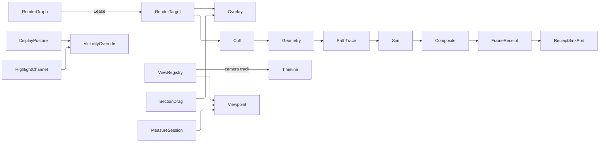

# [APPUI_RENDER_PIPELINE]

`RenderGraph` is the infinite viewport's GPU render pipeline: one pass-DAG drives every frame over the platform's one compositor-owned `GRContext` leased through the embed capsule, the `GpuBackend` rows carry the per-backend target-construction delegate (`Target`) over the composition-bound `GpuBinding` union so backend identity derives from the binding and a mismatched backend-factory pair is unrepresentable, the `ResolvePass` ladder selects the antialias-and-super-resolution resolve, `SimVisual` renders isosurface/volume/streamline/glyph/deformation fields off the Compute field receipts, and `Viewpoint` codecs camera, section, visibility, override, selection, and source-addressed measurements as one portable BCF-compatible receipt. `ViewRegistry` is the one named-view owner — standard views derived from the orientation cube's own signed axis triples, user bookmarks, captured cameras, and traversal history as one row family recalled through the camera-track projection — `SectionDrag` manipulates the six-plane box through axis-constrained handles on the overlay plane, and `MeasureSession` takes source-addressed measurements whose pinned rows ARE viewpoint annotations. This page owns the render-graph pass algebra, the backend vocabulary with its target factory column, the measured GPU-time evidence lane, the resolve ladder, the simulation render passes, the viewpoint receipt with its visibility-action, version-ghost, highlight, and display-posture folds, the named-view registry with its gizmo and projection toggle, the section manipulator, the measurement mode with its unit-aware expression labels, and the residency wire projection; the geometry-virtualization and residency owners live in `Render/meshlets`, the path-trace integrator in `Render/pathtrace`. Its substrate is SkiaSharp 3 GPU backends (`GRContext`, `GRMtlBackendContext`, `GRVkBackendContext`, `SKRuntimeEffect`) leased through `ISkiaSharpApiLease`, the `Silk.NET.WebGPU` wgpu/Dawn target factory, the Compute geometry and field receipts, and the AppHost clock, frame-budget, and receipt-sink ports. GPU passes share the one leased compositor context, and the `Software` 2D-Skia raster is the deterministic CPU floor.

## [01]-[INDEX]

- [02]-[RENDER_GRAPH]: Frame pass-DAG, the `GpuBackend` target-factory column over `GpuBinding`, resolve ladder, frame-budget invariant, fallback.
- [03]-[SIM_VISUAL]: Isosurface, volume, streamline, glyph, deformation field render passes off the Compute receipts.
- [04]-[VIEWPOINT_CODEC]: Camera, section-box, visibility, override, selection projecting onto the `Rasm.Bim` `BcfViewpoint` exchange contract; the isolate/hide/x-ray/highlight/reset action fold, the version-diff ghost, the hover highlight channel, and the display-posture family on the one override vocabulary.
- [05]-[VIEW_REGISTRY]: Orientation gizmo, the one named-view registry over standard views, bookmarks, captures, and traversal history, projection toggle, recall motion.
- [06]-[SECTION_MANIPULATOR]: Six-plane vocabulary, axis-constrained drag handles, per-plane enablement, outline overlay, the HUD section fact.
- [07]-[MEASURE_MODE]: Measurement kinds with their folds, the movable panel, pinned viewpoint annotations, unit-aware expression labels, the footer selection readout.
- [08]-[TS_PROJECTION]: Viewpoint, frame-evidence, and content-keyed geometry-residency wire contract.
- [09]-[GPU_AND_WIRE_BOUNDARY]: Viewport GPU lease law, the wgpu presentation arms, and the web residency mint.

## [02]-[RENDER_GRAPH]

- Owner: `RenderPass` `[Union]` frame-pass vocabulary; `RenderGraph` pass-DAG executor; `GpuBackend` `[SmartEnum]` the backend vocabulary whose rows CARRY the target-construction delegate; `GpuBinding` `[Union]` the composition-bound substrate each backend row folds; `RenderTargetRequest` the resolve-row-derived allocation request (display extent, render scale, sample count); `RenderTarget` the lease-bound GPU surface carrying its request and its GRANTED sample count; `FrameView` the render-time view value pairing the view-state camera, this frame's NDC jitter, and the governor verdict; `WgpuFrameEvidence` the timestamp-query GPU-time lane; `FrameReceipt` per-frame evidence; `ViewportFault` the fault family; `ResolvePass` `[SmartEnum]` the antialias-and-super-resolution resolve ladder the `Composite` pass selects; `ResolvePolicy` the per-tier delegate-row binding.
- Cases: `RenderPass` = Cull | Geometry | PathTrace | Composite | Sim | Overlay under the locked kind literals cull, geometry, path-trace, composite, sim, overlay; `ResolvePass` = Msaa | Taa | Fsr | Smaa under the locked policy literals; `ViewportFault` = Text | ContextUnavailable | BackendUnsupported | BudgetExceeded | LeaseRejected — codes derive through the `AppUiFaultBand.Viewport` registry row (6100), shared with pathtrace.
- Entry: `public IO<FrameReceipt> Frame(ViewportClock clock, FrameBudget budget, QualityVerdict quality, ViewCamera camera)` on `RenderGraph` — `IO` rail; the pass-DAG executes topologically under the frame camera and the ONE governor verdict, whose `Tier.Rank` selects the resolve row, whose `PassMask` filters the DAG (the `Diagnostics/governor.md` `QualityTier.PassMask` column, so a degraded tier's pass set is data, never a caller convention), and whose `LodPixelScale` is the cut's own error multiplier — three facts one authority derives, so a rank and a mask arriving as separate arguments is the deleted form; the frame seals one receipt carrying the per-pass elapsed, the deferred-pass set, and the GPU-time fold.
- Auto: `Lease` opens the compositor's own GPU context through `ISkiaSharpApiLease.TryLeasePlatformGraphicsApi` and folds the leased context to the `RenderTarget` through the bound `GpuBinding`'s own backend row (`binding.Backend.Target(binding, request)` — the `[UseDelegateFromConstructor]` factory column each row was constructed with), so a pass-emit body binds a backend-provided target rather than the single `GRContext`-plus-`SKRuntimeEffect` emit path and the embedded viewport composites into the leased compositor context and never mints a second `GRContext`; composition owns the DISPLAY extent alone and hands it to the `RenderTargetRequest` builder the graph threads in, so the render extent and the sample count derive from the resolve row the tier selected and no caller can allocate a target the ladder did not ask for; when the platform lease yields no GPU context (`LeaseRejected`/`ContextUnavailable`) the frame re-runs through the `Fallback` binding — `GpuBinding.Raster`, the `Software` row's CPU 2D-Skia floor with the pass list filtered to `Composite`/`Overlay` — so the viewport renders a deterministic CPU frame through the same fold and receipt; the frame-budget invariant executes inside the pass fold — a pass starting past `FrameBudget.Frame`, or whose own declared `Charge` carries the fold past `MaxTriangles`, DEFERS to the next frame (recorded in the receipt's `Deferred` column, folded onto the budget-overrun instrument), and `WithinBudget` derives from the measured elapsed and the deferral set, never an initialized-true flag.
- Law: each `GpuBackend` row is CONSTRUCTED with its target-construction delegate, and every delegate takes the frame's `RenderTargetRequest` so the sample count and the render extent reach the allocation rather than the resolve row alone — `Metal`, `Vulkan`, and `OpenGl` fold the `GpuBinding.Ganesh` leased `GRContext` to `SKSurface.Create(GRRecordingContext, budgeted, request.Info, request.Samples, GRSurfaceOrigin)` for an offscreen target, or wrap the host framebuffer as a `GRBackendRenderTarget` and read `SampleCount` back as the granted column, `Software` folds `GpuBinding.Raster` to the CPU `SKSurface.Create(SKImageInfo)` floor, which takes no sample count and therefore grants one, `Wgpu` folds `GpuBinding.Wgpu` — whose target texture carries `TextureDescriptor.SampleCount` and whose pipeline multisample state must match it — the `Silk.NET.WebGPU` wgpu/Dawn substrate (D3D12/Metal/Vulkan auto-negotiated through `BackendType`) whose `Adapter` matched the compositor adapter LUID/UUID at composition, its `Device`+`Queue` shared branch-wide, DISCRIMINATING the presentation arm on the binding's `WgpuPresentation` — the in-tree composited viewport IMPORTS the rendered texture through the compositor interop family (`ICompositionGpuInterop.ImportImage`/`ImportSemaphore` then `CompositionDrawingSurface.UpdateWithKeyedMutexAsync`/`UpdateWithSemaphoresAsync`/`UpdateWithTimelineSemaphoresAsync` per `GetSynchronizationCapabilities`; a second swapchain in composited mode is the DELETED form), while `SurfaceConfigure`/`SurfaceGetCurrentTexture` survives ONLY as the exclusive-fullscreen/headless arm — the wgpu mesh-shader/compute passes record through `CommandEncoder`/`RenderPassEncoder` and submit through `QueueSubmit`, never a managed scene wrapper — and `WebGpu` folds `GpuBinding.Browser`, the in-browser WebGPU surface the TS web leg consumes; `GpuBinding.Backend` DERIVES the backend row from the binding case, so `RenderGraph` holds bindings alone, a backend paired with a foreign substrate cannot be constructed, and a substrate swap is one backend row with its binding case; the per-backend emit path (wgpu pipeline submit versus `SKRuntimeEffect` shader) diverges inside the row delegates, so the vocabulary owns the divergence and the CPU 2D-Skia fallback is the floor.
- Law: the `Composite` pass selects one `ResolvePass` policy row after the geometry and path-trace passes — `Taa` jitters the camera sub-pixel per frame and reprojects the prior frame through the motion-vector buffer under a neighborhood-clamp history rejection so a static scene converges and a moving scene ghosts no tail, `Smaa` runs the morphological edge AA, `Msaa` multi-samples the raster, and `Fsr` renders sub-resolution (`RenderScale` 0.6) under the `Render/meshlets` `ResidencyBudget` VRAM bound and spatially upscales to display resolution so a 4K viewport renders at a fraction of the pixel cost; `ResolvePolicy` binds each `PERF_BUDGET` `QualityTier` rank to its `ResolvePass` through the frozen `int -> ResolvePass` table (`ByTier`, ranks 4..0) so the governor steps the full ladder `Taa(4,3) -> Smaa(2) -> Msaa(1) -> Fsr(0)` on the same hysteresis band that degrades the render passes — the high tiers spend pixels on temporal quality and the floor tier trades resolution for budget; the ladder EXECUTES ahead of the lease: `Policy.For(quality.Tier.Rank)` selects the pass and `ResolvePass.Advance` steps the graph-held `ResolveState` (ordinal, Halton jitter, history, render scale, frame camera) once per frame — a camera that moved since the prior frame resets the history and the path-trace film in the same transition.
- Law: each of the row's three resolve columns reaches the surface it governs, and a column no allocation or pass consumes is the deleted form. `RenderScale` and `Samples` mint the frame's `RenderTargetRequest`, so an `Fsr` frame allocates at `round(display * 0.6)` and an `Msaa` frame asks its backend for four samples, while `RenderTarget.Samples` publishes what the allocation GRANTED — the raster floor grants one and says so. `Jitter` becomes a CAMERA fact: `FrameView.Of` converts the signed sub-pixel offset to NDC against the target the frame allocated, the `Cull` and `Geometry` arms take that `FrameView` exactly as the cull arm already took the frame camera, and the geometry draw adds `NdcJitter` to its projection's third column. Cull and LOD read `FrameView.Camera` and `FrameView.LodScale` — the governor's own degrade lever, which a composition-closed `lodScale` left with no reader, because a sub-pixel offset moves no cull decision; the `PathTrace` arm reads `Camera` too, and that is load-bearing — a jittered lens differs from the prior frame's every frame, so `AccumulationTarget.Reset` would fire on every frame and the film would never converge past one sample. The `Composite` arm runs `ResolvePass.Resolve(target, state, raster)`, which hands the composite the target's own `RenderTargetRequest` beside the jitter-and-history state, so the upscale factor it must undo is read off the surface it reads from rather than assumed. The `Taa` motion-vector buffer is ONE `Render/meshlets` `BindlessTable` slot, never a parallel motion-vector owner; the resolve is a `Composite` policy column and a parallel post-process engine is the deleted form.
- Law: the triangle column is a MEASURED draw count over one contract, and the contract is the frame's CUT. `RenderPass.Geometry` carries three members — `Phase`, the `Render/meshlets` `CutPhase` row naming which slice of the cut this row draws; `Charge`, the budget projection the pre-charge gate reads against that slice; and `Draw`, which returns the triangles the pass recorded — and every other case contributes zero TRIANGLES to the fold, so a cull selection, a path-trace batch, a composite, and an overlay each publish the honest nothing they drew, while the sim arm answers its swept field points on its own `FrameReceipt.SimPoints` column and the pathTrace arm the film's shade-fault LEVEL on `FrameReceipt.FilmFaults` — measures with readers, kept out of the triangle ceiling because a marched volume and a failed scatter are not triangles. The cut itself rides the pass fold: the `Cull` arm publishes the `CullResult` it produced, the geometry arms read it, and a geometry pass scheduled ahead of any cull reads `CullResult.Empty` and draws nothing. `Render/meshlets`' `ClusterCull.DrawRows` mints BOTH meshlet geometry rows off one submit arrow — `CutPhase.Prior` then `CutPhase.Retest` — because the two-phase HZB ladder is two rows over one cut and the owner that knows the ladder has two phases is the one that schedules them; minting only a whole-cut row leaves the second phase's view list stranded in the cull arm with no pass that can draw it; the `Render/shading` shade mount and the `Render/reality` capture composites take `CutPhase.Whole`, charge zero, and report zero, re-shading and re-compositing geometry another pass already drew. Handing a geometry delegate the un-narrowed cluster set, or returning a cluster count, a path-point count, or the whole scene's total from either half, makes `FrameReceipt.Triangles` a fabricated measure and `budget.MaxTriangles` defer on cost nothing spends — all deleted forms.
- Law: `TelemetryRow(version, budget)` carries the `Diagnostics/evidence#TELEMETRY_SPINE` `ViewportObjectives.Pack` over those same three series.
- Receipt: `FrameReceipt` — frame ordinal, per-pass `Duration` seq, GPU `Duration`, the drawing passes' own reported triangles, the sim passes' own swept field points, the path-trace film's shade-fault level, budget verdict, `Instant`, `CorrelationId`; the GPU column is MEASURED evidence off the `WgpuFrameEvidence` timestamp lane (`QueryType.Timestamp` `DeviceCreateQuerySet`, per-pass `RenderPassTimestampWrites`/`ComputePassTimestampWrites`, `CommandEncoderResolveQuerySet` into the read buffer, `BufferMapAsync`/`BufferGetMappedRange`/`BufferUnmap` readback, `QuerySetRelease` teardown), never the CPU elapsed re-labelled — a binding without the `timestamp-query` feature binds `None` and the column carries the honest `Duration.Zero`, while a FAILED readback keeps the zero and lands its fault on the receipt fault rail so unsupported and failed never conflate; the `Diagnostics/governor.md` `GpuTimeline.Migrate` deepens the same column from the lane-measured frame duration to per-pass resolved nanoseconds only when EVERY pass resolved its timestamp pair — a mixed projected/measured sum never enters the measured column; frame retirement rides `QueueSubmitForIndex` minting the `WrappedSubmissionIndex` that `DevicePoll` advances without a blocking fence, so cull-to-draw and readback never stall the queue; sealed through `ReceiptSinkPort` as a `Render`-family fact; `TelemetryRow` contributes the frame-elapsed, gpu-elapsed, and budget-overrun instruments inward through `TelemetryContributorPort`, and `RenderGraph.Observe` is where the frame's accepted `Render/meshlets` `ResidencyPlan` retires too — it is the sole binder of `ResidencyBudget.Observe`, so the evict, prefetch, and pool gauges read the plan THIS frame drew rather than a plan some other frame held.
- Packages: SkiaSharp, Avalonia.Skia, Avalonia (compositor GPU interop), Silk.NET.WebGPU, Silk.NET.WebGPU.Extensions.WGPU, Silk.NET.WebGPU.Native.WGPU, Thinktecture.Runtime.Extensions, LanguageExt.Core, NodaTime, Rasm (project — `Deterministic.RadicalInverse` the TAA jitter sequence), Rasm.AppHost (project)
- Growth: a new frame stage is one `RenderPass` case breaking the topological dispatch at compile time; a new resolve column is one `ResolvePass` column plus its read on `RenderTargetRequest.Of` or `FrameView.Of`; a new backend is one `GpuBackend` row constructed with its target delegate and its `GpuBinding` case — Skia Graphite re-admits as one `SkiaGraphite` row the moment SkiaSharp ships its Recorder/Context surface; a new backend FAMILY is one `GpuFamily` row declaring its `Skia`/`Chained`/`Accelerated` columns, and every consumer picks it up with no edit because none enumerates families; zero new surface.
- Growth: a new viewport reliability indicator is one `ViewportObjectives` row on the evidence page, carried here with no edit.
- Boundary: `RenderGraph` is the named boundary capsule and a sealed CLASS, because a `with` copy shares the resolve cell by reference while duplicating the frame ordinal — the lease-and-walk body and the frame seal carry the only statement bodies; the resolve transition is the FRAME's and taken exactly once, so a lease-rejected frame re-enters the fallback with the SAME `ResolveStep` — stepping the reprojection ordinal or re-jittering on the re-entry is the deleted form that made every GPU refusal skip a TAA sample; every transition on the resolve cell is a PURE function that names the history image it superseded on the state it installs, and the one drain releases that image after the exchange, because `Atom.Swap` re-runs its function inside a CAS retry loop and a release inside the body frees a handle the winning state still holds; the pass roster narrows from `GpuBackend.IsGpu`, the column that states what a binding can run, so a literal `Composite or Overlay` fallback list is the deleted disjunction; frame retirement PRESENTS through the binding's own `WgpuPresentation` with the four synchronization indices derived from the receipt ordinal, so a declared-but-uninvoked presentation arm and a caller-supplied index pair are both deleted forms; the shared GPU context arrives as one `SurfaceSeam`-bound platform-lease delegate so no pass body names a `GRContext.CreateMetal`/`CreateVulkan` factory at a call site, deferring to the surface-hosts `EMBED_CAPSULE` shared-context law — a direct GPU-backend construction inside a pass arm is the rejected form (PROHIBITION host-API-in-arm); the per-backend target construction LIVES ON the `GpuBackend` row as its constructor delegate and every row reads the one `RenderTargetRequest` — the `Metal`/`Vulkan`/`OpenGl` rows fold the leased `GRContext` to a sample-counted `SKSurface.Create`, the `Wgpu` row folds the `Silk.NET.WebGPU` `Device`/`Queue`/`Surface` wgpu swapchain presenting through the compositor `ICompositionGpuInterop.ImportImage` seam, and the `WebGpu` row folds the browser surface — a detached factory record pairable with a foreign backend is the deleted form, so a pass-emit body never names a backend target factory at a call site and a substrate swap is one backend row; the GPU passes (`Geometry` cluster draw through the wgpu mesh-shader pipeline, `PathTrace` through the wgpu compute pass, `Sim` volume ray-march, the reality-capture `Splat`/`Point` composites) SPIKE-gate on the live leased context and the `Composite` 2D-Skia raster is the deterministic CPU fallback; `ViewportClock` rides the AppHost `ClockPolicy` so frame timing is the one clock seam and a stopwatch is the rejected form; the frame ordinal is a monotone `Interlocked.Increment` over the graph-local counter so each `FrameReceipt` carries a distinct ordinal the correlation join and the render-hash lane key on, and a hardcoded zero ordinal is the deleted form; the receipt carries the folded per-pass list, the deferred-pass set, and a `WithinBudget` verdict derived from the measured elapsed against `FrameBudget.Frame` and the triangle ceiling, so an overrun frame seals `WithinBudget: false` with its deferrals named rather than an unconditional true, and every frame sinks one `FrameReceipt` through the one envelope and a per-pass meter is the deleted form; GPU validation on the `Wgpu` arm rides the error-scope rail — `DeviceSetUncapturedErrorCallback` installs once at device acquisition and `WgpuErrorScope` brackets suspect pass encoding through `DevicePushErrorScope`/`DevicePopErrorScope`, so a validation or out-of-memory error is a counted `ViewportFault` on the telemetry spine, never a swallowed native abort; the meshlet cluster the graph draws is the `Render/meshlets` owner and the path-trace pass the `Render/pathtrace` integrator, so the pipeline composes them and re-models neither.

```csharp signature
[Union]
public abstract partial record ViewportFault : Expected, IValidationError<ViewportFault> {
    private ViewportFault(string detail, int code) : base(detail, code, None) { }

    public static ViewportFault Create(string message) => new Text(message);

    public sealed record Text : ViewportFault { public Text(string detail) : base(detail, AppUiFaultBand.Viewport.Code(0)) { } }
    public sealed record ContextUnavailable : ViewportFault { public ContextUnavailable(string detail) : base(detail, AppUiFaultBand.Viewport.Code(1)) { } }
    public sealed record BackendUnsupported : ViewportFault { public BackendUnsupported(string detail) : base(detail, AppUiFaultBand.Viewport.Code(2)) { } }
    public sealed record BudgetExceeded : ViewportFault { public BudgetExceeded(string detail) : base(detail, AppUiFaultBand.Viewport.Code(3)) { } }
    public sealed record LeaseRejected : ViewportFault { public LeaseRejected(string detail) : base(detail, AppUiFaultBand.Viewport.Code(4)) { } }
}

// One target request carries every allocation fact the resolve ladder owns: the DISPLAY extent the composition
// leases at, the row's RenderScale, and the row's sample count. Info derives the sub-resolution extent rather
// than storing it, so the render extent and the display extent cannot disagree and the composite reads its own
// upscale factor off the target it drew into. A caller-minted extent beside the resolve row is the deleted
// form — it is what left `Fsr`'s 0.6 scale and `Msaa`'s four samples with no allocation to reach.
public readonly record struct RenderTargetRequest(SKImageInfo Display, double RenderScale, int Samples) {
    public SKImageInfo Info =>
        RenderScale >= 1d
            ? Display
            : Display.WithSize(
                Math.Max((int)Math.Round(Display.Width * RenderScale), 1),
                Math.Max((int)Math.Round(Display.Height * RenderScale), 1));

    public static RenderTargetRequest Of(SKImageInfo display, ResolvePass resolve) =>
        new(display, resolve.RenderScale, resolve.Samples);
}

// Everything one frame's passes read about HOW to look at the scene, as one value: the portable view-state
// lens, THIS frame's sub-pixel projection offset, and the governor verdict that scales the cut. The jitter
// stays off ViewCamera because ViewCamera is the saved-viewpoint value the BCF codec and the wire project — a
// per-frame jitter column there would ride into every stored view — and because a sub-pixel jitter is a
// projection shear, not an eye or target move, so folding it into CameraFrame would spell a rotation the
// raster does not want. Cull and LOD read Camera and LodScale (a sub-pixel offset moves no cull decision);
// the geometry draw adds NdcJitter to its projection's third column; the path tracer reads Camera alone,
// because a per-frame jitter would trip AccumulationTarget.Reset every frame and the film would never
// converge past one sample. Threading the lens and the verdict as two arguments is what let a composition
// close over its own lodScale and leave the governor's degrade lever with no reader.
public readonly record struct FrameView(ViewCamera Camera, (double X, double Y) NdcJitter, QualityVerdict Quality) {
    public double LodScale => Quality.LodPixelScale;

    // Pixels to NDC against the target the frame allocated: two NDC units span the full extent, and
    // NDC Y rises where the target's Y falls. Converting HERE — once, where the extent is known — is what
    // keeps a sub-resolution FSR target from jittering by a display-sized offset.
    public static FrameView Of(ViewCamera camera, (double X, double Y) jitterPixels, SKImageInfo info, QualityVerdict quality) =>
        new(camera, (2d * jitterPixels.X / Math.Max(info.Width, 1), -2d * jitterPixels.Y / Math.Max(info.Height, 1)), quality);
}

// Backend rows CARRY their target construction: the [UseDelegateFromConstructor] column folds the
// composition-bound GpuBinding case and the resolve row's own RenderTargetRequest to a RenderTarget, and a
// binding case a row does not own is the typed BackendUnsupported fault — behavior recovers from the selected
// row, never from a detached factory record. Every arm returns the GRANTED sample count beside the request:
// a Ganesh target answers GRBackendRenderTarget.SampleCount, the raster floor answers one, and publishing the
// requested count would forge a multi-sample measurement the allocation never took.
[SmartEnum<string>]
public sealed partial class GpuBackend {
    public static readonly GpuBackend Metal = new("metal", GpuFamily.SkiaGanesh, GaneshTarget);
    public static readonly GpuBackend Vulkan = new("vulkan", GpuFamily.SkiaGanesh, GaneshTarget);
    public static readonly GpuBackend OpenGl = new("opengl", GpuFamily.SkiaGanesh, GaneshTarget);
    public static readonly GpuBackend Software = new("software", GpuFamily.SkiaRaster, RasterTarget);
    public static readonly GpuBackend Wgpu = new("wgpu", GpuFamily.Wgpu, WgpuTarget);
    public static readonly GpuBackend WebGpu = new("webgpu", GpuFamily.WebGpu, BrowserTarget);

    public GpuFamily Family { get; }

    public bool IsGpu => Family.Accelerated;

    [UseDelegateFromConstructor]
    public partial Fin<RenderTarget> Target(GpuBinding binding, RenderTargetRequest request);

    private static Fin<RenderTarget> GaneshTarget(GpuBinding binding, RenderTargetRequest request) => binding switch {
        GpuBinding.Ganesh ganesh => ganesh.Lease(request),
        _ => Fin.Fail<RenderTarget>(new ViewportFault.BackendUnsupported($"{binding.Backend.Key}: not a Ganesh binding")),
    };

    // SKSurface.Create(SKImageInfo) takes no sample count, so the CPU raster is single-sampled by construction:
    // the floor GRANTS one sample whatever the resolve row asked for, and the Msaa row's multi-sample claim is
    // an accelerated-target property the fallback frame honestly reports itself as not holding.
    private const int RasterSamples = 1;

    private static Fin<RenderTarget> RasterTarget(GpuBinding binding, RenderTargetRequest request) => binding switch {
        GpuBinding.Raster => SKSurface.Create(request.Info) switch {
            { } surface => Fin.Succ(new RenderTarget(Software, Some(surface), None, request, RasterSamples, surface)),
            _ => Fin.Fail<RenderTarget>(new ViewportFault.ContextUnavailable("software: raster surface allocation failed")),
        },
        _ => Fin.Fail<RenderTarget>(new ViewportFault.BackendUnsupported($"{binding.Backend.Key}: not the raster floor")),
    };

    private static Fin<RenderTarget> WgpuTarget(GpuBinding binding, RenderTargetRequest request) => binding switch {
        GpuBinding.Wgpu wgpu => wgpu.Acquire(wgpu.Presentation, request),
        _ => Fin.Fail<RenderTarget>(new ViewportFault.BackendUnsupported($"{binding.Backend.Key}: not a wgpu binding")),
    };

    private static Fin<RenderTarget> BrowserTarget(GpuBinding binding, RenderTargetRequest request) => binding switch {
        GpuBinding.Browser browser => browser.Acquire(browser.Surface, request),
        _ => Fin.Fail<RenderTarget>(new ViewportFault.BackendUnsupported($"{binding.Backend.Key}: not a browser binding")),
    };
}

// Each family DECLARES the three facts its consumers otherwise re-enumerate as disjunctions: Skia holds where
// the row draws through an SKCanvas (Ganesh and the raster floor alike), Chained holds where the row binds a
// native shader chain, and Accelerated is false only on the CPU floor. A consumer asks a column, never a
// `Family == A || Family == B` list — a fifth family added to the roster falls out of every hand-written
// disjunction silently and lands on whichever arm the last `else` happens to be, which is the deleted form.
[SmartEnum<string>]
public sealed partial class GpuFamily {
    public static readonly GpuFamily SkiaGanesh = new("skia-ganesh", skia: true, chained: false, accelerated: true);
    public static readonly GpuFamily SkiaRaster = new("skia-raster", skia: true, chained: false, accelerated: false);
    public static readonly GpuFamily Wgpu = new("wgpu", skia: false, chained: true, accelerated: true);
    public static readonly GpuFamily WebGpu = new("webgpu", skia: false, chained: true, accelerated: true);

    public bool Skia { get; }
    public bool Chained { get; }
    public bool Accelerated { get; }
}

// Composition-bound GPU substrate: each case pins the state its backend row folds, Backend DERIVES the row
// from the case, and the Ganesh admission gate rejects a non-Ganesh row — so the graph holds bindings alone
// and a backend paired with a foreign substrate never constructs. Ganesh closes over the embed-capsule
// platform lease, Wgpu over the shared device and its presentation arm, Raster is the CPU floor, Browser the
// TS web leg's surface.
[Union(ConversionFromValue = ConversionOperatorsGeneration.None)]
public abstract partial record GpuBinding {
    private GpuBinding() { }

    public sealed record Ganesh : GpuBinding {
        private Ganesh(GpuBackend row, Func<RenderTargetRequest, Fin<RenderTarget>> lease) { Row = row; Lease = lease; }

        public GpuBackend Row { get; }
        public Func<RenderTargetRequest, Fin<RenderTarget>> Lease { get; }

        public static Fin<GpuBinding> Of(GpuBackend row, Func<RenderTargetRequest, Fin<RenderTarget>> lease) =>
            row.Family == GpuFamily.SkiaGanesh
                ? Fin.Succ<GpuBinding>(new Ganesh(row, lease))
                : Fin.Fail<GpuBinding>(new ViewportFault.BackendUnsupported($"{row.Key}: not a Ganesh row"));
    }

    public sealed record Raster : GpuBinding;

    public sealed record Wgpu(WgpuDevice Device, WgpuPresentation Presentation, Func<WgpuPresentation, RenderTargetRequest, Fin<RenderTarget>> Acquire) : GpuBinding;

    public sealed record Browser(nint Surface, Func<nint, RenderTargetRequest, Fin<RenderTarget>> Acquire) : GpuBinding;

    public GpuBackend Backend => this switch {
        Ganesh ganesh => ganesh.Row,
        Wgpu => GpuBackend.Wgpu,
        Browser => GpuBackend.WebGpu,
        _ => GpuBackend.Software,
    };

    public Fin<RenderTarget> Target(RenderTargetRequest request) => Backend.Target(this, request);
}

// WGPU presentation dispatch the Wgpu backend row routes through: Composited imports the
// externally-rendered texture through the compositor interop family (a second swapchain in composited
// mode cannot type), Swapchain survives ONLY as the exclusive-fullscreen arm, Headless renders offscreen.
[Union(ConversionFromValue = ConversionOperatorsGeneration.None)]
public abstract partial record WgpuPresentation {
    private WgpuPresentation() { }

    public sealed record Composited(
        ICompositionGpuInterop Interop,
        CompositionDrawingSurface Surface,
        ICompositionImportedGpuImage Image,
        CompositionGpuImportedImageSynchronizationCapabilities Sync,
        Option<(ICompositionImportedGpuSemaphore Wait, ICompositionImportedGpuSemaphore Signal)> Semaphores) : WgpuPresentation;

    public sealed record Swapchain(nint WgpuSurface, Func<nint, IO<Unit>> Submit) : WgpuPresentation;

    // Headless carries no extent of its own: the frame's RenderTargetRequest is the one allocation fact, and a
    // presentation-held SKImageInfo beside it is a second extent authority that drifts the moment the resolve
    // ladder changes RenderScale.
    public sealed record Headless : WgpuPresentation;

    // Composited construction: the wgpu device is created against the compositor adapter (DeviceLuid/
    // DeviceUuid pin), the shared texture imports ONCE, and the synchronization arm derives from the
    // interop's own capability probe — never assumed.
    public static Fin<WgpuPresentation> CompositedOf(
        ICompositionGpuInterop interop,
        CompositionDrawingSurface surface,
        IPlatformHandle sharedTexture,
        PlatformGraphicsExternalImageProperties shape,
        string handleType,
        Func<CompositionGpuImportedImageSynchronizationCapabilities, Option<(ICompositionImportedGpuSemaphore Wait, ICompositionImportedGpuSemaphore Signal)>> semaphores) =>
        interop.GetSynchronizationCapabilities(handleType) switch {
            var sync => Fin.Succ<WgpuPresentation>(new Composited(
                interop, surface, interop.ImportImage(sharedTexture, shape), sync, semaphores(sync))),
        };

    // Per-frame refresh awaits import completion, rejects lost interop/image/semaphore handles, then uses the
    // capability-discriminated keyed-mutex, timeline, binary-semaphore, or Automatic update arm.
    public IO<Unit> Present(uint acquireIndex, uint releaseIndex, ulong waitValue, ulong signalValue) => this switch {
        Composited c => IO.liftAsync(async () => {
            await c.Image.ImportCompleted;
            if (c.Interop.IsLost || c.Image.IsLost || c.Semaphores.Exists(pair => pair.Wait.IsLost || pair.Signal.IsLost)) {
                throw ((Error)new ViewportFault.LeaseRejected("wgpu/present: compositor import lost")).ToException();
            }
            await (c switch {
                { Sync: var sync } when sync.HasFlag(CompositionGpuImportedImageSynchronizationCapabilities.KeyedMutex) =>
                    c.Surface.UpdateWithKeyedMutexAsync(c.Image, acquireIndex, releaseIndex),
                { Sync: var sync, Semaphores.Case: (ICompositionImportedGpuSemaphore wait, ICompositionImportedGpuSemaphore signal) }
                    when sync.HasFlag(CompositionGpuImportedImageSynchronizationCapabilities.TimelineSemaphores) =>
                    c.Surface.UpdateWithTimelineSemaphoresAsync(c.Image, wait, waitValue, signal, signalValue),
                { Sync: var sync, Semaphores.Case: (ICompositionImportedGpuSemaphore wait, ICompositionImportedGpuSemaphore signal) }
                    when sync.HasFlag(CompositionGpuImportedImageSynchronizationCapabilities.Semaphores) =>
                    c.Surface.UpdateWithSemaphoresAsync(c.Image, wait, signal),
                { Sync: var sync } when sync.HasFlag(CompositionGpuImportedImageSynchronizationCapabilities.Automatic) =>
                    c.Surface.UpdateAsync(c.Image),
                _ => throw ((Error)new ViewportFault.BackendUnsupported("wgpu/present: imported image exposes no supported synchronization mode")).ToException(),
            });
            return unit;
        }),
        Swapchain swapchain => swapchain.Submit(swapchain.WgpuSurface),
        Headless => IO.pure(unit),
    };
}

// GPU validation ingress on the shared device: DeviceSetUncapturedErrorCallback installs once at device
// acquisition; the push/pop pair brackets suspect pass encoding so a validation or OOM error is a counted
// ViewportFault on the telemetry spine, never a swallowed native abort.
public sealed record WgpuErrorScope(Action Push, Func<Option<string>> Pop) {
    public Fin<T> Guarded<T>(Func<Fin<T>> encode) {
        Push();
        Fin<T> outcome = encode();
        return Pop().Match(
            Some: static error => Fin.Fail<T>(new ViewportFault.Text($"wgpu/validation: {error}")),
            None: () => outcome);
    }
}

// Composition-bound GPU-time lane over the shared device: Measure brackets one frame — a
// QueryType.Timestamp DeviceCreateQuerySet (gated on the timestamp-query feature at composition), per-pass
// RenderPassTimestampWrites/ComputePassTimestampWrites, CommandEncoderResolveQuerySet into the read buffer,
// QueueSubmitForIndex minting the WrappedSubmissionIndex that DevicePoll retires without a blocking fence,
// BufferMapAsync/BufferGetMappedRange/BufferUnmap folding (lastTick - firstTick) x queue period to Duration,
// QuerySetRelease at teardown. The graph binds None on a device without the feature, so FrameReceipt.Gpu is
// measured evidence or the honest zero, never the CPU pass elapsed re-labelled as GPU time.
public sealed record WgpuFrameEvidence(Func<Fin<Duration>> Measure);

// Key threads through the base positional parameter (the ControlIntent pattern) — a base computed
// Key => Switch beside same-named case positionals suppresses property synthesis and recurses (CS8907).
[Union(ConversionFromValue = ConversionOperatorsGeneration.None)]
public abstract partial record RenderPass(string Key) {
    public sealed record Cull(string Key, Func<RenderTarget, MeshletCluster, FrameView, Fin<(MeshletCluster Cluster, CullResult Result)>> Visible) : RenderPass(Key);
    // Geometry is the ONLY pass that draws triangles, so it alone carries the frame's triangle contract as two
    // members of one row: Charge is the budget projection the pre-charge gate reads BEFORE the pass runs, and Draw
    // returns the triangle count its own draw recorded. Both read the frame's own CUT — the `Render/meshlets`
    // DrawCut narrowed to this row's CutPhase — never the un-narrowed cluster set: a draw handed the whole payload
    // submits geometry the cull ladder already rejected, and the two-phase HZB ladder cannot schedule its retest
    // draw at all when the second phase's view list never leaves the cull arm. A meshlet draw charges the cut it is
    // about to submit and reports what it submitted; a shade mount and a capture composite take the whole-cut phase,
    // charge zero, and report zero, because they re-shade geometry another pass already drew. A cluster count, a path
    // point count, or the whole scene's total returned from either member publishes a fabricated
    // FrameReceipt.Triangles and defers passes on a budget nothing spends.
    public sealed record Geometry(string Key, CutPhase Phase, Func<DrawCut, long> Charge, Func<RenderTarget, FrameView, DrawCut, Fin<long>> Draw) : RenderPass(Key);
    public sealed record PathTrace(string Key, PathTracePass Pass, Atom<AccumulationTarget> Film, LightRig Rig, int SampleBudget, long Seed, CancelScope Scope) : RenderPass(Key);
    public sealed record Sim(string Key, Func<RenderTarget, Fin<int>> Draw) : RenderPass(Key);
    public sealed record Composite(string Key, Func<SKCanvas, RenderTargetRequest, ResolveState, Fin<Unit>> Raster) : RenderPass(Key);
    public sealed record Overlay(string Key, Func<SKCanvas, Fin<Unit>> Draw) : RenderPass(Key);
}

// The resolve cell's whole state, including the two facts a transition ANSWERS rather than performs: `Moved`
// is the camera-motion verdict the film reset and the history drop both read, and `Retired` carries the
// history image the transition superseded. Retirement rides the state because `Atom.Swap` re-runs its
// function inside a `SpinWait` CAS loop — a `Dispose` in a transition body releases a handle every losing
// attempt's state still holds, leaving a live cell pointing at a dead native — so the transition records what
// it unlinked and the caller drains that record ONCE after the exchange. Every transition rewrites `Retired`,
// so no image outlives its own frame and none is released twice.
public readonly record struct ResolveState(
    long Ordinal,
    (double X, double Y) Jitter,
    Option<SKImage> History,
    double RenderScale,
    Option<ViewCamera> Camera,
    Option<SKImage> Retired,
    bool Moved);

// ONE frame's resolve answer: the selected row beside the state its transition installed. The motion verdict
// is a column of that state rather than a third positional, because it IS that transition's product —
// passing the row alone leaves the fallback re-entry to recompute the state and take the transition twice,
// and computing the verdict beside the swap reads a value the winning exchange may not have folded.
public readonly record struct ResolveStep(ResolvePass Pass, ResolveState State);

[SmartEnum<string>]
public sealed partial class ResolvePass {
    public static readonly ResolvePass Msaa = new("msaa", samples: 4, renderScale: 1.0, reproject: false);
    public static readonly ResolvePass Taa = new("taa", samples: 1, renderScale: 1.0, reproject: true);
    public static readonly ResolvePass Fsr = new("fsr", samples: 1, renderScale: 0.6, reproject: false);
    public static readonly ResolvePass Smaa = new("smaa", samples: 1, renderScale: 1.0, reproject: false);

    public int Samples { get; }
    public double RenderScale { get; }
    public bool Reproject { get; }

    // TAA sub-pixel jitter is the Halton (2,3) sequence READ off the kernel equidistribution owner — the
    // base-2 leg through the bit-reversal fast path, the base-3 leg through the radix-parameterized radical
    // inverse — so the sequence is generable at any phase and a hand-transcribed sample table cannot drift
    // from the generator. Eight phases keep the reprojection history window coherent; the period is policy.
    private const int JitterPeriod = 8;

    // Centred on the pixel: the radical inverse lands in [0, 1) and a sub-pixel camera offset is signed
    // about the pixel centre, so the half-shift is the projection offset itself, never a consumer-side
    // correction one consumer would apply and the next would forget.
    private static (double X, double Y) HaltonJitter(long ordinal) =>
        (uint)((ordinal % JitterPeriod) + 1L) switch {
            var phase => (Deterministic.RadicalInverse(bits: phase) - 0.5,
                          Deterministic.RadicalInverse(index: phase, radix: 3) - 0.5),
        };

    // ONE predicate owns the whole transition: a history image survives exactly when this row reprojects AND
    // the camera held still, and that same answer re-seeds the reprojection ordinal, zeroes the jitter, and
    // retires the superseded image. Spelling the three separately is what let a non-reprojecting row advance
    // an ordinal indexing a history it had just dropped. The body is PURE — it names the image it retires and
    // releases nothing — because the CAS loop re-runs it on every losing attempt.
    public ResolveState Advance(ResolveState prior, ViewCamera camera) =>
        prior.Camera.Map(held => held != camera).IfNone(true) switch {
            var moved => (Reproject && !moved) switch {
                var keeps => prior with {
                    Ordinal = keeps ? prior.Ordinal + 1 : 1L,
                    Jitter = Reproject ? HaltonJitter(ordinal: keeps ? prior.Ordinal + 1 : 1L) : (0d, 0d),
                    History = keeps ? prior.History : None,
                    Retired = keeps ? None : prior.History,
                    RenderScale = RenderScale,
                    Camera = Some(camera),
                    Moved = moved,
                },
            },
        };

    // The composite receives the TARGET'S OWN request beside the temporal state, so the upscale it performs is
    // read off the surface it is reading from: request.Info is the sub-resolution extent the frame rendered at,
    // request.Display the extent it composites to, and request.RenderScale their ratio. An Fsr composite that
    // cannot see the scale it must undo is the shape that left the 0.6 render scale with no consumer.
    public Fin<Unit> Resolve(RenderTarget target, ResolveState state, Func<SKCanvas, RenderTargetRequest, ResolveState, Fin<Unit>> composite) =>
        target.Surface.Match(
            Some: surface => composite(surface.Canvas, target.Request, state),
            None: () => Fin.Fail<Unit>(new ViewportFault.ContextUnavailable($"resolve/{Key}: no resolve surface")));
}

// The rank extremes are the TABLE'S own, seated once at construction. A literal 0..4 clamp couples this ladder
// to contiguous zero-based tier ranks, and the one growth move the `Diagnostics/governor.md` vocabulary declares
// is a grade at either extreme — which turns the clamp into a lookup for a rank the table never mapped and
// answers `Msaa` on the tier that most needs `Fsr`. `QualityTier.Ranked` clamps against its own extremes for
// exactly this reason; a ladder keyed on those ranks holds the same rule.
public sealed record ResolvePolicy {
    private ResolvePolicy(FrozenDictionary<int, ResolvePass> byTier, int floor, int ceiling) =>
        (ByTier, Floor, Ceiling) = (byTier, floor, ceiling);

    public FrozenDictionary<int, ResolvePass> ByTier { get; }
    public int Floor { get; }
    public int Ceiling { get; }

    // The roster is NON-EMPTY by construction — one required row plus the rest — because the extremes are read
    // off the table itself and `Min`/`Max` over an empty key set throws at the composition root's static
    // initializer, which is a black viewport with a type-initializer exception and no fault on any rail.
    public static ResolvePolicy Of((int Rank, ResolvePass Pass) head, params ReadOnlySpan<(int Rank, ResolvePass Pass)> rest) =>
        rest.ToArray().Append(head).ToFrozenDictionary(static row => row.Rank, static row => row.Pass) switch {
            var table => new ResolvePolicy(table, table.Keys.Min(), table.Keys.Max()),
        };

    public static readonly ResolvePolicy Default = Of(
        (4, ResolvePass.Taa), (3, ResolvePass.Taa), (2, ResolvePass.Smaa), (1, ResolvePass.Msaa), (0, ResolvePass.Fsr));

    // A rank inside the extremes that the table skipped falls to the single-sampled `Msaa` floor rather than
    // throwing: an unmapped grade renders, and the gap is a policy-table defect the composition owns.
    public ResolvePass For(int tierRank) =>
        ByTier.TryGetValue(Math.Clamp(tierRank, Floor, Ceiling), out ResolvePass? pass) ? pass : ResolvePass.Msaa;
}

// Samples is the GRANTED count, read back off the allocation — GRBackendRenderTarget.SampleCount on the Ganesh
// arm, the TextureDescriptor.SampleCount the wgpu arm asked for and the device honoured, one on the raster
// floor — never the requested column echoed. A target republishing its request as its measurement spells a
// multi-sample resolve on a surface that took one sample.
public sealed record RenderTarget(GpuBackend Backend, Option<SKSurface> Surface, Option<GRContext> Context, RenderTargetRequest Request, int Samples, IDisposable Native) : IDisposable {
    public void Dispose() => Native.Dispose();
}

// Every gated axis carries its OWN ceiling. A phase share gated on the whole-frame duration is unreachable —
// layout inside a frame can exceed the frame budget only once the frame already has — and an eviction count
// gated at zero degrades on the normal operation of a byte-budgeted cache. GPU is the one axis that can
// legitimately exceed its frame share, because it runs a frame behind the CPU that queued it.
public sealed record FrameBudget(Duration Frame, Duration Gpu, Duration Layout, long VramBytes, long EvictsPerFrame, int MaxTriangles) {
    public static readonly FrameBudget Sixty = new(
        Duration.FromMilliseconds(16.667), Duration.FromMilliseconds(14.0), Duration.FromMilliseconds(4.0),
        1_073_741_824L, 8L, 20_000_000);

    public static readonly FrameBudget Thirty = new(
        Duration.FromMilliseconds(33.333), Duration.FromMilliseconds(28.0), Duration.FromMilliseconds(8.0),
        536_870_912L, 16L, 8_000_000);
}

public sealed record ViewportClock(ClockPolicy Clocks, CorrelationId Correlation);

// Fault, Deferred, and SimPoints are LOCAL egress columns (trailing, defaulted): the FrameReceiptWire
// projection omits all three, so the frozen web wire is untouched while in-process consumers distinguish a
// failed frame from fallback, read which passes the budget invariant deferred, read the field-visual path
// points the sim arm swept, and read the path-trace film's shade-fault level. SimPoints sits BESIDE Triangles
// rather than inside it: a marched volume, an integrated streamline, and a projected coordinate axis are not
// triangles, and folding them into the draw count would make the budget ceiling and the receipt's own measure
// describe different work. FilmFaults is a LEVEL, not a per-frame delta — the film's own running count, reset
// with the film on camera motion — so read against the same target's `Fraction` it states a fault RATE, which
// is what distinguishes a scene shading badly from an inexplicably dark render.
public sealed record FrameReceipt(
    long Ordinal,
    GpuBackend Backend,
    Seq<(string Pass, Duration Elapsed)> Passes,
    Duration Gpu,
    long Triangles,
    bool WithinBudget,
    Instant At,
    CorrelationId Correlation,
    Option<Error> Fault = default,
    Seq<string> Deferred = default,
    long SimPoints = 0L,
    long FilmFaults = 0L) {
    public const string Kind = "frame";
}

// A sealed CLASS, not a record: the graph is one IDENTITY over frame state no copy may fork — a monotone
// ordinal counter and the resolve cell every transition installs into. A `with` copy shares the Atom by
// reference while duplicating the counter, so two graphs would drive one resolve cell under two frame
// ordinals and the reprojection history would belong to neither; value equality over a live GPU binding, a
// platform-lease delegate, and a receipt sink answers nothing a caller can use.
public sealed class RenderGraph(
    Seq<RenderPass> passes,
    Atom<MeshletCluster> cluster,
    GpuBinding binding,
    // The CPU floor is structural: a non-raster fallback binding is unrepresentable.
    GpuBinding.Raster fallback,
    ResolvePolicy policy,
    Option<WgpuFrameEvidence> gpuTime,
    Func<GpuBinding, Func<SKImageInfo, RenderTargetRequest>, Func<RenderTarget, Fin<FrameReceipt>>, Fin<FrameReceipt>> lease,
    Func<FrameReceipt, IO<Unit>> sink) {
    public Seq<RenderPass> Passes { get; } = passes;
    public Atom<MeshletCluster> Cluster { get; } = cluster;
    public GpuBinding Binding { get; } = binding;
    public GpuBinding.Raster Fallback { get; } = fallback;
    public ResolvePolicy Policy { get; } = policy;
    public Option<WgpuFrameEvidence> GpuTime { get; } = gpuTime;
    public Func<GpuBinding, Func<SKImageInfo, RenderTargetRequest>, Func<RenderTarget, Fin<FrameReceipt>>, Fin<FrameReceipt>> Lease { get; } = lease;
    public Func<FrameReceipt, IO<Unit>> Sink { get; } = sink;

    private long ordinal;
    private readonly Atom<ResolveState> resolve = Atom(new ResolveState(0L, (0d, 0d), None, 1.0, None, None, false));

    // Interlocked ordinal threads through EVERY arm — the GPU fold, the fallback re-lease, and the
    // Empty fault path — so no receipt is ever constructed with a literal zero ordinal. A lease-class
    // fault re-runs the frame through the Fallback binding over the Composite/Overlay passes, so the
    // software floor is a reachable arm of this fold, never an inert constructor field.
    // Every arm seals its OWN instant and correlation off the one clock: a post-fold `with` re-stamp would
    // date every receipt at the sink rather than at the frame, and it is what forced the ghost `default`
    // identity a receipt constructor must never mint.
    // The governor verdict rides IN WHOLE rather than as a rank plus a mask: the tier's rank selects the
    // resolve row, its PassMask filters the DAG, and its LodPixelScale is the cut's own error multiplier, so
    // three facts one authority derives cannot arrive from three callers disagreeing.
    public IO<FrameReceipt> Frame(ViewportClock clock, FrameBudget budget, QualityVerdict quality, ViewCamera camera) =>
        from next in IO.lift(() => Interlocked.Increment(ref ordinal))
        from receipt in IO.lift(() => Resolved(quality, camera) switch {
            var step => Render(next, clock, budget, quality, camera, Binding, step)
                .BindFail(fault => fault is ViewportFault.LeaseRejected or ViewportFault.ContextUnavailable
                    ? Render(next, clock, budget, quality, camera, Fallback, step)
                    : Fin.Fail<FrameReceipt>(fault))
                .IfFail(fault => Empty(next, clock, fault)),
        })
        from _present in Presented(receipt)
        from _ in Sink(receipt)
        select receipt;

    // The resolve transition is the FRAME's, taken exactly once: it advances the reprojection ordinal, picks
    // the jitter, and retires the history a camera move invalidated. Taking it inside `Render` put it behind
    // the fallback re-entry, so a lease-rejected frame stepped the ordinal twice, re-jittered mid-frame, and
    // dropped a history the second pass then reprojected against — one frame, two transitions, and a TAA
    // sequence that skips every time the GPU path refuses.
    private ResolveStep Resolved(QualityVerdict quality, ViewCamera camera) =>
        Policy.For(quality.Tier.Rank) switch {
            var pass => new ResolveStep(pass, Drained(resolve.Swap(held => pass.Advance(held, camera)))),
        };

    // The ONE retirement drain. Every transition on the resolve cell ANSWERS the image it superseded on its
    // own `Retired` column, and the release runs HERE — once, over the state the winning CAS installed —
    // never inside the swap body, which the retry loop re-runs on every losing attempt and which would
    // therefore release a handle the installed state still holds.
    private static ResolveState Drained(ResolveState installed) =>
        installed.Retired.Iter(static image => image.Dispose()) switch {
            _ => installed with { Retired = None },
        };

    // Frame retirement PRESENTS on the wgpu arm, which is what makes `WgpuPresentation` a bound leg of the
    // frame rather than a declared one: the compositor import, the exclusive-fullscreen swapchain, and the
    // headless no-op all retire here. The four synchronization indices derive from the frame ORDINAL because
    // a keyed-mutex acquire/release pair and a timeline wait/signal pair are both frame-monotone — a
    // caller-supplied index is a second ordinal authority that can disagree with the receipt's own. A frame
    // that faulted, and a frame the fallback binding drew, present nothing: there is no image to retire.
    private IO<Unit> Presented(FrameReceipt receipt) =>
        Binding is GpuBinding.Wgpu wgpu && receipt.Fault.IsNone && receipt.Backend == wgpu.Backend
            ? wgpu.Presentation.Present(
                (uint)receipt.Ordinal, (uint)(receipt.Ordinal + 1L), (ulong)receipt.Ordinal, (ulong)(receipt.Ordinal + 1L))
            : IO.pure(unit);

    // The pass roster narrows from the BINDING's own column, never a literal case list: `IsGpu` is what
    // "this binding can run a GPU pass" means, so the CPU floor keeps the raster composite and overlay arms
    // and every accelerated binding keeps the whole quality-masked DAG. A hand-written
    // `pass is Composite or Overlay` list beside the column is the disjunction the family declaration deletes
    // — a sixth GPU-only pass case would fall out of it silently and run on the software floor.
    private Seq<RenderPass> Schedulable(GpuBinding binding, QualityVerdict quality) =>
        Passes.Filter(quality.PassMask)
            .Filter(pass => binding.Backend.IsGpu || pass is RenderPass.Composite or RenderPass.Overlay);

    // The resolve transition runs BEFORE the lease because the lease needs its answer: the row's RenderScale
    // and sample count are what the target is minted at, so the composition hands its display extent to the
    // request builder and the resolve ladder — not the caller — fixes the allocation.
    private Fin<FrameReceipt> Render(long next, ViewportClock clock, FrameBudget budget, QualityVerdict quality, ViewCamera camera, GpuBinding binding, ResolveStep step) {
        (ResolvePass resolvePass, ResolveState state) = step;
        Seq<RenderPass> passes = Schedulable(binding, quality);
        return Lease(
            binding,
            display => RenderTargetRequest.Of(display, resolvePass),
            target => FrameView.Of(camera, state.Jitter, target.Request.Info, quality) switch {
                var view => passes
                    .Fold(
                        Fin.Succ(PassFold.Empty),
                        (rail, pass) => rail.Bind(fold => Execute(pass, target, clock.Clocks, budget, view, resolvePass, state, fold)))
                    .Map(folded => Seal(next, clock, budget, binding, target, resolvePass, folded)),
            });
    }

    // Frame retirement: the reprojection history snapshots off the target the fold just drew, then the receipt
    // seals. The Gpu column carries ONLY completed measurements: an absent timestamp lane is the honest zero,
    // and a FAILED readback keeps zero while its fault lands on the receipt fault rail — unsupported and failed
    // stay distinguishable in frame evidence.
    private FrameReceipt Seal(long next, ViewportClock clock, FrameBudget budget, GpuBinding binding, RenderTarget target, ResolvePass resolvePass, PassFold folded) {
        ignore(SnapshotHistory(resolvePass, target));
        (Duration gpu, Option<Error> gpuFault) = GpuTime.Match(
            Some: lane => lane.Measure().Match(
                Succ: static measured => (measured, Option<Error>.None),
                Fail: static fault => (Duration.Zero, Some(fault))),
            None: static () => (Duration.Zero, Option<Error>.None));
        return new FrameReceipt(
            next, binding.Backend, folded.Passes,
            gpu,
            folded.Triangles,
            folded.Deferred.IsEmpty && folded.Elapsed <= budget.Frame && folded.Triangles <= budget.MaxTriangles,
            clock.Clocks.Now, clock.Correlation, gpuFault, folded.Deferred, folded.Points, folded.Faults);
    }

    // The snapshot MINTS outside the swap and the swap body only seats it: `Snapshot()` allocates a native
    // image, so a CAS retry re-running it would leak one handle per losing attempt, and a release inside the
    // body would free an image the winning state still holds. The exchange ANSWERS what it superseded and the
    // one drain releases it after.
    private Unit SnapshotHistory(ResolvePass pass, RenderTarget target) =>
        pass.Reproject
            ? target.Surface.Match(
                Some: surface => Drained(resolve.Swap(Seated(surface.Snapshot()))) switch { _ => unit },
                None: static () => unit)
            : unit;

    // The seat transition as a VALUE: a pure function of the held state that installs the snapshot and names
    // the image it displaced, so the retry loop can re-run it any number of times to one outcome.
    private static Func<ResolveState, ResolveState> Seated(SKImage next) =>
        held => held with { History = Some(next), Retired = held.History };

    // The frame's cut rides the FOLD, not a second cell: the cull arm writes it, the geometry arms read it, and
    // it cannot outlive the frame that produced it — which is what an Atom beside the cluster cell could not
    // promise. A geometry pass scheduled ahead of any cull reads CullResult.Empty and draws the honest nothing;
    // handing it the un-narrowed cluster set instead is the shape that made the cull ladder decorative.
    private readonly record struct PassFold(Seq<(string Pass, Duration Elapsed)> Passes, Seq<string> Deferred, long Triangles, long Points, long Faults, CullResult Cut) {
        public static readonly PassFold Empty = new(Seq<(string, Duration)>(), Seq<string>(), 0L, 0L, 0L, CullResult.Empty);

        public Duration Elapsed => Passes.Map(static row => row.Elapsed).Fold(Duration.Zero, static (sum, next) => sum + next);
    }

    // Budget invariant executes HERE: a pass whose start would overrun the frame duration, or whose own declared
    // charge carries the fold past the triangle ceiling, defers — recorded, never executed — so the sealed
    // verdict derives from measured elapsed evidence. Every arm answers the SAME triple — the cut it leaves, the
    // triangles it drew, and the field points it swept — so no arm can half-report: the cull arm advances the
    // cluster cell, publishes its cut onto the fold, and measures nothing; the pathTrace arm reads the UNJITTERED
    // lens, resets the film on camera motion, and swaps the advanced AccumulationTarget back into its cell
    // measuring nothing; the sim arm answers its own path-point sweep on the POINTS slot, which seals onto the
    // receipt's own column; composite and overlay measure nothing. Only the geometry arm answers a triangle count,
    // and it answers the one its own draw recorded over the cut phase its row selected.
    private Fin<PassFold> Execute(
        RenderPass pass, RenderTarget target, ClockPolicy clocks, FrameBudget budget,
        FrameView view, ResolvePass resolvePass, ResolveState state, PassFold fold) =>
        fold.Elapsed >= budget.Frame || fold.Triangles + EstimatedTriangles(pass, fold.Cut) > budget.MaxTriangles
            ? Fin.Succ(fold with { Deferred = fold.Deferred.Add(pass.Key) })
            : clocks.Mark() switch {
                var mark => pass.Switch(
                        // The CELL rides, never a snapshot beside it: the cull arm swaps the advanced cull state in
                        // and the geometry arms read the cell fresh, so the two can never disagree about which
                        // cluster owner the frame is drawing from.
                        // The motion verdict rides the STATE the frame's one transition installed, never a
                        // second argument threaded beside it: the film reset and the history drop must agree
                        // about whether the camera moved, and two carriers of one fact can disagree.
                        state: (Target: target, ClusterCell: Cluster, View: view, Moved: state.Moved,
                                Resolve: resolvePass, State: state, Cut: fold.Cut),
                        // Each arm answers the SAME pair — the cut it leaves on the fold and the triangles it drew —
                        // so publishing a cut and reporting a draw are one contract no arm can half-satisfy. The
                        // cull arm alone rewrites the cut; every other arm passes the one it received through.
                        cull: static (ctx, c) => c.Visible(ctx.Target, ctx.ClusterCell.Value, ctx.View)
                            .Map(next => (Cut: ctx.ClusterCell.Swap(_ => next.Cluster) switch { _ => next.Result }, Drawn: 0L, Swept: 0L, Faulted: 0L)),
                        geometry: static (ctx, g) => g.Draw(ctx.Target, ctx.View, new DrawCut(ctx.ClusterCell.Value, g.Phase.Select(ctx.Cut)))
                            .Map(drawn => (Cut: ctx.Cut, Drawn: drawn, Swept: 0L, Faulted: 0L)),
                        pathTrace: static (ctx, p) => (ctx.Moved ? p.Film.Swap(static film => film.Reset()) : p.Film.Value) switch {
                            var film => p.Pass.Accumulate(film, ctx.View.Camera, p.Rig, p.SampleBudget, p.Seed, p.Scope)
                                .Map(advanced => (
                                    Cut: p.Film.Swap(_ => advanced) switch { _ => ctx.Cut },
                                    Drawn: 0L,
                                    Swept: 0L,
                                    // The film's own shade-fault level, read off the target the swap just seated: a
                                    // sampler that could not scatter counted there, and the receipt is where it
                                    // becomes readable instead of accumulating behind a column with no consumer.
                                    Faulted: advanced.Faults)),
                        },
                        sim: static (ctx, s) => s.Draw(ctx.Target).Map(swept => (Cut: ctx.Cut, Drawn: 0L, Swept: (long)swept, Faulted: 0L)),
                        composite: static (ctx, c) => ctx.Resolve.Resolve(ctx.Target, ctx.State, c.Raster).Map(_ => (Cut: ctx.Cut, Drawn: 0L, Swept: 0L, Faulted: 0L)),
                        overlay: static (ctx, o) => ctx.Target.Surface.Match(
                            Some: surface => o.Draw(surface.Canvas).Map(_ => (Cut: ctx.Cut, Drawn: 0L, Swept: 0L, Faulted: 0L)),
                            None: () => Fin.Succ((Cut: ctx.Cut, Drawn: 0L, Swept: 0L, Faulted: 0L))))
                    .Map(answer => fold with {
                        Passes = fold.Passes.Add((pass.Key, clocks.Elapsed(mark))),
                        Triangles = fold.Triangles + answer.Drawn,
                        Points = fold.Points + answer.Swept,
                        Faults = Math.Max(fold.Faults, answer.Faulted),
                        Cut = answer.Cut,
                    }),
            };

    // Pre-charge reads the pass's OWN charge against the FRAME'S CUT, never the scene total for every
    // geometry-shaped pass: N materials mean N shade mounts, and charging each of them the whole scene defers on a
    // budget nothing spends while the receipt reads that deferral as a legitimate overrun. Charging the cut is also
    // what makes the estimate honest — the whole cluster set overruns the ceiling on any scene the LOD cut exists
    // to make drawable.
    private long EstimatedTriangles(RenderPass pass, CullResult cut) =>
        pass is RenderPass.Geometry geometry ? geometry.Charge(new DrawCut(Cluster.Value, geometry.Phase.Select(cut))) : 0L;

    // Failed frame is DISTINGUISHABLE from a healthy software fallback: the fault threads onto the
    // receipt's Fault column and no fabricated pass row exists — zero passes executed is the honest fact.
    private FrameReceipt Empty(long next, ViewportClock clock, Error fault) =>
        new(next, GpuBackend.Software, Seq<(string Pass, Duration Elapsed)>(), Duration.Zero, 0L, false, clock.Clocks.Now, clock.Correlation, Some(fault));

    public const string FrameInstrument = "rasm.appui.viewport.frame.elapsed";
    public const string GpuInstrument = "rasm.appui.viewport.gpu.elapsed";
    public const string OverrunInstrument = "rasm.appui.viewport.budget.overrun";

    // Budget rides IN because viewport reliability policy names these three rows and nothing else: handing the
    // pack down here puts panels, objectives, and their series on ONE port, so `Mount`'s existing fold proves
    // widget resolution and objective-name distinctness against the set this call binds. Contributing the rows
    // bare strands the pack with no carrier, leaving a reliability policy no mount ever admits.
    public static TelemetryContributorPort TelemetryRow(string version, FrameBudget budget) =>
        AppUiTelemetry.Contribute(version, ViewportObjectives.Pack(budget),
            InstrumentSpec.Advised(FrameInstrument, "s", "frame wall duration", MeasureForm.Real, Buckets.UiFrameSeconds, AppUiTelemetry.BackendSlot),
            InstrumentSpec.Advised(GpuInstrument, "s", "measured GPU duration per frame", MeasureForm.Real, Buckets.UiFrameSeconds,
                AppUiTelemetry.PassSlot, AppUiTelemetry.UnmeasuredSlot),
            InstrumentSpec.Count(OverrunInstrument, "{frame}", "frames exceeding the frame budget", MeasureForm.Whole));

    // Frame timing rides the direct rail: composition binds this projection at the retire site where the typed
    // receipt AND the frame's accepted residency plan are both in hand, so the per-frame path never serializes an
    // envelope; the gpu instrument stays the evidence fan's gpu-frame arm target off the governor timeline. The
    // plan threads through HERE because this IS the frame's seal point, and it is the one binder
    // `Render/meshlets#RESIDENCY_BUDGET` `ResidencyBudget.Observe` has: residency gauges written anywhere else
    // report a plan some other frame drew, and written nowhere they publish three levels no writer ever fills.
    // The backend dimension rides `InstrumentSet.Tags` — the one stack-allocated materialization every write
    // consumes. `Write` declares `in TagList`, so a bare pair reaches no overload, and `Tags` is the one mint
    // that produces it, so the inline spelling keeps a single materialization at a single site.
    public static Fin<Unit> Observe(InstrumentSet set, FrameReceipt receipt, ResidencyPlan plan) =>
        set.Write(FrameInstrument,
                receipt.Passes.Fold(Duration.Zero, static (total, pass) => total + pass.Elapsed).TotalSeconds,
                InstrumentSet.Tags((AppUiTelemetry.BackendSlot, receipt.Backend.Key)))
            .Bind(_ => receipt.WithinBudget ? Fin.Succ(unit) : set.Write(OverrunInstrument, 1L))
            .Bind(_ => ResidencyBudget.Observe(set, plan))
            .Map(static _ => unit);
}
```



## [03]-[SIM_VISUAL]

- Owner: `SimField` the Compute field receipt projection; `SimVisual` `[Union]` the simulation render-pass family; `FieldSites` the closed where-to-sample axis the streamline and glyph cases share; `TransferFunction` the volume opacity-and-color map.
- Cases: `SimVisual` = Isosurface | Volume | Streamline | Glyph | Deformation | MeshQuality | ParallelCoords under the locked kind literals isosurface, volume, streamline, glyph, deformation, mesh-quality, parallel-coords.
- Entry: `public Fin<RenderPass> Pass(SimField field)` dispatches every visualization case into an executable `RenderPass.Sim`; the transient-playback frame is a field index, never a wall-clock tick.
- Auto: the isosurface case marching-cubes-extracts the level set at the threshold, the volume case ray-marches the scalar field through the `TransferFunction` opacity-color map, the streamline case integrates the vector field through Runge-Kutta from the seeds its `FieldSites` row names, the glyph case places oriented arrow or tensor glyphs at the sites that same axis names, the deformation case warps the mesh by the displacement field at the playback frame, the mesh-quality case emits one `VisualStroke` per cell band inked from that cell's scaled-Jacobian or aspect-ratio metric and draws it through the Charts owner's own band walk — distinct `(Ink, Style, Pigment)` bands ascending by ink, one scratch paint, one pigment resolve and one `StrokeStyle.Write` per band with its dash cleared and disposed before the next, every path released on one sweep past the walk (a single accumulated path flattens the field to one pigment, and banding on ink alone lets whichever style the last write left on the paint draw a filled cell and a dashed outline of equal weight alike), and the parallel-coords case routes its multi-dimensional cells onto the `CustomVisual.ParallelCoordinates` fold so a parameter sweep reads one analytical chart; transient playback scrubs a field-index sequence so a deformation or transient field animates by frame index under the deterministic motion clock.
- Packages: SkiaSharp, Thinktecture.Runtime.Extensions, LanguageExt.Core, Rasm.Compute (project)
- Growth: a new field visualization is one `SimVisual` case; a new transfer-function ramp is one `Colormap` row consumed here; a new way of choosing WHERE to sample is one `FieldSites` row, never a second case; zero new surface. A flow-topology visualization is therefore NOT a case: a Morse atlas renders as its separatrix arcs through `Streamline` and its classified fixed points through `Glyph`, both fed `FieldSites.Declared`, so a `MorseGraph` case would add an eighth kind literal for a render shape the family already draws twice.
- Boundary: field geometry projects from Compute receipts and never re-computes a simulation, and the same law governs field ANALYSIS: the kernel `Rasm/Processing/flow` atlas reached through `VectorIntent.Atlas` is projected by the caller and crosses as `FieldSites.Declared` coordinates, so this surface never mints a `FlowPartition`, a `TopologyPolicy`, or an integration step of its own — an atlas fold inside a case delegate would put analysis policy on a render page that carries none. `TransferFunction` samples the Theme-owned perceptual `Colormap` rail, and malformed ranges or samples fail on `Fin`. Deformation and transient fields advance by deterministic frame index. GPU volume and isosurface passes bind through the render-graph lease, while CPU marching cubes and ray marching provide the deterministic reference path.

```csharp signature
public sealed record SimField(
    string Key,
    int DimX,
    int DimY,
    int DimZ,
    Seq<double> Scalars,
    Seq<(double X, double Y, double Z)> Vectors,
    Seq<(double X, double Y, double Z)> Displacement,
    Seq<double> CellQuality,
    int FrameIndex);

public sealed record TransferFunction {
    private TransferFunction(Colormap ramp, double floor, double ceiling, double opacityGamma) =>
        (Ramp, Floor, Ceiling, OpacityGamma) = (ramp, floor, ceiling, opacityGamma);

    public Colormap Ramp { get; }
    public double Floor { get; }
    public double Ceiling { get; }
    public double OpacityGamma { get; }

    public static readonly TransferFunction Default = new(Colormap.Viridis, floor: 0d, ceiling: 1d, opacityGamma: 2d);

    public static Fin<TransferFunction> Of(Colormap ramp, double floor, double ceiling, double opacityGamma) =>
        double.IsFinite(floor) && double.IsFinite(ceiling) && double.IsFinite(opacityGamma) && floor < ceiling && opacityGamma > 0d
            ? Fin.Succ(new TransferFunction(ramp, floor, ceiling, opacityGamma))
            : Fin.Fail<TransferFunction>(new ViewportFault.Text("transfer-function: finite floor < ceiling and positive opacity gamma required"));

    public Fin<(Color Color, double Opacity)> Sample(double scalar) =>
        double.IsFinite(scalar)
            ? Math.Clamp((scalar - Floor) / (Ceiling - Floor), 0d, 1d) switch {
                var t => Ramp.Sample(t).Map(color => (color, Math.Pow(t, OpacityGamma))),
            }
            : Fin.Fail<(Color, double)>(new ViewportFault.Text("transfer-function: finite scalar required"));
}

// Where a field visualization samples is a POLICY VALUE, never a count: a uniform draw and a topology-guided set are
// two rows of one axis, so a separatrix-seeded integration or a fixed-point glyph placement DECLARES its sites where
// the pass key, the receipt, and a viewpoint diff all read them instead of hiding them inside the integrator's or
// placer's closure. `Declared` is how the kernel's flow topology reaches this surface — a caller projects
// `VectorIntent.Atlas` upstream and hands the separatrix rows or the classified fixed points down as ordinary
// coordinates — so the atlas arrives as DATA and this page still re-computes nothing.
[Union(ConversionFromValue = ConversionOperatorsGeneration.None)]
public abstract partial record FieldSites {
    private FieldSites() { }
    public sealed record Sampled(int Count) : FieldSites;
    public sealed record Declared(Seq<(double X, double Y, double Z)> Points) : FieldSites;
}

[Union(ConversionFromValue = ConversionOperatorsGeneration.None)]
public abstract partial record SimVisual(string Key) {
    public sealed record Isosurface(string Key, double Threshold, Func<SimField, double, Fin<SKPath>> March) : SimVisual(Key);
    public sealed record Volume(string Key, TransferFunction Transfer, Func<RenderTarget, SimField, TransferFunction, Fin<int>> RayMarch) : SimVisual(Key);
    public sealed record Streamline(string Key, FieldSites Seeds, double StepSize, Func<SimField, FieldSites, double, Fin<SKPath>> Integrate) : SimVisual(Key);
    public sealed record Glyph(string Key, FieldSites Sites, double Scale, Func<SimField, FieldSites, double, Fin<SKPath>> Place) : SimVisual(Key);
    public sealed record Deformation(string Key, double Magnify, Func<SimField, double, int, Fin<SKPath>> Warp) : SimVisual(Key);
    // Shade emits one stroke PER CELL BAND inked from the cell's own quality value — a single accumulated path
    // flattens the per-cell field to one pigment, the monochromatic defect the Charts stroke owner deletes.
    // `Width` is the band's resolved stroke width, which the style's own `Write` scales its dash intervals by:
    // a dash authored in absolute units collapses to a solid line the moment the density flip narrows the
    // stroke, so the width rides the row and the intervals derive from it exactly as they do on the Charts plane.
    public sealed record MeshQuality(string Key, Colormap Ramp, float Width, Func<SimField, Fin<Seq<VisualStroke>>> Shade) : SimVisual(Key);
    public sealed record ParallelCoords(string Key, Func<SimField, Fin<CustomVisualData>> Project, Func<RenderTarget, CustomVisualData, Fin<int>> Draw) : SimVisual(Key);

    public Fin<RenderPass> Pass(SimField field) => Switch(
        state: field,
        isosurface: static (f, i) => Fin.Succ<RenderPass>(new RenderPass.Sim(i.Key, target => Path(target, i.March(f, i.Threshold)))),
        volume: static (f, v) => Fin.Succ<RenderPass>(new RenderPass.Sim(v.Key, target => v.RayMarch(target, f, v.Transfer))),
        streamline: static (f, s) => Fin.Succ<RenderPass>(new RenderPass.Sim(s.Key, target => Path(target, s.Integrate(f, s.Seeds, s.StepSize)))),
        glyph: static (f, g) => Fin.Succ<RenderPass>(new RenderPass.Sim(g.Key, target => Path(target, g.Place(f, g.Sites, g.Scale)))),
        deformation: static (f, d) => Fin.Succ<RenderPass>(new RenderPass.Sim(d.Key, target => Path(target, d.Warp(f, d.Magnify, f.FrameIndex)))),
        meshQuality: static (f, m) => Fin.Succ<RenderPass>(new RenderPass.Sim(m.Key, target => Strokes(target, m.Shade(f), m.Ramp, m.Width))),
        parallelCoords: static (f, p) => Fin.Succ<RenderPass>(new RenderPass.Sim(
            p.Key,
            target =>
                from data in p.Project(f)
                from count in p.Draw(target, data)
                select count)));

    private static Fin<int> Path(RenderTarget target, Fin<SKPath> path) =>
        target.Surface.ToFin(new ViewportFault.ContextUnavailable("sim/path: target has no Skia surface"))
            .Bind(surface => path.Map(scoped => {
                using SKPath owned = scoped;
                using SKPaint paint = new() { Style = SKPaintStyle.Stroke, IsAntialias = true };
                surface.Canvas.DrawPath(owned, paint);
                return owned.PointCount;
            }));

    // Strokes mirrors the `Charts/custom#SKIA_KINDS` `Record` walk EXACTLY: distinct `(Ink, Style, Pigment)`
    // bands walked in ascending ink so the heaviest element draws last, ONE scratch paint for the whole walk,
    // one pigment resolve and one `StrokeStyle.Write` per band, the band's own dash effect cleared and
    // disposed before the next band so a `PathEffect` left set cannot dash a solid mark, and every path
    // released on ONE sweep after the walk rather than inside it. Banding on ink alone was the fidelity gap:
    // it collapsed a filled cell and a dashed outline of equal weight into one band, so whichever style the
    // last write happened to leave on the paint drew both.
    //
    // A stroke carrying an EXPLICIT pigment refuses by name here rather than being drawn. The column exists
    // for legend swatches, whose colour is data the chart already painted; this plane's colour authority is
    // the ramp and its rows are byte-sRGB, so honouring a float pigment would mean clamping it through an
    // assumed sRGB transfer — the exact per-draw gamut assumption the capture pigment law deletes. The band
    // key still carries the column so the grouping is literally the Charts key and not a narrower one.
    private static Fin<int> Strokes(RenderTarget target, Fin<Seq<VisualStroke>> strokes, Colormap ramp, float width) =>
        target.Surface.ToFin(new ViewportFault.ContextUnavailable("sim/strokes: target has no Skia surface"))
            .Bind(surface => strokes.Bind(seq => seq.Exists(static stroke => stroke.Pigment.IsSome)
                ? Fin.Fail<int>(new ViewportFault.Text("sim/strokes: explicit pigment is the legend plane's, not the field plane's"))
                : Banded(surface, seq, ramp, width)));

    private static Fin<int> Banded(SKSurface surface, Seq<VisualStroke> seq, Colormap ramp, float width) {
        using SKPaint paint = new() { IsAntialias = true };
        Fin<int> drawn = toSeq(seq
            .GroupBy(static stroke => (stroke.Ink, stroke.Style, stroke.Pigment))
            .OrderBy(static band => band.Key.Ink.Value))
            .Fold(Fin.Succ(0), (rail, band) => rail.Bind(points =>
                // Theme colormap rows are byte-sRGB, so the byte SKColor path states the truth here — the
                // wide-gamut SKColorF entry is the Charts owner's, whose ramp is float end-to-end.
                ramp.Sample(band.Key.Ink.Value).Map(colour => {
                    paint.Color = new SKColor(colour.R, colour.G, colour.B, colour.A);
                    Option<SKPathEffect> dash = band.Key.Style.Write(paint, width);
                    int swept = band.Fold(0, (count, stroke) => {
                        surface.Canvas.DrawPath(stroke.Path, paint);
                        return count + stroke.Path.PointCount;
                    });
                    paint.PathEffect = null;
                    dash.Iter(static effect => effect.Dispose());
                    return points + swept;
                })));
        // ONE release sweep past the walk, reached on the refusal arm too: releasing inside the band fold
        // leaves every path of every later band alive when one ramp sample refuses.
        seq.Iter(static stroke => stroke.Path.Dispose());
        return drawn;
    }
}
```

## [04]-[VIEWPOINT_CODEC]

- Owner: `CameraFrame` the common eye/target/up product; `ViewCamera` `[Union]` the perspective-or-orthographic lens; `Viewpoint` the portable view-state receipt; optional `SectionBox` clip volume; `ViewMeasurement` the source-addressed snapped-measurement markup; `VisibilityOverride` the per-element visibility-and-color row; `VisibilityAction` `[SmartEnum]` the isolate/hide/x-ray/highlight/reset interaction fold over the one override vocabulary; `DiffClass` `[SmartEnum]` with `VersionGhost` the version-compare ghost projection onto the same rows; `HighlightChannel` the hover-brush projection and its posture composition; `PropertyDomain` `[Union]` the derived categorical-or-sequential property axis electing palette and legend together; `ParticipationRole` `[SmartEnum]` the analysis participation vocabulary; `DisplayPosture` `[Union]` the colour-by, participation, and precision-wireframe posture family folding onto the same rows; `ViewpointCodec` the projection binding the receipt to the `cs:Rasm.Bim/Review/issues#BCF_ARCHIVE` `BcfViewpoint` exchange contract, never an AppUi-local BCF viewpoint schema.
- Entry: `public string Encode(JsonSerializerOptions wire)` — serializes the camera, section box, visibility set, color overrides, and selection into one portable JSON receipt; `public static Fin<Viewpoint> Decode(string blob, JsonSerializerOptions wire)` — round-trips a stored or shared viewpoint.
- Auto: a viewpoint captures the full reproducible view state in one receipt — one `ViewCamera` case carries only its live lens scalar, `Option<SectionBox>` distinguishes absence from a real clip volume, visibility and color overrides key by element guid, and `ViewMeasurement` preserves the capture payload key and point-sample index behind every vertex. BCF projection maps the camera onto `BcfCamera`, visibility onto `VisibilityExceptions`/`DefaultVisibility`, color onto `BcfColoring`, section bounds onto six `BcfClippingPlane` rows, and measurement segments onto `BcfLine` rows.
- Receipt: `Viewpoint` serializes through the package wire context as a versioned portable receipt the dashboard, the markup, and the cross-process coordination consume.
- Law: `VisibilityAction` folds a selection onto the one `VisibilityOverride` vocabulary — `Isolate` hides every unselected element, `Hide` hides the selection, `Xray` ghosts the unselected rest hard as a posture the user issues, `Highlight` ghosts it lightly as the transient hover row every brushing surface reads, `Reset` clears the override set — each row constructed with its fold delegate so the interactive state, the saved viewpoint, and the animation visibility track speak one visibility language and a viewer-local visibility model is the deleted form; the Shell verb binding raising these folds as `CommandIntent`s is `Shell/commands.md`'s row.
- Law: a DISPLAY POSTURE is a fold onto the one `VisibilityOverride` vocabulary, exactly as the interaction fold and the version-diff projection are — colour-by-property, participation-role recolouring, and precision wireframe each answer the same override rows, so postures compose with isolate, hide, and x-ray through `HighlightChannel.Over` rather than each posture carrying its own compositing rule, and a posture's product is captured by a viewpoint and stepped by an animation visibility track with no posture-aware consumer anywhere. A viewer-local display mode beside this channel is the deleted form: it would render a state no saved view could reproduce and no shared link could carry.
- Law: a colour-by session's PALETTE CLASS and its LEGEND ARM are one fact the property domain answers, and the domain is DERIVED from the values rather than declared per property — a categorical property has no numeric distance between its values, so a sequential ramp over it reads as a magnitude the data never carried, and a numeric property binned to swatches loses the ordering that is its whole content. Declaring the domain per property is what makes "colour by any property" an authoring task instead of a capability.
- Law: the hover HIGHLIGHT is this channel's own end and not a second emphasis vocabulary — a hovered metric row (`Charts/telemetry#METRIC_PANEL`) and a hovered measurement row both publish their element keys and the scene ghosts the unmatched rest through `HighlightChannel`, whose fold lands on the same `VisibilityOverride` rows an isolate lands on, so the transparency a highlight uses and the transparency an isolate uses are one row value; a highlight stamps no filter source, removes no row, and clears on pointer-leave, which is what lets it compose over whatever posture the viewport already holds.
- Law: `VersionGhost.Project` maps a version-compare element classification (the Persistence `ReplayWindow`/commit-DAG fold arriving as `(ElementId, DiffClass)` values — AppUi runs no ledger read) onto diff-classed `VisibilityOverride` rows — `Added` tints, `Removed` ghosts at high transparency, `Modified` tints distinctly, `Unchanged` passes — so an A/B model comparison renders through the same override channel a viewpoint carries and a parallel ghost-overlay owner never exists.
- Packages: Thinktecture.Runtime.Extensions, LanguageExt.Core, UnitsNet, NodaTime, Rasm.Bim (project), BCL inbox
- Growth: a new camera projection is one `ViewCamera` case; a new view-state field is one `Viewpoint` member; a new measurement attribute is one `ViewMeasurement` column; a new override channel is one `VisibilityOverride` column; a new interaction verb is one `VisibilityAction` row carrying its own fold; a new diff classification is one `DiffClass` row; a new display posture is one `DisplayPosture` case with its projection and its legend arm; a new participation class is one `ParticipationRole` row; zero new surface.
- Boundary: `Viewpoint` is the one portable view-state owner for camera, optional section, visibility, color, selection, and measurements. A posture PROJECTS and never queries — `Editing/inspector#INSPECTOR_SURFACE` `PostureSource.Read` is the ONE reader seat producing the resolved `(element, value)` pairs `DisplayPosture.Project` consumes and `PostureSource.Electable` the colour-by property-election roster over that same merged descriptor set, so this owner runs no property read, a property no descriptor carries refuses at the seat rather than projecting a posture over unanswered values, and the same fold serves a live session, a captured viewpoint, and an animation keyframe; palettes are `Theme/tokens#TOKEN_CATALOG` `Colormap` rows under their declared class, so a posture-local colour table is the deleted form; legends are `Charts/dashboards#LEGEND_ALGEBRA` `LegendSpec` declarations, so a posture's legend and a chart's legend are one owner with two producers and a posture-local swatch list never exists. `ViewpointCodec` projects onto Bim's `BcfViewpoint` family and preserves source snapshot, line, bitmap, index, setup-hint, visibility-convention, and arbitrary clipping-plane columns during re-encode. Arbitrary BCF plane sets do not counterfeit an axis-aligned `SectionBox`; decode carries `None` while the source record retains those planes. Render, collaboration issues, saved tours, and the browser residency wire consume the same receipt.

```csharp signature
public readonly record struct CameraFrame(
    System.Numerics.Vector3 Eye,
    System.Numerics.Vector3 Target,
    System.Numerics.Vector3 Up);

[Union(ConversionFromValue = ConversionOperatorsGeneration.None)]
public abstract partial record ViewCamera(CameraFrame Frame) {
    public sealed record Perspective(CameraFrame Frame, double FieldOfViewDeg) : ViewCamera(Frame);
    public sealed record Orthographic(CameraFrame Frame, double ViewHeight) : ViewCamera(Frame);

    // An XR eye frustum is asymmetric — four signed angles off the view axis in radians (left and
    // down negative, the OpenXR Fovf convention), never one symmetric field-of-view scalar — so the
    // immersive eye pass states its lens in the graph's own vocabulary rather than smuggling a Fovf
    // through a symmetric case that spells it wrong.
    public sealed record Asymmetric(CameraFrame Frame, double AngleLeft, double AngleRight, double AngleUp, double AngleDown) : ViewCamera(Frame);
}

public readonly record struct SectionBox(
    double MinX, double MinY, double MinZ,
    double MaxX, double MaxY, double MaxZ);

public readonly record struct VisibilityOverride(string ElementId, bool Visible, Option<uint> ColorArgb, double Transparency);

public readonly record struct ViewMeasurementPoint(UInt128 SourceKey, int SampleIndex, System.Numerics.Vector3 Position);

public sealed record ViewMeasurement(
    string Key,
    Seq<ViewMeasurementPoint> Vertices,
    UnitsNet.Length Total,
    Seq<UnitsNet.Angle> Angles);

public sealed record Viewpoint(
    string Key,
    int Version,
    ViewCamera Camera,
    Option<SectionBox> Section,
    Seq<VisibilityOverride> Overrides,
    Seq<string> Selection,
    Seq<ViewMeasurement> Measurements,
    Instant At) {
    public const int Schema = 2;

    public static Fin<Viewpoint> Capture(
        string key,
        ViewCamera camera,
        Option<SectionBox> section,
        Seq<VisibilityOverride> overrides,
        Seq<string> selection,
        Seq<ViewMeasurement> measurements,
        ClockPolicy clocks) =>
        toSeq(overrides.Map(static o => o.ElementId).Distinct()).Count == overrides.Count
            ? Fin.Succ(new Viewpoint(key, Schema, camera, section, overrides, selection, measurements, clocks.Now))
            : Fin.Fail<Viewpoint>(new ViewportFault.Text($"viewpoint/duplicate-override:{key}"));

    public string Encode(JsonSerializerOptions wire) => JsonSerializer.Serialize(this, wire);

    public static Fin<Viewpoint> Decode(string blob, JsonSerializerOptions wire) =>
        Optional(JsonSerializer.Deserialize<Viewpoint>(blob, wire)) is { IsSome: true, Case: Viewpoint view } && view.Version == Schema
            ? Fin.Succ(view)
            : Fin.Fail<Viewpoint>(new ViewportFault.Text("viewpoint/decode: blob version mismatch or malformed"));
}

// Isolate/hide/x-ray/reset interaction fold — each row constructed with its override-set delegate over
// (scene ids, selection), so the core BIM viewer loop is four rows on the ONE VisibilityOverride vocabulary the
// viewpoint captures and the animation visibility track steps; Shell/commands raises the verbs.
[SmartEnum<string>]
public sealed partial class VisibilityAction {
    public static readonly VisibilityAction Isolate = new("isolate", static (scene, picked) =>
        scene.Filter(id => !picked.Contains(id)).Map(static id => new VisibilityOverride(id, false, None, 0d)));
    public static readonly VisibilityAction Hide = new("hide", static (_, picked) =>
        picked.Map(static id => new VisibilityOverride(id, false, None, 0d)));
    public static readonly VisibilityAction Xray = new("xray", static (scene, picked) =>
        scene.Filter(id => !picked.Contains(id)).Map(static id => new VisibilityOverride(id, true, None, XrayGhost)));
    // Highlight is the TRANSIENT hover row and Xray the USER VERB, and the two differ in exactly the way
    // that matters: an x-ray is a posture a user issues and lives inside, so it ghosts hard and emits nothing
    // for the picked set; a highlight tracks a pointer over rows the user is scanning, so it ghosts lightly
    // enough that the surrounding model stays readable while the pointer moves and it emits a row for EVERY
    // element — the matched ones at full opacity — because a hover must restore what the previous hover
    // ghosted without waiting for a reset. Folding hover onto the x-ray row is why a scan across a metric
    // table read as a strobing model: each row's fold left the previous row's ghosts standing.
    public static readonly VisibilityAction Highlight = new("highlight", static (scene, picked) =>
        scene.Map(id => new VisibilityOverride(id, true, None, picked.Contains(id) ? 0d : HighlightGhost)));
    public static readonly VisibilityAction Reset = new("reset", static (_, _) => Seq<VisibilityOverride>());

    private const double XrayGhost = 0.85d;
    private const double HighlightGhost = 0.6d;

    [UseDelegateFromConstructor]
    public partial Seq<VisibilityOverride> Fold(Seq<string> scene, LanguageExt.HashSet<string> picked);
}

// Version-compare ghosting on the same override channel: each DiffClass row carries its tint and
// transparency as row DATA; the (ElementId, DiffClass) classification arrives as values off the Persistence
// version-compare fold, and Project maps it 1:1 onto VisibilityOverride rows the viewport already renders.
[SmartEnum<string>]
public sealed partial class DiffClass {
    public static readonly DiffClass Added = new("added", Some(0xFF2E7D32u), 0d);
    public static readonly DiffClass Removed = new("removed", Some(0xFFB71C1Cu), 0.7d);
    public static readonly DiffClass Modified = new("modified", Some(0xFFF9A825u), 0d);
    public static readonly DiffClass Unchanged = new("unchanged", Option<uint>.None, 0.6d);

    public Option<uint> TintArgb { get; }

    public double Transparency { get; }
}

public static class VersionGhost {
    public static Seq<VisibilityOverride> Project(Seq<(string ElementId, DiffClass Class)> classified) =>
        classified.Map(static row => new VisibilityOverride(row.ElementId, true, row.Class.TintArgb, row.Class.Transparency));
}

// The HOVER highlight is this channel's pipeline end and it has three named consumers — the metric panel's
// row hover (`Charts/telemetry#METRIC_PANEL`), the measure panel's row hover, and the history plane's
// touched-element projection (`Editing/history`) — all publishing the element keys they address and all
// folding through the ONE `VisibilityAction.Highlight` row, so what "highlighted" looks like is one value
// three surfaces read rather than three transparencies that drift. A highlight is NOT a filter — it stamps
// no source, removes no row, and clears when the pointer leaves — so it composes onto whatever posture the
// viewport already holds rather than replacing it.
public static class HighlightChannel {
    public static Seq<VisibilityOverride> Focus(Seq<string> scene, LanguageExt.HashSet<string> matched) =>
        VisibilityAction.Highlight.Fold(scene, matched);

    // The empty hover: a pointer leaving every row publishes the CLEAR rather than an absent seq, because a
    // consumer that stops publishing leaves the last hover's ghosts standing and the scene reads as if the
    // pointer never left.
    public static Seq<VisibilityOverride> Clear(Seq<string> scene) =>
        VisibilityAction.Reset.Fold(scene, LanguageExt.HashSet<string>.Empty);

    // Composition is LAST-WRITER-BY-ELEMENT over the posture beneath: a highlight ghosts the unmatched rest
    // and leaves the matched elements wearing whatever tint their posture gave them, which is exactly what
    // makes hovering a cost category readable against a color-by-property session. Concatenating the two
    // seqs instead publishes two rows per element and leaves the renderer to pick, which it does by arrival
    // order — a highlight that works or does not depending on fold order.
    public static Seq<VisibilityOverride> Over(Seq<VisibilityOverride> posture, Seq<VisibilityOverride> highlight) =>
        toSeq(highlight.Fold(
            posture.Fold(HashMap<string, VisibilityOverride>(), static (map, row) => map.AddOrUpdate(row.ElementId, row)),
            static (map, row) => map.AddOrUpdate(row.ElementId, map.Find(row.ElementId).Match(
                Some: held => row with { ColorArgb = held.ColorArgb },
                None: () => row))))
            .Map(static entry => entry.Value);
}

// The property domain decides the PALETTE CLASS and the legend arm together, because they are one fact: a
// categorical property has no numeric distance between its values, so a sequential ramp over it would read
// as a magnitude the data never carried, and a numeric property binned into swatches loses the ordering that
// is its whole content. Deriving the domain from the values rather than declaring it per session is what
// makes "colour by any property" a real capability instead of a per-property authoring task.
[Union(ConversionFromValue = ConversionOperatorsGeneration.None)]
public abstract partial record PropertyDomain {
    private PropertyDomain() { }

    public sealed record Categorical(Seq<string> Members) : PropertyDomain;
    public sealed record Sequential(double Low, double High) : PropertyDomain;

    // The one derivation: a value set that parses wholly as finite numbers is sequential over its own
    // measured extent, and anything else is categorical over its distinct members in first-seen order.
    // First-seen rather than sorted, because a category order a user recognizes beats one a collator invents.
    public static PropertyDomain Of(Seq<string> values) =>
        values.Map(static value => (Parsed: double.TryParse(
                value, System.Globalization.NumberStyles.Float,
                System.Globalization.CultureInfo.InvariantCulture, out double magnitude), Value: magnitude)) switch {
            var read when !read.IsEmpty && read.ForAll(static row => row.Parsed && double.IsFinite(row.Value)) =>
                new Sequential(read.Min(static row => row.Value), read.Max(static row => row.Value)),
            _ => new Categorical(toSeq(values.Distinct())),
        };

    // The colormap class the domain admits: qualitative rows separate categories and sequential rows carry
    // magnitude, so the palette election is the domain's own answer and never a session author's taste.
    public Colormap Palette => Switch(
        categorical: static _ => Colormap.Tableau,
        sequential: static _ => Colormap.Viridis);

    // The legend declaration the domain projects, so a colour-by session's legend and a chart's legend are
    // one vocabulary and a posture-local swatch list never exists. A categorical domain places its members at
    // their own ordinal positions because the categorized arm draws discrete swatches at declared values.
    public LegendSpec Legend(string key, Option<MeasureRole> measure, int segments) => Switch(
        state: (Key: key, Measure: measure, Segments: segments),
        categorical: static (s, d) => new LegendSpec(
            s.Key, new LegendDomain.Categorized(d.Members.Map((member, index) => (member, (double)index))),
            LegendDock.BottomRight, Seq<LegendColumn>(), s.Measure, d.Members.Count, Some(s.Key), None),
        sequential: static (s, d) => new LegendSpec(
            s.Key, new LegendDomain.Continuous(d.Low, d.High),
            LegendDock.BottomRight, Seq<LegendColumn>(), s.Measure, Math.Max(s.Segments, 2), Some(s.Key), None));

    // The unit interval a value samples the ramp at. A categorical member samples at its own ordinal share so
    // the qualitative map's discrete stops land on distinct categories; a sequential value samples at its
    // position in the measured extent, and a degenerate extent samples the ramp's midpoint rather than
    // dividing by zero and painting every element the ramp's first colour.
    public double Position(string value) => Switch(
        state: value,
        categorical: static (v, d) => d.Members.Count <= 1 ? 0d : Math.Max(d.Members.IndexOf(v), 0) / (double)(d.Members.Count - 1),
        sequential: static (v, d) => double.TryParse(
                v, System.Globalization.NumberStyles.Float, System.Globalization.CultureInfo.InvariantCulture, out double magnitude)
                && d.High - d.Low > double.Epsilon
            ? Math.Clamp((magnitude - d.Low) / (d.High - d.Low), 0d, 1d)
            : 0.5d);
}

// The participation role an analysis assigns an element. These are the three answers every daylight, energy,
// acoustic, and radiation study needs before it runs — what is being measured, what obstructs it, and what
// is out of scope — so recolouring by role is how a user SEES the study set-up before spending a solve on it.
// The obstacle row is distinctly inked because a context building that was accidentally left as a target is
// the single most expensive analysis mistake, and it is invisible in a uniformly shaded model.
[SmartEnum<string>]
[KeyMemberEqualityComparer<ComparerAccessors.StringOrdinal, string>]
public sealed partial class ParticipationRole {
    public static readonly ParticipationRole Target = new("target", Some(0xFF1E88E5u), 0d);
    public static readonly ParticipationRole Obstacle = new("obstacle", Some(0xFF6D4C41u), 0.25d);
    public static readonly ParticipationRole Excluded = new("excluded", Option<uint>.None, 0.85d);

    public Option<uint> TintArgb { get; }

    public double Transparency { get; }

    public string LabelKey => $"posture.participation.{Key}";
}

// The display-posture family: three folds onto the ONE override channel, exactly as the interaction fold and
// the version-diff projection already are. Each posture answers the same shape — the override rows the scene
// renders — so postures COMPOSE with isolate, hide, and x-ray through one merge rather than each posture
// carrying its own compositing rule, and the visibility state a viewpoint captures is a posture's product
// like every other override.
[Union(ConversionFromValue = ConversionOperatorsGeneration.None)]
public abstract partial record DisplayPosture(string Key) {
    // The property session: a property key, the values the scene answers for it, and the derived domain that
    // elects both the palette and the legend. The session is startable from a SELECTED element's property,
    // which is what makes "show me everything like this" one pick rather than a dialog.
    public sealed record ColorBy(string Key, string PropertyKey, PropertyDomain Domain, Option<MeasureRole> Measure, int Segments) : DisplayPosture(Key);
    public sealed record Participation(string Key) : DisplayPosture(Key);
    // Precision wireframe renders every element at full transparency with its edges inked, so the override
    // rows carry the transparency and the render pass reads the posture for its edge emphasis — one posture
    // row rather than a display-mode enum the viewport would branch on.
    public sealed record Wireframe(string Key, double Ghost) : DisplayPosture(Key);

    // The one projection every posture answers. The scene arrives as (element, value) pairs
    // `Editing/inspector#INSPECTOR_SURFACE` `PostureSource.Read` resolved — this owner runs no property query
    // — so a posture is pure and the same fold serves a live session, a saved viewpoint, and an animation
    // visibility keyframe.
    public Fin<Seq<VisibilityOverride>> Project(Seq<(string ElementId, string Value)> scene) => Switch(
        state: scene,
        colorBy: static (rows, posture) => rows
            .Map(row => posture.Domain.Palette.Sample(posture.Domain.Position(row.Value))
                .Map(colour => new VisibilityOverride(row.ElementId, true, Some(Argb(colour)), 0d)))
            .Traverse(static row => row).As().Map(static rows => rows.ToSeq()),
        // The value column IS the role key here, so a participation session and a colour-by session read the
        // same (element, value) pair shape and no second scene projection exists. A value naming no role is a
        // typed refusal rather than an element silently rendered as excluded.
        participation: static (rows, _) => rows
            .Map(static row => ParticipationRole.TryGet(row.Value, out ParticipationRole? role) && role is not null
                ? Fin.Succ(new VisibilityOverride(row.ElementId, true, role.TintArgb, role.Transparency))
                : Fin.Fail<VisibilityOverride>(new ViewportFault.Text($"posture/role:{row.Value}")))
            .Traverse(static row => row).As().Map(static rows => rows.ToSeq()),
        wireframe: static (rows, posture) => Fin.Succ(
            rows.Map(row => new VisibilityOverride(row.ElementId, true, None, posture.Ghost))));

    // The legend the posture publishes, so the board's legend algebra renders a posture's key exactly as it
    // renders a chart's — one legend owner, two producers. The two roleless postures carry a categorized
    // legend over their own row family, because a participation key and a wireframe are still things a
    // viewer needs named.
    public LegendSpec Legend => Switch(
        colorBy: static posture => posture.Domain.Legend(posture.Key, posture.Measure, posture.Segments),
        participation: static posture => new LegendSpec(
            posture.Key,
            new LegendDomain.Categorized(toSeq(ParticipationRole.Items).Map(static (role, index) => (role.LabelKey, (double)index))),
            LegendDock.BottomRight, Seq<LegendColumn>(), None, ParticipationRole.Items.Count, Some(posture.Key), None),
        wireframe: static posture => LegendSpec.Swatches with { Key = posture.Key, Dock = LegendDock.Hidden });

    // The colormap rail answers a kernel `Color`; the override channel carries packed ARGB because that is
    // what the viewpoint receipt and the BCF colouring both cross as, so the pack happens ONCE here rather
    // than at each consumer.
    private static uint Argb(Color colour) =>
        ((uint)colour.A << 24) | ((uint)colour.R << 16) | ((uint)colour.G << 8) | colour.B;
}

// Viewpoint <-> BCF projection binds the portable `Viewpoint` receipt to the one
// `Rasm.Bim.Coordination.BcfViewpoint` exchange contract the Bim owner mints — AppUi re-mints no
// BCF viewpoint schema: the camera crosses as the `BcfCamera` union (direction = target - eye),
// visibility rows where `Visible != DefaultVisibility` cross as `VisibilityExceptions`, colour as
// ARGB-hex `BcfColoring` rows, the present section box as its six outward axis planes; a `source`-
// carried re-encode `with`-preserves `Snapshot`/`Lines`/`Bitmaps`/`Index`/`ViewSetupHints` and the
// source visibility convention. Transparency stays render-only; inbound arbitrary clipping planes
// exceed the axis-box receipt, so decode disables the section and the re-encode keeps the planes.
public static class ViewpointCodec {
    public static Rasm.Bim.Coordination.BcfViewpoint ToBcf(string guid, Viewpoint view, Option<Rasm.Bim.Coordination.BcfViewpoint> source = default) =>
        (Frame: view.Camera.Frame,
         Default: source.Match(Some: static row => row.DefaultVisibility, None: static () => false),
         Aspect: source.Match(Some: static row => row.Camera.Switch(perspective: static p => p.AspectRatio, orthogonal: static o => o.AspectRatio), None: static () => 0d)) switch {
            var b => view.Camera.Switch(
                state: b,
                perspective: static (state, camera) => (Rasm.Bim.Coordination.BcfCamera)new Rasm.Bim.Coordination.BcfCamera.Perspective(
                    state.Frame.Eye, state.Frame.Target - state.Frame.Eye, state.Frame.Up, camera.FieldOfViewDeg, state.Aspect),
                orthographic: static (state, camera) => new Rasm.Bim.Coordination.BcfCamera.Orthogonal(
                    state.Frame.Eye, state.Frame.Target - state.Frame.Eye, state.Frame.Up, camera.ViewHeight, state.Aspect),
                // BCF carries no asymmetric frustum; an XR eye lens crosses as its symmetric vertical
                // envelope (AngleDown is signed negative, so the extent is the difference, converted
                // to the schema's degrees) — the exchange keeps the pose while the asymmetry stays a
                // live-session fact.
                asymmetric: static (state, camera) => new Rasm.Bim.Coordination.BcfCamera.Perspective(
                    state.Frame.Eye, state.Frame.Target - state.Frame.Eye, state.Frame.Up,
                    (camera.AngleUp - camera.AngleDown) * (180d / Math.PI), state.Aspect)) switch {
                var camera => source.Match(
                    Some: row => row with {
                        Camera = camera,
                        SelectedGlobalIds = view.Selection,
                        VisibilityExceptions = view.Overrides.Filter(o => o.Visible != b.Default).Map(static o => o.ElementId),
                        Coloring = ColoringOf(view.Overrides),
                        Lines = toSeq((row.Lines + LinesOf(view.Measurements)).Distinct()),
                        ClippingPlanes = view.Section.Match(PlanesOf, () => row.ClippingPlanes),
                    },
                    None: () => new Rasm.Bim.Coordination.BcfViewpoint(
                        guid, camera, view.Selection,
                        view.Overrides.Filter(o => o.Visible != b.Default).Map(static o => o.ElementId),
                        Option<ReadOnlyMemory<byte>>.None,
                        Coloring: ColoringOf(view.Overrides),
                        Lines: LinesOf(view.Measurements),
                        ClippingPlanes: view.Section.Match(PlanesOf, static () => Seq<Rasm.Bim.Coordination.BcfClippingPlane>()))),
            },
        };

    public static Viewpoint FromBcf(string key, Rasm.Bim.Coordination.BcfViewpoint bcf, ClockPolicy clocks) =>
        new(
            key, Viewpoint.Schema,
            bcf.Camera.Switch(
                perspective: static p => (ViewCamera)new ViewCamera.Perspective(
                    new CameraFrame(p.Position, p.Position + p.Direction, p.Up), p.FieldOfViewDeg),
                orthogonal: static o => new ViewCamera.Orthographic(
                    new CameraFrame(o.Position, o.Position + o.Direction, o.Up), o.ViewToWorldScale)),
            Option<SectionBox>.None,
            toSeq(bcf.Coloring.Fold(
                bcf.VisibilityExceptions.Fold(
                    HashMap<string, VisibilityOverride>(),
                    (acc, id) => acc.AddOrUpdate(id, new VisibilityOverride(id, !bcf.DefaultVisibility, None, 0d))),
                (acc, coloring) => uint.TryParse(coloring.Color.TrimStart('#'), System.Globalization.NumberStyles.HexNumber, System.Globalization.CultureInfo.InvariantCulture, out uint argb)
                    ? coloring.GlobalIds.Fold(acc, (rows, id) => rows.AddOrUpdate(id, rows.Find(id).Match(
                        Some: row => row with { ColorArgb = Some(argb) },
                        None: () => new VisibilityOverride(id, bcf.DefaultVisibility, Some(argb), 0d))))
                    : acc))
                .Map(static entry => entry.Value),
            bcf.SelectedGlobalIds, Seq<ViewMeasurement>(), clocks.Now);

    private static Seq<Rasm.Bim.Coordination.BcfColoring> ColoringOf(Seq<VisibilityOverride> overrides) =>
        toSeq(overrides.Fold(
            HashMap<uint, Seq<string>>(),
            static (acc, o) => o.ColorArgb.Match(
                Some: argb => acc.AddOrUpdate(argb, acc.Find(argb).Match(Some: ids => ids.Add(o.ElementId), None: () => Seq(o.ElementId))),
                None: () => acc)))
            .Map(static row => new Rasm.Bim.Coordination.BcfColoring(
                row.Key.ToString("X8", System.Globalization.CultureInfo.InvariantCulture), row.Value));

    private static Seq<Rasm.Bim.Coordination.BcfLine> LinesOf(Seq<ViewMeasurement> measurements) =>
        measurements.Bind(static measurement => measurement.Vertices
            .Zip(measurement.Vertices.Tail)
            .Map(static pair => new Rasm.Bim.Coordination.BcfLine(pair.Item1.Position, pair.Item2.Position)));

    private static Seq<Rasm.Bim.Coordination.BcfClippingPlane> PlanesOf(SectionBox s) => Seq(
        new Rasm.Bim.Coordination.BcfClippingPlane(new System.Numerics.Vector3((float)s.MinX, 0f, 0f), new System.Numerics.Vector3(-1f, 0f, 0f)),
        new Rasm.Bim.Coordination.BcfClippingPlane(new System.Numerics.Vector3((float)s.MaxX, 0f, 0f), new System.Numerics.Vector3(1f, 0f, 0f)),
        new Rasm.Bim.Coordination.BcfClippingPlane(new System.Numerics.Vector3(0f, (float)s.MinY, 0f), new System.Numerics.Vector3(0f, -1f, 0f)),
        new Rasm.Bim.Coordination.BcfClippingPlane(new System.Numerics.Vector3(0f, (float)s.MaxY, 0f), new System.Numerics.Vector3(0f, 1f, 0f)),
        new Rasm.Bim.Coordination.BcfClippingPlane(new System.Numerics.Vector3(0f, 0f, (float)s.MinZ), new System.Numerics.Vector3(0f, 0f, -1f)),
        new Rasm.Bim.Coordination.BcfClippingPlane(new System.Numerics.Vector3(0f, 0f, (float)s.MaxZ), new System.Numerics.Vector3(0f, 0f, 1f)));
}
```

## [05]-[VIEW_REGISTRY]

- Owner: `GizmoTarget` the orientation-cube pick target DERIVED from a signed axis triple; `AxisLabel` `[SmartEnum<string>]` the three axis label rows; `ViewOrigin` `[SmartEnum<string>]` the registry-row provenance; `NamedView` the registry row carrying camera, section, visibility context, and its recall motion; `ViewRing` the bounded traversal history over registry keys; `ViewRegistry` the one named-view owner with its recall, save, delete, and traversal verbs; `ViewRecall` the recall product — a camera `Track` timeline beside the section and override state it lands.
- Cases: `ViewOrigin` = standard | bookmark | capture | visited under the locked provenance literals; `AxisLabel` = x | y | z.
- Entry: `public Fin<ViewRecall> Recall(string key, ViewCamera from)` on `ViewRegistry` — resolves the row and mints the two-keyframe camera timeline the scrub drives, so a standard-view snap, a bookmark jump, and a back step are ONE arrow; `public ViewRegistry Visit(ViewCamera camera, Option<SectionBox> section, Seq<VisibilityOverride> overrides, ClockPolicy clocks)` — the settle hook that appends a `visited` row and advances the ring; `public static Option<GizmoTarget> Pick(FrameView view, (double X, double Y) ndc)` on `Orientation` — the cube hit test.
- Auto: the orientation cube's twenty-six targets DERIVE from the twenty-seven signed axis triples less the zero one, so faces, edges, and corners are one derivation rather than a hand-written roster, each target's camera is its own normalized direction at the registry's orbit radius, and the three face pairs alone carry axis labels because an edge and a corner name no axis; the projection toggle is a `ViewCamera` case swap that PRESERVES the framed extent — a perspective view at distance `d` with vertical field `f` frames `2·d·tan(f/2)`, which becomes the orthographic view height, and the inverse re-derives the distance — so toggling twice returns the original lens and neither direction jumps scale; recall runs through the `Render/animation` camera track, so a named view arrives under its own `MotionToken` on the deterministic playhead and the transition, the walkthrough, and the tour share one interpolation owner; the traversal ring is a bounded seq of registry keys with a cursor, so back and forward are cursor moves over rows the registry already holds and a visited row is an ordinary row a user can promote to a bookmark by renaming it; a row's key is its deep-link address, so a shared view link resolves through the routing spine's own grammar.
- Law: standard views, user bookmarks, captured cameras, and traversal history are ONE row family under one key space, and the only thing that distinguishes them is a `ViewOrigin` column — so back/forward reads the same rows a bookmark list renders, a standard view is bookmarkable, and a shared link addresses any of them identically. Two registries with a shared verb set is the deleted form: it forces every consumer to ask which one holds a key, and the answer changes the moment a user bookmarks the view they just stepped back to.
- Law: the 2D canvas plane's `SaveView`/`RestoreView`/`NavigateBack` registry (`Shell/input#POINTER_GESTURES`, the package's own `ZoomBorder` state) is a DISJOINT owner and not a rung of this one — a canvas view is a 2D transform matrix and a named view is a camera, a section volume, and a visibility context, so the two carry no common row and merging them would force each to hold the other's absent half.
- Receipt: a recall folds through `Viewpoint.Capture` when the caller pins it, so a named view and a shared BCF viewpoint are the same receipt with the registry key as its own.
- Packages: Thinktecture.Runtime.Extensions, LanguageExt.Core, NodaTime, System.Numerics (inbox)
- Growth: a new provenance is one `ViewOrigin` row; a new gizmo target is a signed triple the derivation already admits, so the cube grows nothing; a new recall motion is one `MotionToken` on the row; a new registry verb is one member on `ViewRegistry`; zero new surface.
- Boundary: the registry holds VALUES and drives no frame — `Recall` answers a timeline and a state pair, and the composing surface scrubs it through `Render/animation` `Scrub.To`, so this owner mints no clock, no playhead, and no second interpolation; the recall camera track is `Track.OfCamera` under `TrackInterp.Pose`, so a component-wise eye/target/up blend here is the deleted form the one pose-interpolation owner already forecloses; the gizmo renders through `RenderPass.Overlay` on the frame's own target and the HUD chips are `ChromeContent.Chip` rows on `ChromeSlot.Hud`, so no chrome surface is minted here and the diagnostics HUD composes the identical chip rows against a different stream; the recall verbs are `Shell/commands#INTENT_TABLE` rows raised by key, so a registry-local command surface is the deleted form; the section and override state a row carries are the `[04]-[VIEWPOINT_CODEC]` vocabularies unchanged, so a recalled view restores its sectioning and its isolation through the owners that already render them; a row is addressed by its KEY alone and the ring stores keys rather than cameras, so a renamed row keeps its history position and a deleted row's history entries drop with it rather than dangling as cameras no registry can name.

```csharp signature
// --- [TYPES] ----------------------------------------------------------------------------

[SmartEnum<string>]
[KeyMemberEqualityComparer<ComparerAccessors.StringOrdinal, string>]
public sealed partial class ViewOrigin {
    public static readonly ViewOrigin Standard = new("standard", pinned: true);
    public static readonly ViewOrigin Bookmark = new("bookmark", pinned: true);
    public static readonly ViewOrigin Capture = new("capture", pinned: true);
    public static readonly ViewOrigin Visited = new("visited", pinned: false);

    // A pinned row survives the ring's eviction; a visited row is the ring's own and evicts with it. The
    // column is what lets ONE row family carry both without a second collection: promoting a visited row to
    // a bookmark is a provenance rewrite, not a move between owners.
    public bool Pinned { get; }
}

[SmartEnum<string>]
[KeyMemberEqualityComparer<ComparerAccessors.StringOrdinal, string>]
public sealed partial class AxisLabel {
    public static readonly AxisLabel X = new("x", static v => v.X, static (v, s) => v with { X = s });
    public static readonly AxisLabel Y = new("y", static v => v.Y, static (v, s) => v with { Y = s });
    public static readonly AxisLabel Z = new("z", static v => v.Z, static (v, s) => v with { Z = s });

    // The label key derives from the row, so a gizmo face caption and a coordinate readout column head are
    // one string vocabulary and an axis renamed in one place cannot read differently in the other.
    public string LabelKey => $"view.axis.{Key}";

    [UseDelegateFromConstructor]
    public partial float Read(System.Numerics.Vector3 vector);

    [UseDelegateFromConstructor]
    public partial System.Numerics.Vector3 Write(System.Numerics.Vector3 vector, float scalar);
}

// --- [MODELS] ---------------------------------------------------------------------------

// The orientation cube's pick targets are DERIVED, not authored: every signed triple in {-1,0,1}^3 except
// the origin is a target, which is the six faces, twelve edges, and eight corners a modeller's view cube
// carries — one derivation instead of a twenty-six-row roster that drifts the moment a sign convention
// changes. A face is a triple with one nonzero component, so `Axis` answers a label for faces alone and
// `None` for the edges and corners that name no single axis.
public readonly record struct GizmoTarget(int Sx, int Sy, int Sz) {
    public System.Numerics.Vector3 Direction =>
        System.Numerics.Vector3.Normalize(new System.Numerics.Vector3(Sx, Sy, Sz));

    public int Rank => Math.Abs(Sx) + Math.Abs(Sy) + Math.Abs(Sz);

    public Option<(AxisLabel Axis, bool Positive)> Axis =>
        Rank is 1
            ? Some(Sx != 0 ? (AxisLabel.X, Sx > 0) : Sy != 0 ? (AxisLabel.Y, Sy > 0) : (AxisLabel.Z, Sz > 0))
            : Option<(AxisLabel, bool)>.None;

    // The key is the signed triple in the axis vocabulary's own letters, so a gizmo pick, a registry standard
    // row, and a deep link all spell one identifier and no target needs a name authored beside it.
    public string Key =>
        $"{Spelled(AxisLabel.X, Sx)}{Spelled(AxisLabel.Y, Sy)}{Spelled(AxisLabel.Z, Sz)}" switch {
            var spelled => spelled.Length is 0 ? "iso" : spelled,
        };

    private static string Spelled(AxisLabel axis, int sign) =>
        sign switch { 0 => string.Empty, > 0 => $"+{axis.Key}", _ => $"-{axis.Key}" };
}

// The registry row. Camera, section, and visibility travel TOGETHER because a view that restored its camera
// and left the model sectioned by a different study is not the view that was saved — the three are one
// reproducible state, which is exactly what the viewpoint receipt already codecs. The recall motion is a row
// column so a snap-to-front is instant and a review bookmark eases, both from the one motion vocabulary.
public sealed record NamedView(
    string Key,
    string LabelKey,
    ViewOrigin Origin,
    ViewCamera Camera,
    Option<SectionBox> Section,
    Seq<VisibilityOverride> Overrides,
    MotionToken Motion,
    Instant At) {
    public const string LinkPrefix = "view";

    // The deep-link address is the key under one prefix, so a shared standard view, a shared bookmark, and a
    // shared capture are one grammar the routing spine parses with no per-origin arm.
    public string Link => $"{LinkPrefix}/{Key}";
}

// The traversal ring stores KEYS, never cameras: a renamed row keeps its position in history and a deleted
// row's entries drop with it, where stored cameras would leave the ring holding views the registry can no
// longer name. The cursor is what makes back and forward cursor moves rather than a second stack.
public readonly record struct ViewRing(Seq<string> Keys, int Cursor, int Capacity) {
    public static ViewRing Of(int capacity) => new(Seq<string>(), -1, Math.Max(capacity, 1));

    // A visit TRUNCATES the forward tail, exactly as every traversal history does: stepping back and then
    // moving the camera means the branch that was ahead is no longer reachable, and keeping it would let
    // forward walk into a history the user left.
    public ViewRing Visit(string key) =>
        Keys.Take(Cursor + 1).ToSeq().Add(key) switch {
            var walked => walked.Count > Capacity
                ? new ViewRing(walked.Skip(walked.Count - Capacity).ToSeq(), Capacity - 1, Capacity)
                : new ViewRing(walked, walked.Count - 1, Capacity),
        };

    public Option<string> Back => Cursor > 0 ? Keys.At(Cursor - 1) : None;

    public Option<string> Forward => Cursor + 1 < Keys.Count ? Keys.At(Cursor + 1) : None;

    public ViewRing Stepped(int delta) =>
        this with { Cursor = Math.Clamp(Cursor + delta, 0, Math.Max(Keys.Count - 1, 0)) };

    // Eviction and deletion share one fold, so a dropped row cannot survive in the ring under either path.
    public ViewRing Without(string key) =>
        Keys.Filter(held => held != key) switch {
            var kept => new ViewRing(kept, Math.Clamp(Cursor, -1, kept.Count - 1), Capacity),
        };
}

// A recall is a TIMELINE plus the state the transition lands, never a camera the caller assigns: the camera
// arrives through the one animation engine so a recall, a tour stop, and a walkthrough frame interpolate
// identically, and the section and override state land at the transition's end because a cut volume that
// eased in would render partial geometry for the whole flight.
public sealed record ViewRecall(NamedView View, Timeline Motion, Option<SectionBox> Section, Seq<VisibilityOverride> Overrides);

// --- [OPERATIONS] -----------------------------------------------------------------------

// The gizmo is a PROJECTION, not a control: it derives its targets, hit-tests a normalized pick, and draws
// through the frame's own overlay pass. A cube widget owning a camera would be a second camera authority
// beside the registry the pick resolves into.
public static class Orientation {
    // The cube occupies a fixed NDC corner square, so its hit test is a local-space ray against the unit box
    // and never a scene pick. The picked target is the one whose direction the local ray most nearly opposes
    // — a face wins over the edges beside it because its direction is the closest, and the tie a corner
    // creates is broken by RANK so the smaller feature wins, which is what a user aiming at a corner means.
    public static readonly Seq<GizmoTarget> Targets =
        toSeq(from sx in Seq(-1, 0, 1) from sy in Seq(-1, 0, 1) from sz in Seq(-1, 0, 1)
              where (sx, sy, sz) is not (0, 0, 0)
              select new GizmoTarget(sx, sy, sz));

    public static Option<GizmoTarget> Pick(FrameView view, (double X, double Y) ndc) =>
        Local(view, ndc) switch {
            var ray => toSeq(Targets
                .Map(target => (Target: target, Dot: System.Numerics.Vector3.Dot(target.Direction, ray)))
                .Filter(static hit => hit.Dot > 0f)
                .OrderByDescending(static hit => hit.Dot)
                .ThenByDescending(static hit => hit.Target.Rank))
                .Head.Map(static hit => hit.Target),
        };

    // The pick ray is the cube's own local direction: the NDC offset within the gizmo square rotates by the
    // camera basis, so aiming at the drawn face selects the axis the drawing showed and not the axis a
    // world-space ray would have hit.
    private static System.Numerics.Vector3 Local(FrameView view, (double X, double Y) ndc) {
        ((double fx, double fy, double fz), (double rx, double ry, double rz), (double ux, double uy, double uz)) =
            OracleFrame.OfCamera(view.Camera.Frame);
        System.Numerics.Vector3 forward = new((float)fx, (float)fy, (float)fz);
        System.Numerics.Vector3 right = new((float)rx, (float)ry, (float)rz);
        System.Numerics.Vector3 up = new((float)ux, (float)uy, (float)uz);
        return System.Numerics.Vector3.Normalize(
            (right * (float)ndc.X) + (up * (float)ndc.Y) - (forward * GizmoDepth));
    }

    private const float GizmoDepth = 1f;

    // The standard rows the registry seeds with: every DERIVED target is a standard view, so the roster is
    // the derivation and adding a corner view is not an edit. A face row carries its axis label key and the
    // edge and corner rows carry their own signed key, which is what a view cube's unlabeled corners are.
    public static Seq<NamedView> Standards(double radius, ViewCamera lens, Instant at) =>
        Targets.Map(target => new NamedView(
            Key: target.Key,
            LabelKey: target.Axis.Match(
                Some: axis => $"{axis.Axis.LabelKey}.{(axis.Positive ? "positive" : "negative")}",
                None: () => $"view.corner.{target.Key}"),
            Origin: ViewOrigin.Standard,
            Camera: Framed(lens, target.Direction, radius),
            Section: None,
            Overrides: Seq<VisibilityOverride>(),
            Motion: MotionToken.Standard,
            At: at));

    // A standard view keeps the LIVE lens and re-poses it: snapping to front on a perspective camera must
    // not silently become orthographic, and the up vector picks the world axis least parallel to the new
    // forward so a top view has a defined up instead of a degenerate cross product.
    private static ViewCamera Framed(ViewCamera lens, System.Numerics.Vector3 direction, double radius) =>
        lens.Frame.Target switch {
            var focus => lens switch {
                ViewCamera.Perspective p => new ViewCamera.Perspective(
                    new CameraFrame(focus + (direction * (float)radius), focus, UpFor(direction)), p.FieldOfViewDeg),
                ViewCamera.Orthographic o => new ViewCamera.Orthographic(
                    new CameraFrame(focus + (direction * (float)radius), focus, UpFor(direction)), o.ViewHeight),
                var other => other with { Frame = new CameraFrame(focus + (direction * (float)radius), focus, UpFor(direction)) },
            },
        };

    private static System.Numerics.Vector3 UpFor(System.Numerics.Vector3 direction) =>
        MathF.Abs(direction.Z) > 0.9f ? System.Numerics.Vector3.UnitY : System.Numerics.Vector3.UnitZ;
}

// The projection toggle preserves the FRAMED EXTENT, so a double toggle is the identity: a perspective lens
// at distance d with vertical field f frames 2·d·tan(f/2) at the focus, which becomes the orthographic view
// height; the inverse re-derives the distance that frames the same height at the retained field. Toggling
// without the extent carry is what makes a switch to orthographic appear to zoom, and it is the single most
// reported viewport-toggle defect in the reference estate.
public static class ProjectionToggle {
    private const double RetainedFieldDeg = 45d;

    public static ViewCamera Flip(ViewCamera camera) => camera.Switch(
        perspective: static p => (ViewCamera)new ViewCamera.Orthographic(
            p.Frame,
            2d * System.Numerics.Vector3.Distance(p.Frame.Eye, p.Frame.Target)
               * Math.Tan(double.DegreesToRadians(p.FieldOfViewDeg) / 2d)),
        orthographic: static o => new ViewCamera.Perspective(
            o.Frame with {
                Eye = o.Frame.Target + (System.Numerics.Vector3.Normalize(o.Frame.Eye - o.Frame.Target)
                    * (float)(o.ViewHeight / (2d * Math.Tan(double.DegreesToRadians(RetainedFieldDeg) / 2d)))),
            },
            RetainedFieldDeg),
        // An XR eye frustum is the runtime's, not the user's: a projection toggle on a stereo lens would
        // spell a monocular camera for a device that renders two asymmetric ones, so the eye lens passes
        // through unchanged and the toggle is a no-op the immersive chrome never offers.
        asymmetric: static a => a);
}

// The ONE named-view owner. Standard rows seed frozen, user rows and visited rows share the same map, and
// the ring indexes into it — so a bookmark list, a back step, and a gizmo snap all resolve one row type
// through one lookup, and promoting a visited row is a provenance rewrite in place.
public sealed record ViewRegistry(HashMap<string, NamedView> Rows, ViewRing Ring, double OrbitRadius) {
    public static ViewRegistry Of(ViewCamera lens, double orbitRadius, int historyDepth, ClockPolicy clocks) =>
        new(toHashMap(Orientation.Standards(orbitRadius, lens, clocks.Now).Map(static row => (row.Key, row))),
            ViewRing.Of(historyDepth),
            orbitRadius);

    // Recall mints the two-keyframe camera timeline the scrub drives. The row's own motion token eases the
    // flight, the frame rate is the timeline's declared policy value, and the section and override state ride
    // beside the timeline because they LAND at the end rather than interpolating — a cut volume easing in
    // renders partial geometry for the whole transition and an isolation fading in renders the model twice.
    public Fin<ViewRecall> Recall(string key, ViewCamera from) =>
        Rows.Find(key).ToFin(new ViewportFault.Text($"view/unknown:{key}")).Bind(row =>
            Track.OfCamera($"{row.Key}/camera", Seq(
                    new Keyframe<ViewCamera>(Duration.Zero, from, row.Motion),
                    new Keyframe<ViewCamera>(row.Motion.Span, row.Camera, row.Motion)))
                .Bind(track => Timeline.Of($"{RecallPrefix}{row.Key}", Seq(track), RecallFps, PlaybackMode.Once))
                .Map(timeline => new ViewRecall(row, timeline, row.Section, row.Overrides)));

    private const string RecallPrefix = "view-recall/";
    private const double RecallFps = 60d;

    // A settle appends a visited row keyed on the ring's own ordinal and advances the cursor, so the history
    // rows are ordinary registry rows a user can rename into bookmarks. Eviction drops the row the ring drops,
    // which is why the map and the ring retire together rather than the map growing without bound.
    public ViewRegistry Visit(ViewCamera camera, Option<SectionBox> section, Seq<VisibilityOverride> overrides, ClockPolicy clocks) =>
        $"{VisitedPrefix}{Ring.Keys.Count}" switch {
            var key => Ring.Visit(key) switch {
                var ring => this with {
                    Ring = ring,
                    Rows = Rows
                        .Filter(row => row.Origin.Pinned || ring.Keys.Contains(row.Key))
                        .AddOrUpdate(key, new NamedView(
                            key, "view.history.entry", ViewOrigin.Visited, camera, section, overrides, MotionToken.Fast, clocks.Now)),
                },
            },
        };

    private const string VisitedPrefix = "visited/";

    public Fin<ViewRegistry> Save(string key, string labelKey, ViewCamera camera, Option<SectionBox> section, Seq<VisibilityOverride> overrides, ClockPolicy clocks) =>
        Rows.Find(key).Exists(row => row.Origin == ViewOrigin.Standard)
            ? Fin.Fail<ViewRegistry>(new ViewportFault.Text($"view/standard-row:{key}"))
            : Fin.Succ(this with {
                Rows = Rows.AddOrUpdate(key, new NamedView(
                    key, labelKey, ViewOrigin.Bookmark, camera, section, overrides, MotionToken.Emphasized, clocks.Now)),
            });

    // A standard row refuses deletion because the derivation mints it: deleting one would leave the gizmo
    // with a pick target no registry row answers, which is the dangling target a roster-authored cube grows.
    public Fin<ViewRegistry> Delete(string key) =>
        Rows.Find(key).ToFin(new ViewportFault.Text($"view/unknown:{key}")).Bind(row =>
            row.Origin == ViewOrigin.Standard
                ? Fin.Fail<ViewRegistry>(new ViewportFault.Text($"view/standard-row:{key}"))
                : Fin.Succ(this with { Rows = Rows.Remove(key), Ring = Ring.Without(key) }));

    // Back and forward are RECALLS of rows the ring names, so traversal and bookmarking are one verb with one
    // motion vocabulary — the two-stack shape they replace could not ease a back step at all.
    public Fin<(ViewRegistry Registry, ViewRecall Recall)> Step(int delta, ViewCamera from) =>
        (delta < 0 ? Ring.Back : Ring.Forward)
            .ToFin(new ViewportFault.Text($"view/history-end:{delta}"))
            .Bind(key => Recall(key, from).Map(recall => (this with { Ring = Ring.Stepped(delta) }, recall)));

    // The bookmark roster a list surface renders: pinned rows in save order, so the visited entries stay in
    // the traversal ring where they belong and never flood a user's own saved views.
    public Seq<NamedView> Bookmarks =>
        toSeq(toSeq(Rows.Values)
            .Filter(static row => row.Origin != ViewOrigin.Visited && row.Origin != ViewOrigin.Standard)
            .OrderBy(static row => row.At));

    // The one deep-link resolve, so a pasted link and a gizmo pick reach the same row through the same fold.
    public static Option<string> KeyOf(string link) =>
        link.StartsWith($"{NamedView.LinkPrefix}/", StringComparison.Ordinal)
            ? Some(link[(NamedView.LinkPrefix.Length + 1)..])
            : None;
}

// --- [COMPOSITION] ----------------------------------------------------------------------

// Viewport chrome is CHROME ROWS, not a viewport-local widget set: the orientation chip, the projection
// toggle, the section state, and the coordinate readout are `Shell/navigation#SHELL_CHROME` rows on the HUD
// slot, so they take the identical slot admission, materialization, and mirroring every other chrome row
// takes and the diagnostics HUD composes the same rows against a different fact stream.
public static class ViewChrome {
    public const string OrientationKey = "view.orientation";
    public const string ProjectionKey = "view.projection";
    public const string BookmarksKey = "view.bookmarks";
    public const string BackKey = "view.back";
    public const string ForwardKey = "view.forward";
    // The measurement mode's own key seats here rather than at the measure session, because every `view.*`
    // verb the deck carries resolves through one declaration and a headset button naming a literal is how a
    // renamed key silently stops reaching anything.
    public const string MeasureKey = "view.measure.mode";

    // The chips seat by corner, which is a `ProportionalCanvas` placement value on the chrome row and never a
    // viewport-local layout: the gizmo takes the top-trailing corner every modeller puts it in, and the
    // readouts take the bottom edge where a status reader already looks.
    public static Seq<ChromeRow> Rows => Seq(
        new ChromeRow(OrientationKey, ChromeSlot.Hud, "hud/top-trail/orientation", 10,
            static _ => true, new ChromeContent.Chip(CornerPosition.TopRight, OrientationKey)),
        new ChromeRow(ProjectionKey, ChromeSlot.Hud, "hud/top-trail/projection", 20,
            static _ => true, new ChromeContent.Chip(CornerPosition.TopRight, ProjectionKey)),
        new ChromeRow(SectionState.ChipKey, ChromeSlot.Hud, "hud/bottom-lead/section", 30,
            static _ => true, new ChromeContent.Chip(CornerPosition.BottomLeft, SectionState.ChipKey)));
}
```

## [06]-[SECTION_MANIPULATOR]

- Owner: `SectionPlane` `[SmartEnum<string>]` the six-plane vocabulary carrying its axis, its sign, and its read/write pair over the box; `SectionState` the box beside its per-plane enablement and outline row; `SectionHandle` the overlay-plane drag target; `SectionDrag` the axis-constrained motion fold.
- Cases: `SectionPlane` = min-x | max-x | min-y | max-y | min-z | max-z under the locked plane literals.
- Entry: `public static Fin<SectionState> Drag(SectionState state, SectionPlane plane, FrameView view, (double X, double Y) delta, Func<System.Numerics.Vector3, (double X, double Y)> project)` — the one manipulation fold: the screen delta projects onto the plane's own world axis through the frame's own world-to-screen arrow, the plane writer rewrites its single ordinate, and the box re-admits so a face dragged past its opposite refuses instead of inverting; `public static Seq<RenderPass> Passes(SectionState state, PaintCatalog paints, Func<System.Numerics.Vector3, (double X, double Y)> project)` — the outline and handle overlay rows over that same projection.
- Auto: each plane row carries the axis it moves on, the sign of its outward normal, and the reader and writer that touch its ONE ordinate of the box, so the drag fold is total over the six and a seventh plane is a compile break; the screen-to-world projection scales the pointer delta by the plane axis's own on-screen length so a drag tracks the handle under the cursor at every camera angle and a plane nearly edge-on refuses rather than accelerating without bound; per-plane enablement is a flag set on the state, and a disabled plane clamps to its bound extent so disabling is a display fact rather than a geometry rewrite the box cannot undo; the outline draws the twelve box edges plus the enabled planes' own face rectangles through the overlay pass under the settled edge inks; the section fact reaches the HUD as one chip whose text names the enabled plane count and the sectioned extent.
- Law: manipulation renders through `RenderPass.Overlay` and COMMITS through the settled `SectionBox` on `Viewpoint`, so the interactive state, the saved view, the BCF clipping planes, and the animation visibility track all read one section vocabulary — a manipulator holding its own box beside the viewpoint's is the deleted form, and it is the shape that lets a saved view restore a section the user had already dragged away.
- Packages: SkiaSharp, Thinktecture.Runtime.Extensions, LanguageExt.Core, System.Numerics (inbox)
- Growth: a new section display is one `SectionState` column; a new plane is impossible by construction because the box has six; a new manipulation gesture is one `Shell/input#POINTER_GESTURES` routing row naming this fold; zero new surface.
- Boundary: the box stays the axis-aligned `SectionBox` the codec projects to six BCF planes, so an arbitrary cutting plane is NOT this owner's — the codec already states that arbitrary inbound planes exceed the axis-box receipt and decode carries `None`, and a manipulator that minted oblique planes would make that carry a lie; the handle hit test is a screen-space proximity read against the projected face centres and never a scene pick, so dragging a handle can never select geometry behind it; enablement is per plane and the box is one value, so a per-plane box is unrepresentable; the drag is CONSTRAINED to the plane's own axis by construction rather than by a modifier key, because a section face that moved in two axes would no longer be a face of an axis-aligned box; the section fact feeds the HUD chip through the chrome row family and never a viewport-local readout.

```csharp signature
// Each plane row owns its axis, its outward sign, and the ONE box ordinate it reads and writes — so the drag
// fold, the outline draw, the enablement clamp, and the BCF projection all dispatch over one vocabulary and
// none of them re-derives which member of the box a face is. The reader/writer pair is what makes the fold
// total: a plane cannot touch an ordinate that is not its own.
[SmartEnum<string>]
[KeyMemberEqualityComparer<ComparerAccessors.StringOrdinal, string>]
public sealed partial class SectionPlane {
    public static readonly SectionPlane MinX = new("min-x", AxisLabel.X, -1f,
        static box => box.MinX, static (box, v) => box with { MinX = v });
    public static readonly SectionPlane MaxX = new("max-x", AxisLabel.X, 1f,
        static box => box.MaxX, static (box, v) => box with { MaxX = v });
    public static readonly SectionPlane MinY = new("min-y", AxisLabel.Y, -1f,
        static box => box.MinY, static (box, v) => box with { MinY = v });
    public static readonly SectionPlane MaxY = new("max-y", AxisLabel.Y, 1f,
        static box => box.MaxY, static (box, v) => box with { MaxY = v });
    public static readonly SectionPlane MinZ = new("min-z", AxisLabel.Z, -1f,
        static box => box.MinZ, static (box, v) => box with { MinZ = v });
    public static readonly SectionPlane MaxZ = new("max-z", AxisLabel.Z, 1f,
        static box => box.MaxZ, static (box, v) => box with { MaxZ = v });

    public AxisLabel Axis { get; }

    public float Sign { get; }

    [UseDelegateFromConstructor]
    public partial double Read(SectionBox box);

    [UseDelegateFromConstructor]
    public partial SectionBox Write(SectionBox box, double ordinate);

    // The opposite plane on the same axis, derived from the sign rather than paired in a table: a drag clamps
    // against it, so pairing the two by hand would be a second correspondence that can disagree with the
    // reader each row already carries.
    public SectionPlane Opposite =>
        toSeq(Items).Find(row => row.Axis == Axis && row.Sign != Sign).IfNone(this);

    // The world-space outward normal, which the handle projection and the outline draw both read.
    public System.Numerics.Vector3 Normal => Axis.Write(System.Numerics.Vector3.Zero, Sign);

    // The face centre in world space: the box's own mid-point on the two free axes, at this plane's ordinate.
    public System.Numerics.Vector3 Centre(SectionBox box) =>
        Axis.Write(
            new System.Numerics.Vector3(
                (float)((box.MinX + box.MaxX) * 0.5d),
                (float)((box.MinY + box.MaxY) * 0.5d),
                (float)((box.MinZ + box.MaxZ) * 0.5d)),
            (float)Read(box));
}

// The section STATE: one box, a per-plane enablement set, and the outline display row. Enablement is a set
// rather than six flags because the six are one vocabulary and a flag per row would let a seventh plane be
// spelled by a caller the box has no ordinate for.
public sealed record SectionState(
    SectionBox Box,
    LanguageExt.HashSet<string> Enabled,
    bool Outline,
    double HandleReachPx) {
    public const string ChipKey = "view.section";

    public static SectionState Of(SectionBox box) =>
        new(box, toHashSet(SectionPlane.Items.Select(static plane => plane.Key)), Outline: true, HandleReachPx: 12d);

    public bool Cuts(SectionPlane plane) => Enabled.Contains(plane.Key);

    public SectionState Toggle(SectionPlane plane) =>
        this with { Enabled = Cuts(plane) ? Enabled.Remove(plane.Key) : Enabled.Add(plane.Key) };

    // The CUT box a renderer clips against: a disabled plane opens to the model's own extent rather than
    // being removed, so enablement never rewrites the geometry the box remembers and re-enabling restores the
    // exact ordinate the user dragged to.
    public SectionBox Clipped(SectionBox extent) =>
        toSeq(SectionPlane.Items).Fold(Box, (box, plane) => Cuts(plane) ? box : plane.Write(box, plane.Read(extent)));

    // The HUD chip's own fact, so the chrome row binds a value rather than the viewport reaching for one.
    public string Chip =>
        toSeq(SectionPlane.Items).Count(Cuts) switch {
            0 => "view.section.off",
            var cutting => $"view.section.count:{cutting}",
        };
}

// The handle is a PROJECTED point with a reach, so hit testing is a screen-space proximity read: a scene pick
// would select the geometry behind a handle exactly when a user is aiming at the handle.
public readonly record struct SectionHandle(SectionPlane Plane, (double X, double Y) Screen, double AxisPixels);

public static class SectionDrag {
    // A plane nearly edge-on projects its own axis to almost no screen length, so the pixels-per-world-unit
    // ratio diverges and a one-pixel drag would move the face across the model. The floor refuses that drag
    // rather than clamping it, because a refused drag holds the face still and a clamped one moves it by an
    // amount no pointer motion justified.
    private const double AxisPixelFloor = 2d;

    public static Fin<SectionState> Drag(SectionState state, SectionPlane plane, FrameView view, (double X, double Y) delta, Func<System.Numerics.Vector3, (double X, double Y)> project) =>
        Reach(state.Box, plane, project) switch {
            var pixels when pixels < AxisPixelFloor =>
                Fin.Fail<SectionState>(new ViewportFault.Text($"section/edge-on:{plane.Key}")),
            var pixels => Admitted(
                state,
                plane,
                plane.Read(state.Box) + (Along(plane, view, delta) / pixels)),
        };

    // The screen delta projects onto the plane's own axis DIRECTION on screen, so a drag tracks the handle
    // under the cursor at every camera angle and a diagonal pointer move on a Z face moves only in Z.
    private static double Along(SectionPlane plane, FrameView view, (double X, double Y) delta) {
        ((double fx, double fy, double fz), (double rx, double ry, double rz), (double ux, double uy, double uz)) =
            OracleFrame.OfCamera(view.Camera.Frame);
        ignore((fx, fy, fz));
        System.Numerics.Vector3 axis = plane.Normal;
        (double sx, double sy) = ((axis.X * rx) + (axis.Y * ry) + (axis.Z * rz), (axis.X * ux) + (axis.Y * uy) + (axis.Z * uz));
        return Math.Sqrt((sx * sx) + (sy * sy)) switch {
            var length when length <= double.Epsilon => 0d,
            var length => (((delta.X * sx) - (delta.Y * sy)) / length) * plane.Sign,
        };
    }

    // The projected on-screen length of one world unit along the plane's axis, measured at the face centre so
    // a perspective camera's own foreshortening enters the ratio rather than being ignored.
    private static double Reach(SectionBox box, SectionPlane plane, Func<System.Numerics.Vector3, (double X, double Y)> project) {
        (double ax, double ay) = project(plane.Centre(box));
        (double bx, double by) = project(plane.Centre(box) + plane.Normal);
        return Math.Sqrt(Math.Pow(bx - ax, 2d) + Math.Pow(by - ay, 2d));
    }

    // A face dragged past its opposite REFUSES rather than inverting the box: an inverted box clips
    // everything, which reads as an empty model with no fault to explain it, and it is the state a
    // clamp-to-opposite would leave a user holding a face they cannot see.
    private static Fin<SectionState> Admitted(SectionState state, SectionPlane plane, double ordinate) =>
        plane.Sign < 0f
            ? ordinate < plane.Opposite.Read(state.Box)
                ? Fin.Succ(state with { Box = plane.Write(state.Box, ordinate) })
                : Fin.Fail<SectionState>(new ViewportFault.Text($"section/inverted:{plane.Key}"))
            : ordinate > plane.Opposite.Read(state.Box)
                ? Fin.Succ(state with { Box = plane.Write(state.Box, ordinate) })
                : Fin.Fail<SectionState>(new ViewportFault.Text($"section/inverted:{plane.Key}"));

    // The handles a hit test walks: one per ENABLED plane, because a disabled plane draws nothing to grab.
    public static Seq<SectionHandle> Handles(SectionState state, Func<System.Numerics.Vector3, (double X, double Y)> project) =>
        toSeq(SectionPlane.Items).Filter(state.Cuts).Map(plane => new SectionHandle(
            plane, project(plane.Centre(state.Box)), Reach(state.Box, plane, project)));

    public static Option<SectionPlane> Hit(SectionState state, Seq<SectionHandle> handles, (double X, double Y) at) =>
        toSeq(handles
            .Map(handle => (handle.Plane, Distance: Math.Sqrt(
                Math.Pow(handle.Screen.X - at.X, 2d) + Math.Pow(handle.Screen.Y - at.Y, 2d))))
            .Filter(hit => hit.Distance <= state.HandleReachPx)
            .OrderBy(static hit => hit.Distance))
            .Head.Map(static hit => hit.Plane);

    // The outline is ONE overlay pass drawing the box's twelve edges plus a handle mark per enabled plane,
    // so the manipulator adds one pass to the DAG rather than a parallel overlay owner, and it charges and
    // reports zero triangles because an overlay draws no geometry the budget counts.
    public const string OutlinePass = "section/outline";

    public static Seq<RenderPass> Passes(SectionState state, PaintCatalog paints, Func<System.Numerics.Vector3, (double X, double Y)> project) =>
        state.Outline
            ? Seq<RenderPass>(new RenderPass.Overlay(OutlinePass, canvas =>
                paints.Paint(OutlinePass).Bind(paint => {
                    Edges(state.Box).Iter(edge => canvas.DrawLine(
                        (float)project(edge.A).X, (float)project(edge.A).Y,
                        (float)project(edge.B).X, (float)project(edge.B).Y, paint));
                    Handles(state, project).Iter(handle => canvas.DrawCircle(
                        (float)handle.Screen.X, (float)handle.Screen.Y, (float)state.HandleReachPx, paint));
                    return Fin.Succ(unit);
                })))
            : Seq<RenderPass>();

    // The twelve edges derive from the eight corners, which derive from the three ordinate pairs — so a box
    // edge roster authored as twelve pairs, which is what a hand-written outline is, cannot disagree with the
    // box it draws.
    private static Seq<(System.Numerics.Vector3 A, System.Numerics.Vector3 B)> Edges(SectionBox box) =>
        toSeq(from i in Seq(0, 1) from j in Seq(0, 1) from k in Seq(0, 1)
              select new System.Numerics.Vector3(
                  (float)(i is 0 ? box.MinX : box.MaxX),
                  (float)(j is 0 ? box.MinY : box.MaxY),
                  (float)(k is 0 ? box.MinZ : box.MaxZ))) switch {
            var corners => toSeq((from a in corners from b in corners
                                  where Adjacent(a, b)
                                  select (a, b)).Distinct()),
        };

    // Two corners share an edge when exactly one ordinate differs, which is the box's own definition and not
    // a pairing an author transcribes.
    private static bool Adjacent(System.Numerics.Vector3 a, System.Numerics.Vector3 b) =>
        ((a.X != b.X ? 1 : 0) + (a.Y != b.Y ? 1 : 0) + (a.Z != b.Z ? 1 : 0)) is 1;
}
```

## [07]-[MEASURE_MODE]

- Owner: `MeasureKind` `[SmartEnum<string>]` the measurement vocabulary carrying its vertex arity, its readout role, and its own quantity fold; `MeasureRow` one taken measurement with its pin state and axis-delta posture; `MeasureSession` the mode's in-progress state over the snap vocabulary; `MeasurePanel` the movable readout panel with its per-kind settings; `MeasureExpression` the unit-aware arithmetic evaluator dimension labels read; `SelectionReadout` the footer context pane.
- Cases: `MeasureKind` = point | perpendicular | angle | area | coordinate under the locked kind literals.
- Entry: `public Fin<(MeasureSession Session, Option<MeasureRow> Row)> Pick(ViewMeasurementPoint point, ClockPolicy clocks)` on `MeasureSession` — the one vertex arrow, closing a fixed-arity kind's row the moment its last vertex lands and accumulating for an open kind; `public Fin<(MeasureSession Session, MeasureRow Row)> Take(ClockPolicy clocks)` — the open kind's own terminator, closing the row and clearing the pick buffer in one transition and refusing a degenerate pick by name; `public static Fin<IQuantity> Evaluate(string source, MeasureRole role, MeasurePolicy policy)` on `MeasureExpression` — the unit-aware arithmetic fold a dimension label carries, the role electing the unit the result carries and the policy its posture; `public static Seq<ChromeRow> Rows(MeasurePanel panel)` — the footer and panel chrome rows.
- Auto: each kind row carries how many vertices it needs, whether that arity CLOSES the row or opens an unbounded ring, which `MeasureRole` its readout renders under, and the fold from those vertices to a quantity, so a pick auto-takes a point on its second vertex and an angle on its third while an area ring runs to the user's terminator, and a new kind is one row; the picked vertices are `ViewMeasurementPoint` values carrying the payload key and sample index the snap resolved, so every measurement is source-addressed and a pinned row survives a reload; pinning promotes a row into the `Viewpoint.Measurements` seq, so a pinned measurement IS a viewpoint annotation and crosses to BCF as its own `BcfLine` rows with no second annotation model; hover highlight rides the visibility-override highlight channel in both directions — hovering a panel row publishes the row's own source keys and hovering scene geometry publishes its key, so the panel and the scene brush each other through the one channel the metric panel already uses; axis-delta toggles project a two-point measurement onto the three axis components, each rendered under the same role as its total; per-kind settings carry the unit posture and precision through the measurement policy, so a measure panel reading feet-and-inches and a dimension label reading the same are one policy value.
- Law: a dimension label is an EXPRESSION over quantities, not a formatted scalar — `MeasureExpression` folds a TOTAL scan and a shunting-yard parse into quantity arithmetic where addition and subtraction demand one quantity family, multiplication and division admit a scalar operand alone, a bare magnitude stays a scalar until the fold ends, and the readout ROLE elects the unit the whole result must carry; so `2*1200mm + 300mm` reads as a length, a bare `1200` reads as the sheet's own millimetres, `1200mm + 45°` refuses naming the operator, a mass on a distance label refuses naming its family, and a fragment the grammar cannot spell refuses naming itself rather than being filtered silently away.
- Packages: UnitsNet, Thinktecture.Runtime.Extensions, LanguageExt.Core, NodaTime, System.Numerics (inbox), System.Text.RegularExpressions (inbox — the generated label grammar)
- Growth: a new measurement is one `MeasureKind` row carrying its arity, role, and fold; a new panel setting is one `MeasurePanel` column; a new footer readout is one `ChromeContent.Pane` row naming an existing fact key; zero new surface.
- Boundary: measurements are the settled `ViewMeasurement`/`ViewMeasurementPoint` vocabulary and a pinned row is a viewpoint member, so a measurement store beside the viewpoint is the deleted form; every readout renders through `ResolvedLocale.Quantity` under the kind's own `MeasureRole`, so a hardcoded unit suffix, a locale-blind decimal separator, and a precision literal at a label are the three deleted forms; snap participation is `Shell/input`'s vocabulary arriving as resolved points, so this owner runs no snap solver; the panel seats through the chrome family as an ordinary surface and the live selection readout is a `ChromeContent.Pane` on the status trail under `MeasureRole`, so the footer figure renders through the one readout fold every other pane takes; the highlight channel is the `[04]-[VIEWPOINT_CODEC]` override vocabulary, so panel-to-scene brushing and metric-panel brushing are one channel and a measure-local highlight set is the deleted form.

```csharp signature
// --- [TYPES] ----------------------------------------------------------------------------

// Each kind states its arity, its readout role, and its own fold from vertices to a quantity — so the
// session is an arity counter over the roster, the label render is one role lookup, and adding a kind is one
// row rather than an arm in three folds. The fold answers `Fin` because a degenerate pick (two coincident
// points, three collinear ones, a self-intersecting boundary) is a refusal the user must see rather than a
// zero the panel would display as a measurement.
[SmartEnum<string>]
[KeyMemberEqualityComparer<ComparerAccessors.StringOrdinal, string>]
public sealed partial class MeasureKind {
    public static readonly MeasureKind Point = new("point", arity: 2, MeasureRole.Distance, Between);
    public static readonly MeasureKind Perpendicular = new("perpendicular", arity: 3, MeasureRole.Distance, Perpendicularly);
    public static readonly MeasureKind Angle = new("angle", arity: 3, MeasureRole.Angle, Subtended);
    public static readonly MeasureKind Area = new("area", arity: 3, MeasureRole.Area, Enclosed);
    public static readonly MeasureKind Coordinate = new("coordinate", arity: 1, MeasureRole.Elevation, Height);

    // The arity is the MINIMUM: area accepts any polygon past a triangle, so the session closes a row on the
    // user's own terminator rather than on a count, while the other kinds close at exactly their arity.
    public int Arity { get; }

    public bool Open => this == Area;

    public MeasureRole Role { get; }

    public string LabelKey => $"measure.kind.{Key}";

    [UseDelegateFromConstructor]
    public partial Fin<IQuantity> Fold(Seq<ViewMeasurementPoint> vertices);

    private const double Degenerate = 1e-9d;

    private static Fin<IQuantity> Between(Seq<ViewMeasurementPoint> vertices) =>
        (vertices[0].Position, vertices[1].Position) switch {
            var (a, b) => System.Numerics.Vector3.Distance(a, b) switch {
                var span when span <= Degenerate => Fin.Fail<IQuantity>(new ViewportFault.Text("measure/coincident")),
                var span => Fin.Succ<IQuantity>(UnitsNet.Length.FromMeters(span)),
            },
        };

    // Perpendicular distance from the third pick to the line the first two define — the drop, not the span,
    // so a clearance read against a wall face measures the clearance rather than the diagonal to its corner.
    private static Fin<IQuantity> Perpendicularly(Seq<ViewMeasurementPoint> vertices) =>
        (vertices[0].Position, vertices[1].Position, vertices[2].Position) switch {
            var (a, b, p) => (b - a) switch {
                var axis when axis.Length() <= Degenerate => Fin.Fail<IQuantity>(new ViewportFault.Text("measure/degenerate-axis")),
                var axis => Fin.Succ<IQuantity>(UnitsNet.Length.FromMeters(
                    System.Numerics.Vector3.Cross(axis, p - a).Length() / axis.Length())),
            },
        };

    private static Fin<IQuantity> Subtended(Seq<ViewMeasurementPoint> vertices) =>
        (vertices[0].Position, vertices[1].Position, vertices[2].Position) switch {
            var (a, v, b) => ((a - v).Length(), (b - v).Length()) switch {
                var (left, right) when left <= Degenerate || right <= Degenerate =>
                    Fin.Fail<IQuantity>(new ViewportFault.Text("measure/degenerate-leg")),
                var (left, right) => Fin.Succ<IQuantity>(UnitsNet.Angle.FromRadians(
                    Math.Acos(Math.Clamp(System.Numerics.Vector3.Dot(a - v, b - v) / (left * right), -1d, 1d)))),
            },
        };

    // The Newell area of the picked ring: the vector formulation is what makes a non-planar pick answer the
    // area of its own best-fit plane rather than a projection onto an axis nobody chose. The cross sum is
    // origin-independent over a CLOSED ring, so the fold runs against the vertices as picked and needs no
    // centroid pass. The magnitude parenthesizes before it governs the switch: a switch expression binds
    // tighter than the multiply, so `sum.Length() * 0.5d switch { … }` governs the 0.5 literal and hands the
    // multiply an arm value instead of an area.
    private static Fin<IQuantity> Enclosed(Seq<ViewMeasurementPoint> vertices) =>
        vertices.Count < 3
            ? Fin.Fail<IQuantity>(new ViewportFault.Text("measure/open-ring"))
            : (toSeq(Enumerable.Range(0, vertices.Count))
                .Fold(System.Numerics.Vector3.Zero, (sum, index) =>
                    sum + System.Numerics.Vector3.Cross(
                        vertices[index].Position,
                        vertices[(index + 1) % vertices.Count].Position))
                .Length() * 0.5d) switch {
                var area when area <= Degenerate => Fin.Fail<IQuantity>(new ViewportFault.Text("measure/degenerate-ring")),
                var area => Fin.Succ<IQuantity>(UnitsNet.Area.FromSquareMeters(area)),
            };

    private static Fin<IQuantity> Height(Seq<ViewMeasurementPoint> vertices) =>
        Fin.Succ<IQuantity>(UnitsNet.Length.FromMeters(vertices[0].Position.Z));
}

// --- [MODELS] ---------------------------------------------------------------------------

// One taken measurement. `Pinned` promotes the row into the viewpoint's own measurement seq, so a pin is a
// provenance change rather than a copy into a second store, and `Deltas` is a per-row display posture the
// panel toggles without re-taking the measurement.
public sealed record MeasureRow(
    string Key,
    MeasureKind Kind,
    Seq<ViewMeasurementPoint> Vertices,
    IQuantity Value,
    bool Pinned,
    bool Deltas,
    Instant At) {
    // The axis breakdown of a two-point row, each component rendered under the SAME role as the total so a
    // delta and its span agree on unit, precision, and grammar. A row whose kind spans no two points carries
    // no deltas at all rather than reporting the components of a picked point.
    public Seq<(AxisLabel Axis, IQuantity Value)> Components =>
        Deltas && Vertices.Count >= 2
            ? toSeq(AxisLabel.Items).Map(axis => (axis, (IQuantity)UnitsNet.Length.FromMeters(
                Math.Abs(axis.Read(Vertices[Vertices.Count - 1].Position) - axis.Read(Vertices[0].Position)))))
            : Seq<(AxisLabel, IQuantity)>();

    // The viewpoint projection: a pinned row IS a `ViewMeasurement`, so the codec's BCF line projection, the
    // wire, and the shared review link all carry it with no second annotation vocabulary.
    public ViewMeasurement Annotation =>
        new(Key, Vertices,
            Value is UnitsNet.Length length ? length : UnitsNet.Length.Zero,
            Value is UnitsNet.Angle angle ? Seq(angle) : Seq<UnitsNet.Angle>());

    // The scene keys this row addresses, which is what the highlight channel brushes on hover — the SOURCE
    // key each vertex already carries, so a measurement highlights the geometry it was taken against rather
    // than a proximity guess.
    public Seq<string> Sources =>
        toSeq(Vertices.Map(static vertex => ResidencyMarshal.KeyHex(vertex.SourceKey)).Distinct());
}

// The mode. The in-progress vertices are the session's only mutable fact, and the kind's arity closes the
// row — so a half-taken measurement is a state the panel can render and cancel rather than a partial row in
// the results list.
public sealed record MeasureSession(
    MeasureKind Kind,
    Seq<ViewMeasurementPoint> Picked,
    Seq<MeasureRow> Rows,
    bool Snapping) {
    public static MeasureSession Of(MeasureKind kind) =>
        new(kind, Seq<ViewMeasurementPoint>(), Seq<MeasureRow>(), Snapping: true);

    // ONE pick arrow owns both modalities the kind declares: an OPEN kind accumulates vertices until the
    // user's own terminator calls `Take`, and a closed-arity kind CLOSES ITSELF the moment its last vertex
    // lands — a point measurement completes on the second click and an angle on the third. `Open` is the
    // column that decides it, and a session that only accumulated left that column with no reader while every
    // closed kind sat waiting on a terminator its own arity had already answered.
    public Fin<(MeasureSession Session, Option<MeasureRow> Row)> Pick(ViewMeasurementPoint point, ClockPolicy clocks) =>
        (this with { Picked = Picked.Add(point) }) switch {
            var picked when picked.Kind.Open || !picked.Ready => Fin.Succ((picked, Option<MeasureRow>.None)),
            var picked => picked.Take(clocks).Map(static closed => (closed.Session, Some(closed.Row))),
        };

    public bool Ready => Picked.Count >= Kind.Arity;

    public MeasureSession Cancel() => this with { Picked = Seq<ViewMeasurementPoint>() };

    // Taking closes the row and clears the pick buffer in ONE transition, so a refused fold leaves the picks
    // in place for the user to correct instead of discarding a pick sequence a degenerate third point spoiled.
    public Fin<(MeasureSession Session, MeasureRow Row)> Take(ClockPolicy clocks) =>
        Ready
            ? Kind.Fold(Picked).Map(value => new MeasureRow(
                    $"{Kind.Key}/{Rows.Count}", Kind, Picked, value, Pinned: false, Deltas: false, clocks.Now))
                .Map(row => (this with { Picked = Seq<ViewMeasurementPoint>(), Rows = Rows.Add(row) }, row))
            : Fin.Fail<(MeasureSession, MeasureRow)>(new ViewportFault.Text($"measure/arity:{Kind.Key}"));

    public MeasureSession Pin(string key) =>
        this with { Rows = Rows.Map(row => row.Key == key ? row with { Pinned = true } : row) };

    // The viewpoint's measurement seq is exactly the PINNED rows, so capturing a view carries the annotations
    // the user pinned and none of the scratch measurements they took beside them.
    public Seq<ViewMeasurement> Annotations =>
        Rows.Filter(static row => row.Pinned).Map(static row => row.Annotation);
}

// The movable panel: a placement the user drags, the per-kind settings the readouts fold through, and the
// hovered row the highlight channel publishes. Placement is a corner plus an offset rather than absolute
// pixels, so a panel keeps its relation to the viewport edge across a resize.
public sealed record MeasurePanel(
    CornerPosition Corner,
    (double X, double Y) Offset,
    MeasurePolicy Settings,
    Option<string> Hovered) {
    public const string PanelKey = "measure.panel";
    public const string SelectionKey = "measure.selection";

    // The panel's own readout render: the row's kind names its role, the panel's settings elect the unit,
    // and the locale supplies the number formats — so a panel showing feet-and-inches and a pinned dimension
    // label showing the same are one policy value apart.
    public Fin<string> Text(MeasureRow row, ResolvedLocale locale) =>
        Settings.Render(row.Value, row.Kind.Role, locale.Formats);

    // Hover publishes onto the ONE highlight channel: the panel brushes the scene and the scene brushes the
    // panel through the same override rows the metric panel already uses, so a measure-local highlight set
    // never exists.
    public Seq<VisibilityOverride> Highlight(Seq<MeasureRow> rows, Seq<string> scene) =>
        Hovered.Match(
            None: static () => Seq<VisibilityOverride>(),
            Some: key => rows.Find(row => row.Key == key).Match(
                None: static () => Seq<VisibilityOverride>(),
                Some: row => HighlightChannel.Focus(scene, toHashSet(row.Sources))));
}

// --- [OPERATIONS] -----------------------------------------------------------------------

// The unit-aware label evaluator. A dimension text is an EXPRESSION over quantities, so `2*1200mm + 300mm`
// reads as a length and `1200mm + 45°` refuses by name — a scalar evaluator would sum the two magnitudes and
// print a number that is neither. Addition and subtraction demand one quantity family, multiplication and
// division admit a scalar operand alone (a length times a length is an area the drawing did not ask for, and
// admitting it would let a dimension label silently change what it dimensions), and a bare number is a
// scalar until an operator pairs it with a quantity.
public static partial class MeasureExpression {
    // Shunting-yard over a two-case term family: the precedence table is the operator vocabulary itself, so
    // an added operator is one row and the parser needs no second precedence statement.
    private static readonly FrozenDictionary<char, int> Precedence = new Dictionary<char, int> {
        ['+'] = 1, ['-'] = 1, ['*'] = 2, ['/'] = 2,
    }.ToFrozenDictionary();

    // Total scan, then terms, then postfix, then the role-elected reduction: each stage refuses by name, so a
    // malformed label never reaches the next one wearing a shape it does not have.
    public static Fin<IQuantity> Evaluate(string source, MeasureRole role, MeasurePolicy policy) =>
        Scanned(source).Bind(Tokenized).Bind(Shunted).Bind(postfix => Reduced(postfix, policy.Unit(role)));

    // A term is a quantity or a scalar, and the distinction is what the family rules read: a scalar scales a
    // quantity, a quantity does not scale another, and two quantities add only inside one family.
    [Union(ConversionFromValue = ConversionOperatorsGeneration.None)]
    public abstract partial record MeasureTerm {
        private MeasureTerm() { }
        public sealed record Quantity(IQuantity Value) : MeasureTerm;
        public sealed record Scalar(double Value) : MeasureTerm;
        public sealed record Operator(char Symbol) : MeasureTerm;
        public sealed record Open : MeasureTerm;
        public sealed record Close : MeasureTerm;
    }

    // The token grammar as a GENERATED matcher — a magnitude with its optional unit suffix, or one grouping
    // or operator character — so the state machine compiles at build time where a pattern string handed to a
    // `Regex` static re-interprets it per label, and the timeout rides the declaration instead of a call
    // argument every site must remember.
    [System.Text.RegularExpressions.GeneratedRegex(
        @"\d+(?:\.\d+)?\s*[^\s\d()+\-*/]*|[()+\-*/]", matchTimeoutMilliseconds: 50)]
    private static partial System.Text.RegularExpressions.Regex Tokens { get; }

    // The scan is TOTAL: every match must begin at the first non-space position past the one before it, and
    // the tail must be whitespace, so a fragment the grammar cannot spell REFUSES naming itself. A match
    // enumeration alone is a FILTER — it silently skips whatever it cannot match — so `1200mm oops` tokenized
    // to one term and evaluated as a well-formed length, a dimension reading something the sheet never said,
    // while an empty or all-whitespace label fell through to the generic not-a-quantity refusal.
    private static Fin<Seq<string>> Scanned(string source) =>
        toSeq(Tokens.Matches(source))
            .Fold(
                Fin.Succ((At: 0, Tokens: Seq<string>())),
                (rail, match) => rail.Bind(walk => source.AsSpan(walk.At, match.Index - walk.At).IsWhiteSpace()
                    ? Fin.Succ((At: match.Index + match.Length, Tokens: walk.Tokens.Add(match.Value)))
                    : Fin.Fail<(int At, Seq<string> Tokens)>(new ViewportFault.Text(
                        $"measure/token:{source[walk.At..match.Index].Trim()}"))))
            .Bind(walk => walk.Tokens.IsEmpty || !source.AsSpan(walk.At).IsWhiteSpace()
                ? Fin.Fail<Seq<string>>(new ViewportFault.Text($"measure/source:{source.Trim()}"))
                : Fin.Succ(walk.Tokens));

    private static Fin<Seq<MeasureTerm>> Tokenized(Seq<string> tokens) =>
        tokens.Fold(Fin.Succ(Seq<MeasureTerm>()), (rail, token) => rail.Bind(terms => token switch {
            ['('] => Fin.Succ(terms.Add(new MeasureTerm.Open())),
            [')'] => Fin.Succ(terms.Add(new MeasureTerm.Close())),
            [var symbol] when Precedence.ContainsKey(symbol) => Fin.Succ(terms.Add(new MeasureTerm.Operator(symbol))),
            _ => Magnitude(token).Map(terms.Add),
        }));

    // A bare magnitude is a SCALAR until an operator pairs it with a quantity; the role's elected unit enters
    // once, at the fold's end. Lifting it here instead makes `2*600mm` a product of two quantities and
    // refuses the most ordinary label on the drawing, while never lifting it at all refuses the second most
    // ordinary one — a bare `1200` the user read off the sheet.
    private static Fin<MeasureTerm> Magnitude(string token) =>
        Split.Match(token) switch {
            { Success: true } parsed when double.TryParse(
                parsed.Groups[1].Value, System.Globalization.NumberStyles.Float,
                System.Globalization.CultureInfo.InvariantCulture, out double magnitude) =>
                parsed.Groups[2].Value switch {
                    "" => Fin.Succ<MeasureTerm>(new MeasureTerm.Scalar(magnitude)),
                    var abbreviation => Quantified(magnitude, abbreviation),
                },
            _ => Fin.Fail<MeasureTerm>(new ViewportFault.Text($"measure/token:{token}")),
        };

    [System.Text.RegularExpressions.GeneratedRegex(@"^(\d+(?:\.\d+)?)\s*(.*)$", matchTimeoutMilliseconds: 50)]
    private static partial System.Text.RegularExpressions.Regex Split { get; }

    // The abbreviation resolves through the package's own culture-aware mint and enters as the quantity it
    // spells. FAMILY agreement is the operator's rule and the ROLE is the terminal one, because the role
    // elects the unit the label RENDERS: proving each term against the role HERE made the sum's own family
    // test structurally unreachable — a rule this page states that could never fire — and reported a
    // mixed-family label as an unparseable abbreviation instead of naming the two families it saw.
    private static Fin<MeasureTerm> Quantified(double magnitude, string abbreviation) =>
        UnitsNet.Quantity.TryFromUnitAbbreviation(
            System.Globalization.CultureInfo.InvariantCulture, magnitude, abbreviation, out IQuantity? parsed)
            && parsed is not null
            ? Fin.Succ<MeasureTerm>(new MeasureTerm.Quantity(parsed))
            : Fin.Fail<MeasureTerm>(new ViewportFault.Text($"measure/unit:{abbreviation}"));

    // The while loops are the named kernel exemption the shunting-yard algorithm carries; every other fold on
    // this page is expression-shaped.
    private static Fin<Seq<MeasureTerm>> Shunted(Seq<MeasureTerm> infix) {
        Seq<MeasureTerm> output = Seq<MeasureTerm>();
        System.Collections.Generic.Stack<MeasureTerm> held = new();
        foreach (MeasureTerm term in infix) {
            switch (term) {
                case MeasureTerm.Quantity or MeasureTerm.Scalar: output = output.Add(term); break;
                case MeasureTerm.Open: held.Push(term); break;
                case MeasureTerm.Close:
                    while (held.Count > 0 && held.Peek() is not MeasureTerm.Open) { output = output.Add(held.Pop()); }
                    if (held.Count is 0) { return Fin.Fail<Seq<MeasureTerm>>(new ViewportFault.Text("measure/unbalanced")); }
                    ignore(held.Pop());
                    break;
                case MeasureTerm.Operator op:
                    while (held.Count > 0 && held.Peek() is MeasureTerm.Operator prior
                           && Precedence[prior.Symbol] >= Precedence[op.Symbol]) {
                        output = output.Add(held.Pop());
                    }
                    held.Push(op);
                    break;
            }
        }
        // The end-of-input drain APPENDS every held operator to the output in pop order — an unclosed group
        // refuses by name. Draining into the void and then concatenating the emptied stack loses every
        // operator input never closed, so `2*1200mm + 300mm` reduces two operands and one operator and
        // refuses as `measure/not-a-quantity` — a well-formed label reported as malformed.
        while (held.Count > 0) {
            MeasureTerm remaining = held.Pop();
            if (remaining is MeasureTerm.Open) { return Fin.Fail<Seq<MeasureTerm>>(new ViewportFault.Text("measure/unbalanced")); }
            output = output.Add(remaining);
        }
        return Fin.Succ(output);
    }

    private static Fin<IQuantity> Reduced(Seq<MeasureTerm> postfix, Enum elected) =>
        postfix.Fold(Fin.Succ(Seq<MeasureTerm>()), (rail, term) => rail.Bind(stack => term switch {
            MeasureTerm.Operator op when stack.Count >= 2 =>
                Applied(op.Symbol, stack[stack.Count - 2], stack[stack.Count - 1])
                    .Map(result => stack.Take(stack.Count - 2).ToSeq().Add(result)),
            MeasureTerm.Operator => Fin.Fail<Seq<MeasureTerm>>(new ViewportFault.Text("measure/arity")),
            _ => Fin.Succ(stack.Add(term)),
        })).Bind(stack => stack switch {
            // The ROLE gate sits where the rendered value exists. A whole-expression SCALAR is the number the
            // user read off the sheet and takes the elected unit; a quantity of another family refuses HERE
            // naming that family, rather than reaching a readout that would print a mass under a length's own
            // unit; and any other residual stack is a label missing an operator.
            [MeasureTerm.Scalar scalar] => Fin.Succ(UnitsNet.Quantity.From(scalar.Value, elected)),
            [MeasureTerm.Quantity quantity] when quantity.Value.Unit.GetType() == elected.GetType() =>
                Fin.Succ(quantity.Value),
            [MeasureTerm.Quantity quantity] =>
                Fin.Fail<IQuantity>(new ViewportFault.Text($"measure/role:{quantity.Value.QuantityInfo.Name}")),
            _ => Fin.Fail<IQuantity>(new ViewportFault.Text("measure/not-a-quantity")),
        });

    // The family rules, stated once and REACHED: a sum of two quantities demands one family, a product admits
    // exactly one scalar operand, and a quantity divided by a quantity is a ratio the label has no unit to
    // print. Every refusal names the operator, because a label that silently produced a number is the defect
    // this evaluator exists to foreclose.
    private static Fin<MeasureTerm> Applied(char symbol, MeasureTerm left, MeasureTerm right) =>
        (symbol, left, right) switch {
            ('+' or '-', MeasureTerm.Quantity a, MeasureTerm.Quantity b) when Same(a, b) =>
                Fin.Succ<MeasureTerm>(new MeasureTerm.Quantity(UnitsNet.Quantity.From(
                    symbol is '+' ? a.Value.Value + b.Value.As(a.Value.Unit) : a.Value.Value - b.Value.As(a.Value.Unit),
                    a.Value.Unit))),
            ('+' or '-', MeasureTerm.Scalar a, MeasureTerm.Scalar b) =>
                Fin.Succ<MeasureTerm>(new MeasureTerm.Scalar(symbol is '+' ? a.Value + b.Value : a.Value - b.Value)),
            ('*', MeasureTerm.Quantity a, MeasureTerm.Scalar b) or ('*', MeasureTerm.Scalar b, MeasureTerm.Quantity a) =>
                Fin.Succ<MeasureTerm>(new MeasureTerm.Quantity(UnitsNet.Quantity.From(a.Value.Value * b.Value, a.Value.Unit))),
            ('/', MeasureTerm.Quantity a, MeasureTerm.Scalar b) when Math.Abs(b.Value) > double.Epsilon =>
                Fin.Succ<MeasureTerm>(new MeasureTerm.Quantity(UnitsNet.Quantity.From(a.Value.Value / b.Value, a.Value.Unit))),
            ('*' or '/', MeasureTerm.Scalar a, MeasureTerm.Scalar b) when symbol is '*' || Math.Abs(b.Value) > double.Epsilon =>
                Fin.Succ<MeasureTerm>(new MeasureTerm.Scalar(symbol is '*' ? a.Value * b.Value : a.Value / b.Value)),
            _ => Fin.Fail<MeasureTerm>(new ViewportFault.Text($"measure/operands:{symbol}")),
        };

    private static bool Same(MeasureTerm.Quantity a, MeasureTerm.Quantity b) =>
        a.Value.QuantityInfo.Name == b.Value.QuantityInfo.Name;
}

// The live selection readout is the FOOTER's context pane, so it takes the settled pane vocabulary — a zone,
// a kind, a fact key, and its readout role — and renders through the one `ShellChrome.Readout` fold every
// other measured pane takes. A viewport-local status strip beside the shell footer is the deleted form: it
// would carry a second formatting path for exactly the figures a user compares against the panel's.
public static class SelectionReadout {
    public static Seq<ChromeRow> Rows(MeasurePanel panel) => Seq(
        new ChromeRow(MeasurePanel.SelectionKey, ChromeSlot.Status, "status/center/selection", 40,
            static _ => true,
            new ChromeContent.Pane(
                Kind: PaneKind.Readout,
                Zone: StatusZone.Center,
                FactKey: MeasurePanel.SelectionKey,
                Badge: None,
                Measure: Some(MeasureRole.Extent))),
        new ChromeRow(MeasurePanel.PanelKey, ChromeSlot.Hud, "hud/panel/measure", 50,
            static _ => true,
            new ChromeContent.Chip(panel.Corner, MeasurePanel.PanelKey)));
}
```

## [08]-[TS_PROJECTION]

- Owner: `ViewpointWire`, `ViewCameraWire`, `SectionBoxWire`, `VisibilityOverrideWire`, `FrameReceiptWire`, `GeometryResidencyWire`, `ResidencyTileWire`, `MeshoptStreamWire`, `MeshletWire` — the viewpoint, frame-evidence, and content-keyed geometry-residency wire contract a WebGPU web viewer and a cross-process coordination tool consume; `ResidencyManifest` the single C# mint of the `WEB_GEOMETRY_RESIDENCY_WIRE` portable scene-graph + kind-discriminated residency-tile manifest, each tile a 1:1 projection of one Compute `csharp:Rasm.Compute/Runtime/payload#RESIDENCY` `ResidencyPayload`; `ResidencyMarshal` the projection algebra folding each resident payload into its EXT_meshopt_compression wire row; the GPU pass internals and the suite `XxHash128` content key (minted by Compute, never re-computed here) never cross the wire.
- Packages: Thinktecture.Runtime.Extensions, LanguageExt.Core, NodaTime, Rasm.Compute (project), BCL inbox
- Growth: one wire member row per new viewpoint field, frame-receipt field, or residency-tile field; a new residency kind or stream is one already-discriminated `ResidencyTileWire.kind` value or one `MeshoptStreamWire` row, never a new tile type; one `ResidencyMarshal` projection arm per new manifest member; zero new surface.
- Boundary: the wire emits strict camel-case JSON. `ViewCameraWire.projection` selects one live `scale` meaning, `section` is nullable, and `ViewMeasurementWire` carries content-keyed sample identities with unit-normalized evidence. Tile bounds cross as `[x, y, z, radius]`, content keys as `:x32` text, instants through `InstantPattern.ExtendedIso`, and durations as round-trip text. `ResidencyMarshal` projects every payload and viewpoint member at one seam; `ResidencyManifest.Encode` rejects unmapped members and enforces nullable annotations and required constructors.

```ts signature
type ViewCameraWire = {
  readonly projection: "perspective" | "orthographic";
  readonly eye: readonly [number, number, number];
  readonly target: readonly [number, number, number];
  readonly up: readonly [number, number, number];
  readonly scale: number;
};

interface SectionBoxWire {
  readonly min: readonly [number, number, number];
  readonly max: readonly [number, number, number];
}

interface VisibilityOverrideWire {
  readonly elementId: string;
  readonly visible: boolean;
  readonly colorArgb: number | null;
  readonly transparency: number;
}

interface ViewMeasurementWire {
  readonly key: string;
  readonly vertices: readonly {
    readonly sourceKey: string;
    readonly sampleIndex: number;
    readonly position: readonly [number, number, number];
  }[];
  readonly totalMeters: number;
  readonly anglesDegrees: readonly number[];
}

interface ViewpointWire {
  readonly key: string;
  readonly version: number;
  readonly camera: ViewCameraWire;
  readonly section: SectionBoxWire | null;
  readonly overrides: readonly VisibilityOverrideWire[];
  readonly selection: readonly string[];
  readonly measurements: readonly ViewMeasurementWire[];
  readonly at: string;
}

interface FrameReceiptWire {
  readonly ordinal: number;
  readonly backend: string;
  readonly passes: readonly { readonly pass: string; readonly elapsed: string }[];
  readonly gpu: string;
  readonly triangles: number;
  readonly withinBudget: boolean;
  readonly at: string;
  readonly correlation: string;
}

interface MeshoptStreamWire {
  readonly stream: string;
  readonly mode: "ATTRIBUTES" | "TRIANGLES" | "INDICES" | "RAW";
  readonly filter: "NONE" | "OCTAHEDRAL" | "QUATERNION" | "EXPONENTIAL";
  readonly byteOffset: number;
  readonly byteLength: number;
  readonly count: number;
  readonly byteStride: number;
  readonly codecVersion: number;
}

interface MeshletWire {
  readonly vertexOffset: number;
  readonly triangleOffset: number;
  readonly vertexCount: number;
  readonly triangleCount: number;
  readonly center: readonly [number, number, number];
  readonly radius: number;
  readonly coneApex: readonly [number, number, number];
  readonly coneAxis: readonly [number, number, number];
  readonly coneCutoff: number;
  readonly level: number;
  readonly parent: number;
  readonly shell: number;
  readonly error: number;
  readonly parentError: number;
  readonly curvature: number; // radians per object-space unit, measured per cluster at encode
}

interface ResidencyTileWire {
  readonly kind: "meshlet-cluster" | "quantized-vertex" | "point-splat" | "gaussian-splat";
  readonly contentKey: string;
  readonly blobKey: string;
  readonly bytes: number;
  readonly residentCount: number;
  readonly harmonicDegree: number;
  readonly bounds: readonly [number, number, number, number];
  readonly streams: readonly MeshoptStreamWire[];
  readonly meshlets: readonly MeshletWire[];
}

interface GeometryResidencyWire {
  readonly version: number;
  readonly viewpoint: ViewpointWire;
  readonly tiles: readonly ResidencyTileWire[];
  readonly vramBudget: number;
}
```

`ResidencyManifest` is the single C# mint of `WEB_GEOMETRY_RESIDENCY_WIRE`; the TypeScript worker consumes it by content key and never re-mints identity. `ResidencyMarshal` projects each admitted Compute `ResidencyPayload` kind through one total fold, and `KeyHex` renders the producer-owned `UInt128` as the shared `:x32` wire value.

```csharp signature
public readonly record struct ViewCameraWire(
    string Projection,
    System.Collections.Immutable.ImmutableArray<double> Eye,
    System.Collections.Immutable.ImmutableArray<double> Target,
    System.Collections.Immutable.ImmutableArray<double> Up,
    double Scale);

public readonly record struct SectionBoxWire(
    System.Collections.Immutable.ImmutableArray<double> Min,
    System.Collections.Immutable.ImmutableArray<double> Max);

public readonly record struct VisibilityOverrideWire(string ElementId, bool Visible, uint? ColorArgb, double Transparency);

public sealed record ViewMeasurementPointWire(
    string SourceKey,
    int SampleIndex,
    System.Collections.Immutable.ImmutableArray<double> Position);

public sealed record ViewMeasurementWire(
    string Key,
    Seq<ViewMeasurementPointWire> Vertices,
    double TotalMeters,
    Seq<double> AnglesDegrees);

public sealed record ViewpointWire(
    string Key,
    int Version,
    ViewCameraWire Camera,
    SectionBoxWire? Section,
    Seq<VisibilityOverrideWire> Overrides,
    Seq<string> Selection,
    Seq<ViewMeasurementWire> Measurements,
    string At);

public readonly record struct MeshoptStreamWire(string Stream, string Mode, string Filter, int ByteOffset, int ByteLength, int Count, int ByteStride, int CodecVersion);

public sealed record MeshletWire(
    int VertexOffset, int TriangleOffset, int VertexCount, int TriangleCount,
    System.Collections.Immutable.ImmutableArray<double> Center,
    double Radius,
    System.Collections.Immutable.ImmutableArray<double> ConeApex,
    System.Collections.Immutable.ImmutableArray<double> ConeAxis,
    double ConeCutoff,
    int Level, int Parent, int Shell, double Error, double ParentError, double Curvature);

public sealed record ResidencyTileWire(
    string Kind, string ContentKey, string BlobKey, long Bytes, int ResidentCount,
    int HarmonicDegree,
    System.Collections.Immutable.ImmutableArray<double> Bounds,
    Seq<MeshoptStreamWire> Streams,
    Seq<MeshletWire> Meshlets);

public static class ResidencyMarshal {
    public static string KeyHex(UInt128 content) => content.ToString("x32", System.Globalization.CultureInfo.InvariantCulture);

    public static string BlobKeyOf(UInt128 content) => $"geo/{KeyHex(content)}";

    public static ViewpointWire ViewpointOf(Viewpoint view) =>
        new(view.Key, view.Version,
            view.Camera.Switch(
                perspective: static camera => new ViewCameraWire(
                    "perspective",
                    [camera.Frame.Eye.X, camera.Frame.Eye.Y, camera.Frame.Eye.Z],
                    [camera.Frame.Target.X, camera.Frame.Target.Y, camera.Frame.Target.Z],
                    [camera.Frame.Up.X, camera.Frame.Up.Y, camera.Frame.Up.Z],
                    camera.FieldOfViewDeg),
                orthographic: static camera => new ViewCameraWire(
                    "orthographic",
                    [camera.Frame.Eye.X, camera.Frame.Eye.Y, camera.Frame.Eye.Z],
                    [camera.Frame.Target.X, camera.Frame.Target.Y, camera.Frame.Target.Z],
                    [camera.Frame.Up.X, camera.Frame.Up.Y, camera.Frame.Up.Z],
                    camera.ViewHeight),
                // The wire's one lens scalar carries the symmetric vertical envelope in degrees; the
                // browser leg renders a review view, never a stereo eye, so the asymmetry stays local.
                asymmetric: static camera => new ViewCameraWire(
                    "perspective",
                    [camera.Frame.Eye.X, camera.Frame.Eye.Y, camera.Frame.Eye.Z],
                    [camera.Frame.Target.X, camera.Frame.Target.Y, camera.Frame.Target.Z],
                    [camera.Frame.Up.X, camera.Frame.Up.Y, camera.Frame.Up.Z],
                    (camera.AngleUp - camera.AngleDown) * (180d / Math.PI))),
            view.Section.Map(static section => new SectionBoxWire(
                [section.MinX, section.MinY, section.MinZ],
                [section.MaxX, section.MaxY, section.MaxZ])).ToNullable(),
            view.Overrides.Map(static o => new VisibilityOverrideWire(o.ElementId, o.Visible, o.ColorArgb.ToNullable(), o.Transparency)),
            view.Selection,
            view.Measurements.Map(static measurement => new ViewMeasurementWire(
                measurement.Key,
                measurement.Vertices.Map(static point => new ViewMeasurementPointWire(
                    KeyHex(point.SourceKey), point.SampleIndex, [point.Position.X, point.Position.Y, point.Position.Z])),
                measurement.Total.Meters,
                measurement.Angles.Map(static angle => angle.Degrees))),
            InstantPattern.ExtendedIso.Format(view.At));

    // Compute owns every decode parameter, including the per-stream codec version.
    public static MeshoptStreamWire StreamWire(ResidencyStream stream, StreamSpan span) =>
        new(stream.Key, span.Mode.Key, span.Filter.Key, span.Offset, span.Length, span.Count, span.ByteStride, span.CodecVersion);

    // Column-for-column off the producer descriptor, Curvature on the tail exactly where the producer appends it —
    // the web leg's own footprint derivation reads the SAME measured bound the CPU integrator's ray cone does, so
    // the two runtimes cannot disagree on a texture level, and a wire that dropped the column would leave the web
    // consumer estimating curvature off decoded positions the producer already measured.
    public static MeshletWire MeshletWireOf(ResidencyMeshlet m) =>
        new(m.VertexOffset, m.TriangleOffset, m.VertexCount, m.TriangleCount,
            [m.Center.X, m.Center.Y, m.Center.Z], m.Radius,
            [m.ConeApex.X, m.ConeApex.Y, m.ConeApex.Z], [m.ConeAxis.X, m.ConeAxis.Y, m.ConeAxis.Z], m.ConeCutoff,
            m.Level, m.Parent, m.Shell, m.Error, m.ParentError, m.Curvature);

    // one residency tile wire row = one Compute ResidencyPayload projected 1:1 — the content/blob key is the payload's
    // own XxHash128 (never re-hashed off raw positions), the EXT_meshopt_compression bufferViews are the payload's
    // StreamSpan layout, the cone-cull clusters are its meshopt-built ResidencyMeshlet set (vertex-table + triangle
    // split), and the bounds is its self-described sphere. The tile carries ONE identity — the producer's own
    // UInt128 content key — rendered to hex once at this wire edge; a second string placement key beside it would be
    // the same value under two names and a residency map keyed on it would key on a value no residency owner mints.
    public static ResidencyTileWire TileOf(ResidencyPayload payload) =>
        new(payload.Kind.Key, KeyHex(payload.ContentKey), BlobKeyOf(payload.ContentKey),
            payload.EncodedBytes, payload.ResidentCount, payload.HarmonicDegree,
            [payload.Center.X, payload.Center.Y, payload.Center.Z, payload.Radius],
            toSeq(payload.Layout.OrderBy(static slot => slot.Value.Offset).Select(static slot => StreamWire(slot.Key, slot.Value))),
            payload.Clusters.Map(MeshletWireOf));
}

public sealed record ResidencyManifest(
    int Version,
    ViewpointWire Viewpoint,
    Seq<ResidencyTileWire> Tiles,
    long VramBudget) {
    // The schema pins the CLUSTER ROSTER as much as the envelope: a decoder reading a column set one row short of
    // the producer's stops at the wrong offset on every cluster past the first, so a descriptor row lands with its
    // schema bump and a widened wire under a held schema is the silent-transposition form.
    public const int Schema = 3;

    // Mint joins the AppUi residency decision (which content-addressed payloads are resident)
    // with the Compute ResidencyPayload codec (the EXT_meshopt_compression streams, clusters, bounds, content key) —
    // a pure projection of the Compute payload, never re-deriving geometry, content keys, or streams from
    // AppUi-internal owners; a resident scene tile with no matching payload is dropped, never re-hashed.
    public static ResidencyManifest Mint(
        Viewpoint viewpoint,
        ResidencyPlan plan,
        HashMap<UInt128, ResidencyPayload> payloads,
        long vramBudget) =>
        new(Schema, ResidencyMarshal.ViewpointOf(viewpoint),
            plan.Resident.Choose(tile => payloads.Find(tile.ContentKey).Map(ResidencyMarshal.TileOf)),
            vramBudget);

    public string Encode() => JsonSerializer.Serialize(this, ResidencyWireContext.Default.ResidencyManifest);
}

[JsonSourceGenerationOptions(
    PropertyNamingPolicy = JsonKnownNamingPolicy.CamelCase,
    UnmappedMemberHandling = JsonUnmappedMemberHandling.Disallow,
    RespectNullableAnnotations = true,
    RespectRequiredConstructorParameters = true)]
[JsonSerializable(typeof(ResidencyManifest))]
public partial class ResidencyWireContext : JsonSerializerContext;
```

## [09]-[GPU_AND_WIRE_BOUNDARY]

- [VIEWPORT_GPU]: `GpuBackend.Target` absorbs Ganesh, raster, Wgpu, and browser target construction over the closed `GpuBinding` union, every arm reading the one `RenderTargetRequest` the resolve row derived and answering the sample count its allocation GRANTED. `RenderGraph` advances `ResolveState`, leases one active target at the requested extent, threads one `FrameView` into the cull and geometry arms, executes the pass DAG over one fold-carried cut, and seals measured `WgpuFrameEvidence`; meshlet, path-trace, resolve, and simulation acceleration remain pass delegates under that lease and create no parallel device or target owner.
- [WGPU_BACKEND]: `WgpuPresentation` discriminates exclusive swapchain presentation from compositor import; its composited arm selects the sync mode `GetSynchronizationCapabilities` grants, awaits `ImportCompleted`, rejects every `IsLost` state, and submits through the matched `CompositionDrawingSurface.UpdateWith*Async` member. Timestamp resolve, buffer map, queue submission, and device polling retire through the one `WgpuFrameEvidence` lane.
- [WEB_RESIDENCY]: `ResidencyManifest` is the single C# mint of the browser residency wire. `ResidencyMarshal` projects Compute `ResidencyPayload` stream spans, meshlet hierarchy, bounds, content keys, and admitted splat tiles into one content-addressed manifest; the browser consumes that wire and never re-mints payload identity, hierarchy, or blob keys.

## [10]-[RESEARCH]

(none)
